# 4.5 Covariance & Correlation

📊 **Progress:** `20` Notes | `32` Screenshots

---
<a id="node-278"></a>

<p align="center"><kbd>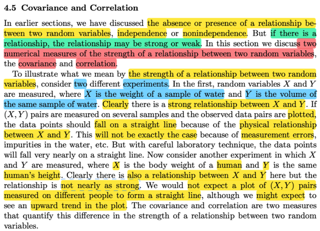</kbd></p>

> [!NOTE]
> Đại khái là ở đây nói rằng ở những phần trước ta đã nói về việc có hay
> không việc hai random variable có quan hệ với nhau, thể hiện qua khái niệm
> chúng independent hay không.
>
> Thế thì nếu như có quan hệ, thì sự quan hệ này cũng mạnh yếu khác nhau.
> Nên phần này ta bàn về hai thước đo của độ mạnh yếu này.Đó chính là
> covariance và correlation.
>
> Thế thì gs đề nghị ta tưởng tưỡng hai thí nghiệm. 1) Lấy ngẫu nhiên một
> sample là mẫu nước và ghi nhận thể tích (X) cũng như khối lượng của nó
> (Y). Thế thì rõ ràng rằng ta có thể expect rằng nếu như nước là tinh khiết, và
> việc lấy mẫu ko có sai sót thì khả năng cao là khi vẽ chúng lên đồ thị 2D thì
> chúng sẽ nằm trên đường thẳng, đơn giản là và quan hệ giữa khối lượng và
> thể tích của một khối nước sẽ tuân theo ràng buộc vật lí (khối lượng `=` thể
> tích  * khối lương riêng (constant)
>
> Trong khi đó nếu X là chiều cao một người được chọn ngẫu nhiên và Y là
> khối lượng của họ, thì dì ta  sẽ vẫn expect có quan hệ nào đó nhưng sẽ ko
> thể là tuyến tính được

<br>

<a id="node-279"></a>

<p align="center"><kbd>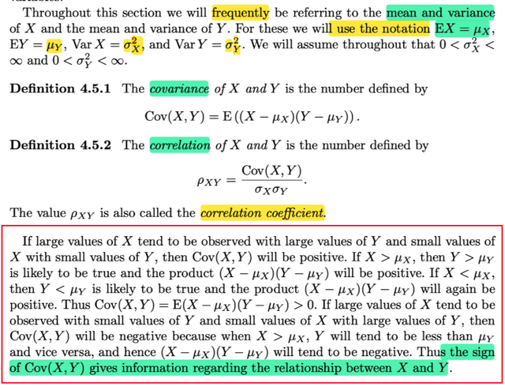</kbd></p>

> [!NOTE]
> ```text
> định nghĩa của covariance và correlation. Cov(X,Y) = E[(X - μX)(Y -μY)]
> ```
> ```text
> và rhoX,Y = Cov(X, Y) / σXσY
> ```
>
> cách hiểu là, nếu X lớn thì thường thường Y cũng lớn, mà X nhỏ thì
> thường Y cũng nhỏ thì correlation của chúng sẽ dương.
>
> ```text
> Vì khi X lớn sẽ (tương đương) X > μX và Y cũng Y > μY ⇨  (X - μX)(X -
> ```
> ```text
> μY) > 0. Tương tự khi X nhỏ , Y nhỏ, tích của (X - μX)(X - μY) là tích hai
> ```
> số âm cũng thành dương.
>
> Ngược lại nếu X lớn mà X có xu hướng nhỏ, thì `Cov(X,Y)` sẽ âm

<br>

<a id="node-280"></a>

<p align="center"><kbd>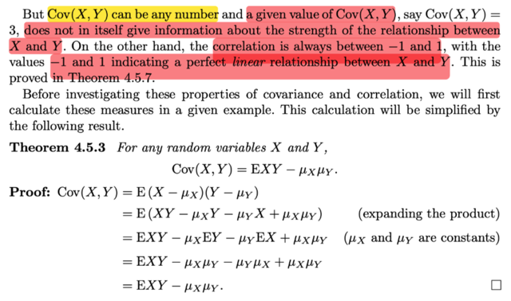</kbd></p>

> [!NOTE]
> đại khái nói là covariance có thể có giá trị lớn bé bất kì. Và bản thân giá trị
> của nó không nói gì về độ mạnh yếu của quan hệ giữa X, Y (dù DẤU CỦA
> COVARIANCE THÌ CÓ)
>
> Nhưng correlation thì CHỈ CÓ GIÁ TRỊ TRONG KHOẢNG `[-1,1]` và giá trị
> cuả nó sẽ báo hiệu độ mạnh yếu của mối quan hệ giữa hai random variable
>
> ```text
> Thế thì ta sẽ có một theorem: Cov(X,Y) = E(XY) - μXμY (ko khó để chứng minh,
> ```
> ```text
> chỉ là triển khai cái E(X-μX)(Y-μY) thôi
> ```

<br>

<a id="node-281"></a>

<p align="center"><kbd>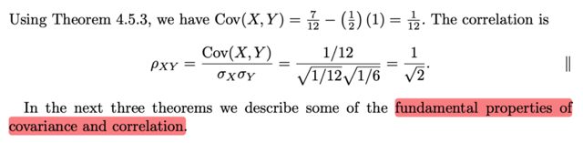</kbd></p>

<p align="center"><kbd></kbd></p>

<p align="center"><kbd>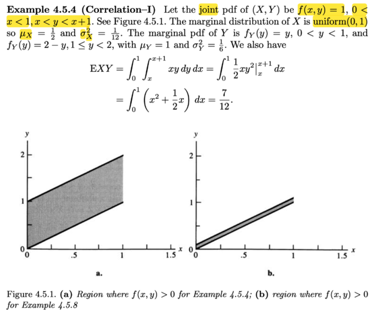</kbd></p>

> [!NOTE]
> rồi, ví dụ này, f(x, y) `=` 1, x ∈ (0,1), x < y < x `+` 1
>
> Thử xem tại sao họ nói marginal distribution của X là uniform(0,1)?
>
> Tính fX(x) bằng cách marginalizing joint pdf:
>
> fX(x) `=` `∫x:` `x+1` fX,Y(x,y) dy
>
> ```text
> = ∫x: x+1 1 dy = y | x: x+1 = x + 1 - x = 1
> ```
>
> ```text
> ⇨ X ~ uniform(0,1)/ Vì uniform (a,b) có pdf = 1/(b-a) khi x ∈ (a,b)
> ```
>
> ⇨ uniform (0,1) có pdf là `1/(1-0)` `=` 1 khi x ∈ (0,1)
>
> Còn marginalizing over x ta có marginal pdf của Y:
>
> x ∈ A `=` (0,1) ∩ `(-inf,` y) ∩ `(y-1,` inf)
>
> `-` If y < 0 or `y-1` > 1 ⇔ y < 0 or y > 2 ⇨ A `=` ∅
>
> ```text
> - If 0 < y < 1 ⇨ A = (0, y) ∩ (y-1, 1) = (max(0, y-1), min(1,y))
> ```
>
> fY(y) `=` `∫A` fX,Y(x,y) dx 
>
> `=` x | max(0, `y-1):` min(1,y)
>
> `=` min(1,y) `-` max(0, `y-1)`
>
> Khi 0 < y < 1 ⇨ min(1,y) `=` y, max(0, `y-1)` `=` 0 ⇨ fY(y) `=` y `-` 0 `=` **y**
>
> Khi 1 ≤  y < 2 ⇨ min(1,y) `=` 1, max(0, `y-1)` `=` `y-1` ⇨ fY(y) `=` 1 `-` `(y-1)` `=` **2-y**
>
> Còn khi y < 0 hoặc y > 2 thì như đã nói A rỗng ⇨ tích phân `=` 0 ⇨ fY `=` 0
> **Vậy fY(y) `=` y khi y**∈**(0,1) hoặc bằng `2-y` khi y**∈**[1,2)
>
> Tiếp, ta sẽ tính mean, variance của X, Y:**Với X: `μX` `=` EX `=` `∫0:1` xfX(x)dx `=` `∫0:1` xdx `=` `x^2/2|0:1` `=` `1/2`
>
> ```text
> σX^2 = Var(X) = EX^2 - (EX)^2 = ∫0:1x^2fX(x)dx - (1/2)^2
> ```
>
> ```text
> =  ∫0:1x^2dx - 1/4 =  x^3/3|0:1 - 1/4 = 1/3 - 1/4 = 1/12
> ```
>
> ```text
> Với Y: μY = EY =  ∫0:1 yfY(y)dy + ∫1:2 yfY(y)dy
> ```
>
> ```text
> = ∫0:1 yy dy + ∫1:2 y(2-y)dy
> ```
>
> ```text
> = ∫0:1 y^2 dy + ∫1:2 (2y-y^2)dy
> ```
>
> ```text
> =y^3/3|0:1 + (y^2 - y^3/3)|1:2
> ```
>
> ```text
> =1^3/3 + (2^2 - 2^3/3) - (1^2 - 1^3/3)
> ```
>
> ```text
> =1/3 + (4 - 8/3) - (1 - 1/3)
> ```
>
> ```text
> =1/3 + 4 - 8/3 - 1 + 1/3
> ```
>
> `=2/3` `+` 3 `-` `8/3` `=2/3` `+` `9/3` `-` `8/3` `=` `3/3` `=` **1**
>
> ```text
> σY^2 = Var(Y) =EX^2 - (EX)^2 =  ∫0:1 y^2fY(y)dy + ∫1:2 y^2fY(y)dy - 1
> ```
>
> ...
> `=` `1/6`
>
> `====`
>
> ```text
> EXY = ∫0:1 ∫x:x+1 xyfX,Y(x,y)dxdy | 2D lotus
> ```
>
> ```text
> = ∫0:1 ∫x:x+1 xy dx dy
> ```
>
> ```text
> = ∫0:1 ∫x:x+1 xy dy dx
> ```
>
> ```text
> = ∫0:1 x ∫x:x+1 y dy dx
> ```
>
> ```text
> = ∫0:1 x (y^2/2|x:x+1) dx
> ```
>
> ```text
> = ∫0:1 x [(x+1)^2/2 - x^2/2] dx
> ```
>
> ```text
> = ∫0:1 x [x^2+2x + 1 - x^2]/2 dx
> ```
>
> ```text
> = (1/2)∫0:1 x (2x + 1) dx
> ```
>
> ```text
> = (1/2)∫0:1 (2x^2 + x) dx
> ```
>
> ```text
> = (1/2) (2x^3/3 + x^2/2)|0:1
> ```
>
> ```text
> = (1/2) (2*1^3/3 + 1^2/2)
> ```
>
> ```text
> = (1/2) (2/3 + 1/2)
> ```
>
> ```text
> = (1/2) (4/6 + 3/6) = 7/12
> ```
>
> `====`
>
> ```text
> Thế vào công thức covariance EXY - μXμY = 1/12 và Cor(X,Y) = 1/√2
> ```

<br>

<a id="node-282"></a>

<p align="center"><kbd>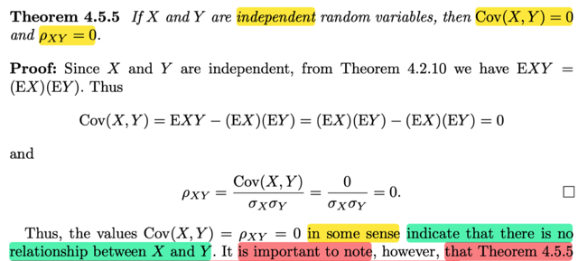</kbd></p>

🔗 **Related:** [5.3 SAMPLING FROM THE NORMAL DISTRIBUTION](53_sampling_from_the_normal_distribution.md#node-363)

> [!NOTE]
> Qua một theorem: Nói rằng nếu X, Y độc lập thì `Cov(X,` Y) `=` 0 và Corr(X,Y) `=` 0
>
> Chứng minh như sau:
>
> Ta bắt đầu với `E(XY):` Theo 2D lotus, giả sử đang xét continuous rvs:
>
> EXY `=` `∫∫xyfX,Y(x,y)dxdy` (limit tích phân từ `-inf,` inf)
>
> Vì X, Y independent ⇨ fX,Y(x,y) `=` fX(x)fY(y)
>
> ```text
> ⇨ EXY = ∫∫xyfX(x)fY(y)dxdy = ∫[∫xyfX(x)fY(y)dx]dy
> ```
>
> `=` `∫yfY(y)` `[∫xfX(x)dx]` dy  | đưa term ko liên quan đến x ra tích phân của x
>
> ```text
> = ∫xfX(x)dx ∫yfY(y)dy | đưa ∫xfX(x)dx ko liên quan đến y ra khỏi tích phân của y
> ```
>
> `=` EX EY | hai tích phân này chính là EX và EY
>
> Vậy EXY `=` EXEY ⇨ EXY `-` EXEY `=` 0
>
> ⇔ `Cov(X,Y)` `=` 0 ⇨ Corr(X,Y) `=` 0
>
> GIÁO SƯ CASELLA LƯU Ý THEOREM NÀY KO HỀ NÓI VỀ CHIỀU NGƯỢC 
> LẠI, TỨC NẾU COV `=` 0 CHƯA CHẮC X, Y ĐỘC LẬP

<br>

<a id="node-283"></a>

<p align="center"><kbd>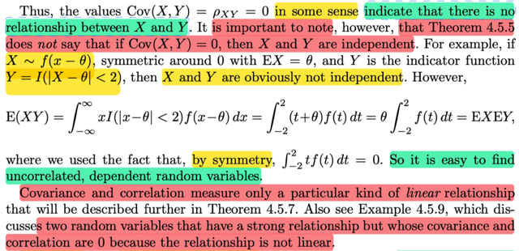</kbd></p>

> [!NOTE]
> QUAY LẠI SAU,. đại khái là cho thấy một ví dụ để minh họa rằng hay rv X, Y
> có EXY `=` EX EY (tức covariance `=` 0) nhưng chúng ko độc lập
>
> VÀ MỘT ĐIỂM QUAN TRỌNG LÀ COVARIANCE, VÀ CORRELATION CHỈ
> ĐO ĐẾM  MỨC ĐỘ QUAN HỆ TUYẾN TÍNH CỦA HAI RVS
>
> CHO NÊN CÓ KHI HAI RANDOM VARIABLE QUAN HỆ MẠNH VỚI NHAU
> NHƯNG KHÔNG TUYẾN TÍNH THÌ COVARIANCE VẪN `=` 0.

<br>

<a id="node-284"></a>

<p align="center"><kbd>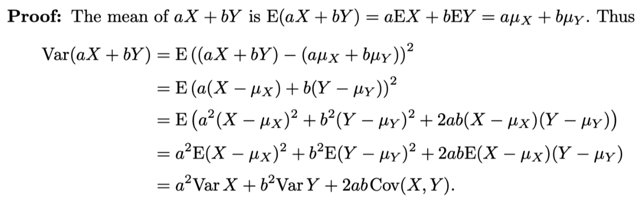</kbd></p>

<p align="center"><kbd></kbd></p>

<p align="center"><kbd>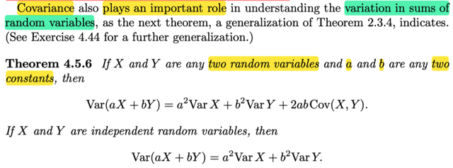</kbd></p>

> [!NOTE]
> Một theorem (đã gặp trong stat110): Cho X, Y và hai constant a, b:
>
> ```text
> Var(aX + bY) = a^2VarX + b^2VarY + 2abCov(X,Y)
> ```
>
> Chứng minh 
>
> ```text
> Var(aX + bY) , áp dụng công thức thứ 1 của Var: VarX = E[X - EX]^2
> ```
>
> Ở đây coi rv là aX `+` bY, mean của nó dễ thấy chính là aEX `+` bEY
> ```text
> (linearity) = aμX + bμY
> ```
>
> ```text
> ⇨ Var(aX + bY) = E[(aX + bY) - (aμX + bμY)]^2
> ```
>
> ```text
> = E[(aX + bY)^2 + (aμX + bμY)^2 - 2(aX + bY)(aμX + bμY)] | khai triển ra
> ```
>
> ```text
> = E[(a^2X^2 + b^2Y^2 + 2abXY + a^2μX^2 + b^2μY^2 + 2abμXμY  - 2(a^2XμX + baYμX + abXμY + b^2YμY)]
> ```
>
> ```text
> = E[a^2X^2 + b^2Y^2 + 2abXY + a^2μX^2 + b^2μY^2 + 2abμXμY  - 2a^2XμX - 2baYμX - 2abXμY - 2b^2YμY]
> ```
>
> ```text
> = E[(a^2X^2 - 2a^2XμX + a^2μX^2) + (b^2Y^2 - 2b^2YμY + b^2μY^2) + 2abXY - 2abXμY + 2abμXμY - 2baYμX ]
> ```
>
> ```text
> = E[a^2(X^2 - 2XμX + μX^2) + b^2(Y^2 - 2YμY + μY^2) + 2abX(Y - μY) - 2abμX(Y - μY)]
> ```
>
> ```text
> = E[a^2(X - μX)^2 + b^2(Y - μY)^2 + 2ab(X - μX)(Y - μY)]
> ```
>
> ```text
> = E[a^2(X - μX)^2] + E[b^2(Y - μY)^2] + E[2ab(X - μX)(Y - μY)]
> ```
>
> ```text
> = a^2E[(X - μX)^2] + b^2E[(Y - μY)^2] + 2abE[(X - μX)(Y - μY)]
> ```
>
> **= a^2VarX `+` b^2VarY `+` 2abCov(X,Y)
>
> Khi X, Y độc lập thì `Cov(X,Y)` `=` 0 ⇨ `Var(aX` `+` bY) `=` a^2VarX `+` b^2VarY**

<br>

<a id="node-285"></a>

<p align="center"><kbd>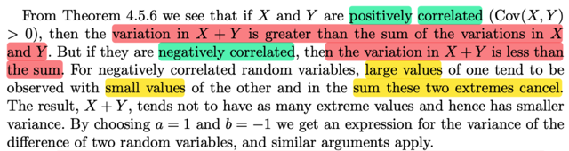</kbd></p>

> [!NOTE]
> Vậy theorem này, mà mình đã tự chứng minh để thấy kết quả:
>
> ```text
> Var(aX + bY) = a^2VarX + b^2VarY + 2abCov(X,Y)
> ```
>
> Cho thấy: nếu X,Y độc lập thì variance của tổng (hai rv) `=` tổng variance của
> hai rv
>
> Nhưng nếu chúng POSITIVE CORRELATED (TỨC `Cov(X,Y)` > 0 thì dể thấy
> Variance của tổng hai rv sẽ LỚN HƠN tổng variance của từng cái
>
> Ngược lại, nếu chúng NEGATIVE CORRELATED, tức `Cov(X,Y)` < 0 thì
> Variance của tổng hai rv sẽ NHỎ HƠN tổng variance của từng cái
>
> Lí dễ hiểu là khi hai thằng có xu hướng cùng lớn thì tổng của nó sẽ lớn hơn
> nữa khiến mức biến động của tổng sẽ bị khuếch đại. Còn khi hai thằng mà
> một thằng lớn thì thằng kia nhỏ thì kiểu như bù trừ nhau làm giảm mức biến
> động

<br>

<a id="node-286"></a>

<p align="center"><kbd>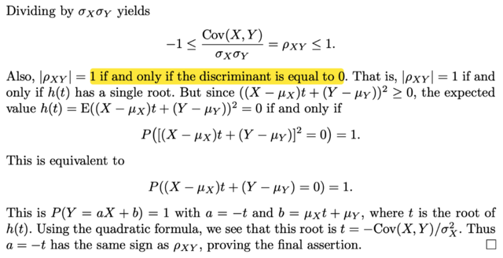</kbd></p>

<p align="center"><kbd></kbd></p>

<p align="center"><kbd>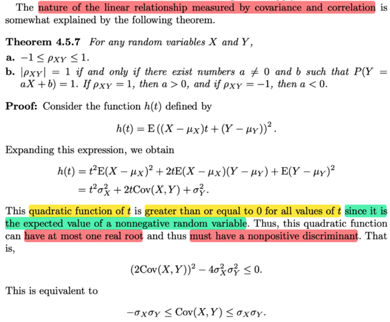</kbd></p>

> [!NOTE]
> Theorem này , phần 1 nói giá trị của correlation luôn nằm trong `[-1,1]`
> chứng minh thật là hay.
>
> ```text
> Ta sẽ xét hàm h(t) = E[(X - μX)t + (Y - μY)]^2
> ```
>
> ```text
> = E[(X - μX)^2t^2 + (Y - μY)^2 + 2t(X - μX)(Y - μY)]
> ```
>
> ```text
> = E[(X - μX)^2t^2] + E[(Y - μY)^2] + 2tE(X - μX)(Y - μY)
> ```
>
> ```text
> = t^2E[(X - μX)^2] + E[(Y - μY)^2] + 2tE(X - μX)(Y - μY)
> ```
>
> ```text
> = t^2 σX^2 + σY^2 + 2tCov(X, Y)
> ```
>
> Đến đây ko có gì khó, thế thì bản chất hàm h(t) là expected value của
> ```text
> một random variable Z = f(X,Y) = [(X - μX)t + (Y - μY)]^2, và nó luôn ko
> ```
> âm với mọi X, Y, t, nên mọi possible của Z luôn ko âm ⇨ EZ ≥ 0
>
> ⇨ h(t) ≥ 0 với mọi t
>
> Mà, đây là hàm số bậc 2, nếu xét phương trình bậc 2: 
>
> ```text
> t^2 σX^2 + σY^2 + 2tCov(X, Y) = 0
> ```
>
> thì vì hàm số này luôn ko âm, nên nghiệm của phương trình trên (tức
> x khiến hàm số `=` 0) chỉ có thể có nhiều nhất là một nghiệm
>
> Do đó, với phương trình ax^2 `+` bx `+` c `=` 0 thì khi tìm nghiệm ta 
> sẽ xét discriminant, b^2 `-` 4ac, và nếu nó `=` 0 thì phương trình có 
> nghiệm duy nhất, > 0 thì có 2 nghiệm phân biệt và < 0 thì vô nghiệm
>
> Vậy ở case này b^2 `-` 4ac phải ≤ 0 để thể hiện nhiều nhất là 1 nghiệm
>
> ⇨ đó chính là [2Cov(X,Y)]^2 `-` `4σX^2σY^2` ≤ 0
>
> ⇔ 4Cov(X,Y)^2 ≤ `4σX^2σY^2`
>
> ⇔ `Cov(X,Y)^2` ≤ `σX^2σY^2`
>
> ⇔ **-σXσY ≤ `Cov(X,Y)` ≤ `σXσY`
>
> Chia các vế cho `σXσY` ko âm là chứng minh xong
>
> ```text
> ⇔ -1 ≤ Cov(X,Y) / σXσY ≤ 1
> ```
>
> ⇔ `-1` ≤ Cor(X,Y) ≤ 1
>
> Đó là chứng minh xong ý 1**Tiếp tục, ta thấy |Cor(X,Y)| `=` 1 tức là dấu bằng ở trên xảy ra tức cũng
> ```text
> là b^2 = 4ac, hay h(t) = E[(X - μX)t + (Y - μY)]^2 = 0
> ```
>
> ```text
> Mà đã nói ở trên h(t) là expected value của một rv là [(X - μX)t + (Y - μY)]^2
> ```
> không âm nên expected value của nó bằng 0 khi và chỉ khi nó chỉ có một
> possible value là 0 (nhưng như vậy thì nó ko phải là random varialbe) 
> hoặc nó có nhiều possible value nhưng mọi xác suất tức trọng số gắn với
> các possible value khác 0 đó đều bằng 0, đồng nghĩa xác suất rv này có
> possible value là 0 sẽ phải bằng 1.
>
> ```text
> ⇨ P([(X - μX)t + (Y - μY)]^2=0) = 1
> ```
>
> ```text
> Và bởi vì event [(X - μX)t + (Y - μY)]^2 = 0 ko khó để thấy nó cũng là event
> ```
> ```text
> [(X - μX)t + (Y - μY)] = 0
> ```
>
> ```text
> ⇨ P((X - μX)t + (Y - μY) = 0) = 1
> ```
>
> ```text
> ⇔ P(Xt - μXt + Y - μY = 0) = 1
> ```
>
> ```text
> ⇔ P(Y = -Xt + μXt  + μY) = 1
> ```
>
> ```text
> Và như vậy tồn tại a, b sao cho Y = aX + b với , chính là a = -t, b = μXt  + μY
> ```
> chứng minh xong ý 2

<br>

<a id="node-287"></a>

<p align="center"><kbd>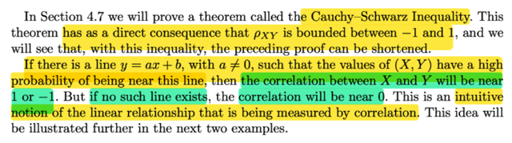</kbd></p>

> [!NOTE]
> Và một ý quan trọng là,nếu tồn tại đường thẳng y `=` ax `+` b với a khác 0
> sao cho các giá trị của X, Y có xác suát cao nằm gần đường này thì khi đó
> correlation giữa X và Y sẽ gần với 1 và `-1`
>
> Còn khi không tồn tại đường thẳng như vậy thì Cor(X, Y) `=` 0
>
> Mình nghĩ: Vừa rồi ý hai của theorem nói rằng Cor(X,Y) `=` 1 hoặc `-1` khi và
> chỉ khi tồn tại cặp a, b sao cho ta có Y `=` aX `+` b. Vậy thì dễ hiểu là khi tồn
> tại a, b như vậy thì nếu biết giá trị của random variable này thì ta sẽ biết
> ngay giá trị của random variable kia thônq quan quan hệ tuyến tính.

<br>

<a id="node-288"></a>

<p align="center"><kbd>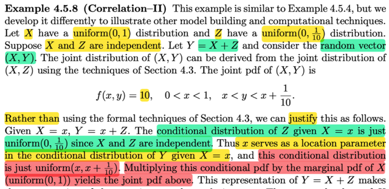</kbd></p>

> [!NOTE]
> Rồi, ví dụ này, đại khái là cho X ~ uniform(0,1). Z ~ uniform(0, `1/10)` X, Z
> độc lập, Y `=` X `+` Z. và ta quan tâm random variable vector (X, Y)
>
> Gs nói nhờ 4.3 ta có thể biết joint pdf của (X, Y): Thử làm xem:
>
> Xây dựng joint pdf của X,Y, ta sẽ đổi kí hiệu chút cho quen thuộc:
>
> Coi như đây là ta có X~Unif(0,1), `Y~Unif(0,1/1);` cần tìm joint pdf của U,
> ```text
> V: với U = g1(X, Y) = X; V = g2(X, Y) = X + Y
> ```
>
> Lập luận như vầy, đầu tiên là dựa vào điều này trước:
>
> Nếu A là tiền ảnh của B: A `=` {(x,y) ∈ R^2: (g1(x,y), g2(x,y)) ∈ B} thì P((X,
> Y) ∈ A) `=` P((U,V) ∈ B)
>
> Tiếp, ta sẽ xác định support set của X,Y `A_curly:` Với distribution đã biết
> của X, Y, thì `A_curly` `=` {(x,y) ∈ R^2: 0 ≤ x ≤ 1; 0 ≤ y ≤ `1/10}`
>
> ```text
> Ảnh của A_curly: B_curly = {(u,v): u = g1(x,y), v=g2(x,y), (x,y) ∈ A_curly}
> ```
>
> Được xác định như sau: X ∈ (0,1) ⇨ U `=` X cũng ∈ (0,1)
>
> ```text
> Y ∈ (0, 1/10) ⇨ V = X + Y ∈ (0, 1/10 + u)
> ```
>
> ```text
> ⇨ B_curly = {0 ≤ u ≤ 1, 0 ≤ v ≤ 1/10 + u}
> ```
>
> Câu hỏi đặt ra: mapping từ `A_curly` → `B_curly` có `1-1` không?
>
> ⇨ Có.
>
> Do đó áp dụng transformation theorem:
>
> fU,V(u,v) `=` `fX,Y(x,y)|∂(x,y)/∂(u,v)|`
>
> ```text
> ∂(x,y)/∂(u,v) = [∂x/∂u ∂x/∂v ; ∂y/∂u ∂y/∂v]
> ```
>
> `=` [1 0; 0 1] ⇨ det `=` 1
>
> ```text
> fX,Y(x,y) = fX(x)fY(y) = 1/(1-0) * 1/(1/10 - 0) = 1 * 10 = 10
> ```
>
> ⇨ fU,V(u,v) `=` 10 ; 0 ≤ u ≤ 1, 0 ≤ v ≤ `1/10` `+` u
>
> Thay U vởi X , V bởi Y. (bởi mình đang dùng các kí hiệu U `=` g1(X,Y) V
> `=` g2(X,Y) cho giống với những gì làm ở 4.3)
>
> ⇨ **fX,Y(x,y) `=` 10 ; 0 < x < 1, 0 < y < `1/10` `+` x** 
>
> **ĐÂY LÀ KẾT QUẢ TRONG SÁCH**

> [!NOTE]
> Vậy thì ở đây đại khái nói là ta có thể lập luận kiểu khác để cho ra joint pdf
> của X,Y như trên:
>
> Hướng làm là ta sẽ lập luận để có conditional của Y given `X=x,` tức fY|X(y|x)
> và sau đó áp dụng fX,Y(x,y) `=` fY|X(y|x)fX(x) để xây dựng joint pdf của X,Y
>
> Thế thì Y `=` Z `+` X nên tìm distribution của Y given X chính là tìm distribution
> của `(X+Z)` given X
>
> Với giá trị đã biết x của X, thì:
>
> Y `=` Z `+` x, nên conditional distribution của Y given X `=` x  là distribution của (Z
> `+` x) | x
>
> cũng sẽ là [condition distribution của Z] `+` x: Z|x `+` x
>
> Vì X, và Z độc lập, nên dù với giá trị cụ thể x nào của X thì conditional pdf
> của Z given `X=x,` vẫn chỉ là marginal pdf của Z, thể hiển toán học bởi
>
> fZ|X(z|x) `=` fZ(z), ⇨ fZ|x(z|x) `=` fZ(z)
>
> Nói cách khác là Z|X vẫn là `uniform(0,1/10)` random variable
>
> Vậy [conditional distribution của Y given X `=` x] bằng [marginal distribution
> của Z] `+` x
>
> Thể hiện bởi Y|x `=` Z `+` x
>
> Mà theo một theorem đã nói ở chap 3: (theorem 3.5.6)
>
> ```text
> Z là rv ~ f(z) ⇔ X = σZ + μ có pdf ~ fX(x) = f[(x - μ)/σ] / σ
> ```
>
> ```text
> Nói bằng lời là nếu Z có pdf f(z) thì X = σZ + μ sẽ có pdf fX(x) = [f(x - μ)/σ]/σ
> ```
>
> ```text
> Ngược lại nếu X = σZ + μ và nó có pdf fX(x) = [f(x - μ)/σ]/σ thì Z sẽ có pdf là
> ```
> f(z)
>
> `====`
>
> ```text
> Vậy ở đây ta có Z có pdf là fZ(z) = 10, 0 < z < 1/19, thì với Y|x = Z + x, (với x
> ```
> fixed,  đóng vai  trò như hằng số `μ)`
>
> thì Y|x sẽ có pdf là fY|x(y|x) `=` fZ(y `-` x)
>
> ```text
> = 10, với 0 < y - x < 1/10 ⇔ 0 < y - x < 1/10 ⇔ x < y < x + 1/10
> ```
>
> ```text
> Vậy fY|x(y|x) = 10 với x < y < x + 1/10 đủ để ta kết luận Y|x ~ Uniform(x, x +
> ```
> `1/10)`
>
> Tiếp theo, áp dụng fX,Y(x,y) `=` fY|X(y|x) fX(x)
>
> với fX(x) là marginal pdf của X ~ uniform(0,1), `=` 1, 0 < x < 1
>
> ⇨ **fX,Y(x,y) `=` 10*1, 0 < x < 1; x < y < x `+` 1/10**
>
> **KẾT QỦA NÀY Y CHANG CÁI TA CÓ KHI DERIVE BẰNG CÁCH LÀM CỦA
> CHAP 3 Ở TRÊN**

> [!NOTE]
> Viết gọn lại dùng toán thôi sẽ là:
>
> (ta muốn tìm) fY|X(y|x):
>
> vì Y `=` Z `+` X, nên
>
> ... `=` `fZ+X|X(y|x)`
>
> Vì biết `X=x` nên fZ+**X**|X(y|x) `=` fZ+**x**|X(y|x) (THAY ..+**X**|.. BỞI +**x**|..)
>
> QUAN TRỌNG Ta sẽ không thay fZ+X|**X**(..)  thành fZ+x|**x**(..) vì CHỨC
> NĂNG NÓ KHÁC, vốn dĩ trong kí hiệu `fZ+x|X` là đang ám chỉ conditional pdf
> dựa  trên X của Z `+` x
>
> Ta có `fZ+X|X(y|x)` `=` `fZ+x|X(y|x)`
>
> Vì Z độc lập X ⇨ Z `+` constant `μ` cũng độc lập X nên ta sẽ bỏ các kí hiệu "
> condition on X" (|X và (..|x)
>
> ⇨ fZ+μ**|X**(y**|x**) `=` `fZ+μ(y)`
>
> Vai trò của x trong kí hiệu `fZ+x|X(...)` cũng như `μ,` là constant, nên Z `+`
> constant x cũng độc lập X nên ta cũng làm tương tự
>
> ⇨ `fZ+x|X(y|x)` `=` `fZ+x(y)`
>
> Tới đây ta có `fZ+x(y)`
>
> ```text
> Dùng theorem Z ~ fZ(z) ⇔ X = σZ + μ ~ fX(x) = (1/σ) fZ[(x - μ) / σ]
> ```
>
> `=` `fZ(y-x)`
>
> Tới đây thay công thức fZ vào, ...phần còn lại thì như trên

<br>

<a id="node-289"></a>

<p align="center"><kbd>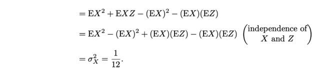</kbd></p>

<p align="center"><kbd></kbd></p>

<p align="center"><kbd>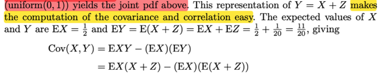</kbd></p>

> [!NOTE]
> Tiếp theo ta sẽ tính `Cov(X,` Y) đại ý là với Y `=` Z `+` X thì tính cái này dễ thôi
>
> ```text
> Ôn lại tý Cov(X,Y) có công thức thứ nhất là E[(X - EX)(Y - EY)] và triển khai ra
> ```
> ta sẽ có công thức thứ hai: `E(XY)` `-` EXEY
>
> ```text
> = E[X(X + Z)] - EXE(X + Z)
> ```
>
> ```text
> = E(X^2 + XZ) - EX(EX + EZ)
> ```
>
> ```text
> = E(X^2) + E(XZ) - (EX)^2 - EXEZ
> ```
>
> Tới đây xét `E(XZ):`
>
> 2D LOTUS `=` `∫∫` xz fX,Z(x,z)dxdz (tích phân trên toàn R^2)
>
> `=` `∫∫xzfX(x)fZ(z)dxdz` | do X,Z độc lập, joint pdf `=` tích marginal pdf
>
> `=` `∫∫[xfX(x)zfZ(z)dx]dz` | đổi chỗ, 
>
> `∫zfZ(z)dz` `∫xfX(x)dx` | đưa zfZ(z)dz ko phụ thuộc x ra ngoài tích phân của x
>
> ```text
> = ∫xfX(x)dx ∫zfZ(z)dz | đưa kết qủa ∫xfX(x)dx ra ngoài tích phân theo z
> ```
>
> Đây chính là
>
> `=` EX EZ 
>
> ```text
> ⇨ ... = E(X^2) + EXEZ - (EX)^2 - EXEZ
> ```
>
> ```text
> = EX^2 - (EX)^2 = Var(X) và đã tính lúc trước = 1/12
> ```

<br>

<a id="node-290"></a>

<p align="center"><kbd>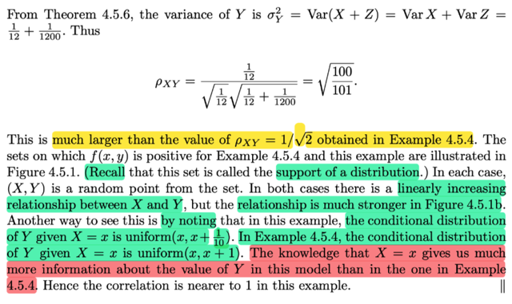</kbd></p>

<p align="center"><kbd></kbd></p>

<p align="center"><kbd>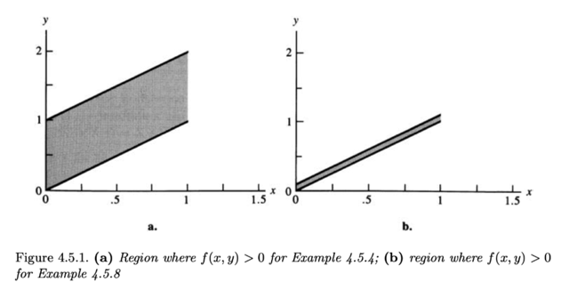</kbd></p>

> [!NOTE]
> Rồi, khi đã có `Var(X).`
>
> ```text
> Ta sẽ tính Var(Y) = Var(X + Z)
> ```
>
> Thì áp dụng theorem 4.5.6 nói rằng:
>
> ```text
> Var(aX + bY) = a^2Var(X) + b^2Var(Y) + 2abCov(X, Y)
> ```
>
> Và với X, Y độc lập thì `Cov(X,` Y) `=` 0
>
> ```text
> ⇨ Var(Y) = Var(X + Z) = Var(X) + Var(Z) = 1/12 + 1/1200
> ```
>
> ```text
> Từ đó áp dụng tính Cor(X,Y) = Cov(X,Y)/Var(X)Var(Y)
> ```
>
> `=` `√100/101`
>
> Thì ý chính là thế này: Ở cái ví dụ bữa trước, đã nói về một cái X,Y có
> marginal distribution của X cũng là uniform(0,1) và của Y cũng là ...
>
> Nhưng khi đó tính ra Corr(X,Y) nhỏ hơn cái này.
>
> Ở đây, cũng vậy mà Corr(X,Y) lại lớn
>
> Lí do là cách đặt bài toán lần này khác, bằng cách cho Y `=` Z `+` X
>
> người ta đã tạo nên một quan hệ có xu hướng tuyến tính rõ ràng hơn
> giữa X, Y
>
> Lần trước, conditional distribution của `Y|X=x` là `uniform(x,x+1)`
>
> Vì sao? Lần trước, trong ví dụ 4.5.4 người ta có joint pdf fX,Y `=` 1 với 0 <
> x < 1 và x < y < x `+` 1
>
> fY|X fX `=` fX,Y ⇨ fY|X `=` fX,Y `/` fX
>
> Marginal distribution cuả Y: fX(y) `=` 1, 0 < x < 1
>
> Joint distribution của X, Y: fX,Y(x,y) `=` 1, 0 < x < 1, x < y < x `+` 1
>
> ⇨ fY|X(y|x) `=` 1, 0 < x < 1, x < y < x `+` 1
>
> ⇨ biết x thì fY|X(y|x) `=` 1, x < y < x `+` 1 thì suy ra Y|x ~ Uniform(x, `x+1)`
>
> Còn lần này, ví dụ 4.5.8, thì như ta đã biết conditional distribution của
> Y|x là  uniform(x, x `+1/10)`
>
> Cho nên kiểu như khi biến giá trị của X, thì giá trị của Y ở lần sau nó
> trong phạm vi hẹp hơn, dễ đoán hơn.
>
> Thể hiện trong hình là support set của fX,Y ở lần trước và lần này. Thì có
> thể thấy một mối quan hệ giữa X, Y có xu hướng tuyến tính nhưng cái
> hình của lần trước có bề dày lớn hơn, mang ý nghĩa là nếu biết giá trị
> của X thì ta cũng  chỉ có thể áng chừng giá trị của Y nhưng phạm vi
> rộng, thể hiện sự ko chắc  Versus lần này, khi với giá trị đã biết của X thì
> giá trị của Y có thể được ước đoán trong phạm vi hẹp hơn thể hiện sự
> chắc chắn cao hơn.

<br>

<a id="node-291"></a>

<p align="center"><kbd>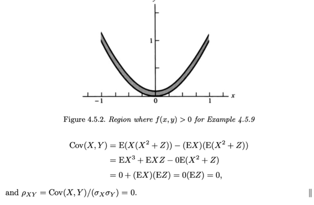</kbd></p>

<p align="center"><kbd></kbd></p>

<p align="center"><kbd>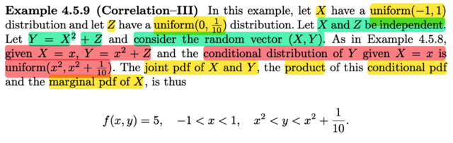</kbd></p>

> [!NOTE]
> Rồi, qua ví dụ này, đại khái là sẽ minh hoạ một một case mà quan hệ của
> X,Y rất mạnh, nhưng vì là quan hệ Φ tuyến nên correlation của chúng lại
> nhỏ. Cho thấy rằng correlation chỉ thể hiện độ mạnh yếu trong quan hệ 
> TUYẾN TÍNH của random variable thôi
>
> Cũng cho X ~ `uniform(-1,` 1) Z ~ uniform(0, `1/10),` X , Z độc lập
>
> Và Y `=` X^2 `+` Z
>
> Thế thì lập luận tương tự ta có thể có `Y|X=x` ~ uniform(x^2, x^2 `+` `1/10)`
>
> fY|X(y|x) `=` `fX^2+Z|X(y|x)`
>
> Biết `X=x` ⇨ .. `=` `fx^2+Z|X(y|x)`
>
> Vì Z độc lập X nên Z `+` x^2 cũng độc lập X
>
> ⇨ `...fx^2+Z|X(y|x)` `=` `fx^2+Z(y)`
>
> Áp dụng theorem:
>
> ```text
> Z ~ fZ(z) ⇔ X = σZ + μ ~ (1/σ) fZ[(x - μ)/σ]
> ```
>
> ```text
> ⇨ fZ+x^2(y) = f1*Z+x^2 = (1/1) fZ[(y - x^2)/1]
> ```
>
> ```text
> = fZ(y - x^2) = 10, 0 < y - x^2 <1/10 ⇔ x^2 < y < x^2 + 1/10
> ```
>
> ⇨ Y|x ~ uniform(x^2, x^2 `+` `1/10)`
>
> `====`
>
> Từ đó ta có thể có joint pdf: fX,Y(x,y) `=` fY|X(y|x)fX(x)
>
> ```text
> = 10 * 1/2 = 5, x^2 < y < x^2 + 1/10, -1 < x < 1
> ```
>
> Tính thử `Cov(X,Y):`
>
> `Cov(X,Y)` `=` EXEY `-` EXY
>
> ```text
> = EX E(X^2 + Z) - EX(X^2 + Z)
> ```
>
> ```text
> = EX (EX^2 + EZ) - E(X^3 + XZ)
> ```
>
> ```text
> = EXEX^2 + EXEZ - E(X^3) - E(XZ)
> ```
>
> ```text
> = 0EX^2 + EXEZ - 0 - E(XZ) | do X ~unif(-1,1) ⇨ dễ tính ra EX = 0
> ```
>
> ```text
> =EXEZ - E(XZ) = EXEZ - EXEZ = 0, do X,Z độc lập nên EXZ = EXEZ
> ```
>
> ```text
> ⇨ Corr(X,Y) = Cov(X,Y) / Var(X)Var(Y) =  0
> ```
>
> Thế thì đại khái là support set của X,Y có dạng một dải parabol, tức là
> giá trị của X, Y tập trung quanh parabol, cho thấy quan hệ của nó rất
> mạnh với nhau. Tuy nhiên khi correlation lại là 0

<br>

<a id="node-292"></a>

<p align="center"><kbd>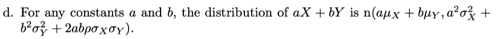</kbd></p>

<p align="center"><kbd></kbd></p>

<p align="center"><kbd>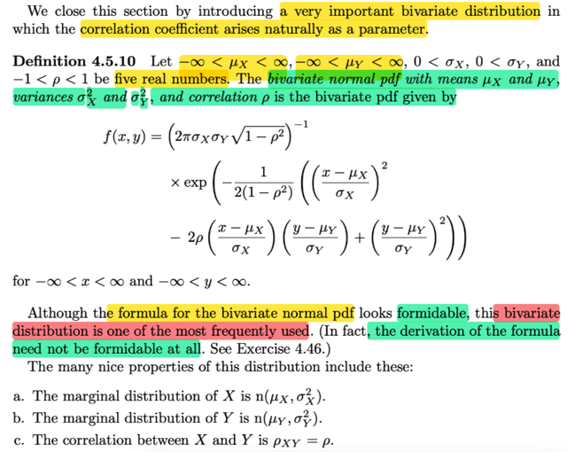</kbd></p>

> [!NOTE]
> QUAY LẠI SAU

<br>

<a id="node-293"></a>

<p align="center"><kbd>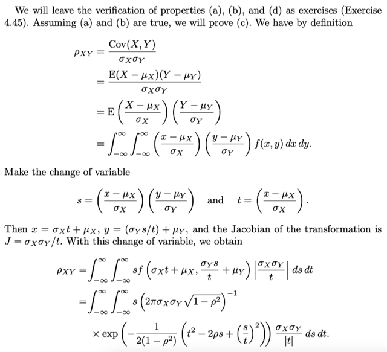</kbd></p>

> [!NOTE]
> QUAY LẠI SAU

<br>

<a id="node-294"></a>

<p align="center"><kbd>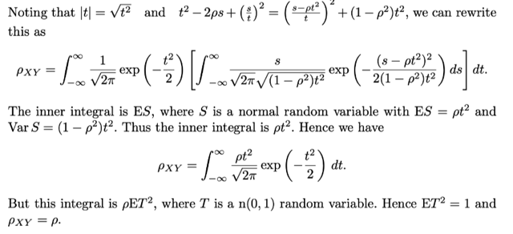</kbd></p>

> [!NOTE]
> QUAY LẠI SAU

<br>

<a id="node-295"></a>

<p align="center"><kbd>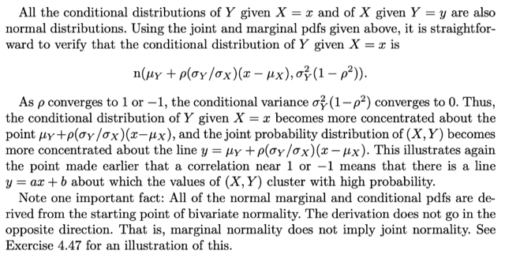</kbd></p>

> [!NOTE]
> QUAY LẠI SAU

<br>

