# 4.6 Multi-variate Distribution

📊 **Progress:** `24` Notes | `33` Screenshots

---

<kbd>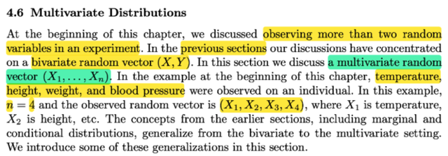</kbd>

> [!NOTE]
> Đại khái là đầu chương ta đã nói về việc khi lấy mẫu / chọn ngẫu nhiên 
> một người, thì ta có thể có 4 chỉ số chiều cao, cân năng, nhiệt độ và
> huyết áp. Nên ta sẽ mở rộng bivariate random vector sang multivariate
>
> **X** = (X1, X2, X3, X4)

 

<kbd>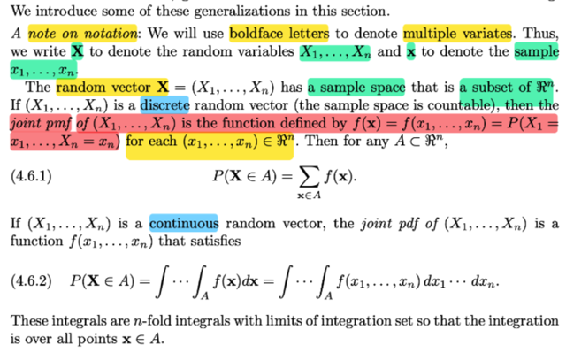</kbd>

> [!NOTE]
> Khái quát hơn, ta có multivariate random vector **X**= (X1, ...Xn).
>
> với **x**= (x1,...xn) là một sample, tức là một observed value của **X**, (giống như
> possible value x của X vậy)
>
> Tiếp gs nói **X** có sample space là ⊂ của R^n, là sao nhỉ? → Thì đúng rồi, **X**= (X1,
> X2...Xn), bản chất của nó là n function, mapping từ original sample space Ω → R, tức là
> với possible outcome s khác nhau, **x**= **X**(s) sẽ mang các giá trị khác nhau (X1(s),
> X2(s), ...Xn(s)) khác nhau làm thành tập các R^n vector dĩ nhiên là subset của R^n.
>
> Nếu X1, X2,..Xn chỉ có các giá trị rời rạc, thì tức là với các s trong Ω, thông qua **X**, chỉ
> được map với các giá trị rời rạc trong R^n. Do đó tập các possible value **x**của**X, sẽ
> chỉ chứa các vector R^n xi rời rạc, tuy số lượng có thể infinite, nhưng vẫn có tính
> countable.**
>
> Khi đó, ta có định nghĩa của hàm joint pmf của (X1, ...Xn):
>
> f(**x**) = f(x1,x2...xn) = P(X1=x1,...Xn=xn) = P(**X**=**x)**nên từ đó ta có P(**X**∈ A) = Σ**x**∈****A f(**x**). Là sao?
>
> Nhớ lại với univariate case, tức discrete random variable X.
>
> Như đã biết, bản chất cuả nó là function mapping possible outcome s trong original
> sample space Ω và R, trong trường hợp này, sẽ chỉ là nhưng discrete value trong R.
>
> Do đó, tập những possible value của X, sẽ là tập các giá trị rời rạc x1,x2... {X(s) ∈ R: s ∈
> Ω)
>
> Khi đó người ta sẽ định nghĩa pmf fX(x), như sau, giá trị hàm fX tại x sẽ = P(X=x).
>
> Vậy từ đó giả sử ta có A là tập ⊂ R, thì P(X ∈ A) sẽ được tính như thế nào? X ∈ A thực ra
> là đang mô tả tập sau đây: {s ∈ Ω: X(s) ∈ A}
>
> Nên P(X ∈ A) thực ra là P({s ∈ Ω: X(s) ∈ A})
>
> theo định nghĩa của hàm xác suất P, P({s ∈ Ω: X(s) ∈ A}) sẽ tính bằng:
>
> Σ {s ∈ Ω: X(s) ∈ A} P({s})
>
> Có nghĩa là, cái này có bản chất là một tổng, các P({s}) với s nằm trong tập {s ∈ Ω: X(s) ∈
> A}
>
> Thế thì do đó, cơ bản là xem cái tập này có các possible outcome nào. Mà tập này có thể
> viết thế này không thay đổi bản chất:
>
> {s ∈ Ω: X(s) ∈ A} = {s ∈ Ω: X(s) = x, x ∈ A}
>
> ⇨ Σ {s ∈ Ω: X(s) ∈ A} P({s}) có thể viết khác đi chút
>
> = Σ {s ∈ Ω: X(s) = x, x ∈ A} P({s}) (1)
>
> Tiếp, có thể viết khác chút xíu nữa:
>
> = Σ{x ∈ A} Σ {s ∈ Ω: X(s) = x} P({s})
>
> Đến đây thì ta có Σ {s ∈ Ω: X(s) = x} P({s}) = P({s ∈ Ω: X(s) = x}), theo định nghĩa của
> induced probability function PX: Nói rằng PX(X=x) = P({s ∈ Ω: X(s) = x})
>
> Hay có thể ghi là P(X=x), và chính là pmf của X theo định nghĩa của hàm pmf
>
> Từ đó ta có = Σ{x ∈ A} P(X=x) = Σ{x ∈ A} fX(x)
>
> Thế thì tương tự, ta cũng có thể lập luận P(**X**∈****A) = Σ{**x**∈****A} f(**x**)
>
> P(**X** ∈ A) = P({s ∈ Ω: **X**(s) ∈ A}) = Σ{s ∈ Ω: **X**(s) ∈ A} P({s})
>
> = Σ{s ∈ Ω: **X**(s) = **x**,**x**∈****A} P({s})
>
> = Σ{**x**∈****A} Σ{s ∈ Ω: **X**(s) = **x**} P({s})
>
> = Σ{x ∈ A} P(**X**=**x**)

> [!NOTE]
> Nếu X là continuous rv:
>
> Vì ta có định nghĩa của hàm pdf: fX(x) là hàm được định nghĩa như sau:
>
> FX(x) = ∫-inf:x fX(t)dt
>
> với FX(x) là cdf của X, mà bản thân hàm này lại được định nghĩa ( bởi/mang giá trị của)
> P(X ≤ x)
>
> Thế thì, với việc hàm pdf được định nghĩa như vậy, ta sẽ áp dụng FTC1, vốn dĩ nói rằng
> nếu có hàm f và F được định nghĩa bởi quan hệ sau:
>
> F(x) = ∫-inf:x f(t)dt thì F được gọi là nguyên hàm của f, và ta sẽ có:
>
> d/dx F(x) = f(x)
>
> Vậy việc định nghĩa của pdf fX và cdf FX phù hợp với điều này nên ta có:
>
> FX là nguyên hàm của fX: d/dx FX(x) = fX(x)
>
> Và từ đó ta được phép áp dụng FTC2, nói rằng nếu F là nguyên hàm của f thì ∫a:bf(x)dx =
> F(b) - F(a)
>
> Như vậy điều này cho phép ta xét xác suất của event X ∈ (a,b) như sau
>
> (-inf, a] ∪ (a, b] = (-inf, b]
>
> ⇨ {s ∈ Ω: X(s) ∈ (-inf, b]} = {s ∈ Ω: X(s) ∈ [ (-inf, a] ∪ (a, b] ]}
>
> = {s ∈ Ω: X(s) ∈ (-inf, a] OR X(s) ∈ (a, b] }
>
> = {s ∈ Ω: X(s) ∈ (-inf, a]} ∪ {s ∈ Ω: X(s) ∈ (a, b] }
>
> ⇨ P({s ∈ Ω: X(s) ∈ (-inf, b]}) = P[{s ∈ Ω: X(s) ∈ (-inf, a]} ∪ {s ∈ Ω: X(s) ∈ (a, b] }]
>
> ⇔ P({s ∈ Ω: X(s) ∈ (-inf, b]}) = P({s ∈ Ω: X(s) ∈ (-inf, a]}) + P({s ∈ Ω: X(s) ∈ (a, b]})  | axiom
> 3
>
> P(X ∈ (-inf, b]) = P(X ∈ (-inf, a]) + P(X ∈ (a, b])
>
> ⇔ P(X ≤ b) = P(X ≤ a) + P(X ∈ (a, b])
>
> ⇨ P(X ∈ (a, b]) = P(X ≤ b) - P(X ≤ a)
>
> P(X ∈ (a, b]) = FX(b) - FX(a)
>
> ⇨ P(X ∈ (a, b]) = ∫a:b fX(x)dx
>
> ⇨ P(X ∈ A) = ∫A fX(x)dx****Và,****với **X**mang giá trị liên tục ta cũng sẽ có kết quả tương tự:
>
> P(**X** ∈ A) = ∫...∫A f**X**(**x**)d**x**= ∫...∫A f(x1,x2...xn)dx1dx2...dxn

 

<kbd>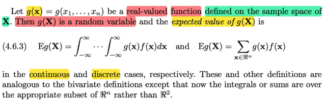</kbd>

> [!NOTE]
> tiếp theo là nói về việc nếu ta apply scalar function g(.) lên random variable
> vector **X**, thì ta sẽ có UNIVARIATE random variable g(**X**), điều này dễ
> hiểu, bởi lẽ với các possible vector value**x**, thì g(**x**)****sẽ là các possible
> scalar value khác nhau. Nên g(**X**) sẽ cũng là random variable
>
> Và ta có công thức tính Eg(**X**) = ∫-inf:inf...∫-inf:inf g(**x**)f(**x**)d**x**với
> continuous case
>
> và Σ{**x**∈R^n} g(**x**)f(**x**) với discrete case.
>
> Nhận xét, không quá lạ lẫm, đây chỉ là khái quát của cái gọi là 2D lotus mà
> mình đã gặp trong STAT110 cũng như nói trong phần trước bivariate random
> variable vector

 

<kbd>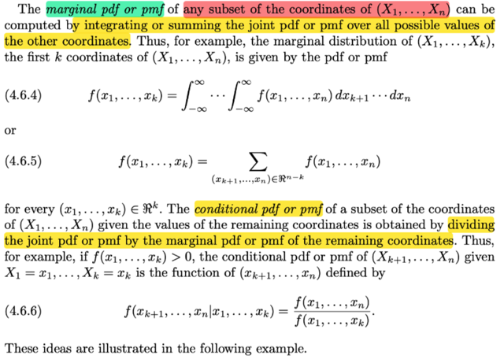</kbd>

> [!NOTE]
> đại khái khái là tương tự như khi ta marginalizing fX,Y(x,y) over mọi possible 
> value của X thì ta có marginal pdf/pmf của Y. Thì ở đây khi ta marginalizing
> f(x1,x2...xn) over mọi possible value của xk+1, ..xn thì ta sẽ có marginal
> pdf/pmf của f(x1,x2....xk), tất nhiên đây vẫn là joint pdf/pmf của một group
> các random variable X1, X2...Xk
>
> Và tương tự như fY|X(y|x) = fX,Y(x,y)/fX(x) thì ở đây:
>
> f(xk+1, ...xn|x1,...xk) = f(x1,...xn) / f(x1,...xk)

 

<kbd>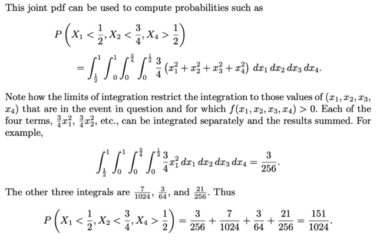</kbd>

<kbd></kbd>

<kbd>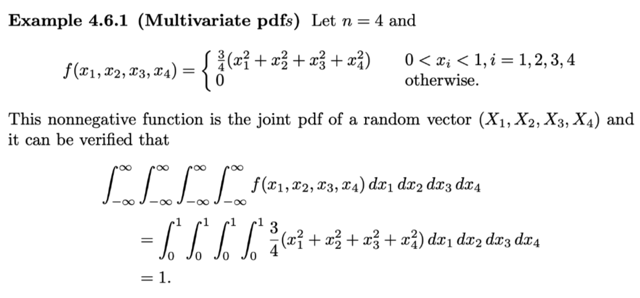</kbd>

> [!NOTE]
> Qua ví dụ này, họ cho một joint pdf của **X** = (X1, X2, X3, X4)
> f(x1,x2,x3,x4) = {(3/4)(x1^2 + x2^2 + x3^2 + x4^2) khi xi ∈ (0,1)
> và 0 khi otherwise.
>
> Thế thì đầu tiên đây là joint pdf, nên nó sẽ thỏa: Không âm,
> và tích phân trên toàn R^4 phải = 1.
>
> Tất nhiên khi tích phân trên toàn R^4 thì cũng sẽ thu lại chỉ còn
> tích phân trên support set (0 < xi < 1) vì ngooài set này f(**x**) = 0
> rồi.Thử xem taị sao ra 1:
>
> ∫∫∫∫3/4(x1^2 + x2^2 + x3^2 + x4^2)dx1dx2dx3dx4
>
> = Σi=1:4 3/4∫∫∫∫xi^2d**x**(tách thành tổng 4 cái tích phân)
>
> = (3/4) [∫∫∫∫x1^2dx1dx2dx3dx4 + ...]
>
> = (3/4) [∫∫∫(x1^3/3|0:1)dx2dx3dx4 + ...]
>
> = (3/4) [∫∫∫(1/3)dx2dx3dx4 + ...]
>
> = (3/4) [(1/3) ∫∫∫dx2dx3dx4 + ...]
>
> = (3/4) [1/3 + 1/3 + 1/3 + 1/3] = 1
>
> ====
>
> Và cái joint pdf này giúp ta tính P(X1 < 1/2, X2 < 3/4, X4 > 1/2)
> thử tính xem:
>
> Đây là event **X** ∈ A, với A = {**x**∈****R^4: x1 < 1/2, x2 < 3/4, x4 > 1/2}
>
> Thế thì: P(**X** ∈ A), như đã lúc nãy đã nói, sẽ = ∫∫∫∫A f(**x**)d**x**:
>
> = ∫-inf:1/2∫-inf:3/4∫-inf:inf∫1/2:inf f(**x**)dx1dx2dx3dx4 
>
> = (3/4) ∫0:1/2∫0:3/4∫0:1∫1/2:1 (x1^2 + x2^2 + x3^2 + x4^2)dx1dx2dx3dx4
>
> = tương tự, ta cũng tách ra, tính từng cái, ví dụ:
>
> (3/4) ∫0:1/2∫0:3/4∫0:1∫1/2:1 (x1^2)dx1dx2dx3dx4
>
> = (3/4) ∫0:3/4∫0:1∫1/2:1 (x1^3/3)|0:1/2 dx2dx3dx4
>
> = (3/4) ∫0:3/4∫0:1∫1/2:1 [(1/2)^3]/3 dx2dx3dx4
>
> = (3/4)(1/24) ∫0:3/4∫0:1∫1/2:1dx2dx3dx4
>
> = (1/32) x2|0:3/4 ∫0:1∫1/2:1dx3dx4
>
> = (1/32) (3/4) (x3|0:1)∫1/2:1dx4
>
> = (1/32) (3/4) (1) x4|1/2:1
>
> = (1/32) (3/4) (1) (1/2) = **3/256
>
> Nói chung tính cái tích phân này ko khó, tương tự có thể tính 3 cái kia**Để rồi tổng lại ta có P(**X**∈ A) = 151/1024

 

<kbd>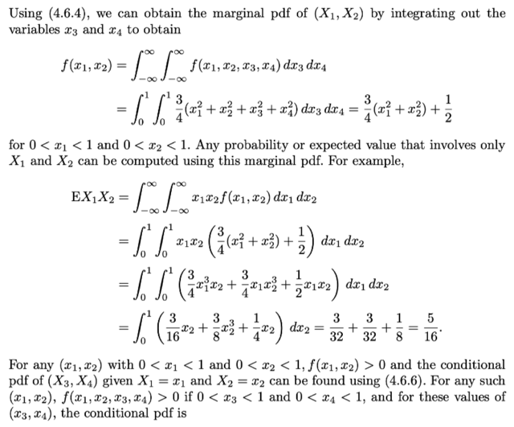</kbd>

> [!NOTE]
> Rồi, ta có thể marginalizing f(**x**) over mọi possible value của X3, X4 để có 
> joint pdf của X1,X2:
>
> fX1,X2(x1,x2) = ∫-inf:inf∫-inf:inf Σxi^2 dx3dx4
>
> = ∫-inf:inf∫-inf:inf (3/4)[x1^2 + x2^2 + x3^2 + x4^2) dx3dx4****= (3/4)[∫0:1∫0:1 x1^2 + x2^2 dx3dx4 + ∫0:1∫0:1 x3^2 + x4^2 dx3dx4]
>
> = (3/4)[(x1^2 + x2^2) ∫0:1∫0:1 dx3dx4 + ∫0:1∫0:1 (x3^2 + x4^2) dx3dx4]
>
> = (3/4)[(x1^2 + x2^2) + ∫0:1x3^3/3|0:1 dx4 + ∫0:1 (x4^3/3|0:1 dx4]
>
> = (3/4)[(x1^2 + x2^2) + 1/3 ∫0:1dx4 + 1/3 ∫0:1dx4]
>
> = (3/4)(x1^2 + x2^2) + (3/4)(2/3)
>
> = (3/4)(x1^2 + x2^2) + 1/2, 0 < x1,x2 < 1. Đây chính là joint pdf của X1,X2
>
> Và với marginal pdf của X1, X2 đương nhiên ta có thể tính EX1X2
> (tức là Eg(X1,X2), với g(X1,X2) = X1X2, là vector→ scalar function)
>
> = ∫-inf:inf∫-inf:inf g(x1,x2)fX1,X2(x1,x2)dx1dx2
>
> = ∫0:1∫0:1 x1x2[(3/4)(x1^2 + x2^2) + 1/2]dx1dx2
>
> = ∫0:1∫0:1 x1x2[(3/4)x1^2 + (3/4)x2^2 + 1/2]dx1dx2
>
> = ∫0:1∫0:1 [(3/4)x1x2x1^2 + (3/4)x1x2x2^2 + x1x2/2]dx1dx2
>
> = ∫0:1∫0:1 (3/4)x1^3x2dx1dx2 + ∫0:1∫0:1 (3/4)x1x2^3dx1dx2 + ∫0:1∫0:1 x1x2dx1dx2
>
> = (3/4)∫0:1 x1^3dx1 ∫0:1x2dx2 + (3/4) ∫0:1x1dx1 ∫0:1x2^3dx2 + 1/2 ∫0:1x1dx1 ∫0:1x2dx2
>
> = (3/4) x1^4/4|0:1 x2^2/2|0:1 + (3/4) x1^2/2|0:1 x2^4/4|0:1 + (1/2) x1^2/2|0:1 x2^2/2| 0:1
>
> = (3/4) (1/4) (1/2) + (3/4) (1/2) (1/4) + (1/2)(1/2)(1/2)
>
> = 3/32 + 3/32 + 1/8 = 5/16

 

<kbd>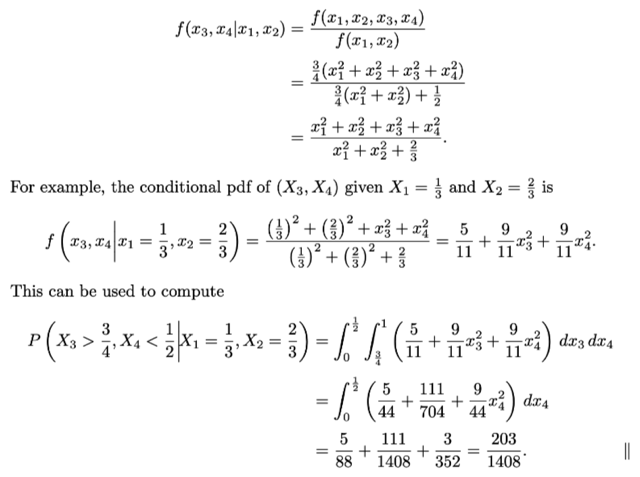</kbd>

> [!NOTE]
> Ta cũng có thể tính f(x3,x4|x1,x2) =
> f(x1,x2,x3,x4) / f(x1,x2)

 

<kbd>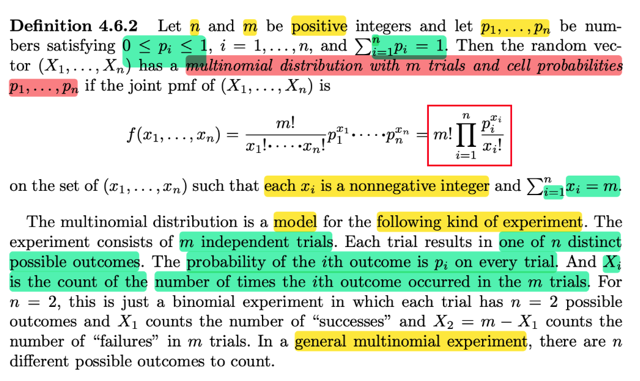</kbd>

> [!NOTE]
> định nghĩa của Multinomial distribution. Như đã biết trong Stat110, story
> của cái này là: ta có n iid trials, nhưng mỗi trials sẽ có m possible outcome
> với xác suất tương ứng là p_i (gọi là CELL PROBABILITY_. Nên đương
> nhiên Σp_i = 1. Ta sẽ có random variable **X** = (X1,...Xn) với Xi là số lần
> ra outcome thứ i trong m trials. Do đó dĩ nhiên là X1 + X2 + ....Xn = m
>
> Và joint pmf của X1,..Xn sẽ là f(**x**) = **m! Πi=1:n p_i^xi / xi!**Khi m = 2, thì ta sẽ có câu chuyện là m iid trial mà mỗi trial chỉ có 2
> possible values, đó chính là Bern(p) trial với p là xác suất trial thành công.
>
> Nên lúc này X = (X1, X2) thì X1 là số tổng số trial thành công trong n trial
> sẽ là Binomial(m, p) rv

 

<kbd>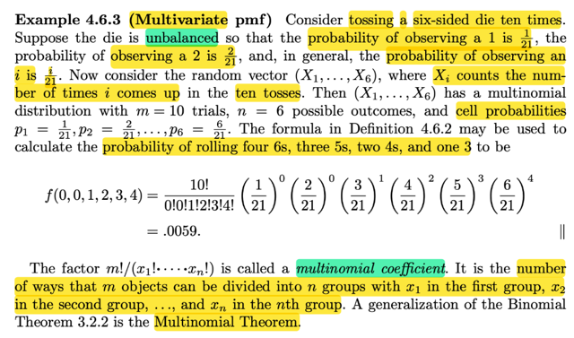</kbd>

> [!NOTE]
> Đại khái là lấy ví dụ tung xí ngầu 10 lần, nhưng xí ngầu này ko bình  thường,
> mà có xác suất ra 1 nút là 1/21, 2 nút là 2/21, ...6 nút là 6/21 (tổng p1 + ..p6 =
> (1 + 2 +...6)/21 = 1
>
> Khi đó, **X** = (X1,X2...X6)  với X1 là số lần ra 1 nút trong 10 lần tung, X2 là
> số lần ra 2 nút trong 10 lần tung,... thì **X** sẽ ~multinomial (10, [p1,p2..])
>
> Và áp dụng pmf của nó (dĩ nhiên là joint pmf của X1, X2...X6) ta có thể tính
> xác suất của event là trong 10 lần tung, thì ra 4 lần 6 nút, 3 lần 5 nút, 2 lần 4
> nút, 1 lần 3 nút ,tức x1=0, x2 = 0, x3 = 1, x4 = 2, x5 = 3, x6 = 4 , Σxi  = 10)
>
> P(**X** ∈ A) ở đây chính là P(**X** = (0,0,1,2,3,4))
>
> = f**X**(0,0,1,2,3,4) 
>
> = 10! (1/21)^0/0! (2/21)^0/0! (3/21)^1/1! (4/21)^2/2! (5/21)^3/3! (6/21)^4/4!
>
> Và  m!/(x1!...xn!) gọi là MULTINOMIAL COEFFICIENTS

 

<kbd>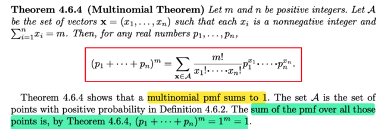</kbd>

> [!NOTE]
> Đại khái là như mình đã biết về định lý nhị thức:
>
> Binomial Theorem: (p + q)^m = Σk (m choose k) p^k q^m-k
>
> Thì ở đây, ta sẽ có phiên bản khái quát của theorem này  gọi là
> multinomial theorem.
>
> Và tương tự như nhờ định lý này mà ta có thể chứng minh  Σk=0:n pmf
> của Binomial
>
> = Σk=0:m (m choose k)p^kq^(m-k) = (p + q)^m = 1^m
>
> Thì nhờ cái này ta cũng sẽ chứng minh Σ của multinomial pmf trên mọi
> point = 1

 

<kbd>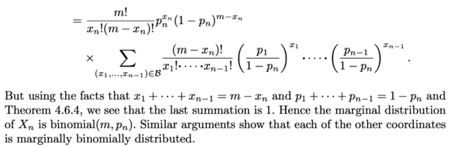</kbd>

<kbd></kbd>

<kbd>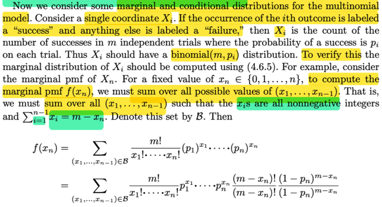</kbd>

> [!NOTE]
> Thế thì gặp lại một kiến thức đã học trong Stat110: Đó là, nếu như đang
> trong multinomial **X**~ multinomial(m, **p**) (**p** là vector cell probability
> = (p1,p2... pn) với p_i là xác suất trial cho ra kết quả thuộc loại thứ i).
>
> Thì bây giờ,kiểu như ta coi trial outcome thứ 1 là success, còn lại thì đều là
> failure. Khi đó, mỗi trial sẽ coi như chỉ có 2 outcome là success với xác suất
> p1 và failure với xác suất 1 - p1 = Σi=2:n p_i. Nên nó là một Bern(p1) trial
>
> X1 sẽ có story là số success trong n iid Bern(p1) trials, ta biết nó sẽ ~
> binomial (m, p1)
>
> Ở đây, gs Casella chứng minh marginal pmf của X1 sẽ là pmf của binomial
> (m, p1) bằng cách marginalizing joint pmf của X1,..Xn (hay pmf của
> multinomial rv vector **X)**over mọi possible value của X2,...Xn. Thử làm
> theo cho hiểu:
>
> QUAY LẠI LÀM SAU

 

<kbd>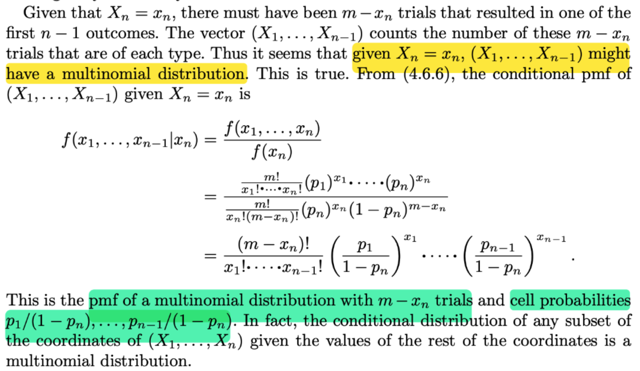</kbd>

> [!NOTE]
> Tiếp, đại khái là nếu biết Xn = xn, thì xét vector rv (X1,...Xn-1) sẽ có story
> là: ta có m - xn trials, mỗi trial có thể có n-1 outcome và X1 sẽ là số lần
> (trong m - xn lần) outcome ra loại 1, Xn-1 là số lần outcome thuộc loại
> n-1. Do đó (X1,X2...Xn-1) sẽ cũng là một multinomial rv, nhưng tham số
> sẽ là m-xn, và cell probability sẽ là (p'1,p'2...p'n-1), tính như sau:
>
> Ban đầu cell probabilities là (p1, p2,...pn) có tổng = 1 với p1 mang ý
> nghĩa là  xác suất trial ra kết quả thuộc loại 1.
>
> Bây giờ khi đã biết Xn = xn thì cell probability
>
> p'1 lúc này sẽ là XÁC SUẤT TRIAL RA LOẠI 1 VỚI VIỆC NÓ ĐÃ KHÔNG
> PHẢI LOẠI n RỒI, hay CHỈ XÉT NHƯNG KẾT QUẢ KO PHẢI LOẠI n THÌ
> XÁC SUÁT RA LOẠI 1 BẰNG MẤY
>
> Do đó p'1 = xác suất (ra loại 1 | không phải loại n)
>
> hay p'1 = P(outcome = loại 1 | outcome khác loại n)
>
> theo định nghĩa của conditional probability
>
> = P(outcome = loại 1, outcome khác loại n) / P(outcome khác loại n)
>
> Mà outcome = loại 1 là tập con của outcome khác loại n (vì nếu nó là loại
> 1 thì nó cũng thuộc tập "khác loại n", nên intersection của hai tập này là
> (outcome = loại 1)
>
> ⇨ ... = P(outcome = loại 1) / P(outcome khác loại n)
>
> = p1 / (p1 + p2 + ...pn-1) = p1 / (1 - pn)
>
> tương tự ta có p'2 = p2 / (1 - pn)
>
> Từ đó cell probability sẽ là (p1/(1 - pn), ...p_n-1/(1 - p_n-1))
>
> Đó là cách lập luận theo story, còn trong sách gs Casella tính ra 
> pmf của (X1,...Xn-1) cũng chứng minh nó là multinomial(n - xn, **p'**)

 

<kbd>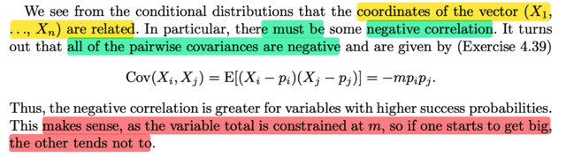</kbd>

> [!NOTE]
> QUAY LẠI SAU
>
> Nhưng đại khái là nói rằng Xi và Xj trong multinomial rv vector sẽ có
> covariance Âm và cũng dễ thấy, vì khi Xi mang giá trị lớn thì Xj sẽ
> có xu hướng mang giá trị bé

 

<kbd>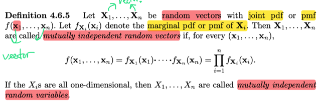</kbd>

> [!NOTE]
> Đại khái là ta sẽ có định nghĩa của independent nhưng mở rộng hơn, đó là
> GIỮA CÁC RANDOM VARIABLE VECTORS **X1, X2...Xn***(chú ý đây là rv
> vectors).
>
> Thì tương tự như định nghĩa của independent random varibles X1,X2,,Xn đó
> là nếu joint pmf/pdf fX1,X2..Xn(x1,x2,..xn) = fX1(x1)fX2(x2)...fXn(xn)
>
> Thì đây, các random variable vectors trên cũng sẽ **MUTUALLY
> INDEPENDENT** nếu  f(**x1,x2...**) = f**X1**(**x1**)...f**Xn**(**xn**)
>
> tức là joint pmf/pdf của **X1,X2..Xn**bằng tích các marginal pmf của từng
> cái
>
> Nên phải hiểu f(**x1,x2,...xn**) ở trên là matrix input function (vì **x1,x2..xn**)
> đều là vector.
>
> Dĩ nhiên là khi các vector này trở về chỉ là 1D, thì chúng là random variable
> và ta có các random variable **mutual independent**
>
> CHÚ Ý, LÀ TRƯỚC GIỜ TA CHỈ NÓI VỀ 2 RANDOM VARIABLE X, Y ĐỘC
> LẬP. CÒN ĐÂY LÀ MỘT ĐÁM CÁC RANDOM VARIABLE X1,X2...Xn MULTUAL
> ĐỘC LẬP.

 

<kbd>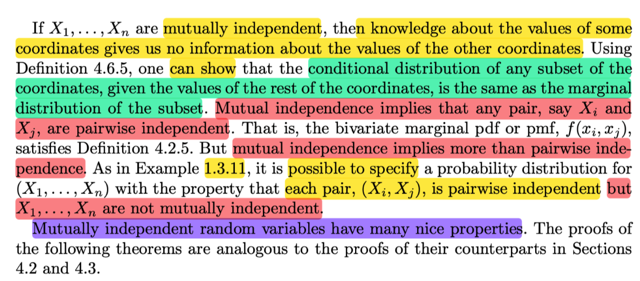</kbd>

> [!NOTE]
> Thế thì tương tự như pair-wise independent, có nghĩa là giá trị của rv này
> không giúp gì cho việc biết giá trị của rv kia.
>
> thì mutual independent sẽ có nghĩa là biết giá trị của một nhóm bất kì các
> rvs này, không giúp gì cho việc biết gía trị của nhóm các rv còn lại
>
> Ví dụ như có X1, X2, X3, X4 thì conditional distribution của nhóm X1, X2
> given X3,X4 cũng bằng marginal distribution của X1, X2
>
> fX1,X2|X3,X4 = fX1,X2
>
> Và đại khái nói là mutual independent thì sẽ mạnh hơn và suy ra cũng pair
> wise nhưng pair wise independent thì chưa chắc đã multual independent
> mà trong ví dụ 1.3.11 đã từng nói

 

<kbd>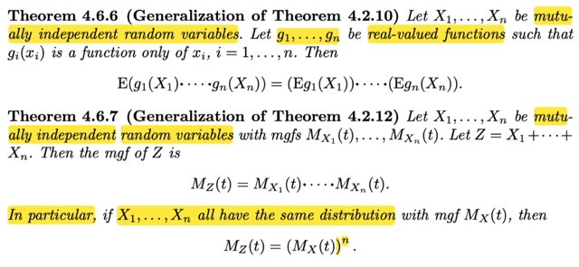</kbd>

🔗 **Related:** [5.5 CONVERGENCE CONCEPTS](55_convergence_concepts.md#node-410)

> [!NOTE]
> 2 định lý khái quát hơn những định lý đã gặp đối với 2 biến.
>
> 4.2.10 đại khái nói rằng nếu X, Y (pairwise) độc lập và g là hàm chỉ theo x, h là
> hàm chỉ theo y thì Eg(X)h(Y) = Eg(X)Eh(Y)
>
> thì ở đây nếu có X1,...Xn mutually độc lập và có n hàm g1, g2,...gn sao cho g1
> chỉ là gàm của x1, g2 chỉ là hàm của x2,..thì
>
> E[g1(X1)g2(X2)...gn(Xn)] = Eg1(X1) * Eg2(X2)... * Egn(Xn)
>
> ====
>
> Cũng tương tự, ở 4.2.12 ta đã biết nếu X, Y độc lập thì mgf của X + Y sẽ bằng
> tích của các mgf của từng cái.
>
> thì ở đây cũng vậy nếu X1,...Xn mutually độc lập thì với Z = X1 + X2...+ Xn
> thì mgf MZ(t) = MX1(t) * MX2(t) * ....MXn(t)
>
> Và nếu như X1, X2....lại có chung distribution thì mgf cũng giống nhau gọi là 
> MX(t)
>
> ⇨ MZ(t) = [MX(t)]^n

 

<kbd>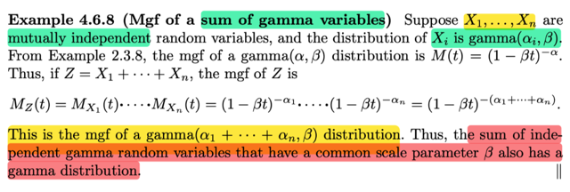</kbd>

🔗 **Related:** [5.3 SAMPLING FROM THE NORMAL DISTRIBUTION](53_sampling_from_the_normal_distribution.md#node-360)

🔗 **Related:** [9.2 METHODS OF FINDING INTERVAL ESTIMATORS](92_methods_of_finding_interval_estimators.md#node-769)

> [!NOTE]
> Thế thì áp dụng vào một ví dụ mà ta có X1, X2,...Xn đều mutually độc
> lập và chúng là các Γ rv: Γ(α1, β), Γ(α2, β)....Tức khác α, chung β 
>
> Khi đó mgf của Z = Σ Xi theo trên sẽ là:
>
> MZ(t) = Πi MXi(t) = Πi (1 - βt)^-αi  = (1-βt)^-Σi αi
>
> Và qua đó cho thấy Z cũng là Gamma rv với parm cũng là β nhưng 
> α là tổng αi

 

<kbd>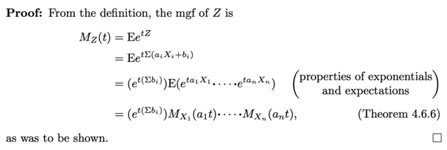</kbd>

<kbd></kbd>

<kbd>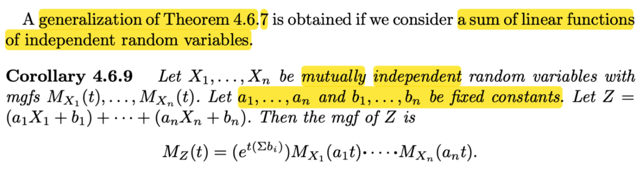</kbd>

> [!NOTE]
> Đại khái là ta có thể khái quát hơn nữa: thay vì xét Z = Σi Xi ta sẽ xét 
> Z = Σi (aiXi + bi) tức là Σ các linear function của các rv
>
> khi đó MZ(t) = [e^t(Σbi)] MX1(a1t) MX2(a2t) ...MXn(ant)
>
> Chứng minh dễ òm:
>
> theo định nghĩa mgf MZ(t) có bản chất là E[e^tZ]
>
> = E[e^tΣ(aiXi+bi)] 
>
> = E[e^Σ(taiXi+bi)] | đưa phân phối t vô
>
> = E[e^[Σ(taiXi)+Σbi]
>
> = E[e^Σ(taiXi) * e^Σbi]
>
> = e^Σbi E[e^Σ(taiXi)] | linearity
>
> = e^Σbi E[Πi e^(taiXi)] 
>
> = e^Σbi E[Πi e^(taiXi)] 
>
> tức là e^Σbi E[e^(ta1X1) * e^(ta2X2) * ...e^(tanXn)]
>
> Và đây chính là expected của tích các gi(Xi) riêng lẻ
>
> nên theo theorem 4.6.6 E[g1(X1)g2(X2)...gn(Xn)] = Eg1(X1)Eg2(X2)..
>
> ⇨ ..= e^Σbi E[e^(ta1X1)] * E[e^(ta2X2)] * ...E[e^(tanXn)]
>
> Đến đây thì E[e^(ta1X1)] chính là mgf của X1 evaluate tại a1t
>
> = e^Σbi MX1(ta1)MX2(ta2).....

 

<kbd>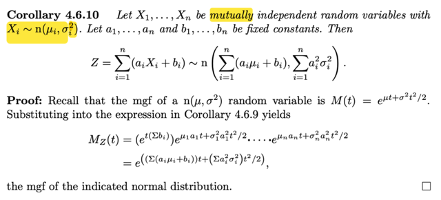</kbd>

🔗 **Related:** [5.3 SAMPLING FROM THE NORMAL DISTRIBUTION](53_sampling_from_the_normal_distribution.md#node-363)

> [!NOTE]
> Ứng dụng cái hệ quả 4.6.9 ta sẽ chứng minh rằng tổng của các linear function
> của các normal (μi, σi^2) rv sẽ cũng là normal rv ~ n(Σi ai μi + bi, Σ ai^2 σi^2)
>
> Như đã biết mgf của normal (μ, σ^2) là M(t) = e^μt + σ^2t^2/2
>
> Xét Z = Σ aiXi + bi
>
>  MZ(t) = theo hệ quả 4.6.9
>
> sẽ = e^t(Σbi) MX1(a1t)....MXn(ant)
>
> = e^t(Σbi) e^[μ1a1t + σ1^2a1^2t^2/2] ...e^[μnant + σn^2an^2t^2/2]
>
> = e^t(Σbi) e^[μ1a1t + σ1^2a1^2t^2/2 + ... + μnant + σn^2an^2t^2/2]
>
> = e^t(Σbi) e^[μ1a1t + μ2a2t + ...μnant + σ1^2a1^2t^2/2 + ...  σn^2an^2t^2/2]
>
> = e^t(Σbi) e^[Σiμiai t + Σiσi^2ai^2t^2/2]
>
> = e^[Σiμiai t + t Σbi + Σiσi^2ai^2t^2/2 ]
>
> = e^[ (Σiμiai + Σbi) t + + Σiσi^2ai^2t^2/2 ]
>
> tới đây thì nó có dạng mgf của n(Σiμiai + Σbi,Σiai^2σi^2)

 

<kbd>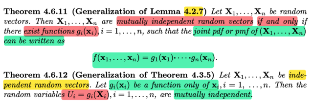</kbd>

🔗 **Related:** [5.3 SAMPLING FROM THE NORMAL DISTRIBUTION](53_sampling_from_the_normal_distribution.md#node-365)

> [!NOTE]
> Rồi, đây là 2 định lý mang tính cách là mở rộng (khái quát) của hai cái mà 
> mình đã gặp đối với bivariate
>
> Đầu tiên có một cái rất hữu ích, đó là bổ đề 4.2., nói rằng, hai random
> variable X, Y sẽ là independent NẾU VÀ CHỈ NẾU tồn tại hai hàm g() là
> hàm của x, h là hàm của y. sao cho fX,Y(x,y) = g(x)h(y) với mọi x, y
>
> Và nhờ cái bổ đề này mà ta có thể chứng minh tính độc lập của hai rv 
> dễ hơn nhiều.
>
> Ở đây, khái quát nó lên ta cũng có: **X1, X2,...Xn** sẽ là các rv vector multually
>  độc lập nếu tồn tại các hàm gi(xi) mỗi hàm chỉ là hàm của random variable
> vector xi: sao cho joint pdf/pmf của **X1, ...Xn**= Πi gi(**xi**)
>
> ====
>
> Và theorem 4.3.5 đại khái nói là nếu X, Y độc lập, thì U = g(X), V = h(Y)
> cũng độc lập
>
> Khái quát lên **X1, ...Xn** mutually độc lập ⇨ Ui = gi(**Xi**) cũng mutually độc lập

 

<kbd>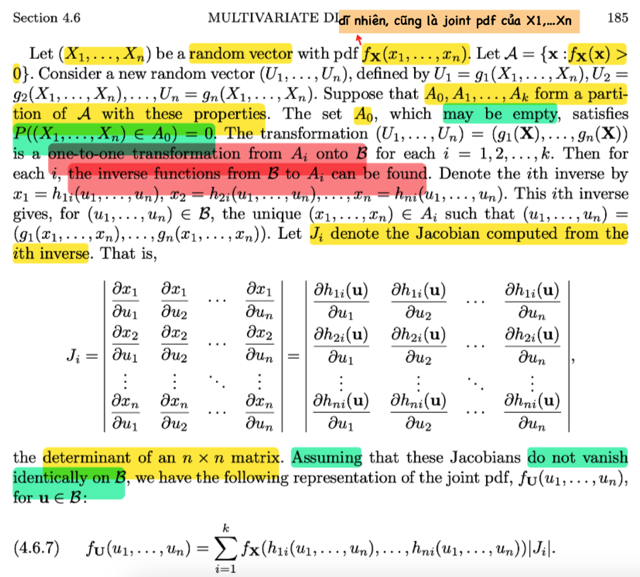</kbd>

<kbd></kbd>

<kbd>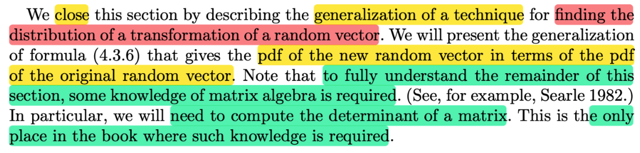</kbd>

> [!NOTE]
> Cái này y như (khái quát) của 4.3.6 là nếu mapping từ A_curly → B_curly ko
> 1-1. 
>
> Nhưng thỏa các điều kiện sau:
>
> 1) Có partition của A_curly: P((X,Y) ∈ A0) = 0
>
> 2) Trên các A1, A2, thì qua g1, g2 đều map tới B_curly, và là mapping 1-1
> (mà mapping 1-1 ở đây còn thêm ý là ta có thể tìm được hàm inverse
> để từ u,v tìm được x,y trên Ai nữa)
>
> Khi đó
>
> f**U**(**u**) = Σ f**X**(h1i(**u**), ...hni(**u**)) |Ji| (*)
>
> Nhắc lại cái này y như ở trường hợp 2 biến:
>
> U = g1(X,Y) V = g2(X,Y) mà mapping x,y → u,v không 1-1.Khi đó nếu có thể
> chỉ ra có partition A0,A1,...Ak của A_curly Sao cho:
>
> 1) P((X,Y) ∈ A0) = 0
>
> 2) trên Ai thì với x,y ∈ Ai thì g1(x,y), g2(x,y) đều ∈ B_curly
>
> và với u,v = g1(x,y), g2(x,y) ∈ B_curly với x,y ∈ Ai ta có thể tìm x = h1i(u,v)
> và y = h2i(u,v)
>
> Khi đó, define Ji là ∂(x,y)/∂(u,v) với quan hệ x = h1i(u,v) và y = h2i(u,v)
>
> thì ta sẽ có fU,V(u,v) = Σi fX,Y(h1i(u,v), h2i(u,v)) |Ji|
>
> thì ở đây nếu mình coi (U,V) là **U** và (X,Y) là **X** thì nó chính là công thức trê**n
> (*) thôi**f**U**(**u**) = Σi f**X**(h1i(**u**),h2i(**u**)) | Ji |

 

<kbd>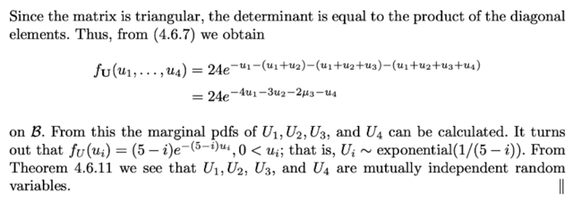</kbd>

<kbd></kbd>

<kbd>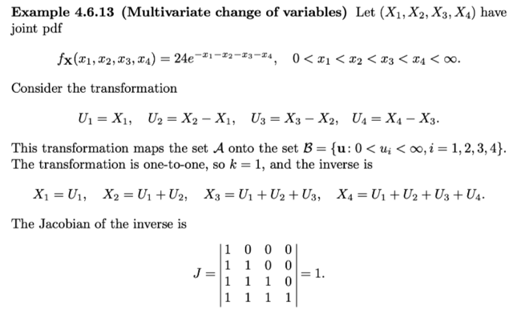</kbd>

> [!NOTE]
> Áp dụng vô ví dụ này

> [!NOTE]
> QUAY LẠI SAU

 

<kbd>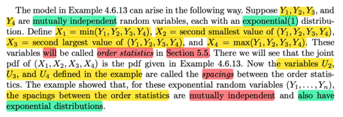</kbd>

 

