# 5.1 Basic Concepts Of Random Samples

📊 **Progress:** `13` Notes | `19` Screenshots

---
<a id="node-323"></a>

<p align="center"><kbd>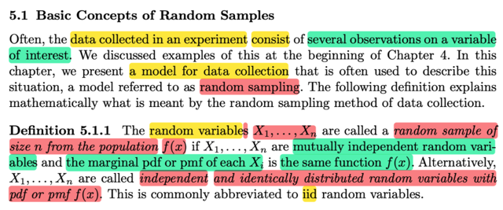</kbd></p>

> [!NOTE]
> Chỗ này cần chậm lại để hiểu kĩ về khái niệm **Random Sampling**:
>
> Đại khái là, dữ liệu thu thập từ một experiment sẽ có dạng là **các giá trị
> quan sát thấy của một variable nào đó mà ta quan tâm.**Thế thì, ở chương này, ta sẽ giới thiệu một mô hình của việc thu thập dữ
> liệu, và nó được gọi là RANDOM SAMPLING.
>
> Định nghĩa chuẩn toán học của nó: MỘT BỘ CÁC RANDOM VARIABLES
> X1, X2, ....Xn được gọi là một **RANDOM SAMPLE** CÓ SIZE n TỪ
> POPULATION f(x) nếu như:
>
> 1) CHÚNG **MUTUALLY INDEPENDENT**
>
> 2) CHÚNG ĐỀU CÓ **MARGINAL `PDF/PMF` LÀ f(x)**
>
> Và một cách gọi khác là **INDEPENDENT & IDENTICALLY DISTRIBUTED
> RANDOM VARIABLES VỚI `PDF/PMF` f(x)**Nhận xét: Như vậy khái niệm ở đây là **random sample size n của
> population f(x)**, và theo định nghĩa nó là một bộ các random variable Xi có
> tính chất  mutually independent và có chung marginal distribution f(x)
>
> Trong chương 4 mình đã biết về khái niệm mutually independent. Nó mạnh
> hơn là `pair-wise` independent, và nó imply `pair-wise` independent.

<br>

<a id="node-324"></a>

<p align="center"><kbd>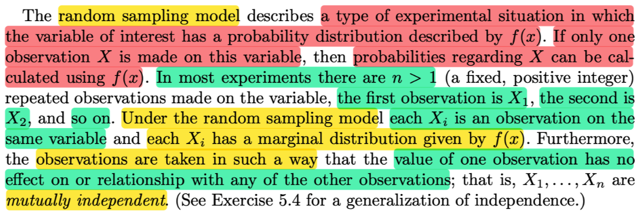</kbd></p>

> [!NOTE]
> Cái định nghĩa này, mình cảm thấy rất quan trọng và cần phải nắm rất
> chắc để tránh những cái khó hiểu sau này.
>
> Ở đây nhắn lại, RANDOM SAMPLING MODEL, mô tả một dạng của thử
> nghiệm trong đó variable mà ta quan tâm có probability distribution định
> nghĩa bởi f(x)
>
> Nếu chỉ có một observation X, thì xác suất liên quan đến X, có thể được
> tính  toán nhờ f(x)
>
> Nhưng thông thường số observation sẽ là n > 1, để tạo thành một bộ các
> random variable X1, X2, ...Xn
>
> Dừng một chút để có thể đặt câu hỏi: Tại sao observation lại là random
> variable? Ví dụ X1, là giá trị quan sát được của một biến số nào đó mà ta
> quan tâm, thì phải hiểu là vì X1, tức là quan sát biến số `/` yếu tố mà ta quan
> tâm đó, lần đầu tiên, thì nó có thể có nhiều giá trị khác nhau, nên nó là một
> random variable.
>
> Rồi observation thứ 2, X2, thì cũng giống lần 1, nó cũng có thể có nhiều
> giá trị khác nhau, nên nó cũng là random variable
>
> Ngoài ra như đã nói, observation được thực hiện sao cho giá trị của lần
> quan sát này ko ảnh hưởng đến giá trị của lần quan sát khác. Nên X1, X2..
> độc lập nhau.
>
> Mình có thể lấy ví dụ experiment là chọn ngẫu nhiên một người ta đo chiều
> cao.
>
> Vậy thì sự ngẫu nhiên đến từ ...việc chọn ngẫu nhiên một người. Và biến
> số quan tâm ở đây là chiều cao người đó.
>
> Vậy lần quan sát thứ nhất, sẽ là chọn 1 người ta đo chiều cao. Thì kết quả
> của quá trình này, được thể hiện bởi X1. Như đã biết, bản chất của nó là
> một function, mapping một possible outcome tới trục số thực. Như đã nói,
> quá trình chọn một người ngẫu nhiên chính là cho ra một possible outcome
> s, và đo chiều cao của họ chính là function X1(s)

<br>

<a id="node-325"></a>

<p align="center"><kbd>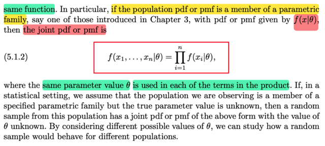</kbd></p>

<p align="center"><kbd>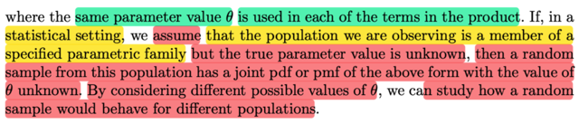</kbd></p>

<p align="center"><kbd></kbd></p>

<p align="center"><kbd></kbd></p>

<p align="center"><kbd>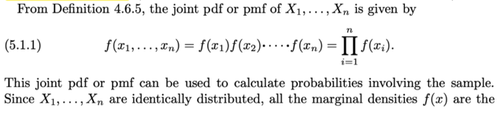</kbd></p>

> [!NOTE]
> Từ định nghĩa đó, ta có joint `pdf/pmf` của X1, X2, ....Xn sẽ  là:
>
> f(x1,x2,...xn) `=` f(x1)f(x2)....f(xn) `=` `Πi=1:n` f(xi)
>
> Là vì trong chap 4 ta đã biết joint `pmf/pmf` của một set random các
> random variable mutually độc lập sẽ là tích các marginal `pdf/pmf`
>
> Và vì trong định nghĩa của random sampling model là set các random
> variables X1, X2,....Xn có cùng marginal pdf là f(x) nên ta có công thức
> trên.
>
> Câu quan trọng ở đây, đó là joint `pdf/pmf` này có thể được dùng để tính
> xác suất liên quan đến sample
>
> Và đặc biệt quan trọng, đó là nếu population `pdf/pmf` **LẠI LÀ THÀNH VIÊN
> CỦA MỘT PARAMETRIC FAMILY**, với `pdf/pmf` thể hiện bởi **f(x|θ)**Khi đó, ta sẽ có**f(x1,x2,....xn|θ) `=` `Πi=1:n` `f(xi|θ)`
>
>
> ĐÂY LÀ CÔNG THỨC MÀ MÌNH ĐÃ TỪNG RẤT KHÔNG HIỂU KHI GẶP
> TRONG BỐI CẢNH MACHINE LEARNING.**Và lần này, nhờ đọc sách này mà từ nay về sau ta có đã hiểu được nó.
> Rất quan trọng, phải nhắc lại:
>
> XUẤT PHÁT TỪ ĐỊNH NGHĨA CỦA MỘT RANDOM SAMPLING MODEL
> SIZE N CÓ POPULATION DISTRIBUTION f(x): Đó là X1,X2...Xn là các
> random variable đại diện cho giá trị quan sát được ở lần 1,2...n của một 
> variable nào đó mà ta quan tâm. Với điều kiện là observation được thực
> hiện sao cho các random variable X1,X2....Xn mutually independent cũng
> như là có cùng marginal distribution f(x).
>
> Và từ đó ta xây dựng joint distribution của n random sample này:
>
> f(x1,x2,....xn) `=` fX1(x1)fX2(x2)...fXn(xn) `=` `Πi=1:n` fXi(xi)
>
> Mà vì theo định nghĩa các random variable này có cùng marginal `pdf/pmf`
> nên `Πi=1:n` fXi(xi) `=` **Π1:n f(xi)
>
> Cuối cùng, nếu như population `pdf/pmf` lại là thành viên của một 
> parametric family, tức là `pdf/pmf` sẽ có chung dạng nhưng phụ thuộc
> bởi một tham số `θ:` để rồi ta thể hiện population `pdf/pmf` là f(x|θ)**
> Lúc này, ta có công thức của joint `pmf/pdf` của set n random variable
> X1,...Xn:
>
> f(x1,x2....xn) `=` `Πi=1:n` `f(xi|θ)`
>
> VÀ QUAN TRỌNG LÀ, JOINT `PMF/PMF` CỦA n RANDOM VARIABLE X1,..Xn
> SẼ ĐƯỢC DÙNG ĐỂ TÍNH **PROBABILITY LIÊN QUAN ĐẾN SAMPLE**===
>
> Và một ý rất quan trọng nhưng cũng ko khó hiểu đó là:
>
> Nếu như TA GIẢ ĐỊNH RẰNG population distribution mà của cái population mà 
> ta đang quan sát **LÀ THÀNH VIÊN CỦA MỘT PARAMETRIC FAMILY CỤ THỂ
> NÀO ĐÓ** (ví dụ như Gaussian, hay Bern, hay Expo,...ý là ta sẽ giả định là "loại
> nào") **NHƯNG TA KHÔNG BIẾT GIÁ TRỊ CHÍNH XÁC CỦA PARAMETER `θ`
>
> THÌ KHI ĐÓ, DỄ HIỂU LÀ HÀM JOINT `PDF/PMF` CỦA `f(x|θ)` SẼ PHỤ THUỘC
> `θ`
>
> Và bằng cách xem xét các giá trị khả dĩ (possible value) khác nhau của
> `θ,` thì ta có thể học được CÁCH HÀNH XỬ CỦA RANDOM SAMPLE VỚI
> CÁC POPULATION KHÁC NHAU**

<br>

<a id="node-326"></a>

<p align="center"><kbd>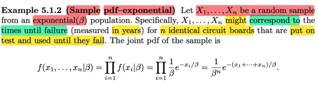</kbd></p>

> [!NOTE]
> Lấy ví dụ này, cho X1, ....Xn là MỘT RANDOM SAMPLE TỪ MỘT `EXPO(β)`
> POPULATION.
>
> Nhắc lại nhiều lần định nghĩa cho nhớ, theo định nghĩa, có nghĩa là ta thực
> hiện một experiment, và quan tâm đến một yếu tố nào đó. Để rồi ta sẽ thực
> hiện việc quan sát giá trị của yếu tố này n lần. Lần thứ nhất, giá trị của nó, ta
> sẽ thể hiện bởi X1. Có nghĩa là, X1 sẽ là random variable đại diện cho giá trị
> của biến số mà ta quan tâm trong lần quan sát thứ nhất. Và nó là random
> variable, vì khi quan sát, kết quả có thể là các giá trị khác nhau. Và X2,X3,...
> cũng tương tự vậy.Nhưng theo định nghĩa của random sample, thì X1, X2...Xn
> mutually  independent và có chung marginal distribution `(pmf/pdf)` là f(x)
>
> Và khi population distribution lại thuộc một parametric family, để từ đó `pdf/pmf`
> có dạng `f(x|θ)` thì ta sẽ có joint `pdf/pmf` của X1,X2...Xn, tức là pdf của sample
> sẽ phụ thuộc `θ`
>
> Vậy ở đây, một ví dụ minh họa cho định nhĩa này đó là TA QUAN SÁT THỜI
> GIAN CHÁY CỦA BÓNG ĐÈN.
>
> Mà mỗi quan sát (observation) nghĩa là ta ghi nhận thời gian (từ lúc mới bật)
> đến lúc cháu của một trong n bóng đèn.
>
> Ví dụ bóng đèn thứ nhất, ta ghi nhận thời gian cháy của nó, thể hiện giá trị này
> bởi X1. Vì ta ko biết nó sẽ cháy bao lâu (nên dĩ nhiên nó là random variable)
>
> THẾ THÌ, Ở ĐÂY TA GIẢ ĐỊNH f(x), TỨC POPULATION PDF, LÀ MỘT
> POPULATION THUỘC FAMILY EXPONENTIAL, CÓ PARAMETER LÀ `β.`
>
> Khi đó như đã hiểu, joint pdf của sample (tức là joint pdf của X1, X2,...Xn) sẽ
> là:
>
> ```text
> f(x1,x2,...xn|β) = Πi=1:n f(xi|β)
> ```
>
> ```text
> = Πi=1:n (1/β) e^-xi/β
> ```
>
> ```text
> (vì ta đã biết pdf của Expo(β) có dạng: fX(x) = (1/β) e^-x/β)
> ```
>
> `=` **(1/β)^n e^-Σxi/β**

<br>

<a id="node-327"></a>

<p align="center"><kbd>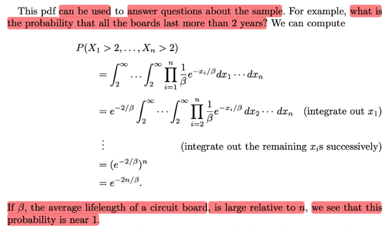</kbd></p>

> [!NOTE]
> Và nhắc lại điểm quan trọng mà nghe qua có vẻ bình thường (ít nhất là đối với
> mình) **LÀ TA SẼ DÙNG JOINT PDF CỦA X1,X2,...Xn ĐỂ TÍNH  XÁC SUẤT
> (CỦA EVENT) LIÊN QUAN ĐẾN SAMPLE**Ví dụ ta muốn tính xác suất CỦA VIỆC (ý nói event): Mọi bóng đều cháy hơn
> 2 năm:****Thế thì vì X1 là random variable "đại diện" cho thời gian cháy của bóng thứ
> nhất, nên event "bóng thứ nhất cháy hơn 2 năm" sẽ thể hiện bởi X1 > 2
>
> Tương tự như vậy ta có X2 > 2, ...Xn > 2
>
> Và event tất cả đều cháy hơn 2 năm sẽ là joint event (X1 > 2, X2 > 2, ...Xn >
> 2)
>
> Nên xác suất ta đang muốn tính chính là P(X1 > 2, X2 > 2, ...Xn> 2)
>
> Và vì ta đã có joint pdf như trên nên ta sẽ dùng nó để tính xác suất của event
> này:
>
> `=` `∫2:inf` `....∫2:inf` f(x1,x2,...xn) dx1dx2,..dxn
>
> ```text
> = ∫2:inf ....∫2:inf (1/β)^n e^-Σxi/β dx1dx2,..dxn | thay công thức vô
> ```
>
> ```text
> = (1/β)^n ∫2:inf ....∫2:inf e^-Σxi/β dx1dx2,..dxn | đưa 1/β^n ra
> ```
>
> ```text
> = (1/β)^n ∫2:inf ....∫2:inf e^-x1/β e^-x2/β ...e^-xn/β dx1dx2,..dxn | tách ra lại, có
> ```
> quyền
>
> ```text
> = (1/β)^n ∫2:inf ....e^-x1/β e^-x2/β ... dx1dx2,.. [∫2:inf e^-xn/β dxn] dx1dx2,..
> ```
>
> | tính tích phân theo xn ta đưa mấy cái kia ra
>
> ```text
> Xét ∫2:inf e^-xn/β dxn = [nguyên hàm của e^- xn/β ] | 2:inf
> ```
>
> ```text
> = (-β) e^-xn/β  |2:inf
> ```
>
> ```text
> xn → inf ⇨ e^-xn/β  → 0 ⇨ (-β) e^-xn/β → 0
> ```
>
> ```text
> xn → 2 ⇨ e^-xn/β → (-β) e^-2/β
> ```
>
> ⇨ ... `=` **β e^-2/β** `=` `(1/β)^n` `∫2:inf` `....e^-x1/β` `e^-x2/β` ... dx1dx2,.. `[∫2:inf`
> `e^-xn/β` dxn] dx1dx2,..
>
> ```text
> = (1/β)^n ∫2:inf ....e^-x1/β e^-x2/β ... dx1dx2,..β e^-2/β  dx1dx2,..
> ```
>
> tiếp tục như vậy ta có:
>
> ```text
> = (1/β)^n [β e^-2/β]^n
> ```
>
> ```text
> = (1/β^n) β^n e^(-2n/β)
> ```
>
> `=` **e^(-2n/β)
>
> Có thể thấy nếu `β` >> n thì P của event này ≈ e^0 `=` 1**Mà với exponential distribution `β` có vai trò là mean.

<br>

<a id="node-328"></a>

<p align="center"><kbd>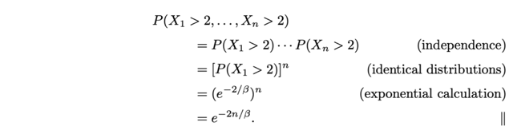</kbd></p>

<p align="center"><kbd></kbd></p>

<p align="center"><kbd>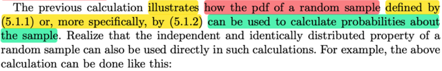</kbd></p>

> [!NOTE]
> Nhắc lại cho ta lần nữa rằng ví dụ vừa rồi minh họa cho ta thấy rằng pdf
> của random sample (again, định nghĩa của nó là set các random variables
> X1, X2...Xn mà Xi đại diện cho kết qủa của lần quan sát thứ i một yếu tố,
> biến số ngẫu nhiên nào đó), cũng là joint pdf của X1,....Xn sẽ có thể dùng
> để tính xác suất của event liên quan đến sample
>
> Ở đây gs cho biết ta cũng có thể dựa vào tính độc lập và identically
> distributed của X1, ...Xn để tính theo kiểu khác nhanh hơn nhưng, 
> thật ra là như nhau thôi
>
> P(X1 > 2, ...Xn > 2) dĩ nhiên có thể lập luận theo kiểu khác, đó là xác suất
> của n joint event (X1 > 2), ....(Xn > 2). Mà vì X1,...Xn độc lập nên các 
> event này cũng độc lập, nên theo định nghĩa của các event độc lập ta có
>
> ⇨ P(X1 > 2, ...Xn > 2) `=` P(X1 > 2)P(X2 > 2)...P(Xn > 2)
>
> ```text
> Và xét P(X1 > 2) thì ta tính ra e^-2/β từ việc X1 là expo(β)
> ```
>
> Và P(X2 > 2) cũng vậy do chúng đều là Expo `(β)`

<br>

<a id="node-329"></a>

<p align="center"><kbd>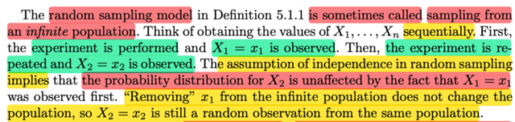</kbd></p>

> [!NOTE]
> Đoạn này rất quan trọng, đọc lướt là chả hiểu gì:
>
> Đại khái là ĐỊNH NGHĨA 5.1.1 VỀ RANDOM SAMPLING MODEL, có khi
> được gọi là SAMPLING TỪ MỘT POPULATION VÔ HẠN.
>
> Và để hiểu tại sao nó lại được gọi như vậy giáo sư Casella đề nghị ta hình
> dung một chuỗi các giá trị của X1, X2,...Xn theo kiểu như sau:
>
> Như đã nói, theo định nghĩa thì X1 là random variable đại diện cho kết quả
> của lần quan sát thứ nhất (quan sát giá trị của một yếu tố nào đó mà ta
> quan tâm tức variable of interest)
>
> Thế thì kiểu như là thực hiện thử nghiệm lần thứ 1 (tức observation 1) ta có
> giá trị hóa ra cụ thể là x1, tức là X1 `=` x1.
>
> Tiếp, thực hiện observation 2, tức là thử nghiệm, và ghi nhận giá trị của thứ
> mà ta quan tâm, được x2, tức là X2 `=` x2.
>
> Vậy thì vì **Ý CHÍNH ĐÓ LÀ: CÁI ASSUMPTION NÓI RẰNG CÁC RANDOM
> VARIABLE ĐỘC LẬP NHAU HÀM Ý RẰNG: GIÁ TRỊ CỤ THỂ CỦA X1 LÀ
> BAO NHIÊU KHÔNG ẢNH HƯỞNG GÌ TỚI GIÁ TRỊ CỦA CÁC X2,X3....**
>
> Và ĐIỀU NÀY ẨN CHỨA `/` ĐỒNG NGHĨA RẰNG, CŨNG Y NHƯ RẰNG:
>
> Bỏ x1 ra khỏi (tạm gọi là) danh sách các possible value thì CHẢ ẢNH
> HƯỞNG GÌ ĐẾN VIỆC X2 `=` x2

<br>

<a id="node-330"></a>

<p align="center"><kbd>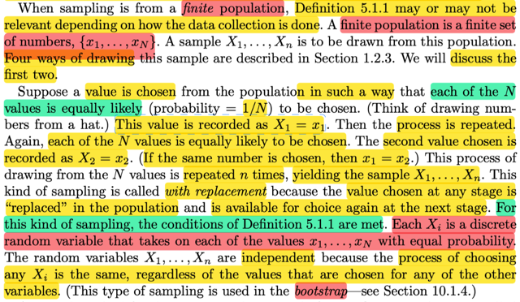</kbd></p>

> [!NOTE]
> Thế còn khi sampling từ MỘT POPULATION HỮU HẠN, THÌ ĐỊNH NGHĨA
> TA CÓ THỂ ĐỦ ĐIỀU KIỆN ĐỂ TUÂN THEO ĐỊNH NGHĨA 5.1.1 HAY KO
> THÌ CÒN TÙY THUỘC CÁCH THỨC SAMPLING
>
> Cụ thể là như sau:
>
> Gọi set {x1,...xN} là set HỮU HẠN, và đây là population (ý là ta sẽ lấy mẫu
> trong số lượng N giá trị này) 
>
> Thế thì, giả sử ta THỰC HIỆN THEO CÁCH NÀO ĐÓ ĐỂ MỖI CÁI TRONG
> N CÁI NÀY ĐỂU EQUALLY LIKELY: GIống như bốc xong (thực hiện observation
> xong) thì bỏ vào lại, để lần sau vẫn có thể bốc lại cái đó, và cách bốc cũng là
> ngẫu nhiên chứ ko ưu tiên cái nào)
>
> Hình dung làm thử nghiệm lần 1: Ta được x1. X1 `=` x1
>
> Làm thử nghiệm lần 2, được x2, X2 `=` x2
>
> Và x2 có thể bằng x1, nếu như cái được chọn của lần 2 TRÙNG cái được
> chọn của lần 1.
>
> ...
>
> tương tự vậy
>
> Thì bối cảnh này, phù hợp với định nghĩa của random sampling model 5.1.1
>
> Và **MỖI Xi ĐỀU LÀ MỘT RANDOM VARIABLE DISCRETE VỚI N POSSIBLE
> VALUE x1, x2,....xN, với XÁC SUẤT NHƯ NHAU P(Xi `=` x1) `=` P(Xi `=` x2) ...
>
> Nói thêm cái này sẽ dùng trong BOOTSTRAP**

<br>

<a id="node-331"></a>

<p align="center"><kbd>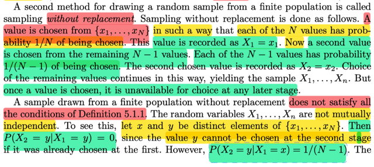</kbd></p>

> [!NOTE]
> Cách sampling thứ 2: without replacement:
>
> Observation 1: Thử nghiệm, thì X1 có thể có N possible values từ x1, → xN
> với xác suất bằng nhau. Giả sử turn out value là x1, ta có X1 `=` x1
>
> Loại bỏ x1 ra khỏi rổ các "possible value"
>
> Observation 2: Thử nghiệm, thì X2 có thỉ có `N-1` possible values, từ x2 → xN
> vì ko còn x1 nữa. Giả sử chọn được X2 `=` x2
>
> Tương tự như vậy ta có X2,..Xn
>
> Vậy thì, trong bối cảnh này, bộ random variable X1,....Xn KHỔNG THỎA
> MÃN MỌI ĐIỀU KIỆN CỦA ĐỊNH NGHĨA 5.1.1 
>
> Để thấy gs lấy x, y là hai giá trị khác nhau trong rổ {x1,...xN}
>
> ```text
> Thì chỉ cần xét P(X2 = y|X1 = y) ta thấy nó bằng 0 trong khi P(X2 = y|X1 = x)
> ```
> ta thấy nó bằng `1/(N-1)` ĐIỀU NÀY CHO THẤY GIÁ TRỊ CỤ THỂ CỦA X1
> ĐÃ ẢNH HƯỞNG ĐẾN XÁC SUẤT CỦA X2. DO ĐÓ X1, X2 **KHÔNG ĐỘC
> LẬP**

<br>

<a id="node-332"></a>

<p align="center"><kbd>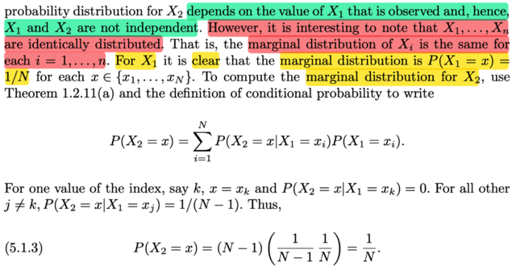</kbd></p>

> [!NOTE]
> Nhưng cái hay là, KHÔNG ĐỘC LẬP, NHƯNG CHÚNG VẪN IDENTICALLY
> DISTRIBUTED: TỨC LÀ VẪN CÓ CHUNG MARGINAL DISTRIBUTION
>
> Ko khó để chứng minh:
>
> Với X1, như đã nói, nó sẽ có N possible value với xác suất như nhau:
>
> P(X1 `=` x) `=` `1/N`
>
> Nhưng vấn đề là, X2 CŨNG SẼ CÓ MARGINAL PMF LÀ P(X2 `=` x) `=` `1/N:`
>
> Dùng LOTP:
>
> Lập luận là:
>
> ```text
> P(X1 = x) = Σi=1:N P(X2 = x, X1 = xi)  | tức là ta marginalizing joint pmf của
> ```
> X1,X2 qua mọi possible value của X1
>
> ```text
> = Σi=1:N P(X2 = x|X1 = xi)P(X1 = xi) | conditional probability theorem
> ```
>
> Như đã nói, trong số N cái possible value từ x1 tới xN, thì sẽ có một cái (gọi
> là xk cho tiện) mà khiến P(X2 `=` x|X1 `=` xk) `=` 0 (vì dù x là bao nhiêu thì cũng
> sẽ có một cái như vậy)
>
> ```text
> Do đó Σi=1:N P(X2 = x|X1 = xi)P(X1 = xi)
> ```
>
> ```text
> = Σi=1:N,xi ≠ xk P(X2 = x|X1 = xi)P(X1 = xi)
> ```
>
> P(X1 `=` xi) thì luôn là `1/N`
>
> ```text
> P(X2 = x|X1 = xi) = 1/(N-1)
> ```
>
> Nên `=` `Σi=1:N,xi` ≠ xk `(1/N-1)(1/N)` `=` `(N-1)(1/N-1)(1/N)` `=` **1/N
>
> Kết qủa này cho thấy, với MARGINAL DISTRIBUTION CỦA X2 VẪN
> GIỐNG X1.
>
> VÀ ĐỪNG NHẦM LẪN MÀ NÓI RẰNG X2 CHỈ CÓ `N-1` POSSIBLE VALUE
> NHÉ, KHÔNG ĐÓ CHỈ LÀ KHI ĐANG XÉT CONDITIONAL DISTRIBUTION
> DỰA TRÊN X1. CÒN MARGINAL, THÌ NÓ VẪN CÓ N POSSIBLE VALUES
> x1...xN
>
> Tất nhiên lập luận cho các rv khác cũng tương tự**

<br>

<a id="node-333"></a>

<p align="center"><kbd>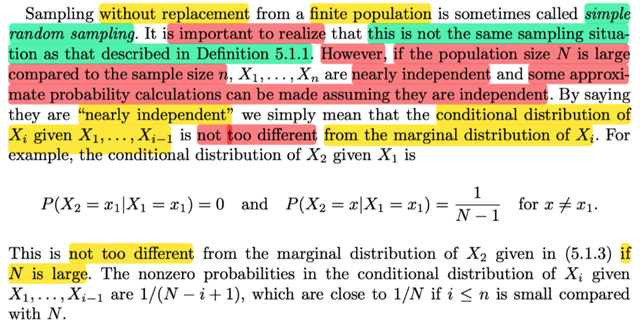</kbd></p>

> [!NOTE]
> Sampling with replacement THƯỜNG ĐƯỢC GỌI LÀ SIMPLE RANDOM 
> SAMPLING. 
>
> Tuy vậy, nếu như ngay cả khi sampling without replacement thì NẾU N LỚN
> HƠN NHIỀU SO VỚI n, tức số lượng của set finite {x1, ....xN} lớn hơn nhiều
> số random variable trong random sample.
>
> Khi đó chúng có thể được coi như NEARLY INDEPENDENT.
>
> Gs nói rằng ta có thể hiểu nôm na khái niệm nearly independent thông qua
> việc marginal distribution và conditional distribution ví dụ của X2 rất giống 
> nhau.
>
> ```text
> Như hồi nãy ta đã nói P(X2 = x1|X1 = x1) = 0 và P(X2 = x|X1 = x1) = 1/(N-1)
> ```
> với x khác  x1 cho thấy giá trị của X1 đã ảnh hưởng đến xác suất của X2.
>
> Thì nếu N rất lớn → `1/(N-1)` ≈ 0 dẫn đến coi như conditinal distribution ≈ 
> marginal distribution

<br>

<a id="node-334"></a>

<p align="center"><kbd>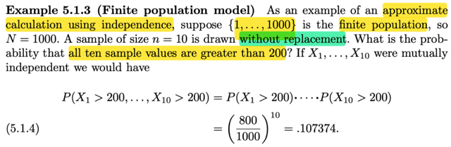</kbd></p>

> [!NOTE]
> lấy ví dụ, có finite population là {1,2,....1000} và ta sẽ có một sample size n
> `=` 10 được lấy từ finite population này theo lối sampling without
> replacement
>
> Là sao, đây là lúc ôn lại định nghĩa của random sampling model, hay
> random sample: gọi X1, X2,...Xn là một random sample size n từ
> population distribution f(x) nếu như: Xi là random variable đại diện cho quá
> trình quan sát giá trị thứ i của một biến nào đó mà ta quan tâm và cách
> thức thực hiện phải đảm bảo sao cho các random variable X1, X2,....Xn
> mutually independent cũng như là marginal distribution của chúng đều
> là ~ f(x)
>
> Vậy ở đây, ta có ví dụ cụ thể, có thể coi như có cái bình chứa 1000 quả
> banh đánh số từ 1 tới 1000. Và biến số mà ta quan tâm là giá trị của quả 
> banh được bốc ra theo lối sampling without replacement.
>
> Như vừa nói, theo lối sampling này, ko đảm bảo được yêu cầu về tính
> independent của các random variable.
>
> Thế thì ở đây ta sẽ tính xác suất của việc tất cả 10 lần bốc banh đều
> ra con số > 200.
>
> Đầu tiên gs giả sử tất cả các random variable đều mutually independent
> thì dĩ nhiên khi đó các event Xi > 200 cũng sẽ độc lập, nên xác suất của  
> joint event (X1 > 200, X2 > 200, ...X10 > 200) sẽ `=` tích các event:
>
> P(X1 > 200, X2 > 200, ...X10 > 200) `=` `Πi=1:10` P(Xi > 200)
>
> P(Xi > 200) `=` `(800/1000)` 
>
> ⇨ .. `=` `(800/1000)^10`
>
> Có thể thắc mắc tại sao lại là `800/1000:` Đó là vì ta đã chứng minh rằng,
> dù có là sampling with hay without replacement, thì tuy có thể ko thỏa
> tính mutual indepdendent, NHƯNG VẪN LUÔN CÓ TÍNH IDENTICALLY
> DISTRIBUTED mà mình đã thấy lúc nãy.
>
> Do đó marginal distribution của X1,X2,...Xn đều như nhau.
>
> Do đó xét event Xi > 200 ∀i, thì như ta đã nói nhiều lần, bản chất của
> event này, là viết tắt của {s ∈ `Ω:` Xi(s) > 200} 
>
> ⇨ P(Xi > 200) `=` P({s ∈ `Ω:` Xi(s) > 200})
>
> Theo định nghĩa của probability function:
>
> `=` `Σ{s` ∈ `Ω:` X(s) > 200} P({s})
>
> Thế thì, P({s}), tức xác suất của việc bốc được quả banh nào đều bằng
> ```text
> nhau, và vì Σ{s ∈ Ω} P({s}) = 1 ⇨ P({s}) = 1/ Sample space size = 1/1000
> ```
>
> Còn tập  {s ∈ `Ω:` X(s) > 200} dĩ nhiên là có 800 possible outcome
>
> ```text
> ⇨ Σ{s ∈ Ω: X(s) > 200} P({s}) = 800 * (1/1000)
> ```

<br>

<a id="node-335"></a>

<p align="center"><kbd>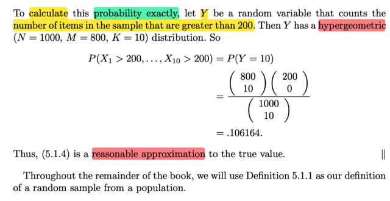</kbd></p>

> [!NOTE]
> Còn để tính chính xác, tức là nhìn nhận thực tế là các random variable
> X1,X2,...Xn không hoàn toàn mutually independent, thì ta sẽ phải tính 
> khác
>
> Và còn nhớ bài toán này chính là `/` rất giống bài toán bốc K banh từ trong 
> lọ có N banh, trong đó có M banh đỏ. Và ta quan tâm xác suất bốc được
> y banh đỏ trong K banh. Thì nếu gọi Y là số banh đỏ trong K banh, ta biết
> Y sẽ là random variable có distribution là Hypergeometric(N,M,K)
>
> Có pmf P(Y `=` y) có thể lập luận lại cho nhớ như sau:
>
> `Y=y` tức là event trong K banh bốc ra thì có y banh đỏ.
>
> Về bản chất `Y=y` chính là {s ∈ `Ω:` Y(s) `=` y}
>
> ```text
> ⇨ P(Y=y) = P({s ∈ Ω: Y(s) = y})
> ```
>
> ```text
> = Σ {s ∈ Ω: Y(s) = y} P({s}) theo định nghĩa của probability function
> ```
>
> Thế thì ta sẽ xem xét các possible outcome: tức là các bộ K banh bốc ra
> từ trong lọ. Có thể thấy khi xem xét các bộ K banh, thì ta thấy dù là sampling
> không hoàn lại hay có hoàn lại thì các possible outcome đều là ngẫu nhiên,
> đều có xác suất xảy ra là như nhau, miễn là ta ko cố tình chọn một banh nào
> đó.
>
> ```text
> Dựa trên axiom 1: P(Ω) = 1 ⇔ Σ{s ∈ Ω} P({s}) = 1 ⇨ P({s}) = 1/ Ω's size
> ```
>
> Câu hỏi là kích thước của sample space, và câu trả lời chính là khả năng
> xuất hiện khi ta chọn K banh từ lọ có N banh: Dễ thấy, trong hoàn cảnh này
> ta ko phân biệt thứ tự các banh. Do đó, ta sẽ có (N choose K) khả năng
> khác nhau, tức số các chọn một bộ K banh từ N banh.
>
> ⇨ P({s}) `=` 1 `/` (N choose K)
>
> Tiếp theo ta quay lại cái cần tìm là `Σ` {s ∈ `Ω:` Y(s) `=` y} P({s})
>
> Câu hỏi lúc này là xác định số possible outcome trong set {s ∈ `Ω:` Y(s) `=` y}
>
> tức là set các bộ K banh mà trong đó có y banh đỏ.
>
> và bài toán lúc này là đếm xem trong sample space có bao nhiêu bộ K banh
> loại này. 
>
> Cách lập luận sẽ là: Số bộ K banh có y banh đỏ có thể được đếm theo
> hai bước như sau: Bước 1: Chọn y banh đỏ: Ta có (M choose y) cách.
> Với mỗi cách chọn cụ thể, ta sẽ đều có (N `-` M choose K `-` y) cách chọn K `-` y
> banh trắng. Do đó theo step rule, ta có (M choose y)(N `-` M choose K `-` y)
> cách chọn bộ K banh có y banh đỏ.
>
> ```text
> Vậy tới đây P(Y=y) = Σ {s ∈ Ω: Y(s) = y} P({s})
> ```
>
> ```text
> = (M choose y)(N - M choose K - y) [1 / (N choose K)]
> ```
>
> Đây chính là pmf của Y ~ Hypergeometric (N,M,K)
>
> `====`
>
> Thế thì, quay lại bài toán này, ta nói bối cảnh của nó cũng giống.
>
> Là bởi ta có 1000 quả banh đánh số từ 1 đến 1000, và ta sẽ bốc ra n banh
> và quan tâm xác suất của event tất cả các banh đều mang số > 200.
>
> Vậy thì, ta có thể coi như, trong lọ có 1000 banh, trong đó có 800 banh đỏ,
> và 200 banh trắng. Khi đó việc bốc ra 10 banh mà tất cả đều > 200 cũng
> y như bốc 10 banh mà banh nào cũng đỏ.
>
> Và như đã nói, nếu gọi Y là số banh đỏ khi bốc K banh từ lọ có N banh,
> trong đó có M banh đỏ thì Y ~ Hypergeom (N,M,K) 
>
> Vậy ở đây ta có Y, số banh đỏ `=` "có label > 200" sẽ là Hypergeoem(1000, 800, 10)
>
> và event mọi banh đều > 200, chính là event Y `=` 10
>
> và áp dụng pmf của Y ta có `P(Y=10)` 
>
> ```text
> = (800 choose 10)(1000 - 800 choose 10 - 10) [1 / (1000 choose 10)]
> ```
>
> `=` (800 choose 10)(200 choose 0) `/` (1000 choose 10) `=` **.106164
>
> Kết qủa này cho thấy nó khá gần con số (800/1000)^10**

<br>

