# 5.2 Σ Of Random Variables From A Random Sample

📊 **Progress:** `22` Notes | `34` Screenshots

---

<kbd>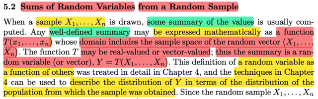</kbd>

> [!NOTE]
> Đây là định nghĩa rất quan trọng, đại khái gs nói rằng khi ta draw một
> sample X1, X2,...Xn (again, tức là ta tiến hành quan sát giá trị của một
> biến cố ngẫu nhiên nào đó n lần mà mỗi lần sẽ đại diện bởi random
> variable Xi, đồng thời cách tiền hành phải đảm bảo tính iid) thì người ta
> cũng thường SẼ TÍNH TOÁN MỘT SỐ KẾT QỦA ĐỂ TÓM TẮT THÔNG
> TIN (tạm dịch từ summary of values)
>
> Và thường chúng sẽ được thể hiện dưới dạng toán học BỞI MỘT
> FUNCTION T(x1,x2....xn). Mà DOMAIN CỦA HÀM T NÀY SẼ LÀ SAMPLE
> SPACE CỦA random vector (X1, X2, ....Xn).
>
> Dừng lại một chút, sample space của random variable vector (X1, X2...Xn)
> là sao?
>
> Là bởi như đã biết, khi tiến hành quan sát giá trị của yếu tố nào đó, lần
> thứ  nhất, dùng random variable X1 thể hiện chuyện đó. Thì tất nhiên kết
> quả cụ thể của biến cố sẽ được map bởi X1, đóng vai trò là function, tới
> real value. Do đó X1, là random variable, có sample space là tập các
> possible value của của nó. Tương tự vậy với các X2, Xn. Chúng đều là
> tập con của R
>
> Và từ đó tạo nên tập các possible value của random variable vector (X1,...
> Xn) là tập con của R^n
>
> Và hàm T sẽ map một possible values của (X1,X2,....Xn) đến một scalar
> hoặc vector, thì domain của nó là sample space của (X1,X2,....Xn)
>
> Và nếu gọi Y = T(X1,X2,...Xn) thì vì vector (X1,..Xn) có các possible value
> khác nhau nên Y cũng vậy, nên nó cũng là random variable (nếu T là
> scalar function) hoặc random variable vector (nếu T là vector function)
>
> Vậy thì những gì trong chương 4 mà mình đã học sẽ giúp ta TÍNH TOÁN
> DISTRIBUTION CỦA Y THEO DISTRIBUTION CỦA X1, X2 ,....Xn

 

<kbd>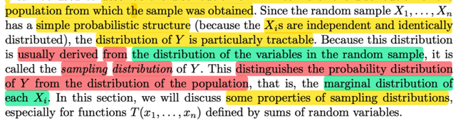</kbd>

> [!NOTE]
> Một định nghĩa quan trọng, đại khái là như vừa nói, **ta có thể mô tả
> distribution của Y theo distribution của X1, X2,...Xn** theo các technique
> ở chap 4. Mà, các random variable X1,X2...Xn là random variable của
> **một random sample**
>
> Do đó, distribution của Y được gọi là **SAMPLING DISTRIBUTION
>
> Nói vậy để phân biệt với distribution của population, tức là marginal
> distribution cùa các random variable Xi**Trong phần này ta sẽ học các đặc điểm của SAMPLING
> DISTRIBUTION

 

<kbd>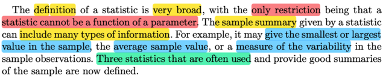</kbd>

<kbd></kbd>

<kbd>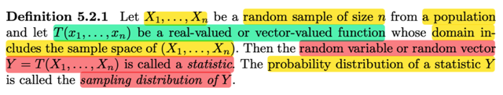</kbd>

> [!NOTE]
> VÀ ĐÂY LÀ ĐỊNH NGHĨA CỦA STATISTIC:
>
> Với random sample size n X1, X2...Xn từ một population, và có hàm T(x1,...xn)
> là real-values / vector-values có domain chứa sample space của (X1, X2, ...Xn)
> thì **Y = T(X1, X2...Xn) ĐƯỢC GỌI LÀ MỘT STATISTIC 
>
> (dĩ nhiên là một rv / rv vector)
>
> VÀ PROBABILITY DISTRIBUTION CỦA NÓ, ĐƯỢC GỌI LÀ SAMPLING
> DISTRIBUTION CỦA Y**Thế thì, đại khái là định nghĩa này rất rộng, với chỉ duy nhất một ràng buộc:
> nó ko thể là function của một parameter (chưa rõ lắm)
>
> Gs cho biết statistic mang thông tin "tóm gọn" của sample có thể có nhiều dạng, 
> có thể là trung bình value, có thể là giá trị nhỏ nhất hoặc mức biến động.
>
> Và có 3 lạoi hay dùng nhất

 

<kbd>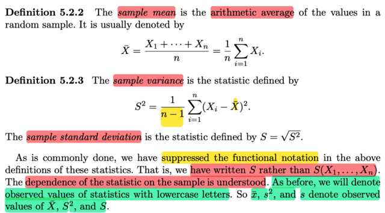</kbd>

> [!NOTE]
> Ba statistic hay dùng nhất đó là SAMPLE MEAN:
>
> Sample mean X_bar = (Σ Xi) / n
>
> Sample variance S^2 = 1/(n-1) Σ (Xi - X_bar)^2
>
> Sample standard deviation S = √S^2
>
> Điểm quan trọng gs lưu ý: Là ta đã bỏ đi kí hiệu function
>
> Ý là, như đã nói, STATISTIC ĐƯỢC ĐỊNH NGHĨA / CÓ BẢN CHẤT
> LÀ APPLY MỘT FUNCTION T LÊN CÁC RANDOM VARIABLE X1,...Xn
> CỦA MỘT RANDOM SAMPLE.
>
> Nên đáng ra phải ghi X_bar là X_bar(X1,X2,...Xn) để thể hiện rằng, nó
> ko đứng một mình, mà nó phụ thuộc vào X1, X2,...Xn 
>
> Và ta phải tự hiểu điều này.
>
> Và một ý nữa là, cũng như theo quy ước ta ghi chữ thường cho giá trị
> possible value của random variable, thì nay cũng vậy. x_bar, s^2, s
> sẽ chỉ possible value (hay giá trị cụ thể, hay giá trị quan sát được, cũng
> như nhau) của X_bar, S^2, S

 

<kbd>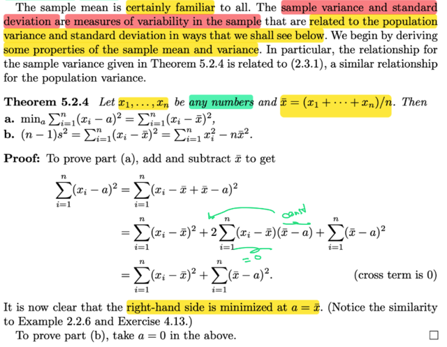</kbd>

🔗 **Related:** [7.2 METHOD OF FINDING ESTIMATORS](72_method_of_finding_estimators.md#node-568)

> [!NOTE]
> Đại khái là sample mean thì dễ rồi, nó đo giá trị trung bình của các rv trong sample.
>
> Còn sample variance, và sample std sẽ ĐO MỨC BIẾN ĐỘNG BÊN TRONG MỘT
> RANDOM SAMPLE
>
> Và ta sẽ thấy quan hệ của nó vói MỨC BIẾN ĐỘNG BÊN TRONG POPULATION
>
> Đầu tiên ta sẽ có theorem này:
>
> Cho x1, x2, ...xn là bộ số bất kì, và x_bar là trung bình.
>
> Khi đó a) min a Σ(xi - a)^2 = Σ(xi - x_bar)^2
>
> nói bằng lời cho dễ hình dung là, con số a khiến Σ(xi - a)^2 nhỏ nhất chính là trung
> bình của đám x1,x2,...xn
>
> Chứng minh rất dễ:
>
> Bắt đầu với Σ(xi - a)^2, công và trừ cho x_bar:
>
> Σ(xi - x_bar + x_bar - a)^2 = Σ [(xi - x_bar)^2 + (x_bar - a)^2 + 2(xi - x_bar)(x_bar -
> a)]
>
> = Σ (xi - x_bar)^2 + Σ(x_bar - a)^2 + 2Σ(xi - x_bar)(x_bar - a)
>
> Xét Σ(xi - x_bar)(x_bar - a) = (x_bar - a) Σ(xi - x_bar) | x_bar - a ko phụ thuộc i
>
> = (x_bar - a) [Σxi - Σx_bar]
>
> = (x_bar - a) [n x_bar - n x_bar] = 0
>
> ⇨ Σ(xi - a)^2 = Σ (xi - x_bar)^2 + Σ(x_bar - a)^2 (1)
>
> Do đó minimize a Σ(xi - a)^2 = minimize a [Σ (xi - x_bar)^2 + Σ(x_bar - a)^2]
>
> và solution dễ thấy sẽ là a = x_bar
>
> Ý b: (n - 1)s^2 = Σ (xi - x_bar)^2 = Σ xi^2 - nx_bar^2
>
> Chứng minh thì chỉ việc thay a = 0 vào kết quả (1) trên:
>
> Σ(xi - a)^2 = Σ (xi - x_bar)^2 + Σ(x_bar - a)^2
>
> → Σ(xi - 0)^2 = Σ (xi - x_bar)^2 + Σ(x_bar - 0)^2
>
> ⇔ Σ xi^2 = Σ (xi - x_bar)^2 + Σ x_bar^2
>
> ⇔ Σi (xi - x_bar)^2 = Σi xi^2 - Σi x_bar^2
>
> ⇔ Σi (xi - x_bar)^2 = Σi xi^2 - Σi x_bar^2
>
> ⇔ [1/(n-1)] Σi (xi - x_bar)^2 = [1/(n-1)] Σi xi^2 - Σi x_bar^2
>
> ⇔ **(n - 1) s^2 = Σi xi^2 - Σi x_bar^2**

 

<kbd>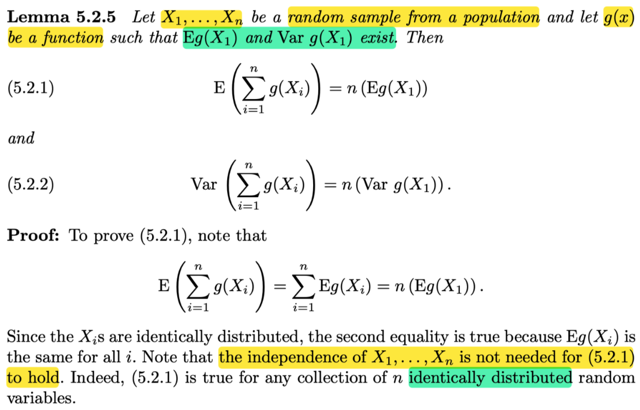</kbd>

<kbd></kbd>

<kbd>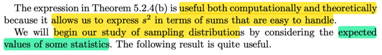</kbd>

> [!NOTE]
> Đại khái là bổ đề này nói rằng: Với random sample size n từ một population 
> X1,X2...Xn và cho hàm g(x) là hàm sao cho tồn tại Eg(X1) và Var[g(X1)]
>
> Thì a) E(Σ g(Xi) = n [Eg(X1)]
>
> và b) Var[Σ g(X1)] = n Var[g(X1)]
>
> Chứng minh a rất đơn giản: dùng linearity ta có E(Σ g(Xi) = Σi Eg(Xi)
>
> sau đó, vì như đã biết, tính chất của random sample size n từ một population
> có định nghĩa là X1, ....Xn đại diện cho n observation giá trị của một variable
> nào đó Và các observation được tiến hành theo cách các random variables
> X1,..Xn mutual independent và có cùng marginal distribution do đó Eg(X1)
> Eg(X2), Eg(X3)....đều bằng nhau (ví dụ như tính Eg(Xi) theo LOTUS, ta 
> sẽ có Σ{mọi possible value của Xi} g(x)fXi(x) hoặc ∫-inf:inf g(x)fXi(x)dx
> mà fXi(x) với mọi i đều như nhau nên kết quả sẽ như nhau)
>
> Do đó Σi Eg(Xi) = n Eg(Xi)
>
> Người ta có chú ý rằng, ý a của Bổ đề này VỐN KHÔNG CẦN X1,X2...Xn
> INDEPENDENT, vì như mình đã thấy ở trước đây, ngay cả khi tiến hành
> theo lối sampling without replacement, thì dù các random variable X1,..Xn
> KHÔNG MUTUAL INDEPENDENT, nhưng CHÚNG VẪN CÓ CÙNG MARGINAL
> DISTRIBUTION (IDENTICALLY DISTRIBUTED)

 

<kbd>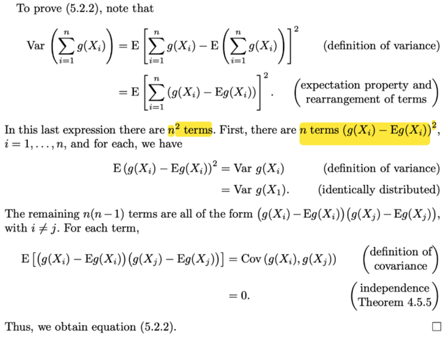</kbd>

> [!NOTE]
> Để chứng minh ý 2 thì đại khái là vầy:
>
> Bắt đầu từ vế trái Var[Σi g(Xi)]
>
> Đầu tiên đơn giản là ta dùng công thức thứ nhất của Variance:
> Ý nghĩa của variance, là đo mức biến động, theo Stat110 ta đã học,
> để đo mức biến động của random variable, thì đầu tiên người ta nghĩ rằng
> có thể tính trung bình của mức độ lệch giữa random variable và mean của 
> nó: E(X - EX), tuy nhiên, nếu dùng cách tính này thì nó sẽ thành 0 do linearity
> E(X - EX) = EX - E(EX) = EX - EX = 0, mà nôm na là các giá trị đối nhau qua
> tâm sẽ cancel nhau.
>
> Do đó người ta mới bình phương lên: E(X - EX)^2
>
> Vậy Var[Σi g(Xi)] = E([Σi g(Xi)] - E[Σi g(Xi)])^2 đó là hàng trên
>
> Tiếp xét cái term E[Σi g(Xi)], dùng linearity ta có [Σi Eg(Xi)]
>
> Nên E([Σi g(Xi)] - E[Σi g(Xi)])^2 = E([Σi g(Xi)] - [Σi Eg(Xi)])^2
>
> = E(   Σi g(Xi) - Σi Eg(Xi)  )^2 | bỏ dấu ngoặc thôi
>
> = **E(   Σi [g(Xi) - Eg(Xi)]  )^2** | gom hai dấu tổng lại, được kết qủa hàng thứ 2
>
> Tiếp, đại khái là vầy:
>
> Phải nhớ là ta đang dùng công thức thứ nhất của Variance, E(X - EX)^2
>
> thì nó là gì, nó là expected value của (X - EX)^2, chứ ko phải là bình phương
> của E(X - EX)
>
> Nên E[(Σi [g(Xi) - Eg(Xi)])^2] là expected value của (Σi [g(Xi) - Eg(Xi)])^2
>
> Mà cái này là bình phương của một cái tổng có n hạng tử
>
> Giống như (a + b)^2 = a^2 + b^2 + 2ab,
>
> Hoặc (a + b + c)^2 = a^2 + b^2 + c^2 + 2ab + 2bc + 2ca
>
>  hay khái quát lên ta có cái gọi là công thức Nhị thức Newton (a1 + a2 + ...an)^2
>
> Thì khai triển ra, ta sẽ có n hạng tử có dạng ai^2, (ví dụ như với 2 hạng
> tử thì ta có a^2 và b^2, 2*1 cái cross term, với 3 hạng tử thì ta có 3 cái ai^2
> và 3*2 cái cross term)
>
> Áp dụng vào đây ta có là bình phương của tổng các hạng tử:
>
> [ [g(X1) - Eg(X1)] + [g(X2) - Eg(X2)] + ....[g(Xn) - Eg(Xn)] ]^2
>
> Do đó ta sẽ có n term có dạng [g(Xi) - Eg(Xi)]^2
>
> Tổng của chúng là Σi [g(Xi) - Eg(Xi)]^2
>
> Và n(n-1) cross term có dạng: [g(Xi) - Eg(Xi)][g(Xj) - Eg(Xj)] với i khác j
>
> Vậy E[(Σi [g(Xi) - Eg(Xi)])^2]
>
> = E[ Σi [g(Xi) - Eg(Xi)]^2  + ΣiΣi,j≠i  [g(Xi) - Eg(Xi)][g(Xj) - Eg(Xj)]]
>
> Dùng tính chất linearity, đưa E vào trong Σ 
>
> = E [Σi [g(Xi) - Eg(Xi)]^2]  + E [ΣiΣi,j≠i  [g(Xi) - Eg(Xi)][g(Xj) - Eg(Xj)]]]
>
> = Σi E [g(Xi) - Eg(Xi)]^2  + ΣiΣi,j≠i  E [g(Xi) - Eg(Xi)][g(Xj) - Eg(Xj)]]
>
> Xét Σi E [g(Xi) - Eg(Xi)]^2
>
> thì E [g(Xi) - Eg(Xi)]^2, chính là gì?
>
> ⇨ Chính là Var[g(Xi)], vì sao?
>
> Vì nếu đặt Y = g(Xi) thì E [g(Xi) - Eg(Xi)]^2 chính là E[Y - EY]^2, là công thức
> của Var(Y)
>
> ⇨ Σi E [g(Xi) - Eg(Xi)]^2 = **Σi Var[g(Xi)]
>
> Mà Var[g(Xi)] = Var[g(X1)] vì mọi X1,X2...Xn identically distributed
>
> Nên .. = n Var[g(X1)]**====
>
> Xét ΣiΣi,j≠i  E [g(Xi) - Eg(Xi)][g(Xj) - Eg(Xj)]]
>
>
> E [g(Xi) - Eg(Xi)][g(Xj) - Eg(Xj)]] chính là gì?
>
> ⇨ Chính là Cov(g(Xi), g(Xj)), vì công thức thứ nhất của covariance là 
>
> Cov(X,Y) = E[(X-EX)(Y-EY]
>
> Và Cov(g(Xi), g(Xj)) bằng 0, lí do là như đã nói theo định nghĩa của random
> sample thì X1,X2,...Xn MUTUALLY INDEPENDENT. Và các chương trước
> ta đã biết X,Y independent thì Cov(X,Y) = 0.
>
> (Ôn lại nhanh: lí do là vì Cov(X,Y) = E[(X-EX)(Y-EY] triển khai ra ta sẽ có
> công thức thứ 2 của Cov(X,Y) = EXEY - E(XY)
>
> Mà xét E(XY), theo 2D LOTUS, giả sửa X,Y là continuous random variable
>
> = ∫∫xyfXY(x,y)dxdy 
>
> Mà X,Y independent nên joint pdf của chúng = tích marginal pdf của từng đứa
>
> ..= ∫∫xyfX(x)fY(y)dxdy 
>
> = ∫fY(y)y ∫x[fX(x)dx] dy | tính tích phân theo x trước ta sẽ đưa những gì ko dính
> tới x ra ngoài:
>
> = ∫x[fX(x)dx] ∫fY(y)ydy | tất nhiên kết quả ∫x[fX(x)dx] cũng ko dính tới y, nên khi tính
> tích phân theo y ta lại đưa nó ra
>
> Và đây chính là EX EY
>
> ⇨ EXEY -E(XY) = EXEY - EXEY = 0
>
> Vậy các cross term đều bằng 0
>
> Do đó chứng minh xong **Var[Σi g(Xi)] = n Var[g(X1)]**

 

<kbd>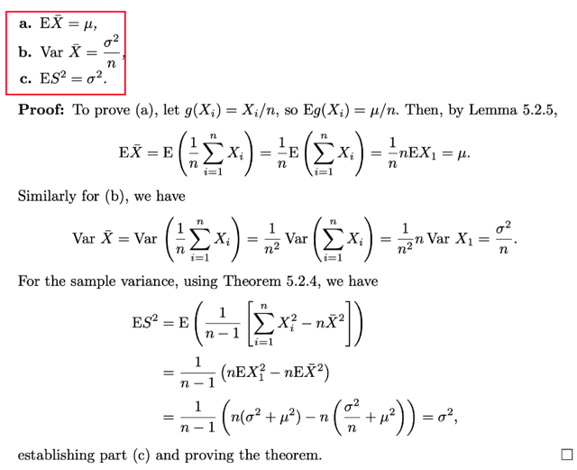</kbd>

<kbd></kbd>

<kbd>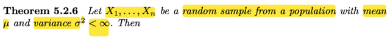</kbd>

🔗 **Related:** [5.5 CONVERGENCE CONCEPTS](55_convergence_concepts.md#node-393)

🔗 **Related:** [7.3 METHODS OF EVALUATING ESTIMATORS](73_methods_of_evaluating_estimators.md#node-603)

🔗 **Related:** [7.3 METHODS OF EVALUATING ESTIMATORS](73_methods_of_evaluating_estimators.md#node-615)

> [!NOTE]
> Ta qua theorem 5.2.6, cho X1, ...Xn là một random sample size n từ một
> population có mean μ và variance σ^2 < inf
>
> Ôn lại một chút về random sample. THeo định nghĩa, đại khái là random sample
> size n từ population f(x) là một bộ các random variable. Ta quan tâm một biến số
> ngẫu nhiên nào đó, và tiến hành quan sát giá trị của nó n lần. Và dùng X1 để đại
> diện / thể hiện cho kết quả của lần quan sát thứ 1, X2,....lần quan sát thứ 2...
>
> Và dĩ nhiên là vì đây là ta đang quan sát một biến số ngẫu nhiên nào đó, nên giá
> trị của lần quan sát thứ 1 có thể có những giá trị khác nhau. Do đó X1 là random
> variable. Và các Xi kia cũng vậy.
>
> Tuy nhiên theo định nghĩa, các observation phải được tíến hành theo cách sao
> cho đảm bảo các random variable MUTUALLY INDEPENDENT và chúng đều có
> cùng MARGINAL DISTRIBUTION (tuân theo pdf/pmf) f(x)
>
> Thế thì ở đây, ta biết / gọi population distribution (cũng là marginal distribution)
> của mỗi r.v Xi có mean μ và variance σ^2
>
> Theorem này nói rằng a) EX_bar = μ
>
> Chứng minh đơn giản là dùng bổ đề 5.2.5. Trong đó nói rằng E[Σi g(Xi)] = n
> Eg(X1)
>
> Vậy EX_bar = E[(1/n) ΣXi] = E[Σi Xi/n], gọi g(Xi) = Xi/n ta sẽ có cái cần tính
> chính là E[Σi g(Xi)], theo bổ đề, = n Eg(X1) (thay g(X1) = X1/n vào lại)
>
> = n E(X1/n). Đến đây dùng linearity E(cX) = cEX
>
> = n (1/n) EX1 = EX1. Và như đã nói X1, X2...Xn đều có marginal distribution là
> population distribution nên EXi = μ ∀ i
>
> ⇨ ...EX_bar = μ . Ý nghĩa của nó là mean / expected value / expectation của
> SAMPLE MEAN bằng POPULATION MEAN
>
> ====
>
> b) Var(X_bar) = σ^2 / n
>
> Vế trái Var(X_bar) = Var[(1/n) Σi Xi)] , dùng tính chất Var(cX) = c^2 Var(X) đưa
> 1/n ra
>
> .. = (1/n)^2 Var (Σi Xi)
>
> Tới đây dùng bổ đề 5.2.5 (phần 5.2.2) Var [Σi g(Xi)] = n Var[g(X1)]
>
> Thì ở đây coi g(Xi) = Xi (tức hàm g là hàm "ko làm gì cả", g(u) = u)
>
> ⇨ Var (Σi Xi) = Var (Σi g(Xi)) và theo bổ đề = n Var(g(X1)), thay lại g(X1) = X1
>
> ta có = n Var(X1)
>
> ⇨ (1/n)^2 Var (Σi Xi) = (1/n)^2 n Var(X1)
>
> Và Var(X1) chính là population variance σ^2
>
> ⇨ ..= (1/n)^2 n σ^2 = **σ^2 / n**
>
> c) ES^2 = σ^2
>
> S^2 như đã biết, là SAMPLE VARIANCE, có công thức là :
>
> **S^2 = [1/(n-1)] Σi (Xi - X_bar)^2**Thế thì mình phải hiểu thế này: S^2, chỉ là kí hiệu của SAMPLE VARIANCE,
> và nó như những bài trước đã biết, là một STATISTIC, có bản chất là việc ta
> apply một function lên các random variable X1,...Xn****Và vì giống như khi apply function g lên random variable X, g(X), thì với các
> possible value khác nhau của X, thì g(X) sẽ có các possible value khác nhau.
> Nên g(X) cũng là một random variable.
>
> **Nên S^2 cũng là một random variable.
>
> Và trong những phần trước giáo sư Casella cũng có nói rằng, ĐÁNG LẼ
> TA PHẢI / HOẶC LÀ TA PHẢI TỰ HIỂU SAMPLE MEAN, SAMPLE VARIANCE,
> ....LÀ CÁC FUNCTION CỦA X1,X2....Xn**Ví dụ, đáng lẽ phải ghi là S^2(X1,X2...Xn) hay X_bar(X1,X2...Xn) để thể hiện
> điều đó. Nhưng by convention, người ta sẽ tự hiểu chuyện này.
>
> Cho nên  điều muốn nói ở đây, LÀ S^2 LÀ MỘT FUNCTION CỦA CÁC RVS X1,..Xn
>
> Và function đó là function nào: Đó là g(x1, x2,..xn) = [1/(n-1)] Σi (xi - x_bar)^2****Để rồi khi apply nó (g) lên các random variable X1, X2...Xn thì ta có:****g(X1, X2,..Xn) = [1/(n-1)] Σi (Xi - X_bar)^2, và = S^2
>
> Thế thì tới đây ta mới nói về Theorem 5.2.4 cho ta: 
>
> Σi (xi - x_bar)^2 = Σi xi^2 - n x_bar^2
>
> ⇨ [1/(n-1)] Σi (xi - x_bar)^2 = [1/(n-1)] [ Σi xi^2 - n x_bar^2 ]**Và vế trái chính là hàm g của ta đang nói ở trên**Vậy apply hàm g (vế trái) cũng y như apply hàm [1/(n-1)] [ Σi xi^2 - n x_bar^2 ] 
> lên X1,X2...Xn
>
> Từ đó ta có:****S^2 = [1/(n-1)] [ Σi Xi^2 - n X_bar^2 ]  (dĩ nhiên khi Xi đóng vai xi thì X_bar đóng vai x_bar)
>
> (sách nói dùng bổ đề là ở chỗ này) 
>
> Như vậy ta có ES^2 = E { [1/(n-1)] [ Σi Xi^2 - n X_bar^2 ] }
>
> Dùng linearity (tính tuyến tính của kì vọng) E(X1 + X2) = EX1 + EX2, và E(cX) = cEX
>
> → .. = [1/(n-1)] E [ Σi Xi^2 - n X_bar^2 ] 
>
> = [1/(n-1)]  { E [Σi Xi^2] -  E [ n X_bar^2 ] }
>
> = [1/(n-1)]  { Σi E(Xi^2) -  n E[X_bar^2] }
>
> Tới đây vì X1, X2...Xn ĐỀU IDENTICALLY DISTRIBUTED, tức là ta đã nói ở trên, chúng
> đều có chung marginal distribution. Do đó EX1 = EX2 = ...EXn. 
>
> ⇨ Σi E(Xi^2) = Σi E(X1^2) = **n E(X1^2)**
>
> Vì sao? Vì ta nhớ công thức của kì vọng = Σ {mọi possible values x của X} xfX(x) (với
> biến rời rạc) hoặc ∫-inf:inf xfX(x)dx với biến liên tục
>
> Mà X1,X2..Xn đều có chung pdf/pmf (thì đồng nghĩa cũng có chung set các possible
> value) ⇨ kì vọng của chúng bằng nhau
>
> Vậy tới đây ta có **[1/(n-1)]  { n E(X1^2) -  n E[X_bar^2] }**
> Tới đây, xét E(X1^2):
>
> Ta nhớ công thức variance (công thức thứ 2 của Var(X)): Var(X) = EX^2 - (EX)^2 (nhớ
> lại trong STAT110, thầy Blizstein có nói by convention khi khi EX^2 thì hiểu là kì vọng
> của X^2, còn khi ghi bình phương của kì vọng của X thì là (EX)^2
>
> Vậy EX^2 = Var(X) + (EX)^2 
>
> Áp dụng vào đây E(X1^2) = Var(X1) - (EX1)^2. Mà Var(X1) là population variance σ^2,
> EX1 = population mean μ 
>
> ⇨ EX1^2 = σ^2 + μ^2 
>
> ⇨ n E(X1^2) = **n (σ^2 + μ^2 )**Tương tự ta cũng E(X_bar^2) = Var(X_bar) + (EX_bar)^2
>
> DÙng kết quả a), b)  ⇨ E(X_bar^2) = σ^2 / n + μ^2
>
> ⇨ [1/(n-1)]  { n E(X1^2) -  n E[X_bar^2] }
>
> = [1/(n-1)]  { n (σ^2 + μ^2 ) -  n (σ^2 / n + μ^2) }
>
> = [1/(n-1)]  ( n σ^2 + n μ^2  -  n σ^2 / n - n μ^2 )
>
> = [1/(n-1)]  ( n σ^2 -  σ^2 )
>
> = [1/(n-1)]  (n -1)  σ^2 
>
> = **σ^2  Chứng minh xong**

 

<kbd>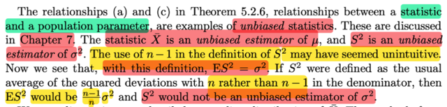</kbd>

> [!NOTE]
> Đây là nơi ta đựơc gặp lại một khái niệm đã gặp trong Deep Learning
> của  Yoshua Bengio: Biased/ Unbiased estimator
>
> Đại khái là, như theorem vừa rồi ta thấy E X_bar = μ, và ES^2 = σ^2
>
> Tức là kì vọng của sample mean đúng bằng population mean và kì vọng
> của sample variance đúng bằng population variance
>
> Thế thì, đại ý là, vì tính chất này, mà sample mean X_bar được gọi là
> unbiased estimator của population mean (bias tiếng việt là định kiến,
> hiểu nôm na unbiased là "không bị định kiến", ý là định kiến sẽ khiến ta
> mắc sai sót, thì cái này ko bị  định kiến nên nó đúng, ý là vậy)
>
> Tương tự sample variance là unbiased estimator của sample variance.
>
> Tuy nhiên, điểm chú ý ở đây là giải thích cho sự kì cục (có vẻ kì cục)
> trong công thức của sample variance:
>
> S^2  = [1/(n-1)] [ Σi (Xi - X_bar)^2 ] 
>
> Điểm kì cục là tại sao chia n - 1. 
>
> Giống như với sample mean, X_bar = (1/n) Xi thì ta thấy bình thường.
>
> Thì ở đây gs sẽ bàn kĩ hơn ở chương 7
>
> Còn trước mắt, nếu ta dùng công thức "chia cho n thay vì chia n-1" thì
> ES^2 sẽ = [(n-1)/n] σ^2 Không khó để chứng minh vì hồi nãy ta đã tới
> đây:
>
> ES^ = [1/(n-1)]  (n -1)  σ^2 , với  [1/(n-1)]  là do công thức S^2 = 
> [1/(n-1)] [ Σi (Xi - X_bar)^2 ]
>
> Còn nếu thay bằng "chia n" thì ta có: ES^ = [1/n]  (n -1)  σ^2
>
> = [(n-1)/n] σ^2, tức là nó sẽ ko bằng đúng population variance ⇨ BIASED
>
> Và nhớ lại trong cuốn Deep Learning của Yoshua bengio mình đã từng
> thấy tác giả nói về vụ này

 

<kbd>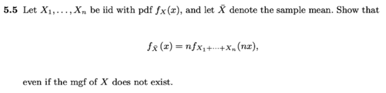</kbd>

> [!NOTE]
> Để học tiếp ta cần chứng minh cái này trước:
>
> Cho X1, X2...Xn là iid có pdf fX(x), X_bar kí hiệu sample mean.
>
> Ta cần chứng minh **fXbar(x) = nfX1+X2+...Xn(nx)**
>
> Đầu tiên, fX1+X2...Xn(), tức là pdf của Y = X1+X2+...Xn
>
> Nhớ lại hồi học Stat110, cách tiếp cận quen thuộc để derive pdf là bắt đầu
> từ cdf (còn với pmf thì ta sẽ lập luận xây dựng pmf ngay từ đầu, dựa trên
> xác suất của event trong original sample space)
>
> Thế thì, xét cdf của X_bar. Theo định nghĩa, cdf của X_bar, kí hiệu
> F_X_bar(x_bar) có ý nghĩa là P(X_bar ≤ x_bar)
>
> (x_bar chỉ là kí hiệu cho biến của hàm F_X_bar(.), ta có thể ghi là x cũng
> được:
>
> F_Xbar(x) = P(X_bar ≤ x), ko sao cả)
>
> Xét event X_bar ≤ x:
>
> X_bar ≤ x ⇔ (1/n) Σi Xi ≤ x  | Do X_bar = (1/n) Σi Xi
>
> ⇔ Σi Xi ≤ n x | nhân hai vế cho n là số dương không đổi dấu bất đẳng thức
>
> Vậy P(X_bar ≤ x) = P(Σi Xi ≤ n x) | vì các event là tương đương / như nhau
>
> Thế thì vế phải là gì, chính là P(Y ≤ nx), theo định nghĩa của cdf thì đây
> chính là F_Y(nx), hay thay Y = X1 + X2 + ... thì ta có **F_X1+X2+...Xn
> (nx)**
>
> Vậy tới đây ta có F_Xbar(x) = F_Y(nx) = F_X1+X2+...Xn (nx) (1)
>
> Tiếp theo, lấy đạo hàm theo x, ta sẽ có f_Xbar(x):
>
> Lí do vì sao? Ôn lại lí thuyết chỗ này:
>
> Nguyên nhân là, ví dụ với random variable X. đầu tiên, định nghĩa của cdf
> FX(x) = P(X ≤ x)
>
> Còn định nghĩa của pdf fX(x) là hàm fX(x) sao cho ∫-inf:x fX(t)dt = FX(x)
>
> Thế thì với các quan hệ này (do định nghĩa của chúng), ta sẽ dựa vào
> Fundamental Theorem of Calculus, FTC1, nói rằng: Nếu ta có hàm G(x)
> được định nghĩa bởi G(x) = ∫-inf:x f(t)dt thì hàm G là nguyên hàm của f (anti
> derivative), do đó: G'(x) = f(x) Chú ý, đây là điều mà FTC1 nói.
>
> Do đó, với việc ta có quan hệ giữa FX(x) và fX(x) ở trên, thì theo FTC1, cdf
> FX chính là nguyên hàm của pdf fX.
>
> Từ đó ta có d/dx FX(x) = fX(x)
>
> Vậy lấy đạo hàm theo x hai vế của (1) ta sẽ có:
>
> d/dx F_Xbar(x) = d/dx F_X1+X2+...Xn (nx) = d/dx FY(nx)
>
> Vế trái như trên nói, chính là fXbar(x),
>
> còn vế phải, ta sẽ dùng chain rule
>
> d/dx FY(nx) = d/d(nx) FY(nx) . d/dx (nx)
>
> = fY(nx) . n
>
> = n fY(nx)
>
> = **n f_X1+X2+...Xn(nx) Chứng minh xong fXbar(x) = nfX1+X2+...Xn(nx)**

 

<kbd>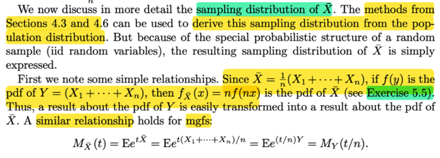</kbd>

> [!NOTE]
> thế thì ta sẽ thảo luận về SAMPLING DISTRIBUTION của Xbar
>
> Chỗ này cần ôn lại, tại sao gọi là / thế nào là sampling distribution?
>
> ở những phần trước, đại khái có nói rằng, ta đã biết Xbar, có bản chất là
> Xbar(X1,X2,....Xn), tức là, nó là một hàm số phụ thuộc các random variance
> X1,...Xn. Hay cũng chính là nói, ta apply một function f(x1,x2... xn) lên bộ các
> random variable X1,X2....Xn để có f(X1,X2,..Xn) Với công thức cụ thể của f là
> f(x1,...xn) = (x1 + x2 + ....xn) / n
>
> Và vì ta đã biết, khi apply một function lên các random variable, ta sẽ được
> một random variable mới. Và dĩ nhiên là nếu đã là random variable thì nó " có
> quyền" có distribution.
>
> Tuy nhiên, hiểu nôm na là vì Xbar là kết quả của việc apply một function lên
> một đám các random variable, để rồi nó phụ thuộc các random variable này.
> Và các random variable X1,X2...Xn là các random variable của một
> RANDOM SAMPLE size n. Nên distribution của Xbar được gọi là SAMPLING
> DISTRIBUTION. Nhằm nhấn mạnh / nhắc nhớ rằng Xbar được sinh ra từ
> việc ta apply hàm f lên các random variable X1,...Xn
>
> Nó khác với distribution của X1,...Xn. Gọi là POPULATION distribution, tức là
> kiểu như phân phối xác suất vốn dĩ đã có trong tự nhiên.
>
> Thế thì vừa rồi ta đã chứng minh rằng fXbar(x) = nfX1+X2+...Xn(nx)
>
> nên ở đây, gọi Y là X1 + X2 + ...Xn thì ta có **fXbar(x) = nfY(nx)**nên hay gọi f(y) là pdf của Y thì **fXbar(x) = nf(nx)
>
> (nói chung là nhờ làm excercise 5.5 mà ta hiểu cái câu trong sách)**Tương tự với MGF:****MGF (tức moment generating function) ta còn nhớ ý nghĩa của nó là (ví dụ
> MGF của random variable X) kí hiệu là MX(t) có bản chất là E[e^tX]. Ôn lại
> xíu về cái này, again, e^tX là gì? ⇨ ta hiểu nó là việc apply function g(u) =
> e^(tu) lên random variable X, để có e^tX. Và như đã quen thuộc, apply một
> function lên một random variable SẼ CHO RA MỘT RANDOM VARIABLE
> MỚI. Do dó e^tX là một random variable.
>
> Và vì nó là random variable nên nó CÓ DISTRIBUTION, và CÓ EXPECTED
> VALUE. Nên ta hiểu vì sao có E[e^tX] là vậy. (đây là lời giảng của gs Blizstein
> trong Stat110 - Harvard)
>
> Thế thì sao MX(t) lại là hàm theo t?
>
> Đó là vì, với mỗi giá trị cụ thể của t, ta có một hàm g(u) = e^tu, để rồi apply
> nó lên X ta có random variable mới g(X) = e^tX. Sau đó lấy kì vọng (expected
> value) thì SẼ RA MỘT KẾT QUẢ HẰNG SỐ (kì vọng của random variable là
> một constant, ko còn là random variable nữa)
>
> Như vậy với mỗi một giá trị cụ thể của t thì ta có một giá trị cụ thể của E[e^tX]
> Nên E[e^tX] DĨ NHIÊN LÀ HÀM THEO t, và vì nó gắn với random variable X,
> nên người ta kí hiệu là MX(t). ****Như vậy, quay lại đây. mgf của X_bar,
> tương tự kí hiệu là M_Xbar(t) có bản chất là E[e^tXbar] ****Mà Xbar, again lại
> là function của một đám X1,...Xn: Xbar = (Σi Xi)/n = Y/n****E[e^tXbar] = E[e^t[(X1 + X2 + ...Xn)/n]]****hay E[e^t[(Y)/n]]
>
> **Chuyển 1/n sang cho t, để có E[e^[(t/n)Y]**Đến đây, để không bị lú, ta sẽ lập luận lại:
>
> MX(t) có bản chất là E[e^tX], là hàm theo t, là mgf của X evaluate tại t,
>
> vậy thì MX(αt) là mgf của X, evaluate tạo αt, có bản chất là E[e^(αt)X]
>
> Do đó E[e^[(t/n)Y] chính là gì? ⇨ Chính là mgf của Y, evaluate tại t/n (coi α =
> 1/n) ****Do đó M_Xbar(t) = E[e^tXbar]  = E[e^[(t/n)Y] = mgf của Y, evaluate tại
> t/n,
>
> **chính là MY(t/n)**

 

<kbd>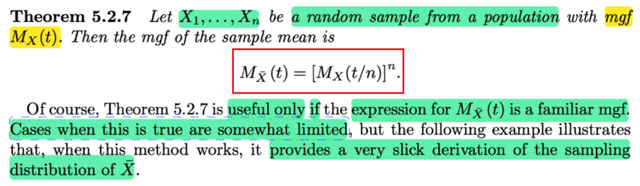</kbd>

<kbd>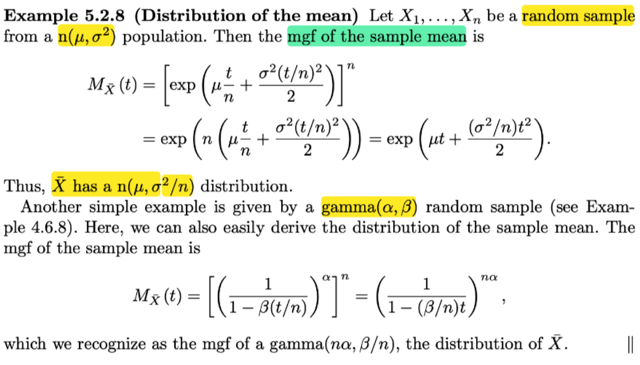</kbd>

<kbd></kbd>

<kbd></kbd>

<kbd>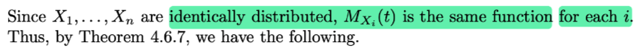</kbd>

🔗 **Related:** [5.6 GENERATING RANDOM SAMPLE](56_generating_random_sample.md#node-449)

🔗 **Related:** [8.3 METHODS OF EVALUATING TEST](83_methods_of_evaluating_test.md#node-697)

> [!NOTE]
> đại khái là như ta đã biết tính chất iid của X1,...Xn (ôn nhanh: theo định
> nghĩa X1,...Xn ĐƯỢC GỌI là một random sample size n từ population có
> pdf/pmf/pmf nếu như Xi là random variable đại diện cho quá trình quan sát
> giá trị của một biến cố ngẫu nhiên nào đó tại lần thứ i. Và các observation
> này được tiến hành sao cho các random variable X1..Xn là mutually
> independent và đều có chung marginal distribution, và tính chát có chung
> marginal distribution gọi là identically distributed (identical = "giống nhau",
> phân phối giống nhau)
>
> Vậy thì như vừa nãy ta đã có kết quả là với Y = Σi Xi thì **MXbar(t) = MY(t/n)**
>
> mà với Y = X1 + X2 + ...Xn, và X1, X2...Xn mutually independent và có cùng
> mgf MX(t) thì bữa trước có một theorem nói rằng MY(t) sẽ bằng [MX(t)]^n
> ⇨ MY(t/n) = [MX(t/n)]^n
>
> Từ đó ta có MX_bar(t) =  [MX(t/n)]^n
>
> thế thì đại khái là tác gỉa nói rằng công thức trên sẽ chỉ giúp ích (cho ta tìm
> distribution của X_bar (sample mean) NẾU NHƯ KHI XÂY DỰNG TỪ 
> [MX(t/n)]^n TA CÓ MỘT KẾT QUẢ LÀ MỘT MGF QUEN THUỘC, thì khi 
> đó mới giúp ta kết luận distribution của Xbar là cái gì đó, và ông nói thường
> thì ít khi có được điều này, Nhưng ví dụ sau sẽ là một case
>
> Đại khái là cho **X1,...Xn là random sample từ population distribution là normal
> (μ, σ^2)**. Thử tìm distribution của sample mean
>
> Ta đã biết từ những chương trước, mgf của normal là**M(t) = e^(μt + σ^2t^2/2)**
>
> **Áp dụng công thức trên MX_bar(t) =  [MX(t/n)]^n**
> = [e^ (μ(t/n) + σ^2(t/n)^2/2) ]^n
>
> = e^[n(μ(t/n) + σ^2(t/n)^2/2)]   | vì (a^n)^m = a^(mn)
>
> = e^[nμ(t/n) + nσ^2(t/n)^2/2)]   phân phối n vô
>
> = e^[μt + (nσ^2/n^2)t^2/2)]
> **= e^[μt + (σ^2/n)t^2/2]**Kết quả này cho thấy **Xbar có mgf là mgf của normal rv có parameter
> là μ và σ^2/n**. Hay Xbar  ~ n(μ, σ^2/n)**Tương tự với example dưới.
>
>
> QUAY LẠI SAU**

 

<kbd>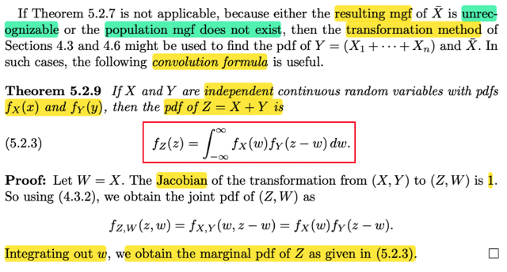</kbd>

> [!NOTE]
> Rồi, đại khái là, giáo sư cho biết nếu như  ta rơi vào trường hợp không thể
> áp dụng theorem 5.2.7 (theorem giúp tìm mgf của sample mean từ mgf của
> population) mà thường là có hai lí do: một là mgf của sample mean sau khi
> làm theo kiểu này nó có dạng không nhận ra được (unrecognizable) - ý là,
> như đã thấy trong hai ví dụ vừa rồi, tìm ra mgf, thì ta thấy nó có dạng là mgf
> của normal, hay beta distribution. từ đó giúp kết luận distribution của
> sample mean, còn có thể có trường hợp mgf tìm ra không nhận ra được là
> mgf của distribution mà ta biết nào, vậy thì cũng vô ích. (bởi lẽ, mục đích  là
> đang tìm distribution, loại phân phối xác suất nào của sample mean cơ mà,
> và như ta đã biết mpf, pdf, cdf đều có thể giúp xác định được / nhận diện
> được loại distribution)
>
> Trường hợp thứ hai mà nó fail đơn giản là population cũng ko có mgf thì dĩ
> nhiên ko áp dụng được theorem này
>
> Thế thì đại ý là khi đó ta có thể dùng các TRANSFORMATION technique
> đã nói ở chapter 4 khi ta tìm joint distribution của U,V với U = g1(X, Y),
> V = g2(X, Y) và đã biết distribution của X,Y. Hoặc khái quát hơn khi ta muốn
> tìm joint distribution của **U**= (U1, U2,....Un) với U1 = g1(**X**) = g1(X1,...Xn)
> ..., Un = gn(X1, X2,...Xn)
>
> để tìm pdf của Y = X1 + X2 + ...Xn và sau đó là Xbar.
>
> Đúc kết lại bởi theorem này: Cho X, Y là independent continuous rv,
> với pdf fX(x), fY(y) (đây dĩ nhiên là marginal pdf của từng cái). Thì pdf
> của Z  = X + Y sẽ là:
>
> fZ(z)  = ∫-inf:inf fX(w)fY(z - w)dw
>
> Chứng minh đại khái là như sau (như đã nói ta sẽ dựa trên transformation
> đã học ở chap 4):
>
> Ôn lại nhanh: Chap 4 đã học. Với 2 random varianbe (tức bivariate case)
> U = g1(X,Y), V = g2(X,Y) thì ta có theorem giúp tìm joint pdf của U, V (cũng
> chính là pdf của random variable vector (U, V)) theo joint pdf của X, Y:
>
> fU,V(u, v) = fX,Y(x, y) |∂(x, y) / ∂(u, v)|
>
> Với |∂(x, y) / ∂(u, v)| là determinant của Jacobian - matrix partial derivative
> của x, y đối với u, v.
>
> Ôn lại một chút, cái theorem này phải dựa trên assume là ta có mapping
> 1-1 từ support set A_curly của X, Y với ảnh của nó B_curly:
>
> A_curly được định nghĩa là tập {(x,y) sao cho fX,Y(x,y) > 0}
>
> Còn B_curly là ảnh của A_curly: 
>
> {(u,v) với u = g1(x,y), v = g2(x,y) với (x,y) ∈ A_curly}
>
> Vậy nói mapping 1-1 là với mỗi (u,v) ∈ B_curly thì tồn tại duy nhất một (x,y)
> thuộc A_curly map với nó (vẫn có thể có (x,y) khác không thuộc A_curly
> được map với B_curly, nhưng miễn là xét trên A_curly và B_curly thì mapping
> là 1-1 là ok)
>
> Nói chung là khi trong ví dụ cụ thể nào đó mà ta thấy thỏa được yêu cầu trên
> thì có thể áp dụng được theorem này;
>
> Vậy ôn lại tiếp |∂(x, y) / ∂(u, v)| là sao? 
>
> À là bởi vì khi thỏa yêu cầu 1-1 trên thì với u = g1(x,y), v = g2(x,y) ta sẽ có
> thể tìm được một cặp (x, y) từ u, v: x = h1(u, v), y = h2(u, v) duy nhất
>
> Và |∂(x, y) / ∂(u, v)| là ma trận đạo hàm riêng (partial derivative):
>
> hàng 1 sẽ là ∂x/∂u ∂x/∂v, hàng 2 sẽ là ∂y/∂u, ∂y/∂v. Dĩ nhiên ∂x/∂u = ∂h1(u,v)/∂u
> ∂x/∂v = ∂h1(u, v)/∂v...Và ta sẽ tính định thức (det của nó). Và lấy giá trị tuyệt đối
>
> Khi đó ráp vô ta sẽ xây dựng được joint pdf của U, V, và sau đó bằng cách 
> marginalizing joint pdf ta có thể có marginal pdf của U hoặc V.
>
> Rồi, theorem này cũng khái quát lên multivariate case:
>
> Khi ta có n random variable. U1,U2,.....Un tạo thành random variable vector
> **U** với Ui = gi(X1,X2,...Xn) i = 1,2...n Và ta biết joint pdf của X1,...Xn. Khi đó
> nếu cũng thỏa yêu cầu 1-1 ta sẽ có thể xây dựng joitn pdf của U1,..Un:
>
>
> f**U**(u1,u2,....un) = f**X**(x1, x2,...xn) | ∂(x1,x2...xn) / ∂(u1,u2,...un) |
>
> f**U**(u1,u2,....un) chính là cách viết của fU1,U2,...Un(u1,u2,....un) tức joint pdf
> của U1,...Un. Nhưng cũng là pdf của random variable VECTOR **U**= (U1,..Un)
>
> f**X**(x1, x2,...xn), tương tự là cách viết của joint pdf của X1,...Xn 
>
> tức là fX1,X2,...Xn(x1,x..xn) chẳng qua gom chúng lại thàng vector **X**| ∂(x1,x2...xn) / ∂(u1,u2,...un) |, là determinant của Jacobian (jacobian chỉ là
> cái tên mà người ta dùng để gọi ma trận đạo hàm riêng)
>
> Dĩ nhiên nhờ điều kiện mapping 1-1 mà từ u1 = g1(x1,x2...xn) u2 = g2(x1,x2..xn)
> ....un = gn(x1,x2..xn) mà ta cũng sẽ có thể tìm được ngược ra lại:
>
> x1 = h1(u1,u2,...un); x2 = h2(u1,...un)....
>
>
> Và hàng 1 của | ∂(x1,x2...xn) / ∂(u1,u2,...un) | , sẽ là [∂x1/∂u1, ∂x1/∂u2,.....
>
> = [∂h1(u1,..un)/∂u1, ∂h2(u1,...un) / ∂u2...]
>
>
> Đó là ôn nhanh lí thuyết để chuẩn bị áp dụng vào chứng minh theorem 5.2.9

> [!NOTE]
> Rồi ta sẽ chứng minh (tất nhiên trong sách có chứng minh nhưng mình sẽ
> tự chứng minh lại cho hiểu)
>
> Thế thì ở phần ôn lại các transformation theorem, ta thấy rằng nó giúp
> tìm pdf của vector (U, V) từ vector (X, Y) (vector ý là random variable 
> vector) hoặc U1,...Un từ pdf của (X1,..Xn). thì ở đây yêu cầu là tìm pdf
> của Z = X + Y., từ pdf của X, Y. Vậy thì ta phải "kiếm thêm / đặt thêm một
> thằng nữa. Để cùng với Z tạo thành random variable vector (Z, L) chẳng
> hạn, từ đó áp dụng bivariate transformation tìm joint pdf của (Z, L) theo 
> joint pdf của X, Y. Sau đó, ta sẽ marginalizing (tức là lấy tích phân hàm
> joint pdf của Z, L) qua toàn bộ possible value của L, thì ta sẽ có marginal
> pdf của Z
>
> Nên để đơn giản, thường người ta chỉ việc đặt L = X, hay Y gì đó.
>
> Như vậy, ta có U = g1(X, Y) = X + Y. Tức là hàm g1 là hàm như sau g1(x,y)
> = x + y. Và L = g2(X,Y) = X. Tức là hàm g2 là hàm (có công thức) g2(x,y)
> = x
>
> Vậy đến đây ta xem thử cái giả định rằng mapping giữa A_curly và B_curly
> có thỏa yêu cầu 1-1 không?
>
> Đầu tiên nhắc lại A_curly là cái gì (trong sách là chữ A viết kiểu, mình gọi
> là A_curly cho nhanh) nó là support set của X, Y. Mà support set được định
> nghĩa là tập chứa (x,y) ∈ R^2 sao cho fX,Y(x,y) DƯƠNG, vậy thôi.
>
> Và B_curly là ảnh của A_curly, tức là với (x,y) ∈ A_Curly, ta pass nó qua
> hàm g1, g2 để có (u,v). Thì tập mọi (u,v) được tạo ra kiểu đó sẽ làm nên
> B_curly. Do đó định nghĩa của nó là {(u,v): u = g1(x,y), v=g2(x,y), với some
> (x,y) ∈ A_curly)
>
> Vậy thì ở đây A_curly là gì? ⇨ Thì phải xem joint pdf của X, Y là gì? Đề
> bài đã cho marginal pdf của X, Y.  Và X, Y ĐỘC LẬP. Nên ta biết joint pdf
> của các rv độc lập là tích cách marginal pdf ⇨ fX,Y(x,y) = fX(x)fY(y)
>
> Do đó cặp (x,y) khiến vế trái dương chính là cặp (x,y) khiến vế phải dương
> mà muốn vậy thì phải khiến chúng cùng dương hoặc cùng âm. Dĩ nhiên
> marginal pdf (hay pdf nói chung thì ko âm) nên thành ra câu trả lời là (x,y)
> sao cho fX(x) dương và fY(y) dương. ⇨ A_curly = {(x,y) ∈ R^2: fX(x) > 0, 
> fY(y) > 0}. Nhưng ta ko biết cụ thể fX(x) fY(y) là gì nên chỉ đi được tới đây.
>
> Còn B_curly thì theo định nghĩa trên. 
>
> Vậy mapping có 1-1 ko. Câu trả lời là nhìn vào hàm g1. g2:
>
> z = g1(x, y) = x + y; l = g2(x, y) + x. Thì có tìm ra được ngược lại x, và y
> là gì ko? Hay nói đúng hơn là có tìm ra 1 nghiệm duy nhất x,y ko?
>
> Nếu có hơn 1 cặp x, y thì mapping này chưa chắc 1-1. Trừ khi 1 cặp nằm
> ngoài A_curly, 1 cặp nằm trong. khi đó vẫn ok.
>
> Nhưng ở đây dễ thấy x = l, y = z - x = z - l.
>
> Có nghĩa là từ u = g1(x,y), l = g2(x,y) ta tìm ra lại x = h1(z, l) (mà công
> thức hàm h1 là h1(z, l) = l) và y = h2(z, l) = z - l
>
> Và kết quả này đương nhiên là unique (duy nhất). Thành ra mapping chắc
> chắn là 1-1 (ta có thể thắc mắc là lỡ l, và z-l ko nằm trong A_curly thì sao?
> Không sao cả. vì định nghĩa của B_curly ko yêu cầu là (z,l) trong B_curly
> thì nhất định phải map với (x,y) thuộc A_curly. Vì hoàn toàn cho phép có
> hai cái, một cái trong A_curly, một cái ngoài A_curly và cả hai đều map
> với một (z,l) thuộc B_curly. Nhưng ngay cả như vậy thì mapping giữa
> A_curly và B_curly vẫn là 1-1, vì ko có case nào có hai cái thuộc A_curly
> mà được map với cùng một điểm trong B_curly, khi đó mới là vi phạm.
>
> Ở đây mình đã thấy mapping giữa x,y và z,l là 1-1. Nên dù truy ngược 
> ra lại x,y có thuộc A_curly hay ko, thì ko quan trong. Vì chắc chắn rằng
> nếu có ông (x,y) nào đó nằm trong A_curly thì chắc chắn nó được map
> duy nhất với B_curly.
>
> Hiểu rõ bản chất là như vậy.
>
> Rồi, còn tính thì nhanh, ta sẽ tính det của Jacobian:
>
> ∂x/∂z = ∂h1(z,l)/∂z = ∂l/∂z = 0. Vì hàm h1(z,l) = l, chỉ phụ thuộc l, ko phụ
> thuộc z ⇨ đạo hàm đối với z = 0
>
> ∂x/∂l = ∂h1(z,l)/∂l = ∂l/∂l = 1 Vì hàm h1(z,l) = l, ⇨ đạo hàm đối với l = 1
>
> ∂y/∂z = ∂h2(z,l)/∂z = ∂(z - l)/∂z = 1
>
> ∂y/∂l = ∂h2(z,l)/∂z = ∂(z - l)/∂l = -1
>
> Vậy matrix Jacobian là: [0, 1; 1, -1] ⇨ determinante = (ad-bc) = -1
>
> ⇨ lấy trị tuyệt đối = 1 
>
> Rồi ta có:
>
> fZ,L(z,l) = fX,Y(x,y) * 1 = fX(x)fY(y) (thay jont pdf  = tích marginal pdf vô)
>
> = fX(h1(z,l)) fY(h2(z,l)) | thay x, y = hai hàm h1, h2 vô
>
> =**fX(l) fY(z - l) Đây chính là kết quả trong sách (họ dùng w thay cho l)**
>
> Rồi, như đã nói, đây là joint pdf của Z, L. ta sẽ marginalizing qua mọi possible
> value của L để có marginal pdf của Z:
>
>
> fZ(z) = ∫-inf:inf fZ,L(z,l) dl =  ∫-inf:inf fX(l) fY(z - l)  dl
>
> Và lí thuyết là vậy thôi chứ ta cũng ko có dạng cụ thể của fX(x), fY(y) mà
> làm tiếp. nên dừng ở đây
>
> Nhưng qua ví dụ này ta ôn lại được cái vụ transformation, CỰC KÌ QUAN
> TRỌNG. QUA CÁC SÁCH CỦA C.BISHOP, YOSHUA BENGIO, GẶP RẤT 
> NHIỀU

 

<kbd>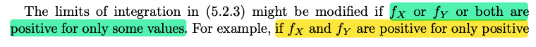</kbd>

<kbd></kbd>

<kbd>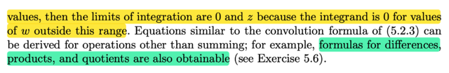</kbd>

> [!NOTE]
> còn khúc dưới ko có gì khó hiểu, vì ta đã hiểu vì sao có theorem này:
>
> fZ(z) = ∫-inf:inf fZ,L(z,l) dl = ∫-inf:inf fX(l) fY(z - l) dl
>
> Thì trong phần trước khi ta ôn lại lý thuyết của transformation theorem.
> Ta có nhắc đến A_curly, là support set của X,Y và ảnh của nó, B_curly.
> và đã lập luận để thấy rằng  A_curly = {(x,y) ∈ R^2: fX(x) > 0,  fY(y) > 0}
> tức là tập các (x,y) thuộc R^2 sao cho x khiến thằng fX(x) dương và
> y khiến fY(y) dương (trong lập luận đó ta có kết quả này là X, Y độc lập)
>
> Vậy thì áp dụng vào việc tính marginal pdf của Z, thì dĩ nhiên là 
> ta có thể THU GỌN LIMIT CỦA TÍCH PHÂN LẠI.
>
> Là sao? Ví dụ như (như trong sách ở đây nói), giả sử fX(x) chỉ dương khi
> x DƯƠNG, và fY(x) chỉ dương khi y DƯƠNG, tức là A_curly trở thành:
>
> A_curly = {(x,y) ∈ R^2: fX(x) > 0,  fY(y) > 0}
>
> = {(x,y) ∈ R^2: x > 0,  x > 0}
>
> Thì khi đó nó sẽ giúp thu hẹp limit tích phân này:
>
> fZ(z) = ∫-inf:inf fX(l) fY(z - l) dl
>
> Trong tích phân này, xét fX(l), như đã nói trên, f**X(x) chỉ dương khi
> x DƯƠNG, NÊN DĨ NHIÊN TƯƠNG TỰ fX(l) CHỈ DƯƠN G KHI l > 0**Đồng nghĩa với l ≤ 0, thì fX(l) = 0
>
> Và tương tự, fY(z - l) chỉ dương khi z-l > 0 ⇔ **l < z**
> đồng nghĩa nếu l ≥ z thì fY(z - l) = 0
>
> Vậy gom lại, muốn fX(l) fY(z - l) dương, thì l phải: 
>
> 1) l > 0 và 2) l < z ⇨ 0 < l < z
>
> Vậy điều này giúp thu hẹp limit của tích phân 
>
> fZ(z) = ∫-inf:inf fX(l) fY(z - l) dl
>
> = fZ(z) = ∫0:z fX(l) fY(z - l) dl
>
> (vì sao? vì tích phân ∫-inf:inf fX(l) fY(z - l) dl sẽ có thể tách thành:
>
> ∫-inf:0 fX(l) fY(z - l) dl + ∫0:z fX(l) fY(z - l) dl + ∫z:inf fX(l) fY(z - l) dl
>
> Và = ∫-inf:0 0 fY(z - l) dl + ∫0:z fX(l) fY(z - l) dl + ∫z:inf fX(l) 0 dl
>
> = 0 + ∫0:z fX(l) fY(z - l) dl + 0
>
> = **∫0:z fX(l) fY(z - l) dl
>
> (việc 0 < l < z thì đã mặc nhiên hiểu z > 0 ⇨ tích phân từ -inf:inf
> tách làm 3 đoạn -inf:0, 0:z, z:inf)
>
> Đó là giúp ta hiểu sao trong sách nói vậy
>
> Và tương tự thì cách làm này cũng có thể giúp ta tìm pdf của hiệu
> tích, thương hai random variable**

 

<kbd>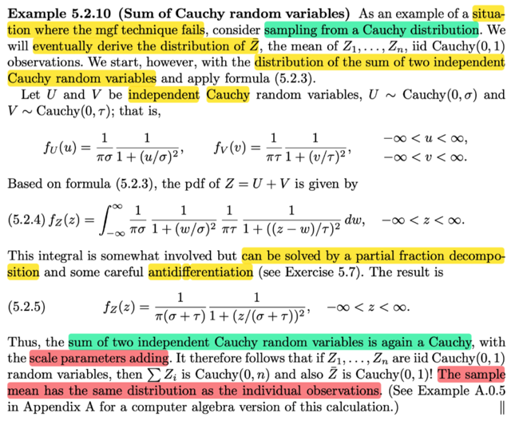</kbd>

🔗 **Related:** [3.5 LOCATION AND SCALE FAMILIES](35_location_and_scale_families.md#node-202)

> [!NOTE]
> QUAY LẠI SAU nhưng đại ý là áp dụng theorem vừa rồi để thấy rằng
> marginal distribution của sample mean Zbar của các  random variables
> Z1,Z2,...Zn của random sample size n có population distribution là
> Cauchy thì cũng là Cauchy luôn, với scale parameters bằng tổng các
> scale params

 

<kbd>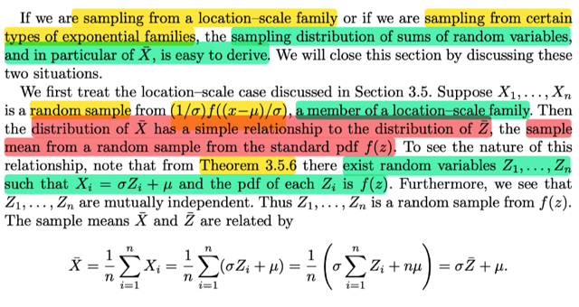</kbd>

> [!NOTE]
> Đại ý là, nhớ rằng phần này chủ yếu đang nói về việc tìm sampling
> distribution của sample mean Xbar. Và những phần trước là nói về các
> công cụ, cách tiếp cận để giúp ta làm việc đó. Thì ở đây, gs nói về hai
> case đặc biệt giúp việc này dễ hơn bình thường. Đó là khi sampling từ
> population có dạng là location scale family, hoặc từ exponential families.
>
> Xét case đầu tiên, tức ta có X1,...Xn là random sample từ một population
> có pdf là (1/σ) f((x-μ)/σ)
>
> Ôn lại một chút, chap 3 đã học về khái niệm này, đại khái là vầy: Ý chính
> cần hiểu là, đây là công cụ giúp ta xây dựng một gia đình các distribution
> xuất phát từ một distribution có pdf là f(x), thì theo đó, f[(x - μ) / σ] / σ cũng
> sẽ là các valid pdf để với các μ và σ khác nhau, chúng ta có một gia đình
> các distribution mà các thành viên trong đó khác nhau ở shift param μ  và
> scale param σ và hiệu ứng là hình dạng distribution của chúng na ná
> nhau, chỉ là bị kéo giãn hoặc bóp lại, và dịch chuyển vị trí đi chỗ khác mà
> thôi. Và cái ứng với μ = 0, σ = 1 (tức là cái f(x)) được gọi là standard pdf
>
> Một ví dụ điển hình là normal distribution, mà thằng này thì đặc biệt ở chỗ,
> người ta xây dựng f(x) (standard normal pdf) một cách có tình, để nó
> cũng có mean (kì vọng) = 0 (trùng với shift param = 0) và standard
> deviation = 1 (trùng với scale param). Kể từ đó, các thành viên khác của
> gia đình  (mỗi thằng, như đã nói có một location param  μ và và scale
> param σ khác nhau) hóa ra cũng sẽ có mean là μ  và std là σ
>
> Và trong phần đó, có một định lí vô cùng nền tảng: Đó là nếu như ta có
> random variable Z có pdf là f(x) thì, khi đặt X = σZ + μ. thì pdf của X sẽ
> là f((x - μ)/σ)/σ. Và ngược lại, nếu X có pdf là f((x - μ)/σ)/σ thì một thằng
> random variable Z có quan hệ với X bởi X = σZ + μ chắc chắn sẽ có pdf
> là f(x).
>
> Thử chứng minh lại theorem này cho nhớ:
>
> Chứng minh chiều đi (điều kiện cần): Cho Z có pdf là fZ(z) = f(z) thì với 
> X = σZ + μ thì pdf của nó sẽ là fX(x) = f((x - μ)/σ)/σ
>
> Để chứng minh ta dùng transformation theorem, nói rằng nếu Y = g(X)
> và g là hàm đơn điệu, tức từ y = g(x) có thể giải tìm x = g_inv(y)
> Khi đó ta sẽ có thể derive pdf của Y từ pdf của X như sau:
>
> fY(y) = fX(x) |dx/dy| = fX(g_inv(y))  |d/dy ginv(y)|
>
> Áp dụng vào đây, ta có quan hệ giữa Z và X là: X = g(Z) = σZ + μ
>
> Dĩ nhiên hàm g(z) = σz + μ  là hàm đơn điệu vì đơn giản nó là hàm tuyến
> tính. ⇨ x = σz + μ ⇔ z = (x - μ) / σ (tức ginv(x) = (x - μ) / σ)
>
> Áp dụng theorem: 
>
> fX(x) = fZ(z) |dz/dx| = fZ((x - μ) / σ) |d/dx ginv(x)|
>
> = fZ((x - μ) / σ) |1/σ |  (vì d/dx (x - μ)/σ = 1/σ)
>
> = **f((x-μ)/σ)/σ** Chứng minh xong chiều đi
>
> Chứng minh chiều về (điều kiện cần) tức ta cần chứng minh nếu X là random
> variable có pdf là fX(x) = f((x-μ)/σ)/σ, thì nhất định random variable Z nếu
> có quan hệ với X bởi X = σZ + μ thì Z sẽ có pdf là fZ(z) = f(z)
>
> Ta sẽ áp dụng transformation theorem, với Z = g(X) = (X - μ) / σ , dĩ nhiên
> hàm này cũng là hàm tuyến tính nên đơn điệu, nên với z = (x - μ) / σ cũng 
> có thể tìm ngược ra lại x = z σ + μ (tức g_inv(z) = z σ + μ, 
> và d/dz g_inv(z) = σ )
>
> Ta có fZ(z) = fX(x) |d/dz ginv(z)|
>
> = f((x-μ)/σ)/σ |σ|
>
> = [f((x-μ)/σ)/σ] σ
>
> Thay x = ginv(z) = z σ + μ vô
>
> = [f((z σ + μ - μ)/σ)/σ] σ
>
> = [f((z σ)/σ)/σ] σ
>
> = [f(z)/σ] σ
>
> = f(z) . Chứng minh xong.

> [!NOTE]
> Vậy thì ở đây, đại ý là, nếu như ta có random sample X1,...Xn có population
> distribution là một location scale family có pdf là (1/σ) f((x-μ)/σ) thì cái sample
> mean của nó X_bar sẽ có quan hệ dễ hiểu với sample mean Z_bar của random
> sample Z1,...Zn từ population có pdf là f(z)
>
> Lí do của cái này rất đơn giản:
>
> Như theorem mà ta vừa chứng minh lại nói rằng nếu X có pdf là  (1/σ) f((x-μ)/σ) 
> thì nhất định nếu có random variable Z = (X - μ) / σ thì nó sẽ có pdf là f(z)
>
> Vậy ở đây nói ta có random sample X1,....Xn có pdf là (1/σ) f((x-μ)/σ), vậy thì
> theo theorem này, Z1 = (X1 - μ) / σ chắc chắn phải có pdf là f(z). Và tương tự
> Z2 = (X2 - μ) / σ cũng vậy, cũng có pdf f(z), ...Zn cũng vậy. Có nghĩa là chúng
> CÓ CHUNG MARGINAL PDF ⇨ IDENTICALLY DISTRIBUTED
>
> Thêm nữa, vì X1,X2....Xn mutually independent (vì chúng là random variables
> của một random sample, theo định nghĩa chúng sẽ iid) và ta nhớ có theorem
> nói rằng nếu X, Y độc lập thì random variable tạo bởi apply function g lên chúng
> g(X), g(Y) cũng sẽ độc lập.
>
> Tương tự vậy Z1 = g(X1) (g(z) = x σ + μ), cũng sẽ độc lập với Z2 = g(X2)...
> ⇨ Z1,..Zn cũng mutually independent ⇨ từ đó chúng chính là một random
> sample có population pdf f(z)

 

<kbd>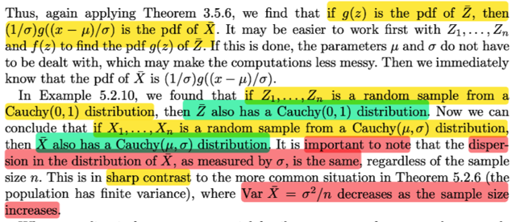</kbd>

<kbd></kbd>

<kbd>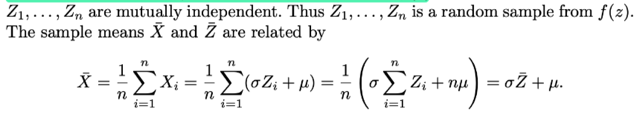</kbd>

> [!NOTE]
> Rồi, tiếp. Nhắc lại chút, ta đã ôn lại theorem nói rằng nếu X có pdf  f((x -
> μ)/σ)/σ thì với random variable Z có quan hệ với X bởi X = σZ + μ (cũng
> tương đương Z = (X - μ)/σ) thì cái thằng Z này sẽ có pdf là f(z) Vậy thì từ đó
> với việc X1 là random variable của một random sample size n có population
> pdf là f((x - μ)/σ)/σ thì suy ra Z1 = (X1 - μ)/σ sẽ là random sample có pdf là
> f(z). Tương tự như vậy với X2 và Z2, ..Xn và Zn
>
> Thế thì vì X1 = Z1 σ + μ, X2 = Z2 σ + μ ,....Xn = Zn σ + μ
>
> Cộng vế theo vế ta sẽ có X1 + X2 + ...Xn = Z1 σ + μ + Z2 σ + μ + ..Zn σ + μ
>
> ⇔ Σi Xi = σ Σi Zi + n μ
>
> Chia hai vế cho n: Σi Xi / n = σ Σi Zi /n + μ
>
> ⇔ X_bar = σ Z_bar + μ
>
> Và đây chính là cái quan hệ đơn giản mà trong sách người ta nói (khi
> sampling từ một location scale families có pdf là f((x - μ)/σ)/σ thì sample
> mean của nó sẽ có quan hệ đơn giản (simple relationship) với sample mean
> của một random sample có population là f(z)
>
> Vậy thì điều quan trọng là, với cái quan hệ này, thì áp dụng cái theorem trên
> cho phép ta nhận định rằng: À nếu như mà ông Zbar này mà có pdf là g(z) thì
> ta sẽ SUY RA NGAY pdf của ông X_bar, là g((z - μ)/σ)/σ. Tại sao?
>
> Thì bởi vì ta đã có cái theorem 3.5.6 (mà video trước mình cùng nhau chứng
> minh lại) nói rằng: Nếu X có pdf là f((x - μ)/σ)/σ thì Z = (X - μ)/σ sẽ có pdf là
> f(z) và ngược lại. Hay: X có pdf là f((x - μ)/σ)/σ ⇔ Z = (X - μ)/σ sẽ có pdf là
> f(z)
>
> Vậy thì ở đây nếu biết pdf của Zbar = g(z), thì theo trên ta suy ra pdf của Xbar
> là g((z - μ)/σ)/σ
>
> Chỗ này đôi khi có người không hiểu: ví dụ như g((z - μ)/σ)/σ là sao mà g(z)
> là sao?
>
> ⇨ g(z), là hàm g, có công thức nào đó, evaluate tại z, tức là bỏ z vào: ví dụ,
> hàm g(z) = z^2. Thì muốn có giá trị của g, ta sẽ lấy z, đang có giá trị bao
> nhiêu đó, và apply hàm g lên, tức là bình phương lên. Khi đó ta sẽ có g(z).
>
> Còn g((z - μ)/σ)/σ là sao. Thì g((z - μ)/σ)/σ sẽ mang ý nghĩa là ta apply hàm g
> lên (z - μ) / σ và sao đó, chia đi σ.
>
> nên nếu công thức hàm g (ý là ví dụ như khi ta có dạng cụ thể của g là  g(z) =
> z^2) thì g((z - μ)/σ)/σ = [(z - μ)/σ]^2 / σ. Ta thấy trong đó [(z - μ)/σ]^2 chính là
> apply hàm g lên (z - μ)/σ, sau đó chia σ.
>
> Khi đó ta sẽ có pdf của Xbar có công thức là công thức của g((z - μ)/σ)/σ, hay
> fXbar (x) =  [(x - μ)/σ]^2 / σ
>
> (cái kí tự x hay z trong [(x - μ)/σ]^2 / σ hay [(z - μ)/σ]^2 / σ KHÔNG QUAN
> TRỌNG, VÌ NÓ CHỈ LÀ DUMMIES NAME, nói về một hàm số, thì công thức
> của nó, tức là nó làm gì với input đưa vô mới quan trọng. Nên kể cả ta nói là
> fXbar(z) = [(z - μ)/σ]^2 / σ vẫn đúng chả sao cả, vì nó vẫn thể hiện là: à với z
> bằng này, thì bỏ vô hàm pdf của Xbar nó sẽ cho ra kết quả bằng [(z - μ)/σ]^2 /
> σ).
>
> Nhưng mà g(z) với g((x - μ)/σ) thì khác nhau, vì lúc này ta đang nói về hàm g,
> có công thức sao đó, nhưng một cái thì evaluate (tính) tại z, và một cái thì
> tính tại (x - μ)/σ.
>
> =====
>
> Rồi, cuối cùng, đại khái là áp dụng điều này, giáo sư Casella nhắc đến ví dụ
> 5.2.10 khi mà ta có Z1,...Zn là random sample có population là  một
> distribution thuộc loại Cauchy(0, 1). Thì khi đó, ta đã kết luận rằng sample
> mean Zbar cũng là random variable tuân theo distribution Cauchy (0,1) (ta sẽ
> quay lại chứng minh cái này sau, giờ tạm biết vậy)
>
> Vậy thì đại ý là, áp dụng kết qủa trên, thì nếu như ta lại xét một random
> sample khác, X1,...Xn từ population khác, là Cauchy(μ, σ)
>
> Lúc này, ta ko cần phải tìm pdf của Xbar mà chỉ cần áp dụng kết quả trên:
>
> rằng nếu f(z) là pdf của Zbar thì pdf của Xbar sẽ là f((x - μ)/σ)/σ
>
> Mà Zbar như đã chứng minh trong 5.2.10 để cho thấy nó là Cauchy(0,1). nên
> giờ Xbar có pdf quan hệ với pdf của Zbar như vậy.Cho thấy Xbar là một
> thành viên trong gia đình các distribution thuộc loại location-scale families.
> Nói cách khác, Xbar cũng có chung dạng distribution với Zbar, chỉ khác là
> shift parameter của nó là μ, và scale parameter của nó là σ
>
> Mà vì Zbar ~ Cauchy(0, 1), mà trong Cauchy family thì hai tham số của nó là
> location và scale. Tức distribution của Zbar có location là 0 và scale là 1 Để
> rồi giờ đây ta đã kết luận Xbar NẰM CHUNG GIA ĐÌNH VỚI Zbar, nhưng
> khác location là μ và scale là σ. Từ đó ta suy ra distribution của Xbar là
> Cauchy(μ, σ)
>
> Chỗ này rất dễ gây lú lẫn.
>
> Theo logic thông thường ta dễ thấy hợp lí theo kiểu:
>
> Z1,...Zn ~ Cauchy(0,1), và đã chứng minh Zbar ~Cauchy(0,1)
>
> thì giờ
>
> X1,...Xn ~Cauchy(μ, σ) thì suy ra Xbar cũng ~ Cauchy(μ, σ) .
>
> Cách nghĩ này tuy logic nhưng KHÔNG THỂ KHƠI KHƠI MÀ NÓI VẬY
> ĐƯỢC.
>
> BỞI VÌ SAO? VÌ NẾU KO NÓI RÕ DỰA VÀO ĐÂU, HAY CHỨNG MINH NHƯ
> THẾ NÀO THÌ KO ĐƯỢC.
>
> HÃY CHÚ Ý RẰNG, CÁI VIỆC TỪ Z1,...Zn ~ Cauchy(0,1) mà đi đến  Zbar
> ~Cauchy(0,1) THÌ TA ĐÃ PHẢI CHỨNG MINH TRONG VÍ DỤ TRƯỚC TỨC
> LÀ TA PHẢI XÂY DỰNG PDF CỦA ZBAR, RỒI TỪ ĐÓ KẾT LUẬN NÓ CÓ
> DẠNG CỦA CAUCHY(0,1), THÌ TỪ ĐÓ MỚI CHO PHÉP KẾT LUẬN NÓ LÀ
> CAUCHY 0,1.
>
> Thì ở đây cũng vậy, đáng lẽ ta phải xây dựng pdf của Xbar (từ pdf của X1,..
> Xn) rồi bằng cách nào đó chỉ ra rõ ràng rằng pdf cảu Xbar có dạng của
> Cauchy(μ, σ) thì khi đó MỚI ĐƯỢC PHÉP KẾT LUẬN XBAR LÀ CAUCHY(μ,
> σ)
>
> Nhưng làm vậy sẽ mất công. Do đó cái theorem location scale ở trên nó giúp
> ta làm việc này dễ dàng hơn nhiều.
>
> =====
>
> Rồi, cuối cùng, giáo sư đề nghị ta nhận xét thấy rằng. À, distribution của
> sample mean Xbar CŨNG CÓ SCALE PARAM là σ GIỐNG NHƯ SCALE
> PARAM CỦA X1,...Xn (thằng location param cũng vậy, nhưng đang chú ý
> nói tới scale param)
>
> TRONG KHI ĐÓ, BỮA TRƯỚC TA CÓ MỘT THEOREM NÓI RẰNG:
>
> Var(Xbar) = σ^2 / n, tức là variance của sample mean, lại là population 
> variance / n
>
> Có hai điểm dễ gây lú chỗ này:
>
> Thứ nhất, chú ý rằng CÁI THEOREM 5.2.6 CHỈ ÁP DỤNG VỚI POPULATION
> CÓ VARIANCE FINITE (HỮU HẠN) thể hiện bởi σ^2 < infinity. VÀ, NẾU ÁP
> DỤNG, THÌ CÔNG THỨC LÀ: Var(Xbar) = σ^2 / n tức POPULATION VARIANCE
> CHIA n
>
> Vậy điểm cần chú ý thứ nhất: GIẢ SỬ CAUCHY CÓ VARIANCE HỮU HẠN,
> THÌ ĐỂ ÁP DỤNG VÀO, TA PHẢI HỎI VARIANCE CỦA NÓ LÀ GÌ. Tức là
> Xbar = σ^2 / n. thì population variance σ^2 là gì?
>
> SỞ DĨ CHỖ NÀY GÂY LÚ, LÀ BỞI TA RẤT DỄ MẮC SAI LẦM KHI CỨ THẤY
> NÓI CAUCHY(μ, σ) LÀ MẶC ĐỊNH NGHĨ À POPULATION VARIANCE LÀ σ^2.
>
> ⇨ SAI. 
>
> Cách hiểu sai này là do ta bị ám bởi normal(μ, σ). Mà cái này là MỘT TRƯỜNG
> HỢP ĐẶC BIỆT, nơi mà LOCATION PARAMETER μ CŨNG LÀ MEAN, VÀ SCALE
> PARAMETER σ CŨNG LÀ STANDARD DEVIATION. Để rồi σ^2 là variance thật.
>
> NHƯNG KHI TA THẤY CAUCHY(μ, σ), hay những distribution khác, thì CÁCH HIỂU
> ĐÚNG ĐÓ LÀ ĐẦU TIÊN PHẢI HIỂU ĐÂY LÀ LOCATION PARAM VÀ SCALE
> PARAM CỦA NÓ. CÒN NÓ CÓ PHẢI LÀ MEAN VÀ STANDARD DEVIATION
> KHÔNG THÌ PHẢI XEM LẠI. 
>
> Cho nên trong case của Cauchy(μ, σ) nếu ta cứ nhắm mắt lôi σ ra, rồi bảo là
> variance của distribution là σ^2 sai ngay. Sự thật variance của Cauchy là infinity
> và σ, như đã nói, chỉ là scale parameter
>
> Do đó khi hiểu như vậy sẽ ko thấy lú lẫn ở đây.
>
> Và nhất là khi ta xét đến yếu tố thứ hai, đó là công thức này CHỈ ÁP DỤNG VỚI
> POPULATION DISTRIB NÀO CÓ VARIANCE HỮU HẠN.
>
> DO ĐÓ VỚI CAUCHY, VARIANCE CỦA NÓ VÔ HẠN THÌ ĐƠN GIẢN LÀ KO ÁP
> DỤNG ĐƯỢC.
>
> Tóm lại ta hiểu là chỗ này giáo sư Casella muốn nhấn mạnh rằng. với thằng Cauchy
> thì sample mean (vì nó cũng là Cauchy, nên variance của nó infinite) ĐỐI NGHỊCH
> VỚI những distribution khác có variance hữu hạn, thì khi đó sample mean sẽ có
> variance là population variance / n. Từ đó ta thấy với ông Cauchy thì CÀNG CÓ
> NHIỀU MẪU (n càng lớn) thì cũng vô ích vì không giúp giảm được "độ biến động"
> (dispersion) của sample mean (vì variance vẫn mãi là inf, thể hiện bởi scale param
> là σ) trong khi đó với các distribution khác ví dụ như normal, thì càng nhiều mẫu,
> sẽ càng giảm variance của Xbar (vì áp dụng được theorem VarXbar  = σ^2 / n

 

<kbd>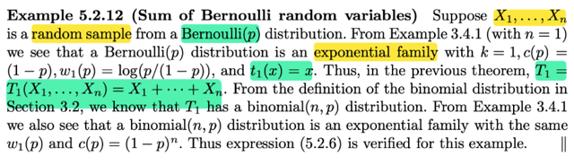</kbd>

<kbd></kbd>

<kbd>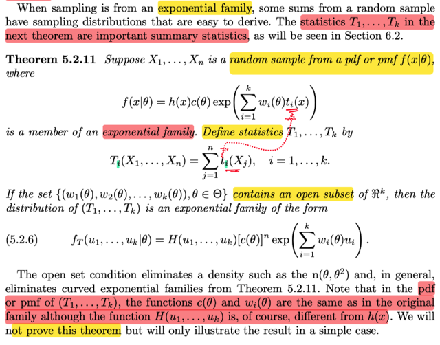</kbd>

🔗 **Related:** [5.6 GENERATING RANDOM SAMPLE](56_generating_random_sample.md#node-449)

> [!NOTE]
> đại ý ở đây gs cho biết khi ta sampling từ một exponential family (ý là tạo một
> random sample X1,X2...Xn từ một population có  distribution thuộc gia định
> exponential) thì tổng của một random sample có sampling distribution dễ hiểu /
> dễ có được công thức (đại ý là vậy)
>
> Nhắc lại, bối cảnh của mình ở đây, chương này, là quan tâm đến sampling
> distribution của một số statistic quan trọng.
>
> Đầu tiên ôn lại tí: Random sample là gì, và sampling distribution là gì, và
> statistic là gì?
>
> Random sample được định nghĩa là: Ta quan tâm đến một biến số nào đó trong
> tự nhiên, và ta sẽ tiến hành quan sát giá trị của nó nhiều lần, ví dụ n lần. Thì vì
> nó là một biến số, mỗi lần quan sát, ví dụ lần thứ nhất, nó có  thể cho ra nhiều
> giá trị khác nhau, do đó ta dùng một random variable đại diện cho giá trị quan
> sát đó, X1. Tương tự, ở lần quan sát thứ hai, ta dùng  random variable X2
> (again, lần quan sát thứ hai, cũng có thể cho ra nhiều giá trị khác nhau, nên X2
> là random variable). Tương tự vậy, ta có X3,...Xn
>
> (nói thêm chút về lí do tại sao mỗi giá trị quan sát lại là một random variable,
> hay tại sao mỗi lần quan sát giá trị của biến số mà ta quan tâm thì đại diện bởi
> một random variable? Lí do là theo định nghĩa của random variable X, nó có
> bản chất là một function. Function này map (nhận input là) một possible
> outcome s trong original sample space Ω, và trả ra một con số X(s) thuộc R
> Như vậy, với các possible outcome khác nhau trong sample space thì X(s) có
> giá trị khác nhau. Thế thì khi quan sát lần thứ nhất, vì cái thứ ta quan sát là một
> biến số, nó có thể cho ra nhiều giá trị khác nhau, nên X1, sẽ có thể có nhiều
> giá trị khác nhau, nên nó là một random variable. Dĩ nhiên sau khi quan sát
> xong, tức đã biết possible outcome s cụ thể là gì, thì ta biết giá trị cụ thể của
> X(s) là gì.
>
> Ví dụ như quan sát số nút của xí ngầu 5 lần. Thì lần 1, khi tung nó lên, ta đâu
> biết nó sẽ ra mấy, nó có thể có 6 possible outcome (6 mặt). Vậy thì số nút sẽ có
> thể là từ 1 đến 6. Do đó ta phải dùng một random variable X1, để đại diện cho
> số nút xí ngầu quan sát được ở lần 1. Vì nó có thể có 6 possible value khác
> nhau. Rồi ở lần 2 cũng vậy, ta có X2. Rồi X3,...X5.
>
> Và đặc biệt, cách thức thực hiện theo định nghĩa nôm na là phải đảm bảo rằng
> các random variable X1,.X2....Xn MUTUAL INDEPENDENT, và có cùng
> marginal distribution f(x) là pdf/pmf của population distribution
>
> Quay lại đây, thế statistic là gì trước đã: Theo định nghĩa, khi ta apply một
> function, tức là ta lấy một function nào đó, và dùng nó để tính toán lên một bộ
> random variable X1,X2...Xn từ một random sample. Ví dụ như lấy hàm g1(x1,...
> xn) có công thức là (x1 + x2 + ..xn)/n, rồi áp lên bộ random variables này, để có
> g1(X1,X2....Xn) = (X1 + X2 + ...Xn)/n. Thì ta sẽ có một random  variable mới.
> Được gọi là statistic. Có nghĩa là statistic là một cái tên chung dành cho một
> random variable hoặc random variable mới có được khi ta dùng một function
> nào đó để tính toán / áp lên các random variables trong random sample.Và
> trong những cái statistic đó, thì có mấy cái là quan trọng nhất, đó là SAMPLE
> MEAN, chính là cái statistic có được với hàm g1 ở trên. Ngoài ra còn có
> SAMPLE VARIANCE: là cái statistic có được, khi xài hàm  khác, g2(x1,..xn), có
> công thức khác:
>
> g2(x1,..xn) = [(x1 - xbar)^2 + ...(xn - xbar)^2] / (n - 1)
>
> viết gọn là g2(x1,...xn) = [Σi (xi - xbar)^2 ] / (n - 1)
>
> Để rồi khi áp nó lên bộ X1,X2...Xn ta có S^2 (kí hiệu của sample variance):
>
> S^2 =  [Σi (Xi - Xbar)^2 ] / (n - 1)
>
> Vậy đó là ôn lại để nhớ khái niệm statistic là gì.
>
> Rồi, thế thì, như đã biết, ví dụ như khi ta tạo ra random variable mới Y, bằng
> cách áp dụng function g(.) lên random variable X, Y = g(X). Thì vì X là random
> variable, có nhiều possible value khác nhau, nên Y CŨNG LÀ RANDOM
> VARIABLE (vì ứng với các possible value khác nhau của X, thì Y sẽ có các giá
> trị khả dĩ khác nhau)
>
> Thì ở đây cũng vậy, statistic là kết quả của việc áp một function lên một đám
> các random variables. Thì nó CŨNG LÀ RANDOM VARIABLE.
>
> Nên các statistic tiêu biểu như sample mean, sample variance cũng là random
> variable. Mà đã là random variable thì NÓ CÓ QUYỀN CÓ DISTRIBUTION
>
> Nhưng cái probability distribution của mấy cái random variable này được người
> ta đặt cho cái tên khác: SAMPLING DISTRIBUTION, nhằm nhấn mạnh / nhắc
> nhớ sự thật là: chúng được sinh ra, nhờ việc apply một function lên các
> random variable của một random sample. Nó sẽ khác với random variable nằm
> trong đám X1,X2..Xn, vốn có distribution (tạm hiểu là) có sẵn trong tự nhiên.
> Còn sample mean, sample variance là random variable mới tạo ra, phụ thuộc
> vào một bộ X1,..Xn cụ thể. Có thể với một bộ X1....Xn khác (một random
> sample khác) thì nó sẽ khác.
>
> Vậy quay lại đây ta đã nhớ lại sampling là sao (random sample), statistic là sao
> sampling distribution là sao. Vậy thì ý chính là, khi tìm sampling distribution của
> một statistic mà kết quả đến từ việc ta apply function lên một bộ random
> variable của một random sample có population là một thành viên của
> exponential family thì theorem sau sẽ cho phép ta dễ thở khi muốn xem xét cái
> statistic đó có sampling distribution là gì (ý chính là vậy)

> [!NOTE]
> Rồi, theorem này nói rằng, cho X1,...Xn là một bộ random variables của một
> random sample có population là f(x|θ). trong đó:
>
> f(x|θ) = h(x) c(θ) exp (Σi=1:k wi(θ) ti(x)) | cái công thức lằng nhằng này là  công
> thưc của một exponential family, ta phải chấp nhận ráng nhớ mà thôi
>
> Và xét các statistic T1, T2,...Tk:  được define như sau:
>
> T1(X1,...Xn) = Σj=1:n t1(Xj), tức là t1(X1) + t1(X2) + ...t1(Xn)
>
> Là sao? Vừa nãy đã ôn lại statistic là gì, nó là việc ta lấy một function g nào đó,
> apply lên bộ random variables X1,X2...Xn (dĩ nhiên để apply được thì g phải là
> hàm của n biến x1,x2...xn) khi đó ta sẽ có một random variable  g(X1,..Xn),
> đựơc gọi là một statistic.
>
> Thì ở đây, T1 = t1(X1) + t1(X2) + ...t1(Xn), tức là ta đang dùng hàm g1(x1,..xn)
> có công thức là  g1(x1,..xn) =  t1(x1) + t1(x2) + ..t1(xn) để apply lên X1,..Xn đó.
>
> Và tương tự, T2 thì xài hàm khác: g2(x1,...xn) = t2(x1) + t2(x2) + ...t2(xn), để
> apply lên bộ X1,X2..Xn ta có T2 = t2(X1) + t2(X2) + ...t2(Xn)
>
> tương tự, T3,...Tk. Kết quả ta có k statistic, cũng là k random variable mới
> (again như đã nói statistic là random variable có được khi apply hàm g nào đó
> lên các random variable trong một random sample)
>
> Thế thì, với k random variable T1,...Tk, thì ta "thành lập" random variable
> VECTOR:
>
> T = (T1,T2...Tk), và theorem này, cho ta biết cái sampling distribution của
> random  variable vcector T này là gì, cũng là một thành viên của exponential
> family.
>
> (Nhớ lại, nói distribution của một random variable VECTOR, thì cũng chính là
> JOINT DISTRIBUTION của các random variable trong vector đó)
>
> Nói chung đại ý là vậy, còn công thức cụ thể thì ở đây giáo sư không chứng
> minh. Và ta sẽ xét cái ví dụ để hiểu rõ hơn về cái này

> [!NOTE]
> QUAY LẠI SAU

 

