# 5.3 Sampling From The Normal Distribution

📊 **Progress:** `23` Notes | `37` Screenshots

---

<kbd>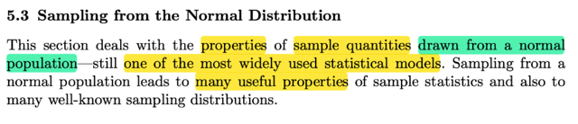</kbd>

> [!NOTE]
> Phần này đại ý là sẽ nói về việc ta xem xét sampling distribution của các 
> statistic của random sample có population là normal distribution. Đây dĩ
> nhiên là một trong các statistical model phổ biến nhất.
>
> Việc sampling từ normal distribution có nhiều tính chất hữu ích, cũng như là
> sampling distribution của các statistic từ normal sẽ có dạng quen thuộc là
> những mô hình xác suất nổi tiếng

 

<kbd>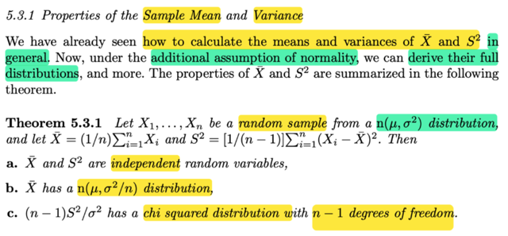</kbd>

🔗 **Related:** [5.3 SAMPLING FROM THE NORMAL DISTRIBUTION](53_sampling_from_the_normal_distribution.md#node-361)

🔗 **Related:** [5.3 SAMPLING FROM THE NORMAL DISTRIBUTION](53_sampling_from_the_normal_distribution.md#node-369)

> [!NOTE]
> Rồi, cái này đại khái là, họ nói ta đã biết cách tính mean, và variance (kí
> hiệu Xbar và S^2) nói chung. Bây giờ, với việc thêm vào gỉa định là ta biết
> population distribution thuộc loại normal distribution. Thì ta có thể derive
> (cho thấy) hoàn  chỉnh distribution của sample mean và sample variance.
>
> Theorem 5.3.1: Đại khái nói là, ta có một random sample X1,X2...Xn từ
> một population và lần này ta biết nó là normal (μ, σ^2). Vì với sample
> mean Xbar, sample variance S^2 (mà công thức thì ta đã biết từ những
> phần trước rồi)
>
> Khi đó theorem này nói rằng:
>
> a) Hai cái random variable này, tức Xbar và S^2, **độc lập nhau.**
>
> b) Cái sampling distribution của sample mean Xbar chính là **normal (μ,
> σ^2/n)**, tức là cũng chính là cái population distribution.
>
> c) (n-1)S^2/ σ^2 có sampling distribution là **chi-square với n-1 bậc tự do**
>
> Một vài suy nghĩ:
>
> 1) Tại sao tác giả lại nói đền "additional assumption of normality" (tạm
> hiểu là  có thêm giả định là normality): Mình nghĩ có thể hiểu rằng, thực
> tế, ta thường không biết cái population mà mình thực hiện lấy mẫu
> (sampling) có distribution là lọai gì. Nên ở đây, ta giả định nó là normal
> distribution.
>
> 2) Ôn lại chút về việc tại sao Sample mean Xbar và sample variance S^2
> lại là random variable (Để rồi ở đây nói chúng độc lập): Thì đó là vì ta đã
> biết, định nghĩa của chúng, nói ngắn gọn, là, chúng là kết quả của việc ta
> dùng một function nào đó, để tính toán với các random variable X1,..Xn
> trong random sample. Cụ thể với Xbar thì nó là Xbar = g1(X1,..Xn) với g1
> có công thức là g1(x1,..xn) = (x1 + x2 + ...xn)/n. Mà ta đã biết khi apply
> một function lên một (hoặc một đám) random variable thì ta cũng có một
> random variable mới.
>
> Thêm nữa, vì X1,...Xn là các random variable của một random sample.
> nên người ta gọi các random variable có được khi apply các function lên
> bộ random variable này là statistic.
>
> Và again, các statistic là random variable, nên nó cũng có distribution. Và
> người ta dùng cái tên SAMPLING DISTRIBUTION, để phân biệt với
> distribution của các random variable X1,...Xn vốn là distribution có sẵn
> (population distribution)
>
> Vậy thì thử xem ta có thể chứng minh theorem này ra sao.

 

<kbd>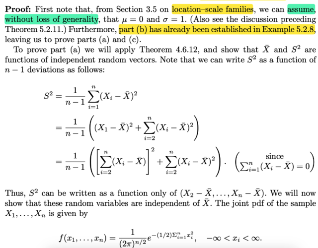</kbd>

> [!NOTE]
> Đầu tiên phần b đã được chứng minh rồi, thử làm lại nhanh.
>
> Đại khái là ta sẽ chứng mgf của Xbar có dạng là mgf của normal (μ, σ^2/n)
>
> Thế thì, ôn lại về mgf (moment generating function), mgf của X, kí hiệu
> M_X(t) có bản chất công thức là E[e^tX], tức là, tạo một random variable
> mới Y = e^tX và lấy kì vọng (expected value) của nó.
>
> ⇨ mgf của Xbar, kí hiệu M_Xbar (t), có bản chất là E[e^tXbar]
>
> Với Xbar  = (Σi Xi)/n, ta có:
>
> E[e^tXbar] = E[e^t((Σi Xi)/n)]
>
> Viết rõ một chút, E[e^ [t(Σi Xi)/n] ]  | e mũ [t(Σi Xi)/n]
>
> = E[e^ [(t/n)(Σi Xi)] ]
>
> = E[e^ [(t/n)(X1 + X2 + ..Xn)] ]  | ghi rõ Σ ra thôi
>
> = E[e^ [(t/n)X1 + (t/n)X2 + ..(t/n)Xn] ]   | phân phối t/n vô thôi
>
> = E [ e^(t/n)X1 * e^(t/n)X2 * ....* e^(t/n)Xn  ]    |  dùng tính chất hàm mũ
> e^(a+b) = e^a * e^b
>
> Tới đây, đại khái ta có thể lập luận lại hoặc cho nhanh thì dùng một
> theorem đã chứng minh: nếu X1, X2...mutually independent thì E(X1X2..
> Xn) = EX1 * EX2 ...EXn
>
> và ở đây, vì X1, X2....Xn là các random variables của một random sample,
> theo định nghĩa chúng sẽ mutually independent.
>
> Mà khi X1,X2...Xn independent thì g(X1), g(X2)...g(Xn) tức là các random
> variable có  được bằng cách apply hàm g lên các random variable này,
> cũng sẽ mutually independent.
>
> Do đó E [ e^(t/n)X1 * e^(t/n)X2 * ....* e^(t/n)Xn  ]
>
> =  E[e^(t/n)X1] * E[e^(t/n)X2] * ....* E[e^(t/n)Xn]
>
> Rồi, tới đây xem xét E[e^(t/n)X1] là cái gì?
>
> Như lúc nãy đã nhắc lại định nghĩa mgf MX(t) = E[e^tX]. Vậy thì MX(t/n) =
> E[e^(t/n)X]
>
> (có nghĩa là, bản chất của hàm mgf của X evaluate tại t, là ta apply hàm
> g(x) = e^tx lên random variable X, để có một random variable mới: Y =
> e^tX. Rồi đem lấy kì vọng: E[Y] thì đó chính là MX(t). Vậy thì, nếu ta muốn
> evaluate tại t/n. thì dĩ nhiên là ta apply hàm khác g(x) = e^[(t/n)x] lên
> random variable X, để có Y = g(X) = e^[(t/n)X], ròi lấy kì vọng.
>
> Như vậy, quay lại đây E[e^(t/n)X1], chính là MX1(t/n).
>
> tương tự E[e^(t/n)X2] = MX2(t/n)
>
> ⇨ cái tích trên = MX1(t/n) MX2(t/n)....MXn(t/n)
>
> Rồi, tới đây, ta lại dùng định nghĩa của random sample, ôn nhanh, đó là các
> random variable X1,.Xn sẽ là các giá trị quan sát được của một biến số nào
> đó. Và chúng độc lập lẫn nhau (mutually independent) như đã nói, nhưng
> ngoài ra, chúng cũng có CHUNG MỘT MARGINAL DISTRIBUTION. Do đó
> pdf, hay pmf, hay cdf, hay mgf của chúng là giống nhau.
>
> Vậy cái tích trên có thể thay bằng [MX1(t/n)]^n, hay gọi MX() là mgf của
> population distribution, ta có M_Xbar (t) = [MX(t/n)]^n
>
> Tới đây ta dùng cái đề bài cho là sample có population distribution là
> normal(μ, σ^2), thì mgf của một normal(μ, σ^2) có thể nhớ hoặc tra bảng =
> e^[μt + (1/2) σ^2t^2]
>
> ⇨ M_Xbar (t) = [MX(t/n)]^n
>
> = [e^[μ(t/n) + (1/2) σ^2(t/n)^2]]^n  | thay vào, **nhớ là đang evaluate tại t/n**
>
> Ở đây, nhìn một nùi vậy chứ chỉ là (e^u)^n, ta dùng tính chất hàm mũ:
> (a^n)^m = a^(n*m)
>
> = e^[n[μ(t/n) + (1/2) σ^2(t/n)^2]]
>
> = e^[nμ(t/n) + n(1/2) σ^2(t/n)^2]  | phân phối n vô thôi
>
> = e^[μt + (1/2) σ^2(t^2/n)]  | cancel n bớt
>
> = **e^[μt + (1/2) (σ^2/n)t^2]**  | đổi chỗ thôi
>
> Tới đây, nhớ lại ta vừa nói random variable ~ normal(μ, σ^2) sẽ có
>
> mgf M(t) = e^[μt + (1/2) σ^2t^2]
>
> nên normal(μ, σ^2/n) sẽ có mgf là M(t) = **e^[μt + (1/2) (σ^2/n)t^2]**
>
> Chính là kết quả trên ta đang có,
>
> Từ đó có thể kết luận sampling distribution của **sample mean Xbar là
> normal(μ, σ^2/n)**
>
> (vì như đã biết, mgf, cũng như cdf, pdf pmf, đều có thể giúp xác định loại
> của một distribution)

 

<kbd>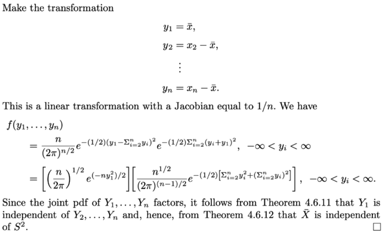</kbd>

<kbd></kbd>

<kbd></kbd>

<kbd></kbd>

<kbd>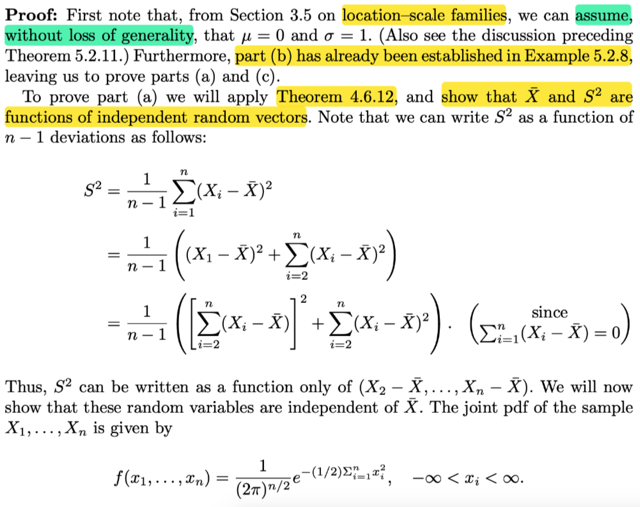</kbd>

> [!NOTE]
> Để chứng minh ý b): Xbar và S^2 độc lập, nhìn khá khoai. Nhưng chiến lược
> hay ý tưởng là dùng cái theorem (..) đã học ở những chương trước nói rằng:
> nếu như X, Y là hai random variable độc lập thì g(X), h(Y) cũng độc lập nhau.
> (tức là apply function g và h lên X và Y để có hai random variable mới, thì chúng
> cũng độc lập)
>
> Và cụ thể thì ta sẽ cho thấy rằng Y1 = Xbar, sẽ độc lập với Y2,...Yn Và S^2 chỉ
> là function theo Y2,...Yn ⇨ cũng độc lập với Y1, tức Xbar.
>
> Đầu tiên họ sẽ chứng minh cho thấy S^2 chỉ là function của Y1,...Yn 
>
> (Y1 = X1 - Xbar)
>
> Dựa vào: 
>
> Σi (Xi - Xbar) = 0 (cái này dễ thấy)
>
> (X1 - Xbar) + Σi=2:n (Xi - Xbar) = 0
>
> ⇔ (X1 - Xbar) = - Σi=2:n (Xi - Xbar)
>
> ⇨ (X1 - Xbar)^2 = [Σi=2:n (Xi - Xbar)]^2
>
> S^2 = [1/(n-1)] Σi (Xi - Xbar)^2
>
> = [1/(n-1)] [(X1 - Xbar)^2 + Σi=2:n (Xi - Xbar)^2]
>
> = [1/(n-1)] [[Σi=2:n (Xi - Xbar)]^2 + Σi=2:n (Xi - Xbar)^2]
>
> ⇨ S^2 chỉ là hàm phụ thuộc X2-Xbar,....Xn-Xbar
>
> Và sau đó ta sẽ chứng minh các rv này independent với Xbar thì như vậy
> S^2 là hàm của các biến mà chúng độc lập với Xbar, thì như Y = g(Z) mà Z
> độc lập với X thì Y độc lập với X
>
> Và người ta chứng minh điều này bằng cách xuất phát từ joint pdf của X1,...Xn
>
> Sau đó đặt Y1 = Xbar, Y2 = X2 - Xbar,....Yn = Xn - Xbar
>
> ta sẽ xây dựng joint pdf của Y1, ...Yn và cho thấy nó có dạng là tích của 
> một hàm theo y1, và một hàm theo y2,....yn. Từ đó kết luận Y1 độc lập với Y2,..Yn
>
> Từ đó chứng minh xong.
>
> Sau đây sẽ là mình làm chi tiết bước này:
>
> joint pdf của X1,...Xn:

> [!NOTE]
> Sau đây sẽ là mình làm chi tiết bước này:
>
> joint pdf của X1,...Xn:
>
> Vì X1,...Xn độc lập nên joint pdf = tích marginal pdf (là pdf của normal(0, 1)
>
> fX1(x) = [1/√(2π)] e^-x^2 / 2
>
> ⇨ f(x1,...xn) = Πi=1:n [1/√(2π)] e^-xi^2 / 2
>
> = [1/√(2π)]^n Πi=1:n e^-xi^2 / 2
>
> = [1/√(2π)]^n e^[Σi=1:n -xi^2 / 2]
>
> = [1/√(2π)]^n e^[(1/2)Σi=1:n -xi^2]
>
> Đổi biến:
>
> Y1 = Xbar, Y2 = X2 - Xbar
>
> y1 = xbar
>
> y2 = x2 - xbar
>
> y3 = x3 - xbar
>
> ..
>
> (x1 - xbar) = - Σi=2:n (xi - xbar)
>
> ⇨ x1 = xbar - Σi=2:n (xi - xbar) = y1 - Σi=2:n yi
>
> ⇨ ∂x1/∂y1 = 1, ∂x1/∂y2 = ∂x1/∂yn = -1
>
> x2 = y2 + xbar = y2 + y1
>
> ⇨ ∂x2/∂y1 = ∂x2/∂y2 = 1, ∂x2/∂y3 = ...∂x2/∂yn = 0
>
> x3 = y3 + y1
>
> ⇨ ∂x3/∂y1 = ∂x3/y3 = 1, ∂x3/∂y2 và các cái khác = 0
>
> ...
>
> ⇨ ta có Jacobinan có dạng:
>
> [1 -1 -1...-1]
> [1 1 0...0]
> [1 0 1...0]
> ...
> [1 0 0...1]
>
> Tới đây chưa vội tính det cái này, mà dùng một tính chất đã học ở mit1806
> thay 1 hàng bằng cách trừ nó cho 1 hàng khác (nhân scalar) thì det ko
> đổi. Nên lần lượt ta biến đổi matrix qua một chuỗi các matrix mà mỗi bước
> ta lần lượt lấy hàng 1 = hàng 1 + hàng 2, rồi hàng 1 = hàng 1 + hàng 3,...
> để cuối cùng ta có:
>
> [n 0 0...0]
> [1 1 0...0]
> [1 0 1...0]
> ...
> [1 0 0...1]
>
> Tới đây dùng cofactor formula: 
>
> Tính theo hàng 1, thì nó bằng a11. (+) det matrix M11 (M11 là matrix bỏ
> hàng 1 cột 1), chính là I, có det = 1 (tính chất đầu tiên của det) 
>
> ⇨ det J = a11*1 = a11 = n
>
> Transformation theorem:
>
> f**Y**(y1, y2,..yn) = f**X**(x1,x2...xn) | J | = [1/√(2π)]^n e^[(1/2)Σi=1:n -xi^2] n
>
> Tiếp thế x1 = y1 - Σi=2:n yi
>
> x2 = y2 + y1, x3 = y3 + y1, ... xn = yn + y1
>
> ... = [1/√(2π)]^n e^[(1/2)Σi=1:n -xi^2] n
>
> = (n/[√(2π)]^n) e^[(1/2)Σi=1:n -xi^2]
>
> = (n/[√(2π)]^n) e^(1/2)[-x1^2 + Σi=2:n -xi^2]
>
> = (n/[√(2π)]^n) e^(-1/2)[x1^2 + Σi=2:n xi^2]
>
> Thay x1 = y1 - Σi=2:n yi = y1 - S (đặt S = Σi=2:n yi)
>
> x2 = y2 + y1, ...
>
> = (n/[√(2π)]^n) e^(-1/2)[(y1 - S)^2 + Σi=2:n (yi + y1)^2]
>
>
>
> a) (y1 - S)^2 = y1^2 - 2y1S + S^2
>
> b) Σi=2:n (yi + y1)^2 = Σi=2:n (yi^2 + y1^2 + 2yiy1)
>
> = Σi=2:n yi^2 + Σi=2:n y1^2 + Σi=2:n 2yiy1
>
> = Σi=2:n yi^2 + (n-1) y1^2 + 2y1 Σi=2:n yi
>
> = Σi=2:n yi^2 + (n-1) y1^2 + 2y1S
>
> ⇨ (y1 - S)^2 + Σi=2:n (yi + y1)^2
>
> = y1^2 - 2y1S + S^2 + Σi=2:n yi^2 + (n-1) y1^2 + 2y1S
>
> = y1^2 + (n-1) y1^2 + S^2 + Σi=2:n yi^2 
>
> = n y1^2 + S^2 + Σi=2:n yi^2 
>
> = n y1^2 + (Σi=2:n yi)^2 + Σi=2:n yi^2 
>
> ⇨ (n/[√(2π)]^n) e^(-1/2)[(y1 - S)^2 + Σi=2:n (yi + y1)^2]
>
> = (n/[√(2π)]^n) e^(-1/2)[n y1^2 + (Σi=2:n yi)^2 + Σi=2:n yi^2 ]
>
> = (n/[√(2π)]^n)    e^(-1/2)[n y1^2]    e^[(Σi=2:n yi)^2 + Σi=2:n yi^2 ]
>
> là tích của  e^(-1/2)[n y1^2]  chỉ chứa y1
>
> và e^[(Σi=2:n yi)^2 + Σi=2:n yi^2 ] chỉ chứa y2,...yn
>
> mà nhớ là đây là joint pdf của Y1,...Yn ⇨ Y1 độc lập với Y2,...Yn
>
> ⇨ Y1 cũng độc lập với S^2 (là function của Y2,...Yn)
>
> ⇨ Xbar (=Y1)  cũng độc lập với S^2 (là function của Y2,...Yn)

 

<kbd>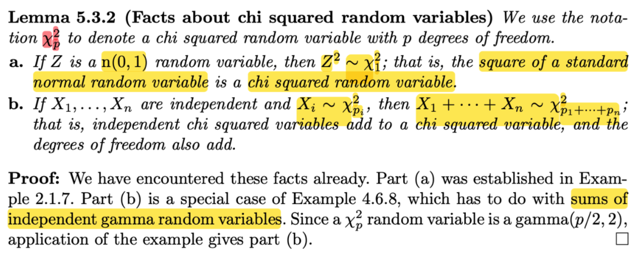</kbd>

<kbd></kbd>

<kbd>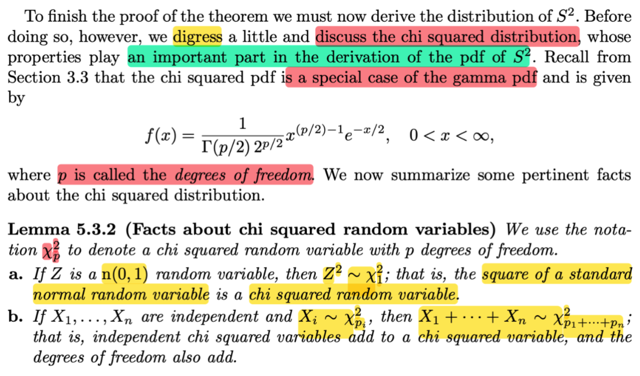</kbd>

🔗 **Related:** [2.1 DISTRIBUTION](21_distribution.md#node-91)

🔗 **Related:** [4.6 MULTI-VARIATE DISTRIBUTION](46_multi_variate_distribution.md#node-313)

🔗 **Related:** [5.3 SAMPLING FROM THE NORMAL DISTRIBUTION](53_sampling_from_the_normal_distribution.md#node-371)

🔗 **Related:** [7.2 METHOD OF FINDING ESTIMATORS](72_method_of_finding_estimators.md#node-560)

> [!NOTE]
> đại khái là ta sẽ lạc đề tí, bàn qua Chi-square một chút trước khi quay lại vì
> distribution này có tầm quan trọng trong việc triển khai ra pdf của sample
> variance S^2.
>
> Phần trước mình đã biết qua Chi-square p bậc tự do pdf
>
> Thì bổ đề này cho biết đại ý là:
>
> Nếu Z là normal (0, 1) thì Z^2 sẽ là Chi-square 1 bậc tự do, kí hiệu \/**X\/^2_1**Và nếu ta có X1, X2,....Xn là các Chi-square rv với các bậc tự do tương ứng
> Xi ~ \/X\/^2_i, thì tổng của chúng cũng là Chi-square và bậc tự do thì cộng lại
>
> Phần chứng minh thì đại khái là dựa trên những gì mình đã làm rồi.
>
> Phần a thì dựa trên ví dụ trong chương 2, nơi mình đã tìm pdf của Y = g(X) =
> X^2. Từ đó áp dụng sự thật là X là normal(0,1) thì bỏ pdf của nó vô ta sẽ có
> pdf của Y là chi-square 1
>
> Còn phần b thì dựa trên ví dụ trong chương 4 đã làm để thấy tổng của các Γ
> cũng là Γ, với tham số cộng lại. Ở đây gs nói vì Chi-square là một loại Γ cụ
> thể là Γ(p/2, 2) nên dĩ nhiên nó cũng đúng

 

<kbd>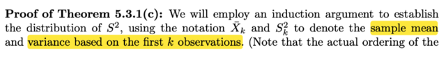</kbd>

<kbd></kbd>

<kbd>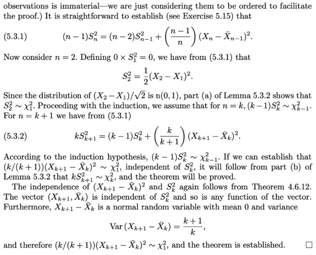</kbd>

🔗 **Related:** [4.2 CONDITIONAL DISTRIBUTIONS & INDEPENDENT](42_conditional_distributions_independent.md#node-249)

🔗 **Related:** [5.3 SAMPLING FROM THE NORMAL DISTRIBUTION](53_sampling_from_the_normal_distribution.md#node-357)

> [!NOTE]
> Phần này gs chứng minh vế cuối của theorem : nhắc lại: là nếu X1,...Xn là random sample
> từ normal(μ, σ^2) thì
>
> c): (n-1)S^2/σ sẽ là Chi-square n-1
>
> Và ko làm mất tính khái quát ta có thể xét normal (0,1)
>
> Có nghĩa là **cần chứng minh (n-1)S^2 sẽ là Chi-square n-1**
>
> 0) Đầu tiên phải ta sẽ chấp nhận công thức sample variance của mẫu size n sẽ quan hệ
> với sample variance của mẫu size n-1 bởi:
>
> (n - 1)Sn^2 = (n - 2)Sn-1^2 + (n-1)/n (Xn - Xn-1_bar)^2
>
> Xn-1_bar là sample mean của mẫu size n-1, (X1,...Xn-1)
>
> 1) Chứng minh nó đúng với n=2, tức chứng minh (2-1)S2^2/σ (sample variance của bộ 
> có 2 cái X1, X2) là một Chi-square 1
>
> Thì S2^2 = 1/(2-1) [(X1 - Xbar)^2 + (X2 - Xbar)^2] triển khai ra sẽ = (1/2)(X2 - X1)^2
>
> Và vì X2, X1 đều là normal(0,1) nên X2 - X1 cũng là normal rv, vì sao?
>
> Vì theorem trước đây đã có nói (theo link), tổng của hai rv independent normal sẽ cũng
> là một normal, với param mean = tổng mean và variance = tổng variance. Ở đây X1, X2
> là independent normal(0,1), thì -X1 cũng là normal(0, 1), (vì tuy có thể trả lời bằng cách
> derive pdf, nhưg có thể dùng location scale không? nó nói nếu Z ~ standard pdf f(x), thì
> σZ + μ sẽ là family member có location μ và scale param σ. với normal thì location và
> scale cũng là mean và standard deviation nên σZ + μ sẽ có mean μ, variance σ^2, ở đây
> -X1 = (-1)*X1 + 0 ⇨ -X1 distribution cũng là thành viên với location = mean là 0, scale =
> -1 ⇨ variance = (-1)^2 = 1
>
> Vậy X2 - X1 là normal(0 + 0, 1 + 1) = normal(0, 2).
>
> Tiếp, xét (X2 - X1)/2 thì cũng lại dùng location scale theorem: Nói rằng nếu X ~ thành
> viên có location μ, scale σ thì Z = (X - μ)/ σ sẽ là thành viên chuẩn (location 0, scale 1)
> Nên ở đây (X2 - X1) là thành viên location 0, scale √2 ⇨ [(X2 - X1) - 0]/√2 chính là sẽ ra
> thành viên chuẩn (location 0, scale 1) mà xét trong bối cảnh normal thì sẽ là mean 0, std
> 1 ⇨ normal(0,1)
>
> Vậy (X2 - X1)/√2 là normal(0,1)  ⇨ [(X2 - X1)/√2]^2 = (X2 - X2)/2 là Chi-square 1
>
> Hay, **(2-1) S2^2** (hay (n-1)Sn^2 với n = 2) **là Chi-square 1**
>
> ====
>
> Thế thì, theo quy nạp, ta sẽ giả sử điều đang cần chứng minh đúng ở mẫu size k thì nếu
> ta chứng minh nó cũng đúng ở mẫu size k+1 thì sẽ có thể theo nguyên lí quy nạp
> (induction) mà kết luận nó đúng với mọi size
>
> Vậy thì ta giả sử nó đúng với mẫu size k, tức là (k-1)Sk^2/σ  (sample mean của mẫu size k (tức
> gồm X1,...Xk) là một Chi-square (k-1)
>
> Theo công thức (n - 1)Sn^2 = (n - 2)Sn-1^2 + (n - 1)/n (Xn - Xn-1_bar)^2
>
> ta có (k + 1 - 1)Sk+1^2 = (k + 1 - 2)Sk+1-1^2 + (k+1-1)/k+1 (Xk+1 - Xk+1-1_bar)^2
>
> ⇔ kSk+1^2 = (k-1)Sk^2 + (k/k+1) (Xk+1 - Xk_bar)^2
>
> Với việc đã giả thiết **(k-1)Sk^2 là Chi-square (k-1)**thì ta **cần chứng minh Sk+1^2 là
> Chi-square k**
> Xét term thứ 2: (k/k+1) (Xk+1 - Xk_bar)^2
>
> Đại khái là vầy: Xk+1 - Xk_bar = Xk+1 - (X1 + X2 + ...Xk) / k. Và cái này là tổng của các
> normal (Xk+1, -X1/k, -X2/k,.. đều là normal, chỉ khác param) Và có thể làm kĩ để xem nó
> là normal param bao nhiêu hoặc chỉ dùng linearity tính variance của nó.
>
> Làm kĩ: Xk+1 thì là normal(0,1) rồi, -X1/k = (-1/k) X1 + 0, với X1 là standard member thì
> (-1/k) X1 + 0 là member với location 0, scale -1/k, và với việc X1 là normal thì ⇨ ta có
> (-1/k) X1 ~ normal(0, 1/k^2). Tương tự với (-1/k) X2,....(-1/k) Xk
>
> ⇨ Xk+1 - (X1 + X2 + ...Xk) / k ~ normal(0 + ..0, 1 + Σi=1:k 1/k^2) = normal(0, 1 + k/k^2)
>
> tức là variance của nó: = 1 + k/k^2 = 1 + 1/k = **(k+1)/k**Còn không có thể tính Var(Xk+1 - Xk_bar) = Var(Xk+1 - (X1 + X2 + ...Xk) / k)
>
> = Var(Xk+1) + Var(-X1/k) + Var(-X2/k) + ...+ Var(-Xk/k) | Ta có điều này là vì các
>
> Xk+1, -X1/k, -X2/k,... mutually independent ⇨ covariance bằng 0**** = 1 + (1/k^2)
> Var(X1) + (1/k^2) Var(X2) + ...(1/k^2) Var(Xk) | dùng tính chất của variance:
>
> Var(cX) = c^2 Var(X)
>
> = 1 + (1/k^2) + ...(1/k^2) = 1 + k/k^2 = 1 + 1/k
>
> Tiếp, vậy Xk+1 - Xk_bar là normal (0, (k+1)/k), nên lại theo location scale theorem:
>
> (chú ý nói Xk+1 - Xk_bar là normal (0, (k+1)/k) thì tức là nó là member có location 0
> scale √(k+1)/k nhé)
>
> [(Xk+1 - Xk_bar) - 0] / √[(k+1)/k] sẽ là standard member có location 0, scale 1, tức
> normal(0,1)
>
> ⇨ **√**(k/k+1)(Xk+1 - Xk_bar) ~ normal (0,1)
>
> Và suy ra bình phương của nó là Chi-square 1
>
> [√(k/k+1)(Xk+1 - Xk_bar)]^2 =**(k/k+1)(Xk+1 - Xk_bar)^2 ~ Chi-square 1**
>
> ====
>
> Vậy quay lại đây kSk+1^2 = (k-1)Sk^2 + (k/k+1) (Xk+1 - Xk_bar)^2
>
> Ta đã có **Sk^2** theo giả thiết là Chi-square k
>
> Nay ta đã chứng minh (k/k+1) (Xk+1 - Xk_bar)^2 là Chi-square 1
>
> Vậy dùng cái theorem vữa nãy, nói là tổng của các chi-square sẽ là chi-square với bậc tự
> do cộng lại. Suy ra (k-1)Sk^2 + (k/k+1) (Xk+1 - Xk_bar)^2 là một Chi-square có k + 1 bậc tự
> do. Chứng minh xong kSk+1^2 là Chi-square k + 1
>
>
> Một điểm quan trọng có thể bỏ xót. Phải nói rõ là các Chi-square độc lập thì mới áp dụng
> theorem tổng Chi-square cũng là Chi-square nhé. Nên ở đây trong sách giáo sư Casella có
> chỉ ra Sk^2 độc lập với Xk+1 - Xk_bar
>
> Và vì sao chúng độc lập là vì vế a) của theorem 5.3.1 nói rằng với X1,..Xn là random sample
> từ normal(μ, σ^2) thì Xbar và S^2 độc lập nhau.
>
> Vậy với random sample size k từ normal(0, 1) thì sample mean Xk_bar và sample variance Sk^2
> cũng độc lập nhau. Mà như vậy thì Xk+1 - Xk_bar cũng độc lập với Sk^2 vì Sk^2 chả liên quan
> gì đến Xk+1 (vì nó chỉ liên quan X1,...Xk)

 

<kbd>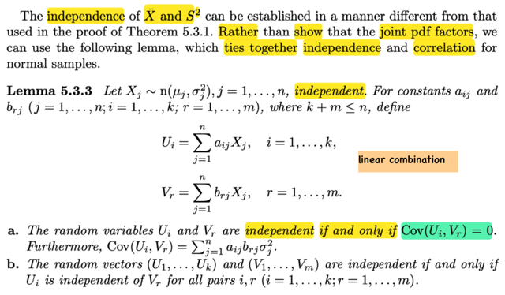</kbd>

> [!NOTE]
> Đại khái là  tác giả nói có thể chứng minh sample mean và sample variance 
> độc lập bằng cách khác, thay vì như lúc nãy ta đã làm là chứng minh
> joint pdf của chúng tách ra. Thì đầu tiên sẽ biết qua bổ đề sau:
>
> Đại khái nó nói là: cho X1,...Xn là các rv ~ normal(μj, σj^2) j = 1,...n 
>
> thì với các constant aij, brj ta định nghiã ra:
>
> Ui = Σj aij Xj 
>
> và Vr = Σj brj Xj
>
> Có nghĩa là ta có các random variable mới Ui, tạo ra bởi linear combine
> các random variabel X1,..Xn
>
> Khi đó: 
>
> a)Ui và Vr đọc lập khi và chỉ khi Cov(Ui, Vr) = 0 và hơn nữa  
> Cov(Ui, Vr) = Σj aijbrj j^2
>
> b) random vector (U1,...Uk) và (V1,...Vm) độc lập khi và chỉ khi Ui độc lập
> với Vr với mọi cặp i, j

 

<kbd>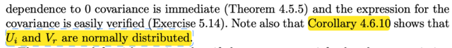</kbd>

<kbd></kbd>

<kbd>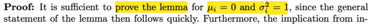</kbd>

🔗 **Related:** [4.5 COVARIANCE & CORRELATION](45_covariance_correlation.md#node-282)

🔗 **Related:** [4.6 MULTI-VARIATE DISTRIBUTION](46_multi_variate_distribution.md#node-315)

> [!NOTE]
> đầu tiên giáo sư cho rằng có thể chứng minh bổ đề này với μi = 0, σi^2 = 1
> ta sẽ quay lại ý này sau.
>
> Còn bây giờ ôn lại vài cái đã học:
>
> X, Y independent thì Cov(X, Y) = 0. Đại khái là vì (tức là lập luận để chứng 
> minh) Cov(X,Y) = E[(X - EX)(Y - EY)] = triển khai ra ta sẽ có công thức thứ 2:
>
> = E[XY - (EX)Y - XEY + EXEY]
>
> = E(XY) - E[(EX)Y] - E[XEY] + E(EXEY)
>
> = E(XY) - EXEY - EYEX + EXEY | linearity
>
> = E(XY) - EXEY 
>
> Mà với X, Y independent thì E(XY) = EXEY (chứng minh bằng cách dùng
> 2D lotus, sau đó phân tách joint pdf thành tích marginal pdf để đưa
> về tích hai tích phân ⇨ EX EY)
>
> Vậy ⇨ Cov(X,Y) = 0
>
> Tiếp, chứng minh ý thứ hai: Cov(Ui, Vr) = Σj aij brj σj^2
>
> Ui = Σj aij Xj, Vr = Σj brj Xj
>
> Cov(Ui, Vr) = E[(Ui - EUi)(Vr - EVr)]
>
> EUi = E[Σj aij Xj] = Σj aij EXj (linearity) = Σj aij μj
>
> Ui - EUi = Σj aij Xj -  Σj aij μj =  Σj aij (Xj - μj)
>
> EVr = E[Σj brj Xj] = Σj brj EXj = Σj brj μj
>
> Vr - EVr = Σj brj Xj - Σj brj μj = Σj brj (Xj - μj) 
>
> ⇨ Cov(Ui, Vr) = E[Σj aij (Xj - μj) Σj brj (Xj - μj)]
>
> = E[[ai1(X1 - μ1) + ai2(X2 - μ2) + ...][br1(X1 - μ1) + br2(X2 - μ2) + ...]]
>
> = E[
>
> ai1br1(X1 - μ1)^2 + ai2br2(X2 - μ2)^2 + ...
>
> + 2ai1br2(X1 - μ1)(X2 - μ2) + ... (các cross term)
>
> ]
>
> = E[Σj=1:n aijbrj (Xj - μj)^2 + Σk=1:n, h=1:n, k≠h aik brh (Xk - μk)(Xh - μh) ]
>
> Dùng linearity
>
> = Σj=1:n aijbrj E(Xj - μj)^2 + Σk=1:n, h=1:n, k≠h aik brh E(Xk - μk)(Xh - μh) 
>
> Các E(Xk - μk)(Xh - μh) = Cov(Xk, Xh) đều bằng 0 do Xk, Xh độc lập
>
> Còn E(Xj - μj)^2 = Var(Xj) = σj^2
>
> ⇨ Cov(Ui, Vr) = Σj=1:n aijbrj σj^2 . Chứng minh xong
>
> ====
>
> Và cuối cùng, Hệ quả 4.6.10 (theo link xanh) ta có tổ hợp tuyến tính các normal
> rv cũng là normal

> [!NOTE]
> Vậy thì nói thêm một chút: 
>
> Ở đây, ta sẽ chứng minh lemma này với μi = 0, σi^2 = 1. 
>
> Và cái ý a của Lemma đại khái là:
>
> Cho Xj ~ normal(μj, σj^2) độc lập và ta có các Ui, Vr là các random variable
> tạo bởi tổ hợp tuyến tính của các rv Xj. Thì chúng sẽ độc lập khi và chỉ khi
> covariance của chúng bằng 0.
>
> Vậy thì cái ta cần chứng minh là cho thấy joint pdf của Ui, Vr phân tách
> thành tích các marginal pdf
>
> Và ta làm điều này với cái đã có là covariance của chúng = 0.
>
> Mà covariance của Ui, Vr như đã làm vừa rồi, = Σj=1:n aijbrj σj^2
>
> Mà đã nói, ta sẽ đang chứng minh với σi = 1 ⇨ Σj=1:n aijbrj σj^2 = Σj=1:n aijbrj 
>
> ⇨ điều kiện ta đang có để dùng là **Σj=1:n aijbrj = 0
>
> Đây chính là cái ràng buộc (restriction) đối với các constant mà giáo sư 
> nói tới trong phần tiếp theo**

 

<kbd>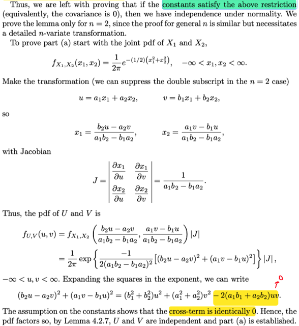</kbd>

> [!NOTE]
> Rồi, giáo sư nói tiếp, ta sẽ chứng minh lemma với n = 2, vì phần chứng minh với khái quát n cũng tương
> tự.
>
> Chứng minh với n = 2 tức là chứng minh: ta có X1 ~ n(μ1 = 0, σ1^2 = 1)  X2 ~ n(0, 1)
>
> (again, nhắc lại là giáo sư mở đầu đã nói ta có thể chứng minh với  μj = 0, σj = 1),
>
> Và Ui = Σj=1:2 aijXj = ai1X1 + ai2X2, tất nhiên có nhiều Ui, i = 1,...k
>
> Vr = Σj=1:2 brjXj = br1X1 + br2X2, r = 1,2...m
>
> Và ta sẽ chứng minh nếu cov(Ui, Vr) = 0
>
> (Mà điều này tương đương Σj=1:n aij brj σj^2 = Σj=1:n aij brj = 0)  thì joint pdf của Ui, Vr sẽ factor, tức
> chúng độc lập
>
> Rồi: Đơn giản là dùng transformation theorem thôi:
>
> Nhưng sẵn ôn lại tí: Bài toán đặt ra là ta triển khai ra joint pdf của U,V từ joint pdf đã có của X, Y.
>
> Vấn đề là để dùng theorem này, ta cần có MAPPING 1-1 TỪ SUPPORT SET CỦA X, Y TỚI ẢNH CỦA
> NÓ: Là sao?
>
> A_curly là support set của X,Y, đơn giản là tập (con của R^2, vì (X,Y) là R^2 random variable vector) mà
> trong đó joint pdf của X,Y dương.
>
> Dĩ nhiên là thông qua hàm g1, g2, thì U = g1(X,Y), V = g2(X, Y) thì các giá trị khả dĩ (x,y) của X, Y sẽ
> được map với u,v trong R^2. Nhưng mà ta sẽ chỉ quan tâm tới (x,y) trong A_curly, vì tại đó mới là nơi "có
> thể xảy ra" (ý là giá trị của X,Y)
>
> Ảnh của A_curly tức là B_curly = {(u,v) ∈ R^2: u = g1(x, y), v = g2(x, y) for some (x,y) ∈ A_curly}
>
> Và mapping 1-1 giữa A_curly và B_curly tức là:
>
> với một (u,v) trong B_curly thì chỉ tìm thấy duy nhất một (x,y) trong A_curly mà thôi.
>
> (Và điều này không ngăn cản việc có thể có điểm (x,y) khác trong R^2 nằm ngoài A_curly được map với
> (u,v) nhưng vì tại (x,y) khác này, joint pdf của X,Y = 0 nên ko ảnh hưởng gì, nên theorem chỉ cần
> mapping 1-1 giữa A_curly với B_curly là đủ)
>
> Khi thỏa yêu cầu đó, thì từ (u,v) trong B_curly, như đã nói ta có thể tìm thấy (x,y) trong A_curly: x = h1(u,
> v), y = h2(u,v) mà nếu điều kiện mapping 1-1 ko thỏa thì ta ko biết x, y là gì hết.
>
> Khi đó ta có thể có joint pdf của U,V từ joint pdf của X, Y như sau:
>
> fU,V(u,v) = fX,Y(x,y) |∂(x, y)/∂(u, v)|
>
> = fX,Y(h1(u,v), h2(u,v)) |∂(h1(u,v), h2(u,v))/∂(u, v)|
>
> ====
>
> Áp dụng vào bài toán này, nhắc lại, ta cần chứng minh Ui và Vr độc lập với Ui = Σj=1:2 aijXj tức, = ai1X1
> + ai2X2 và Vr = Σj=1:2 brj Xj = br1X1 + br2X2
>
> Cho i = 1,r = 1, tức là ta sẽ chứng minh U1, V1 độc lập, và cho gọn ta gọi là U, V với U = a1X1 + a2X2, V
> = b1X1 + b2X2 và "thành lập" random variable vector (U, V) (để mà ta sẽ chứng minh joint pdf của U, V
> factored, từ joint pdf của X1, X2)
>
> Vậy thì ở đây, U = g1(X1, X2) và V = g2(X1, X2) với g1(x1,x2) = a1x1 + a2x2, g2(x1,x2)  = b1x1 + b2x2
>
> Chúng đều là hàm tuyến tính, nên có thể nói là ta đã thỏa yêu cầu mapping 1-1 từ support set của X1,X2
> tới ảnh của nó.
>
> Hoặc đơn giản là ta thấy có thể giải tìm x,y từ u = g1(x,y), v = g2(x,y):
>
> u = a1x1 + a2x2; v = b1x1 + b2x2
>
> => x1 = (b2u - a2v) / (a1b2 - b1a2),
>
> Và x2 = (a1v - b1u) / (a1b2 - b1a2) (đây chính là h1, h2)
>
> Từ đó ta có Jacobian: ∂(x1,x2)/∂(u,v)
>
> Row 1: [∂x1/∂u, ∂x1/∂v] = [ b2 / (a1b2 - b1a2), -a2 / (a1b2 - b1a2) ]
>
> Row 2: [∂x2/∂u, ∂x2/∂v] = [ -b1 / (a1b2 - b1a2), a1 / (a1b2 - b1a2)]
>
> ⇨ |J| = [b2 / (a1b2 - b1a2)] [a1 / (a1b2 - b1a2)] - [-a2 / (a1b2 - b1a2)] [-b1 / (a1b2 - b1a2)]
>
> = (b2a1 - b1a2) / (a1b2 - b1a2)^2
>
> = **1 / (a1b2 - b1a2)**
>
> Thế vào theorem:
>
> fU,V(u,v) = fX1,X2(x1,x2) |J|
>
> Mà X1, X2 độc lập nên joint pdf factored:
>
> = fX1(x1) fX2(x2) |J|
>
> = fX1((b2u - a2v) / (a1b2 - b1a2)) fX2((a1v - b1u) / (a1b2 - b1a2)) |J|
>
> pdf cuả n(0,1) f(x) = [1/√2π] exp{-x1^2/2}
>
> = [1/√2π] exp{-[(b2u - a2v) / (a1b2 - b1a2)]^2/2} [1/√2π] exp{-[(a1v - b1u) / (a1b2 - b1a2)]^2/2} |J|
>
> = [1/2π] exp{-[(b2u - a2v) / (a1b2 - b1a2)]^2/2} exp{-[(a1v - b1u) / (a1b2 - b1a2)]^2/2} |J|
>
> = [1/2π] exp{ -(1/2) [(b2u - a2v) / (a1b2 - b1a2)]^2 + [(a1v - b1u) / (a1b2 - b1a2)]^2 }  |J|
>
> = [1/2π] exp{ -1 / [2(a1b2 - b1a2)^2] [(b2u - a2v)^2 + (a1v - b1u)^2] } |J| (1)
>
> Xét [(b2u - a2v)^2 + (a1v - b1u)^2]
>
> triển khai ra ta sẽ có (b1^2 + b2^2)u^2 + (a1^2 + a2^2)v^2 - **2(a1b1 + a2b2)uv**
>
> Và TA DÙNG cái ràng buộc của các constant được suy ra từ covariance = 0: a1b1 + a2b2 = 0
>
> ⇨ chỉ còn (b1^2 + b2^2)u^2 + (a1^2 + a2^2)v^2
>
> Như vậy (1) =  [1/2π] exp{ -1 / [2(a1b2 - b1a2)^2] [(b1^2 + b2^2)**u**^2 + (a1^2 + a2^2)**v**^2] } |J|
>
> = [1/2π] exp{ -1 / [2(a1b2 - b1a2)^2] [(b1^2 + b2^2)**u**^2 } * exp {-1 / [2(a1b2 - b1a2)^2][a1^2 +
> a2^2)**v**^2] } |J|
>
> Tới đây là đủ để thấy joint pdf của U, V phân tách ⇨ U, V độc lập ⇨ Chứng minh xong phần a)

 

<kbd>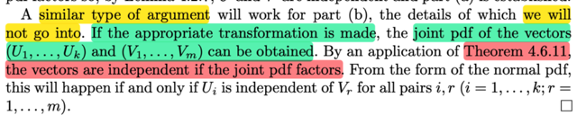</kbd>

🔗 **Related:** [4.6 MULTI-VARIATE DISTRIBUTION](46_multi_variate_distribution.md#node-316)

> [!NOTE]
> Rồi, đại khái là phần b, giáo sư cho là cũng có thể làm tương tự, là ta sẽ
> tìm joint pdf của random variable vector (U1,..Uk) và (V1,.. Vm) chú ý
> (joint pdf của hai random variable vector nhé) tức gọi **U** = (U1,...Uk), 
> **V** = (V1,...Vm). thì joint pdf của chúng: f**U**,**V**(**u**,**v**)  (viết bold hết để thể hiện
> là vector).
>
> Sau đó ta có thể dùng theorem 4.6.11 nói rằng nếu joint pdf của các 
> random vector **X1**, **X2**, ...**Xn**mà factored, tức là có thể tách hàm 
> f**X1**,**X2**,...**Xn**(**x1,**...**xn**) thành tích các hàm g1(**x1**)g2(**x2**)...gn(**xn**)
>
> (có nghĩa là hàm f**X1,X2,...Xn**(**x1**,...**xn**) là function nhận vào bộ vector **x1,..xn**có thể tách thành tích các function gi mà mỗi cái apply riêng lên vector **xi )**thì khi đó các rv Vector **X1,...Xn** là độc lập

 

<kbd>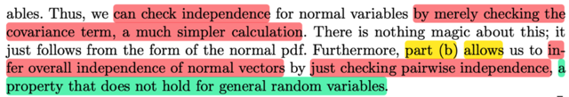</kbd>

<kbd></kbd>

<kbd>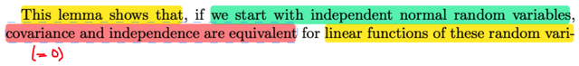</kbd>

> [!NOTE]
> Vậy đại ý là cái bổ đề vừa rồi: Nó cho phép: KHI TA BẮT ĐẦU VỚI CÁC
> NORMAL RANDOM VARIABLES ĐỘC LẬP (X1,....Xn) thì COVARIANCE
> VÀ TÍNH CHẤT INDEPENDENT của các linear function của đám rvs này
> (Ui,Vr) sẽ là một.
>
> Từ đó cho phép ta check xem các linear function của đám rvs này tức Ui,
> có độc lập hay không bằng cách xem Covariance của chúng có bằng 0 hay
> không (đó là  ứng dụng của part a)
>
> Còn part b, khi lemma nói nếu Ui độc lập Vr với mọi i và r thì suy ra vector U
> độc lập vector R. Điều này cho phép khi ta có các random vector normal..
>
> (hiểu ko: (U1,...Uk) mà mỗi cái là linear function của đám normal X1,..Xn
> thì U1,...Uk như đã nói trong phần chứng minh lemma, cũng là normal,
> nên (U1,..Uk) gọi là normal vector hay random variable vector mà mỗi cái
> đều là normal rv)
>
> ..thì ta có thể làm bằng cách check xem các phần tử (Ui, và Vr có độc lập
> từng cặp (pair wise) với nhau không.
>
> Và DUY CHỈ CÓ KHI TA START VỚI NORMAL THÌ MỚI CÓ TÍNH CHẤT
> NÀY

 

<kbd>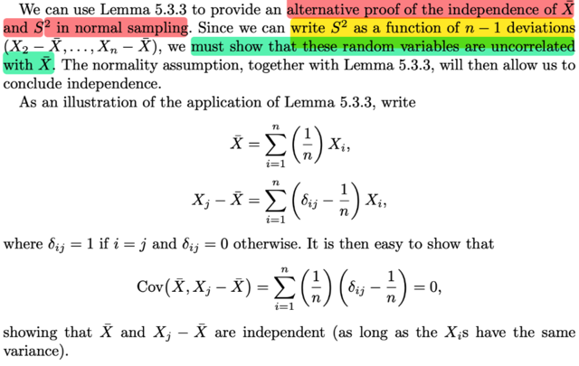</kbd>

> [!NOTE]
> QUAY LẠI SAU
>
> Nhưng đại ý là ta có thể dùng bổ đề vừa rồi để chứng minh S^2 độc lập với
> Xbar theo cách khác nếu như sampling là normal sampling (X1,..Xn là sample
> size n từ population ~ normal distrbution)
>
> Thì như lemma này nói với Ui Vr là tổ hợp tuyến tính (hay linear function)
> của X1,...Xn mà có population là normal thì chỉ cần chứng minh Covariance
> của Ui và và Vr = 0 là đủ kết luận chúng độc lap
>
> Vậy ở đây Xbar là Σi (1/n)Xi , là một tổ hợp.
>
> Xi  - Xbar cũng vậy, cũng là các tổ hợp tuyến tính của X1,...Xn
>
> Giáo sư mới chứng minh các Xi  - Xbar đều có covariance = 0 vói Xbar:
>
> Cov(X1 - Xbar, Xbar) = 0,...Cov(Xn - Xbar, Xbar) = 0
>
> Từ đó theo bổ đề ta suy ra X1-Xbar độc lập Xbar, X2-Xbar độc lập Xbar, ...
>
> mà trước đây đại khái là có theorem nói rằng nếu X, Y độc lập thì apply các hàm
> vào thì ta vẫn có các rv độc lập.
>
> Nên ở đâu S^2 = là function của (X1 - Xbar, X2 - Xbar,...)
> nên nó cũng độc lập Xbar

 

<kbd>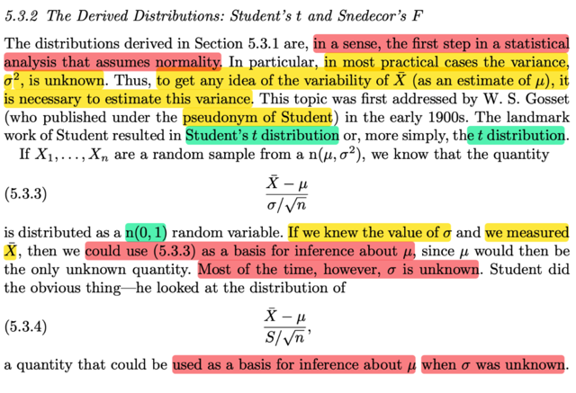</kbd>

🔗 **Related:** [8.2 METHOD OF FINDING TESTS](82_method_of_finding_tests.md#node-687)

> [!NOTE]
> đại khái là vầy: giáo sư Casella nói phần trước, khi ta  tìm cách derive
> distribution (của các statistic như sample mean, sample variance) với 
> giả định là random sampling từ normal là bởi vì (đại khái là) trong thực
> hành phân tích thống kê thì bước đầu tiên chính là giả định tính normality.
>
> Cụ thể hơn, trong hầu hết các case thực tế, thì ta KHÔNG BIẾT σ^2 (tức
> population variance của population normal distribution.
>
> Thế thì để mà chuyển qua phân tích về TÍNH BIẾN ĐỘNG CỦA SAMPLE
> MEAN Xbar, thì ta cần phải estimate variance σ^2.
>
> (variability của sample mean, tức là sao? Là vì sampling mean ta đã biết
> là một random variable, có distribution, mà ta gọi là sampling distribution,
> vậy thì sắp tới ta quan tâm VARIANCE CỦA NÓ, chú ý, nó hoàn toàn khác
> với SAMPLE VARIANCE nhé, cái này nhắc lại là variance của sample mean)
>
> Vậy thì giáo sư cho biết, nếu X1.....Xn là random sample từ n(μ, σ^2), thì
> ta đã biết (Xbar - μ) / σ/√n sẽ ~ n(0,1). Tại sao?
>
> Đầu tiên, ôn lại random sample là cái gì: Theo định nghĩa random sample
> size n từ population f tức là ta sẽ tiến hành quan sát giá trị của một biến số
> nào đó n lần, mỗi lần giá trị sẽ được đại diện bởi một random variable X_i
>
> Và các random variables X1,...Xn sẽ mutually independent, cũng như là
> identically distributed, tức có chung marginal distribution là population distribs
>
> Vậy thì trong phần trước mình đã biết rằng, sample mean Xbar, với random
> sample từ normal(μ, σ^2) thì Xbar cũng là normal, nhưng là normal(μ, σ^2/n)
>
> Thế thì mới nói tới location scale theorem ta đã biết, nói rằng: nếu Z là random
> variable có pdf f(z), tức là thành viên chuẩn của location scale family, thì random 
> variable X = σZ + μ sẽ là thành viên của family với location μ, và scale σ
>
> Và ngược lại nếu X là thành viên có location μ, scale σ thì (X - μ) / σ sẽ là thành
> viên chuẩn tức có location 0, scale 1.
>
> Mà ta cũng biết với normal, thì location là mean và scale là standard deviation.
>
> nên mới nói Xbar là normal(μ, σ^2/n) thì (Xbar - μ) / (σ^2/n) sẽ là một normal(0,1)
>
> ====
>
> Thế thì, đại khái là với việc biết (Xbar - μ) / (σ^2/n) sẽ là một normal(0,1) thì ta 
> có thể đo Xbar, và nếu biết σ^2 (population variance) thì khi đó ta có thể làm cơ
> sở để SUY LUẬN RA μ (population mean).
>
> TUY NHIÊN, như đã nói, hầu hết ta đều không biết σ^2,
>
> THÀNH RA, NGHIÊN CỨU CỦA ÔNG STUDENT, sẽ là quan sát distribution của
> (Xbar - μ) / S/√n (dùng sampling standard deviation thay cho σ). Nhằm làm cơ 
> sở cho việc **suy luận ra μ Mà ko cần biết variance σ**

 

<kbd>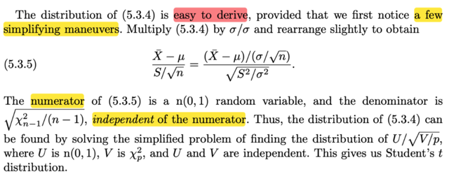</kbd>

🔗 **Related:** [5.3 SAMPLING FROM THE NORMAL DISTRIBUTION](53_sampling_from_the_normal_distribution.md#node-357)

> [!NOTE]
> Thế thì đại ý là distribution của cái này (Xbar - μ) / S/√n thật ra là ko khó để
> derive:
>
> Biến đổi chút xíu:
>
> (Xbar - μ) / (S/√n)
>
> = (Xbar - μ)/(σ/√n)  /  (S/√n)/(σ/√n) (chia tử và mẫu cho (σ/√n))
>
> = (Xbar - μ)/(σ/√n)  /  (S/√n)(√n/σ)
>
> = (Xbar - μ)/(σ/√n)  /  (S/σ)
>
> = (Xbar - μ)/(σ/√n)  /  √(S^2/σ^2)
>
> Tới đây, tử số là n(0,1) như đã nói.
>
> Còn mẫu, thì bài trước ta đã biết, Sn^2, tức là sample variance của  một
> random sample size n từ normal thì sẽ có tính chất:
>
> (n-1) Sn^2 / σ^2 là một Chi-square n - 1, kí hiệu \/X\/^2_n-1
>
> Vậy thì Sn^2 / σ^2 dĩ nhiên là có bản chất cũng là (một Chi-square n-1) /
> (n-1)
>
> (này nhé nếu đặt Y = (n-1) Sn^2 / σ^2 thì ta có Y là Chi-square n-1, vậy giờ
> đem Y chia cho (n-1) thì ta nói là X = Y / (n-1) là một (Chi-square n-1) /
> (n-1) thôi.
>
> Nhưng chưa biết nó có là Chi- square hay không, nhưng ta hiểu nó là việc
> apply hàm h(u) = u / (n-1) lên  một Chi-square (n-1) random variable thôi.
> Và nếu h(u) = √[u / (n-1)] thì  Y là √[Chi-square (n-1)] / (n-1)]. Nói chung
> hiểu bản chất là sẽ thấy ko khó.
>
> Rồi, ý quan trọng là, cái thằng mẫu (random variable ở mẫu)
>
> = √[X^2_n-1 / (n-1)], nó độc lập với tử.
>
> Do đó, nếu gọi U là tử, là một n(0,1), và V = X^2_p, thì mẫu là một √(V / p)
> thì việc tìm distribution của (Xbar - μ) / (S/√n) cũng chỉ là tìm distribution
> của U/√(V/p). Và quan trọng là U, V độc lập.
>
> Do đó có thể giải bài toán để tìm distribution của U/√(V/p)
>
> V là Chi-square p, thì ta có thể tìm distribution của √(V/p), rồi U là n(0,1) thì
> nói chung ta có thể tìm được distribution của U/√(V/p)

 

<kbd>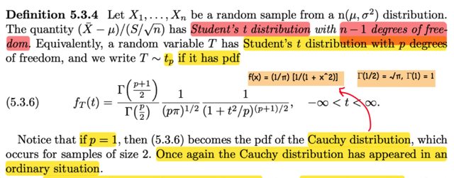</kbd>

> [!NOTE]
> Ta có định nghĩa: Cho random sample X1,...Xn từ n(μ, σ^2), thì 
>
> cái quantity (cái random variable có được từ) (Xbar - μ) / S/√n sẽ là 
> một STUDENT's t  distribution, vói n - 1 degree of freedom.
>
> Và nếu nói T là random variable ~ Student's t với p bậc tự do, thì ta 
> kí hiệu là T ~ tp. Và nó có pdf như vầy.
>
> Với p = 1 thì nó chính là pdf của Cauchy distribution

 

<kbd>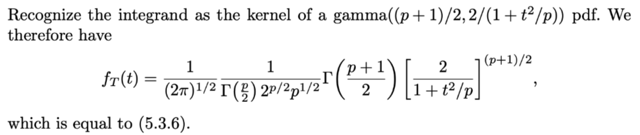</kbd>

<kbd></kbd>

<kbd>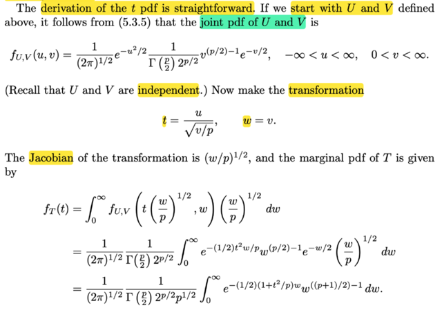</kbd>

🔗 **Related:** [5.3 SAMPLING FROM THE NORMAL DISTRIBUTION](53_sampling_from_the_normal_distribution.md#node-360)

> [!NOTE]
> Rồi, thử làm theo, derive pdf của Student's t:
>
> Như đã nói, bài toán chính là tìm pdf của U/√(V/p) với U là n(0,1), 
> V là Chi-square p bậc tự do. Và U, V độc lập
>
> Thế thì: đầu tiên là xây dựng joint pdf của U, V:
>
> Vì U, V độc lập, nên fU,V(u,v) = fU(u)fV(v)
>
> = 1/√(2π) e^-u^2/2 . 1/ [Γ(p/2) 2^(p/2)] v^[(p/2)-1] e^(-v/2),  
>
> -inf < u < inf, 0 < v < inf
>
> Rồi, ta sẽ define transformation:
>
> T = g1(U, V)  với g1(u,v) = u / √(v/p). W = g2(U,V) , g2(u,v) = v
>
> Ôn lại không thừa: Để dùng transformation theorem: ta cần mapping 1-1 từ
> support set của (U,V) tới ảnh của nó.
>
> Ở đây với t = g1(u,v) = u / √(v/p), w = v thì xem thử có thể giải ra u, v từ t, w 
> không
>
> w = v ⇨ v = w
>
> t = u / √(v/p) ⇨ u = t √(v/p) = t √(w/p)
>
> Như vậy là mapping là 1-1 nên ta có thể dùng transformation theorem.
>
> Jacobian: ∂(u,v)/∂(t,w)
>
> Row 1: [∂u/∂t, ∂u/∂w] 
>
> u = t √(w/p) ⇨ ∂u/∂t = √(w/p), 
>
> ∂u/∂w = (t/√p) (1/√w) = t/√(pw)
>
> Row 2: [∂v/∂t, ∂v/∂w] 
>
> v = w ⇨ ∂v/∂t = 0, ∂v/∂w = 1
>
> ⇨ J = [√(w/p), t/√(pw); 0, 1] ⇨ |J| = √(w/p)
>
> Tiếp: joint pdf của T, W:
>
> fT,W(t,w) = fU,V(u,v) |J|
>
> Và để tìm pdf của T thì ta chỉ việc marginalizing over mọi possible value của W:
>
> fT(t) = ∫ fU,V(u,v) |J| dw
>
> = ∫0:inf 1/√(2π) e^-u^2/2 . 1/ [Γ(p/2) 2^(p/2)] v^[(p/2)-1] e^(-v/2) √(w/p) dw
>
> = 1/√(2π)  1/ [Γ(p/2) 2^(p/2)] ∫0:inf e^-u^2/2 .v^[(p/2)-1] e^(-v/2) √(w/p) dw
>
> (đưa constant ra)
>
> Xét ∫0:inf e^-u^2/2 . v^[(p/2)-1] e^(-v/2) √(w/p) dw
>
> ...
>
> Nói chung là ta sẽ nhận ra bên trong là kernel của Γ((p+1)/2, 2/(1+t^2/p))
>
> từ đó ta có pdf của T,là pdf của student t p degree

 

<kbd>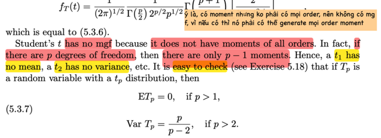</kbd>

> [!NOTE]
> Đại khái là Student's t distribution không có hàm mgf. Vì ko phải mọi moment 
> nào cũng có. 
>
> Cụ thể thì nó có moment, nhưng ko có hết. Chính xác là với p bậc tự do thì
> chỉ có p - 1 moment.
>
> Nên student's t p = 1 thì ko có mean, tức là ko có moment bậc 1
>
> student's t  p = 2 thì có mean, nhưng ko có variance (moment bậc 2)
>
> Và ta cũng có công thức của mean (với p > 1) : ETp = 0
>
> variance với p > 2 VarTp = p / (p - 2)

 

<kbd>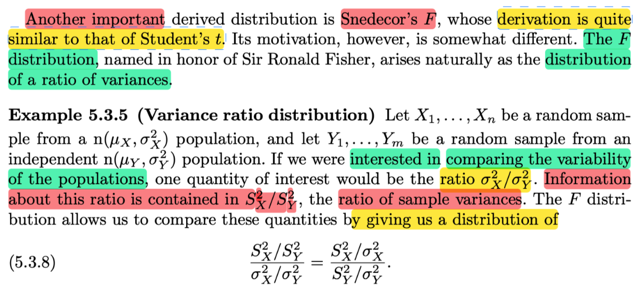</kbd>

> [!NOTE]
> đại khái là, ta sẽ biết một distribution quan trọng nữa F distributin.
>
> Động lực của cái này, đó là ta muốn tìm distribution của một "tỉ lệ của
> variances"
>
> Cho X1,..Xn là random sample n(μX, σX^2) và Y1,...Ym là random sample
> n(μY, σY^2). Và ta quan tâm đến việc / MUỐN SO SÁNH  ĐỘ BIẾN ĐỘNG
> (VARIABILITY) của hai population. Dĩ nhiên lẽ tự nhiên là ta muốn quan tâm
> đến ratio σX^2 / σY^2.
>
> Thì thông tin về ratios này chứa đựng trong S^2X / S^2Y (tỉ lệ của hai
> sample variance)
>
> Thế thì chỗ này phải hiểu là, sở dĩ ta có thể dùng tỉ lệ giữa hai sample
> variance để suy luận, suy đoán cho tỉ lệ giữa hai true population variance
> σX^2/σY^2 là vì / là nhờ vào một loại distribution có tên là F distribution.
> Mà, cụ thể là, cái random variable sau đây sẽ là một F random variable
>
> S^2X/S^2Y / σ^2X/σ^2Y
>
> Để rồi, tí nữa ta sẽ thấy, khi tính kì vọng của cái random variable này,
> thì ta sẽ thấy nó bằng 1 khi m lớn. Từ đó ý nghĩa là, hay cho phép kết luận
> là, hay có cơ sở để nói là, SX^2 / SY^2 ≈ σX^2 / σY^2

 

<kbd>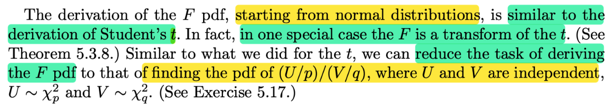</kbd>

<kbd></kbd>

<kbd>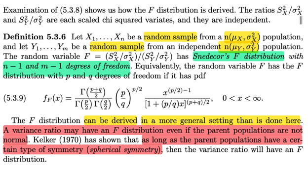</kbd>

> [!NOTE]
> Định nghĩa này nói rằng, với random sample size n từ n(μX, σX^2)
> và random sample size m từ n(μY, σY^2) thì random variable F
> với F = (SX^2/σX^2)(SY^2/σY^2) sẽ tuân theo distribution có tên
> là Snedecor's F distribution với bậc tự do là n-1 và m-1
>
> Và nó có pdf là như trong sách (khá là dài)
>
> Vậy thì ở đây, giáo sư Casella cho biết  variance ratios có thể có F
> distribution ngay cả khi population không phải normal mà chỉ cần nó có
> tính đối xứng (spherical symmetry)
>
> Và việc chứng minh ra công thức pdf của F distribution có thể làm 
> tương tự như khi derive pdf của t distribution (nhớ lại, với t distribution,
> thì ta dựa vào định nghĩa của nó là U/√(V/p) với U là normal(0,1) V là
> Chi-square p

 

<kbd>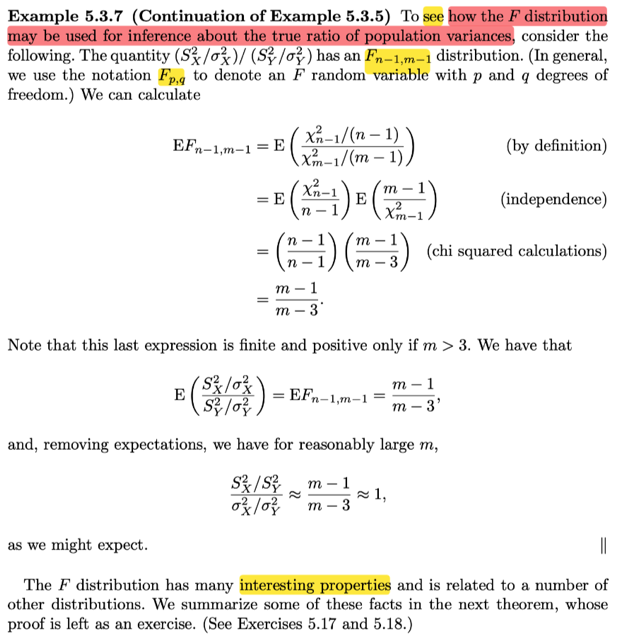</kbd>

> [!NOTE]
> Tiếp nối phần lập luận ở Example 5.3.5
>
> ...Thế thì chỗ này phải hiểu là, sở dĩ ta có thể dùng tỉ lệ giữa hai sample
> variance để suy luận, suy đoán cho tỉ lệ giữa hai true population variance
> σX^2/σY^2 là vì / là nhờ vào một loại distribution có tên là F distribution. Mà, cụ
> thể là, cái random variable sau đây sẽ là một F random variable
>
> S^2X/S^2Y / σ^2X/σ^2Y
>
> Để rồi, tí nữa ta sẽ thấy, khi tính kì vọng của cái random variable này, thì ta sẽ
> thấy nó bằng 1 khi m lớn. Từ đó ý nghĩa là, hay cho phép kết luận là, hay có cơ
> sở để nói là, SX^2 / SY^2 ≈ σX^2 / σY^2
>
> Vừa rồi, đã nói, định nghĩa của distribution của một random variable có được
> bởi (SX^2/σX^2)(SY^2/σY^2) là một Fn-1,m-1 random variable, và ta có pdf của
> F rồi.
>
> Thế thì, xét E[Fn-1,m-1], tức là, ý là xét kì vọng của môt random variable thuộc
> Fn-1,m-1 distribution.
>
> mà theo định nghĩa, ví dụ như gọi F là một random variable ~ Fn-1,m-1
>
> thì nó là (kết quả của) lấy SX^2 / σX^2 chia cho SY^2 / σY^2.
>
> Mà SX^2 / σX^2 thì ta có định nghĩa:
>
> (n - 1) Sn^2 / σ^2 sẽ là một Chi-square n - 1
>
> Câu này có nghĩa là, nếu ta có random sample size n từ normal(μ, σ^2)  thì cái
> random variable được tạo bằng cách lấy hàm g(z) = (n-1) z / σ^2 apply lên
> sample variance S^2, thì cái random variable đó sẽ có distribution đã biết, có tên
> là Student t, và nói đã biết tức là ta biết pdf của nó.
>
> Nếu gọi J = (n - 1) Sn^2 / σ^2, thì Sn^2 / σ^2 =  J / (n - 1)
>
> Và đặt U = Sn^2 / σ^2, và ta quan tâm đến distribution của thằng rv K này, thì ta
> có thể derive distribution của nó dựa vào transformation K = J / (n-1) và người ta
> gọi K là một Chi-square (n-1) / n - 1 thì có nghĩa là vậy
>
> Tương tự, nếu gọi V = SY^2 / σY^2, thì ta gọi nó là Chi-square (m-1) / (m-1)
>
> Rồi, tới đây ta lại quan tâm đến distribution của một random variable
>
> F = U / V, nên ta nói F là một
>
> [Chi-square (n-1) / n - 1] / [Chi-square (m-1) / (m-1)]
>
> để từ đó, dựa vào quan hệ này, giúp ta tìm ra pdf của F
>
> Cái này cũng chỉ y như khi ta có X, Y với pdf đã biết fX, fY, hoặc biết joint pdf
> của chúng fX,Y, và ta quan tâm đến một random variable U tạo ra bởi việc apply
> function g1 lên X, Y. Thì ta ko biết pdf của U, và nhờ transformation theorem ta
> có thể tìm ra được.
>
> Vậy thì ở đây cũng thế thôi, CÁI VIỆC TA NÓI RẰNG:
>
> "F là một  [Chi-square (n-1) / n - 1] / [Chi-square (m-1) / (m-1)]"
>
> CHÍNH LÀ NÓI RẰNG: À, TA CÓ X, Y LÀ HAI RANDOM VARIABLE ĐÃ BIẾT
> PDF (LÀ PDF CỦA CHI-SQUARE), VÀ BÂY GIỜ, MUỐN TÌM PDF CỦA F =
> g(X,Y)
>
> nên phải hiểu khi nói vậy tức là NHẤN MẠNH VÀO QUAN HỆ, HAY, CÁCH
> TRANSFORMATION.
>
> Rồi, như vậy việc tìm distribution của F chính là gỉai bài toán (1) ở trên, nhưng
> mình sẽ thay X,Y bằng U, V cho giống trong sách. U là Chi-square n-1, V là
> Chi-square m - 1, và F = g(U,V) = [U/(n-1)]/[V/(m-1).
>
> Nhưng mà n-1, hay m-1 chỉ là con số cụ thể, ta có thể khái quát nó thành bài
> toán, ta có U là Chi-square p, V là Chi-square q, và F = (U/p) / (V/q), và ta sẽ tìm
> distribution của F. Và đó là phần Exersice 5.17, nhưng cái chính là mình hiểu
> như vậy
>
> Thế thì cái thằng F mà ta tìm ra pdf của nó từ U, V, người ta gọi distribution của
> nó là F n-1, m-1
>
> Hoặc khái quát, Fp,q, và ta hiểu Fp,q sẽ là distribution của một random variable
> X nào đó mà được tạo ra bởi g(U,V) = (U/p) / (V/q) với U, V là Chi-squares p, và
> Chi-square q
>
> Vậy quay lại đây, họ ghi :
>
> E[Fn-1,m-1] = E{[Chi-square (n-1) / (n-1)] / [Chi-square (m-1) / (m-1)]}
>
> thì có thể hiểu là, đây giống như nói tắt, đáng là phải nói:
>
> Cho F ~ Fn-1,m-1, thì nhất định F là một random variable tạo bởi U/p / V/q với
> U, V độc lập và U ~ Chi-square p, V ~ Chi-square q, p = n-1, q = m-1
>
> EF = E[(U/q) / (V/q)]
>
> Và do U V độc lập nên U/q và 1/[(V/q)] cũng độc lập
>
> ... = E[(U/p)] . E[1/(V/q)] = EU/p . qE[1/V]
>
> = EU/(n-1) . (m-1)E(1/V)
>
> tiếp theo đó dựa trên việc đã biết pdf của U, V ta tính ra:
>
> thì có két quả (m - 1)/(m - 3)
>
> Và do đó nếu m lớn thì EF ≈ 1
>
> Như vậy kì vọng của một random variable có distribution là Fn-1,m-1 với m lớn,
> sẽ là 1.
>
> Mà đã nói (SX^2 / σX^2) / (SY^2 / σY^2) với SX là sample variance của random
> sample size n, từ normal(μX, σX^2) và SY là sample variance của một random
> sample size m từ normal(μY, σY^2) SẼ LÀ MỘT RANDOM VARIABLE CÓ
> DISTRIBUTION Fn-1,m-1
>
> NHƯ VẬY, với m lớn thì:  E[(SX^2 / σX^2) / (SY^2 / σY^2)] = 1
>
> Suy ra SX^2/SY^2 ≈ σX^2/σY^2 LÀM CƠ SỞ CHO VIỆC TA CÓ THỂ DÙNG TỈ
> SỐ CỦA HAI SAMPLE VARIANCE ĐỂ SUY LUẬN CHO TỈ SỐ CỦA HAI
> POPULATION VARIANCE

 

<kbd>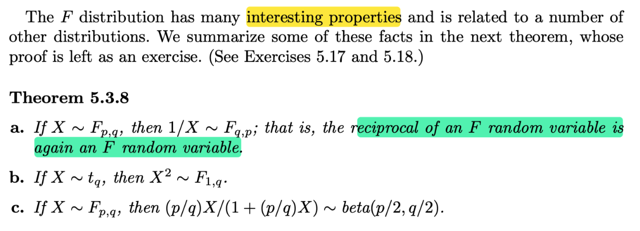</kbd>

> [!NOTE]
> Cuối cùng là theorem nói đại khái là nghịch đảo của một F rv cũng là 
> một F rv (cái distribution này tên là F, khiến ta dễ lú lẫn, ví dụ mình có thể
> ghi là cho F ~ F, có nghĩa là đặt một random variable F, có distribution F)
>
> Nếu X là một Student's t có q bậc tự do thì X^2 là một F 1,q

 

