# 5.4 Order Statistic

📊 **Progress:** `13` Notes | `20` Screenshots

---

<kbd>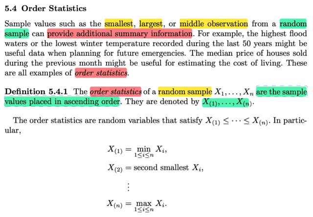</kbd>

> [!NOTE]
> Rồi, phần này ta sẽ bàn về Order statistic, mở đầu giáo sư cho biết các giá
> trị của sample liên quan đến thứ tự, như nhỏ nhất, lớn nhất, đều có thể cung
> cấp thông tin hữu ích.
>
> Định nghĩa của order statistic: Order statistic của một random sample size n
> X1,....Xn là cũng là các giá trị này như sắp xếp lại theo thứ tự từ nhỏ đến lớn.
> Và kí hiệu là X(1), X(2),...X(n)
>
> Cụ thể X(1) = min 1≤ i ≤ n Xi
>
> X(2) = second smallest Xi,
>
> ...
>
> X(n) = max 1≤ i ≤ n Xi
>
> Bàn chút xíu:
>
> Ôn lại statistic là gì, theo định nghĩa, nó là random variable có được, bằng
> cách apply một function nào đó lên các random variable trong / của một
> random sample.
>
> Random sample là gì, định nghĩa đầy đủ là X1,..Xn là random sample size n
> từ population có pdf/pmf là f nếu như X1,...Xn là các random variable đại
> diện cho giá trị của một biến nào đó trong lần quan sát thứ 1...n sao cho 
> các random variable X1,..Xn iid.
>
> Vì sao X1,...Xn là random variable? Thì là vì khi quan sát giá trị của biến số
> nào đó thì ở mỗi lần quan sát ta đều ko biết nó ra bao nhiêu, hay giá trị
> của mỗi lần quan sát đều có thể có nhiều possible value.
>
> Quay lại, statistic, như đã nói, khi apply function lên các random variable
> thì ta cũng được random variable, chẳng qua với việc apply function lên
> random variable của một random sample, thì ta gọi nó là statistic.
>
> Và có summary statistic, điển hình là sample mean, sample variance, sample
> standard deviation,
>
> Trong đó ví dụ sample mean là apply function g(x1,x...xn) = (Σi xi)/n lên X1,..Xn
>
> Còn ở đây, order statistic, cũng y vậy, ví dụ X(1), = min 1≤ i ≤ n Xi thì thật
> ra cũng chính là apply một function g(x1,...xn) = min {x1,...xn} lên X1,..Xn thôi.
>
> Và X(1), dĩ nhiên cũng là một random variable, bằng chứng là, ta đâu biết giá
> trị của nó, hay, nó có thể có nhiều possible value khác nhau, tùy thuộc vào
> các giá trị cụ thể của các random variable X1,...Xn

 

<kbd>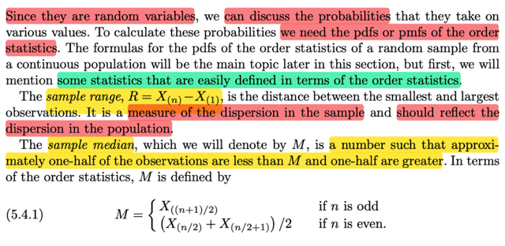</kbd>

> [!NOTE]
> Rồi, vì như đã nói, min, max đều là random variable nên dĩ nhiên chúng
> có distribution (cũng như sẽ có kì vọng....) Và ta sẽ bàn về distribution của
> chúng.
>
> Nhưng trước tiên giáo sư muốn giới thiệu ta về một số statistic KHÁC, được
> tạo ra từ order statistic (again, apply function lên function of random variable
> ta cũng có random variable).
>
> Đầu tiên là SAMPLE RANGE R = X(n) - X(1): Vì sao nó là random variable,
> à là vì nó là kết quả của apply function g(u,v) = u - v lên hai random variable
> X(n), X(1). Và với các possible value khác nhau của X(n), X(1) thì R có các
> possible value khác nhau. Mà vì sao X(n), X(1) có các possible value khác
> nhau, là vì chúng lại là kết quả của việc apply function max (..) và min(..)
> lên đám các random variable X1,...Xn vốn cũng có các possible value khác
> nhau. Và yếu tố ngẫu nhiên dây chuyền này đều xuất phát từ cái biến số
> mà ta quan sát trong random sample, nó có tính ngẫu nhiên.
>
> Thế thì sample range sẽ cho ta biết về độ phân tán của sample (dispersion),
> và cái này cũng sẽ phản ánh ít nhiều độ phân tán của population
>
> ====
>
> Cái thứ hai là SAMPLE MEDIAN, M, được định nghĩa là con số mà một 
> nửa giá trị quan sát lớn hơn và một nửa thì bé hơn.
>
> Và thể hiện bởi M = X((n+1)/2) nếu n lẻ, hoặc = X(n/2) + X(n/2 + 1) nếu n 
> chẵn.

 

<kbd>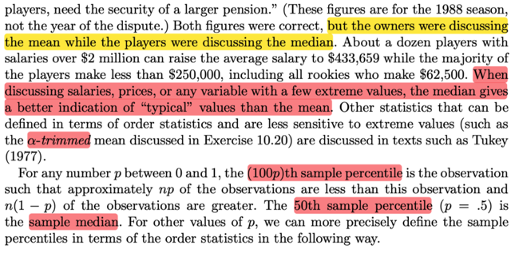</kbd>

<kbd></kbd>

<kbd>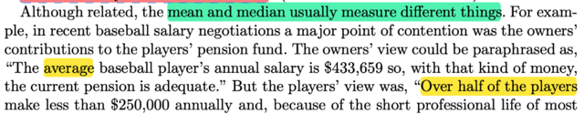</kbd>

> [!NOTE]
> đại khái là mean và median tuy liên quan nhưng chúng đo lường hai thứ
> khác nhau.  Lấy ví dụ như khi nói mức lương trung bình của cầu thủ là 400k
> nên ko cần tăng thêm chương trình pension. Ngược lại, cầu thủ thì cho rằng
> hơn 50% số cầu thủ kiếm ít hơn 250k, nên cần tăng pension.
>
> Như vậy thì ở đây, con số 400k là đang nói về mean, còn 250k là median.
> Và trong trường hợp này, con số 250k sẽ phản ánh  chính xác hơn mức thu
> nhập cầu thủ, vì chỉ vài outlier (cầu thủ ngôi sao) có  mức lương 2 triệu mỗi
> năm đã đủ có thể kéo mức trung bình lên 400k, trong khi  thực tế phần lớn
> có mức nhỏ hơn nhiều.
>
> Cuối cùng giáo sư nhắc đến một loại statistic nữa có thể được define bởi
> order statistic là **α-trimmed mean.**Cái statistic này kí hiệu là, hay gọi tên là **the (100p)th sample percentile**
>
> được định nghĩa là con số mà có np số observation nhỏ hơn con số này,
> và n(1-p) số observation lớn hơn con số này.
>
> Thật ra định nghĩa kì quặc này cũng ko khó hiểu gì đâu.
>
> Lấy ví dụ p là 0.5, thì ta có cái statistic: 50th sample percentile, và nó là
> random variable (dĩ nhiên, vì nó là một function apply lên các order statistic,
> mà các order statistic cũng là các random variables), và giá trị  này là  con số
> mà 50% các random variable trong random sample nhỏ hơn nó.
>
> Và cái statistic này cũng chính là sample median

 

<kbd>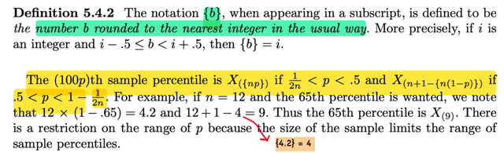</kbd>

> [!NOTE]
> đại khái là ta biết thêm một kí hiệu: {b} là con số làm tròn đến con số nguyên
> gần nhất. Ví dụ {4.2} = 4, {5.7} = 6
>
> Để từ đó, định nghĩa của (100p)th sample percentile là:
>
> X({np}) khi 1/2n < p < 0.5 và X(n+1-{n(1-p)} khi 0.5 < p < 1 - 1/2n
>
> Ôn lại tí, X(1) là một order statistic, cụ thể nó là cái nhỏ nhất trong các X1,...Xn
> (nhìn thế này: nó là kết quả của việc apply function min vào bộ X1,..Xn)
>
> Vậy thì X({np}) thì là sao, là ta lấy con số np, đem làm tròn đến số nguyên gần
> nhất, ví dụ ra 5 thì ta có X(5), cái random variable nhỏ thứ 5 trong các X1,...Xn
>
> Nên quay lại đây, ví dụ như nói về cái statistic: 65th sample percentile, thì nó
> (theo định nghĩa, hay ý nghĩa, là con số mà, 65% các random variable trong
> đám X1,...Xn đều nhỏ hơn), còn cụ thể nó là gì, thì theo công thức trên nó
> là X(n+1-{n(1-p)} = X(12+1-{4.2}) = X(9)

 

<kbd>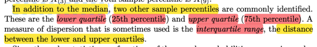</kbd>

> [!NOTE]
> Rồi, bên cạnh median (và cũng là cái 50th percentile). Thì người ta còn hay
> dùng lower quartile (chính là cái 25th percentile) và  upper quartile (chính
> là cái 75th percentile)
>
> Ngoài ra người ta còn dùng interquartile, là khoảng cách giữa hai cái trên.
>
> Mình nghĩ: Tất cả chúng nó, đều là statistic, và cụ thể, mấy cái này đều là
> statistic được define bởi / dựa trên order statistic. (dây mơ rễ má nhau thành
> tầng tầng lớp lớp, ví dụ như interquartile là hiệu hai cái upper & lower quartile,
> mà chúng nó lại là 75th percentile, và 25th percentile, thì theo công thức,
> cũng sẽ là một function apply lên các order statistic X(1),...X(n)

 

<kbd>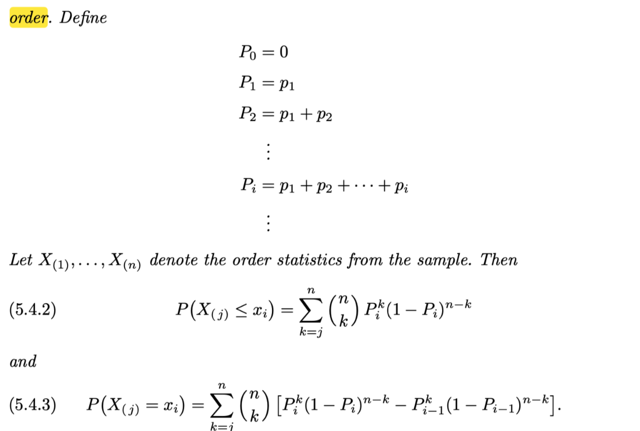</kbd>

<kbd></kbd>

<kbd>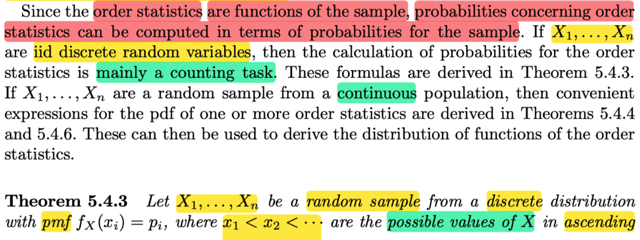</kbd>

> [!NOTE]
> Đại khái là order statistic là function của sample (là sao, tức là như đã biết,
> nó là random variables tạo ra bởi việc apply function lên các random variables
> của một random sample) nên probability liên quan đến nó có thể được tính từ 
> probability của các random variable trong random sample. (tức nói về probability
> distribution của order statistic có thể được xây dựng từ distribution của các
> random variables X1,..Xn, cũng là population distribution.) 
>
> Vậy thì ở đây tác giả nói rằng, nếu như population distribution mà là discrete
> thì việc tìm probability của các order statistic cơ bản là bài toán đếm. Và ta 
> sẽ có theorem sau:
>
> Đại khái là cho X1,...Xn là random sample từ một discrete distribution có pmf 
> fX(xi) = pi trong đó x1 < x2 < ...là các possible values của X sắp theo thứ tự
> tăng dần.
>
> Là sao nhỉ? Thì bởi ta biết định nghĩa của random sample (size n từ population)
> là một bộ các random variables X1,...Xn có cùng marginal distribution và mutually
> independent.
>
> Do đó, ở đây, cái population này là một discrete distribution. Có pmf như vậy.
> Và với discrete random variable thì ta biết định nghĩa là nó có countable các
> possible values (có thể infinite, nhưng countable), x1,x2.... Chẳng qua ở đây,
> người ta sắp xếp nó theo thứ tự tăng dần thôi. Và f(xi) = pi
>
> Tiếp, thế thì theorem này nói rằng, nếu ta define P0 = 0, P1 = p1, P2 = p1 + p2,..
>
> thì P(X(j) ≤ xi) = Σk=j:n (n choose k) Pi^k (1 - Pi-1)^(n-k) 
>
> và 
>
> P(X(j) = xi) = Σk=j:n (n choose k)[Pi^k(1 - Pi)^(n-k) - Pi-1^k(1-Pi-1)^n-k]

 

<kbd>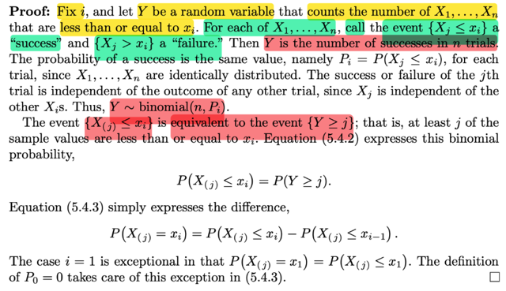</kbd>

> [!NOTE]
> Để chứng minh, đầu tiên với xi nào đó, ta gọi Y là random variable mang giá
> trị là số lượng random variable trong đám X1,...Xn có giá trị nhỏ hơn xi.
> Dừng lại tại đây, tại sao Y là random variable?
>
> ⇨ Là vì Y là kết quả của một hàm số apply lên X1,....Xn: Y = g(X1,..Xn)
>
> Và cái hàm g đó làm cái việc là, xem xét qua từng thằng trong đám X1,. ..
> Xn, mỗi lần tìm thấy một thằng nhỏ hơn xi, thì cộng 1 lên, và trả ra  kết qủa.
> Rõ ràng Y là random variable.
>
> Rồi, với cái hàm g như vậy, thì có thể thấy, nó đang đếm số trial success,
> trong tổng số n trial (các trial là: X1 có nhỏ hơn xi  ko, X2 có nhỏ hơn xi
> không,...) và vì X1,X2,...Xn independent, nên đây dĩ nhiên là các independent
> Bern(p1_i), Bern(p2_i)... trial với p1_i là xác suất trial thứ 1 success (còn chữ
> i là ý đang nói  ta đang xét xác suất nhỏ hơn xi, tức xác suất Xi < xi. Nhưng
> vì X1, X2,...Xn cũng identically distributed nên xác suất mà chúng nó < xi đều
> bằng nhau (vì cái xác suất này quy định bởi marginal distribution, mà chúng
> đều giống nhau, là population distribution), va ta gọi xác suất này là Pi
> (again, chữ i này là vì đang xét Y là số lượng các rv trong đám X1,...Xn nhỏ
> hơn xi)
>
> Vậy, dễ thấy, đây là các Bern(Pi) trials iid, và Y là random variable đếm số
> trial thành công ⇨ Y là một binomial(n, Pi)
>
> ===
>
> Tiếp theo là một nhận định quan trọng: Nếu Y là số lượng các rv trong đám
> X1,...Xn nhỏ hơn hoặc bằng xi thì việc Y ≥ j cũng đồng nghĩa có ít nhất j cái
> trong đám  X1,..Xn nhỏ hoặc bằng hơn xi
>
> Và kể cả khi sắp xếp tụi nó theo thứ tự từ nhỏ đến lớn thì điều này vẫn đúng:
> vẫn có ít nhất j cái sẽ nhỏ hoặc bằng hơn xi. Và như vậy dễ thấy, X(j) phải
> nhỏ hơn hoặc bằng xi.
>
> Vậy event Y ≥  j cũng tương đương với event X(j) ≤ xi
>
> ⇨ P(X(j) ≤ xi) = P(Y ≥ j)
>
> Và như vậy, với việc ta có Y là binomial(n, Pi) thì ta có pmf của nó:
>
> P(Y = k) = (n choose k)Pi^k(1 - Pi)^(n - k)
>
> Và P(Y ≥ j) dĩ nhiên là Σy=j:n (n choose y)Pi^y(1 - Pi)^(n - y)
>
> ⇨ Chứng minh xong 5.4.2: 
>
> P(X(j) ≤ xi) = Σk=j:n (n choose k)Pi^k(1 - Pi)^(n - k)
>
> Còn xét P(X(j) = xi) thì nó chính là P(xi-1 < X(j) ≤ xi)
>
> Mà xi-1 < X(j) ≤ xi ∪ X(j) ≤ xi-1 = X(j) ≤ xi
>
> ⇨ P[xi-1 < X(j) ≤ xi ∪ X(j) ≤ xi-1] = P(X(j) ≤ xi),
>
> và vế trái là P của hai disjoint event, theo axiom 3: 
>
> = P(xi-1 < X(j) ≤ xi) + P(X(j) ≤ xi-1)
>
> ⇨ P(xi-1 < X(j) ≤ xi) + P(X(j) ≤ xi-1) = P(X(j) ≤ xi)
>
> ⇨ P(xi-1 < X(j) ≤ xi) = P(X(j) ≤ xi) - P(X(j) ≤ xi-1)
>
> = P(Y ≥ xi) - P(Y ≥ xi-1)
>
> = Σk=j:n (n choose k)Pi^k(1 - Pi)^(n - k) 
>
> - Σk=j:n (n choose k)Pi-1^k(1 - Pi-1)^(n - k)
>
> = Σk=j:n (n choose k)[ (1 - Pi)^(n - k) - (1 - Pi-1)^(n - k) ] chứng minh xong vế 5.4.3

 

<kbd>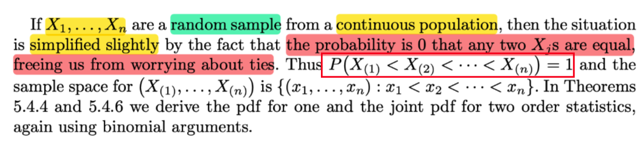</kbd>

> [!NOTE]
> đại khái là nếu X1,..Xn là random sample từ một continuous distribution, thì 
> xác suất hai Xj bằng nhau là bằng 0, do đó ta ko cần care về case mà
> hai random variable bằng nhau.
>
> Do đó P(X(1) < X(2) < ....< X(n)) = 1.
>
> Là sao? Đại khái là vì, với biến liên tục thì xác suất nó bằng một giá trị nào
> đó P(X = x) là bằng 0. Như vậy xác suất hai random variable ví dụ, X1, X2
> cùng bằng một giá trị nào đó, là bằng 0 ⇨ P(X1 = X2) = 0.
>
> Do đó khi xắp xếp thứ tự của chúng (hay, nói theo kiểu, apply function sort
> lên chúng, và function sort này nhả ra X(1), X(2), ...X(n)) thì ko thể có chuyện
> X(1) = X(2),...hay bất cứ cặp nào bằng nhau.
>
> Tiếp giáo sư nhắc đến sample space của (X(1),....X(n)), thì ý là đây là random
> vector, đặt các order statistic vào thành random vector. Thì khi đó các possible
> value của nó là {(x1,...xn): x1 < x2 < ...< xn}. Bởi lẽ, ko thể có chuyện x1 > x2,
> hay bất kì thứ tự nào khác

 

<kbd>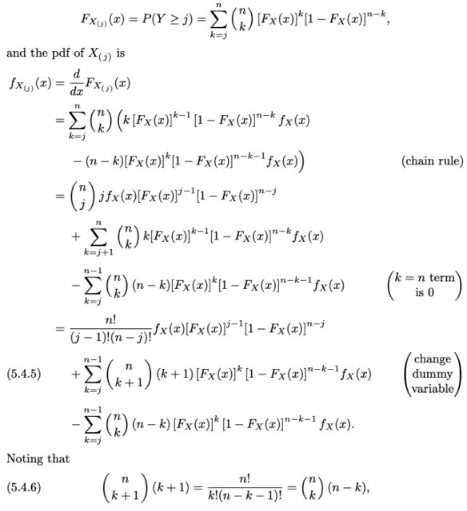</kbd>

<kbd></kbd>

<kbd>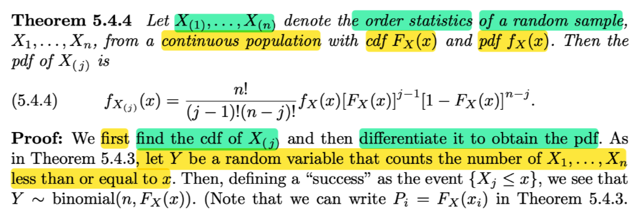</kbd>

🔗 **Related:** [6.2 THE SUFFICIENT PRINCIPLE](62_the_sufficient_principle.md#node-511)

🔗 **Related:** [8.3 METHODS OF EVALUATING TEST](83_methods_of_evaluating_test.md#node-704)

> [!NOTE]
> Theorem này, cho X1,..Xn là random sample size n có population thuộc loại continuous với cdf
> FX(x), pdf fX(x).
>
> Từ đó có X(1),...X(n) là order statistics. Thì pdf của X(j) sẽ là:
>
> fX(j)(x) = [n!/(j-1)!(n-j)!] fX(x)[FX(x)]^j-1[1 - FX(x)]^n-j
>
> Chứng minh Đầu tiên ta sẽ tìm cdf của X(j) và đạo hàm để có pdf (rõ ràng đây là cách tiếp cận
> quen thuộc, cũng như đã học ở Stat110, với discrete rv thì xây dựng pmf từ định nghĩa trong
> sample space gốc, còn continuous thì xây dựng từ cdf từ định nghĩa và lấy đạo hàm để có pdf)
>
> Vậy ta sẽ tìm cách xây dựng cdf của X(j), theo định nghĩa, FX(j)(x) = P(X(j) < x)
>
> Ôn lại lập luận hôm trước:
>
> Xét event X(j) ≤ x, để thuận tiện ta sẽ đặt Y là random variable có được bằng cách apply một
> function g(x1,x2,...xn) (tức là hàm n biến) có cách thức hoạt động như sau: nó sẽ lướt qua lần
> lượt x1,x2...xn để đếm xem có bao nhiêu  cái ≤ giá trị x cho trước. Và ta sẽ áp cái hàm g này lên
> các order statistic X(1),....X(n) để có Y = g(X(1),....X(n)). Dĩ nhiên Y là random variable
>
> Thế thì, nếu gọi event X(i) (i=1,..n) ≤ x là success, và ngược lại là failure, thì  ta sẽ thấy điều mà
> hàm g đang làm chính là: thực hiện một chuỗi các Bernoulli trial, và đếm xem có bao nhiêu cái
> thành công.
>
> Rồi, tiếp, các X(i) có bản chất đều là một thằng nào đó trong X1,...Xn, và, theo định nghĩa của
> random sample, chúng nó iid, tức cùng marginal distribution do đó, xác suất X(1) ≤ x, cũng bằng
> xác suất X(2) ≤ x,...và đều bằng xác suất X1 ≤ x, cũng bằng xác suất X2 ≤ x...
>
> Và vì đề bài cho population distribution có cdf là FX(.), nên các xác suất trên đến bằng  FX(x)
>
> Vậy, quay lại hàm g, các Bern trial đều có xác suất thành công là FX(x). Do đó Y là random
> variable ~ binomial(n, FX(x))
>
> Vậy thì, tới đây ta mới liên hệ Y với event X(j) ≤ x mà ta đang quan tâm
>
> Y, nhắc lại là số success trial trong n trial, mà success được định nghĩa là khi xét một X(i) trong
> bộ các order statistic, thì nó ≤ x. Vậy, nếu Y ≥ j, tức là có ít nhất j cái trong đám X(1),....X(n) nhỏ
> hơn hoặc bằng x. Mà dĩ nhiên điều đó có nghĩa là / đồng nghĩa với X(j) ≤ x. Từ đó, ta có quan
> hệ:
>
> Y ≥ j ⇔ X(j) ≤ x
>
> ⇨ P(X(j) ≤ x) = P(Y ≥ j), và với Y ~binomial(n, FX(x)) ta có:
>
> P(Y = j) = (n choose j) [FX(x)]^j [1 - FX(x)]^(n-j)
>
> ⇨P(Y ≥ j) = Σk=j:n (n choose j) [FX(x)]^k [1 - FX(x)]^(n-k)
>
> và đó chính là cdf của X(j):  FX(j)(x)
>
> Lấy đạo hàm để có pdf:
>
> fX(j)(x) = d/dx FX(j)(x).
>
> Ôn lại quan hệ này từ đâu mà ra: Là bởi định nghĩa, theo định nghĩa, đầu tiên là định nghĩa của
> hàm cdf của X: FX(x) = P(X ≤ x). Sau đó, pdf của X, được định nghĩa là hàm f sao cho: ∫-inf:x
> f(t)dt = FX(x). Mà theo FTC1, một khi ta có hàm G, và f với f được định nghĩa là G(x) = ∫-inf: x
> f(t)dt thì G là anti-derivative của f, và điều đó có nghĩa là d/dx G(x) = f(x). Vậy vì định nghĩa của
> pdf, nên FX chính là nguyên hàm của fX ⇨ d/dx FX(x) = fX(x).
>
> Quay lại đây:
>
> fX(j)(x) = d/dx FX(j)(x) = d/dx Σk=j:n (n choose j) [FX(x)]^k [1 - FX(x)]^(n-k)
>
> = (n choose j) Σk=j:n d/dx  [FX(x)]^k [1 - FX(x)]^(n-k)
>
> = (n choose j) Σk=j:n {[d/dx  [FX(x)]^k] [1 - FX(x)]^(n-k) + [FX(x)]^k d/dx [1 - FX(x)]^(n-k)}
>
> = (n choose j) Σk=j:n {[d/d(FX(x))  [FX(x)]^k . d/dx FX(x)] [1 - FX(x)]^(n-k)
>
> + [FX(x)]^k [d/d[1 - FX(x)] [1 - FX(x)]^(n-k)] d/dx [1-FX(x)]}
>
> = (n choose j) Σk=j:n {[ k[FX(x)]^(k-1) . fX(x)] [1 - FX(x)]^(n-k)
>
> + [FX(x)]^k (n-k) [1 - FX(x)]^(n-k-1) [-fX(x)] }
>
> = (n choose j) Σk=j:n fX(x) { k[FX(x)]^(k-1) [1 - FX(x)]^(n-k) - (n-k)  [FX(x)]^k [1 - FX(x)]^(n-k-1) }
>
> (đây là tới chỗ (chain-rule) trong sách
>
> QUAY LẠI SAU, NHƯNG ĐẠI Ý LÀ BIẾN ĐỔI ĐẠI SỐ TIẾP THÌ NÓ RA KẾT QUẢ

 

<kbd>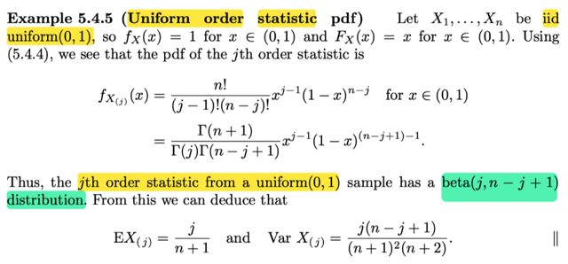</kbd>

> [!NOTE]
> rồi, áp dụng theorem vào case này, X1,..Xn là random sample từ uniform(0,1)
> (ta biết fX(x) = 1 với x ∈ [0,1] và FX(x) = x) Dùng theorem trên ta có pdf của
> j'th order statistic là fX(j)(x) = ..có dạng của βeta(j, n-j+1) Do đó kết luận
> với random sample từ uniform 0,1 thì X(j) ~ β(j, n-j+1)
>
> Từ đó ta có thể tính mean và variance dựa theo công thức của mean và
> variance của β

 

<kbd>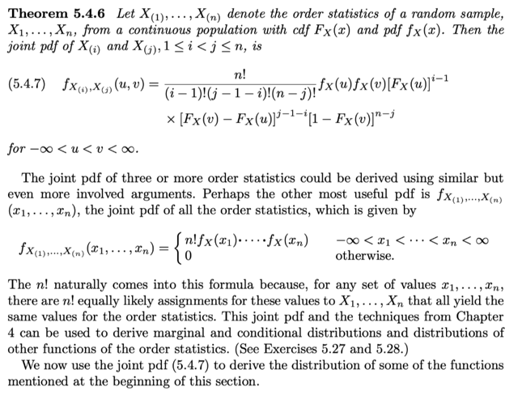</kbd>

🔗 **Related:** [6.2 THE SUFFICIENT PRINCIPLE](62_the_sufficient_principle.md#node-504)

> [!NOTE]
> Theorem giúp derive joint pdf của order statistic, gs ko chứng minh.
>
> QUAY LẠI SAU, ĐỂ QUA PHẦN QUAN TRỌNG: CONVERGENCE!

> [!NOTE]
> QUAY LẠI SAU

 

<kbd>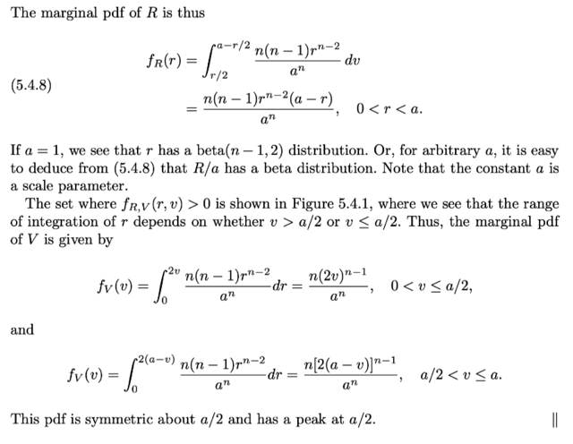</kbd>

<kbd></kbd>

<kbd>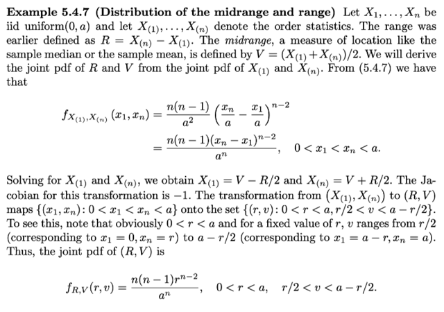</kbd>

> [!NOTE]
> Cho X1, ...Xn là random sample iid uniform(0, a) và và X(1), ...X(n) là các 
> order statistic. Và range, là R = X(n) - X(1), dĩ nhiên cũng là một statistic.
> Và Midrange V = X(1) + X(n)]/2

 

