# 5.5 Convergence Concepts

📊 **Progress:** `45` Notes | `62` Screenshots

---
<a id="node-391"></a>

<p align="center"><kbd>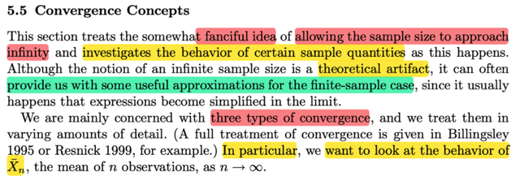</kbd></p>

> [!NOTE]
> Đại khái là, phần này ta sẽ thảo luận một khái niệm bóng bẩy, đó là cho
> phép số lượng random variable của một random sample lớn đến vô cùng.
> Và trong quá trình đó, ta sẽ xem xét hành vi của một sample quantities (
> ý nói các statistic, ví dụ sample mean)
>
> Tác giả nói đại ý là dù cái việc này mang tính chất lí thuyết (khi xem xét
> số lượng mẫu lớn đến vô hạn) nhưng nó sẽ giúp cho phép ta thấy các ước 
> lượng hữu ích cho mẫu hữu hạn vì khi xét tại limit, thì một số thứ đơn giản
> xảy ra.
>
> Và ta sẽ quan tâm 3 loại convergence. Và cụ thể, ta sẽ xem xét hành vi
> của `Xn_bar,` sample mean của mẫu size n

<br>

<a id="node-392"></a>

<p align="center"><kbd>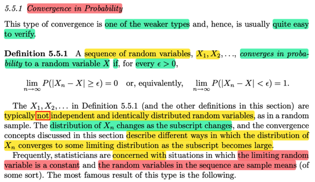</kbd></p>

🔗 **Related:** [5.5 CONVERGENCE CONCEPTS](55_convergence_concepts.md#node-398)

> [!NOTE]
> Loại convergence thứ nhất là Convergence in probability: Được định nghĩa
> đại khái bằng lời là: ta nói X1,X2,...converge về X in probability nếu như
> khi n → inf thì xác suất tồn tại khác biệt  giữa Xn và X là bằng 0, thể hiện
> bởi toán học:
>
> ```text
> lim n → inf P(|Xn - X| > ε) = 0 với ε bất kì
> ```
>
> Một điểm lưu ý là, các X1,X2...ko cần phải iid. Do đó khi n thay đổi thì 
> distribution của Xn cũng thay đổi (X1 có distribution khác, X2 khác...)
>
> Cuối cùng, thường thường ta sẽ quan tâm đến tình huống là muốn random 
> variable hội tụ về một constant, trong đó cái random variable mà ta quan
> tâm là sample mean

<br>

<a id="node-393"></a>

<p align="center"><kbd>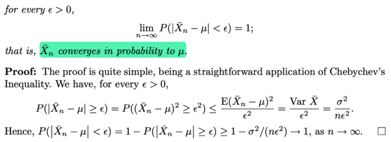</kbd></p>

<p align="center"><kbd></kbd></p>

<p align="center"><kbd>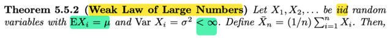</kbd></p>

🔗 **Related:** [3.6 INEQUALITIES](36_inequalities.md#node-207)

🔗 **Related:** [5.2 Σ OF RANDOM VARIABLES FROM A RANDOM SAMPLE](52_σ_of_random_variables_from_a_random_sample.md#node-344)

> [!NOTE]
> ta qua luật số lớn yếu: Cho X1,X2...là iid random variables với EXi `=` `μ` và 
> ```text
> VarXi = σ^2 < inf. Đặt Xbar_n = (1/n) Σi=1:n Xi thì:
> ```
>
> bằng lời: `Xbar_n` hội tự in probability về `μ,` 
>
> theo định nghĩa hội tụ trong xác suất thì có nghĩa là:
>
> ```text
> lim n → inf P(|Xbar_n - μ| > ε) = 0
> ```
>
> hay cũng là:
>
> ```text
> lim n → inf P(|Xbar - μ| < ε) = 1 với ε bất kì
> ```
>
> Chứng minh cái này ta sẽ cần ôn lại Chebyshev inequality: Cho hàm g(x)
> là hàm không âm, thì với mọi số dương r thì P(g(X) ≥ r) ≤ Eg(X) `/` r
>
> Tí mình sẽ chứng minh lại
>
> Còn ở đây áp dụng inequality này 
>
> ```text
> Xét event |Xn_bar - μ| ≥ ε,  vì hai vế đều ko ân nên ta có:
> ```
>
> ```text
> ⇔ (Xn_bar - μ)^2 ≥ ε^2
> ```
>
> ```text
> Áp dụng Chebyshev's inequality với g(Xn_bar) = (Xn_bar - μ)^2,
> ```
>
> thì với mọi số dương `ε^2` ta có:
>
> ```text
> P((Xn_bar - μ)^2 ≥ ε^2) ≤ [E(Xn_bar - μ)^2 ] / ε^2
> ```
>
> ```text
> Mà vế phải là gì chính là Var(Xn_bar) / ε^2
> ```
>
> Mà variance của `Xn_bar,` tức variance của sample mean, theo theorem 
> bữa trước (theo link cam) chính là `σ^2/n` 
>
> ```text
> ⇨ Vế phải = σ^2/(nε^2)
> ```
>
> ```text
> Vậy ta có P(|Xn_bar - μ| ≥ ε) = P[(Xn_bar - μ)^2 ≥ ε^2] ≤ σ^2/(nε^2)
> ```
>
> ```text
> ⇔ - P(|Xn_bar - μ| ≥ ε) ≥ - σ^2/(nε^2)
> ```
>
> ```text
> Tiếp xét P(|Xbar - μ| < ε) = 1 - P(|Xbar_n - μ| > ε)
> ```
>
> áp dụng kết quả trên: 
>
> ```text
> .. ≥ 1 - σ^2/(nε^2)
> ```
>
> Vậy khi xét limit:
>
> ```text
> lim n → inf P(|Xbar - μ| < ε) ≥ lim n → inf 1 - σ^2/(nε^2)
> ```
>
> ```text
> và khi n → inf thì 1 - σ^2/(nε^2) → 1
> ```
>
> ```text
> vậy lim n → inf P(|Xbar - μ| < ε) = 1
> ```
>
> Đơn giản là vì xác suất thì chỉ trong  range 0,1, mà cái P này ≥ 1 cái tiến tới 1
> thì P chắc chắn cũng phải → 1, chứ ko thể tiến tới số nào nhỏ hơn 1 được,

<br>

<a id="node-394"></a>

<p align="center"><kbd>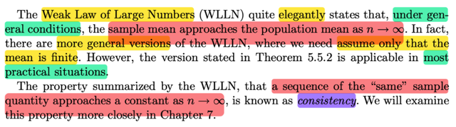</kbd></p>

> [!NOTE]
> đại khái là, WLLN, cho phép ta nói rằng, nói chung (nếu thỏa điều kiện) ,
> thì sample mean sẽ tiến tới population mean khi n → inf
>
> Và gs cho biết dù rằng còn có một phiên bản khái quát hơn trong đó chỉ
> yêu cầu population mean là hữu hạn. Nhưng đây vẫn là phiên bản được
> sử dụng rộng rãi.
>
> Một tính chất được tóm tắt bới WLLN đó là một chuỗi giá trị của statistic  ví
> dụ như sample mean của random sample size n sẽ tiến tới hằng số khi n
> → inf, được đặt tên là  tính NHẤT QUÁN `-` CONSISTENCY mà ta sẽ gặp
> lại trong chương 7

<br>

<a id="node-395"></a>

<p align="center"><kbd>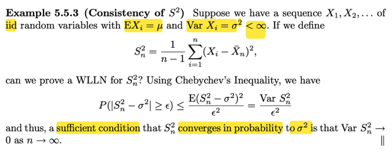</kbd></p>

🔗 **Related:** [5.6 GENERATING RANDOM SAMPLE](56_generating_random_sample.md#node-441)

> [!NOTE]
> Ví dụ này xét tính consistency của S^2 (sample variance). cho chuỗi các  random
> ```text
> variable X1, X2,....iid với EXi = μ. VarXi = σ^2 < inf
> ```
>
> Đặt Sn^2 (sample variance của random sample size n)
>
> ```text
> = [1/(n-1)] Σ (Xi - Xn_bar)^2
> ```
>
> Câu hỏi là Sn^2, có consistency không
>
> Thế thì đại khái là, như định nghĩa ở trên, thì, để có tính consistency, thì Sn^2
> phải converge in probability tới `σ^2` (population variance)
>
> (giống như `Xn_bar` converge in probability tới `μ)` khi n → inf
>
> ```text
> Thế thì để vậy ta cần lim n → inf P(|Sn^2 - σ^2| ≥ ε) = 0 với mọi ε dương
> ```
>
> ```text
> Mà xét P(|Sn^2 - σ^2| ≥ ε) = P((Sn^2 - σ^2)^2 ≥ ε^2) | cái này chỉ là event tương
> ```
> đương
>
> ```text
> ≤ E[(Sn^2 - σ^2)^2] / ε^2 |  (Chebyshev inequality)
> ```
>
> ```text
> = Var(Sn^2) / ε^2
> ```
>
> Như vậy để Sn^2 tiến tới `σ^2` in probability (theo yêu cầu của tính consistency)
>
> thì P(|Sn^2 `-` `σ^2|` ≥ `ε)` phải → 0
>
> và như vậy `Var(Sn^2)` phải → 0

<br>

<a id="node-396"></a>

<p align="center"><kbd>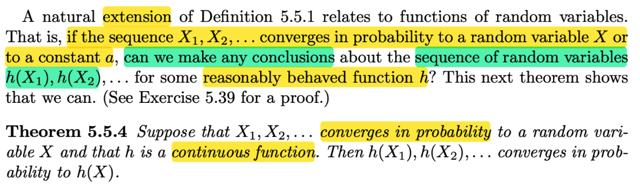</kbd></p>

> [!NOTE]
> đại khái là, ta có theorem là nếu X1,X2,....converge in probability tới một
> random  variable X,  hoặc một constant
>
> thì với hàm h là hàm liên tục, h(X1),  h(X2) sẽ converge in probability về h(X)

<br>

<a id="node-397"></a>

<p align="center"><kbd>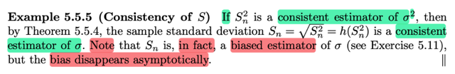</kbd></p>

> [!NOTE]
> Rồi, áp dụng theorem vừa rồi, ta sẽ có NẾU Sn^2 là consistent estimator
> của `σ^2` (tức là, nó sẽ converge in probability tới `σ^2)` thì apply hàm g liên
> tục, ở đây là hàm g(u) `=` √u, thì chuỗi g(Sn^2), tức √Sn^2 (n `=` 1,2...) cũng sẽ
> converge in probability tới `√σ^2` `=` `σ.` Do đó √Sn^2 CŨNG LÀ CONSISTENT
> ESTIMATOR CỦA population standard deviation `σ`
>
> Nhưng giáo sư lưu ý, ta phát biểu trên là NẾU Sn^2 là consistent estimator
> của `σ^2,` NHƯNG THỰC TẾ THÌ Sn^2 LẠI LÀ BIASED ESTIMATOR CỦA
> `σ^2` nhưng sự biased này biến mất asymtotically

<br>

<a id="node-398"></a>

<p align="center"><kbd>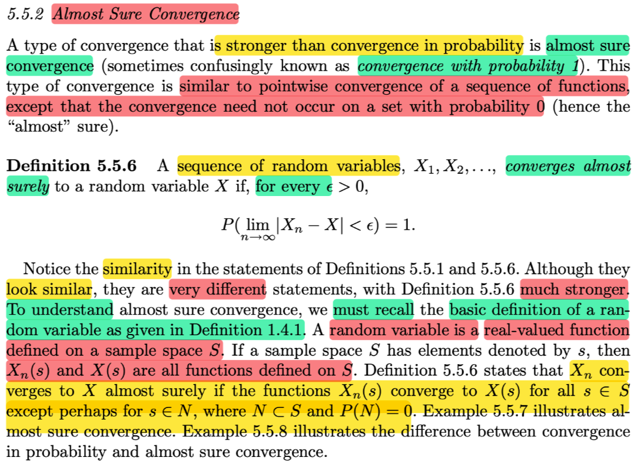</kbd></p>

🔗 **Related:** [5.5 CONVERGENCE CONCEPTS](55_convergence_concepts.md#node-392)

> [!NOTE]
> Đại khái là một loại convergence mạnh hơn Convergence in Probability
> là Almost Sure Convergence.
>
> Định nghĩa của nó là: Ta nói X1,X2,....CONVERGES ALMOST SURELY
> tới random variable X nếu với mọi `ε` > 0 thì ta có:
>
> P(lim n → inf |Xn `-` X| < `ε)` `=` 1
>
> Và để hiểu cái này, đại khái là ta cần nhớ bản chất của random variable
> là funcition, map giữ s trong sample space gốc S, với induced sample
> space (range của X)
>
> Thế thì như vậy Xn → X theo định nghĩa converge almost surely 
>
> thì có nghĩa là với mọi s trong S, thì Xn(s) đều converge về X(s) (khi n → inf)
>
> lim n → inf Xn(s) `=` X(s)

<br>

<a id="node-399"></a>

<p align="center"><kbd>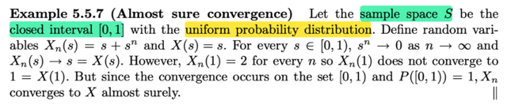</kbd></p>

> [!NOTE]
> Cho Xn(s) `=` s `+` s^n
>
> X(s) `=` s
>
> đại khái là hãy nhìn Xn với n `=` 1,2....là một loạt các hàm số.
> Thì đại ý là, ta sẽ ta thấy khi n → inf, thì Xn(s) sẽ là làm thành một 
> dãy số X1(s), X2(s), ....
>
> Ta sẽ có converge almost surely nếu như với mọi s thì dãy số này đều
> converge về cùng một giá trị.
>
> Ở đây ta thấy sample space S `=` [0,1]
>
> thế thì với mọi s trong S\{1} thì, dãy số X1(s), X2(s),...sẽ hội tụ về s
> Vì sao, vì nó là: s `+` s^1, s `+` s^2, .....với 0 ≤ 0 < 1 thì s^1, s^2,..→ 0
> ⇨ s `+` s^1, s `+` s^2,...→ s, và s chính là X(s)
>
> Duy chỉ có s `=` 1, thì dãy số X1(s), X2(s) ...không hội tụ về 1. Mà thay vào
> đó, nó là dãy số: 1 `+` 1^1, 1 `+` 1^2, ...tức là 2, 2, ....
>
> Tuy nhiên, theo định nghĩa, convergence in probability nói rằng, chỉ cần
> việc này xảy ra trên toàn bộ sample space nhưng cho phép loại trừ một
> tập N mà trên đó xác suất xảy ra bằng 0. 
>
> thì ở đây, tập N chính là point set {1}. Vì sao xác suất xảy ra bằng 0. Vì
> s là giá trị liên tục, nên xác suất P({s} `=` 1) `=` 0
>
> Như vậy, ta nói Xn converge almost surely tới X

<br>

<a id="node-400"></a>

<p align="center"><kbd>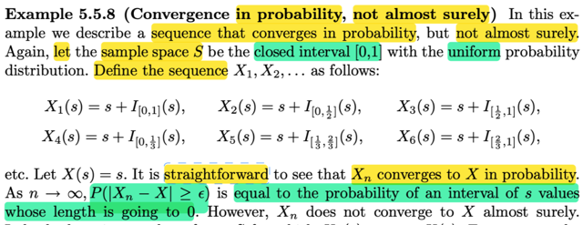</kbd></p>

> [!NOTE]
> Cho một ví dụ về converge in probability nhưng ko almost surely:
>
> Cho sample space S là interval đóng: [0,1] với uniform distribution.
>
> Định nghĩa X1,X2...như sau:
>
> ```text
> X1(s) = s + I[0,1]{s}, X2(s) = s + I[0,1/2]{s}, X3(s) = s + I[1/2, 1]{s} ..
> ```
>
> Đại khái là (như đã biết, rv bản chất chỉ là function), thì ở đây các function
> có dạng s `+` một indicator function check việc s nằm trong một đoạn ngày
> ```text
> càng ngắn dần. ([0,1], [0,1/2], [1/2,0], [0,1/3], [1/3,2/3], [2/3, 1], [0,1/4], [1/4,
> ```
> `2/4],....)`
>
> Thế thì, dễ thấy khi n càng lớn, thì cái term thứ 2 của Xn sẽ càng nhỏ vì nó
> check việc s nằm trong một đoạn càng ngắn.
>
> Thì khi ta xét P(|Xn `-` X| > `ε)` với `ε` dương bất kì thì ta thấy:
>
> xác suất này sẽ chỉ là bằng xác suất của việc s nằm trong một đoạn ngày
> càng ngắn: → xác suất này tiến về 0
>
> Vì (Xn `-` X) có bản chất chỉ là một function: (Xn `-` X)(s)
>
> ```text
> Nên |Xn - X| > ε có bản chất là {s ∈ S: |Xn(s) - X(s)| > ε}
> ```
>
> ```text
> ⇨ P(|Xn - X| > ε) = P({s ∈ S: |Xn(s) - X(s)| > ε})
> ```
>
> ```text
> = P({s ∈ S: |s + I[αn, βn](s) - s| > ε})
> ```
>
> ```text
> = P({s ∈ S: |I[αn, βn](s)| > ε})
> ```
>
> mà hàm indicator chỉ có hai giá trị 1 hoặc 0, nên event giá trị của nó hơn
> hơn `ε` dương nhỏ thì cũng là event gía trị của nó `=` 1
>
> ```text
> ⇨ P({s ∈ S: |I[αn, βn](s)| = 1}) , và cũng là P(s ∈ [αn, βn])
> ```
>
> Và như đã nói đoạn này càng ngắn ⇨ P này → 0
>
> ⇨ lim n → inf P(|Xn `-` X| > `ε` ) `=` 0
>
> Do đó, nó thỏa convergence in probability.
>
> Xn converge in probability to X

<br>

<a id="node-401"></a>

<p align="center"><kbd>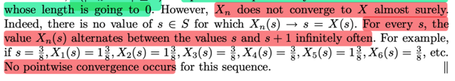</kbd></p>

> [!NOTE]
> Nhưng xét converge almost surely thì ko:
>
> Vì theo định nghĩa muốn gọi là Xn converge almost surely to X thì
> với mọi s thì Xn(s) phải → X khi n → inf
>
> Nhưng ví dụ như s `=` `3/8`
>
> ```text
> X1(3/8) = 3/8 + I[0,1](3/8) = 3/8 + 1
> ```
>
> ```text
> X2(3/8) = 3/8 + I[0,1/2](3/8) = 3/8 + 1
> ```
>
> ```text
> X3(3/8) = 3/8 + I[1/2,1](3/8) = 3/8 + 0
> ```
>
> ```text
> X4(3/8) = 3/8 + I[0,1/3](3/8) = 3/8 + 0
> ```
>
> ```text
> X5(3/8) = 3/8 + I[1/3,2/3](3/8) = 3/8 + 1
> ```
>
> ```text
> X6(3/8) = 3/8 + I[2/3,1](3/8) = 3/8 + 0
> ```
>
> ...
>
> ```text
> Có thể thấy dãy 3/8, 1 + 3/8, 3/8, 3/8, 1 + 3/8, 3/8, ....sẽ không hội
> ```
> tụ về `3/8.`
>
> Ví dụ này cho thấy rõ convergence in probability và convergence
> almost surely tuy trông có vẻ giống giống nhau nhưng hoàn toàn
> khác nhau.
>
> Khi n càng lớn thì xác suất Xn khác X sẽ ngày càng nhỏ.
>
> khi n → inf thì P(|Xn `-` X| > `ε)` → 0
>
> Do đó (cũng là nó thỏa) lim n → inf P(|Xn → X| > `ε)` `=` 0
>
> Nhưng Xn(s) không → X(s) với mọi s trong S
>
> nên ko thỏa P(lim n → inf |Xn `-` X| < `ε)` `=` 1

<br>

<a id="node-402"></a>

<p align="center"><kbd>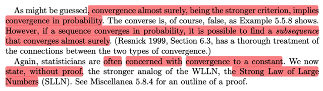</kbd></p>

> [!NOTE]
> Đại khái là convergence almost surely thì mạnh hơn, và nó sẽ imply 
> convergence in probability.
>
> Tuy ta ko có chiều ngược lại nhưng giáo sư cho biết khi ta có convergence
> in probability thì thường là có thể tìm được một subsequence mà converge
> almost surely (cái này chỉ nói sơ vậy, tìm hiểu sách khác)
>
> Cuối cùng, trong thống kê như thường lệ thì ta sẽ quan tâm đến convergence
> đến một constant.
>
> Nên ở đây với bối cảnh ta dùng convergence almost surely thì ta có Strong
> Law of Large number

<br>

<a id="node-403"></a>

<p align="center"><kbd>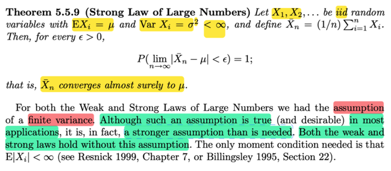</kbd></p>

🔗 **Related:** [5.6 GENERATING RANDOM SAMPLE](56_generating_random_sample.md#node-436)

> [!NOTE]
> Ta có Strong LLN:
>
> ```text
> VỚi X1,X2,....là iid random variables với EXi = μ, Var Xi = σ^2 < inf (finite
> ```
> variance) và define Xnbar `=` `(1/n)` `Σi` Xi
>
> ```text
> Thì với mọi ε > 0, P(lim n→inf |Xnbar - μ| < ε) = 1
> ```
>
> tức Xnbar converge almost surely tới `μ`

<br>

<a id="node-404"></a>

<p align="center"><kbd>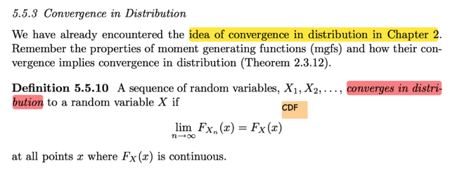</kbd></p>

> [!NOTE]
> Đến khái niệm convergence in distribution.
>
> Định nghiã của nó: Ta gọi chuỗi các random variable X1,X2,.... converge
> in distribution đến một random variable X nếu lim n → inf FXn(x) `=` FX(x)
> tại mọi điểm x mà FX(s) liên tục

<br>

<a id="node-405"></a>

<p align="center"><kbd>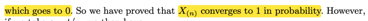</kbd></p>

<p align="center"><kbd></kbd></p>

<p align="center"><kbd>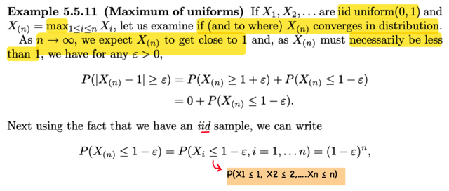</kbd></p>

> [!NOTE]
> Cho X1,X2...iid uniform(0,1) và X(n) được định nghĩa là max i ∈ [1,n] Xi,
> ta xem thử X(n) có converge in distribution không và nếu có thì converge
> về đâu.
>
> Thế thì ông nói, đám Xi i `=` 1,2,... là các uniform(0,1) rvs, rồi ta lại lấy
> X(n) định nghĩa như vậy. Dĩ nhiên khi n → inf thì ta kì vọng `/` đoán rằng
> X(n) sẽ → 1, nhưng vẫn nhỏ hơn 1.
>
> Vậy thì thử xem X(n) có converge in probability về 1 ko:
>
> Xét P(|X(n) `-` 1| ≥ `ε)` (ta cần chứng minh rằng cái này sẽ → 0)
>
> ```text
> Vậy thì |X(n) - 1| ≥ ε ⇔ X(n) - 1 ≥ ε or X(n) - 1 ≤ -ε
> ```
>
> ```text
> ⇨ P(|X(n) - 1| ≥ ε) = P(X(n) - 1 ≥ ε ∪ X(n) - 1 ≤ -ε)
> ```
>
> ```text
> = P(X(n) - 1 ≥ ε) +P(X(n) - 1 ≤ -ε) | axiom 3 xác suất của ∪ các disjoint event
> ```
>
> ```text
> = P(X(n) ≥ ε + 1) +P(X(n) ≤ 1 - ε)
> ```
>
> ```text
> = 0 + P(X(n) ≤ 1 - ε)  | Do X(n) sẽ ko thể ≥ 1
> ```
>
> ```text
> Xét X(n) ≤ 1 - ε, tức max {1≤i≤n} Xi ≤ 1 - ε
> ```
>
> ```text
> ⇨ X1 ≤ 1 - ε và ...Xn ≤ 1 - ε
> ```
>
> ```text
> ⇨ P(X(n) ≤ 1 - ε) = P(∩i = 1,...n Xi ≤ 1 - ε )
> ```
>
> `=` Πi P(Xi ≤ 1 `-` `ε)`    (do X1,X2....independent)
>
> `=` Πi (1 `-` `ε)`  (do Xi ~ uniform(0,1))
>
> `=` (1 `-` `ε)^n`
>
> ```text
> Và kết quả này, khi n → inf thì (1 - ε)^n → 0 do 1 - ε < 1
> ```
>
> Vậy đúng là X(n) converge về 1 in probability

<br>

<a id="node-406"></a>

<p align="center"><kbd>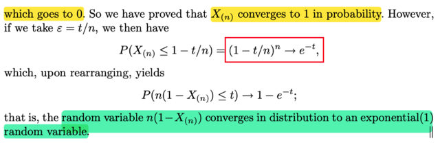</kbd></p>

> [!NOTE]
> Nếu chọn `ε` `=` `t/n`
>
> ```text
> áp dụng ta đang có P(X(n) ≤ ε) = (1 - ε)^n, ta sẽ có:
> ```
>
> ```text
> P(X(n) ≤ 1 - t/n) = (1 - t/n)^n
> ```
>
> Và khi n → inf thì cái này lại tiến về `e^-t`
>
> (vì đây là một cái hội tụ nổi tiếng: (1 `+` `x/n)^n` → e^x)
>
> ```text
> X(n) ≤ 1 - t/n ⇔ nX(n) ≤ n - t ⇔ n(1 - X(n)) ≥ t
> ```
>
> ```text
> ⇨ P(X(n) ≤ 1 - t/n) = P(n(1 - X(n)) ≥ t)
> ```
>
> `=` 1 `-` P(n(1 `-` X(n)) ≤ t)
>
> Và như vậy khi n → inf thì 1 `-` P(n(1 `-` X(n)) ≤ t) → `e^-t`
>
> ⇨ P(n(1 `-` X(n)) ≤ t) → 1 `-` `e^-t`
>
> Và đây lại chính là CDF của exponential(1)
>
> còn vế trái, chính là CDF của n(1 `-` X(n))
>
> Vậy cho thấy X(n) converge in probability về 1
>
> Nhưng n(1 `-` X(n)) cũng converge in distribution về expo(1) nữa

<br>

<a id="node-407"></a>

<p align="center"><kbd>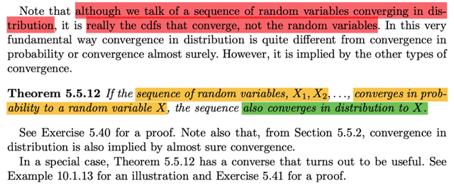</kbd></p>

> [!NOTE]
> CHƯA HIỂU LẮM,
> QUAY LẠI SAU

<br>

<a id="node-408"></a>

<p align="center"><kbd>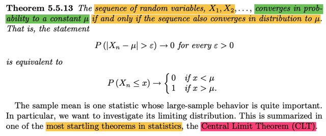</kbd></p>

> [!NOTE]
> Theorem này nói là, chuỗi các random variable X1,X2....converges in probability
> tới constant `μ` khi và chỉ khi chuỗi này cũng converges in distribution tới `μ`
>
> CŨNG CHỈ BIẾT VẬY, Ở ĐÂY KO GIẢI THÍCH HAY CHỨNG MINH GÌ
>
> Sau đó mào đầu cho một thoerem quan trọng bậc nhất trong statistic CLT

<br>

<a id="node-409"></a>

<p align="center"><kbd>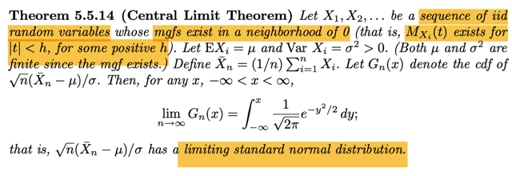</kbd></p>

🔗 **Related:** [5.5 CONVERGENCE CONCEPTS](55_convergence_concepts.md#node-424)

> [!NOTE]
> Theorem này nói rằng cho X1, X2...là chuỗi iid random variables, mà mgf của 
> chúng tồn tại trong lân cận của 0 (MXi(t) tồn tại với `-h` < t < h với h dương nào 
> đó).
>
> ```text
> Rồi gọi EXi là μ, Var Xi = σ^2 > 0, Cả hai cái này đều finite vì đã nói mgf tồn tại.
> ```
> (ta nhớ EXi là first moment, EXi^2 là second moment).
>
> Định nghiã sample mean của random sample size n: Xnbar `=` `(1/n)` `Σi` Xi.
>
> ```text
> Dùng Gn(x) kí hiệu cho cdf của √n (Xnbar - μ) / σ.
> ```
>
> ```text
> Khi đó với mọi x: thì lim x → inf Gn(x) = ∫-inf:x (1/√2π) e^-y^2/2 dy
> ```
>
> ```text
> Và điều này có nghĩa là, n (Xnbar - μ) / σ converge in probability về standard
> ```
> normal random variable

<br>

<a id="node-410"></a>

<p align="center"><kbd>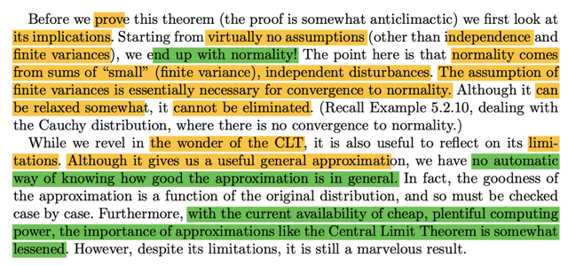</kbd></p>

🔗 **Related:** [2.3 MGF](23_mgf.md#node-119)

🔗 **Related:** [4.6 MULTI-VARIATE DISTRIBUTION](46_multi_variate_distribution.md#node-312)

> [!NOTE]
> đại khái là giáo sư Casella cho rằng, cái hay của theorem này là, ta hầu 
> như xuất phát với ko có giả định nào trừ việc các random variable độc
> lập và variance hữu hạn. Thế mà ta lại kết thúc với normal distribution,
>
> Gs nhấn mạnh, cái assumption về finite variance tuy có thể nới lỏng chút
> ít nhưng bắt buộc phải có.
>
> Rồi, theorem này cũng có hạn chế là tuy  rằng nó cho ta một cách ước
> lượng cũng hữu ích nhưng ko tự động cho biết sự ước lượng này tốt cỡ
> nào.
>
> Cuối cũng, với sức mạnh tính toán ngày càng lớn thì tầm quan trọng của 
> theore này ngày càng ít

<br>

<a id="node-411"></a>

<p align="center"><kbd>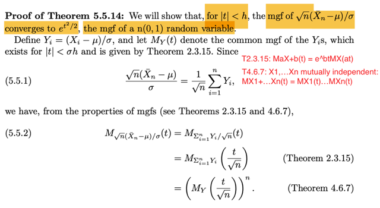</kbd></p>

🔗 **Related:** [3.5 LOCATION AND SCALE FAMILIES](35_location_and_scale_families.md#node-202)

> [!NOTE]
> ```text
> Để chứng minh thì ta sẽ chứng minh mgf của √n(Xnba - μ) / σ converge về
> ```
> `e^t^2/2` (là mgf của standard normal)
>
> ```text
> Đặt Yi = (Xi - μ) / σ. Gọi MY(t) là common mgf của Yis, theo theorem, thì nó
> ```
> tồn tại với |t| < `σh.`
>
> Dừng lại chút chỗ này là sao?
>
> Ta nhớ location scale theorem. Nói rằng khi Z là standard member có pdf
> ```text
> f(z) thì X = σZ + μ sẽ là thành viên trong family có location μ, scale σ với
> ```
> ```text
> pdf là: fX(x) = f((x - μ)/σ)/σ
> ```
>
> Thử chứng minh:
>
> ```text
> Chứng minh chiều đi: Z có pdf f(z) thì fX(x) = f((x - μ)/σ)/σ:
> ```
>
> ```text
> FX(x) = P(X ≤ x) = P(σZ + μ ≤ x) = P({s: σZ(s) + μ ≤ x}) = P({s: Z(s) ≤ (x - μ)
> ```
> `/` `σ})`
>
> ```text
> = P(Z ≤ (x - μ) / σ) = FZ[(x - μ) / σ]
> ```
>
> ```text
> d/dx FX(x) = fX(x) = d/dx FZ[(x - μ) / σ] = d/d[(x - μ) / σ] FZ[(x - μ) / σ] . d/dx
> ```
> [(x
> ```text
> - μ) / σ]
> ```
>
> ```text
> = fZ((x - μ) / σ) . 1/σ = f((x - μ) / σ) / σ. Chứng minh xong
> ```
>
> ```text
> Ngược lại, nếu X là thành viên có location μ scale σ thì (X - μ) / σ sẽ là
> ```
> thành viên chuẩn có location 0, scale 1
>
> ```text
> Chứng minh chiều ngược lại: Cho X có pdf fX(x) = f((x - μ)/σ)/σ . Thì Z
> ```
> ```text
> quan hệ với X bởi equation: X = σZ + μ sẽ có pdf là f(z):
> ```
>
> ```text
> FZ(z) = P(Z ≤ z) = P[(X - μ)/σ ≤ z] = P(X ≤ σz + μ) = FX(σz + μ)
> ```
>
> ```text
> ⇨ fZ(z) = d/dz FZ(z) = d/dz FX(σz + μ) = d/d(σz + μ) FX(σz + μ) . d/dz (σz
> ```
> `+` `μ)`
>
> ```text
> = fX(σz + μ) σ = [f(σz + μ - μ) / σ)/σ] σ = f(z)
> ```
>
> `=====`
>
> ```text
> Vậy thì ở đây Yi = (Xi - μ) / σ. Vì X1,X2...iid, có nghĩa là chúng chung
> ```
> ```text
> marginal distribution, nên Y1,Y2,...là các g(X1), g(X2)...với g(u) = (u - μ) / σ
> ```
> cũng sẽ là independent mutually. Và cũng sẽ có chung marginal
> distribution (vì X1, X2.. có chung marginal pdf, nên nếu dùng
> transformation theorem để tìm pdf của Y1,.. thì cũng ra giống nhau) thành
> ra ta gọi MY(t) là mgf của Y1,...Yn
>
> Rồi, biến đổi chút xíu ta sẽ có quan hệ giữa Xnbar và Yi:
>
> ```text
> Yi = (Xi - μ) / σ
> ```
>
> ```text
> ⇨ Σi Yi = Σi (Xi - μ) / σ = (ΣXi - Σ μ) / σ
> ```
>
> ```text
> ⇔ Σi Yi / √n = (ΣXi - Σμ) / σ√n
> ```
>
> ```text
> ⇔ Σi Yi / √n = √n (ΣXi - Σμ) / σ√n√n = √n (ΣXi/n - Σμ/n) / σ = √n (Xnbar - μ) /
> ```
> `σ`
>
> ```text
> ⇔ Σi Yi / √n = √n (Xnbar - μ) / σ
> ```
>
> ```text
> Xét mgf của √n (Xnbar - μ) / σ, M_√n (Xnbar - μ) / σ(t)
> ```
>
> ```text
> dĩ nhiên cũng là mgf của Σi Yi / √n, M_Σi Yi / √n (t)
> ```
>
> Áp dụng theorem 4.6.7, mgf của tổng các independent rv `=` tích các mgf:
>
> ```text
> M_Σi Yi / √n (t) = Π M_Yi/√n(t)
> ```
>
> Xét `M_Yi/√n(t),` thì áp dụng theorem 2.3.15 nói rằng mgf của aX `+` b:
>
> MaX `+` b(t) `=` e^btMX(at)
>
> ```text
> ⇨ MYi/√n(t) = M(1/√n)Yi + 0(t) = e^0t MYi(t/√n) = MYi(t /√n)
> ```
>
> ```text
> Vậy M_Σi Yi / √n (t) = Π M_Yi/√n(t) = Π MYi(t /√n)
> ```
>
> và MYi(t) đều giống nhau, đều là MY(t) nên
>
> ... `=` **[MY(t /√n)]^n**

<br>

<a id="node-412"></a>

<p align="center"><kbd>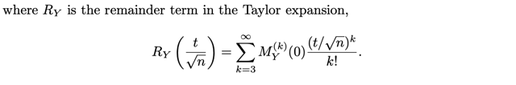</kbd></p>

<p align="center"><kbd></kbd></p>

<p align="center"><kbd>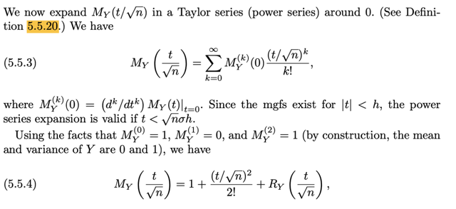</kbd></p>

> [!NOTE]
> Rồi, theo định nghĩa, đại khái là mình đã từng học đó là, THEO ĐỊNH
> NGHĨA CỦA MGF khi ta Taylor expand nó ra, thì hệ số gắn với term bậc 1,
> cũng là đạo hàm bậc 1 của mgf chính là first moment, tức EX, hệ số gắn
> với term bậc 2, cũng là đạo hàm bậc 2 của mgf chính là second moment,
> tức EX^2, ....
>
> ```text
> Nên ở đây, ta sẽ Taylor expand cái này  MY(t /√n) = Σk=0:inf MY^(k)(0)
> ```
> `(t/√n)^k` `/` k!
>
> thì ta hiểu MY^(k)(0) chính là k'th moment, và nó chính là đạo hàm bậc k
> của MY(t)
>
> Tiếp, cũng có thể hiểu, ta dùng the fact là moment bậc 0, 1 và 2 của Y
> ```text
> mình đã biết, lần lượt là 1, 0, 1. Vì, Yi = (Xi - μ)σ thì EYi = (EXi - μ) / σ =
> ```
> ```text
> (μ - μ) / σ = 0.
> ```
>
> ```text
> VarYi = Var (Xi - μ)σ =  Var (Xi - μ) / σ^ =  Var(Xi) / σ^2 = σ^2/σ^2 = 1
> ```
>
> ```text
> ⇨ EYi^2 - (EYi)^2 = 1 ⇨ EYi^2 = 1 - 0 = 1, đây chính là moment bậc 2
> ```
>
> ```text
> Vậy MY(t/√n) = 1 + (t/√n)^2/2! + RY(t/√n) với RY là các term còn lại của
> ```
> Taylor expansion (là sao, là vì ta đã biết 3  cái moment đầu tiên nên 
> thay vào ta có 3 hạng tử đầu tiên như vầy, còn các hạng tử khác, gom vô
> thành hàm RY)

<br>

<a id="node-413"></a>

<p align="center"><kbd>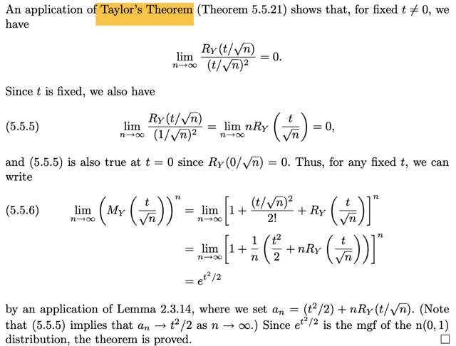</kbd></p>

> [!NOTE]
> Tới đây thêm vài bước nữa là chứng
> minh xong. Thôi quay lại sau đi

> [!NOTE]
> QUAY LẠI SAU

<br>

<a id="node-414"></a>

<p align="center"><kbd>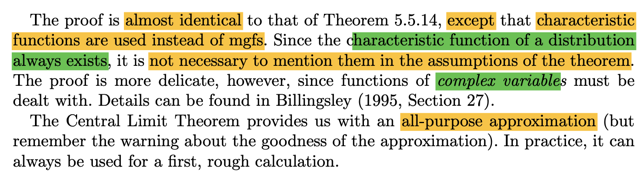</kbd></p>

<p align="center"><kbd></kbd></p>

<p align="center"><kbd>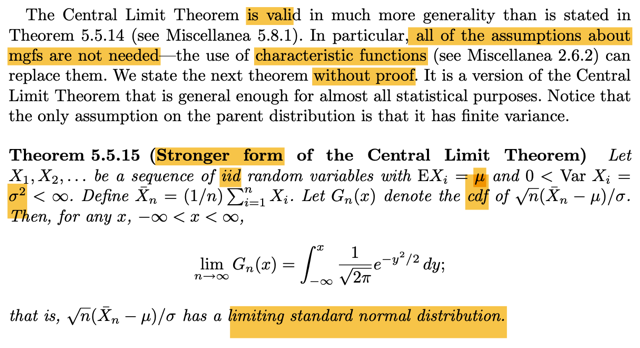</kbd></p>

> [!NOTE]
> Đại khái khái đây là phiên bản mạnh hơn của CLT, trong đó ko cần các 
> giả thiết về mgf.Ở đây gs ko chứng minh.
>
> Nội dung thì đại khái là cũng cho chuỗi rv X1,X2...iid, có population mean
> `μ,` finite variance `σ^2.` Và Xnbar là sample mean size n. Gn(x) là cdf của
> ```text
> √n(Xnbar - μ) /  σ thì theorem nói rằng n → inf thì Gn(x) → ∫-inf:x 1/√2π e^-y^2/2dy
> ```
> chính là cdf của normal(0,1)
>
> Thì gs nói thêm, là chứng minh cái này ko cần mgf, mà dùng characteristic
> function, vốn là luôn tồn tại.
>
> Cái CLT này cho ta một công cụ hữu ích, `all-purpose` approximation, nhưng
> phải lưu ý rằng chất lượng của approximation này phải xem lại. Trong thực tế,
> nó luôn có  ích trong việc đưa ra những tính toán sơ bộ đầu tiên

<br>

<a id="node-415"></a>

<p align="center"><kbd>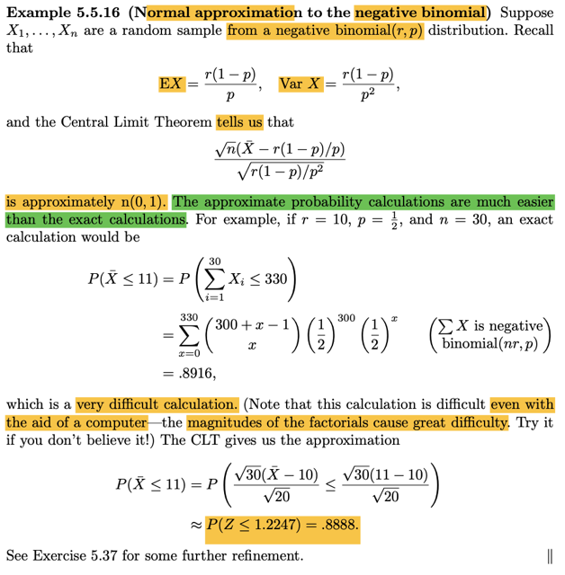</kbd></p>

> [!NOTE]
> Đại khái là một ví dụ, khi mà ta có random sample từ population là thuộc
> loại negative binomial(r, p).
>
> ```text
> Cái này ta đã học mean và variance của nó là r(1 - p) / p và r(1 - p)/p^2
> ```
>
> Có thể chứng minh lại nếu muốn.
>
> Nhưng ý chính là, giả sữ ta muốn tình xác suất liên quan đến sample mean,
> ví dụ P(Xbar ≤ 11) thì nếu tính chính xác thì sẽ rất khó, do sẽ phải deal với
> các giai thừa (do pmf của negative binomial) kể cả khi có máy tính.
>
> ```text
> Trong khi đó nếu dùng CLT, nói rằng √n(Xn - μ) / σ nó sẽ có thể coi như xấp
> ```
> xỉ như một normal(0,1) thì khi đó việc tính xác suất trên sẽ dễ hơn nhiều
>
> Ôn lại thì story của negative binomial(r, p) là: "số Bern(p) trial iid cần thiết
> để có r success"
>
> Nên nên event (X `=` k) tức là có k Bern(p) trial và có đủ r success, với một
> success đứng cuối. ⇨ nó sẽ chuỗi có dạng [r `-` 1 sucess `+` k `-` r failure lộn] 
> và [1 success cuối]
>
> (X `=` k) `=` {s ∈ `Ω,` s có dạng như trên}
>
> P(X `=` k) `=` P({s ∈ `Ω,` s có dạng như trên})
>
> Theo định nghĩa, `=` `Σ{s` ∈ `Ω,` s có dạng như trên} P({s})
>
> Xét P({s}), đều có dạng là joint event của r success và k `-` r failure. mà lại
> độc lập nhau, nên theo định nghĩa của independent event, P  của joint
> ```text
> event này = tích các P, = P(success)^r P(failure)^k-r = p^r (1-p)^(k-r)
> ```
>
> Việc còn lại là đếm số lượng của set {s ∈ `Ω,` s có dạng như trên}
>
> Thì nó là số hoán vị của r `-` 1 success và k `-` r failure, nhưng ko care thứ tự
> của các success cũng như của các failure.
>
> ```text
> = (k-1)! / (r-1)! (k-r)!
> ```
>
> ```text
> ⇨ pmf P(X = k) = [(k-1)! / (r-1)! (k-r)!] p^r (1-p)^(k-r)
> ```
>
> ```text
> = [(k-1) choose (r-1)] p^r (1-p)^(k-r)
> ```
>
> Như vậy, quay lại đây:
>
> ```text
> P(Xbar ≤ 11) = P(Σi=1:30 Xi ≤ 11) = P(Σi Xi ≤ 330)
> ```
>
> Tới đây ta phải tìm distribution của Y `=` `Σi` Xi, với Xi là negative binomial(r, p)
>
> thì ở đây người ta cho biết nó sẽ là neg bin (nr, p)
>
> (hình như cũng dễ hiểu thôi, theo story proof, nếu X1 có story là số Bern(p)
> trial để có được r success, X2 cũng là số Bern(p) trial để có được r success,
> thì X1 `+` X2 dễ thấy sẽ có story là số Bern(p) trial để có được 2r success) 
>
> Rồi, nhờ đó ta có thể tính P(Y ≤ 330)
>
> QUAY LẠI SAU
>
> `=` `Σk=0:330`

> [!NOTE]
> QUAY LẠI SAU

<br>

<a id="node-416"></a>

<p align="center"><kbd>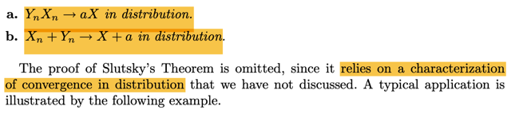</kbd></p>

<p align="center"><kbd>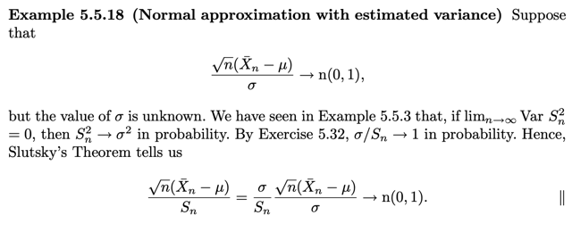</kbd></p>

<p align="center"><kbd></kbd></p>

<p align="center"><kbd></kbd></p>

<p align="center"><kbd>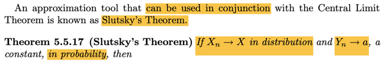</kbd></p>

> [!NOTE]
> Theorem này rất quan trọng, hữu ích:
>
> Nó nói Xn → (d) X, Yn → (p) a thì XnYn → (d) aX
>
> Và Xn `+` Yn → (d) X `+` a
>
> Gs cũng không chứng minh theorem này

<br>

<a id="node-417"></a>

<p align="center"><kbd>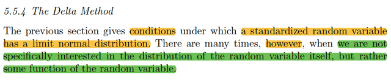</kbd></p>

<p align="center"><kbd></kbd></p>

<p align="center"><kbd>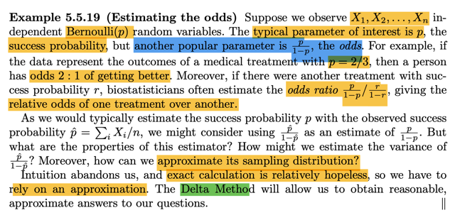</kbd></p>

> [!NOTE]
> Đại khái là, phần trước, là ta quan tâm đến điều kiện khi nào thì một
> random variable đã chuẩn hóa sẽ có limit normal distribution (ý là,  kiểu
> ```text
> như ta được học rằng √n(Xnbar - μ) / σ sẽ → normal(0,1) Nhưng có
> ```
> **nhiều khi ta ko care distribution của random variable, mà care
> distribution của một function apply lên rv đó cơ.**
>
> Thế thì đầu tiên được học khái niệm odd (đã gặp trong ISL), bối cảnh là
> ta có các random sample size n X1,X2...Xn từ Bern(p) distribution.
>
> Thì ngoài p, là xác suất success, ta còn care `p/1-p,` đây chính là odd. ý
> nghĩa của nó, nói xác suất khỏi bên là `2/3` thì cũng là nói ta có tỉ lệ cược
> 2:1 cho việc khỏi bệnh (2 ăn 1 tức là ta tin rằng khả năng khỏi là 2 phần,
> khả năng không khỏi là 1 phần)
>
> Để rồi người ta có thể quan tâm đến  odds ratios tỉ lệ của tỉ lệ cược giữa
> hai phương pháp chữa bệnh
>
> Đại khái là cũng giống như khi ta thường dùng `ΣXi/n` (sample mean) để
> estimate cho population mean p.
>
> ```text
> Gọi p^ = ΣXi/n Thì ta có thể cũng dùng p^/(1-p^) để estimate cho p/(1-p)
> ```
> Nhưng câu hỏi là việc ESTIMATE NÀY CHÍNH XÁC HAY KO? VÀ LÀM
> SAO TÌM SAMPLING DISTRIBUTION CỦA `p^/(1-p^)`
>
> (dừng lại tí, nói vài lời, dĩ nhiên p^ là sample mean, là một statistic,  là
> function apply lên các random variable của random sample. Thế thì,
> `p^/(1-p^)` cũng là function apply lên statistic, cũng là statistic, và
> distribution của statistic được gọi là sampling distribution, để phân biệt với
> population distribution)
>
> Thế thì, đại ý là, `Δ` METHOD SẼ giúp trong việc này

<br>

<a id="node-418"></a>

<p align="center"><kbd>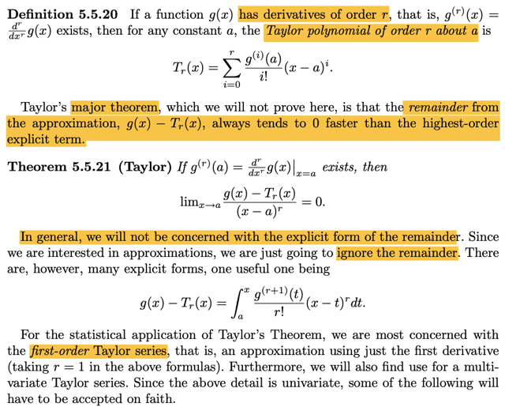</kbd></p>

> [!NOTE]
> Nói về Taylor expansion, cái này thì đã gặp nhiều bên giải tích, tối ưu nên
> cũng nhớ rồi. Cho hàm g(x) có đạo hàm cấp r, có nghĩa là tồn tại hàm 
> g^(r)(x) `=` `d^r/dx^r` g(x). Khi đó với mọi hàm số a:
>
> ```text
> Tr(x) = Σi=0:r g^(i)(a)/i! [x-a]^i
> ```
>
> Và giáo sư cho biết g(x) `-` Tr(x) sẽ hội tụ về 0 nhanh hơn là cái term có bậc
> cao nhất (chưa hiểu lắm)
>
> ```text
> Thể hiện bởi: lim x→a [g(x) - Tr(x)] / (x - a)^r = 0
> ```
>
> Và ta sẽ thường quan tâm đến xấp xỉ bậc nhất

<br>

<a id="node-419"></a>

<p align="center"><kbd>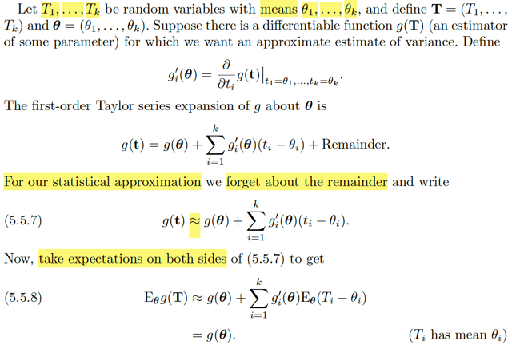</kbd></p>

🔗 **Related:** [5.5 CONVERGENCE CONCEPTS](55_convergence_concepts.md#node-430)

> [!NOTE]
> rồi, ở đây là nói qua case đa biến. Cho T1,...Tk là các random variable với
> mean `θ1,` `..θk.` Và đặt vector **T**= (T1,...Tk), và **θ** `=` `(θ1,...θk).`
>
> Giả sử có hàm g(**T**) là hàm khả vi. và ta muốn ước lượng xấp xỉ variance.
> (chưa hiểu ý này lắm)
>
> Define g'i(**θ**) `=` `∂/∂ti` g(**t**)|ti `=` `θ1,...,tk=θk.` Cái này là sao, đơn giản thôi, g'
> i(**θ**) ý là kí hiệu sẽ dùng để chỉ đạo hàm của hàm g đối với **θ**, và vì **θ**
> là vector, nên g'(**θ**) cũng là vector (mà bên giải tích mình biết nó là
> gradient vector). Và g'i(**θ**) ý là lấy component thứ i
>
> Tất nhiên nó cũng là một hàm số, và cũng là hàm theo vector `θ`
>
> ```text
> ∂/∂ti g(t)|t1 = θ1,...,tk=θk, ý là đạo hàm riêng (partial derivative) của g wrt
> ```
> vector t, và evaluate tại t `=` **θ**Vậy thì ta có first order Taylor series expansion của g about **θ**:**** 
> Thì cũng y như trong giải tích hay tối ưu ta hay nói first order approximation
> của hàm f tại x0:
>
> f(x) ≈ f(x0) `+` `∇f(x0)T(x-x0)` 
>
> Thì ở đây là: 
>
> g(**t**) ≈ g(**θ**) `+` `Σi=1:k` g'i(**θ**)(ti `-` `θi)`
>
> Cái vế sau thật ra chính là ∇g(**θ**)T(**t** `-` **θ**) thôi
>
> Rồi, bây giờ ta sẽ lấy expectation hai vế:
>
> Là sao nhỉ.
>
> Mình hiểu là, đã nói về việc lấy kì vọng, thì chỉ có thể nói về kì vọng của
> random variable. Nên hiểu ở đây ý là, ta sẽ lấy expectation của g(T). Với T
> là random variable vector **T** define ở trên, thì g(T) đương nhiên cũng là
> random variable (hoặc random variable vector, ở đây ko nói g là vector 
> hay scalar, nhưng dù là gì thì vẫn có thể lấy kì vọng)
>
> Eg(T), thế còn tại sao phải ghi là `E_θ` g(T)?
>
> Là vì trong hàm g, **θ**  đóng vai tham số, nên `E_θ` g(T) ý là ta sẽ tính với
> một giá trị `θ` fixed nào đó.
>
> Và khi tính kì vọng, ta biết rằng mình sẽ weighted sum over mọi possible
> value của T, nên kết quả sẽ là constant (phụ thuộc `θ,` coi như fixed)
>
> Rồi, như vậy thì `E_θ` g(**T**), vì g(t) ≈ g(**θ**) `+` `Σi=1:k` g'i(**θ**)(ti `-` `θi)`
>
> nên ta có `E_θ` g(**T**) ≈ `E_θ` `[g(θ)` `+` `Σi=1:k` g'i(**θ**)(Ti `-` `θi)]`
>
> `=` `E_θ` g(**θ**) `+` `E_θ` `[Σi=1:k` g'i(**θ**)(Ti `-` `θi)]` | linearity
>
> ```text
> với θ coi như fixed, thì g(θ) là constant, E_θ[g(θ)] = g(θ)
> ```
>
> .. `=` g(**θ**) `+` `E_θ` `[Σi=1:k` g'i(**θ**)(Ti `-` `θi)]` 
>
> `=` g(**θ**) `+` `Σi=1:k` E_θ[g'i(**θ**)(Ti `-` `θi)]` | linearity
>
> `=` g(**θ**) `+` `Σi=1:k` g'i(**θ**) `E_θ(Ti` `-` `θi)`  | linearity
>
> `=` g(**θ**) `+` `Σi=1:k` g'i(**θ**) `[E_θ(Ti)` `-` `E_θ(θi)]`
>
> `=` g(**θ**) `+` `Σi=1:k` g'i(**θ**) `[θi` `-` `θi]`   |  Do `E_θ(Ti)` `=` `θi,` và `E_θ(θi)` `=` `θi`
>
> `=` g(**θ**)
>
> Chú ý, vì ta đang dùng xấp xỉ bậc 1 cho g, nên cái ta có chỉ là approximated
> của `E_θ` g(T).

<br>

<a id="node-420"></a>

<p align="center"><kbd>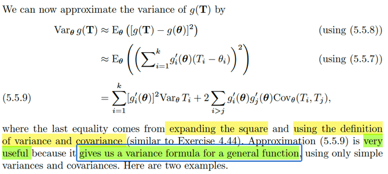</kbd></p>

> [!NOTE]
> Rồi, khi đã có E_θ[g(**T**)] rồi, tức là approx. mean của g(**T**) ta sẽ **đi tính
> approximatyed variance**:
>
> `Var_θ` g(**T**), theon công variance đã biết `Var` X `=` `E[X` `-` EX]^2
>
> ⇨ `Var_θ` g(**T**) `=` E[g(**T**) `-` Eg(**T**)]^2
>
> Với Eg(**T**) ta dùng approx. value tính ở trên, bởi vậy nên ở đây ta đang tính
> approx. của variance của g(**T**)
>
> ≈  E[g(**T**) `-` g(**θ**)]^2
>
> ≈ E[g(**θ**) `+` `Σi=1:k` g'i(**θ**)(Ti `-` `θi)` `-` `g(θ)]^2` | thay g(**T**) bởi linear approx
>
> ≈ `E[Σi=1:k` g'i(**θ**)(Ti `-` `θi)]^2`
>
> `=` `Σi=1:k` E[g'i(**θ**)(Ti `-` `θi)]^2` `+` `2Σi>j` E[g'i(**θ**)(Ti `-` θi)g'j(**θ**)(Tj `-` `θj)]`
>
> `=` `Σi=1:k` g'i(**θ**)^2 `E[(Ti` `-` `θi)]^2` `+` `2Σi>j` g'i(**θ**)g'j(**θ**) `E[(Ti` `-` `θi)(Tj` `-` `θj)]`
>
> (linearity, đưa constant ra)
>
> `=` `Σi=1:k` g'i(**θ**)^2 `E[(Ti` `-` ETi)]^2 `+` `2Σi>j` g'i(**θ**)g'j(**θ**) `E[(Ti` `-` ETi)(Tj `-` ETj)]
>
> `(θi` `=` ETi)
>
> `=` `Σi=1:k` g'i(**θ**)^2 VarTi `+` `2Σi>j` g'i(**θ**)g'j(**θ**) `Cov(Ti,` Tj)
>
> VÀ CÔNG THÚC APPROX NÀY SẼ RẤT HỮU ÍCH, vì nó cho phép ta công
> thức tính ƯỚC LƯỢNG VARIANCE CỦA MỘT HÀM CHUNG CHUNG NÀO ĐÓ, 
>
> (ý là tính approx variance của một random variable khi apply hàm g chung chung 
> nào đó lên các rv đã biết) MÀ CHỈ CẦN DÙNG VARIANCE VÀ COVARIANCE CỦA
> Rvs

<br>

<a id="node-421"></a>

<p align="center"><kbd>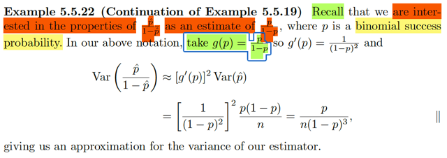</kbd></p>

> [!NOTE]
> Rồi, học cái vừa rồi là để áp dụng cho cái này. Là vì như đã nói, ta đang
> quan tâm đến odd: p `/` `(1-p).` Tức là ta đang quan tâm đến bối cảnh là  ta có
> một random sample size n từ population là Bern(p). Thì dĩ nhiên ta quan
> tâm đến p, nhưng với Bern(p) thì ta cũng quan tâm đến một tham số khác là
> odd: `=` `p/(1-p)`
>
> Thế thì với p, ta dùng sample mean Xbar, hay p^ để estimate cho nó. Thì
> với odd, ta dùng `p^/(1-p^)` để estimate cho nó.
>
> Vậy thì ta sẽ muốn tìm sampling distribution cũng như các properties của
> `p^/(1-p^)`
>
> Và đây là lúc mà cái công cụ vừa rồi phát huy tác dụng. Vì nó cho phép
> tính ước lượng variance của g(**T**) (T là random variable vector, nhưng đó
> là khái quát thôi, ta vẫn có thể dùng với T là random variable)
>
> Thì ở đây, g là hàm: g(u) `=` u `/` `(1-u)` 
>
> Áp dụng kết quả trên,
>
> `Var_θ` g(**T**) `=` `Σi=1:k` g'i(**θ**)^2 VarTi `+` `2Σi>j` g'i(**θ**)g'j(**θ**) `Cov(Ti,` Tj)
>
> Ta sẽ tính estimated variance của `p^/(1` `-` p^), và cái này được nhìn nhận
> dưới dạng g(p^)
>
> Tức là ta hiểu đại khái là Ở đây **T** chỉ có 1 component, `=` (p^), và vector **θ** 
> cũng vậy, chỉ có `=` (p). Và công thức trên cho ta cách tính `Var` g(p^) ****Var `p^/(1-p^)` `=` `Var` g(p^) theo công thức trên, thì nó sẽ là gì:
>
> term 1: `Σi=1:k` g'i(**θ**)^2 VarTi, ở đây chỉ có k `=` 1, nên ta có g'(**θ**)^2 `Var(T)`
>
>  g'(**θ**) là gì, tức là đạo hàm hàm g, evaluate tại **θ**, mà **θ**ở đây cũng chỉ là 
> có một component, chính là p. (theo theorem, Ti có mean `θi)`
>
> Nên g'(**θ**) ở đây chính là g'(p), hay ghi kiểu này cũng được g'(u) | u `=` p để
> nhấn mạnh ta sẽ evaluate thàm g' tại p
>
> Còn `Var(T)` dĩ nhiên là `Var(p^)` rồi.
>
> Nên term 1 là g'(p)^2 `Var(p^)`
>
> Còn term 2: thì ko có, vì ở đây ta chỉ có vector **T** có một random variable p^
> thôi
>
> `====`
>
> Vậy **Var (p^ `/` 1 `-` p^) ≈ g'(p)^2 Var(p^)**
>
> ```text
> g(u) = u/1-u ⇨ g'(u) = 1/(1-u)^2 (chỉ là dùng quotient rule, ko khó)
> ```
>
> Và **Var(p^)** thì là gì, nó chính là **Var(Xbar)**, tức **variance của sample mean** đó, 
> có công thức là **σ^2/n** tức là**population variance `/` n** 
>
> Và ở đây, với X ~ Bern(p) thì variance `Var(X)` là gì? Thử tính lại đơn giản:
>
> ```text
> Var(X) = EX^2 - (EX)^2 = EX^2 - p^2 = [1^2(PX=1) + 0^2P(X=0)] - p^2
> ```
>
> `=` p `-` p^2 `=` **p(1-p)**
>
> ⇨ Ta có kết quả `[1/(1-p)^2]^2` `p(1-p)/n` `=` **p/[n(1-p)^3]
>
> Nhắc lại, đây chính là estimated mà ta có cho variance của p^/(1-p^)**

<br>

<a id="node-422"></a>

<p align="center"><kbd>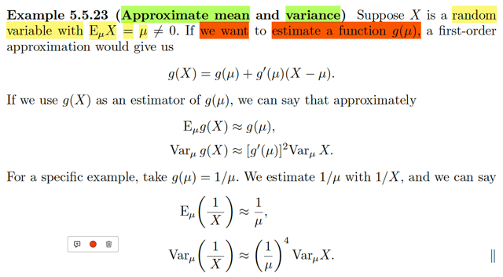</kbd></p>

> [!NOTE]
> Một ví dụ khác, là giả sử ta có random variable X với `Eμ(X)` `=` `μ` khác 0. Và ta
> muốn estimate một function `g(μ).`
>
> Chú ý nhé, ta muốn estimate `g(μ),` chứ ko phải estimate `μ.` Muốn estimate `μ,`
> thì ta dùng sample mean Xbar rồi.
>
> Thế thì ở đây nói rằng, first order approx. cho ta:
>
> **g(X) `=` `g(μ)` `+` `g'(μ)(X` `-` μ)**
>
> (Mình muốn ý kiến một chút, trong giải tích ta biết, cái này chỉ đúng, nếu như
> X gần `μ.` Và ko hiểu sao họ dùng dấu bằng, phải là ≈ chứ) 
>
> Rồi, thì nếu ta có approximation như trên thì 
>
> ```text
> E_μ[g(X)] ≈ E_μ[g(μ) + g'(μ)(X - μ)]
> ```
>
> ```text
> = E_μ[g(μ)] + E_μ[g'(μ)(X - μ)] | linearity
> ```
>
> ```text
> = g(μ) + g'(μ)E_μ(X - μ)
> ```
>
> ```text
> = g(μ) + g'(μ)(E_μ(X) - E_μ(μ))
> ```
>
> ```text
> = g(μ) + g'(μ)(μ - μ)
> ```
>
> `=` `g(μ)` 
>
> → **Eg(X) ≈ g(μ)**
>
> `Var` g(X): 
>
> ```text
> = E[g(X) - Eg(X)]^2  |  thay Eg(X) ≈ Eg(μ)
> ```
>
> ```text
> ≈ E[g(μ) + g'(μ)(X - μ) - Eg(μ)]^2  |  thay g(X) ≈ g(μ) + g'(μ)(X - μ)
> ```
>
> ```text
> = E[g(μ) + g'(μ)(X - μ) - g(μ)]^2
> ```
>
> ```text
> = E[g'(μ)(X - μ)]^2
> ```
>
> ```text
> = E[g'(μ)^2(X - μ)^2]
> ```
>
> ```text
> = g'(μ)^2 E[(X - μ)]^2
> ```
>
> `=` **g'(μ)^2 Var_μ(X)**
>
> `====`
>
> ```text
> Ví dụ như lấy g(μ) = 1/μ
> ```
>
> ```text
> Thì như vậy E_μ(1/X) ≈ 1/μ
> ```
>
> ```text
> Và Var_μ(1/X) ≈ (1 / μ)^4 Var_μ X
> ```

> [!NOTE]
> rồi, làm rõ chỗ này
>
> Trong ví dụ trước đó, đại khái là người ta quan tâm đến `p/(1-p),` với bối cảnh là ta
> có random sample từ population distribution thuộc loại Bern. Dĩ nhiên ta ko biết
> population mean p. Và ta dùng sample mean p^ `=(1/n)` `Σ` Xi để estimate cho p.
> Nhưng như đã nói, ta còn quan tâm để population odd, `p/(1-p).` Và lẽ tự nhiên ta
> sẽ muốn đặt câu hỏi về tính chất của cách làm này, kiểu như là, cũng giống như
> việc dùng sample mean để estimate cho population mean thì mình đã có nhiều
> hiểu biết rồi, cũng như đã có nhiều theorem cho ta công cụ để tìm hiểu sampling
> distribution của sample mean. Thì bây giờ, ta muốn tìm hiểu là việc dùng
> ```text
> p^/(1-p^) để estimate cho p/(1-p) là tốt đến mức nào, cũng như sampling
> ```
> distribution của `p^/(1-p^)` là gì.
>
> Thế thì, ta mới dùng công cụ này: First order Taylor expansion.
>
> Sở dĩ như vậy là vì, ta nhìn cái `p^/(1-p^)` theo cách nhìn thế này: Nó là một hàm
> số của p^, tức là ta đang quan tâm g(p^), với hàm g(.) có công thức là g(t) `=`
> `t/(1-t).`
>
> Mà đối với hàm số f(x),  thì first order Taylor expansion nó cho ta biết rằng: với x
> ≈ x0 thì ta có thể có sự xấp xỉ sau đây: f(x) ≈ f(x0) `+` `f'(x0)(x-x0).` Đây là thứ mà
> Calculus cho ta. Vậy thì áp dụng vào đây, ta sẽ có g(t) ≈ g(t0) `+` `g'(t0)(t-t0).` Và
> dùng X cho vai trò của t, p^ cho vai trò của x0 (là điểm cố định cho trước) thì ta
> có:
>
> g(X) ≈ g(p^) `+` g'(p^)(X `-` p^)
>
> Thế thì, tới đây, mới quay lại vấn đề đã nói, cái mà ta quan tâm là tính chất của
> ```text
> việc dùng p^/(1-p^) để estimate cho p/(1-p), và hơn nữa, ta quan tâm đến
> ```
> sampling distribution của nó.
>
> Thế thì, p^ là sample mean, là một statistic, là một random variable có được từ
> ```text
> việc áp dụng function f(x1,x2...xn) = (x1 + x2 + ...xn) / n lên các random variable
> ```
> X1,..Xn của random sample. Và vì là random variable, nên ta có quyền đặt vấn
> đề tìm kì vọng, variance và distribution của nó (mà vì nó là statistic, nên người ta
> gọi distribution này là sampling distribution)
>
> Vậy thì `p^/(1-p^)` cũng là một random variable có được khi apply function g(t) `=`
> `t/(1-t)` lên statistic p^, nên dĩ nhiên nó cũng có quyền có mean, variance,
> sampling distribution.
>
> ```text
> Do đó ta mới đặt vấn đề tìm E[p^/(1-p^)] cũng như Var[p^/(1-p^)] mà cái chính là
> ```
> cái này `Var[p^/(1-p^)]`
>
> và từ cái xấp xỉ ở trên: g(X) ≈ g(p^) `+` g'(p^)(X `-` p^), ta sẽ có được:
>
> ```text
> Var[p^/(1-p^)] ≈ g'(p)^2 Var p^ = p/[n(1-p)^3]
> ```
>
> Và như vậy,  dù cũng đếch biết nó là gì, vì ta ko biết p, nhưng nó cho ta cái
> khung để làm, ví dụ như đưa p^ thay cho p (estimate cho p) thì ta sẽ có estimate
> cho `Var[p^/(1-p^)]`
>
> Vậy thì tiếp theo qua ví dụ này, 5.5.23: Thì vấn đề đặt ra là ta có random variable
> X và gọi `μ` là mean của nó (và ta chưa biết `μ).` Và cái ta quan tâm là `g(μ),` ví dụ,
> `1/mu.`
>
> Vậy thì, again, ta cũng nhìn `1/mu` dưới dạng, ...(dĩ nhiên) ..là function của `μ:` `g(μ).`
>
> ```text
> Để rồi ta cũng áp dụng cái công cụ mà Giải tích cho ta: g(X) ≈ g(μ) + g'(μ)(X - μ)
> ```
>
> ```text
> Để từ đó ta có Eg(X) ≈ g(μ) và Var g(X) ≈ g'(μ)^2 Var(X)
> ```
>
> Và cái chính muốn nói là, cũng giống như ở ví dụ trước, ta có được cái khung,
> ```text
> rằng Var [p^/(1-p^)] = p/[n(1-p)^3], đặng từ đó mà có thể làm tiếp (lắp p^ vào thay
> ```
> cho p), thì ở đây cũng vậy, kết quả từ Taylor expansion cho ta rằng, nếu ta quyết
> định dùng g(X) để estimate cho `g(μ)` thì ta có thì đi tính `Var` g(X) dựa theo cái
> khung là `g'(μ)^2` `Var(X).`

<br>

<a id="node-423"></a>

<p align="center"><kbd>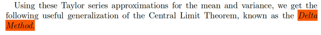</kbd></p>

<p align="center"><kbd></kbd></p>

<p align="center"><kbd>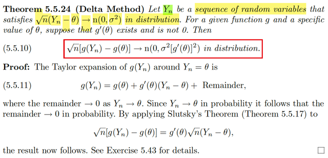</kbd></p>

> [!NOTE]
> Đại khái là khi dùng Taylor series approximation để estimate mean và
> variance ta có Theorem `Δ` Method rất hữu ích: Đại khái là, 
>
> cho Yn là một chuỗi các random variables thỏa √n(Yn `-` `θ)` → (d) n(0, `σ^2)`  
>
> (có nghĩa là n → inf thì cdf của √n(Yn `-` `θ)` → cdf của n(0, `σ^2)).` 
>
> Ví dụ như ta có một random sample X1,...Xn có population mean `μ,`
> population variance `σ^2`
>
> ```text
> Và ta lấy sample mean Xnbar = Σi Xi, thì theo CLI, √n(Xnbar - μ) / σ
> ```
> sẽ → (d) n(0,1). 
>
> Thì bối cảnh ở đây chính là, có thể áp dụng cho chuỗi Xnbar đó. Vì chuỗi
> Xnbar cũng thỏa mãn yêu cầu.  
>
> Cho hàm g và
> giá trị cụ thể của `θ,` giả thiết `g'(θ)` tồn tại và khác 0. theorem  này nói rằng:
>
> **√n[g(Yn) `-` `g(θ)]` → n(0, `σ^2[g'(θ)]^2)` in distribution**
>
> Chứng minh:
>
> Slutsky theorem nói rằng cho Xn → X in distribution và Yn → a in
> probability thì XnYn → aX in distribution.
>
> Thế thì ở đây ta có Taylor expansion của g(Yn) quanhh `θ:`
>
> ```text
> g(Yn) = g(θ) + g'(θ)(Yn - θ) + remainder
> ```
>
> Và dĩ nhiên remainder → 0 thì Yn → `θ`
>
> Vậy thì Yn → `θ` in probability, và remainder → 0 in probability.
>
> Rồi, ta có √n(Yn `-` `θ)` → X với X ~ n(0, `σ^2)`
>
> ```text
> Ta có approx. g(Yn) ≈ g(θ) + g'(θ)(Yn - θ) ⇔ g'(θ)(Yn - θ) ≈ g(Yn) - g(θ)
> ```
>
> ```text
> ⇔ √n g'(θ)(Yn - θ) ≈ √n (g(Yn) - g(θ))
> ```
>
> ```text
> ⇔ g'(θ) √n (Yn - θ) ≈ √n (g(Yn) - g(θ))
> ```
>
> Vậy thì xét vế trái, nó có:
>
> √n(Yn `-` `θ)` → X ~ n(0, `σ^2)`
>
> còn `g'(θ),` thì nó là constant, mà constant thì cũng → chính nó.
>
> Theo Slutsky, Xn → X in distribution, và Yn → a in probability
> thì XnYn → (d) Xa 
>
> ở đây, √n(Yn `-` `θ)` →(d) n(0,1), hay cũng là →(d) Z ~ n(0,1)
>
> và `g'(θ)` là constant, cũng coi như →(p) `g'(θ)`
>
> ```text
> Do đó theo theorem này, g'(θ) √n (Yn - θ) sẽ → g'(θ) X với X ~ n(0, σ^2) in
> ```
> distribution
>
> Mà xét random variable U `=` `g'(θ)` X:
>
> nhớ lại location scale, có một theorem nói rằng nếu ta có Z là standard
> ```text
> member của family với location 0, scale 1, có pdf là f(z)  thì X = σZ + μ sẽ
> ```
> là member có location `μ,` scale `σ.` Nên ở đây X là thành  viên có location 0,
> ```text
> scale σ, tại nó là n(0, σ^2) Nên nhất định nó có dạng = σZ
> ```
>
> ```text
> Rồi, bây giờ ta có U = g'(θ)X = g'(θ) σ Z, thì dĩ nhiên U chính là ~ thành
> ```
> viên của family có location 0, scale `=` `g'(θ)` `σ.` Và với normal distribution thì
> location cũng là mean và scale cũng chính là standard deviation.
>
> Từ đó kết luận U ~ n(0, `g'(θ)^2` `σ^2)`

<br>

<a id="node-424"></a>

<p align="center"><kbd>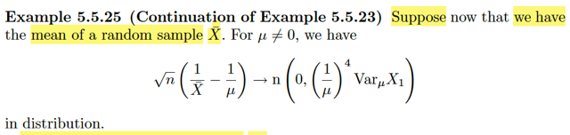</kbd></p>

🔗 **Related:** [5.5 CONVERGENCE CONCEPTS](55_convergence_concepts.md#node-409)

> [!NOTE]
> Ok, chỗ này là vầy:
>
> Theo Central Limit Theorem ta có (cho X1,X2...là các rv có population
> mean là `μ,` population variance là `σ^2)` và Xnbar là sample mean size
> n, viết Xbar cho gọn) thì ta có:
>
> **√n(Xbar `-` `μ)` `/` `σ` → n(0,1)** in distribution
>
> Dựa vào Slutsky theorem: 
>
> ```text
> √n(Xbar - μ) / σ →  Z ~ n(0,1) và σ → σ,
> ```
>
> ```text
> theo Slutsky theorem σ √n(Xbar - μ) / σ → σZ và σZ thì ~ (n, σ^2)
> ```
>
> Vậy: **√n(Xbar `-` `μ)`  → n(0, σ^2)** in distribution 
>
> `====`
>
> Tiếp, dùng cái delta method theorem vừa rồi, nói rằng: 
>
> Nếu **√n(Yn `-` `θ)` →**(d)**N(0, θ^2)** thì 
>
> √**n(g(Yn) `-` g(θ))**→(d)**n(0, `σ^2` g'(θ)^2)** 
>
> Nên áp dụng vào đây, ta đang có: 
>
> √n(Xbar `-` `μ)` →(d) n(0, `σ^2)`
>
> ```text
> Và ta có hàm g(t) = 1/t, g'(t) = 1/t^2
> ```
>
> ```text
> ⇨ √n(g(Xbar) - g(μ))  →(d) n(0, σ^2 g'(μ)^2)
> ```
>
> Và có nghĩa là: 
>
> **√n(1/Xbar `-` 1/μ)** →(d) n(0, `σ^2` `(1/μ^2)^2)` `=` **n(0, `σ^2` (1/μ^4))**
> Với `σ^2` là population variance, người ta ghi là `Var` X1 cũng có thể hiểu
> được
>
> Vậy ta có **√n(1/Xbar `-` `1/μ)` → n(0, `(1/μ^4)` `Var` X1)** là vậy

<br>

<a id="node-425"></a>

<p align="center"><kbd>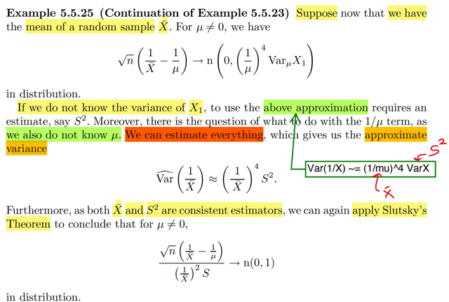</kbd></p>

> [!NOTE]
> ```text
> Ok, vừa rồi mình đã hiểu được là √n(1/Xbar - 1/μ) →(d) n[0, (1/μ)^4 Var X1]
> ```
>
> Hay gọi `σ^2` là `Var` X1, tức population variance cho gọn, ta có:
>
> ```text
> √n(1/Xbar - 1/μ) →(d) n[0, (1/μ)^4 σ^2]
> ```
>
> Thế thì, Slutsky theorem cho ta: nếu Xn →(P) X và Yn →(p) a thì XnYn →(d) Xa
>
>
> ```text
> Nên ở đây √n(1/Xbar - 1/μ) → (d) Z ~ n[0, (1/μ)^4 σ^2]
> ```
>
> ```text
> và 1/p(1/μ)^4 σ^2] (dĩ nhiên) → (p) 1/[(1/μ)^4 σ^2]
> ```
>
> ```text
> Thì [√n(1/Xbar - 1/μ)] / [(1/μ)^4 σ^2] → (d) Z / [(1/μ)^4 σ^2]
> ```
>
> Và Z là rv ~ n[0, `(1/μ)^4` `σ^2]` thì ta đã biết nó là thành viên trong family có
> location 0, scale `(1/μ)^4` `σ^2.` 
>
> Theo kiến thức từ location scale family thì nếu ta có X là
> ```text
> thành viên có location μ, scale σ thì (X - μ) / σ sẽ là thành viên chuẩn có location
> ```
> 0, scale 1.
>
> ```text
> Vậy Z / [(1/μ)^4 σ^2] sẽ chính là thành viên chuẩn, như trên, và với normal
> ```
> distribution thì location cũng là mean và scale cũng là standard deviation.
> ```text
> Nên ta kết luận Z / [(1/μ)^4 σ^2] sẽ ~ n(0,1)
> ```
>
> **Như vậy ta có:**
>
> ```text
> [√n(1/Xbar - 1/μ)] / [(1/μ)^4 σ^2]  sẽ → (d) n(0,1)
> ```
>
> `=====`
>
> ```text
> Tuy nhiên, ta ko biết μ, σ. Nên nói về cái này, [√n(1/Xbar - 1/μ)] / [(1/μ)^4 σ^2],
> ```
> là vô nghĩa vì có tính được đâu.
>
> Thế thì: ĐẠI Ý LÀ, TA SẼ CÓ THỂ DÙNG SAMPLE MEAN Xbar THAY CHO
> POPULATION MEAN `μ` VÀ SAMPLE VARIANCE S^2, THAY CHO `σ^2.`
>
> ```text
> [(1/μ)^4 σ^2] THAY BẰNG [(1/Xbar)^4 S^2]
> ```
>
> ```text
> Để rồi [√n(1/Xbar - 1/μ)] / [(1/μ)^4 σ^2]
> ```
>
> ```text
> THAY BẰNG [√n(1/Xbar - 1/μ)] / [(1/Xbar)^4 S^2]
> ```
>
> VÀ NHỜ MỘT SỰ THẬT LÀ HAI CÁI NẦY ĐỀU LÀ UNBIASED ESTIMATOR
> NÊN DÙNG SLUTSKY THEOREM TA SẼ CHO THẤY RẰNG 
>
> CÁI SAU, CŨNG SẼ → (d) n(0,1)
>
> Như sau, xét
>
> ```text
> [√n(1/Xbar - 1/μ)] / [(1/Xbar)^4 S^2]
> ```
>
> (nhân và chia cho `[(1/μ)^4` `σ^2])`
>
> ```text
> = [√n(1/Xbar - 1/μ)] / [(1/μ)^4 σ^2] * [(1/μ)^4 σ^2] / [(1/Xbar)^4 S^2]
> ```
>
> ```text
> Thì term 1, [√n(1/Xbar - 1/μ)] / [(1/μ)^4 σ^2], như đã nói ở trên, sẽ converge
> ```
> in probability về n(0,1)
>
> ```text
> Còn tern 2, [(1/μ)^4 σ^2] / [(1/Xbar)^4 S^2]:
> ```
>
> ```text
> Thì viết lại, = (Xbar/μ)^4 * σ^2/S^2
> ```
>
> Và vì như đã biết:
>
> Xbar →(p) `μ` 
>
> và S^2 →(p) `σ^2`
>
> Do đó `(Xbar/μ)^4` * `σ^2/S^2` **converge in probability về 1**
> ```text
> , hay (Xbar/μ)^4 * σ^2/S^2 → 1 in probability.
> ```
>
> Vậy, áp dụng Slutsky theorem, ta có: 
>
> ```text
> [√n(1/Xbar - 1/μ)] / [(1/μ)^4 σ^2] * [(1/μ)^4 σ^2] / [(1/Xbar)^4 S^2]
> ```
>
> sẽ → Z*1 với Z ~ n(0,1)
>
> CHỨNG MINH XONG
>
> VÀ ĐẠI Ý CỦA TẤT CẢ CÁI NÀY LÀ:
>
> Nhờ vào tính unbiased estimator của Xbar và S^2 (mà công thức là chia cho `n-1)`
> ```text
> thì cái [√n(1/Xbar - 1/μ)] / [(1/Xbar)^4 S^2] vẫn → n(0,1)
> ```
>
> ```text
> y như cái [√n(1/Xbar - 1/μ)] / [(1/μ)^4 σ^2]
> ```

<br>

<a id="node-426"></a>

<p align="center"><kbd>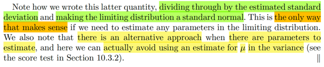</kbd></p>

> [!NOTE]
> cái này có thể khi học về các phần sau sẽ rõ hơn. Nhưng đại khái là gs đề
> cập tới việc, bằng cách chia cho ước lượng của variance, (vì ko biết variance
> thật) thì kết quả trên nó cho ta cơ sở để biện minh cho các kết  luận khác.

<br>

<a id="node-427"></a>

<p align="center"><kbd>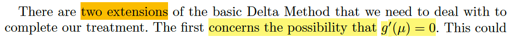</kbd></p>

<p align="center"><kbd>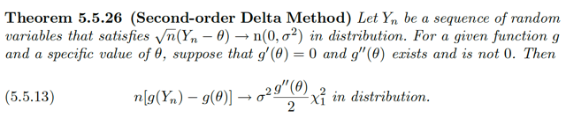</kbd></p>

<p align="center"><kbd></kbd></p>

<p align="center"><kbd></kbd></p>

<p align="center"><kbd>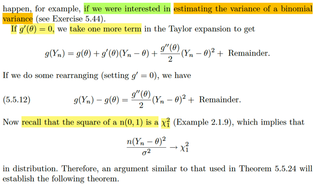</kbd></p>

> [!NOTE]
> Đại khái là mở rộng của `Δ` method theorem.
>
> Trong `Δ` method theorem, ta bắt đầu với giả thiết là ta có chuỗi Y1,...Yn
> sao cho
>
> √n(Yn `-` `θ)` → (d) n(0, `σ^2)`
>
> thì `Δ` method theorem nói rằng nếu có hàm g(t) sao cho `g'(θ)` tồn tại và 
> khác 0 thì: 
>
> ```text
> √n[g(Yn) - g(θ)] sẽ → (d) n(0, σ^2[g'(θ)]^2]
> ```
>
> Thế thì, phiên bản mở rộng của `Δ` method theorem này deal với case
> mà `g'(θ)` `=` 0:
>
> Cụ thể là, dùng Taylor expansion ta có thể ghi rõ hạng tử bậc 2:
>
> ```text
> g(Yn) = g(θ) + g'(θ)(Yn - θ) + g''(θ)(Yn - θ)^2/2 + Remainder
> ```
>
> Lập luận là: giả sử `g'(θ)` `=` 0. Ta có
>
> ```text
> g(Yn) = g(θ) + g''(θ)(Yn - θ)^2/2 + Remainder
> ```
>
> Và ta có thể  bỏ remainder và chuyển sang dùng xấp xỉ: 
>
> ```text
> g(Yn) ≈ g(θ) + g''(θ)(Yn - θ)^2/2
> ```
>
> ```text
> ⇔ g''(θ)(Yn - θ)^2/2 ≈ g(Yn) - g(θ) (1)
> ```
>
> ```text
> Rồi. Theo CLT: √n(Yn - θ)/σ →(d) n(0,1)
> ```
>
> thì cái này bản chất `/` hay nói cách khác là:
>
> ```text
> √n (Yn - θ)/σ  →(d) X ~ (0, 1)
> ```
>
> ```text
> mà phát biểu bằng lời là, khi n → inf thì √n(Yn - θ)/σ sẽ trở nên
> ```
> "giống với" một random variable ~ n(0, 1)
>
> ```text
> Và như vậy, lẽ dĩ nhiên [√n(Yn - θ)/σ]^2 sẽ trở nên giống X^2 với
> ```
> X ~ n(0,1). Hay:
>
> ```text
> n(Yn - θ)^2/σ^2 → Chi-square 1 (2)
> ```
>
> Mà bình phương của một rv thuộc n(0,1) sẽ chính là một rv thuộc
> ```text
> Chi-square_1 \/X\/^2
> ```
>
> Rồi: `g''(θ)` thì là constant, →(p) `g''(θ)` (3)
>
> Vậy thì
>
> ```text
> (1) ta có g''(θ)(Yn - θ)^2/2 ≈ g(Yn) - g(θ)
> ```
>
> ```text
> (2) n(Yn - θ)^2/σ^2 → Chi-square 1
> ```
>
> (3) `g''(θ)` →(p) `g''(θ)`
>
>
> ```text
> (1) ta nhân hai vế cho n: (1) ⇔ g''(θ) n (Yn - θ)^2/2 ≈ n[g(Yn) - g(θ)]
> ```
>
> ```text
> (3) g''(θ) →(p) g''(θ) thì g''(θ) σ^2/2 →(p) g''(θ) σ^2/2 (4)
> ```
>
> Tới đây: 
>
> Dùng (2) và (4):
>
> ```text
> n(Yn - θ)^2/σ^2 → Chi-square 1
> ```
>
> ```text
> g''(θ) σ^2/2 →(p) g''(θ) σ^2/2
> ```
>
> Áp dụng Slusky theorem: Xn →(d) X, Yn →(p) a thì XnYn →(d) aX
>
> ```text
> ⇨  g''(θ) σ^2/2 n(Yn - θ)^2/σ^2 → g''(θ) σ^2/2 Chi-square 1
> ```
>
> ```text
> ⇔ n g''(θ)(Yn - θ)^2 → g''(θ) σ^2/2 Chi-square 1
> ```
>
> Vế trái chính là n[g(Yn) `-` `g(θ)]`
>
> ```text
> ⇨  n[g(Yn) - g(θ)] →(d) g''(θ) σ^2 Chi-square 1 hay σ^2 g''(θ) / 2 \/X_1\/^2
> ```

<br>

<a id="node-428"></a>

<p align="center"><kbd>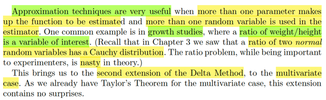</kbd></p>

> [!NOTE]
> Extension thứ hai của `Δ` method là khi deal với multivariate case.
>
> Đại khái là để ta deal với các trường hợp mà ta  cần estimate một tỉ số

<br>

<a id="node-429"></a>

<p align="center"><kbd>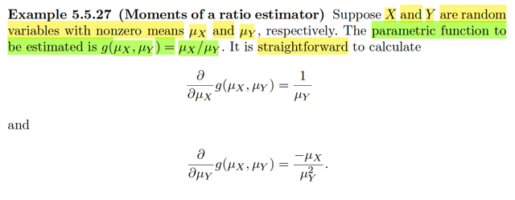</kbd></p>

> [!NOTE]
> Ví dụ này cho X, Y là hai random variable có non zero mean `μX,` `μY.` Và
> ```text
> function cần g(μX, μX) = μX / μY.
> ```
>
> ```text
> Ta có ∂/∂μX g(μX, μY) = 1 / μY
> ```
>
> ```text
> và ∂/∂μY g(μX, μY) = - μX/μY^2
> ```
>
> Là sao? Thì đơn giản đây là tính đạo hàm riêng (partial derivative) thôi
> ko có gì khó

<br>

<a id="node-430"></a>

<p align="center"><kbd>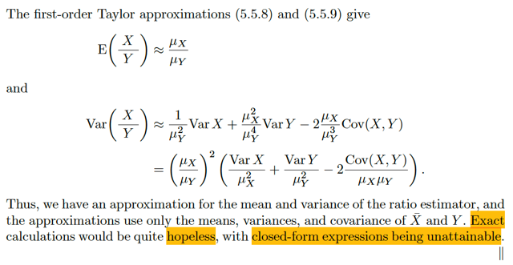</kbd></p>

🔗 **Related:** [5.5 CONVERGENCE CONCEPTS](55_convergence_concepts.md#node-419)

🔗 **Related:** [2.2 EXPECTED VALUE](22_expected_value.md#node-100)

> [!NOTE]
> Áp dụng hai công thức 5.5.8 `/` 5.5.9 (mình đã tự chứng minh nên đã hiểu rồi, ở đây
> cứ xài thôi): Thì đại khái 5.5.8 nói rằng Eg(**T**) ≈ g(**θ**), **T** là vector các rv,
> **θ** là vector các mean `θi` `=` EXi
>
> ```text
> E(g(X,Y)) = E[X/Y] ≈ g([μX, μY]) = μX/μY
> ```
>
> Còn `Var` g(**T**) `=` `Σi=1:k` [g'i(**θ**)]^2 `Var` Ti `+` 2 `Σi>j` `g'i(θ)` `g'j(θ)Cov(Ti,` Tj)
>
> áp dụng vào đây:
>
> ```text
> Var[g(X,Y)] = Var(X/Y)
> ```
>
> ```text
> = ∂/∂x g(μX,μY) Var X + ∂/∂y g(μX,μY) Var Y + 2 ∂/∂x g(μX,μY) ∂/∂y g(μX,μY)
> ```
> `Cov(X,` Y)
>
> ```text
> = (1/μY)^2 Var X + (- μX/μY^2)^2 VarY + 2 (1/μY) Var X (- μX/μY^2) Cov(X, Y)
> ```
>
> ```text
> = (1/μY^2) Var X + (- μX^2/μY^4) VarY + 2 (1/μY) Var X (- μX/μY^2) Cov(X, Y)
> ```
>
> ```text
> = (μX/μY)^2 [VarX/μX^2 + VarY/μY^2 - 2Cov(X,Y)/μXμY]
> ```
>
> Nói chung là như vậy ta có được estimation cho mean và variance của cái ratio
> (chỉ là estimation vì ta dùng Taylor approx.)
>
> Và gs cho biết việc tính tính xác (mean và variance của cái ratio) là ko thể, vì tỉ số
> của hai normal là một random variable thuộc lại Cauchy. mà ta đã biết nó ko có
> mean (xem link xanh)

<br>

<a id="node-431"></a>

<p align="center"><kbd></kbd></p>

> [!NOTE]
> Đại khái là, xét random variable vector **X** `=` (X1,...Xp) có population mean
> và covariance: **μ** `=` `(μ1,` `...μp),` `Cov(Xi,` Xj) `=` `σij`
>
> Rồi, mới lấy random sample size n, từ distribution này **X1, ...Xn**. Dĩ nhiên
> là mỗi vector **Xk,** k `=1,...n` là một random variable vector cũng có p random 
> variable: (Xk1, Xk2...Xkp). Mà ở đây hình như người ta kí hiệu sẽ là:
>
> **X**k `=` (X1k, X2k,...Xpk)
>
> Dĩ nhiên, là như vậy ta sẽ giống như, xét X1k, k `=` 1,...n. Thì nó giống
> như random sample size n của population có mean là `μ1`
>
> ```text
> Rồi, họ mới đặt Xbar_i = (Σk=1:n Xik) / n Có nghĩa là, sample mean của
> ```
> Xi1, Xi2,...,Xin. Tức là random variable phần tử thứ i của các random variable
> vector **X1**,....**Xn**Ta đã có kết quả 5.5.7: g(**t**) ≈ g(**θ**) `+` `Σ` g'i(**θ**)(ti `-` `θi)` 
>
> (cái này đơn giản là linear approx thôi: g(**t**) ≈ g(**θ**) `+` ∇g(**θ**)T(**t** `-` **θ**)
>
> Áp dụng vào đây với **x** `=` (xbar1, xbar2,...xbarp)
>
> ⇨ g(**x**) ≈ g(**μ**) `+` ∇g(**μ**)T(**x** `-` **μ**)

<br>

<a id="node-432"></a>

<p align="center"><kbd></kbd></p>

> [!NOTE]
> QUAY LẠI SAU

<br>

