# 5.6 Generating Random Sample

📊 **Progress:** `35` Notes | `54` Screenshots

---

<kbd>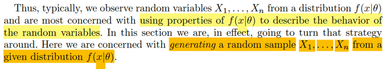</kbd>

<kbd></kbd>

<kbd>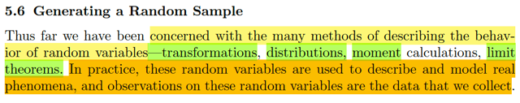</kbd>

> [!NOTE]
> đại khái là hồi nào đến giờ ta đã học các method giúp mô tả hành vi của các
> random variables với các công cụ như transformation, distributions,
> moments, limit theorem.. Và trong thực tế thì random variables sẽ được
> dùng để mô tả và mô phỏng các hiện tượng thực tế. Và giá trị quan sát được
> của chúng là data mà chúng ta thu thập.
>
> Điển hình là ví dụ như ta quan sát các X1,....Xn là random sample từ một
> distribution f(x|θ), thì thường ta sẽ quan tâm đến việc dựa trên các đặc điểm
> của f(x|θ) để mà mô tả hành vi của các random variables.
>
> Thế thì trong phần này, ta sẽ làm ngược lại, đó là ta sẽ quan tâm đến  việc
> tạo ra (generating) một random sample từ một distribution f(x|θ) cho trước

 

<kbd>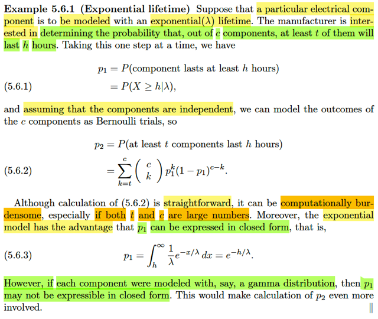</kbd>

> [!NOTE]
> Đại khái là lấy ví dụ như (thời gian còn chạy được) của một cái thiết bị điện
> tử  sẽ  được mô phỏng bởi rv ~ exponential(λ).
>
> Và nhà sản xuất quan tâm đến cái này: Xác suất của việc trong lô hàng có c
> cái thì có ít nhất t cái là có thời gian xài được lớn hơn h giờ.
>
> Thế thì, nếu ta xét một "cái" (thiết bị), như đã nói, ta sẽ dùng random variable
> X làm thời gian cháy của nó, sẽ là một expo(λ), thì xác suất mà thời gian
> thiết bị này còn xài được  vượt qua h giờ sẽ là P(X ≥ h | λ). Gọi đây là p1
>
> Thế thì, bây giờ ta xét c cái thiết bị, mà thời gian "sống" của chúng sẽ được
> đại diện bởi X1,.....Xc. Và ta giả định rằng các thiết bị này độc lập nhau,
> tức X1,X2.....Xc independent.
>
> Khi đó, event có ít nhất  t cái trong số đó thọ hơn h giờ sẽ là event: có ít 
> nhất t random variable trong đám X1,...Xc lớn hơn h.
>
> Nhưng cách nhìn dễ hơn, là ta quan tâm đến Y là tổng số các rv trong đám
> đó có giá trị  ≥ t. Khi đó ta có thể nhìn thấy mô hình quen thuộc, khi ta có
> một chuỗi các Bern trial: X1 ≥ h, X2 ≥ h,...Xc ≥ h. Các trial này độc lập do đã
> giả định X1,...Xc độc lập.
>
> Và vì các X1,...Xc đều có chung distribution expo(λ), nên P(X1 ≥ h), P(X2 ≥ h),
> ....đều bằng nhau, và bằng p1.
>
> Như vậy ta có chuỗi Bern(p1) iid. và U là số trial success ⇨  U sẽ ~ binomial(c, p1)
>
> Và xác suất có ít nhất t thiết bị còn chạy được sau h giờ trong tổng số c thiết
> bị, sẽ chính là xác suất của event Y ≥ t
>
> Áp dụng pmf của Binomial(n, p): P(X=k) = (n choose k) p^k(1-p)^(n-k)
> ta có:
>
> P(U ≥ t) = Σk=t,t+1,....c P(Y=k)
>
> = **Σk=t,t+1,....c (c choose k) p1^k(1-p1)^(c-k) Đây là công thức 5.6.2**====
> ****Vậy thì đại ý muốn nói ở đây là: Dù công thức rõ ràng là vậy, nhưng tính toán
> ra P(U ≥ t) như này có thể khó. Vì nó dính đến giai thừa trong đó.
>
> Bên cạnh đó, ở đây thì p1 có thể tính được, nhưng trong case khác chưa chắc
> Cụ thể là ở đây như đã nói p1 = P(X ≥ h | λ) với X ~ expo(λ) thì ta có:
>
> P(X ≥ h | λ) = ∫h:inf fX(x)dx = ∫h:inf (1/λ) e^-x/λ dx và cái này thì tính ra được:
>
> = (1/λ)  ∫h:inf e^-x/λ dx = (1/λ) [nguyên hàm của e^-x/λ] |h:inf
>
> = (1/λ) [-λ e^-x/λ] |h:inf = (1/λ) (-λ) [e^-x/λ] |h:inf 
>
> = - [e^-x/λ] |h:inf 
>
> x → h ⇨ e^-x/λ → e^-h/λ
>
> x → inf ⇨ e^-x/λ → 0
>
> ⇨ - [e^-x/λ] |h:inf = -[ - e^-h/λ] = e^-h/λ
>
> Nhưng ý chính là nếu ta chọn mô phỏng X bởi Γ  distribution thì có thể sẽ không
> tính được p1 ở dạng close form như thế này

 

<kbd>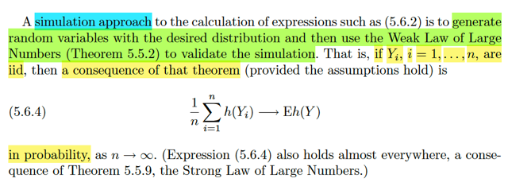</kbd>

🔗 **Related:** [5.5 CONVERGENCE CONCEPTS](55_convergence_concepts.md#node-403)

> [!NOTE]
> đại khái cách tiếp cận khác, gọi là simulation approach sẽ giúp tính cái
> 5.6.2 theo cách khác. Bằng cách tạo ra các random variables với distribution
> mong muốn, và sau đó, ta sẽ dùng WLLN để validate chúng.
>
> Đó là, nếu Y1,....Yn là các random variables iid, thì một hệ quả của theorem
> này đó là:
>
> (1/n) Σi h(Yi) → Eh(Y) in probability.
>
> Chỗ này ôn lại tí, WLLN nói rằng: nếu ta có X1,X2,....Xn có EXi = μ, VarXi = σ^2 
> < inf thì:
>
> khi n → inf thì sample mean size n Xnbar → μ in probability, thể hiện bởi:
>
> lim n → inf P(|Xnbar - μ| < ε ) = 1 với ε bất kì
>
> Vậy thì: ko khó chứng minh cái hệ quả:
>
> là nếu Y1,...Yn iid thì h(Y1), ...h(Yn) cũng iid
>
> và đều có population mean là Eh(Y1) = Eh(Y2) = ...Eh(Y)
>
> Áp dụng LLN ta sẽ có sample mean size n cũng sẽ converge in probability
> về population mean:
>
> (1/h) Σi h(Yi) → Eh(Y) in probability.

 

<kbd>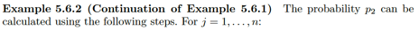</kbd>

<kbd></kbd>

<kbd>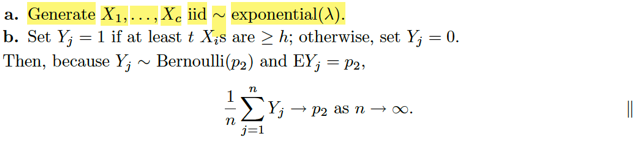</kbd>

> [!NOTE]
> Và cách làm / cách tiếp cận simulation để tính p2 hồi nãy, (thay vì dùng
> công thức 5.6.2 
>
> P(Y ≥ t) = Σk=t,t+1,....c (c choose k) p1^k(1-p1)^(c-k) 
>
> Thì ta sẽ làm như sau: 
>
> Ý tưởng là, ta đang muốn tính p2. Vậy, nếu như có cái gì đó mà khi
> n → inf thì nó → p2 thì ta sẽ dùng được.
>
> p2 là gì nói lại: là P(U ≥ t), xác suất trong c cái thiết bị có ít nhất t cái
> xài được quá h giờ.
>
> Vậy thì hồi nãy mình gọi U = số Bern(p1) trial success trong c trial
> nên U ~ binomial(c, p1)
>
> Thế thì nếu mình xét Y là random variable định nghĩa như sau: Nếu 
> trong c components đó thỏa yêu cầu có t cái sống dai hơn h giờ thì
> cho Y = 1, ngược lại cho Y = 0. Rõ ràng Y sẽ là Bern rv. Và tham số
> của nó, là xác suất trong c cái có t cái ok, thì chính là p2. Do đó, dĩ
> nhiên Y ~ Bern(p2)
>
> Mà với Bern thì EY = p2
>
> Vậy áp dụng hệ quả theorem ở trên:
>
>  nếu Y1,....Yn iid thì (1/n) Σi h(Yi) →(p) Eh(Y)
>
> mà cụ thể hàm h ở đây hoàn toàn có thể là h(v) = v, tức identity 
> function
>
> Và cách áp dụng là: cái hệ quả trên nó biện minh cho cách làm:
>
> Cứ liên tục tạo các random sample X1,...Xc iid ~ expo(λ)
>
> Với mỗi random sample thứ j như vậy, tính Yj = 1 hoặc 0 tùy theo
> việc trong random sample đó có đủ t cái đạt yêu cầu hay không.
>
> Thì dĩ nhiên tương ứng với chuỗi các random sample từ 1 đến n
>   ta cũng có chuỗi Y1,.....Yn với n kéo dài → inf
>
> Và các Y1,...Yn đều độc lập nhau, đều cùng là Bern(p2) rv. Nên
> chúng iid. Và cái hệ quả theorem trên nói rằng sample mean của
> chúng sẽ converge về EYj, tức là p2  thì NHƯ VẬY CÓ NGHĨA LÀ
> TA TẠO CÀNG NHIỀU RANDOM SAMPLE, ĐỂ CÓ CHUỖI Y1,...Yn
> CÀNG DÀI THÌ TÍNH MEAN CỦA ĐÁM NÀY: (Σi=1:n Yi)/n SẼ NGÀY
> CÀNG XẤP XỈ TỐT CHO p2.
>
> Và đó chính là cách tìm p2 bởi SIMULATION APPROACH

 

<kbd>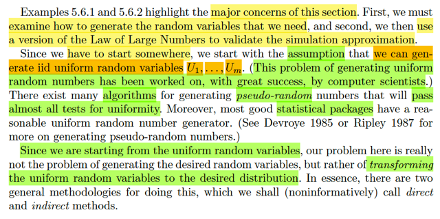</kbd>

> [!NOTE]
> đại khái là như vậy cách làm sẽ là, đầu tiên ta tìm cách tạo ra các random
> variable mà ta cần, rồi dựa vào luật số lớn để biện minh. Ví dụ như trong
> ví dụ vừa rồi, ta sẽ tạo ra các Y1,....Yn (mà bằng cách là tạo các random
> sample size c: X1,...Xc) và tính sample mean của đám Y1,...Yn, thì n càng
> lớn thì cái này nó sẽ → p2 là cái ta cần
>
> Thế thì gs mới nói rằng, ta sẽ phải dựa trên một giả định khác, rằng ta có
> thể tạo ra các random variables U1,...Um thuộc loại Uniform. (mà giả định
> này được hậu thuẫn bởi trong thực tế máy tính, có nhiều thuật toán đảm
> bảo là có thể tạo ra các random variable coi như y như từ Uniform thật vậy
> (ta gọi là pseudo random)
>
> Như vậy, chỉ cần có được cách thức làm sao tạo ra được các random
> variable từ distribution mà ta muốn (ví dụ X1,...Xc ~ Bern(p1)) TỪ CÁC
> U1,U2...từ Uniform thì ta sẽ có thể giải quyết được vấn đề
>
> Do đó mới nói, bài toán đặt ra thật sự sẽ là: làm sao transforming các
> random variable uniform thành bộ random variable theo distribution mà ta
> muốn

 

<kbd>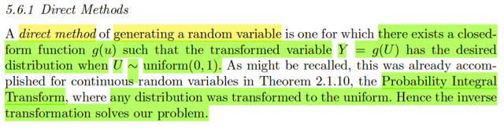</kbd>

🔗 **Related:** [2.1 DISTRIBUTION](21_distribution.md#node-94)

🔗 **Related:** [9.2 METHODS OF FINDING INTERVAL ESTIMATORS](92_methods_of_finding_interval_estimators.md#node-789)

> [!NOTE]
> đại khái là đầu tiên ta xét method có tên là Direct method. Phương pháp
> này dành để mà ta generate random variable khi mà tồn tại một closed
> form function g(u) sao cho cái transformed variable Y = g(U) với U ~ unif(0,1)
> có một distribution mong muốn.
>
> Thế thì gs nhắc lại rằng theorem 2.1.10 ta đã biết, nó nói rằng: Nếu gọi X 
> là random variable có cdf FX(.), thì random variable có được bằng cách apply
> hàm FX(.) lên X, tức U = FX(X), sẽ là một random variable ~ Uniform(0,1)
> Dừng lại chỗ này một chút để nhớ lại lời giảng của giáo sư Blizstein trong
> Stat110: khi apply một function lên một random variable ta sẽ được một random
> variable, và FX là function, nên dĩ nhiên FX(X) hoàn toàn hợp lệ là một random
> variable.
>
> Chưa hết, theorem cũng cho biết, nếu ta có random variable U ~ uniform(0,1)
> thì  F_inv(U) sẽ là rv ~ F(.), tức là, bằng cách lấy inverse của cdf function F(.)
> nào đó và apply lên U, thì ta sẽ có một random variable của distribution với
> cdf là F đó.
>
> Trong phần đó cũng bàn về việc nếu hàm F không phải là hàm strictly increasing
> thì ta hàm Finv sẽ không well-defined, khi có thể có nhiều x mà cho ra cùng 
> F(x), khi đó bằng cách define hàm Finv khác chút xíu: Finv = inf x {x: F(x) ≥ y}
> thì ta sẽ giải quyết được vấn đề.
>
> Như vậy thì ở đây thử chứng minh lại cái theorem trên cho nhớ:
>
> 1) X ~ FX(.) ⇨ U = FX(X) ~ uniform(0,1):
>
> Xét  U = FX(X), CDF của U, theo định nghĩa, là FU(u) = P(U ≤ u).
>
> Xét event U ≤ u ⇔ FX(X) ≤ u thì về bản chất nó là:
>
> {s ∈ Ω: U(s) ≤ u} = {s ∈ Ω: [F(X)](s) ≤ u}
>
> mà U, X là function, nên U(s) = [F(X)](s) và cũng bằng F(X(s)) 
>
> (Ví dụ giống như ta có: f(s) = s^2/2 và f thì lại là g(k(.)) với công thức là g(t) = t/2, và 
> k(v) = v^2 ⇨ g(k(.))(s) = g(k(s)) = g(s^2) = s^2/2. Đây là cái gọi là composition 
> function)
>
> Thế thì {s ∈ Ω: [F(X)](s) ≤ u} = {s ∈ Ω: F(X(s)) ≤ u} (1)
>
> Tiếp tục, lại xét F(X(s)) ≤ u, khi F strictly increasing (khiến FXinv well defined) hoặc 
> khi F không strictly increasing và ta define FXinv = inf {x: F(x) ≥ y} (*) thì ta sẽ có:
>
> F(X(s)) ≤ u ⇔ Finv(F(X(s)) ≤ u) ≤ Finv(u) ⇔ X(s) ≤ Finv(u)
>
> ⇨ (1) = {s ∈ Ω: X(s)≤ Finv(u)} 
>
> FU(u) = P(U ≤ u) theo định nghĩa của probability function:
>
> = P({s ∈ Ω: U(s) ≤ u})
>
> = P({s ∈ Ω: F(X(s)) ≤ u})
>
> = P({s ∈ Ω: X(s)≤ FXinv(u)})
>
> và tới đây cái ta có chính là P(X ≤ Finv(u)), và theo định nghĩa cdf, nó chính là
> FX(FXinv(u)), và dĩ nhiên kết quả là: u
>
> Vậy P(U ≤ u) = u, điều này đã đủ để cho thấy U ~ uniform (0,1) vì cdf có thể giúp
> kết luận distribution.
>
> ====
>
> Chứng minh nếu U ~uniform(0,1), Finv(U) ~ F(.)
>
> Xét X = Finv(U). CDF của X, theo định nghĩa, là P(X ≤ x)
>
> mà X ≤ x  bản chất là {s ∈ Ω: X(s) ≤ x} = {s ∈ Ω: [Finv(U)](s) ≤ x}
>
> = {s ∈ Ω: Finv(U(s)) ≤ x}
>
> = {s ∈ Ω: (U(s)) ≤ F(x)} | do Finv(U(s)) ≤ x ⇔ U(s) ≤ F(x) với (*) 
>
> ⇨ P(X ≤ x) = P({s ∈ Ω: Finv(U(s)) ≤ x}) = P({s ∈ Ω: (U(s)) ≤ F(x)} )
>
> và đây chính là P(U ≤ F(x))
>
> và theo định nghĩa của CDF: đây chính là FU(F(x)), mà với U là uniform(0,1),
> FU(u) = u. Từ đó ta có FU(F(x)) = F(x)
>
> Vậy P(X ≤ x) = P(U ≤ F(x)) = F(x)
>
> đã đủ kết luận rằng X chính là random variable ~ cdf F. Chứng minh xong

 

<kbd>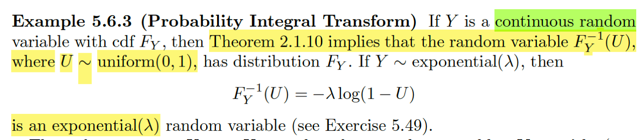</kbd>

> [!NOTE]
> Rồi, ví dụ này, áp dụng theorem 2.1.10, với cdf FY, thì FY_inv(U) với U ~
> uniform(0,1) sẽ là một random variable ~ FY Thì dĩ nhiên ở đây nếu FY là
> cdf của expo(λ) thì FY_inv(U) chính là một random variable ~ expo(λ)
>
> Mà cdf của exponential (λ) đã biết là FY(y) = 1 - e^-y/λ
>
> xem inverse của nó là gì: y = 1 - e^-x/λ ⇔ 1 - y = e^-x/λ ⇔ log[1 - y] = -x/λ
>
> ⇔ x = - λ log[1 - y] 
>
> ⇨ finv(y) = - λ log[1 - y] 
>
> Vậy FY_inv(U) = -λ log[1 - U]

 

<kbd>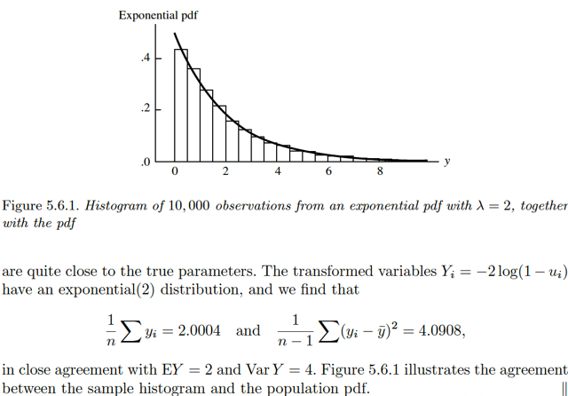</kbd>

<kbd></kbd>

<kbd>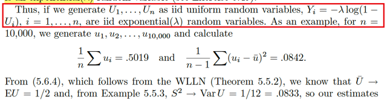</kbd>

🔗 **Related:** [5.5 CONVERGENCE CONCEPTS](55_convergence_concepts.md#node-395)

> [!NOTE]
> Như vậy, khi ta tạo ra n U1,...Un iid random variable ~ uniform(0,1) (vốn dĩ có
> thể  làm được bằng các thuật toán pseudo-random của máy tính) thì các Yi =
> -λlog(1 - Ui) sẽ là n iid random variable "sampling" từ một population thuộc loại
> expo(λ)
>
> Đây là điều rất quan trọng, vì nó cho ta công cụ để là generate một bộ random
> sample từ một distribution MONG MUỐN.
>
> Thế thì họ mới tính ra sample mean của Ui, là .5019, và sample variance là 0.
> 0842 và theo Weak Law Large of Number ta đã biết sample mean sẽ → in
> probability và true mean (population mean), mà với population distribution của
> Ui là unform(0,1) thì mean là 0.5
>
> (Dễ mà, EX = ∫-inf:inf xfX(x)dx vói fX(x) là pdf của uniform(0,1). Ta nhớ với
> uniform(a,b) thì pdf của nó: fX(x) = c = 1/(b-a) ⇨ với uniform(0,1), fX(x) = 1 ⇨
> EX = ∫-inf:inf x dx = ∫0:1 dx = x^2/2|0:1 = (1/2) x|0:1 = 1/2)
>
> Còn từ ví dụ 5.5.3  ta cũng đã có kết luận là sample variance S^2 →(p)  Var(U)
> (xem link cam)
>
> Mà Var(U) bằng mấy ? TÍnh lại không khó:  Var(U) = EU^2 - (EU)^2
>
> (xuất phát từ công thức thứ nhất VarU = E[U - EU]^2 = E[U^2 - 2UEU +
> (EU)^2]
>
> = EU^2 - 2E(UEU) + E[(EU)^2]
>
> = EU^2 - 2(EU)^2 + (EU)^2 = EU^2 - (EU)^2
>
> EU^2 = (theo lotus, EgX = ∫-inf:inf g(x)fX(x)dx)
>
> = ∫0:1 u^2 fU(u)dt = ∫0:1 u^2 dt = [nguyên hàm của u^2/2]|0:1
>
> = u^3/3|0:1 = 1/3
>
> ⇨ VarU = 1/3 - (1/2)^2 = 1/3 - 1/4 = (4 - 3) / 12 = 1/12 =0.0833
>
> Như  vậy hai kết qủa sample mean và sample variance với n= 10000 khá gần
> với true mean và variance. Và nếu n lớn hơn thì nó sẽ ngày càng sát
>
> Tương tự với sample mean của Yi, và sample variance của Yi. Đây là minh
> họa cho thấy rằng, à đúng là  thực tế cho thấy thật sự Yi là ~ expo(λ)

 

<kbd>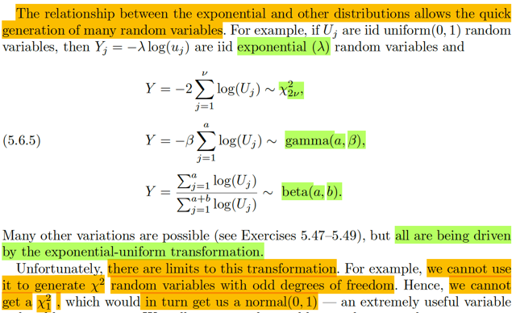</kbd>

> [!NOTE]
> Và tương tự, với các inverse cdf FY_inv, của  các cdf FY khác (như của
> Chisquare, γ, β) thì ta cũng có thể dùng cách này để generating random
> sample v với các distribution đó
>
> NHƯNG METHOD NÀY CÓ HẠN CHẾ, ĐÓ LÀ NÓ KO THỂ GIÚP  TẠO
> RA CHI-SQUARE CÓ ORDER LẺ. (ta sẽ nó về cái này sau)
>
> Nhưng ý chính là, néu ko thể tạo ra random variables từ Chi-square bậc
> lẻ  thì cũng ko thể tạo ra random variable từ NORMAL(0,1). Trong khi cái
> này là rất quan trọng. Do đó ta cần cách tiếp cận khác

 

<kbd>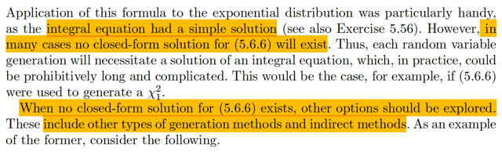</kbd>

<kbd></kbd>

<kbd>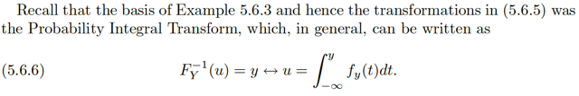</kbd>

> [!NOTE]
> đại khái hiểu thế này: trong ví dụ vừa rồi, ta có cdf của expo(λ) FY, để 
> mà tìm ra Finv, từ đó chỉ việc bỏ Ui vào là ta có Yi từ expo(λ) mong muốn.
>
> Và cái cdf của expo(λ), tất nhiên theo định nghĩa, của cdf, FY(y) = P(Y ≤ y)
> = P(y ∈ (-inf, y)) = ∫-inf:y fY(t)dt. 
>
> Và ý chính muốn nói, với fY(t) là pdf của expo(λ), thì việc giải cái tích phân
> này để có kết quả là cdf của FY dưới dạng closed form là dễ.
>
> Nhưng điều này không xảy ra với mọi pdf khác. Có nghĩa là, có khi ta có pdf
> của một distribution nào đó mà giải cái tích phân trên không được. Như
> vậy ko tìm được cdf F ở dạng closed form và từ đó ko có Finv
>
> Nói rõ hơn một chút:
>
> Gỉa sử ta xét cdf mong muốn F, thì theo định nghĩa FY(k) = P(Y ≤ k)
>
> = ∫-inf:k fY(t)dt với fY là pdf 
>
> Vậy thì giả sử đã đã có u, là giá trị của một random variable U ~uniform(0,1)
> và ta sẽ như trên, bỏ vào Finv để có y, và y sẽ là random variable ~ F:
>
> Finv(u) = y
>
> Thì thật ra, ko phải lúc nào ta cũng có Finv(.) ở dạng closed form mà bỏ u
> vào để tính ra
>
> Khi đó Finv(u) = y sẽ tương đương với giải: u = F(y) = P(Y ≤ y) = ∫-inf:y fY(t)dt
>
> có nghĩa là, biết u, biết fY, thì để có y ta phải giải cái phương trình tích phân này
> u = ∫-inf:y fY(t)dt
>
> Thế mà giải cái phương trình tích phân này thì ko phải lúc nào cũng dễ dàng,
> có khi rất chua.
>
> Khi đó không xài cách này được.

 

<kbd>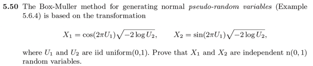</kbd>

> [!NOTE]
> Bài toán đặt ra là cho U1, U2 là hai iid uniform(0,1). Cần chứng minh X1,X2 là iid n(0,1)
>
> Vài suy nghĩ: ở đây họ cho mình hai rv U1,U2 đã biết distribution,  và yêu cầu chứng minh
> distribution của X1,X2. Có vẻ như cách tiếp cận gần nhất chính là transformation theorem
>
> Nhớ lại, theo cách tiếp cận đó, thì ta sẽ lập luận như vầy:
>
> Ta có X, Y là hai random variable, tạo thành random variable vector (X,Y) có joint pdf fX,Y. Và trên cơ
> sở đó ta có thể tìm được joint distribution của  U,V liên hệ với X, Y bởi: U = g1(X, Y), V = g2(X, Y)
>
> Thế thì, điều kiện để có thể dùng transformation theorem, là: mapping giữa A_curly và ảnh của nó,
> phải là mapping 1-1. Trong đó A_curly là support set của fX,Y, tức là tập này: {(x, y) ∈ R^2: fX,Y(x, y)
> ≥ 0} và ảnh của nó, là  tập này: {(u,v) ∈ R^2: (u,v) = (g1(x,y), g2(x,y)) for some (x,y) in A_curly}
>
> Điều kiện trên vẫn cho phép có (x,y) nào đó không thuộc A_curly map với (u,v) thuộc
> image(A_curly), miễn là với (x,y) thuộc A_curly thì chỉ có một (u,v) thuộc image(A_curly) và ngược
> lại.
>
> Lí do để cần phải có điều kiện này là vì: Khi đó, với (u,v) = (g1(x,y), g2(x,y)) thì tồn tại một (x,y) duy
> nhất thuộc A_curly (x,y) = (h1(u,v), h2(u,v)) (có thể vẫn tồn tại (x,y) khác mapping ngược lại từ (u,v)
> ko nằm trong A_curly, nhưng khi đó ta không care vì fX,Y(x,y) tại đó = 0.
>
> Và khi đó ta có theorem:
>
> fU,V(u,v) = fX,Y(x,y) |∂(x,y)/∂(u,v)|
>
> = fX,Y(h1(u,v), h2(u,v)) |∂(h1(u,v), h2(u,v))/∂(u,v)|
>
> Mà ở đâu ra ta có theorem này, hay chứng minh theorem này thì có lẽ mình sẽ ôn lại sau
>
> Ở đây ta có U1, U2 ~ uniform(0,1) iid. ⇨ joint pdf: fU1U2 = tích marginal pdf fU1(u1)fU2(u2) = 1 (pdf
> của uniform(0,1) fX(x) = 1/(b-a) = 1/1 = 1)
>
> Xét mapping g1, g2:
>
> (1) X1 = cos(2πU1) √-2logU2 ;
>
> (2) X2 = sin(2πU1) √-2logU2
>
> ⇔ X1^2 + X2^2 = -2 logU2 [cos^2(2πU1) + sin^2(2πU2)] = -2logU2
>
> ⇨ log(U2) = -(X1^2 + X2^2)/2
>
> ⇔ U2 = e^[-(X1^2 + X2^2)/2]. Đây chính là U2 = h2(X1,X2)
>
> Còn U1: lấy (1) chia (2) vế theo vế:
>
> X1/X2 = cos(2πU1) / sin(2πU1) = tan(2πU1)
>
> ⇔ 2πU1 = arctan(X1/X2)
>
> ⇔ U1 = arctan(X2/X1) / 2π. Đây chính là U1 = h1(X1,X2)
>
> Đến đây thử xem mapping (U1,U2) → (X1,X2) có 1-1 không:
>
> Câu trả lời là có vì với  một cặp X,Y ta giải ra được
>
> U1,U2 = arctan(X1/X2) / 2π, e^[-(X1^2 + X2^2)/2]
>
> Tiếp theo cần tìm Jacobian:
>
> ∂u1/∂x1: ∂/∂x1 arctan(x2/x1) / 2π = (1/2π) ∂/∂(x2/x1) arctan(x2/x1) . ∂/∂x1 (x2/x1)
>
> = (1/2π) 1/[1+(x2/x1)^2] . (-x2/x1^2)
>
> = (1/2π) 1/[(x2^2 + x1^2)/x1^2] . (-x2/x1^2)
>
> **= (1/2π) -x2/(x2^2 + x1^2)**
>
> ∂u1/∂x2: (1/2π) ∂/∂x2 arctan(x2/x1) = (1/2π) ∂/∂(x2/x1) arctan(x1/x2) . ∂(x2/x1)/∂x2
>
> = (1/2π) 1/[1+(x2/x1)^2] . (1/x1)
>
> = (1/2π) 1/[(x2^2 + x1^2)/x1^2] (1/x1)
>
> **= (1/2π) x1/(x2^2 + x1^2)**
>
> ∂u2/∂x1: ∂/∂x1 e^[-(x1^2 + x2^2)/2]
>
> = ∂/∂[-(x1^2 + x2^2)/2] e^[-(x1^2 + x2^2)/2] . ∂/(x1^2 + x2^2) [-(x1^2 + x2^2)/2] . ∂/∂x1 (x1^2 + x2^2)
>
> = e^[-(x1^2 + x2^2)/2]  . -1/2 . 2x1
>
> = -x1 e^[-(x1^2 + x2^2)/2] = **-x1u2** 
>
> ∂u2/∂x2: ∂/∂x2 e^[-(x1^2 + x2^2)/2]
>
> = -x2 e^[-(x1^2 + x2^2)/2] = **-x2u2**⇨ |det J| = |∂u1/∂x1 . ∂u2/∂x2 - ∂u1/∂x2 . ∂u2/∂x1|****= (1/2π) [-x2/(x2^2 + x1^2)] (-x2u2) - (1/2π) x1/(x2^2 + x1^2) . (-x1u2)
>
> = (1/2π) [x2^2/(x2^2 + x1^2)] (u2) + (1/2π) x1^2/(x2^2 + x1^2) (u2)
>
> = (1/2π) (x1^2+x2^2) / (x2^2 + x1^2)] (u2) 
>
> = **(1/2π) u2
>
> Transformation theorem:**fX1,X2(x1,x2) = fU1,U2(u1,u2) |det J| = 1 (1/2π) u2 = (1/2π) u2 = (1/2π) e^[-(x1^2 + x2^2)/2]
>
> ⇨ fX1,X2(x1,x2) = (1/2π) e^[-(x1^2 + x2^2)/2]
>
> = (1/2π) e^(-x1^2) e^(-x2^2)/2   | do e^(a+b) = e^a . e^b
>
> Thế thì, ta đã từng có một bổ đề, nói rằng nếu joint pdf của X,Y mà có thể được thể hiện bởi
> tích của hai hàm số g1, g2 của riêng lẻ từng biến. Thì đã đủ để cho kết luận X,Y độc lập.
>
> Ở đây fX1,X2(x1,x2) có thể được tách thành tích của f1(x1) f2(x2) ⇨ theo bổ đề này thì kết luận
> X1,X2 độc lập.
>
> Dĩ nhiên ta sẽ có thể kết luận luôn là X1, X2 ~ normal(0,1) vì (1/√2π) e^(-x1^2) chính là pdf của n(0,1)

 

<kbd>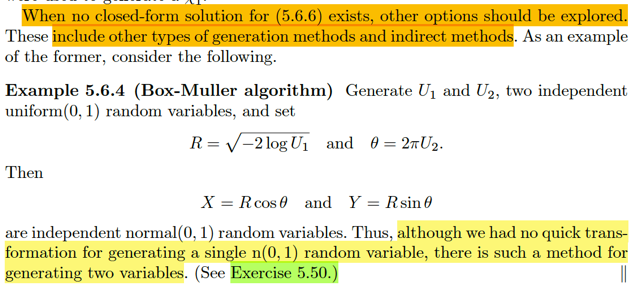</kbd>

> [!NOTE]
> Vậy thì đại khái ở đây họ nói đến cái gọi là Box-Muller algorithm, với việc ta 
> có thể tạo U1, U2 là uniform(0,1) rvs thì thông qua biến đổi X = Rcos θ,
> Y = R sin θ với R = √(-2 log U1) và θ = 2πU2 thì X,Y chính là hai normal(0,1)
> Phần chứng minh thì chính là bài tập 5.50 mình vừa làm xong

 

<kbd>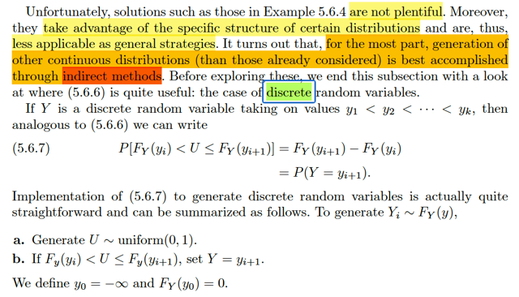</kbd>

> [!NOTE]
> Đại khái ở đây muốn nói, tuy là trong thuật toán Box Muller vừa rồi, ta  có
> thể dùng để generate rv ~ n(0,1) nhưng không phải lúc nào cũng được
> như vậy (ý là, muốn generate theo distribution khác thì sao?)
>
> Do đó PHẦN LỚN TRƯỜNG HỢP ta sẽ dùng INDIRECT method.
>
> Tuy nhiên trước khi qua method này thì ta sẽ xét bối cảnh các biến là
> discrete. Lúc này, direct method phát huy tác dụng tốt
>
> Nhớ lại, cái direct method bắt nguồn từ / được dựa trên theorem:
>
> Nếu U ~ uniform(0,1) thì FY_inv(U)  ~ FY
>
> và nếu X ~ FX thì FX(X) ~ uniform(0,1)
>
> Và cụ thể hơn là nó dựa vào vế trên. Để rồi bằng cách generate các
> uniform(0,1) rv nhờ các pseudo-random algorithm, ta có thể bỏ nó vào
> F_inv của một cdf  F mong muốn, thì ta sẽ có được random variable từ
> distribution ~ cdf F đó
>
> Vậy thì nhắc đến 5.6.6 thì cái đó nói là vầy:
>
> Gỉa sử ta xét cdf mong muốn F, thì theo định nghĩa FY(k) = P(Y ≤ k)
>
> = ∫-inf:k fY(t)dt với fY là pdf
>
> Vậy thì giả sử đã đã có u, là giá trị của một random variable U ~uniform(0,
> 1) và ta sẽ như trên, bỏ vào Finv để có y, và y sẽ là random variable ~ F:
>
> Finv(u) = y
>
> Thì thật ra, ko phải lúc nào ta cũng có Finv(.) ở dạng closed form mà bỏ u
> vào để tính ra
>
> Khi đó Finv(u) = y sẽ tương đương với giải: u = F(y) = P(Y ≤ y) = ∫-inf:y
> fY(t)dt
>
> có nghĩa là, biết u, biết fY, thì để có y ta phải giải cái phương trình tích
> phân này u = ∫-inf:y fY(t)dt
>
> Thế mà giải cái phương trình tích phân này thì ko phải lúc nào cũng dễ
> dàng, có khi rất chua.
>
> Quay lại đây, đại ý là với discrete random variable thì mọi chuyện dễ hơn
>
> Rồi, giả sử với Y ~ FY là discrete distribution, có các discrete possible
> value yi
>
> Thế thì, như trên đã nhắc lại, để generate các rv ~FY, ta sẽ bỏ u là giá trị
> cụ thể của random variable uniform(0,1) vào FYinv(.) thì ta sẽ có một giá
> trị cụ thể của một rv Y ~ FY. Tuy nhiên như đã nói, bản chất là ta cũng
> đang giải phương trình: u = FY(y) = P(Y ≤ y)
>
> Có nếu như với biến liên tục thì P(Y ≤ y) = ∫-inf:y fY(t)dt là một tích phân
> khiến việc giải phương trình tìm ra y sẽ rất khó.
>
> Thì với biến rời rạc thì P(Y ≤ y) nó sẽ là MỘT CÁI TỔNG: Σ{yi ≤ y} P(Y=yi)
>
> Do đó việc giải u = FY(y) ⇔ u = Σ{yi ≤ y} P(Y=yi)
>
> Chú ý là ta đang tìm y và đã biết u rồi.
>
> Thế thì ngẫm một chút về cái phương trình u = Σ{yi ≤ y} P(Y=yi) mà xem: 
>
> Nói bằng lời thì cái ta cần tìm là: Những cái yi nào mà tổng P(Y=yi) bằng u
> thì mình sẽ lấy y là cái thằng yi lớn nhất đó. 
>
> Ví dụ như ta có y1,y2,y3 và fY(y1) = 0.2 fY(y2) = 0.3 fY(y3) = 0.5
>
> Và u = 0.5, vậy thì y sẽ phải bằng y2, vì khi đó vế phải là Σ{yi≤y2} P(Y=yi)
> = fY(y1) + fY(y2) = 0.2 + 0.3 = 0.5
>
> Nếu u = 0.6 thì sao? thì ko có y nào thỏa cả, nhưng người ta sẽ lấy y=y3
> tóm lại đại khái là ta sẽ tìm yi và yi+1 sao cho FY(yi) < u ≤ FY(yi+1) thì khi 
> đó chọn y=yi+1
>
> Đó chính là thuật toán Discrete Inverse Transform.
>
> Nôm na hình ảnh sẽ là, ta sẽ cộng dồn pmf, cũng chính là tính cdf tại
> các mốc (possible value yi). Sau đó, generate uniform(0,1), để có giá trị
> u. Xem u nằm trong đoạn (FY(yi), FY(yi+1)] nào thì lấy y = yi+1 đó (đóng
> vai trò là một giá trị của một random variable với distribution cdf F mong
> muốn)

 

<kbd>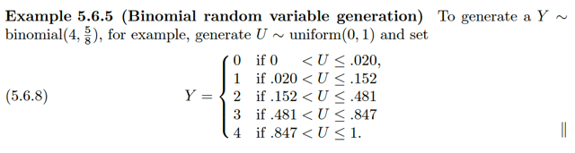</kbd>

> [!NOTE]
> Ví dụ này giúp là rõ hơn:
>
> Ta cần generate Y ~ binomial(4, 5/8) (nhớ lại, story của binomial(n, p) là
> số trial thành công trong chuỗi n các iid Bern(p) trial)
>
> pmf của binomial: P(Y=k) = (n choose k)p^kq^(1-k). Dựa vào n = 4, p = 5/8
> ta sẽ tính ra các pmf tại k=0,1,2,3,4. Và tính cộng dồn để có các cdf tại
> đó. Và thực hiện generate uniform(0,1). Để rồi, u nằm trong đoạn nào thì
> lấy y là mốc trên của đoạn đó

 

<kbd>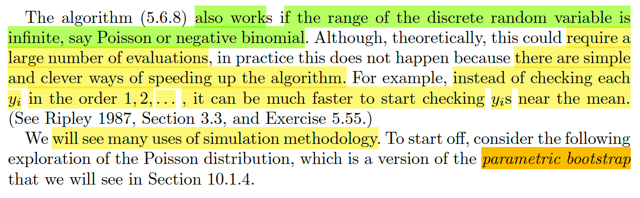</kbd>

 

<kbd>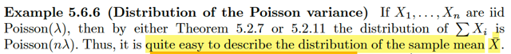</kbd>

🔗 **Related:** [5.2 Σ OF RANDOM VARIABLES FROM A RANDOM SAMPLE](52_σ_of_random_variables_from_a_random_sample.md#node-348)

🔗 **Related:** [5.2 Σ OF RANDOM VARIABLES FROM A RANDOM SAMPLE](52_σ_of_random_variables_from_a_random_sample.md#node-354)

> [!NOTE]
> Đại khái là ví dụ này, đầu tiên người ta nói rằng với X1,...Xn là iid Poisson(λ) thì
> dùng các Theorem trước đây (theo link) thì sẽ có thể kết luận ΣXi là một
> Poisson (nλ). Thì từ đó ta có thể có distribution của sample mean. Là sao, ôn lại
> chỗ này.
>
> Đầu tiên nới X1,...Xn là một random sample size n từ một distribution F nào đó
> có nghĩa là ta có một biến số nào đó, và ta tiến hành quan sát giá trị của nó n
> lần. Giá trị quan sát được của mỗi lần sẽ được đại diện bởi một random
> variable Xi. (Dĩ nhiên vì giá trị quan sát được tại lần thứ i có thể mang nhiều giá
> trị cụ thể, nên Xi là một random variable) Bên cạnh đó, cách tiến hành quan sát
> phải đảm bảo là các random variable X1...Xn mutually independent. Và chúng
> đều có chung một marginal distribution. Do đó gọi là iid: independent identically
> distributed. Và trong ví dụ này, marginal distribution  của X1,..Xn là Poisson(λ).
>
> Thế thì, bây giờ xét distribution của Y = X1+...Xn.
>
> Ta sẽ dùng công cụ mgf.Ôn lại, mgf là gì, với random variable X thì MX(t) =
> E[e^tX]. Và ta nhắc lại lập luận quen thuộc: X là random variable, thì khi apply
> một function lên nó g(X) ta cũng sẽ có một random variable. Ở đây, function đó
> là g(u) = e^tu, apply lên X để ta có g(X) = e^tX, là một random variable mới. Và
> vì vậy, dĩ nhiên nó có distribution, có expected value. Nên mới đặt vấn đề tính
> E[e^tX]
>
> Thế thì phải hiểu là, với mỗi một giá trị t khác nhau, thì ta có một function g(u) =
> e^tu khác nhau, từ đó apply lên X thì ta sẽ có một random variable g(X) khác
> nhau. Và khi tính expectation, thì nó ko còn phụ thuộc g(X) nữa, mà sẽ ra một
> giá trị hằng số (với t fixed cho trước, thì kết quả là hằng số)
>
> Do đó ta mới hiểu vì sao E[e^tX] lại là hàm theo t, vì với mỗi t, ta lặp lại quy
> trình: xây dựng hàm g(u), apply lên X, và lấy kì vong.
>
> Rồi, thế thì với X1,...Xn là các Poisson(λ) thì ta đã biết mgf của nó rồi.
>
> Xét mgf của Y: MY(t) = MX1+X2+..Xn(t) (cách viết này trong bối cảnh đang học
> xác suất dĩ nhiên nên hiểu đây là M(t) của Y = X1+X2+..Xn)
>
> MY(t) = E[e^tY] = E[e^t(X1+...Xn)]
>
> = E[e^(tX1 +...+ tXn)]
>
> = E[e^(tX1)*...*e^(tXn)] | tính chất hàm mũ
>
> Tiếp, vì X1,X2...Xn mutually independent, nên các random variable g(X1),
> g(X2)...tức e^tX1, e^tX2... cũng độc lập.
>
> Thế thì ta sẽ dùng một tính chất đã biết đó là nếu X,Y độc lập thì  E(XY) =
> EXEY. Cũng không khó để chứng minh lại.
>
> Giả sử X,Y đều là biến liên tục với pdf fX, fY:
>
> Thì theo 2D Lotus, E(XY) = ∫-inf:inf∫-inf:inf xyfXY(x,y)dxdy với fXY là joint pdf của
> X,Y. Rồi, vì X, Y độc lập nên joint pdf = tích marginal pdf: fXY(x,y) = fX(x)fY(y) ⇨
> E(XY) = ∫-inf:inf∫-inf:inf xyfX(x)fY(y)dxdy
>
> = ∫-inf:inf∫-inf:inf xfX(x)yfY(y)dxdy
>
> = ∫-inf:inf yfY(y)[ ∫-inf:inf xfX(x)dx]dy
>
> =  ∫-inf:inf xfX(x)dx ∫-inf:inf yfY(y)dy
>
> = EXEY. Chứng minh xong.
>
> Chú ý, ta trong class Stat110, mình dùng điều vừa chứng minh để cho thấy rằng
> nên X, Y độc lập thì Cov(X,Y), cũng như là Corr(X,Y) = 0: Cov(X,Y) = EXY -
> EXEY = 0
>
> Quay lại đây, áp dụng điều này ta có:
>
> E[e^(tX1)*...*e^(tXn)] = E[e^(tX1)]*...*E[e^(tXn)]
>
> và đây chính là tích các mgf: MX1(t)*MX2(t)*...MXn(t)
>
> Và vì đã nói X1,..Xn đều có chung marginal distribution, nên mgf của chúng
> giống nhau hết: ⇨ .. = [MX1(t)]^n, hay [MX(t)]^n nếu gọi MX(t) là mgf của X1,
> X2,..Xn
>
> Vậy ta đã có: MY(t) = [MX(t)]^n
>
> Rồi, giờ xét Xbar = (X1+..Xn)/n = Y/n
>
> Thì MXbar(t) = MY/n(t) = E[e^t(Y/n)]. Vì sao, vì khi đã hiểu bản chất của hàm
> mgf, thì ta cứ theo đó mà làm thôi: mgf của random variable (Y/n) là: apply hàm
> g(u) = e^tu lên nó để có e^t(Y/n), rồi lấy kì vọng E[e^t(Y/n)]
>
> Thế thì,  E[e^t(Y/n)], cũng chính là E[e^(t/n)Y], và do đó nó cũng chính là
> MY(t/n)
>
> Vậy ⇨ MXbar(t) = MY(t/n)
>
> Mà ở trên ta đã có MY(t) = [MX(t)]^n ⇨ MY(t/n) = [MX(t/n)]^n
>
> Kết luận: MXbar(t) = [MX(t/n)]^n
>
> Và ta sẽ ráp mgf của Poisson(λ) vào: MX(t) = e^λ(e^t-1) 
>
> ⇨ MY(t) = [MX(t)]^n = [e^λ(e^t-1)]^n = e^[λ(e^t-1)n]
>
> = e^[λn(e^t-1)] . Kết quả này cho thấy Y = X1+..Xn có mgf có dạng của một
> Poisson(nλ) ⇨ Y ~ Pois(nλ)
>
> Còn Xbar? MXbar(t) = [MX(t/n)]^n = MY(t/n) = e^[λn(e^(t/n)-1)] chưa thể giúp
> kết luận về distribution của Xbar.
>
> Tuy nhiên ta biết Xbar = Y/n. 
>
> Tới đây ta sẽ dùng Central Limit Theorem: 
>
> Nó nói rằng: √n(Xbar - μ)/σ  → (d) Z~ n(0,1) với μ là population mean, tức EXi
> mà với Xi ~ Pois(λ), nó chính là λ, và σ là standard deviation, với Poisson nó
> chính là √λ (vì với Poisson, variance là λ) 
>
> Do đó ta có: √n(Xbar - λ)/√λ → (d) Z ~ n(0,1)

> [!NOTE]
> Ta đang có √n(Xbar - λ)/√λ → (d) Z ~ n(0,1)
>
> Chú ý, đoạn dưới nếu dùng Slusky theorem lập luận như vầy sẽ cụt
>
> Rồi, ta dùng Slutsky theorem nói rằng: Nếu Xn → (d) X và Yn →(p) a thì
> XnYn →(d) Xa và Xn + Yn → (d) X + a
>
> Ở đây ta sẽ có √λ/√n đóng vai Yn, nó dĩ nhiên là → (p) 0 
>
> ⇨ Áp dụng Slusky theorem, ta có √n(Xbar - λ)/√λ [√λ/√n] → (d) Z*0 = 0, Z ~n(0,1)
>
> ⇔ (Xbar - λ) → (d) 0
>
> thì kết quả này cũng là Xbar - λ → (p) 0 ⇔ Xbar →(p) λ. Đây chính là Law of Large
> Number nói rằng Xbar → population mean. 
>
> Nhưng trong bối cảnh này ta cần tìm distribution của Xbar nên cái trên không 
> gíúp ích gì
>
> Thay vào đó, nếu chỉ xét n lớn hữu hạn thì ta có thể coi như 
>
> √n(Xbar - λ)/√λ xấp xỉ một rv ~ n(0,1), kí hiệu:
>
> √n(Xbar - λ)/√λ ≈ Z, Z ~ n(0, 1)
>
> Tới đây ta có thể lập luận tiếp theo 2 cách để cho thấy Xbar xấp xỉ một normal
> (λ, √λ/√n) như sau:
>
> Cách 1: Dùng Location Scale:
>
> Đầu tiên cần nhấn mạnh kí hiệu ≈ ở đây: √n(Xbar - λ)/√λ ≈ Z, mang ý nghĩa 
> là √n(Xbar - λ)/√λ có distribution gần giống một Z ~ n(0,1)
>
> Vậy thì, dùng location scale, ta có quyền nói scale [√n(Xbar - λ)/√λ] bởi √λ/√n
> và shift nó bởi λ, thì distribution của nó sẽ xấp xỉ một member của family với
> location là λ và scale là √λ/√n mà đối với normal, thì đó cũng là mean và std.
>
> Do đó ta có thể nói  [√n(Xbar - λ)/√λ]√λ/√n + λ , tức Xbar ≈ n(λ, √λ/√n) 
>
> Nhắc lại, lập luận bằng lời ở đây là, cái thằng √n(Xbar - λ)/√λ có distribution
> xấp xỉ n(0,1), là thành viên chuẩn của location scale family. Nên khi scale 
> và shift nó (√n(Xbar - λ)/√λ) với √λ/√n và λ thì nó sẽ XẤP XỈ MỘT THẰNG
> STANDARD NORMAL ĐƯỢC SCALE VÀ SHIFT VỚI √λ/√n và λ. Mà khi một
> thằng standard normal mà được scale và shift như vậy thì nó sẽ là một rv có
> distribution thuộc thành viên trong gia đình có location λ và scale √λ/√n. Và
> đối với normal distribution thì đó chính là một n(λ, √λ/√n) 
>
> Cách 2: Dùng chính định nghĩa của converge in distribution:
>
> Đó là, khi nói Xn → X in distribution tức là FXn(x) →(p) FX(x) với moi x
>
> Nên ở đây nói √n(Xbar - λ)/√λ → (d) Z ~ n(0,1) (CLT) thì chính là:
>
> P(√n(Xbar - λ)/√λ ≤ t) → (p) P(Z ≤ t) với mọi t
>
> Với normal(0,1) thì ta biết người ta dùng chữ Φ: P(Z ≤ t) = Φ(t)
>
> lim n → inf (P(√n(Xbar - λ)/√λ ≤ t) = Φ(t) 
>
> Xét P(Xbar ≤ x) = P(Xbar - λ ≤ x - λ) 
>
> = P(√n(Xbar - λ)/√λ ≤ √n(x - λ)/√λ) 
>
> = P((Xbar - λ)/√(λ/n)) ≤ (x - λ)/√(λ/n)) 
>
> Và theo CLT, (Xbar - λ)/√(λ/n) →(d) n(0,1) , tức là nó sẽ hành xử gần giống một
> n(0,1) rv
>
> Nên xác suất mà nó ≤ (x - λ)/√(λ/n) sẽ trở nên giống xác suất của Z ≤ (x - λ)/√(λ/n)
> với Z ~ n(0,1)
>
> ⇨ P(Xbar ≤ x) ≈ P(Z ≤ (x - λ)/√(λ/n))
>
> Tiếp, xét P(Z ≤ (x - λ)/√(λ/n)), biến đổi tí xíu
>
> = P(√(λ/n) Z ≤ (x - λ)) 
>
> = P(√(λ/n) Z + λ ≤ x) 
>
> và đến đây, nếu đặt W = √(λ/n) Z + λ thì ta đã biết W chính là một rv ~ n(λ, √λ/n)
>
> Vậy P(Xbar ≤ x) ≈ P(W ≤ x) ⇨ Xbar ≈ W, với ý nghĩa của dấu ≈ ở đây như đã
> nói trên, là distribution của Xbar sẽ xấp xỉ distribution của W, hay Xbar hành xử
> gần giống W, là một n(λ, √(λ/n))

 

<kbd>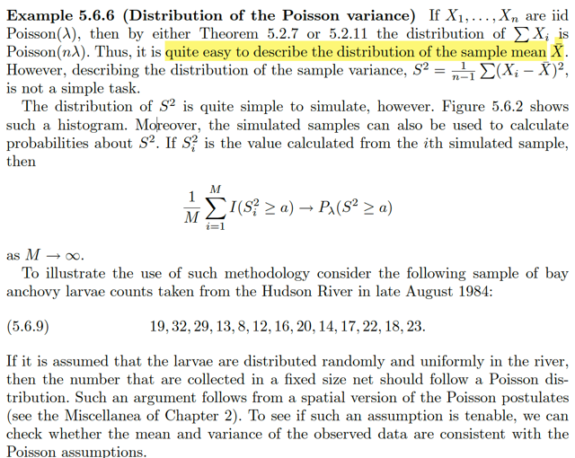</kbd>

> [!NOTE]
> QUAY LẠI SAU

 

<kbd>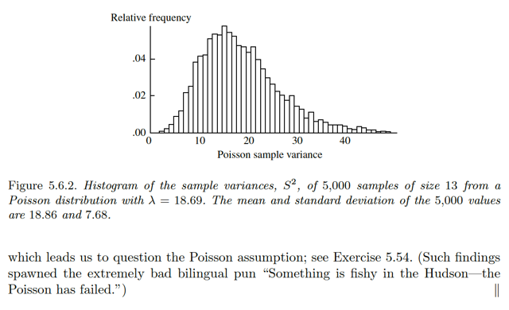</kbd>

<kbd></kbd>

<kbd>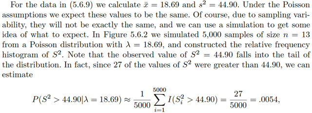</kbd>

> [!NOTE]
> QUAY LẠI SAU

 

<kbd>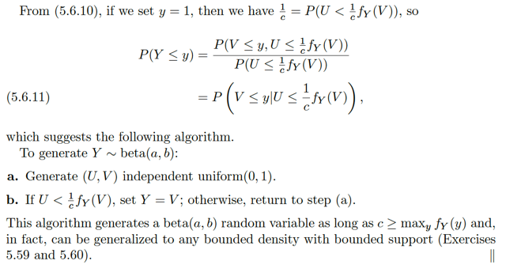</kbd>

<kbd></kbd>

<kbd>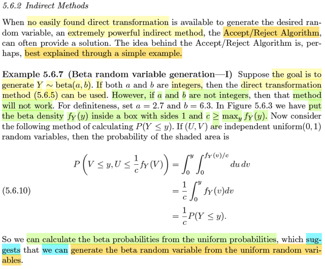</kbd>

🔗 **Related:** [4.1 JOINT & MARGINAL DISTRIBUTION](41_joint_marginal_distribution.md#node-226)

🔗 **Related:** [1.6 PDF & PMF](16_pdf_pmf.md#node-76)

> [!NOTE]
> đại khái là trong một trường hợp mà không thể có những cách làm theo kiểu
> biến đổi trực tiếp để tạo ra random variable theo phân phối mong muốn.
>
> Thì thuật toán Accept / Reject có thể giúp.
>
> Ý tưởng của nó thì để dễ hiểu nhất thì tốt nhất là thông qua ví dụ này:
>
> Đại ý là, ta sẽ cho rằng mình muốn generate random variable từ distribution
> mong muốn là β(a,b). Gs cho biết rằng, nếu mà a, b là số nguyên thì nói
> chung ta có thể dùng direct method. Chỗ này có lẽ cần review lại có thể mấy
> bước trước gs đã có nói.
>
> Vậy thì đại khái cách làm là như vầy:
>
> Người ta sẽ vẽ ra một cái hộp (box): trục v từ 0 đến 1, trục u từ 0 đến c =
> max fY
>
> Mục đích là / thuật toán đại khái sẽ làm việc bằng cách tạo uniform rv
> u~unif(0, c) và v~uniform(0,1) và kiểm tra xem nếu u ≤ fY(v) thì accept v đó
> như một rv ~ fY và ngược lại thì reject. Và hình ảnh sẽ là ta tạo các rv (u,v)
> như trên  và chỉ lấy những cái mà có u ≤ fY, khi đó, ta sẽ có các random
> variable ~ fY
>
> Hiểu đại khái là như vậy thì cụ thể hơn lập luận biện minh cho cách làm này
> sẽ là:
>
> P(V ≤ y, U ≤ fY(V)/c)
>
> Cái này có thể tính bởi ∫-inf:y∫-inf:fY(v)/c fU,V(u,v)dudv
>
> Vì sao?
>
> ⇨ Vì định nghĩa của joint pdf fU,V: là hàm sao cho P((U,V) ∈ A) = ∫∫A fU,V(u,
> v)dudv (mình ôn lại cdf/pmf/pdf ở hai note sau)
>
> Và giải cái tích phân này ra ta sẽ có: 
>
> ∫-inf:y∫-inf:fY(v)/c fU,V(u,v)dudv = ∫0:y∫0:fY(v)/c dudv | vì fU,V(u,v) = 1
> do U, V đều ~ uniform(0,1) và lại independent nên joint pdf fU,V(u,v) = fU(u)
> fV(v) = 1*1 = 1 khi 0 ≤ u ≤ 1, 0 ≤ v ≤ 1 và = 0*0 = 0 khi u, v nằm ngoài khoảng
> [0,1]
>
>
> ∫0:y ∫0:fY(v)/c du dv = ∫0:y [u|0:fY(v)/c] dv
>
> = ∫0:y fY(v)/c dv
>
> = (1/c) ∫0:y fY(v) dv
>
> Và cái này chính là (1/c) FY(y)
>
> Vậy ta có P(V ≤ y, U ≤ fY(V)/c) = (1/c) FY(y) = (1/c) P(Y ≤ y)
>
> điều này cho thấy rằng: Ta có thể tính xác suất của β distribution (Y) từ
> xác suất của uniform distribution, mà cái này gợi ý rằng có thể tạo β
> random variable từ uniform random variable, để làm rõ hơn ta sẽ làm như sau:
>
> Đang có P(V ≤ y, U ≤ fY(V)/c) = (1/c) FY(y) (1)
>
> Với y = 1, dĩ nhiên FY(1) = 1,
> là vì β(a,b) thì pdf của nó có support set là 0 ≤ y ≤ 1, nên FY(1) = P(Y ≤ 1)
> = ∫-inf:1 fY(t)dt = ∫0:1 fY(t)dt và cái này phải bằng 1 vì yêu cầu valid của pdf
> thì phải ko âm và tích phân trên toàn miền phải bằng 1.
>
> Vậy (1) ⇔ 1/c = P(V ≤ 1, U ≤ fY(V)/c)
>
> = P(V ≤ 1) P(U ≤ fY(V)/c)  |  Do U, V độc lập, nên hai event V ≤ 1 và U ≤ fY(V)/c)
> cũng là hai event độc lập 
>
> = 1 * P(U ≤ fY(V)/c)
>
> = P(U ≤ fY(V)/c)
>
>
> Vậy P(Y ≤ y) = P(V ≤ y, U ≤ fY(V)/c) / P(U ≤ fY(V)/c)
>
> Và đây chính là định nghĩa của conditional probability: P(V ≤ y | U ≤ fY(V)/c)
>
> Như vậy P(Y ≤ y) = P(V ≤ y | U ≤ fY(V)/c)
>
> và điều này biện minh cho phương pháp indirect, vì nó nói rằng khi mà mình lấy
> những giá trị v từ những cặp uniform (u,v) sao cho u ≤ fY(v)/c thì những giá trị v đó
> cũng có thể coi như là lấy từ (có phân phối từ) một distribution β(a,b) vậy

> [!NOTE]
> Ôn nhanh "tiến trình định nghĩa ra các khái niệm pmf/pdf/cdf":
>
> Hãy bắt đầu với rv X. Vì bản chất của random variable là hàm số,
> mapping từ possible outcome s trong sample space Ω.
>
> Vậy thì thế nào là biến X liên tục và thế nào là biến X rời rạc?
>
> CÂU TRẢ LỜI LÀ, đừng dựa vào s trong sample space, MÀ HÃY DỰA
> VÀO CDF FX: 
>
> Và như vậy đầu tiên cần nói định nghĩa của cdf, chính là:
>
> FX(x) = P(X ≤ x) 
>
> Từ đó theo định nghĩa chính thức, X là biến liên tục nếu FX LÀ HÀM
> LIÊN TỤC, và X là biến rời rạc nếu FX LÀ HÀM STEP FUNCTION.
>
> Sau đó là định nghĩa của pmf: fX(x) = P(X=x)
>
> thì với định nghĩa này ta sẽ thấy FX(x) = Σ{k ≤ x} fX(k)
>
> Vì sao? Vì định nghĩa của cdf nói trên thì FX(x) = P(X ≤ x)
>
> mà xét event X ≤ x, có bản chất là {s ∈ Ω: X(s) ≤ x}
>
> ⇨ P(X ≤ x) = P({s ∈ Ω: X(s) ≤ x}), theo định nghĩa của hàm xác suất P:
>
> .. = Σ{s ∈ Ω: X(s) ≤ x} P({s})
>
> = Σ{k ≤ x} Σ{s ∈ Ω: X(s) = k} P({s})
>
> và Σ{s ∈ Ω: X(s) = k} P({s}) chính là Σ{k ≤ x} P(X = k)
>
> = Σ{k ≤ x} P(X = k)
>
> = Σ{k ≤ x} fX(k)
>
> ====
>
> Rồi, giờ mới nói qua biến X liên tục, theo định nghĩa là khi CDF liên 
> tục (theo một số đánh giá, phải nói là tuyệt đối liên tục thì mới chặt
> chẽ hoàn toàn)
>
> Thế thì điểm quan trọng nhất cần hiểu đó là lúc này, P(X=x) = 0
>
> Và phải hiểu tại sao, thế thì ta sẽ lập luận như sau:
>
> Xét event (X = x), bản chất của nó, là {s ∈ Ω: X(s) = x}
>
> Mà X(s) = x thì dĩ nhiên cũng đồng nghĩa x - ε < X(s) ≤ x với ε dương 
> bất kì
>
> cho nên s ∈ {s ∈ Ω: X(s) = x} ⇨ s ∈ {s ∈ Ω: x - ε < X(s) ≤ x}
>
> ⇨ {s ∈ Ω: X(s) = x} ⊂ {s ∈ Ω: x - ε < X(s) ≤ x}
>
> Áp dụng tính chất A ⊂ B ⇨ P(A) ≤ P(B)
>
> ⇨ P({s ∈ Ω: X(s) = x}) ≤ P({s ∈ Ω: x - ε < X(s) ≤ x})
>
> Rồi, lại xét x - ε < X(s) ≤ x, tức X(s) ∈ (x - ε, x]
>
> Thì ta có (-inf, x - ε] ∪ (x - ε, x] = (-inf, x] 
>
> nên {s ∈ Ω: X(s) ∈ (-inf, x]} 
>
> = {s ∈ Ω: X(s) ∈ (-inf, x - ε] ∪ (x - ε, x]} (đặt tập này là A)
>
> = {s ∈ Ω: X(s) ∈ (-inf, x - ε] } ∪ {s ∈ Ω: X(s) ∈ (x - ε, x]} (đặt là B)
>
> Vì sao: s ∈ A thì có nghĩa là X(s) ∈ (-inf, x - ε] ∪ (x - ε, x], 
>
> mà  điều này đồng nghĩa X(s) ∈ (-inf, x - ε] hoặc X(s) ∈ (x - ε, x]
>
> và như vậy có nghĩa là s ∈ {s ∈ Ω: X(s) ∈ (-inf, x - ε] } 
>
> hoặc s ∈ {s ∈ Ω: X(s) ∈ (x - ε, x]} 
>
> để rồi chính là s ∈ {s ∈ Ω: X(s) ∈ (-inf, x - ε] } ∪ {s ∈ Ω: X(s) ∈ (x - ε, x]}
>
> tức s ∈ B
>
> Vậy xác suất phải giống nhau:
>
> P({s ∈ Ω: X(s) ∈ (-inf, x - ε] ∪ (x - ε, x]}) 
>
> = P({s ∈ Ω: X(s) ∈ (-inf, x - ε] } ∪ {s ∈ Ω: X(s) ∈ (x - ε, x]})
>
> Tiếp theo, vế trái là xác suất của ∪ của hai event disjoint, nên
> theo axiom 3 nó sẽ bằng:
>
> ..= P({s ∈ Ω: X(s) ∈ (-inf, x - ε]}) + P{s ∈ Ω: X(s) ∈ (x - ε, x]}
>
> Và như vậy, ta có P(X ≤ x) = P(X ≤ x - ε) + P(x - ε < X ≤ x)
>
> (lập luận cái này theo set theory, axiom và xác suất của các event
> trong sample space)
>
> ⇔ P(x - ε < X ≤ x) = P(X ≤ x) - P(X ≤ x - ε)
>
> Và theo định nghĩa của cdf, thì vế phải chính là FX(x) - FX(x - ε)
>
> ⇨ P(x - ε < X ≤ x) = FX(x) - FX(x - ε)

> [!NOTE]
> Và tới ta đang có P(X = x) ≤ P(x - ε < X ≤ x) = FX(x) - FX(x - ε)
>
> Và ta sẽ xét tại limit: cho ε → 0.
>
> lim ε → 0 P(X = x) ≤ lim ε → 0 FX(x) - FX(x - ε)
>
> Khi đó FX(x) - FX(x - ε), xét lim ε → 0 FX(x - ε), sẽ = FX(x) 
>
> ⇨ lim ε → 0 FX(x) - FX(x - ε) = FX(x) - FX(x) = 0
>
> ⇨ lim ε → 0 P(X = x) ≤ 0
>
> Mà lim ε → 0 P(X = x) = P(X = x) ⇨ P(X = x) ≤ 0
>
> Mà P(X = x) cũng ≥ 0 do axiom 1
>
> nên với việc ta có P(X = x) ≤ 0 và P(X = x) ≥ 0 thì ta suy ra P(X = x) = 0
>
> ====
>
> Ôn lại tính liên tục của cdf, theo định nghĩa của cdf FX(x) = P(X ≤ x)
>
> Thì vì cách định nghĩa này mà FX liên tục phải (right continuous)
>
> Cụ thể là vì xét limit của FX(x + ε) với ε dương, khi ε → 0 (tức là xét
> lim ε → 0+ F(x + ε)):
>
> Thì cái này cũng là xét limit của P(X ≤ x + ε) khi ε → 0, ta sẽ thấy,
> khi ε → 0 thì P(X ≤ x + ε) → P(X ≤ x + 0) = P(X ≤ x) = FX(x).
> Nên lim ε → 0+ FX(x + ε) = FX(x), nên đây chính là cho thấy FX liên
> tục phải (vì định nghĩa liên tục phải trong giải tích)
>
> Nhưng FX(x) không liên tục trái nếu X rời rạc khiến P(X = x) khác 0:
>
> Theo định nghĩa liên tục trái, thì lim x → (x0-) FX(x) phải = FX(x0)
> hay lim ε → 0+ FX(x - ε) phải bằng FX(x)
>
> nhưng FX(x - ε) = P(X ≤ x - ε) mà với ε > 0 ⇔ -ε < 0 
>
> ⇔ x - ε < x
>
> Mà điều này thì có nghĩa là dù ε dương nhỏ cỡ nào đi nữa thì 
> (-inf, x - ε] VẪN LUÔN KHÔNG CHỨA x
>
> ⇨ khi ε → 0 thì P(X ≤ x - ε) không bao giờ bằng P(X ≤ x), tức FX(x)
> mà nó chỉ bằng P(X < x) và cái này thì = P(X ≤ x) - P(X = x) sẽ lớn hơn
> P(X < x) khi P(X = x) dương.
>
> Vậy nên lim ε → 0+ FX(x - ε) ≠ FX(x) nên FX không phải là left
> continuous function
>
> ====
>
> Rồi, vậy thì quay lại biến liên tục có P(X = x) = 0, người ta mới định
> nghĩa ra pdf, fX, là hàm như sau: Đó là function mà:
>
> P(X ≤ x) = P(X ∈ (-inf, x]) = ∫-inf:x fX(t)dt
>
> Và như vậy cũng đồng nghĩa FX(x) = ∫-inf:x fX(t)dt
>
> Mà FTC1 nói rằng nếu có hàm G được tạo ra hoặc định nghĩa bởi hàm f
> theo cách thức như sau: G(x) = ∫-inf:x f(t)dt thì hàm G được gọi là nguyên
> hàm của hàm f, và ta sẽ có d/dx G(x) = f(x). Và với việc hàm G là nguyên
> hàm của f, thì FTC2 cũng cho ta: G(b) - G(a) = ∫a:b f(t)dt 
>
> Vậy áp dụng FTC ta có d/dx FX(x) = fX(x)
>
> Cũng như P(X ∈ (a,b)) = ∫a:b fX(t)dt = F(b) - F(a)
>
> VÀ ÁP DỤNG QUA 2D THÌ NGƯỜI TA ĐỊNH NGHĨA HÀM JOINT PDF
> THEO CÁCH TƯƠNG TỰ:
>
> fX,Y(x,y), là hàm sao cho:
>
> P((X,Y) ∈ A) = ∫∫A fX,Y(x,y)dxdy

 

<kbd>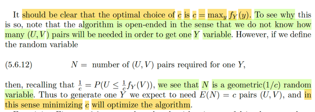</kbd>

> [!NOTE]
> Rồi, đại khái là chỗ này gs làm rõ, hoặc đề nghị ta phải hiểu rõ hơn là tại sao
> phải chọn c = max y fY(y)
>
> Thế thì đại khái là vầy, đầu tiên nhớ lại chút xíu về cái kiểu / cách làm này:
> Đừng quên mục đích ban đầu, là generate các random variable theo
> distribution mong muốn, và ở đây là beta (a,b). Thế thì cách làm gián tiếp, ta
> định ra một cái khoảng cho U, V để rồi, phóng phi tiêu vào cái box đó (mà
> hành động phóng Φ tiêu chính là tạo ra các random variable (U,V) từ uniform
> distribution. Và  nói cái khoảng tức là nói về param: U ~ uniform(0, c) V ~
> uniform(0,1)
>
> Sau đó, xét giá trị của U, nếu nó nhỏ hơn fY(V) thì lấy Y = V.
>
> Và lúc nãy ta đã chứng minh cơ sở để làm việc này, bằng cách chứng minh
> rằng P(V ≤ y | U < fY(V)/c) = P(Y ≤ y) cho thấy nếu như lấy V từ các cặp U,V
> sao cho U < fY(V) thì conditional cdf của V chính là cdf của Y, tức các giá trị V
> đó coi như đến từ phân phối xác suất fY
>
> Thế thì, quay lại đây, ta có thể hiểu cách làm có một tính chất là, ta cứ tạo ra
> các cặp (U,V) và chờ đến khi có cặp nào đó có U < fY(V) thì ta sẽ có một Y.
> Do đó,
>
> nếu đặt N là số lượng cặp rv (U,V) cho đến khi có một cái đạt yêu cầu, thì N
> sẽ là một random variable ~ Geometric(p) với p = 1/c
>
> Là sao? Ôn lại Geometric distribution, thì story của nó là: bối cảnh là chuỗi
> các iid Bern(p), và ta quan tâm số trial thất bại trước khi / cho đến khi có trial
> thành công, mà nếu theo convention là "include success" thì nó sẽ đúng hơn
> là, tổng số trial cho đến khi có trial success đầu tiên.
>
> Thế thì, để derive pmf của distribution này. P(X = k) ta sẽ thấy event X = k sẽ
> là joint event của k-1 failure trial, và 1 success trial chốt hạ. Lấy ví dụ k = 4 thì
> X = k sẽ tương ứng với một chuỗi trial có kết quả có dạng FFFS. Và quan
> trọng là, không thể có chuỗi nào khác cả. Do đó, P(X=k) = P({s ∈ Ω: s = "
> FFFS"}) mà xác suất của possible outcome này, chính là joint probability của
> 3 failure Bern(p) và 1 success Bern(p), chúng lại độc lập nên theo định nghĩa
> của independent event, xác suất của joint event = tích các xác suất của từng
> event.
>
> ⇨ P(X=k) = P({s ∈ Ω: s = "FFFS"}) = (1-p)^3p
>
> Thế thì quay lại đây, ta xem thử bối cảnh có phải là chuỗi các iid Bern(p)
> không?
>
> Mỗi lần ta phóng Φ tiêu, tức generate một (U,V) từ uniform, thì cái chính là ta
> sẽ kiểm tra xem U có < (1/c) fY(V) không, nếu có thì "lấy" V, không thì bỏ
> (reject)
>
> Vậy rõ ràng đây là một Bern trial.
>
> Chúng có identically distributed không? Tức là có cùng p không? À thì phải
> xem xác suất success của trial là bao nhiêu: Đó chính là P(U < (1/c) fY(V)),
> mà hồi nãy đã  có cái này: 1/c = P(U ≤ 1/c fY(V)), nên rate of success chính là
> 1/c, và như vậy cái Bern trial nào cũng có rate of success giống nhau, là 1/c
> ⇨ identically distributed
>
> Chúng có iid không, dĩ nhiên là có, vì việc generate (U,V) hoàn toàn độc lập
> nhau
>
> Vậy tới đây có thể kết luận N ~ Geometric(1/c)
>
> Mà như vậy, thì EN sẽ cho ta "trung bình cần mấy lần phóng Φ tiêu thì có
> được một thằng Y"
>
> Xem thử EN?
>
> khong khó để thấy EN = Σ{mọi possible value n của N} nP(N=n)
>
> = Σn=1,2..inf n(1-p)^(n-1)p^i  = 1/p và ở đây là 1/(1/c) = c
>
> Như vậy, dĩ nhiên ta muốn giảm thiểu EN, nên ta phải minimize c, mà
> minimize c ở đây chính là max y fY(y) tức là sát trần của fY. (Hiểu theo nghĩa
> là không cần lấy cao hơn max y fY(y) làm gì)
>
> Vì sao phải từ max y fY(y) mà ko thể thấp hơn: là vì khi đó sẽ có những 
> U < fY(V) nhưng không thể xuất hiện (vì range từ 0 đến c < max y fY(y))

 

<kbd>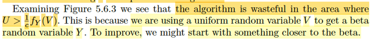</kbd>

<kbd></kbd>

<kbd>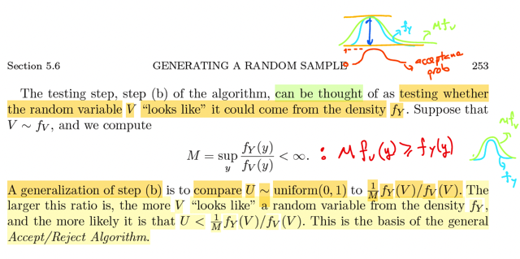</kbd>

> [!NOTE]
> đại khái là gs đề cập tới việc, nếu nhìn lại cách làm trên (hình) thì ta thấy
> phần lớn các cặp (U,V) sẽ bị reject, là vì giá trị của U,V xuất hiệm theo
> uniform sẽ y như phóng Φ tiêu vào cái hình chữ nhật và xác suất xuất hiện
> đều như  nhau hết, do đó, dĩ nhiên là vùng có diện tích lớn thì xác suất rơi
> vào đó càng  cao. Mà nhìn cái hình coi, có khoảng trống lớn trong hình hộp
> mà nằm trên đường fY, nên rất nhiều (U,V) sẽ rơi vào vùng này và bị reject.
>
> Thế thì gs đề xuất là, ta có thể xuất phát V từ một distribution nào khác mà
> gần giống với β hơn. Là sao nhỉ ⇨ Hình dung, thay vì ta tạo U,V nằm trong
> hình chữ nhật do U từ uniform(0,c) V từ uniform(0,1) thì nếu có thể tạo V từ
> một phân phối xác suất gần giống với β, (U vẫn là uniform 0,c)
>
> Thì khi đó nhiều điểm hơn sẽ rơi vào trong và ít điểm hơn bị lãng phí.
>
> Tiếp, gs bàn đến cái bước testing: check xem U có < fY(V) không, thì ông
> nói, mình có thể nhìn theo góc nhìn khác, sâu hơn: Là xem thử thằng V,
> trong cặp U,V này có "giống" một thằng Y từ β hay không.
>
> Vậy thì để mà chuyển dịch sang / không dùng uniform nữa, mà dùng một
> generate distribution nào đó sát hơn với fY thì ta phải xét đến việc khái quát
> hóa lên của cái bước testing này:
>
> Và như đã nói, đó chính là góc nhìn "khác" ở trên: là ta muốn check xem
> thằng V có giống như một thằng Y không?
>
> Và cách lập luận là:
>
> Ta sẽ chọn M là số mà MfV(y) luôn ≥ fY(y). Và bằng một cách thiết kế
> khéo léo ta sẽ có thuật toán sau:
>
> Ta sẽ generate V từ fV (như đã nói, ta sẽ dùng một distribution nào đó
> dĩ nhiên là loại mà ta có thể dễ dàng tạo ra / sampling được nhưng sát
> với β hơn là cái uniform(0,1), và U từ uniform(0,1)
>
> Rồi, ta mới so với U với p = (fY(V)/MfV(V)) để accept (y như so U với fY(V)
> hồi nãy vậy)
>
> Thế thì cái hay ho là:
>
> nếu mà giá trị của V nó khiến p (vốn là luôn ≤ 1 vì M là số đảm bảo MfV(y) 
> luôn ≥ fY(y)) lớn, tức ≈ 1. Thì khi đó, giá trị V đó là một ứng cử viên sáng
> giá (cho việc đóng vai rv xuất thân từ fY), vì sao, vì tại đó, xác suất của 
> fY gần với MfV. Và lí do quan trọng cho việc điều này cho thấy V là good
> candidate là vì: vì M chỉ là hằng số, nên nếu fV cao thì MfV cũng cao
> và ngược lại. Do đó đại ý là ta có thể chấp nhận rằng việc fY gần với MfV
> cho thấy rằng V này xuất hiện với tần suất (do fV quyết định) phù hợp với
> yêu cầu (fY). Và với good candidate này thì p rất lớn (≈ 1) khiến thuật toán
> sẽ giữ lại nó vì p lớn tức là P(U ≤ p) lớn (vì P(U ≤ p) = p) → khả năng được
> approve lớn.
>
> Ngược lại, nếu V mang giá trị dù là tại đó fV cao, tức là nó được tạo ra 
> thường xuyên, rất nhiều. Nhưng fY xa rời MfV, thì chứng tỏ, tần xuất của
> giá trị này là không khớp với mong muốn, nó quá dư thừa, trong khi fY
> thấp (nên mới xa rời MfV) nói lên rằng nếu là từ phân phối fY thì giá trị này
> sẽ ít xuất hiện hơn nhiều. Và khi đó, p lại nhỏ, cái hay là chỗ này, khiến
> xác suất accept nhỏ, ⇨ xác suất reject cao.

 

<kbd>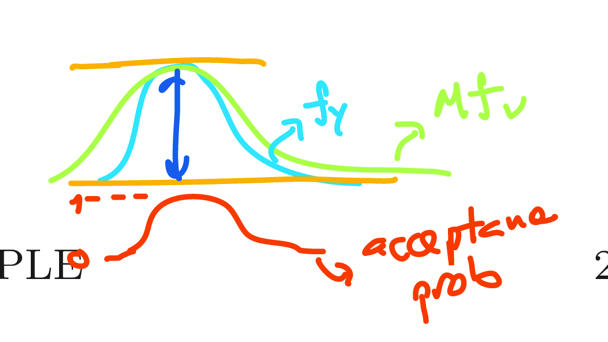</kbd>

> [!NOTE]
> M là con số sao cho MfV(y) ≥ fY(y). Nên đồ thị hàm MfV luôn nằm trên fY.
>
> Tại những điểm v mà khiến MfV(v) cao thì đó là những nơi thuật toán tạo
> V (từ distribution V, thuộc loại dễ tạo / làm được) sẽ hay cho ra.
>
> Nếu tại v ứng cử viên đó, MfV đi sát fY, thì tỉ số p = (1/M) fY(V)/fV(V))  sẽ
> lớn ≈ 1 và khi dùng tạo U tại v đó, thì khả năng U nhỏ hơn tỉ lệ này sẽ cao
> (vì U là unif(0,1)) P(U ≤ p) = p, p càng lớn thì P(U ≤ p) = ..p dĩ nhiên càng
> lớn và đó chính là điều kiện để accept v
>
> Vậy hệ quả / hiệu ứng thần kì là:
>
> Khi v sinh ra ở những nơi mà fV, fY sát nhau, thì tỉ lệ / xác suất chấp nhận
> lớn và ngược lại khi v mang giá trị ở những nơi fY fY xa nhau thì xác suất
> chấp nhận nhỏ lại. Nên tại nơi rất ít xuất hiện (fV nhỏ) nhưng sát với fY thì
> khả năng được giữ lại rất cao, và ngược lại những nơi hay xuất hiện fV
> cao nhưng không sát với fY thì sẽ bị reject hết.
>
> Kết qủa là cái đám candidate được accept sẽ y như được sinh ra từ ~ fY
> vậy

 

<kbd>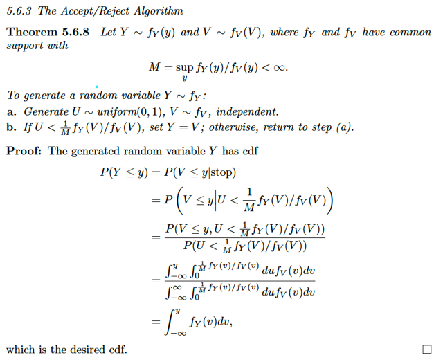</kbd>

> [!NOTE]
> Theorem này nói đến thuật toán vừa rồi: Cho M = sup y fY(y) / fV(y) < inf 
> (để cho M fV(y) ≥ fY(y) với mọi y)
>
> Thì cách làm (tạo ra các rv ~ fY) sẽ là:
>
> a. Generate U ~ uniform(0,1) và V ~ fV, độc lập nhau
>
> b. Nếu U < (1/M) fY(V) / fV(V) thì chọn / accept Y = V. Ngược lại thì reject
>
> Và ở đây gs cung cấp chứng minh, đại khái là ta cũng chứng minh rằng
> dựa trên việc (condition on U thỏa điều kiện) thì V sẽ có phân phối giống
> với Y: P(V ≤ y | U thỏa) = P(Y ≤ y)
>
> Thế thì vế trái là P(V ≤ y | U < (1/M) fY(V)/fV(V))
>
> Theo định nghĩa của conditional probability:
>
> = P(V ≤ y, U < (1/M) fY(V)/fV(V)) / P(U < (1/M) fY(V)/fV(V))
>
> Tử số, tính dựa trên joint pdf của U,V mà U,V độc lập nên sẽ bằng tích
> của marginal pdf
>
> ∫-inf:y ∫0:m(v) fU,V(u,v)dudv với m(v) = (1/M) fY(v)/fV(v)) cho gọn
>
> = ∫-inf:y∫0:m(v) fU(u)fV(v)dudv
>
> = ∫-inf:y∫0:m(v) 1 fV(v)dudv   | fU(u) = 1 do U ~uniform(0,1)
>
> = ∫-inf:y fV(v) ∫0:m(v) du]dv
>
> = ∫-inf:y fV(v) [∫0:m(v) du]dv
>
> = ∫-inf:y fV(v) m(v) dv
>
> = ∫-inf:y fV(v) (1/M) fY(v)/fV(v)) dv
>
> = (1/M) ∫-inf:y fY(v) dv
>
> = (1/M) FY(y)
>
> Còn mẫu số
>
> P(U ≤ m(V))
>
> thì thật ra nên hiểu là P(U ≤ m(V), V = v)
>
> khi đó sẽ thấy đây là một joint event
>
> Và có thể tính bởi joint pdf của U,V:
>
> ∫-inf:inf ∫-inf:m(v) fU,V(u,v)dudv
>
> = ∫-inf:inf ∫-inf:m(v) fV(v)dudv
>
> = ∫-inf:inf fV(v) ∫-inf:m(v) du dv 
>
> = ∫-inf:inf fV(v) ∫0:m(v) du dv 
>
> = ∫-inf:inf fV(v) m(v) dv
>
> = ∫-inf:inf fV(v) (1/M) fY(v)/fV(v)) dv 
>
> = (1/M) ∫-inf:inf fY(v) dv 
>
> = (1/M)  * 1 vì tính valid của pdf của fY
>
> Như vậy kết quả là FY(y) ⇨ chứng minh xong

 

<kbd>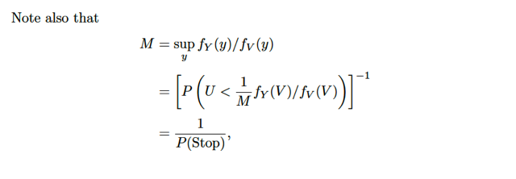</kbd>

> [!NOTE]
> Và từ việc P(U ≤ m(V)) = (1/M)
>
> Ta cũng suy ra M = 1 / P(U ≤ m(V)), tức là 1 / P(Stop) vì điều kiện để 
> stop, tức accept, chính là U ≤ m(V)

 

<kbd>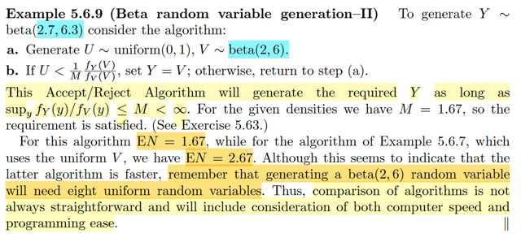</kbd>

> [!NOTE]
> Rồi, đại khái là ví dụ ta dùng thuật toán này để generate Y ~ β(2.7, 6.3)
> và ta dùng V từ (~) fV là β(2,6) thì đại ý là sẽ thấy EN = 1.67, so với 
> EN = 2.67 khi xài V từ uniform(0,1). Còn nhớ EN, là trung bình của N,
> là số lần tạo cặp (U,V) cho đến khi có một cái "thỏa" (được accept) để
> "lấy V làm Y". Vậy thì kết quả này đại ý cho thấy là, nếu mà ta dùng 
> V từ một distribution gần với fY, ở đây rõ ràng β(2,6) thì gần với β(2.7, 6.3)
> là cái mong muốn rồi, thì khi đó số lượng accept sẽ tăng lên, không bị
> lãng phí nhiều như dùng fV khác quá nhiều so với fY (như uniform)
>
> Nhưng mà gs lưu ý rằng, so sánh vậy ko ổn. Bởi lẽ ta phải tính đến chi
> phí để mà có được V, từ β(2,6) nữa. Bởi việc tạo được V từ distrib này
> cũng lại là vấn đề, cũng phải dùng cách thức indirect để tạo từ (U,W) với
> W ~ uniform chẳng hạn.

 

<kbd>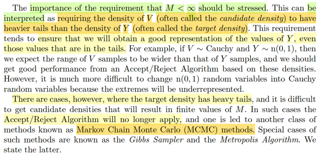</kbd>

> [!NOTE]
> Rồi, gs nhấn mạnh rằng, cần phải để ý cái điều kiện là M (là số mà khiến
> đảm bảo M fV(y) ≥ fY(y) ∀ y, tức = sup y fY(y)/fV(y)) phải hữu hạn.
>
> Mà gs cho rằng có thể giải thích cái điều kiện này, hay ta có thể hiểu điều
> kiện này theo lối hiểu là nó sẽ đảm bảo density của V sẽ có cái đuôi mập
> (heavy tail) hơn là  cái đuôi của Y. Mà mình hình dung là, chỉ khi đó thì
> đường cong của V mới trùm được đường cong của Y, khiến ta mới có thể
> tạo ra được hết đầy đủ các giá trị khả dĩ của Y.
>
> Lấy ví dụ như nếu V lấy từ Cauchy thì thuật toán này sẽ có thể tạo ra được
> các n(0,1) nhưng ngược lại V từ n(0,1) thì vì cái đuôi của nó ko mập hơn
> Cauchy nên sẽ ko thể tạo ra hết được Y, tức là, nếu mà mình dùng thuật toán
> này thì sẽ có những giá trị của Y ít được tạo ra hơn so với phân phối fY, và 
> hình ảnh sẽ giống như là Y đến từ một phân phối fY bị  chỉnh sửa ở hai cái
> đuôi khiến nó bị bóp lại chứ chứ ko phải là cái đuôi ban đầu của fY
> (extremes will be underrepresented)
>
> Do đó lúc này ta sẽ cần thuật toán khác, gọi là Markov Chain Monte Carlo

 

<kbd>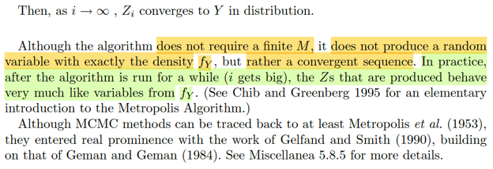</kbd>

<kbd></kbd>

<kbd>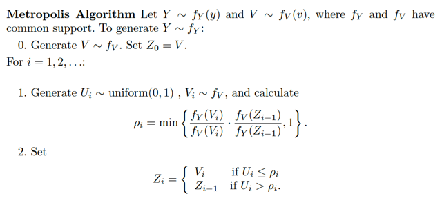</kbd>

> [!NOTE]
> rồi thuật toán này ta có thể quay lại sau, nhưng gs cho biết, thực tế nó ko
> tạo ra Z ~ fY  ngay, mà kiểu như Zi ngày càng giống đến từ fY

> [!NOTE]
> QUAY LẠI SAU

 

<kbd>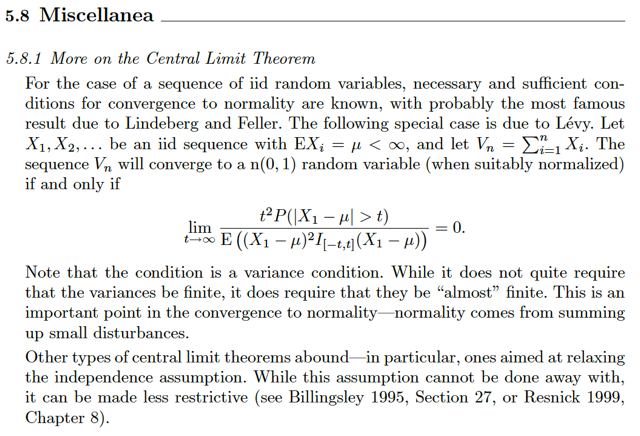</kbd>

> [!NOTE]
> QUAY LẠI SAU

 

<kbd>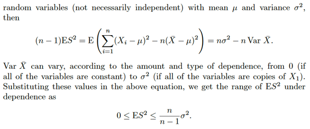</kbd>

<kbd></kbd>

<kbd>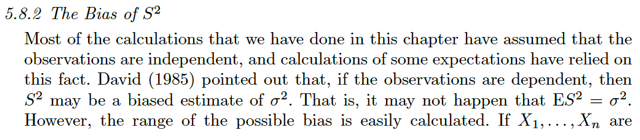</kbd>

> [!NOTE]
> QUAY LẠI SAU

 

<kbd>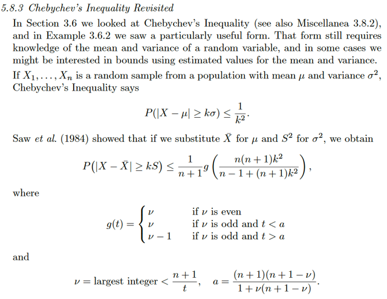</kbd>

> [!NOTE]
> QUAY LẠI SAU

 

<kbd>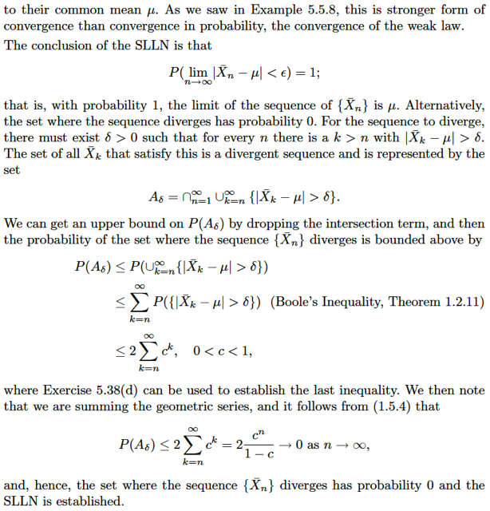</kbd>

<kbd></kbd>

<kbd>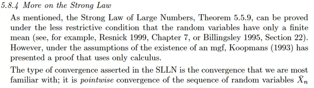</kbd>

> [!NOTE]
> QUAY LẠI SAU

 

<kbd>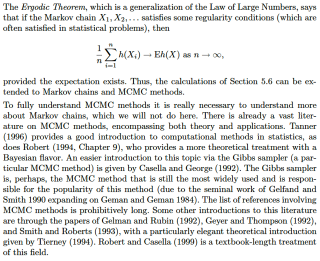</kbd>

<kbd></kbd>

<kbd>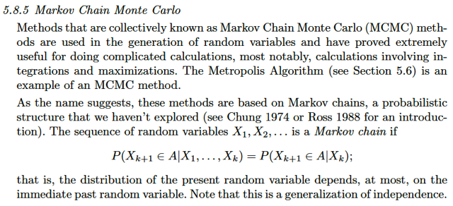</kbd>

> [!NOTE]
> QUAY LẠI SAU

 

