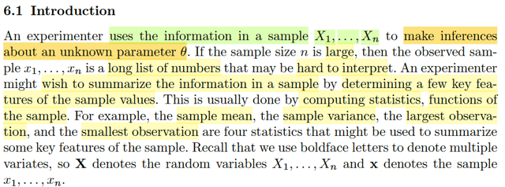
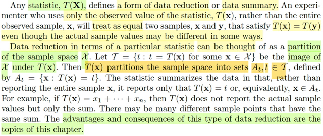
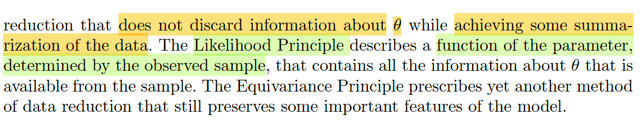
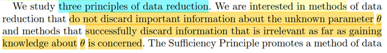

# 6.1 Introduction

📊 **Progress:** `3` Notes | `5` Screenshots

---

<kbd></kbd>

> [!NOTE]
> Rồi, đại khái là mình sẽ ôn lại chút về random sample. Theo định nghĩa
> nói X1,...Xn là random sample size n từ population fX thì có nghĩa là ta
> quan sát giá trị của một yếu tố ngẫu nhiên nào đó, n lần. Mỗi lần được
> đại diện bởi một random variable Xi, và các lần quan sát được thực hiện 
> sao cho X1,..Xn mutually independent và cùng chung một distribution là
> fX.
>
> Thế thì, ở đây gs nói rằng, nếu mà n nhiều, thì ta sẽ có một chuỗi rất dài
> các giá trị quan sát. Và nhà thống kê có thể cần / muốn dùng một công 
> cụ nào đó để tạo ra một loại thông tin giúp tóm lược thông tin chứa trong
> chuỗi observation này.
>
> Và công cụ đó là ta dùng các function, để tính toán từ các observation
> này, tức là apply function g(x1,...xn) nào đó lên random sample X1,...Xn
> Nó cho ta cũng là random variable, nhưng ta gọi là statistic. Điển hình
> như sample mean Xbar, sample variance S^2, X(1) (cái nhỏ nhất) hoặc
> X(n) cái lớn nhất. Và mình hiểu đây là các rv có được khi apply các hàm
> g khác nhau lên X1,..Xn. 
>
> Gs cũng nhắc lại convention ta sẽ ghi **X**là chỉ vector các random variable
> với giá trị cụ thể của nó là **x**

 

<kbd></kbd>

> [!NOTE]
> đại khái là vừa rồi đã ôn lại để hiểu rằng T(**X**), kiểu như apply một
> function T(.) lên các random variable của random sample X1,..Xn,  (mà
> bỏ vào thành vector **X**) sẽ là một random variable mới, và đặt  tên cho
> những random variable dạng này là statistic.
>
> Thế thì gs nói, T(**X**) sẽ định nghĩa ra một dạng nào đó của data
> reduction, hay data summary.
>
> Và những experimenter mà chỉ dùng / chỉ quan tâm đến T(**x**) hơn là
> các giá trị quan sát được **x**của **X**(tức x1,x2,...xn của X1,X2,...Xn)
> sẽ coi hai bộ giá trị **x**, **y**là giống nhau nếu như T(**x**) = T(**y**)
>
> Chỗ này phải hiểu. random sample là một bộ các random variable iid X1,.
> ..Xn nhưng dĩ nhiên giá trị cụ thể của nó, giá trị mà ta quan sát thấy sẽ là
> giá trị cụ thể x1,x2,....xn nào đó.
>
> Thế thì, đại khái tiếp theo gs nói là:  ta có thể nghĩ về / hiểu về statistic
> theo cách hiểu của một partition của sample space.
>
> Sample space ở đây là range của **X**. tức là tập chứa mọi possible
> value **x** của **X**.
>
> Vậy thì, nếu ta apply T(.) lên **X,**ta có T(**X**) có các possible value t1,
> t2... thì ta có thể xem {t1,..t2} tức {t = T(**x**) for some **x** ∈ range **X**}
> là ảnh (image) của range X
>
> Và với t cụ thể nào đó ví dụ t1, thì preimage của nó: {**x** ∈ range **X**:
> T(**x**) = t1}, đặt là A1 sẽ disjoint với preimage của {t = t2}, tức là {x ∈ range X:
> T(x) = t2}, đặt là A2. Vì sao?
>
> nếu **x** = **x1** nào đó mà đã thuộc preimage của t1 thì T(**x1**) phải =
> t1
>
> thì **x1** ko thể nằm trong preimage của t2 để mà T(**x1**) cũng bằng t2
> được.
>
> Và với mọi ti thuộc ảnh của range X, thì ∪ của các pre_image của {T(**x**)
> = ti} phải tạo thành range X bởi lẽ, định nghĩa của ảnh của range X
>
> Do đó các preimage của {x ∈ range X: T(x) = ti} với ti ∈ T_curly = image
> của range X sẽ tạo nên một partition: Ta nhớ định nghĩa của partition: A1,
> A2...Ak là partition của Ω  khi chúng disjoint và ∪ của chúng tạo thành Ω
>
> Thế thì, hiểu đại khái ý tác giả là, với cách hiểu như vừa rồi thì mình sẽ
> thấy T(**x**) nó chỉ summary thông tin trong các partition At mà thôi, chứ
> không phải summary thông tin của toàn bộ sample space range X
>
> Vì ví dụ như nói T(**x**) = t với T là sample mean, thì đó chỉ là cho biết rằng, 
> trong sample space, có một partition, có giá trị trung bình là t.
>
> Và chương này đại khái là mình sẽ bàn về các hệ quả và ưu điểm của
> cái loại / cái cách làm data reduction dạng này

 

<kbd></kbd>

<kbd></kbd>

<kbd></kbd>

> [!NOTE]
> Thế thì mình sẽ học 3 nguyên lý của data reduction. Mà trong đó ta
> sẽ quan tâm các method reduction nào mà:
>
> 1) Không bỏ đi những thông tin quan trọng về về tham số θ chưa biết đằng
> sau.
>
> 2) Method mà bỏ đi những thông tin ko cần thiết (irrelevancy) 
>
> Thì Sufficient Principle sẽ nói về các method of data reduction mà có tính chất
> thứ 
>
> Còn Likelihood Principle thì sẽ mô tả một function của param θ được định
> nghĩa bởi observed value của sample, chứ mọi thông tin cần thiết về θ 
>
> Và Equivariance Principle thì nói về các method khác, giúp data reduction 
> nhưng vẫn preserve các feature quan trọng

 

