# 6.2 The Sufficient Principle

📊 **Progress:** `48` Notes | `72` Screenshots

---

<kbd>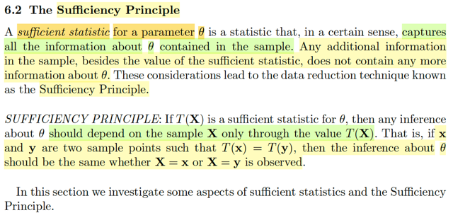</kbd>

🔗 **Related:** [6.3 THE LIKELIHOOD PRINCIPLE](63_the_likelihood_principle.md#node-528)

> [!NOTE]
> Định nghĩa của sufficient statistic của một parameter θ, là statistic mà **nắm 
> bắt mọi thông tin về θ chứa trong sample**. Mọi thông tin khác, chứa trong
> sample đều ko chứa thêm thông tin nào nữa về θ.
>
> Và từ đó ta có **SUFFICIENT PRINCIPLE**: Nói rằng, T(**X**) là sufficient statistic
> của θ thì mọi suy luận về θ  nên chỉ dựa vào sample **X** thông qua T(**X**) mà 
> thôi. Đồng nghĩa, hay nói rõ hơn, nếu mà **x** và **y** là hai sample (hai bộ giá
> trị quan sát được cụ thể của X1,..Xn) thì **việc suy luận về θ sẽ giống nhau**,
> dù cho ta dùng bộ giá trị nào. X1,..Xn = x1,..xn hay X1,...Xn = y1,...yn

 

<kbd>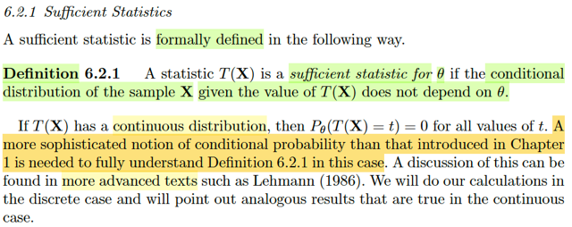</kbd>

🔗 **Related:** [7.3 METHODS OF EVALUATING ESTIMATORS](73_methods_of_evaluating_estimators.md#node-647)

> [!NOTE]
> Rồi, mình qua cái loại đầu tiên: **SUFFICIENT STATISTIC**
>
> Định nghĩa chính thức là, một statistic T(**X**) được gọi là sufficient statistic của 
> θ nếu như conditional distribution của sample **X** given giá trị của T(**X**) ko 
> phụ thuộc θ
>
> Hiểu nôm na là, biết được T(**X**) là coi như có đủ thông tin về θ, nên distribution
> của **X** hoàn toàn được hiểu biết đầy đủ, đếch cần θ nữa.
>
> Gs cho rằng để mà hiểu được đầy đủ cái định nghĩa này thì ta cần phải dùng
> đến một các hiểu phức tạp hơn của conditional probability hơn là những
> gì được học ở chapter 1 vì khi T(**X**) có giá trị liên tục thì như đã biết P(T(**X**) = t)
> sẽ luôn bằng 0 bất kể t.
>
> Do đó ở đây gs đề nghị ta **chỉ xét discrete** T(**X**) và chỉ ra những điểm tương
> đồng với continuous case

 

<kbd>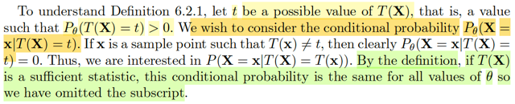</kbd>

> [!NOTE]
> Rồi, thế thì gọi t là một possible value của T(**X**), mà gs cho biết điều này có
> nghĩa là P_θ(T(**X**) = t > 0).
>
> Dừng lại chút xíu, để ý kí hiệu P_θ(T(**X**) = t > 0). Cái subscript θ là sao nhỉ?
>
> Có lẽ phải ôn lại chút: Ta có một population mà ta dùng θ  để chỉ distribution
> parameter của nó.
>
> Từ population này, mình thực hiện random sampling: quan sát giá trị của một
> biến số nào đó (tuân theo population distribution trên) n lần, để có một bộ
> random variable X1,...Xn. Viết là **X**. Và T(**X**) là một statistic = kết quả
> của việc apply function T(.) lên **X**, dĩ nhiên **X** là random variable
> (vectors) nên T(**X**) cũng là random variable.
>
> Và vì là random variable, nên ta "có quyền" nói đến distribution của nó. Tuy
> nhiên những bài trước gs Casella cũng đã nói, vì T(**X**), là một random
> variable tạo ra từ các random variable trong random sample, nên distribution
> của nó mình gọi là**SAMPLING DISTRIBUTION**, để phân biệt nó với
> population distribution, là marginal distribution của X1,...Xn
>
> Vậy thì ở đây, khi nói đến P(T(**X**) = t), dĩ nhiên là ta đang nói đến **sampling
> distribution** này.
>
> Thế thì, vấn đề là, như đã nói T(**X**) được sinh ra từ X1,...Xn. có distribution
> với param θ. Nên SAMPLING DISTRIBUTION, SẼ PHỤ THUỘC Θ
>
> Có nghĩa là, với các θ khác nhau, thì sampling distribution sẽ khác nhau.
>
> ===
>
> Và gs cho biết rằng, nhắc đến P_θ(T(**X**) = t) nhưng cái ta sẽ quan tâm
> chính là conditional probability P_θ(**X** = **x** | T(**X**) = t) như trong định
> nghĩa của sufficient statistic.
>
> Dĩ nhiên giá trị xác suất này, sẽ cũng phụ thuộc θ, vì đây là probability
> distribution của random sample **X**.
>
> Thế thì, đại ý là, nếu T(**x**) khác t, thì  P_θ(**X** = **x** | T(**X**) = t) = 0. Vì
> sao?
>
> ⇨ Là vì cái này, theo định nghiã của conditional probability:
>
> = P_θ(**X** = **x**, T(**X**) = t) / mẫu
>
> và cái tử bằng 0, vì đây là joint event của hai event disjoint: X=x
>
> Do đó mình chỉ quan tâm các giá trị của **x** mà T(**x**) = t. Tức là:
>
> P_θ(**X** = **x** | T(**X**) = t = T(**x**))
>
> Thế thì tại đây mình mới dừng lại để nhận định thế này: Theo định nghĩa,
> statistic T(**X**) muốn được gọi là một sufficient statistic, thì conditional probability
> của **X**, given T(**X**) không được còn depend vào θ nữa.
>
> Vậy, có nghĩa là cái P_θ(**X** = **x** | T(**X**) = T(**x**)) ở trên sẽ không còn depend θ 
> nữa, và ta bỏ cái subscript θ đi P(**X** = **x** | T(**X**) = T(**x**))

 

<kbd>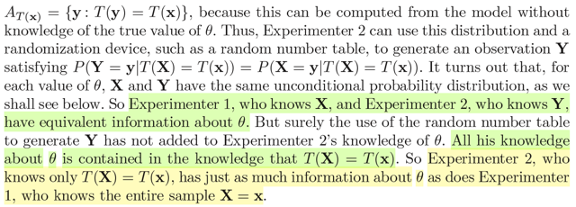</kbd>

<kbd></kbd>

<kbd>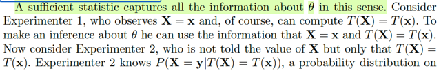</kbd>

> [!NOTE]
> Rồi chỗ này phải đọc kĩ: Đầu tiên, như vậy sufficient statistic nắm bắt mọi
> thông tin về θ theo cách hiểu này.
>
> Vì hãy nghĩ đến ý nghĩa của việc P(**X**=**x**| T(**X**)=T(**x**)) không phụ
> thuộc θ nữa:  nó có nghĩa là:  Khi đã biết giá trị cụ thể của statistic T(**X**) ,
> tức T(**x**), thì, sẽ biết  được xác suất của việc **X** = **x**,****vốn dĩ là
> một sample - các random variable X1,.. Xn đến từ population distribution có
> tham số θ mà ta chưa biết.
>
> Thế thì đại khái là gs mô tả hai bức tranh: Có hai ông:
>
> Ông 1: Biết được giá trị **X**,****=**x**, và dĩ nhiên apply hàm T(.) lên thì
> ổng có T(**X**), = T(**x**). Và gs nói ổng sẽ dùng thông tin event **X**=**x**và T(**X)**=T(**x**) đã xảy ra để mà suy luận (inference) về θ. (tạm hiểu
> là, bằng cách tính toán nào đó)
>
> Còn ông 2: Chỉ biết T(**X**) có giá trị cụ thể là T(**x),** tức là chỉ biết / có
> giá trị T(**x**),  chứ ko biết giá trị **x**của **X**. (Tức là, ông 1 biết **x**, và
> và T(**x**) tức là biết cả giá trị cụ thể của **X** và T(**X**)., còn ông 2 chỉ
> biết T(**x**), không biết **x**)
>
> Tuy nhiên, vì T(**X**) là một sufficient statistic, nên như đã nói ta biết
> P(**X**=**x**|T(**X**)=T(**x**)) không phụ thuộc θ.
>
> Nên, ông 2 ổng có thể biết được f(**y**) = P(**X**=**y**| T(**X**)=T(**x**))
> bằng cánh tính toán nào đó trên tập A_T(**x**) = {y: T(**y**) = T(**x**)}
>
> Rồi khi đó ổng có thể dùng một cái cơ chế ngẫu nhiên nào đó để mà
> generate **Y**đến từ distribution này sao cho 
> P(**Y**=**y** |T(**X**)=T(**x**)) = P(**X**=**y** | T(**X**)=T(**x**)).
>
> Và hóa ra, với mỗi giá trị của θ, **X**, **Y CÓ CHUNG UNCONDITIONAL
> PROBABILITY DISTRIBUTION**mà mình sẽ chứng minh ngay sau đây.
>
> Nhưng cái chính là, ông 1 biết **X**, ông 2 biết **Y**, thì cả hai đều có thông
> tin của θ.
>
> Nhưng ông Y, tất cả những gì ổng có, chỉ là từ T(**X**) = **x,**hoàn toàn ko
> có / biết**x** nhưng vẫn có đủ thông tin về θ như ông 1, là người biết giá
> trị **x** của **X.**Nói rõ hơn, thì ông 1 ổng có một bộ các giá trị quan sát thấy của **X:**X1 = x1, X2 = x2, ...Xn = xn. Và các X1,X2...Xn ~ population θ 
>
> Nhưng ông 2, bằng cách dựa vào việc T là sufficient statistic ổng tạo
> ra một random sample Y: Y1 = y1, Y2 = y2,....Yn = Yn. Mà ổng nói rằng
> cái bộ này, dù được tạo ra bởi random device lại cũng có cùng population
> distribution với X1,...Xn.
>
> Nếu điều đúng, thì có nghĩa là việc biết giá trị T(**x**) của T(**X**), đã nắm bắt
> được mọi thông tin của θ rồi.

 

<kbd>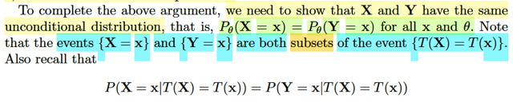</kbd>

> [!NOTE]
> Rồi, thế thì. Hôm qua mình dừng lại ở định nghĩa về sufficient statistic:
>
> Ôn lại chút xíu về bối cảnh cho đến nay:
>
> Ta biết về định nghĩa của random sample. X1,X2...Xn là các random variables
> mang giá trị đại diện cho việc quan sát một biến cố ngẫu nhiên nào đó trong
> một population. X1,..Xn sẽ iid: có chung marginal distribution, và độc lập.
>
> Đặt nó vào vector **X**: (X1,...Xn). và gọi một giá trị cụ thể của chúng: x1,x2...
> xn là vector **x.**Thế thì nói về statistic, thì nó là một random variable có được khi apply hàm
> T lên các random variable T(X1,...Xn), hay T(**X**) cho gọn.
>
> Và nếu như statistic T này, tức hàm T này, có tính chất sao cho:
>
> dựa trên việc biết một giá trị cụ thể của rv T(**X**), tức T(**x**) thì xác suất của **X**ko
> còn phụ thuộc parameter của population nữa:
>
> P(**X** = **x**|****T(**X**) = T(**x**)), không còn phụ thuộc θ nữa.
>
> Thì khi đó T(**X**) gọi là sufficient statistic.
>
> Và bức tranh của hai ông 1, 2: Ông 1 ổng có được một bộ các giá trị của
> random sample  X1=x1, X2=x2....Xn=xn, tức là ổng có **X**,****=**x**, và dĩ
> nhiên ổng cũng sẽ biết T(**X**), = T(**x**)****Nhưng ông 2, ổng chỉ có đúng một cái: T(x1,...xn) = T(**x**), ví dụ như ông 1
> tính T(**X**) bằng cách apply hàm T lên **x**(vì ổng có giá trị **x** của **X**
> như đã nói) và đưa sang cái T(**x**) cho ông 2.****Nên ông 2 không biết **X**, hay (X1, X2...Xn) có giá trị gì (là cái **x** mà ông 1
> biết),  mà nhờ ông 1 đưa sang cho cái T(**x**) nên ông 2 biết được giá trị
> T(**x**) của T(**X**) mà  thôi
>
> (cái rắc rối của cái này chỉ là vấn đề kí hiệu)
>
> Lấy ví dụ dễ hiểu: Ông 1 biết X1 = 1 X2 = 3. Tức biết **X**=****(1, 3), hay **x**
> là (1, 3) Rồi ổng tính T(X1, X2) = cách apply hàm T lên giá trị 1,3. Để ổng có
> T(1,3)  = 5 chẳng hạn. Đây chính là T(**X**), mà giá trị 5 chính là T(**x**).
>
> Ổng đưa số 5 này sang cho ông 2. Thì ông 2 chỉ biết con số 5, là giá trị của 
> T(**X**), chứ ko biết X1 bằng mấy, X2 bằng mấy.
>
> ====
>
> Thế thì câu chuyện là T(**X**) (nhấn vào T) là một sufficient statistic, thì từ việc
> định nghĩa của sufficient statistic cho ta biết rằng biết giá trị của T(**X**) thì sẽ
> biết giá trị xác suất của **X**, mà ko cần θ nữa...
>
> (mà nếu ko có điều này, thì biết giá trị của T(**X**) cũng ko cho phép tính xác
> suất của **X**,  vì bản thân xác suất T(**X**) cũng phụ thuộc θ)
>
> ...nên ổng (ông 2) mới xây dựng được phân phối xác suất điều kiện của **X**
> dựa trên T(**X**) đã biết. =****T(**x**) mà ở ví dụ này đang = 3 đó, tức là ông 2
> xây dựng được****một hàm số f(**x**) mà bỏ **x** nào đó****vào, ta sẽ có
> được P(**X** = **x** | T(**X**) = T(**x**))
>
> Rồi, sau khi ông 2 có cái hàm f(**x**) thì ổng mới dùng cách nào đó để
> generating các random variable **Y**, có phân phối xác suất pmf f**Y**, hay P(**Y** =
> **y**) mà ta chưa biết nhưng ta vẫn có thể có cách tạo ra sao cho giá trị của
> P(**Y** = y | T(**X**) = T(**x**))  (tức là xác suất của việc **Y**= **y**, dựa trên việc biết
> T(**X**) = T(**x**)) bằng với f(**y**) ở trên.
>
> Có nghĩa là khúc này ta tạm chấp nhận là có thể tạo ra Y sao cho:
>
> P(**Y** = **x** | T(**X**) = T(**x**))  = P(**X** = **x** | T(**X**) = T(**x**))
>
> Và điều hay ho là, **Y**, tức Y1, Y2,...Yn cũng có marginal distribution là cùng
> một thứ  với X1, X2...
>
> ====
>
> Cần chú ý, sự rối rắm, khó hiểu chủ yếu đến từ các kí hiệu.
>
> Khi nói về P(**X** = **x** | T(**X**) = **x**), thì ta hiểu rằng, đây là một hàm phụ
> thuộc **x**, tức là, nó là cái hàm f(**x**) nào đó, mà gía trị f(**x**), tức là bỏ **x**
> vô, tính ra f(**x**). Sẽ cho ta biết giá trị mang ý nghĩa là "nếu biết T(**X**) =
> **x**, thì xác suất (của việc) **X** = **x** là bao  nhiêu)
>
> Còn nói về P(**Y** = **x** | T(**X**) = **x**), thì tương tự, sẽ là function g(**x**)
> nào đó, mà khi bỏ **x** vào, thì lại cho ta biết, à, nếu dựa trên việc quan sát,
> bắt được giá trị của T(**X**) (= **x**) thì xác suất **Y** = **x**là bao nhiêu.
>
> Nhưng, khi nói, ta tạo ra **Y**, sao cho g(**y**) = f(**y**), thì chính là: **Y**là
> một random  variable khác, khác với **X**, nhưng ta tạo **Y** sao cho tại **y**
> thì g(**y**) bằng với f(**y**)

> [!NOTE]
> Vậy thì cơ sở cho cái này, ta sẽ phải chứng minh P(**Y**=**x**) , tức pmf của Y
> (tức joint  pmf của Y1,....Yn) tại x, phải bằng pmf của X tại x: P(**X**=**x**)
>
> Xét event **X**= **x**, nó là subset của T(**X**) = T(**x**). Vì sao?
>
> **X**=**x,**mình hiểu bản chất của nó là {s ∈ Ω: **X**(s) = **x**}
>
> là sao, bản chất của random variable là function. Nên X1, X2,...là các function
> map từ sample space Ω tới tập số thực.
>
> Do đó **X**= (X1,...Xn) cũng chỉ là function, mapping từ s trong Ω tới R^n **X**(s)
> = (X1(s),... Xn(s))
>
> Nên event **X** = **x**, cũng là X1=x1, X2=x2,... thật ra chính là event:
>
> {s ∈ Ω: X1(s) = x1,...Xn(s) = xn}, đó chính là {s ∈ Ω: **X**(s)****= **x**}
>
> Rồi, thế thì nếu X1(s) = x1 ⇨ T(X1(s)) = T(x1),....Xn(s) = xn ⇨ T(Xn(s)) = T(xn)
>
> Hay gom chung lại **X**(s) = **x** ⇨ T(**X**(s)) = T(**x**)
>
> Vậy s ∈  {s ∈ Ω: X(s) = x} thì s cũng thuộc  {s ∈ Ω: T(**X**(s)) = T(**x)**}
>
> nên tập {s ∈ Ω:**X**(s) = **x**} ⊂ {s ∈ Ω: T(**X**(s)) = T(**x)**}
>
> Và đây chính là {**X** = **x**}****⊂****{T(**X**) = T(**x**)}
>
> ===
>
> Rồi, xét {**Y** = **x**}, về bản chất cũng là {s ∈ Ω: **Y**(s) = **x**},
>
> Thế thì trước khi đi tiếp ta phải ôn lại **CÁCH TẠO RA** **Y**:
>
> **Y** được tạo ra, tức là nó mang giá trị **y**, sao cho: 
>
> P(**Y** = **y** | biết T(**X**) = T(**x**)) = P(**X** = **y** | biết T(**X**) = T(**x**))
>
> Giả sử đặt T(**x**) = t0 đi, thì việc tạo được **Y** = **y**, **hàm** **ý** **xác suất event này dương**,
> vì nếu ko dương, thì nó đã không xảy ra.
>
> Nhắc lại ý quan trọng: Tạo được **Y** = **y**, ⇨ chứng tỏ P(**Y** = **y** | T(**X**) = T(**x**)) dương
>
> ⇨ P(**X** = **y** | T(**X**) = T(**x**)) > 0 
>
> Như vậy y phải là một giá trị nằm trong một partition At0 = {**x**: T(**x**) = t0}, vì nếu ko, 
> event **X** = **y** , T(**X**) = t0 ko thể xảy ra, do ta biết xác suất của event **X** = **y**| T(**X**) = T(**x**)
> = xác suất của joint event **X** = **y**, T(**X**) = T(**x**) = t0, và nó chỉ dương khi **y**∈****A_t0
> là preimage của {t = t0}, tức {**z** ∈ range **X**: T(**z**) = t0}
>
> P(**X** = **y** | T(**X**) = T(**x**)) > 0 ⇔ **y** ∈ A_t0 = {**z**∈**range X**: T(**z**) = t0 = T(**x**)}
>
> Vậy y luôn thuộc A_t0, hay, A_T(**x**), cũng là nói, **mọi possible value của Y đều
> thuộc A_t0**, hay A_T(**x**)
>
> Quay lại, xét event {**X** = **x**}, {**Y** = **x**}
>
> bản chất là {s ∈ Ω: **X**(s) = **x**} và {s ∈ Ω: **Y**(s) = **x**} 
>
> Rồi xét tập {T(**X**) = T(**x**) = t0} có bản chất là {s: T(**X**(s) = T(**x**) = t0)
>
> thì như đã lập luận ở trên {**X** = **x**} ⊂ {T(**X**) = T(**x**) = t0}
>
> ====
>
> Còn {**Y** = **x**}, = {mọi possible value **y** của Y sao cho **y** = **x**}
>
> = {s ∈ Ω: **Y**(s) = **x**} 
>
> Để chứng minh {**Y** = **x**} ⊂ {T(**X**) = T(**x**) = t0} ta sẽ chứng minh phản chứng:
>
> Giả sử tồn tại s' ∈ {**Y** = **x**} nhưng không ∈ {T(**X**) = T(**x**) = t0}
>
> Tức là s' ∈ A = {s ∈ Ω: **Y**(s) = **x**} nhưng không ∈ B = {T(**X**(s)) = T(**x**) = t0}
>
> s' không thuộc B ⇨ T(**X**(s')), đặt là t' sẽ khác T(**x**), tức khác t0: t' ≠ t0
>
> s' thuộc A ⇨ **Y**(s') = **x**Mà, xét quá trình tạo ra Y: s' xảy ra (vì đã nói Y = **x**, xảy ra với outcome 
> gốc là s'****⇨****Y(s') = **x**xảy ra)
>
> Mà s' xảy ra thì giá trị cụ thể quan sát được của **X** sẽ là **X**(s'), apply statistic T(.)
> ta có T(**X**(s')), như trên ta đã đặt = t'
>
> Rồi theo quy trình tạo **Y**, giá trị cụ thể của **Y**, được tạo ra từ một phân phối mà
> ông 2 xây dựng: f(**y**| T(**X**) = T(**x**)) = P(**X** = **y** | T(**X**) = T(**x**)) sao cho:
>
> tức là giá trị **y của Y** sẽ phải thỏa P(**Y** = **y** | T(**X**) = T(**x**)) = f(**y**| T(**X**) = T(**x**))
>
> Thế thì giá trị của **Y** ở đây đang nói, là **x, và gía trị của T(X) đang là t'** nên:
>
> **x được tạo ra bởi**P(**Y** = **x** | T(**X**) = t') = P(**X** = **x** | T(**X**) = t')
>
> Viết lại: **x** được tạo ra bởi P(**X** = **x** | T(**X**) = t')
>
> và ý quan trọng đó là **Y** = **x**đã xảy ra, nên xác suất này dương
>
> ⇨ P(**X** = **x** | T(**X**) = t') > 0
>
> ⇨ P(**X** = **x** , T(**X**) = t') > 0
>
> Điều này vô lí. Vì **X** = **x** ⇔ T(**X**) = T(**x**) = t0 và vì t0 khác t' nên nó không giao với T(**X**) = t' 
>
> Hay, nói cách khác, **đây là một tập rỗng**, xác suất phải bằng 0
>
> Do đó s' thuộc A thì nó cũng phải thuộc B ⇨ A subset của B. Chứng minh xong
> {**Y** = **x**} ⊂ {T(**X**) = T(**x**)}
>
> Vậy ta hiểu vì sao {**Y** = **x**} và {**X** = **x**} đều ⊂ {T(**X**) = T(**x**)}
>
> đồng thơi cũng hiểu vì sao P(**X** =**x** | T(**X**) = T(**x**)) = P(**Y** = **x** | T(**X**) = T(**x**))

 

<kbd>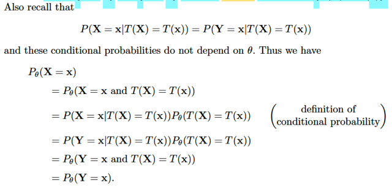</kbd>

> [!NOTE]
> Rồi, tiếp tục,
>
> P_θ(**X** = **x**)
>
> vì đã hiểu vì sao {X = x} ⊂ {T(X) = T(x)} nên
>
> .. = P_θ(**X** = **x**, T(**X**) = T(**x**)}
>
> dùng conditional probability theorem:
>
> .. = P_θ(**X** = **x** | T(**X**) = T(**x**)) P(T(**X**) = T(**x**))
>
> và vì P_θ(X = x | T(X) = T(x)) ko phụ thuộc θ nữa theo định nghĩa của sufficient
> statistic
>
> .. = P(**X** = **x** | T(**X**) = T(**x**)) P(T(**X**) = T(**x**))
>
> và vì P(**X** = x | T(**X**) = T(**x**)) = P(**Y** = **x** | T(**X**) = T(**x**)) như đã
> biết
>
> .. = P(**Y** = **x** | T(**X**) = T(**x**)) P(T(**X**) = T(**x**))
>
> = P_θ(**Y** = **x**, T(**X**) = T(**x**))
>
> = P_θ(**Y** = **x**)
>
> Và ta đã chứng minh xong là marginal distribution của X, Y là GIỐNG NHAU

 

<kbd>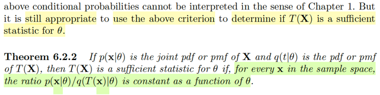</kbd>

<kbd></kbd>

<kbd>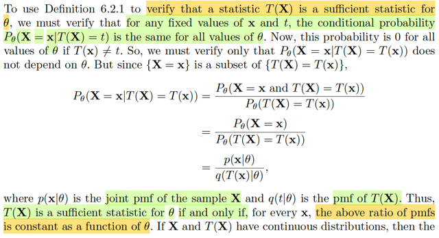</kbd>

> [!NOTE]
> Lập luận tiếp theo ở đây là, để xác nhận T(**X**) là sufficient statistic của / cho
> θ. Thì ta phải verify rằng, với bất kì fixed values của **x** và t thì conditional
> probability P_θ(**X** = x | T(**X**) = t) đều giống nhau với mọi value của θ, có nghĩa
> là nó không phụ thuộc θ.
>
> Rồi, xét P_θ(**X** = **x** | T(**X**) = t), = P_θ(**X** = **x**, T(**X**) = t) / P(T(**X**) = t)
>
> thì tử số, vì **X** = **x** ⊂ T(**X**) = t (= T(**x**)) như đã nói / biết trong note trước.
>
> Nên P_θ(**X** = **x**, T(**X**) = t) = P_θ(**X** = **x**)  (A ⊂ B ⇨ A ∩ B = A ⇨ P(A ∩ B) = P(A))
>
> Nên ta có P_θ(**X** = **x**) / P(T(**X**) = t)
>
> và tử số, dĩ nhiên chính là joint pmf của **X,** tức X1,X2,....Xn. ta kí hiệu là p(**x**|θ)
>
> còn mẫu số là pmf của random variable T(**X**), kí hiệu là q(T(**X**) | θ)
>
> Và như vậy để conditional probability ở trên ko phụ thuộc θ thì cái tỉ số này 
> **XÉT Ở GÓC ĐỘ CỦA MỘT HÀM SỐ THEO θ PHẢI LÀ MỘT CONSTANT**Và đó là nội dung của theorem 6.2.2. 
>
> Một lưu ý đã từng nói, đại khái để hoàn toàn hiểu theorem này, ta phải có
> cách hiểu toàn diện hơn về conditional probability hơn là theo những gì chap1
> đã học vì với **X**, T(**X**) continuous thì P(**X** = **x**), P(T(**x**) = t) sẽ bằng 0. Nhưng
> đại khái nói chung là **vẫn có thể dùng** cái này để xác định T(**X**) có phải sufficient
> statistic cho θ hay không, tức là vẫn dùng p(**x**|θ), lúc này là joint pdf của **X**và
> ở mẫu số là pdf của T(**X**)
>
> Từ đó, những phần sau ta sẽ dùng điều kiện này để xét lại xem một số statistic
> thông dụng có phải là sufficient statistic

 

<kbd>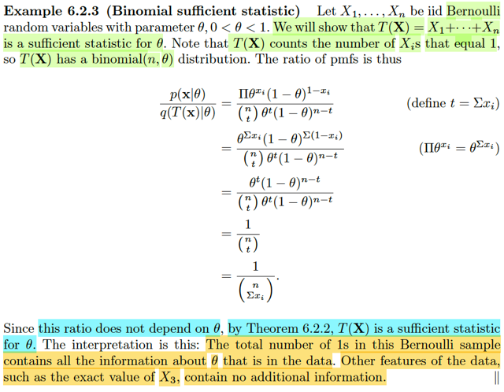</kbd>

🔗 **Related:** [7.3 METHODS OF EVALUATING ESTIMATORS](73_methods_of_evaluating_estimators.md#node-646)

> [!NOTE]
> Đầu tiên, xét random sample **X**: X1,...Xn ~ Bern(θ). Và ta sẽ chứng minh rằng
> T(**X**) = X1 + ..Xn chính là một **SUFFICIENT STATISTIC của θ**.
>
> Thế thì, như đã nói, theo theorem vừa rồi ta cần chứng minh tỉ số p(**x**|θ) / q(T(**x**)|θ) 
> là constant.
>
> p(**x**|θ), tức P_θ(**X**= **x**) = P(X1 = x1, ....Xn = xn)
>
> Mà X1,...Xn là các random variable của một random sample, dĩ nhiên ta biết
> chúng iid. ⇨ joint pmf = tích các marginal pmf, và là pmf của Bern(θ): P(X=1) 
> = θ và P(X=0) = 1 - θ 
>
> ⇨ P(X=x) = θ^x(1 - θ)^(1-x) Cái này ko khó hiểu.
>
> ⇨ P_θ(**X** = **x**) = Πi=1:n θ^xi(1 - θ)^(1-xi) 
>
> = θ^(Σixi) (1 - θ)^[Σi(1-xi)]
>
> = θ^t (1 - θ)^(n - t)
>
> Còn P_θ(T(**X**) = t)
>
> Với T(**X**) = X1 + ...Xn thì dễ thấy nó có story là số Bern trial success trong chuỗi
> iid Bern(θ) trial, Stat110 đã dạy ta rằng, T(**X**) là một Binomial(n, θ)
>
> ⇨ P(T(**X**) = t) = (n choose t) θ^t (1 - θ)^(1 - t)
>
> ⇨ Tỉ số đang xét = [θ^t (1 - θ)^(n - t) / (n choose t)] [θ^t (1 - θ)^(1 - t)]
>
> = [(1 - θ)^(n - t) / (n choose t)] [(1 - θ)^(1 - t)]
>
> =**1 / (n choose t)
>
> kết quả này rõ ràng hoàn toàn không phụ thuộc θ nữa.**Do đó T(**X**) = X1 + ,,,Xn
> là sufficient statistic của θ

 

<kbd>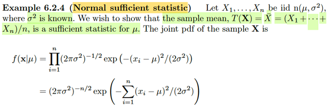</kbd>

<kbd></kbd>

<kbd>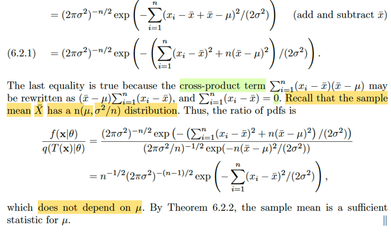</kbd>

🔗 **Related:** [6.2 THE SUFFICIENT PRINCIPLE](62_the_sufficient_principle.md#node-516)

> [!NOTE]
> Tương tự, với X1,....Xn là random sample ~ n(μ, σ^2) với σ đã biết.
>
> Thì ta sẽ chứng minh sample mean T(**X**) = X1 + ...Xn là sufficient statistic
> của / cho μ
>
> Thế thì, như đã quen ta cần check tỉ số p(**x**|θ) và q(T(**x**)|θ)
>
> tương tự, như đã nói, dù đây là biến liên tục cần phải hiểu / xét conditional
> probability P(X = x | T(X) = t) theo cách khác, nhưng cái điều kiện mà ta có
> ở theorem 2:  p(x|θ) và q(T(x)|θ) vẫn có thể được dùng để xem xét sufficient
> statistic.
>
> Nên ở đây p(**x**|θ) sẽ là joint pdf của X1,...Xn iid
>
> = tích các marginal pdf, 
>
> với X ~n(μ, σ^2) ta biết fX(x) = (1/2πσ^2)^(-1/2) exp[-(x - μ)^2 / 2σ^2]
>
> ⇨ f**X**(**x**) = Πi=1:n (1/2πσ^2)^(-1/2) exp[-(xi - μ)^2 / 2σ^2]
>
> = [(1/2πσ^2)^(1/2)]^n {exp Σi[-(xi - μ)^2 / 2σ^2]}
>
> = [(1/2πσ^2)^(n/2)] {exp Σi[-(xi - μ)^2 / 2σ^2]}
>
> = [(1/2πσ^2)^(n/2)] {exp (1/2σ^2) [-Σi (xi - μ)^2]}
>
> = [(1/2πσ^2)^(n/2)] {exp (1/2σ^2) [-Σi (xi - xbar + xbar - μ)^2]}
>
> = [(1/2πσ^2)^(n/2)] {exp (1/2σ^2) [-Σi [(xi - xbar) + (xbar - μ)]^2]}
>
> = [(1/2πσ^2)^(n/2)] {exp (1/2σ^2) [-Σi [(xi - xbar)^2 + (xbar - μ)^2 + 2(xi - xbar)(xbar - μ)]]}
>
> = [(1/2πσ^2)^(n/2)] {exp (1/2σ^2) [-[Σi(xi - xbar)^2 + Σi(xbar - μ)^2 + 2Σi(xi - xbar)(xbar - μ)]]}
>
> = [(1/2πσ^2)^(n/2)] {exp (1/2σ^2) [-[Σi(xi - xbar)^2 + n(xbar - μ)^2 + 2Σi(xi - xbar)(xbar - μ)]]}
>
> Xét riêng cái này Σi(xi - xbar)(xbar - μ) = (xbar - μ) Σi(xi - xbar) = (xbar - μ) (nxbar - nxbar) 
> = 0
>
> ... = [(1/2πσ^2)^(n/2)] {exp (1/2σ^2) [-[Σi(xi - xbar)^2 + n(xbar - μ)^2]]}
>
> Còn mẫu số q(T(**x**)|θ), tức = q(T(**x**)|μ)
>
> Thì gs nhắc rằng ta đã biết sample mean T(**X**) = (X1 + ... Xn) / n
>
> chính là một n(μ, σ^2/n) random variable.
>
> Vì sao nhỉ? Có thể chứng minh nhanh:
>
> mgf của X~ n(μ, σ^2): MX(t) có bản chất ý nghĩa là E[e^Xt], tức apply hàm g(u) = e^tu
> lên X để có random variable mới e^tX, và lấy kì vọng.
>
> Và ta sẽ nhớ công thức của nó là MX(t) = e^(μt + σ^2t^2/2)
>
> ⇨ M(X1+..Xn)/n (t) = E[e^(X1+..Xn)t/n] = E[e^X1t/n*....e^Xnt/n]
>
> Mà X1,...Xn độc lập thì các rvs e^X1t/n, ...e^Xnt/n cũng vậy
>
> Và với X, Y độc lập thì E(XY) = EXEY
>
> ⇨ E[e^X1t/n*....*e^Xnt/n] = E[e^X1t/n] *...* E[e^Xnt/n]
>
> = MX1(t/n) *...*MXn(t/n) 
>
> và vì X1,..Xn đều có chung marginal distribution 
>
> = e^(μt/n + σ^2t^2/2n^2)*...*e^(μt/n + σ^2t^2/2n^2) 
>
> = e^(μt/n + σ^2t^2/2n^2)^n 
>
> = e^(μt + σ^2t^2/2n)
>
> = e^(**μ**t + (**σ^2/n**) t^2/2)
>
> Và đây có dạng mgf của một normal(μ, σ^2/n)
>
> Do đó q(T(**x**)|μ) = như trong sách.
>
> Và tỉ số này rút gọn lại ko còn μ nữa.
>
> ⇨ sample mean là sufficient statistic của μ đv normal

 

<kbd>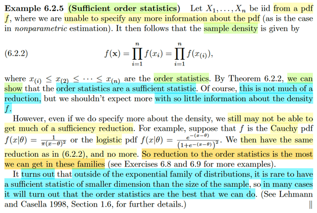</kbd>

🔗 **Related:** [8.2 METHOD OF FINDING TESTS](82_method_of_finding_tests.md#node-677)

> [!NOTE]
> Rồi, đại ý giáo sư Casella là thế này. Nãy giờ, với các vị dụ về Binomial và
> Normal, thì ta thấy sample sum, sample mean là sufficient statistic. Mà điều
> này có nghĩa là, thay vì phải lưu trữ n con số (giá trị của các  random
> variable X1,...Xn) thì chỉ cần một con số sample mean / sum cũng đủ phản
> ánh population param θ rồi.
>
> Và đó chính là việc ta đã nén được data (data reduction) hiệu quả.
>
> Nhưng qua ví dụ này, khi ta có random sample X1,...Xn chỉ biết ~ pdf f thì
> ông nói rằng: cái tốt nhất mà ta làm được, chỉ là bỏ đi thứ tự xuất hiện của
> X1,...Xn (bằng cách chỉ xét giá trị của chúng theo thứ tự nhỏ đến lớn)
>
> Để rồi CÁI BỘ n random variables X(1),...X(n), là các order statistic như đã
> biết,  CHÍNH LÀ MỘT SUFFICIENT STATISTIC.
>
> CÓ NGHĨA LÀ, không như hai case trước, nơi mà ta đã thấy sufficient
> statistic là MỘT RANDOM VARIABLE DUY NHẤT  ví dụ sample sum, hay
> Xbar (sample mean), hoặc có thể coi như một random variable vector CHỈ
> CÓ MỘT COMPONENT, MỘT CHIỀU, DIM = 1
>
> Còn ở đây, SUFFICIENT STATISTIC, VẪN LÀ MỘT RANDOM VARIABLE
> VECTOR CÓ n RVS, DIM VẪN BẰNG n. Tức là, ta vẫn phải lưu trữ n con
> số, CHẲNG QUA LÀ KO CẦN CARE THỨ TỰ XUẤT HIỆN CỦA CHÚNG
> mà thôi
>
> Do đó gs mới nói trong case này, nói data reduction thì cũng ko reduce mấy.
> nhưng điều này cũng hợp lí trong bối cảnh ta ko biết f (population
> distribution) là cái cóc khô gì.
>
> Và ông nói HÓA RA, CHỈ DUY NHẤT CÁI EXPONENTIAL FAMILY (mà
> binomial, normal là thành viên) LÀ CÓ THỂ CÓ SUFFICIENT STATISTIC
> DIMENSION NHỎ HƠN KÍCH THƯỚC CỦA SAMPLE MÀ THÔI (ví dụ như
> từ n → 1)
>
> Còn với các family khác (như Cauchy, Logistic) thì ORDER STATISTIC LÀ
> CÁI TỐT NHẤT RỒI.

 

<kbd>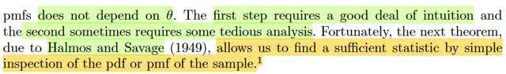</kbd>

<kbd></kbd>

<kbd>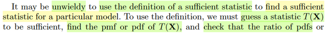</kbd>

> [!NOTE]
> đại khái là gs cho rằng ta nếu ta dùng định nghĩa của sufficient statistic để
> mà chứng minh một statistic T(.) là sufficient statistic thì có thể sẽ rất cồng
> kềnh (unwieldly) vì ta sẽ phải 1) Đoán, chọn một T(.) mà ta nghi là sufficient
> và 2) Tìm pdf và pmf của T(.) (bởi vì mình cần phải chứng minh tỉ số 
> p(**x**|θ) / q(T(**x**)|θ) với p là joint pmf của **X**và q là pmf của T(**X**) là ko phụ thuộc
> θ, tức là constant
>
> Tuy nhiên tiếp theo theorem sẽ cho ta cách khác gọn hơn

 

<kbd>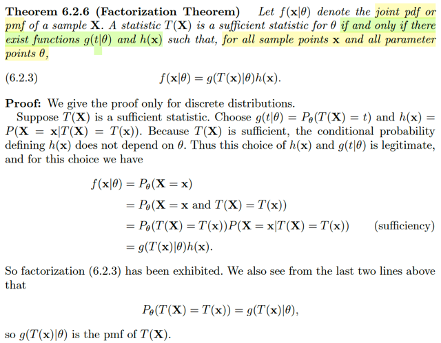</kbd>

🔗 **Related:** [6.3 THE LIKELIHOOD PRINCIPLE](63_the_likelihood_principle.md#node-532)

🔗 **Related:** [8.2 METHOD OF FINDING TESTS](82_method_of_finding_tests.md#node-679)

> [!NOTE]
> Đầu tiên theorem đó nói rằng: gọi f(**x**|θ) là joint pmf/pdf của sample **X**. Một
> statistic T(**X**) được gọi là sufficient statistic cho θ nếu và chỉ nếu tồn tại các
> function g(t|θ) và h(**x**) sao cho: Với mọi sample point **x**, và mọi parameter
> points θ ta đều có:
>
> f(**x**|θ) = g(T(**x**)|θ)h(**x**)
>
> Để chứng minh chiều đi, ta giả sử T(**x**) là một sufficient statistic:
>
> Thì xét f(**x**|θ), và đang chứng minh cho discrete case, thì đây là joint pmf
> của **X**: P_θ(**X** = **x**)
>
> Ta đã biết {**X** = **x**} ⊂ {T(**X**) = T(**x**)} ⇨ {**X** = **x**, T(**X**) = T(**x**)} = {**X** = **x**}****Nên P_θ(**X** = **x**) = P_θ(**X** = **x**, T(**X**) = T(**x**)}
>
> = P_θ(**X** = **x**|T(**X**) = T(**x**))*P_θ(T(**X**) = T(**x**))
>
> Thế thì cái term thứ nhất, theo định nghĩa của sufficient statistic thì nó sẽ
> không phụ thuộc θ nữa. Nên nó là P(**X** = **x**|T(**X**) = T(**x**)), là một hàm chỉ phụ
> thuộc x: h(**x**)
>
> Còn P_θ(T(**X**) = T(**x**)), dĩ nhiên đây chính là pmf của statistic T(**X**), evaluate
> tại T(**x**). Ta kí hiệu nó là g(T(**x**)|θ) ⇨ Chứng minh xong chiều đi.

 

<kbd>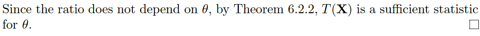</kbd>

<kbd></kbd>

<kbd>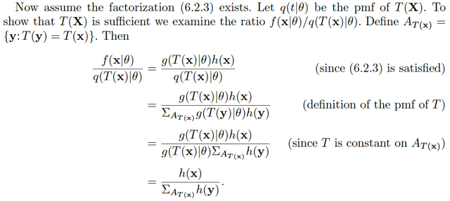</kbd>

> [!NOTE]
> Để chứng minh chiều về: Ta giả sử tồn tại g và h sao cho g(**x**|θ) =
> g(T(**x**)|θ)h(**x**) ta sẽ cần chứng minh T(**X**) là sufficient statistic, theo định
> nghĩa, bằng cách chứng minh tỉ số p(**x**|θ) / q(T(**x**)|θ) bằng constant nếu xem là
> function theo θ.
>
> Rồi, xét tỉ số này, p(**x**|θ) / q(T(**x**)|θ) = g(T(**x**)|θ) h(**x**) / q(T(**x**)|θ)
>
> Định ra A_T(**x**), là pre-image của {t = T(**x**)}, tức là tập {**y**∈ R^n: T(**y**) =
> T(**x**)}
>
> Khi đó xét q(T(**x**)|θ), tức P_θ(T(**X**) = T(**x**))
>
> Đặt T(**x**) = t0, thì cái mẫu số P_θ(T = t0)
>
> {T = t0} ⊂ {T = t0 ∩ Ω} = {T = t0 ∩ (U_z {**X** = **z**}) | U_**z**: union qua mọi
> possible value **z** của **X**
>
> = U_**z** (T = t0 ∩ **X** = **z**)
>
> = [U_**z** ∈ At0 (T = t0 ∩ **X** = **z**)] U [U_**z**không thuộc At0 (T = t0 ∩ **X** =
> **z**)]
>
> = U_**z** ∈ At0 (T = t0 ∩ **X** = **z**)
>
> ⇨ P(T = t0) = P[U_**z** ∈ At0 (T = t0 ∩ **X** = **z**)]
>
> = Σ**z** ∈ At0 P_θ(T = t0 ∩ **X** = **z**)
>
> = Σ**y** ∈ At0 P_θ(T = t0 ∩ **X** = **y**)
>
> = Σ**y** ∈ At0 P_θ(T = t0 | **X** = **y**) P(**X** = **y**)
>
> = Σ**y** ∈ At0 P_θ(T(**X**) = t0 | **X** = y) P(**X** = **y**)
>
> = Σ**y** ∈ At0 P_θ(T(**X**) = t0 | **X** = y) P(**X** = **y**)
>
> = Σ**y** ∈ At0 [1 * P_θ(**X** = **y**)]
>
> = Σ**y** ∈ At0 P_θ(**X** = **y**)
>
> = Σ**y** ∈ At0 f(**y**|θ)
>
> Và theo assumption là tồn tại g, h sao cho f(**x**|θ) = g(T(**x**)|θ)h(**x**)
>
> ⇨ ..= Σ**y** ∈ At0 g(T(**y**)|θ)h(**y**)
>
> ⇨ ratio = p(x|θ) / q(T(x)|θ)
>
> = g(T(**x**)|θ) h(**x**) / Σ**y** ∈ At0 g(T(**y**)|θ)h(**y**)
>
> Mà trong cái sum này Σ**y** ∈ At0 g(T(**y**)|θ)h(**y**) thì g(T(**y**)|θ) là hằng số, vì
> với mọi **y** ∈ At0 thì T(**y**) luôn bằng t0 (tức T(**x**))
>
> ⇨ .. = g(T(**y**)|θ) Σy ∈ At0 h(**y**)
>
> = g(t0|θ) Σ**y** ∈ At0 h(**y**)
>
> = g(T(**x**)|θ) Σ**y** ∈ At0 h(**y**)
>
> ⇨ ration = g(T(**x**)|θ) h(**x**) / g(T(**x**)|θ) Σy ∈ At0 h(**y**)
>
> = h(**x**) / Σ**y** ∈ At0 h(**y**)
>
> Kết quả này không còn phụ thuộc θ nữa, tức là constant theo θ.
>
> ⇨ Chứng minh xong

 

<kbd>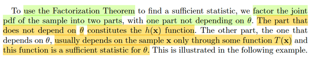</kbd>

<kbd></kbd>

<kbd>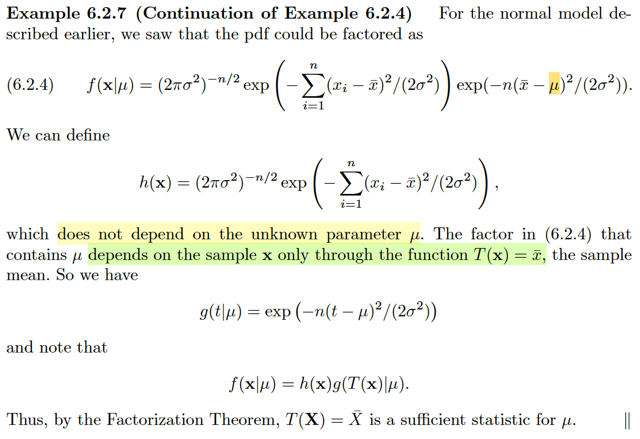</kbd>

> [!NOTE]
> Rồi, đại khái là. Để áp dụng theorem này trong việc tìm ra sufficient statistic của
> một population parameter θ. Ta sẽ chỉ cần:
>
> 1) Factor joint pdf/pmf của sample f(**x**|θ) thành tích của hai phần:
>
> Một phần không phụ thuộc θ nữa, là h(**x**)
>
> Một phần phụ thuộc θ 
>
> Thì trong cái phần phụ thuộc θ này, ta sẽ xem thử nó phụ thuộc sample **x thông
> qua hàm số nào, thì hàm số đó chính là sufficient statistic.**Trong ví dụ này, joint pdf/pmf của sample **X**, như****đã biết từ ví dụ 6.2.4
>
> và thấy nó có thể được factor thành:
>
> f(**x**|μ) = (2πσ^2)^(-n/2) exp[-Σ(xi-xbar)^2/(2σ^2)] exp(-n(xbar-μ)^2/(2σ^2)
>
> Thế thì cái phần đầu ko dính tới μ, hính là h(**x**)
>
> Còn cái phần sau, còn dính tới μ:  exp(-n(xbar-μ)^2/(2σ^2)
>
> thì ta thấy rằng nó chính là hàm g(xbar|μ), tức là nó sẽ phụ thuộc sample value **x**
> thông qua T(**x**) = xbar. Do đó, theo theorem này, T(**X**) = Xbar chính là sufficient
> statistic cho μ

 

<kbd>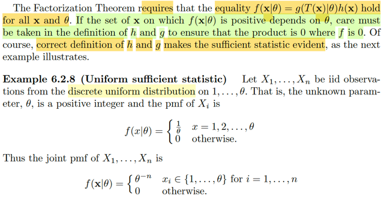</kbd>

> [!NOTE]
> X1,...Xn là random sample từ discrete uniform distribution 1,....θ. 
>
> là sao?
>
> Có nghĩa là các random variables X1,X2,...Xn là các discrete rvs
> có các possible values là 1,2...θ với xác suất bằng nhau.
>
> Vậy ví dụ xét X1. Ta biết rằng Σx=1,2...θ P(X1 = x) = 1 theo axiom 2
>
> ⇔ θ P(X1 = x) = 1 Vì với mọi x = 1,2...θ thì P(X1 = x) đều bằng nhau
>
> ⇨ P(X1 = x) = 1/θ, x = 1,2..θ 
>
> Và đây chính là pmf của X1, dĩ nhiên cũng là của X2,....Xn.
>
> Do đó mới mọi pmg của Xj là f(x|θ) = 1/θ với x = 1,2....θ và = 0 otherwise
>
> Rồi, với việc X1,...Xn iid thì joint pmf = tích marginal pmf
>
> ⇨ P(**X**= **x**) = P(X1=x1)*...P(Xn=xn)
>
> = f(x1|θ)*...f(xn|θ)
>
> = (1/θ)^n = 1/θ^n = θ^-n khi xi ∈ {1,2,....θ} và = 0 otherwise

 

<kbd>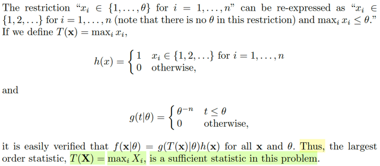</kbd>

🔗 **Related:** [6.2 THE SUFFICIENT PRINCIPLE](62_the_sufficient_principle.md#node-512)

> [!NOTE]
> Rồi, vừa rồi mình đã hiểu joint pmf của **X**: f(**x**|θ) = θ^-n với xi ∈ {1,2..,θ} và 0
> otherwise.
>
> Thế thì, như đã nói, nay nhắc lại cho nhớ, để tìm sufficient statistic của
> θ theo theorem vừa rồi, ta sẽ cần chứng minh f(**x**|θ) có thể tách thành 
> g(T(**x**)|θ)h(**x**), tức là một hàm h(**x**) không phụ thuộc θ và một hàm còn dính
> đến θ và phụ thuộc **x thông qua một hàm T nào đó, khi đó T(X) chính là
> sufficient statistic.**Vậy thì để thấy g, h là gì. Mình sẽ đặt T(**x**) = maxi xi
>
> Khi đó, nói xi ∈ {1,2..,θ} đồng nghĩa với nói xi ∈ {1,2....} và maxi xi (tức T(**x**))
> ≤ θ.
>
> Đặt h(**x**) = 1 khi xi ∈ {1,2,..} và 0 otherwise 
>
> và đặt g(t|θ) = θ^-n khi t ≤ θ và 0 otherwise
>
> f(**x**|θ) = θ^-n khi xi ∈ {1,2,..,θ} và 0 otherwise có thể thể hiện bởi: 
>
> = g(t|θ)h(**x**) với mọi **x**, và θ
>
> Vì sao: 
>
> Xét trường hợp 1: khi xi ∈ {1,2...} và maxi xi ≤ θ thì lúc này:
>
> h(**x**) = 1 
>
> t ≤ θ (vì t = max_i xi) giúp g(t|θ) = θ^-n
>
> Từ đó ⇨ g(t|θ)h(**x**) = θ^-n, điều này khớp với việc khi xi ∈{1,2,...θ} thì f(**x**|θ) 
> = θ^-n
>
> Xét trường hợp 2: Khi xi không thuộc {1,2..θ}, tức xi > θ hoặc xi ≤ 0 thì:
>
> Trường hợp 2a) xi ≤ 0 thì h(**x**) = 0, dẫn đến g(t|θ)h(**x**) = 0
>
> Trường hợp 2b) xi > θ thì tức max_i xi > θ ⇔ t > θ ⇨ theo định nghĩa hàm 
> g(t|θ), lúc này nó bằng 0, cũng dẫn đến g(t|θ)h(**x**) = 0.
>
> Như vậy là ở trường hợp 2 này thì f(**x**|θ) cũng bằng g(t|θ)h(**x**)
>
> Do đó f(x|θ) có thể được factor thành g(t|θ)h(**x**) với h(**x**) không phục thuộc
> θ và hàm g(t|θ) còn phụ thuộc θ và x nhưng trong đó phụ thuộc x thông qua
> hàm T(**x**) = maxi_xi
>
> Như vậy T(**X**) = maxi Xi chính là sufficient statistic của θ

 

<kbd>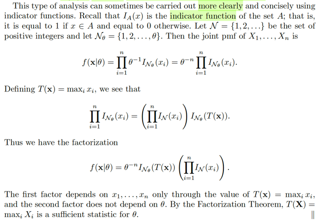</kbd>

> [!NOTE]
> Rồi, ta có thể có cách chứng minh khác rõ ràng hơn bằng cách dùng indicator
> function: Đại khái là vầy. Ta biết I_A(x) sẽ là function mang giá trị 1 khi x ∈ A
> và 0 nếu ngược lại. Vậy thì gọi N là tập các số tự nhiên dương {1,2,...}
> và Nθ = {1,2...θ}.
>
> Khi đó ta sẽ có thể thể hiện joint pmf của sample **X** theo cách khác:****Cách cũ f(**x**|θ) = P(X1=x1)...P(Xn=xn) = Πi=1:n θ^-1 
>
> = (θ^-1)^n nếu x1,x2..xn ∈ {1,2..θ} và = 0 otherwise
>
> Cách mới: f(**x**|θ) = Πi=1:n θ^-1 I_Nθ(xi) 
>
> = θ^-n Πi=1:n I_Nθ(xi) 
>
> Thế rồi, lại xét riêng cái này: Πi=1:n I_Nθ(xi) 
>
> Đây, như đã biết là tích của I_Nθ(x1) * I_Nθ(x2) * ...* I_Nθ(xn) 
>
> Rồi, như nói ở trên xi ∈ {1,2..θ} sẽ tương đương nói xi ∈ {1,2..} và
> maxi xi ≤ θ 
>
> ⇨ Πi=1:n I_Nθ(xi) = Πi=1:n I_N(xi) I_Nθ(maxi xi)
>
> tức Πi=1:n I_N(xi) I_Nθ(T(**x**))
>
> từ đó f(x|θ) = θ^-n Πi=1:n I_N(xi) I_Nθ(T(x))
>
> = θ^-n I_Nθ(T(x)) Πi=1:n I_N(xi)
>
> ⇨ Πi=1:n I_N(xi) đóng vai h(**x**)
>
> và θ^-n I_Nθ(T(**x**)) đóng vai g(T(**x**)|θ)
>
> Do đó theo Factorization theorem, thì T(**X**) = maxi Xi là sufficient statistic

 

<kbd>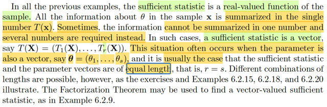</kbd>

> [!NOTE]
> Rồi, đại ý là những ví dụ vừa rồi đều là ta thấy sufficient statistic T(X), là 
> scalar.
>
> Điều này có nghĩa là, trong những tình huống này, mọi thông tin của sample
> có thể được gói gọn trong một con số.
>
> Tuy nhiên, có khi sufficient statistic lại là nhiều con số như không phải một.
> Mà thường thường điều này xảy ra khi population parameter lại là vector
> chứ không phải scalar.
>
> Khi đó T(**X**) là random variable vectors.
>
> ví dụ 6.2.9 sẽ áp dụng Factorization theorem để chứng minh / tìm sufficient
> statistic cho case này

 

<kbd>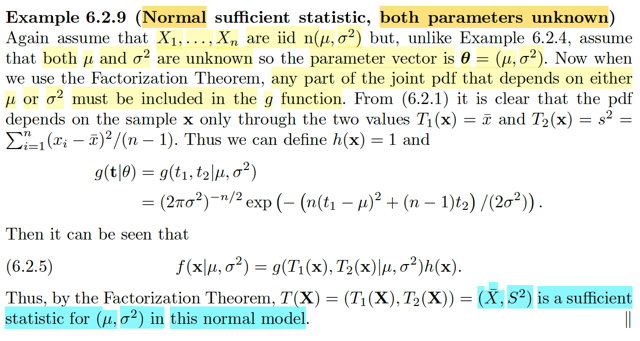</kbd>

> [!NOTE]
> Đại khái là xét lại random sample size n X1,X2...Xn ~ n(μ, σ^2) với cả hai
> param đều chưa biết. ⇨ ta có vector param Θ = (μ, σ^2)
>
> Joint pdf của sample **X**:
>
> f(**x**|Θ) = [(1/2πσ^2)^(n/2)] {exp (1/2σ^2) [-[Σi(xi - xbar)^2 + n(xbar - μ)^2]]}
>
> = [(2πσ^2)^(-n/2)] exp {(1/2σ^2) [-[Σi(xi - xbar)^2 + n(xbar - μ)^2]]}
>
> Theo Factorization theorem, ta phải chỉ ra nó có dạng của g((T(**x**)|θ)h(**x**)
> trong đó hàm h(**x**) không phụ thuộc Θ. Còn T(**x**) SẼ LÀ VECTOR RANDOM
> VARIABLE để g, còn dính đến Θ và phụ thuộc sample **x**bởi T(). Khi đó
> T(**X**) sẽ là sufficient statistic cho Θ
>
> Ở đây ta thấy:
>
>  Ta chỉ cần quan tâm [-[Σi(xi - xbar)^2 + n(xbar - μ)^2]]}, vì sao, vì mình cần
> xem thử là đâu là cái hàm còn dính tới Θ, và **x**, nhưng chỉ dính đến **x THÔNG
> QUA FUNCITON NÀO ĐÓ**Vậy thì, [-[Σi(xi - xbar)^2 + n(xbar - μ)^2]]}
>
> Nếu đặt T1(**x**) = xbar
>
> và đặt T2(**x**) = Σi(xi - xbar)^2 / (n-1)
>
> ⇨  -[ Σi(xi - xbar)^2 + n(xbar - μ)^2 ]
>
> =  -[ (n-1)T2(**x**) + n(T1(**x**) - μ)^2 ]
>
> và cả đám đó, chính là: 
>
> [(2πσ^2)^(-n/2)] exp {- [ (n-1)T2(x) + n(T1(x) - μ)^2 ] / 2σ^2 }
>
> Thì đây chính là g(T(**x**)|Θ)
>
> với T(**x**) = (T1(**x**), T2(**x**)) = (Xbar(**x**)**,**S^2(**x**))
>
> Nhớ lại, giáo sư Casella đã từng nói, bản chất Xbar, ta phải hiểu nó là function
> (apply lên các random variable X1,..Xn để ta có một statistic) nên hoàn toàn
> có thể hiểu khi ghi nó là Xbar(**x**) để chỉ cái function này sẽ tính trung bình cộng
> của các phần tử xi của **x**. tương tự như vậy với sample variance S^2
>
> Như vậy, chỉ việc chọn h(**x**) = 1
>
> Thì ta đã show ra rằng f(**x**|Θ) = g(T(**x**)|Θ)h(**x**)
>
> TỪ ĐÓ Factorization theorem cho phép KẾT LUẬN (Xbar(x), S^2(x)) CHÍNH LÀ
> SUFFICIENT STATISTIC CỦA μ, σ^2

 

<kbd>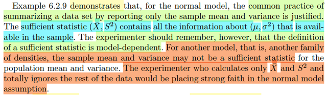</kbd>

🔗 **Related:** [6.3 THE LIKELIHOOD PRINCIPLE](63_the_likelihood_principle.md#node-535)

> [!NOTE]
> Ok. đây là ý quan trọng: gs cho biết, kết quả trên đã BIỆN MINH CHO VIỆC
> NẾU NHƯ POPULATION THẬT SỰ LÀ NORMAL, thì việc ta tính sample
> mean và sample variance là đã đủ để chứa mọi thông tin trong sample.
>
> Tuy nhiên gs lưu ý, điều này có thể không đúng với các distribution khác. Có
> nghĩa là, nếu như với sample từ distribution khác, mà ta chỉ dùng sample
> mean và sample variance thì có thể ta đã BỎ SÓT THÔNG TIN CHỨA
> TRONG ĐÓ RỒI.
>
> Tương tự, khi đối diện với một sample, mà ta lại chỉ tính sample mean và
> sample variance thì TA CŨNG ĐÃ QUÁ DỰA DẪM VÀO GIẢ ĐỊNH RẰNG
> POPULATION LÀ NORMAL

 

<kbd>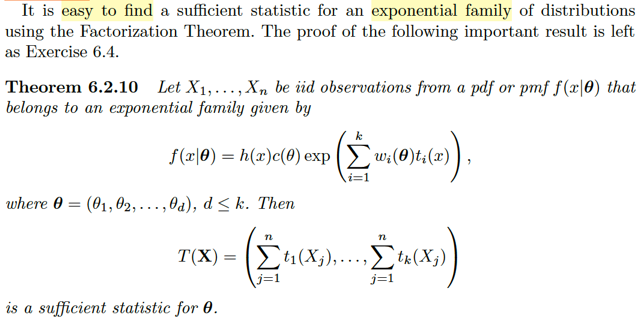</kbd>

> [!NOTE]
> Ví dụ này cho thấy sufficient
> statistic của expo family

> [!NOTE]
> QUAY LẠI SAU

 

<kbd>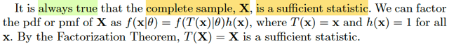</kbd>

<kbd></kbd>

<kbd>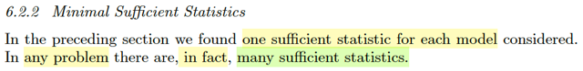</kbd>

> [!NOTE]
> đại khái là những phần vừa qua ta đã tìm ra một sufficient statistic đối với
> mỗi model (probability distribution). Nhưng điều ngạc nhiên là, thật ra với 
> bất cứ model nào thì CŨNG CÓ NHIỀU SUFFICIENT STATISTIC CHỨ
> KHÔNG CHỈ CÓ MỘT.
>
> Và ngạc nhiên hơn thì bản than một random sample **X**, bất kì, đều cũng
> là một sufficient statistic.
>
> Lí do là vì, xét joint pdf/pmf của **X**: f(**x**|θ) thì ta chỉ việc coi nó là g(T(**x**)|θ)h(**x**)
> với T(**x**) = **x**, và h(**x**) = 1. Thì khi đó theo Factorization Theorem thì T(**X**) = **X
> ĐÍCH THỊ LÀ MỘT SUFFICIENT STATISTIC CỦA θ**
> Như vậy, bất kì một random sample **X**, nào cũng là một sufficient statistic

 

<kbd>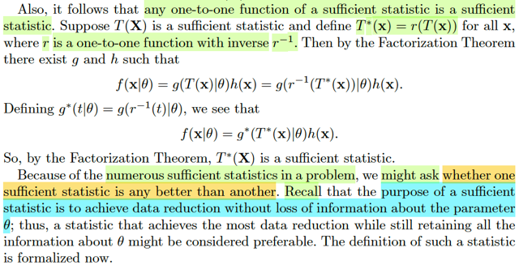</kbd>

> [!NOTE]
> Rồi, hệ quả nữa đó là, nếu T(**X**) là sufficient statistic thì với mọi function
> one-to-one (tức scalar→ scalar) function r, thì rinv(T(**X**)) cũng là sufficient
> statistic luôn.
>
> Vì sao?
>
> đặt T*(**X**) = r(T(**X**)) ⇨ T(**X**) = r_inv(T*(**X**))
>
> Vì với T(**X**) là sufficient statistic như đã biết ta có thể factor f(**x**|θ) = g(T(**x**)|θ)h(**x**)
>
> = g(r_inv(T*(**X**))|θ)h(**x**)
>
> Như vậy, theo Factorization Theorem, joint pdf/pmf f(**x**|θ) đã có thể factor thành
> dạng g(T*(**X**)|θ)h(**x**), thì như vậy T*(**X**) cũng là sufficient statistic cho θ
>
> Vậy thì với nhiều sufficient statistic như vậy, câu hỏi đặt ra sẽ là cái nào là tốt
> nhất.
>
> Gs nhắc lại ta rằng, mục đích của sufficient statistic là làm sao chứa trọn thông
> tin về population parameter chứa trong random sample, do đó ta sẽ bàn tới
> câu trả lời cho câu hỏi này

 

<kbd>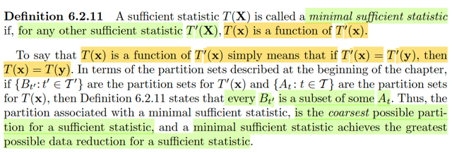</kbd>

> [!NOTE]
> đại khái định nghĩa của một MINIMAL SUFFICIENT STATISTIC:
>
> Đó là vầy, T(**X**) gọi là minimal sufficient statistic nếu như với mọi sufficient
> statistic T'(**X**) khác thì T(**X**) ĐỀU LÀ FUNCTION CỦA T'(**X**). Hiểu
> điều này như sau: Vì T(**X**) minimal, nên nó là cái gọn nhất trong số những
> cái chứa  đủ thông tin θ (sufficient statistic). Và như vậy, kiểu như là những
> thằng T'(**X**) chưa đủ gọn, nên có thể cắt gọt chúng nó hơn nữa, bởi một
> function nào đó, để có cái tinh chất / gọn nhất T(**X**). Do đó mọi thằng
> T(**X**) đều có thể có một function nào đó apply lên nó và tạo ra T(**X**) ⇨
> Đây chính là ý T(**X**) luôn là một function của T'(**X**)
>
> Rồi, lại nói, nếu như mình có hai điểm **x**và**y**, có cùng giá trị T': Tức T'
> (**x**)****= T'(**y**), thì vì T(**X**) luôn là function g nào đó của T'(**X**):
> T(**X**) = g(T(**X**)) Vậy thì dĩ nhiên là với T'(**x**) = T'(**y**) thì g(T'(**x**)) =
> g(T'(**y**)), tức T(**x**) = T(**y**).
>
> Và hệ quả của nó chính là cái vụ partition.
>
> Vì ta biết / nhớ cái định nghĩa của A_t: {**x**∈****R^n**:**T(**x**) = t} thì với
> các giá trị khác nhau của t, thì A_t sẽ tạo nên một partition của sample space
> (tức range của **X**)
>
> Vậy thì ở đây, nếu **x,y**∈****B_t', tức {**z**∈****R^n: T'(z) = t' ∈ T_curly} thì
> như trên ta có T'(**x**) = T'(**y**) = t', và g(T'(**x**)) = g(T'(**y**)) ⇔ T(**x**) =
> T(**y**) = g(t). Như vậy điều này chứng tỏ ràng, nếu ông **x**, **y** mà nằm
> trong A_t' thì chúng cũng nằm trong một partition của T(**X**) luôn, là A_t =
> A_g(t'). Do đó, cái partition Bt' phải là tập con của At. Và như vậy, hình dung
> ta có cái blob, và chia nó thành 5 phần Bt' thì At sẽ ví dụ như là chia nó ra
> thành những phần to hơn, chứa 5 phần Bt', ví dụ At chia làm 2: At1 chứa Bt'
> 1,Bt'2,Bt'3 và At2 chứ hai cái còn lại.
>
> Bởi vậy mới nói partition gắn với minimal sufficient statistic là cái COARSEST

 

<kbd>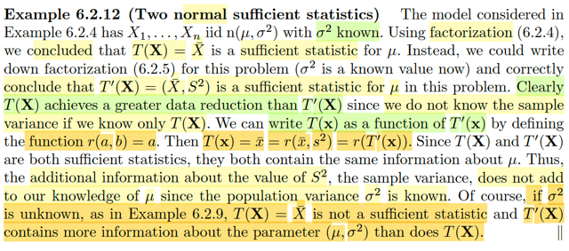</kbd>

> [!NOTE]
> Ok, đoạn này đại khái nói là: Với ví dụ 6.2.4 nơi ta có sample **X,** tức****X1,
> X2... Xn ~ n(μ, σ^2) với σ^2 biết.
>
> Và ta đã chứng minh rằng sample mean T(**X**) = Xbar(**X**) (đến đây mình
> có thể hiểu vì sao ghi là Xbar(**X**) rồi) chính là  sufficient statistic.
>
> Nhớ lại thế này, nếu muốn chứng minh lại, sử dụng factorization theorem ta sẽ
> viết joint pdf của sample **X**ra, và cho thấy nó là một cái tích function của
> một function ko dính tới **x** mà trong case này đơn giản là 1. Và g(T(**x**)|μ)
> là function dính tới μ và **x**nhưng thông qua T(**x**), tức Xbar(**x**) = xbar.
> Để từ đó theo factorization theorem ta kết luận T(**X**) = Xbar(X) chính là một
> sufficient statistic.
>
> Tuy nhiên ta còn nhớ, trong biến đổi đó, nếu mình lôi thêm S^2 vào, tức là thể
> hiện cái joint pdf theo dạng g(T(**x**) | μ)
>
> = g((T1(**x**), T2(**x**)) | μ)
>
> = g(Xbar(**x**),S^2(**x**) | μ) thì ta cũng có thể kết luận random variable
> VECTOR  T(**X**) = (Xbar, S^2) cũng là sufficient statistic.
>
> Thế thì qua đây, đối chiếu với cái định nghĩa của minimal sufficient statistic ta
> thấy quả thật T(**X**) = Xbar(**X**) (mà ta viết tắt là Xbar) chính là một function
> / kết quả của một function app lên T'(**X**) = (Xbar, S^2). Và đó là function:
> r((a,b)) = a.
>
> Trong bài toán này (trong ví dụ sau ta sẽ thấy) có thể đoán thì Xbar chính là
> minimal sufficient statistic cho θ, tức μ, σ^2 với σ đã biết. Nên Xbar có thể luôn
> là function của các sufficient statistic khác.
>
> Nhưng nếu σ chưa biết, thì một T(**X**) = Xbar dĩ nhiên KHÔNG PHẢI LÀ
> SUFF STATISTIC CỦA Θ = (μ, σ^2).

 

<kbd>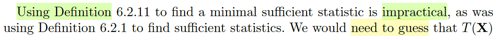</kbd>

<kbd></kbd>

<kbd>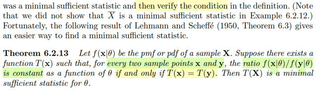</kbd>

> [!NOTE]
> Rồi, đại khái là, y như định nghĩa của sufficient statistic, nếu như dùng 
> định nghĩa để chứng minh / tìm statistic là một sufficient statistic thì
> sẽ rất khó. Nhớ lại, theo định nghĩa đó, T(**X**) sẽ là sufficient statistic
> nếu như P(**X**=**x**|T(**X**)=T(**x**)) không phụ thuộc θ
>
> Thì từ đó, để dễ hơn, ta mới nhờ đến factorization theorem, nói rằng
> chỉ cần chỉ ra joint pmf/pdf f(**x**|θ) có thể factored thành g(T(**x**)|θ)h(**x**)
> là xong.
>
> Vậy thì ở đây cũng vậy, ta sẽ nhờ theorem này để chứng minh T(**X**) là
> minimal sufficient statistic:
>
> Đại khái là, cho rằng có T(**x**) thỏa tính chất: Xét hai điểm **x**, và **y**thì:
>
> Nếu như tỉ số f(**x**|θ) / f(**y**|θ) = constant khi và chỉ khi T(**x**) = T(**y**)**thì khi đó**T(**X**) sẽ chính là minimal sufficient statistic

 

<kbd>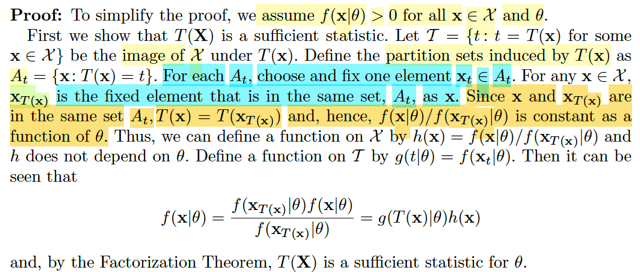</kbd>

> [!NOTE]
> Để chứng minh, đầu tiên ta sẽ giả định rằng f(**x**|θ) > 0 với mọi **x**∈****X_curl và θ 
> Mình hiểu: X_curl là range của **X**, tức là mọi output khi map một possible 
> outcome s trong original sample space Ω với R^n: X_curl = {**X**(s) for s ∈ Ω}
>
> Và ở đây, người ta giả định rằng f(**x**|θ) > 0 với **x**∈****X_curl tức là ta hiểu X_curl
> là **SUPPORT SET** CỦA **X.**Rồi, kế tiếp là ta gọi T_curl là image của X_curl bởi statistic T(X): 
> {T(**x**): for some **x**∈****X_curl}
>
> Thế thì như đã biết, các giá trị khác nhau t của T(**x**) với **x** ∈ X_curl nó sẽ tạo 
> ra một partition At: {**x**∈ X_curl: T(**x**) = t}
>
> Từ đó người ta gọi: **x**t là một điểm cố định của mỗi partition At.
>
> Và với mọi **x**∈****X_curl thì **x**_T(x) là cái điểm mà cũng trong partition với **x**:
> Chỗ này đại khái là: Với **x**thì ảnh của nó qua T(**X**): T(**x**) và do đó nó nằm
> trong cùng partition với A_T(**x**) = {**z**∈****X_curl: T(**z**) = T(**x**)}, và người ta gọi **x**_T(**x**)
> hay mình có thể đặt là **z**_T(**x**) cho dễ, là chỉ những điểm trong A_T(**x**), dĩ nhiên
> là cũng chung partition với **x**Thế thì: như vậy **x**và **x**_T(**x**) cũng nằm chung một partition là A_T(**x**):
> nên T(**x**) = T(**x**_T(**x**))
>
> Xét f(**x**|θ) và f(**x**_T(**x**)|θ) tức là joint pdf của **X**evaluate tại hai điểm **x**và **x**_T(**x**):
>
> Và định lý này ta đang cần chứng minh chiều đi, tức là nếu như: xét hai sample
> point **x** và **y**thì f(**x**|θ) / f(**y**|θ)****= constant ⇔ T(**x**) = T(**y**) thì T sẽ là minimal sufficient
> statistic. Vậy thì ở đây ta giả sử là có tính chất "f(**x**|θ) / f(**y**|θ) = constant ⇔ T(**x**) = T(**y**)"
>
> Do đó, từ việc ta đang có T(**x**) = T(**x**_T(**x**)). Ta suy ra = f(**x**|θ) / f(**x**_T(**x**)|θ) là constant
>
> Rồi.
>
> Như vậy thì, ta đã hiểu được vì sao tác giả nói tỉ số f(**x**|θ) / f(**x**_T(**x**)|θ) là constant
> as a function of θ
>
> Nên ta sẽ đặt ra hàm h(**x**) =  f(**x**|θ) / f(**x**_T(**x**)|θ), với ý chính nhấn mạnh đây là hàm 
> constant nếu coi như là hàm theo θ.
>
> Khi đó, ta xét f(**x**|θ), nhân và chia cho f(**x**_T(**x**)|θ):
>
> f(**x**|θ) = f(**x**_T(**x**)|θ) f(**x**|θ) / f(**x**_T(**x**)|θ)
>
> = f(**x**_T(**x**)|θ) h(**x**)
>
> Và đặt hàm g(t|θ) = f(**x**t|θ): Tức là với một giá trị t, thì g(t|θ) = f(**x**t|θ) với **x**t như đã
> nói ở trên, là điểm cố định mà ta chọn trong mỗi partition At. Ví dụ tính g(t1|θ) thì lôi
> thằng **x**_t1 ra. và evaluate joint pmf/pdf tại đó f(**x**_t1|θ). Khi đó ta sẽ thấy f(**x**_T(**x**)|θ)
> chính là g(T(**x**)|θ)
>
> Từ đó có thể cho thấy f(**x**_T(**x**)|θ) h(**x**) là g(T(**x**)|θ) h(**x**) 
>
> Như vậy f(**x**|θ) = **g**(T(**x**)|θ) h(**x**). thì theo Factorization theorem, ta có thể kết luận
> T(**X**) là SUFFICIENT STATISTIC

 

<kbd>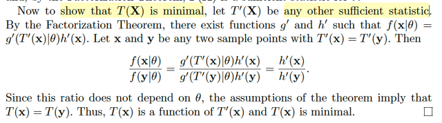</kbd>

> [!NOTE]
> Rồi, thế thì vừa rồi ta đã chứng minh rằng nếu T(**X**) là statistic thỏa:
>
> khi xét **x**,**y** là hai điểm mà f(**x**|θ) / f(**y**|θ) = constant ⇔ T(**x**) =
> T(**y**) thì T(**X**) nhất định là sufficient statistic.
>
> Còn giờ ta sẽ chứng minh thêm là T(**X**) cũng sẽ là minimal:
>
> Nhớ lại chút xíu về định nghĩa của minimal sufficient statistic: Đó là với mọi T'
> (**X**) là sufficient statistic bất kì, thì T(**X**) sẽ đều là một function của T'
> (**X**), mà cách thể hiện của chuyện này, theo toán học chính là xét **x**, **y**thì nếu T'(**x**) = T'(**y**) thì T(**x**) = T(**y**) (vì điều này cho thấy rằng
> nếu T(**x**) phải bằng hàm g nào đó của T'(**x**), để rồi vì T'(**x**) = T'(**y**)**nên**g(T'(**x**)) = g'(T'(**y**))
>
> Vậy thì, ta sẽ xét **x**, **y** là hai điểm sao cho T'(**x**) = T'(**y**):
>
> Và vì đang nói T'(**X**) là sufficient statistic, nên
>
> f(**x**|θ) = g'(T'(**x**)|θ)h'(**x**)
>
> và f(**y**|θ) =  g'(T'(**y**)|θ)h'(**y**)
>
> ⇨ f(**x**|θ) / f(**y**|θ) = g'(T'(**x**)|θ)h'(**x**) / g'(T'(**y**)|θ)h'(**y**)
>
> = h'(**x**)/h'(**y**) (do T'(**x**) = T'(**y**) ⇨ g'(T'(**x**)|θ) = g'(T'(**y**)|θ)
>
> và cái này không phụ thuộc θ
>
> Và theo điều mà ta có khi đang chứng minh định lí này:
>
> "x, y là hai điểm mà f(x|θ) / f(y|θ) = constant ⇔ T(x) = T(y)"  ⇨ T(X) là minimal
> sufficient statistic
>
> thì ta có quyền từ T'(**x**) = T'(**y**) ⇨ h'(**x**)/h'(**y**) không phụ thuộc θ
> suy ra T(**x**) = T(**y**). Và như vậy ta đã chứng minh xong rằng T(**X**)
> luôn là một function của T'(**X**) bất kì ⇨ T(**X**) LÀ MINIMAL TRONG CÁC
> SUFFICIENT STATISTIC

 

<kbd>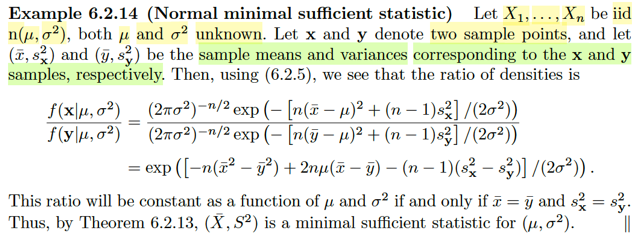</kbd>

> [!NOTE]
> rồi, qua ví dụ này. Cho X1, ...Xn iid ~ n(μ, σ^2) và cả hai đều chưa biết.
> Cho **x**,**y** là hai sample point và (xbar, s^2_x) và (ybar, s^2_y) là
> sample mean và  variance.
>
> Dừng lại chút để giải thích chỗ này:
>
> Ta nhớ lại định nghĩa của random sample size n ~ một population có
> pdf/cdf f hay  F là ta sẽ qua sát một biến cố nào đó n lần. Giá trị quan sát
> được mỗi lần sẽ được  đại diện bởi một random variable Xi. Và các rv X1,..
> .Xn mutually independent  cũng như là identically distributed: có cũng
> marginal pdf/cdf là f/F
>
> Thế thì, dĩ nhiên các random variable **X** = X1,...Xn vẫn sẽ mang một giá
> trị cụ thể nào đó. Và đó chính là một bộ giá trị quan sát thấy, của một lần
> lấy mẫu (sampling). Và kí hiệu là **x**= (x1,...xn). Tuy nhiên, nếu ta
> sampling lần nữa, X1, ...Xn sẽ mang giá trị khác. Ta sẽ có giá trị cụ thể của
> **X** lần này là **y,** tức (y1,....yn)
>
> Rồi từ đó ta sẽ có sample mean xbar và ybar cũng như sample variance
>
> Thế thì nhớ lại theorem giúp xác định minimal sufficient statistic thay vì
> dùng định nghĩa mà ta vừa chứng minh, nói rằng: Nếu như T(X) là statistic
> thỏa tính chất này: Đó là đối với hai điểm **x**, **y**. Thì tỉ số f(**x**|θ) / f(**y**|θ) là 
> hằng số nếu xét vai trò là function của θ  khi và chỉ khi T(**x**) = T(**y**), thì khi
> đó T(X) sẽ là minimal sufficient statistic.
>
> Vậy thì ta xét  f(**x**|θ) / f(**y**|θ).
>
> = (2πσ^2)^(-n/2) exp { - [n(xbar - μ)^2 + (n-1)sx^2] / (2σ^2) }
> / (2πσ^2)^(-n/2) exp { - [n(xbar - μ)^2 + (n-1)sx^2] / (2σ^2) }
>
> = exp([-n(xbar^2 - ybar^2) + 2nμ(xbar - ybar) - (n - 1)(sx^2 - sy^2) / (2σ^2)])
>
> (Tính chất hàm mũ)
>
> Và lập luận sẽ là. Để mà cái này không phụ thuộc σ và μ (tức là constant
> as a function of μ và σ ) thì chỉ xảy ra khi xbar = ybar, và sx^2 = sy^2
> (vì khi đó kết quả trở thành 1 là constant). Như vậy theo theorem này, thì
> T(**X**)****= (Xbar, S^2) chính là minimal sufficient statistic

 

<kbd>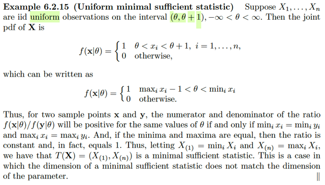</kbd>

> [!NOTE]
> Rồi, qua ví dụ này, sample ~ uniform(θ, θ + 1) -inf < θ < inf
>
> Khi đó joint pdf của **X**:
>
> f(**x**|θ) = 1 khi θ < xi < θ + 1, với i = 1,2...n và f(**x**|θ) = 0 otherwise
>
> Vậy thì: Đại ý là pdf có thể viết thành:
>
> f(**x**|θ) = 1 khi max_i xi - 1 < θ < min_i xi (vì đây đồng nghĩa với mọi xi đều
> nằm trong (θ, θ + 1)
>
> Tương tự, f(**y**|θ) cũng sẽ bằng 1 khi max_i yi < θ < min_i yi và bằng 0 nếu
> ngược lại.
>
> Cứ hiểu đơn giản là vầy:
>
> Giả sử min_i xi, max_i xi là 2, 5 và min_i yi, max_i yi là 3, 6 thì:
>
> khi đó tùy vào θ nằm trong các khoảng khác nhau mà tỉ số trên sẽ thay đổi:
>
> Giả sử / giả bộ bỏ qua cái vụ chia 0 ko hợp lệ đi.
>
> (-inf, 2): 0/0 = 1
>
> (2, 3): 1/0 = inf
>
> (3, 5):  1/1 = 1
>
> (5, 6): 0/1 = 0
>
> (6, inf): 0/0 = 1
>
> ⇨ tỉ số lúc thì bằng 0 / 1 / inf, tùy theo / phụ thuộc θ
>
> Còn hai cái đầu đít trùng nhau , ví dụ đều là 2, 5
>
> thì tỉ số này sẽ là:
>
> (-inf, 2): 0/0 = 1
>
> (2, 5): 1/1 = 1
>
> (5, inf): 0/0 = 1
>
> Có nghĩa là, tỉ số này luôn là constant, ko phụ thuộc θ.
>
> ====
>
> Như vậy, cái ta đang có ở đây đó là:
>
> xét hai điểm **x**, **y**, thì f(x|θ) / f(y|θ) là constant as a function of θ ⇔ min_i
> **x**= min_i **y**, và max_i **x**= max_i **y**.****Mà ta nhớ lại theorem đi:
>
> nó nói nếu như ta lập luận được / có kết luận rằng: xét hai điểm x, y thì  f(x|θ) /
> f(y|θ) là constant as a function of θ ⇔ T(x) = T(y), thì khi đó theorem này cho
> phép nói T(X) là minimal sufficient statistic
>
> Như vậy chiếu theo đó, rõ ràng ở đây T(**X**) = (min_i **X**, max_i **X**) chính
> là minimal sufficient statistic (vì T(**x**) chính là vector (min_i **x**, max_i **x**)
> và T(**y**) chính là vector (min_i **y**, max_i **y**)

 

<kbd>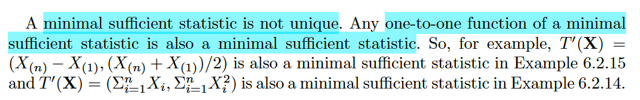</kbd>

> [!NOTE]
> Ý cuối là minimal sufficient statistic cũng ko unique. Nếu apply một 1-1
> function nào vào minimal sufficient statistic ta cũng được một sufficient
> statistic

 

<kbd>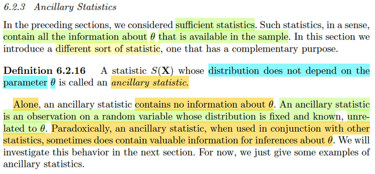</kbd>

> [!NOTE]
> đại khái là, ta sẽ học qua một loại statistic khác. Gọi là statistic phụ trợ 
> (ancillary). Định nghĩa của nó đại khái là một statistic mà distribution
> của nó KHÔNG CÒN PHỤ THUỘC vào θ nữa.
>
> Thì ý chính là, cái loại statistic này, dù distribution không còn phụ thuộc
> θ nhưng nghịch lí thay (paradoxically) là KHI ĐƯỢC LIÊN HỢP VỚI
> CÁC STATISTIC KHÁC, THÌ NÓ LẠI CÓ THỂ GIÚP SUY LUẬN RA
> θ. Do đó phần này ta sẽ xem vài ví dụ của loại statistic này và phần sau 
> sẽ bàn về cái vừa nói

 

<kbd>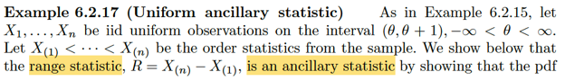</kbd>

<kbd></kbd>

<kbd>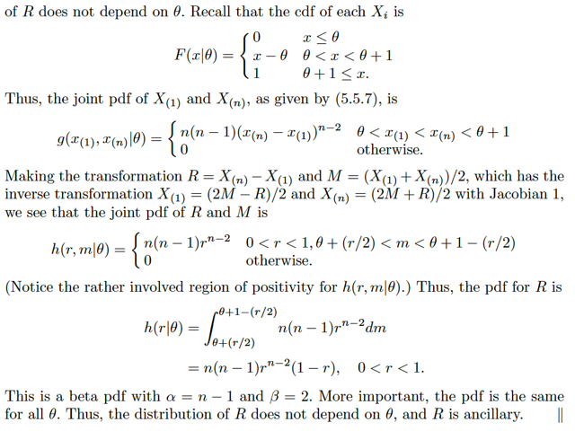</kbd>

🔗 **Related:** [5.4 ORDER STATISTIC](54_order_statistic.md#node-388)

> [!NOTE]
> Vài điểm chính: Joint pdf của X(1) và X(n) được cho bởi Theorem 5.4.7 (không phải
> là 5.5.7), trong phần đó gs cũng không chứng minh. Nhưng ta ráp công thức này thì
> ta có joint pdf của X(1) và X(n) cũng không khó hiểu lắm, để có g(x(1), x(n)|θ) =
> n(n-1)(x(n) - x(1))^n-2 nếu θ < x(1) < x(n) < θ + 1 và = 0 otherwise
>
> Dĩ nhiên ta hiểu x(1), x(n) là dummies variable thôi, biểu thị hai input của hàm g sẽ là
> giá trị cụ thể của random variable X(1), và X(n).
>
> Rồi, xét R, gọi là Range, = X(n) - X(1) và M = [X(1) + X(n)]/2, đương nhiên cũng là
> hai random variables. Áp dụng transformation theorem ta sẽ tìm joint pdf của R,M.
>
> Review chút xíu về transformation theorem.
>
> Câu chuyện là ta có joint pdf của X,Y. fXY(x,y). tạo thành random variable vector (X,
> Y). Và (U,V) là kết quả của việc apply một vector → vector function nào đó lên  (X,Y):
> k(X,Y) = (g1(X,Y), g2(X,Y)) sao cho mapping giữa support set của X,Y, kí hiệu là
> A_curl (là tập con của R^2 mà fX,Y(x,y) tại mọi điểm trong đó đều dương) với ảnh
> của nó qua k, tức {(u,v) ∈ R^2: u = g1(x,y), v = g2(x,y) for some x,y ∈ A_curl} là
> mapping 1-1. Nói rõ hơn, có nghĩa là với một (x,y) trong A_curl thì chỉ mapping với
> một (u,v) trong ảnh của A_curl thôi và ngược lại, một (u,v) trong ảnh của A_curl chỉ
> map với đúng một điểm (x,y) trong A_curl thôi (có thể map thêm với một (x,y) khác
> ngoài A_curl, nhưng không thể có hai điểm trong A_curl cùng map với một điểm
> trong ảnh của A_curl)
>
> Khi đó, từ (u,v) = k(x,y) = g1(x,y), g2(x,y) ta có thể tìm ra (x,y) = h1(u,v), h2(u,v) Và
> transformation theorem cho phép ta tìm joint pdf của U,V từ joint pdf của X, Y:
>
> fU,V(u,v) = fX,Y(x,y) |∂(x,y)/∂(u,v)|
>
> = fX,Y(h1(u,v), h2(u,v) |∂(x,y)/∂(u,v)|
>
> Ở đây. R = X(n) - X(1), tức R = g1(X(1), X(n)) với r = g1(x(1),x(n)) = x(n) - x(1)
>
> và M = [X(1) + X(n)]/2 ⇨ M = g2(X(1), X(n)) với m = g2(x(1), x(n)) = [x(n) + x(1)]/2
>
> ⇔ 2m = x(n) + x(1); r = x(n) - x(1) ⇔ 2m - r = 2x(1) ⇔ x(1) = (2m - r)/2
>
> Và ⇨ x(n) = r + x(1) = r + m - r/2 = (2m + r)/2
>
> Vậy X(1) = (2M - R)/2 và X(n) = (2M + R)/2
>
> tức h1(m,r) = (2m - r)/2 và h2(m,r) = (2m + r)/2
>
> Nên ta có Jacobian: ∂(x,y)/∂(m,r) = [∂/∂m h1(m,r) ∂/∂r h1(m,r); ∂/∂m h2(m,r) ∂/∂r h2(m,
> r)]
>
> = [1 -1/2;1 1/2] ⇨ |detJ| = |1/2 - (-1/2)| = |1/2 + 1/2| = |1| = 1
>
> ⇨ fR,M(r,m) = fX(1)X(n)(x(1),x(n)) |J|
>
> = n(n-1)(x(n) - x(1))^(n-2) * 1 nếu θ < x(1) < x(n) < θ + 1 và = 0 otherwise
>
> = n(n-1)((2m + r)/2 - (2m - r)/2)^(n-2)   (thế x(1), x(n) vào)
>
> nếu θ < (2m - r)/2 < (2m + r)/2 < θ + 1 và = 0 otherwise (cũng thế x(1), x(n) vào)
>
> = n(n-1)(m + r/2 - m + r/2)^(n-2)  nếu 0 < r < 1, θ + (r/2) < m < θ + 1 - r/2
>
> và = 0 otherwise
>
> **= n(n-1)r^(n-2)**  nếu 0 < r < 1, θ + (r/2) < m < θ + 1 - r/2 và = 0 otherwise
>
> ====
>
> Rồi, tới đây để có marginal pdf của R, ta sẽ marginalizing theo M:
>
> fR(r) = ∫-inf:inf  fR,M(r,m) dm
>
> Nhưng fR,M thì chỉ dương khi m từ θ + r/2 đến θ + 1 - r/2:
>
> ⇨ ... = ∫(θ+r/2) : (θ+1-r/2) fR,M(r,m) dm
>
> = ∫(θ+r/2) : (θ+1-r/2) n(n-1)r^(n-2) dm
>
> = n(n-1)r^(n-2) [m|(θ+r/2) : (θ+1-r/2)]
>
> = n(n-1)r^(n-2) [(θ+1-r/2) - (θ+r/2)]
>
> = n(n-1)r^(n-2) [θ+1-r/2 - θ-r/2]
>
> = n(n-1)r^(n-2)(1-r) với 0 < r < 1
>
> ====
>
> Thế thì kết quả này có dạng của β pdf với α = n - 1, β = 2
>
> Và quan trọng là pdf này không phụ thuộc θ. DO ĐÓ R LÀ MỘT ANCILLARY

 

<kbd>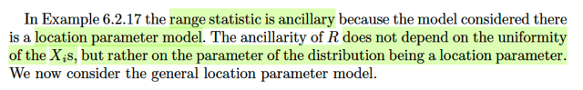</kbd>

> [!NOTE]
> Rồi, gs cho một ý rất hay. Đại khái ông nói là cái kết quả mà ta vừa
> cho thấy, là range R có distribution, tức marginal pdf không phụ thuộc
> vào θ, cho dù nó là một statistic, vốn là một random variable có được 
> từ việc apply một function vào các random variable của random sample
> mà đám này có distribution dĩ nhiên là phụ thuộc θ, tức population parameter
>
> Thế thì kết quả này không ngẫu nhiên, mà thực ra, nó sẽ  đúng với mọi θ 
> đóng vai trò là location parameter.
>
> Gemini giải thích chỗ này như sau (và ví dụ sau trong sách sẽ làm rõ hơn)
>
> Đại khái là ta đã biết location family: thì nếu f(z) là pdf của member chuẩn
> (standard pdf) ứng với location = 0 thì một member khác ứng với location
> θ sẽ có pdf là fX(x) = fZ(x - θ)
>
> Như vậy, pdf của X sẽ phụ thuộc θ, còn Z thì ko.
>
> Trong chương trước (location scale family) mình đã học theorem này:
>
> Z là rv ~ f(z) ⇔ X = σZ + μ sẽ ~ fX(x) = f[(x - μ)/σ] / σ
>
> Nói bằng lời đó là nếu ta có Z là một random variable thành viên chuẩn
> (location = 0, scale 1) của một location scale family, thì X = σZ + μ sẽ là 
> thành viên có location là μ, scale σ). Ngược lại, nếu ta có X là random
> variable thuộc thành viên có location μ, scale σ thì Z = (X - μ)/σ sẽ là
> thành viên chuẩn.
>
> Nếu ta có random sample X1,...Xn. và các order statistic X(1),...X(n)
>
> Thì với mọi random variable Xi, là thành viên có location θ 
>
> Thì Zi = Xi - θ chính là thành viên chuẩn, có location 0
>
> Thế thì xét rang R = X(n) - X(1), dĩ nhiên nó cũng sẽ là Xi - Xj nào đó
> và = Zi + θ - (Zj + θ) = Zi - Zj
>
> Như vậy, R là random variable tạo bởi áp dụng một function lên hai random
> variable có distribution KHÔNG PHỤ THUỘC θ. Do đó R đương nhiên
> có distribution không phụ thuộc θ.

 

<kbd>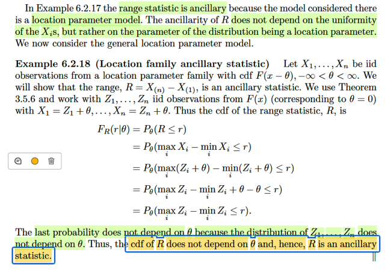</kbd>

🔗 **Related:** [3.5 LOCATION AND SCALE FAMILIES](35_location_and_scale_families.md#node-202)

> [!NOTE]
> Thật ra cái example 6.2.18 cũng chính là cái vừa nói.
>
> Ta hiểu là trong ví dụ này cũng chính là lập luận theo  cái mình vừa lập luận
> nhỉ? Chỉ có điều là ta thấy hơi ngáo chỗ này: 
>
> Theo thoerem 3.5.6 thì nó
> nói như nãy ta nói, tức là nếu f(z) là pdf  của thằng Z thuộc member chuẩn,
> có location 0, thì pdf của X thuộc  member có location μ sẽ là f(x - μ). Nhưng
> mà trong ví dụ này, ta giả  lại lập luận với cdf. Như vậy ta cần hiểu là cái
> theorem đó cũng apply với cdf à?
>
> Tức là, nếu F(z) là cdf của thằng Z thuộc member chuẩn có location 0, thì
> cdf của thằng X cùng family nhưng có location μ sẽ là F(x - μ)?
>
> Chắc cũng ko khó để chứng minh:
>
> Nếu Z có pdf là fZ(z) là rv thuộc thành viên chuẩn thì Z là rv thuộc gia đình
> ứng với thành viên có location μ và sẽ có pdf là fX(x) = fZ(x - μ) Thế thì từ
> fX(x) = fZ(x - μ), suy ra cdf của X:
>
> FX(x) = ∫-inf:x fX(t)dt = ∫-inf:x fZ(t - μ)dt
>
> Đặt u = t - μ ⇨ du = dt và cận tích phân đổi thành -inf - μ = -inf và x - μ   ⇨
> tích phân trở thành ∫-inf:(x-μ) fZ(u)du
>
> Và đây chính là FZ(x - μ)
>
> Vậy là theorem trên cũng đúng với cdf.
>
> Do đó ở đây họ dùng cdf:
>
> Cách lập luận cũng y như nãy mình làm:
>
> X1,....Xn là iid từ một location parameter family có location θ. Nên theo
> theorem 3.5.6 thì với Xi ~ member location θ, thì với Zi = Xi - θ sẽ là thành
> viên chuẩn. Và nếu gọi F là cdf của Zi, thì cdf của Xi sẽ là F(x - θ)
>
> Từ đó, ta xét Range R, = X(n) - X(1). Cụ thể là xét cdf của nó:
>
> FR(r|θ), có bản chất là P_θ(R ≤ r)
>
> = P_θ(max_i Xi - min_i Xi ≤ r)
>
> = P_θ(max_i (Zi + θ) - min_i (Zi + θ) ≤ r)   |  Vì đã nói Xi - θ = Zi là rv ~
> member chuẩn
>
> = P_θ(max_i (Zi) + θ - min_i (Zi) + θ) ≤ r)  | đưa θ là hằng số ra khỏi max_i,
> min_i
>
> = P_θ(max_i Zi  - min_i Zi ≤ r)   | khử θ
>
> và kết quả này ko phụ thuộc θ nữa vì Zi có distribution với location 0, ko phụ
> thuộc θ nữa

 

<kbd>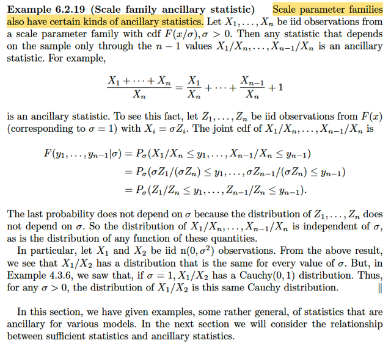</kbd>

🔗 **Related:** [6.2 THE SUFFICIENT PRINCIPLE](62_the_sufficient_principle.md#node-515)

> [!NOTE]
> CÒN VÍ DỤ NÓI VỀ MỘT LẠI ANCILLARY STATISTIC TƯƠNG TỰ ĐỐI
> VỚI CÁC LOCATION FAMILY QUAY LẠI SAU. NHƯNG ĐẠI KHÁI LÀ
> PHẦN SAU SẼ NÓI VỀ QUAN HỆ GIỮA SUFFICIENT  STATISTIC VÀ
> ANCILLARY STATISTIC

 

<kbd>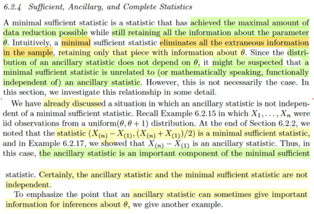</kbd>

> [!NOTE]
> Rồi, mở đầu gs nhắc ta lại về khái niệm minimal sufficient statistic, đó là nó
> là statistic đạt được mức độ data reduction tốt nhất mà vẫn giữ được mọi
> thông tin về tham số θ. Một cách dễ hiểu thì nó là cái loại bỏ đi hết các thông
> tin thừa thải, không giúp ích gì cho việc suy luận giá trị của tham số θ.
>
> Còn ancillary statistic như vừa biết, là statistic mà distribution của nó không
> phụ thuộc vào θ. Nên ta có thể nghĩ rằng ancillary statistic và minimal sufficient
> statistic không liên quan đến nhau. Nhưng kì thực không phải vậy. Và phần 
> này sẽ tập trung bàn về quan hệ của chúng.
>
> Trong ví dụ 6.2.15 thì ta thấy X1,...Xn là iid observation từ uniform(θ, θ + 1)
> và đã chứng minh (X(n) - X(1), (X(n) + X(1))/2) là minimal sufficient statistic
> và rồi trong ví dụ 6.2.17 thì ta thấy X(n) - X(1) lại là ancillary statistic.
>
> Như vậy có nghĩa là trong trường hợp này ancillary statistic là một phần tạo
> nên minimal sufficient statistic.
>
> Do đó dĩ nhiên là chúng không độc lập nhau.

 

<kbd>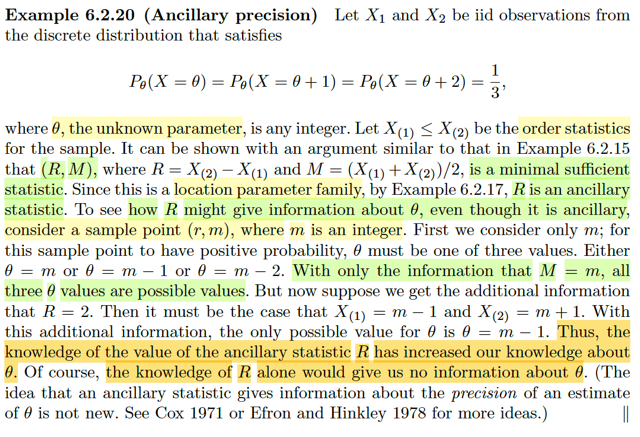</kbd>

> [!NOTE]
> Đại khái ví dụ này mục đích là để cho thấy rằng ancillary statistic có thể giúp
> suy luận ra giá trị của parameter θ dù cho distribution của nó không phụ thuộc
> θ.
>
> Xét một bộ hai random variable  X1, X2 iid có population distribution với pmf:
> P_θ(X = θ) = P_θ(X = θ + 1) = P_θ(X = θ + 2) = 1/3. với θ chưa biết.
>
> Và gọi X(1), X(2) là order statistic.
>
> Thế thì đại ý là ta có thể chứng minh theo cách tương tự như ví dụ trước đây
> để cho thấy rằng random variable vector (R, M) = (X(2)-X(1), [X(1)+X(2)]/2)
> là minimal sufficient statistic. (Chứng minh bằng cách dùng cái theorem 
> bữa trước đó, nói là nếu ta có thể chứng minh statistic T(**X**) có tính chất giúp
> thỏa: Với hai điểm **x**, **y** thì f(**x**|θ) / f(**y**|θ) không phụ thuộc θ nếu xét nó như
> function of θ khi và chỉ khi T(**x**) = T(**y**) thì khi đó T(**X**) là minimal sufficient statistic.
>
> Rồi, và  ta có thể dùng cách tương tự như ví dụ trước để chứng minh distribution
> của rang R không phụ thuộc θ, nên nó là ancillary statistic
>
> Thế thì, lập luận để cho thấy biết giá trị  của R (ancillary statistic) có thể giúp cho 
> biết / suy luận giá trị của parameter θ:
>
> Giả sử xét một điểm (r, m) (một giá trị của (R, M):
>
> Thì, đại khái là, nếu mà ta QUAN SÁT THẤY giá trị này của (R, M). Thì dĩ nhiên
> đồng nghĩa là joint probability của nó dương.
>
> Tức là event R = r, M = m xảy ra.
>
> Mà M = m xảy ra ⇔ (X(1)+X(2))/2 = (X1+X2)/2 = m xảy ra.
>
> Thế thì xét X, nó có 3 possible values: θ, θ + 1, θ + 2.
>
> Nên để (X1 + X2)/2 = m có thể xảy ra thì ta có thể luận ra một ràng buộc nào đó
> của θ: 
>
> θ không thể là m + 1 trở lên, vì khi đó X giá trị nhỏ nhất chỉ có thể bằng m + 1
> thì trung bình cộng không thể bằng m được.
>
> θ cũng không thể bằng m - 3 trở xuống. Vì khi đó thằng lớn nhất chỉ có thể = m. 
> thì trung  bình cộng cũng ko thể bằng m (vì một thằng = m, một thằng nhỏ hơn m)
>
> Vậy θ sẽ có các giá trị có thể có là m-2, m-1, m.
>
> Như vậy việc biết được giá trị của M, giúp khoanh vùng phạm vi tìm kiếm cho θ.
>
> Nhưng bây giờ, nói đến range R, là ancillary statistic, dù cho ta nói distribution
> của nó không phụ thuộc θ, nhưng nếu ta biết R = r = 2. Thì ngay lập tức có:
>
> [X(1) + X(2)]/2 = m ⇔ X(1) + X(2) = 2m
>
> X(2) - X(1) = r
>
> ⇨ 2X(2) = 2m + r ⇔ X(2) = m + r/2 = m + 1
>
> ⇨ X(1) = 2m - m - 1 = m - 1
>
> Vậy để mà (R, M) = (2, m) thì X(1), X(2) = m - 1, m + 1
>
> Mà như vậy thì θ không thể bằng m-2 (vì khi đó X1,X2 có thể bằng m-2,m-1,m,
> không thể có cái nào bằng m+1)
>
> Tương tự θ  không thể bằng m (vì khi đó X1,X2 có thể bằng m, m+1,m+2, không thể
> có cái nào bằng m-1)
>
> Do đó biết R = 2 giúp kết luận suy luận giá trị của θ cho dù R chỉ là ancillary statistic

 

<kbd>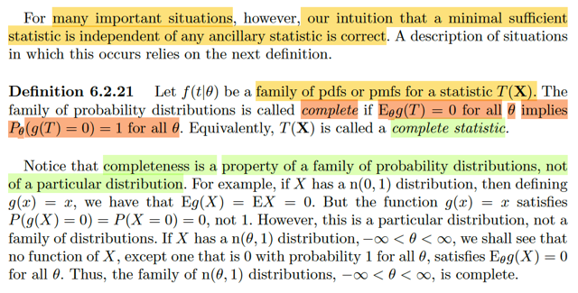</kbd>

🔗 **Related:** [7.3 METHODS OF EVALUATING ESTIMATORS](73_methods_of_evaluating_estimators.md#node-642)

> [!NOTE]
> Ta qua một khái niệm quan trọng: Tính đủ: **Completeness**.
>
> Theo định nghĩa, MỘT FAMILY CÁC PDF/PMF f(t|θ) CỦA MỘT STATISTIC
> T(**X**) sẽ được gọi là **complete**, nếu như:
>
> Với mọi θ, **E_θ(g(T)) = 0** thì **PHẢI DẪN ĐẾN g(T) = 0**, hoặc **ĐÍCH THỊ LÀ g(T)
> phải là zero function**. Chứ **không thể nào có một g(T) khác 0 nào mà khiến
> điều trên xảy ra được**.
>
> Và cái ý g(T) = 0 một cách tuyệt đối được **thể hiện theo toán** bởi xác suất nó
> bằng 0 phải là 1: **P(g(T) = 0) = 1**.
>
> Thế thì đầu tiên ta mới **xét một statistic**, mà statistic thì dĩ nhiên là một
> random variable có được nhờ **apply một hàm số vào một random sample**.
>
> Vậy thì ví dụ như ta xét random sample size n=1: **X** = (X1) ~ n(θ, 1). 
>
> Và xét T(**X**) = **X**= X1
>
> Thế thì ta sẽ thấy trong trường hợp này, cái family / gia đình các pdf của T:
> f(t|θ), dĩ nhiên **cũng là family n(θ,1)** sẽ **thỏa điều kiện để được gọi là
> complete** family
>
> Vì theo định nghĩa, nếu muốn là complete, thì việc E_θ(g(T)) = 0 với mọi θ chỉ
> có thể suy ra g(T) = 0, hay, chỉ có hàm zero function mới có thể khiến điều
> này xảy ra.
>
> Và trong toán học có cách để chứng minh với n(θ,1) thì muốn điều này xảy ra
> với mọi θ thì chỉ có g(T) = 0 mới được, nên T(**X**) = X là complete statistic
> và family pdf của nó là một family complete.
>
> ====
>
> Còn trong sách gs lấy ví dụ rằng X ~ n(0,1), thì nếu xét g(x) = x, thì Eg(X) = 0
> nhưng đây thật ra **chỉ là một thành viên cụ thể** trong họ. Chứ **nếu xét trong cả
> họ thì việc Eg(X) = 0 ko đúng**. Ví dụ E_θ=10 g(X) = E_θ=10 (X) = 10. Ý nói,
> để mà xét tính complete thì đầu tiên **hồ sơ ứng tuyển phải là: có ông g(T(X))
> nào đó khiến E_θ[g(T)] = 0 với mọi θ**.
>
> Và theo đó thì ở đây ko thể bắt đầu quy trình xét duyệt với g(x) = x được. Vì
> nó không thỏa E_θg(T) = 0 với mọi θ.
>
> Nhưng để được duyệt là complete thì **phải chứng minh là nếu mà có cái g(T)
> nào đó khiến E_θ g(T) = 0 thì phải suy ra g(T) = 0**.  Thì **khi đó T(X) mới được
> phong là complete statistic**. Và cái ý cuối gs nói "rằng ta sẽ thấy rằng nếu X
> ~ n(θ,1) thì không có hàm của X nào, TRỪ KHI NÓ LÀ ZERO FUNCTION, thỏa
> E_θ(g(X)) = 0 với mọi θ. Nên n(θ,1) là họ complete

 

<kbd>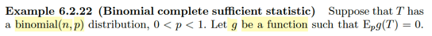</kbd>

<kbd></kbd>

<kbd>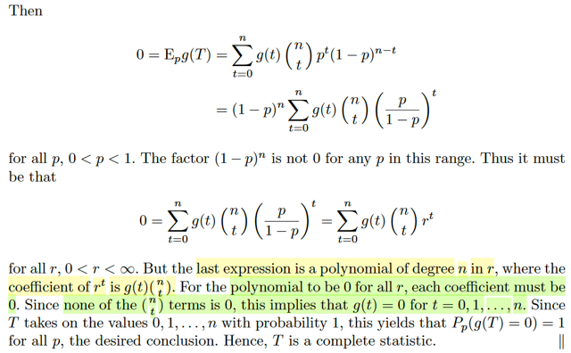</kbd>

🔗 **Related:** [5.4 ORDER STATISTIC](54_order_statistic.md#node-386)

> [!NOTE]
> Rồi, áp dụng vô ví dụ này xét T cho rằng nó có distribution loại binomial(n,p)
> 0 < p < 1. Và cho g là một function mà Ep g(T) = 0. Ta sẽ chứng minh T là 
> complete statistic, đồng nghĩa cũng là nói cả gia đình các pmf f(t|p) = Pp(T = t)
> là một complete family.
>
> Vậy thì đề bài cho ta có / gọi g là hàm số sao cho Ep[g(T)] = 0. Thì ta phải
> chứng minh rằng: nếu Ep[g(T)] = 0 VỚI MỌI p THÌ PHẢI SUY RA g(T) là 
> hàm zero.
>
> Rồi, thế thì, ta có Ep[g(T)] = 0, hàm ý là nó bằng 0 với mọi p 
>
> Theo LOTUS, ta biết ⇔ Σ{mọi possible value t của T} g(t)P(T=t) = 0
>
> Với T là binomial(n,p), ta nhớ (và có thể dễ dàng derive pmf của nó)
> là P_p(T=t), hay f(t|p) = (n choose t) p^t(1-p)^(n-t)
>
> ⇨ E_p[g(T)] = Σt=0:n g(t) (n choose t) p^t(1-p)^(n-t)
>
> Nhân thêm chia bớt (1-p)^n:
>
> .. = (1-p)^n Σt=0:n g(t) (n choose t) p^t(1-p)^(n-t-n)
>
> = (1-p)^n Σt=0:n g(t) (n choose t) p^t(1-p)^(-t)
>
> = (1-p)^n Σt=0:n g(t) (n choose t) p^t/(1-p)^t
>
> = (1-p)^n Σt=0:n g(t) (n choose t) [p/(1-p)]^t
>
> Đặt r = p/(1-p)
>
> = (1-p)^n Σt=0:n g(t) (n choose t) r^t
>
> Rồi vậy ta có (1-p)^n Σt=0:n g(t) (n choose t) r^t = 0
>
> Mà (1 - p)^n với 0 < p < 1 sẽ luôn khác 0
>
> ⇨ .. ⇔ Σt=0:n g(t) (n choose t) r^t = 0
>
> Nhận xét, đây là một ĐA THỨC BẬC n của r, nên 
>
> cái tổng này bằng 0 khi và chỉ khi g(t) = 0 với mọi t = 0,1...n
>
> Vậy là ta đã chứng minh rằng E_p[g(T)] = 0 với mọi p thì g(t) phải = 0
>
> do đó T là complete statistic.
>
> Trong sách có nói thêm cái vụ g(t) là hàm zero theo chuẩn trong định nghĩa:
> là P(g(T) = 0) = 1: 
>
> Dễ thôi:
>
> Vì T có các possible value là 0,1...n
>
> Mà đã kết luận g(t) = 0 với mọi t = 0,1...n
>
> ⇨ g(T) = 0 với mọi possible value của T
>
> Xét P(g(T) = 0), dĩ nhiên đây là pmf của g(T), evaluate tại 0. Nhưng mình đâu
> có biết hàm g là gì nên ko thể tìm pmf của g(T).
>
> Nhưng {g(T) = 0} ⊂ Ω
>
> ⇨ g(T) = 0 ∩ Ω = g(T) = 0
>
> ⇔ {g(T) = 0} = (g(T) = 0) ∩ (T = 0 U T = 1 U .. U T = n)
>
> ⇔ {g(T) = 0} = (g(T) = 0 ∩ T = 0) U (g(T) = 0 ∩ T = 1) U ....(g(T) = 0 ∩ T = n)
>
> ⇨ P(g(T) = 0) = P{(g(T) = 0 ∩ T = 0) U (g(T) = 0 ∩ T = 1) U ....(g(T) = 0 ∩ T = n)}
>
> mà vế phải là xác suất của ∪ các disjoint event, nên theo axiom 3:
>
> = Σt=0:n P(g(T) = 0 ∩ T = t)
>
> Mà xét hai event T = t và g(T) = 0. thì có bản chất là:
>
> A = {s ∈ Ω: T(s) = t} và B = {s ∈ Ω: g(T)(s) = g(T(s)) = 0}
>
> Mà xét s ∈ A, tức T(s) = t thì g(T(s)) = g(t), mà ta đã nói g(t) = 0 với mọi t = 0,..n
> nên s cũng thuộc B. Vậy A ⊂ B ⇨ {T = t} ∩ {g(T) = 0} = {T = t} (vì A ⊂ B 
>
> ⇨ A ∩ B = A)
>
> Vậy ta có .. = Σt=0:n P(T = t) và đây dĩ nhiên là bằng 1 vì tính valid của pmf.
>
> Kết luận P_p(g(T) = 0) = 1 với mọi p. nên T là complete statistic

 

<kbd></kbd>

<kbd></kbd>

<kbd></kbd>

🔗 **Related:** [6.2 THE SUFFICIENT PRINCIPLE](62_the_sufficient_principle.md#node-487)

> [!NOTE]
> rồi, qua ví dụ này X1, ...Xn là iid uniform (0, θ) với 0 < θ < inf.
>
> Ở đây không chứng minh lại nhưng ta có thể biết T(**X**) = max_i Xi là một
> sufficient statistic (cách chứng minh đơn giản thôi, ta dùng factorization  theorem,
> nói rằng, nếu có thể chỉ ra hàm joint pdf của **X**: f(**x**|θ) có thể factor thành
> g(T(**x**)|θ)h(**x**). Tức là gồm hàm h(**x**) không còn phụ thuộc θ, và
> g(T(**x**)|θ)  còn phụ thuộc θ và cả **x** nhưng chỉ phụ thuộc **x**thông qua một
> hàm số T(**x**) nào đó. Thì khi đó cái statistic T(**X**) đấy chính là sufficient
> statistic. Nên ở đây, ta  sẽ trước tiên là tìm ra pdf của **X**, f(**x**|θ) = θ^-n khi xi ∈
> {1,2...θ) và f(**x**|θ) = 0 nếu ngược lại. Rồi đặt hàm h(**x**) = 1 nếu xi ∈ {1,2...} và
> = 0 otherwise. Và đặt g(t|θ) với t = max_i xi, sao cho g(t|θ) = θ^n nếu t ≤ θ và g(t|θ)
> = 0 nếu t > θ. Khi đó, với cách set up này, ta sẽ xét hai case, là khi xi****∈ {1,2..θ}
> và khi xi không thuộc tập này, để chỉ ra rằng à trong case hai case thì f(**x**|θ) và
> g(t|θ)h(**x**) đều bằng nhau, giúp kết luận T(**X**) = max_i Xi chính là sufficient
> statistic.
>
> Rồi, tiếp, tác giả nhắc đến Theorem 5.4.4 mà ta đã tìm ra pdf của order statistic
> nên vận dụng nó ta có pdf của T(**X**) (tức là max_i Xi, cũng chính là X(n)) sẽ là:
>
> f(t|θ) = nt^(n-1)θ^-n khi 0 < t < θ  và f(t|θ) = 0 otherwise.
>
> Thế thì quay lại đây, mục đích là ta muốn chứng minh tính COMPLETENESS.
>
> Ôn lại tí xíu: Định nghĩa của complete statistic nói rằng: Nếu như ta có một
> statistic với family các pdf/pmf là g(t|θ) mà nó thỏa tính chất:
>
> Chỉ có hàm g(t) = 0 mới khiến cho E_θ[g(T)] = 0 với mọi θ,
>
> Mà phát biểu theo toán học là nếu mà E_θ([g(T)] = 0 với mọi θ thì nó phải imply
> (tạm dịch là đồng nghĩa) rằng chắc chắn g(t) phải bằng 0 với mọi giá trị của θ:
>
> P_θ(g(T) = 0) = 1
>
> thì khi đó đây là một complete family và T(**X**)  là một complete statistic.
>
> Vậy thì ta sẽ cho rằng (suppose) g(t) là một function thỏa E_θ(g(T)) = 0 với mọi θ.
> Ta thử chứng minh rằng g(t) phải là zero function, g(t) = 0 với mọi t
>
> Thế thì xét E_θ(g(T)) như vừa mới suppose, đó là g(t) nó khiến E_θ[g(T)] **= 0 với
> mọi θ**, vậy thì đương nhiên đồng nghĩa khi ta xem E_θ[g(T)] là một  function theo
> θ thì nó là constant function, vì θ bao nhiêu thì nó cũng bằng 0.
>
> Do đó ta mới được quyền nói đạo hàm của cái hàm này theo θ phải bằng 0.
>
> d/dθ E_θ[g(T)] = 0
>
> Thể hiện E_θ[g(T)], theo LOTUS: = ∫-inf:inf g(t)f(t|θ)dt
>
> = ∫0:θ g(t)nt^(n-1)θ^(-n)dt    (Thay pdf của T vô thu cận tích phân chỉ còn 0→θ)
>
> = θ^(-n) ∫0:θ g(t)nt^(n-1)dt   (θ^(-n) không phụ thuộc t đưa ra ngoài tích phân)
>
> ⇨ d/dθ E_θ[g(T)] = 0
>
> ⇔ d/dθ [θ^(-n) ∫0:θ g(t)nt^(n-1)dt] = 0
>
> Dùng product rule vì đây là tích của hai tern phụ thuộc θ:
>
> ⇔ d/dθ [θ^(-n)] ∫0:θ g(t)nt^(n-1)dt + θ^(-n) d/dθ ∫0:θ g(t)nt^(n-1)dt
>
> Xét term 2 trước: θ^(-n) d/dθ ∫0:θ g(t)nt^(n-1)dt
>
> Nhớ lại FTC1 nói rằng: Nếu G(x) được định nghĩa bởi ∫-inf:x f(t)dt thì G là nguyên
> hàm (anti-derivative) của f và ta có d/dx G(x) = f(x).
>
> Còn FTC2 nói rằng, nếu G là nguyên hàm của f thì ta có ∫a:b f(x)dx = G(b) - G(a)
>
> Vậy Nếu ta xét cái function ∫0:θ g(t)nt^(n-1)dt là hàm theo θ, gọi nó là G(θ) thì theo
> FTC1, G(t) chính là nguyên hàm của f(t) = g(t)nt^(n-1), từ đó ta có:
>
> d/dθ G(θ) = f(θ) = g(θ)nθ^(n-1)
>
> Như vậy d/dθ ∫0:θ g(t)nt^(n-1)dt chính là g(θ)nθ^(n-1)
>
> ⇨ term 2 = θ^(-n)g(θ)nθ^(n-1)
>
> Rồi, xét term 1: d/dθ [θ^(-n)] ∫0:θ g(t)nt^(n-1)dt
>
> thì khỏi cần xét cái đạo hàm của θ^-n. Tập trung vào ∫0:θ g(t)nt^(n-1)dt, thì nó
> chính là ∫0:θ g(t)f(t|θ)dt, tức là E_θ[g(T)], mà như đã nói, cái này bằng 0.
>
> Vậy kết quả ta có: d/dθ E_θ[g(T)] = 0 + θ^(-n)g(θ)nθ^(n-1) = θ^(-n)g(θ)nθ^(n-1)
>
> = θ^(-1)ng(θ)
>
> Và cái này d/dθ E_θ[g(T)] = 0 ⇨ θ^(-1)ng(θ) = 0,
>
> trong khi đó θ^(-1)n khác 0
>
> nên suy ra g(θ) phải bằng 0 với mọi θ. Kết luận f(t|θ) là complete family
>
> ====
>
> Cuối cùng đại khái tác giả lưu ý là phần chứng minh trên ta đã áp dụng FTC, vốn
> chỉ được apply với các function gọi là Riemann-integrable. Tuy nhiên, thực tế ta
> có thể chấp nhận vì đại ý là hầu như mọi function có thể nghĩ ra đều là
> Reiman-integrable

 

<kbd></kbd>

> [!NOTE]
> Basu's Theorem: Nói rằng, nếu T(**X**) complete và minimal sufficient statistic
> thì T(**X**) sẽ độc lập với mọi ancillary statistic khác.
>
> Để chứng minh thì đầu tiên gọi S(**X**) là một ancillary statistic bất kì, theo định
> nghĩa, thì distribution của nó sẽ không phụ thuộc θ.
>
> Nên xét pmf (gs nói ta sẽ chỉ chứng minh cho discrete case) P(S(**X**) = s) sẽ
> không phụ thuộc θ, cái này dễ hiểu.
>
> Rồi, xét P(S(**X**) = s | T(**X**) = t), thì xét event {S(**X**) = s | T(**X**) = t}, có bản chất
> là {o in Ω, T(**X**)(o) = t: S(**X**)(o) = s} = {o in Ω, T(**X**)(o) = t: S(**X**(o)) = s}
>
> = {o in Ω, T(**X**(o)) = t: **X**(o) = **x** & S(**x**) = s}
>
> = {**X**∈****{**x**: S(**x**) = s} | T(**X**) = t}
>
> ⇨ P(S(**X**) = s | T(**X**) = t) = P(**X**∈****{x: S(x) = s} | T(**X**) = t)
>
> Mục đích là, để chuyển thành conditional pdf của **X**.****Khi đó sử dụng định nghĩa của sufficient statistic T(**X**): P(**X** = **x** | T(**X**) = T(**x**))
> không phụ thuộc θ nữa.
>
> Nên P(**X** ∈ {**x**: S(**x**) = s} | T(**X**) = t) không phụ thuộc θ
>
> ===
>
> Rồi, để chứng minh S(**X**) và T(**X**) độc lập ta có thể chứng minh:
>
> P(S(**X**) = s | T(**X**) = t) = P(S(**X**) = s) (Stat110 đã học, vì khi đó chứng tỏ T(**X**) = t
> không bổ sung thêm bất cứ thông tin gì về xác suất của event S(**X**) = s)
> Hoặc P(A|B) = P(A) chứng tỏ P(A|B)P(B) = P(A)P(B) ⇔ P(A ∩ B) = P(A)P(B)
> đây là định nghĩa của independent event)
>
> Thế thì xét P(S(**X**) = s)
>
> có bản chất là  P({o ∈ Ω: S(**X**(o)) = s})
>
> Dĩ nhiên {o ∈ Ω: S(**X**(o)) = s} ⊂ Ω 
>
> ⇨ {o ∈ Ω: S(**X**(o)) = s} = {o ∈ Ω: S(**X**(o)) = s} ∩ {o ∈ Ω} 
>
> = {o ∈ Ω: S(**X**(o)) = s} ∩ U_{mọi possible value t của T} {o ∈ Ω: T(o) = t}
>
> Dùng distributive law:
>
> = U_{mọi possible value t của T} [ {o ∈ Ω: S(X(o)) = s} ∩ {o ∈ Ω: T(o) = t}
>
> đây cũng chính là 
>
> = U_{mọi possible value t của T} (S(**X**) = s, T(**X**) = t)
>
> ⇨ P(S(**X**) = s) = P[U_{mọi possible value t của T} (S(**X**) = s, T(**X**) = t)]
>
> Mà vế phải là unions của các disjoint event, theo axiom 3
>
> = Σ_{mọi possible value t của T} P(S(**X**) = s, T(**X**) = t)
>
> Dùng theorem conditional probability, chú ý P(T(**X**) = t) có phụ thuộc θ 
>
> = Σ_{mọi possible value t của T} P(S(**X**) = s | T(**X**) = t)P_θ(T(**X**) = t)
>
> = Σ_t ∈ T_curl P(S(**X**) = s | T(**X**) = t)P_θ(T(**X**) = t)
>
> Vậy tới đây ta có:
>
> P(S(**X**) = s) = Σ_t ∈ T_curl P(S(**X**) = s | T(**X**) = t)P_θ(T(**X**) = t) (1)
>
> Rồi, tiếp theo: 
>
> Tác giả nói Σ_t ∈ T_curl P_θ(T(**X**) = t) = 1, điều này đơn giản là vì
>
> Bản chất vế trái là Σ_t ∈ T_curl P_θ({o ∈ Ω: T(X)(o) = t)) 
>
> = P(U_t ∈ T_curl {o ∈ Ω: T(o) = t}) = P({o ∈ Ω}) = P(Ω) = 1 theo axiom 1
>
> Nên P(S(**X**) = s) = P(S(**X**) = s) * 1 
>
> = P(S(**X**) = s) * Σ_t ∈ T_curl P_θ(T(**X**) = t) (vì cái tổng này bằng 1)
>
> = Σ_t ∈ T_curl P(S(**X**) = s)P_θ(T(**X**) = t) (đưa cái P(S(X) = s) vô trong tổng)
>
> Vậy P(S(**X**) = s) = Σ_t ∈ T_curl P(S(**X**) = s)P_θ(T(**X**) = t) (2)
>
> Viết lại (1) và (2) gần nhau:
>
> P(S(**X**) = s) = Σ_t ∈ T_curl P(S(**X**) = s | T(**X**) = t)P_θ(T(**X**) = t)
>
> P(S(**X**) = s) = Σ_t ∈ T_curl P(S(**X**) = s)P_θ(T(**X**) = t) 
>
> Trừ vế theo vế:
>
> 0 = Σ_t ∈ T_curl { P(S(**X**) = s | T(**X**) = t)P_θ(T(**X**) = t) - P(S(**X**) = s)P_θ(T(**X**) = t) }
>
> ⇔ 0 = Σ_t ∈ T_curl { [P(S(**X**) = s | T(**X**) = t) - P(S(**X**) = s)] * P_θ(T(**X**) = t) }
>
> Và nếu lấy cái term này ra P(S(**X**) = s | T(**X**) = t) - P(S(**X**) = s), và xem nó như
> hàm theo t. g(t)
>
> thì ta sẽ có vế phải = Σ_t ∈ T_curl { g(t) * P_θ(T(**X**) = t) }
>
> và đây chính là gì? Chính là công thức LOTUS tính E_θ[g(T)]
>
> Vậy ta có 0 = E_θ[g(T)] với mọi θ 
>
> =====
>
> Rồi, thế thì ta đang có T(**X**) là complete statistic (và minimal sufficient statistic)
> nên dĩ nhiên theo định nghĩa của complete statistic, điều trên đồng nghĩa g(t)
> phải bằng 0 với mọi possible value t của T.
>
> Mà g(t) là gì, ở trên ta đặt nó là hàm theo t, dĩ nhiên g(T) là một statistic:
>
> g(**T**) = P(S(**X**) = s | T(**X**) = t) - P(S(**X**) = s)
>
> Và kết luận vừa rồi g(**T**) = 0 nên
>
> P(S(**X**) = s | T(**X**) = t) - P(S(**X**) = s) = 0
>
> ⇔ P(S(**X**) = s | T(**X**) = t) = P(S(**X**) = s)
>
> Giúp kết luận S(**X**) và T(**X**) independent

 

<kbd></kbd>

<kbd></kbd>

<kbd></kbd>

> [!NOTE]
> Đại khái là Basu theorem sẽ rất hữu ích, và nó cho phép ta chứng minh tính
> độc lập của hai statistic mà không cần tìm joint distribution của hai statistic.
> Tuy nhiên để mà dùng nó thì ta cần phải chứng minh cho thấy rằng statistic
> là complete statistic mà quá trình này có khi phức tạp.
>
> May mắn là ta có một theorem dưới đây cover hầu như phần lớn trường
> hợp
>
> Cho X1,...Xn là iid observations từ một exponential family với pdf hoặc pmf
> có dạng f(x|**θ**) = h(x)c(**θ**)exp(Σj=1:k wj(**θ**)tj(x))
>
> Với **θ**= (θ1,...θk). Khi đó statistic T(**X**) = (Σi=1:n t1(Xi), Σi=1:n t2(Xi),...
> Σi=1:n tk(Xi))****
>
> Chính là complete statistic miễn là parameter space Θ chứa tập mở trong
> R^k.
>
> Như đã nói. gs sẽ không chứng minh theorem này, chỉ nói thêm là sở dĩ phải
> đưa ra rằng buộc rằng parameter space Θ chứa một open set trong R^k
> là để tránh một số trường hợp.

 

<kbd></kbd>

<kbd></kbd>

<kbd></kbd>

🔗 **Related:** [6.2 THE SUFFICIENT PRINCIPLE](62_the_sufficient_principle.md#node-507)

> [!NOTE]
> Rồi, đại khái là ở đây cho biết X1,...Xn là iid exponential (θ). Và ta muốn
> tính kì vọng của g(**X**) = Xn / (X1 + ... Xn)
>
> Đầu tiên, vì exponential family là scale parameter family nên theo example
> 6.2.19 thì g(**X**) là ancillary statistic (chỗ này tạm biết vậy vì mình đã skip
> ví dụ 6.2.19). Còn nhớ lại ancillary statistic là vì g(**X**) có distribution
> không phụ thuộc θ.
>
> Và exponential distribution thì cũng tạo nên một exponential family với t(x) =
> x, nên theo theorem 6.2.25 thì T(**X**) = Σi Xi là complete statistic, và theorem 
> 6.2.10 T(**X**) là sufficient statistic. Là sao ta?
>
> Đầu tiên nhớ lại pdf của X ~ expo(θ): fX(x) = (1/λ) e^(-x/λ) với x > 0
>
> = (1/λ) exp[(-1/λ)(x)], với x > 0
>
> Và cái này chính là, có thể ghi là:
>
> = I{x > 0} (1/λ) exp[(-1/λ)(x)]
>
> Đặt h(x) = I{x > 0}, **θ** = (λ), c(**θ**) = 1/λ, k = 1, w1(**θ**) = w1(λ) = -1/λ
>
> tj(x) = x
>
>  ... = h(x) c(**θ**) exp[Σj=1:k wj(**θ**) tj(x)] 
>
> Và đây là dạng của exponential family 
>
> Vậy nên dĩ nhiên expo distribution là một thành viên của expo family.
>
> ====
>
> Rồi, xét joint pdf của X1,...Xn ~ expo(λ), vì iid nên joint pdf = tích marginal pdf:
>
> f**X**(**x**) = fX1(x1)...fXn(xn) 
>
> = Πi=1:n { h(xi) c(**θ**) exp[Σj=1:k wj(**θ**) tj(xi)] }
>
> Đặt h(xi) = I{xi > 0}, **θ** = (λ), c(**θ**) = 1/λ, k = 1, w1(**θ**) = w1(λ) = -1/λ, tj(xi) = xi
>
> = Πi=1:n { h(xi) } [c(**θ**)]^n Πi=1:n exp[Σj=1:k wj(**θ**) tj(xi)] }
>
> Đặt H(**x**) = Πi=1:n { h(xi) }
>
> Đặt C(**θ**) = [c(**θ**)]^n
>
> = H(**x**) C(**θ**) Πi=1:n exp[Σj=1:k wj(**θ**) tj(xi)] 
>
> = H(**x**) C(**θ**) exp[Σi=1:n Σj=1:k wj(**θ**) tj(xi)] 
>
> Đặt Tj(**x**) = Σi=1:n tj(xi)
>
> = H(**x**) C(**θ**) exp[Σj=1:k wj(**θ**) Tj(**x**)] (1)
>
> Tới đây ra nhắc lại dáng của exponential family: 
>
> f(x|**θ**) = h(x) c(**θ**) exp[Σj=1:k wj(**θ**) tj(x)] 
>
> mà nếu như với x là vector **x** thì dạng của nó sẽ là: 
>
> f(**x**|θ) = h(**x**) c(θ) exp[Σj=1:k wj(**θ**) tj(**x**)] (2)
>
> Vậy (1) so với (2) sẽ thấy tj(**x**) (của (2) chính là 
>
> Tj(**x**) = Σi=1:n tj(xi) (tj của (0), tj(x) = x) 
>
> = Σi=1:n (xi)
>
> Do đó, theo Theorem 6.2.25, nói rằng nếu X1,...Xn là iid ~ exponential family
> có pdf/pmf có dạng f(**x**|θ) = h(x) c(**θ**) exp[Σj=1:k wj(**θ**) tj(x)] thì... 
>
> statistic T(**X**) = (Σi=1:n t1(Xi), Σi=1:n t2(Xi),...Σi=1:n tk(Xi))
>
> sẽ là complete statistic (as long as...blah blah tính sau)
>
> Vậy thì đối chiếu vào ví dụ này, thì ta có k = 1, vì vector **θ**, từ đầu đến giờ chỉ 
> nói, đã hiểu, chỉ có một λ mà thôi. Và tj(x) = x, hay cũng là t1(x) chính là = x
>
> ⇨ T(**X**) = Σi=1:n t1(Xi) chính là Σi=1:n Xi
>
> Vậy nên T(**X**) = Σi=1:n Xi chính là complete statistic (lưu ý, ta chỉ là phân tích
> để thấy tại sao joint pdf của X1,..Xn, có dạng của exponential family, để thấy
> các thành phần h, c, t, k là gì. Và mục đích cũng là giúp khi áp dụng theorem, 
> thì thấy cái nào là complete statistic. Trong suốt quá trình, nhớ rằng, với expo
> distribution (vốn chỉ là một trong các thành viên của expo family) thì nó chỉ có
> một param λ, nên k = 1. Và cái hàm tj(x) là identity fucntion: tj(x) = x.
>
> ====
>
> Vậy thì T(**X**) = Σi=1:n Xi là complete statistic.
>
> Và nó cũng sufficient statistic theo theorem 6.2.25.
>
> Nên theo theorem Basu thì T(**X**) (complete statistic) và g(**X**) (ancillary statistic)
> sẽ độc lập, điều này sẽ giúp ta tính được câu hỏi là Eg(**X**)
>
> Vì ta có g(**X**)T(**X**) = [Xn / (Σi Xi)] (Σi Xi) = Xn
>
> ⇨ E[g(**X**)T(**X**)] = EXn = θ (hay cũng là λ đó)
>
> ⇔ Eg(**X**) ET(**X**) = θ (vì g(**X**), T(**X**) độc lập nên kì vọng của tích = tích kì vọng)
>
> ⇔ Eg(**X**) = θ / ET(**X**) = θ / (nθ) (vì ET(**X**) = E(ΣXi) = Σ EXi = Σθ = nθ)
>
> = 1/n

 

<kbd></kbd>

🔗 **Related:** [6.2 THE SUFFICIENT PRINCIPLE](62_the_sufficient_principle.md#node-480)

> [!NOTE]
> Đại khái là 6.2.4 ta đã chứng minh Xbar (sample mean) của iid n(μ, σ^2)
> random sample là sufficient statistic, bằng cách dùng theorem (6.2.2) nói rằng
> nếu f(**x**|θ) / f(T(**x**)|θ) không phụ thuộc θ, hoặc, là một constant nếu xem như
> là một function of θ, với mọi **x**. Thì có thể kết luận Xbar là sufficient statistic.
>
> Rồi, tác giả nói dùng Theorem 6.2.25 có thể chứng minh Xbar là complete
> statistic, thử làm xem sao:
>
> Đầu tiên là phân tích xem tại sao pdf của Xi ~ n(μ, σ^2) sẽ khớp với exponential
> family từ đó áp dụng cái theorem này.
>
> pdf của n(μ, σ^2)
>
> f(x|μ,σ^2) = [1/√(2πσ)] exp[-(x-μ)^2/(2σ^2)]
>
> Mình cần cho thấy dạng của expo family h(x)c(**θ**)exp[Σj=1:k wj(**θ**)tj(x)]
>
> = [1/√(2πσ)] exp[-(x^2 - 2xμ + μ^2)/(2σ^2)]
>
> = [1/√(2πσ)] exp[(-x^2 + 2xμ - μ^2)/(2σ^2)]
>
> = [1/√(2πσ)] exp[-x^2/(2σ^2) + 2xμ/(2σ^2) - μ^2/(2σ^2)]
>
> = [1/√(2πσ)] exp[-x^2/(2σ^2)] exp[2xμ/(2σ^2)] exp[-μ^2/(2σ^2)]
>
> = [1/√(2πσ)] exp[-μ^2/(2σ^2)] exp[-x^2/(2σ^2) + 2xμ/(2σ^2)]
>
> = [1/√(2πσ)] exp[-μ^2/(2σ^2)] exp[ -1/(2σ^2) . x^2 + 2μ/(2σ^2) . x]
>
> = [1/√(2πσ)] exp[-μ^2/(2σ^2)] exp[2μ/(2σ^2) . x -1/(2σ^2) . x^2]
>
> Đặt h(x) = 1, **θ**=(μ, σ), c(**θ**) = exp[-μ^2/(2σ^2)]/√(2πσ)
>
> w1(**θ**) =****2μ/(2σ^2), t1(x) = x
>
> w2(**θ**) = -1/(2σ^2), t2(x) = x^2
>
> ⇨ pdf = h(x)c(**θ**)exp[Σj=1:k wj(**θ**)tj(x)], nên normal là thành viên của exponential
> family
>
> Rồi, xét joint pdf, cũng bằng tích marginal pdf:
>
> f(**x**|θ, σ^2) = Πi=1:n [1/√(2πσ)] exp[-μ^2/(2σ^2)] exp[2μ/(2σ^2) . xi -1/(2σ^2) . xi^2]
>
> = Πi=1:n [1/√(2πσ)] exp[-μ^2/(2σ^2)] Πi=1:n exp[2μ/(2σ^2) . xi -1/(2σ^2) . xi^2] (***)
>
>
> Đặt C(**θ**) = Πi=1:n [1/√(2πσ)] exp[-μ^2/(2σ^2)]
>
> .. = C(**θ**) exp {Σi=1:n [2μ/(2σ^2) . xi -1/(2σ^2) . xi^2]}
>
> = C(θ) exp { [2μ/(2σ^2)] Σi=1:n xi - [1/(2σ^2)] Σi=1:n xi^2 }
>
>
> Đặt T1(**x**) = Σi=1:n xi, T2(**x**) = Σi=1:n xi^2, h(**x**) = 1
>
> joint pdf có dạng:
>
> h(**x**) C(**θ**) exp [ w1(**θ**) T1(**x**) + w2(**θ**) T2(**x**) ] 
>
> ⇨ Cũng chính dạng là exponential family 
>
> Và qua đó cho thấy ứng với theorem 6.2.25, thì vector (T1(**X**), T2(**X**)) 
>
> = (Σi Xi,  Σi Xi^2) là **complete statistic**.
>
> ====
>
> Vấn đề là, trong sách, đang nói trường hợp ta biết σ^2/n, thì ta sẽ có thể cho thấy
> family n(μ, σ^2/n) là complete family, và vì đây là distribution của Xbar, nên nó là
> complete statistic của μ. Chỗ này phải cẩn thận, nên cần ôn lại một chút.
>
> Cái phân tích ở trên, là mình đang dựa vào theorem 6.2.25, để mình kết luận rằng
> (T1(**X**), T2(**X**)) = (Σi Xi,  Σi Xi^2) là complete statistic. Vậy thì, nhớ rằng, theo định
> nghĩa, complete là tính chất của một family of distribution. Nên nói (Σi Xi,  Σi Xi^2)
> là complete statistic, tức là nói family of distribution của nó, là complete family.
> Và ngay ở đây, mình chưa biết cái distribution của (Σi Xi,  Σi Xi^2) là gì, nhưng
> nếu gọi **θ**là vector parameters của cái distribution này, thì (Σi Xi,  Σi Xi^2) chính
> là complete statistic của **θ.**
>
> Rồi, quay lại đoạn trên mà mình đang làm rõ. Thì theo sách, nói rằng ta có thể
> chứng minh theo theorem 6.2.25 để chỉ ra n(μ, σ^2/n) là một complete family,
> để rồi vì đây là distribution của Xbar, nên dĩ nhiên Xbar là complete statistic của
> μ (vì μ, với σ^2/n đã biết thì nó chính là θ - ý là parameter)
>
> Như vậy, để dùng 6.2.25, thì mình sẽ phân tích cái pdf của n(μ, σ^2/n), để chỉ ra
> nó ứng với exponential family với t, h, c, k là gì. Khi đó theorem này sẽ giúp kết 
> luận được complete statistic là gì. Dĩ nhiên dự đoán nó sẽ là Xbar. Xong rồi ta
> mới nói rằng: vì n(μ, σ^2/n) cũng chính là distribution của Xbar, nên n(μ, σ^2/n)
> cũng là complete family. Mạch logic sẽ là như vậy.
>
> Cách 1: Dùng kết quả trên thay bởi việc biết σ^2 / n:
>
> Tiếp nói từ chỗ (***):
>
> = Πi=1:n [1/√(2πσ)] exp[-μ^2/(2σ^2)] Πi=1:n exp[2μ/(2σ^2) . xi - 1/(2σ^2) . xi^2]
>
> Vì đã biết σ^2/n nên tách ra nốt, đưa lên trước đóng vai trò của h(x)
>
> = Πi=1:n [1/√(2πσ)] exp[-μ^2/(2σ^2)] Πi=1:n exp[2μ/(2σ^2) . xi] / exp [1/(2σ^2) . xi^2]
>
> = Πi=1:n [1/√(2πσ)] exp[-μ^2/(2σ^2)] / exp [1/(2σ^2) . xi^2] Πi=1:n exp[2μ/(2σ^2) . xi] 
>
> Đặt C(**θ**) = Πi=1:n [1/√(2πσ)] exp[-μ^2/(2σ^2)]
>
> H(**x**) = 1 / {Πi=1:n exp [1/(2σ^2) . xi^2]}
>
> Xét cái phần còn lại: Πi=1:n exp[2μ/(2σ^2) . xi] 
>
> = Πi=1:n exp[ μ/(σ^2) . xi] 
>
> = exp[ Σi=1:n μ/(σ^2) . xi] 
>
> = exp[ μ/(σ^2) . Σ xi] 
>
> = exp(w1(**θ**)t1(**x**)) với w1(**θ**) = μ/σ^2 , T1(**x**) = Σ xi
>
> ⇨ T(**X**) = (T1(X)) (chỉ có 1 param) = ΣXi chính là complete statistic của **θ** = (μ)
>
> ⇨ ΣXi/n (Xbar) cũng là complete statistic (theo Gemini nó nói là apply hàm 1-1
> vào complete statistic cũng cho ra complete statistic) 
>
> Cách 2: Dùng sự thật đã biết là Xbar ~ n(μ, σ^2/n), ta sẽ chứng minh nó là complete 
> statistic của **θ**= (μ) (đã biết σ^2/n) 
>
> f(x|μ,σ^2) = [1/√(2π(σ^2/n))] exp[-(x-μ)^2/(2(σ^2/n))]
>
> Đặt t^2 = σ^2/n 
>
> = [1/√(2πt^2)] exp[-(x-μ)^2/(2(t^2))]
>
> = [1/√(2πt^2)] exp[-(x-μ)^2/(2t^2)]
>
> = [1/√(2πt^2)] exp[-(x^2 - 2xμ + μ^2)/(2t^2)]
>
> = [1/√(2πt^2)] exp[- x^2/(2t^2) + 2xμ/(2t^2) - μ^2/(2t^2)]
>
> = [1/√(2πt^2)] exp[- x^2/(2t^2)] exp[2xμ/(2t^2)] / exp[μ^2/(2t^2)]
>
> = [1/√(2πt^2)] [1/ exp[μ^2/(2t^2)]] exp[- x^2/(2t^2)] exp[2xμ/(2t^2)] 
>
> c(**θ**) chính là [1/√(2πt^2)] [1/ exp[μ^2/(2t^2)]]
>
> h(x) chính là exp[- x^2/(2t^2)]
>
> và ta có c(**θ**) h(x) exp[2xμ/(2t^2)]
>
> = c(**θ**) h(x) exp[μ . x/(t^2)]
>
> w1(**θ**) = μ/t^2
>
> t1(x) = x
>
> = c(**θ**) h(x) exp[w1(**θ**) . t1(x)]
>
> ⇨ là dạng expo family. và theo theorem
>
> T(**X**) = (t1(X))  = (X) (vector chỉ có 1 phần tử) chính là complete statistic
>
> Mà đang xét n(μ, σ^2/n) là pdf của Xbar, tức X ở đây là Xbar
>
> Nên qua đó cho thầy Xbar là complete statistic của distribution param, là μ  
>
> Nhưng phân tích trên cũng cho thấy Xbar / t^2 cũng là complete statistic 
> nếu coi w1(θ) = μ, t1(x) = x/t^2
>
> ====
>
> Rồi, cuối cùng, là dùng ví dụ 6.2.18 đã cho thấy S^2 sample variance là ancillary
> statistic. Nên theo Basu Theorem, Xbar (complete statistic) và S^2 (ancillary)
> độc lập

 

<kbd></kbd>

> [!NOTE]
> QUAY LẠI SAU

 

