# 6.3 The Likelihood Principle

📊 **Progress:** `21` Notes | `27` Screenshots

---
<a id="node-519"></a>

<p align="center"><kbd>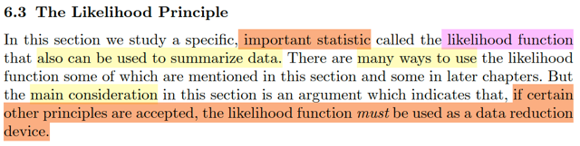</kbd></p>

> [!NOTE]
> đây sẽ là một trong những phần quan trọng nhất, đặt nền tảng trực tiếp
> cho machine learning & AI. Mở đầu gs cho biết phần này ta sẽ nói về 
> một loại STATISTIC CỤ THỂ NHƯNG RẤT QUAN TRỌNG, GỌI LÀ
> LIKELIHOOD FUNCTION, mà có thể được dùng để tóm tắt dữ liệu.
>
> Có nhiều cách dùng nhưng lập luận chủ yếu sẽ được xoay quanh đó là 
> nếu một số nguyên tắc được chấp thuận thì likelihood function PHẢI
> ĐƯỢC DÙNG NHƯ MỘT DATA REDUCTION DEVICE.
>
> Mình nghĩ: Không khó hiểu khi ở đây lại nói **statistic** là likelihood **function.**Vì đã biết định nghĩa của statistic, chỉ là một function, apply lên các random
> variable của random sample.

<br>

<a id="node-520"></a>

<p align="center"><kbd>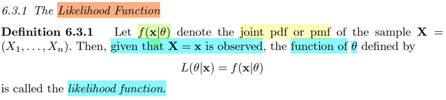</kbd></p>

> [!NOTE]
> đây là lần chính thức đầu tiên học về định nghĩa của likelihood function (những
> lần trước học trong Deep Learning Yoshua Bengio hay Convex Optimization
> S.Boyd không phải là trong khuôn khổ statistic)
>
> Định nghĩa đó là, cho joint `pdf/pmf` của một random sample **X**= (X1,...,Xn) là
> f(**x**|θ), thì nếu biết giá trị của **X** `=` **x**, thì hàm theo `θ` ĐỊNH NGHĨA BỞI:
>
> L(θ|**x**) `=` f(**x**|θ) gọi là likelihood function.
>
> Hoàn toàn dễ hiểu, f(**x**|θ) với tư cách là `pdf/pmf` của **X** sẽ nhấn mạnh vào việc
> nếu biết `θ,` thì với input là **x,**xác suất của event **X**=**x** là bao nhiêu.****Còn hàm L, là hàm theo `θ,` define như vậy sẽ nhấn mạnh rằng, nếu biết **X**=**x**đã xảy ra thì gía trị của f(**x**|θ) với input là `θ` sẽ là bao nhiêu. Có nghĩa là ý nghĩa
> của nó, là nếu **X**=**x**rồi, thì với các `θ` khác nhau khi f(**x**|θ) sẽ có các giá trị khác
> nhau, và lấy giá trị đó đặt là hàm L(θ|**x**).

<br>

<a id="node-521"></a>

<p align="center"><kbd>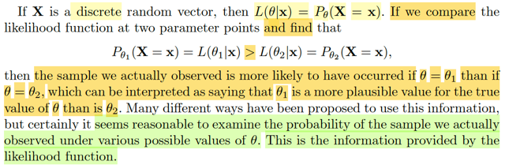</kbd></p>

> [!NOTE]
> Rồi, thế thì nếu xét **X**là discrete random vector, thì L(θ|**x**) theo định
> nghĩa là f(**x**|θ) sẽ là P_θ(**X**=**x**). Phải luôn nhớ L(θ|**x**) là hàm số mà
> với input `θ,`  giá trị của nó sẽ được tính bằng giá trị của hàm f(**x**|θ) khi lắp
> input là **x** vào và tính toán với giá trị `θ,` để rồi `θ` khác thì nó ra khác.
>
> Vậy nên, nếu ta có `θ1,` và `θ2,` thì nó sẽ cho ra L(θ1|**x**) `(=` P_θ1(**X**=**x**))
> khác với L(θ2|**x**) (=P_θ2(**X**=**x**)).
>
> Và giả sử L(θ1|**x**) `=` P_θ1(**X**=**x**) > L(θ2|**x**) `=` P_θ2(**X**=**x**)
>
> thì điều đó mang ý nghĩa là: VỚI GIÁ TRỊ QUAN SÁT THẤY CỦA **X**
> (=**x**)  THÌ GIÁ TRỊ CỦA `θ1` SẼ HỢP LÝ (PLAUSIBLE) HƠN LÀ `θ2,` HỢP
> LÝ Ở ĐÂY MANG Ý NGHĨA LÀ GẦN VỚI GIÁ TRỊ THẬT CỦA `θ` HƠN

<br>

<a id="node-522"></a>

<p align="center"><kbd>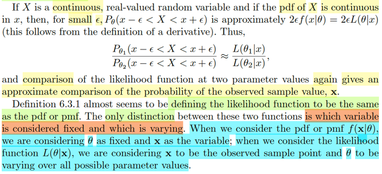</kbd></p>

> [!NOTE]
> Rồi, nếu như X là biến liên tục (chú ý, qua đây họ đang xét random
> variable single, ko phải vector)
>
> thì như ta biết sẽ không bàn tới pmf, vì  P(X****= x) `=` 0 vậy thì ở đây ta sẽ
> xét xác suất X****nằm trong khoảng  (x `-` `ε,` x `+` `ε).` Với `ε` rất nhỏ thì có thể
> coi như xấp xỉ bởi `2εf(x|θ).` Là sao? Vì sao, vì đó là theo định nghĩa của
> ```text
> pdf: Là hàm số sao cho P(X ∈ (a,b)) = ∫a:b fX(x)dx hay P_θ(X ∈ (a,b)) =
> ```
> `∫a:b` `fX(x|θ)dx`
>
> Mà với `ε` rất nhỏ, thì coi như đây là diện tích của hình chữ nhật cạnh `(b-a)`
> ```text
> = 2ε và f(x|θ) ⇨ Diện tích 2εf(x|θ)
> ```
>
> Vậy thì với `θ1,` `θ2` ta sẽ có xác suất X thuộc khoảng a, b sẽ khác nhau:
> ```text
> 2εf(x|θ2) và 2εf(x|θ2)
> ```
>
> ```text
> Xét tỉ lệ P_θ1(X ∈ (a,b))/P_θ2(X ∈ (a,b)) sẽ là ≈ 2εf(x|θ2) / 2εf(x|θ2)
> ```
>
> ```text
> = f(x|θ2) / f(x|θ2) và cũng chính là L(θ1|x)/L(θ2|x)
> ```
>
> Ý muốn nói, với biến liên tục thì việc so sánh likelihood function tại hai
> điểm  `θ` cũng sẽ cho ta ước lượng về xác suất quan sát thấy một sample
> value **x**.
>
> Cuối cùng, gs cho biết định nghĩa của likelihood function trông có vẻ y như
> joint pdf. Chỉ cần nhớ, với joint pdf, ta coi như fixed (biết `θ),` và tính giá trị
> tùy thuộc vào **x**. Còn với likelihood, ta coi **x**fixed và giá trị sẽ thay
> đổi tùy theo `θ`

<br>

<a id="node-523"></a>

<p align="center"><kbd>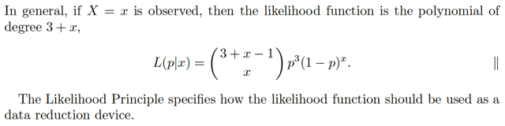</kbd></p>

<p align="center"><kbd></kbd></p>

<p align="center"><kbd>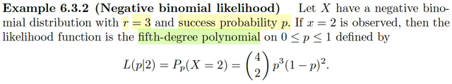</kbd></p>

> [!NOTE]
> Ví dụ này ta gặp lại negative binomial, story của nó ta còn nhớ đó là: nếu X ~
> negative binomial (r, p) thì X mang ý nghĩa là số iid Bern(p) trials cần thiết để
> có đủ r success. Thử lập luận lại pmf của nó.
>
> Xét event X `=` k, thì có nghĩa là sau k Bern(p) trial thì ta có đủ r success trials
> và dừng chuỗi trials. Vậy chắc chắc cái trial chốt sổ là là một success S, và
> chuỗi `k-1` trial trước đó là chuỗi sắp xếp tùy ý `r-1` success và `k-r` failure.
>
> Và để tính P(X `=` k) ta sẽ tính xác suất của tất cả các chuỗi này.
>
> Để cho dễ lập luận và ko làm mất tính tổng quát ta ví dụ r `=` 3, k `=` 7
>
> Xét môt chuỗi cụ thể có {2 Success `+` 3 Failure } Success: SFSFFFS đây là
> joint event của k event độc lập. nên theo định nghĩa của independent event:
>
> P("SFSFFFS") `=` tích của xác suất của từng event
> `=P(S)P(F)P(S)P(F)P(F)P(F)P(S)`
>
> `=` `p^3(1-p)^4`
>
> Và một possible outcome thỏa {X `=` k}, tức là tập {s ∈ `Ω:` X(s) `=` k} sẽ thuộc một
> trong các chuỗi này, nói cách khác:
>
> ```text
> {s ∈ Ω: X(s) = k} = {s ∈ Ω: Kết quả có dạng SFSFFFS} U {s ∈ Ω: Kết quả có
> ```
> dạng SSFFFFS} ....
>
> ```text
> ⇨ P({s ∈ Ω: X(s) = k}) = P[{s ∈ Ω: Kết quả có dạng SFSFFFS} U {s ∈ Ω: Kết
> ```
> quả có dạng SSFFFFS} ....]
>
> và vế phải là unionn của các disjoint event nên theo Axiom 3:
>
> ```text
> = P{s ∈ Ω: Kết quả có dạng SFSFFFS} + P{s ∈ Ω: Kết quả có dạng SSFFFFS}
> ```
> `+` ....
>
> Và mỗi hạng tử đều là `p^3(1-p)^4`
>
> Câu hỏi chỉ còn là đếm số tập con, số chuỗi có dạng {2S `+` 4F} `+` 1S, chính là
> bài toán đếm số cách sắp xếp 2S và 4D vào 6 vị trí không phân biệt các S với
> nhau và các F với nhau.
>
> Lập luận sẽ là: Đây cũng chính là số cách chọn vị trí của 2 S, những chỗ còn
> lại sẽ là của F, Nên đây là số cách chọn bộ 2 vị trí trong 6 vị trí: 6 choose 2
>
> Kết quả (6 choose 2) `p^3(1-p)^4`
>
> ```text
> hay khái quát sẽ là P(X = k) = (k - 1 choose r - 1) p^r (1 - p)^(k - r)
> ```
>
> Tuy nhiên trong sách này Casella dùng một convention khác là story của X
> sẽ là số failure number trước khi có r success nên P(X `=` k), chứng minh 
> tương tự.
>
> ```text
> = P(X = k) = (r + k - 1 choose y) (1 - p)^k p^r
> ```
>
> `====`
>
> Rồi, quay lại đây với x `=` 2 is observed, tức biết `/` thấy X `=` 2 thì likelihood
> function sẽ là: tranh thủ nói lại không thừa: Hàm likelihood `L(θ|x)` là hàm
> được định nghĩa bởi `f(x|θ),` với discrete rv chính là `P_θ(X=x),` và là hàm 
> theo theta. Θ ở đây là vector (r, p), nhưng đã biết r `=` 3 rồi
>
> ```text
> Nên L(θ|2) = P_θ(X = 2) = (3 + 2 - 1  choose 3 - 1) p^3 (1 - p)^2
> ```
>
> `=` (4 choose 2) p^3 (1 `-` p)^2
>
> Và đây là đa thức bậc 5 của p
>
> Nên nói khái quát nếu X `=` x quan sát thấy thì likelihood function sẽ là đa
> thức bậc 3 `+` x.

<br>

<a id="node-524"></a>

<p align="center"><kbd>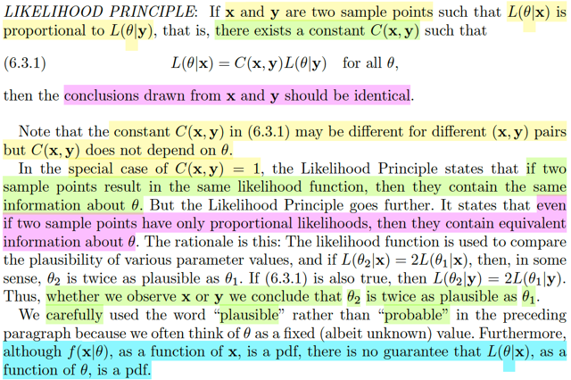</kbd></p>

> [!NOTE]
> Đây là một trong những điểm kiến thức quan trọng bậc nhất. LIKELIHOOD 
> PRINCIPLE (tạm dịch là nguyên lý hợp lý).
>
> Đại ý nguyên lý này nói rằng, nếu như ta quan sát, thu thập được hai điểm 
> dữ liệu (kiểu như hai kết quả thí nghiệm) gọi là **x** và **y**. Thì nếu như likelihood
> function L(θ|**x**) tỉ lệ với L(θ,**y**), mà điều này đồng nghĩa là tồn tại hằng số C(**x**,**y**)
> sao cho L(θ|**x**) `=` C(**x**,**y**) L(θ,**y**) thì khi đó **MỌI KẾT LUẬN VỀ `θ` RÚT RA TỪ
> x và y ĐỀU PHẢI NHƯ NHAU**Làm rõ chút: constant C lại kí hiệu là C(**x**, **y**) ý nghĩa là, với các **x**, **y** khác nhau
> thì C có thể khác nhau, nhưng miễn là nó là constant đối với `θ,` không phụ thuộc
> `θ`
>
> Và để ta hiểu phần nào tại sao lại như vậy, tác giả cho ví dụ giả sử như ta có
> hai giá trị `θ1,` `θ2,` mà với việc quan sát được **x**, thì `θ1` HỢP LÝ (khi suy luận
> `/` ước lượng cho `θ)` HƠN `θ2` GẤP ĐÔI, tức L(θ1|**x**) `=` 2 L(θ2|**x**). 
>
> Thì vì L(θ|**x**) `=` C(**x**,**y**) L(θ,**y**), dễ thấy sẽ dẫn đến là L(θ1,**y**) `=` 2 L(θ2,**y**). Điều
> này có nghĩa là việc quan sát thấy giá trị của **x** hay **y đều giúp ta có cùng kết
> luận về độ hợp lý (PLAUSIBLE) tương đối so với nhau của `θ1` và θ2**Và gs nhấn mạnh, ta dùng từ Plausible, (tính hợp lý) chứ không dùng từ Probable
> (xác suất) nhằm muốn nói rằng: **TA CHỈ CÓ THỂ NÓI `θ1` HỢP LÝ GẤP ĐÔI
> ```text
> θ2, CHỨ KHÔNG THỂ NÓI XÁC SUẤT θ = θ1 CAO GẤP ĐÔI XÁC SUẤT
> ```
> `θ` `=` `θ2.` Vì CHƯA CHẮC L(Θ|x) LÀ PDF**

<br>

<a id="node-525"></a>

<p align="center"><kbd>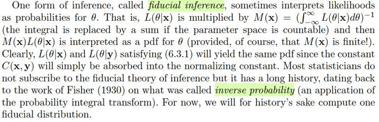</kbd></p>

> [!NOTE]
> QUAY LẠI SAU

<br>

<a id="node-526"></a>

<p align="center"><kbd>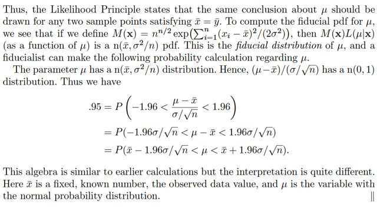</kbd></p>

<p align="center"><kbd></kbd></p>

<p align="center"><kbd>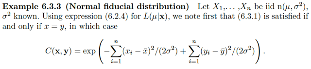</kbd></p>

> [!NOTE]
> QUAY LẠI SAU

<br>

<a id="node-527"></a>

<p align="center"><kbd>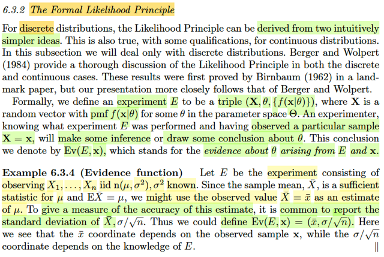</kbd></p>

> [!NOTE]
> đại khái là một số khái niệm mới: định nghĩa một thử nghiệm `E`
> (experiment) bởi một bộ triple (**X**, `θ,` f(**x**|θ)) trong đó **X**là random
> vector với pmf f(**x**|θ). Rồi, người tham gia thử nghiệm quan sát thấy giá
> trị **x**của **X**, tức event **X**= **x** đã xảy ra, từ đó đưa ra **một số suy
> luận hoặc kết luận về θ**,
>
> Và **CÁI KẾT LUẬN VỀ `θ` ĐÓ, ĐƯỢC GỌI LÀ EVIDENCE**, kí hiệu là `Ev(E,`
> **x**) viết tắt của evidence about `θ` arising from `E` and **x**, tạm dịch: Bằng
> chứng về `θ` có được dựa trên thử nghiệm `E` và giá trị quan sát thấy **x**Một ví dụ minh họa là `E` là thử nghiệm trong đó ta quan sát giá trị của X1,
> ... Xn iid ~ `n(μ,` `σ^2)` vói `σ^2` đã biết. Vì sample mean Xbar là sufficient
> statistic cho `μ` (những phần trước đã chứng minh điều này) nên ta dùng
> xbar làm estimate cho `μ.`  Đồng thời để đo mức độ chính xác của ước
> lượng này, thường người ta dùng standard deviation của Xbar: `σ/√n.` Do đó
> ta define Ev(E,**x**) `=` (xbar, `σ/√n).`
>
> Nói chung là biết vậy thôi, vì đây chỉ là định nghĩa
>
> Nhưng điểm đáng chú ý là xbar sẽ phụ thuộc giá trị quan sát thấy, còn `σ/n`
> phụ thuộc cách thử nghiệm `(E,` ví dụ có thể thấy nó phụ thuộc kích thước
> sample n)

<br>

<a id="node-528"></a>

<p align="center"><kbd>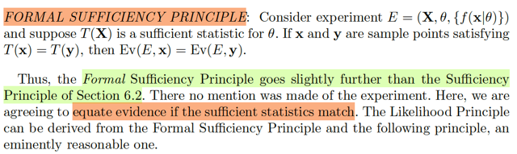</kbd></p>

🔗 **Related:** [6.2 THE SUFFICIENT PRINCIPLE](62_the_sufficient_principle.md#node-472)

> [!NOTE]
> Đại khái là, những phần trước ta đã biết về **sufficient** **principle**, nó nói rằng:
> nếu T(**X**) là **sufficient** statistic, thì nó đã **chứa đủ thông tin cần thiết giúp suy
> luận ra `θ` rồi**, nên **mọi việc suy luận ra θ** dựa trên giá trị quan sát thấy của **X**thì **chỉ cần dựa trên** `/` thông qua T(**X**)****là đủ rồi.
>
> Hay nói cách khác, nếu ta có hai giá trị quan sát thấy của **X** là **x**và**y** mà T(**x**)
> `=` T(**y**) thì việc suy luận về `θ` dựa trên **X** `=` **x** hay **X** `=` **y** đều giống nhau, vì 
> chỉ cần dựa trên giá trị của T(**X**) mà thôi 
>
> Vậy thì ở đây, nguyên lý này được nâng lên thêm: Rằng nếu T(**X**) là sufficient
> statistic thì `Ev(E,` **x**) `=` `Ev(E,` **y**), tức là: 
>
> Bằng chứng (evidence) thu được từ hai mẫu này (**x**, **y**) là như nhau. Mà ta nhớ
> lại định nghĩa của bằng chứng (evidence function) là gì: Là suy luận, kết luận
> về `θ` của ta dựa vào thí nghiệm `E` và giá trị quan sát được **x**. Nên nói `Ev(E,` **x**)
> bằng `Ev(E,` **y**) ý là nói: Với thí nghiệm `E,` thì quan sát thấy giá trị **x** hay **y** đều
> c**ho ra cùng kết luận của ta về θ** 
>
> Nên mới nói "**equate evidence if sufficient statistic match**, tức là nếu T(x)
> `=` T(y) thì coi như evidence như nhau"

<br>

<a id="node-529"></a>

<p align="center"><kbd>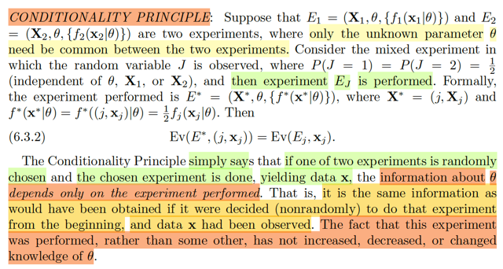</kbd></p>

> [!NOTE]
> Đại ý của condition principle là: 
>
> Giả sử ta có hai thử nghiệm E1, E2: 
>
> E1 `=` (**X1**, `θ,` {f1(**x1**|θ)} và 
>
> E2 `=` (**X2**, `θ,` {f2(**x2**|θ}) 
>
> trong đó chỉ có `θ` là chưa biết.
>
>
> Thì đại ý là, nếu ta tung đồng xu `50-50` để chọn làm thử nghiệm E1 hay 
> E2. Và giả sử kết quả là E1. Thì principle này nói rằng bằng chứng thu được
> của quá trình này, CŨNG CHỈ LÀ BẰNG BẰNG CHỨNG THU ĐƯỢC KHI
> TA CHỌN THỬ NGHIỆM 1 NGAY TỪ ĐẦU.
>
> Có nghĩa là, cái việc random giữa E2, và E1 không quan trọng, hay nói cách
> khác, thông tin về việc E1 được chọn thay vì E2 không làm thay đổi thông
> tin về `θ.`

<br>

<a id="node-530"></a>

<p align="center"><kbd>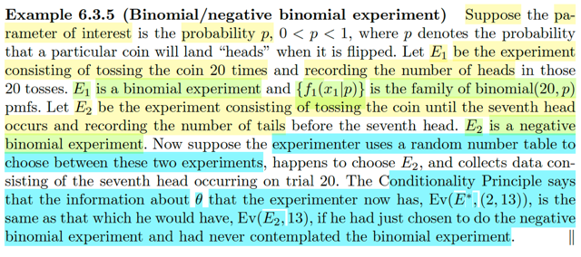</kbd></p>

> [!NOTE]
> Rồi, đây là minh họa cho điều vừa rồi: giả sử ta quan tam xác suất ra mặt
> ngửa p. Thì thí nghiệm E1 là ta sẽ tung đồng xu 20 lần và đến số mặt ngửa
> Còn E2 là ta tung đồng xu cho đến khi có 7 mặt ngửa. Và ta dùng một cơ
> chế random để chọn E1, hoặc E2. Giả sử chọn được E1, và tiến hành E1,
> quan sát thấy kết quả, và tiến hành suy luận ra p
>
> Thì kết quả suy luận về p của quá trình này, theo Conditional Principle phải
> y như việc ta  thực hiện thí nghiệm E1 NGAY TỪ ĐẦU (tức là không cần
> băn khoăn nên chọn thí nghiệm nào)
>
> Nói thêm, nếu làm E1, thì ta sẽ có câu chuyện của binomial random variable
> cụ thể là binomial(20, p), và f1(x1|p) sẽ là pmf của binomial distribution.
>
> Còn E2, thì nó là câu chuyện của negative binomial.

<br>

<a id="node-531"></a>

<p align="center"><kbd>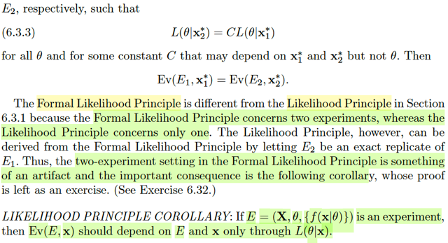</kbd></p>

<p align="center"><kbd></kbd></p>

<p align="center"><kbd>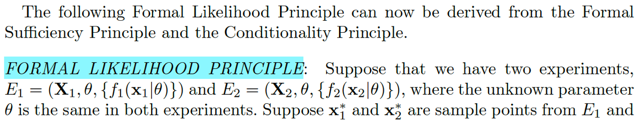</kbd></p>

> [!NOTE]
> Rồi, qua đây ta có một cái gọi là FORMAL LIKELIHOOD PRINCIPLE, nó nói
> rằng nếu như xét hai experiment 
>
> E1 `=` {**X**1, `θ,` {f1(**x**1|θ)} và E2 `=` {**X**1, `θ,` {f1(**x**2|θ)} trong đó `θ` là chưa biết. 
>
> Và cho rằng **x1***và **x2***là hai sample points từ E1 và E2 sao cho likelihood 
> tỉ lệ với nhau:
>
> L(θ|**x2***) `=` C L(θ|**x1***) với mọi `θ` và C là constant không phụ thuộc `θ.`
>
> Khi đó Ev(E1, **x1***) `=` Ev(E2, **x2***)
>
> Mình sẽ lập luận lại cái vụ trong sách nói cái này là derive từ hai cái trước
> (mà thật ra cũng là chứng minh Birnbaum theorem)
>
> `====`
>
> So sánh với LIKELIHOOD PRINCIPLE, nói rằng: Nếu ta có hai điểm data
> **x**,  **y**(tức hai giá trị quan sát được của của random sample **X**) sao
> cho  L(θ|**x**) `=` C(**x**,**y**)L(θ|**y**). Với C(**x**, **y**) là constant có chỉ
> phụ thuộc x, y chứ  không phụ thuộc `θ.` Thì khi đó, kết luận về `θ` dựa trên x
> hoặc y phải giống nhau
>
> Thì nay, với formal likelihood principle, nó mở rộng hơn ở chỗ là vì nó xét
> hai experiment khác nhau E1 `=` {**X1**, `θ,` {f1(**x1**|θ)}, E2 `=` {**X1**, `θ,` {f1(**x2**|θ)}
> (giống như ví dụ trước, một cái thì ta tung xu 20 lần, một cái thì ta tung cho
> đến khi có 7 lần ngửa, thì dĩ nhiên đây là hai thử nghiệm khác nhau, đều 
> cùng muốn suy luận ra cùng `θ,` là p, tỉ lệ ra mặt ngửa. Nhưng f1 là pmf của 
> binomial, **x1***là một giá trị quan sát thấy của một binomial rv, còn f2 là pmf
> của negative binomial, **x2*** là giá trị quan sát thấy của negative binomial
> random variable.
>
> Nhưng kết luận đều là: Những kết luận về `θ` đều giống nhau
>
> Cuối cùng là một hệ quả nói rằng nếu `E` `=` {X, `θ,` f(**x**|θ)} là một experiment
> thì `Ev(E,` x) nên chỉ phụ thuộc `E` và **x**thông qua `L(θ,` x). 
>
> Phần chứng minh này là bài tập.

> [!NOTE]
> Rồi, lập luận là vầy:
>
> Cái principle này nói là, à, ta có hai thử nghiệm E1 và E2:
>
> E1 `=` (**X1**, `θ,` f1(**x1**|θ)) và E2 `=` (**X2**, `θ,` f2(**x2**|θ))
>
> và giả sử **x1*** và **x2*** là hai sample point từ E1 và E2 sao cho likelihood của chúng tỉ lệ, tức là
>
> L(θ|**x1***) `=` CL(θ|**x2***) với mọi `θ` và C là constant as a function theo `θ,` tức là có thể phụ thuộc
> **x1*** và **x2***  nhưng không phụ thuộc `θ.` Thì khi đó nguyên lý này FLP nói là Ev(E1, **x1***) `=`
> Ev(E2, **x2***)
>
> Ta sẽ chứng minh nó dựa trên FSP (Formal Sufficient Principle) và Conditionality Principle CP như
> sau
>
> Đầu tiên ta sẽ ôn lại về likelihood function, theo định nghĩa là hàm được define bởi:
>
> L(θ|**x**) `=` f(**x**|θ)
>
> Vậy thì, L(θ|**x1***) `=` f1(**x1**|θ) evaluate tại **x1** `=` **x1***, cũng là f1(**x1***|θ)
>
> Và L(θ|**x2***) `=` f2(**x2***|θ)
>
> Và ta có L(θ|**x1***) `=` C * L(θ|**x2***) với mọi `θ,` tương đương:
>
> f1(**x1***|θ) `=` C f2(**x2***|θ) với mọi `θ.`
>
> Thế thì bây giờ, ta sẽ cần xét một thử nghiệm `E*` như sau: Tung đồng xu, nếu ra ngửa thì làm thử
> nghiệm E1, và sấp, thì làm thử nghiệm E2. Mục đích là mang hai thử nghiệm riêng rẻ này vào
> chung một thử nghiệm to.
>
> Thử nghiệm `E*` sẽ kí hiệu là (**X***, `θ,` f*(**x***|θ)) với **X*** `=` (j, **X**j) mang ý nghĩa là, giá trị cụ
> thể của thí nghiệm sẽ là một cặp gồm có: xu tung ra ngửa hay sấp (j `=` 1 hay 0) và tương ứng là
> **X**j bằng bao nhiêu. Là sao?
>
> Tức là **x***, tức là giá trị quan sát được của **X*** sẽ là:
>
> (1, **x1***) hoặc (2, **x2***), ý là,
>
> nếu j `=` 1, thực hiện E1, quan sát thấy giá trị **x1***.
>
> nếu j `=` 0, thực hiện E2, quan sát thấy giá trị **x2***
>
> và f*(**x***|θ) cũng là f*((j,**x**j*)|θ) sẽ bằng `(1/2)` fj(**x**j*|θ) Vì sao, hay là sao?
>
> Đó là vì f*((j,**x**j*)|θ) là joint pdf `=` fj(**x**j*|θ) `fJ(j|θ)` `=` `fj(xj*|θ)` `P(J=j)` `=` fj(**x**j*|θ) `1/2`
>
> Rồi. Thế thì ta có
>
> f*((1,**x1***)|θ) `=` `(1/2)` f1(**x1***|θ)
>
> f*((2,**x2***)|θ) `=` `(1/2)` f2(**x2***|θ)
>
> Dùng f1(**x1***|θ) `=` C f2(**x2***|θ) ta suy ra
>
> f*((1,**x1***)|θ) `=` C f*((2,**x2***)|θ)
>
> cũng là tỉ lệ f*((1,**x1***)|θ)/f*((2,**x2***)|θ) `=` C as a function of `θ` với mọi `θ`
>
> Tới đây ta dùng một tính chất hay theorem gì đó đã học nói rằng:
>
> Nếu mà T(**X**) mà là sufficient statistic thì với hai điểm giá trị **x** và **y** của **X** thì:
>
> f(**x**|θ)/f(**y**|θ) không phụ thuộc `θ` khi và chỉ khi T(**x**) `=` T(**y**)
>
> Vậy thì ta đang có hai điểm (1,**x1***) và (2,**x2***) có tính chất là
>
> tỉ lệ f*((1,**x1***)|θ)/f*((2,**x2***)|θ) `=` C as a function of `θ` với mọi `θ`
>
> Vậy thì theo cái theorem vừa nhắc lại thì điều này phải đồng nghĩa T((1,**x1**)) `=` T((2,**x2**))
>
> Như vậy tới đây, ta xét cái experiment `E*,` với hai điểm giá trị (1,**x1***) và (2,**x2***) có T((1,
> **x1***)) `=` T((2,**x2***))
>
> thì điều này phù hợp với bối cảnh của FSP, giúp kết luận `Ev(E*,` (1,**x1***)) `=` `Ev(E*,` (2,**x2***))
>
> Cuối cùng, Conditionality Principle nói rằng:
>
> `Ev(E*,` (1,**x1***)) chỉ là `=` Ev(E1, **x1***)
>
> `Ev(E*,` (1,**x2***)) chỉ là `=` Ev(E2, **x2***)
>
> Từ đó kết luận Ev(E1, **x1***) `=` Ev(E2, **x2***)

<br>

<a id="node-532"></a>

<p align="center"><kbd>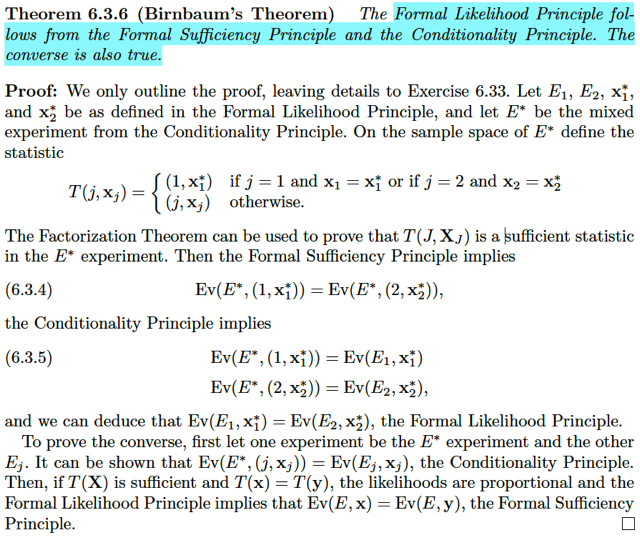</kbd></p>

🔗 **Related:** [6.2 THE SUFFICIENT PRINCIPLE](62_the_sufficient_principle.md#node-483)

> [!NOTE]
> Birnbaum's Theorem, nói rằng: Formal Sufficient Principle và Conditionality 
> Principle sẽ dẫn đến Formal Likelihood Principle và ngược lại.
>
> Chứng minh chiều → Nhưng mới làm, làm lại cho nhớ không thừa:
>
> Gọi E1, E2 là hai thí nghiệm (experiment): 
>
> ```text
> E1 = (X1, θ, {f1(x1|θ)}) và E2 = (X2, θ, {f2(x2|θ)})
> ```
>
> Nếu làm E1, gọi x1* là kết quả quan sát được và nếu làm E2 thì kết quả quan
> sát được là x2* 
>
> Và `E*` là thí nghiệm hỗn hợp: (X*, `θ,` `{f*(x*|θ)}` với với cách thức là dùng một
> biến ngẫu nhiên J ~ Bern(0.5) để quyết định làm E1 hay E2:
>
> Nếu J `=` 1 thì làm E1 và có X1 `=` x1*
>
> Từ đó X* sẽ có hai possible outcome: (1, x1*) và (2, x2*) 
>
> (X, x1*, x2* đều là vector, vì đây là random sample) 
>
> Thế thì:
>
> ```text
> f*(x*|θ)|x*=(j, xj) = f*((j, xj)|θ)
> ```
>
> Với x* `=` (1, x1*) ⇨ f*((1, `x1*)|θ)` là gì?
>
> Đây là joint `pmf/pdf` của J và X:
>
> `=` `f1(x1*|θ)` * `fJ(1|θ)`
>
> `=` `f1(x1*|θ)` * fJ(1)
>
> `=` `f1(x1*|θ)` * `P(J=1)`
>
> `=` `(1/2)` `f1(x1*|θ)`
>
> Còn x* `=` (2, x2*):
>
> ```text
> f*(x*|θ) = f2(x2*|θ) = (1/2) f2(x2*|θ)
> ```
>
> Vậy thì:
>
> Ta sẽ dùng cái đề bài cho: likelihood tỉ lệ:
>
> ```text
> L(θ|x*2) = C*L(θ|x*1) với mọi θ, C là hằng số as a function of θ, tức là có thể
> ```
> phụ thuộc x1* và x2* nhưng không phụ thuộc `θ.`
>
> Theo định nghĩa của likelihood function, `L(θ|x)` là function theo `θ,` dựa trên fixed
> value của x, được định nghĩa là `=` `f(x|θ)`
>
> ⇨ `L(θ|x*1)` `=` `f1(x1*|θ)`
>
> và `L(θ|x*2)` `=` `f2(x2*|θ)`
>
> ```text
> Vậy thì: L(θ|x*1) = C , L(θ|x*2) ⇔ f1(x1*|θ) = C . f2(x2*|θ)
> ```
>
> ```text
> Và với f*((1,x1*)|θ) = (1/2) f1(x1*|θ)
> ```
>
> ```text
> và f*((2,x2*)|θ) = (1/2) f2(x2*|θ) thì ta có:
> ```
>
> `f1(x1*|θ)` `=` C . `f2(x2*|θ)` 
>
> ```text
> ⇔ f*((1,x1*)|θ) = C . f*((2,x2*)|θ), và điều này đúng với mọi θ, với C là constant
> ```
> as a function theo `θ:`
>
> Đây là kết quả quan trọng, vì tới đây ta dùng theorem 6.2.13 nó nói rằng: 
>
> "Theorem `6/2/13:` Let f(x|b) be the pmf or pdf of a sample X. Suppose there exists a
> function T(x) such that, for every two sample points x and y, the ratio `f(x|b)/f(y|b)` is 
> constant as a function of b if and only if T(x) `=` T(y). Then T(X) is a minimal sufficient 
> statistic for b."
>
> Có nghĩa là, giả sử có T(x) sao cho với hai sample point mà tỉ lệ của `pdf/` pmf không
> ```text
> phụ thuộc θ thì kết quả apply T của chúng sẽ bằng nhau: nếu f(x|θ) / f(y|θ) = C thì
> ```
> T(x) `=` T(y) và ngược lại. Thì theorem này CHO PHÉP TA NÓI T(X) LÀ MINIMAL 
> SUFFICIENT STATISTIC
>
> Và từ đó ta có thể dùng Formal Sufficient Principle, nói rằng: Nếu như trong thử
> nghiệm `E,` mà với sufficient statistic T(X) thì hai điểm dữ liệu x, và y có T giống nhau, 
> tức T(x) `=` T(y), thì khi đó kết luận về `θ` của experiment `E` dựa trên giá trị quan sát 
> thấy x hay y đều giống nhau: `Ev(E,` x) `=` `Ev(E,` y)
>
> ```text
> Do đó áp dụng vào đây: Ta có  f*((1,x1*)|θ) = C * f*((2,x2*)|θ) với mọi θ, tức
> ```
> ```text
> f*((1,x1*)|θ) / f*((2,x2*)|θ) = C với mọi θ
> ```
>
> Thì đặt T(x) là function sao cho nếu x*_1 và x*_2 (tức hai điểm dữ liệu của x*, ví dụ 
> ```text
> (1,x*1) và (2,x*2) có f*((1,x1*)|θ) / f*((2,x2*)|θ) = C thì T(x*_1) = T(x*_2). Khi đó với
> ```
> cách đặt này thì theorem 6.2.13 cho phép ta kết luận T(X) là minimal sufficient statistic.
>
> Và ta sẽ có bối cảnh phù hợp với Formal Sufficient Principle: 
>
> Là trong experiment `E*,` ta có hai điểm dữ liệu x*_1 và x*_2, hay (1,x*1) và (2,x*2)
> có T(x*_1) `=` T(x*_2) nên 
>
> ```text
> Ev(E*, x*_1) = Ev(E*, x*_2), hay cũng là Ev(E*, (1,x1*)) = Ev(E*, (2,x2*))
> ```
>
> `====`
>
> Rồi. Cuối cùng dùng Conditionality Principle, nó nói rằng trong cái mixed experiment
> thì `Ev(E*,` x*_1) `=` `Ev(E*,` (1,x*1)) thì thật ra cũng bằng Ev(E1, x*1) và 
> `Ev(E*,` x*_2)  `=` `Ev(E*,` (2,x*2)) thì thật ra cũng bằng Ev(E2, x*2)
>
> mà ý nghĩa là: Dù cho mixed experiment có làm màu mè thêm bằng cách tung coin
> để để quyết định xài E1 hay E2 thì nếu mà ra ngửa và làm E1 để ra x*1 thì evidence 
> (tức là suy luận về `θ` dựa trên kết quả) của cái mixed experiment này thật ra cũng chỉ
> y như evidence của cái E1 mà thôi. Tương tự với E2.
>
> Vậy tóm lại ta có:
>
> ```text
> 1) Ev(E*, x*_1) = Ev(E*, x*_2), hay cũng là Ev(E*, (1,x1*)) = Ev(E*, (2,x2*))
> ```
>
> 2) `Ev(E*,` x*_1) `=` `Ev(E*,` (1,x*1)) thì thật ra cũng bằng Ev(E1, x*1) và 
> `Ev(E*,` x*_2)  `=` `Ev(E*,` (2,x*2)) thì thật ra cũng bằng Ev(E2, x*2)
>
> Suy ra: Ev(E1, x1*) `=` Ev(E2, x2*). Đây là kết luận của Formal Likelihood Principle

> [!NOTE]
> Còn để chứng minh chiều ngược lại
> (converse) QUAY LẠI SAU

<br>

<a id="node-533"></a>

<p align="center"><kbd>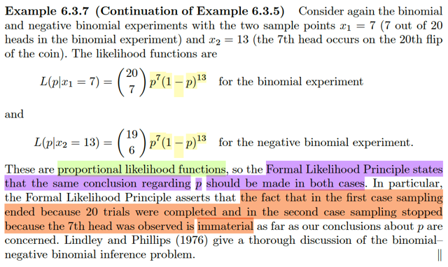</kbd></p>

> [!NOTE]
> Quay lại thăm ví dụ này, E1 là tung đồng xu 20 lần và quan sát số lần ra
> ngửa và E2 là tung đồng xu cho đến khi ra 7 lần ngửa. Thì như đã biết ở lần
> trước, ta có thể thấy likelihood của chúng tỉ lệ nhau, tỉ lệ của chúng không
> phụ thuộc p (là `θ` ở case này):
>
> L(p|x1 `=` 7), theo định nghĩa của likelihood function, `=` `f1(x1|p)|x1=7`  vói f1 là
> pmf của binomial(20, p) ta sẽ có (20 c 7) p^7 `(1-p)^13`
>
> L(p|x2 `=` 13) theo định nghĩa likelihood function, `=` `f2(x2|p)|x2=13` với f2 là
> pmf của negative `binomial(r=13,` p) mà story là số lần fail cho đến khi đủ  7
> lần ngửa.
>
> Và như vậy theo Formal Likelihood Principle, ta có thể kết luận rằng SUY
> LUẬN VỀ p CỦA CẢ HAI EXPERIMENT ĐỀU PHẢI GIỐNG NHAU.
>
> Và ý nghĩa quan trọng của cái này đó là: DÙ TA TIẾN HÀNH THEO KIỂU GÌ
> THÌ CŨNG KHÔNG QUAN TRỌNG: tung n lần rồi xem số lần ngửa cũng
> được mà tung cho đến khi có 5 lần ngửa cũng được. Hai thông tin đó đều
> cho ra cùng một kết luận với p
>
> Và câu quan trọng đó là : Cái thông tin chứa đựng trong việc ta dừng E1 khi
> đủ 20 trial và dừng E2 khi đủ 7 success là dư thừa (immaterial).
>
> "**Cái đồng xu nó méo quan tâm đến "tâm tư nguyện vọng" của thằng
> tung xu**. Việc thằng kia**định dừng lúc nào không làm thay đổi tính chất vật lý
> của đồng xu** (p). Do đó, thông tin về "Quy tắc dừng" (Stopping Rule) là thông
> tin ngoài lề, không có giá trị chứng cứ về p."

<br>

<a id="node-534"></a>

<p align="center"><kbd>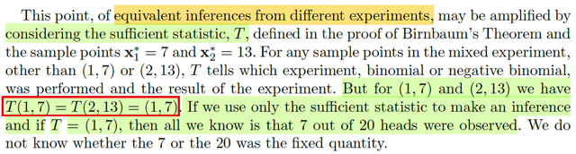</kbd></p>

> [!NOTE]
> Đại khái là gs muốn nhấn mạnh lần nữa cái nhận định `/` kết luận dựa trên
> Formal Likelihood Principle vừa rồi rằng "suy luận về p dựa trên hai thử
> nghiệm là hoàn toàn như nhau" Ev(E1, x1*) `=` Ev(E2, x2*). Và ông nhấn
> mạnh bằng cách nói rằng: Nếu ta có T là  sufficient statistic, thì theo định
> nghĩa của nó, thì lượng thông tin về p chứa trong hai điểm dữ liệu đều
> phải như nhau, mà quả thật là như vậy:
>
> Vì việc biết (1,7), tức "tung 20 lần ra 7 ngửa, (đồng nghĩa ra 13 sấp)" thì 
> cũng Y NHƯ biết (2, 13), tức "cần phải tốn 13 lần sấp trước khi có 7 lần
> ngửa"
>
> Và rõ ràng là thông tin của hai điểm dữ liệu này là như nhau, đều là "tung
> 20 lần ra 7 ngửa, 13 sấp"
>
> Đó là ý tác giả khi viết T(1,7) `=` T(2,3) `=` (1,7)

<br>

<a id="node-535"></a>

<p align="center"><kbd>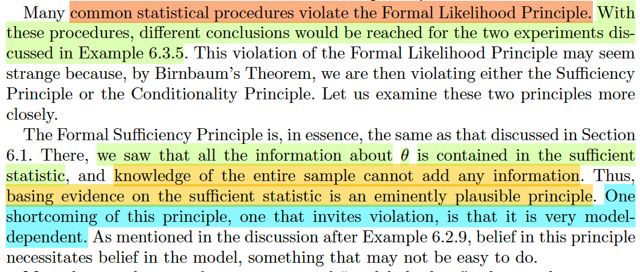</kbd></p>

🔗 **Related:** [6.2 THE SUFFICIENT PRINCIPLE](62_the_sufficient_principle.md#node-491)

> [!NOTE]
> đại khái là có nhiều quy trình thống kê phổ biến vi phạm nguyên lý FLP. mà
> trong đó, họ sẽ có thể đưa ra nhiều kết luận khác nhau đối với hai thử nghiệm
> trên.
>
> Và ý là, nói họ vi phạm FLP thì thật ra họ đã vi phạm Formal Sufficient
> Principle hoặc Conditionality Principle, vì nếu không vi phạm hai cái này thì nó
> phải không vi phạm FLP vì FLP derive từ hai cái này.
>
> Nên ở đây gs xét xem người ta thường vi phạm FSP hay CP chỗ nào:
>
> Với Formal Sufficient Principle, thì người ta thường vi phạm ở chỗ này:
>
> Đó là như ta kết luận từ 6.1 (theo link) rằng: Nếu T(X) là sufficient statisti thì
> dùng thông tin trong T(X) là đủ để suy luận `θ,` không cần dùng toàn bộ thông
> tin trong sample X. Vì nó "đã đủ" (sufficient). Lấy ví dụ như nếu đang có **X**
> là sample ~ normal distribution thì dùng T(**X**) `=` (Xbar, S^2) (là một
> sufficient statistic là đủ để suy luận `μ,` `σ^2,` có thể vứt **X** đi mà không sợ
> mất thông tin.
>
> Tuy nhiên CHỖ NÀY NGUY HIỂM LÀ, NẾU NHƯ **X THỰC RA LẠI KHÔNG
> PHẢI ~ NORMAL**, THÌ T(**X**) `=` (Xbar, S^2) **KHÔNG CÒN LÀ
> SUFFICIENT STATISTIC NỮA**. Khi đó nếu bỏ X đi, chỉ xài T(X) sẽ bị mất
> thông tin quan trọng giúp suy luận ra `θ` (chưa chắc `θ` là `μ` và `σ` của normal) ****Do đó ở đây gs nói "một hạn chế của sufficient principle, tức là cái nguyên
> tắc nói rằng nếu mà tao đã có một thống kê đủ thì tao đếch cần dùng cả bộ
> sample nữa", thì cái nguyên lí này tuy là  rất hợp lí (plausible) vì rõ ràng điều
> này là hợp lí, vì nếu T(**X**) đã chưa đủ thông tin cần thiết để suy luận ra `θ` rồi
> thì cần gì mà xài **X** nữa. Nhưng nguyên lí này rất **MODAL DEPENDENT
> chính là ý mà ta nói ở trên: T(X) MÀ TA DÙNG HAY ĐỊNH DÙNG, HAY ĐANG
> NGHĨ RẰNG NÓ LÀ SUFFICIENT STATISTIC THÌ NÓ DỰA TRÊN GIẢ ĐỊNH
> CỦA TA VỀ CÁI POPULATION DISTRIBUTION**.
>
> Và cái câu cuối ý nói nếu đã tin vào sufficient principle thì phải tin vào modal
> tức là tin rằng ta đang giả định đúng population distribution
>
> Nên nếu cái giả định này sai thì coi chừng ta đang xài cái INSUFFICIENT
> STATISTIC, dĩ nhiên khi đó ta đã vi phạm Formal Sufficient Principle

<br>

<a id="node-536"></a>

<p align="center"><kbd>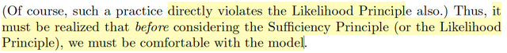</kbd></p>

<p align="center"><kbd></kbd></p>

<p align="center"><kbd>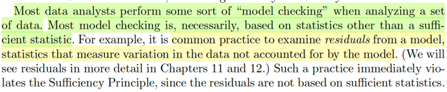</kbd></p>

> [!NOTE]
> Đại khái là nhiều data analyst thực hiện bước gọi là model checking, khi
> phân tích data, điều này rõ ràng là cần thiết (necessary)
>
> Và ý tác giả là, một trong những cách làm của model checking là check cái
> residuals (là loại statistic đo độ biến động của dữ liệu không khớp với model
> dự đóan, ví dụ như như trong Introduction To Statistical Learning, ta thấy
> có vụ này, check xem các residuals có một pattern nào mà nhìn thấy quy 
> luật được hay không, để từ đó đánh giá mô hình có đang làm tốt hay không)
>
> Thế thì cái chỗ mà tác giả nói rằng cách làm này vi phạm sufficient statistic
> thì ý là vầy: Ví dụ như ta đang định dùng sample mean và sample variance
> để estimate `/` suy luận ra true mean và true variance. Thì thật ra ta đang giả
> định phân phối population là phân phối chuẩn, và ta đang tin vào `/` dựa vào
> sufficient principle thông qua hành động là ta chọn sample mean và sample
> variance (vì ta tin nó là sufficient statistic). Chứ nếu không tin vào nguyên
> lí này thì tại sao ta lại bỏ data mà dùng hai thằng đó.
>
> Rồi, như vậy nếu mà đã tin vào sufficient statistic, thì mắc gì lại phải giữ lại
> **X**để mà đi tính residuals nữa? Do đó việc ta tính residuasl tức là ta còn giữ
> **X, và đó là sự vi phạm sufficient statistic.**Và từ đó cũng chính là vi 
> phạm likelihood principle (vì Formal likelihood principle derive từ formal
> sufficient principle và conditionality principle)**Tất nhiên tác giả cho rằng, trước khi ta dùng Sufficient Statistic thì phải
> cảm thấy thoải mái với model đã, có nghĩa là ta phải không còn nghi
> ngờ gì về giả định mô hình population để có thể tin rằng đúng là ví dụ
> như sample mean và sample variance là sufficient statistic, từ đó yên
> tâm dùng sufficient principle**

<br>

<a id="node-537"></a>

<p align="center"><kbd>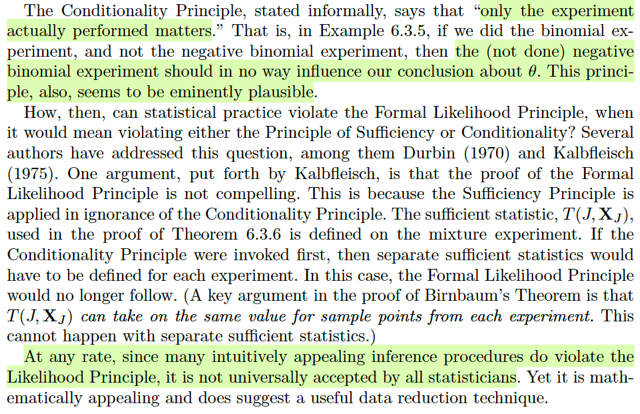</kbd></p>

> [!NOTE]
> QUAY LẠI SAU

<br>

