# 6.4 The Equivariance Principle

📊 **Progress:** `12` Notes | `17` Screenshots

---
<a id="node-539"></a>

<p align="center"><kbd>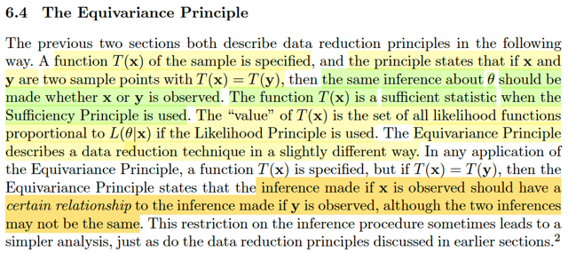</kbd></p>

> [!NOTE]
> Đầu tiên tác giả nhắc lại về **các nguyên lý nén data** ở những phần trước
> làm theo cách sau:
>
> Chỉ định một function T(**x**), và **các nguyên lý** sẽ cho biết hay quy định
> rằng sẽ kết luận gì khi có hai điểm dữ liệu (sample value) **x**, **y**mà
> T(**x**) `=` T(**y**): Đó là, với **Sufficient Principle** thì nó nói T(**X**) sẽ là**sufficient statistic**, để rồi thông tin giúp suy luận ra `θ` chứa trong T(**X**) là
> **ĐỦ**, không cần xài **X** nữa.
>
> Còn nếu **Likelihood Principle** được dùng, thì,.. Dừng lại đây ôn lại tí về cái
> này, nó nói rằng: Nếu như ta có hai thử nghiệm E1 `=` (**X1**, `θ,` f1(**x**)) và
> E2 `=` (**X2**, `θ,` f2(**x**)) và điểm dữ liệu tương ứng **x**, **y**mà likelihood
> của chúng tỉ lệ nhau, tức tồn tại quan hệ L(θ|**x**) `=` C(**x**,**y**) L(θ|**y**)
> với C là constant as a function of `θ,` thì khi đó kết luận về `θ` dựa trên thử
> nghiệm E1, và gía trị quan sát được **x CŨNG Y NHƯ**kết luận về `θ`  dựa
> trên thử nghiệm E2, và giá trị quan sát **y**, tức Ev(E1, **x**) `=` Ev(E2, **y**)
>
> Thế thì với likelihood principle, tác gỉa nói nói "giá trị" của T(x) là tập mọi
> likelihood function mà tỉ lệ với `L(θ|x)` Cũng hơi hiểu hiểu chỗ này, vì như vừa
> ôn lại FLP đó:
>
> Về cơ bản nó cho rằng **không quan trọng loại thử nghiệm cũng như giá trị
> quan sát được**, miễn là **likelihood của chúng tỉ lệ nhau thì kết luận về `θ` là
> như nhau**
>
> Còn ở đây, **Equivariance Principle** nói rằng: Nếu thấy T(x) `=` T(y) thì suy
> luận về `θ` từ **x** phải **CÓ QUAN HỆ NÀO ĐÓ** với suy luận về `θ` từ **y**

<br>

<a id="node-540"></a>

<p align="center"><kbd>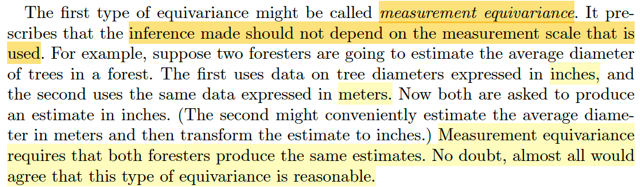</kbd></p>

> [!NOTE]
> Thế thì **loại đầu tiên của equivariance principle** là: Nó chỉ định rằng, việc
> suy luận (inference) **KHÔNG NÊN PHỤ THUỘC VÀO THANG ĐO**.
>
> Ví dụ như có **hai ông nghiên cứu khu rừng**, một ông **xài thước theo
> met**, ông kia**theo inch**. Và báo cáo, **estimate bề rộng thân cây khu
> rừng theo inch**. Thì nguyên lý này nói rằng, cái **kết quả thu được của hai
> ông phải giống nhau**.
>
> Và cái này, theo tác giả là dễ thấy rằng **rất hiển nhiên**, và **nó dễ dàng
> được chấp  nhận**

<br>

<a id="node-541"></a>

<p align="center"><kbd>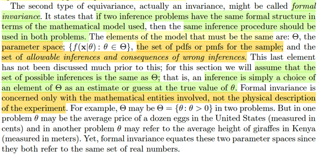</kbd></p>

> [!NOTE]
> Loại thứ hai của **equivariance principle**: Gọi là **FORMAL INVARIANCE**: Nó nói
> rằng đại khái là **nếu ta có hai bài toán suy luận có cùng cấu trúc toán học**
> (formal structure) hiểu **theo khía cạnh mô hình toán học giống nhau**, thì chúng 
> **phải được dùng cùng một quy trình suy luận**.
>
> Cụ thể là **các yếu tố cấu thành nên các mô hình toán học phải giống nhau**:
>
> **Parameter space** Θ
>
> **Tập các hàm pdf/pmf**
>
> Và các **cách thức suy luận được cho phép** và **các kết luận từ sự suy luận sai**
>
> Nói chung ta hiểu đại khái là, nguyên lý này nói rằng: Nếu như **hai bài toán 
> có cùng một cấu trúc toán học, thì việc suy luận phải cùng một quy trình.**

<br>

<a id="node-542"></a>

<p align="center"><kbd>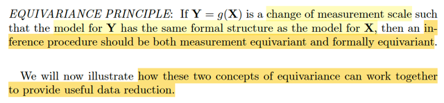</kbd></p>

> [!NOTE]
> Nguyên lý Equivariance: Nếu **Y**= g(**X**) là một phép thay đổi thang `/` thước đo
> sao cho mô hình cho **Y có cùng cấu trúc toán học với mô hình cho X
> thì khi đó quy trình suy luận sẽ có cả tính measurement equivariant
> và formally equivariant**

<br>

<a id="node-543"></a>

<p align="center"><kbd>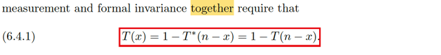</kbd></p>

<p align="center"><kbd></kbd></p>

<p align="center"><kbd>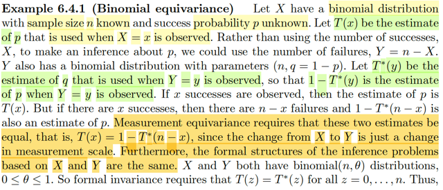</kbd></p>

> [!NOTE]
> Qua ví dụ này, gọi X ~ binomial distribution với sample size n đã biết và xác
> suất  thành công  p chưa biết.
>
> Tại sao X không viết hoa?
>
> Bình thường ta hay thấy nói về vector **X** `=` (X1,...Xn) là random variable
> vector, với X1,...Xn là các random variable trong một random sample size n
>
> Còn ở đây, đơn giản là X là random variable, ~ binomial(n, p), có story là ta
> sẽ thực hiện thử ngiệm là làm một chuỗi iid các Bern(p) trials. Và quan tâm
> số trial success.
>
> Thì ở đây sample size `=` 1, nên ghi X thôi cũng được.
>
> Rồi, thế thì cho T(x) là estimate của p khi quan sát thấy giá trị của X, `=` x. Và
> tác giả nói **thay vì dùng số lần thành công**, X, để suy luận về p, **ta có thể
> dùng số lần thất bại**, Y `=` n `-` X, khi đó Y cũng là binomial(n, q `=` 1 `-` p).
>
> `====`
>
> Dừng lại ở đây, chút: Tác giả nói vậy là sao? Vì sao Y `=` n `-` X sẽ ~ binomial
> (n, 1 `-` p). Là vì nhờ Stat110 ta đã biết, chỉ cần xét story của Y `=` n `-` X. Với
> bối cảnh đang có là n iid Bern(p) trial, và X là số trial thành công, thì n `-` X là
> số trial thất bại.
>
> Nhưng cũng có thể coi như ta có n Bern(q) trial với q `=` `1-p`  là xác suất
> thành  công, thì Y, số lần thất bại trong cách nhìn trước sẽ là số lần thành
> công trong  cách nhìn thứ hai. Do đó, Y là binomial(n, `1-p).`
>
> `====`
>
> Rồi, thế thì cái tác giả muốn nhấn mạnh ở đây là Giả sử như ta quan sát
> thấy  giá trị của X, là bằng x. Và ta dùng T(x) làm suy luận cho success rate
> p (nói theo cách khác là "T(X) estimate p")
>
> Rồi, sau đó ta quan sát thấy giá trị của Y `=` y, và dùng T*(y) làm suy luận cho
> failure rate q `=` 1 `-` p. 
>
> Tức T*(Y) estimate 1 `-` p
>
> Thì đương nhiên 1 `-` T*(y) phải là suy luận cho p: 
>
> 1 `-` T*(P) estimate p
>
> Vì nếu điều này không đúng sẽ dẫn đến mâu thuẫn: T*(Y) estimate 1 `-` p, 1 `-` T*(p)
> lại không được estimate p thì cộng vế theo vế ta có T*(Y) `+` 1 `-` T*(p) `=` 1 lại không
> được estimate cho 1 `-` p `+` p `=` 1, là sai.
>
> Và vì điều luận ràng buộc trên, nên tác giả nói:
>
> À nếu như quan sát thấy X `=` x, thì cũng chính là quan sát thấy Y `=` n `-` x
>
> Và ở điểm đầu tiên cho ta các suy luận thứ nhất cho p: T(x) estimate p
>
> ```text
> Và ở ý sau cho ta cách suy luận thứ hai cho p: 1 - T*(y) = 1 - T*(n - x) estimate p
> ```
>
> Và ĐƯƠNG NHIÊN HAI CÁCH SUY LUẬN NÀY PHẢI NHƯ NHAU:
>
> Vậy T(x) `=` 1 `-` T*(n `-` x)
>
> Cái sự đương nhiên này chính là vì đổi từ X sang Y, tức nói quan hệ của X
> và Y: X `=` n `-` Y CHỈ LÀ THAY ĐỔI THỨƠC ĐO `/` CÁCH THỨC ĐO (a change
> in measurement). VÀ **MEASUREMENT EQUIVARIANCE** như vừa học,
> quy  định rằng các suy luận phải như nhau. Đó chính là cái phương trình
> hàm  thức nhất: T(x) `=` 1 `-` T*(n `-` x) mà mình thấy ở trên.
>
> `====`
>
> **CÒN CÁI EQUIVARIANCE PRINCIPLE THỨ HAI**?
>
> **INVARIANCE PRINCIPLE** thì sao? Ôn lại, nó nói đại khái vầy: Nếu như hai 
> thử nhiệm có cấu trúc toán học giống nhau (formal structure), thì quy trình 
> suy  luận (inference procedure) phải giống nhau. Mà cấu trúc toán học có 
> nghĩa là mô hình toán học, bao  gồm các cấu phần: param space Θ giống 
> nhau, tập hợp các hàm `pdf/pmf`  khả dĩ `{f(x|θ),` `θ` ∈ Θ}, cũng gọi là modal 
> hay family  of distribution.
>
> Như vậy ở đây: Vì hai bài toán suy luận đều có cấu trúc toán học giống
> nhau: X, Y đều dùng `/` thuộc mô hình là family of binomial(n, `θ)` distribution
> với `θ` ∈ [0,1].
>
> Do đó, invariance principle **BẮT BUỘC QUY TRÌNH SUY LUẬN
> (INFERENCES PROCEDURE)** phải giống nhau:
> ..

> [!NOTE]
> Do đó, từ hai loại khác nhau của equivariance principle ta phải có:
>
> T(x) `=` 1 `-` T*(n `-` x)
>
> T*(n `-` x) `=` T(n `-` x) 
>
> ⇨ T(x) `=` 1 `-` T(n `-` x)
>
> Và ta kết luận, trong bài toán này:
>
> T(x) estimate p 
>
> ⇔ 1 `-` T(n `-` x) estimate p 
>
> ⇔ T(n `-` x) estimate 1 `-` p (1)
>
> ```text
> và T(x) = 1 - T(n - x) ⇨ T(n - x) = 1 - T(x) nên ta có ở trên
> ```
>
> ⇔ 1 `-` T(x) estimate 1 `-` p (2)
>
> Vậy ta có ở đây: 
>
> T(x) estimate p ⇨ 1 `-` T(x) estimate 1 `-` p (2)
>
> T(x) estimate p ⇨ T(n `-` x) estimate 1 `-` p (1)
>
> ```text
> Và đây chính là: Với gbar(u) = 1 - u, và g(u) = n - u
> ```
>
> **T(x) estimate p ⇨ gbar(Tx)) estimate gbar(p)**
>
> **T(x) estimate p ⇨ T(g(x)) estimate gbar(p)**
>
> Và đây là**KHÁI QUÁT CỦA MEASUREMENT EQUIVARIANCE VÀ FORMAL 
> EQUIVARIANCE mà mình sẽ gặp lại trong 7.3.5**
>
> W(**x**) estimate `θ` ⇨ gbar(W(**x**)) estimate `gbar(θ)` `(=` `θ')`
>
> W(**x**) estimate `θ` ⇨ W(g(x)) estimate `gbar(θ)` `(=` `θ')`

<br>

<a id="node-544"></a>

<p align="center"><kbd>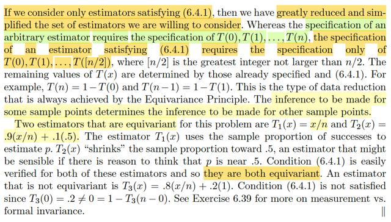</kbd></p>

> [!NOTE]
> Rồi, **lợi ích của nguyên lí** này nói rằng nó **giúp ta giảm đi số estimator phải
> tính**
>
> Đầu tiên ta hiểu thế này, T(x) là gì? ⇨ Nó là một function. Việc tìm một
> statistic CÓ BẢN CHẤT CHỈ LÀ ĐI TÌM MỘT HÀM SỐ, để mà apply lên các
> random variable trong random sample (nhớ không, định nghĩa của statistic
> về bản chất chỉ là random variable (vector) có được khi apply một function
> lên các random variable của một random sample). Mà để định ra một hàm
> số, thì ta phải định ra các giá trị của nó: Ví dụ với các possible value x của X
> thì T(x) bằng bao nhiêu.
>
> Nên ví dụ như với một T(x) tùy tiện (arbitrary) nào đó thì với các possible
> value của x (mà x là giá trị cụ thể của X, ~ binomial(n, p) có các giá trị từ 0,1,
> ..n. Thì ta phải xác định T(0) là gì T(1) là mấy,....T(n) là bao nhiêu.
>
> Nhưng với kết luận có được từ equivariance principle: T(x) `=` 1 `-` T(n `-` x) thì
> ta sẽ chỉ cần phải xác định T(0), T(1), `...T([n/2])` mà thôi. Với `[n/2]` là số
> nguyên lớn nhất không lớn hơn `n/2.`
>
> Cũng dễ hiểu, vì mấy cái còn lại thì chỉ việc suy ra từ cái function equation
> trên.
>
> `====`
>
> Và cuối cùng, là chiếu theo đó thì trong bài toán này có hai estimator phù
> ```text
> hợp với equivariant principle: T1(x) = x/n. Và T2(x) = 0.9(x/n) + .1(.5)
> ```
>
> Kiểm tra thử sẽ thấy nó thỏa, ko khó lắm

<br>

<a id="node-545"></a>

<p align="center"><kbd>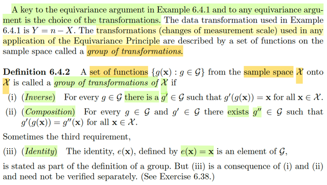</kbd></p>

> [!NOTE]
> Thế thì như equivariance principle ở loại thứ nhất `-` measurement principle
> nói đến phép transformation thuộc cái loại là "change of measurement" Ý
> là, phải là transformation thuộc loại này thì mới được áp dụng equivariance 
> principle. Vậy thì ở đây ta có định nghĩa của một tập các phép biến đổi có 
> tính chất như vậy: Gọi là **a group of transformation**.
>
> Theo định nghĩa, **xét tập hợp các function g(x) G được gọi là group
> of transformation** of `X_curl` **nếu thỏa 3 tính chất**:
>
> 1) Inverse: Với mọi **g**∈**G** thì**tồn tại g'**∈**G** sao cho **g'(g(x)) `=` x**, x ∈ sample
> space `X_curl`  (induced sample space của random variable X).
>
> 2) Composition: Với mọi g, g' ∈ `G_curl` thì tồn tại g'' khiến việc map từ x
> thông qua g và sau đó là g' để có g'(g(x)) cũng sẽ bằng với map x bởi g'':
>
> g'(g(x)) `=` g''(x)
>
> Cuối cùng là identity: e(x) `=` x cũng chứa trong `G_curl.`

<br>

<a id="node-546"></a>

<p align="center"><kbd>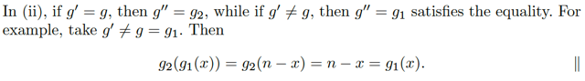</kbd></p>

<p align="center"><kbd></kbd></p>

<p align="center"><kbd>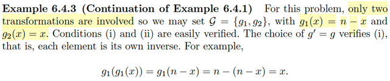</kbd></p>

> [!NOTE]
> Quay lại ví dụ 6.4.1 Tác giả nói chỉ có hai transformation liên quan: Một cái là
> g(x) `=` n `-` x cái kia là identity g(x) `=` x 
>
> ```text
> Nên ta có set 𝐺 = {g1, g2} với g1(x) = n - x, g2(x) = x.
> ```
>
> Thử xác nhận xem có đúng 𝐺 là group of transformation không:
>
> 1) Nếu chọn g `=` g1 thì có tồn tại g' khiến g'(g(x)) `=` x không?
>
> ```text
> Rõ ràng là có. g1(g1(x)) = n - (n - x) = x. Tức là g' chính là g1. Và
> ```
>
> ```text
> nếu g = g2, thì chọn g' là g2 luôn thì ta cũng có: g'(g(x)) = g2(g2(x)) = g2(x) = x
> ```
>
> 2) Nếu g `=` g1, g' `=` g1 thì có tồn tại g'' để g'(g(x)) `=` g''(x) không?
>
> ```text
> g'(g(x)) = g1(g1(x)) = n - (n - x) = x, và đó cũng là g2(x). Tức là chỉ việc chọn
> ```
> g''(x) `=` g2(x) là xong.
>
> ```text
> còn g = g1, g' = g2. thì g'(g(x)) = g2(g1(x)) = g2(n - x) = n - x = g1(x)
> ```
> Nên chỉ cần chọn g'' là g1 là xong.
>
> Nói chung khúc này không có gì khó hiểu, ta verify được 𝐺 `=` {g1, g2} là một
> group of transformation

<br>

<a id="node-547"></a>

<p align="center"><kbd>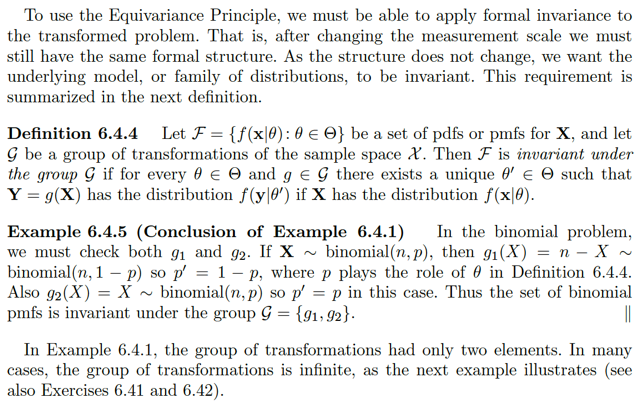</kbd></p>

> [!NOTE]
> Đại khái là, để dùng Equivariance Principle thì ta cần phải có thể có tính chất
> formal invariance (bất biến về mặt hình thức) to the transported problem.
>
> Đó là, sau khi thay đổi thang đo, ta phải có cùng một formal structure (cấu trúc
> toán học)
>
> Và vì cấu trúc toán học không đổi nên ta muốn mô hình bên dưới, tức family
> các distribution phải có tính chất invariant (bất biến)
>
> Theo định nghĩa, họ F (family các distribution) `=` `{f(x|θ):` `θ` ∈ Θ} của **X,**và
> gọi  G là group of transformation của sample space `X_curl:` Thì F được gọi là "
> bất biến dưới group G_curl"****nếu như với mọi `θ` ∈ Θ và g ∈ `G_curl` thì tồn tại
> `θ'` ∈ Θ sao cho **Y** `=` g(**X**) có distribution f(**y**|θ') nếu **X**có distribution
> f(**x**|θ)
>
> Quay lại ví dụ 6.4.1 ta có G chứa hai thành viên là g1, g2. T sẽ check thử g1,
> g2 có tính bất biến trong group G hay không.
>
> Nếu X ~ binomial(n, p) thì g1(X) `=` n `-` X sẽ ~ binomial(n, 1 `-` p)
>
> Nên thỏa với g1: Vì như định nghĩa đã nói, nếu X ~ `f(x|θ)` thì phải có `θ'` nào đó
> ```text
> y = g(X) phải ∈ f(y|θ'), thì θ ở đây là p thì θ' quả thực tồn tại, là 1 - p. Để Y =
> ```
> g1(X) `=` n `-` X ~ binomial(n, 1 `-` p)
>
> Check với g2: Nếu X ~ `f(x|θ)` thì Y `=` g2(X) `=` X cũng ~ binomial(n, p) Tức là
> ```text
> trong case này θ = θ' = p. Vẫn đúng.
> ```
>
> Vậy cả hai cái g1, g2 đều thỏa yêu cầu nên tập các binomial pmf có tính
> invariant under `G_curl` `=` {g1, g2}

<br>

<a id="node-548"></a>

<p align="center"><kbd>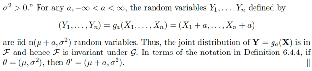</kbd></p>

<p align="center"><kbd></kbd></p>

<p align="center"><kbd>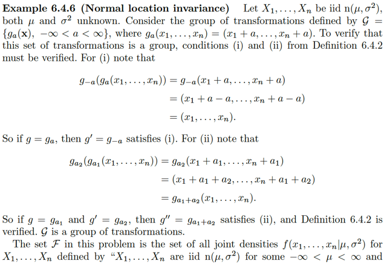</kbd></p>

> [!NOTE]
> QUAY LẠI SAU

<br>

<a id="node-549"></a>

<p align="center"><kbd>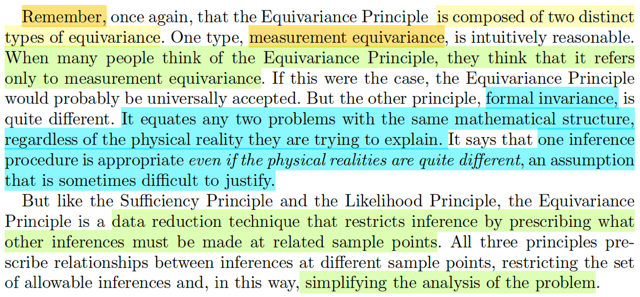</kbd></p>

> [!NOTE]
> Tác nhấn mạnh rằng, đừng quên Equivariance Principle bao gồm hai loại
> equivariance. Với loại đầu, measure equivariance về cơ bản là khá dễ 
> hiểu. Nên thường được chấp nhận dễ dàng.
>
> Nhưng loại thứ hai: formal invariance, nói rằng chỉ cần các vấn đề có chung
> cấu trúc toán học, thì phải có chung quy trình suy luận, bất kể cụ thể hai
> bài toán đang cố gắng mô tả thực thể vật lý khác nhau là gì.
>
> Và cái nguyên lí này thì đôi khi là khó chấp nhận hơn
>
> Nhưng cũng như hai nguyên lý trước: Likelihood principle và Sufficient 
> Principle thì chúng sẽ để là những kĩ thuật data reduction trong đó nó 
> thực hiện các ràng buộc với quá trình suy luận từ đó giúp đơn giản hóa 
> bài toán phân tích

<br>

