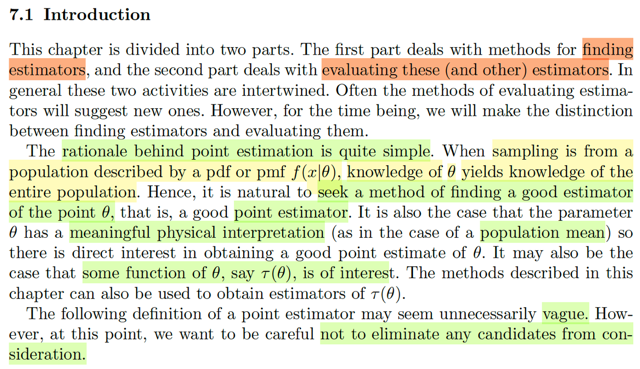
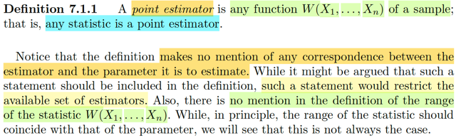
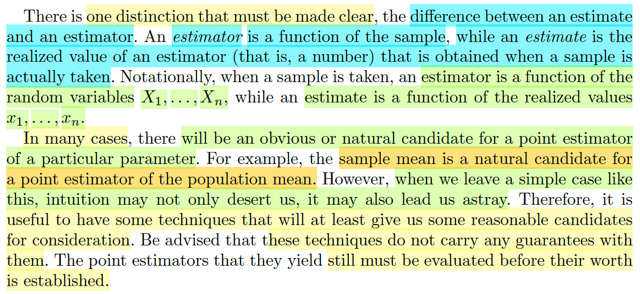

# 7.1 Introduction

📊 **Progress:** `3` Notes | `3` Screenshots

---

<kbd></kbd>

> [!NOTE]
> Đại ý là, chương này sẽ chia làm hai phần: Bàn về các phương pháp 
> tìm estimator và các cách đánh giá estimator.
>
> Cái lí do của quá trình / công việc point estimator rất đơn giản. Đó là
> khi sampling từ một population có distribution được mô tả bởi pmf hoặc
> pdf f(x|θ), thì kiến thức về θ sẽ cho ta biết về về cả quần thể.
>
> Do đó, lẽ tự nhiên ta sẽ muốn tìm kiếm một phương pháp giúp tìm kiếm
> good estimator của điểm θ, gọi là good point estimator.
>
> Có nghĩa là ta sẽ tìm kiếm một ước lượng cho giá trị của θ.
>
> Và một số trường hợp thì θ mang một ý nghĩa có thể diễn dịch được, như
> population mean là một ví dụ.
>
> Nhưng một số trường hợp khác, ta sẽ đi tìm kiếm, một function nào đó của θ 
>
> Thế thì tiếp theo ta sẽ học về định nghĩa chính thức của point estimator,
> và tác giả nói rằng có thể ta sẽ thấy nó rất mơ hồ (vague) nhưng đây là điều
> cần thiết nhằm mục đích là đảm bảo ta không bỏ xót ứng cử viên nào hết

 

<kbd></kbd>

> [!NOTE]
> Định nghiã của point estimator: ĐÓ LÀ BẤT KÌ FUNCTION W(X1,...Xn) của
> sample. Có nghĩa là, đơn giản rằng, BẤT KÌ STATISTIC NÀO CŨNG LÀ
> MỘT POINT ESTIMATOR.
>
> Ôn lại một chút, ta biết statistic là gì? Nó là function của các random
> variable X1,...Xn của một random sample. Và function của các random
> variables thì cũng là random variable, chẳng qua cái random variable này
> đặc biệt hơn là vì nó được tao bởi random variable trong một random
> sample. Và người ta gọi nó là statistic.
>
> Và ở đây, định nghĩa của point estimator là một function của các random
> variables X1,...Xn của random sample. Cho nên về cơ bản nó chính là
> statistic, chỉ vậy thôi.
>
> Tác giả nói thêm rằng, ta thấy chẳng có một đề cập nào về mối tương nào 
> giữa estimator và cái paramter mà nó đang estimate cả. Nhưng ông cho
> rằng điều này là cần thiết, vì khi đề cập vào thì nó sẽ làm hạn chế / giảm số 
> lượng những estimator khả thi

 

<kbd></kbd>

> [!NOTE]
> Một điểm nữa mà tác giả nhấn mạnh ta phải lưu ý: Là phải phân biệt  giữa
> estimator và estimate.
>
> Estimator như đã nói, là statistic, là function, của random sample.
>
> Còn estimate, là giá trị cụ thể của estimator khi bỏ vào giá trị cụ thể của 
> các random variable trong random sample. 
>
> Cái này thì hoàn toàn không có gì khó hiểu cả. vì Estimator / statistic có
> bản chất là random variable, mà random variable có bản chất là hàm số.
>
> Để rồi khi nó nhận vào các giá trị cụ thể của đầu vào thì nó mới có giá trị
> cụ thể.
>
> ====
>
> Cuối cùng, là tác giả cho rằng trong một số tình huống thì ta sẽ thấy rất rõ
> đâu là ứng cử viên - estimator cho population parameter là gì. Ví dụ như
> với population mean thì sample mean rõ ràng là một point estimator 
>
> Khoan, dừng lại một giây, nói nó rõ ràng là một ứng cử viên không có nghĩa
> nó là good estimator ngay lập tức, ta sẽ vẫn phải đánh giá nó.
>
> Bên cạnh đó, có thể hiểu ý của tác giả nói rằng khi bước ra các case khác
> thì cái kiểu định nghĩa quá rộng như vừa rồi (là function của random sample)
> hoàn toàn khiến ta không biết tìm estimator như thế nào.
>
> Do đó, ta sẽ có những technique để mà dẫn dắt ta tới các ứng cử viên cho
> good estimator.
>
> Tuy nhiênt tác giả cũng nhấn mạnh, các technique này không đảm bảo là
> ta sẽ tự nhiên có good estimator, mà vẫn phải có các phương pháp đánh giá

 

