# 7.2 Method Of Finding Estimators

📊 **Progress:** `49` Notes | `62` Screenshots

---

<kbd>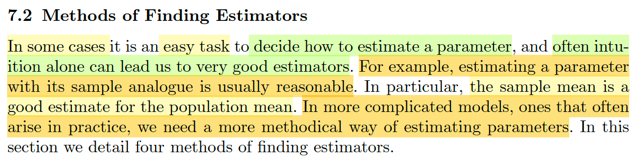</kbd>

> [!NOTE]
> Rồi, ta sẽ đi tìm hiểu các phương pháp giúp tìm ra estimator.
>
> Đầu tiên, như đã nói ở phần giới thiệu, có đôi khi rất rõ ràng nhận thấy đâu là
> một estimator. Ví dụ một tham số của một sample (ví dụ sample mean)  sẽ tự
> nhiên là một ứng cử viên tốt để làm estimator của population mean.
>
> (Sample mean, Xbar, mà ta còn nhớ, tác giả nói có thể ghi nó là Xbar(X1,...
> Xn) để thể hiện bản chất nó là FUNCTION của các random variables trong
> sample)
>
> Nhưng trong những trường hợp khác phức tạp hơn, ta sẽ cần một phương
> pháp tiếp cận để tìm ra các estimator

 

<kbd>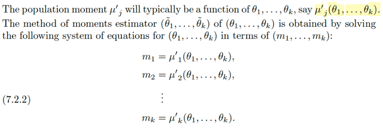</kbd>

<kbd></kbd>

<kbd>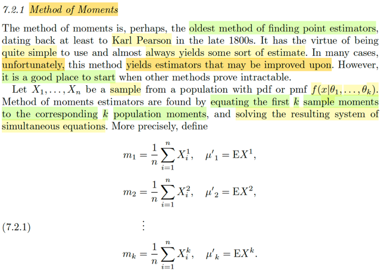</kbd>

> [!NOTE]
> Đầu tiên là METHOD OF MOMENTS, tác giả cho biết, đây là một phương
> pháp phải nói là rất xưa. Tương đối đơn giản, và có thể cho ra kết quả tương
> đối tốt.
>
> Tuy nhiên điều không may là đôi khi nó cho ra các estimator (chưa đủ tốt,
> hoặc là chưa phải là tốt nhất  / có thể cải thiện hơn nữa - may be improved
> upon")
>
> Nhưng dù vậy thì nó vẫn là một cách khởi đầu tốt.
>
> Thế thì cụ thể là, với random sample X1,...Xn là một random sample từ
> population có pdf/pmf f(x|θ1,...θk)
>
> Estimator từ phương pháp moment được xây dựng như sau:
>
> Cho 1st sample moment = 1st population moment.
>
> Cho 2nd sample moment = 2nd population moment.
>
> ....
>
> Cho k'th sample moment = k'th population moment.
>
> ====
>
> Thế thì có lẽ nên nhớ lại một chút về mgf - moment generating function:
>
> Mình nhớ đại khái là, nếu ta khai triển Taylor MX(t) ta sẽ có:
>
> MX(t) = Σn=0,1,2.. [đạo hàm cấp n]|t=0 * t^n / n!
>
> Và đại khái là cái hệ số thứ n chính là n'th moment của X, tức là:
>
> (First moment) EX = [đạo hàm cấp 0 của MX(t)]|t=0 
>
> (Second moment) EX^2 = [đạo hàm cấp 1 của MX(t)]|t=0 
>
> ...
>
> (k'th moment) EX^k = [đạo hàm cấp k của MX(t)]|t=0
>
> Cái này cũng chỉ xuất phát từ định nghĩa của MX(t) = E[e^tX]
>
> Taylor expand e^tx tại t = 0:
>
> e^tx = Σk [Đạo hàm bậc k của e^tx]t=0 t^k / k!
>
> [Đạo hàm bậc 1 của e^tx]t=0 = xe^tx|t=0 = xe^0 = x
>
> [Đạo hàm bậc 2 của e^tx]t=0 = x^2e^tx|t=0 = x^2 e^0 = x^2
>
> ...
>
> [Đạo hàm bậc k của e^tx]t=0 = x^ke^tx|t=0 = x^k
>
> e^tx = Σk x^k t^k / k!
>
> ⇨ e^tX = Σk X^k t^k / k!
>
> ⇔ E[e^tX] = E[Σk X^k t^k / k!]
>
> ⇔ E[e^tX] = Σk E[X^k] t^k / k!
>
> Và do đó [Đạo hàm bậc k của e^tx]t=0 chính là E[X^k]
>
> Rồi, đó là nói về mgf, mà trong stat110 đã học, là một cách giúp dùng mgf để
> tìm các moment của X, vì việc tính moment của X, ví dụ như EX^k, là một 
> bài toán tích phân, mà bài toán tích phân thì thường là dễ hơn bài toán
> đạo hàm (derivative)
>
> Quay lại đây, có thể ta sẽ thấy hơi lạ vì đây là lần đầu nghe nói về SAMPLE
> MOMENT.
>
> Nhưng thực ra nó không có gì khó cả:
>
> Hãy bắt đầu với Moment, theo định nghĩa, k'th moment là E[X^k], mà cái này
> thì về cơ bản theo ý nghĩa của kì vọng, chỉ là tính giá trị trung bình.
>
> Nên EX^k, là tính trung bình giá trị của Y = X^k với mọi possible values của Y.
>
> Và dùng lotus cho phép ta dùng luôn pdf/pmf của X luôn.
>
> EX^k  = Σ_mọi possible value của x : X^k fX(x) (với discrete case)
>
> Vậy thì từ đó qua sample moment. cũng chỉ là trung bình thôi.
>
> ⇨ k'th sample moment là = Σ_i=1:n Xi^k / n
>
> Còn population moment, thì như đã nói là EX^k, thì nó sẽ là function của
> **θ tức là vector các param**, (θ1, ...θk)
>
> m1 = μ'1 (θ1, ...θk)
>
> m2 = μ'2 (θ1, ...θk)
>
> ...
>
> Qua ví dụ ta sẽ rõ hơn

 

<kbd>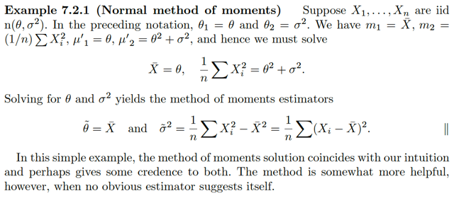</kbd>

> [!NOTE]
> Ví dụ này, X1,...Xn là iid n(θ, σ^2). Theo cách kí hiệu vừa rồi, ta có vector **θ**, tức vector parameter sẽ là (θ1, θ2) = (θ, σ^2)
>
> Rồi, m1 tức 1st sample moment là (Σi Xi)/n = Xbar
>
> m2 tức 2nd sample moment là (Σi Xi^2)/n 
>
> μ1, tức 1st population moment EX, và như đã biết với n(μ, σ^2) thì EX = μ 
> ⇨ ở đây EX = θ, tức μ1 = θ
>
> μ2, tức 2nd population moment EX^2:
>
> Thế thì VarX theo công thức thứ hai ta đã biết = EX^2 - (EX)^2 
>
> Vậy ở đây ta có σ^2 = EX^2 - (EX)^2 = EX^2 - θ^2 
>
> ⇨ EX^2 = σ^2 + θ^2
>
> Vậy thì theo phương pháp moment ta sẽ giải hệ:
>
> m1 = μ'1 ⇔ Xbar = θ 
>
> m2 = μ'2 ⇔ Σi Xi^2)/n = σ^2 + θ^2
>
> Từ đó ta sẽ có estimator cho θ và σ^2:
>
> Kí hiệu là θ~, và σ~^2:
>
> θ~ = Xbar
>
> (Σi Xi^2)/n = σ~^2 + θ^2 
>
> ⇔ (Σi Xi^2)/n - θ^2 = σ~^2 
>
> ⇔ (1/n) Σi [Xi^2 - θ^2] = σ~^2 
>
> ⇔ σ~^2 = (1/n) Σi [Xi^2 - θ^2] 
>
> Và đó chính là estimator cho θ và σ^2: 
>
> θ~ = Xbar  
>
> σ~^ = (1/n) Σi [Xi^2 - θ^2]

 

<kbd>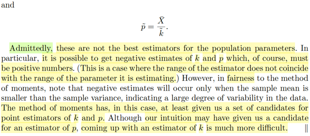</kbd>

<kbd></kbd>

<kbd>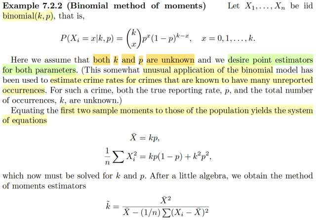</kbd>

> [!NOTE]
> Qua ví dụ này, X1,...Xn là iid binomial(k,p), như đã biết 
> P(Xi = x|k,p) = (k choose x) p^x (1-p)^(k-x).
>
> Thì ở đây cả k và p đều unknown. mà tác giả cho biết sẽ dùng để mô hình
> hóa nhằm estimate tỉ lệ tội phạm trong đó ta biết có nhiều case không được
> report, với loại tội phạm này thì cả tỉ lệ xảy ra (p) và số lần xuất hiện (k) đều 
> không biết.
>
> Thế thì áp dụng phương pháp moment, như đã học, đó là ta sẽ equate k các
> sample moment đầu tiên với các population moment.
>
> Ôn lại tí, về expected value của binomial: EX, cũng là 1st moment:
>
> Dựa vào story của X ~ binomial(k, p) là số Bern(p) trial thành công trong chuỗi
> k iid trials, hoặc theo story khác, là tổng các indicator random variables I_Aj
> có giá trị bằng 1 khi Bern trial thứ j xảy ra và bằng 0 khi ngược lại. Và mỗi I_Aj
> là một Bern(p) random variables
>
> Với story sau, giúp ta dễ dàng tính được EX:
>
> EX = E(Σj I_Aj) = Σj E(I_Aj) = Σj [p*1 + (1-p)*0] = Σj p = kp
>
> Còn EX^2: Thì để tính cái này có thể dùng lotus, nhưng tạm thời cho nhanh ở đây
> cứ dùng công thức VarX là npq: VarX = EX^2 - (EX)^2 ⇔ npq = EX^2 - (kp)^2
> ⇔ EX^2 = kpq - k^2p^2 
>
> Còn sample moment:
>
> 1st sample moment: (1/n) ΣXi, chính là Xbar
>
> 2nd sample moment: (1/n) ΣXi^2
>
> Thiết lập equations: m1 = μ'1, m2 = μ'2:
>
> m1 = Xbar = np
>
> m2 = (Σ Xi^2) / n = kpq - k^2p^2 
>
> Và giải ra ta có k~, tức estimator cho k, = Xbar^2 / (Xbar - (1/n) Σ (Xi - Xbar)^2
>
> Và p~ (estimator cho p) = Xbar / k~
>
> =====
>
> Cuối cùng, đại ý là, thành mà nói thì các estimator này không phải là best estimator
> vì với estimators này thì gía trị estimate của k và p có thể ra âm. 
>
> Tuy nhiên nó vẫn là phương pháp cho ta một số candidate. 
>
> Giáo sư nói thêm rằng dù là trực giác cho phép mình dự đoán estimator cho p
> nhưng với k thì khó hơn và method method cho ta tìm ra candidate cho nó

 

<kbd>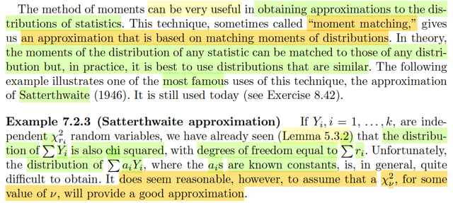</kbd>

🔗 **Related:** [5.3 SAMPLING FROM THE NORMAL DISTRIBUTION](53_sampling_from_the_normal_distribution.md#node-360)

> [!NOTE]
> Tiếp theo gs dạy ta rằng phương pháp này có thể rất hữu ích trong việc 
> có được một ước lượng cho distribution của các statistic. Là sao, tức là
> như ta đã biết statistic, đơn giản cũng là random variable, có được bằng
> cách apply function lên các random variables của random sample. Và 
> dĩ nhiên nó có distribution, và ta còn nhớ, người ta gọi nó là sampling
> distribution. Vậy thì ý này gs nói method này có thể giúp approximate
> được distribution của các statistic.
>
> Ông nói thêm technique này thỉnh thoảng được gọi là "moment matching",
> hoạt động bằng cách dựa trên việc khớp các moments của distribution
> (matching, hiểu nôm na là cho moment bằng nhau, ví dụ như ta cho sample 
> moment = population moment) khi dùng method này để tìm các estimator đó)
>
> Và tuy rằng theo lí thuyết thì ta có thể moment của distribution của statistic
> với moment của distribution bất kì. nhưng trong thực tế dĩ nhiên cách làm tốt
> nhất là match moment của statistic với moment của các distribution giống
> giống
>
> Vậy thì ví dụ này cho Y1,...Yk độc lập và ~ X^2_ri tức là chúng là các 
> Chi-square  bậc tự do  lần lượt là r1, r2...
>
> Thì nhờ bổ đề 5.3.2 ta đã biết rằng tổng Σi Yi (đây là một statistic, là random
> variable có được khi apply hàm g(y1,...yk) = y1 + ..yk vào đám Y1,...Yk) sẽ 
> có sampling distribution là Chi-square luôn, với bậc tự do là Σ ri.
>
> Có điều, giả sử ta muốn tìm distribution của Σi aiYi thì khó hơn. Và tác giả
> cho rằng một cách hợp lí khi ta cho rằng nó (tức distribution của Σi aiYi) 
> cũng là  / có thể approx bởi  một Chi-square với bậc tự do v nào đó cần tìm
> (vì ta biết Σi Yi tức là Σi aiYi với ai = 1, là Chi-square, thì ta đoán Σi aiYi cũng
> sẽ là Chi-square)

 

<kbd>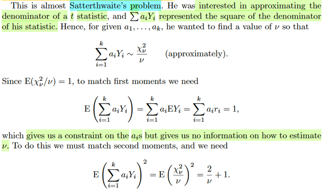</kbd>

> [!NOTE]
> Để tao ráng hiểu những điểm trong câu trả lời của mày nhé:
>
> Vì sao chia ν thì X^2_ν / ν lại có kì vọng loanh quanh số 1?
>
> ⇨ Kì vọng của Chi-square(n), tức chi-square n bậc tự do là ν:
>
> Ta nhớ story của Chi-square n là tổng của n bình phương normal(0,1), nên  kì
> vọng của nó sẽ là:
>
> E[Chi-square(n)]  = E[Z1^2 + ...+Zn^2] = EZ1^2 + ..EZn^2
>
> = 1 + 1...+ 1 = n ⇨ E[Xν^2] = v
>
> Còn: E[(Xv^2/v)^2] ?
>
> Thì để ý, đây là E của [Chi-square(v)]^2 / v^2,
>
> đưa 1/v^2 ra ta có (1/v^2) E [Chi-square(v)]^2
>
> Đến đây, thật ra ta chỉ đang muốn tính EX^2 với X là mộtv Chi-Square(v) mà
> thôi.
>
> Dùng công thức Var(X) = EX^2 - (EX)^2.
>
> ⇨ EX^2 = Var(X) + (EX)^2 (1)
>
> EX, với X là Chi-square(v) (*mà ở trên mình kí hiệu là X^2_v) ta đã biết, kì vọng
> của nó là v: EX = v
>
> Còn VarX? Thử chứng minh / derive lại công thức của Variance của
> Chi-square(n):
>
> ====
>
> Nhắc lại story của Chi-square(n), nó là tổng của n iid Zi^2 với Zi ~ normal(0,1)
>
> ⇨ Var(X) = Var(Z1^2 + ...Zn^2)
>
> Áp dụng công thức: Var(X + Y) = VarX + VarY + 2Cov(X,Y) và mở rộng ra ta sẽ
> có:
>
> Var(X1 + ..Xn) = VarX1 + ..VarXn + 2Cov(X1,X2) + ...(covariance của các cặp)
>
> với X1,...Xn độc lập thì các cov(Xi, Xj) = 0
>
> ⇨ Var(X1 + ...Xn) = VarX1 + ...VarXn
>
> Nên ở đây, Var(X) = Var(Z1^2) + ..Var(Zn^2)
>
> Và với Z ~ normal(0,1) thì Var(Z^2) = 2 (QUAY LẠI CHỨNG MINH SAU)
>
> ⇨ Var(X) = 2n, variance của Chi-square(n) là 2n
>
> ====
>
> Quay lại đây, Var(X) với X là Chi-square(v), = 2v
>
> ⇨ Var(X) = 2v
>
> Lắp EX = v, Var(X) = 2v vào (1):
>
> EX^2 = Var(X) + (EX)^2 (1) = 2v + v^2
>
> Nên E[(Xv^2/v)^2] = E của [Chi-square(v)]^2 / v^2 = (2v + v^2) / v^2 = **2/v + 1**

> [!NOTE]
> Và với Z ~ normal(0,1) thì Var(Z^2) = 2 (QUAY LẠI CHỨNG MINH SAU)

> [!NOTE]
> Rồi, thế thì tác giả cho biết rằng, cái bài toán này (ước lượng distribution của 
> Σi aiYi với Yi là Chi-Square(ri)) RẤT GIỐNG với vấn đề mà ông Satterthwaite
> muốn giải quyết. 
>
> Đại khái là ổng muốn ước lượng distribution của cái mẫu số của một t statistic.
>
> Chỗ này phải nhớ lại một chút về t statistic (mà tên gọi statistic đã đề xuất nó
> là apply một function lên các random variable trong random sample rồi)
>
> Và cụ thể thì t statistic = (Xbar - μ) / (S/√n)
>
> Và đại khái là distribution của t statistic nếu thỏa một số điều kiện thì chính là
> distribution U/√(V/p) với U là n(0,1), V là chi-square(p) bậc tự do. Và U, V độc 
> lập. Đây gọi là student-t distribution.
>
> Nói chung là ta chỉ cần tập trung vào bài toán đang muốn giải là: Tìm distribution
> của Σi aiYi
>
> Thế thì, nếu dùng method of moment để tìm estimator thì ta sẽ theo lý thuyết, 
> cách làm là cho sample moment = population moment. Còn nay để dùng mom
> để tìm distribution của statistic thì ta sẽ khớp moment của của statistic với target
> moment của target distribution.
>
> Thế thì, người ta chọn Chi-square(v) / v làm mục tiêu với lập luận là, vì 
> Σi Yi ~ Chi-square(Σri) thì có lẽ Σi aiYi cũng ~ Chi-square với bậc tự do v nào đó.
>
> Rồi, với Chi-square (p), có story là tổng của p bình phương của normal(0,1),
> ta có thể dễ thấy E[Chi-square(p)] = p.
>
> Và vì một lí do nào đó chưa hiểu lắm, ta sẽ chọn một distribution là distribution
> của Chi-square(p) / p. (giống như chọn distribution của Y = X / p với X là một
> Chi-square(p)). Mình hiểu lúc này EY sẽ = 1, (nhưng chưa hiểu vì sao phải 
> làm vậy)
>
> Vậy thì: Với distribution mục tiêu này nên nhớ bài toán đang làm là DÙNG 
> METHOD OF MOMENT ĐỂ MÀ TÌM CÁCH ƯỚC LƯỢNG DISTRIBUTION 
> CỦA STATISTIC Σi aiYi, và ta sẽ kiểu như DÙNG MỘT DISTRIBUTION DỰ 
> ĐOÁN (DISTRIBUTION CỦA Y) VÀ KHỚP MOMENT CỦA NÓ VỚI MOMENT
> CỦA STATISTIC
>
> Nên đầu tiên là kể ra các moment của Y (tức Chi-square(v) / v):
>
> First moment của target distribution, như đã biết, là kì vọng, 
>
> EY: EY = EX / v, và bằng 1 như trên đã nói.
>
> First moment của statistic: Thì First moment của statistic Σi aiYi là gì?
>
> Thì đơn giản là E[Σi aiYi]:
>
> Matching: E[Σi aiYi] = 1 
>
> ⇔ Σi ai EYi = 1
>
> Tại đây, ta có đề bài cho Yi ~ Chi-square(ri) ⇨ EYi = ri
>
> → Σi ai EYi = 1 ⇔ Σi airi = 1. Và kết quả này chỉ cho thấy một ràng buộc
> của ai chứ không cung cấp thêm thông tin gì.
>
> Second moment của target distribution
>
> EY^2 = E[(X/v)^2] = E[Chi-square(v)^2] / v^2 = 2/v + 1 chứng minh ở note sau.
>
> Second moment của statistic Σi aiYi: E[Σi aiYi]^2
>
> Matching: E[Σi aiYi]^2 = 2/v + 1
>
> ⇨ v = 2 / (E[Σi aiYi]^2 - 1) = 2 / ([Σi aiYi]^2 - 1)
>
> .....
>
> QUAY LẠI SAU

 

<kbd>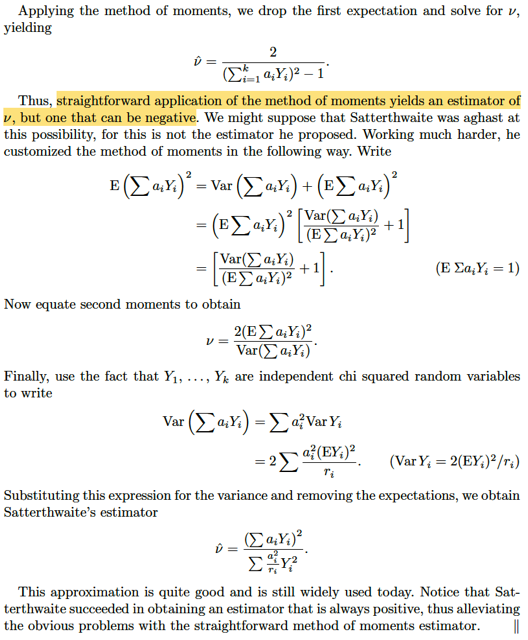</kbd>

> [!NOTE]
> QUAY LẠI SAU

 

<kbd>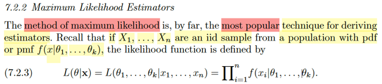</kbd>

> [!NOTE]
> ĐÂY! MAXIMUM LIKELIHOOD ESTIMATOR, KHÁI NIỆM MÀ AE SẼ GẶP
> TRONG MACHINE LEARNING.
>
> Nhìn lại (hay nhớ lại), ta đang trong tiến trình gọi là thảo luận các phương pháp
> để tìm các estimator.
>
> Ôn lại một chút, estimator là gì? Nhớ lại định nghiã, estimator, chính là bất cứ
> function nào của random sample: W(X1,...Xn). Có thể thấy, và như giáo sư
> Casella đã nói, đây là định nghĩa rất vague (mơ hồ), rất rộng. Và cơ bản, theo
> định nghĩa này thì estimator chính là statistic, vì ta nhớ, statistic cũng là một
> function nào đó áp lên các random variables của random sample.
>
> Còn vế ý nghĩa, khi nói về estimator, mình có thể hiểu là: À ta có một bộ data
> chứ thông tin về distribution, phản ánh trong giá trị của random sample. Ta mới
> dùng một statistic (estimator) để chắt lọc thông tin về distribution (cũng là distri
> parameter) sao cho nó chứa đủ mọi thông tin, và ta có thể vứt bỏ cả bộ data
> kia đi. Thì tất nhiên chắt lọc mà hoàn hảo thì nó sẽ chỉ còn các giá trị của các
> parameter mà thôi. Nên estimator hiểu theo nghĩa nôm na là "cái công cụ" để
> đưa ra ước lượng của population parameter.
>
> Nói là là cái công cụ là ý chỉ nó là cái hàm số, để với một input là các giá trị của
> sample thì output là gía trị cụ thể của một ước lượng (estimate).
>
> Thế rồi ôn lại khái niệm likelihood function, nó được định nghĩa là hàm số theo
> **θ** (vector parameter) mà giá trị tính bởi f(**x**|**θ**), tức joint pdf/pmf của random
> variable X1,...Xn của random sample.
>
> Chỗ này có thể khó hiểu với vài người: Chỉ cần nhớ, à, cái hàm likelihood L(**θ**|**x**)
> nó được định nghĩa là, hay, nó được tính bằng cách: Bỏ input là một **θ** vào 
> thì ta sẽ tính joint pdf f(**x**|**θ**) với **x** là giá trị quan sát được của sample và trả kết
> quả ra. Nên trong định nghĩa như vậy, thì đây là hàm của **θ**, với θ khác thì bỏ
> vào, tính f(**x**|**θ**) (vẫn là **x** đó, tức giá trị quan sát được của sample là cố định)
> sẽ ra giá trị khác. Và ý nghiã của hàm L(**θ**|**x**) mang ý nghĩa là mức độ HỢP LÝ
> của việc population parameter mang giá trị **θ**, với quan sát **X** = **x**.
>
> Quay lại đây, gs viết ở dạng expand:
> ****L(**θ**|**x**), tức L(θ1, ...θk|x1,...xn) = Πi=1:n f(xi|θ1...θk) (không khó hiểu, vì joint pmf
> pdf = tích marginal pmf / pdf do tính chất iid)

 

<kbd>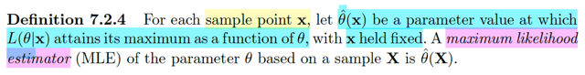</kbd>

> [!NOTE]
> Rồi, đây! Định nghĩa chính thức của Maximum Likelihood Estimator mà
> mình chỉ học lóm trước đây trong bối cảnh của các lớp về tối ưu hay deep
> learning. Định nghĩa của nó là vầy: Đã nói likelihood L(**θ**|**x**) là function
> là hàm số theo **θ** khác nhau, cùng với giá trị fixed **x** (giá trị quan sát
> thấy của **X**) thì ta sẽ tính  ra độ hợp lý khác nhau. Vậy thì ta sẽ đi tìm cái
> θ mà maximize cái độ hợp lý đó: Tức đặt ra bài toán maximize over θ
> {L(**θ**|**x**)}.
>
> Giải cái này, hay, về cơ bản, ta đã định nghĩa ra thêm một hàm số nữa:
> Hàm số này đưa vào input là **x**, và bên trong nó sẽ giải bài toán
> optimization này  để trả ra **θ**. Nên ta kí hiệu hàm số này là θ^(**x**).
>
> Và quan trọng là: Có thể thấy, đây là MỘT HÀM SỐ ÁP LÊN MỘT BỘ
> RANDOM SAMPLE: W(X1,...,Xn), cụ thể là θ^(**X**)
>
> Thì như trên vừa ôn lại: Đây chính là một estimator.
>
> Và người ta gọi nó là **MAXIMUM LIKELIHOOD ESTIMATOR**

 

<kbd>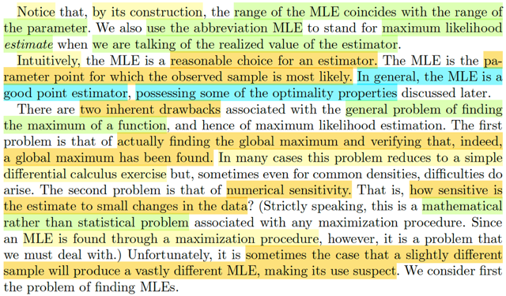</kbd>

> [!NOTE]
> Gs đề nghị ta lưu ý rằng vì cách định nghĩa như vậy nên MLE có range
> trùng với range của parameter. (chưa rõ lắm) Và chú ý thứ hai là MLE đôi
> khi cũng dùng để viết tắt của Maximum Likelihood Estimate tức là giá trị
> cụ thể hóa của ML Estimator khi bỏ giá trị của observed value X = x vào.
>
> Ý sau nói là, về cơ bản, là MLE là một lựa chọn hợp lí cho một estimator,
> MLEstimate là giá trị hợp lí nhất của parameter θ giúp tạo ra giá trị quan sát
> **X**=**x**.
>
> Đoạn sau bàn về hai nhược điểm của MLE: Và vốn dĩ, xuất phát từ bản chất
> là ta phải giải bài toán tối ưu: 
>
> Đầu tiên đó là, làm sao để tìm được global maximum và verify được đó là
> maximum của function. (Nhờ đã học Convex Optimization, và đang học
> Nocedal, nên mình hiểu cơn đâu đầu của việc tìm global solution). Đôi khi
> việc tìm global maximum (mà chuyển thành bài toán equivalent là tìm global
> minimum) có thể dễ giải chỉ cần calculus (tác giả có lẽ đang ám chỉ các bài
> toán mà chỉ cần dùng giải tích, thiết lập optimality condition ∇f = 0 và giải
> ra solution ở dạng closed-form)
>
> Nhưng các trường hợp khác thì khó khăn sẽ nảy sinh.
>
> Vấn đề thứ hai, gọi là numerical sensitivity. Nôm na là, solution tìm thấy từ
> quá trình giải bài toán MLE có thể sẽ khác nhiều nếu như ta chỉ thay đổi dữ
> liệu một chút xíu. Từ đó khiến ta phải nghi ngờ tính chính xác của MLE.

 

<kbd>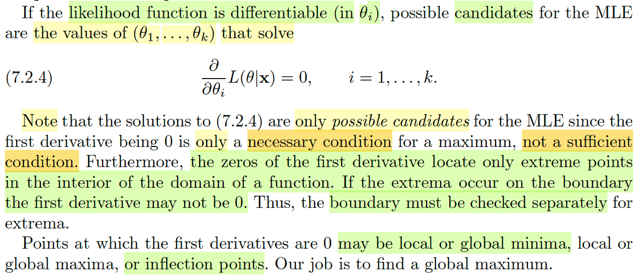</kbd>

> [!NOTE]
> Hoàn toàn có thể hiểu được đoạn này: Đại khái là đầu tiên gs xét trường
> hợp mà likelihood function khả vi tại θi, thì ta có thể tìm candidate cho MLE
> bằng cách giải: ∂/∂θi L(θ|x) = 0, i = 1,2...k.
>
> Mình hiểu: Đây chính là gradient vanish, điều kiện cần phải có để check
> minimizer / maximizer. Mà trong lớp tối ưu mình đã chứng minh bằng phản
> chứng cái vụ nếu x* là local minimizer nhưng ∇f(x*) khác 0 thì sẽ dẫn đến
> mâu thuẫn.
>
> Và cũng hiểu ý tiếp theo khi giáo sư nói đây chỉ là candidate, vì điều kiện
> này chỉ là điều kiện cần, chứ chưa đủ.
>
> Mình hiểu: Nhớ kiến thức học được từ MIT 18.01, check đạo hàm cấp một
> bằng 0 chỉ giúp kết luận stationary point. Sau đó phải check giá trị hàm số
> tại đó và so sánh với giá trị hàm số tại biên hoặc các điểm đặc biệt nữa.
> Hoặc là phải check secondary check, tức check đạo hàm bậc hai. Còn với
> bối cảnh của các lớp tối ưu thì đây chỉ là First order necessary condition
> điều kiện cần bậc nhất. Chứ chưa đủ.Ta phải check thêm Hessian để nếu
> như gradient ∇f(x*) vanish, và Hessian ∇^2f(x*) tại đó xác định dương thì x*
> sẽ là global minimum (nhắc lại việc tìm global maximum có thể đơn giản là
> chuyển thành bài toán tương đương để đi tìm global minimum)
>
> Nên ở đây có thể hiểu khi gs nói ta phải check boundary để tìm extrema
> (tức là khi giá trị lớn nhất / nhỏ nhất lại nằm ở biên)

 

<kbd>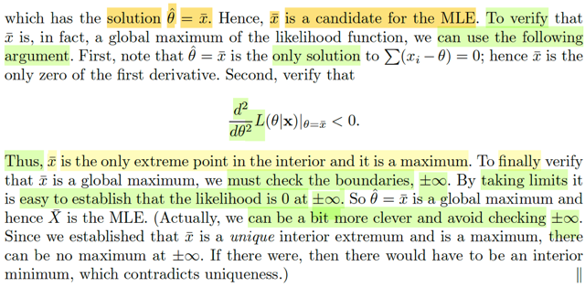</kbd>

<kbd></kbd>

<kbd>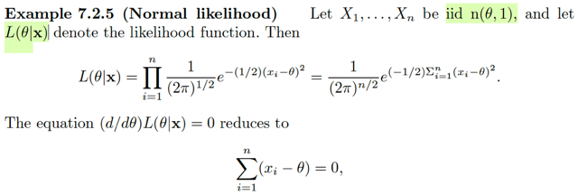</kbd>

> [!NOTE]
> Rồi, xét ví dụ này, X1,...Xn là iid n(θ,1) và L(θ|**x**) là likelihood function. Mình
> nghĩ: Bình thường, ở trạng thái khái quát, thì L(**θ**|**x**) vì **θ**là****vector  các
> parameter. Còn ở đây thì chỉ có θ (trong n(θ,1) tức population mean là  chưa biết
> thôi, variance = 1 biết rồi, nên **θ**(ý nói vector param, chỉ là θ  thôi, đáng lẽ giáo
> sư cứ dùng μ).
>
> Rồi, như đã biết Likelihood function L(**θ**|**x**) được định nghĩa là giá trị của joint
> pmf/pdf của random variable vector **X** evaluate tại giá trị quan sát được  **X** =
> **x** f**X**(**x**|**θ**), và vì tính iid của Xi, nên nó trở thành Πi f(xi|θ) với fXi(xi|θ)
> bây giờ đều là marginal pdf của n(θ,1). Chỗ này nếu ko hiểu chắc sẽ thấy  bối rối:
> Theo quy định (ý là theo định nghĩa của likelihood function) thì ta phải tính
> f**X**(**x**|**θ**). Nhưng vì định nghĩa của random sample quy định tính chất iid,
> tức các X1,...Xn mutually independent và identically distribution, tức là chúng có
> chung marginal distribution. Thành ra nhờ tính independent, joint pdf f**X**(**x**|θ)
> sẽ bằng tích của các marginal pdf: Πi fXi(xi|θ). Sau đó, vì tính identically
> distributed, nên ta mới đều dùng pdf của n(1,θ) cho fXi(xi|θ):
>
> Ôn lại pdf của n(μ, σ^2): fX(x|μ,σ) = (1/√2πσ) exp[-(1/2σ^2)(x-θ)^2]
>
> ⇨ fXi(xi|θ) = (1/√2π) exp[-(1/2)(xi-θ)^2]
>
> L(θ|**x**) = Πi=1:n fXi(xi|θ) = Πi=1:n (1/√2π) exp[-(1/2)(xi-θ)^2]
>
> = (1/√2π)^n Πi=1:n exp[-(1/2)(xi-θ)^2]
>
> = (1/√2π)^n exp Σi [-(1/2)(xi-θ)^2]
>
> = (1/2π)^(n/2) exp [-(1/2) Σi (xi-θ)^2]
>
> Tính d/dθ L(θ|**x**):
>
> = d/dθ (1/2π)^(n/2) exp [-(1/2) Σi (xi-θ)^2]
>
> = (1/2π)^(n/2) d/dθ exp [-(1/2) Σi (xi-θ)^2] | đưa constant ra ngoài
>
> Dùng chain-rule:
>
> = (1/2π)^(n/2) d/d[-(1/2) Σi (xi-θ)^2] exp [-(1/2) Σi (xi-θ)^2] . d/dθ [-(1/2) Σi (xi-θ)^2]
>
> = (1/2π)^(n/2) exp [-(1/2) Σi (xi-θ)^2] . [-(1/2)] Σi d/dθ [(xi-θ)^2]
>
> = (1/2π)^(n/2) exp [-(1/2) Σi (xi-θ)^2] . [-(1/2)] Σi [-2(xi-θ)]
>
> = (1/2π)^(n/2) exp [-(1/2) Σi (xi-θ)^2] . [Σi [(xi-θ)]
>
> Cho cái này bằng 0: thì vì thừa số dính đến exp sẽ không âm (hàm mũ kéo dài →
> 0 khi x → -inf, và kéo dài → inf khi x → inf). Nên cái này bằng 0 khi [Σi [(xi-θ)] = 0
>
> ⇔ Σi xi-Σi θ = 0 ⇔ Σi xi- nθ = 0 ⇔ θ = Σi xi / n
>
> Vậy ta có candidate solution của việc giải bài toán tối ưu này (chưa giải xong nhé,
> vì đây chỉ là điều kiện cần) là θ = Σi xi / n. Và đó chính là gì ? ⇨ Hàm Xbar:
> Xbar(x1,..xn) = (Σi xi)/n Và ứng cử viên cho ML Estimator θ^(**X**) trong trường
> hợp này chính là Xbar(**X**), để rồi nếu nó thật sự là ML Estimator thì θ^(**x**) =
> Xbar(**x**) = xbar chính là ML Estimate.
>
> Tiếp, tác giả cho rằng ta có thể check thêm đạo hàm cấp hai (Mình hiểu, ông dùng
> second  derivative check đây mà) để xác nhận là tại giá trị candidate **x**bar thì
> đạo hàm cấp hai âm:
>
> d^2/dθ L(θ|**x**)|θ=xbar:
>
> Derive d^2/dθ L(θ|x) trước, nó sẽ bằng đạo hàm cấp 1 của d/dθ L(θ|**x**) mà ta có
> ở trên:
>
> = d/dθ (1/2π)^(n/2) exp [-(1/2) Σi (xi-θ)^2] . [Σi [(xi-θ)]
>
> = (1/2π)^(n/2) d/dθ exp [-(1/2) Σi (xi-θ)^2] . [Σi [(xi-θ)]
>
> thay θ = xbar (vì mình đang evaluate tại xbar):
>
> = (1/2π)^(n/2) d/dθ exp [-(1/2) Σi (xi-xbar)^2] . [Σi [(xi-xbar)]
>
> HOLY..LÀM VẬY LÀ SAI BÉT ĐẤY: VÌ CÁI TA PHẢI LÀM LÀ, DERIVE RA HÀM
> d^2/dθ L(θ|x)  rồi mới lắp θ=xbar vào, chứ không phải là lắp vào mới derive.
>
> \~thay θ = xbar (vì mình đang evaluate tại xbar):
>
> = (1/2π)^(n/2) d/dθ exp [-(1/2) Σi (xi-xbar)^2] . [Σi [(xi-xbar)]
>
> \~**Dùng product rule thôi:**Xét term có dính θ**** d/dθ exp [-(1/2) Σi (xi-θ)^2] .
> [Σi [(xi-θ)]
>
> = { d/dθ exp [-(1/2) Σi (xi-θ)^2] } . [Σi [(xi-θ)] + exp [-(1/2) Σi (xi-θ)^2] . d/dθ [Σi
> [(xi-θ)]
>
> Term 1: { d/dθ exp [-(1/2) Σi (xi-θ)^2] } . [Σi [(xi-θ)]
>
> = { d/du exp(u) } { d/dθ [-(1/2) Σi (xi-θ)^2] } . [Σi [(xi-θ)] } | u = -(1/2) Σi (xi-θ)^2
>
> = { d/du exp(u) } { (-1/2) Σi [-2(xi-θ)] } . [Σi [(xi-θ)]
>
> = { d/du exp(u) } { Σi (xi-θ) } . [Σi [(xi-θ)]
>
> = { d/du exp(u) } { (Σixi - nθ) } . (Σixi - nθ)
>
> = [d/du exp(u)] (Σixi - nθ)^2
>
> Thế θ = xbar vào thì vế này bằng 0
>
> Term 2: exp [-(1/2) Σi (xi-θ)^2] . d/dθ [Σi [(xi-θ)]
>
> = exp [-(1/2) Σi (xi-θ)^2] . Σi d/dθ (xi-θ)
>
> = exp [-(1/2) Σi (xi-θ)^2] . Σi (-1)
>
> = exp [-(1/2) Σi (xi-θ)^2] . (-n)
>
> thế vào θ = xbar vào thì đây là tích của một số không âm và một số âm → số âm
>
> Vậy có thể xác nhận là kết quả là một số âm ⇨ θ = xbar là maximum.
>
> Nhưng cụ thể là nó chỉ là maximum trong phạm vi interior, còn ta phải check cái
> boundary nữa. Để làm vậy ta sẽ tính limit x → +/- inf của L
>
> lim xi → infinity (1/2π)^(n/2) exp [-(1/2) Σi (xi-θ)^2]
>
> Không khó để thấy khi đó exp [-(1/2) Σi (xi-θ)^2] → 0 nên L(θ|x) → 0
>
> Vậy θ = xbar là GLOBAL maximum.
>
> Khúc cuối giáo sư nói là về cái mẹo là vì đã xác nhận xbar là unique interior
> extremum nên suy ra không cần phải check biên vì cái kia là unique rồi.
>
> Chỗ này chưa hiểu lắm, nhưng có thể gs đang nói đến tính chất của convex
> function chăng? Vì ta đã học nếu hàm lỗi thì local minimum thì cũng là global
> minimum.  Nhưng hàm pdf của normal (đổi dấu để xét bài toán tìm minimum) thì
> nó đâu có lồi nhỉ (vì nó dạng hình chuông với hai cái đuôi kéo dài ra, dễ thấy nó
> có đoạn có negative curvature)
>
> Thằng Gemini cho mình biết tác giả lập luận kiểu khác, đơn giản thôi là ta giải
> cái L' = 0 ra có đúng 1 nghiệm, tức là trong phạm vi interior thì chỉ có 1 chỗ
> là hàm có độ dốc bằng 0. Mà ta cũng đã chứng minh nó là maximum bằng cách
> xét đạo hàm cấp hai.
>
> Vậy thì nếu mà tại biên có thêm một maximum nữa thì tức là hàm số phải có
> dạng thế này: đi từ trái qua phải, nó sẽ đi lên và đi xuống để qua cái maximum
> đầu tiên, sau đó nó phải đi lên lại để tới cái maximum tại biên. mà như vậy thì
> nó phải đi qua 1 điểm có độ dốc bằng 0 thứ hai (khúc đi xuống cái núi thứ 1 và 
> đi lên cái núi thứ 2) → ko đúng, vì đã nói chỉ có 1 điểm mà độ dốc = 0 thôi mà.
> Nên suy ra khỏi phải check tại biên làm gì.

> [!NOTE]
> Sẵn đây, nói luôn việc d/dθ L(θ|**x**)|θ=xbar < 0 sẽ giúp kết luận maximum là vì sao?
>
> Xét trong bối cảnh hàm đa biến f(**x**) thì điều này sẽ tương ứng với việc Hessian
> xác định âm (negative definite)
>
> Xét hàm g(t) = f(**x***+ t**d**) với **d** là hướng bất kì. Thì:
>
> d/dt g(t) = d/dt f(**x*** + t**d**) = d/d(**x*** + t**d**) f(**x*** + t**d**) . d/dt (**x*** + t**d**)
>
> = ∇f(**x*** + t**d**) . **d**= ∇f(**x*** + t**d**)Td
>
> Vậy directional derivative theo hướng **d** của f tại **x*** sẽ chính là d/dt g(t)|t=0
>
> = ∇f(**x*** + 0***d**)Td = ∇f(**x***)T**d**.
>
> Mình muốn chứng minh là khi Hessian tại x* xác định âm thì đi theo đạo hàm
> theo hướng d bất kì tại x* phải luôn âm, khiến cho đi theo hướng nào từ x*
> đều làm giảm hàm f.
>
> Thế thì phải mượn đến Taylor theorem: Nói rằng:
>
> Với đơn biến:
>
> Khi đi từ a → b: f(b) = f(a) + f'(a)c với c nằm đâu đó giữa a và b (cái này cũng
> chính là mean value theorem)
>
> hoặc f(b) = f(a) + f'(a)(b-a) + (1/2)f''(a)c^2 với c nằm đâu đó giữa a và b
>
> Với đa biến:
>
> f(**x** + **d**) = f(**x**) + ∇f(**x**)T(**d**) + (1/2)**d**T∇^2f(**x** + α**d**)**d** với α là số ∈ [0,1] 
>
>
> Áp dụng vào đây:
>
>
> f(**x*** + **d**) = f(**x***) + ∇f(**x***)T**d** + (1/2)**d**T∇^2f(**x*** + α**d**)**d** với α là số ∈ [0,1] 
>
>
> Mà gradient vanish:
>
>
> f(**x*** + **d**) = f(**x***) + (1/2)**d**T∇^2f(**x*** + α**d**)**d**, for some α số ∈ [0,1] 
>
>
> Vậy thì ta sẽ xét hàm g(t) = f(x* + td) để thể hiện giá trị hàm f khi đi theo hướng 
> vector d (t = 0 thì tại vị trí xuất phát, f(x*), t tăng dần thì ta sẽ đi ra khỏi x* theo 
> hướng vector d)
>
> f(**x*** + t**d**) = f(**x***) + (1/2)(t**d**)T∇^2f(**x*** + αt**d**)(t**d**)
>
> = f(**x***) + (1/2)(t^2) **d**T∇^2f(**x*** + αt**d**)**d** for some α in (0,1)
>
> = f(**x***) + (1/2)(t^2) **d**T∇^2f(**x*** + α**d**)**d** for some α in (0,t)
>
> Và lập luận như sau:
>
> Khi đi từ **x*** → ra khỏi **x*** bằng cách tăng dần t
>
> thì vì hàm f là hàm liên tục, nên Hessian cũng sẽ liên tục, mà Hessian tại **x*** là
> xác định âm (có λmax âm) thì sẽ phải tồn tại một vùng nào đó mà khi t trong phạm
> vi này, thì Hessian tại **x*** + α**d** vẫn xác định âm, bởi lẽ hàm liên tục nên λmax cũng
> liên tục, mà λmax âm thì không thể nào nó ngay lập tức biến thành dương được.
> Vậy phải trong khoảng đó, Hessian vẫn xác định âm khiến cho cái quadratic term
> **d**T∇^2f(**x*** + α**d**)**d** âm → f(**x*** + t**d**) nhỏ hơn f(**x***). Cho thấy **x*** là local maximum.

 

<kbd>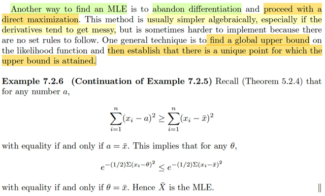</kbd>

🔗 **Related:** [5.2 Σ OF RANDOM VARIABLES FROM A RANDOM SAMPLE](52_σ_of_random_variables_from_a_random_sample.md#node-341)

> [!NOTE]
> Ôn lại một tí: Hôm qua ta đã học về MLE. Định nghĩa chính thức của nó đó
> là: Cái Estimator mà khiến cho likelihood function L(θ|**x**) lớn nhất thì là ML
> Estimator Ôn lại tiếp, estimator là gì, nó có định nghĩa chính thức, là một
> function của các random variable của một random sample W(X1,....Xn). Định
> nghĩa này rất mơ hồ, rất rộng, mà theo đó, bất kì statistic nào cũng là
> estimator, vì statistic cũng được định nghĩa là một random variable có được
> khi apply một function  lên các random variables trong random sample.
>
> Thế thì từ đó trong sách này mới giới thiệu ta các các tiếp cận để mà đi tìm
> estimator tốt. Thì trong đó cách đầu tiên là method of moment. Ý tưởng là
> cho sample moment bằng với population moment, từ đó giải ra các estimator,
> gọi là MOM estimator.
>
> Còn cách thứ hai là dùng likelihood. Lại nói về likelihood, nó là function được
> định nghĩa bằng cách nhận một giá trị **θ**, ta sẽ tính joint pdf/pmf của
> random variable vector **X**evaluate tại observed value **x:** f(**x**|θ) và trả
> ra gía trị này.  L(**θ**|**x**) = f(**x**|**θ**) = Πi f(xi|θ) Thì đây mang ý nghĩa là
> độ hợp lí của **θ** khi quan  sát thấy giá trị **x**. Thế thì với các **θ** khác
> nhau, L(**θ**|**x**) sẽ khác nhau.
>
> Và cái khiến maximize L(θ|**x**), tức là cái có được bằng cách gỉai bài toán
> maximize  over θ L(θ|**x**) sẽ chính là ML estimator.
>
> Có thể nhìn thấy rằng, việc đi tìm ML estimator, hay nói cách khác, ML
> estimator là hết quả của việc apply cái hàm số sau đây lên random sample:
>
> g(**x**) = maximize **θ** {L(θ|**x**)}
>
> Nên từ đó ta thấy khớp với định nghĩa: estimator là một function của random
> sample.
>
> θ^(**X**) với θ^(**x**) = maximize θ {L(θ|**x**)} là maximum likelihood
> estimator
>
> Đại khái là, có một cách khác để tìm MLE, trong đó ta ko cần phải tính đạo
> hàm Cách làm là ta sẽ tìm một chặn trên tổng quát và chứng minh rằng có
> một điểm duy nhất mà cái upper bound đó có thể đạt được.
>
> Vậy thì đại khái là trong cái theorem 5.2.4, mình đã chứng minh cái bất đẳng
> thức này: Σi (xi - a)^2 ≥ Σi (xi - xbar)^2. Và dấu bằng chỉ xảy ra khi a = xbar.
> Việc chứng minh cái bất đẳng thức này không có gì khó, chỉ là biến đổi đại số
> để cho thấy
>
> Σi (xi - a)^2 = Σi (xi - xbar)^2 + [một term không âm mà chỉ bằng không khi
> xbar = a]
>
> Từ đó suy ra Σi (xi - a)^2 ≥ Σi (xi - xbar)^2 và chỉ bằng nhau khi xbar = a
>
> Từ đó áp dụng vào đây ta sẽ có:
>
> e^-(1/2) Σ(xi - θ)^2 ≤ e^-(1/2) Σ(xi - xbar)^2
>
> và dĩ nhiên đây là cái ruột của normal joint pdf / hay likelihood function.
>
> Có nghĩa là ta chứng minh được rằng L(θ|**x**) ≤ L(xbar|**x**) và chỉ bằng
> nếu θ = xbar
>
> Vậy Θ^(**X**)  = Xbar(**X**) chính là MLE

 

<kbd>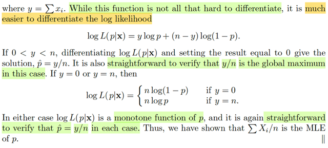</kbd>

<kbd></kbd>

<kbd>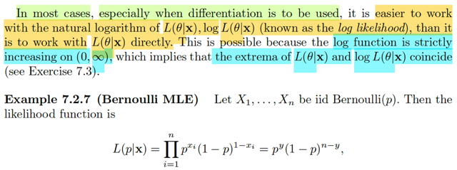</kbd>

> [!NOTE]
> Rồi, đây! Đây chính là gốc rễ của những loss function trong bài toán binary
> classification của ML đây: hàm negative log likelihood, hay binary cross entropy.
>
> Ở đây giáo sư nói rằng đặc biệt khi differentiation được dùng thì sẽ dễ dàng hơn
> nếu ta dùng natural logarithm thay log L(θ|**x**). Gọi là **LOG LIKELIHOOD**  thay
> vì dùng trực tiếp log.
>
> Nguyên nhân là vì hàm log có tính đơn điệu tăng, strictly increasing: Nên nếu giải
> bài toán tối ưu với hàm log likelihood thì cũng ra solution của bài toán với hàm
> likelihood (trong convex optimization đã học về các cách để đưa về equivalent
> problem rồi).
>
> Ví dụ này, ta có X1,....Xn là iid Bern(p). Xem thử likelihood function là gì:
>
> Như định nghĩa, nó là cái hàm mà giá trị sẽ tính bởi joint pdf.pmf evaluate tại
> observed value của random sample: f(x|θ)
>
> L(p|**x**) = f(**x**|p) = Πi f(xi|p)
>
> Với X ~ Bern(p), fX(x|p) bằng gì?
>
> Nhớ lại, Bern(p) random variable X có story là kết quả của một thử nghiệm mà xác
> suất thành công = p, khi đó X = 1, và xác suất fail là 1 - p, khi đó X = 0 Thì tuy là
> vậy, nhưng vì P(X=x) bằng bao nhiêu?
>
> P(X=x) = p nếu x = 1
>
> P(X=x) = (1-p) nếu x = 0.
>
> Vậy làm sao tích hợp vào thành một công thức thôi. (mình muốn lập luận, không
> muốn học thuộc lòng):
>
> Mình sẽ dùng lũy thừa để bật tắt:
>
> Khi x = 1, ta muốn có p, không có (1-p): Vậy bật p, tắt (1-p): p^1 (1-p)^0
>
> Khi x = 0, ta không muốn p, muốn có (1-p): Tắt p, bật (1-p): p^0 (1-p)^1
>
> Vậy ta có công thức p^x (1-p)^(1-x)
>
> Rồi, ráp vào: L(p|**x**) = f(**x**|p) = Πi f(xi|p) = Πi p^xi (1-p)^(1-xi)
>
> = (Πi p^xi) (Πi (1-p)^(1-xi))
>
> = p^(Σixi) (1-p)^(Σi(1-xi))
>
> = p^y (1-p)^(Σi(1-xi)) | Đặt y = Σixi
>
> = p^y (1-p)^(Σi1-Σixi)
>
> = p^y (1-p)^(n-y)
>
> ⇨ L(p|**x**) = p^y (1-p)^(n-y)
>
> Thế thì, cái function này dù rằng ko quá khó để lấy đạo hàm nhưng sẽ dễ  hơn
> nhiều  nếu chuyển sang bài toán tương đương (tức là maximize over p {log
> L(p|**x**)} thay  vì maximize over p L(p|**x**)
>
> log L(p|**x**) = log [p^y (1-p)^(n-y)] = log p^y + log (1-p)^(n-y)
>
> = y log (p) + (n-y) log(1-p)
>
> Rồi, giải bài toán này (maximize over p {log L(p|x)} ) ta sẽ lấy đạo hàm theo θ (tức
> p) và  cho nó bằng 0 (nhớ lại, đây là first order necessary condition):
>
> d/dp [log L(p|**x**)] = d/dp [y log (p) + (n-y) log(1-p)]
>
> = d/dp [y log (p)] + d/dp [(n-y) log(1-p)]
>
> = y d/dp [log (p)] + (n-y) d/dp [log(1-p)]
>
> = y (1/p) + (n-y) [-1/(1-p)]
>
> = y/p + (y-n)/(1-p)
>
> Cho bằng 0: y/p + (y-n)/(1-p) = 0
>
> ⇔ y/p = -(y-n)/(1-p)
>
> Tại đây phải thêm điều kiện  y khác 0 và y khác n:
>
> Vì y = 0, phương trình ⇔ 0 = n/(1-p) ⇨ vô nghiệm.
>
> khi y = n, phương trình ⇔ n/p = 0 ⇨ vô nghiệm. 
>
> ⇔ y(1-p) = -(y-n)p
>
> ⇔ y-yp = -yp+np
>
> ⇔ y = np
>
> ⇔ y/n = p
>
> Vậy p^ = y/n là stationary point.
>
> Dĩ nhiên ta phải check tiếp boundary hoặc đạo hàm cấp 2.
>
> Tính đạo hàm cấp hai: d/dp [y/p + (y-n)/(1-p)]
>
> = -y/p^2 + (y-n) d/dp [1/(1-p)]
>
> = -y/p^2 + (y-n) [d/d(1-p) [1/(1-p) . d/dp (1-p)]]
>
> = -y/p^2 + (y-n) [-1/(1-p)^2] . (-1)]
>
> = -y/p^2 + (y-n)/(1-p)^2
>
> Thế thì y = Σi xi, nên range của nó là [0, n] vì xi chỉ có giá trị 0 hoặc 1.
>
> Xét case 0 < y < 1 thì ta sẽ có:
>
> Nên -y/p^2 < 0, (y-n)/(1-p)^2 cũng < 0 nốt.
>
> Do đó kết luận y/n là một local maximum.
>
> Xét case y = 0 hoặc y = n, là case mà phương trình f' = 0 vô nghiệm.
>
> Khi y = 0, hàm log L trở thành = nlog(1-p)
>
> Điểm p^ tính toán ở trên trở thành: y/n = 0. 
>
> Và L(p^) = n log(1 - 0) = nlog(1) = 0,
>
> Khi p tăng từ 0 → 1 thì 1 - p giảm từ 1 về 0. 
>
> Và vì hàm log strictly monotone, nên log(1-p) cũng giảm về log(0) tức -inf. 
>
> Nên trong case này p^ = y/n = 0 cũng là maximum.
>
> Khi y = n, log L = n log (p)
>
> p^ = n/n = 1.
>
> L(p^) = nlog(p^) = nlog(1) = 0
>
> Và khi p giảm từ p^ = 1 về 0 thì again, hàm cũng giảm từ nlog(1) = 0 về nlog(0) = -inf
>
> Vậy p^ = 1 , tức y/n cũng là maximum trong case này.
>
> Vậy p^(**X**) = ΣXi/n hay, Xbar, hay Xbar(**X**) chính là MLE estimator

 

<kbd>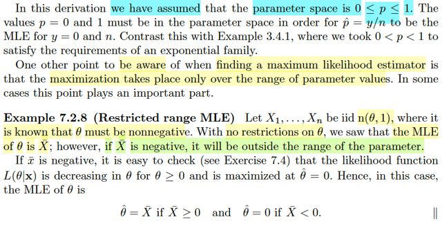</kbd>

> [!NOTE]
> Đại ý là, trong ví dụ trước, ta đã giả định là parameter space là [0,1]. Do đó p^
> =y/n sẽ là MLE ngay cả khi y = 0 và bằng n.
>
> Nhưng trong case khác nếu như ta chỉ cho p được trong (0,1) thì khi đó câu
> chuyện sẽ khác đi.
>
> Lấy ví dụ 7.2.8, ta có X1,....Xn iid ~ normal(θ,1) với việc đã biết θ phải không
> âm.
>
> Thế thì nếu như không có ràng buộc gì với θ, ta đã biết Xbar sẽ là MLE.
>
> Nhưng với ràng buộc θ phải không âm thì Xbar có thể nằm ngoài range của
> parameter (tức là range của parameter là [0,inf))
>
> Vậy thì nếu xbar âm, ở đây tác giả cho rằng ta có thể dễ dàng check để thấy
> likelihood function decreasing theo θ với θ ≥ 0. Từ đó suy ra nó maximum tại θ^
> = 0.
>
> Nên MLE cho θ sẽ là Xbar nếu Xbar ≥ 0 và = 0 nếu Xbar < 0
>
> Là sao?
>
> Là vầy nè:
>
> Ôn lại không thừa, ML Estimator là cái gì? ⇨ À nó là cái function của random
> sample: W(X1....Xn) (Vì đây là định nghĩa tổng quát của Estimator). Nhưng
> function nào mới được? À thì ta sẽ bàn về likelihood function, được định nghĩa
> là hàm theo θ, được tính bởi: Nhận vào θ, và dựa trên giá trị quan sát  của **X**là **x**, ta tính joint pdf/pmf tại **x**: f(**x**|θ). Tức L(θ|**x**) = f(**x**|θ), với ý
> nghĩa là độ hợp lí của θ khi quan sát được giá trị của **X** = **x**. Thế thì, ta mới
> giải bài toán tìm θ sao cho maximize L(θ|**x**), hay đặt hàm g(**x**) = argmax_θ
> L(θ|**x**). Và đây là chính là cái hàm W(**x**) trả lời cho câu hỏi trên. Hay, kí
> hiệu trong sách là θ^(**X**)****là ML estimator, và θ^(**x**) là ML estimate.
>
> Thế thì, để tìm MLE cho θ của n(θ,1) thì những ví dụ trước ta đã làm, dùng giải
> tích để đi tìm stationary point, nơi d/dθ L(θ|**x**) = 0, và sau đó thì check
> boundary và đạo hàm cấp 2 để thấy Xbar(**X**), chính là MLE.
>
> Tuy nhiên, đó là khi ta không có ràng buộc nào cho θ, cho phép parameter
> range kéo dài từ -inf tới inf. Nên khi đó dù giá trị của ML Estimate (tức xbar) có
> âm hay dương gì thì nó vẫn hợp lệ. Ý là, ta đi tìm ML estimator cho θ, thì dĩ
> nhiên giá trị cụ thể ML estimate sẽ là giá trị ước lượng của θ, Mà range nó cho
> phép thoải mái, thì ta có thể kết luận Xbar là ML estimator vì dù xbar (giá trị cụ
> thể của Xbar) có là bao nhiêu thì nó vẫn không vi phạm.
>
> Nhưng giờ, ta lại có cái ràng buộc là θ phải KHÔNG ÂM.
>
> Thế thì, lúc này với ràng buộc này, thì ML Estimator có còn là Xbar(**X**) nữa ko
> (*chỗ này nếu ai khó hiểu thì nên nhớ, trong sách này, giáo sư Casella đã nói,
> Xbar thực ra là cách viết tắt của function Xbar(**X**), vì nó là một statistic có
> được khi apply function g(**X**) = ΣXi / n, tương tự S^2 (sample variance) đáng
> phải ghi ra là S^2(**X**))
>
> Để trả lời, đơn giản thôi, cứ theo bản chất của MLE là giải bài toán tối ưu:
>
> maximize over θ {L(θ|**x**)}. Nhưng khác ở chỗ, bây giờ là bài toán tối ưu có
> ràng buộc cụ thể là ràng buộc bất đẳng thức: Inequality constraint optimization
> problem
>
> maximize over θ {L(θ|**x**)} subject to θ ≥ 0
>
> = maximize over θ {1/(2π)^(n/2) exp[(-1/2)Σi (xi-θ)^2]}
>
> equivalent: maximize over θ {Σi (xi-θ)^2} vì hàm mũ đồng biến
>
> maximize - (x-θ)T(x-θ) subject to θ ≥ 0  
>
> minimize (x-θ)T(x-θ) subject to θ ≥ 0  
>
> QUAY LẠI SAU KHI ÔN LẠI CONVEX OPTIMIZATION

> [!NOTE]
> QUAY LẠI SAU

 

<kbd>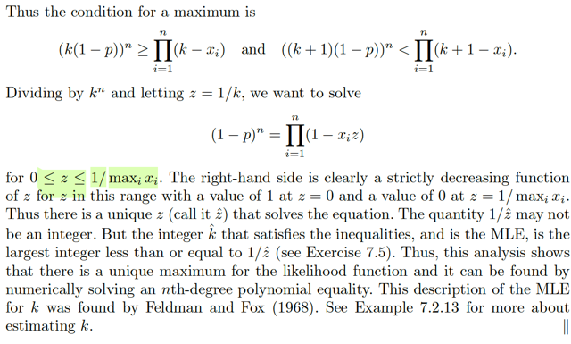</kbd>

<kbd></kbd>

<kbd>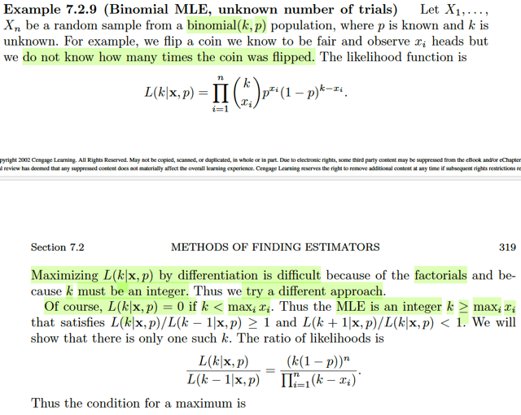</kbd>

> [!NOTE]
> Qua ví dụ này, Binomial MLE, nhưng tham số chưa biết lại là số lần thử
> thay vì xác suất thành công. Nhớ lại Binomial(k, p), story của X ~
> binomial(k,p) là số trials thành công trong chuỗi n iid Bern(p) trials. Và ở
> đây p đã biết, còn k chưa biết.
>
> Likelihood L(k|**x**, p) (tức là, hàm theo k, tính dựa trên giá trị đã biết **x**
> và p) như đã biết likelihood là hàm được định nghĩa là gía trị của nó tính
> bằng giá trị của joint pdf / pmf
>
> PMF của binomial thì còn nhớ, và cũng dễ dàng xây dựng lại từ story 
> của nó (ví dụ binomial(n,k): P(X = k) = (n choose k) p^k (1-p)^(n-k)
> nên ở đây Xi ~ binomial(k, p): fXi(xi) = (k choose xi)p^xi(1-p)^(n-xi)
>
> ⇨ L(k|**x**, p) = Πi=1:n (k choose xi) p^xi(1-p)^(k-xi)
>
> Thế thì cái hàm L này, để giải bài toán tối ưu bằng giải tích thì sẽ khó vì
> khó đạo hàm do nó có cái vụ giai thừa (ở trong công thức (k choose xi)
> và k phải là số nguyên.
>
> Do đó ta phải làm cách khác.
>
> Và cách làm đó là lập luận như vầy:
>
> Đầu tiên hãy nhớ lại ta đang muốn giải bài toán: 
>
> maximize over k {L(k|**x**, p)}
>
> nhưng k lại phải là số nguyên.
>
> Do đó lập luận để tìm k đó là: 
>
> Từ k-1 nhảy lên k thì hàm số phải không giảm: L(k-1|**x**,p) ≤ L(k|**x**,p). 
>
> Còn từ k nhảy lên k+1 thì hàm phải không tăng: L(k|**x**,p) ≥ L(k+1|**x**,p)
>
> Từ đó ta có:
>
> L(k-1|x,p) / L(k|x,p) ≤ 1 hay L(k|x,p) / L(k-1|x,p) ≥ 1 (1) 
>
> và L(k|x,p) / L(k+1|x,p) ≥ 1 (2)
>
> L(k|x,p) = Πi=1:n (k choose xi) p^xi(1-p)^(k-xi)
>
> L(k-1|x,p) = Πi=1:n (k-1 choose xi) p^xi(1-p)^(k-1-xi)
>
> L(k+1|x,p) = Πi=1:n (k+1 choose xi) p^xi(1-p)^(k+1-xi)
>
> ⇨ L(k|x,p) / L(k-1|x,p) = 
>
> Πi=1:n (k choose xi) p^xi(1-p)^(k-xi) / Πi=1:n (k-1 choose xi) p^xi(1-p)^(k-1-xi)
>
> = Πi=1:n (k choose xi) (1-p)^(k-xi) / Πi=1:n (k-1 choose xi) (1-p)^(k-1-xi)
>
> Xét hai cái tổ hợp:
>
> (k choose xi) = (k)! / xi! (k-xi)!
>
> (k-1 choose xi) = (k-1)! / xi! (k-1-xi)!
>
> ⇨ (k choose xi) / (k-1 choose xi) = k/(k-xi)
>
> ⇨ L(k|x,p) / L(k-1|x,p) = Πi=1:n [k/(k-xi)] [(1-p)^(k-xi) / (1-p)^(k-1-xi)]
>
> = Πi=1:n [k/(k-xi)] (1-p)
>
> = [Πi=1:n k/(k-xi)] (1-p)^n
>
> = 1/[Πi=1:n(k-xi)] k^n(1-p)^n
>
> ⇨ (1) ⇔ 1/[Πi=1:n(k-xi)] k^n(1-p)^n ≥  1 
>
> ⇔ [k(1-p)]^n ≥  Πi=1:n(k-xi)
>
> Chia hai vế cho k^n:
>
> ⇔ (1-p)^n ≥ Πi=1:n (k-xi) / (k^n)
>
> ⇔ (1-p)^n ≥ Πi=1:n [(k-xi)/k] 
>
> ⇔ (1-p)^n ≥ Πi=1:n (1-xi/k)
>
> Đặt vế phải là g(k)
>
> Hoàn toàn tương tự ta có thể có (2)
>
> ⇔ [(k+1)(1-p)]^n ≤ Πi=1:n (k+1-xi)
>
> Chia hai vế của bất phương trình cho k+1:
>
> ⇔ (1-p)^n ≤ Πi=1:n (k+1-xi)/(k+1)
>
> ⇔ (1-p)^n ≤ Πi=1:n [1-xi/(k+1)]
>
> Vế phải chính là g(k+1)
>
> Đặt vế trái là C = (1-p)^n thì kết hợp hai bất đẳng thức ta có:
>
> g(k) ≤ C ≤ g(k+1)
>
> Thế thì, C là constant. Nếu coi là hàm số, thì đồ thị của nó nằm ngang tại mức C
>
> Còn g(k), với k mang giá trị rời rạc, sẽ là hàm rời rạc. 
>
> Vậy mục đích là đang tìm giá trị nguyên k thỏa g(k) ≤ C ≤ g(k+1)
>
> Thì ta sẽ làm như sau: 
>
> Ta sẽ tạm thời xem k là số thực, và giải tìm g(k) = C
>
> Khi đó ta sẽ giải ra k^ thỏa g(k^) = C.
>
> Nhưng k^ là số thực, ta sẽ lấy phần nguyên của nó, để được số nguyên.
>
> Đại khái là vậy. 
>
> TẠM THỜI QUAY LẠI SAU VÌ CHỖ NÀY CŨNG HƠI KHÓ HIỂU.

> [!NOTE]
> QUAY LẠI SAU

 

<kbd>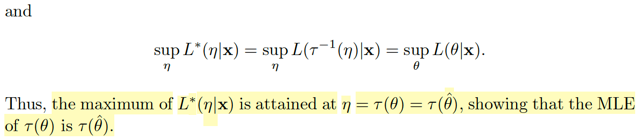</kbd>

<kbd></kbd>

<kbd>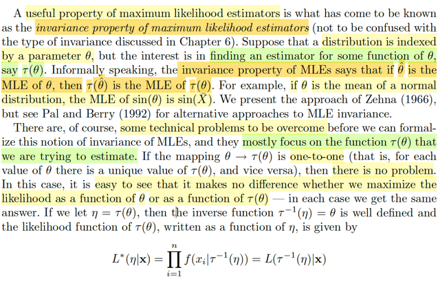</kbd>

> [!NOTE]
> Rồi, đoạn này đại khái là, tác giả nói về một tính chất của MLE là tính bất biến
> (invariance property).
>
> Giả sử ta có một distribution param bởi θ, nhưng ta lại quan tâm đến việc tìm
> một estimator của một hàm của θ thay vì bản thân θ, gọi là τ(θ) thì tính bất biến
> của MLE nói rằng: Nếu θ^ là maximum likelihood estimator của θ thì t(θ^) cũng
> sẽ là maximum likelihood estimator của τ(θ) luôn.
>
> Thế thì ông cho rằng có một số thách thức cần vượt qua trước khi ta có thể
> chính thức hóa phát biểu trên, Nhưng xét trường hợp dễ trước, đó là khi τ là
> hàm có tính chất là map 1-1 từ θ → η = τ(θ)
>
> Đặt η = τ(θ) và τ là hàm 1-1 và trong đó hàm τ_inv cũng well define. Tức
> ý là nếu ta có η = τ(θ) thì θ = τ_inv(η). 
>
> Và giả sử tìm được θmle khiến maximize L(θ|**x**) thì cũng sẽ chỉ tương ứng duy
> nhất với một η thôi.
>
> Thử derive hàm likelihood của τ(θ):
>
> Theo định nghĩa thôi, nhớ lại, likelihood của θ, kí hiệu L(θ|**x**) được định nghĩa 
> bởi f(**x**|θ). 
>
> Thì likelihood của η = τ(θ), sẽ kí hiệu là L*(η|**x**) sẽ được định nghĩa bởi: 
>
> Giá trị của joint pdf/pmf tính toán tại observed values **x** và **tại θ sao cho** 
> τ(θ) = η ⇔ θ = τinv(η).
>
> ⇨ L*(η|**x)**= f(**x**|τinv(η)) 
>
> = L(τinv(η)|**x**)
>
> Rồi, thế thì với likelihood của τ(θ) định nghĩa như vậy thì để tìm maximum 
> likelihood estimator thì ta cũng sẽ tìm τ(θ) sao cho maximize nó:
>
> Bắc cầu qua f(x|τinv(η)) ta sẽ có:
>
> Maximize over η L*(η|**x**) = maximize over η f(**x**|τinv(η)) 
>
> = maximize over θ f(x|θ)
>
> Nên sup_η L*(η|x) = sup_η f(**x**|τinv(η)) = sup_θ f(**x**|θ) = sup_θ L(θ|**x**) 
>
> ⇨ argmax_η L*(η|x) = τ(argmax_θ L(θ|x)
>
> Hay η_mle, cũng là τ(θ)_mle chính là τ(θ_mle)

 

<kbd>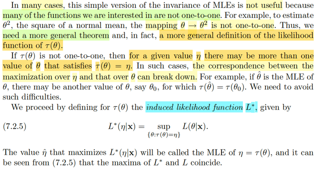</kbd>

> [!NOTE]
> Đại khái là, trong nhiều trường hợp thì phiên bản đơn giản của tính bất biến
> của MLE không có ích gì cho lắm bởi vì hàm τ không phải là hàm one-to-one
>
> Nhắc lại chút xíu, phiên bản đơn giản vừa nói ý là, nếu như ta có hàm τ(.) 
> là one-to-one function. Thì khi ta có θ_mle là MLE của θ, thì τ(θ_mle) chính
> là MLE của τ(θ).
>
> Nhưng khi τ không phải là hàm one-to-one thì đại ý là với một giá trị η thì có
> thể có nhiều θ khiến τ(θ) = η. Điều này khiến cho lập luận giúp liên quan giữa
> MLE của θ và τ(θ) ở trên bị bẻ gãy. Là sao nhỉ?
>
> Nhắc lại lập luận trước: Nơi mà ta định nghĩa ra hàm likelihood của τ(θ):
>
> L*(τ(θ)|**x**), tức L*(η|**x**) chính là f(**x**|τinv(η))
>
> Và nếu τ là hàm one-to-one thì θ: τ(θ) = η cũng chính là θ = τinv(η)
>
> ⇨ sup_η L*(η|**x**) = sup_η f(**x**|τinv(η)) 
>
> = sup_θ f(**x**|θ) 
>
> = sup_θ L(θ|**x**) = L(θ_mle|**x**)
>
> Do đó. η khiến L*(η|**x**) đạt max khi θ = θ_mle, ⇨ η = τ(θ_mle) chính là η_mle
> giúp kết luận MLE của τ(θ) chính là τ(θ_mle)
>
> Tuy nhiên nếu như τ không phải hàm one-to-one thì cái logic bị gãy ở chỗ
>
> sup_η L*(η|x) không còn bằng f(x|τinv(η))
>
> Lí do, lúc này τinv(η) không còn là một điểm, mà có thể có nhiều θ có cùng
> giá trị tau(θ) = η. Ví dụ như θ1, θ2 đều có τ(θ1) = τ(θ2) = η và f(x|θ1) có thể
> khác f(x|θ2)
>
> Vậy quay lại đây, phải có cách khác. Và do đó ta sẽ dùng một định nghĩa khác
> của likelihood function của τ(θ): Gọi là induced likelihood function L*:
>
> L*(η|x) = sup_{θ: τ(θ) = η} L(θ|**x**)
>
> mang ý nghĩa là tìm trong các θ khiến τ(θ) = η xem cái nào khiến L(θ|**x**) lớn 
> nhất, L(θ|x) với θ đó chính là L*(η|x)
>
> Và khi đó η^ khiến maximize L*(η|x) được gọi là MLE của η = τ(θ)

 

<kbd>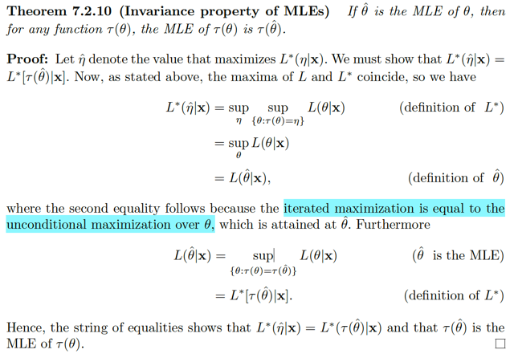</kbd>

> [!NOTE]
> Theorem này nói nói rằng, với các định nghĩa hàm L*(η|x) như vậy thì
> nếu θ^ là MLE của θ thì với mọi hàm τ (không cần phải one-to-one) thì ta
> có τ(θ^) chính là MLE của τ(θ).
>
> Chứng minh đại khái là vầy:
>
> Xét hàm L*(η|x), theo định nghĩa, nó bằng sup_{θ: τ(θ) = η} L(θ|x)
>
> Nên để tìm η_mle, hay η^ ta sẽ maximize over η L*(η|x). Cũng chính là
> η^ = sup_η {sup_{θ: τ(θ) = η} L(θ|x)}
>
> mà cái này, y như ta có η có các giá trị η1, η2. Với θ11, θ12 có τ(θ1i) = η1
> và θ21, θ22 có τ(θ2i) = η2. Thì tìm trong các giá trị η1, η2 xem cái nào
> khiến L(θ|x) lớn nhất thì cũng y như là, chỉ như là tìm trong mấy cái θ11,
> θ12, θ21, θ22 thôi.
>
> Tức là sup_η {sup_{θ: τ(θ) = η} L(θ|x)} chỉ là sup_θ L(θ|x) mà thôi.
>
> Và cái này thì dĩ nhiên chính là θ_mle hay θ^.
>
> Do đó, 
>
> L*(η|x) = sup_{θ: τ(θ) = η} L(θ|x) = sup_η {sup_{θ: τ(θ) = η} L(θ|x)} = L(θ^|x)
>
> Xét L(θ^|x) thì như vừa nói ở trên, giờ nói lại: 
>
> L(θ^|x) = sup_θ L(θ|x), tức là tìm trong hết mọi θ, cái nào khiến L(θ|x) lớn
> nhất.
>
> Thì cái θ^ là là đại ca trong cả đám lớn thì nó cũng là đại ca trong số những
> θ có chung τ(θ) với nó.
>
> ⇨ L(θ^|x) = sup_{θ: τ(θ) = τ(θ^)} L(θ|x)
>
> Và cái vế phải, theo định nghĩa của hàm L*(η|x) = sup_{θ: τ(θ) = η} L(θ|x)
> thì chính là L*(τ(θ^)|x)
>
> Vậy chứng minh xong L*(τ(θ)|x) = L(θ^|x)

 

<kbd>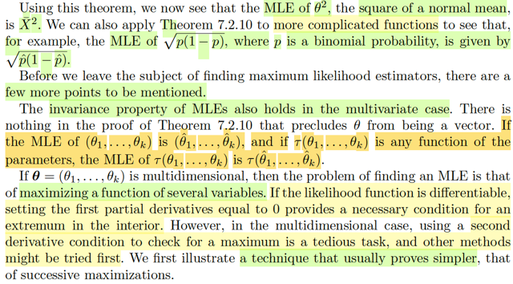</kbd>

> [!NOTE]
> Rồi đại ý là, với theorem vừa rồi thì ta có thể nói rằng MLE của θ^2, tức
> MLE của hàm square apply lên population mean của normal(θ, σ^2) chính
> là  [Xbar(**X**)]^2
>
> Và MLE của √[p(1-p)] với p là binomial probability cũng sẽ chính là
> √[p^(1-p^)]
>
> Rồi. Cuối cùng tác giả cho biết cái theorem vừa rồi không hề chừa case đa
> biến ra. Có nghĩa là nó vẫn đúng với case đa biến.
>
> Tức là khi ta có parameter vector **θ**= (θ1, ...θk) có MLE là θ^ = (θ1^,...
> θk^) thì τ(**θ^**) = τ(θ1^, ...θk^) cũng chính là MLE của τ(**θ**)
>
> Và với hàm likelihood đa biến mà khả vi thì để tìm **θ^**ta cũng lấy đạo
> hàm cấp 1 (vector gradient) và cho nó bằng 0 (điều kiện cần bậc 1)
>
> Có thể dùng thêm Hessian (Nhờ học tối ưu mà ta biết điều kiện đủ bậc 2:
> Là Hessian tại đó xác định âm (vì đang tìm max)

 

<kbd>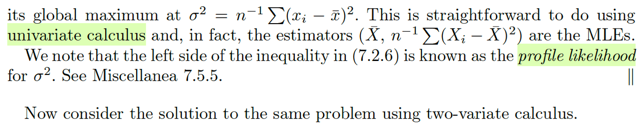</kbd>

<kbd></kbd>

<kbd>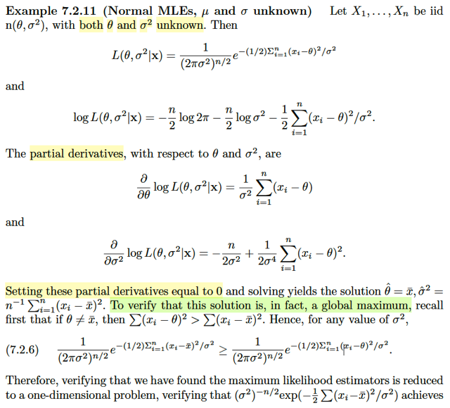</kbd>

> [!NOTE]
> Rồi, ví dụ này, ta có X1,..Xn là iid n(θ, σ^2) với cả θ và σ^2 chưa biết.
>
> Likelihood function L(θ, σ^2|x) theo định nghĩa = f(**x**|θ, σ^2) (dĩ nhiên L lúc này
> là hàm nhị biến)
>
> nhờ tính iid, joint pdf = tích marginal pdf 
>
> .. = Πi=1:n f(xi|θ,σ^2) = ...
>
> = 1/(2πσ^2)^(n/2) exp[-(1/2) Σi=1:n (xi - θ)^2/σ^2]
>
> Tiếp, như đã biết, để tìm **Θmle**= sup_(θ, σ^2) {L(θ, σ^2)} thì ta sẽ giải bài toán
> maximize over (θ, σ^2) f(**x**|θ, σ^2)
>
> Chuyển thành bài toán tương đương do hàm log đồng biến
>
> là bài toán: maximize over (θ, σ^2) {G(θ, σ^2) = log f(x|θ, σ^2))
>
> = - (n/2) log2π - (n/2) logσ^2 - (1/2) Σi=1:n (xi - θ)^2 / σ^2
>
> Điều kiện đủ bậc 1: Gradient = 0
>
> d/dθ G(θ, σ^2) = d/dθ [- (n/2) log2π - (n/2) logσ^2 - (1/2) Σi=1:n (xi - θ)^2 / σ^2]
>
> = - (1/2) d/dθ [ Σi=1:n (xi - θ)^2 / σ^2]
>
> = - (1/2σ^2) d/dθ [ Σi=1:n (xi - θ)^2 ]
>
> = - (1/2σ^2) Σi=1:n d/dθ(xi - θ)^2 
>
> = - (1/2σ^2) Σi=1:n 2(xi - θ)(-1)
>
> = (1/σ^2) Σi=1:n (xi - θ)
>
> d/dσ^2 G(θ, σ^2) = d/dσ^2 [- (n/2) log2π - (n/2) logσ^2 - (1/2) Σi=1:n (xi - θ)^2 / σ^2]
>
> = d/dσ^2 [-(n/2) logσ^2] - d/dσ^2 [(1/2) Σi=1:n (xi - θ)^2 / σ^2]
>
> = (-n/2) 1/σ^2] - (1/2) Σi=1:n (xi - θ)^2 { d/dσ^2 [1 / σ^2] }
>
> = -n/2σ^2 - (1/2) Σi=1:n (xi - θ)^2 { d/dσ^2 [-1 / σ^4] }
>
> = -n/2σ^2 - (1/2σ^4) Σi=1:n (xi - θ)^2
>
> Cho gradient bằng 0 ta có:
>
> (1/σ^2) Σi=1:n (xi - θ) = 0
>
> ⇔ θ = (Σxi) / n = xbar
>
> Hay θ^ tức estimator của θ = xbar 
>
> và -n/2σ^2 - (1/2σ^4) Σi=1:n (xi - θ)^2 = 0
>
> ⇔ σ^2 = n^-1 Σi (xi - xbar)^2 
>
> Hay (σ^2)^ tức estimator của σ^2 = n^-1 Σi (xi - xbar)^2
>
> Dĩ nhiên, chưa xong, chưa thể kết luận θ^, (σ^2)^ là mle của (θ, σ^2) vì còn pảhi check
> Hessian nữa
>
> Rồi, tới đây, chú ý là ta có **Θ^** = (xbar,  n^-1 Σi (xi - xbar)^2) là điểm mà gradient = 0.
>
> Để chứng minh nó là điểm khiến L maximum thì ta phải xét Hessian.
>
> Tuy nhiên ở đây tác giả dùng một mẹo:
>
> Đó là: Xét hàm likelihood: 1/(2πσ^2)^(n/2) exp[-(1/2) Σi=1:n (xi - θ)^2/σ^2]
>
> thì xét cái exp:
>
> exp[-(1/2) Σi=1:n (xi - θ)^2/σ^2]
>
> Cụ thể hơn xét cái Σi=1:n (xi - θ)^2, ta thấy nó sẽ luôn ≤ Σi=1:n (xi - xbar)^2 
>
> Lí do: Chỉ cần giải bài toán maximize g(θ) = Σi (xi - θ)^2:
>
> g'(θ) = -2 Σi (xi - θ)
>
> ⇨ g'(θ) = 0 ⇔ θ = (Σi xi) / n = xbar.
>
> Vậy nên 1/(2πσ^2)^(n/2) exp[-(1/2) Σi=1:n (xi - θ)^2/σ^2]
>
> luôn ≤ 1/(2πσ^2)^(n/2) exp[-(1/2) Σi=1:n (xi - xbar)^2/σ^2]
>
> Do đó việc chứng minh chỉ cần chứng minh hàm đạt max tại σ^2 = n^-1 Σi (xi - xbar)^2
> thôi.
>
> Và cũng dễ dàng dùng đạo hàm để chứng minh, bằng cách chứng minh đạo hàm cấp
> 2 tai (σ^)^2 là âm
>
> CÁI NÀY CÓ MỘT KHÁI NIỆM MỚI PROFILE LIKELIHOOD của σ^2

 

<kbd>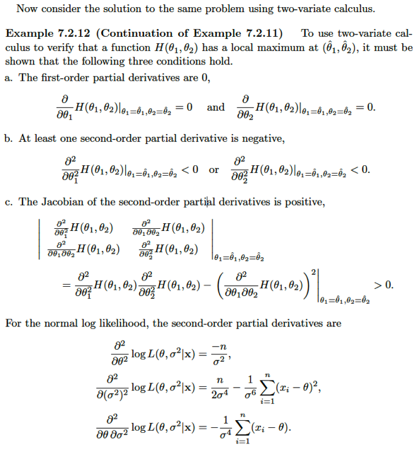</kbd>

> [!NOTE]
> ở đây tác giả xét hàm H(θ1, θ2) và ông cho rằng để check xem tại 
> (θ^1, θ^2) có phải là local maximum không thì ta phải check:
>
> 1) Gradient tại đó = 0: Cái này như đã biết, là điều kiện cần bậc 1
>
> 2) Có ít nhất một đạo hàm riêng cấp hai âm: 
>
> Tức ∂/∂θ1^2 H(θ1,θ2)|θ1=θ^1, θ2=θ^2 âm hoặc
>
> ∂/∂θ2^2 H(θ1,θ2)|θ1=θ^1, θ2=θ^2
>
> 3) det của Hessian tại (θ^1, θ^2) dương.
>
> Là sao nhỉ?
>
> Có nghĩa là đang nói về Hessian ∇^2H(θ^1,θ^2) , và điều trên có 
> nghĩa là  phần tử 11 hoặc 22 của Hessian tại (θ^1, θ^2) phải âm. 
> Thì ta đã biết, số lượng entries đường chéo dương hay âm sẽ 
> tương ứng với số lượng trị riêng dương hay âm. Nên cái này đồng
> nghĩa phải có ít nhất một trị riêng âm
>
>
> Mà det ∇^2H(θ^1,θ^2) dương có nghĩa là tích hai eigenvalue 
> dương, và cộng với ý trên ta sẽ có hai eigenvalue đều âm. Đây chính
> là cho thấy matrix Hessian xác định âm ⇨ Theo điều kiện đủ bậc
> hai thì đây giúp kết luận (θ^1, θ^2) là maximum

 

<kbd>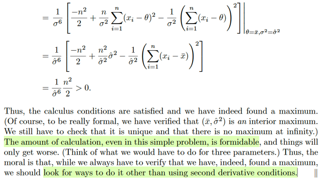</kbd>

<kbd></kbd>

<kbd>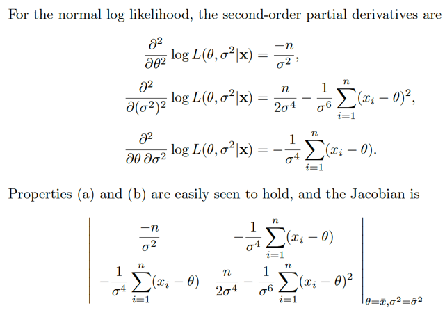</kbd>

🔗 **Related:** [7.3 METHODS OF EVALUATING ESTIMATORS](73_methods_of_evaluating_estimators.md#node-604)

> [!NOTE]
> Với normal log likelihood tức function L(θ, σ^2|**x**) đóng vài H(θ1, θ2) thì
> đoạn này đại ý là ta có thể check 3 điều kiện trên để thấy đúng là θ^ = xbar
> và (σ^2)^ = n^-1 Σi (xi - xbar)^2) thỏa điều kiện để kết luận nó là mle.
>
> Nhưng ý chính gs nói là có thể thấy tính toán rất dài. Do đó nên hạn chế tính
> Hessian

 

<kbd>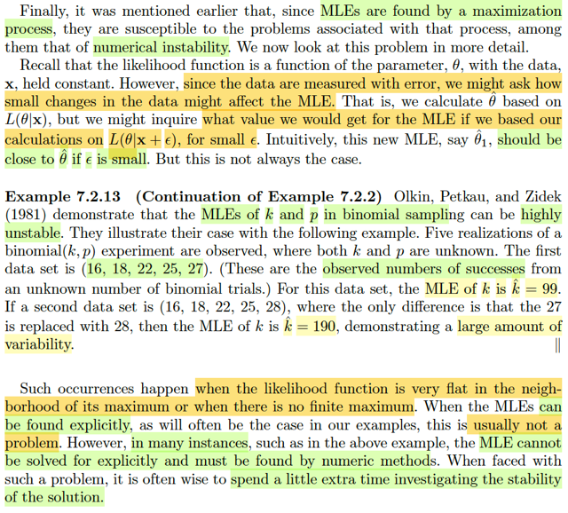</kbd>

> [!NOTE]
> Đoạn này đại ý là, vì MLE được tìm từ việc giải một bài toán tối ưu, nên nó sẽ
> bị một vấn đề liên quan đến numerical instability.
>
> Đại khái là, như đã biết để tìm MLE, ta sẽ tối ưu hàm L(θ|**x**). Thế thì, câu hỏi
> là nếu như observed value có biến động nhỏ do sai số, ví dụ như lần quan sát
> đầu tiên cho ra **X** = **x**, rồi giải bài toàn tối ưu ta có **θ**_mle1. Sau đó vì lí
> do gì đó lần quan sát thứ hai ta có **X** = **x** + **ε**. giải bài toán tối ưu ta có
> **θ**_mle2 Câu hỏi là, hai mle có gần nhau hay ko, nếu **ε** chỉ nhỏ thôi.
>
> Câu trả lời, gs cho biết ko phải lúc nào cũng vậy (đây sẽ lót nền cho việc check
> hay evaluate các estimator, mà hình như mình đã biết, đây là nói về tính
> Stability / Robustness)
>
> Gs cho ví dụ để thấy với hai bộ giá trị quan sát được của một binomial(k, p) chỉ
> khác nhau chút xíu mà mle của k khác nhau rất xa.
>
> Cuối cùng tg cho rằng, nếu MLE được tìm theo cách explicitly thì vấn đề này
> thường là không sao. Nhưng trong hầu hết trường hợp MLE được tìm thấy
> bằng numeric method (mình đoán ý tg nói về cách tìm MLE theo công thức
> vs tìm MLE bằng các thuật toán) thì cần phải check.
>
> Ông cũng nói, cái này là do likelihood function nó quá phẳng quanh lân cận
> của maximum

 

<kbd>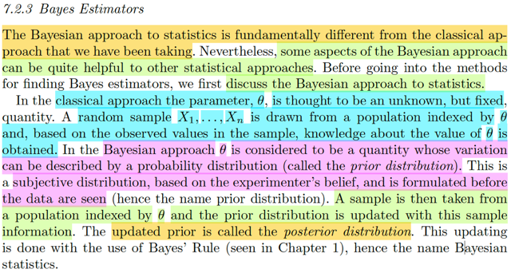</kbd>

> [!NOTE]
> Qua một Estimator quan trọng nữa mà gặp hoài trong AI: Bayes estimator.
>
> Đầu tiên tác giả cho rằng nên bàn một chút về Bayesian approach đối với
> statistic.
>
> Đại ý là theo trường phái cổ điển trong statistic. ta cho rằng parameter θ 
> là giá trị cố định nhưng chưa biết. Và random sample X1,...Xn được sampling
> từ distribution với tham số θ này. Từ đó hiểu biết của ta về θ sẽ có thể được
> lấy ra bằng cách phân tích giá trị của observed value.
>
> Nhưng với Bayesian approach. Thì tiếp cận theo cách khác, cho rằng θ là 
> một đại lượng có tính chất biến động, nói chung nó chính là variable. 
> Có distribution gọi là prior distribution. Và distribution này mang tính chất chủ
> quan, dựa trên kinh nghiệm của niềm tin của experimenter.
>
> Rồi, một random sample được lấy từ population indexed bởi θ. Và từ đó prior
> distribution được cập nhật lại dùng Bayes's rule. Để có posterior distribution
> Do đó cách tiếp cận này có tên là Bayesian approach là vậy.

 

<kbd>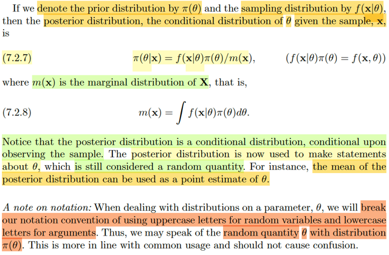</kbd>

> [!NOTE]
> Rồi, thế thì ta sẽ kí hiệu π(θ) là prior distribution của θ. (nó giống như f(θ) thôi) 
> và kí hiệu f(**x**|θ) là sampling distribution (population distribution của random
> sample **X** thôi). Và m(**x**) là marginal distribution của **X**:
>
> m(**x**) = ∫f(**x**|θ)π(θ)dθ 
>
>
> Khi đó posterior distribution, tức π(θ|**x**) sẽ là:
>
> π(θ|**x**) = f(**x**|θ)π(θ)/m(**x**)
>
> Gs lưu ý. posterior distribution là một conditional distribution, dựa trên (condition
> on observed sample).
>
> Và ta sẽ dùng posterior distribution để đưa ra các nhận định về θ. Và do đó,
> đối xử với nó như random variable. Ví dụ như mean của posterior distribution
> có thể được dùng làm point estimate của θ. 
>
> Một lưu ý khác, là tại đây ta bắt đầu không còn tuân theo rule là viết hoa cho
> random variable, viết thường cho argument (tức giá trị quan sát / cụ thể của
> random variable) nữa. Ví dụ X cho random variable và x cho value của nó.
> Vì bây giờ θ cũng là lower case luôn nhưng nó được đối xử như random variable

 

<kbd>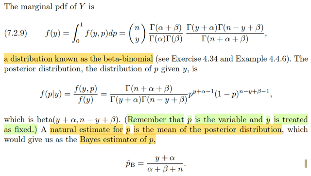</kbd>

<kbd></kbd>

<kbd>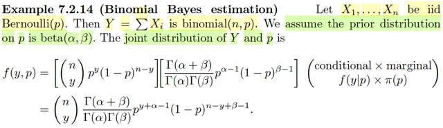</kbd>

> [!NOTE]
> Rồi, qua ví dụ này, cho X1,....Xn là iid Bern(p). Với Y = ΣXi thì nó sẽ là 
> binomial(n, p) (nhờ gs Joe Blizstein của Stat110 thì quá hiểu cái này rồi)
> Thế thì TA GIẢ ĐỊNH PRIOR DISTRIBUTION CỦA p LÀ BETA(α, β)
>
> Khi đó, joint distribution của Y và p là như sau:
>
> Ta có nhớ công thức joint pdf/pmf fX,Y(x,y) = fX|Y(x|y)f(y)
>
> ⇨ fY,p(y,p) = fY|p(y|p) fp(p)
>
> fY|p(y|p), là pmf của Y, dựa trên việc biết p, thì Y như đã nói, là binomial(n,p)
>
> ⇨ fY|p(y|p) = (n choose y) p^y (1-p)^(n-y)
>
> fp(p) là prior distribution của p, đang giả định là một Beta(α, β) rv
>
> → fp(p) = [Γ(α + β) / Γ(α) Γ(β)] p^(α-1)(1-p)^(β-1)
>
> ⇨  fY,p(y,p) = fY|p(y|p) fp(p)
>
> = (n choose y) p^y (1-p)^(n-y) [Γ(α + β) / Γ(α) Γ(β)] p^(α-1)(1-p)^(β-1)
>
> = (n choose y) [Γ(α + β) / Γ(α) Γ(β)] p^(y+α-1) (1-p)^(n-y+β-1)
>
> Rồi. Về marginal pdf của Y, như đã biết ta sẽ marginalizing mọi giá trị của p
> đối với joint distribution f(y, p):
>
> fY(y) = ∫0:1 f(y,p)dp
>
> = ∫0:1(n choose p) [Γ(α + β) / Γ(α) Γ(β)] p^(y+α-1) (1-p)^(n-y+β-1)dp
>
> = (n choose y) [Γ(α + β) / Γ(α) Γ(β)] ∫0:1 p^(y+α-1) (1-p)^(n-y+β-1)dp
>
> Xét ∫0:1 p^(y+α-1) (1-p)^(n-y+β-1)dp
>
> như đã làm nhiều lần trước các chương trước, ta sẽ nhận ra trong tích phân
> là kernel của một cái Βeta pdf với tham số là y + α và n - y + β.
>
> Do đó nhân thêm và chia bớt cho normalizing constant thì ta sẽ có pdf, và
> tích phân này phải bằng 1 vì tính valid của pdf
>
> Do đó kết quả là
>
> f(y) = (n choose y) [Γ(α + β) Γ(y + α) Γ(n - y + β) / Γ(α) Γ(β) Γ(y + α + n - y + β) 
>
> Đây chính là kết quả 7.2.9
>
> Và đây là một cái distribution có tên là β-binomial.
>
> ====
>
> Rồi tiếp, ta có posterior distribution f(p|y) = f(y,p)/f(y)
>
> = (n choose y) [Γ(α + β) / Γ(α) Γ(β)] p^(y+α-1) (1-p)^(n-y+β-1)
> / (n choose y) [Γ(α + β) Γ(y + α) Γ(n - y + β) / Γ(α) Γ(β) Γ(y + α + n - y + β) 
>
> = p^(y+α-1) (1-p)^(n-y+β-1) /  [ Γ(y + α) Γ(n - y + β) / Γ(y + α + n - y + β) ]
>
> = [ Γ(y + α + n - y + β) / Γ(y + α) Γ(n - y + β)] p^(y+α-1) (1-p)^(n-y+β-1) 
>
> Và đây chính là pdf của β(y+α, n-y+β)
>
> Chú ý y là fixed, vì đây là observed value của Y. Nên ý nghĩa của cái này là:
>
> BẮT ĐẦU TỪ VIỆC VIỆC GIẢ ĐỊNH PRIOR DISTRIBUTION CỦA p là β(α, β) 
> THÌ DỰA TRÊN VIỆC QUAN SÁT THẤY GIÁ TRỊ CỦA Y = y TA CÓ p  LÀ 
> MỘT β(y+α, n-y+β)
>
> Để rồi GS CHO RẰNG, THEO LẼ THƯỜNG, TA SẼ ESTIMATE (TỨC LÀ
> ƯỚC LƯỢNG GIÁ TRỊ CỦA p - VỒN DĨ TRONG TRƯỜNG HỢP NÀY LÀ 
> MỘT RANDOM VARIABLE BẰNG CÁCH TÍNH KÌ VỌNG.
>
> E[p], và kì vọng của β(y+α, n-y+β) thì ta đã biết công thức, là (y + α) / (α + β + n)
>
> VÀ ĐÂY LÀ CÁI MÀ TA GỌI LÀ BAYES ESTIMATOR CỦA p, kí hiệu p^_B
>
> (y như ML Estimator: p^_mle vậy)
>
> Chú ý cái này nhìn vậy mà phải hiểu sâu một chút: Điểm quan trọng cần nhắc
> lại là, trong cách tiếp cận theo phương pháp Bayesian đối với parameter p. Thì
> ta coi nó như random variable. Chứ không còn là fixed but unknown quantity
> như cách làm cổ điển nữa.
>
> Để rồi cái mà ta tìm ra, xây dựng ra sẽ là một distribution của p conditioned on
> observed sample. f(p|y). Và vì nó là một phân phối xác suất, nên để estimate
>  một điểm giá trị của nó thì lẽ tự nhiên nhất chính là lấy mean.

 

<kbd>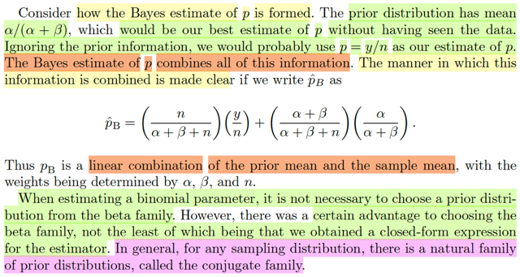</kbd>

> [!NOTE]
> Qua!, cái này quá hay. Đại ý là nhìn vào cách mà Bayes estimate được
> hình thành ta sẽ thấy rất nhiều điều quan trọng:
>
> prior distribution là β(α, β) có mean là α/(α+β) (tức ban đầu ta đoán theo
> kinh nghiệm p là một β(α, β), và point estimate value (tạm hiểu là ước
> lượng giá trị điểm) của nó sẽ là α/(α+β).
>
> Còn nếu chỉ dựa trên observed value của Y = y, thì khả năng cao ta sẽ dùng
> y/n, chính là sample mean (vì y/ = Σxi /n) để estimate cho p.
>
> Thế thì Bayes estimate kết hợp các thông tin này lại với nhau: Và để thấy rõ
> ta sẽ thể hiện (y + α) / (α + β + n) bằng:
>
> (y + α) / (α + β + n) = [(n) / (α + β + n)] (y/n) + [(α + β) / (α + β + n)] [α / (α +
> β)]
>
> Cho thấy rõ đây là linear combination của α/(α+β) và (y/n), là prior mean và
> sample mean.
>
> Một điểm quan trọng nữa: Khi estimate parameter của binomial thì TUY
> RẰNG KHÔNG NHẤT THIẾT PHẢI CHỌN PRIOR DISTRIBUTION LÀ
> ΒETA
>
> NHƯNG CÓ NHỮNG LỢI THẾ NHẤT ĐỊNH KHI LÀM VẬY.
>
> VÀ **NÓI CHUNG, VỚI BẤT KÌ MỘT SAMPLING DISTRIBUTION NÀO,
> THÌ LUÔN CÓ MỘT HỌ CÁC DISTRIBUTION MÀ TỎ RA LÀ LỰA CHỌN
> TỰ NHIÊN NHẤT ĐỂ LÀM PRIOR. VÀ ĐÓ GỌI LÀ CONJUGATE FAMILY**

 

<kbd>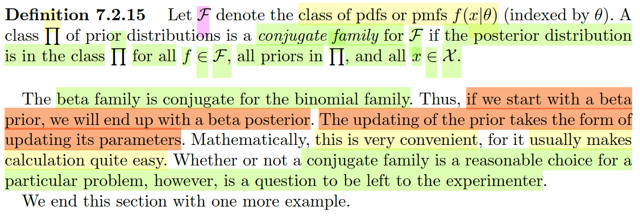</kbd>

> [!NOTE]
> Rồi, định nghĩa của conjugation family: Nói rằng, nếu gọi F cái loại của  pdf
> / pmf  f(x|θ). Thì nếu với mọi f ∈ F, khi ta dùng prior distribution thuộc loại Π
> và với mọi x ∈ \/X\/ (range của X) đều cho ra posterior distribution  cũng là
> thuộc loại Π. Thì khi đó Π gọi là CONJUGATE FAMILY CỦA F
>
> Như hồi nãy đã nói, beta family là conjugate family của binomial. Nên ta đã
> thấy posterior distribution cũng là beta chỉ khác cái param thôi. Do đó mới
> nói việc updating prior chỉ đơn giản là update lại param
>
> Và giáo sư nói việc này MANG NHIỀU LỢI ÍCH VỀ MẶT TOÁN HỌC, VÌ
> NÓ KHIẾN TÍNH TOÁN DỄ.
>
> NHƯNG CÓ NÊN CHỌN PRIOR DISTRIBUTION BẰNG CÁCH DÙNG
> CONJUGATE FAMILY HAY KHÔNG THÌ CHƯA CHẮC, VÌ NHƯ ĐÃ NÓI
> PRIOR DISTRIBUTION ĐƯỢC CHỌN LÀ DỰA TRÊN KINH NGHIỆM
> CỦA EXPERIMENTER.

 

<kbd>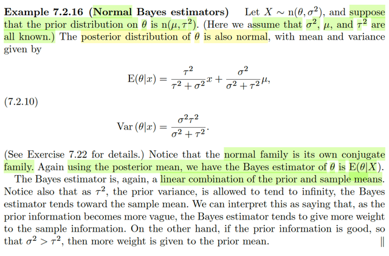</kbd>

🔗 **Related:** [7.3 METHODS OF EVALUATING ESTIMATORS](73_methods_of_evaluating_estimators.md#node-660)

> [!NOTE]
> Qua ví dụ này, cho X ~ n(θ, σ^2) và cho rằng prior distribution của θ là n(μ,
> τ^2)
>
> Ôn lại một chút về cái Bayes estimator. Ý tưởng của Bayesian statistic
> khác với classical statistic ở chỗ: Thay vì coi parameter θ  là fixed nhưng
> chưa biết mà ta sẽ tìm cách biết về nó thông qua thông tin từ sample. Thì
> với Bayesian statistic ta coi parameter cũng là đại lượng có tính biến động
> (nôm na tức là coi nó như random variable luôn) Để rồi cái mà ta đi tìm /
> ước lượng / xây  dựng là cái distribution của nó.
>
> Thế thì, quay lại classical approach, mà điển hình là maximum likelihood
> estimator, trong đó idea là: Ta định nghĩa ra hàm likelihood L(θ|**x**) tính
> bằng joint pdf/pmf của random sample **X** tại observed value **x**:
> ****L(**θ**|x) =****f(**x**|θ), mà ví dụ như giá trị hàm likelihood tại θ^, tức L(θ^|**x**) mang ý  
> nghĩa là độ hợp lý của θ^ (khi dùng để estimate cho θ) khi quan sát được 
> giá trị **x**Để rồi, bằng cách giải bài toán tối ưu, maximize over θ L(θ|**x**), ta sẽ có
> MLE, dĩ nhiên thỏa định nghĩa của Estimator: Là một function của random
> sample X1,...Xn, kí hiệu là: 
>
> θ_mle(**X**) = argmax_θ {L(θ|**x**)}
>
> Và với cái estimator này, (là một function) thì với 1 điểm giá trị của sample
> (**x**) thì ta sẽ có một estimate (chính là point estimate) cho θ,
>
> Quay lại Bayesian approach, như đã nói ta coi θ như random variable, có
> distribution. Để rồi, nếu chưa quan sát giá trị của sample, ta sẽ chọn một
> distribution tiên khởi (prior distribution) cho θ. Kí hiệu là π(θ). Và với việc
> có gía trị quan sát **X** = **x** ta sẽ update distribution của θ, mà thông qua hình
> thức là xây dựng f(θ|**x**) nhờ Bayes rule:
>
> π(θ|**x**) = f(**x**|θ)π(θ)/m(**x**) 
>
> Và kết quả này, là một distribution của **θ** dựa trên quan sát giá trị của sample
> Để rồi, lẽ tự nhiên ta sẽ lấy mean của distribution tức Expectation, làm
> point estimate cho θ: Và đó chính là Bayes estimator, dĩ nhiên, f(θ|**x**) là 
> phân phối dựa trên **x**, lấy kì vọng ta sẽ có hàm theo **x**
>
> θ^_B(**X**) = E[θ|**x**] với θ ~ π(θ|**x**)
>
> Thế thì, nhớ lại vụ chọn prior, tác giả nói cái này phụ thuộc kinh nghiệm
> của experimenter. Tuy nhiên, nếu ta chọn phân phối prior thuộc cái loại
> gọi là conjugate family của sample distribution. Ví dụ, random sample
> thuộc loại binomial, và ta chọn prior cho p là beta thì posterior distribution
> cũng sẽ ra loại beta. Điều này rất tiện cho tính toán, nhưng chú ý là nó
> không chứng tỏ việc chọn conjugate là tốt.

> [!NOTE]
> Rồi, quay lại ví dụ này, ta có X ~ n(θ, σ^2),  và prior distribution cho θ
> là n(μ, τ^2) thử tính Bayes estimator cho θ:
>
> Chú ý, trong ví dụ này đang nói random sample size n = 1, nên chỉ có độc
> nhất một thằng X thôi.
>
> Prior distribution là n(μ, τ^2): π(θ) = 1/√2πτ exp[-(θ-μ)^2/(2τ^2)]
>
> Joint pdf của sample, X ~ n(θ, σ^2): 
>
> f(**x**|θ,σ^2) = Πi=1:n 1/√2πσ exp[-(x-θ)^2/(2σ^2)]
>
> = 1/√2πσ exp[-(x-θ)^2/(2σ^2)] (vì n = 1)
>
> Joint pdf của **x**và θ:
>
> f(**x**, θ) = f(**x**|θ)π(θ) 
>
> f(**x**) = ∫f(**x**, θ)dθ, tức marginalizing over mọi possible value của θ 
>
> posterior distribution của θ:
>
> π(θ|**x**) = f(**x**|θ) π(θ) / f(**x**) 
>
> Thế thì đến đây, nên nhớ mục đích là đi tìm dạng của π(θ|**x**) để xem
> nó thuộc distribution family nào. Ta sẽ dùng kernel trick:
>
> Đầu tiên để ý, f(**x**), dù đúng là ∫f(**x**, θ)dθ, nhưng nó chỉ là constant.
> Vì **x**là một giá trị quan sát thấy, đã biết. Và dĩ nhiên là nó là constant
> không âm.
>
> Nên π(θ|**x**) = [constant không âm] f(**x**|θ) π(θ)
>
> ⇨ π(θ|**x**) sẽ **TỈ LỆ THUẬN** với f(**x**|θ) π(θ)
>
> Rồi, xét f(**x**|θ) π(θ)
>
> = 1/√2πσ exp[-(x-θ)^2/(2σ^2)] 1/√2πτ exp[-(θ-μ)^2/(2τ^2)]
>
> Ta cũng làm tương tự
>
> nó sẽ **TỈ LỆ THUẬN VỚI** 
>
> exp[-(x-θ)^2/(2σ^2)] exp[-(θ-μ)^2/(2τ^2)]
>
> = exp[-(x-θ)^2/(2σ^2) - (θ-μ)^2/(2τ^2)]
>
> Xét phần trong ngoặc: [-(x-θ)^2/(2σ^2) - (θ-μ)^2/(2τ^2)]
>
> = [-(x^2 - 2xθ + θ^2)/(2σ^2) - (θ^2-2θμ+μ^2)/(2τ^2)]
>
> = [-x^2/(2σ^2) + 2xθ/(2σ^2) - θ^2/(2σ^2) - θ^2/(2τ^2) + 2θμ/(2τ^2) - μ^2/(2τ^2)]
>
> = [- θ^2/(2σ^2) - θ^2/(2τ^2) + 2xθ/(2σ^2)  + 2θμ/(2τ^2) - x^2/(2σ^2) - μ^2/(2τ^2)]
>
> = -θ^2 [1/(2σ^2) + 1/(2τ^2)] + 2θ [x/(2σ^2) + μ/(2τ^2)] - x^2/(2σ^2) - μ^2/(2τ^2)] (1)
>
> Để cho dễ ta mượn lại pdf của n(μ, σ^2) để phân tích
>
> 1/√2πσ exp[-(x-θ)^2/(2σ^2)] 
>
> = 1/√2πσ exp[- (x^2 - 2xμ + μ^2)/(2σ^2)]
>
> = 1/√2πσ exp[- x^2/(2σ^2) + 2xμ/(2σ^2) - μ^2/(2σ^2)]
>
> = 1/√2πσ exp[- x^2/(2σ^2) + 2xμ/(2σ^2) - μ^2/(2σ^2)]
>
> tức là trong expo(..) sẽ có dạng:
>
> **-x^2[1/2Variance] + 2x Mean/2Variance - Mean^2/(2Variance)**
>
> Vậy ta sẽ khớp với (1) để tìm Mean và Variance của posterior distribution, nếu
> thành công có thể chứng tỏ nó cũng là normal
>
> Đầu tiên ta có:
>
> 1/2Variance = 1/(2σ^2) + 1/(2τ^2) = (τ^2 + σ^2) / 2τ^2σ^2
>
> ⇔ 1/Variance = (τ^2 + σ^2) / τ^2σ^2
>
> ⇔ **Variance =  τ^2σ^2 / (τ^2 + σ^2)**
>
> Mean/2Variance = [x/(2σ^2) + μ/(2τ^2)]
>
> ⇔ Mean = [x/(2σ^2) + μ/(2τ^2)] 2 Variance
>
> = [x/(2σ^2) + μ/(2τ^2)] 2 τ^2σ^2 / (τ^2 + σ^2)
>
> = (x/σ^2 + μ/τ^2) τ^2σ^2 / (τ^2 + σ^2)
>
> = (τ^2σ^2 x / σ^2 + τ^2σ^2 μ / τ^2) / (τ^2 + σ^2)
>
> = (τ^2x + σ^2μ) / (τ^2 + σ^2)
>
> = τ^2x / (τ^2 + σ^2) + σ^2μ / (τ^2 + σ^2) 
>
> = [τ^2 / (τ^2 + σ^2)]x + [σ^2 / (τ^2 + σ^2)]μ
>
> Và như vậy **posterior distribution của θ là n(mean, variance)** 
> với mean và variance như trên.
>
> Từ đó, để có Bayes estimator của θ, như đã nói, ta sẽ lấy mean của
> của distribution làm point estimator:
>
> ⇨ θ^_B(X) = [τ^2 / (τ^2 + σ^2)]X + [σ^2 / (τ^2 + σ^2)]μ
>
> hay với observed value x ta có giá trị Bayes estimate:
>
> θ^_B(x) = [τ^2 / (τ^2 + σ^2)]x + [σ^2 / (τ^2 + σ^2)]μ

 

<kbd>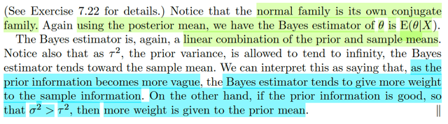</kbd>

> [!NOTE]
> Và có thể thấy Bayes estimator của θ cũng là linear combination của
> prior mean (μ) và sample mean (x, nhớ rằng ta đang xét random sample
> size n = 1 nên xbar chính là x)
>
> VÀ CUỐI CÙNG LÀ MỘT QUAN SÁT QUAN TRỌNG:
>
> NHÌN VÀO θ^_B(x) = [τ^2 / (τ^2 + σ^2)]x + [σ^2 / (τ^2 + σ^2)]μ
>
> TA SẼ THẤY: Như đã nói, nó là tổ hợp tuyến tính của sample mean và
> prior mean
>
> Để rồi: Nếu τ^2, tức prior variance rất lớn, → inf, thể hiện niềm tin ban
> đầu của ta về θ rất mơ hồ, ta không biết không chắc θ có giá trị ở đâu, vì
> lúc này phân phối normal như cái chuông dẹp lép như con tép và bề
> rộng kéo dài đến vô cùng, nhìn y như uniform distribution. Thì lúc đó,
> nhìn vào công thức của θ^_B(x) sẽ thấy, [τ^2 / (τ^2 + σ^2)] → 1, và [σ^2
> / (τ^2 + σ^2)] → 0. Cho thấy rằng, Bayes estimator sẽ đặt trọn vào / chỉ
> là gồm sample mean.
>
> Ngược lại, khi prior information là tốt, ước lượng tốt giá phân phối của θ,
> ví dụ như khi ta có τ^2 < σ^2, thì công thức Bayes estimator sẽ cho thấy
> trọng số của prior mean lớn hơn.
>
> Nói chung là có cái gì đó rất hợp lý trong này.

 

<kbd>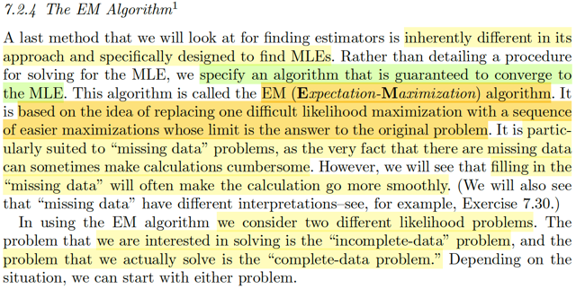</kbd>

> [!NOTE]
> Qua phần cuối, đại khái là ta sẽ nói về một PHƯƠNG PHÁP được design
> để tìm MLE. Và cách làm của nó là **thay vì tìm một quy trình để giải ra MLE,
> ta sẽ dùng cách tiếp cận iterative trong đó ta sẽ giải một chuỗi các bài toán
> tối ưu dễ hơn** và đảm bảo là solution của các bài táon này sẽ dần converges
> về MLE. 
>
> Thuật toán này gọi là **Expectation Maximization**. Và nó **đặc biệt phù hợp với
> những vấn đề bị thiếu dữ liệu.**

 

<kbd>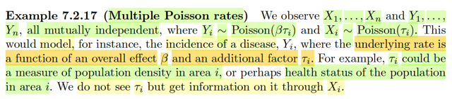</kbd>

> [!NOTE]
> Xét ví dụ này, ta quan sát X1,....Xn và Y1,....Yn đều mutually independent 
> Trong đó Yi ~ Pois(βτi) và Xi ~ Pois(τi)
>
> Đại khái hiểu như vầy: Ta thu thập được dữ liệu số ca mắc bệnh của 10
> quận: Y1,....Yn (n=10). Số ca bệnh là số nguyên không âm, ta cho rằng
> nó có phân phối Poisson có tham số như sau:
>
> Gọi τi là số dân mỗi quận (mà ta chưa biết chính xác) thì với một căn bệnh
> cụ thể mà xác suất xuất của nó gắn với tham số β thì quận càng đông dân
> thì xác suất xuất hiện ca bệnh càng lớn.
>
> Do đó, rất tự nhiên ta cho rằng Yi ~ Pois(β*τi) vì việc này phản ánh sự 
> hợp lý rằng quận càng đông thì số ca mắc bệnh càng lớn vì kì vọng của
> Yi sẽ là β*τi
>
> Rồi, τi là số dân mỗi quận, mà ta chưa biết, nhưng ta quan sát thấy Xi,...Xn
> là kết quả khảo sát dân số của mỗi quận. Đây cũng là số nguyên không âm
> nên ta cho rằng Xi ~ Pois(τi)

 

<kbd>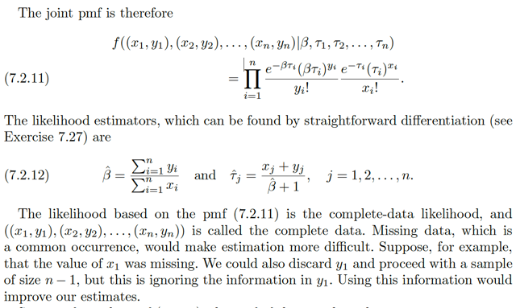</kbd>

> [!NOTE]
> Tiếp theo ta xây dựng joint pmf
>
> f((x1,y1), ...(xn,yn)|β, τ1,..τn)
>
> (có thể hiểu ta có các random variable vector **X1 =**(X1,Y1), ...**Xn** =
> (Xn, Yn)
>
> Với marginal pmf: f**Xi**((xi,yi)). Mà Xi, cũng mutually independent Yi nên
> joint pmf = tích marginal pmf: fXi(xi)fYi(yi)
>
> Thế công thức pmf của Pois(λ) f(x) = e^-λ λ^x / x!
>
> ⇨ pmf của Xi ~ Pois(τi): fXi(xi) = e^-(τi) τi^xi / xi!
>
> pmf của Yi ~ Pois(βτi): fYi(yi) = e^-(βτi) (βτi)^yi / yi!
>
> ⇨ fXi(xi)fYi(yi) = [e^-(τi) τi^xi / xi!] [e^-(βτi) (βτi)^yi / yi!]
>
> Dĩ nhiên các random variable vector **X1** = (X1,Y1), ...**Xn** = (Xn, Yn)
> cũng độc lập, nên joint pmf cũng bằng tích marginal pmf:
>
> f((x1,y1), ...(xn,yn)|β, τ1,..τn) = Πi=1:n [e^-(τi) τi^xi / xi!] [e^-(βτi) (βτi)^yi / yi!]
>
> Đây là công thức 7.2.11
>
> ====
>
> Thế thì để có likelihood estimator. Sẵn đây recall chút xíu: Estimator theo
> định nghĩa chính thức của nó, rất rộng: Chỉ bất cứ function nào của
> random sample W(X1,...Xn). Và theo định nghĩa này, nó chính là, y như là,
> chỉ là bất cứ statistic nào (vốn dĩ statistic cũng được định nghĩa là random
> variable (vector) có được nhờ apply một function lên các random variable
> trong random sample.
>
> Thì với định nghĩa mơ hồ / rộng như vậy thì trừ những case mà một cách
> trực giác ta có thể đoán được / nhìn ra đâu là estimator (dĩ nhiên cũng
> chưa chắc nó là tốt) thì sách này mới chỉ ta vài cách tiếp cận để tìm
> estimator. Đầu tiên là MoM: Method of Moment estimator. Sau đó là
> Maximum Likelihood Estimator và cuối cùng là Bayes estimator.
>
> Thế thì để nói về likelihood estimator, đầu tiên ta định nghĩa ra hàm
> likelihood. L(θ|**x**) được định nghĩa là / được tính bằng cách tính joint /
> pmf của random samle **X** tại giá trị quan sát được **x**: f(**x**|θ). Và giá
> trị của nó, ví dụ θ^, thì L(θ^|x) (mà độ lớn như đã nói tính bởi f(x|θ^)) sẽ
> mang ý nghĩa là, mức độ hợp lí của  θ^ khi ta dùng nó estimate cho θ (vốn
> dĩ là giá trị fixed nhưng chưa biết).
>
> Thế thì, ta mới đặt ra một hàm số, mà bên trong nó, nó sẽ giải một bài toán
> tối ưu: maximize_θ L(θ|**x**), hay nói cách khác, đặt ra hàm θmle(**x**) =
> argmax_θ L(θ|**x**) Thì cái function của random sample này: θmle(**X**)
> chính là định nghĩa của MLE
>
> ====
>
> Thế thì quay lại đây, để tìm MLE, thì đầu tiên likelihood function là gì?
>
> Như định nghĩa vừa ôn lại, L(β,τ1,..τn) = f((x1,y1),...(xn,yn)|β,τ1,..τn)
>
> và để tìm MLE, ta giải bài toán maximization. Như đã quen thuộc, nếu hàm
> likelihood differentiable thì ta có thể thực hiện bước 1, dựa vào first order
> neccesary condition: Cho gradient (tức vector partial derivative của L wrt
> β, τ1, ...τn) = 0.
>
> Nhưng một trick mà ta biết, là dùng tính monotone của hàm log, để chuyển 
> thành bài toán tương đương maximize log L
>
> log L = log {Πi=1:n [e^-(τi) τi^xi / xi!] [e^-(βτi) (βτi)^yi / yi!]}
>
> = Σi=1:n log [e^-(τi)] + log [τi^xi / xi!] + log[e^-(βτi)] + log [(βτi)^yi / yi!]
>
> = Σi=1:n {- τi + log [τi^xi / xi!] - βτi + log [(βτi)^yi / yi!] }
>
> Lấy đạo hàm theo β:
>
> ∂/∂β log L = Σi=1:n ∂/∂β {-τi + log [τi^xi / xi!] - βτi + log [(βτi)^yi / yi!] }
>
> = Σi=1:n { ∂/∂β (-βτi) + ∂/∂β log [(βτi)^yi / yi!] }
>
> = Σi=1:n { -τi + [1 / [(βτi)^yi / yi!]] ∂/∂β [(βτi)^yi / yi!]}
>
> = Σi=1:n { -τi + [1 / [(βτi)^yi / yi!]] ∂/∂β [(βτi)^yi / yi!]}
>
> Xét riêng ∂/∂β [(βτi)^yi / yi!] = ∂/∂β [(β^yi * (τi)^yi / yi!]
>
> = [(τi)^yi / yi!] ∂/∂β (β^yi)
>
> = [(τi)^yi / yi!] yi β^(yi-1)
>
> .. = Σi=1:n { -τi + [1 / [(βτi)^yi / yi!]] [(τi)^yi / yi!] yi β^(yi-1) }
>
> = Σi=1:n { -τi + [1 / (βτi)^yi] [(τi)^yi] yi β^(yi-1) }
>
> = Σi=1:n { -τi + [(τi/βτi)^yi] yi β^(yi-1) }
>
> = Σi=1:n { -τi + [(1/β)^yi] yi β^(yi-1) }
>
> = Σi=1:n { -τi + [yi / (β)^yi] β^(yi-1) }
>
> = Σi=1:n { -τi + yi / β}
>
> = -Σiτi + Σiyi / β
>
> ∂/∂β log L = 0 ⇔ -Σiτi + Σiyi / β = 0 
>
> ⇔ Σiyi / β = Σiτi
>
> ⇔ Σiyi / Σiτi = β 
>
> ====
>
> Tới đây. Chú ý là ta không biết τi
>
> Do đó ta sẽ dùng mle estimator của τi:

> [!NOTE]
> Thế thì τi^mle là gì?
>
> Thì nhìn lại story của τi là gì cái đã. Nó là tham số distribution của Xi 
>
> (Lúc đầu, ta cho rằng Xi, ví dụ như số dân khảo sát được của quận i, ~ Pois(τi)
> và τi là số dân thực tế mà ta không biết)
>
> Nói cụ thể hơn cho đỡ lú. X1, là số dân khảo sát được của quận 1, ta cho
> rằng X1 ~ Pois(τ1).
>
> Thì ở đây rất dễ lẫn lộn / bối rối vì kí hiệu:
>
> Thường thì khi bàn / học ở case tổng quát, ta nói về random sample size n,
> tức vector **X**= (X1,...Xn) là vector các random variable X1,...Xn iid. Tức là chúng
> mutually independent và identically distributed, tức có cùng population distribution
> ~f(xi|θ) (có chung θ). Thì từ đó ta mới bàn đến joint của đám đó: f**X**(**x**|θ)
> và nhờ iid, nó sẽ = Πi=1:n fXi(xi|θ) = Πi=1:n f(x|θ). Và sau đó là ta nói về likelihood
> function L(θ|**x**) có định nghĩa là f**X**(**x**|θ) = Πi=1:n f(xi|θ)
>
> Còn ở đây, đừng nhầm lẫn, ta có X1 ~ Pois(τ1), X2 ~ Pois(τ2),...
>
> nên X1,X2,.. ở đây không hề iid, chúng chỉ mutually independent
>
> nên nếu xét joint pmf thì ta sẽ có fX1,X2..Xn(x1,..xn) = Πi=1:n f(xi|τi) 
>
> (Để ý cái θ khơi khơi, vì nó chung ở trên khác với τi, còn dính i vì nó khác nhau
> ở mỗi thằng)
>
> và xét luôn các X1,Y1,X2,Y2,...thì ta cũng dùng tính mutually independent để có:
> fX1,..,Xn,Y1,...Yn(x1,...xn,y1,...yn|β,τ1,..τn) 
>
> = Πi fXi,Yi(xi,yi|β,τi) = Πi fXi(xi|τi)fYi(Yi|β,τi) như hồi nãy làm thôi.
>
> Thế thì:
>
> Nhưng xét bối cảnh riêng của X1 ~ Pois(τ1), thì ta có thể coi như ta có random
> sample size n = 1. Và do đó joint pmf cũng chỉ là fX1(x1|τ1) và likelihood là L(τ1|x1)
>
> Và để tìm MLE cho τi thì ta gỉai bài toán maximize τ1 L(τ1|x1) = fX1(x1|τ1)
>
> = e^-τ1 (τ1)^x1 / x1!
>
> Bỏ notation 1 cho gọn, xét bài toán maximize τ {g(τ) = e^-τ τ^x / x!}:
>
> Ta cũng dùng bài toán tương đương log g
>
> d/dτ log g = d/dτ log [e^-τ τ^x / x!] = d/dτ {log (e^-τ) + log [τ^x / x!]}
>
> = d/dτ {-τ + log [τ^x / x!]}
>
> = d/dτ (-τ) + d/dτ log [τ^x / x!]}
>
> = -1 + d/d(log [τ^x / x!]) log [τ^x / x!] . d/dτ [τ^x / x!]
>
> = -1 + {1 / [τ^x / x!]} . (1/x!) d/dτ [τ^x]
>
> = -1 + (x! / τ^x) . (1/x!) x [τ^x-1]
>
> = -1 + (1 / τ^x) x [τ^x-1]
>
> = -1 + x / τ
>
> d/dτ log g = 0 ⇔  -1 + x / τ = 0 ⇔ x / τ = 1 
>
> ⇔ x = τ
>
> Vậy τ^_mle(X) = X. 
>
> Do đó, với τ1, thì MLE của nó chính là x1. Tương tự, MLE của τn chính là xn
>
> Vậy β^_mle = Σi yi / Σi τi có được ở trên, thì nếu dùng MLE cho τi ta sẽ có:
>
> β^_mle = Σi yi / Σi xi là công thức 7.2.12
>
> ====
>
> Đến đây, lưu ý MLE của τi ở trên: 
>
> τi^_mle(X) = X ở trên, nó là kết quả của bài toán ta maximize L(τi|xi)
>
> Nhưng ta còn có một MLE cho τi khác, mà kết quả của bài toán 
>
> maximize L(β, τ1,...τn | x1,...xn, y1, ...yn) 
>
> Mang ý nghĩa là nếu chỉ quan sát thấy xi, dựa vào chỉ thông tin xi ta sẽ có estimator
> τi^mle(Xi) = Xi. Nhưng nếu dựa vào quan sát thấy có cả x1,..xn, y1, ...yn thì ta sẽ
> có τi^mle(Xi) xịn hơn. Và y như khi tìm β, ta sẽ dùng điều kiện cần bậc 1 (thật ra
> nên nếu là ta đang giải hệ này: ∇ log L = 0 với ∇log L là gradient vector:
>
> ∇log L = (∂logL/∂β, ∂logL/∂τ1, ...∂logL/∂τn) để tìm vector (β, τ1,...τn)^_mle là MLE 
> của vector param  β, τ1,...τn)
>
> Hay MLE của Θ = (β, τ1,...τn) là Θ^(X1,X2,... Y1,..Yn)
>
> Quay lại đây ta tính ∂logL/∂τ1 với L hồi nãy:
>
> log L = Σi=1:n {- τi + log [τi^xi / xi!] - βτi + log [(βτi)^yi / yi!] }
>
> thì cái này là 1 cái tổng, chỉ có 1 hạng tử dính tới τ1 thôi:
>
> ∂logL/∂τ1 = ∂/∂τ1 {- τ1 + log [τ1^x1 / x1!] - βτ1 + log [(βτ1)^y1 / y1!]}
>
> = ∂/∂τ1(-τ1) + ∂/∂τ1 log [τ1^x1 / x1!] - ∂/∂τ1 (βτ1) + ∂/∂τ1 log [(βτ1)^y1 / y1!]
>
> = -1 + ∂/∂τ1 log [τ1^x1 / x1!] - β + ∂/∂τ1 log [(βτ1)^y1 / y1!]
>
> Xét  ∂/∂τ1 log [τ1^x1 / x1!]
>
> = ∂/∂[τ1^x1 / x1!] log [τ1^x1 / x1!] . ∂/∂τ1 [τ1^x1 / x1!]
>
> = [x1! / τ1^x1] . x1 τ1^(x1-1) / x1!
>
> = [1 / τ1^x1] . x1 τ1^(x1-1)
>
> = [τ1^(x1-1) / τ1^x1] . x1 
>
> = [1 / τ1] . x1 
>
> = x1 / τ1
>
> Tương tự ∂/∂τ1 log [(βτ1)^y1 / y1!] = y1 / τ1
>
> ⇨ -1 + ∂/∂τ1 log [τ1^x1 / x1!] - β + ∂/∂τ1 log [(βτ1)^y1 / y1!]
>
> = -1 + x1 / τ1 - β + y1 / τ1
>
> = -1 - β + (x1+ y1) / τ1
>
> Cho cái này bằng 0: -1 - β + (x1+ y1) / τ1 = 0
>
> ⇔ (x1+ y1) / τ1 = 1 + β 
>
> ⇔ (x1+ y1) / (1 + β) = τ1
>
> Vậy τ^i = (x1+ y1) / (1 + β^)

 

<kbd>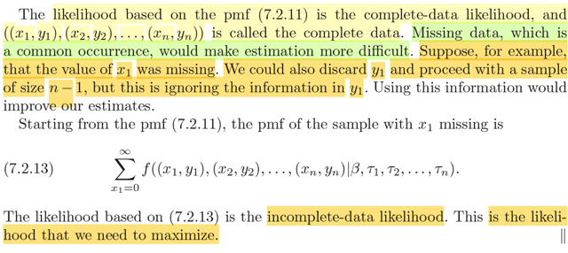</kbd>

> [!NOTE]
> đại ý nói là likelihood dựa trên pmf 7.2.11 là complete-data likelihood (vì trong
> công thức pmf đó thì ta tính joint pmf của (X1,X2,.....Xn,Y1,...Yn) vì ta có đủ
> các observed value x1, x2..,xn, y1, y2,...,yn.
>
> Nhưng vấn đề là có khi ta bị thiếu data, ví dụ như ko có x1. Khi đó nếu ta dùng
> cách bỏ đi luôn y1 để tính với sample size n-1: X2,...Xn, Y2,...Yn.
>
> f((x2,y2),...(xn,yn) | β, τ1, τ2...τn)
>
> thì vẫn được nhưng cái dở là lại lãng phí thông tin từ y1 vốn đã có.
>
> Do đó ta sẽ có cái gọi là **incomplete data likelihood**:
>
> Σxi=0,1...inf f((x1,y1),(x2,y2),...(xn,yn) | β, τ1, τ2...τn)
>
> Nó giống như ta có joint pmf fXY(x,y) = P(X=x,Y=y), và chỉ có observed value
> Y=y. Thì ta sẽ có thể dùng P(Y=y), bằng cách marginalizing mọi giá trị khả dĩ
> của X: Σ{mọi possible value x của X} P(X=x, Y=y). Và định nghĩa ra hàm
> likelihood này là incomplete data likelihood.
>
> Và đây là hàm likelihood mà ta muốn maximize.

 

<kbd>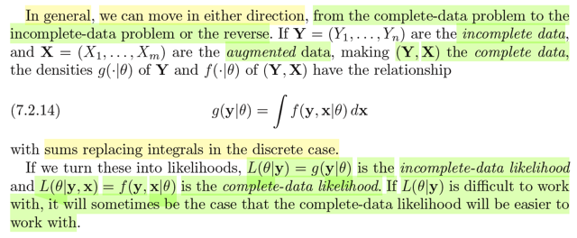</kbd>

> [!NOTE]
> Định nghĩa khái quát (cho cả pmf/pdf). Đó là nếu ta có 
>
> **Y** = (Y1,...Yn) là incomplete data 
>
> và **X** = (X1, ...Xm) là augmented data. 
>
> Thì (**Y**, **X**) là  complete data.
>
> Thì density g(.|θ) of Y và f(.|θ) of (**Y**,**X**) sẽ có quan hệ:
>
> g(**y**|θ) = ∫f(**y**,**x**|θ)d**x**
>
> Nếu chuyển thành likelihood: 
>
> L(θ|**y**) = g(**y**|θ) là incomplete-data likelihood
>
> và 
>
> L(θ|**y**,**x**) = f(**x**,**y**|θ) là complete data likelihood.
>
> Khi đó nếu khó tính toán với L(θ|**y**), thì có khi sẽ dễ hơn để tính toán với 
> L(θ|**y**,**x**)

 

<kbd>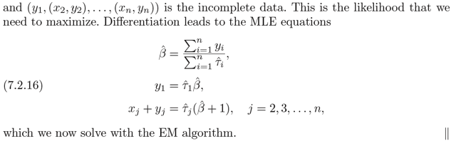</kbd>

<kbd></kbd>

<kbd>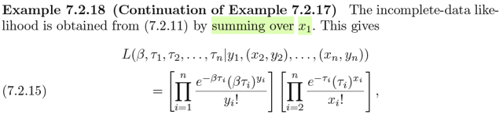</kbd>

> [!NOTE]
> rồi, đại ý là quay lại tiếp tục ví dụ 7.2.17 trong đó ta đã nói là ta thiếu dữ liệu
> x1, nhưng không muốn bỏ luôn y1 để tính với sample (x2, y2)..(xn, yn) vì sẽ
> phí giá trị y1.
>
> Nên ta sẽ xây dựng incomplete data likelihood bằng cách summing (cũng gọi là
> marginalizing) mọi giá trị khả dĩ của x1.
>
> L(β,τ1,..τn|y1, (x2,y2),..(xn,yn))
>
> = ...
>
> Rồi để tìm maximum ta cũng lấy đạo hàm và cho bằng 0
>
> Để có β^ = Σi=1:n yi / Σi=1:n τ^i
>
> y1 = τ^1 β^
>
> xj + yj = τ^j(β^ + 1), j = 1,2...n
>
> Và ta sẽ giải cái này bằng EM ALGORITHM
>
> (tạm bỏ qua bước tính toán trên, cơ bản là cũng không khó, tương tự như cách
> ta đã làm thôi)

 

<kbd>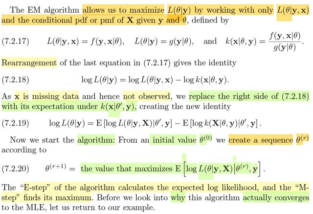</kbd>

> [!NOTE]
> Thế thì dừng lại chút để nghĩ lại về bài toán ta đang đối mặt: Ra sẽ cần
> giải bài toán tìm MLE, nhưng với dữ liệu bị thiếu.
>
> Cụ thể là trong bài toán 7.2.17 này, ta có dữ liệu quan sát được là (...,
> y1), (x2, y2),  ..(xn, yn) - Tức là thiếu x1.
>
> Từ đó, dĩ nhiên là không thể có complete likelihood, vì phải tính bằng
> joint pmf  của (X1,Y1),..,(Xn,Yn) tại (x1,y1),...(xn,yn)
>
> Hoặc một cách khái quát hóa, giả sử ta chỉ có giá trị quan sát của **Y**
> = (Y1,. .Yn),  tức (y1,...yn) và không có giá trị quan sát của **X**= (x1,.
> ..xm) thì ta không thể có  complete likelihood L(θ|**x**,**y**), vì nó cần
> f(**x**, **y**|θ), tức f(x1,..xm,y1,..yn|θ)
>
> Do đó ta sẽ dùng incomplete likelihood, được định nghĩa như sau:
>
> Nhờ quan hệ f(**y**|θ) = ∫f(**x**,**y**|θ)d**x**, đây là quan hệ có xuất
> phát từ LOPT, định  luật xác  suất toàn phần.
>
> Ta sẽ xây dựng incomplete likelihood = L(θ|**y**)  = ∫f(**x**,**y**|θ)d**x**
>
> Thế thì ta có: L(θ|**x**,**y**) = f(**x**,**y**|θ), L(θ|**y**) = f(**y**|θ), hay
> sách dùng g: g(**y**|θ)
>
> Và thêm một quan hệ:
>
> k(**x**|θ, y) (tức là conditional pdf của x)
>
> = f(**y**, **x**|θ) / g(**y**|θ), cái này thì dựa trên định nghĩa của
> conditional probability
>
> Lấy log hai vế:
>
> log k(**x**|θ, **y**) = log [f(**y**, **x**|θ) / g(**y**|θ)]
>
> ⇔ log k(**x**|θ, **y**) = log f(**y**, **x**|θ) - log g(**y**|θ)
>
> ⇔ log g(**y**|θ) = log f(**y**, **x**|θ) - log k(**x**|θ, **y**)
>
> ⇔ log L(θ|**y**) = log L(θ|**x**, **y**) - log k(**x**|θ, **y**) (1)
>
> Thế thì, maximize vế trái cũng là maximize vế phải.
>
> Có điều, ta không có giá trị **x**ở vế phải, nên **TA SẼ DÙNG GIÁ TRỊ
> TRUNG  BÌNH CỦA X.
>
> Nhưng không phải là hiểu theo kiểu không biết X bằng bao nhiêu
> (không  có giá trị cụ thể x) thì thay bằng EX. Vì khi đó ta sẽ mất đi
> hoàn toàn thông  tin về độ biến động của  X. Vả lại, không có gì cho
> phép tính như vậy: thay  x bởi EX.**Mà phải hiểu như sau: **vế phải của equation (1), với việc đã biết y,
> thì là hàm số phụ  thuộc X, là một random variable.
>
> Ta sẽ lấy giá trị trung bình của hàm số này qua mọi giá trị khả dĩ của X.**Hiểu thế này cho quen thuộc:
>
> Xét hàm số bên trái, đối với X thì nó là constant function. Tức là giống
> như ta có hàm g(u) = a. Và kết quả tạo ra bởi việc áp g lên X là g(X) sẽ
> là constant.  Và giả sử cứ thích lấy kì vọng của nó ta sẽ có Eg(X) =
> ∫afX(x)dx = a∫fX(x)dx  = a*1 = a.
>
> Nên vế trái ta sẽ vẫn có E[log L(θ|**y**) | y, θ') = E log L(θ|**y**)**** Còn
> vế phải, cứ hiểu  tương tự, là hiện tại ta có một random variable tạo ra
> bởi áp cái function sau đây  lên **X**: log L(θ|**y**,**x**) - log k(**x**|θ,
> **y**)****h(**X**) = log L(θ|**y**, **X**) - log k(**X**|θ,**y**)
>
> và để tính E h(**X**), theo lotus ta có E h(**X**) = ∫ [log L(θ|**y**, **x**) -
> log k(**X**|θ,y)] f**X**(**x**) dx
>
> = ∫log L(θ|y, **x**) f**X**(**x**)d**x** - ∫log k(**X**|θ,y)] f**X**(**x**) d**x**
>
> Nếu như ta có hàm f**X**(**x**) chỉ phụ thuộc **x thì lắp vô, tính ra**E
> h(**X**) ta sẽ có  constant
>
> Nhưng vì hàm pdf của X sẽ phụ thuộc y và θ, nó chính là k(**x**|**y**,
> θ) ở trên nên  lắp vào tính ra ta sẽ được giá trị trung bình của hàm
> (hay của cái random variable  h(X)) theo x nhưng vẫn phụ  thuộc y và
> θ.  **nên mới thể hiện với kí hiệu là:**E[h(**X**|θ, **y**)] = **∫** log L(θ|**y**, **x**) k(**x**|θ, **y**) d**x - ∫**log
> k(**x**|θ,**y**)] k(**x**|θ, **y**) dx****hay****E[log L(θ|**y**, **X**)|θ, **y**] = ∫ log L(θ|**y**, **x**) k(**x**|θ,**y**)d**x - ∫**log k(**x**|θ, **y**)] k(**x**|θ, **y**) d**x**thì có thể thấy term 1 là hàm theo θ, nhưng để tính là cần k(**x**|θ,
> **y**), lại là hàm  dựa vào θ.
>
> Điều này y như ta tính f(x) mà x = g(x) vậy).
>
> Do đó người ta sẽ làm như sau: Dùng θ'. θ' ý là giá trị (của step /
> iteration trước đó giải ra)
>
> Ví dụ như ban đầy ta đoán θ^(0). Dùng nó để tính k(**x**|θ^(0), **y**) và
> từ đó ta có  E[log L(θ|**y**, **X**)|θ^(0), **y**] = ∫ log L(θ|**y**, **x**)
> k(**x**|θ^(0), **y**) **dx**Và đó chính là bước 1. Bước 2 sẽ là giải bài toán:
>
> maximize over θ E[log L(θ|**y**, **X**)|θ^(0), **y**].
>
> Để rồi giải ra gọi nó là θ^(1), tiếp tục lặp lại quá trình.
>
> Đây chính là 7.2.20:
>
> θ^(r+1) = argmax_θ E[log L(θ|**y**, **X**)|θ^(r), **y**]
>
> Hỏi ngu: Vì sao lại maximize: Thì là vì ta đang muốn maximize vế trái,
> nên cũng ta sẽ maximize  vế phải. Và vế phải thì chỉ có term 1 là hàm
> theo θ thôi (ý là có dạng Q(θ|θ'), còn term 2 thì  với θ' thì ∫log k(**x**|θ',
> **y**)] k(**x**|θ', y) dx ra  fixed value rồi. nên ta chỉ cần maximize over θ
> term 1.
>
> Và bước 1, tính  E[log L(θ|**y**, **X**)|θ', **y**] gọi là E-Step
>
> Và bước 2, tính θ^(r+1) = argmax_θ E[log L(θ|**y**, **X**)|θ^(r), **y**]
> gọi là M-Step.
>
> Và tí nữa ta sẽ xem thử tại sao cách làm (thuật toán) này NHẤT ĐỊNH
> SẼ CONVERGE VỀ θ_MLE

 

<kbd>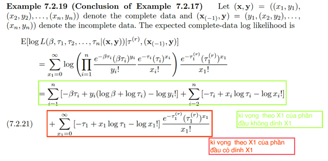</kbd>

> [!NOTE]
> Quay lại bài toán 7.2.17:
>
> Như đã nói, likelihood là:
>
> L(β, τ1,...τn | x1,...xn, y1, ...yn) 
>
> Thì ở đây nếu gọi (**x**,**y**) = ((x1,y1),...(xn,yn)) kí hiệu cho complete data và 
> (**x**_(-1), **y**) = ((-1,y1),...(xn,yn)) kí hiệu cho in-complete data. Thì likelihood
> ở trên có thể ghi gọn là L(β, τ1,..τn|(**x**,**y**)), và đây là complete-data likelihood.
>
> Và L(β, τ1,..τn|(**x**_(-1),**y**)) là incomplete-data likelihood.
>
> Ôn lại một chút lí thuyết chỗ này:
>
> Nếu gọi (**x**,**y**) là complete-data. (**y**) là in-complete data.
>
> Complete-data likelihood L(θ|**x**,**y**) = f(**x**,**y**|θ)
>
> Incomplete-data likelihood L(θ|**y**) = g(**y**|θ)
>
> Và f(**x**,**y**|θ) = k(**x**|θ,**y**)g(**y**|θ) ⇨ k(**x**|θ,**y**) =  f(**x**,**y**|θ) / g(**y**|θ)
>
> Lấy log hai vế: log k(**x**|θ,**y**) =  log f(**x**,**y**|θ) - log g(**y**|θ)
>
> ⇔ log g(**y**|θ) = log f(**x**,**y**|θ) - log k(**x**|θ,**y**)
>
> Cũng là log L(θ|**y**) = log L(θ|**x**,**y**) - log k(**x**|θ,**y**)
>
> Vế trái là incomplete data log likelihood, là cái mà ta muốn maximize
> nhưng theo tác giả có thể sẽ khó khăn khi làm việc với incomplete
> data likelihood hơn là complete data likelihood.
>
> Nên ta sẽ maximize vế phải. Nhưng vế phải thì ta chưa biết / chưa có **x**Do đó dùng cách: lấy expectation theo x hai vế, thì vế trái do không dính 
> tới x nên nó vẫn vậy. Vế phải sẽ là:
>
> E[log L(θ|**X**,**y**) | θ,**y**] - E[log k(**X**|θ,**y**) | θ,**y**]****Và cái term đầu tiên sẽ = ∫log L(θ|**x**,**y**) k(**x**|θ,**y**) d**x**
>
> Nếu thấy lạ thì nhìn xem, nó chỉ giống ta đang có g(**X**) = log L(θ|**X**,**y**)
> và để tính Eg(**X**), theo lotus: ∫g(**x**)f**X**(**x**)d**x**. Chỉ là ở đây pdf của X là pdf
> conditional on **y**, **θ**: k(**x**|**y**,θ)**** 
>
> Dĩ nhiên ta sẽ muốn maximize over θ cái này.
>
> Vấn đề là cái này nó có dạng Q(θ|θ), tức là ta cần biết θ để tính k(**x**|θ,**y**),
> rồi lắp x vào L(θ|**x**,**y**) để có hàm theo θ để mà optimize.
>
> Do đó cách làm sẽ là thay k(x|θ,y) bằng k(x|θ',y) để làm từ từ: θ' là solution
> của bước optimization trước đó. Có nghĩa là ban đầu chọn θ^(0) (tức θ') tính 
> k(x|θ^(0),y). Giải bài toán maximize L(θ|x,y)k(x|θ',y) ra θ đóng vai của θ^(1)
> tiếp tục như vậy. Thì dần nó sẽ hội tụ về θ_mle.
>
> Quay lại đây theo đó thì expected của complete-data log likelihood sẽ là:
>
> E[log L(θ|**X**,**y**) | θ,**y**] 
>
> thì **X,y**trong công thức tổng quát ý nói là đáng lý ta có complete data tức giá trị
> observed value của (**X**,**Y**) = (**x**,**y**). Nhưng ở đây bị thiếu **x**, nên phải lấy kì vọng
> theo **X**
>
> Vậy thì ở đây, đáng lẽ ta có complete data là (X1,Y1),..(Xn,Yn) = (x1,y1),..(xn,yn)
> thì nay chỉ có (,y1),(x2,y2),...(xn,yn). Do đó phải lấy kì vọng đối với X1
>
> Còn lấy kì vọng đối với X1, thì cái cụm "|θ,**y**" sẽ là gì: Thì **y**là incomplete data,
> tức (**x**_(-1),**y**), cũng là ((,y1),(x2,y2),...(xn,yn)). 
>
> → Ta thấy = E [log L(β,τ1,..τn | (X1,y1),..(xn,yn) | τ^(r), (**x**_(-1),**y**)]
>
> Còn một chỗ, vì sao, hay τ^(r) là sao? Có thể hiểu là θ^(r) trong công thức lý thuyết 
> tổng quát nhưng sao không có β?
>
> Là vầy, cái k(**x**|θ,**y**) trong công thức tổng quát nên nhớ, nó là joint pdf của **X**conditioned on θ, y
>
> Nên ở đây, nó chính là pdf của X1 conditioned on β, τ1,..τn, ((,y1), (x2,y2)..,(xn,yn))
>
> Ghi theo kiểu quen thuộc cho dễ hiểu f(x1| β, τ1,..τn, ((,y1), (x2,y2)..,(xn,yn)))
>
> hay viết gọn cái ((,y1), (x2,y2)..,(xn,yn)) là (**x**_(-1),**y**):
>
> f(x1| β,τ1,..τn, (**x**_(-1),**y**))
>
> Đến đây ví dụ như ta xét f(x|y) mà X,Y độc lập thì nó sẽ trở thành f(x). thì ở đây X1 
> và những thằng X2,X3,Y1,...Yn đều độc lập 
>
> → f(x1| β,τ1,..τn, (**x**_(-1),**y**)) =  f(x1| β,τ1,..τn)
>
> Mà công thức pdf của X1 cũng chỉ dính đến τ1, nên f(x1| β,τ1,..τn) chỉ còn là f(x1|τ1)
>
> ===
>
> Rồi, quay lại đây E [log L(β,τ1,..τn | (X1,y1),..(xn,yn) | τ^(r), (x_(-1),y)]
>
> Với L (..) = Π ...
>
> ta có E[ log (Π...) [e^-(τ1r (τ1r)^x1 / x1!]

 

<kbd>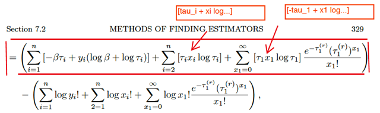</kbd>

> [!NOTE]
> Thu gọn cái cụm log (Π...) trước:
>
> log Πi=1:n [e^-(τi) τi^xi / xi!] [e^-(βτi) (βτi)^yi / yi!] ] 
>
> = Σ log [e^-(τi) τi^xi / xi!] [e^-(βτi) (βτi)^yi / yi!]
>
> = Σ log [e^-(τi) τi^xi / xi!] + Σ log [e^-(βτi) (βτi)^yi / yi!] 
>
> = Σ [log e^-(τi) + log τi^xi - log xi!] + Σ [log e^-(βτi) + log (βτi)^yi - log yi!] 
>
> = Σ [-τi + xi log τi - log xi!] + Σ [-βτi + yi log βτi - log yi!] 
>
> = Σ [-βτi + yi (log β + log τi) - log yi!] + Σ [-τi + xi log τi - log xi!]
>
> Nói chung là log L(...) = log (Π...) = cái vừa tính.
>
> ta sẽ tách nó thành: phần đầu ko dính tới x1 và phần sau có dính x1
>
>  Σi=1:n [-βτi + yi (log β + log τi) - log yi!] + Σi=2:n [-τi + xi log τi - log xi!]
>
> + (-τ1+ x1 log τ1 - log x1!)
>
> rồi thì tiếp theo là lấy kì vọng theo X1:
>
> vì vì tính linearity nên nó sẽ là:
>
> kì vọng theo X1 của phần đầu ko dính X1, tức là constant, sẽ = chính nó 
>
> Tức là: 
>
> Σi=1:n [-βτi + yi (log β + log τi) - log yi!] + Σi=2:n [-τi + xi log τi - log xi!] (*)
>
> cộng với:
>
> kì vọng theo X1 của phần sau nếu gọi cái cục này có dính X1 là A 
>
> ta sẽ có Σx1=0:inf A [pdf của X1]
>
> chính là Σ{x1=0:inf} (-τ1+ x1 log τ1 - log x1!) e^-(τ1r (τ1r)^x1 / x1!)
>
> Tách tiếp thành:
>
> + Σ{x1=0:inf} (-τ1) e^-(τ1r (τ1r)^x1 / x1!)  (hay, nó chính là E(-τ1))
>
> + Σ{x1=0:inf} (x1 log τ1) e^-(τ1r (τ1r)^x1 / x1!)  (cũng là E[X1 log τ1])
>
> + Σ{x1=0:inf} (- log x1!) e^-(τ1r (τ1r)^x1 / x1!) (cũng là E[-log X1!])
>
> = 
>
> -τ1 
>
> + log τ1 Σ{x1=0:inf} (x1 e^-(τ1r (τ1r)^x1 / x1!) 
>
> + E[-log X1!] 
>
> (**)
>
> ====
>
> Viết lại ta sẽ có:
>
> [hai cái cụm vì kì vọng theo X là chính nó ở trên (*)] + 3 cái ở dưới (**):
>
> Σi=1:n [-βτi + yi (log β + log τi) - log yi!] + Σi=2:n [-τi + xi log τi - log xi!]
>
> -τ1 
>
> + log τ1 Σ{x1=0:inf} (x1 e^-(τ1r (τ1r)^x1 / x1!) 
>
> + E[-log X1!] 
>
> Và ta sẽ maximize cái này over β, τ1,..τn nên nhưng gì ko dính tham số
> thì bỏ đi. Nên chỉ còn: 
>
> Σi=1:n [-βτi + yi (log β + log τi)] + Σi=2:n (-τi + xi log τi)
>
> -τ1 + log τ1 Σ{x1=0:inf} (x1 e^-(τ1r (τ1r)^x1 / x1!) 
>
> đưa cons log τ1 vào trong tổng 
>
> và viết -τ1 = -τ1*1 = -τ1*Σ{x1=0:inf} e^-(τ1r (τ1r)^x1 / x1!)
>
> = Σi=1:n [-βτi + yi (log β + log τi)] + Σi=2:n (-τi + xi log τi)
>
> -τ1 Σ{x1=0:inf} e^-(τ1r (τ1r)^x1 / x1!) + Σ{x1=0:inf} log(τ1) x1 e^-(τ1r (τ1r)^x1 / x1!) 
>
> hợp nhất hai hạng tử có thừa số chung là Σ{x1=0:inf} e^-(τ1r (τ1r)^x1 / x1!)
>
> = Σi=1:n [-βτi + yi (log β + log τi)] + Σi=2:n (-τi + xi log τi)
>
> + Σ{x1=0:inf} [-τ1 + x1 log(τ1)] e^-(τ1r (τ1r)^x1 / x1!) 
>
> ĐÂY CHÍNH LÀ CÁI CÔNG THỨC ĐÓNG KHUNG MÀU ĐỎ. TRONG SÁCH
> CÓ HAI CHỖ IN SAI
>
> Và ta sẽ đi maximize cái này.

 

<kbd></kbd>

> [!NOTE]
> Viết lại cái cần maximize (nó là cái E log likelihood của complete data nhưng ta đã
> bỏ đi những phần là constant.
>
> Σi=1:n [-βτi + yi (log β + log τi)] + Σi=2:n (-τi + xi log τi)
>
> + Σ{x1=0:inf} [-τ1 + x1 log(τ1)] e^-(τ1r (τ1r)^x1 / x1!)
>
> Xét cái tổng vô hạn thứ 3.
>
> = Σ{x1=0:inf} -τ1 e^-(τ1r (τ1r)^x1 / x1!) + Σ{x1=0:inf} x1 log(τ1)] e^-(τ1r (τ1r)^x1 / x1!)
>
> = -τ1 Σ{x1=0:inf}  e^-(τ1r (τ1r)^x1 / x1!) + Σ{x1=0:inf} x1 log(τ1)] e^-(τ1r (τ1r)^x1 / x1!)
>
> = -τ1 * 1 + E[X1 log(τ1)]
>
> = -τ1 + log(τ1) EX1
>
> Nên nhớ đây là phép lấy kì vọng đối với X1 và nó dựa trên pdf của X1 là f(x1|τ1r,y)
>
> Và X1 ~ Pois(τ1r) ⇨ EX1 = τ1r
>
> Vậy ta có -τ1 + τ1r log τ1
>
> ⇨ **Σi=1:n [-βτi + yi (log β + log τi)] + Σi=2:n (-τi + xi log τi)
>
> + [-τ1 + τ1r log τ1] (I)**
>
> Và bây giờ, hãy lôi cái log likelihood của cái trường hợp mà thật sự ta có đủ data:
>
> Σi=1:n {- τi + log [τi^xi / xi!] - βτi + log [(βτi)^yi / yi!] }
>
> viết lại nó chút xíu:
>
> = Σi=1:n { log [(βτi)^yi / yi!] } + Σi=1:n {- τi + log [τi^xi / xi!] - βτi }
>
> = Σi=1:n { log [(βτi)^yi] - log (yi!) } + Σi=1:n {- τi + log [τi^xi / xi!] - βτi }
>
> = Σi=1:n { yi log (βτi) - log (yi!) } + Σi=1:n {- τi + log [τi^xi / xi!] - βτi }
>
> = Σi=1:n { yi (log β + log τi) - log (yi!) } + Σi=1:n {- τi + log [τi^xi / xi!] } + Σi=1:n {- βτi }
>
> = Σi=1:n {- βτi } + Σi=1:n { yi (log β + log τi) - log (yi!) } + Σi=1:n {- τi + log [τi^xi / xi!] }
>
> = Σi=1:n {- βτi + yi (log β + log τi) - log (yi!) } + Σi=1:n {- τi + log [τi^xi / xi!] }
>
> = Σi=1:n {- βτi + yi (log β + log τi) - log (yi!) } + Σi=1:n {- τi + log [τi^xi] - log(xi!) }
>
> = Σi=1:n {- βτi + yi (log β + log τi) - log (yi!) } + Σi=1:n {- τi + xi log τi - log(xi!) }
>
> và maximize cái này thì ta cũng bỏ các constant đi:
>
> hay ghi là nó tỉ lệ thuận với:
>
> = Σi=1:n {- βτi + yi (log β + log τi)} + Σi=1:n {- τi + xi log τi}
>
> = **Σi=1:n {- βτi + yi (log β + log τi)} + Σi=2:n {- τi + xi log τi} 
>
> + {- τ1 + \/x1\/ log τ1}**
>
> (II)
>
> Viết lại cái (I) xuống đây để so sánh:
>
> **Σi=1:n [-βτi + yi (log β + log τi)] + Σi=2:n (-τi + xi log τi)
>
> + [-τ1 + \/τ1r\/ log τ1]** (I)
>
> Rõ ràng ta thấy nó CHỈ KHÁC CHỖ THAY x1 bởi τ1r.
>
> Do đó ta có thể dùng lại công thức mle đã tính bữa trước:
>
> τ^i = (x1+ y1) / (1 + β^)
>
> β^_mle = Σi yi / Σi xi
>
> Chỉ thay x1 bằng τ1r:
>
> β^ = Σi yi / (τ1r + x2 + ...xn)
>
> τ^1 = (τ1r + y1) / (1 + β^)
>
> τ^j = (xj + yj) / (1 + β^)
>
> Và đại khái mình hiểu là: ta sẽ lặp đi lặp lại chuyện này:
>
> Bắt đầu với τ1_0, hay viết như sách là τ1^(0) (superscript)
>
> Ta giải bài toán maximize Expectation này để có được β^, τ1^, τ2^,.... theo công
> thức trên. Thì đó là β^_1, τ1^_1, τ2^_1...τn^_1.
>
> Dùng τ1^ cho iteration 2, tính ra β^_2, τ1^_2, τ2^_2...τn^_2
>
> ....
>
> Thì chúng sẽ dần tiến về β_mle, τ1_mle, τ2_mle ...CỦA BÀI TOÁN INCOMPLETE
> DATA LIKELIHOOD.
>
> (Ôn lại chút chỗ này cho đỡ quên context: Nếu có đủ data (complete data) thì dĩ
> nhiên ta chỉ việc maximize log likelihood của complete data:
>
> log L(β, τ1,..τn|(x1,y1),(x2,y2),...(xn,yn)) 
>
> Nhưng vì thiếu data (x1), nên ta mới dùng thuật toán EM để maximize cái log likelihood
> của incomplete data:
>
> log L(β, τ1,..τn|(,y1),(x2,y2),...(xn,yn)) 
>
> Nhưng maximize cái này có thể khó (sách nói, đôi khi làm việc với complete data
> likelihood sẽ dễ hơn là với incomplete data likelihood) do đó ta mới xào nấu một
> chút để đưa bài toán maximize incomplete data likelihood thành maximize EXPECTATION
> CỦA COMPLETE DATA LIKELIHOOD. 
>
> bằng cách maximize cái vế phải, là E[log likelihood của complete data] - [some thing]
>
> Và trong đó, khi ta muốn giải bài toán maximize E[log likelihood của complete data]
> ta thấy nó có dạng y như của bài toán maximize cái log likelihood của complete data
> chỉ khác thay x1 bằng τ1r (tức là giá trị τ1 estimate ra trước đó, ví dụ như ở iteration 1
> thì nó là τ1_0, tức initial guess cho τ1), nên ta mới dùng công thức mle solution của
> bài toán maximize cái log likelihood của complete data (mà mình đã tự triển khai ở
> phần trước rồi).
>
> Và cái theorem cuối cùng này nó sẽ khẳng định là bằng cách dùng thuật toán này
> dần dần ta sẽ converge về (β, τ1,..τn)^_mle của bài toán incomplete data likelihood
>  y như giải với bài toán maximize cái log likelihood của in complete data vậy.
>
> Chú ý: Không phải là converge về solution mle của bài toán complete data likelihood nhé.
> Nó chí dính dáng đến complete data likelihood là vì khi maximize cái E log complete data
> likelihood thì nó ra cái dạng tương tự như bài toán maximize log complete data
> likelihood chỉ khác τ1r thay cho x1 thôi.

 

<kbd></kbd>

> [!NOTE]
> QUAY LẠI SAU, nhưng đại ý theorem này cho biết về sự hội tụ về θ^_mle
> của EM algorithm

 

