# 7.3 Methods Of Evaluating Estimators

📊 **Progress:** `54` Notes | `59` Screenshots

---

<kbd>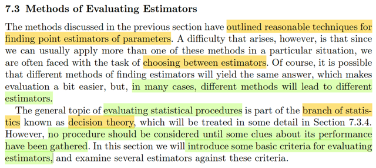</kbd>

> [!NOTE]
> Đại ý là, thực tế ta sẽ phải đối mặt đến việc quyết định dùng estimator
> nào, do đó dĩ nhiên ta phải có cách đánh giá chúng. Thì phần này sẽ bàn
> về các đánh giá các estimator.
>
> Tác gỉa cũng nhắc đến việc đánh giá các quy trình thống kê (statistical
> procedure)  thuộc một nhánh của thống kê gọi là DECISION THEORY

 

<kbd>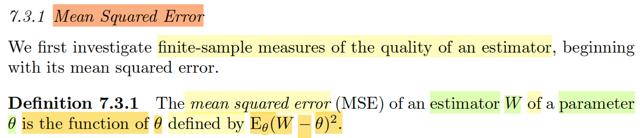</kbd>

> [!NOTE]
> Rồi, ta qua công cụ thứ nhất, đầu tiên là định nghĩa của mean squared error
> (MSE).
>
> Cùng phân tích cái định nghĩa của nó:
>
> Nếu W là estimator của parameter θ, thì MSE của nó được định nghĩa là  một
> hàm số theo θ, định nghĩa bởi: E_θ(W - θ)^2
>
> Vài nhận xét: Nhớ lại định nghĩa của estimator của θ, nó là cho một random
> sample X1,...Xn ~ population distribution f(x|θ) thì estimator của θ được định
> nghĩa là bất kì function nào của random sample W(X1,...Xn). Mà ta đã biết từ
> bài học vỡ lòng của xác suất từ hồi học Stat110 Joe Bliztein, đó là khi apply
> một function lên random variable thì ta cũng được một random variable.
>
> Nên estimator, đơn giản làm một random variable (hoặc random variable
> vector) Và đặc biệt hơn, khi nhớ về định nghĩa của statistic, cũng là function
> của các random variable thì ta sẽ thấy về cơ bản estimator cũng là statistic.
>
> Thế thì, vì W, estimator, mà như vừa nhắc (đáng lẽ phải ghi là W(X1,..Xn) để
> thể hiện nó là function của các random variable trong random sample) là
> random variable. Nên dĩ nhiên (W - θ)^2 (θ là constant) cũng vậy, cũng là
> random variable ⇨ được quyền nói đến mean / expectation. Và MSE của W
> được định nghĩa là giá trị này.
>
> Thế thì, vì là tính mean. Nhớ lại, bản chất của tính mean của random variable
> W, là ta sẽ tính weighted average mọi possible values của W, với weight là
> xác suất tương ứng.
>
> Vậy giả sử xét W là discrete random variable. Thì possible values của nó
> là gì? À ta mới nhớ, W là estimator của θ, thì một giá trị cụ thể của nó, tức
> là W(X1,...Xn)|X1=x1,..Xn=xn, hay W(x1,...xn), chính là một estimate value
> của θ.
>
> Giả sử w1,...wk là thì E_θ(W - θ)^2 sẽ là:
>
> (nhớ dùng LOTUS, cho phép ta tình Eg(X) = Σx g(x)P(X=x))
>
> = Σ{mọi possible value, hay estimate wi) (wi - θ)^2 fW(wi)
>
> Và dĩ nhiên có thể hiểu khi tác giả nói đây là average squared difference
> giữa estimator và θ. (mình hiểu average, ở đây là weighted average)
>
> Cuối cùng, thì nó là hàm theo θ đơn giản là vì tính cái kì vọng này ra sẽ chỉ
> còn phụ thuộc θ, ko phụ thuộc W nữa.

 

<kbd>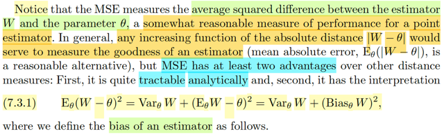</kbd>

> [!NOTE]
> rồi, thế thì gs cho biết bất kì function nào là increasing function của absolute 
> value của |W - θ|, ví dụ như E_θ|W - θ| cũng có thể đóng vai đánh giá độ
> tốt của estimator.
>
> Nhưng tác giả nhấn mạnh MSE có ÍT NHẤT LÀ HAI LỢI THẾ:
>
> Một là nó khá đơn giản về mặt tính toán (tractable analytically) và cái thứ
> hai là bằng cách triển khai chút xíu ta sẽ có:
>
> E_θ(W - θ)^2
>
> Nhớ công thức thứ hai của variance: VarX = EX^2 - (EX)^2
>
> ⇨ Var_θ(W - θ) = E_θ(W - θ)^2 - [E_θ(W - θ)]^2
>
> Vế trái, dùng tính chất Var(X + c) = Var(X)
>
> Và E_θ(W - θ) = E_θ(W) - E_θ(θ) = E_θ(W) - θ 
>
> (linearity và kì vọng của constant = constant)
>
> ⇔ Var_θ(W) = E_θ(W - θ)^2 - [E_θ(W) - θ]^2 
>
> ⇔ Var_θ(W) = MSE(W) - [E_θ(W) - θ]^2 
>
> ⇔ **MSE(W) = Var_θ(W) + [E_θ(W) - θ]^2**
>
> Và cái hạng tử thứ hai là bình phương của BIAS OF ESTIMATOR.
>
> ⇔ MSE(W) = Var_θ(W) + [BIAS_θ(W)]^2

 

<kbd>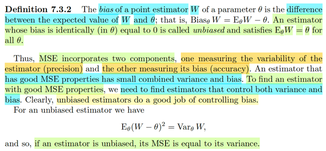</kbd>

> [!NOTE]
> Rồi, đây là lần đầu tiên chính thức được học về bias of estimator (vốn đã
> từng thấy khi đọc chapter 5 của Deep Learning Yoshua Bengio). Định
> nghĩa của nó, bias of estimator W, là E_θ(W) - θ, vậy thôi.
>
> Thế thì phải thấy bias của W, vẫn là hàm theo θ, ta sẽ ghi là Bias_θ(W)
>  Và nếu với mọi θ Bias_θ(W) đều bằng 0 thì W được gọi là UNBIASED
> ESTIMATOR CỦA θ .
>
> Thế thì quay lại công thức MSE: 
>
> MSE_θ(W) = Var_θ(W) + Bias_θ(W)
>
> Và nhờ vậy ta thấy cấu thành của MSE sẽ đến từ độ biến động của W 
> và độ bias của W.
>
> Nên muốn estimator có MSE nhỏ, thì hai cái yếu tố này phải nhỏ, tức là
> ta muốn bias thấp và biến động thấp.
>
> Và với unbiased estimator, thì MSE_θ(W) = Var_θ(W)
>
> Đây là những điểm / định nghĩa cực kì quan trọng trong machine learning

 

<kbd>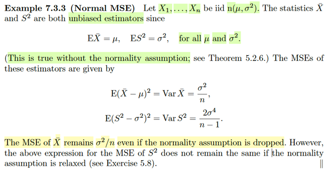</kbd>

🔗 **Related:** [5.2 Σ OF RANDOM VARIABLES FROM A RANDOM SAMPLE](52_σ_of_random_variables_from_a_random_sample.md#node-344)

> [!NOTE]
> Qua ví dụ này, X1,...Xn là iid n(μ, σ^2). Ở đây nói statistic Xbar và S^2 
> tức sample mean và sample variance đều là unbiased estimators vì sao?
>
> Ôn lại một chút: Mình đang trong phần nói về những cách đánh giá chất
> lượng của estimator. Và phương pháp đầu tiên là MSE. Được định nghĩa
> là: MSE của estimator W (là estimator của θ) là một function theo θ và 
> function này được defined như sau: MSE_θ(W) = E_θ(W - θ)^2
>
> Như đã lập luận hôm qua, nay nói lại không thừa: W, tức estimator, theo
> định nghĩa của estimator, nó là một function của random sample. Và theo
> định nghĩa này thì nó cơ bản là một statistic. Hay nói cách khác, statistic
> nào cũng là một estimator thôi. Nên nó là một random variable.Và (W - θ)^2
> lại một lần nữa, là function áp lên random variable. Nên cũng là random 
> variable. Nên ta có quyền nói về kì vọng.
>
> Thế thì, dùng một identity đã biết của Variance: VarX = EX^2 - (EX)^2 ta sẽ
> có:
>
> Var_θ(W - θ) = E_θ(W - θ)^2 - [E_θ(W - θ)]^2
>
> ⇔ Var_θ(W) = E_θ(W - θ)^2 - [E_θ(W - θ)]^2
>
> ⇔ E_θ(W - θ)^2 = Var_θ(W) + [E_θ(W - θ)]^2
>
> Và E_θ(W - θ) = E_θ(W) - θ chính là định nghĩa của Bias của W.
>
> Công thức trên cho thấy estimator muốn có MSE thấp thì nó phải có bias
> thấp và variance thấp. Và nếu bias = 0, tức E_θ(W) = θ, thì gọi là unbiased
> estimator.
>
> Quay lại đây, mình đã biết về statistic (again, mọi statistic đều là estimator)
> Xbar và S^2. Thì vì trong theorem 5.2.6 ta đã biết EXbar = μ, và ES^2 = σ^2
> nên có nghĩa như vừa nói ở trên thì chúng là các unbiased estimator của
> population mean μ và population variance σ^2.
>
> Một điểm cần nhấn mạnh ở đây là theorem 5.2.6 áp dụng không chỉ cho 
> normal distribution mà cho tất cả. Nên dù là normal hay không thì Xbar
> và S^2 vẫn là unbiased estimator.
>
> Do đó MSE_μ(Xbar) = Var(Xbar), và MSE_σ^2 (S^2) = Var(S^2)
>
> Và những phần trước ta đã biết: 
>
> Var(Xbar) = σ^2/n và với distribution khác thì cũng vậy
>
> VarS^2 = 2σ^4/(n-1) chỉ với normal, với distribution khác thì sẽ khác.

 

<kbd>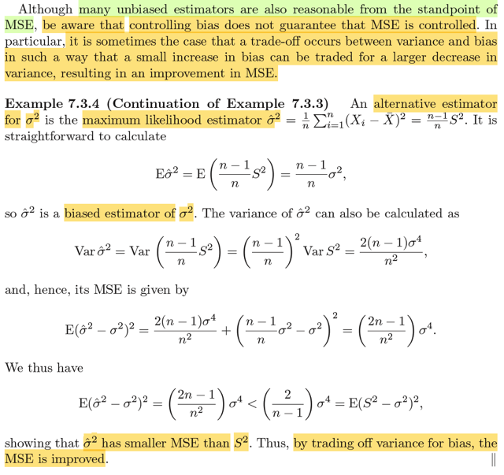</kbd>

🔗 **Related:** [7.2 METHOD OF FINDING ESTIMATORS](72_method_of_finding_estimators.md#node-578)

> [!NOTE]
> Đại ý đoạn này nói rằng tuy unbiased estimator có vẻ là lựa chọn hợp lí dưới
> góc nhìn của MSE, nhưng phải cẩn thận, vì đôi khi bằng cách hi sinh bias
> chút đỉnh (tức bias cao hơn) nhưng lại giúp giảm variance đáng kể từ đó lại
> giúp MSE nhỏ hơn.
>
> Cũng lấy ví dụ trên, đại ý là tuy ta vừa thấy S^2, tức sample variance là
> unbiased estimator, nhưng so với một estimator khác của variance:
>
> (σ^2)^_mle (mà công thức mình đã hiểu, link tím), thì ở đây ý chính là người
> ta thấy rằng cái này là biased  estimator, vì kì vọng của nó không bằng σ^2,
> nên cái phần đóng góp  vào MSE từ bias sẽ cao hơn so với S^2. Nhưng, tính
> variance của nó tức Var[(σ^2)^_mle] thì lại nhỏ hơn, và tổng hợp lại, thì MSE
> của nó nhỏ hơn MSE của unbiased estimator.
>
> E[(σ^2)^_mle] = E[(n-1)S^2/n] = [(n-1)/n]E[S^2]. ((n-1)/n là constant)
>
> = (n-1)/n σ^2 (vì đã biết mean của S^2 là σ^2)
>
> Như vậy MLE của σ^2 là biased estimator vì E[(σ^2)^_mle] không bằng σ^2
>
> Var((σ^2)^_mle) = Var[S^2(n-1)/n] = [(n-1)/n]^2Var(S^2)
>
> = [(n-1)/n]^2 Var(S^2)
>
> *Var(S^2) = 2σ4/(n-1) Cái này thuộc bài tập trong chương 5
>
> .. = [(n-1)/n]^2 . 2σ4/(n-1) = [(n-1)/n]^2 . 2σ4 = [2(n-1)/n^2] σ^4
>
> ====
>
> MSE_σ^2((σ^2)^_mse) = Var(S^2) + [Bias(S^2)]^2
>
> = [2(n-1)/n^2] σ^4 + [(n-1)/n σ^2 - σ^2]^2
>
> = [2(n-1)/n^2] σ^4 + [(n-1-n)/n σ^2]^2
>
> = [2(n-1)/n^2] σ^4 + [σ^4/n^2]
>
> = [2(n-1)σ^4 + σ^4]/n^2
>
> = [2nσ^4 - 2σ^4 + σ^4]/n^2
>
> = [2nσ^4 - σ^4]/n^2
>
> = [2n - 1]σ^4/n^2
>
> MSE của S^2: Tính theo định nghĩa: E[S^2 - σ^2]^2
>
> = Var(S^2) + Bias(S^2)
>
> = Var(S^2)
>
> = 2σ4/(n-1)
>
> So [2n-1]σ^4/n^2 với 2σ4/(n-1)
>
> Giả sử dấu <:
>
>  [2n-1]/n^2 < 2/(n-1)
>
> ⇔ (2n-1)(n-1) < 2n^2
>
> ⇔ 2n^2-n-2n+1 < 2n^2
>
> ⇔ -3n+1 < 0
>
> ⇔ 1/3 < n Và cái này luôn đúng vì kích thước của random sample ≥ 1.
>
> Vậy ta thấy MSE của BIAS ESTIMATOR (mle [σ^2]^_mle) lại NHỎ HƠN MSE
> CỦA UNBISED ESTIMATOR S^2

> [!NOTE]
> Thử làm lại cái [σ^2]^_mse (tức MSE của normal variance σ^2) 
> của normal xem được không:
>
> Giải bài toán maximize_μ, σ^2 L(σ^2|**x**) 
>
> L(μ, σ^2|**x**)****= Πi=1:n f(x|μ,σ^2)
>
> = Πi=1:n 1/σ(√2π) exp[-(x-μ)^2/2σ^2]
>
> = Πi=1:n [σ(√2π)]^-1 exp[-(x-μ)^2/2σ^2]
>
> = [σ(√2π)]^(-n) Πi=1:n exp[-(x-μ)^2/2σ^2]
>
> Bài toán equivalent: maximize_μ, σ^2 log L(μ, σ^2|**x**) 
>
> log L = log [σ(√2π)]^(-n) Πi=1:n exp[-(x-μ)^2/2σ^2]
>
> = log [σ(√2π)]^(-n) + log Πi=1:n exp[-(x-μ)^2/2σ^2] 
>
> = -n log [σ(√2π)] + Σi=1:n log exp[-(x-μ)^2/2σ^2] 
>
> = -n log [σ(√2π)] + Σi=1:n [-(x-μ)^2/2σ^2] 
>
> = -n [log σ + log (√2π)] + (1/2σ^2) Σi=1:n [-(x-μ)^2] 
>
> = -n log σ -n log (√2π) + (1/2σ^2) Σi=1:n [-(x-μ)^2] 
>
> equivalent
>
> = - n log σ - (1/2σ^2) Σi=1:n [(xi-μ)^2] 
>
> ====
>
> Tới đây: Dùng điều kiện cần bậc nhất:
>
> ∇L(μ, σ^2)|μ=μ_mle, σ^2=σ^2_mle  = 0
>
> ∂/∂μ L(μ, σ^2) = 0 (1)  &  ∂/∂σ^2 L(μ, σ^2) = 0  (2)
>
> Giải (1):
>
> ∂/∂μ {- n log σ - (1/2σ^2) Σi=1:n [(xi-μ)^2]} = 0
>
> ⇔ (1/2σ^2) Σi=1:n ∂/∂μ [(xi-μ)^2] = 0
>
> ⇔ Σi=1:n 2[(xi-μ)(-1)] = 0
>
> ⇔ - 2 Σi=1:n [(xi-μ)] = 0
>
> ⇔ Σi=1:n xi - nμ = 0
>
> ⇔ Σi=1:n xi = nμ
>
> ⇔ (Σi=1:n xi)/n = μ
>
> ⇔ μ = Xbar
>
> ⇨ μ^_mle = Xbar
>
> Giải 2: Để cho gọn đặt A = Σi=1:n [(xi-μ)^2]
>
> L = -n log σ - A/2σ^2 = -n log[(σ^2)^1/2] - A/2σ^2
>
> ∂/∂σ^2 L = 0 
>
> ⇔ ∂/∂σ^2 [-n log[(σ^2)^1/2] - A/(2σ^2)] = 0
>
> ⇔ ∂/∂σ^2 [(-n/2) log(σ^2) - A/(2σ^2)] = 0
>
> ⇔ ∂/∂σ^2 [(-n/2) log(σ^2)] - ∂/∂σ^2 [A/(2σ^2)] = 0
>
> ⇔ ∂/∂σ^2 [(-n/2) log(σ^2)] = ∂/∂σ^2 [A/(2σ^2)] 
>
> ⇔ (-n/2) ∂/∂σ^2 log(σ^2) = (A/2) ∂/∂σ^2 [1/σ^2]
>
> ⇔ (-n/2) (1/σ^2) = (A/2) ∂/∂σ^2 [σ^2]^-1
>
> ⇔ (-n/2) (σ^2)^-1 = - (A/2) [σ^2]^-2 
>
> ⇔ n = A [σ^2]^-1 
>
> ⇔ n = A [1/σ^2]
>
> ⇔σ^2 = A/n = Σi=1:n [(xi-μ)^2] / n 
>
> Thay μ = μ^_mle = Xbar
>
> Ta có [σ^2]^_mle = Σi=1:n [(xi-Xbar)^2] / n 
>
> ====
>
> Xét vế phải: Nhớ rằng đây không phải S^2.
>
> Vì S^2 có công thức là: S^2 = Σi=1:n [(xi-Xbar)^2 / (n-1)
>
> ⇔ S^2/n = Σi=1:n [(xi-Xbar)^2 / n(n-1)
>
> ⇔ S^2(n-1)/n = Σi=1:n [(xi-Xbar)^2 / n
>
> Tức là vế phải chính là [(n-1)/n] S^2
>
> Vậy σ^2 = [(n-1)/n] S^2
>
> Kết luận MLE của σ^2 là  [(n-1)/n] S^2

 

<kbd>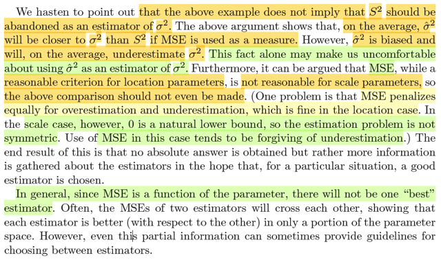</kbd>

> [!NOTE]
> đại ý là dù ở trên ta vừa nói rằng mle estimator của σ^2 có MSE nhỏ hơn
> nhưng không có nghĩa là ta sẽ vội vàng bỏ cái unbiased estimator - S^2 đi
> vì dù nó có MSE lớn hơn, nhưng nó unbiased
>
> Một lập luận khác phải cân nhắc đó là, MSE có thể là thước đo tốt đối
> với location param, chứ chưa chắc tốt cho scale param.
>
> Lí do là vì MSE sẽ đánh giá (mức độ nghiêm trọng) như nhau đối với một
> over estimate và under estimate, dễ hiểu là vì nó square error lên. Thì điều
> này là chấp nhận được với location param vì đoán sai vị trí param theo kiểu
> lố quá hoặc bị hụt thì cũng như nhau do location parameters thì có thể mang
> giá trị từ -inf:inf 
>
> Nhưng với scale param thì khác. Vì scale param nó có tính chất ≥ 0
> Nên ví dụ như giá trị đúng là 5, thì một underestimate = 1 đáng lẽ phải có
> mức nghiêm trọng không kém một overestimate 1000. Nhưng MSE thì kiểu
> như lại cho rằng nó ít nghiêm trọng hơn vì error^2 chỉ có 4^2 so với 995^2.
>
> Nên MSE có xu hướng tha thứ cho underestimating hơn là overestimate
> (hiểu nôm na là nó ưu ái nhẹ tay với lỗi đoán thấp hơn thực tế mà nặng tay
> hơn với lỗi đoán cao hơn thực tế)
>
> Và nói chung là nếu dùng MSE để đánh giá thì ko có cái nào là tốt nhất cả.

 

<kbd>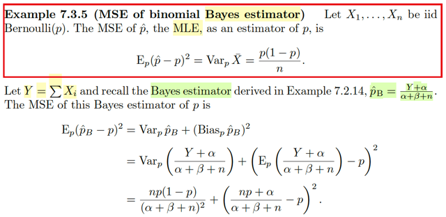</kbd>

> [!NOTE]
> Qua ví dụ này, X1,...Xn là iid Bern(p). MSE của p^_mle (MLE của p) là gì? 
>
> Theo định nghĩa MLE của estimator W của θ là hàm theo θ, define bởi
> MSE_θ(W) = E[W - θ]^2
>
> ⇨ MLE_p(p^) = E_p(p^ - p)^2 
>
> p^_mle là gì?
>
> Lẽ dĩ nhiên để derive công thức của cái này thì ta sẽ dựa theo định nghĩa 
> của mle: p^_mle = argmax_p L(p|**x**)
>
> Likelihood: L(p|**x**) = Πi=1:n f(xi|p) = Πi=1:n p^xi(1-p)^(1-xi)
>
> Dùng bài toán tương đương (equivalent): maximize log L(p|**x**) 
>
> = log Πi=1:n p^xi(1-p)^(1-xi) = Σi=1:n [log p^xi + log (1-p)^(1-xi)]
>
> = Σi=1:n [xi log p + (1-xi) log (1-p)]
>
> = Σi=1:n [xi log p] + Σi=1:n[(1-xi) log (1-p)]
>
> = log p Σi=1:n xi + log (1-p) Σi=1:n(1-xi)
>
> = log(p) nXbar + log(1-p) n (1-Xbar)
>
> Rồi, lấy đạo hàm theo p và cho nó bằng 0 (first order necessary condition):
>
> d/dp log L(p|**x**) = 0
>
> ⇔ d/dp [log(p) nXbar + log(1-p) n (1-Xbar)] = 0
>
> ⇔ d/dp [log(p) nXbar] + d/dp [log(1-p) n (1-Xbar)] = 0
>
> ⇔ nXbar d/dp log(p) + n (1-Xbar) d/dp log(1-p) = 0
>
> ⇔ nXbar (1/p) + n (1-Xbar) [-1/(1-p)] = 0
>
> ⇔ nXbar/p + n (Xbar-1)/(1-p) = 0
>
> ⇔ nXbar/p = n(1-Xbar)/(1-p)
>
> ⇔ nXbar(1-p) = np(1-Xbar) 
>
> ⇔ nXbar - npXbar = np - npXbar
>
> ⇔ nXbar = np
>
> ⇔ Xbar = p
>
> Vậy p^_mle, tức MLE của Bern(p) là Xbar.
>
> E[Xbar] = E[(ΣiXi)/n] = (Σi EXi)/n = (Σi p)/n = np/n = p (mà ta cũng biết không
> chỉ riêng gì Bern(p), với mọi distribution thì E(Xbar) luôn bằng population
> mean) Nên Xbar, là một unbiased estimator của μ.
>
> Vậy ở đây p^_mle, = Xbar, sẽ là unbias estimator của p, tức Bias_p(p^_mse) = 0 
>
> Do đó quay lại bài toán, ta đang tính MSE của p^_mse:
>
> E_p[p^_mse - p]^2 = Var_p[p^_mse] + [Bias_p(p^_mse)]^2
>
> = Var_p[p^_mse] + 0
>
> = Var_p[p^_mse] 
>
> = Var_p[Xbar]
>
> Mà variance của sample mean thì mình nhớ công thức là σ^2/n, tức population
> variance / n.
>
> Với X ~ Bern(p) thì Var(X) gì quên thì triển khai lại:
>
> VarX = E(X - EX)^2 = Σ{possible value x} (x - EX)^2P(X=x)
>
> = (1-p)^2p + (0-p)^2(1-p)
>
> = (1-2p + p^2)p + p^2 - p^3
>
> = p - 2p^2 + p^3 + p^2 - p^3
>
> = p - p^2 = p(1-p)
>
> Vậy Var_p[Xbar] = p(1-p) / n, y như sách

 

<kbd>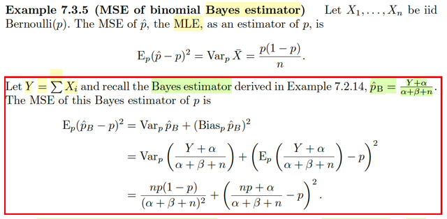</kbd>

> [!NOTE]
> Rồi, tiếp: Cho Y = Σi Xi, tác giả đề nghị ta nhớ lại Bayes estimator có được
> từ ví dụ 7.2.14: p^B = (Y + α) / (α + β + n)
>
> Mình sẽ không derive lại cái này, nhưng ôn lại tí về Bayes estimator.
>
> Đầu tiên, phải nói về trường phái Bayesian statistic, có cái nhìn khác đối
> với parameter θ. Khác với trường phái cổ điển (classical statistic), coi θ 
> là fixed nhưng unknown value. Để rồi hiểu biết về nó, sẽ được phản ánh
> trong giá trị của random sample, để rồi phân tích random sample ta sẽ
> chắt lọc được thông tin của θ.
>
> Thì với Bayesian statistic, ta coi θ là quantity of randomness, tức nôm na
> cũng là random variable luôn. Nên nó sẽ có distribution.
>
> Thế thì đại khái là khi chưa quan sát được giá trị của random sample **X**,
> thì bằng kinh nghiệm, experimenter sẽ cho rằng θ tuân theo một distribution
> nào đó. gọi là prior distribution π(θ)
>
> Sau khi quan sát được giá trị của random sample **X** = **x**, ta sẽ update
> distribution của θ dựa trên thông tin này: gọi là posterior distribution, tức
> là nó sẽ là conditional pdf: π(θ|**x**)
>
> Và công cụ ta sẽ dùng là Bayes theorem:
>
> π(θ|**x**)****= f(**x**, θ) / π(θ) = f(**x**|θ)π(θ) / f(**x**)
>
> Với f(**x**) có được bằng cách marginalizing joint pdf f(**x**, θ) over mọi possible 
> value của θ : f(**x**) = ∫f(**x**, θ)dθ 
>
> ⇨ π(θ|**x**) = f(**x**|θ)π(θ) / ∫f(**x**, θ)dθ
>
> ⇔ π(θ|**x**) = f(**x**|θ)π(θ) / ∫f(**x**|θ)π(θ)dθ****Thế thì, khi đã có posterior distribution, thì theo giáo sư Casella, lẽ tự nhiên
> ta sẽ dùng mean của distribution để làm point estimate, đó chính là Bayes
> estimator. Nên θ^_B, được định nghĩa như sau:
>
> E[θ] với θ được xem như random variable ~ π(θ|**x**)
>
> Dĩ nhiên, kí hiệu đúng sẽ là E[θ|**x**], vì nó sẽ vẫn là hàm phụ thuộc **x**:
>
> E[θ|**x**] = ∫-inf:inf θπ(θ|**x**)dθ  
>
> (ta sẽ thấy nó vẫn sẽ là estimator, vẫn tuân theo định nghĩa của estimator, đó 
> là "any function of random sample")
>
> ====
>
> Quay lại đây, ta tính thứ MSE của Bayes estimator p^_B:
>
> Theo định nghĩa thôi, ghi lại nhiều lần cho nhớ, MSE được định nghĩa là 
> hàm theo θ, define bởi kì vọng của (θ^ - θ)^2:
>
> ⇨ MSE_p(p^_B) = E_p[p^_B - p]^2
>
> dùng công thức khai triển = Var[p^_B] + [Bias_p(p^_B)]^2
>
> Và ôn lại luôn định nghĩa của Bias của estimator θ^ là hàm theo θ tính bởi
> E[θ^] - θ ⇨ Bias_p(p^_B) =  E[p^_B] - p
>
> ... = Var[(Y + α) / (α + β + n)] + [E[p^_B] - p]^2
>
> = [1/(α + β + n)^2] Var(Y + α) + [E[(Y + α) / (α + β + n)] - p]^2
>
> = [1/(α + β + n)^2] Var(Y) + [E[(Y + α)] / (α + β + n) - p]^2
>
> = [1/(α + β + n)^2] Var(Y) + [(EY + Eα) / (α + β + n) - p]^2
>
> Trên đây chỉ là các identity: Var(c + X) = Var(X), Var(cX) = c^2VarX
>
> Và với Y = Σi Xi  ⇨ EY = Σi EXi = Σi p = np, và VarY = np(1-p) (ko khó để derive)
>
> = np(1-p)/(α + β + n)^2  + [np + α) / (α + β + n) - p]^2
>
> Đây là kết quả trong sách.

 

<kbd>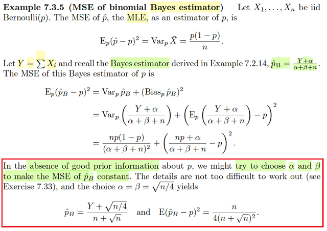</kbd>

> [!NOTE]
> tiếp, tác giả cho rằng, nếu như ta không có một prior information tốt, thì
> ta có thể chọn α và β sao cho cái MSE của p^_B này là constant. Và không
> khó để giải ra α = β = √n/4 
>
> Là sao? Tức là ta muốn MSE_p(p^_B) = constant, không còn phụ thuộc p
>
> Thì có nghĩa là đạo hàm của MSE_p(p^_B), (again, nhớ, đây là hàm theo p) 
> đối với p sẽ bằng 0:
>
> Tính đạo hàm của E_p[p^B-p]:
>
> d/dp E_p[p^B-p] = d/dp {np(1-p)/(α + β + n)^2  + [np + α) / (α + β + n) - p]^2}
>
> = d/dp [np(1-p)/(α + β + n)^2] + d/dp {[(np + α) / (α + β + n) - p]^2}
>
> = d/dp [np(1-p)/(α + β + n)^2] + d/dp {[(np + α) / (α + β + n) - p]^2}
>
> = d/dp [np -np^2] / (α + β + n)^2 + [(np + α) / (α + β + n) - p] { d/dp [(np + α) / (α + β + n) - p] }
>
> = (n - n2p) / (α + β + n)^2 
>
> + [(np + α) / (α + β + n) - p] { d/dp [(np + α) / (α + β + n) - d/dp p]}
>
> = (n - n2p) / (α + β + n)^2 + [(np + α) / (α + β + n) - p] { n / (α + β + n) - 1}
>
> = (n - n2p) / (α + β + n)^2 + [(np + α) / (α + β + n) - p (α + β + n)/ (α + β + n)] { n / (α + β + n) - (α + β + n)/(α + β + n)}
>
> = (n - n2p) / (α + β + n)^2 + [(np + α) - p (α + β + n) ] / (α + β + n) [n  - (α + β + n)] / (α + β + n)
>
> = (n - 2np) / (α + β + n)^2 + [np + α - p α - p β - pn] / (α + β + n) [n  - α - β - n] / (α + β + n)
>
> = (n - 2np) / (α + β + n)^2 + [np + α - p α - p β - pn] [n - α - β - n] / (α + β + n)^2
>
> ....
>
> Giải sẽ ra kết quả trên thôi, khi đó thể vô ta sẽ có E_p[p^_B - p]^2 là constant

 

<kbd>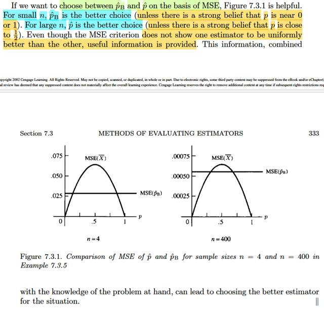</kbd>

> [!NOTE]
> Rồi, cũng dễ hiểu. Đại ý là dựa vào cái hình này, trong đó vẽ MSE của p^_B
> và p^_mle. Với α = β = √n/4, vừa trên ta đã nói MSE_p(p^_B) là constant. Nó
> chính là cái đường nằm ngang trong hai đồ thị, còn MSE của p^_mle thì nó là
> cái hình quả núi.
>
> Có thể thấy, nếu n nhỏ (ví dụ = 4) thì VỚI PHẦN LỚN GIÁ TRỊ CỦA p (TẤT
> NHIÊN LÀ TA KO BIẾT p) THÌ MSE CỦA BAYES ESTIMATOR SẼ NHỎ HƠN
> MSE CỦA MLE ESTIMATOR. Và nó chỉ lớn hơn nếu  p rất gần 0 hoặc 1.
>
> Do đó mới nói trừ khi là ta biết chắc p rất gần 0 và 1 thì khi đó hẵng chọn
> MLE estimator, còn không thì nên dùng Bayes estimator.
>
> Còn ngược lại, khi n lớn thì trừ khi là biết khá chắc p ≈ 0.5 thì hẵng chọn
> Bayes estimator vì chỉ có trong khoảng này là nó có MSe thấp hơn MSe của
> MLE thôi
>
> Ví dụ này minh họa ta ý hồi nãy, là dù MSE có thể không giúp quyết định
> được cái nào là tốt hơn hẳn (uniformly better than other) nhưng nó cũng giúp
> cung cấp những thông tin hữu ích

 

<kbd>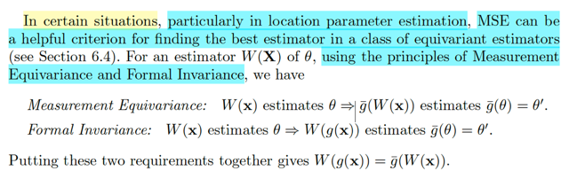</kbd>

> [!NOTE]
> Thế thì đoạn này đại ý là, TRONG MỘT SỐ TÌNH HUỐNG, ĐẶC BIỆT LÀ
> KHI ESTIMATE LOCATION PARAMETERS, thì MSe có thể là tiêu chí hữu
> ích để giúp tìm ra BEST estimator trong một lớp các EQUIVARIANT
> ESTIMATOR.
>
> Chỗ này ôn lại một chút về khái niệm equivariant:
>
> Trong 6.4, mình học về cái gọi là Equivariant principle. Đại khái là vầy:
>
> Ví dụ như giả sử ta có random sample size 1, X ~ binomial(n, p), và ta
> dùng T(x), là một function, áp lên X, để có T(X) làm estimator cho p, và với
> observed value x của X, ta có T(x) là một estimate của p
>
> (những dòng này, thật ra nếu không nắm chắc các định nghĩa thì sẽ rất dễ
> lú, cụ thể là khi nói T(x) là một function, thì focus vào T, vào bản chất
> function, thì x ở đây chỉ là trang trí, là dummy variable, ta dùng T(u), T(v),
> gì cũng được. Và khi áp function này vào random sample X, mà ở đây size
> 1, nên viết thường thay vì **X**= (X1,..Xn), thì ta sẽ có một statistic T(X),
> cũng là một estimator (cho θ, mà ở đây, ví dụ mình đang quan tâm p_ vì
> định nghĩa của chúng về cơ bản là như nhau. Và với cái statistic /
> estimator / random variable T(X) này thì một giá trị cụ thể của nó, có được
> khi nhấn giá trị observed value vào, T(x)  sẽ chính là một "point estimate"
> value của θ, thì x lúc này đóng vai quan trọng, là observed value của X
> chứ ko phải thằng ất ơ nào)
>
> Thế thì: Trong ví dụ này được tác giả dùng là vì rất dễ để minh họa cho 
> equivariant principle. Đó là ta biết nếu X ~ binomial(n, p), có story là số
> Bern(p) trial success trong n iid Bern(p) trials. Thì Y = n - X, sẽ có story
> là số Bern(p) trial fail trong n iid Bern(p) trials. Và nếu lật lại, gọi failure
> là success, để success rate bây giờ là 1 - p thì Y sẽ là số Bern(1 - p) trial 
> success trong n trial → Y ~ binomial(n, 1 - p).
>
> Rồi với X, ~ binomial(n, p), như trên đã nói, ta dùng T(X) estimator cho p, 
> hay T(X)|X=x, hay T(x), estimate cho (giá trị của cụ thể) p.
>
> Tương tự, gọi T*(Y) là estimator cho 1 - p, T*(y) estimate cho 1 - p
>
> Thế thì, ta có:
>
> T(x) estimate p (1)
>
> T*(y) = T*(n - x) estimate 1 - p (2)
>
> ⇔ 1 - T*(n - p) estimate p (3)
>
> Từ (1) (3) suy ra T(x) = 1 - T*(n - x) 
>
> ⇔ T*(n - x) = 1 - T(x) (3)
>
> Và từ (1),(2),(3) ta sẽ có kết luận: 
>
> T(x) estimate p ⇨ 1 - T(x) estimate 1 - p
>
> **T(x) estimate p ⇨ gbar(T(x)) estimate gbar(p)**
>
> Đây chính là minh họa cụ thể của phát biểu khái quát của Measurement
> Principle:
>
> **W(x) estimate θ ⇨ gbar(W(x)) estimate gbar(θ) = θ' (I)**
>
> ====
>
> Rồi, tiếp, ở trong ví dụ này, ta thấy T(x) estimate p, T*(y) = T*(n-x) estimate 1-p
>
> Thì dễ thấy QUY TRÌNH SUY LUẬN PHẢI GIỐNG NHAU, là vì X ~ binomial
> thì Y cũng ~ binomial. X muốn infer p cũng tương đương Y muốn infer 1 - p.
> Nên quy trình phải giống nhau. Nên T phải giống T*. 
>
> Và đây cũng chính là vế thứ hai của Equivariance Principle: Formal priciple,
> nói nói rằng, nếu bài toán có chung cấu trúc toán học (formal structure), bao
> gồm: giống parameter space Θ, giống không gian các family các distribution,
> và vài ý nữa. Thì quy trình suy luận phải giống nhau. Tức là ở đây, T phải giống
> T*
>
> Do đó, như đã nói ở trên: HÀM T, cũng phải chính là T*
>
> Để từ đó T(z) = T*(z) với mọi z.
>
> Và áp dụng vào đây ta sẽ có T*(y) = T(y) ⇔ T*(n - x) = T(n - x)
>
> Vậy thì, ta có: Từ (2) T*(y) = T*(n - x) estimate 1 - p 
>
> ⇨ T(n - x) estimate 1 - p luôn
>
> Vậy T(x) estimate p ⇨ T(n - x) estimate 1 - p
>
> Với g(u) = n - u, gbar(v) = 1 - v 
>
> Vậy **T(x) estimate p ⇨ T(g(x)) estimate gbar(p)**
>
> Và ta sẽ có phát biểu khái quát của Formal Principle mà trong case này 
> áp dụng cụ thể với g(u) = n - u, gbar(v) = 1 - v:
> **W(x) estimate θ ⇨ W(g(x)) estimate gbar(θ) = θ' (II)
>
> Và kết hợp (I) và (II) ta sẽ dễ hiểu rằng:
>
> gbar(W(x)) = W(g(x))**

 

<kbd>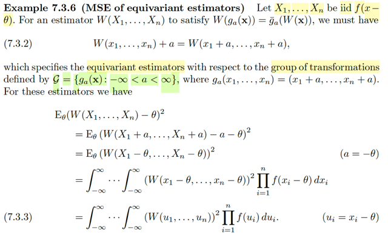</kbd>

> [!NOTE]
> Rồi, qua ví dụ này, ta có X1,....Xn là iid f(x - θ). Là sao nhỉ?
>
> Đây là cái liên quan đến location family đã học ở chap 3. Đại khái là  f(x)
> là standard member của family với location zero. thì f(x - θ) sẽ tạo nên
> pdf của các thành viên khác trong family mà distribution có chung dạng
> nhưng khác location (location = θ). Và X1,...Xn là random sample có
> population là thành viên của family này.
>
> Rồi, tiếp thầy nói để estimator W(X1,...Xn) thỏa W(g_a(**x**)) = gbar_a(W(x))
> thì .... Dừng lại tí, vì đã bỏ 1 bữa, ta có thể đã quên, hoặc ko còn nhớ chính
> xác cái này là sao. Mình sẽ ôn lại lần nữa.
>
> Trước tiên, đây là công thức khái quát của Equivariance Principle.
>
> Nó có hai phần (ý), nói rằng:
>
> Measurement principle và Formal principle
>
> Measurement principle nói đại ý là nếu ta có liên hệ Y = g(X), mang tính cách
> chỉ là biến đổi thước đo. Ví dụ X là đo (lấy giá trị quan sát được) theo cm, để
> g(.) chuyển gía trị quan sát đó ra inch để có Y (tức x, và y là hai bộ quan sát
> chỉ khác nhau thước đo) thì nguyên tắc measurement principle nói rằng việc
> suy luận về θ từ chúng phải có liên hệ với nhau.
>
> Lấy ví dụ X ~ binomial(n, p). Ta dùng T(x) để estimate p. (1)
>
> Thì nếu đặt Y = n - p, thì ta đã biết: 
>
> X có story là số Bern(p) trial success in n iid trials. 
>
> Thì dĩ nhiên Y = n - X là số Bern(p) failure in n iid trials. Bằng cách coi failure
> (có tỉ lệ xảy ra là 1 - p) là success, thì Y cũng là số trial success trong chuỗi
> n iid Bern(1 - p) trials → Y ~ binomial(1 - p)
>
> Rồi, gọi T*(Y) estimator cho (1-p), hay, T*(y) estimate 1 - p.
>
> ⇔ 1 - T*(y) estimate p (2)
>
> Từ (1)(2) ⇨ T(x) = 1 - T*(y) ⇔ T*(y) = 1 - T(x)
>
> Vậy (2) ⇔ 1 - T(x) estimate 1 - p
>
> Vậy ở đây T(x) estimate p ⇨ 1 - T(x) estimate 1 - p.
>
> hay T(x) estimate p ⇨ gbar(T(x)) estimate gbar(p)
>
> Khái quát lên W(**x**) estimate θ ⇨ gbar(W(**x**)) estimate gbar(θ)
>
> Đây chính là phát biểu khái quát của Measurement Principle.
>
> ====
>
> Tiếp, ta có X ~ binomial(n, p), T(X) estimator cho p.
>
> còn Y ~ binomial(n, 1 - p), T*(Y) estimator cho 1 - p.
>
> Thì theo formal principle, vì đây là hai bài toán có chung cấu trúc toán học,
> nên quy trình suy luận phải giống nhau. Tức là:
>
> T(z) = T*(z) với mọi z.
>
> Vậy T*(y) = T(y) ⇔ T*(n - x) = T(n - x)
>
> Vậy T*(y) estimate 1 - p ⇔ T(n - x) estimate 1 - p.
>
> Vậy T(x) estimate p ⇨ T(n - x) estimate 1 - p
>
> khái quát: W(**x**) estimate θ ⇨ W(g(**x**)) estimate gbar(θ)
>
> Đây là phát biểu khái quát của Formal Principle.
>
> Tổng hợp lại ta có:
>
> W(**x**) estimate θ ⇨ gbar(W(**x**)) estimate gbar(θ)
>
> W(**x**) estimate θ ⇨ W(g(**x**)) estimate gbar(θ)
>
> Kết luận W(g(**x**)) = gbar(W(**x**))
>
> =====
>
> Và suy ngẫm một chút ý nghĩa của cái này:
>
> Đó là khi ta transform (of measurement) observed data g(x), thì kết quả
> suy luận từ đó (W(g(x))) sẽ giống như ta thực hiện suy luận từ data gốc W(x)
> và thực hiện biến đổi: gbar(W(x)).

> [!NOTE]
> Rồi, quay lại đây, đại khái là: tác giả nói, xét g_a(x1, ...xn) = (x1 + a, ...,xn + a)
> thì ta sẽ có một group of transformations: 
>
> G = {g_a(x): -inf < a < inf} 
>
> Thì nếu như W(**X**) mà thỏa W(x1,..xn) + a = W(x1 + a, ...xn + a) thì nó sẽ thỏa
> W(g_a(**x**)) = gbar_a(W(**x**)) và từ đó nó được gọi là equivariant estimator with
> respect to G.
>
> Vậy thì trước tiên cần ôn lại, định nghĩa của group of transformation: Đại ý nó là 
> tập mà: 
>
> 1) Nếu một thành viên g ∈ G sao cho g map x với g(x) thì tồn tại g' ∈ G làm ngược
> lại chuyện đó: g' map g(x) thành x.
>
> 2) Nếu g map x với g(x) và g' map g(x) với g'(g(x)) thì cũng tồn tại g'' = map x với
> g'(g(x)).
>
> Kiểm tra xem G = {g_a(x): -inf < a < inf} với g_a(x1, ...xn) = (x1 + a, ..., xn + a) 
> có phải là thỏa group of transformation không:
>
> Giả sử g_a map x = (x1,... xn) với g_a(x) = x1 + a, ... xn + a) thì có tồn tại thành
> viên nào khác làm ngược lại không? Có:
>
> Đó là g_(-a)(x) = x1 - a,...xn - a). Rõ ràng:
>
> g_(-a) ∈ G, và g_(-a)(g_a(x)) = x1 + a - a,...xn + a - a = x1, ..xn. Vậy nó đã map
> g_a(x) về ngược lại thành x.
>
> nếu có g_a map x thành (x + a) và g_b map x thành x + b thì có tồn tại thành
> viên g_c map x thành x + a + b: Có đó chính là g_(a+b)
>
> Cuối cùng nó có chứ identity. Đơn giản là g_a với a = 0. g_a(x) = x.
>
> Vậy thì G trên gọi là group of transformation. và g_a thuộc G sẽ thỏa mãn cái
> gọi là transformation of measurement.
>
> Nhờ đó, với y = g(x) thì nếu mà W thỏa tính chất này W(g_a(x)) = gbar_a(W(x)). 
> thì W sẽ được gọi là equivariant estimator.
>
> Giống như T (cũng = T*) trong ví dụ của binomial vậy, vì nó thỏa hai điều kiện
> của equivariante measurement.

> [!NOTE]
> Vậy có thể check lại vì sao phải thỏa 7.3.2 thì mới là equivariant estimator wrt G?
>
> Là vì: Yêu cầu là thoả cái này W(g_a(x)) = gbar_a(W(x)).
>
> Vậy gbar_a là cái gì?
>
> cho rằng X ~ f(x - θ), tức location θ. Và ta có Y = g_a(X) = X + a
>
> Transformation theorem:
>
> fY(y) = fX(x) |dx/dy| = fX(y - a) * |1| = fX(y - a) (cũng là fX(x)|x=y-a) = f(x - θ)|x=y-a 
>
> = f(y - a - θ)
>
> Mà f là pdf của thành viên chuẩn, có location = 0, nên f(y - a - θ) là pdf của thành
> viên có location a + θ.
>
> Như vậy, X có location θ, Y = g_a(X) có location θ + a
>
> Như vậy trong trường hợp này gbar_a(u) = u + a.
>
> Dẫn đến để mà estiamator W thỏa mãn là equivariant estimator thì:
>
> Điều kiện khái quát: W(g_a(x)) = gbar_a(W(x)) sẽ cụ thể trở thành:
>
> W(x + a) = W(x) + a
>
> hay W(x1 + a,...xn + a) = W(x1, ..xn) + a
>
> Đây chính là 7.3.2

> [!NOTE]
> Rồi, thế thì với các estimator này (equivariant estimator wrt group of 
> transformation) thì MSE của chúng sẽ là:
>
> MSE của estimator W, như đã biết, là function of θ: MSE_θ(W)
>
> = E_θ[W(X) - θ]^2 
>
>
> Áp dụng W(X1 + a,...,Xn + a) = W(X1, ..Xn) + a
>
> ⇔ W(X1,...,Xn) = W(X1 + a,...,Xn + a) - a
>
> ..= E_θ[W(X1 + a,...,xn + a) - a - θ]^2
>
> Chọn a = - θ
>
> ..= E_θ[W(X1 - θ,...,Xn - θ) + θ - θ]^2
>
> = E_θ[W(X1 - θ,...,Xn - θ)]^2
>
> = ∫-inf:inf....∫-inf:inf [W(x1 - θ,...,xn - θ)]^2 fX1,..Xn(x1,..xn) d**x**
>
> = ∫-inf:inf....∫-inf:inf [W(x1 - θ,...,xn - θ)]^2 Πi=1:n fXi(xi) dxi
>
> = ∫-inf:inf....∫-inf:inf [W(x1 - θ,...,xn - θ)]^2 Πi=1:n f(xi - θ) dxi
>
> Đặt ui = xi - θ 
>
> = ∫-inf:inf....∫-inf:inf [W(u1,...,un)]^2 Πi=1:n f(ui) dui
>
> Và kết quả này không phụ thuộc θ, mà là constant.
>
> Do đó có thể dùng MSE để sắp xếp các estimator và tìm ra cái có
> MSE nhỏ nhất.
>
> Có nghĩa là: trong các estimator thỏa tính chất là equivariant estimator
> w.r.t group of transformation G = {g_a(x): -inf < a < inf}. g_a(**x**) = (**x** + a)
> thì bằng cách chọn a = θ, thì MSE của chúng không phụ thuộc θ.Và
> từ đó ta có thể tìm ra cái có MSE nhỏ nhất.
>
> Nên dĩ nhiên đây là solution của bài toán tối ưu có ràng buộc:
>
> minimize E_θ[(W(X1,...Xn) - θ)]^2 subject to  W(x1,..xn) + a = W(x1 + a,...
> xn + a)

 

<kbd>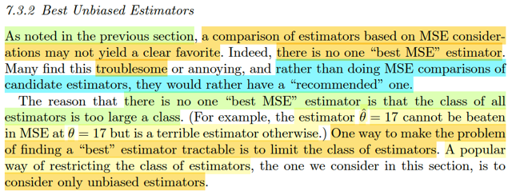</kbd>

> [!NOTE]
> Đại khái là, tác giả nhắc lại một nhận định đã nói ở phần trước: Rằng với
> MSE (với tư cách là thước đo đánh giá estimator) thì không có cái nào 
> là tốt nhất cả. Mà lí do chính là bởi vì: Cái class of all estimator, (tạm dịch
> là tập hợp mọi estimator) là quá rộng, qúa lớn.
>
> Dừng một chút, nhớ lại định nghĩa của estimator: Là ANY function of random
> sample: W(X1,...Xn). Thì ta có thể hiểu ý trên, vì trong phần nói về định nghĩa
> của estimator, tác giả cũng đã nói, định nghĩa này rất vague (mơ hồ), và theo
> đó thì rất khó để xác định, nên xây dựng estimator như thế nào, từ đó mới
> dẫn đến các phương pháp xây dựng estimator mà điển hình là 3 cái đã học:
> method of moment, mle và Bayes.Vậy thì nay, với việc đánh giá estimator,
> thì nguyên nhân khiến MSE khó giúp tìm ra best estimator cũng vì tập các
> estimator quá lớn. Tác giả lấy ví dụ, nếu θ thật sự = 7, thì cái stupid (như 
> valid) estimator θ^ = 7 đương nhiên sẽ có mse = 0, tức là rất tốt. Và có có
> valid là định nghĩa của estimator không? ⇨ Có, đó vẫn là function of sample,
> và ở đây nó là W(X1,...Xn) = 7. Nhưng rõ ràng là θ^ = 7 không phải là good
> estimator nếu θ thật sự là 100.
>
> Do đó, mới nói đến một cách để làm cho bài toán tìm best estimator trở nên
> tractable (bớt cồng kềnh), đó là ta sẽ GIỚI HẠN PHẠM VI TÌM KIẾM LẠI,
> THU NHỎ CLASS OF ESTIMATOR LẠI.
>
> MÀ MỘT CÁCH PHỔ BIẾN ĐẦU TIÊN LÀ CHỈ TÌM TRONG CÁC UNBIASED
> ESTIMATOR

 

<kbd>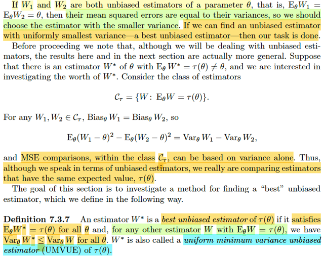</kbd>

> [!NOTE]
> Rồi, thế thì nếu như ta tìm kiếm trong các unbiased estimator. mà như đã biết,
> điều này có nghĩa là với unbiased estimator W thì: E_θ(W) = θ, và MSE
> của nó chỉ còn là bằng variance của nó: MSE_θ(W) = Var(W) + [Bias_θ(W)]^2 
>
> = Var(W)
>
> Nên giả sử ta có W1, W2 là unbiased estimator, thì việc so sánh giữa MSE của
> chúng trở thành việc so sánh Variance của chúng. Và việc tìm best unbiased
> estimator chỉ là tìm cái nào có variance nhỏ nhất.
>
> Nhưng đại ý là, cách này nó mang tính chất rộng hơn, không chỉ là tìm best
> unbiased estimator. Mà ví dụ như ta có một class các estimator sao cho 
> biased của chúng đều giống nhau:
>
> C_τ = {W: E_θW = τ(θ) (đồng nghĩa Bias_θ(W) = τ(θ) - θ)}
>
> thì khi đó chênh lệnh MSE của chúng cũng chỉ là chênh lệch của variance:
>
> E_θ(W1 - θ)^2 - E_θ(W2 - θ)^2 = Var_θ(W1) - Var_θ(W2)
>
> Và việc tìm kiếm trong C_τ sẽ cho ta cái có MSE nhỏ nhất trong số những cái
> có cùng độ bias (tức cũng là cùng mean E_θ(W))

 

<kbd>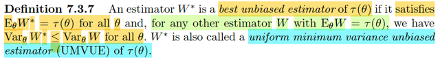</kbd>

> [!NOTE]
> Và ta có định nghĩa của uniform minimum variance unbiased estimator of τ(θ)
>
> Đó là nếu W* thỏa: E_θ(W*(X)) = τ(θ), với mọi θ. Và với mọi estimator W
> khác có E_θ(W) = τ(θ) thì Var_θ(W*(X)) ≤ Var_θ(W(X)) ∀ θ. Thì khi đó W*
> được gọi là uniform minimum variance unbiased estimator of τ(θ)
>
> Mình phải hiểu thế này, đây là định nghĩa khái quát và nó bao gồm cả với
> unbiased estimator of θ: Khi xét τ(θ) = θ. Thì ta có định nghĩa của uniform
> minimum variance unbiased estimator of θ: Là xét W* sao cho E_θ(W*(X)) =
> θ  với mọi θ. Và trong số những estimator W có E_θ(W(X)) = θ thì W* là có
> variance nhỏ nhất.

 

<kbd>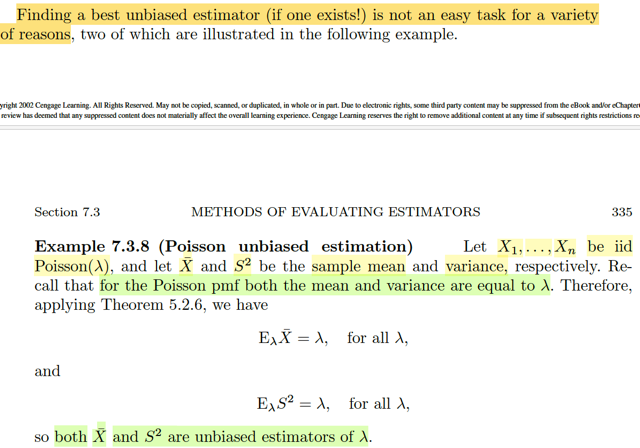</kbd>

🔗 **Related:** [5.2 Σ OF RANDOM VARIABLES FROM A RANDOM SAMPLE](52_σ_of_random_variables_from_a_random_sample.md#node-344)

> [!NOTE]
> Thế thì tác giả cho biết việc tìm best unbiased estimator (giả sử có tồn tại)
> cũng ko phải là chuyện dễ, vì nhiều lí do mà ta sẽ minh họa bởi ví dụ sau
>
> Đầu tiên, X1,...Xn là iid Pois(λ) và Xbar và S^2 là sample mean và sample
> variance.
>
> Thì ta biết với X ~ Pois(λ) thì EX = λ và Var(X) = λ. Nên theo theorem 5.2.6 thì
> E_λ(Xbar) = λ, và E_λ(S^2) = λ. Chỗ này là sao nhỉ:
>
> Dễ hiểu thôi, theo theorem 5.2.6 (xem link) thì EXbar = μ (population mean) và
> E(S^2) = σ^2 (tức population variance).
>
> Nên ở đây mean và variance đều là λ thì E_λ(Xbar) = λ và E_λ(S^2) = λ
>
> Mà theo định nghĩa của unbiased estimator of θ, thì 
>
> biased_θ(W(**X**)) = E_θ(W(**X**)) - θ, 
>
> và khi biased_θ(W(**X**)) = 0 tức E_θ(W(**X**)) = θ thì W gọi là unbiased estimator

 

<kbd>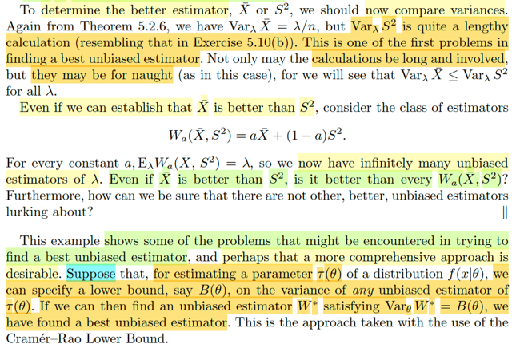</kbd>

> [!NOTE]
> Đại ý là như vậy với việc Xbar và S^2 đều là unbiased estimator của λ 
> để xem cái nào tốt hơn, ta sẽ so sánh variance.
>
> Nhưng tại đây ta sẽ thấy việc tìm variance của S^2 là khá dài dòng và
> rắc rối.
>
> Và rồi, ngay cả khi ta chứng minh được Xbar có variance thấp hơn S^2
> thì ta sẽ thấy rằng bằng cách combine Xbar và S^2 với bộ hệ số tổng 
> bằng 1, thì ta cũng có vô số estimator khác cũng có bias = 0:
>
> W_a (Xbar, S^2) = aXbar + (1-a)S^2
>
> (nhớ rằng, Xbar, S^2 thực chất là Xbar(**X**), S^2(**X**), và W_a trên là ta 
> apply function lên hai estimator / statistic thì cũng ra một estimator/statistic
> mới)
>
> Và E_λ(W_a) = E[aXbar + (1-a)S^2] = aEXbar + (1-a) ES^2 = aλ + (1-a)λ
>
> = λ 
>
> Và như vậy lại đặt ra vấn đề là trong vô số những cái unbiased estimator
> của λ này thì cái nào là tốt nhất đây.
>
> Do đó, cần phải có một CÁCH TIẾP CẬN TOÀN DIỆN HƠN. Đại khái là
> cách làm đó là, 
>
> Giả sử đang tìm best unbiased estimator của τ(θ), thì nếu ta có thể tìm ra 
> một CẬN DƯỚI CỦA VARIANCE CỦA MỌI UNBIASED ESTIMATOR, kí
> hiệu là B(θ). Rồi sau đó, chỉ ra Var_θ (W*) = B(θ) thì khi đó đương nhiên
> dễ hiểu W* sẽ là best unbiased estimator

 

<kbd>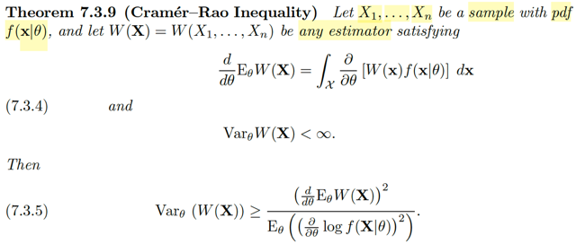</kbd>

> [!NOTE]
> Cramer-Rao inequality, cho X1,...Xn là random sample với pdf f(**x**|θ), và
> W(**X**) = W(X1,...Xn) là ANY estimator THỎA:
>
> d/dθ E_θ W(**X**) = ∫_range of **X**∂/∂ [W(**x**)f(**x**|θ)]d**x**và Var_θ(W(**X**)) < infinity
>
> Thì Var_θ(W(**X**)) ≥ [d/dθ E_θ[W(**X**)]^2] / [E_θ[(∂/∂θ log f(**X**|θ))^2]]

 

<kbd></kbd>

> [!NOTE]
> Đầu tiên ta sẽ nhớ lại Cauchy-Schwarz Inequality
>
> [Cov(X,Y)]^2 ≤ Var(X)Var(Y)
>
> Cái này đã học trong Stat111 với giáo sư Joe Blizstein, nhưng lúc đó
> mình học dạng của nó là |E(XY)| ≤ √[E(X^2)E(Y^2)]
>
> Trong bài giảng đó gs cũng không chứng minh, chỉ nói về sự liên quan
> của nó với tính chất của correlation giữa X, Y sẽ luôn có giá trị từ -1 tới
> 1.
>
> Thế thì ta sẽ chứng minh như sau:
>
> Gọi U = X - EX ⇨ EU = EX - E(EX) = EX - EX = 0. 
>
> E[U^2] = E[(X - EX)^2] = E[X^2 - 2XEX + (EX)^2]
>
> = EX^2 - 2E[XEX] + E[(EX)^2]
>
> = EX^2 - 2EXEX + (EX)^2
>
> = EX^2 - (EX)^2
>
> = VarX
>
> Tương tự V = Y - EY, ⇨ E[V^2] = VarY
>
> Cov(X,Y) = E[(X-EX)(Y-EX)] = chính là E[UV]
>
> Vậy cái cần chứng minh chính là: [E(UV)]^2 ≤ E[U^2]E[V^2]
>
> Tiếp, xét biểu thức (tU + V)^2, đương nhiên ≥ 0
>
> nên E[(tU + V)^2] cũng ≥ 0
>
> ⇔ E[t^2U^2 + V^2 + 2tUV] ≥ 0
>
> ⇔ E[t^2U^2] + E[V^2] + E[2tUV] ≥ 0
>
> ⇔ t^2 E[U^2] + E[V^2] + 2t E[UV] ≥ 0
>
> Vế trái là hàm bậc hai, để nó luôn ≥ 0 thì phương trình 'vế trái' = 0
> phải vô nghiệm hoặc có nghiệm duy nhất.
>
> ⇔ biệt thức (B^2 - 4AC) ≤ 0
>
> ⇔ (2E[UV])^2 - 4E[U^2]E[V^2] ≤ 0
>
> ⇔ 4E[UV]^2 ≤ 4E[U^2]E[V^2]
>
> ⇔ E[UV]^2 ≤ E[U^2]E[V^2]
>
> ⇔ [Cov(X,Y)]^2 ≤ VarX VarY
>
> Chứng minh xong.
>
> Nên cái mấu chốt là nhớ bắt đầu từ (tU + V)^2 ≥ 0 với U = X - EX,
> V = Y - EY.
>
> Nói thêm, để dấu bằng xảy ra thì cần B^2 = 4AC
>
> ⇔ E[UV]^2 = E[U^2]E[V^2]

 

<kbd>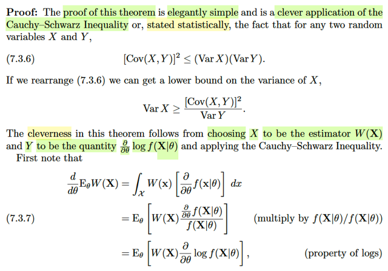</kbd>

> [!NOTE]
> Rồi, khi đã hiểu cái nguồn gốc của Cauchy-Schwarz inequality, ta không lăn
> tăn về nó nữa, áp dụng thôi. Đây sẽ là cái gốc để chứng minh theorem 
> Cramer-Rao này:
>
> Viết lại Cauchy-Schwarz inequality:
>
> [Cov(X,Y)]^2 ≤ VarX VarY
>
> ⇔ VarX ≥ [Cov(X,Y)]^2 / VarY
>
> Giờ ta sẽ chọn X là W(**X**), và Y là ∂/∂θ log f(**X**|θ). Dừng lại chút: Là vì inequality
> trên là nói về / áp dụng cho hai random variable X, Y bất kì.
>
> Vì W(**X**), như đã biết, cũng là một random variable, có được bằng cách apply
> function W(.) lên random variable vector **X**.
>
> Còn ∂/∂θ log f(**X**|θ)? Đầu tiên nên hiểu nó là ∂/∂θ [log f(**x**|θ)], là đạo hàm log f(x|θ)
> theo θ, nó sẽ vẫn là một hàm g(**x**|θ) nào đó. Xong ta áp hàm này lên random
> variable vector **X**, dĩ nhiên được một random variable: ∂/∂θ log f(**X**|θ) 
>
> Vậy ta có: Var[W(**X**)] ≥ [Cov(W(**X**),∂/∂θ log f(**X**|θ))]^2 / Var_θ[∂/∂θ log f(**X**|θ)] 
>
> Thế thì vì cái mình cần chứng minh là:
>
> Var_θ[W(**X**)] ≥ {d/dθ E_θ[W(**X**)]}^2 / E_θ[(∂/∂θ log f(**X**|θ)^2]
>
> nên ta sẽ xem: 
>
> 1) Cov {W(**X**) , ∂/∂θ log f(**X**|θ)} có phải là d/dθ E_θ W(**X**)
>
> 2) Var_θ[∂/∂θ log f(**X**|θ)] có phải là E_θ[(∂/∂θ log f(**X**|θ)^2]
>
> ====
>
> Ta sẽ xét cái d/dθ E_θ W(**X**):
>
> Thế thì theo cái tính chất ta có estimator W(**X**) thỏa:
>
> d/dθ E_θ W(**X**) = ∫_range of **X** ∂/∂θ [W(**x**)f(**x**|θ)]d**x**= ****∫_range of **X** W(**x**) ∂/∂θ[f(**x**|θ)] d**x**=  ∫_range of **X** [W(**x**) ∂/∂θ[f(**x**|θ)] /f(**x**|θ)] f(**x**|θ) d**x**   
>
> (nhân và chia đi cho f(**x**|θ, mình cho rằng chỗ này sách ghi sai, khi ghi là nhân 
> và chia cho f(**X**|θ))
>
> thì cái ta có sẽ có dạng ∫_range of **X**h_θ(**x**) f(**x**|θ)d**x**,
>
> thì đó chính là E_θ[h_θ(**X**)]
>
> vậy .. = E_θ [W(**X**) ∂/∂θ[f(**X**|θ)] / f(**X**|θ)] 
>
> Rồi, xét cái W(**X**) ∂/∂θ[f(**X**|θ)] / f(**X**|θ) cũng không khó để thấy nó chính là:
>
> W(**X**) ∂/∂θ log f(**X**|θ)  
>
> Vậy, d/dθ E_θ W(**X**) = E_θ [W(**X**) [∂/∂θ log f(**X**|θ)]], 
>
> nhưng cái ta cần là Cov(W(**X**), [∂/∂θ log f(**X**|θ)]), mà công thức sẽ cần thêm
>
> E[W(**X**)] E[∂/∂θ log f(**X**|θ)]]. 
>
> Vì ta nhớ công thức Cov(X,Y) = EXEY - EXY:
>
> Ôn lại nhanh Cov(X,Y) = E[(X - EX)(Y - EY)] = E[XY - (EX)Y - XEY - EXEY]
>
> = E[XY] - E[(EX)Y] - EXEY - E[EXEY]
>
> = E(XY) - EXEY
>
> Vậy ta cần thêm E[W(**X**)] E[∂/∂θ log f(**X**|θ)]]
>
> Tuy nhiên ta sẽ chứng minh cái này bằng 0: 
>
> Bằng cách dùng kết qủa đang có: d/dθ E_θ W(**X**) = E_θ [W(**X**) [∂/∂θ log f(**X**|θ)]], 
>
> Và áp dụng nó với W(**X**) = 1, vì kết quả này luôn đúng với mọi W thỏa 7.3.4, và
> W(**X**) = 1 là một cái thỏa (mà ta sẽ nói ở sau), nên phải đúng với W(**X**) = 1:
>
> d/dθ E_θ [1] = E_θ [[∂/∂θ log f(**X**|θ)]], 
>
> ⇔ 0 = E_θ [∂/∂θ log f(**X**|θ)]
>
> Vậy E[W(**X**)] E[∂/∂θ log f(**X**|θ)]] cũng = 0
>
> Và d/dθ E_θ W(**X**) = E_θ [W(**X**) [∂/∂θ log f(**X**|θ)]]
>
> = E_θ [W(**X**) [∂/∂θ log f(**X**|θ)]] - E[W(**X**)] E[∂/∂θ log f(**X**|θ)]]
>
> = Cov(W(**X**), [∂/∂θ log f(**X**|θ)])
>
> Vậy chứng minh xong (1) {d/dθ E_θ[W(**X**)]}^2 = {Cov(W(**X**), [∂/∂θ log f(**X**|θ)])}^2
>
> ====
>
> Tiếp, cái (2): E_θ[(∂/∂θ log f(**X**|θ)^2] có phải là Var_θ[∂/∂θ log f(**X**|θ)] :
>
>  Thì rõ ràng, vì: 
>
> Var_θ[∂/∂θ log f(**X**|θ)] = E[(∂/∂θ log f(**X**|θ)]^2 - (E[(∂/∂θ log f(**X**|θ)^2])^2
>
> = E[(∂/∂θ log f(**X**|θ)]^2 - (0)^2
>
> = E[(∂/∂θ log f(**X**|θ)]^2
>
> Vậy là đã chứng minh xong.
>
> Tóm tắt:
>
> 1) Bắt đầu với Cauchy-Schwarz inequality [Cov(X,Y)]^2 ≤ VarX VarY 
>
> ⇔ VarX ≥ [Cov(X,Y)]^2 / VarY
>
> 2) Áp dụng nó với W(**X**) (trong vai X) và [∂/∂θ log f(**X**|θ)] (trong vai Y)
>
> Để có Var[W(**X**)] ≥ [Cov(W(**X**), ∂/∂θ log f(**X**|θ))]^2 / Var_θ[∂/∂θ log f(**X**|θ)]
>
> 3) Và sau đó ta chứng minh:
>
> 1) Cov {W(**X**), ∂/∂θ log f(**X**|θ)} chính là d/dθ E_θ[W(**X**)]
>
> 2) Var_θ[∂/∂θ log f(**X**|θ)] chính là E_θ[(∂/∂θ log f(**X**|θ)^2]

 

<kbd>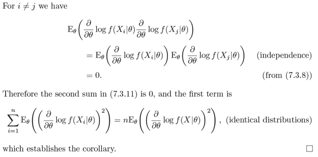</kbd>

<kbd></kbd>

<kbd>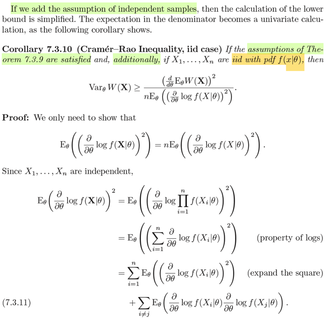</kbd>

> [!NOTE]
> Tiếp, nếu các samples độc lập (mình hiểu là random variable X1,...Xn trong
> random sample độc lập, thì cái kì vọng trong mẫu số sẽ trở thành chỉ dính tới
> các univariate:
>
> Dễ hiểu thôi: Bổ đề này nói rằng nếu ta có iid X1,...Xn và W(**X**) thỏa các điều
> kiện của Theorem Cramer Rao thì ta sẽ có kết quả 7.3.10
>
> Thế thì ta chỉ cần bắt đầu với Cramer Rao:
>
> Var_θ[W(**X**)] ≥ {d/dθ E_θ[W(**X**)]}^2 / E_θ[(∂/∂θ log f(**X**|θ)^2]
>
> Và xét cái mẫu số ở vế phải E_θ[(∂/∂θ log f(**X**|θ)^2]:
>
> = E_θ[(∂/∂θ log fX1,..Xn(X1,...Xn|θ)^2]
>
> = E_θ[(∂/∂θ log Πi fXi(Xi|θ)^2]  (do iid, tách joint pdf thành tích marginal pdf)
>
> = E_θ[(∂/∂θ Σi log fXi(Xi|θ)^2]
>
> = E_θ[(Σi ∂/∂θ log fXi(Xi|θ)^2]
>
> = E_θ[(Σi ∂/∂θ log fXi(Xi|θ)^2 + Σi≠j (∂/∂θ log fXi(Xi|θ)) (∂/∂θ log fXj(Xj|θ)) ]
>
> = E_θ[(Σi ∂/∂θ log fXi(Xi|θ)^2] + E_θ { Σi≠j [∂/∂θ log fXi(Xi|θ)] [∂/∂θ log fXj(Xj|θ) }
>
> = Σi E_θ[(∂/∂θ log fXi(Xi|θ)^2] + Σi≠j E_θ[∂/∂θ log fXi(Xi|θ) log fXj(Xj|θ) ]
>
> = Σi E_θ[(∂/∂θ log fXi(Xi|θ)^2] + Σi≠j E_θ[∂/∂θ log fXi(Xi|θ)] E_θ[ log fXj(Xj|θ) ]
>
> (fXi(.|θ) cũng bằng fXj(.|θ) = f(.|θ) do tính identically distributed)
>
> = Σi E_θ[(∂/∂θ log fXi(Xi|θ)^2] + Σi≠j E_θ[∂/∂θ log f(Xi|θ)] E_θ[ log f(Xj|θ) ]
>
> Và vì tính độc lập, tức Xi, Xj i khác j, độc lập, thì hai cái rv ∂/∂θ log f(Xi|θ) và 
> ∂/∂θ log f(Xj|θ) cũng độc lập ⇨ E_θ[∂/∂θ log f(Xi|θ)] E_θ[ log f(Xj|θ) ] = 0
>
> Vậy chỉ còn Σi E_θ[(∂/∂θ log fXi(Xi|θ)^2] 
>
> Σi E_θ[(∂/∂θ log f(Xi|θ)^2]
>
> Σi E_θ[(∂/∂θ log f(Xi|θ)^2]
>
> Và E_θ[(∂/∂θ log f(Xi|θ)^2], với i bằng bao nhiêu thì cũng ra constant, và nó 
> đều giống nhau, vì đều là đang tính: 
>
> Eg(Xi) với g(Xi) = (∂/∂θ log f(Xi|θ)^2, thì theo lotus nó sẽ 
>
> = ∫-inf:inf (∂/∂θ log f(xi|θ)^2 f(xi|θ) dxi 
>
> Và kết quả sẽ giống nhau với mọi i, vì hàm trong tích phân giống nhau, và
> range tích phân giống nhau.
>
> nên kết quả là
>
> n E_θ[(∂/∂θ log f(X|θ)^2]. Chứng minh xong.

 

<kbd>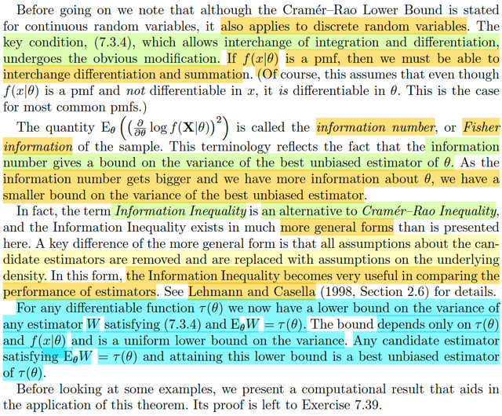</kbd>

> [!NOTE]
> Đại khái là tác giả nói dù Cramer - Rao Lower Bound được state với biến 
> liên tục nhưng dĩ nhiên có thể apply với biến rời rạc, Thế thì yêu cầu sẽ
> là có thể đổi chỗ sum và đạo hàm 
>
> Một cái nữa là, nói về cái đại lượng E_θ[(∂/∂θ log f(**X**|θ))^2] được gọi là 
> information number. Và nó phản ánh cái chặn dưới của variance của best
> unbiased estimator of θ. Ta sẽ có chặn của variance càng nhỏ nếu như
> thông tin càng lớn.
>
> Rồi, tóm lại đều đây ta có:
>
> Với mọi hàm khả vi τ(θ), thì ta đã có chặn dưới về variance của bất kì 
> estimator W thỏa  7.3.4 và E_θ(W) = τ(θ). Và cái bound chỉ phụ thuộc 
> τ(θ) và f(x|θ). Mọi candidate estimator thỏa E_θ(W) = τ(θ) (tức là unbiased
> estimator của τ(θ)) và có variance đạt mức này đều sẽ là BEST UNBIASED 
> ESTIMATOR

 

<kbd>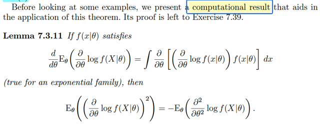</kbd>

> [!NOTE]
> Thêm một bổ đề nữa, giúp tính toán ví dụ sau.
>
> Đại khái nói là nếu pdf/pmf f(x|θ) thỏa (...) và với exponential family thì
> ta có thể có kết quả:
>
> E_θ[(∂/∂θ log f(X|θ))^2] = - E_θ[∂^2/∂θ^2 log f(X|θ)]

 

<kbd>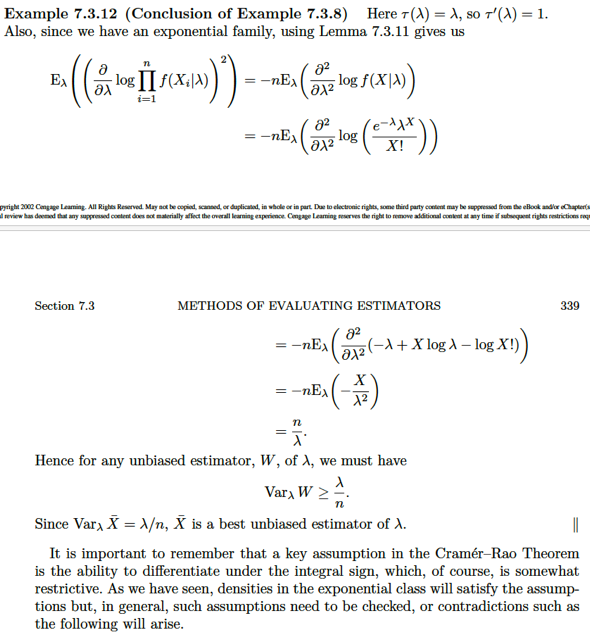</kbd>

> [!NOTE]
> Rồi, áp dụng cái Cramer-Rao inequality, ta quay lại ví dụ 7.3.8:
>
> Ở đây, ta đang estimator của λ, tức coi như τ(λ) = λ.
>
> Nói lại một chút bối cảnh của ví dụ này, ta có sample X ~ Pois(λ) và có
> hai unbiased estimator của λ là Xbar(**X**) và S^2(**X**) (đều có E_λ[Xbar(**X**)]
> = λ và E_λ[S^2(**X**)] = λ
>
> Vậy thì việc tính variance của S^2 rất cồng kềnh, dù tính vẫn được, và
> so sánh variance của Xbar thì sẽ cho phép ta chốt được cái nào là best
> unbiased estimator của λ.
>
> Nhưng nay với Cramer-Rao inequality, ta có công cụ tổng quát và tốt
> hơn: Đại ý là nói ngắn gọn. nó cho ta tính ra một cái chặn dưới của
> variance của các unbiased estimator W của τ(θ) (tức là E_θ[W(**X**)] = τ(θ))
>
> Để rồi, nếu W* là cái có variance nhỏ nhất thì W* chính là the best unbiased
> estimator của τ(θ).
>
> Vậy ta dẫn lại Cramer - Rao inequality:
>
> Var_θ (W(**X**)) ≥ [d/dθ E_θ[W(**X**)] ]^2 / E_θ [(∂/∂θ log f(**X**|θ))^2]
>
> Tử số: Xét d/dθ E_θ[W(**X**)]
>
> thì ở đây phải hiểu cái này là: ta có E_θ[W(**X**)] sẽ là một function theo θ, gọi
> là h(θ), rồi ta sẽ lấy đaọ hàm theo θ, tất nhiên vẫn ra một hàm theo θ.
> Vậy ở đây nếu xét W(**X**), là unbiased estimator của τ(θ), thì đương nhiên
> E_θ[W(**X**)] = τ(θ).
>
> Và trong ví dụ này, ta đang xét unbiases estimator của λ, tức τ(λ) = 1. Lấy đạo
> hàm theo λ, ta có τ'(λ) = 1 (vẫn là hàm theo λ, có điều là constant function)
>
> Vậy ở tử số là 1^2 = 1.
>
> Mẫu số: Ta cần tính E_θ [(∂/∂θ log f(**X**|θ))^2]
>
>
>
> = E_λ [(∂/∂λ log Πi=1:n f(Xi|λ))^2]
>
> = E_λ [(∂/∂λ Σi=1:n log f(Xi|λ))^2]
>
> = nE_λ [(∂/∂λ log f(X|λ))^2]   (1) | do iid nên f(Xi|λ) đều như nhau với mọi i
>
> nên tính kì vọng ra cùng kết quả
>
> Thì để bớt cồng kềnh, ta dùng bổ đề trên, có thể áp dụng ở đây vì Pois
> là thuộc expo familiy 
>
> ⇨ E_θ [(∂/∂θ log f(X|θ))^2] = - E_θ[∂^2/∂θ^2 log f(X|θ)]  
>
> Nên áp dụng với poison:
>
> E_λ [(∂/∂λ log f(X|λ))^2] = - E_λ [∂^2/∂λ^2 log f(X|λ)]  
>
> ⇨ (1) = - nE_λ [∂^2/∂λ^2 log e^-λ λ^X / X!]
>
> = - nE_λ [∂^2/∂λ^2 [log e^-λ + log λ^X - log X!]]  
>
> = - nE_λ [∂^2/∂λ^2 [log e^-λ] + ∂^2/∂λ^2 [log λ^X] - ∂^2/∂λ^2 [log X!]
>
> = - nE_λ [∂^2/∂λ^2 [-λ] + ∂^2/∂λ^2 [X log λ] - 0
>
> = - nE_λ [0 + X ∂^2/∂λ^2 [log λ]
>
> = - nE_λ [X ∂/∂λ [1/λ]]
>
> = - nE_λ [X[-1/λ^2]]
>
> = nE_λ [X/λ^2]
>
> = nE_λ [X] / λ^2
>
> = n (λ / λ^2)
>
> = n / λ
>
> Vậy Var_λ W ≥ λ / n
>
> Và vì Var_λ Xbar = λ / n nên ta kết luận ngay Xbar là best unbiased estimator mà
> khỏi phải tính Var_λ của S^2 làm gì.

 

<kbd>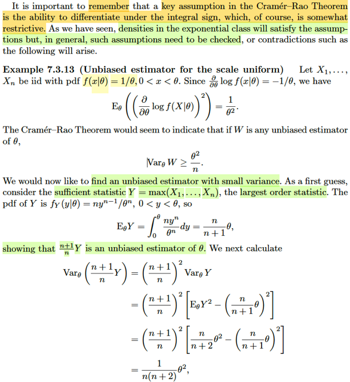</kbd>

🔗 **Related:** [7.3 METHODS OF EVALUATING ESTIMATORS](73_methods_of_evaluating_estimators.md#node-643)

> [!NOTE]
> Đại ý là, tác giả nhắc ta nhớ rằng lưu ý quan trọng của Cramer Rao
> theorem là khả năng đạo hàm bên dưới tích phân. Và có thể thấy
> với exponential class thì thỏa cái assumtion này nhưng nói chung là
> ta phải kiểm tra, nếu không sẽ có vấn đề, minh họa bởi ví dụ này.
>
> Cho X1,...Xn iid ~ f(x|θ) = 1 / θ, 0 < x < θ
>
> Ôn lại Cramer Rao inequality, nó nói rằng với W(**X**) là estimator
> bất kì sao cho
>
> d/dθ E_θ(W(**X**)) = ∫\/X \/∂/∂θ [W(**x**)f(**x**|θ)] d**x** và
>
> Var_θ[W(**X**)] < infinity thì:
>
> Var_θ[W(**X**)] ≥ [d/dθ E_θ[W(**X**)]]^2 / E_θ[(∂/∂θ log f(**X**|θ)^2]
>
> Nhưng với iid case ta sẽ dùng 7.3.10:
>
> Var_θ[W(X)] ≥ [d/dθ E_θ[W(**X**)]]^2 / nE_θ[(∂/∂θ log f(X|θ)^2]
>
> Vậy thì ở đây, thử xem cái tử số: [d/dθ E_θ[W(**X**)]]^2
>
> Nói lại không thừa, bản chất của cái này, đó là ta tính E_θ[W(**X**)], sẽ
> là một function theo θ, rồi mới lấy đạo hàm theo θ, đem bình phương,
> , dĩ nhiên cũng ra hàm theo θ.
>
> Thế thì ở đây, ta sẽ giả sử W(**X**) là unbiased estimator của θ. Nên 
> E_θ[W(**X**)] = θ, d/dθ [E_θ[W(**X**)]]  = d/dθ θ = 1
>
> Còn mẫu số: nE_θ[(∂/∂θ log f(X|θ)^2]
>
> Xét ∂/∂θ log f(X|θ) = 
>
> = ∂/∂θ log(1/θ)
>
> = ∂/∂(1/θ) log(1/θ) . ∂/∂θ (1/θ)
>
> = 1/(1/θ) . (-1/θ^2)  
>
> = θ . (-1/θ^2)  
>
> = (-1/θ)  
>
> = -1/θ
>
> ⇨ nE_θ[(∂/∂θ log f(X|θ)^2]
>
> = nE_θ[[-/θ]^2]
>
> = n/θ^2
>
> Rồi, thế thì nếu theo Cramer - Rao inequality ta sẽ có cái lower bound
> cho variance bất kì estimator W(**X**) nào:
>
> Var_θ[W(**X**)] ≥ 1 / (n/θ^2) = θ^2 / n
>
> (Để ý, đây, lower bound on variance, vẫn là hàm theo θ)
>
> ====
>
> Rồi, Đại ý là tiếp theo, ta chỉ cần tìm ra cái Unbiased estimator
> có variance bằng θ^2 / n thì có thể kết luận nó là best unbiased 
> estimator.
>
> Và ta mới xét một suy đoán đầu tiên: sufficient statistic Y = 
> max(X1,...Xn), cũng là X^(n) tức largest order statistic. Thì trong
> những bài trước đã biết pdf của nó, fY(y|θ) = ny^(n-1) / θ^n, 0 < y < θ
>
> Từ đó ta có thể tính vì vọng E_θY = ∫0:θyfY(y|θ)dy
>
> = ∫0:θ y ny^(n-1) / θ^n dy 
>
> = ∫0:θ ny^n / θ^n dy 
>
> = (n / θ^n) [y^n+1 / (n+1)] |0:θ
>
> = (n / (n+1)θ^n) θ^(n+1) 
>
> = [n / (n+1)] θ
>
> Như vậy dễ hiểu là [(n+1)/n] Y sẽ là một unbiased estimator của θ
>
> Rồi, tiếp tác giả tính VarY, thì ra θ^2 / [n(n+2)] 
>
> Và ý chính muốn nói, cái này, NÓ LẠI NHỎ HƠN CÁI LOWER
> BOUND MÀ CRAMER RAO INEQUALITY NÓI.
>
> θ^2 / [n(n+2)] < θ^2 / n
>
> NHƯ VẬY LÀ. TRONG CASE NÀY, CRAMER RAO INEQUALTY
> KHÔNG ÁP DỤNG ĐƯỢC

 

<kbd>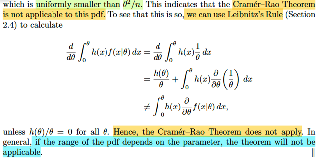</kbd>

> [!NOTE]
> Và thật sự thì nếu dùng Libnitz Rule để tính thì ta sẽ thấy pdf này không
> thỏa assumption của Cramer Rao
>
> Nói chung hiểu ý tưởng chính là cần phải đảm bảo cái assumption là:
> d/dθ E_θ(W(X)) = ∫X ∂/∂θ [W(x)f(x|θ)] dx
>
> tức là phải được phép đưa đạo hàm vào trong tích phân
>
> Và nói chung, nếu range của pdf phụ thuộc vào parameter thì theorem
> này không áp dụng được (trong ví dỵ này chính là như vậy vì f(x|θ) = 1/θ
> và 0 < x < θ → Đây chính là "range phụ thuộc parameter"

 

<kbd>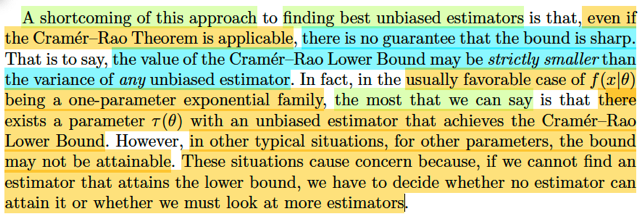</kbd>

> [!NOTE]
> Một vài nhận định: Đại ý là cái cách làm này (nhờ Cramer Rao, tính ra lower
> bound của variance, rồi tìm / chỉ ra candidate estimator có variance bằng cái
> lower bound thì kết luận nó là best unbiased estimator) nó có hạn chế.
>
> Cụ thể là, cái Cramer - Rao Lower Bound có thể qúa nhỏ, hình dung, nó chặn
> dưới, nhưng chặn dưới qúa xa, khiến chẳng có cái estimator nào có variance
> bằng được hết.
>
> Thực tế là với một case yêu thích của ta đó là f(x|θ) thuộc loại one-parameter
> exponential famity thì tất cả những gì ta có thể nói đó là tồn tại một cái
> parameter τ(θ) với unbiased estimator mà có thể đạt Cramer Rao lower
> bound.
>
> Còn thông thường, thì cái bound này thường là unattainable.
>
> Và khi đó ta buộc phải quyết định là không có estimator nào có thể đạt được
> hoặc ta phải tìm thêm nhiều estimator

 

<kbd>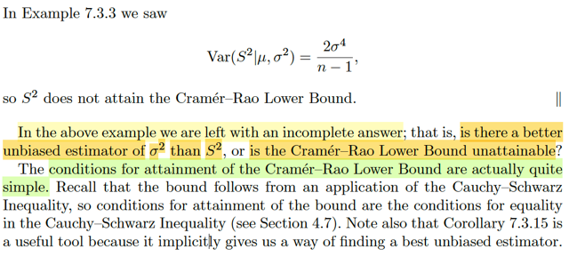</kbd>

<kbd></kbd>

<kbd>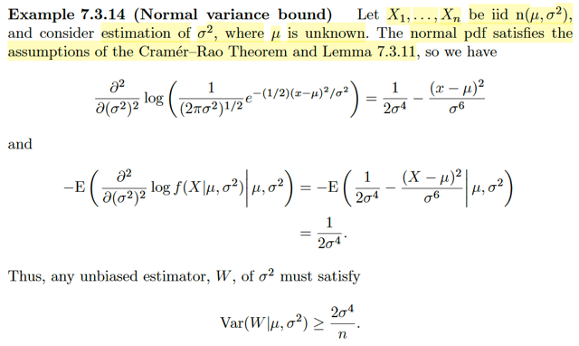</kbd>

> [!NOTE]
> Rồi, ví dụ này sẽ minh họa cho tình huống mà ta thấy cái candidate estimator
> có variance không đạt Cramer Rao Lower Bound dẫn đến ta phải tự hỏi liệu
> là sự thật là CHẢ CÓ CÁI ESTIMATOR NÀO ĐẠT VARIANCE CỦA CRAMER
> RAO LOWER BOUND, HAY LÀ TỒN TẠI CÁI ĐÓ MÀ TA CHƯA BIẾT.
>
> Cho X1,...Xn là iid n(μ, σ^2) và ta xem xét estimator của σ^2, với μ chưa biết
>
> Thế thì tác giả nói rằng, với normal thì nó thỏa assumption của Cramer
> Rao Theorem (tức là d/dθ E_θ(W(**X**)) = ∫\/X\/ ∂/∂θ [W(**x**)f(**x**|θ)] d**x**), 
>
> nên ta có thể áp dụng Cramer Rao Lower Bound theorem:
>
> Var_θ[W(**X**)] ≥ [d/dθ E_θ[W(**X**)]]^2 / E_θ[(∂/∂θ log f(**X**|θ)^2]
>
> với iid ta sẽ dùng cái này:
>
> Var_θ[W(**X**)] ≥ [d/dθ E_θ[W(**X**)]]^2 / nE_θ[(∂/∂θ log f(X|θ)^2]
>
> Và vì cũng là thỏa bổ đề 7.3.11 nên ta có thể dùng identity:
>
> E_θ [[∂/∂θ log f(X|θ)]^2] = - E_θ[∂^2/∂θ^2 log f(X|θ)] để tính cái mẫu dễ hơn.
>
> Áp dụng vào đây đầu tiên ta tính ∂^2/∂θ^2 log f(X|θ), 
>
> tức ∂^2/∂(σ^2)^2 log f(X|θ)
>
> = ∂^2/∂(σ^2)^2 log [1/√(2πσ^2) . exp[-(1/2)(x-μ)^2/σ^2]
>
> = khai triển tính tóan sẽ ra 1/2σ^4 - (x - μ)^2 / σ^6
>
> ⇨ - E[∂^2/∂(σ^2)^2 log f(X|θ)] = -E[1/2σ^4 - (x - μ)^2 / σ^6]
>
> = 1/2σ^4
>
> Như vậy dùng bổ đề 7.3.11, ta có E_θ [[∂/∂θ log f(X|θ)]^2] = 1/2σ^4
>
> từ đó cái mẫu trong Cramer Rao Lower Bound với case iid sẽ là:
>
> n(1/2σ^4) = n/2σ^4
>
> Còn tử số thì dĩ nhiên là 1, vì ta sẽ xét lower bound của các unbiased
> estimator W(**X**): E_θ(W(**X**)) = θ nên [d/dθ E_θ[W(**X**)]]^2 = 1^2 = 1
>
> Vậy nên với các unbiased estimator W(**X**) thì variance của chúng sẽ 
> có lower bound: là 1 / (n/2σ^4) = 2σ^4/n 
>
> (Nhớ nhé, Cramer Rao nói về lower bound của estimator bất kì, nhưng khi
> mình áp dụng cho các unbiased estimator của θ thì cái tử số sẽ là 
> [d/dθ E_θ[W(X)]]^2 = [d/dθ [θ]]^2 = 1^2 = 1)
>
> thế thì ta mới tính variance của sample variance là S^2, ra được 2σ^4/(n-1) 
> và kết quả này rõ ràng là > 2σ^4/n 
>
> CÓ NGHĨA LÀ VARIANCE CỦA S^2 (CANDIDATE ESTIMATOR CHO σ^2)
> KHÔNG ĐẠT CRAMER RAO LOWER BOUND.
>
> Dẫn đến ta phải tự hỏi là
>
> 1) Cái lower bound này, với case này (normal) thì UNATTAINABLE. Như 
> vậy có thể cái S^2 là đủ tốt / tốt nhất có thể rồi.
>
> 2) Cái lower bound này, attainable, như vậy ta phải đi tìm cái best estimator
> có variance đạt mức này, chứ cái S^2 này không phải.

 

<kbd>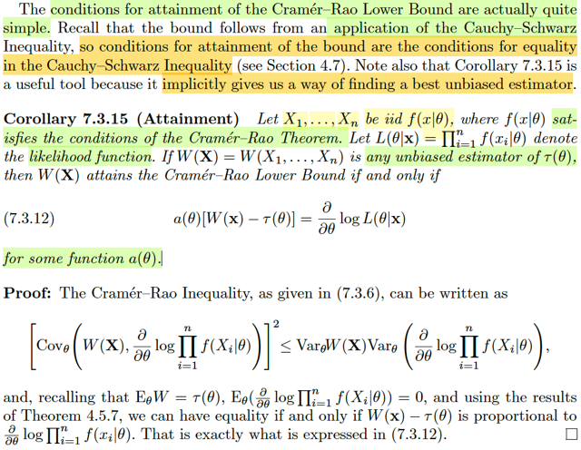</kbd>

> [!NOTE]
> Thế thì, đại khái là, việc xem xét để biết cái Cramer-Rao Lower Bound có thực
> sự có thể đạt được hay không cũng đơn giản thôi. Lí do là vì ta đã thấy cái
> theorem này xuất phát từ Cauchy-Schwarz inequality, nên đại ý là dấu bằng
> xảy ra khi dấu bằng của Cauchy-Schwarz inequality xảy ra.
>
> Từ đó ta sẽ có Hệ quả 7.3.15 nói về điều kiện xảy ra dấu bằng / tức điều kiện
> để Cramer Rao Lower Bound attainable. Và nhờ đó có thể gián tiếp giúp
> ta xác định best unbiased estimator.
>
> Vậy thì theorem này nói là: xét X1,..Xn iid ~f(x|θ) với fx(x|θ) thỏa giả định của
> Cramer Rao theorem, L(θ|**x**) là likelihood function như đã biết, được định nghĩa
> là hàm theo θ tính bởi joint pdf evaluate tại observed value **x**: f(**x**|θ), và với iid 
> ta dĩ nhiên là có Πi=1:n f(xi|θ). thế thì gọi W(**X**) là estimator bất kì của τ(θ). thì
> theorem này nói rằng W(**X**) SẼ ĐẠT VARIANCE CỦA CRAMER RAO LOWER
> BOUND KHI VÀ CHỈ KHI:
>
> a(θ)[W(**X**) - τ(θ)] = ∂/∂θ log L(θ|**x**) for some function a(θ)
>
> là sao, tức là tồn tại function a(θ) nào đó khiến equality trên xảy ra.
>
> PHẦN CHỨNG MINH QUAY LẠI SAU

 

<kbd>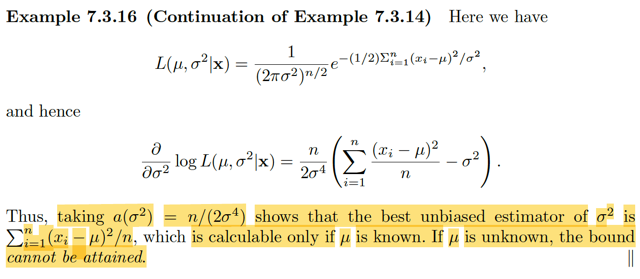</kbd>

> [!NOTE]
> Thế thì quay lại ví dụ 7.3.14, xây dựng hàm likelihood như vầy (cái này dễ 
> rồi, ko có gì phải nói) nên vế phải (của hệ quả trên) ∂/∂θ log L(θ|**x**), mà ở
> đây θ là σ^2, sẽ là:
>
> ∂/∂σ^2 log L(σ^2|**x**) =...giải bài toán tính đạo hàm
>
> ... = (n / 2σ^4) [[Σi (xi - μ)^2 / n] - σ^2]
>
> Và ta sẽ cần chỉ ra tồn tại a(.) sao cho vế phải:
>
> a(θ)[W(**X**) - τ(θ)] bằng vế trái.
>
> vế phải = a(σ^2)[W(**X**) - σ^2] 
>
> cho nó bằng vế trái: a(σ^2)[W(X) - σ^2] = (n / 2σ^4) [[Σi (xi - μ)^2 / n] - σ^2]
>
> thì ta sẽ thấy: Cho a(σ^2) = (n / 2σ^4) thì W(**X**) = [Σi (xi - μ)^2 / n] thì hai vế
> bằng nhau.
>
> Kết luận là với a =  (n / 2σ^4), W(**X**) = [Σi (xi - μ)^2 / n] sẽ là best unbiased
> estimator (vì nó đạt variance của Cramer Rao Lower Bound)
>
> Và một ý quan trọng là, cái này, W(X) = [Σi (xi - μ)^2 / n] CÓ DÍNH ĐẾN
> μ, nên chỉ tính được nếu đã biết μ. Còn nếu μ ko biết, thì Cramer Rao
> Bound UNATTAINABLE.

 

<kbd>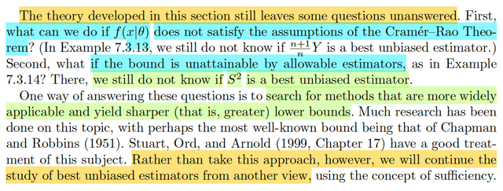</kbd>

> [!NOTE]
> Vậy thì đại khái là trong phần này, những công cụ vẫn chưa giải quyết
> triệt để vấn đề, và nó để lại vài câu hỏi còn bỏ ngỏ. 
>
> Ví dụ như nếu f không thỏa Cramer Rao theorem thì sẽ ko áp dụng được
> dẫn đến hồi nãy ta tính cái (n+1)/n]Y (trong ví dụ mà pdf ko thỏa assumtion
> nên ta có variance của cái này thấp hơn cả CRLB, nhưng rồi ta cũng ko 
> thể biết được nó có phải là best estimator ko 
>
> hoặc ví dụ như trường hợp S^2 hồi nãy, nó là một allowable estimator (đại
> ý tác giả là ta có thể có được estimator này), nhưng vì nó không attain
> Cramer Rao Lower Bound nên ta cũng ko biết là liệu nó có phải là best 
> estimator không 
>
> Và có nhiều nghiên cứu theo hướng tìm ra cái lower bound tốt hơn.
>
> NHƯNG TA SẼ DỪNG Ở ĐÂY, MÀ **CHUYỂN HƯỚNG SANG ĐÁNH GIÁ
> ESTIMATOR THEO MỘT HƯỚNG KHÁC - TIÊU CHÍ SUFFICIENCY**

 

<kbd>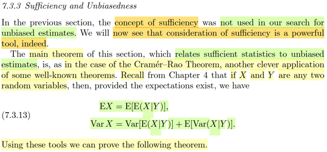</kbd>

> [!NOTE]
> Đại khái là trong những phần trước, ta không hề dùng khái niệm
> SUFFICIENCY trong quá trình đánh giá các estimator, và phần này ta sẽ thấy
> rằng thật sự nó là một công cụ rất mạnh.
>
> Và theorem chính sẽ nói đến ở section này sẽ LIÊN HỆ SUFFICIENT
> STATISTIC VỚI UNBIASED ESTIMATOR.
>
> Thế thì tác giả nói hồi chap 4 mình đã học hai cái identity sau đây, và nó sẽ
> làm nền tảng cho việc chứng minh theorem chính của section này.
>
> EX = E[E(X|Y)] và VarX = Var[E(X|Y) + E[Var(X|Y)]]
>
> Thử suy nghĩ về cái này: EX = E[E(X|Y)]
>
> Cái ruột của vế phải E(X|Y), nó là gì?
>
> nó chính là một random variable có được bằng cách apply function sau đây
> lên random variable Y: g(u) = E[X|u] = Σ{mọi x} xf_u(x)
>
> trong đó f_u(x) là kí hiệu của pmf của X, evaluate tại x, và nó là hàm phụ
> thuộc u.
>
> cũng có thể ghi là f(x|u). Ví dụ như f(x|u) = 2x + u. thì với giá trị cụ thể của x
> thế vô ta còn hàm phụ thuộc u vậy.
>
> Do đó, E[X|Y] = g(Y), và nó chỉ là một random variable. và vế phải là lấy kì
> vọng của cái random variable này, dĩ nhiên sẽ ra fixed number.
>
> Rồi theo lotus Eg(Y) = Σ{mọi y ∈ range Y} g(y)fY(y) = Σ{mọi y ∈ range Y}
> g(y)P(Y=y)
>
> quay lại, vế trái E(X), theo định nghĩa, và giả sử xét X là discrete variable, ta
> có:
>
> EX = Σ_{mọi x} xfX(x) = Σ_{mọi x} xP(X=x)
>
> Xét fX(x), nó là marginal pdf của X, như đã biết, nó = sum over mọi possible
> value y của Y của joint pmf:
>
> fX(x) = Σ{mọi y} fX,Y(x,y) = Σ{mọi y} P(X=x,Y=y)
>
> = Σ{mọi y} P(X=x|Y=y)P(Y=y) hay cũng là Σ{mọi y} fX|Y(x|y)fY(y)
>
> Dừng lại chút để làm rõ các kí hiệu:
>
> fX|Y(x|y), hay P(X=x|Y=y) là gì, nó là hàm pdf của X, là **function của cả x, và
> y**. Nếu đã biết y, ta có hàm theo x, mà thế giá trị x vào thì ta có pmf của X tại
> x
>
> Còn nếu ko biết y, và có giá trị x thì ta có giá trị pmf tại x nhưng giá trị này là
> một function theo y.
>
> Vậy thì fX|Y(x|y) hay fY|X(y|x) hay fX,Y(x,y) ĐỀU LÀ HÀM HAI BIẾN x, y.
> NHƯNG Ý NGHĨA NÓ KHÁC NHAU.
>
> Ví dụ biết x, không biết y:
>
> fX|Y(x|y), hay P(X=x|Y=y) là pmf của X, evaluate tại X=x, và giá trị này là hàm
> phụ thuộc y.
>
> fY|X(y|x), hay P(Y=y|X=x) thì lại là pmf của Y, và với x đã biết, thì ta có hàm
> số đã sẵn sàng cho phép tính pmf của Y tại các giá trị mong muốn y khác
> nhau, thế y vào là ra pdf/pmf tại đó (nó khác với case trên, biết giá trị mong
> muốn để evaluate rồi. nhưng kết quả vẫn phụ thuộc y)
>
> fX,Y(x,y) hay P(X=x,Y=y): thì lại là joint pdf, nó cho biết xác suất xảy ra joint
> event X=x, Y=y, nhưng vì chưa biết y nên giá trị này phụ thuộc y.
>
> Quay lại đây
>
> với fX(x) = Σ{mọi y} fX|Y(x|y)fY(y)
>
> ⇨ EX = Σ{x ∈ range X} x [Σ{y ∈ range Y} P(X=x|Y=y)P(Y=y)]
>
> Ta có quyền đổi chỗ hai cái sum:
>
> = Σ{x ∈ range X}  [Σ{y ∈ range Y} xP(X=x|Y=y)P(Y=y)]
>
> Đặt thừa số chung P(Y=y)
>
> = Σ{y ∈ range Y}  P(Y=y) [Σ{x ∈ range X}xP(X=x|Y=y)]
>
> Đến đây Σ{x ∈ range X}xP(X=x|Y=y), hay Σ{x ∈ range X}xfX|Y(x|y) chính là
> E(X|y)
>
> = Σ{y ∈ range Y}  P(Y=y) [E(X|y)]
>
> = Σ{y ∈ range Y}  E(X|y) P(Y=y)
>
> = Σ{y ∈ range Y}  g(y) P(Y=y)
>
> = E[g(Y)] tức E[E(X|Y)]
>
> Còn cái Identity thứ hai quay lại sau

 

<kbd>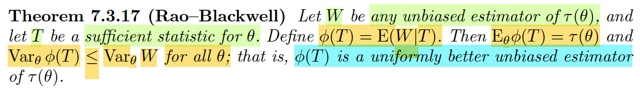</kbd>

🔗 **Related:** [4.4 HIERARCHICAL MODEL & MIXTURE DISTRIBUTION](44_hierarchical_model_mixture_distribution.md#node-275)

> [!NOTE]
> Rồi, qua theorem này:
>
> Cho W là unbiased estimator bất kì của τ(θ), Khoan, dừng lại một giây. Nhớ
> lại, điều này có nghĩa là: Bias của W, là hàm theo θ, define bởi
> Bias_θ[W(**X**)] = E_θ[W(**X**) - τ(θ)] sẽ = 0, và dĩ nhiên cái này ⇔
> E_θ[W(**X**)] = E[τ(θ)] = τ(θ)
>
> Tiếp, T là một SUFFICIENT STATISTIC CỦA θ. Dừng lại giây nữa: Nhớ lại,
> định nghĩa của estimator for θ: Là any function of random sample W(**X**), và
> định nghĩa này cho thấy mọi statistic đều là estimator, vì định nghĩa của
> statitistic cũng là  function of random sample. Tính chất của sufficient statitstic,
> thì mình còn nhớ, đại ý là, nếu T là sufficient statistic, thì mọi suy luận về θ từ
> T là đủ, đồng nghĩa, có thể vứt bỏ **X**đi, và chỉ cần T là đủ thông tin giúp suy
> luận θ.
>
> Tiếp, đặt Φ(T) = E(W|T). Dừng lại tiếp: Như vừa ôn lại ý nghĩa của E(W|T). nó
> chẳng qua có bản chất là, ta apply function Φ(t) có cơ chế như sau lên
> random variable T, để có một random variable mới Φ(T). Hàm Φ(t) như sau:
>
> Φ(t) = ∫{mọi possible value w của W} wfW|T(w|t)dw nếu W là biến liên tục
>
> hoặc Σ{mọi possible value w của W} wfW|T(w|t) vói discrete case
>
> và kết quả là một gía trị phụ thuộc t, ý nghĩa là biết, cho t thì ta có kì vọng của
> W.
>
> Vậy, quay lại đây, nói lại lần nữa Φ(T) chỉ là một random variable có được,
> bằng cách áp một function lên T. Mà T là statistic, tức là function nào đó của
> random sample **X**, nên Φ(T) cũng vậy, cũng là statistic như vì hàm Φ này
> đặc biệt, chứ không chỉ là ví dụ như 2T, nên ta phải nói kĩ hơn tí:
>
> Theo định nghĩa statistic, thì nó là hàm của random sample, và chỉ là của
> random sample. chứ ko được phụ thuộc tham số θ. Nhìn vào hàm Φ(t), nó có
> dính tới fW|T(w|t), và cái này có thể CÒN DÍNH θ. Khi đó Φ(T) không phải
> statistic.
>
> Nhưng, VÌ T LÀ SUFFICIENT STATISTIC, nên đại khái là fW|T(w|t) sẽ không
> còn phụ thuộc θ nữa. → Φ(T) là statistic.
>
> Và again, cũng là một estimator ủa θ, hay τ(θ) cũng được.
>
> Thế thì theorem này nói rằng. Φ(T) chính là một UNBIASED ESTIMATOR
> CỦA τ(θ), và như đã ôn lại định nghĩa của unbiased estimator, thì điều này
> chính là:
>
> E_θ[Φ(T)] = τ(θ)
>
> Và hơn nữa, theorem này cũng nói rằng: Var_θ [Φ(T)] ≤ Var_θ W với mọi θ, và
> do đó, như đã biết MSE của một estimator define bởi:
>
> MSE_θ[W(**X**)] = Var_θ[W(**X**)] + [Bias_θ[W(**X**)]]^2
>
> ⇨ với W(X) là unbiased estimator của τ(θ) thì MSE_θ[W(**X**)] =
> Var_θ[W(**X**)]
>
> và nếu Var_θ [Φ(T)] ≤ Var_θ W với mọi θ thì rõ ràng Φ(T) chính là cái có MSE
> nhỏ  nhất SO VỚI ĐÁM W.

 

<kbd>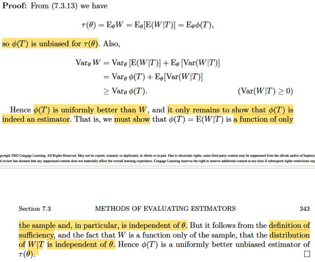</kbd>

> [!NOTE]
> Rồi, việc chứng minh cũng đơn giản:
>
> ta có áp dụng identity: EX = E[E(X|Y)] cho W,T:
>
> EW = E[E[W|T]]
>
> vế trái, với việc đã nói W là unbiases estimator của τ(θ) ⇨ EW = τ(θ)
>
> vế phải: với E[W|T] = Φ(T) , ta có E[Φ(T)]
>
> Vậy E[Φ(T)] = τ(θ) ⇨ Φ(T) là unbiased estimator của τ(θ).
>
> ====
>
> Áp dụng identity 2: Var_θ[W] = Var_θ[E(W|T)] + E_θ[Var(W|T)]
>
> ⇔ Var_θ[W] = Var_θ[Φ(T)] + E_θ[Var(W|T)]
>
> Vì Var(W|T) không âm theo tính chất của variance nên E_θ[Var(W|T)]
> cũng không âm
>
> ⇨ Var_θ[W] ≥ Var_θ[Φ(T)] 
>
> chứng minh xong.
>
> Tuy nhiên một điều cần phải chỉ ra mình vô tình cũng đã nói đến
> trong lập luận ở note trước: Φ(T) có phải là estimator không?
>
> Thì như note trước đã nói, vì T là sufficient statistic, nên distribution
> of W|T không phụ thuộc θ, nên Φ(T) quả thật là statistic/estimator

 

<kbd>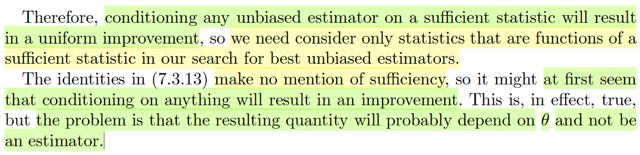</kbd>

> [!NOTE]
> Như vậy thì đại khái là,
>
> Ôn lại chút về theorem này: Nó nói rằng với bất kì unbiased estimator W
> của τ(θ) nào, và một cái sufficient statistic T. Thì Φ(T) = E(W|T) sẽ là một
> unbiased estimator mới mà có tính chất là chỉ có thể là từ tốt hơn hoặc
> bằng W trở lên (variance của Φ(T) nhỏ hơn hoặc bằng variance của W)
>
> Do đó chỉ cần lấy bất kì một unbiased estimator W nào,  và chuẩn bị một
> cái sufficient statistic T, ném vào E[W|T] là ngay lập tức ta có một estimator
> mới cải thiện hơn W.
>
> Do đó ta sẽ chỉ cần quan tâm là chuẩn bị một sufficient statistic.
>
> Và một điểm cũng dễ hiểu đó là, hai cái identity làm điểm tựa cho theorem
> này (E[X] = E[E{X|Y}] và VarX >...) không đá động gì tới sufficient. Ý là,
> ngay cả khi ta áp dụng chúng với W, T và T không sufficient thì vẫn có kết
> quả là E_θ[Φ(T)] = τ(θ) cũng như Var_θ[W] ≥ Var_θ[Φ(T)].
>
> Tuy nhiên như đã nói ở note trước, nếu T không sufficient thì Φ(T) KHÔNG
> PHẢI LÀ ESTIMATOR, VÌ KHI ĐÓ NÓ KHÔNG PHẢI LÀ FUNCTION CỦA
> CHỈ RANDOM SAMPLE MÀ CÓ CẢ θ NÊN KHÔNG GIÚP KẾT LUẬN GÌ
> ĐƯỢC (ý là ta đang tìm estimator tốt nhất cơ mà)

 

<kbd>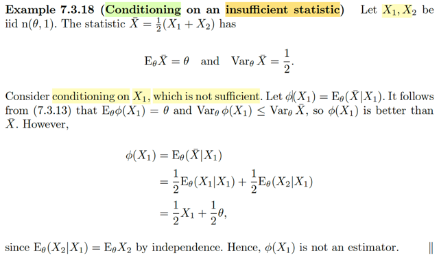</kbd>

> [!NOTE]
> Ví dụ này minh họa: Cho X1, X2 là iid n(θ,1). Và xét statistic Xbar (sample
> mean): Xbar(**X**) = (1/2)(X1 + X2).
>
> E_θ[Xbar(**X**)] = E_θ[(1/2)(X1 + X2)] = (1/2)(EX1 + EX2) = (1/2)(θ + θ) = θ 
> (cái này làm nhiều rồi, và nó đúng bất kể population distribution có phải là
> normal hay không, nói cách khác, sample mean LUÔN là unbiased estimator
> của population mean θ)
>
> Var_θ[Xbar] thì theo theorem đã từng chứng minh ta nhớ nó = σ^2/n. Nên ở
> đây nó bằng 1/2
>
> Còn tự tính thì VarXbar = Var[(X1 + X2)/2] = (1/4) Var[X1 + X2]
>
> = (1/4) VarX1 + VarX2 (do X1, X2 độc lập, ta có cái theorem nói nếu X,Y độc
> lập thì Var(X + Y) = VarX + VarY)
>
> = (1/4)(1 +1) = 1/2
>
> Tiếp, xét X1, bản thân nó không phải là sufficient statistic. Lí do dễ hiểu là vì
> nó không lấy hết thông tin của random sample.
>
> Và đặt ra statistic Φ(X1) = E_θ[Xbar|X1] 
>
> thì như đã biết E_θ[Φ(X1)] = θ nên Φ(X1) vẫn là unbiased estimator của θ 
> và theo theorem vừa rồi thì Var_θ[Φ(X1)] ≤ Var_θ[Xbar] nên về cơ bản nó
> tốt hơn Xbar.
>
> NHƯNG VẤN ĐỀ LÀ Φ(X1) KHÔNG PHẢI LÀ ESTIMATOR CỦA θ.
>
> Vì ta sẽ thấy nó không phải là FUNCTION CỦA CHỈ RANDOM SAMPLE **X**:
>
> Thật vậy Φ(X1) = E_θ[Xbar|X1]
>
> Dừng lại chút để nhắc lại, E_θ[Xbar|X1] là sao?
>
> nó là một function của cả θ, X. Và nó tính kì vọng của Xbar:
>
> = Σ{mọi possible value k của Xbar} k fXbar(k|X1)
>
> và kết quả của sẽ là một function phụ thuộc X1
>
> Nhưng điểm lưu ý quan trọng, CÓ THỂ fXbar(k|X1) là MỘT FUNCTION 
> CÒN PHỤ THUỘC θ, thì kết quả phụ thuộc cả X1 và θ 
>
> Nếu biết X1, ta sẽ chỉ có một function phụ thuộc θ. Rồi biết θ thì biết một
> giá trị cụ thể.
>
> vậy thì mới nói Φ(X1) (= E_θ[Xbar|X1]) là nhìn qua có vẻ chỉ một function 
> của X1, nhưng phải hiểu là nó có thể là function của cả X1 và θ.
>
> Triển khai ở ví dụ cụ thể này để thấy quả thật Φ(X1) là hàm của cả **X** và θ:
>
> E_θ[Xbar|X1] = E_θ[(X1+X2)/2|X1] = (1/2)(E_θ[X1|X1] + E_θ[X2|X1])
>
> Vì X1, X2 độc lập nên E_θ[X2|X1] = E_θ[X2]
>
> Còn E_θ[X1|X1]?
>
> Để hiểu chỉ việc lôi bản chất của kì vọng ra:
>
> E_θ[X1|X1] = Σ{mọi possible value x1 của X1} x1fX1(x1|X1).
>
> thì với việc quan sát thấy X1 = X1 rồi, thì P(X1=X1) = 1 nên kì vọng trên
> chỉ còn bằng X1 * 1 = X1. Nên E_θ[X1|X1] = X1. 
>
> Nếu còn chưa hiểu hãy coi việt biết giá trị X1 là u. Và X1 có 2 p.value u, v.
> thì E[X1|X1] = vP(X1=v) + uP(X1=u) = v*0 + u*1 = u. Nên khi quan sát thấy
> giá trị của X1 (nói đén rv X1) là bằng X1 rồi (nói đến giá trị quan sát thấy)
> thì kì vọng E(X1|X1) chính là X1.
>
> = (1/2)(E_θ[X1|X1] + E_θ[X2])
>
> = (1/2)(X1 + θ)
>
> Như vậy Φ(X1) là hàm phụ thuộc cả θ nên nó không phải estimator.

 

<kbd>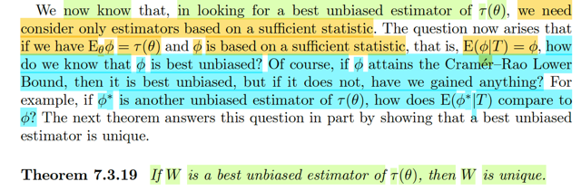</kbd>

> [!NOTE]
> Rồi chỗ này đại ý của tác giả là thế này: Cái theorem hồi nãy cho ta một
> cái máy lọc: E[.|T], ném vào một unbiased estimator bất kì thì nó nhả ra
> cho ta E[W|T] = Φ(T) là một unbiased estimator chỉ có tốt hơn miễn là ta
> dùng một sufficient statistic T.
>
> Thế thì, trước khi lọc, ta có một unbiased estimator W, chất lượng hay dở
> ko biết, nhưng sau khi lọc, ta có một unbiased estimator Φ(T) chỉ có tốt
> hơn.
>
> Vậy thì giáo sư mới nói vầy: "Ờ, vậy thì nếu như mình dùng một thằng W'
> nào đó vốn đã là một hàm theo T, kí hiệu f(T) và ném nó vào máy lọc thì sẽ
> thế nào.
>
> Ta tính thử: E[f(T)|T], và cái này y như vừa rồi đã hiểu: Biết / dựa trên X1
> thì EX1|X1 = X1, thì dựa trên quan sát thấy T (nói về random variable) = T
> (nói đến giá trị) thì E[f(T)|T] = f(T).
>
> À!, như vậy có nghĩa là, nếu ném một thằng unbiased estimator W' vốn đã
> là một hàm phụ thuộc T (f(T), hay Φ(T)) vào máy lọc thì nó chả tạo gì hơn
> cả, nó lấy ra y change f(T), hay Φ(T).
>
> Do đó mới hiểu ý giáo sư là, E[Φ|T] = Φ (thì chính là ông nói E[f(T)|T] =
> f(T))
>
> Và cái ý giáo sư đặt câu hỏi là: NẾU ĐÃ XÀI MỘT THẰNG UNBIASED
> ESTIMATOR NHƯ VẬY RỒI (TỨC LÀ MỘT ESTIMATOR CÓ ĐƯỢC BỞI
> ÁP MỘT FUNCTION LÊN MỘT SUFFICIENT STATISTIC RỒI, THÌ SAO
> MÀ BIẾT NÓ CÓ PHẢI LÀ CÁI TỐT NHẤT HAY KHÔNG)
>
> Hỉểu câu hỏi này ý là vầy: "À nãy mày nói với các unbiased estimator
> thượng vàng hạ cám W bất kì ném vào máy lọc E[.|T] thì ta có thể "cải
> thiện" nó thêm, tức có được  unbiased estimator tốt hơn Φ(T).Thế thì nếu
> tao xét một đám chỉ toàn những cái đã được lọc xong, Φ(T), ω(T), hay tác
> giả dùng  Φ*(T),...thì sao biết cái nào là tốt nhất.
>
> Và ta cũng hiểu ý sau của tác giả nói rằng. Nếu Φ(T), đạt variance của
> Cramer Rao Lower Bound on variance thì dĩ nhiên nó sẽ là best unbiased
> estimator (bởi vì ta nhớ theorem Cramer Rao Lower Bound nói đến một cái
> lower bound về variance CỦA BẤT KÌ  ESTIMATOR NÀO, NÊN NẾU ĐẠT
> VAR ĐÓ THÌ ĐƯƠNG NHIÊN NÓ LÀ TỐT NHẤT)
>
> Nhưng nếu Var của đám Φ(T), ω(T),..đèu không đạt CRLB thì làm sao  so
> sánh chúng đây?
>
> Và theorem tiếp theo thực hiện một bước lót đường để tìm ra nhà vua:
> TÍNH ĐỘC NHẤT: nó nói rằng: NẾU W LÀ THE **BEST UNBIASED
> ESTIMATOR THÌ NÓ LÀ DUY NHẤT**

 

<kbd>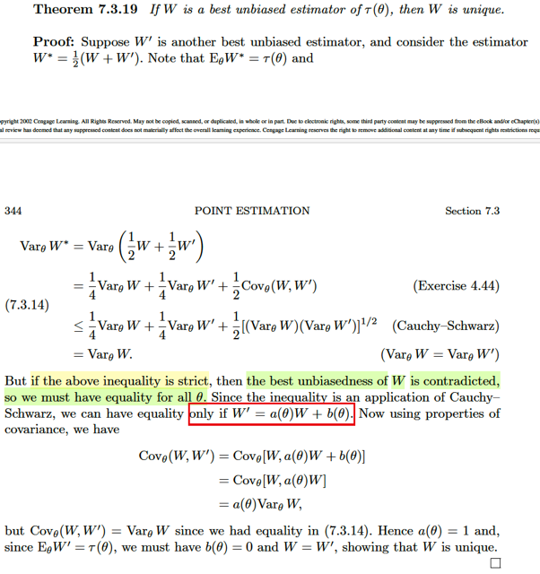</kbd>

> [!NOTE]
> Để chứng minh thì ta lại nhớ lại bất đẳng thức Cauchy Schwarz
>
> [Cov(X,Y)]^2 ≤ Var(X)Var(Y) (1), và thử chứng minh lại không thừa:
>
> ⇔ (E[(X-EX)(Y-EY)])^2 ≤ E[(X-EX)^2]E[(Y-EY)^2]
>
> ⇔ Đặt X-EX = U, Y-EY = V ta cần chứng minh:
>
> Vậy cái cần chứng minh chính là: [E(UV)]^2 ≤ E[U^2]E[V^2] (2)
>
> **Tiếp, xét biểu thức (tU + V)^2, đương nhiên cái này luôn ≥ 0
>
> nên E[(tU + V)^2] cũng ≥ 0 (*)**
>
> ⇔ E[t^2U^2 + V^2 + 2tUV] ≥ 0
>
> ⇔ E[t^2U^2] + E[V^2] + E[2tUV] ≥ 0
>
> ⇔ t^2 E[U^2] + E[V^2] + 2t E[UV] ≥ 0
>
> Để bất đẳng thức này xảy ra, dĩ nhiên phương trình 
>
> f(t) = t^2 E[U^2] + E[V^2] + 2t E[UV] = 0 
>
> phải vô nghiệm hoặc có nghiệm kép, điều này xảy ra khi:
>
> B^2 - 4AC ≤ 0 
>
> ⇔ [2E(UV)]^2 - 4E[U^2]E[V^2] ≤ 0
>
> ⇔ [E(UV)]^2 ≤ E[U^2]E[V^2] là điều cần (2) chứng minh.
>
> Và ta cũng thấy, để dấu bằng ở (1) cũng là ở (*) xảy ra thì dấu 
> bằng ở đây phải xảy ra tức là B^2 - 4AC = 0 và nghiệm kép đó là:
>
> t* = -B / (2A) 
>
> = -2E[UV] / (2E[U^2]) = 
>
> = -E[UV] / E[U^2], 
>
> Thế U, V bởi X-EX, Y-EY ta có t* sẽ là function của X,Y:
>
> ⇨ t* = -E[(X-EX)(Y-EY)] / E[(X-EX)^2] 
>
> Và với t* này thì dấu bằng ở (*) xảy ra. Ta có: E[(t*U + V)^2] = 0
>
> ⇔ (t*U + V)^2 = 0 
>
> ⇔ t*U + V = 0 
>
> ⇔ V = -t*U
>
> ⇔ -t*(X - EX) = Y - EY
>
> ⇔ -t*X + t*EX = Y - EY
>
> ⇔ Y = t*X - t*EX + EY
>
> Với a = t* = -E[(X-EX)(Y-EY)] / E[(X-EX)^2], là constant 
>
> Và constant b = -tEX + EY
>
> Ta có Y = aX + b

> [!NOTE]
> Quay lại đây chứng minh theorem này: Đầu tiên là ta giả sử W là
> best  unbiased estimator (của τ(θ)) nhưng W không unique, tức là
> có tồn tại một W' khác, cũng là best unbiased estimator.
>
> Thế thì mới xét một estimator khác W* = (W + W')/2.
>
> Dễ thấy nó cũng là unbiased estimator của τ(θ): 
>
> E_θ[W*] = (E_θ[W] + E_θ[W'])/2 = (τ(θ) + τ(θ))/2 = τ(θ)
>
> Thế thì Var_θ[W*] = Var_θ[W/2 + W'/2]
>
> Dùng công thức Var(X+Y) = VarX + VarY + 2Cov(X,Y)
>
> .. = Var_θ[W/2] + Var_θ[W'/2] + 2Cov(W/2, W'/2)
>
> Dùng identity Var(cX) = c^2VarX
>
> .. = (1/4)Var_θ[W] + (1/4)Var_θ[W'] + 2Cov(W/2, W'/2) 
>
> Dùng tính chất của covariance: tuyến tính nếu chỉ xét từng variable:
>
> Var(cX, dY) = cVar(X,dY) = cdVar(X,Y)
>
> .. = (1/4)Var_θ[W] + (1/4)Var_θ[W'] + 2(1/2)(1/2)Cov(W, W') 
>
> = (1/4)Var_θ[W] + (1/4)Var_θ[W'] + (1/2)Cov(W, W')
>
> Áp dụng bất đẳng thức Cauchy-Schwarz vừa ôn lại:
>
> [Cov(W,W')]^2 ≤ VarWVarW'
>
> ⇨ ... ≤ (1/4)Var_θ[W] + (1/4)Var_θ[W'] + (1/2)√Var(W)Var(W')
>
> Tới đây, nhớ rằng ta đang giả sử W' cũng là best unbiased estimator nên 
> đương nhiên variance của nó Var_θ[W'] cũng = Var_θ[W]
>
> ⇨ vế phải là (1/4)Var_θ[W] + (1/4)Var_θ[W] + (1/2)Var_θ[W]
>
> = Var_θ[W]
>
> Viết lại ta có: Var_θ[W*] ≤ Var_θ[W]
>
> Và dễ thấy ở đây dấu bằng phải xảy ra vì như vừa nói ta đang giả định W*
> cũng là best unbiased estimator mà, vậy 
>
> Var_θ[W*] = Var_θ[W] (*)
>
> ====
>
> Thì như vừa ôn lại bất đẳng thức C.S: Dấu bằng xảy ra khi ta có: Y = aX + c
> tức là Y quan hệ với X một cách tuyến tính. Nên ở đây W' = aW + b
> và giống như t hồi nãy đã thấy:
>
> a = và b đều là constant vì: 
>
> a = t* = -E[(X-EX)(Y-EY)] / E[(X-EX)^2], 
>
> b = -t*EX + EY
>
> Nhưng với W, W'. các kì vọng trên sẽ phụ thuộc θ nên ở đây a và b là hàm
> theo θ Do đó:
>
> W' = a(θ)W + b(θ).
>
> ===
>
> Tiếp, xét Cov_θ(W, W'):
>
> = Cov_θ(W, a(θ)W + b(θ))
>
> dùng tính chất tuyến tính theo từng biến:
>
> = Cov_θ(W, a(θ)W)
>
> = a(θ) Cov_θ(W, W)
>
> = a(θ) E_θ[(W-EW),(W-EW)]
>
> = a(θ) E_θ[(W-EW)^2]
>
> = a(θ) Var_θ(W)
>
> Viết lại Cov_θ(W, W') = a(θ) Var_θ(W)
>
> Mà từ (*) ta đã có Var_θ[W*] = Var_θ[W]
>
> Và [Cov_θ(W, W')]^2 = VarWVarW'
>
> ⇨ Cov_θ(W, W') = √VarWVarW' = √(VarW)^2 = VarW
>
> Vậy VarW = a(θ) Var_θ(W) ⇨ a(θ) = 1.
>
> Cuối cùng là vì E_θ[W'] = τ(θ) ⇔ E_θ[ a(θ)W + b(θ).] = τ(θ)
>
> ⇔ E_θ[a(θ)W] + E_θ[b(θ)] = τ(θ)
>
> ⇔ a(θ)E_θ[W] + E_θ[b(θ)] = τ(θ)
>
> ⇔ a(θ)τ(θ) + E_θ[b(θ)] = τ(θ)
>
> ⇔ τ(θ) + E_θ[b(θ)] = τ(θ) | a(θ) = 1
>
> ⇔  E_θ[b(θ)] = 0
>
> ⇔  b(θ) = 0 (vì b(θ) vẫn là hằng số)
>
> Vậy chứng minh xong a(θ), b(θ) = 1, 0 → W là unique

 

<kbd>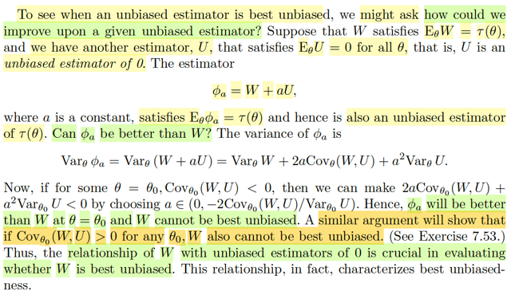</kbd>

> [!NOTE]
> Đại khái là vầy: Đoạn này nói rằng, giả sử ta đã có một W là the 
> best unbiased estimator rồi: Tức là E_θ(W) = τ(θ) (unbiased). 
>
> Thế thì giả sử ta xét một estimator khác: U, thỏa E_θ(U) = 0 ∀ θ. Tức là
> U là unbiased estimator của 0. Khi đó bằng cách xem xét một estimator 
> mới tạo bởi W và U: Φa = W + aU. Thì ta có thể chỉ ra rằng có thể Φa có
> variance thấp hơn cả W, và Φa cũng là best unbiased estimator của τ(θ).
>
> Cụ thể là: E_θ[Φa] = E_θ[W + aU] = E_θ[W] + E_θ[aU]
>
> = τ(θ) + a E_θ(U) = τ(θ) + a * 0 = τ(θ) → Φa cũng là unbiased estimator của
> τ(θ)
>
> Var_θ(Φa) = Var_θ(W + aU) 
>
> = Var_θ(W) + Var_θ(aU) + 2Cov(W, aU)
>
> = Var_θ(W) + a^2Var_θ(U) + 2aCov(W, U)
>
> Thế thì, dừng lại chút ôn lại về việc ta đang so sánh estimator là dựa theo
> MSE, theo định nghiã MSE của estimator W là function theo θ:
>
> MSE_θ(W(**X**)) = Var_θ(W(**X**)) + {Bias_θ[W(**X**)]}^2
>
> Vậy thì xem xét các estimator có E_θ[W(**X**)] = τ(θ), tức là bias term = 0, 
> unbiased, cái nào có variance theo θ nhỏ nhất với mọi θ  thì sẽ là the best
>
> Quay lại đây, ý chính là ta đang có: 
>
> Var_θ(Φa) = Var_θ(W) + a^2Var_θ(U) + 2aCov(W, U)
>
> Với Var_θ(U) đã không âm, thì nếu Cov(W,U) không âm luôn thì rõ ràng 
> Var_θ(Φa) ≥ Var_θ(W) → lúc này W vẫn "tốt hơn" U
>
> Còn nếu Cov(W,U) âm khiến a^2Var_θ(U) + 2aCov(W, U) có thể < 0, thì
> ta có thể chọn U để khiến U tốt hơn cả W:
>
> a^2Var_θ(U) + 2aCov(W, U) < 0
>
> ⇔ a[aVar_θ(U) + 2Cov(W, U)] < 0
>
> *a > 0 và aVar_θ(U) + 2Cov(W, U) < 0
>
> ⇔ a > 0 và a < -2Cov(W, U) / Var_θ(U)
>
> ⇨ a ∈ (0, -2Cov(W, U) / Var_θ(U))
>
> *a < 0 và aVar_θ(U) + 2Cov(W, U) > 0
>
> ⇔ a < 0 và a > -2Cov(W, U)/Var_θ(U) → ko thể xảy ra do Cov(W,U) < 0
>
> Vậy chỉ cần a ∈ (0, -2Cov(W, U) / Var_θ(U)) là Var_θ(Φa) < Var_θ(W)
> và qua đó soán ngôi của W.
>
> Do đó mới nói, VIỆC ĐÁNH GIÁ XEM W CÓ PHẢI THẬT SỰ LÀ THE BEST
> hay không thì phải XEM XÉT Cov(W, U) - tức là QUAN HỆ CỦA NÓ VỚI U - 
> TỨC LÀ UNBIASED ESTIMATOR CỦA 0

 

<kbd>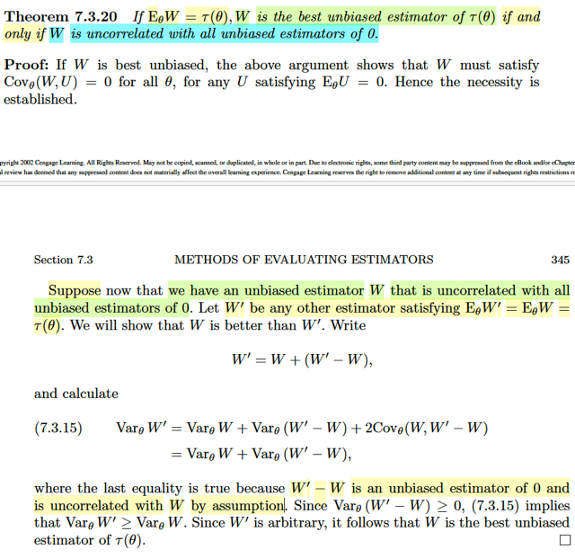</kbd>

> [!NOTE]
> Thế thì dẫn đến theorem này: Đại ý nói rằng ĐIỀU KIỆN CẦN VÀ ĐỦ ĐỂ W
> LÀ THE BEST UNBIASSED ESTIMATOR CỦA τ(θ) đó là: Nó uncorrelated
> với mọi unbiased estimator của 0:
>
> Chứng minh cũng dễ hiểu:
>
> Chứng minh điều kiện cần: W the best → Cov(W,U) = 0 ∀ U
>
> Giả sử W là the best mà Cov(W,U) khác 0 với vài U nào đó, thì ngay lập
> tức ta có thể tạo Φa = W + aU với a ∈ (0, -2Cov(W, U) / Var_θ(U)) thì có thể
> chỉ ra Φa là estimator tốt hơn W, mâu thuẫn với giả thiết W là the best.
> Vậy phản chứng đã giúp chứng minh chiều thuận: W the best → Cov(W,U) = 
> 0 ∀ U
>
> Chứng minh điều kiện đủ: Cov(W,U) = 0 ∀ U → W the best
>
> Giờ giả sử W là unbiased estimator của τ(θ) có Cov(W,U) = 0 với mọi unbiased 
> estimator của 0, ta sẽ chứng minh nó là the best.
>
> Xét W' là một unbiased estimator của τ(θ) BẤT KÌ: E_θ(W') = τ(θ)
>
> W' có thể viết bởi:
>
> W' = W + (W' - W)
>
> ⇨ Var_θ W' = Var_θ [W + (W' - W)]
>
> ⇔ Var_θ W' = Var_θ[W] + Var_θ(W' - W) + 2Cov_θ[W, (W' - W)] 
>
> Với term thứ 3: thì xét W' - W, E_θ[W' - W]  = E_θ(W') - E_θ(W) = τ(θ) - τ(θ)
> = 0 ⇨ là unbiased estimator của 0, và như giả thiết, nó uncorrelated với W
>
> ⇨ Cov_θ[W, (W' - W)]  = 0
>
> Dẫn đến ta có Var_θ W' = Var_θ[W] + Var_θ(W' - W)
>
> Và với việc variance ≥ 0 thì Var_θ W' ≥ Var_θ[W] với mọi W', như giả thiết,
> là unbiased estimator BẤT KÌ.
>
> DO VẬY, CHỨNG MINH ĐƯỢC W là THE BEST

 

<kbd>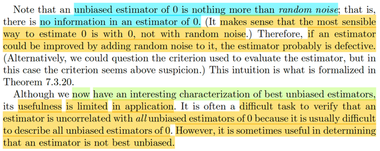</kbd>

> [!NOTE]
> tác giả chú ý ta rằng cái được gọi là unbiased estimator của 0, thật ra chỉ là
> RANDOM NOISE (nhiễu ngẫu nhiên).
>
> Và thông qua đó nói lên ý nghĩa của theorem vừa rồi để mình thấy nó rất
> hợp lí về trực giác: nếu ông W thực sự là estimator tốt nhất, thì không thể
> nào cộng thêm một nhiễu thuần túy ngẫu nhiên vào nó mà lại khiến nó tốt
> hơn được. Bởi vì, nhiễu thuần túy kHÔNG CHỨA THÔNG TIN,  và nếu nó
> không chứa thông tin thì nó không thể gíup cải thiện cái gì  được. Trừ khi
> ông W vốn bản chất chứa những sai sót, để rồi vô tình  những sai sót này
> được bù trừ bởi nhiễu ngẫu nhiên thì nó mới tốt lên được.
>
> Do đó giúp ta thấy sự hợp lí của việc: Nếu W đã là the best thì không thể có
> chuyện W + aU (= Φa) tốt hơn W. Và điều này chỉ theorem vừa rồi đã nói,
> phải đồng nghĩa W, U không tương quan gì với nhau. Chứ có tương quan gì
> thì chắc chắn W ko phải tốt nhất.
>
> ====
>
> Rồi. Cuối cùng, tác giả cho rằng tuy là hiện giờ ta đã có một ĐẶC ĐIỂM
> QUAN TRỌNG CỦA THE BEST UNBIASED ESTIMATOR:
>
> UNCORRELATED VỚI MỌI RANDOM NOISE - UNBIASED ESTIMATOR
> CỦA 0.
>
> Nhưng vấn đề là cái này không hữu ích lắm trong thực tế: Vì KHÓ MÀ XÁC
> NHẬN RẰNG MỘT ESTIMATOR W CÓ UNCORRELATED VỚI MỌI
> UNBIASED ESTIMATOR CỦA 0
>
> TUY NHIÊN, đôi khi sẽ hữu ích theo kiểu khác: Giúp ta xác nhận một estimator
> KHÔNG PHẢI LÀ THE BEST.
>
> (tức là xác nhận một thằng làm vua thì khó, nhưng việc chỉ ra một thằng không
> phải vua thì có thể dễ)

 

<kbd>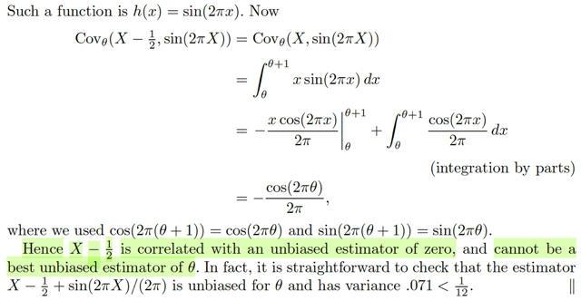</kbd>

<kbd></kbd>

<kbd>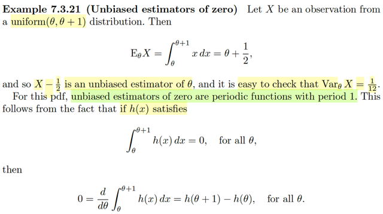</kbd>

> [!NOTE]
> QUAY LẠI SAU
>
> Nhưng đại ý là ví dụ này, bằng cách chứng minh Covariance
> của một candidate estimator và một unbiased estimator của 0 có giá trị khác
> 0 (tức là chúng correlated nhau) thì theorem vừa rồi giúp ta kết luận candidate
> đó ko phải là the best
>
> Nhưng phải dừng một chút để nói về cái gọi là **UNBIASED ESTIMATOR CỦA
> 0**. Như cái U hồi nãy.
>
> Thế thì phải hiểu là U là U(**X**), là estimator của θ. Nhưng nó có E_θ[U(**X**)] = 0
> nên ta nói nó là unbiased estimator của τ(θ) = 0. Vì nếu xét hàm biased của nó
> với tư cách là estimator của τ(θ) = 0 thì giá trị bias là 0.
>
> thế thì xét E_θ[U(X)] = 0 thì **dĩ nhiên phải dính đến pdf của X**
>
> vì E_θ[U(X)] = ∫∫...∫range**X** U(**x**)f**X**(**x**)d**x**Trong ví dụ này, với X ~ uniform(θ, θ+) ⇨ pdf fX(x) = 1, θ ≤ x ≤ θ+1
>
> gọi h(X) là unbiased estimator của 0 ta có:
>
> E_θ[h(X)] = 0 
>
> ⇔ ∫θ:θ+1 h(x)f(x)dx = 0
>
> ⇔ ∫θ:θ+1 h(x)dx = 0
>
> Theo FTC1:
>
> ⇔ G(θ+1) - G(θ) = 0 với G là nguyên hàm của h.
>
> Lấy đạo hàm hai vế:
>
> d/dθ [G(θ+1) - G(θ)] = 0
>
> ⇔ G'(θ+1) - G'(θ) = 0
>
> ⇔ h(θ+1) - h(θ) = 0

 

<kbd>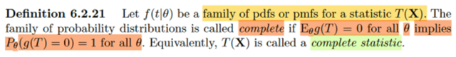</kbd>

<kbd></kbd>

<kbd>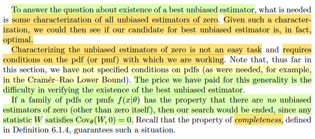</kbd>

🔗 **Related:** [6.2 THE SUFFICIENT PRINCIPLE](62_the_sufficient_principle.md#node-510)

> [!NOTE]
> Đoạn này đại ý là: như đã nói ở trên, rất khó để check xem một candidate
> estimator có uncorrelated với mọi unbiased estimator cuả 0 hay không.
>
> Vì muốn làm vậy, ta phải nghĩ đến việc tìm đặc điểm chung của mọi unbiased
> estimator của 0. Nếu làm được, ta có thể dùng nó để trả lời câu hỏi trên.
>
> Nhưng việc này không phải dễ. Vì như mình vừa thấy, việc xem xét một
> unbiased estimator của 0 sẽ phụ thuộc vào pdf mà ta đang làm việc cùng.
>
> Nhớ lại: Xem xét E_θ[U(**X**)] = 0 thì vốn dĩ đã dính đến / phụ thuộc vào pdf
> của **X** rồi.
>
> Nên đại ý là khó mà làm cái việc này mà không phụ thuộc pdf.
>
> Thế thì có một cách tiếp cận khác, đó là nếu mà ta xét một họ pdf / pmf sao
> cho có tính chất là không tồn tại unbiased estimator của 0, để rồi chỉ có 0 là
> unbiased estimator duy nhất của 0. thì khi đó ta sẽ thấy với mọi W thì Cov(W,
> 0) đều bằng 0.
>
> (Vì sao:Vì Cov(W,0) = E[(W-EW)(0-E0)] = E[(W-EW)*0] = E(0) = 0) và điều này
> có nghĩa là mọi unbiased estimator W đều là the best. Và với theorem tính duy
> nhất thì dĩ nhiên ta biết chỉ có 1 thôi.
>
> Nên tóm lại là, với các họ pdf này CHỈ CẦN TÌM RA UNBIASED ESTIMATOR
> THÌ NÓ LÀ THE BEST.
>
> Và theo tác giả thì DỰA VÀO TÍNH CHẤT **COMPLETENESS**, ta sẽ có được
> tình huống này

 

<kbd>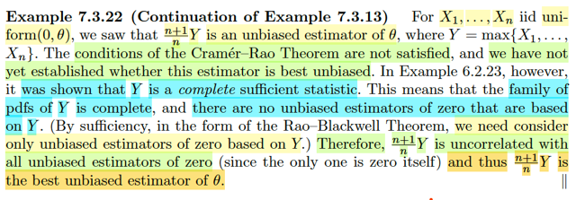</kbd>

🔗 **Related:** [7.3 METHODS OF EVALUATING ESTIMATORS](73_methods_of_evaluating_estimators.md#node-624)

> [!NOTE]
> Ôn lại một chút bối cảnh ta đang đứng: Đại ý là, mình đã có một theorem
> nói rằng nếu W là the best unbiased estimator của τ(θ) thì nó là độc nhất.
>
> Rồi, thế thì khi đó tác giả mới dẫn dắt là bằng cách dùng một U là một
> unbiased  estimator của 0, và tạo estimator Φa = W + aU, thì ta cũng có
> một unbiased estimator của τ(θ), và bằng cách chọn a ta có thể có
> estimator của τ(θ) còn tốt hơn của W, điều này sẽ gây mâu thuẫn với giả
> định W là the best.
>
> Từ đó ta mới qua một theorem nói rằng, W là the best khi và chỉ khi nó
> không có tương quan gì với bất kì một unbiased estimator của 0 nào.
>
> Rồi, thế thì, tác giả mới giúp ta nhận định rằng tuy đến được đây, nhưng
> cái này không có lợi ích thực tiễn lắm, vì sẽ rất khó để xét mọi tương
> quan của W với  unbiased estimator của 0 bất kì.
>
> Nhưng ít nhất, công cụ này có thể dùng để chứng minh một estimator
> không phải the best, bằng cách chỉ ra nó có tương quan với một unbiased
> estimator của 0
>
> Xét U một unbiased estimator của 0. Tức là E_θ[U(**X**)] = 0 (nên nhớ,
> estimator luôn là function của random sample, nên ghi tắt là U, chứ ghi
> đầy đủ phải là W(**X**), U(**X**))
>
> ⇔ ∫{range **X**} U(**x**)f**X**(**x**|θ)d**x**= 0****Nên nhìn vào đây ta hiểu rằng việc có tồn tại unbiased estimator hay
> không sẽ phụ thuộc vào bản thân hàm pdf, giúp ta hiểu khi tác giả nói qua
> case đặc biệt là một số pdf family không có unbiased estimator của 0.
>
> Và cuối cùng là xét đến một trường hợp đặc biệt: **LÀ KHI HỌ PDF/PMF
> LÀ MỘT HỌ COMPLETE**: Khi đó nó sẽ có tính chất là: estimator của 0
> duy nhất chỉ là 0 (zero function): Cụ thể định nghĩa nói rằng với f(x|θ) là
> họ pdf của T(**X**) sẽ được gọi là complete nếu E_θ[g(T)]  = 0 vói mọi θ
> sẽ chỉ xảy ra khi g(T) = 0 (hay P_θ(g(T) = 0) = 1)
>
> Và sau ví dụ này ta **sẽ có một theorem nói rằng**, nếu **T là một
> complete statistic** thì **bất kì một estimator nào tạo từ T**, kí hiệu Φ(T)
> sẽ **đều là best estimator của kì vọng của nó**.
>
> Tức là, nếu ta có complete statistic T, thì khi đó, xét W là W(T) = Φ(T), tức
> là estimator tạo bởi việc áp một function Φ(.) lên T, và E_θ[W(T)] = τ(θ),
> thì nó sẽ :
>
> ..thì nó sẽ**uncorrelated với mọi**U(**X**), là **unbiased estimator của 0 bất kì**.
>
> Và **áp dụng lại định lý 7.3.20**, ta **kết luận ngay lập tức W(T) là the best
> unbiased estimator** đánh bại MỌI estimator trên đời, chứ không chỉ riêng
> trong đám W(T). ****Sở dĩ ta nhắm thẳng vào đám W(T) để tìm kiếm vì **định lý
> Rao-Blackwell đã "bảo kê"** trước rằng:
>
> **Bất kỳ estimator W thô kệch nào ngoài kia**, khi đưa qua phép chiếu Φ(T)
> = E[W|T], **đều sinh ra một phiên bản tinh hoa hơn hoặc bằng nó**.  
>
> Kết hợp với tính complete (đảm bảo tính duy nhất), ta chỉ cần mò ra 1 thằng
> unbiased trong đám tinh hoa này là trò chơi kết thúc! 
>
> ====
>
> Thế thì quay lại đây, ví dụ này tiếp nối 7.3.13, X1,...Xn là iid uniform(0, θ),
> và ta đã thấy trong ví dụ đó [(n+1)/n]Y là unbiased estimator của θ, với Y
> = max{X1, ...Xn}. Còn nhớ trong ví dụ đó ta đã chỉ ra pdf này không thỏa
> điều kiện của  Cramer-Rao Lower Bound theorem, để rồi ta tính ra
> Variance Var_θ[Y] còn nhỏ hơn cả CRLB. Và để lại câu hỏi còn bỏ ngỏ là
> liệu Y có phải là the best không.
>
> Và tới đây, ta đã có công cụ để kết luận cho nó: Từ 6.2.23, ta đã kết luận
> họ pdf của Y là một COMPLETE FAMILY, và Y LÀ COMPLETE
> STATISTIC.
>
> Và như trên đã nói, với việc Y là complete statistic, và như vừa nói ở trên
> g(Y) = [(n+1)/n]Y sẽ là best estimator của E_θ[g(Y)], tức là θ.

 

<kbd>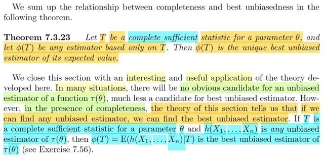</kbd>

<kbd></kbd>

<kbd>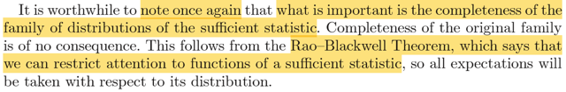</kbd>

> [!NOTE]
> Ở đây tác giả nhắc lại là với việc ta có Rao-Blackwell theorem nói rằng
> với một unbiased estimator W của τ(θ), thì ném nó vào máy lọc E[.|T],
> hay cũng là áp hàm Φ(u) = E[u|T] vàp W để có estimator mới E[W|T] thì
> chắc chắn Φ(W) chỉ có thể là unbiased estimator của τ(θ) tốt hơn W mà
> thôi. Nên từ đó ta có thể xét đám estimator của τ(θ) có dạng Φ(T), thay vì
> toàn bộ W bất kì.
>
> Và theorem 7.3.23 sẽ nói rằng: Nếu T là complete statistic thì Φ(T), sẽ
> tự động là best estimator của bất cứ thứ gì mà nó expect.
>
> Nói rõ cho dễ hiểu: Chính là nói, nếu W* có dạng Φ(T), và E_θ[W*] = τ(θ)
> thì  tự động kết luận W là the best unbiased estimator của τ(θ). Và dĩ nhiên
> theo theorem uniqueness của the best, thì W* cũng là duy nhất.
>
> Để chứng minh cái này, ta chỉ cần dựa vào theorem nói rằng: W là best 
> estimator của τ(θ) khi và chỉ khi Cov(W, U) = 0 với U là unbiased estimator
> của 0 bất kì.
>
> Vậy thì xét W = Φ(T), như trên vừa nói, là một thằng trong đám tinh hoa (
> so với W bất kì)
>
> Ta cần chứng minh Cov(Φ(T), U(**X**)) = 0 
>
> Cách thể hiện U(**X**) ko có gì là khó hiẻu, thậm chí có thể ghi Φ(T(**X**)) vì
> các estimator về bản chất đều là hàm của random sample **X**
>
> Thế thì triển khai ra dùng công thức Cov(X,Y) = E[(X-EX)(Y-EY)]
>
> = E[XY-(EX)Y-XEY+EXEY] = E(XY)-E[(EX)Y]-E(XEY)+E[EXEY]
>
> = E(XY)-EXEY-EXEY+EXEY
>
> = E[XY]-EXEY
>
> ⇨ Cov(Φ(T), U(**X**)) = E[Φ(T)U(**X**)] - EΦ(T)EU(**X**)
>
> = E[Φ(T)U(**X**)] - EΦ(T)*0 (do U(**X**) là unbiased estimator của 0: E[U(**X**)] = 0)
>
> = E[Φ(T)U(**X**)]
>
> Viết lại Cov(Φ(T), U(**X**)) = E[Φ(T)U(**X**)]
>
> E[Φ(T)U(**X**)], áp dụng Adam's Law: EX = E[E(X|Y)]
>
> ⇨ E[Φ(T)U(**X**)] = E[ E[Φ(T)U(**X**)|T] ]
>
> Xét E[Φ(T)U(**X**)|T], vì với T cho trước thì Φ(T) là constant, ta đưa ra khỏi
> kì vọng theo tính linearity
>
> ... = E[ Φ(T) E[U(**X**)|T] ] 
>
> Và E[U(**X**)|T], hay E[U|T] thì lại là một random variable tạo bởi T: g(T) 
>
> ..= E[Φ(T) g(T)] (1)
>
> Và điểm quan trọng là xem thử E_θ[g(T)] là gì:
>
> E[g(T)] = E[E[U|T]] và theo Adam's Law lần nữa thì nó = EU, và = 0 
>
> Vậy Eg(T) = 0. Lúc này mới dùng định nghĩa của T là complete statistic,
> nói rằng nếu Eg(T) = 0 thì g(T) chỉ có thể là zero function.
>
> ⇨ g(T) = 0 (mà trong toán học gọi là P(g(T) = 0) = 1)
>
> Vậy (1) = E[Φ(T) 0] = 0
>
> Viết lại ta đã chứng minh xong Cov(Φ(T), U(**X**)) = 0
>
> và cũng chứng minh xong định lí này

 

<kbd>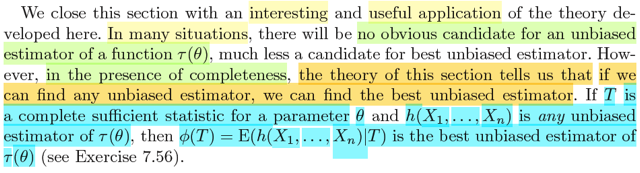</kbd>

> [!NOTE]
> Đại ý là trong nhiều trường hợp, không có ứng cử viên rõ ràng cho
> unbiased estimator của function τ(θ), chứ đừng nói đến candidate cho best
> estimator. Nhưng với theorem này, miễn là ta có T là một COMPLETE +
> SUFFICIENT statistic. Thì khi đó theorem trên nói là bất cứ estimator nào "
> tạo ra từ T, Φ(T)" sẽ đều là the best unbiased estimator của kì vọng của nó
> (E_θ[Φ(T)]).
>
> Như vậy, nếu mình có estimator h(**X**) có kì vọng là τ(θ), tức là unbiased
> estimator của τ(θ) thì bằng cách tạo estimator mới Φ(T) = E[h(**X**)|T], thì
> ta đã biết, sẽ tạo  estimator tốt hơn h(**X**), cũng có kì vọng τ(θ). Và
> theorem này nói rằng, vì có dạng a function của complete sufficient statistic
> T, nên nó chính là the best unbiased estimator của kì vọng của nó, → của
> τ(θ)
>
> Vậy nói ngắn gọn là. Có T là complete + sufficient statistic, thì chỉ cần kiếm
> h(**X**) là unbiased estimator của τ(θ) thì ta sẽ có ngay the best: E[h(**X**)|T]

 

<kbd>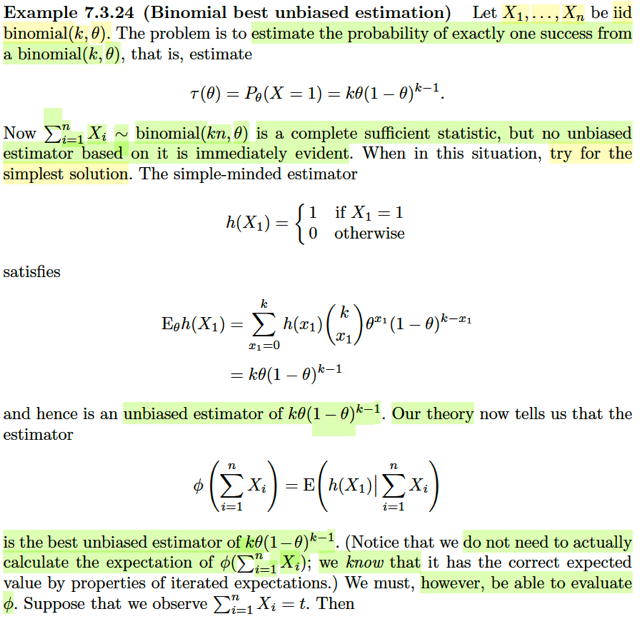</kbd>

🔗 **Related:** [6.2 THE SUFFICIENT PRINCIPLE](62_the_sufficient_principle.md#node-479)

> [!NOTE]
> Qua ví dụ cuối 7.3.24: X1,...Xn của iid binomial (k, θ). Ta cần estimator xác
> suất của chính xác một success.
>
> Dừng lại chút, ý trên là sao?:
>
> Chú ý là "xác suất của chính xác có một success", nó khác với xác suất  một
> success thành công"
>
> Cái đầu tiên là P(X=1) với X ~ binomial(k, θ). Còn cái sau là θ.
>
> P(X=1) = (k choose 1)θ^1(1-θ)^(k-1) = kθ(1-θ)^(k-1)
>
> Và đây chính là cái τ(θ) ta cần estimate: τ(θ) = kθ(1-θ)^(k-1), chứ ko phải θ
>
> ====
>
> Tiếp, tác giả nói, (Σi Xi) ~ binomial(kn, θ) vì sao (Σi Xi) ~ binomial(kn, θ)?
>
> Lật lại story của binomial (n, p): Nó là số trial success trong n iid Bern(p) nên
> nếu X ~ binomial(n, p) ⇨ X là số trial success trong n iid Bern(p) và Y  ~
> binomial(m, p), ⇨ Y là số trial success trong m iid Bern(p) thì lẽ dễ hiểu X + Y
> sẽ là số trial success trong (m+n) iid Bern(p). Từ đó ta (chứng minh bằng story
> proof rằng X + Y là binomial(m + n, p)
>
> Từ đó ta hiểu vì sao (Σi Xi) ~ binomial(kn, θ).
>
> Thế thì theo link bài trước ta đã biết  (Σi Xi) là complete sufficient statistic.
>
> Do đó ở đạy mới nói (Σi Xi) ~ binomial(kn, θ) complete sufficient statistic
>
> Thế thì dừng lại nhìn lại chút xíu: ta đang muốn tìm the best unbiased
> estimator của τ(θ) = k θ(1-θ)^(k-1). Và ta biết từ theorem vừa rồi rằng, bởi vì
> đã có Σi Xi là một sufficient complete statistic, thì chỉ cần tạo một estimator
> bằng cách ném một unbiased estimator của τ(θ) vào máy lọc: E[.|Σi Xi], là
> ngay lập tức ta có một estimator Φ(Σi Xi) là the best unbiased estimator của
> τ(θ).
>
> Vấn đề là, với cái τ(θ) như trên thì khó mà biết được ngay cái estimator nào
> có kí vọng là k θ(1-θ)^(k-1).
>
> Do đó, tác gỉa nói, trong những tình huống thế này, cứ thử cái đơn giản nhất
> có thể:
>
> Đó là dùng h(**X**) có dạng thế này: h(**X**) = 1 khi X1 = 1 và h(**X**) = 0 nếu
> ngược lại.
>
> Thế thì với estimator này: E_θ[h(**X**)] có bằng τ(θ) không?
>
> Dùng lotus:
>
> E_θ[h(**X**)] = Σ{mọi possible value **x** của **X**} h(**x**) f**X**(**x**)
>
> = Σ{mọi possible value x1,...xn của X1,...Xn} h(x1,..xn) fX1(x1)fX2(x2)....
> fXn(xn)
>
> = Σx1=0:k ...Σxn=1:k h(x1) fX1(x1)fX2(x2)....fXn(xn)
>
> (Chỗ này sẽ giống như Σx1=0:k Σx2=1:k h(x1)fX1(x1)fX2(x2)
>
> = Σx1=0:k h(x1)fX1(x1) Σx2=0:k fX2(x2) (đưa h(x1)fX1(x1) ra ngoài sum của
> x2)
>
> = Σx1=0:k h(x1)fX1(x1) * 1 (vì Σx2=0:k fX2(x2) = 1, do tính valid của pdf/pmf))
>
> Nên kết quả sẽ là = Σx1=1:k h(x1)fX1(x1)
>
> = Σx1=0:k h(x1)(k choose x1)θ^x1(1-θ)^(k-x1)
>
> = 1 * (k choose 1)θ^x1(1-θ)^(k-1) + 0 * (...) + 0 * (...)
>
> = k θ^1(1-θ)^(k-1)
>
> Và như vậy h(**X**) ở trên chính là unbiased estimator của τ(θ) = k θ^x1(1-θ)^(k-1)
>
> Và như vậy, E[h(**X**) | Σi Xi], là một estimator có dạng là function của Σi Xi,
> Φ(Σi Xi) CHÍNH LÀ THE BEST UNBIASED ESTIMATOR CỦA τ(θ)
>
> Thế thì, ở đây giáo sư có nói, ta THẬT RA CHẢ CẦN PHẢI CHECK XEM
> E_Θ[Φ(Σi Xi)] có bằng τ(θ) hay không. Vì chắc chắn là bằng, do Adam's Law:
>
> E_θ[E[h(**X**) | Σi Xi]] = E[h(**X**)] = τ(θ)

 

<kbd>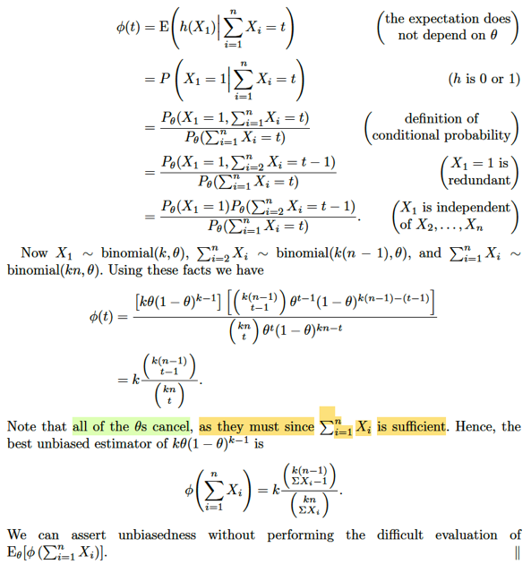</kbd>

🔗 **Related:** [6.2 THE SUFFICIENT PRINCIPLE](62_the_sufficient_principle.md#node-473)

> [!NOTE]
> Rồi, đặt T là Σi Xi, và t là giá trị quan sát của nó.
>
> thì Φ(T) = E[h(**X**)|T], như vừa nói sẽ là the best unbiased estimator của τ(θ)
>
> và ta vừa nói là tuy ko cần chứng minh E_θ[Φ(T)] = τ(θ), vì chắc chắn là phải
> bằng nhưng ta cần biết cụ thể cái Φ(T) là thế nào. tức là, ta cần biết hàm Φ(t)
> là gì:
>
> Vậy thì cần xem cái này thôi: E[h(**X**)|T=t]
>
> = E[h(X1)|T=t] (tương tự như lúc nãy)
>
> Theo lotus:
>
> E[h(X1)|T=t] = Σx1=1:k h(x1)P(X1=x1|T=t)
>
> = P(X1=1|T=t) (vì với x1 khác 1, h(x1) = 0 hết rồi)
>
> Viết lại T = Σi Xi
>
> ..= P(X1 = 1 | Σi Xi = t)
>
> = P(X1 = 1, Σi Xi = t) / P(Σi Xi = t) | conditional probability definition
>
> vì X1 = 1, Σi Xi = t là joint event. nên X1 = 1 ⇨ Σi=2:k Xi = t-1
>
> .. = P(X1 = 1, Σi=2:k Xi = t-1) / P(Σi Xi = t)
>
> = P(X1 = 1)P(Σi=2:k Xi = t-1) / P(Σi Xi = t)  Do iid, nên X1 độc lập X2,...Xn
>
> ⇨ X1 = 1 là event độc lập với Σi=2:k Xi = t-1
>
> Tới đây, X1 là binomial(k, θ), Σi=2:k Xi, dễ thấy là binomial(k(n-1), θ), và Σi Xi
> thì như đã nói là binomial (kn, θ)
>
> Nên ráp pmf của chúng vô ta có
>
> Φ(t) = k [k(n-1) choose t-1] / (kn choose t) và quả thật KHÔNG CÒN PHỤ
> THUỘC θ
>
> Và tác giả cho rằng VỐN DĨ ĐIỀU NÀY BẮT BUỘC PHẢI ĐÚNG VÌ T = Σi Xi là
> SUFFICIENT STASTITIC.
>
> Mình hiểu: theo link quay lại định nghĩa của sufficient statistic thì nếu T(**X**)
> là sufficient statistic, thì việc quan sát được giá trị của nó (T = t) sẽ khiến
> conditional distribution của sample **X KHÔNG CÒN PHỤ THUỘC θ NỮA.**Thì đây, rõ ràng cái mà ta vừa tính chính là P(X1=1|T=t), chính là conditional
> distribution của sample đấy, Nên nó phải không còn phụ thuộc θ vì ý vừa nói.

 

