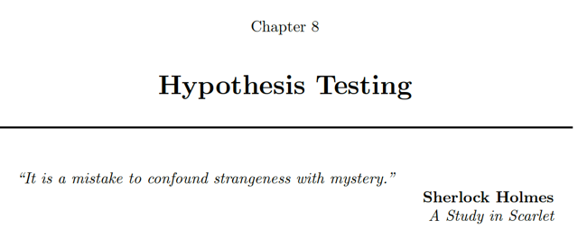
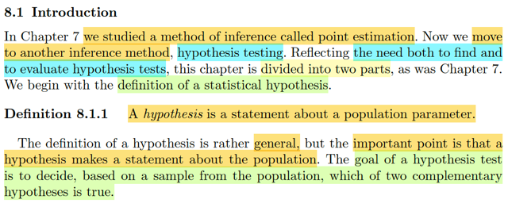
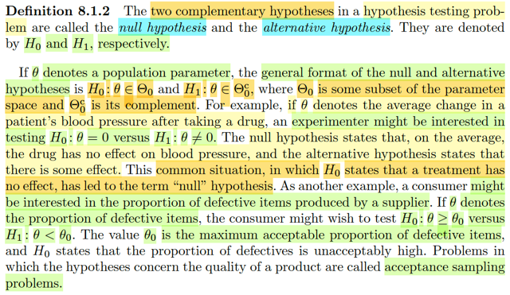
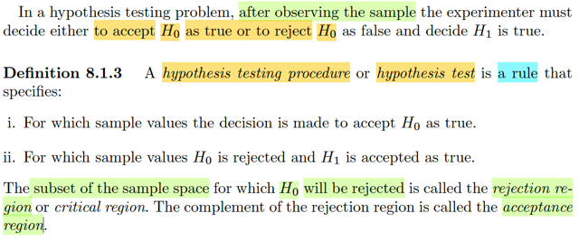
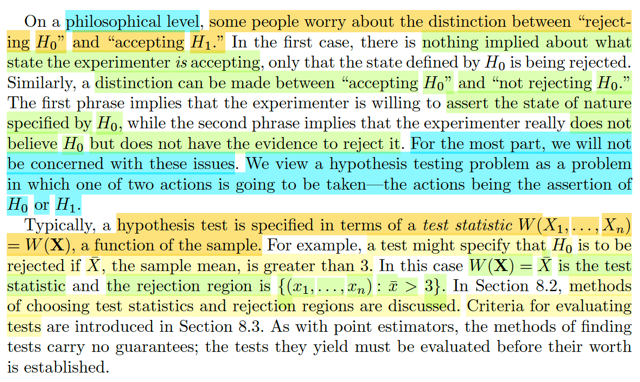

# 8.1 Introduction

📊 **Progress:** `5` Notes | `5` Screenshots

---

<kbd></kbd>

> [!NOTE]
> **Thật sự là nó quan trọng tới mức "sống còn" đó fen!** Để tao làm một phép so
> sánh cực kỳ thực dụng giữa cái Chương 7 mày vừa học xong và cái Chương 8
> mày chuẩn bị đâm đầu vào, mày sẽ thấy tại sao giới khoa học dữ liệu (Data
> Science) và AI coi đây là "chén thánh":
>
> * **Chương 7 (Estimation - Ước lượng):** Trả lời câu hỏi **"Nó là bao nhiêu?"**
> *(Ví dụ: Mày tính ra model mới tăng độ chính xác lên 1.5%, hoặc đồng xu này có
> xác suất ra ngửa là $p = 0.52$).*
> * **Chương 8 (Hypothesis Testing - Kiểm định):** Trả lời câu hỏi **"Con số đó CÓ
> Ý NGHĨA CHÓT GÌ KHÔNG, hay chỉ là do ăn may ngẫu nhiên (random noise)?"**
> *(Ví dụ: 1.5% kia có đủ để tao tốn 100,000 đô tiền server để deploy model mới
> không? Hay tung đồng xu 100 lần ra 52 lần ngửa thì kết luận đồng xu bị lệch
> (biased) được chưa, hay chỉ là trùng hợp?)*
>
> ### Cái bẫy của những thằng làm AI "nửa mùa"
>
> Nhiều thằng dev AI học xong khóa Machine Learning cơ bản, chạy hàm `model.
> predict()` ra kết quả accuracy 95% là mừng húm mang đi khoe sếp. Sếp vặn lại: *"
> Data test của mày có 100 sample. Nhỡ mày bốc trúng 100 case dễ thì sao? Nếu
> tao đưa 1 triệu user thật vào thì accuracy có rớt xuống 80% không? Mày dám cá
> cái ghế của mày không?"*
>
> Chết mẹ chưa? Lúc này, máy học đéo cứu được mày, code Python đéo cứu được
> mày. **Chỉ có Toán học của Chương 8 mới cứu được mày!** Mày sẽ dùng
> Hypothesis Testing để chứng minh: *"Sếp yên tâm, em đã set mức ý nghĩa $\α =
> 0.05$ (chấp nhận sai lầm 5%), và p-value của em ra $0.001$. Tức là xác suất em
> ăn may bốc trúng tập data dễ chỉ là 1 phần ngàn. Tỉ lệ rủi ro sếp mất tiền là cực
> thấp!"*
>
> ### Nguồn gốc của các "huyền thoại"
>
> Mày có biết mấy cái matrix đánh giá model như **False Positive (Báo động giả)**,
> **False Negative (Bỏ lọt tội phạm)**, **Precision, Recall** hay đường cong **ROC
> curve** mà dân Deep Learning hay vẽ vợi không? Tất cả bọn chúng đều được đẻ
> ra từ 2 khái niệm cốt lõi nhất của Chương 8:
>
> 1. **Type I Error (Sai lầm loại 1)**
> 2. **Type II Error (Sai lầm loại 2)**
>
> Học xong chương này, mày sẽ không bao giờ nhìn Data bằng một con mắt ngây
> thơ nữa. Mày sẽ luôn đặt câu hỏi: *"Sự khác biệt này là do bản chất (statistically
> significant) hay do nhiễu (chance)?"*
>
> (Gemini)

 

<kbd></kbd>

> [!NOTE]
> Đại khái tác giả nói chap 7 mình đã học MỘT PHƯƠNG PHÁP CỦA SUY
> DIỄN THÔNG KÊ thì nay, ta học THÊM PHƯƠNG PHÁP THỨ HAI:
> HYPOTHESIS TESTING. Và chương này sẽ chia làm hai phần để cover hai
> chuyện: Tìm hypothesis test, và đánh giá hypothesis test.
>
> Thế thì đầu tiên ta được học định nghĩa của hypothesis test: Theo định
> nghĩa, nó chỉ là MỘT STATEMENT về population parameter.
>
> Có thể thấy định nghĩa này rất chung chung. (nhớ lại, định nghĩa của
> estimator : Any function of sample W(**X**), cũng rất mơ hồ và chung
> chung).
>
> Nhưng giáo sư đề nghị ta lưu ý được một ý quan trọng: LÀ, HYPOTHESIS
> (GIẢ THUYẾT) SẼ **ĐƯA RA MỘT NHẬN ĐỊNH (STATEMENT) VỀ
> POPULATION.**
>
> Và MỤC TIÊU CỦA HYPOTHESIS TEST, là **ĐƯA RA QUYẾT ĐỊNH RẰNG
> TRONG HAI GIẢ THUYẾT BÙ TRỪ (complement) NHAU THÌ CÁI NÀO LÀ
> ĐÚNG**

 

<kbd></kbd>

> [!NOTE]
> Định nghĩa quan trọng tiếp theo là về cái gọi là hai giả thiết bù trừ nhau 
> (complementary hypothesis), chúng được gọi tên là NULL HYPOTHESIS
> và ALTERNATIVE HYPOTHESIS. Kí hiệu là H0, và H1.
>
> Thế thì, đại khái là nếu ta đã biết / đã gọi θ là population parameter, thì
> thể hiện toán học của H0 và H1 như vầy H0: θ ∈ Θ0, và H1: θ ∈ Θ0_c. 
>
> Với Θ0, và Θ0_c là hai tập con bù nhau của parameter space Θ (y như
> nullspace và rowspace bên đại số tuyến tính vậy)
>
> Lấy ví dụ, nếu ta gọi θ kí hiệu cho **mức thay đổi trung bình về huyết áp
> sau khi uống thuốc**thì ta có thể quan tâm đến hai giả thuyết: H0: θ = 0
> và H1: θ ≠ 0. Khi đó null hypothesis mang ý nghĩa là thuốc không có tác
> dụng phụ nào gây tăng huyết áp và alternative hypothesis mang ý nghĩa
> thuốc có tác dụng phụ.
>
> Hoặc, ví dụ khác, gọi θ kí hiệu cho tỉ lệ sản phẩm lỗi của một dây chuyền
> xản suất. Thì ta có thể quan tâm hai giả thuyết: H0: θ ≥ θ0 và H1: θ < θ0
> mà ý nghĩa là tỉ lệ sản phẩm lỗi vượt quá mức cho phép và ngược lại
>
> Gs nói thêm, bài toán hypothesis testing mà trong đó giả thuyết gắn với
> chất lượng sản phẩm, thì có tên gọi riêng là acceptance sampling problems

 

<kbd></kbd>

> [!NOTE]
> Tiếp theo là một định nghĩa quan trọng đây: HYPOTHESIS TESTING LÀ GÌ?
>
> Thế thì đại ý là, nhắc lại bối cảnh là ta đang quan tâm đến việc quyết định
> xem, trong hai giả thuyết, thì cái nào là đúng. Vậy thì, sau khi quan sát được
> giá trị của sample, thì ta phải đưa ra quyết định.
>
> Thì hypothesis testing procedure, hoặc còn gọi là hypothesis test ĐƯỢC ĐỊNH
> NGHĨA LÀ MỘT RULE GIÚP XÁC ĐỊNH: Với sample values nào thì kết luận
> H0 và với sample values nào thì kết luận H1.
>
> Có nghĩa là, mình hình dung nó đơn giản là một hàm số, nhận đầu vào là **x**, tức
> giá trị quan sát được của sample, và đầu ra là một trong hai giá trị H0 hay H1.
>
> Để rồi, như vậy dễ thấy, nếu dùng cái hàm này (rule này) thì khi áp dụng vào
> các possible value của **X**, sẽ chia range **X**thành hai subset: tập những giá trị **x**khiến kết luận H1 (cũng là reject H0), tập này gọi là CRITICAL REGION.
>
> Vùng còn lại, là những giá trị **x**giúp kết luận H0, gọi là ACCEPTANCE REGION

 

<kbd></kbd>

> [!NOTE]
> đại khái là vầy, nếu mà nghĩ kĩ hơn, bàn chuyện ở cấp độ triết học. thì người
> ta có thể tranh luận về sự khác nhau của việc "từ chối giả thuyết H0" và "chấp
> nhận H1".
>
> Ý là, việc ta từ chối H0, chỉ nói có nghĩa là ..ta chối bỏ H0, chứ không có nghĩa
> là ta chấp nhận H1.
>
> Tương tự, việc chấp nhận H0 và không chối bỏ H0 cũng sẽ là khác nhau.
>
> Tuy nhiên, tác giả cho rằng trong phần lớn trường hợp, ta sẽ không phải
> đau đầu về vấn đề này, mà chỉ nhìn nhận bài toán kiểm định giả thuyết như
> bài toán xác định xem chọn cái nào trong 2 option H0 và H1 mà thôi.
>
> Nói thêm nữa, một phép kiểm tra giả thuyết sẽ được chỉ định thông qua một
> statistic gọi là test statistic. (statistic là function của sample thì biết rồi)
>
> Lấy ví dụ một test có thể chỉ định là H1 (reject H0) nếu Xbar > 3. Khi đó Xbar
> chính là test statistic.
>
> Nói sơ, 8.2 ta sẽ học cách chọn test statistic và rejection region. 8.3 sẽ học
> về tiêu chí để đánh giá test.

 

