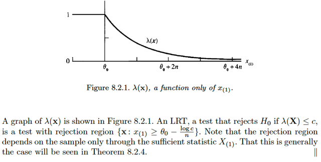

# 8.2 Method Of Finding Tests

📊 **Progress:** `8` Notes | `12` Screenshots

---

<kbd></kbd>

<kbd></kbd>

<kbd></kbd>

> [!NOTE]
> Phần này ta sẽ thảo luận 4 phương pháp để tìm / xây dựng test procedure.
> Và chúng sẽ hữu ích trong nhiều hoàn cảnh khác nhau. Đầu tiên là một
> method luôn có thể ứng dụng được, và trong một số tình huống thì nó là tối
> ưu.
>
> Đó chính là Likelihood Ratio Test. Đại ý là cái này nó có liên quan đến
> maximum likelihood estimator. và cũng giống như mle, nó rất được áp dụng
> rộng rãi.
>
> Dừng lại chút để nhớ lại về MLE:
>
> Còn nhớ, maximum likelihood estimator là cách xây dựng estimator thứ hai
> trong sách này, sau method of moment, và Bayes estimator. Thế thì, đầu tiên
> ta phải nói về cái gọi là likelihood function.Còn nhớ, nó là hàm của θ, được
> định nghĩa bởi / có giá trị tính bởi joint pdf của random sample tại observed
> value **x** của **X**: L(θ|**x**) = f(**x**|θ)****= nhờ iid = Πi=1:n f(xi|θ). Và ý
> nghĩa của nó là: với giá trị quan sát thấy **X** = **x**. Thì L(θ|**x**) sẽ cho
> biết độ hợp lí của giá trị θ (input)
>
> Thế thì, nếu ta giải bài toán tối ưu sau:
>
> maximize over θ {L(θ|**X**)}, ta sẽ được một function không còn phụ thuộc θ
> nữa, mà chỉ còn phụ thuộc **X**: Tức là,
>
> mle(**X**) = argmax_θ L(θ|**X**), đó chính là định nghĩa của mle.
>
> Chú ý, estimator, theo định nghĩa chính thức, là any function of random
> sample, thì mle(**X**) define ở trên cũng thỏa định nghĩa này.

 

<kbd></kbd>

> [!NOTE]
> Thế thì ta sẽ có định nghĩa của một LIKELIHOOD RATIO TEST như sau:
>
> Thì đầu tiên, cần biết định nghĩa của LIKELIHOOD RATIO TEST
> STATISTIC Đó là, statistic được define như vầy:
>
> λ(**x**) = sup_Θ0 L(θ, **x**) / sup_Θ L(θ, **x**)
>
> Dừng lại xíu. Nhờ học qua EE364A Convex Optimization mà mình đã biết
> suplemum: Tử số và mẫu số cơ bản là ta giải hai bài toán tối ưu. Tử số,  là
> tìm trong subset Θ0 của parameter space Θ, để maximize likelihood
> L(θ|**x**) và mẫu số thì tìm trong parameter space Θ để maximize
> likelihood L(θ|**x**)
>
> Chú ý, dù phức tạp, thì sup_Θ0 L(θ, **x**) / sup_Θ L(θ, **x**) vẫn chỉ là một
> function của **x**, chỉ phụ thuộc **x**, đúng định nghĩa của statistic, là
> function của random sample **X**. (tức là, cái trên là nói về function, còn
> muốn ghi kiểu này cũng  được:
>
> λ(**X**) = sup_Θ0 L(θ, **X**) / sup_Θ L(θ, **X**)
>
> Thế thì, khi đó ta có định nghĩa của LIKELIHOOD RATION TEST:
>
> là **BẤT KÌ PHƯƠNG THỨC TEST NÀO MÀ CÓ REJECTION REGION
> CÓ  DẠNG** {**x**: λ(**x**) < c} với c là số dương nào đó trong [0,1].
>
> Nhắc lại chút, ở phần giới thiệu mình đã biết định nghĩa của một test
> (hypothesis) testing procedure: Đơn giản nó chỉ là một cái rule, một "
> binary" function, nhận input là giá trị của random sample **x**và spit out
> một trong 2 gía trị H0 hoặc H1. Thì  ở đây ta thấy theo định nghĩa này, thì
> LRT là cái function mà cách thức hoạt động sẽ dựa vào việc **SO SÁNH
> LIKELIHOOD RATIO TEST STATISTIC VỚI MỘT NGƯỠNG c NÀO ĐÓ
> TRONG [0,1]**, để rồi nếu λ(**x**) ≤ c → reject H0 và ngược lại.

 

<kbd></kbd>

<kbd></kbd>

<kbd></kbd>

> [!NOTE]
> Vậy thì ta có thể hiểu đại khái cái "lí lẽ" của phương thức test này như
> sau:
>
> Nói ngắn gọn trước: ta sẽ đo độ uy tín của H0. Nếu nó uy tín thấp thì
> reject H0,  nó uy tín cao thì accept / fail to reject H0 , thế thôi.
>
> Và ta đo / định nghĩa độ uy tín của nó của nó như vầy: Trước tiên, với
> giá trị quan sát thấy, thì thằng θ hợp lí nhất là gì (ta sẽ tìm trong toàn
> bộ không gian parameter, dễ thấy, đây chính là mle) và độ hợp lí nhất
> đó là bao nhiêu (Đây chính là mẫu số)
>
> Rồi, nhớ lại, H0 là gì, H0 là một trong hai giả thuyết, và nó nói rằng /
> nhận định  rằng: "θ NẰM TRONG KHÔNG GIAN CON Θ0". Vậy thì dựa
> trên việc thấy **x**, ta tìm trong Θ0 xem độ hợp lí cao nhất được bao
> nhiêu (chính là tử số).
>
> Thế thì nếu tỉ số này cao (thể hiện qua > c, c bằng nhiêu thì 8.3 sẽ bàn)
> thì có nghĩa dễ hiểu là H0 nó nói khá đúng, lời của nó đáng tin cậy →
> chấp nhận nó.
>
> Ngược lại, nếu tỉ số này thấp, thì đồng nghĩa là, nó nói sai, vì nếu nó
> nói θ thật sự nằm trong Θ0 thì tại sao tìm cái θ khiến tăng tối đa độ hợp
> lí lại không cao nổi. Như vậy ta sẽ reject H0. Đơn giản vậy thôi.
>
> Như vậy, nhớ lại định nghĩa của H0: θ ∈ Θ0: Tức là nó tuyên bố: θ thật
> sự của population nằm trong Θ0.
>
> Thì cái likelihood ratio test, thật ra đang mượn maximum likelihood
> estimator của θ để làm công cụ. Để rồi lí luận nôm na là: "**ê, H0, mày
> nói θ thật sự nằm trong trong đội Θ0 của mày" nhưng mà dựa trên
> X=x, thì cái độ hợp lí lớn nhất của θ trong đội mày lại yếu xìu không
> khớp được cái độ hợp lí có được mà tao tìm trong toàn không gian,
> vậy là mày ko uy tín lắm → reject**"
>
> Rồi, đoạn sau thì dễ hiểu thôi. Vì vừa nói ở trên, cái mẫu số, khi ta tìm
> θ trong toàn parameter space để maximize L(θ|**x**) thì đó chính là mle,
> tức là mẫu số chính là giá trị của hàm likelihood tại mle θ^. 
>
> Còn tử số, thì cũng có thể coi là ta có mle nhưng không gian tìm kiếm
> chỉ trong Θ0. Nên kí hiệu là θ^_0, để rồi tử số là likelihood function evaluate
> tại θ^_0.
>
> Khi đó ta sẽ thấy λ(**x**), LRT có liên quan đến MLE là vậy

 

<kbd></kbd>

> [!NOTE]
> Qua ví dụ này, cho X1,...Xn là random sample từ n(θ,1). Và ta đặt hai giả
> thuyết H0: θ = θ0 và H1: θ ≠ θ0. θ0 là fixed number.
>
> Ôn lại một chút những gì đã học hôm qua: Đầu tiên, hypothesis testing là gì,
> đó là một phương pháp suy luận về parameter khác, bên cạnh point
> estimation đã học ở chapter 7. Nói vậy để thấy, mục tiêu của nó, cũng là để
> ta có thể suy diễn, suy luận về population parameter dựa trên giá trị quan sát
> được của random sample.
>
> Cách thức của nó, đó là ta sẽ đặt ra hai giả thuyết (hypothesis) kí hiệu H0 và
> H1. Trong đó H0: θ ∈ Θ0, mang tính ý nghĩa giải thuyết này nhận định rằng
> (statement) θ nằm trong subset Θ0 của parameter space Θ.Còn H1: θ ∈ Θ1,
> nhận định rằng θ nằm trong phần bù Θ1.
>
> Thế thì, mục tiêu của ta là tìm cách dựa vào observed value **x**, để bác bỏ
> (reject) H0 hoặc (không thể reject H0 (cái này thằng Gemini nó góp ý mình).
>
> (trong đó reject H0, tạm coi như là accept H1).
>
> Vậy để làm điều này, ta sẽ xây dựng một quy trình kiểm tra giả thuyết
> (hypothesis testing procedure), mà theo định nghĩa, nó chỉ giống như một
> binary function, nhận đầu vào là **x**, và đầu ra là một trong hai giá trị để đại
> diện cho H0 hoặc H1.
>
> Thế thì, có mấy cách tiếp cận cho hypothesis testing, thì đầu tiên, phổ biến
> nhất, và trong nhiều hoàn cảnh là tối ưu, chính là likelihood ratio test.
>
> Ý tưởng của nó là: Giả sử ta quan sát được giá trị của sample **X** = **x**.
> Thì, likelihood function tại mle sẽ cho ta độ hợp lí lớn nhất có thể khi tìm kiếm
> trong toàn bộ param space. Thế thì, nếu như độ hợp lí lớn nhất có thể khi tìm
> kiếm trong subspace Θ0 mà chỉ bằng một phần rất nhỏ của độ hợp lí lớn
> nhất. Thì điều đó cho thấy H0 không đủ uy tín, ta sẽ reject H0. (và ngược lại)
> Và những phần sau ta sẽ học cách quyết định ngưỡng thế nào là nhỏ.
>
> Thì với ý tưởng như vậy, ta sẽ có likelihood ratio test (LRT):
>
> λ(**x**) ≤ c → reject H0
>
> với λ(**x**) = sup_Θ0 L(θ, **x**) / sup_Θ L(θ, **x**), gọi là **likehood ratio test statistic**
>
> = L(θ^_0 | **x**) / L(θ^ | x) với θ^ và θ^_0 là mle thật và mle khi coi parameter
> space là Θ0.
>
> ====
>
> Như vậy, quay lại đây:
>
> như tử số trong công thức λ(**x**) sẽ là sup_{θ0} L(θ|**x**), dĩ nhiên nó =
> L(θ0|**x**) vì search trong không gian Θ0 là một singleton, tập chỉ có mỗi θ0.
>
> Còn mẫu số, là LIKELIHOOD TẠI MLE (chú ý, không phải MLE, mà là
> likelihood function evaluate tại MLE) như đã nói, thế thì với normal(θ,1) trong
> ví dụ 7.2.5 ta đã biết θ^_mle(**X**) chính là Xbar ⇨ mẫu số là L(θ^_mle|**x**)
> = L(Xbar|**x**)

 

<kbd></kbd>

> [!NOTE]
> Rồi, tiếp, ta sẽ khai triển ra:
>
> λ(**x**) = L(θ0|**x**) / L(Xbar|**x**)
>
> = f(**x**|θ0) / f(**x**|xbar)
>
> = Πi f(xi|θ0) / Πi f(xi|xbar)  (do iid, joint pdf = tích marginal pdf)
>
> = Πi (1/σ√2π) exp[-(xi-θ0)^2/2σ^2] / Πi (1/σ√2π) exp[-(xi-xbar)^2/2σ^2]
>
> σ = 1
>
> ..= Πi (1/√2π) exp[-(xi-θ0)^2/2] / Πi (1/√2π) exp[-(xi-xbar)^2/2]
>
> = (1/√2π)^n Πi  exp[-(xi-θ0)^2/2] / (1/√2π)^n Πi exp[-(xi-xbar)^2/2]
>
> = Πi exp[-(xi-θ0)^2/2] / Πi exp[-(xi-xbar)^2/2]
>
> = exp [-Σi(xi-θ0)^2/2] / exp [-Σi(xi-xbar)^2/2]
>
> = exp [-Σi(xi-θ0)^2/2 + Σi(xi-xbar)^2/2]
>
> = exp [-Σi(xi-θ0)^2 + Σi(xi-xbar)^2]/2
>
> = exp [-Σi(xi-θ0+xbar-xbar)^2 + Σi(xi-xbar)^2]/2
>
> = exp [-Σi(xi-xbar+xbar-θ0)^2 + Σi(xi-xbar)^2]/2
>
> = exp [-Σi[(xi-xbar)^2+2(xi-xbar)(xbar-θ0)+(xbar-θ0)^2] + Σi(xi-xbar)^2]/2
>
> = exp [-Σi(xi-xbar)^2-Σi2(xi-xbar)(xbar-θ0)-Σi(xbar-θ0)^2] + Σi(xi-xbar)^2]/2
>
> = exp [-Σi2(xi-xbar)(xbar-θ0)-Σi(xbar-θ0)^2]/2
>
> = exp [-2(xbar-θ0)Σi(xi-xbar)-Σi(xbar-θ0)^2]/2
>
> = exp [-2(xbar-θ0)(nxbar-nxbar)-Σi(xbar-θ0)^2]/2
>
> = exp [-2(xbar-θ0)(0)-Σi(xbar-θ0)^2]/2
>
> = exp [-Σi(xbar-θ0)^2]/2
>
> = exp [-n(xbar-θ0)^2]/2
>
> Vậy λ(**x**) = exp [-n(xbar-θ0)^2/2]
>
> Đến đây, bài trước cũng đã biết về việc, đại khái là khi có hypothesis test rồi,
> tức là cái rule để xác định xem với observed value thì reject hay không reject
> H0. Thì từ đó kiểu như range của **X** sẽ được chia làm hai subset:
>
> {**x** ∈ **X**: dựa vào **x** thì test sẽ reject H0}, đây gọi là **rejection region**
>
> và {**x** ∈ **X**: dựa vào x thì test sẽ không thể reject H0}.
>
> Vậy ở đây, với likelihood ratio test, ta đã nói là sẽ reject H0 khi ratio nhỏ, so
> với ngưỡng c nào đó. Vậy nên rejection region là: {**x**: λ(x) ≤ c}
>
> = {**x**: exp [-n(xbar-θ0)^2/2] ≤ c}
>
> = {**x**: [-n(xbar-θ0)^2/2] ≤ log(c)}
>
> = {**x**: (xbar-θ0)^2 ≥ -2log(c)/n}
>
> = {**x**: |xbar-θ0| ≥ √[-2log(c)/n]}
>
> Vậy từ đây mới có nhận định như vầy:
>
> Đại khái là ta nói c là ngưỡng để quyến định xem ratio có nhỏ quá không, để
> mà reject H0. Và c là con số từ 0 đến 1.
>
> Vậy thì nhìn vào kết quả trên mình có thể giải thích để hiểu việc thay đổi
> ngưỡng c này sẽ là như thế nào.
>
> Khi c ≈ 0, thì log c ≈ -inf → -2log(c)/n ≈ inf → √[-2log(c)/n] ≈ inf, là con số rất
> lớn.
>
> Và khoảng cách giữa xbar và θ0 phải lớn hơn con số rất lớn này thì ta mới
> bác bỏ H0 và rõ ràng điều này rất khó xảy ra Vậy có nghĩa là sao, có nghĩa là
> ta rất nhân ái, dễ  dãi với với H0, và tập **x**khiến H0 bị bác sẽ rất nhỏ, vì rất
> ít x khiến xbar cách θ0 một khoảng xa vô cùng lớn như vậy.
>
> Ngược lại, khi c ≈ 1, thì log c ≈ 0 → √[-2log(c)/n] ≈ 0, là con số rất nhỏ, lúc
> này điều kiện để bác bỏ H0 chỉ là khoảng cách giữa xbar và θ0 lớn hơn một
> con số rất nhỏ, hay, xbar chỉ cần lệch hỏi θ0 chút xíu là ta sẽ reject H0. Ý
> nghĩa là ta rất khắt khe với H0, hở một chút là đuổi nó đi ngay (reject nó). Và
> rất dễ, rất nhiều x khiến xbar lệch khỏi θ0 tí xíu, nên vùng rejection mở rộng
> rất lớn.

 

<kbd></kbd>

> [!NOTE]
> Qua ví dụ tiếp, X1,...Xn là random sample từ exponential có pdf:
>
> f(x|θ) = e^-(x-θ), x ≥ θ.
>
> Dừng lại chút xíu: Ôn lại pdf của expo(λ):
>
> f(x|β) = (1/β) e^(-x/β).
>
> ⇨ pdf expo(1): f(x) = e^(-x)
>
> Và các thành viên trong location family với standard member là expo(1)
> ứng với location θ sẽ có pdf là f(x) = e^(-(x-θ))
>
> Dĩ nhiên x ≥ 0 không phải là tập xác định của expo(1) pdf f(x) = e^-x,
> mà nó là support của distribution, tập các x khiến f(x) > 0.
>
> Thế thì quay lại đây, thử xây dựng likelihood: Như đã quen rồi, likelihood
> là hàm của θ, được định nghĩa là L(θ|**x**) = f(**x**|θ) mang ý nghĩa độ hợp lí
> của θ (input) khi observed giá trị của sample **X** = **x**. Và nhờ iid nên:
>
> L(θ|**x**) = f(**x**|θ) = Πi f(xi|θ) = Πi e^[-(xi-θ)]
>
> = e^Σi[-(xi-θ)]
>
> = e^[-(Σixi-Σiθ)]
>
> = e^[-(Σixi-nθ)]
>
> = e^(-Σixi+nθ)
>
> Support của f(xi|θ) là xi ≥ θ ⇨ min(xi) ≥ θ, tức x(1) ≥ θ.
>
> Do đó sách ghi là L(θ|**x**) = e^(-Σixi+nθ) khi x(1) ≥ θ và = 0 khi x(1) < θ 
> là vậy.

 

<kbd></kbd>

> [!NOTE]
> Tiếp theo, tác giả cho biết ta cân nhắc hai giả thuyết: H0: θ ≤ θ0, H1: θ > θ0.
>
> Thế thì, likelihood ratio λ(**x**) = L(θ^0|**x**) / L(θ^|**x**)
>
> Mẫu số, là likelihood tại θ^_mle. Có nghĩa là ta phải giải bài toán: 
>
> maximize {e^[-Σixi + nθ]} để tìm mle, cũng như likelihood tại đó.
>
> Chú ý, θ ≤ x(1) không phải là ràng buộc của θ, nó chỉ là là tập khiến likelihood 
> > 0 thôi.
>
> Vậy thì ta sẽ không khó để thấy e^[-Σixi + nθ] chỉ là function e^[nθ + constant]
> nên nó sẽ monotone increasing theo θ vì tính chất hàm exp(.)
>
> Vậy khi θ → x(1) thì hàm tăng liên tục, và sau khi θ vượt qua x(1) thì nó drop
> thành 0. Nên sup_θ L(θ|**x**) = L(x(1)|θ)
>
> Còn tử số, thì vẫn là likelihood tại mle nhưng không là mle khi chỉ tìm trong 
> subset Θ0, thay vì toàn bộ Θ. Và Θ0 ở đây là (-inf, θ0].
>
> Thế thì, nảy sinh hai trường hợp:
>
> θ0 < x(1):
>
> Khi đó khi θ tăng dần từ -inf đến θ0 thì hàm likelihood tăng liên tục, nên đạt
> max tại θ0. ⇨ L(θ^0|**x**) = L(θ0|**x**)
>
> θ0 ≥ x(1)
>
> Lúc này khi θ tăng từ -inf đến x11 thì hàm likelihood tăng liên tục và đạt max
> tại x(1), như tăng tiếp khi vượt qua x(1) thì nó drop thành 0. Vậy ở case này
> L(θ^0|x) = L(x(1)|**x**).
>
> Do đó, λ(**x**) (likelihood ratio test statistic) sẽ là:
>
> L(θ0|**x**) / L(x(1)|**x**) khi x(1) > θ0
>
> L(x(1)|**x**) / L(x(1)|**x**) = 1 khi x(1) ≤ θ0

 

<kbd></kbd>

> [!NOTE]
> hình ảnh cho thấy λ(**x**). như vừa thấy, khi x(1) ≤ θ0, λ(**x**) = 1, và khi θ0 < x(1)
> λ(**x**) = L(θ0|**x**) / L(x(1)|**x**).
>
> Vậy thử nghĩ xem vì sao nó giảm dần?
>
> L(θ0|**x**) = e^[-Σixi + nθ0]
>
> L(x(1)|**x**) = e^[-Σixi + nx(1)]
>
> khi x(1) vượt qua θ0 càng xa thì đơn giản là mẫu số ngày càng lớn hơn tử số
> nên tỉ số giảm dần.
>
> Thế thì: rejection region là gì:
>
> Còn nhớ {x: reject H0}
>
> λ(x) ≤ c
>
> ⇔ e^[-Σixi + nθ0]/e^[-Σixi + nx(1)] ≤ c
>
> ⇔ e^[-Σixi + nθ0 + Σixi - nx(1)] ≤ c
>
> ⇔ e^[nθ0 - nx(1)] ≤ c
>
> ⇔ nθ0 - nx(1) ≤ log(c)
>
> ⇔ nθ0 - log(c) ≤ nx(1)
>
> ⇔ θ0 - log(c)/n ≤ x(1)
>
> ⇨ reject region: {**x**: θ0 - log(c)/n ≤ x(1)}
>
> và cũng dễ thấy region region chỉ phụ thuộc sample thông qua cái statistic X(1)
> tức min_i Xi và những bài trước ta đã biết nó là sufficient statistic.

 

