# 8.2 Method Of Finding Tests

📊 **Progress:** `18` Notes | `28` Screenshots

---

<kbd>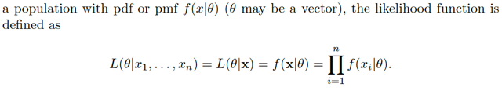</kbd>

<kbd></kbd>

<kbd>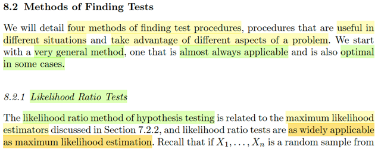</kbd>

> [!NOTE]
> Phần này ta sẽ thảo luận 4 phương pháp để tìm / xây dựng test procedure.
> Và chúng sẽ hữu ích trong nhiều hoàn cảnh khác nhau. Đầu tiên là một
> method luôn có thể ứng dụng được, và trong một số tình huống thì nó là tối
> ưu.
>
> Đó chính là Likelihood Ratio Test. Đại ý là cái này nó có liên quan đến
> maximum likelihood estimator. và cũng giống như mle, nó rất được áp dụng
> rộng rãi.
>
> Dừng lại chút để nhớ lại về MLE:
>
> Còn nhớ, maximum likelihood estimator là cách xây dựng estimator thứ hai
> trong sách này, sau method of moment, và Bayes estimator. Thế thì, đầu tiên
> ta phải nói về cái gọi là likelihood function.Còn nhớ, nó là hàm của θ, được
> định nghĩa bởi / có giá trị tính bởi joint pdf của random sample tại observed
> value **x** của **X**: L(θ|**x**) = f(**x**|θ)****= nhờ iid = Πi=1:n f(xi|θ). Và ý
> nghĩa của nó là: với giá trị quan sát thấy **X** = **x**. Thì L(θ|**x**) sẽ cho
> biết độ hợp lí của giá trị θ (input)
>
> Thế thì, nếu ta giải bài toán tối ưu sau:
>
> maximize over θ {L(θ|**X**)}, ta sẽ được một function không còn phụ thuộc θ
> nữa, mà chỉ còn phụ thuộc **X**: Tức là,
>
> mle(**X**) = argmax_θ L(θ|**X**), đó chính là định nghĩa của mle.
>
> Chú ý, estimator, theo định nghĩa chính thức, là any function of random
> sample, thì mle(**X**) define ở trên cũng thỏa định nghĩa này.

 

<kbd>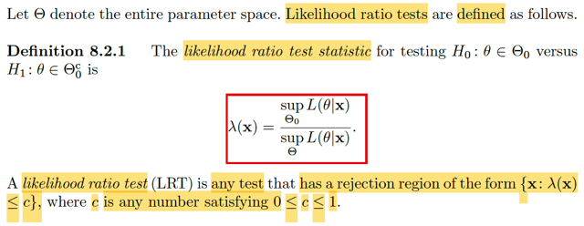</kbd>

> [!NOTE]
> Thế thì ta sẽ có định nghĩa của một LIKELIHOOD RATIO TEST như sau:
>
> Thì đầu tiên, cần biết định nghĩa của LIKELIHOOD RATIO TEST
> STATISTIC Đó là, statistic được define như vầy:
>
> λ(**x**) = sup_Θ0 L(θ, **x**) / sup_Θ L(θ, **x**)
>
> Dừng lại xíu. Nhờ học qua EE364A Convex Optimization mà mình đã biết
> suplemum: Tử số và mẫu số cơ bản là ta giải hai bài toán tối ưu. Tử số,  là
> tìm trong subset Θ0 của parameter space Θ, để maximize likelihood
> L(θ|**x**) và mẫu số thì tìm trong parameter space Θ để maximize
> likelihood L(θ|**x**)
>
> Chú ý, dù phức tạp, thì sup_Θ0 L(θ, **x**) / sup_Θ L(θ, **x**) vẫn chỉ là một
> function của **x**, chỉ phụ thuộc **x**, đúng định nghĩa của statistic, là
> function của random sample **X**. (tức là, cái trên là nói về function, còn
> muốn ghi kiểu này cũng  được:
>
> λ(**X**) = sup_Θ0 L(θ, **X**) / sup_Θ L(θ, **X**)
>
> Thế thì, khi đó ta có định nghĩa của LIKELIHOOD RATION TEST:
>
> là **BẤT KÌ PHƯƠNG THỨC TEST NÀO MÀ CÓ REJECTION REGION
> CÓ  DẠNG** {**x**: λ(**x**) < c} với c là số dương nào đó trong [0,1].
>
> Nhắc lại chút, ở phần giới thiệu mình đã biết định nghĩa của một test
> (hypothesis) testing procedure: Đơn giản nó chỉ là một cái rule, một "
> binary" function, nhận input là giá trị của random sample **x**và spit out
> một trong 2 gía trị H0 hoặc H1. Thì  ở đây ta thấy theo định nghĩa này, thì
> LRT là cái function mà cách thức hoạt động sẽ dựa vào việc **SO SÁNH
> LIKELIHOOD RATIO TEST STATISTIC VỚI MỘT NGƯỠNG c NÀO ĐÓ
> TRONG [0,1]**, để rồi nếu λ(**x**) ≤ c → reject H0 và ngược lại.

 

<kbd>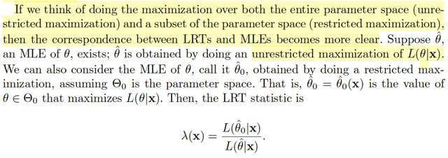</kbd>

<kbd></kbd>

<kbd>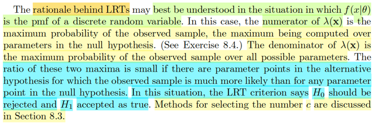</kbd>

> [!NOTE]
> Vậy thì ta có thể hiểu đại khái cái "lí lẽ" của phương thức test này như
> sau:
>
> Nói ngắn gọn trước: ta sẽ đo độ uy tín của H0. Nếu nó uy tín thấp thì
> reject H0,  nó uy tín cao thì accept / fail to reject H0 , thế thôi.
>
> Và ta đo / định nghĩa độ uy tín của nó của nó như vầy: Trước tiên, với
> giá trị quan sát thấy, thì thằng θ hợp lí nhất là gì (ta sẽ tìm trong toàn
> bộ không gian parameter, dễ thấy, đây chính là mle) và độ hợp lí nhất
> đó là bao nhiêu (Đây chính là mẫu số)
>
> Rồi, nhớ lại, H0 là gì, H0 là một trong hai giả thuyết, và nó nói rằng /
> nhận định  rằng: "θ NẰM TRONG KHÔNG GIAN CON Θ0". Vậy thì dựa
> trên việc thấy **x**, ta tìm trong Θ0 xem độ hợp lí cao nhất được bao
> nhiêu (chính là tử số).
>
> Thế thì nếu tỉ số này cao (thể hiện qua > c, c bằng nhiêu thì 8.3 sẽ bàn)
> thì có nghĩa dễ hiểu là H0 nó nói khá đúng, lời của nó đáng tin cậy →
> chấp nhận nó.
>
> Ngược lại, nếu tỉ số này thấp, thì đồng nghĩa là, nó nói sai, vì nếu nó
> nói θ thật sự nằm trong Θ0 thì tại sao tìm cái θ khiến tăng tối đa độ hợp
> lí lại không cao nổi. Như vậy ta sẽ reject H0. Đơn giản vậy thôi.
>
> Như vậy, nhớ lại định nghĩa của H0: θ ∈ Θ0: Tức là nó tuyên bố: θ thật
> sự của population nằm trong Θ0.
>
> Thì cái likelihood ratio test, thật ra đang mượn maximum likelihood
> estimator của θ để làm công cụ. Để rồi lí luận nôm na là: "**ê, H0, mày
> nói θ thật sự nằm trong trong đội Θ0 của mày" nhưng mà dựa trên
> X=x, thì cái độ hợp lí lớn nhất của θ trong đội mày lại yếu xìu không
> khớp được cái độ hợp lí có được mà tao tìm trong toàn không gian,
> vậy là mày ko uy tín lắm → reject**"
>
> Rồi, đoạn sau thì dễ hiểu thôi. Vì vừa nói ở trên, cái mẫu số, khi ta tìm
> θ trong toàn parameter space để maximize L(θ|**x**) thì đó chính là mle,
> tức là mẫu số chính là giá trị của hàm likelihood tại mle θ^. 
>
> Còn tử số, thì cũng có thể coi là ta có mle nhưng không gian tìm kiếm
> chỉ trong Θ0. Nên kí hiệu là θ^_0, để rồi tử số là likelihood function evaluate
> tại θ^_0.
>
> Khi đó ta sẽ thấy λ(**x**), LRT có liên quan đến MLE là vậy

 

<kbd>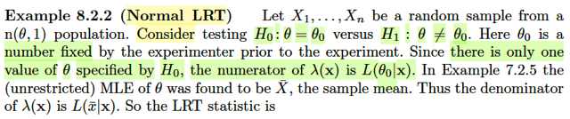</kbd>

> [!NOTE]
> Qua ví dụ này, cho X1,...Xn là random sample từ n(θ,1). Và ta đặt hai giả
> thuyết H0: θ = θ0 và H1: θ ≠ θ0. θ0 là fixed number.
>
> Ôn lại một chút những gì đã học hôm qua: Đầu tiên, hypothesis testing là gì,
> đó là một phương pháp suy luận về parameter khác, bên cạnh point
> estimation đã học ở chapter 7. Nói vậy để thấy, mục tiêu của nó, cũng là để
> ta có thể suy diễn, suy luận về population parameter dựa trên giá trị quan sát
> được của random sample.
>
> Cách thức của nó, đó là ta sẽ đặt ra hai giả thuyết (hypothesis) kí hiệu H0 và
> H1. Trong đó H0: θ ∈ Θ0, mang tính ý nghĩa giải thuyết này nhận định rằng
> (statement) θ nằm trong subset Θ0 của parameter space Θ.Còn H1: θ ∈ Θ1,
> nhận định rằng θ nằm trong phần bù Θ1.
>
> Thế thì, mục tiêu của ta là tìm cách dựa vào observed value **x**, để bác bỏ
> (reject) H0 hoặc (không thể reject H0 (cái này thằng Gemini nó góp ý mình).
>
> (trong đó reject H0, tạm coi như là accept H1).
>
> Vậy để làm điều này, ta sẽ xây dựng một quy trình kiểm tra giả thuyết
> (hypothesis testing procedure), mà theo định nghĩa, nó chỉ giống như một
> binary function, nhận đầu vào là **x**, và đầu ra là một trong hai giá trị để đại
> diện cho H0 hoặc H1.
>
> Thế thì, có mấy cách tiếp cận cho hypothesis testing, thì đầu tiên, phổ biến
> nhất, và trong nhiều hoàn cảnh là tối ưu, chính là likelihood ratio test.
>
> Ý tưởng của nó là: Giả sử ta quan sát được giá trị của sample **X** = **x**.
> Thì, likelihood function tại mle sẽ cho ta độ hợp lí lớn nhất có thể khi tìm kiếm
> trong toàn bộ param space. Thế thì, nếu như độ hợp lí lớn nhất có thể khi tìm
> kiếm trong subspace Θ0 mà chỉ bằng một phần rất nhỏ của độ hợp lí lớn
> nhất. Thì điều đó cho thấy H0 không đủ uy tín, ta sẽ reject H0. (và ngược lại)
> Và những phần sau ta sẽ học cách quyết định ngưỡng thế nào là nhỏ.
>
> Thì với ý tưởng như vậy, ta sẽ có likelihood ratio test (LRT):
>
> λ(**x**) ≤ c → reject H0
>
> với λ(**x**) = sup_Θ0 L(θ, **x**) / sup_Θ L(θ, **x**), gọi là **likehood ratio test statistic**
>
> = L(θ^_0 | **x**) / L(θ^ | x) với θ^ và θ^_0 là mle thật và mle khi coi parameter
> space là Θ0.
>
> ====
>
> Như vậy, quay lại đây:
>
> như tử số trong công thức λ(**x**) sẽ là sup_{θ0} L(θ|**x**), dĩ nhiên nó =
> L(θ0|**x**) vì search trong không gian Θ0 là một singleton, tập chỉ có mỗi θ0.
>
> Còn mẫu số, là LIKELIHOOD TẠI MLE (chú ý, không phải MLE, mà là
> likelihood function evaluate tại MLE) như đã nói, thế thì với normal(θ,1) trong
> ví dụ 7.2.5 ta đã biết θ^_mle(**X**) chính là Xbar ⇨ mẫu số là L(θ^_mle|**x**)
> = L(Xbar|**x**)

 

<kbd>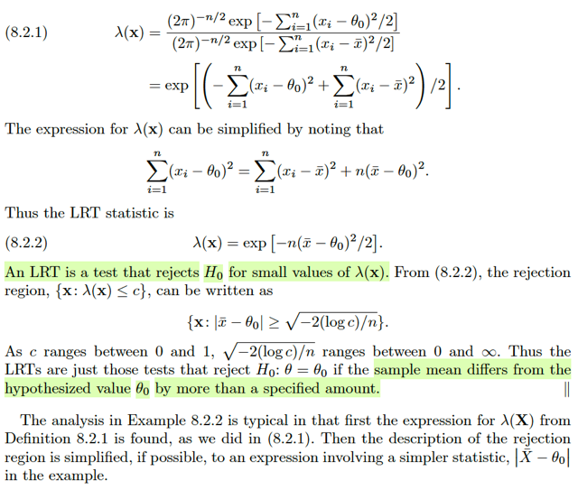</kbd>

🔗 **Related:** [8.2 METHOD OF FINDING TESTS](82_method_of_finding_tests.md#node-680)

> [!NOTE]
> Rồi, tiếp, ta sẽ khai triển ra:
>
> λ(**x**) = L(θ0|**x**) / L(Xbar|**x**)
>
> = f(**x**|θ0) / f(**x**|xbar)
>
> = Πi f(xi|θ0) / Πi f(xi|xbar)  (do iid, joint pdf = tích marginal pdf)
>
> = Πi (1/σ√2π) exp[-(xi-θ0)^2/2σ^2] / Πi (1/σ√2π) exp[-(xi-xbar)^2/2σ^2]
>
> σ = 1
>
> ..= Πi (1/√2π) exp[-(xi-θ0)^2/2] / Πi (1/√2π) exp[-(xi-xbar)^2/2]
>
> = (1/√2π)^n Πi  exp[-(xi-θ0)^2/2] / (1/√2π)^n Πi exp[-(xi-xbar)^2/2]
>
> = Πi exp[-(xi-θ0)^2/2] / Πi exp[-(xi-xbar)^2/2]
>
> = exp [-Σi(xi-θ0)^2/2] / exp [-Σi(xi-xbar)^2/2]
>
> = exp [-Σi(xi-θ0)^2/2 + Σi(xi-xbar)^2/2]
>
> = exp [-Σi(xi-θ0)^2 + Σi(xi-xbar)^2]/2
>
> = exp [-Σi(xi-θ0+xbar-xbar)^2 + Σi(xi-xbar)^2]/2
>
> = exp [-Σi(xi-xbar+xbar-θ0)^2 + Σi(xi-xbar)^2]/2
>
> = exp [-Σi[(xi-xbar)^2+2(xi-xbar)(xbar-θ0)+(xbar-θ0)^2] + Σi(xi-xbar)^2]/2
>
> = exp [-Σi(xi-xbar)^2-Σi2(xi-xbar)(xbar-θ0)-Σi(xbar-θ0)^2] + Σi(xi-xbar)^2]/2
>
> = exp [-Σi2(xi-xbar)(xbar-θ0)-Σi(xbar-θ0)^2]/2
>
> = exp [-2(xbar-θ0)Σi(xi-xbar)-Σi(xbar-θ0)^2]/2
>
> = exp [-2(xbar-θ0)(nxbar-nxbar)-Σi(xbar-θ0)^2]/2
>
> = exp [-2(xbar-θ0)(0)-Σi(xbar-θ0)^2]/2
>
> = exp [-Σi(xbar-θ0)^2]/2
>
> = exp [-n(xbar-θ0)^2]/2
>
> Vậy λ(**x**) = exp [-n(xbar-θ0)^2/2]
>
> Đến đây, bài trước cũng đã biết về việc, đại khái là khi có hypothesis test rồi,
> tức là cái rule để xác định xem với observed value thì reject hay không reject
> H0. Thì từ đó kiểu như range của **X** sẽ được chia làm hai subset:
>
> {**x** ∈ **X**: dựa vào **x** thì test sẽ reject H0}, đây gọi là **rejection region**
>
> và {**x** ∈ **X**: dựa vào x thì test sẽ không thể reject H0}.
>
> Vậy ở đây, với likelihood ratio test, ta đã nói là sẽ reject H0 khi ratio nhỏ, so
> với ngưỡng c nào đó. Vậy nên rejection region là: {**x**: λ(x) ≤ c}
>
> = {**x**: exp [-n(xbar-θ0)^2/2] ≤ c}
>
> = {**x**: [-n(xbar-θ0)^2/2] ≤ log(c)}
>
> = {**x**: (xbar-θ0)^2 ≥ -2log(c)/n}
>
> = {**x**: |xbar-θ0| ≥ √[-2log(c)/n]}
>
> Vậy từ đây mới có nhận định như vầy:
>
> Đại khái là ta nói c là ngưỡng để quyến định xem ratio có nhỏ quá không, để
> mà reject H0. Và c là con số từ 0 đến 1.
>
> Vậy thì nhìn vào kết quả trên mình có thể giải thích để hiểu việc thay đổi
> ngưỡng c này sẽ là như thế nào.
>
> Khi c ≈ 0, thì log c ≈ -inf → -2log(c)/n ≈ inf → √[-2log(c)/n] ≈ inf, là con số rất
> lớn.
>
> Và khoảng cách giữa xbar và θ0 phải lớn hơn con số rất lớn này thì ta mới
> bác bỏ H0 và rõ ràng điều này rất khó xảy ra Vậy có nghĩa là sao, có nghĩa là
> ta rất nhân ái, dễ  dãi với với H0, và tập **x**khiến H0 bị bác sẽ rất nhỏ, vì rất
> ít x khiến xbar cách θ0 một khoảng xa vô cùng lớn như vậy.
>
> Ngược lại, khi c ≈ 1, thì log c ≈ 0 → √[-2log(c)/n] ≈ 0, là con số rất nhỏ, lúc
> này điều kiện để bác bỏ H0 chỉ là khoảng cách giữa xbar và θ0 lớn hơn một
> con số rất nhỏ, hay, xbar chỉ cần lệch hỏi θ0 chút xíu là ta sẽ reject H0. Ý
> nghĩa là ta rất khắt khe với H0, hở một chút là đuổi nó đi ngay (reject nó). Và
> rất dễ, rất nhiều x khiến xbar lệch khỏi θ0 tí xíu, nên vùng rejection mở rộng
> rất lớn.

 

<kbd>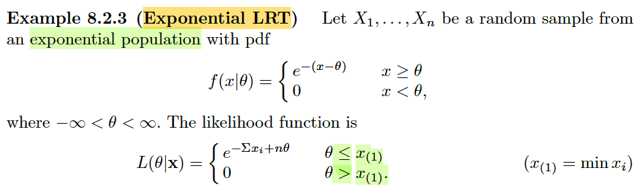</kbd>

> [!NOTE]
> Qua ví dụ tiếp, X1,...Xn là random sample từ exponential có pdf:
>
> f(x|θ) = e^-(x-θ), x ≥ θ.
>
> Dừng lại chút xíu: Ôn lại pdf của expo(λ):
>
> f(x|β) = (1/β) e^(-x/β).
>
> ⇨ pdf expo(1): f(x) = e^(-x)
>
> Và các thành viên trong location family với standard member là expo(1)
> ứng với location θ sẽ có pdf là f(x) = e^(-(x-θ))
>
> Dĩ nhiên x ≥ 0 không phải là tập xác định của expo(1) pdf f(x) = e^-x,
> mà nó là support của distribution, tập các x khiến f(x) > 0.
>
> Thế thì quay lại đây, thử xây dựng likelihood: Như đã quen rồi, likelihood
> là hàm của θ, được định nghĩa là L(θ|**x**) = f(**x**|θ) mang ý nghĩa độ hợp lí
> của θ (input) khi observed giá trị của sample **X** = **x**. Và nhờ iid nên:
>
> L(θ|**x**) = f(**x**|θ) = Πi f(xi|θ) = Πi e^[-(xi-θ)]
>
> = e^Σi[-(xi-θ)]
>
> = e^[-(Σixi-Σiθ)]
>
> = e^[-(Σixi-nθ)]
>
> = e^(-Σixi+nθ)
>
> Support của f(xi|θ) là xi ≥ θ ⇨ min(xi) ≥ θ, tức x(1) ≥ θ.
>
> Do đó sách ghi là L(θ|**x**) = e^(-Σixi+nθ) khi x(1) ≥ θ và = 0 khi x(1) < θ 
> là vậy.

 

<kbd>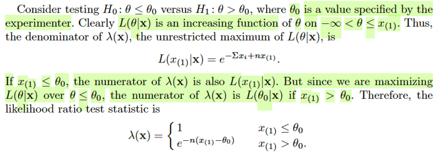</kbd>

> [!NOTE]
> Tiếp theo, tác giả cho biết ta cân nhắc hai giả thuyết: H0: θ ≤ θ0, H1: θ > θ0.
>
> Thế thì, likelihood ratio λ(**x**) = L(θ^0|**x**) / L(θ^|**x**)
>
> Mẫu số, là likelihood tại θ^_mle. Có nghĩa là ta phải giải bài toán: 
>
> maximize {e^[-Σixi + nθ]} để tìm mle, cũng như likelihood tại đó.
>
> Chú ý, θ ≤ x(1) không phải là ràng buộc của θ, nó chỉ là là tập khiến likelihood 
> > 0 thôi.
>
> Vậy thì ta sẽ không khó để thấy e^[-Σixi + nθ] chỉ là function e^[nθ + constant]
> nên nó sẽ monotone increasing theo θ vì tính chất hàm exp(.)
>
> Vậy khi θ → x(1) thì hàm tăng liên tục, và sau khi θ vượt qua x(1) thì nó drop
> thành 0. Nên sup_θ L(θ|**x**) = L(x(1)|θ)
>
> Còn tử số, thì vẫn là likelihood tại mle nhưng không là mle khi chỉ tìm trong 
> subset Θ0, thay vì toàn bộ Θ. Và Θ0 ở đây là (-inf, θ0].
>
> Thế thì, nảy sinh hai trường hợp:
>
> θ0 < x(1):
>
> Khi đó khi θ tăng dần từ -inf đến θ0 thì hàm likelihood tăng liên tục, nên đạt
> max tại θ0. ⇨ L(θ^0|**x**) = L(θ0|**x**)
>
> θ0 ≥ x(1)
>
> Lúc này khi θ tăng từ -inf đến x11 thì hàm likelihood tăng liên tục và đạt max
> tại x(1), như tăng tiếp khi vượt qua x(1) thì nó drop thành 0. Vậy ở case này
> L(θ^0|x) = L(x(1)|**x**).
>
> Do đó, λ(**x**) (likelihood ratio test statistic) sẽ là:
>
> L(θ0|**x**) / L(x(1)|**x**) khi x(1) > θ0
>
> L(x(1)|**x**) / L(x(1)|**x**) = 1 khi x(1) ≤ θ0

 

<kbd>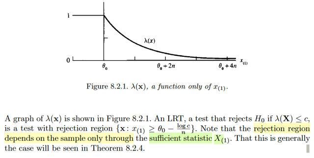</kbd>

🔗 **Related:** [6.2 THE SUFFICIENT PRINCIPLE](62_the_sufficient_principle.md#node-481)

> [!NOTE]
> hình ảnh cho thấy λ(**x**). như vừa thấy, khi x(1) ≤ θ0, λ(**x**) = 1, và khi θ0 < x(1)
> λ(**x**) = L(θ0|**x**) / L(x(1)|**x**).
>
> Vậy thử nghĩ xem vì sao nó giảm dần?
>
> L(θ0|**x**) = e^[-Σixi + nθ0]
>
> L(x(1)|**x**) = e^[-Σixi + nx(1)]
>
> khi x(1) vượt qua θ0 càng xa thì đơn giản là mẫu số ngày càng lớn hơn tử số
> nên tỉ số giảm dần.
>
> Thế thì: rejection region là gì:
>
> Còn nhớ {x: reject H0}
>
> λ(x) ≤ c
>
> ⇔ e^[-Σixi + nθ0]/e^[-Σixi + nx(1)] ≤ c
>
> ⇔ e^[-Σixi + nθ0 + Σixi - nx(1)] ≤ c
>
> ⇔ e^[nθ0 - nx(1)] ≤ c
>
> ⇔ nθ0 - nx(1) ≤ log(c)
>
> ⇔ nθ0 - log(c) ≤ nx(1)
>
> ⇔ θ0 - log(c)/n ≤ x(1)
>
> ⇨ reject region: {**x**: θ0 - log(c)/n ≤ x(1)}
>
> và cũng dễ thấy region region chỉ phụ thuộc sample thông qua cái statistic X(1)
> tức min_i Xi và những bài trước (xem link) ta đã biết các order statistic đều là 
> sufficient statistic.

 

<kbd>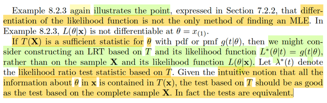</kbd>

> [!NOTE]
> đại ý là ví dụ vừa rồi minh họa cho một nhận định đã nói trước đây rằng
> lấy đạo hàm không phải là cách duy nhất để mà tìm MLE.
>
> Tiếp theo, đại khái là gs nhắc đến sufficient statistic. Mình nhớ rằng,
> sufficient statistic là một statistic mà một khi đã biết giá trị của nó, ta có
> thể vứt đi random sample **X**, bởi vì tính chất của sufficient là giá trị của
> nó đã đủ hết mọi thông tin dùng để suy luận ra θ có trong **X** rồi, hay nói
> cách khác, suy diễn của ta về θ dựa trên **X** cũng phải y như suy diễn
> cuả ta về θ dựa trên sufficient statistic T(**X**)
>
> Do đó, ở đây mới nói, nếu đã vậy thì ta sẽ nghĩ đến việc thiết kế một
> likelihood ratio test statistic dựa trên T(**x**) thay vì **x**, và vì thông tin
> chứa trong T(**x**) đã đủ, thì bài test dùng T(**x**) cũng phải tốt như bài
> test dùng **x**. Và theorem tiếp sau đây sẽ khẳng định điều này

 

<kbd>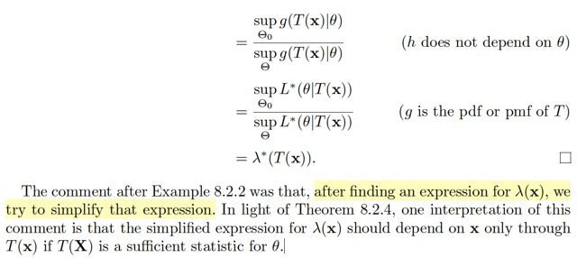</kbd>

<kbd></kbd>

<kbd>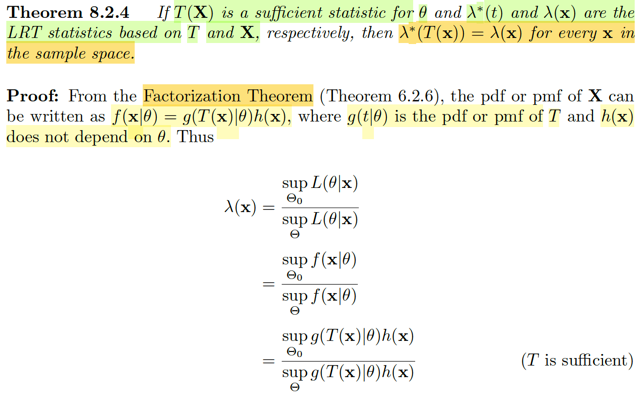</kbd>

🔗 **Related:** [6.2 THE SUFFICIENT PRINCIPLE](62_the_sufficient_principle.md#node-483)

> [!NOTE]
> Theorem 8.2.4 phát biểu lại cái nhận định vừa rồi: Đại khái là nếu ta có
> T(**X**) là sufficient statistic cho θ và λ*(t) và λ(**x**) là likelihood ratio test
> statistic dựa  trên T và dựa trên **X**. Thì λ*(T(**x**)) = λ(**x**) với mọi **x**
> trong sample space.
>
> Dừng lại để ôn lại chút xíu về LRT statistic: Theo định nghĩa, hypothesis
> testing chỉ là một quy tắc (rule) giúp ta đưa ra quyết định giữa H0 và H1 dựa
> trên gía trị quan sát được của random sample **X**.****Và cái rule đầu tiên
> được học trong 4 rule là likelihood ratio test: λ(**x**) ≤ c thì reject H0 và
> ngược lại thì không thể reject H0. Trong đó λ(**X**) = sup_Θ0 L(θ|**X**) /
> sup_Θ L(θ|**X**) được gọi là likelihood ratio test statistic, được tính bằng tỉ
> số giữa các giá trị của likelihood function evaluate tại mle nhưng ở mẫu, là
> MLE thật, khi ta tối đa hóa likelihood với θ được tìm kiếm trong toàn bộ
> parameter space Θ. Còn ở tử số, thì không gian tìm kiếm chỉ là subset Θ0
> của Θ.
>
> Nhớ lại khái niệm statistic, định nghĩa của statistic chỉ là một random
> variable có được khi apply một function nào đó lên random sample **X**,
> vậy thì ở đây, function đó là function g(**u**) = sup_Θ0 L(θ|**u**) / sup_Θ
> L(θ|**u**) thôi, nên λ(**X**) là statistic
>
> Vậy thì quay lại đây LRT statistic dựa trên **X** là sao mà dựa trên T(**X**)
> là sao?
>
> Đơn giản thôi, dựa trên **X** thì LRT statistic sẽ tính bởi tỉ số của likelihood
> function dựa trên **X**, còn dựa trên T thì likelihood function dựa trên T:
>
> Vậy thì phải ôn lại định nghĩa của likelihood function L(θ|**x**), theo định
> nghĩa, nó là function của θ, tính bởi L(θ|**x**) = f(**x**|θ), f(**x**|θ) là joint pdf
> của random sample, mang ý nghĩa là, nhận vào giá trị input θ thì độ hợp lí
> của θ đó là bao nhiêu khi mà thực tế quan sát được là **X**=**x**.
>
> Đây là likelihood function define dựa trên random sample **X**.
>
> Thì tương tự, likelihood function dựa trên quan sát giá trị của statistic T sẽ
> là:
>
> L(θ|t) = fT(t|θ)
>
> Với fT(t|θ) là pdf của statistic T, mang ý nghĩa là độ hợp lí của θ khi quan sát
> thấy giá trị của statistic T = t là bao nhiêu. Dĩ nhiên giá trị quan sát được t
> của T cũng là gián tiếp bởi quan sát thấy **x**của **X** mà thôi. Nên ta ghi:
>
> L(θ|T(**x**)) = g(T(**x**)|θ)
>
> ⇨ λ*(T(**x**)) = sup_Θ0 L(θ|T(**x**)) / sup_Θ L(θ|T(**x**))
>
> Thế thì theorem này, nói rằng λ(x) = λ*(T(x)). Chứng minh cũng đơn giản:
>
> Nhờ một theorem đã học ở chapter 7: Factorization theorem (còn gọi là
> Neyman-Fisher), nói rằng điều kiện cần và đủ để T(**X**) là một sufficient
> statistic là tồn tại hàm g(T|θ) và h(**x**) sao cho pdf của random sample
> f(x|θ) có thể được factor thành f(**x**|θ) = g(T(**x**)|θ)h(**x**), tức là tích của
> một hàm còn phụ thuộc θ và  phụ thuộc **x**nhưng chỉ thông qua T(**x**) và
> một hàm h(**x**) không phụ thuộc θ.
>
> Do đó, vì ở đây ta có T(**X**) là sufficient statistic, nên tồn tại g và h như
> vậy:
>
> λ(**x**) = sup_Θ0 L(θ|**x**) / sup_Θ L(θ|**x**)
>
> = sup_Θ0 f(**x**|θ) / sup_Θ f(**x**|θ)
>
> = sup_Θ0 g(T(**x**)|θ)h(**x**) / sup_Θ g(T(**x**)|θ)h(**x**)
>
> = sup_Θ0 g(T(**x**)|θ) / sup_Θ g(T(**x**)|θ)
>
> (vì h(**x**) không phụ thuộc θ nên đưa nó ra khỏi supremum)
>
> = đến đây mình sẽ cần làm rõ một điểm trong Factorization theorem: trong
> theorem đó, họ không hề nói g(T(**x**)|θ) là pdf/pmf của T(**X**). Do đó kết quả
> đang đi đến ở trên hoàn toàn không có lí do gì để tự mặc định là
>
> sup_Θ0 fT(T(x)|θ) / sup_Θ fT(T(x)|θ) để rồi kết luận ta đang có tỉ số của 
> likelihood L(θ^_0|t) / L(θ^|t), và kết luận đây là λ*(t)
>
> Tuy nhiên ta sẽ lập luận như sau để thấy thật ra điều này đúng:
>
> Xét pdf/pmf của T(**X**), giả sử ta xét T(X) discrete rv
>
> fT(t|θ) = P_θ(T(**X**) = t)
>
> Nhờ stat110 và những chương đầu của sách này mình hiểu bản chất của
> nó là:
>
> P_θ(T(**X**) = t) = P({o ∈ Ω: T(**X**)(o) = t})
>
> (Vì bản chất T(X) chỉ là function map giữa original sample
> space Ω tới induced sample space = range của T)
>
> = P({o ∈ Ω: T(**X**(o)) = t})   
>
> (hàm hợp: Bản chất của T(**X**)(o) chỉ là apply hàm T lên X để có hàm T(**X**),
> rồi apply lên o thì cũng bằng apply hàm **X** lên o trước rồi apply T lên **X**(o))
>
> = P({o ∈ Ω, **X**(o) = **x**, T(**x**) = t}) 
>
> = Σ_{o ∈ Ω, **X**(o) = **x**, T(**x**) = t} P({o})  
>
> = Σ{**x**:T(**x**) = t} Σ_{o ∈ Ω: **X**(o) = **x**} P({o}) 
>
> Và Σ_{o ∈ Ω: X(o) = x} P({o}) chính là P_θ(**X** = **x**)
>
> = Σ{**x**:T(**x**) = t} P_θ(**X**= **x**)
>
> Vậy P_θ(T(**X**) = t) = Σ{**x**:T(**x**) = t} P_θ(**X** = **x**)
>
> hay fT(t|θ) = Σ{**x**:T(**x**) = t} f(**x**|θ)
>
> Rồi, áp dụng Factorization theorem thay f(x|θ) = g(T(**x**)|θ)h(**x**)
>
> fT(t|θ) = Σ{**x**:T(**x**) = t} g(T(**x**)|θ)h(**x**)
>
> = Σ{**x**:T(**x**) = t} g(t|θ)h(**x**) | vì T(**x**) = t mà
>
> = g(t|θ) Σ{**x**:T(**x**) = t} h(**x**)
>
> Vậy fT(t|θ) = g(t|θ) Σ{**x**:T(**x**) = t} h(**x**) 
>
> Đặt nhân tử thứ hai là c(t), nó không phụ thuộc θ, ta có:
>
> fT(t|θ) = g(t|θ) c(t)
>
> Đến đây, xét λ*(T(**x**)) = sup_Θ0 g(T(**x**)|θ) / sup_Θ g(T(**x**)|θ)
>
> = sup_Θ0 [fT(T(**x**)|θ) / c(T(**x**))] / sup_Θ [fT(T(**x**)|θ) / c(T(**x**))]
>
> Vì c(T(**x**)) không phụ thuộc θ ta đưa ra ngoài sup, để rồi cancel out tử mẫu
>
> = sup_Θ0 fT(T(**x**)|θ) / sup_Θ fT(T(**x**)|θ))
>
> Tới đây, cái ta có chính là = sup_Θ0 L(θ|T(**x**)) / sup_Θ L(θ|T(**x**))
>
> chính là λ*(T(**x**)).
>
> Chứng minh xong.

 

<kbd>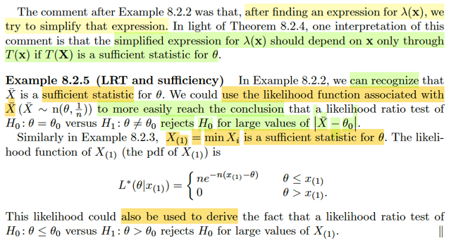</kbd>

🔗 **Related:** [8.2 METHOD OF FINDING TESTS](82_method_of_finding_tests.md#node-674)

> [!NOTE]
> Rồi, thế thì đại khái tác giả nói là, khi nãy, làm ví dụ 8.2.2, thì kiểu như là
> mình có thể thấy qúa trình bắt đầu với một nùi rất lằng nhằng, và cuối cùng
> ta thu gọn λ(**x**) rất gọn = exp [-n(xbar-θ0)^2/2]
>
> Thì thật ra, đây chính là điều mà theorem vừa rồi đã nói: Vì Xbar thật ra
> chính là một sufficient statistic T(**X**), nên LRT statistic, cuối cùng cũng chỉ
> còn phụ thuộc **X** thông qua T(**X**) mà thôi. Nên kiểu như nhờ theorem
> này mà ta "không ngạc nhiên rằng cái kết quả trên ra như vậy vì nó bắt
> buộc phải như vậy, chỉ còn phụ thuộc X thông qua một sufficient static nào
> đó
>
> Và ví dụ 8.2.5 đại ý nói là nếu ta dùng likelihood function dựa trên Xbar (tức
> L(θ|Xbar)) thay vì L(θ|X)), và Xbar là sufficient statistic, thì kết quả của
> likelihood ratio test phải cũng ra y như ví dụ 8.2.2, và quá trình sẽ dễ hơn,
> gọn hơn
>
> Tương tự với 8.2.3, ta cũng có X(1) là order statistic, cũng là một sufficient
> statistic, nên cũng có thể dùng likelihood gắn với X(1) để cho ra kết quả như
> vậy

 

<kbd>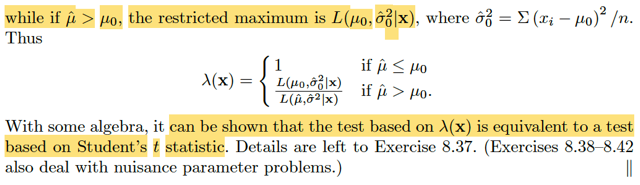</kbd>

<kbd></kbd>

<kbd>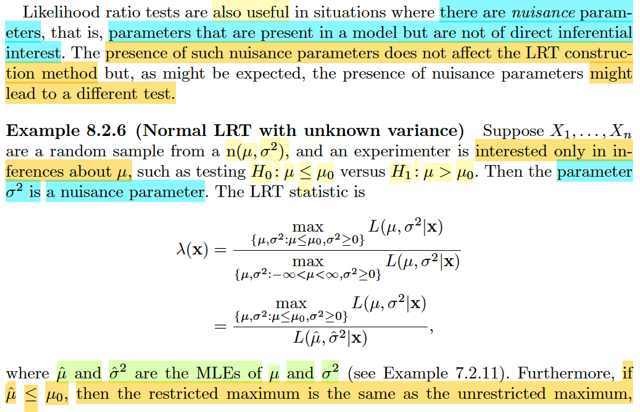</kbd>

> [!NOTE]
> Đoạn này đại ý tác giả là, likelihood ratio test cũng hữu ích trong những
> tình huống mà ta có các tham số gây nhiễu (nuisance parameter), mà  sự
> hiện diện của chúng không ảnh hưởng đến phương pháp LRT. (có nghĩa là,
> với các method hypothesis testing khác, thì tham số gây nhiễu có thể tác
> động xấu, nhưng với likelihood ratio test thì không.
>
> Thế thì ví dụ này, cho X1,...Xn ~ n(μ, σ^2) và ta chỉ quan tâm đến việc suy
> luận về μ thôi, nên σ đóng vai tham số gây nhiễu. Cụ thể hai giả thuyết là
> H0: μ ≤ μ0, và H1: μ > μ0.
>
> Xây dựng LRT statistic:
>
> λ(**x**) = sup_Θ0 L(θ|**x**) / sup_Θ L(θ|**x**)
>
> = sup_{μ ≤ μ0, σ^2 ≥ 0} L(μ, σ^2|**x**) / sup_{μ ∈ (-inf,inf), σ^2 ≥ 0} L(μ,
> σ^2|**x**)
>
> Mẫu số, như đã biết, sẽ là likelihood function tại MLE (kí hiệu μ^ và (σ^2)^):
> L(μ^, (σ^2)^|**x**)
>
> Còn tử số, sup_{μ ≤ μ0, σ^2 ≥ 0} L(μ, σ^2|x), ta sẽ xét hai trường hợp:
>
> Trường hợp 1: μ^ ≤ μ0. Có nghĩa là sao? Có nghĩa là lúc này, cái đỉnh L(μ^,
> (σ^2)^|**x**) nó nằm bên trong / xảy ra bên trong phạm vi (μ, σ^2) ∈ Θ0. Do
> đó dĩ nhiên tử số, cũng phải là L(μ^, (σ^2)^|**x**) Vì tìm kiếm trong cả Θ tìm
> thấy tại (μ^, (σ^2)^) khiến L lớn nhất, thì khi (μ^, (σ^2)^) nằm trong Θ0, thì
> đó cũng phải là nơi khiến L cao nhất khi tìm kiếm trong Θ0
>
> Trường hợp 2: μ^ > μ0. Lúc này ta cần hiểu như sau:
>
> Hàm likelihood L(μ, σ^2|**x**) như đã biết:
>
> = f(**x**|μ, σ^2) = Πi=1:n f(xi| μ, σ^2)
>
> = Πi=1:n (1/σ√2π) exp[-(xi-μ)^2/2σ^2
>
> = (1/σ√2π)^n Πi=1:n exp[-(xi-μ)^2/2σ^2
>
> = (1/σ√2π)^n exp Σi=1:n[-(xi-μ)^2/2σ^2
>
> = (1/σ√2π)^n exp [-Σi=1:n[(xi-μ)^2]/2σ^2
>
> Khi giải bài toán tối ưu hàm này, ta sẽ được quyền giải bài toán equivalent:
> dùng log của nó:
>
> ⇨ log (1/σ√2π)^n exp [-Σi=1:n[(xi-μ)^2]/2σ^2
>
> = log (1/σ√2π)^n + log[ exp [-Σi=1:n[(xi-μ)^2]/2σ^2 ]
>
> = n log (1/σ√2π) - Σi=1:n[(xi-μ)^2]/2σ^2
>
> Và để rồi ta sẽ thấy, với σ^2 fixed, thì đây là quadratic function của μ.
>
> Một điểm nữa, đã học trong Convex Optimization về việc ta có thể tạo bài
> toán tối ưu equivalent bằng cách tối ưu hóa theo từng biến.
>
> Như vậy, khi maximize theo μ, cơ bản là ta maximize một hàm bậc hai
>
> Và μ^ là solution, tức maximum.
>
> Như vậy khi μ đi từ -inf → μ^ thì hàm likelihood, cũng như log likelihood
> monotone  increasing. và từ μ^ → inf, thì nó monotone decreasing.
>
> Do đó, nếu μ0 < μ^ thì khi giới hạn vùng tìm kiếm của μ trong (-inf, μ0) thì
> hàm phải đạt max tại μ0.
>
> Sau đó khi maximize hàm này theo σ^2 để có (σ^2)^_0 (chưa chắc trùng
> với (σ^2)^, cụ thể nó sẽ bằng (1/n) Σi (xi - μ0)^2.
>
> Đó là lí do mà trong trường hợp này, tử số chính là L(μ0, (σ^2)^_0)|**x**)
>
> ⇨ λ(x) = 1 hoặc L(μ0, (σ^2)^_0)|**x**) / L(μ0, (σ^2)|**x**) tùy theo μ^ ≤ hay > μ0.
>
> Vậy thì đại ý tác giả dùng ví dụ này để ta thấy, dù thứ muốn test là μ, và
> σ^2 thì không biết. Nhưng cách làm của likelihood khiến cho ta không bị
> vướng ở σ^2, vì đơn giản là ta sẽ dùng mle (σ^2)^ và (σ^2)^_0 thôi.

 

<kbd>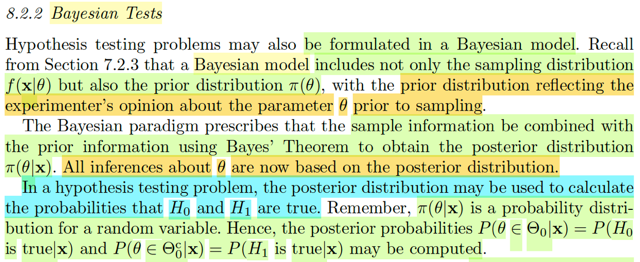</kbd>

> [!NOTE]
> Qua method thứ hai: Bayesian Test (method thứ nhất là Likelihood Ratio
> Test)
>
> Thế thì đại ý là tác giả nhắc lại cho ta về Bayesian approach. Còn nhớ, ý
> tưởng khác biệt cốt lỗi của cái này là ta sẽ xem parameter θ như random
> variable. Và distribution của nó là π(θ), gọi là prior distribution. Cụ thể loại
> distribution là gì thì thường được chọn bởi quan điểm / niềm tim của
> experimenter. Sau khi quan sát được giá trị của random sample **X**= **x**,
> thì ta sẽ cập nhật lại distribution của θ bằng cách sử dụng Bayes theorem:
> f(x|y)f(y) = f(y|x)f(x) để có π(θ|**x**), gọi là posterior distribution. Và mọi suy
> luận của ta về θ sẽ đều dùng cái này.
>
> Với việc ta có π(θ|**x**), dĩ nhiên nó là pdf/pmf của θ.
>
> Đến đây hãy nhớ lại nhiệm vụ của bài toán hypothesis testing, vốn dĩ là ta sẽ
> muốn xây dựng một cái rule (một "binary decision function) giúp nhận vào
> một giá trị của random sample **x**, và trả ra một trong hai giá trị đại diện
> cho H0: θ ∈ Θ0 hoặc H1: θ ∈ Θ0_c.
>
> Thế thì, mỗi hypothesis, theo định nghĩa, chỉ là một nhận định (statement) về
> θ. Và H0 nhận định rằng θ ∈ subset Θ0, và H1 nhận định θ ∈ Θ0_c. Vậy hãy
> chú ý mỗi nhận định THỰC RA CHÍNH LÀ MỘT EVENT / và như đã biến
> bản chất của nó, cũng chỉ là một subset của original sample space.
>
> Do đó, dĩ nhiên ta có thể tính **XÁC SUẤT CÁC EVENT NÀY XẢY RA**:
>
> P(θ ∈ Θ0|**x**) = P(H0 is true|**x**)
>
> và
>
> P(θ ∈ Θ0c|**x**) = P(H1 is true|**x**)

 

<kbd>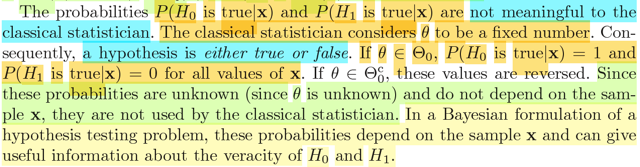</kbd>

> [!NOTE]
> Thế thì đại khái là. Cái vụ tính xác suất H0 hay H1 xảy ra dựa trên **x CHỈ
> CÓ NGHĨA VỚI BAYESIAN APPROACH**.
>
> Vì chỉ khi coi θ như random variable, để rồi dùng Bayes theorem xây dựng
> posterior π(θ|**x**) thì P(H0 xảy ra = θ ∈ Θ0|**x**) và P(H1 xảy ra = θ ∈
> Θ0c|**x**) MỚI PHỤ THUỘC **x**, và từ đó, mới có tỏ ra có ích.
>
> Nói cách khác, vì cách tiếp cận cổ điển (classical statistic) coi θ như fixed
> nhưng unknown khiến cho P(θ ∈ Θ0|**x**) = 1, và P(θ ∈ Θ0c|**x)**= 0 với
> mọi x nếu θ thật sự ∈ Θ0, và P(θ ∈ Θ0|**x**) = 0, và P(θ ∈ Θ0c|**x**) = 1
> với mọi x nếu θ thật sự ∈ Θ0c. Mà với việc **không biết thì θ thì cái lập
> luận trên chả ích lợi gì vì đằng nào nào có thêm giá trị của x hay không thì
> ta cũng chả rút ra được suy luận gì**. Do đó, classical statistic không dùng
> cái này.
>
> Nhưng quay lại Bayesian approach,**việc quan sát được x sẽ giúp thay
> đổi distribution của θ (posterior) và giúp cho xác suất H0 và xác suất H1
> dựa trên x ⇨ từ đó giúp việc có được x trở nên có tác dụng**

 

<kbd>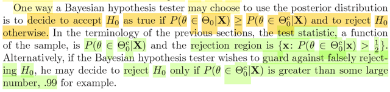</kbd>

> [!NOTE]
> Thế thì đại khái là tác giả nói đến một cách mà ta có thể dùng Bayesian
> approach cho việc xây dựng hypothesis test đó là: accept H0 khi P(H0 is
> true|**X**) lớn hơn P(H1 is true|**X**), đương nhiên cái này đồng nghĩa
> accept H0 khi P(H0 is true|**X**) > 1/2.
>
> Dừng lại để ôn lại một chút: Như vừa nói lại ở note trước, mục tiêu của
> hypothesis testing là xây dựng một cái rule, như một function nhận vào **x**
> và spit out một trong hai H0, H1. Thì hiểu nôm na, bên trong cái ruột của
> function này ta sẽ tính toán gì đó với **x**, và như vậy, sẽ có một statistic
> (vì statistic là random variable có được khi apply một function lên random
> sample), và nó được gọi là test statistic.
>
> Còn nhớ trong cách thứ nhất để xây dựng hypothesis test: likelihood ratio
> test, thì cái rule để reject H0 là λ(**x**) ≤ c, và rejection region là {x: λ(**x**) ≤ c}
> trong đó λ(**x**) = sup_Θ0 L(θ|**x**) / sup_Θ L(θ|**x**), chính là test statistic.
>
> Thế thì quay lại đây, test statistic là gì? Chính là P(H0 is true|**X**), hay
> P(θ ∈ Θ0|**X**), vì đây, chính là random variable có được khi áp function 
> g(**u**) = P(θ ∈ Θ0|**u**) lên **X** mà thôi.
>
> Rồi, như vậy cũng dễ hiểu rejection region sẽ là {**x**: P(θ ∈ Θ0_c|**x**) ≥ 1/2}
>
> Một điểm nữa, tác gỉa nói, có khi ta cũng có thể chọn một ngưỡng reject
> cao hơn, thậm chí lên tới 0.99, để tránh khả năng reject sai, khi đó rejection
> region là {**x**: P(θ ∈ Θ0_c) ≥ 0.99}

 

<kbd>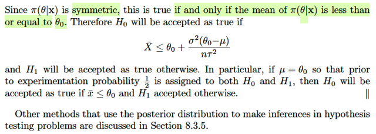</kbd>

<kbd></kbd>

<kbd>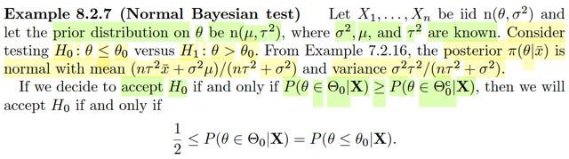</kbd>

🔗 **Related:** [7.2 METHOD OF FINDING ESTIMATORS](72_method_of_finding_estimators.md#node-585)

🔗 **Related:** [7.3 METHODS OF EVALUATING ESTIMATORS](73_methods_of_evaluating_estimators.md#node-660)

> [!NOTE]
> Qua ví dụ này, cho X1,...Xn iid n(θ, σ^2) và cho prior distribution là n(μ, τ^2)
> trong đó σ^2, τ^2, μ đã biết.
>
> Xem xét hai giả thuyết H0: θ ≤ θ0 vs H1: θ > θ0.
>
> Dùng lại kết quả ở ví dụ 7.2.16, ta đã derive được posterior distribution
> của θ là normal với:
>
> Mean = [τ^2/(τ^2+σ^2/n)] xbar + [(σ^2/n)/(τ^2+σ^2/n)] μ
>
> = (nτ^2xbar + σ^2μ)/(nτ^2+σ^2)
>
> Variance = τ^2(σ^2/n)/(τ^2+σ^2/n)
>
> Thế thì nếu mình dùng rule là accept H0 khi P(θ ∈ Θ0|**x**) ≥ P(θ ∈ Θ0c|**x**)
> thì đồng nghĩa 1/2 ≤ P(θ ∈ Θ0|**x**)
>
> ⇔ 1/2 ≤ P(θ ≤ θ0|**x**)
>
> Thế thì ta đã biết đặc điểm của normal, trong stat110 đã học: 
>
> X ~ normal(μ, σ^2) có dạng cái chuông mà mean tại μ), thì P(X ≤ μ) = P(μ < X) 
> = 1/2
>
> Nên để 1/2 ≤ P(θ ≤ θ0|**x**) ⇨ mean của distribution ≤ θ0
>
> ⇔ (nτ^2xbar + σ^2μ)/(nτ^2+σ^2) ≤ θ0
>
> ⇔ nτ^2xbar + σ^2μ ≤ θ0 (nτ^2+σ^2)
>
> ⇔ nτ^2xbar ≤ θ0 (nτ^2+σ^2) - σ^2μ
>
> ⇔ xbar ≤ θ0 (nτ^2+σ^2)/nτ^2 - σ^2μ/nτ^2
>
> ⇔ xbar ≤ θ0nτ^2/nτ^2 + θ0σ^2/nτ^2 - σ^2μ/nτ^2
>
> ⇔ xbar ≤ θ0 + σ^2(θ0 - μ)/nτ^2
>
> Và như vậy mình hiểu, **test statistic ở đây chính là Xbar**
>
> Nếu μ = θ0 thì cái rule trở thành: accept H0 khi xbar ≤ θ0 và ngược lại.

 

<kbd>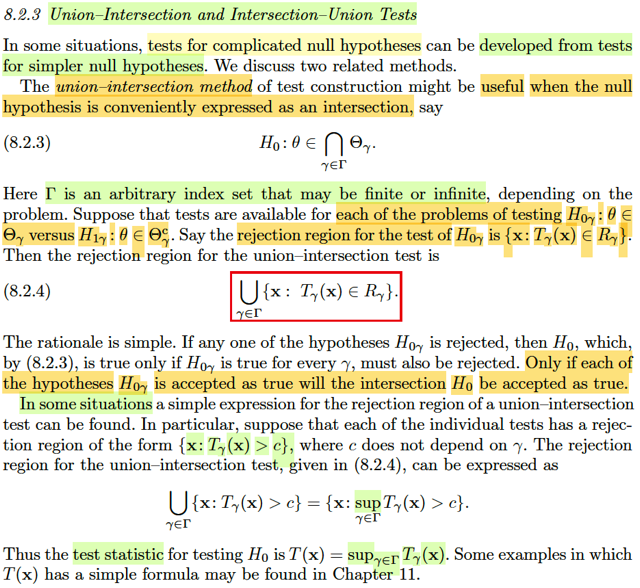</kbd>

> [!NOTE]
> Phần này hiểu thế nào, thử giải thích lại: Đầu tiên có lẽ cần ôn lại,
> những khái niệm trong hypothesis testing.
>
> Hypothesis testing là một phương pháp suy diễn thống kê, mà trong đó
> ta muốn đưa ra dự đoán, hay nhận định về parameter thông qua việc
> bác bỏ và chấp nhận một trong hai giả thuyết H0: θ ∈ Θ0 vs H1: θ ∈
> Θ0_c với Θ0 và Θ0_c là hai tập con bù nhau của parameter space Θ.
>
> Thế thì, mục tiêu của bài toán này, là có thể dựa vào data quan sát được
> (observed value của random sample) để mà đưa ra kết luận bác bỏ H0
> hoặc accept H0. Do đó, nhiệm vụ là xây dựng một rule, một decision
> function, nhận vào một giá trị **x** của **X**, và đưa ra một trong hai giá
> trị đại diện cho H0 hoặc H1. Cái rule này chính là định nghĩa của
> hypothesis testing procedure.
>
> Trong cái ruột của function này. Dĩ nhiên sẽ tính toán gì đó với **x**, mà
> như đã biết, khi apply một function lên random sample **X**, ta sẽ có
> một statistic, nên sẽ xuất hiện một statistic trong quá trình, chính là
> hypothesis testing statistic
>
> Dĩ nhiên, sau khi có testing statistic, thì cuối cùng ta vẫn phải đưa ra
> quyết định H1, hoặc H0 dựa trên giá trị của statistic này. Và từ đó, nó sẽ
> tạo nên một cái gọi là rejection region, là tập **x khiến giá trị của**T(**x**) giúp rule quyết định H0.
>
> Trong phần trước, ta đã học về likelihood ratio testing, thì khi đó test
> statistic chính là λ(**X**), = sup_Θ0 L(θ|**X**) / sup_Θ0_c L(θ|**X**), và
> cái rule sẽ là: reject H0 nếu λ(**X**) quá nhỏ và ngược lại. Như thế nào
> là quá nhỏ sẽ thể hiện bởi λ(**X**) ≤ c và ta sẽ bàn về việc chọn c sau
> này.
>
> Có nghĩa là tính T(**X**) thì còn phải xây dựng cái rule để kết luận từ
> T(**X**) nữa, mà trong LRT thì chính là quyết định c là bao nhiêu.
>
> Nên trong LRT, reject region là {**x**: λ(**x**) ≤ c} (c là số trong [0,1])
> cũng có thể thể hiện region region = {**x**: λ(x) ∈ R = (-inf, c]}
>
> Nói lại chút xíu về ý nghĩa của LRT, đó là, nó dựa trên việc đánh giá H0
> thông qua khả năng Θ0 chứa những giá trị θ khiến việc quan sát được
> dữ liệu thực tế **x** là cỡ nào. Cụ thể là với **X** = **x**, độ hợp lí
> (likelihood) của θ tốt nhất (θ^_mle) **sẽ có được bằng likelihood
> function tại θ^_mle, so với cái này, thì khi tìm kiếm  trên Θ0 thì độ hợp lí
> lớn nhất được tới đâu.**Nếu nó chỉ bằng một phần nhỏ  chứng tỏ H0
> không đủ tin cậy → reject.
>
> Rồi qua Bayes test. Thì ta lại theo cách tiếp cận của Bayesian, trong đó
> ta xem θ như random variable với prior distribution π(θ), để rồi sau khi
> có observed value  **X** = **x**, ta sẽ cập nhật lại distribution bằng
> Bayes rule, để có posterior distribution π(θ|**x**). Thế thì nhờ việc có
> distribution của θ, mà ta có thể tính toán xác suất  của event θ ∈ Θ0 và
> xác suất của event θ ∈ Θ0c, và xây dựng rule quyết định H0 hoặc H1
> dựa trên cái này. Để rồi giả sử ta dùng rule: reject H0 khi P(θ ∈ Θ0|**x**)
> ≤ 1/2 thì test statistic chính là P(θ ∈ Θ0|**X**) và rejection region là {**x**:
> P(θ ∈ Θ0|**x**) ≤ 1/2} cũng là {**x**: P(θ ∈ Θ0|**x**) ∈ [0, 1/2]}
>
> Quay lại đây, bối cảnh là giả sử ta có null hypothesis là intersection của
> nhiều null hypothesis đơn giản hơn: Θ0 = ∩ Θ0_γ. Và với mỗi Θ0_γ, ta
> có một hypothesis test giữa H0_γ: θ ∈ Θ0_γ vs H1_γ: θ ∈ Θ0c_γ, với
> rule để reject H0_γ: Tγ(**x**) ∈ Rγ đồng nghĩa rejection region {**x**:
> Tγ(**x**) ∈ Rγ}
>
> Thế thì, nên nhớ, mục tiêu của bài toán luôn là xây dựng decision rule,
> giúp reject hay accept H0.
>
> Thế thì, với các test γ, đã có rule là: reject H0_γ nếu Tγ(**x**) ∈ Rγ.
>
> Do đó, nếu Tγ(**x**) ∈ R γ với một γ nào đó, thì H0_γ đó bị reject. Đồng
> nghĩa, với kết luận ta không tin θ ∈ Θγ với mọi γ, như vậy θ không ∈ ∩{γ
> ∈ Γ} Θγ ⇨ reject H0
>
> Do đó, rule của bài toán gốc là: Tγ(**x**) ∈ R γ với một γ bất kì → reject H0.
>
> Và rejection region sẽ là {x: Tγ(x) ∈ R γ với một γ nào đó}
>
> = {x: Tγ(**x**) ∈ U{γ ∈ Γ} R γ}
>
> Thế thì giả sử các rule Tγ(x) ∈ Rγ đều có dạng Tγ(**x**) > c
>
> Thì khi đó rule của bài toán gốc là reject H0 khi Tγ(**x**) > c với một γ nào đó
>
> ⇨ rejection region là {**x**: tồn tại γ ∈ Γ: Tγ(**x**) > c}
>
> thì điều này đồng nghĩa {**x**: thằng lớn nhất trong các Tγ(**x**) (γ∈Γ) > c}
>
> = {**x**: sup_γ∈Γ Tγ(**x**) > c}
>
> Do đó, trong bài toán này, test statistic là sup_γ∈Γ Tγ(**X**)

 

<kbd>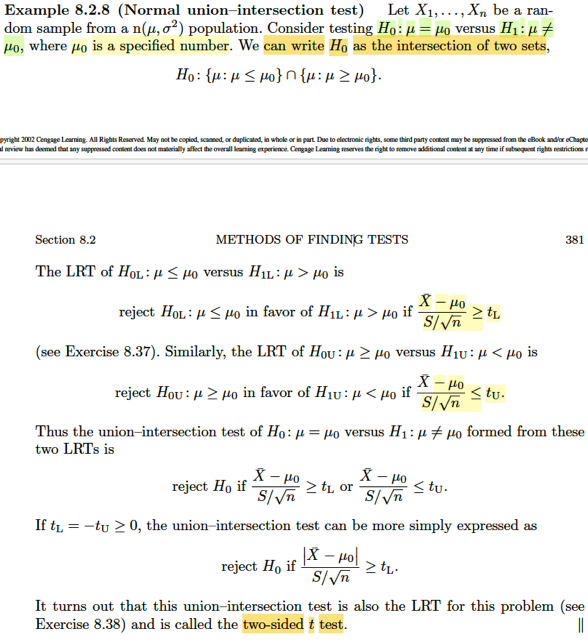</kbd>

> [!NOTE]
> Qua ví dụ này, X1,...Xn iid ~ n(μ, σ^2). Xem xét test hai giả thuyết
> H0: μ = μ0 vs H1: μ khác μ0. 
>
> Ta có thể viết H0 = {μ: μ ≤ μ0} ∩ {μ: μ ≥ μ0}
>
> LRT cho H0L: μ ≤ μ0 vs H1L: μ > μ0 sẽ là:
>
> reject H0L và chọn H1L khi (Xbar - μ0) / (S/√n) ≥ tL
>
> Là sao nhỉ?
>
> Ta biết trong LRT thì test procedure là: reject H0 khi λ(**x**) ≤ c, và
> statistic là:
>
> λ(**x**) = L(θ^_0|**x**) / L(θ^|**x**) = sup_Θ0 L(θ|**x**) / sup_Θ L(θ|**x**)
>
> Ta đã biết mle của normal μ, σ^2 là Xbar và Σi (xi - xbar)^2]/n,
> lắp vào L(μ, σ^2|**x**) = f(**x**|μ, σ^2)
>
> Rồi ta sẽ giải bài toán tìm mle nhưng trên parameter space chỉ
> là μ ∈ [-inf, μ0], σ^2 ≥ 0 và tính likelihood ở đó.
>
> Để rồi kết quả hi vọng sẽ ra cái statistic (Xbar - μ0) / (S/√n)

 

