# 8.3 Methods Of Evaluating Test

📊 **Progress:** `53` Notes | `74` Screenshots

---

<kbd>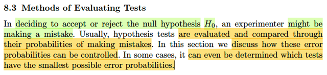</kbd>

> [!NOTE]
> Đại khái mình hiểu thế này: 8.2 chỉ mới nói về cách tìm / xây dựng cái
> decision rule, để quyết định reject hay ko reject H0. Mà công thức chung là
> ta sẽ dựa vào việc tính toán một statistic gọi là test statistic T(**x**), để rồi
> đặt ra rule để mà reject H0 hay không dựa vào T(**x**) này. Cụ thể là với
> LRT, ta sẽ tính LRT statistic λ(**X**), và đặt rule: reject H0 nếu λ(**X**) ≤ c.
> Hoặc với Bayes test, ta sẽ tính test  statistic là P(θ ∈ Θ0|**X**), để rồi có thể
> đặt rule là: reject H0 khi P(θ ∈ Θ0|**X**) ≤ c.
>
> Như vậy ta thấy, đầu tiên ta phải xây dựng test statistic. Nhưng sau đó phải
> đặt ra cái rule, để ra quyết định dựa trên giá trị của test statistic đó, mà trong
> hai case trên, chính là quyết định c là bao nhiêu.
>
> Thế thì, đại ý là ta có thể mắc sai lầm khi làm việc này. Và do đó, ta cần
> công cụ để mà đánh giá chất lượng của hypothesis test procedure.
>
> Và thường thường, người ta sẽ dùng cách tiếp cận là tính xác suất mắc sai
> lầm, và dùng nó để so sánh các hypothesis test và trong một số trường hợp
> có thể còn giúp chọn ra cái tốt nhất nữa.

 

<kbd>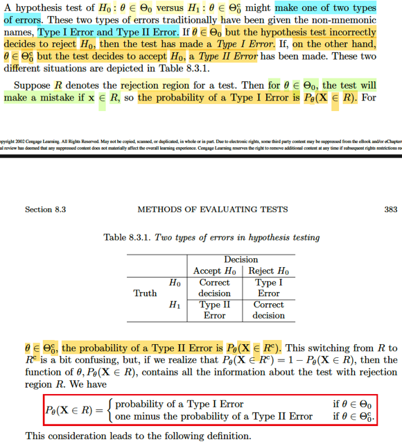</kbd>

> [!NOTE]
> Đại khái là một hypothesis test có thể mắc một trong hai loại sai
> sót: Type I Error:  là khi θ ∈ Θ0 nhưng test lại reject H0. Và Type I
> error là khi θ ∈ Θ0c nhưng test là accept H0.
>
> Thế thì khi θ ∈ Θ0, mà test cho kết luận reject H0 (Type I error), 
> thì tức là sao?
>
> → Thì có nghĩa observed value **X,** **nằm trong rejection region** của
> test.
>
> Như vậy có thể hiểu, việc (event) "Test mắc Type I error" chính
> là = (event) **X** ∈ Rejection region R.
>
> ⇨ P(Type I error) = P_θ(**X** ∈ R)
>
> Ngược lại.
>
> Khi θ ∈ Θ0c, mà test cho kết luận accept H0, (Type II error), thì
> có nghĩa là, **x không nằm trong rejection region, cũng chính
> là nằm trong Rc**(complement của R)****⇨ P(Type II error) = P_θ(**x** ∈ Rc) = 1 - P_θ(**x** ∈ R)
>
> ⇨ P_θ(**x** ∈ R) = 1 - P(Type II error)
>
> Kết luận:
>
> P_θ(**x** ∈ R) = P(Type I error) khi θ ∈ Θ0
>
> P_θ(**x** ∈ R) = 1 - P(Type II error) khi θ ∈ Θ0c

 

<kbd>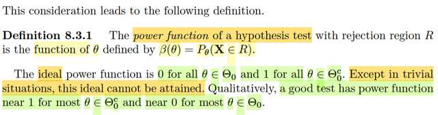</kbd>

> [!NOTE]
> Từ đó ta có định nghĩa của POWER FUNCTION CỦA MỘT HYPOTHESIS
> TEST với rejection region R:
>
> Nó được định nghĩa là một function theo θ: β(θ) = P_θ(**X** ∈ R).
>
> Vì sao nó là function theo θ? Đơn giản là vì đây là xác suất của event liên
> quan đến **X**, mà **X** là random sample size n các rv X1,..Xn ~ f(xi|θ) nên dĩ
> nhiên đây phải là function theo θ.
>
> Thế thì như đã nói ở note trước: P_θ(**X** ∈ R) = Xác suất xảy ra Type I Error
> khi θ ∈ Θ0 và P_θ(**X** ∈ R) = 1 - Xác suất xảy ra Type II Error khi θ ∈ Θ0c
> nên ta muốn khi θ ∈ Θ0 thì β(θ) = 0 và khi θ ∈ Θ0c thì β(θ) = 1.
>
> Điều này cũng có nghĩa là, nếu ta có hàm β sao cho:
>
> β(θ) = 0 ∀ θ ∈ Θ0 và β(θ) = 1 ∀ θ ∈ Θ0c. Thì đó là hàm β lí tưởng.

 

<kbd>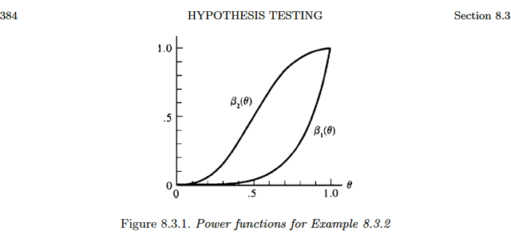</kbd>

<kbd></kbd>

<kbd>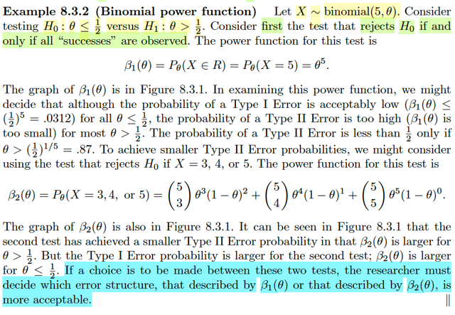</kbd>

> [!NOTE]
> Qua ví dụ này, cho X ~ binomial (5, θ). Và xem xét hypothesis test giữa
> H0: θ ≤ 1/2 vs H1: θ > 1/2. Ở đây mình hiểu ta đang có một random sample
> size 1 ~ binomial(5, θ) (để có thể không khó hiểu khi dùng X thay vì **X**).
>
> Thế thì, tác giả cho là ta sẽ xem xét phép test đầu tiên: reject H0 khi và chỉ
> khi mọi "success" đều observed. Tức là sao? 
>
> Ta biết story của một random variable ~ binomial(n, p) là: tổng của các trial
> success trong n iid Bern(p) trials. Nên, event mọi success chính là X = n.
> Tức là ở đây test procedure là: reject H0 khi X = 5.
>
> Ôn lại một chút: Bản chất của bài toán hypothesis testing, là ta muốn xây
> dựng một rule, một decision function, giúp đưa ra quyết định reject hoặc 
> accept H0, dựa trên observed value của random sample. Để xây dựng rule,
> dựa trên observed value, dĩ nhiên ta sẽ tính toán một function nào đó của
> **X**, để rồi ra quyết định dựa trên đó, thì đó chính là testing statistic.Tuy nhiên
> sau đó ta phải đặt ra rule để chọn H0 hay H1 dựa trên test statistic. Thế thì
> ở đây, rule của phép thử đầu tiên: reject H0 khi X = 5. Thì test statistic chính
> là X (có thể coi như là identity function của X, T(X) = X), và cái rule chính là
> reject H0 khi T(X) = 5.
>
> Thế thì, dĩ nhiên dễ hiểu rằng, khi đặt ra rule, ta có thể có nhiều cách. Và
> mỗi cách sẽ có thể tốt hay tệ. Do đó để đánh giá, người ta sẽ tính toán xác 
> suất mà test rule mắc một trong hai sai lầm: Type I error và Type II error.
>
> Type I error là khi θ ∈ Θ0 nhưng test kết luận reject H0. Mà việc test reject
> H0 sẽ xảy ra khi random sample X có giá trị rơi vào rejection region, vì theo
> định nghĩa rejection region là tập R = {x: T(x) khiến H0 bị reject}. Vậy nên
> Type I error xảy ra khi θ ∈ Θ0 và x ∈ R. Nên xác suất Type I error xảy ra chính
> là P(x ∈ R), chú ý, ta sẽ không nói là P(θ ∈ Θ0, x ∈ R) vì đây không phải là 
> Bayesian approach, θ không phải là random variable, nên việc không biết θ 
> khiến không ích gì khi thể hiện như vậy. Thay vào đó, ta sẽ chỉ thể hiện là
> P(Type I error) = P_θ(X ∈ R)
>
> Type II error xảy ra khi θ ∈ Θ0c và test kết luận accept H0, việc này đồng
> nghĩa x không ∈ R. ⇨ P(Type II error) = P_θ(x not ∈ R) = 1 - P_θ(x ∈ R) 
>
> Vậy:
>
> P_θ(X ∈ R) = P(Type I error) khi θ ∈ Θ0
>
> P_θ(X ∈ R) = 1 - P(Type II error) khi θ ∈ Θ0c
>
> Từ đó ta định nghĩa ra β function: β(θ) = P_θ(x ∈ R) và muốn nó rất nhỏ khi
> θ ∈ Θ0 và rất lớn (≈ 1) khi θ ∈ Θ0c hay nói cách khác, ta muốn β(θ) ≈ 0 với
> mọi θ ∈ Θ0 và β(θ) ≈ 1 với mọi Θ0c
>
> Quay lại đây. Beta function là gì? Theo định nghĩa vừa nói, nó = P_θ(x ∈ R)
> và R của test rule này (reject H0 ⇔ X = 5), là {x: x = 5} nên:
>
> β(θ) = P_θ(X ∈ R) = P_θ(X = 5), áp dụng pmf của binomial: 
>
> P(X=k) = (n choose k)p^n(1-p)^(1-k), ta có
>
> β(θ) = (5 choose 5) θ^5(1-θ)^(5-5) = 1*θ^5*1 = θ^5.
>
> Và với θ ∈ [0,1] thì ta có đồ thị của hàm β(θ), (β1(θ)). 
>
> Nhận xét thấy khi θ tăng từ 0 đến 0.6, 0.7 thì β rất nhỏ, sau đó tăng lên nhanh
> đến 1. Có nghĩa là khi θ ≤ 1/2 (nhớ để ý Θ0 ở đây chính là [0, 1/2]) thì β(θ) rất 
> nhỏ → xác suất Type I error đều nhỏ, là điều tốt. Nhưng khi θ > 1/2 trong phần
> lớn θ từ 1/2 đến 1 thì β(θ) đều < 1 → Type II error lớn, ko tốt.
>
> Ta mới so sánh với một test rule khác: (nhắc lại, cùng test statistic, nhưng rule
> có thể có nhiều): reject H0 khi X = 5 hoặc 4 hoặc 3.
>
> β(θ) = P_θ(X ∈ R) = P_θ(X = 5 U X = 4 U X = 3), theo axiom 2, đây là ∪
> các disjoint event, = tổng xác suất từng event:
>
> = P_θ(X = 5) + P_θ(X = 4) + P_θ(X = 3)
>
> = θ^5 + (5 choose 4) θ^4(1-θ)^(5-4) + (5 choose 3) θ^3(1-θ)^(5-3)
>
> = θ^5 + (5 choose 4) θ^4(1-θ) + (5 choose 3) θ^3(1-θ)^2
>
> Để rồi vẽ đồ thị cái hàm β này ra (β2) ta thấy:
>
> Đại khái là trong θ ∈ [0, 1/2] thì β(θ) không nhỏ trong phần lớn quãng đường
> so với β1, cho thấy Type I error của nó tệ hơn, nhưng bù lại, nó gần 1 hơn
> so với β1 trong đoạn θ ∈ [1/2, 1], cho thấy type II error tốt hơn (ý là nhỏ hơn)
>
> Và một kết luận quan trọng của tác giả: **TA PHẢI QUYẾT ĐỊNH CẤU TRÚC
> ERROR NÀO ĐỂ DÙNG**. HIểu đại khái là, tùy vào bài toán thực tế cụ thể,
> thì ta sẽ xem trong đó, ta ưu tiên loại error nào hơn, từ đó chọn test rule nào.
> Ví dụ, nếu trong thực tế, việc reject nhầm H0 gây hậu quả lớn hơn, tức Type
> I error cần được ưu tiên giảm thiểu hơn. Ta có thể dùng rule 1.

 

<kbd>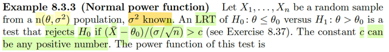</kbd>

🔗 **Related:** [8.3 METHODS OF EVALUATING TEST](83_methods_of_evaluating_test.md#node-699)

> [!NOTE]
> Cho X1,...Xn random sample ~ n(θ, σ^2), với σ^2 đã biết. Xét một LRT testing 
> giữa H0: θ ≤ θ0 và H1: θ > θ0, với rule là: reject H0 khi (Xbar - θ0) / (σ/√n) > c.
> Với c là số dương bất kì.
>
> Làm rõ ý này:
>
> Nhớ lại thế nào là LRT (Likelihood Ratio Test), nó là phương pháp tạo test rule
> có dạng reject H0 khi λ(**X**) ≤ c, với c ∈ [0,1] và 
>
> λ(**X**) = sup_Θ0 L(θ|**x**) / sup_Θ L(θ|**X**)
>
> Mẫu số là likelihood function tại mle của θ, thử làm lại:
>
> Likelihood function: L(θ|**x**) = f(**x**|θ) = f(x|(θ,σ^2))
>
> = Πi f(xi|(θ,σ^2)) = Πi (1/√2πσ^2) exp[-(xi-θ)^2/2σ^2] 
>
> Maximize L(θ|**x**) sẽ equivalent maximize log L(θ|**x**):
>
> = log [(1/√2πσ^2)^n exp Σi [-(xi-θ)^2/2σ^2]] 
>
> = log [(1/√2πσ^2)^n] + log exp Σi [-(xi-θ)^2/2σ^2]
>
> = n log (1/√2πσ^2) + Σi [-(xi-θ)^2/2σ^2]
>
> ⇔ maximize Σi [-(xi-θ)^2] / 2σ^2
>
> ⇔ maximize - Σi(xi-θ)^2
>
> ⇔ minimize g(θ) = Σi(xi-θ)^2 = 
>
> Điều kiện cần bậc 1: g'(θ) = 0 ⇔ d/dθ [Σi(xi-θ)^2] = 0 ⇔ Σi d/dθ [(xi-θ)^2] = 0
>
> ⇔ Σi d/d(xi-θ) [(xi-θ)^2] . d/dθ (xi-θ) = 0
>
> ⇔ Σi 2(xi-θ) . (-1) = 0
>
> ⇔ - 2 Σi (xi-θ) = 0
>
> ⇔ Σixi - nθ = 0
>
> ⇔ θ = Σixi / n = xbar
>
> g''(θ) = d/dθ [-2Σi(xi-θ)] = -2 Σi d/dθ(xi-θ) = -2 Σi (-1) = 2n > 0 
>
> ⇨ xbar minimizer của g ⇨ MLE của θ là Xbar, 
>
> và L(xbar|**x**) = 
>
> = (1/√2πσ^2)^n exp Σi [-(xi-xbar)^2/2σ^2] 
>
> = (1/√2πσ^2)^n exp (1/2σ^2) Σi [-(xi-xbar)^2] 
>
> Cũng giải bài toán đó, nhưng restrict trong θ ∈ Θ0, tức θ ≤ θ0
>
> Nếu xbar ≤ θ0 thì tử số chính là L(xbar|**x**)
>
> nếu θ0 < xbar thì tử số chính là L(θ0|**x**), lí do là vì hàm L(θ|**x**) chỉ có một
> optimal là θ^mle = xbar, nên nếu θ0 < xbar thì khi đồng nghĩa trong (-inf, θ0)
> hàm monotone increasing → đạt max tại θ0.
>
> Khi đó λ(**x**) = L(θ0|**x**) / L(xbar|**x**) 
>
> = (1/√2πσ^2)^n exp (1/2σ^2) Σi [-(xi-θ0)^2] / 1/√2πσ^2)^n exp (1/2σ^2) Σi [-(xi-xbar)^2] 
>
> = exp (1/2σ^2) Σi [-(xi-θ0)^2] / exp (1/2σ^2) Σi [-(xi-xbar)^2] 
>
> = exp (1/2σ^2) Σi [-(xi-θ0)^2] - (1/2σ^2) Σi [-(xi-xbar)^2] 
>
> = exp (1/2σ^2) Σi {[-(xi-θ0)^2] - [-(xi-xbar)^2]}
>
> = exp (1/2σ^2) Σi [-(xi-θ0)^2 +(xi-xbar)^2] 
>
> = exp (1/2σ^2) Σi [-(xi-xbar-θ0+xbar)^2 +(xi-xbar)^2] 
>
> = exp (1/2σ^2) Σi [-[(xi-xbar)+(xbar-θ0)]^2 +(xi-xbar)^2] 
>
> = exp (1/2σ^2) Σi [-[(xi-xbar)^2+2(xi-xbar)(xbar-θ0)+(xbar-θ0)^2] +(xi-xbar)^2] 
>
> = exp (1/2σ^2) Σi [-(xi-xbar)^2-2(xi-xbar)(xbar-θ0)-(xbar-θ0)^2+(xi-xbar)^2] 
>
> = exp (1/2σ^2) Σi [-2(xi-xbar)(xbar-θ0)-(xbar-θ0)^2]
>
> = exp (1/2σ^2) [-2(xbar-θ0)Σi(xi-xbar)-Σi(xbar-θ0)^2] 
>
> = exp (1/2σ^2) [-2(xbar-θ0)(nxbar-nxbar)-n(xbar-θ0)^2] 
>
> = exp (1/2σ^2) [-n(xbar-θ0)^2]
>
> = exp [-n(xbar-θ0)^2/2σ^2] 
>
> Tóm lại:
>
> λ(**x**) = 1 khi xbar ≤ θ0
>
> λ(**x**) = exp [-n(xbar-θ0)^2/2σ^2] khi khi θ0 < xbar
>
> Vậy thì, test rule trở thành: 
>
> Khi xbar ≤ θ0, luôn accept H0 do λ(x) = 1 > c ∀c ∈ [0,1]
>
> Khi θ0 < xbar, reject H0 khi exp [-n(xbar-θ0)^2/2σ^2] ≤ c
>
> ⇔ [-n(xbar-θ0)^2/2σ^2] ≤ log c
>
> ⇔ -(xbar-θ0)^2/(2σ^2/n) ≤ log c
>
> ⇔ -(xbar-θ0)^2/2(σ/√n)^2 ≤ log c
>
> ⇔ (xbar-θ0)^2/(σ/√n)^2 > -2log c
>
> ⇔ [(xbar-θ0)/(σ/√n)]^2 > -2log c (a)
>
> vì đang xét θ0 < xbar ⇨ (xbar-θ0)/(σ/√n) dương 
>
> Với c ∈ [0,1] ⇨ log c < 0 → -2log c dương
>
> nên cho phép (a) 
>
> ⇔ (xbar-θ0)/(σ/√n) > -√2log(c)
>
> Đây chính là (xbar-θ0)/(σ/√n) > c'
>
> Như vậy LRT test của bài toán này chính là reject H0 khi (Xbar-θ0)/(σ/√n) > c' như trong
> sách. (chú ý, c trong sách, là c' của mình, nên dĩ nhiên nó là số dương bất kì, không phải 
> là ∈ [0,1])

 

<kbd>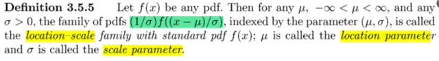</kbd>

<kbd>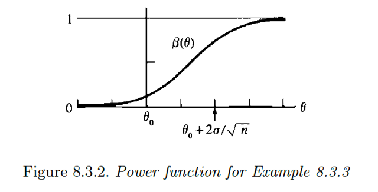</kbd>

<kbd></kbd>

<kbd></kbd>

<kbd>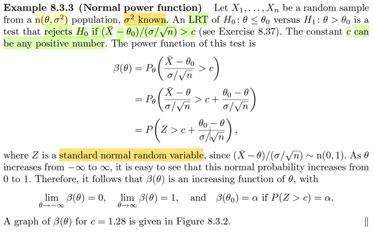</kbd>

🔗 **Related:** [3.5 LOCATION AND SCALE FAMILIES](35_location_and_scale_families.md#node-202)

🔗 **Related:** [5.2 Σ OF RANDOM VARIABLES FROM A RANDOM SAMPLE](52_σ_of_random_variables_from_a_random_sample.md#node-348)

🔗 **Related:** [3.5 LOCATION AND SCALE FAMILIES](35_location_and_scale_families.md#node-201)

🔗 **Related:** [8.3 METHODS OF EVALUATING TEST](83_methods_of_evaluating_test.md#node-708)

> [!NOTE]
> Thế thì, power function β(θ) sẽ là gì?
>
> Theo định nghĩa, β(θ) = P_θ(**X** ∈ R), và Rejection region của test rule vừa
> tự derive lại là R = {**x**: H0 bị reject} = {**x**: (xbar-θ0)/(σ/√n) > c} (chuyển
> thành c cho giống sách, nhưng hiểu nó là c' trong phần derive của mình)
>
> ⇨ β(θ) = P_θ(**X** ∈ R) = P_θ((Xbar-θ0)/(σ/√n) > c)
>
> (Xbar-θ0)/(σ/√n) > c
>
> ⇔ Xbar/(σ/√n) > c + θ0/(σ/√n)
>
> ⇔ (Xbar-θ)/(σ/√n) > c + (θ0-θ)/(σ/√n)
>
> Đến đây nhớ lại kiến thức về location scale family. Được định nghĩa là,  Cho
> f(x) là pdf bất kì thì họ các pdf (1/σ)f((x-μ)/σ) được gọi là location-scale family
> với standard pdf f(x).
>
> Lại có theorem location scale (3.5.6) nói rằng: cho f là một pdf thì X ~ (1/σ)
> f((x-μ)/σ)  ⇔ tồn tại Z có pdf f(z) và X = σZ + μ (μ số thực bất kì và σ dương).
>
> Vậy theo theorem này:
>
> Nếu X là member có location μ và σ thì (X - μ)/σ là standard member
> (location 0, scale 1)
>
> Mà Xbar ta đã biết trong các phần trước (xem link) Xbar ~ n(θ, σ/√n)
>
> Do đó (Xbar - θ)/(σ/√n) (đặt là Z), chính là standard member của family, tức
> location 0, scale 1. Mà với normal, thì location chính là mean và scale param
> chính là standard deviation.
>
> Do đó Z =  (Xbar - θ)/(σ/√n) ~ n(0,1)
>
> ====
>
> Thử chứng minh lại theorem location scale (3.5.6):
>
> Chứng minh điều kiện cần: Khi X ~ (1/σ) f((x-μ)/σ) thì tồn tại Z có quan hệ
> với X bởi X = σZ + μ, và có pdf f(z)
>
> Có nghĩa là ta chỉ cần chứng minh Z = (X - μ)/σ là rv ~ f(z).
>
> Áp dụng transformation theorem:
>
> Cho Y = g(X) ta có theorem và g là hàm mapping 1-1: y = g(x) ⇔ ginv(y) = x
>
> fY(y) = fX(x) |dx/dy|
>
> Áp dụng vào đây: Với x = g(z) = σz + μ ⇨ z = ginv(x) = (x - μ)/σ
>
> fZ(z) = fX(x) |dx/dz|
>
> Jacobian: dx/dz: x = σz + μ ⇨ dx/dz = σ
>
> Trị tuyêt đối det của dx/dz = σ
>
> fZ(z) = fX(σz + μ) σ
>
> = [(1/σ) f((x-μ)/σ) |x=σz + μ] σ
>
> = [(1/σ) f((σz + μ-μ)/σ)] σ
>
> = f((σz + μ-μ)/σ)
>
> = f(σz/σ)
>
> = f(z) Chứng minh xong.
>
> Chứng minh điều kiện đủ: Z = (X - μ) / σ ~ f(z) thì X ~ fX(x) = (1/σ) f((x-μ)/σ)
>
> Lại áp dụng transformation:
>
> fX(x) = fZ(z) |dz/dx|
>
> = f(z) |1/σ|
>
> = f((x - μ)/σ) / σ
>
> Chứng minh xong.
>
> ====
>
> Vậy β(θ) = P_θ(Z > c + (θ0-θ)/(σ/√n))
>
> = 1 - P_θ(Z ≤ c + (θ0-θ)/(σ/√n))
>
> Và P_θ(Z ≤ a), chính là cdf của A, tại a, FZ(a) và với Z là standard normal, 
>
> ta có kí hiệu riêng cho cdf là Φ
>
> = 1 - Φ(c + (θ0-θ)/(σ/√n))
>
> Với θ chạy từ -inf tới inf thì c + (θ0-θ)/(σ/√n) sẽ chạy từ +inf → -inf
>
> ⇨ Φ(c + (θ0-θ)/(σ/√n)) chạy từ 1 → 0
>
> ⇨ - Φ(c + (θ0-θ)/(σ/√n)) chạy từ -1 → 0
>
> ⇨ 1 - Φ(c + (θ0-θ)/(σ/√n)) chạy từ 0 → 1
>
> Vậy β(θ) là hàm increasing

 

<kbd>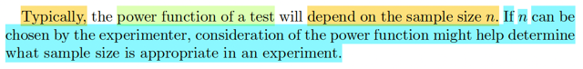</kbd>

> [!NOTE]
> Tiếp theo đại ý là thường thường, power function của một phép test sẽ phụ
> thuộc vào sample size n. Và khi n có thể được phép chọn, thì power function
> có thể giúp ta trả lời câu hỏi là nên chọn size của sample thế nào.

 

<kbd>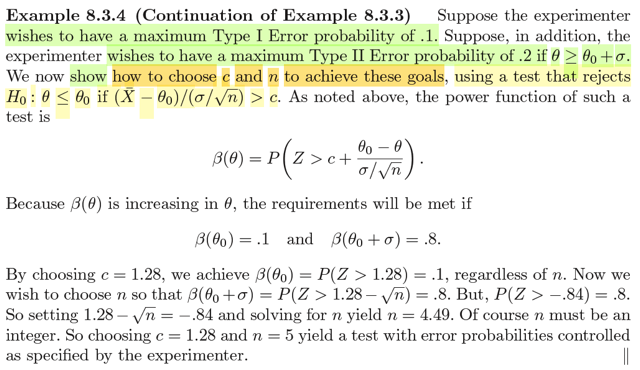</kbd>

🔗 **Related:** [8.3 METHODS OF EVALUATING TEST](83_methods_of_evaluating_test.md#node-696)

> [!NOTE]
> Tiếp nối ví dụ trước đại khái là ta muốn làm sao đó để xác suất Type I Error chỉ
> lớn nhất là bằng 0.1 thôi (tức là P_θ(Type I error) ≤ 0.1) và xác suất Type II Error
> chỉ lớn nhất là .2 nếu θ > θ0 + σ. Và ví dụ này sẽ cho thấy cách để chọn c
> (ngưỡng) và n (sample size) để đạt mục tiêu này. Dùng test rule reject H0: θ ≤ θ0
> nếu (Xbar - θ0) / (σ/√n) > c.
>
> Trong note trước ta đã có power function:
>
> β(θ) = P_θ(Z > c + (θ0-θ)/(σ/√n))
>
> Dừng lại chút để ôn lại:
>
> Phần này bối cảnh là ta đang học cách để đánh giá các phép kiểm tra giả thuyết.
> Nói một cách ngắn gọn, một phép kiểm tra giả thuyết đơn giản bao gồm một test
> statistic, và một rule, để ra quyết định chọn giả thuyết nào. Vậy thì đã là ra quyết
> định, thì cách ra quyết định có thể sai, và ta sẽ muốn giảm thiểu sai lầm.Và ta
> làm vậy bằng cách tiếp cận theo hướng xác suất, tức là ta muốn giảm thiểu xác
> suất của việc mắc sai lầm (error).
>
> Thế thì việc ra quyết định chỉ có một trong hai. Nên sẽ có 2 loại sai lầm:  Khi
> reject H0 trong khi đáng lẽ phải accept (θ ∈ Θ0), gọi là Type I Error và accept H0
> trong khi phải reject (θ ∈ Θ0c), gọi là Type II Error.
>
> Thế thì, khi mà đã hình thành cái rule, thì tự nhiên ta sẽ có một thứ gọi là
> rejection region. Ý là, vì cái rule bản chất chỉ là một hàm số, nhận vào giá trị khả
> dĩ của random sample, và trả ra quyết định reject H0 hay accept H0. Nên hình
> dung ta lấy trong mọi possible value của random sample **X** (range **X**) và
> ném vào function này để lựa ra những cái khiến kết quả là reject H0. Thì cái tập
> đó, gọi là rejection region R = {**x** ∈ range **X**: T(**x**) khiến kết quả test là
> reject H0}
>
> Vậy thì, một event Type I Error xuất hiện khi giả sử H0 nên được accept, mà
> quan sát **X** = **x**, mà T(**x**) khiến H0 bị reject, hay cũng là **x** ∈ R
>
> Viết lại:
>
> Khi H0 nên được accept, tức θ ∈ Θ0: Event Type I Error xảy ra nếu **x**∈****R.
>
> Chú ý, nếu θ ∈ Θ0c. thì không có chuyện Type I Error xảy ra.
>
> Tương tự, event Type II Error xuất hiện khi H0 nên được reject (θ ∈ Θ0c) nhưng
> T(**x**) lại khiến H0 được accept, tức **x** không thuộc R.
>
> Viết lại:
>
> Khi θ ∈ Θ0c, Event Type II Error xảy ra khi x không thuộc R, điều này tương
> đương x thuộc Rc (complement của R).
>
> Như vậy việc tính xác suất của các sự kiện các error như sau:
>
> Khi θ ∈ Θ0, thì mới nói đến xác suất của Type I Error, và nó bằng:
>
> P(Type I Error) = P_θ(**X** ∈ R)
>
> ⇔ P_θ(**X** ∈ R) = P(Type I Error)
>
> Khi θ ∈ Θ0c, thì mới nói đến xác suất của Type II Error, và nó bằng:
>
> P(Type II Error) = P_θ(**X** ∈ Rc) = 1 - P_θ(**X** ∈ R)
>
> ⇔ P_θ(**X** ∈ R) = 1 - P(Type II Error)
>
> Như vậy: P_θ(X ∈ R) là xác xuất Type I Error khi θ ∈ Θ0, và là 1 - xác suất Type
> II Error khi θ ∈ Θ0c.
>
> ====
>
> Rồi, quay lại bài toán này: ta muốn xác suất Type I Error ≤ 0.1 và xác suất Type II
> Error ≤ 0.2 khi θ > θ0 + c. Là sao?
>
> Giả sử θ ∈ Θ0 ⇔ θ ≤ θ0, thì xác suất Type I error sẽ bằng P(x ∈ R)
>
> khi đó để xác suất Type I error ≤ 0.1
>
> ⇔ P_θ(x ∈ R) = β(θ) ≤ 0.1
>
> ⇔ P_θ(Z > c + (θ0-θ)/(σ/√n)) ≤ 0.1
>
> ⇔ 1 - P_θ(Z ≤ c + (θ0-θ)/(σ/√n)) ≤ 0.1
>
> ⇔ P_θ(Z ≤ c + (θ0-θ)/(σ/√n)) ≥ 0.9
>
> ⇔ Φ(c + (θ0-θ)/(σ/√n)) ≥ 0.9
>
> ⇔ ∫-inf:a f(z)dz ≥ 0.9, a = c + (θ0-θ)/(σ/√n)
>
> ⇔ ∫-inf:a (1/√2π) exp(-z^2/2) ≥ 0.9
>
> ====
>
> Nhìn nhận lại, cái ta đang muốn làm là tìm c và n sao cho với mọi θ ≤ θ0 (∈ Θ0)
> thì P_θ(x ∈ R) = β(θ) đều ≤ 0.1.
>
> Và để giải cái inequality này thì sẽ khó.
>
> Tuy nhiên, có một chi tiết ở note trước nói rằng, β là strictly increasing function.
>
> Có nghĩa là khi θ chạy từ -inf → inf thì β(θ) chạy từ 0 → 1
>
> Nên khi xét θ từ -inf → θ0 thì dĩ nhiên β(θ) đạt max tại β(θ0).
>
> Vậy nên để tìm c và n sao cho β(θ) ≤ 0.1 ∀ θ ∈ (-inf, θ0] 
>
> ⇔ tìm c, n sao cho β(θ0) = 0.1.
>
> Hoàn toàn tương tự. Ta muốn xác suất Type II Error ≤ .2 khi θ ≥ θ0 + σ.
>
> Mà khi θ ∈ Θ0c, ⇔ θ ≥ θ0 thì β(θ) = 1 - Xác suất Type 2 Error
>
> ⇨ P(Type II Error) ≤ .2 ⇔ 1 - β(θ) ≤ .2
>
> ⇔ β(θ) ≥ .8
>
> Có nghĩa là ta muốn tìm n, c sao cho với mọi θ0 + σ ≤ θ thì .8 ≤ β(θ)
>
> Mà β increasing, nên khi θ0 + σ ≤ θ thì β(θ0 + σ) ≤ β(θ)
>
> Do đó, bài tóan tương đương tìm n, c sao cho β(θ0 + σ) = 0.8 là vậy. 
>
> Tóm lại: bài toán trở thành:
>
> Tìm c, n sao cho: β(θ0) = 0.1 và β(θ0 + σ) = 0.8. Tức là giải hệ phương trình.
>
> Dĩ nhiên n là số nguyên dương. c là số dương bất kì (nhớ, trong note trước,
> mình đã tự làm, thì đây chính là c', là số dương bất kì, ko, phải là c ∈ [0,1]
>
> Và khúc cuối đại khái là cách giải theo kiểu chọn và kiểm tra.
>
> Đầu tiên tìm c, n thỏa β(θ0) = 0.1 
>
> ⇔ P_θ(Z > c + (θ0-θ)/(σ/√n))|θ=θ0 = 0.1
>
> ⇔ P_θ(Z > c + (θ0-θ0)/(σ/√n)) = 0.1
>
> ⇔ 1 - P_θ(Z ≤ c) = 0.1
>
> ⇔ P_θ(Z ≤ c) = 0.9 
>
> ⇔ Φ(c) = 0.9 
>
> Vế trái là cdf của standard norm, đại khái là có một cái bảng tra (Z-table), để tìm c khiến
> diện tích phần bên trái = 0.9. Giá trị đó là 1.28. Dĩ nhiên cái này không phụ thuộc n,
> vì đây là cdf của standard normal Z tại c, không dính gì đến n. 
>
> Sau đó với c = 1.28, ta sẽ tìm n để thỏa phương trình sau:
>
> β(θ0 + σ) = 0.8
>
> ⇔ P_θ(Z > c + (θ0-θ)/(σ/√n))|θ=θ0+σ = 0.8
>
> ⇔ P_θ(Z > c + (θ0-θ0-σ)/(σ/√n)) = 0.8
>
> ⇔ P_θ(Z > c - 1/(1/√n)) = 0.8
>
> ⇔ P_θ(Z > c - √n) = 0.8
>
> ⇔ 1 - P_θ(Z ≤ c - √n) = 0.8
>
> ⇔ 1 - Φ(c - √n) = 0.8
>
> ⇔ Φ(c - √n) = 0.2
>
> Lại tra bảng, ta sẽ có c - √n ≈ -0.84 ⇔ √n = 1.28 + 0.84 = 2.12 ⇨ n = (2.12)^2 =4.494.
>
> Dĩ nhiên n phải là số nguyên, nên ta cho n = 5 ( khi đó β(θ0 + σ) > 0.8 một chút.
>
> Vậy c = 1.28, n = 5 cho ra một test rule đạt yêu cầu về xác suất của error như mong
> muốn.

 

<kbd>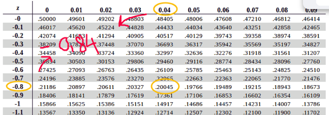</kbd>

<kbd></kbd>

<kbd>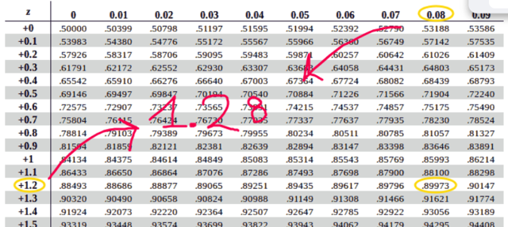</kbd>

> [!NOTE]
> Cách tra Z-table đại ý là tìm giá trị Φ(z) mong muốn. và cột dọc chính là phần
> nguyên và thập phân thứ nhất, hàng ngang là thập phân thứ hai. Cũng dễ
> hiểu

 

<kbd>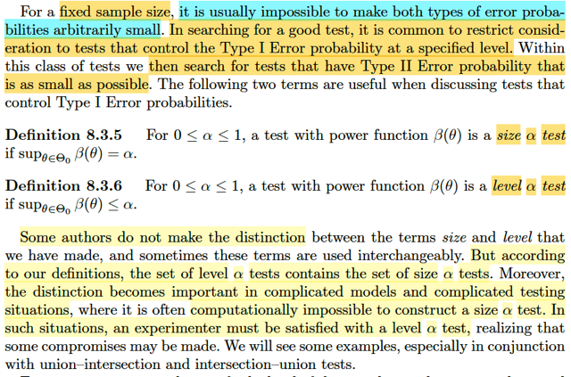</kbd>

> [!NOTE]
> Đại ý là, như ví dụ vừa rồi ta đã thấy, nếu được chọn random sample
> size và c thì ta có thể có được mức error mong muốn. Nhưng, nếu như
> sample size cố định, thì thường sẽ không thể có cả hai loại error đều
> nhỏ (xác suất).
>
> Do đó, để tìm phép kiểm tra tốt, lúc này thường ta sẽ giới hạn các ứng
> cử viên sao cho chúng đều đạt một mức độ nào đó của Type I error,
> sau đó, ta sẽ tìm cái có error loại kia (Type II error) nhỏ nhất.
>
> Thế thì từ đó, ta có định nghĩa của size α test và level α test:
>
> Size α test theo định nghĩa, là một phép kiểm tra (hypothesis test) dựa
> trên power function β(θ) với β(θ) thỏa: sup_θ ∈ Θ0 β(θ) = α.
>
> Còn Level α test là phép kiểm tra dựa trên power function β với sup_θ
> ∈ Θ0 β(θ) ≤ α.
>
> Làm rõ vài ý: Còn nhớ power function, là function of θ, defined bởi β(θ)
> = P_θ(**X** ∈ R), để nếu θ ∈ Θ0 thì nó là xác suất Type 1 Error và khi θ
> ∈ Θ0c thì nó là 1 - Xác suất Type II Error.
>
> Tác giả nói thêm có nhiều sách không phân biệt hai loại này.Nhưng ở
> đây ta phân biệt để dễ hơn cho các bài toán phức tạp hoặc những
> trường hợp ta ko thể xây dựng size α test.
>
> Vậy thì mình hiểu ở đây rằng khi với một α có giá trị từ 0 đến 1, thì nếu
> phép kiểm tra có giá trị lớn nhất của β function khi search mọi θ trong
> Θ0 bằng α, thì được gọi là Size α test. Còn nếu giá trị này chỉ ≤ α thì nó
> gọi là Level α test.
>
> Vậy ví dụ α = 0.7. Thì một phép kiểm tra có sup_θ ∈ Θ0 P_θ(**X** ∈ R) = 0.7 
> thì nó gọi là Size 0.7 test. Còn nếu phép kiểm tra có sup_θ
> ∈ Θ0 P_θ(X ∈ R) ≤ 0.7 thì nó gọi Level 0.7 test
>
> Vậy thì nếu θ ∈ Θ0 thì với Size 0.7 test, thì xác suất type I error lớn nhất
> chỉ là 0.7. Còn Level 0.7 test sẽ có xác suất type I error lớn nhất cũng chỉ từ
> 0.7 trở xuống.
>
> Và giả sử ta có một đám các phương pháp test đều là Size 0.7 test thì ta có
> thể yên tâm là nếu θ ∈ Θ0, thì xác suất Type I error của chúng đều nhiều nhất
> chỉ là 0.7
>
> Nhớ lại, ta đang trong bối cảnh là muốn tìm / đánh giá các phương pháp
> test. Bằng cách vòng một là lọc ra những thằng nào có xác suất type I error
> đạt một mức độ nào đó của Type I error rồi trong đám đó, vòng 2 mới xem
> type II error thằng nào thấp nhất. 
>
> Vậy thì việc lọc ra những thằng có xác suất type I error cao nhất cũng chỉ
> đạt α = 0.7 chính là vòng 1. Vòng 2 ta sẽ xem trong đám này.cái nào có 
> xác suất type II error thấp nhất.
>
> Chú ý xác suất Type I hay Type II error đều là hàm theo θ, chứ ta ko biết.
> Nên nói cái nào có xác suất type II error thấp nhất, mình dự đoán chính là
> xem thử cái nào có upper bound thấp nhất. (Giống như cách vòng 1: Đám
> pass vòng 1 là đám có upper bound đều ≤ α). Hoặc, thậm chí ta sẽ tìm
> phép test có β(θ) nhỏ nhất trong đám β(θ) với mọi θ.
>
> Khi đó, ta sẽ làm đúng như ý tưởng: Lọc ra một đám có Type I error đạt tiêu
> chuẩn (lọc bằng upper bound) và trong đám đó tìm ra thằng tốt nhất

 

<kbd>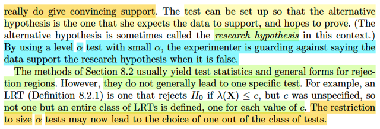</kbd>

<kbd></kbd>

<kbd>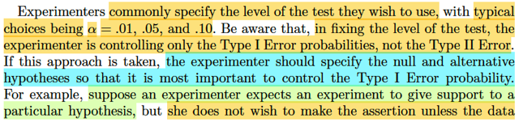</kbd>

> [!NOTE]
> Đoạn này rất quan trọng: Đại ý là như vừa rồi ta đã hiểu định nghĩa của Type
> α  test và Level α test. Thì bằng cách chỉ định α nhỏ, điển hình là 0.1, hoặc 0.
> 01 để đại ý là vòng loại đầu tiên chỉ xét các phép test mà nếu như θ thật sự ∈
> Θ0, tức phải accept H0, thì xác suất mắc Type I error - (accept H1 thay vì
> H0) lớn nhất cũng chỉ bằng 0.01.
>
> Nói dễ hiểu hơn là: Bằng cách đạt α rất nhỏ, ta chỉ chọn những thằng test mà
> xác xuất mắc lỗi loại I của nó cao nhất cũng rất nhỏ.
>
> Thế thì dễ hiểu là việc chọn α rất nhỏ này, chỉ giúp ta lọc các phép test ứng
> cử bởi xác suất mắc lỗi loại I, chứ ko đánh giá gì đến xác suất mắc lỗi loại II.
> Thành ra, giáo sư mới nói, nếu làm theo cách tiếp cận này, thì ta phải thiết kế
> vấn đề sao cho cái lỗi loại I là dạng lỗi nghiêm trọng nhất cần phải tránh.
>
> Mình lấy ví dụ: Giả sử mình viết ra một quy trình kiểm tra để giúp khi mua
> tiền  cổ, thì ko bị mua phải tiền giả. Vậy thì, cái lỗi nguy hiểm nhất ta muốn
> tránh là bỏ một tỷ để mua một đồng tiền giả, nó nghiêm trọng hơn việc gặp
> đồng thật mà lại bỏ qua. Do đó ta muốn cái phương pháp kiểm tra của mình
> của mình, trong trường hợp đồng tiền là giả, thì nó xác suất mắc lỗi "giả mà
> bảo là thật" rất thấp, chỉ 0.01.Điều này cũng đồng nghĩa, giả sử đồng tiền là
> giả, thì xác suất phép test cho ra kết luận đừng mua sẽ là 99.99%.
>
> Tương tự, trong sách giáo sư lấy ví dụ experimenter có thể là đang muốn
> kiểm tra xem nghiên cứu của mình có đúng không. Ví dụ, loại thuốc mới thật
> sự tốt hơn thuốc cũ. Thì khi đó, họ nên thiết kế vấn đề test theo kiểu H0 là "
> thuốc mới không tốt hơn thuốc cũ", H1 à "thuốc mới tốt hơn thuốc cũ". Để khi
> đó, nếu H0 đúng thì xác suất mà phép kiểm tra mắc sai lầm rất nhỏ. Dĩ nhiên
> điều này đồng nghĩa, khi H0 đúng, thuốc là đồ bỏ, thì xác suất phép kiểm tra
> kết luận chọn H0 sẽ là 99.99 %.
>
> Mình hiểu là hoàn toàn ko nói đến case θ ∈ Θ0c, thì xác suất phép test chọn
> H1 thế nào.Hay trong ví dụ đi mua tiền cổ thì, chỉ đang là cái này giúp bảo vệ
> khỏi tình huống, đáng lẽ nên từ chối mua, vì tiền đó là giả, thì lại xách tiền đi
> mua. Chứ chưa hề nói đến việc, giả sử là tiền thật thì phép thử có phán là
> thật hay không.
>
> ====
>
> Và ý cuối, dễ hiểu thôi, là cái này nó giúp ta ít nhiều trong việc chọn test.
> Nhắc lại một chút: Định nghĩa của một hypothesis test, là một cái rule, mà
> trong đó ta sẽ tính toán giá trị của một test statistic (function của random
> sample) để rồi dựa vào một cái rule để quyết định H0 hay H1. Ví dụ như  với
> phương pháo likelihood ratio test, ta tính λ(**x**), và quyết định reject H0 nếu
> λ(**x**) ≤ c, và accept H0 nếu λ(**x**) > c. Thế thì với c là số từ 0, tới 1. Thì ta
> CÓ VÔ SỐ PHÉP TEST. Vì mỗi một giá trị c, sẽ cho ta một cái rule có thể
> dùng để accept hay reject H0. Có nghĩa là, likelihood ratio testing method,
> chỉ đang giúp ta thu hẹp hơn chút xíu không gian các phép thử có thể dùng
> trên đời (để chỉ còn là các phép thử dùng likelihood ratio), nhưng nó vẫn là
> vô số cái.
>
> Thì nay, với α, ta có thể thu hẹp đáng kể các phép thử (tức là bằng cách
> chọn α ví dụ = 0.1, thì c sẽ phải nhỏ hơn mức sao đó)

 

<kbd>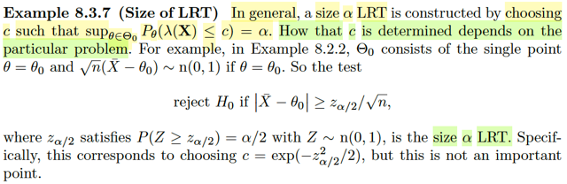</kbd>

🔗 **Related:** [8.2 METHOD OF FINDING TESTS](82_method_of_finding_tests.md#node-673)

> [!NOTE]
> Ôn tập chút: Theo định nghĩa, size α test là một test mà trong trường hợp θ ∈ Θ0,
> (H0 nên được accept) thì xác suất mắc Type I error (reject H0 trong khi phải accept)
> cao nhất cũng chỉ bằng đúng α
>
> Cao nhất là sao? Là vì ta biết xác suất mắc Type I error, chính là bằng P_θ(**x** ∈ R)
> trong trường hợp θ ∈ Θ0, và đây là hàm theo θ, để rồi nói cao nhất chính là khi ta
> tìm trong mọi θ ∈ Θ0 để maximize hàm này, kết qủa được α là gía trị cao nhất của
> P_θ(x ∈ R): sup_θ ∈ Θ0 P_θ(**x** ∈ R) = α
>
> Vậy bối cảnh ở đây là gì? Là ta muốn tìm cách evaluate test. Mà trong điều kiện có
> thể chọn threshold c cũng như sample size, ta có thể thiết kế ra test có xác suất
> type I, II mong muốn. Nhưng nếu sample size fix, thì cách tiếp cận thường thấy là
> chọn test sao cho thỏa một điều kiện nào đó của Type I error. Sau đó sẽ tìm test có
> Type II error thấp nhất. Vậy thì size α test và level α test là hai khái niệm phục vụ
> điều này.
>
> Thế thì dễ hiểu, size α LRT, sẽ là một LRT (likelihood ratio test) có xác suất mắc
> Type I error cao nhất chỉ bằng α (dĩ nhiên là trong trường hợp θ ∈ Θ0)
>
> Nhớ lại LRT, nó work như sau: Reject H0 nếu λ(**x**) ≤ c, với λ(**x**)
>
> = sup_θ∈Θ0 L(θ|**x**) / sup_θ∈Θ L(θ|**x**)
>
> = L(θ^0|**x**) / L(θ^|**x**)
>
> Và do đó rejection region: R = {**x**: λ(**x**) ≤ c}
>
> Như vậy khi θ ∈ Θ0, P(Type I error) = P_θ(**x** ∈ R) = P_θ(λ(**X**) ≤ c)
>
> Do đó theo định nghĩa của size α test, thì size α LRT sẽ là LRT có P_θ(λ(**X**) ≤ c) =
> α như sách viết là vậy.
>
> Tác gỉa nói thêm, giá trị c quyết định thế nào thì tùy vào từng bài toán cụ thể.
>
> Ví dụ như trong ví dụ 8.2.2, Θ0 chỉ là singleton {θ0} và ta đã thấy rejection region là:
> R = {**x**: |xbar-θ0| ≥ √[-2log(c)/n]}
>
> Để rồi P_θ(**X** ∈ R) = P_θ(|Xbar-θ0| ≥ √[-2log(c)/n])
>
> = P_θ(|Xbar-θ0| ≥ √[-2log(c)/n])
>
> = P_θ(Xbar-θ0 ≥ √[-2log(c)/n] U Xbar-θ0 ≤ -√[-2log(c)/n])
>
> = P_θ(Xbar-θ0 ≥ √[-2log(c)/n]) + P(Xbar-θ0 ≤ -√[-2log(c)/n])
>
> Nhớ rằng trong ví dụ này, σ = 1
>
> = P_θ((Xbar-θ0)/(σ/√n) ≥ √[-2log(c)]) + P((Xbar-θ0)/(σ/√n) ≤ -√[-2log(c)])
>
> = P_θ((Xbar-θ0)/(σ/√n) ≥ √[-2log(c)]) + P((Xbar-θ0)/(σ/√n) ≤ -√[-2log(c)])
>
> Với Z = √n (Xbar - θ0) ~ n(0,1) = (Xbar - θ)/(σ/√n) ~ n(0,1)
>
> ..= P_θ(Z ≥ √[-2log(c)]) + P(Z ≤ -√[-2log(c)])
>
> Do tính đối xứng của normal(0,1)
>
> = 2P_θ(Z ≥ √[-2log(c)])
>
> ⇨ P_θ(**X** ∈ R) = α
>
> ⇔ 2P_θ(Z ≥ √[-2log(c)]) = α
>
> ⇔ P_θ(Z ≥ √[-2log(c)]) = α/2
>
> và trong phần sau ta sẽ thấy nói về z_α/2, là kí hiệu để chỉ giá trị của Z khiến P(Z ≥
> z_α/2) = α/2
>
> Nên điểm z_α/2 lúc này chính là √[-2log(c)]
>
> để từ đó có thể hiểu vì sao trong sách nói test rule viết thành:
>
> Reject H0 nếu |Xbar-θ0| ≥ √[-2log(c)/n]
>
> ⇔ Reject H0 nếu |Xbar-θ0| ≥ √[-2log(c)]/√n
>
> ⇔ Reject H0 nếu |Xbar-θ0| ≥ (z_α/2)/√n
>
> Thế thì, bằng cách chọn c sao cho √[-2log(c) là z_α/2
>
> ⇔ -2log(c) = (z_α/2)^2
>
> ⇔ log(c) = -(z_α/2)^2/2
>
> ⇔ c = exp[-(z_α/2)^2/2], thì ta sẽ có một size α LRT
>
> Có ý này: Tác giả nói ko quan trọng ý là, ko cần phải tìm ra c cụ thể, mà chỉ cần
> define cái rule theo Z: Reject H0 nếu |Xbar-θ0| ≥ (z_α/2)/√n (z_α/2 là thứ có thể tra
> bảng được, thì ta sẽ có một size α LRT)

 

<kbd>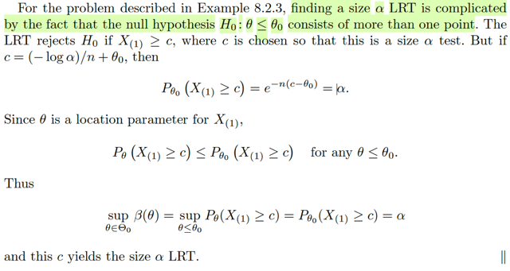</kbd>

🔗 **Related:** [8.2 METHOD OF FINDING TESTS](82_method_of_finding_tests.md#node-675)

🔗 **Related:** [5.4 ORDER STATISTIC](54_order_statistic.md#node-386)

> [!NOTE]
> Đại khái là trong ví dụ vừa rồi (8.2.2) thì Θ0 chỉ là một single point set, {θ0} nên
> cơ bản là khi xét tình huống θ ∈ Θ0 để có thể "nói về" Type I error, thì chỉ đơn
> giản là ta có θ = θ0. Từ đó, việc xây dựng size α test chỉ là tìm c sao cho sup_θ
> ∈ Θ0 P_θ(x ∈ R) = α
>
> ⇔ sup_θ∈Θ0 P_θ(λ(**X**) ≤ c) = α
>
> ⇔ sup_θ∈Θ0 P_θ(L(θ^0|**X**) / L(θ^|**X**) ≤ c) = α
>
> (Nhớ, θ^0 là restricted on Θ0 MLE, và θ^ là unrestricted MLE)
>
> hay viết rõ ra:
>
> sup_θ∈Θ0 P_θ(sup_θ ∈ Θ0 L(θ|**X**) / sup_θ∈Θ L(θ|**X**) ≤ c) = α
>
> Dùng sự thật Θ0 = {θ0} thì lúc này, sup_θ∈Θ0 L(θ|**X**) chỉ là L(θ0|**X**)
>
> sup_θ∈Θ0 P_θ(sup_θ ∈ Θ0 L(θ|X) / sup_θ∈Θ L(θ|X) ≤ c)
>
> Và lúc này P cũng ko còn phụ thuộc θ:
>
> = sup_θ∈{θ0} P_θ(L(θ0|**X**) / L(θ^|**X**) ≤ c)
>
> = P_θ0(L(θ0|**X**) / L(θ^|**X**) ≤ c)
>
> Do đó sup_θ∈Θ0 P_θ(λ(**X**) ≤ c) = α ⇔ P_θ0(L(θ0|**X**) / L(θ^|**X**) ≤ c)
>
> và ta giải ra như note vừa rồi.
>
> Ý CHÍNH MUỐN NHẤN MẠNH Ở ĐÂY LÀ: VÌ Θ0 CHỈ CÓ θ0, NÊN CÁI
> sup_θ∈Θ0 P_θ(..) TRỞ NÊN ĐƠN GIẢN, KHÔNG CÒN PHỤ THUỘC θ. GIÚP
> BÀI TOÁN TRÊN TRỞ NÊN DỄ.
>
> NHƯNG VỚI VÍ DỤ 8.2.3, Θ0 LÀ {θ ≤ θ0} khi đó vấn đề trở nên phức tạp hơn.
>
> Lúc này để tìm size α test, ta phải tìm: c sao cho:
>
> sup_θ≤θ0 P_θ(**X** ∈ R) = α . Và trong ví dụ này, rejection R là:
>
> reject region: {x: θ0 - log(c)/n ≤ x(1)}
>
> ⇨ sup_θ≤θ0 P_θ(**X** ∈ R) = α
>
> ⇔ sup_θ≤θ0 P_θ(θ0 - log(c)/n ≤ X(1)) = α
>
> ⇔ sup_θ≤θ0 P_θ(θ0 - log(c)/n ≤ X(1)) = α
>
> ⇔ sup_θ≤θ0 P_θ(X(1) ≥ θ0 - log(c)/n) = α
>
> Tới đây lập luận như sau: Trong ví dụ 8.2.3, X1,..Xn là random sample từ  một
> exponential location family f(x) = e^(-(x-θ))
>
> ⇨ nên X(1) (order statistic) cũng vậy.
>
> ⇨ θ là location parameter của X(1)
>
> Nên khi thay đổi θ trong (-inf, θ1) thì distribution của X(1) chỉ tịnh tiến để thay đổi
> location chứ hình dạng ko đổi.
>
> Rồi, P_θ(X(1) ≥ θ0 - log(c)/n), chính là diện tích của phần đồ thị pdf ở bên phải
> mức θ0 - log(c)/n). Cái này dễ hiểu.
>
> Nênn khi kéo đồ thị qua lại như trên vừa nói, thì diện tích này cũng sẽ thay đổi.
>
> Do đó bài toán đang là:
>
> Tìm c sao cho khi kéo đồ thị qua lại thì diện tích lớn nhất có thể đạt được cũng
> chỉ nhỏ hơn α.
>
> Vậy diện tích lớn nhất có thể có là bao nhiêu? khi nào?
>
> Vậy phải xem lại hình dạng của pdf. Nhưng thật ra cũng không cần, vì đã là pdf,
> thì tổng diện tích bằng 1, nên quy luật bất biến là càng kéo cái hình về bên trái
> một mức nào đó thì cái phần bên phải sẽ càng nhỏ lại. Điều này đúng với mọi
> pdf.
>
> Do đó, dù là distribution nào, thì cái diện tích phần bên phải sẽ lớn nhất khi ta
> KÉO ĐỒ THỊ HẾT CỠ VỀ BÊN PHẢI. CÓ NGHĨA LÀ, CHO θ ĐỤNG θ0.
>
> Khi đó ta sẽ có sup_θ≤θ0 P_θ(X(1) ≥ θ0 - log(c)/n) = P_θ0(X(1) ≥ θ0 - log(c)/n)
>
> Và đây cũng chính là chỗ tác giả nói P_θ(X(1) ≥ c) ≤ P_θ0(X(1) ≥ c) với mọi θ ≤
> θ0.
>
> Vậy bài toán trở thành tìm c để:
>
> P_θ0(X(1) ≥ θ0 - log(c)/n) = α
>
> (tất nhiên mình hiểu vế trái là tính bằng pdf của X(1) với θ = θ0)
>
> Theo link, trong 5.4.4 ta đã có một theorem nói vè pdf của order statistic:
>
> fX(j)(x) = [n!/(j-1)!(n-j)!] fX(x)[FX(x)]^j-1[1 - FX(x)]^n-j
>
> ⇨ fX(1)(x) = n!/0!(n-1)! fX(x)[FX(x)]^0[1 - FX(x)]^n-1
>
> = nfX(x)[1 - FX(x)]^n-1
>
> ⇨ fX(1) = ne^-(x-θ)[1 - ∫-inf:x e^-(t-θ)dt]^n-1
>
> Tính ∫-θ:x e^-(t-θ)dt
>
> = [Nguyên hàm của e^-(t-θ)]|-θ:x
>
> = [-e^-(t-θ)]|-θ:x
>
> = -e^-(x-θ) - (-e^-(θ-θ))
>
> = -e^-(x-θ) + 1
>
> = 1 - e^-(x-θ)
>
> ⇨ fX(1) = ne^-(x-θ)[1 - 1 + e^-(x-θ)]^n-1
>
> = ne^-(x-θ)[e^-(x-θ)]^n-1
>
> = n[e^-(x-θ)]^n
>
> = ne^-n(x-θ)
>
> ⇨ P_θ0(X(1) ≥ θ0 - log(c)/n)
>
> = ∫a:inf ne^-n(x-θ)dx,  với a = θ0 - log(c)/n
>
> = n∫a:inf e^-n(x-θ)dx,  với a = θ0 - log(c)/n
>
> = n[nguyên hàm của e^-n(x-θ)]|a:inf = α
>
> [nguyên hàm của e^-n(x-θ)] = -e^-n(x-θ)/n
>
> = n[-e^-n(x-θ)/n]|a:inf
>
> = [-e^-n(x-θ)]|a:inf
>
> = [-e^-n(inf-θ)+e^-n(a-θ)]
>
> = e^-n(a-θ)
>
> Viết lại P_θ0(X(1) ≥ θ0 - log(c)/n) = P_θ0(X(1) ≥ a) = e^-n(a-θ)
>
> Thay a = θ0 - log(c)/n,
>
> = e^-n(θ0 - log(c)/n - θ0)
>
> = e^-n(log(c)/n)
>
> = e^(log(c))
>
> = c
>
> Viết lại P_θ0(X(1) ≥ θ0 - log(c)/n) = c
>
> Vậy để P_θ0(X(1) ≥ θ0 - log(c)/n) = α
>
> ⇔ c = α
>
> Khi đó a = θ0 - log(α)/n sẽ là cái ngưỡng giúp P_θ0(X(1) ≥ a) = α để rồi ta có một
> size α test.
>
> Trong sách, mr Casella gọi nó là c do từ đầu ông dùng rule reject H0 nếu X(1) ≥
> c} còn mình thì dùng rule reject H0 nếu X(1) ≥ θ0 - log(c)/n derive ở bài trước.
>
> Tức là giống như ta đặt a = θ0 - log(c)/n, thì nó chính là c trong sách. Để rồi, cái
> c (trong sách)  khiến có size α test chính là cái a khiến có size α test, và a đó =
> θ0 - log(α)/n

 

<kbd>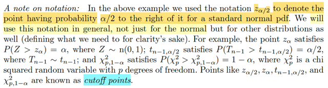</kbd>

> [!NOTE]
> Đại khái là ở note trước, có cái vụ P_θ(Z ≥ z_α/2) = α/2
>
> tức là z_α/2 là kí hiệu để chỉ một điểm (giá trị của Z) mà xác suất Z ≥ nó là α/2
>
> Tương tự z_α, là con số mà P(Z > z_α) = α 
>
> Thì đây là quy ước chung cũng dành cho các distribution khác.
>
> Ví dụ như ta có Tn-1 (Student t, bậc tự do n-1) thì tn-1,α/2 là con số mà  
> P(Tn-1 > tn-1,α/2) = α/2
>
> Hay với Chi-square_p random variable X^2_p, thì x^2_p,1-α  là con số mà
> P(X^2_p > 1-α) > 1-α
>
>  Và chúng gọi là CUTOFF POINTS

 

<kbd>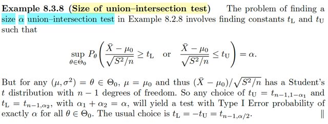</kbd>

🔗 **Related:** [8.2 METHOD OF FINDING TESTS](82_method_of_finding_tests.md#node-688)

🔗 **Related:** [5.3 SAMPLING FROM THE NORMAL DISTRIBUTION](53_sampling_from_the_normal_distribution.md#node-370)

🔗 **Related:** [8.2 METHOD OF FINDING TESTS](82_method_of_finding_tests.md#node-687)

🔗 **Related:** [5.3 SAMPLING FROM THE NORMAL DISTRIBUTION](53_sampling_from_the_normal_distribution.md#node-372)

> [!NOTE]
> Qua ví dụ này, nói về Size α union-intersection test. Dừng một chút, mình
> nên hiểu rằng xuất phát từ định nghĩa của size α test, là một test (mà định
> nghĩa của nó, nhắc lại, là một rule, tính toán một function nào đó của
> random sample, để có test statistic, và áp dụng cái rule nào đó để chọn H0
> hoặc H1) mà trong trường hợp θ ∈ Θ0, thì xác suất Type I Error cao nhất
> sup_θ∈Θ0 P_θ(**x** ∈ R) cũng chỉ bằng α.
>
> Vậy thì hồi nãy, khi test được dùng là thuộc loại likelihood ratio test, thì ta có
> size α LRT. Nên với Bayes test, ta sẽ có size α Bayes test. Hay ở đây, với
> union-intersection test thì ta có size α union-intersection test.
>
> Ôn lại về union-intersection, đại khái ideas của nó là vầy:
>
> Đó là khi Θ0 có thể được thể hiện bởi intersection của các Θ0_γ:
>
> Θ0 = ∩{γ∈Γ} Θ0_γ
>
> Và ta có các hypothesis test con: test giữa H0_γ: θ ∈ Θ0_γ vs H1_γ: θ ∈
> Θ0c_γ có rule: Reject H0_γ nếu x ∈ R_γ, R_γ, là rejection region con, được
> define cũng thông qua một test statistic "con" T_γ(**x**) và cái threshold nào
> đó: R_γ = {**x**: T_γ(**x**) ∈ R_γ}
>
> Thì khi đó, ta có thể có rule của test gốc define bởi các rule của test con:
> Lập luận cũng dễ thôi: Nếu tất cả các H0_γ đều bị reject, thì tức là các test
> con đều kết luận θ not ∈ Θ0_γ  ∀γ. Thì khi đó cũng chính là kết luận "θ cũng
> sẽ not ∈ ∩{γ∈Γ} Θ0_γ.
>
> ⇔  kết luận Reject H0.
>
> Vậy nên rule gốc sẽ là: Reject H0 nếu một H0_γ bất kì bị reject.
>
> Và cũng chính là: chỉ cần **x** ∈ R_γ với γ nào đó, thì x sẽ thuộc R của bài
> toán gốc,
>
> nên rejection region của bài toán gốc define R = U{γ∈Γ} R_γ, hay U{γ∈Γ}
> {x:T_γ(**x**) ∈ R_γ}
>
> Và khi các rule "con" đều là: Reject H0_γ khi T_γ(x) > c, đồng nghĩa rejection
> region "con" là {**x**: T_γ(**x**) > c} thì rule "mẹ" sẽ là:
>
> Reject H0 khi T_γ(**x**) > c với γ nào đó.
>
> Và rejection region "mẹ" sẽ là: {**x**: T_γ(**x**) > c, for some γ} và điều này dễ thấy
> chính là tương đương với {**x**: sup_γ∈Γ T_γ(**x**) > c} → test statistic của test "mẹ"
> là sup_γ∈Γ T_γ(**X**)
>
> ====
>
> Thế thì trong ví dụ 8.2.8, mình đã đi đến kết luận:
>
> H0 bị reject khi H0L bị reject hoặc H0U bị reject
>
> ⇔ (Xbar - μ0) / (S/√n) ≥ tL hoặc (Xbar - μ0) / (S/√n) ≤ tU, 
>
> Tức T_γ1(**X**) chính là (Xbar - μ0) / (S/√n), và cái rule là reject H0L khi T_γ1(**X**) ≥ tL
>
> Và T_γ2(**X**) chính là (Xbar - μ0) / (S/√n), và cái rule là reject H0U khi T_γ2(**X**) ≤ tU
>
> Dẽ hiểu test statistic của bài toán gốc cũng là T(**X**) = (Xbar - μ0) / (S/√n)
> và rule của bài toán mẹ là: reject H0 khi T(x) ≤ tU hoặc T(x) ≥ tL
>
> ====
>
> Vậy thì, quay lại bài toán này, tìm size α union-intersection test, áp định nghĩa
> vào: Khi θ ∈ Θ0 thì xác suất Type I Error lớn nhất phải = α.
>
> ⇔ sup_θ∈Θ0 P_θ(**X** ∈ R) = α
>
> ⇔ sup_θ∈Θ0 P_θ(T(**X**) ≤ tU or T(**X**) ≥ tL) = α
>
> ⇔ sup_θ∈Θ0 [P_θ((Xbar - μ0) / (S/√n) ≤ tU or (Xbar - μ0) / (S/√n) ≥ tL)] = α
>
> (đây là cái tác giả viết trong sách)
>
> =====
>
> Tiếp theo. Đại khái là ta nhớ về định nghĩa của Student's t distribution. Nó được
> định nghĩa là distribution của (Xbar - μ) / (S/√n) của một normal(μ, σ^2) random
> sample.Tức là, lấy random sample X1,...Xn ~ normal(μ, σ). Thì random variable
> tạo bởi sample  mean Xbar và sample variance S theo công thức trên sẽ có distri
> được đặt cho cái tên là Student's t.
>
> Thế thì ở đây cần nhớ trong ví dụ 8.2.8 thì H0: μ = μ0 vs H1: μ khác μ0.
>
> Cũng chính là nói Θ0: θ = (μ, σ^2) sao cho μ = μ0. Và Θ0c là {(μ, σ^2): μ khác μ0}
>
> Nên khi ta đang xét sup_θ∈Θ0 ..thì cũng là đang xét mọi (μ, σ^2): μ = μ0.
>
> Và khi đó ta đang có μ0 chính là true mean của population (Xbar - μ0) / (S/√n)
> (chỗ này có thể hơi khó hiểu, nhưng chỉ cần hiểu đơn giản là, khi ta đang tìm
> trong Θ0 = {(μ, σ^2) sao cho μ = μ0} thì (Xbar - μ0) / (S/√n) dĩ nhiên chính là
> (Xbar - μ) / (S/√n), và do đó, nó là một Student's t với n-1, kí hiệu t_n-1 statistic.
>
> Kí hiệu Student's t statistic đó là T_n-1(X) = (Xbar - μ0) / (S/√n)
>
> ⇨ sup_θ∈Θ0 [P_θ((Xbar - μ0) / (S/√n) ≤ tU or (Xbar - μ0) / (S/√n) ≥ tL)] = α
>
> ⇔ sup_θ∈Θ0 [P_θ(T_n-1 ≤ tU or T_n-1 ≥ tL)] = α
>
> Lúc này, sup không còn ý nghĩa gì nữa. Vì T_n-1 không phụ thuộc σ^2 mà nó
> chỉ phụ thuộc bậc tự do (xem link để thấy, lúc chap 5 mình cũng đã derive pdf
> của nó rồi)
>
> ⇔ P_θ(T_n-1 ≤ tU or T_n-1 ≥ tL) = α
>
> Dĩ nhiên, trong equation này, cái ta cần là tìm tU, tL sao cho thỏa cái này thì
> ta sẽ có một size α union-intersection test.
>
> Và yêu cầu chỉ là tìm tU, tL chứ ko phải tìm hết mọi nghiệm
> nên ta chỉ việc có thể chọn nghiệm để thỏa phương trình.
>
> Vậy đầu tiên ta có thể chọn tU, tL sao cho event trên là union của hai disjoint event
> Tức tU ≤ tL, khi đó theo Axiom 2, phương trình tương đương:
>
>  P_θ(T_n-1 ≤ tU) + P_θ(T_n-1 ≥ tL) = α 
>
> ⇔ 1- P_θ(T_n-1 > tU) + P_θ(T_n-1 ≥ tL) = α 
>
> Rồi, tới đây, nếu chọn tU = t_n-1,1-α1, là con số mà hồi nãy mình vừa học,
> để chỉ con số mà khiến P_θ(T_n-1 > t_n-1,1-α1) = 1-α1
>
> và chọn tL là t_n-1,α2, là con số mà P_θ(T_n-1 ≥ α2) = α2
>
> Và chọn α1, α2 sao cho α1 + α2 = α 
>
> Thì khi đó vế trái sẽ là: 1 - (1 - α1) + α2 = α1 + α2 = α, thỏa phương trình.
>
> Kết luận: Mọi tU, tL sao cho tU = t_n-1,1-α1, tL = t_n-1,α2, α1+α2 = α đều sẽ tạo ra
> một size α union-intersection test. Tức là test mà trong trường hợp θ ∈ Θ0 thì chúng 
> đều có xác súất Type I Error = α.
>
> Và thường thường người ta chọn tL = -tU = t_n-1, α/2

 

<kbd>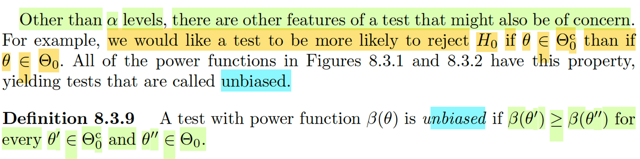</kbd>

🔗 **Related:** [9.2 METHODS OF FINDING INTERVAL ESTIMATORS](92_methods_of_finding_interval_estimators.md#node-759)

> [!NOTE]
> Tiếp theo, đại ý là giáo sư cho biết bên cạnh α level, còn có những đặc điểm khác
> của một test mà ta cũng có thể quan tâm. Dừng lại một chút để nhớ lại rằng, α
> level, ý là ta muốn xây dựng, tìm kiếm, đánh giá các phép kiểm tra giả thuyết (nói
> gọn là test) dựa trên xác suất mắc Type I error, trong bối cảnh là ta muốn chọn ra,
> tìm ra test tốt nhất. Thế thì ở đây, tạm hiểu là còn có những " cái kiểu" khác để
> đánh giá test nữa.
>
> Cụ thể ta sẽ học thế nào là một unbiased test. Được định nghĩa là, nếu cái test đó,
> nó thiên về (more likely) việc đưa ra kết luận reject H0 khi θ ∈ Θ0c hơn là đưa ra
> kết luận này khi θ ∈ Θ0. Hay, định nghĩa chính thức là, nếu một test có hàm power
> β(θ) có tính chất rằng khi evaluate tại θ' đến từ Θ0c thì luôn lớn hơn hoặc bằng β
> tại θ'' từ Θ0.
>
> Là sao nhỉ? Cần nhẩm lại các khái niệm để ôn tập lại (bạn nào đọc đến chỗ này
> thì đây chính là lúc ta lôi kiến thức ra một cách chủ động, giúp hiểu và nhớ lâu):
> Thứ nhất, nhớ lại β function là cái gì. Theo định nghĩa, nó là xác suất mà ta reject
> H0. Reject H0 là sao? À là vì định nghĩa của một hypothesis test, đơn giản chỉ là
> ta muốn tạo ra một cái rule, có bản chất là một decision function, nhận vào một bộ
> giá trị quan sát được của random sample **X**, và nhả ra kết quả H0 hay H1.(hay
> reject H0 hay accept H0), và cụ thể thì ta sẽ dùng một cái function nào đó áp lên,
> tính toán lên cái random sample **X**, để có một statistic T(**X**), đó chính là test
> statistic, sau đó ta sẽ so sánh với một ngưỡng (threshold) nào đó, để mà ra quyết
> định H0 hay H1, đó chính là rule. Và tổng hợp lại, thì define cái rule sẽ bao gồm từ
> lúc ta quyết định dùng function nào và dùng cái ngưỡng nào.
>
> Thế thì quay lại đây, sau khi ta đã xây dựng được decision function, thì với một giá
> trị **x** của **X**thì thì ta sẽ có một quyết định reject hau accept H0. Vậy nếu ném
> vào mọi giá trị khả dĩ của **X (**∀**x** ∈ Range **X**), ta sẽ chia không gian ra làm
> hai, và tập các giá trị **x**khiến H0 bị reject tạo thành Rejection Region {**x**:
> T(**x**) khiến reject H0}. Do đó sự kiện H0 bị reject, chính là sự kiện observed
> value **x** của **X** bị rơi vào rejection region. Nên xác suất H0 bị reject chính là
> xác suất **X** ∈ R. P(Reject H0) = P_θ(**X** ∈ R).
>
> Tới đây, ta mới nói đến việc đánh giá chất lượng của một test. Dĩ nhiên ta sẽ
> muốn test làm đúng, không mắc sai sót. Mà sai sót thì chỉ có hai loại thôi: Khi
> đáng ra phải accept H0 thì lại đi reject H0. Đây chính là Type I error: Xảy ra khi θ
> thật sự ∈ Θ0, nhưng H0 bị reject, tức **x** ∈ R. Do đó xác suất Type I error chính
> là xác suất x ∈ R khi θ ∈ Θ0. Ngược lại, khi đáng ra phải reject H0 thì lại đi accept
> nó.Đây chính là Type II error, xảy ra khi θ ∈ Θ0c, nhưng x lại thuộc Rc. ⇨ Xác
> suất Type II error = P_θ(**x** ∈ Rc) khi θ ∈ θ0c. Và cái này thì bằng 1 - P_θ(**x** ∈
> R) Do đó mới nói khi P_θ(X ∈ R) sẽ là xác suất Type I error khi θ ∈ Θ0 và 1 - xác
> suất Type II error  khi θ ∈ Θ0c. Và cái P_θ(**X** ∈ R) chính là define cho power
> function β(θ). Vì sao nó lại phụ thuộc θ? Thì bởi vì **X** là random sample, cũng là
> random variable, theo định nghĩa là một iid các random variable X1,...Xn ~
> population distribution có tham số θ. Nên dĩ nhiên xác suất của event liên quan
> đến X phải phụ thuộc θ.
>
> Thế thì, một test hoàn hảo, dĩ nhiên là phải có xác suất Type I error bằng 0 khi θ ∈
> Θ0 và xác suất Type II error bằng 0 khi θ ∈ Θ0c. Cụ thể là, nếu H0 là nhận định
> bệnh nhân không có bệnh, H1 là bệnh nhân có bệnh. Thì một test tốt là test làm
> việc như sau: khi bệnh nhân không có bệnh (θ ∈ Θ0, H0  phải được accept) thì
> phải cho ra xác suất reject H0 / accept H1 / phán bệnh nhân có bệnh / β(θ) phải
> bằng 0. Còn khi người ta có bệnh, thì phải cho ra xác suất accept H0 / phán bệnh
> nhân không có bệnh = 0, cũng chính là β(θ) = 1.
>
> Nhưng đời không như là mơ, do đó phần lớn ta sẽ làm theo chíến lược:  Vòng 1,
> tuyển chọn các test mà khi H0 nên được accept, θ ∈ Θ0 thì xác suất Type 1 error
> (tức reject H0) cao nhất trong mọi θ ∈ Θ0 chỉ bằng α nào đó (ví dụ 0.01, rất nhỏ).
> Để rồi nếu xài môt trong đám này, và thông qua các thiết kế chọn H0, H1 sao cho
> Type I error là cái loại sai sót nghiêm trọng nhất, thì  hệ quả sẽ là, xác suất mà khi
> mắc Type I error = phải accept H0 mà ta lại reject nó sẽ rất thấp. Trong ví dụ bệnh
> nhân, thì xác suất mà ta kết luận người đó có bệnh trong khi họ thực sự khỏe
> mạnh sẽ rất thấp.
>
> Sau đó, sang vòng 2 ta sẽ tìm test có xác suất Type II error thấp nhất.
>
> Thế thì cần nhắc lại bức tranh toàn cảnh để thấy tại sao ta cần unbiased test:
>
> Nhớ lại: β(θ) = defined là P_θ(**X** ∈ R)
>
> và nó = xác suất Type I error khi (a): H0 phải được accept, θ ∈ Θ0
>
> = 1 - xác suất Type II error khi (b): H0 phải bị reject, θ ∈ Θ0c
>
> ⇨ khi (a) xảy ra, β(θ) nhỏ → Xác suất [reject H0], lúc này chính là [**MẮC Type I
> error] NHỎ → TỐT!**
>
> **NHƯNG**, khi (b) xảy ra, thì β(nhỏ), có nghĩa xác suất [reject H0], lúc này chính
> là **[QUYẾT ĐỊNH ĐÚNG], CŨNG NHỎ → KHÔNG TỐT!!!**
>
> Lấy ví dụ bệnh nhân: Giả sử ta có cái test thuộc lại size α test, α = 0.01 như trên.
> Thì khi người ta không bệnh, dựa vào test này xác suất bác sĩ phán ổng có bệnh
> sẽ rất nhỏ. Nhưng nếu lỡ ổng có bệnh, thì β cũng vẫn nhỏ, → bác sĩ cũng phán
> ổng ko có bệnh → tiêu đời.
>
> Do đó, ta mới cần một test bị lệch để khi (a) xảy ra (H0 phải bị accept, θ ∈ Θ0, ông
> đó ko có bệnh) thì  β NHỎ == xác suất phán ổng có bệnh, để rồi mắc Type I error
> NHỎ.
>
> NHƯNG nếu (b) xảy ra (H0 phải bị reject, θ ∈ Θ0c, ông đó có bệnh) thì β PHẢI
> LỚN == xác suất phán ổng có bệnh (là quyết định đúng) LỚN.
>
> Do đó ta mới có cái định nghĩa của **UNBIASED TEST,** là β tính với θ'' từ trường
> hợp (a) (θ'' ∈ Θ0)  thì luôn NHỎ HƠN β tính với θ' từ trường hợp (b) (θ' ∈ Θ0c)
>
> Cái chữ **unbiased**, phải hiểu thế này: Không lệch, unbiased là khi cái test nó
> work một cách công tâm: Nếu ko bệnh thì nói ko bệnh (β nhỏ) còn có bệnh thì nói
> có bệnh (β lớn). Như vậy mới là unbiased. Ngược lại, biased là khi có bệnh hay
> không có bệnh cũng cho β nhỏ hết.

 

<kbd>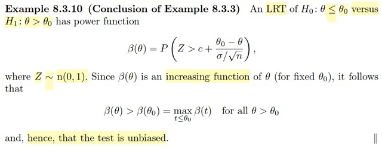</kbd>

🔗 **Related:** [8.3 METHODS OF EVALUATING TEST](83_methods_of_evaluating_test.md#node-697)

> [!NOTE]
> Qua ví dụ này, kế thừa từ ví dụ 8.3.3, nói về một test (thuộc loại likelihood
> ratio test, LRT), kiểm tra hai giả thuyết: H0: θ ∈ Θ0 ⇔ θ ≤ θ0 vs H1: θ ∈ Θ0c
> ⇔ θ > θ0. test này có β function:
>
> β(θ) = P_θ(Z > c + (θ0 - θ)/ (σ/√n)) , Z ~ n(0,1)
>
> (nên nhớ, nó vẫn là hàm theo θ)
>
> Vậy ở đây vì sao nó là unbiased test.
>
> Theo định nghĩa thôi, ta cần chỉ ra rằng β có tính chất là giá trị của nó với θ'
> đến từ Θ0c luôn lớn hơn giá trị của nó tại θ'' đến từ Θ0. Tức là, β(θ) với θ ≤
> θ0 luôn ≤ β(θ) với θ0 < θ.
>
> Nhìn kĩ hàm β, dễ thấy nó là diện tích của phần đồ thị bên phải của pdf của Z,
> standard normal. Khi θ chạy từ -inf → inf, thì -θ chạy từ inf → -inf khiến cả cái
> cụm c + (θ0 - θ)/ (σ/√n) cũng vậy.
>
> Mà cái cụm này chính là cái ngưỡng để bắt đầu tính diện tích nói trên. Nên
> việc nó chạy từ inf → -inf khi θ chạy từ -inf → inf có nghĩa là diện tích của
> phần nói trên sẽ TĂNG DẦN LIÊN TỤC. Do đó mới nói hàm β là increasing
> function.
>
> (lập luận vậy dễ hơn nhiều so với việc ráp pdf của Z vào và tính đạo hàm,
> chứng minh nó luôn không âm)
>
> Vậy hàm β(θ) luôn đơn điệu tăng thì dĩ nhiên là tại θ'' ∈ (-inf, θ0] = Θ0   thì dĩ
> nhiên luôn nhỏ hơn tại θ' ∈ (θ0, inf) = Θ0c → thỏa định nghĩa của unbiased
> test

 

<kbd>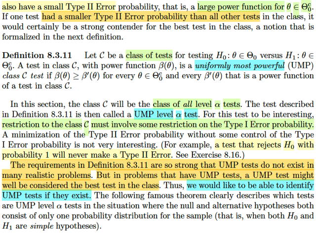</kbd>

<kbd></kbd>

<kbd>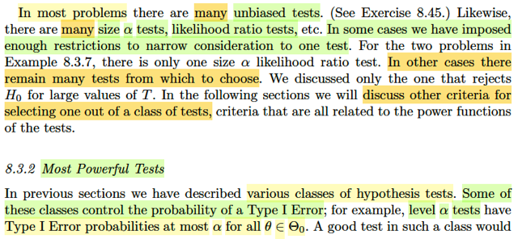</kbd>

🔗 **Related:** [8.3 METHODS OF EVALUATING TEST](83_methods_of_evaluating_test.md#node-743)

> [!NOTE]
> Qua phần 8.3.2 Đại khái là bữa giờ mình đã thấy nhiều loại hypothesis test.
> Một số loại thì có tác dụng kiểm soát xác suất xảy ra Type I error, điển hình là
> level α test hoặc size α test. Nhớ lại định nghĩa của nó là loại test mà nếu
> trong trường hợp H0 nên được accept, θ ∈ Θ0 thì xác suất Type I Error  lớn
> nhất (khi xét mọi θ ∈ Θ0) chỉ bằng α (size α test) hoặc ≤ α (level α test).
>
> Nhờ đó, nếu ta xét một tập hợp các test thuộc loại size hay level α test, với α
> ví dụ như 0.01 thì cơ bản là ta đang xét những test làm tốt trong việc kiểm
> soát xác suất Type I error.
>
> Để rồi, khi xét trong đám này (class này), nếu cái nào mà khi H0 nên được
> reject, tức θ ∈ Θ0c, thì nó có xác suất xảy ra Type II Error thấp nhất đám. Khi
> đó, nó chính là cái có thể ứng cử cho việc trở thành the best test.
>
> Thế thì, nên nhớ, vì β(θ) được define là P_θ(**X** ∈ R), tức cũng là P_θ(reject
> H0|**X**) nên khi H0 nên được accept, thì ta muốn cái xác suất này rất nhỏ ⇔
> β(θ) rất nhỏ.
>
> Nhưng, khi H0 nên được reject, thì ta muốn xác suất này lớn. Do đó, đại khái
> là khi xét trong một class / đám các test, gọi tập này là C. Thì một test mà với
> mọi θ ∈ Θ0c thì β(θ) của nó đều lớn hơn β(θ) của bất kì test nào khác trong C
> (mà trong sách, ta gọi là β') thì khi đó, test đó coi như là tốt nhất (uniformly
> most powerful UMP) trong class C.
>
> Tất nhiên dễ hiểu class C phải là class các test đã kiểm soát được Type I Error
> ví dụ như đều là các size α test hay level α test. Thì khi đó qua đây việc so 
> sánh β cái nào lớn tức xác suất reject H0 khi thực sự H0 nên được reject mới 
> có ích. Chứ nếu một cái test vớ vẩn luôn cho β = 1, tức luôn reject H0 đương
> nhiên sẽ chả bao giờ bị Type II Error nhưng khi đáng lí phải accept H0 thì 
> xác suất nó mắc Type I Error cũng là 100%
>
> Vậy nên khi ta có một class các Level α test, và ta tìm ra thằng tốt nhất trong
> đó Uniformly Most Powerfull (thằng có xác suất Type II Error thấp nhất) thì
> nó được gọi là **UMP level α test.**

 

<kbd>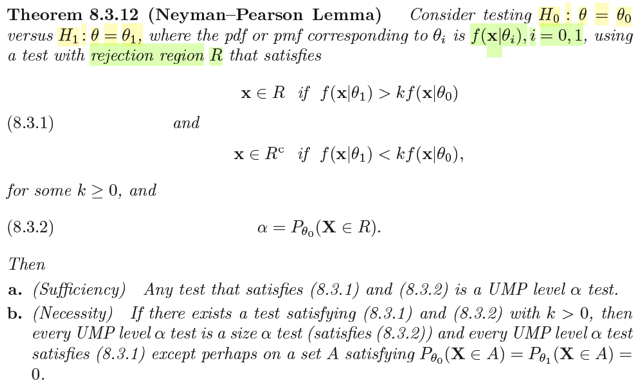</kbd>

> [!NOTE]
> Theorem cực quan trọng 
>
> Đại khái nói là xem xét test giữa hai giả thuyết H0: θ = θ0 vs  H1:
> θ = θ1. Dùng một test có rejection region R như vầy. Hiểu đại ý cái test này sẽ
> reject H0 nếu likelihood của θ1 lớn hơn likelihood của θ0 nhân với factor nào
> đó.
>
> và cho α = P_θ0(**X** ∈ R). Dừng lại chỗ này tí xíu, ta còn nhớ, hàm β(θ) được
> định nghĩa là hàm theo θ, define bởi xác suất reject H0: β(θ) = P_θ(**X** ∈ R)
> Để rồi theo định nghĩa của size α test, là test mà sup_θ∈Θ0 P_θ(**X** ∈ R) = α
> Vậy ở đây, với việc Θ0 chỉ có {θ0}, thì sup_θ∈Θ0 P_θ(X ∈ R) cũng chính là
> sup_θ∈{θ0} P_θ(**X** ∈ R) = P_θ0(**X** ∈ R).
>
> Nên cho α = P_θ0(**X** ∈ R), thì chính là nói test này là một size α test
>
> Vậy thì theorem này nói rằng: Điều kiện đủ để một test thỏa 8.3.1 và 8.3.2 sẽ
> đều là UMP level α test.
>
> Hiểu cái này thế nào? Đầu tiên như đã hiểu ở trên, thỏa 8.3.2 thì đây đương
> nhiên là một size α test. Thế còn thỏa 8.3.1, mình đã thấy rằng đây chính là nói
> về test dùng likelihood để ra quyết định. Thì thực ra có thể viết lại chút xíu để
> thấy cái test này có rule như sau:
>
> reject H0 nếu f(**x**|θ1)/f(**x**|θ0) > k, mà đây cũng chính là
> L(θ1|**x**)/L(θ0|**x**) > k ⇔ L(θ0|**x**)/L(θ1|**x**) < 1/k
>
> Nhớ lại định nghĩa của likelihood ratio test, có rule như sau:
>
> reject H0 nếu λ(**x**) = L(θ^0|**x**)/L(θ^|**x**) = sup_θ∈Θ0 L(θ|**x**) / sup_θ∈Θ1
> L(θ|**x**) ≤ c
>
> Thế thì ở đây không hoàn toàn chính xác là likelihood ratio, nhưng rất gần
> giống ở ý tưởng. Với LRT, việc reject H0 nếu λ(**x**) < c có ý nghĩa là khi quan
> sát thấy data **X** = **x**, thì mức độ hợp lí lớn nhất có được khi tìm kiếm θ từ
> Θ0 chỉ bằng phần nhỏ độ hợp lí lớn nhất khi tìm kiếm θ từ toàn bộ Θ, chứng tỏ
> Θ0 không đủ tin cậy, nên ta reject H0: θ ∈ Θ0.
>
> Còn ở đây, ta reject H0 khi độ hợp lí của θ0 (cũng là sup_θ∈Θ0 L(θ|**x**)) chỉ
> bằng một phần nhỏ của độ hợp lí của θ1 (cũng là sup_θ∈Θ0c L(θ|**x**)). Nói
> cách khác khi độ hợp lí của θ0 nhỏ hơn độ hợp lí của θ1 thì reject H0, thế thôi.
>
> Nhưng nếu suy nghĩ chút ta sẽ thấy thật ra là giống nhau:
>
> Cụ thể là trong trường hợp này, Θ = {θ0, θ1}. Nên sup_θ∈Θ L(θ|**x**) sẽ chỉ là
> L(θ0|**x**) hoặc L(θ1|**x**). ⇨ nếu dùng LRT, thì cái rule sẽ là:
>
> reject H0 khi λ(**x**) = L(θ0|**x**) / max(L(θ0|**x**), L(θ1|**x**) ≤ c
>
> Mà khi θ = θ0 thì λ(**x**) = 1, không thể ≤ c với c < 1.
>
> Nên điều kiện reject H0 chính là L(θ0|**x**) / L(θ1|**x**) ≤ c thì nếu coi c = 1/k
> thì đây ta sẽ thấy điều kiện 8.3.1 chính là likelihood ratio thôi.
>
> Còn điều kiện cần, nó nói là nếu test thỏa 8.3.1 và 8.3.2 với k > 0 thì mọi UMP
> level α test sẽ đều là size α test.
>
> Để hiểu cái này cần nhớ level α test là gì và size α test là gì. Nói ngắn gọn,
> level α test là cái test mà khi sup_θ∈Θ0 β(θ) ≤ α, còn size α test là test mà
> sup_θ∈Θ0 β(θ) = α. Và ý nghĩa của nó phản ánh trong chữ level (đẳng cấp) và
> kích thước (size). Lấy α = 0.1 đi. Thì level 0.1 test, là test có đẳng cấp 0.1 mà
> đẳng cấp, thì ám chỉ một tầng lớp. Tức là có nhiều, và đám test này đều có xác
> suất Type I Error sup_θ∈Θ0c β(θ) dưới 0.1. Và nói vậy thì giá trị này của chúng
> (sup_θ∈Θ0 β(θ)) có thể = 0.05, 0.01,...Thì nếu bằng 0.05, thì nó là một Size 0.
> 05 test. Nếu nó bằng 0.01 thì nó là một Size 0.01 test.
>
> Vậy cái thằng Size 0.1 test có thể thế thấy cũng là một Level 0.1 test, và nó là
> thằng TỆ nhất khi xét khía cạnh xác suất mắc lỗi loại 1 (vì xác suất cao nhất)
> ĐỂ Ý Ý NÀY TÍ NỮA QUAY LẠI.
>
> Nhìn lại 8.3.1, nó là cái rule (giúp quyết định reject/accept H0), dĩ nhiên bản
> thân một cái test cơ bản chỉ là cái rule mà thôi. Còn 8.3.2 nói về cái trần: Nếu
> một cái test thỏa 8.3.1, có nghĩa nó là size α test, có xác suất mắc Type I Error
> (trong trường hợp H0 cần được accept) cao nhất bằng đúng α. Và như vừa nói
> ở trên **NÓ LÀ CÁI TỆ NHẤT TRONG ĐÁM LEVEL α TEST** nếu xét khả năng
> mắc lỗi loại I.
>
> Vậy từ đây ta mới xem điều kiện cần nói gì?
>
> Ý thứ nhất nó nói: Nếu tồn tại một test thỏa 8.3.1, tức là có cái rule như vậy, và
> thỏa 8.3.2 tức là là một size α test. thì khi đó MỌI UMP LEVEL α TEST ĐỀU LÀ
> SIZE α TEST: Có nghĩa là sao?
>
> CHÍNH LÀ NÓI RẰNG: NẾU SO SÁNH ĐÁM LEVEL α TEST THEO TIÊU
> CHUẨN XÁC SUẤT MẮC TYPE II ERROR. THÌ **CÁI THẰNG TỐT NHẤT LẠI
> CHÍNH LÀ CÁI THẰNG TỆ NHẤT Ở TRÊN, THẰNG SIZE α TEST**. HAY
> CHƯA!
>
> Vì sao theorem phải nói về cái vụ existed. Là vì trong phần định nghĩa size /
> level α test, tác giả có nói, không phải lúc nào cũng tồn tại size α test.
>
> Thế còn ý sau, nói là, mọi UMP level α test đều có cùng cái rule 8.3.1. THÌ
> CHÍNH LÀ KHẲNG ĐỊNH RẰNG: **CÁI THẰNG SIZE α TEST TỆ NHẤT Ở
> KHÍA CẠNH  TYPE 1, TỐT NHẤT Ở KHÍA CẠNH TYPE II, LÀ ĐỘC NHẤT.**
>
> Hiểu nôm na cái theorem này thế này: Ta có một biên độ mạo hiểm cho sai sót
> loại I. Lấy ví dụ H0 vs H1 là khi người ta chào mời một đồng tiền cổ, H0: tiền
> giả, đừng mua. H1: tiền thật nên mua, không mua. Thì mình sẽ cho một biên
> độ rủi ro ra quyết định sai loại 1: Đồng xu là giả, đáng ra phải không mua mà lại
> đi mua (reject H0), cao nhất là 0.3. Thì cái test (phương pháp test xu) có khả
> năng mắc sai lầm mua nhầm cao nhất chính là cái Size 0.3 test, là cái tệ nhất
> theo tiêu chí này trong đám level 0.3 test. Mấy cái test khác, chắc cú hơn, thận
> trọng hơn, ví dụ như có xác suất mua đồ giả cao nhất chỉ là 0.1 chẳng hạn.
>
> Tuy nhiên, theorem này nói rằng, trong đám này, thì cái thằng Size 0.3 test lại
> chính là  thằng tốt nhất khi xét cái lỗi Type II: Đồ thật mà lại bỏ qua.
>
> Do đó, để tìm thằng tốt nhất toàn cục: Thì ta phải **mạo hiểm hết mức có thể
> trong biên độ rủi ro (loại I) cho phép**, để c**hấp nhận là thằng test dễ mua
> phải đồ giả nhất nhưng cũng là thằng ít bị miss đồ thật nhất.**

 

<kbd>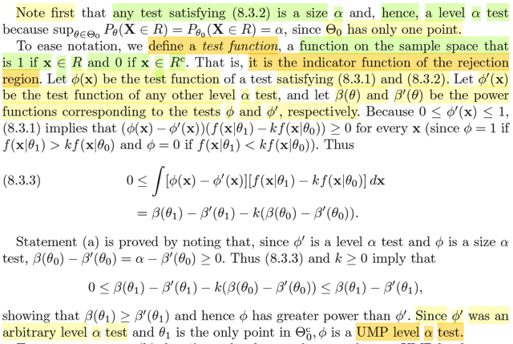</kbd>

> [!NOTE]
> Cùng tìm hiểu phần chứng minh, ý a):
>
> Đầu tiên, gs lưu ý ta thấy rằng bất kì cái test nào thỏa 8. 3.2 thì chính là
> **size α test**, cái này thì trong note trước mình đã tự thấy rồi, nói ngắn gọn
> là vì trong theorem này chỉ đang nói về hypothesis H0: θ = θ0, tức Θ0 chỉ là
> set có 1 elements: {θ0}. Mà theo định nghĩa của size α test, nó là test mà
> sup_θ∈Θ0 β(θ) = α, thì ở đây dĩ nhiên sup_θ∈Θ0 β(θ) chính là β(θ0), hay
> P_θ0(**X** ∈ R) (vì đây là định nghĩa của hàm power function β).
>
> Tiếp theo, tác giả đề nghị ta đặt một indicator function gọi là test function:
> mang giá trị bằng 1 khi **x** ∈ R và 0 khi **x** ∈ Rc. Nói nó là indicator
> function the rejection region hoàn toàn dễ hiểu. Nhớ lại khái niệm indicator
> function, mình đã gặp hồi học Stat110: Indicator function of even A, kí hiệu
> I_A, thì khi A xảy ra nó bằng 1, ngược lại nó bằng 0. Thì ở đây event A có
> thể xem như là event **x** ∈ R.
>
> Tiếp, đặt Φ(**x**) là test function của cái test thỏa 8.3.1 và 8.3.2. Và Φ'(x) là
> test function của bất kì level α test nào. Và cho β(θ), β'(θ) là power function
> tương ứng với test Φ và test Φ'.
>
> Thế thì vì hàm Φ', hay Φ đều chỉ có giá trị là 0 hoặc 1. Nên
>
> [Φ(**x**) - Φ'(**x**)][f(**x**|θ1] - kf(**x**|θ0)] ≥ 0 với mọi **x**. Vì sao nhỉ?
>
> Là vì đã nói Φ và Φ' đều là cái test thỏa 8.3.1, tức là nó đều có rule là: reject
> H0 nếu f(**x**|θ1) > kf(**x**|θ0) và accept H0 nếu f(**x**|θ1) < kf(**x**|θ0)
>
> Vậy xét hai trường hợp:
>
> i) f(**x**|θ1] > kf(**x**|θ0) → test Φ sẽ reject H0, **x**∈R → hàm indicator
> Φ(**x**) = I_(**x**∈R) = 1
>
> Lúc này Φ(**x**) - Φ'(**x**) = 1 - Φ'(**x**) ≥ 0 vì Φ'(**x**) cũng chỉ bằng 1 hoặc
> 0. Và f(**x**|θ1] > kf(**x**|θ0) ⇨ f(**x**|θ1] - kf(**x**|θ0) ≥ 0 ⇨ [Φ(**x**) - Φ'
> (**x**)][f(**x**|θ1] - kf(**x**|θ0)] ≥ 0
>
> ii) f(**x**|θ1] < kf(**x**|θ0) → test Φ sẽ accept H0, **x** ∈ Rc → hàm indicator
> Φ(**x**) = I_(**x**∈Rc) = 0.
>
> Lúc này Φ(**x**) - Φ'(**x**) = 0 - Φ'(**x**) ≤ 0. Và f(**x**|θ1] < kf(**x**|θ0) →
> f(x|θ1] - kf(x|θ0) < 0
>
> ⇨ [Φ(**x**) - Φ'(**x**)][f(**x**|θ1] - kf(**x**|θ0)] ≥ 0
>
> Tóm lại trong cả hai trường hợp thì [Φ(**x**) - Φ'(**x**)][f(**x**|θ1] -
> kf(**x**|θ0)] luôn ≥ 0
>
> Và do đó khi tích phân trên toàn miền R^n, nó cũng phải ≥ 0:
>
> ∫ [Φ(**x**) - Φ'(**x**)][f(**x**|θ1] - kf(**x**|θ0)] d**x** ≥ 0
>
> Triển khai ra:
>
> ⇔ ∫ [Φ(**x**)f(**x**|θ1] - Φ'(**x**)f(**x**|θ1] - Φ(**x**)kf(**x**|θ0) + Φ'
> (**x**)kf(**x**|θ0)]dx ≥ 0
>
> ⇔ ∫Φ(**x**)f(**x**|θ1d**x** - ∫Φ'(**x**)f(**x**|θ1d**x** - ∫Φ(**x**)kf(**x**|θ0)d**x**
> + ∫Φ' (**x**)kf(**x**|θ0)d**x** ≥ 0
>
> ⇔ ∫Φ(**x**)f(**x**|θ1d**x** - ∫Φ'(**x**)f(**x**|θ1d**x** - k[ ∫Φ(**x**)f(**x**|θ0)d**x**
> - ∫Φ' (**x**)f(**x**|θ0)d**x**] ≥ 0
>
> ====
>
> Xét ∫Φ(**x**)f(**x**|θ0)d**x**:
>
> Đây là tích phân trên toàn miền của **x**. Dĩ nhiên ta có thể tách làm hai:
>
> ∫_R Φ(**x**)f(**x**|θ0)**dx** + ∫_Rc Φ(**x**)f(**x**|θ0)**dx**
>
> = ∫_R 1 * f(**x**|θ0)d**x** + ∫_Rc 0* f(**x**|θ0)**dx** | khi **x** ∈ R → Φ(**x**) =
> 1, khi **x** ∈ Rc → Φ(**x**) = 0
>
> = ∫_R f(**x**|θ0)d**x**
>
> Và đây dĩ nhiên chính là P_θ0(**X** ∈ R), hay β(θ0)
>
> Mà β(θ) được định nghĩa là P_θ(**X** ∈ R), để ý nghĩa là θ ∈ Θ0 thì đây
> chính là xác suất mắc Type I error.
>
> Và ở đây, Θ0 = {θ0} ⇨ P_θ0(**X** ∈ R), = β(θ0) CHÍNH LÀ **XÁC SUẤT
> MẮC LỖI LOẠI I.**
>
> ====
>
> Còn ∫Φ(**x**)f(**x**|θ1)**dx**, tương tự
>
> = ∫_R 1 * f(**x**|θ1)**dx**+ ∫_Rc 0 * f(**x**|θ1)**dx**
>
> = ∫_R f(**x**|θ1)**dx**
>
> = P_θ1(**X** ∈ R) = β(θ1)
>
> Thế thì lại nó lại ý nghĩa của P_θ(**X** ∈ R), hay β(θ) chính là 1 - Xác suất
> mắc type II error khi θ ∈ Θ0c. Hay nói cách khác, nó chính là **xác suất đưa
> ra quyết định đúng: chọn H1 khi thật sự nên chọn H1**. Và trong bối cảnh
> này được gọi là power, mà ta gọi nó là năng lực bắt đúng bệnh.
>
> Vậy thì vì Θ0c trong trường hợp này là {θ1}, nên khi θ = θ1, thì chính là θ ∈
> Θ0c đã xảy ra, nên như trên vừa nói, P_θ1(X ∈ R), hay β(θ1) chính là
> power.
>
> ====
>
> Vậy quay lại đây, ta đang có:
>
> ∫Φ(**x**)f(**x**|θ1d**x** - ∫Φ'(**x**)f(**x**|θ1d**x** - k[ ∫Φ(**x**)f(**x**|θ0)d**x** -
> ∫Φ' (**x**)f(**x**|θ0)d**x**] ≥ 0
>
> ⇔ β(θ1) - β'(θ1) - k[β(θ0) - β'(θ0)] ≥ 0
>
> ⇔ β(θ1) - β'(θ1) ≥ k[β(θ0) - β'(θ0)]
>
> Rồi, lập luận như sau:
>
> Vì đã nói ở trên, ta đang xét test Φ là một size α test, nên β(θ0), như đã nói,
> chính là sup_θ∈Θ0 β(θ), và theo định nghĩa của size α test, cái này bằng α.
>
> Còn Φ' là một test bất kì thuộc loại level α test, mà theo định nghĩa,
> sup_θ∈Θ0 β'(θ) ≤ α. Nên ở đây sup_θ∈Θ0 β'(θ) = β'(θ0) ≤ α.
>
> Như vậy [β(θ0) - β'(θ0)] ≥ 0, cộng với k dương, ta có hạng tử k[β(θ0) - β'
> (θ0)] là một số không âm.
>
> Như vậy ta có β(θ1) - β'(θ1) ≥ k[β(θ0) - β'(θ0)] ≥ 0
>
> ⇨ β(θ1) - β'(θ1) ≥ 0
>
> ⇔ β(θ1) ≥ β'(θ1)
>
> Kết luận này cho thấy test Φ, một size α test, mà lại thỏa β(θ1) ≥ β'(θ1) với
> mọi β' là power của level α test bất kì.
>
> mà β(θ1) ≥ β'(θ1) thì cũng chính là β(θ) ≥ β'(θ) ∀ θ ∈ Θ0c (trong trường hợp
> này = {θ1})
>
> Vậy chiếu theo định nghĩa 8.3.11 về uniform most powerful UMP class C
> test, thì cho  ta kết luận: Φ chính là UMP level α test (vì class C ở đây là mọi
> level α test).
>
> Hay nói đầy đủ: size α test Φ chính là UMP level α test.
>
> Nói nôm na dân dã: Trong đám level α test, xét theo xác suất mắc lỗi loại 1,
> thì thằng Φ, một size α test, là thằng tệ nhất. Nhưng xét theo xác suất mắc
> lỗi loại 2, thì nó lại là thằng ít tệ nhất, nói cách khác, nó là thằng có năng lực
> cao nhất trong việc chọn đúng H1 khi θ ∈ Θ0c.

 

<kbd>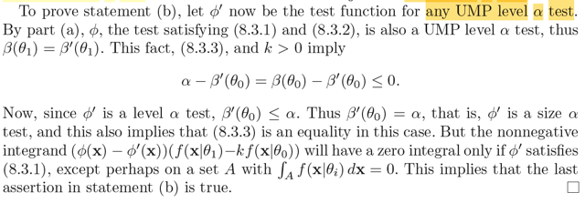</kbd>

> [!NOTE]
> Chứng minh ý b) điều kiện cần: Đại ý của ý này là, thằng UMP level α test
> phải là độc nhất. Có nghĩa nếu có cái test nào khác cũng tự xưng là UMP
> level test, thì nó cũng phải y chang cái Φ. Ví dụ giả sử ta gọi Φ' là cái test
> cũng là một UMP level test. Thì ta sẽ chứng minh rejection region của nó
> cũng y hệt của Φ, điều này đồng nghĩa indicator function Φ(**x**) = Φ'(**x**)
> với mọi **x**, có thể cho phép chúng khác nhau trên những giá trị x không
> thuộc support **X**, tức là những giá trị không thể xảy ra của random sample
> **X**Thế thì chứng minh như sau: Vì ta đang giả sử Φ' cũng là một UMP level α
> test, nên theo định nghĩa của UMP level α test, β'(θ) ≥ β''(θ) ∀ θ ∈ Θ0c với β''
> là β function của một test bất kì trong level α test class.
>
> Với việc Θ0c = {θ1} ⇨ cái trên ⇔ β'(θ) ≥ β''(θ) với θ = θ1 ⇔ β'(θ1) ≥ β'' (θ1)
>
> Trong đó có cả β(θ1), tức là β của Φ, tức là β'(θ1) ≥ β(θ1)
>
> Mà ta cũng có Φ đang là UMP level α test, nên β(θ1) ≥ β''(θ1) bao gồm cả β'
> (θ1): β(θ1) ≥ β'(θ1)
>
> Vậy chúng phải bằng nhau β(θ1) = β'(θ1).
>
> Rồi, hồi nãy ta đã có kết quả này:
>
> β(θ1) - β'(θ1) - k[β(θ0) - β'(θ0)] ≥ 0 với β' là power của level α test bất kì thì ở
> đây khi β' đặt cho UMP level α test Φ' thì bất đẳng thức này vẫn đúng.
>
> Với việc  β(θ1) = β'(θ1) bất đẳng thức này trở thành:
>
> - k[β(θ0) - β'(θ0)] ≥ 0
>
> ⇔ [β(θ0) - β'(θ0)] ≤ 0
>
> ⇔ β(θ0) ≤ β'(θ0)
>
> Và β(θ0) như đã nói nãy giờ, nó là sup_θ∈Θ0={θ0} β(θ) = α, nên ta có:
>
> ⇔ α ≤ β'(θ0) (1)
>
> Tới đây nhìn lại lại việc ta đang giả sử Φ' cũng là một UMP level α test
>
> thì trước hết nó là một level α test
>
> ⇨ sup_θ∈Θ0 β'(θ) (= sup_θ∈{θ0} β'(θ) = β'(θ0)) ≤ α
>
> Vậy β'(θ0)) ≤ α (2)
>
> từ (1) và (2) ⇨ β'(θ0)) = α giúp kết luận:
>
> Φ' cũng phải là một size α test.
>
> Và β'(θ0)) = β(θ0))
>
> cũng như là cái inequality β(θ1) - β'(θ1) - k[β(θ0) - β'(θ0)] ≥ 0
>
> trở thành 0 = 0 tức là vế trái, β(θ1) - β'(θ1) - k[β(θ0) - β'(θ0)], = 0
>
> mà vế trái ta nhớ có xuất thân là ∫ [Φ(x) - Φ'(x)][f(x|θ1] - kf(x|θ0)] dx
>
> Nên ∫ [Φ(**x**) - Φ'(**x**)][f(**x**|θ1] - kf(**x**|θ0)] dx = 0
>
> Mà [Φ(**x**) - Φ'(**x**)][f(**x**|θ1] - kf(**x**|θ0)]  ≥ 0
>
> nên cái tích phân bằng 0 suy ra [Φ(**x**) - Φ'(**x**)][f(**x**|θ1] - kf(**x**|θ0)] = 0
>
> ⇔ Φ(**x**) = Φ'(**x**) hoặc f(**x**|θ1] = kf(**x**|θ0)
>
> Vậy Φ(**x**) = Φ'(**x**) với mọi **x**
>
> hoặc có thể khác nhau tại những **x** thỏa **x** ∈ {**x**: f(**x**|θ1) =
> kf(**x**|θ0)}
>
> Mà cái tập này thực chất là gì: nó là tập các điểm **x** mà tại đó pdf f(**x**|θ1)
> = kf(**x**|θ0), và trong trường hợp đang chứng minh với hàm liên tục thì tập
> này có xác suất = 0 (là tập A nói đến trong sách). Do đó, kết luận là Φ(x) = Φ'
> (x) tại mọi x trừ x thuộc tập A là tập có xác suất bằng 0. Thì theo lí thuyết toán
> học, điều này coi như hai hàm Φ và Φ' là một

 

<kbd>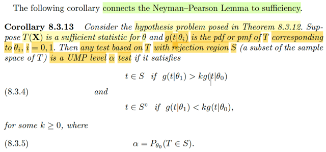</kbd>

🔗 **Related:** [8.3 METHODS OF EVALUATING TEST](83_methods_of_evaluating_test.md#node-716)

> [!NOTE]
> Hiểu về bổ đề này đại ý như sau, nó kết nối bổ đề Neyman-Pearson với
> sufficiency. Xét bài toán kiểm định giả thuyết như ở theorem trước, tức là ta
> kiểm tra giữa hai giả thuyết đơn giản H0: θ ∈ Θ0 = {θ0} vs H1: θ ∈ Θ0c  =
> {θ1}.
>
> Và T(**X**) là sufficient statistic của θ, và g(t|θi) là pdf/pmf của T.
>
> Bổ đề này nói rằng mọi test dựa vào T với rejection region S sẽ đều là
> UMP level α test, nếu nó thỏa mãn:
>
> t ∈ S nếu g(t|θ1) > kg(t|θ0) và t ∈ Sc nếu g(t|θ1) < kg(t|θ0)
>
> và α = P_θ0(T ∈ S)
>
> Thế thì mình hiểu test dựa vào T là sao?
>
> Mình hiểu thế này: Như đã biết, test thực chất chỉ là một cái rule, và cái
> rule này dựa vào giá trị có được từ việc áp một một hàm số lên giá trị của
> random sample **X**, rồi dùng cái tiêu chí nào đó, để đưa ra quyết định, ví
> dụ như so với một ngưỡng nào đó. Thì apply hàm số lên random sample
> cho ta một statistic, đó chính là test statistic.Và khi đã define ra cái rule, thì
> nó sẽ chia sample space của random sample thành hai phần: Rejection
> region R và complement của nó  Rc. Trong đó R = {x: test statistic khiến H0
> bị reject}.
>
> Vậy thì ở đây, chỉ đơn giản là cái test statistic đó là một sufficient statistic T
> thôi. và tương tự như test rule sẽ chia sample space ra thành R và Rc, thì
> nó cũng chia sample space của T thành S và Sc, S là tập những giá trị t =
> T(**x**) của T, khiến cho theo test rule thì H0 bị reject.
>
> Còn nhớ theorem vừa rồi, nó nói rằng, nếu một test thỏa hai điều kiện: có
> rule tuân theo 8.3.1 và thỏa 8.3.2 = là một size α test thì nó sẽ chính là một
> UMP level α test, và là duy nhất.

 

<kbd>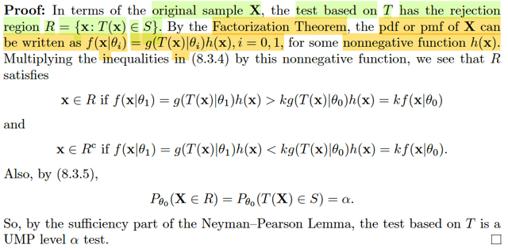</kbd>

> [!NOTE]
> Chứng minh đại khái là như vầy: Mình sẽ tìm cách cho thấy test thỏa điều
> kiện của bổ đề này nêu lên cũng sẽ thỏa điều kiện 8.3.1 và 8.3.2, để rồi
> theo bổ đề Neiman-Pearson, cái test này đích thị là một UMP α test.
>
> Thế thì test này có rule là:
>
> reject H0, cũng là có rejection region S chứa t khi g(t|θ1) > kg(t|θ0)
>
> và accept H0, cũng là region region S không chứa t khi g(t|θ1) < kg(t|θ0)
>
> trong đó như đã nói, g là pdf/pmf của sufficient statistic T.
>
> Mà trong những chương trước, ta đã biết một theorem gọi là Factorization
> Theorem, nói đại ý là nếu chỉ ra một statistic T có tính chất là pdf của **X**
> có thể được factor thành g(T(**x**)|θ)h(**x**), tức là tích của một hàm có
> phụ thuộc θ nhưng  chỉ phụ thuộc **x** thông qua T(**x**) và một hàm không
> âm và không phụ thuộc θ thì khi đó T(**X**) chính là một sufficient statistic
> (điều kiện cần và đủ)
>
> Như vậy, ở đây vì T là sufficient statistic, nên kiểu gì cũng chỉ có thể factor
> f(**x**|θ) thành g(t|θ)h(**x**), tức là tồn tại hàm h(**x**) để có cái này
>
> Vì nó không âm, nên ta có thể nhân h(**x**) vào hai vế của hai cái điều kiện
> (a1) (a2) để có  cái rule tương đương:
>
> reject H0, t ∈ S khi g(t|θ1)h(**x**) > kg(t|θ0)h(**x**) ⇔ f(**x**|θ1) > kf(**x**|θ0)
>
> và accept H0, t ∈ Sc khi g(t|θ1)h(**x**) < kg(t|θ0)h(**x**) ⇔ f(**x**|θ1) <
> kf(**x**|θ0)
>
> thì đây cũng chính là 8.3.1 vì t ∈ S thì cũng là X ∈ R thôi, đều là reject H0
>
> Tiếp, điều kiện của test này (theo T) cũng có:
>
> α = P_θ0(T ∈ S)
>
> Mà P_θ0(T ∈ S) cũng bằng P_θ0(**X** ∈ R) vì đã nói trên t ∈ S thì cũng là x ∈ R
>
> Nên ta cũng có P_θ0(**X** ∈ R) = α  → Đây là 8.3.2
>
> Vậy kết luận test thỏa Neyman-Pearson lemma ⇨ Thỏa điều kiện để nó là
> một unique UMP level α

 

<kbd>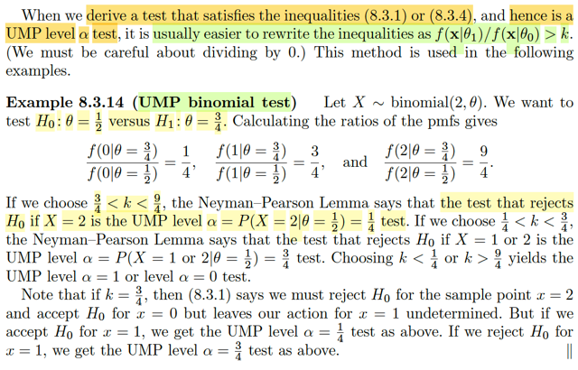</kbd>

> [!NOTE]
> Qua ví dụ này, UMP binomial test. Cho X ~ binomial(2, θ) và ta muốn test giữa
> hai giả thuyết H0: θ = 1/2 vs H1: θ = 3/4.
>
> Có lẽ cần recall lại chút xíu về bổ đề Neyman-Pearson. Nó nói rằng trong bài
> toán hypo testing giữa hai simple hypothesis: H0: θ ∈ Θ0 ={θ0} và H1: θ ∈ Θ0c
> = {θ1}. Nếu ta xét các test có rule như sau:
>
> reject H0 nếu kf(**x**|θ0) < f(**x**|θ1) và accept H0 nếu kf(**x**|θ0) > f(**x**|θ1)
>
> và α = P_θ0(**X** ∈ R)
>
> thì nó chính là UMP level α test độc nhất.
>
> Vậy thì, mình nên hiểu rằng, thực chất cái bổ đề này đưa ra nhận định về rằng
> khi nào thì ta có một UMP size α test.
>
> Vậy thì ở đây. θ0 = 1/2, θ1 = 3/4.
>
> Xem thử f(**x**|θ) là gì:
>
> Còn nhớ công thức pmf của binomial (n,p): f(k|n,p) = (n choose k) p^k
> (1-p)^(n-k)
>
> ⇨ pdf của binomial(2, θ): f(x|θ) = (2 choose x) θ^x (1-θ)^(2-x)
>
> X ~ binomial(2, θ) thì range of X = {0,1,2}
>
> f(0|θ1)/f(0|θ0) = (2 choose 0) θ1^0 (1-θ1)^(2-0) / (2 choose 0) θ0^0 (1-θ0)^(2-0)
>
> = 1 * 1 * (1-θ1)^2 /  1 * 1 * (1-θ0)^2 = (1-θ1) / (1-θ0)
>
> = (1-3/4)^2 / (1-1/2)^2 =  (1/4)^2 / (1/2)^2 = **1/4**
>
> f(1|θ1)/f(1|θ0) = (2 choose 1) θ1^1 (1-θ1)^(2-1) / (2 choose 1) θ0^1 (1-θ0)^(2-1)
>
> = (θ1/θ0) (1-θ1)/(1-θ0) = (3/4 / 1/2) (1 - 3/4) / (1 - 1/2) = (3/2) (1/4) / (1/2) =
> (3/2)(1/2) = **3/4**
>
> f(2|θ1)/f(2|θ0) = (2 choose 2) θ1^2 (1-θ1)^(2-2) / (2 choose 2) θ0^2 (1-θ0)^(2-2)
>
> = (θ1/θ0)^2 = (3/4 / 1/2)^2 = (3/2)^2 = **9/4**
>
> ====
>
> Rồi thế thì,
>
> Cái ý thứ nhất trong bổ đề thực chất là define cái test rule, cũng chính là tạo ra
> cách chia sample space thành R và Rc
>
> reject kf0(x|θ0) < f(x|θ1) for some k > 0 ⇔ k < f(x|θ1) / f(x|θ0)
>
> Mà với x = 0, tỉ số này là **1/4**, x = 1, là **3/4** và x = 2 là **9/4**
>
> Vậy thì với các giá trị k khác nhau, ta sẽ tạo ra các ngưỡng / các cách chia R,
> Rc khác nhau:
>
> i) Nếu **k < 1/4**
>
> ⇨ k < f(x|θ1) / f(x|θ0) **VỚI MỌI x** = 0,1,2
>
> ⇨ test dùng rule {reject H0 khi k < f(x|θ1) / f(x|θ0)} sẽ reject H0 VỚI MỌI x = 0,
> 1,2
>
> CŨNG CHÍNH LÀ X ∈ R ∀x=0,1,2
>
> CŨNG CHÍNH LÀ R = SUPPORT X
>
> Khi đó, P_θ0(X ∈ R) DĨ NHIÊN LÀ 1
>
> Kết luận nếu k < 1/4 thì cái test có rule:
>
> reject H0 nếu k < f(x|θ1) / f(x|θ0) ∀x=1,2,3,
>
> HOẶC NÓI ĐƠN GIẢN HƠN LÀ
>
> CÁI TEST MÀ REJECT H0 VỚI MỌI X,
>
> HAY
>
> CÁI TEST LUÔN REJECT H0
>
> sẽ là **UMP LEVEL 1 test.**
>
> Và có thể thấy, nếu cái test có rule như vậy thì khi H0 đáng ra phải được
> accept (θ ∈ Θ0) thì cái test này chắc chắn sẽ mắc lỗi loại I, hay, xác suất mắc
> lỗi loại I là 100%. Thì nếu soi chiếu với định nghĩa của size α test, là test mà
> sup_θ∈Θ0 P_θ(X ∈ R) = α thì ta sẽ thấy khớp.
>
> ii) Nếu 1/4 < k < 3/4:
>
> ⇨ k < f(x|θ1) / f(x|θ0) với mọi x = 1,2
>
> ⇨ test reject H0 khi k < f(x|θ1) / f(x|θ0) sẽ là test reject H0 KHI X = 1,2
>
> CŨNG LÀ X ∈ R ∀x=1,2, hay R = {1, 2}
>
> P_θ0(X ∈ R) = P_θ0(X = 1 or X = 2) = P_θ0(X = 1) + P_θ0(X = 2)
>
> = (2 choose 1) θ0^1 (1- θ0)^(2-1) + (2 choose 2) θ0^2 (1-θ0)^(2-2)
>
> = 2 θ0 (1-θ0) + θ0^2
>
> = 2 (1/2) (1-1/2) + (1/2)^2
>
> = 1/2 + 1/4 = 3/4
>
> Kết luận, nếu 1/4 < k < 3/4 thì cái test có rule reject H0 nếu x = 1,2 sẽ là 
> **UMP level 3/4 test.**
>
>
>
> iii) nếu 3/4 < k < 9/4 thì k < f(x|θ1)/f(x|θ0) sẽ xảy ra khi x = 2 ⇔ X ∈ R khi X = 2
>
> P_θ0(X ∈ R) = P_θ0(X = 2) = (2 choose 2) θ0^2 (1- θ0)^(2-2) = 1/4.
>
> Kết luận, nếu 3/4 < k < 9/4 thì test có rule là reject H0 khi X = 2 sẽ là UMP level
> 1/4 test
>
> iv) nếu 9/4 < k thì k < f(x|θ1)/f(x|θ0) sẽ không xảy ra với x nào ⇨ X ∈ R = rỗng
>
> hay nói cách khác, test này luôn accept H0.
>
> ⇨ P_θ0(X ∈ R) = 0
>
> Kết luận: nếu 9/4 < k thì test reject H0 "với không có x nào" / cũng là test luôn
> accept H0 ∀x sẽ là UMP level 0 test.
>
> Và đây là loại test mà khi H0 nên được accept, thì nó chắc chắn sẽ không mắc
> lỗi loại I, hay xác suất mắc lỗi loại I là = 0
>
> ====
>
> Nếu k = 3/4 thì k < f(x|θ1) / f(x|θ0) với x = 2, cũng là R = {2}
>
> P_θ0(X ∈ R) = P_θ0(X = 2) = 1/4
>
> Tức là k = 3/4 thì test reject H0 khi X = 2 (vì tại X = 2 thì k < tỉ lệ f(x|θ1)/f(x|θ0) =
> 9/4
>
> Và test cũng sẽ accept H0 tại X = 0 (vì tại X = 0, tỉ lệ này = 1/4 < 3/4)
>
> Nhưng nếu X = 1 thì ta sẽ **ko biết phải reject hay accept H0** vì tại đó tỉ lệ = 3/4
> không lớn hơn cũng không bé hơn k.
>
> Nhưng **nếu ta accept H0 khi X = 1**, thì lúc này R = {2} ⇨ ta **vẫn có UMP level
> 1/4 test**
> Nếu r**eject H0 khi X = 1**, thì lúc này R = {1,2} ⇨**ta sẽ có UMP level 3/4 test.**

 

<kbd>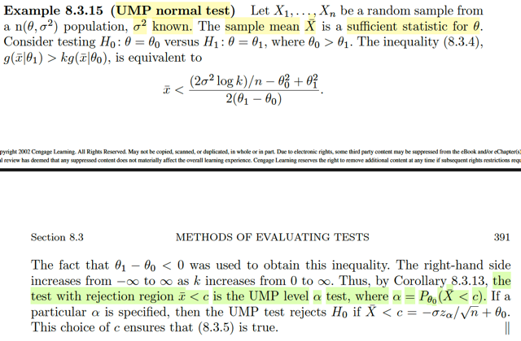</kbd>

🔗 **Related:** [3.5 LOCATION AND SCALE FAMILIES](35_location_and_scale_families.md#node-202)

🔗 **Related:** [8.3 METHODS OF EVALUATING TEST](83_methods_of_evaluating_test.md#node-713)

> [!NOTE]
> Qua ví dụ này, X1,...Xn là random sample ~ n(θ, σ^2) với σ^2 đã biết.
>
> Sample mean Xbar là sufficient statist cho θ (cái này những chapter trước đã biết
> rồi)
>
> Ta mới xét bài toán kiểm tra gỉa thuyết giữa H0: θ = θ0, vs H1: θ = θ1 với θ0 > θ1.
>
> Dừng lại chút ôn lại bổ đề 8.3.13, đại ý nó nói rằng: cái test có rule như sau:
> reject H0 nếu g(t|θ1) > kg(t|θ0) và accept H0 nếu ngược lại. Và có α = P_θ0(T ∈
> S) thì chính là một UMP level α test.
>
> Ở đây ta xem thử g(t|θ1)/g(t|θ0) > k sẽ trông như thế nào:
>
> g(t|θ) là pdf của T, ở đây là T(X) = Xbar.
>
> Ở đây Xbar, như đã biết, có distribution là normal(μ, σ^2/n), hay  normal(θ, σ^2/n)
>
> ⇨ g(t|θ) = 1/√(2πσ^2/n) exp[-(t-θ)^2/(2σ^2/n)]
>
> = √n/√(2πσ^2) exp[-n(t-θ)^2/2σ^2]
>
> ⇨ g(t|θ1) / g(t|θ0)
>
> = √n/√(2πσ^2) exp[-n(t-θ1)^2/2σ^2] / √n/√(2πσ^2) exp[-n(t-θ0)^2/2σ^2]
>
> = exp[-n(t-θ1)^2/2σ^2] / exp[-n(t-θ0)^2/2σ^2]
>
> = exp[-n(t-θ1)^2/2σ^2 + n(t-θ0)^2/2σ^2]
>
> = exp[-n((t-θ1)^2 - (t-θ0)^2) / 2σ^2]
>
> ⇨ k < g(t|θ1) / g(t|θ0)
>
> ⇔ k < exp[-n[(t-θ1)^2 - (t-θ0)^2] / 2σ^2]
>
> ⇔ log k < -n((t-θ1)^2 - (t-θ0)^2) / 2σ^2
>
> ⇔ 2σ^2 log k < -n((t-θ1)^2 - (t-θ0)^2)
>
> ⇔ 2σ^2 (log k) / n < -((t-θ1)^2 - (t-θ0)^2)
>
> ⇔ 2σ^2 (log k) / n < -(t^2+θ1^2-2θ1t -(t^2+θ0^2-2θ0t))
>
> ⇔ 2σ^2 (log k) / n < -(t^2+θ1^2-2θ1t -t^2-θ0^2+2θ0t)
>
> ⇔ 2σ^2 (log k) / n < -t^2-θ1^2+2θ1t +t^2+θ0^2-2θ0t
>
> ⇔ 2σ^2 (log k) / n < -θ1^2+2θ1t+θ0^2-2θ0t
>
> ⇔ 2σ^2 (log k) / n < θ0^2-θ1^2 + 2θ1t - 2θ0t
>
> ⇔ 2σ^2 (log k) / n < θ0^2-θ1^2 + 2t(θ1 - θ0)
>
> ⇔ 2σ^2 (log k) / n  - θ0^2 + θ1^2 < 2t(θ1 - θ0)
>
> Vì θ0 > θ1 ⇨ θ1 - θ0 < 0
>
> .. ⇔ [2σ^2 (log k) / n  - θ0^2 + θ1^2] / 2(θ1 - θ0) > t
>
> Hay xbar < [2σ^2 (log k) / n  - θ0^2 + θ1^2] / 2(θ1 - θ0) như sách viết.
>
> Rồi. Thế thì như vậy là sao?
>
> Trả lời: Như vậy có nghĩa là, cái rule: reject H0 khi kg(t|θ0) < g(t|θ1) hay cũng là
> reject H0 khi k < g(t|θ1) / g(t|θ0) trở thành:
>
> reject H0 khi xbar < [2σ^2 (log k) / n  - θ0^2 + θ1^2] / 2(θ1 - θ0), đặt là c(k) là
> constant có giá trị khác nhay khi k thay đổi
>
> Và cũng chính là rejection region S = (-inf, c)
>
> Với k chạy từ 0 → inf thì
>
> ⇨ log k chạy từ -inf → inf
>
> ⇨ [2σ^2 (log k) / n  - θ0^2 + θ1^2] chạy từ -inf → inf
>
> ⇨ c = [2σ^2 (log k) / n  - θ0^2 + θ1^2] / 2(θ1 - θ0) chạy từ inf → -inf
>
> Vậy thì Hệ quả 8.3.13 nói cho ta biết rằng
>
> cái test reject H0 khi k < g(t|θ1) / g(t|θ0) và accept H1 khi k > g(t|θ1) / g(t|θ0)
>
> đồng thời với α = P_θ0(T ∈ S) chính là UMP level α test.
>
> Thì áp dụng vào đây, cái test mà có rule là reject H0 khi Xbar < c và đạt α =
> P_θ0(Xbar < c) cũng sẽ là một UMP level α test.
>
> Để rồi nếu như ta có α cho trước. Thì ta sẽ tính ra c:
>
> α = P_θ0(T < c)
>
> hay P_θ0(T < c) = α với T ~ n(θ0, σ^2/n)
>
> Đến đây lặp lại lập luận:
>
> T < c ⇔ T - θ0 < c - θ0 ⇔ (T - θ0)/(σ/√n) < (c - θ0)/(σ/√n)
>
> ⇨ P_θ0(T < c) = P_θ0(Z < (c - θ0)/(σ/√n)) với Z = (T - θ0)/(σ/√n)
>
> (vì bản chất P_θ0(T < c) chỉ là P({s∈Ω: T(s) < c})
>
> Mà ta có T < c ⇔ Z = (T - θ0)/(σ/√n) < (c - θ0)/(σ/√n)
>
> ⇨ T(s) < c ⇔ Z(s) = (T(s) - θ0)/(σ/√n) < (c - θ0)/(σ/√n)
>
> ⇨  P({s∈Ω: T(s) < c}) =  P({s∈Ω: Z(s) = (T(s) - θ0)/(σ/√n) < (c - θ0)/(σ/√n)})
>
> = P(Z < (c - θ0)/(σ/√n))
>
> Rồi, mà T là một n(θ, σ^2/n), và và normal là một location scale family có location
> chính là mean, và scale chính là standard deviation.
>
> Nên theo một theorem đã học ta biết rằng (T - location) / scale = (T - θ)/(σ/√n)
> phải là một random variable thuộc standard member của family. Tức là,
> distribution của Z = (T - θ)/(σ/√n) chính là  thành viên của family ứng với location
> 0, scale 1. Và như đã nói, với normal thì location = mean, scale = std nên ta kết
> luận Z ~ n(0,1)
>
> Và với Z ~ n(0,1) thì
>
> P(Z < (c - θ0)/(σ/√n)) = Φ((c - θ0)/(σ/√n))
>
> Vậy phương trình cần giải là
>
> P(Z < (c - θ0)/(σ/√n)) = α
>
> ⇔ (c - θ0)/(σ/√n) = -z_α
>
> (Đã học cái vụ này z_α là con số mà P(Z > z_α) = α, nói dễ hiểu z_α là con số mà
> phần diện tích bên phải = α
>
> từ đó nhờ tính đối xứng -z_α là con số mà P(Z < -z_α), tức phần diện tích bên trái
> = α)
>
> ⇔ c - θ0 = -z_α(σ/√n)
>
> ⇔ c = -z_α(σ/√n) + θ0. XONG!
>
> Và có nghĩa là, cái test UMP level α test sẽ là cái mà có rule là reject H0 nếu xbar
> < c  với c = -z_α(σ/√n) + θ0

 

<kbd>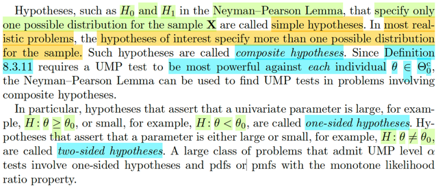</kbd>

> [!NOTE]
> Đoạn này đại ý nói là cái bổ đề Neyman-Pearson chỉ nói về các
> hypothesis đơn giản. Là sao, là vì ta nhớ nó xét bối cảnh ta có H0: θ = θ0
> vs H1: θ = θ1 và hai hypothesis này, gọi là đơn giản, vì subset Θ0 và Θ0c
> chỉ là tập có một phần tử.
>
> Nhưng thực tế, ta sẽ gặp hypothesis mà state / tuyên bố rằng θ ∈ subset
> có vô số phần tử. Ví dụ H: θ ≥ θ0, hay H: θ < θ0 (H ko ghi 0 hay 1, ám chỉ
> là giả thuyết chung chung). Và đây gọi là **ONE-SIZED HYPOTHESIS.**
>
> Hoặc là H: θ ≠ θ0, gọi là **TWO-SIZED HYPOTHESIS**.
>
> Thế thì. Những hypothesis phức tạp này gọi là **COMPOSITE** hypothesis.
>
> Rồi. Nhớ lại định nghĩa của Uniformly Most Powerful level α test, hay nói
> khái quát hơn là Unform Most Powerful class C test (nôm na là thằng
> mạnh nhất của đám test thuộc lớp C) được định nghĩa là thằng có power
> function β(θ) lớn  hơn mọi powerful β'(θ) của mọi thằng khác trong class
> với mọi θ ∈ Θ0c.
>
> Nghĩa là, nếu lấy một thằng bất kì trong class C, và gọi power function của
> nó là β'(θ) thì nếu 1 thằng trong class C có β(θ) ≥ β(θ) với mọi θ ∈ Θ0c thì
> nó chính là thằng mạnh nhất.
>
> Như vậy, đại ý ở đây nói là, với simple hypothesis, Θ0c như đã nói chỉ
> chứa có mỗi một cái à.
>
> Nên với case này, để chứ minh một test là trùm chỉ việc chứng minh β của
> nó lớn hơn mấy thằng khác tại phần tử θ duy nhất của Θ0c
>
> Nhưng qua case phức tạp, thì ta phải chứng minh nó lớn hơn β của mấy
> thằng khác **TẠI MỌI θ TRONG Θ0c**. ví dụ, với β(θ) ≥ β'(θ) ∀ θ > θ0
>
> Do đó, ta sẽ cần một công cụ mới, cho phép deal với bài toán này.

 

<kbd>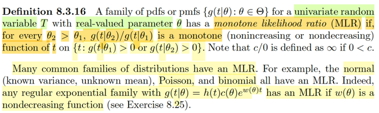</kbd>

> [!NOTE]
> Một định nghĩa quan trọng chuẩn bị mở đường cho theorem tiếp theo.
>
> Đại khái là định nghiã về một tính chất được gọi là tính đơn điệu của 
> tỉ số likelihood. (monotone likelihood ratio)
>
> Đó là: Một HỌ CÁC PDF/PMF {g(t|θ): θ ∈ Θ} của một univariate random
> variable T với tham số θ giá trị thực, SẼ ĐƯỢC GỌI LÀ MONOTONE
> LIKELIHOOD RATION nếu như với mọi θ2 > θ1 thì tỉ số giữa:
>
> g(t|θ2) / g(t|θ1), là một hàm monotone của t trong tập {t: g(t|θ1) > 0 or
> g(t|θ2) > 0}
>
> Gs nói thêm rằng các họ pdf phổ biến như normal, Poison, Binomial hoặc
> nói chung là họ expontial có dạng khái quát g(t|θ) = h(t)c(θ)exp(w(θ)t) với
> w(θ) là hàm non-decreasing thì đều là có tính chất MLR này
>
> Nói chung, định nghĩa thì phải nhớ thôi. Không có gì để nói nhiều

 

<kbd>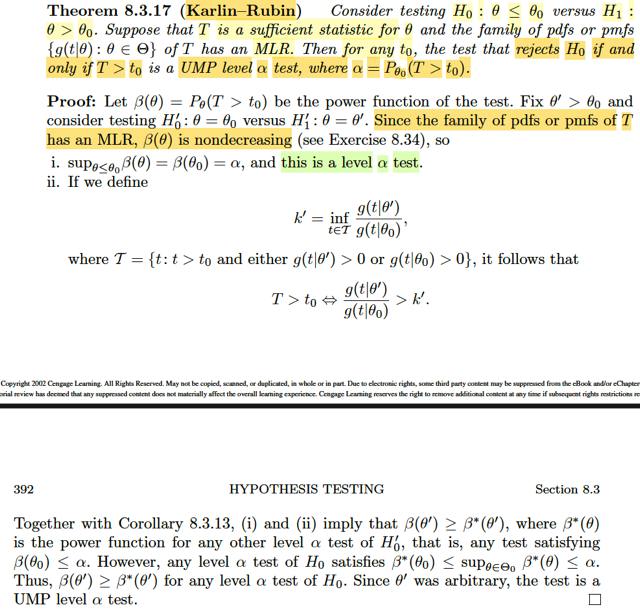</kbd>

🔗 **Related:** [9.2 METHODS OF FINDING INTERVAL ESTIMATORS](92_methods_of_finding_interval_estimators.md#node-775)

> [!NOTE]
> Hiểu phần chứng minh ngắn gọn như sau:
>
> 1) N-P nói: nếu để test: H0: θ = θ0 vs H1: θ = θ1 (θ0 < θ1), mà ta dùng test có
> rule: reject H0 khi f(**x**|θ1)/f(**x**|θ0) > k thì nó chính là UMP level α test với α là
> size của cái test đó (ump of it's size)
>
> 2) Nếu có sufficient statistic T, mà pdf/pmf family {g(t|θ)} của nó MLR
>
> khi đó, cái test rule f(**x**|θ1)/f(**x**|θ0) > k
>
> theo factorization theorem (do T sufficient), sẽ tương đương
>
> g(t(**x**)|θ1)h(**x**) / g(t(x)|θ0)h(**x**) > k
>
> ⇔ g(t|θ1) / g(t|θ0) > k
>
> Và đây chính là G(t) = L(θ1|t)/L(θ0|t), là hàm likelihood ratio, và chính là cái hàm
> mà giả thiết nói rằng NÓ MONOTONE (khi nói pdf/pmf family của T {g(t|θ): θ ∈ Θ}
> có tính monotone likelihood ratio MLR
>
> À vậy thì nó monotone thì dĩ nhiên G(t) > k sẽ tương đương t > cái gì đó. (đặt là
> t0)
>
> vậy:
>
> ..⇔ t > t0.
>
> Bởi vậy test rule f(**x**|θ1)/f(**x**|θ0) > k  tương đương T > t0
>
> 3) Rồi, như vậy là, vì N-P nói với bài toán test H0: θ = θ0 vs H1: θ = θ1, thì cái test
> có rule reject f(**x**|θ1)/f(**x**|θ0) > k là trùm (UMP of it's size), mà cái rule này y
> hệt cái rule T > t0 hay nói cách khác cái test có rule reject H0 nếu T > t0 cũng là
> cái test y hệt. Vậy ta có thể nói trong bài toán này test reject H0 khi T > t0 là ump
> of it's size.
>
> (of it size có nghĩa là size của nó bao nhiêu thì nó là UMP trong đám test có level
> = cái size đó, dễ thấy size của nó là α = P_θ0(T > t0))
>
> 4) Vấn đề là:
>
> Kết luận test có rule: reject H0 khi T > con số t0 nào đó là ump of it's size của  bài
> toán testing H0: θ = θ0 vs H1: θ = θ1, lại KHÔNG HỀ PHỤ THUỘC θ1, và cả θ0
>
> Điều này có nghĩa là dù θ1 BẰNG BAO NHIÊU, thì cái test có rule này luôn là
> UMP of it's size.
>
> và lôi định nghĩa của ump ra: UMP test of class C là test có β(θ) ≥ β'(θ) ∀ θ ∈ Θ0c
>
> thì ở đây có nghĩa là:
>
> dù θ1 bằng bao nhiêu, thì β(θ1) của test T's sẽ luôn ≥ β'(θ1) của các test bất kì
> nào khác trong class là các test level α = P_θ0(T > t0)
>
> Do đó, bây giờ ta xét bài toán test H0: θ = θ0 vs H1: θ0 < θ thì:
>
> Trong đoạn chứng minh trên, sau khi ta chứng minh voi mọi θ1 > θ0, thì test T đều
> là UMP level α của bài toán H0: θ = θ0 vs H1: θ = θ1, thì tức là nó là cái có power
> mạnh nhất trong tập các test có P_θ0(reject H0) ≤ α.
>
> Và tập này là tập cố định vì nó  ko phụ thuộc θ1, đặt là tập X Do đó nếu ta xét bài
> toán H0: θ = θ0 vs H1: θ0 < θ thì  khi level level α test của bài toán này, nó cũng
> chính là tập X. Mà trong các test thuộc tập  X, power của test T luôn mạnh hơn
> power của chúng tại mọi θ > θ0. Cho nên mới đủ  cơ sở để dựa theo định nghĩa
> mà nói test T là UMP level α của bài toán này.
>
> 5) Giờ qua xét bài toán test H0: θ ≤ θ0 vs H1: θ0 < θ.
>
> Thì nếu xét đám level α CỦA BÀI TOÁN NÀY, thì (α là số cố định P_θ0(T > t0)
>
> Câu hỏi đầu tiên là test T có thuộc đám level α test của bài toán này không?
>
> Câu hỏi thứ hai là test T có β mạnh hơn β của các test trong đám này tại mọi điểm
> θ  > θ0 không.
>
> Trả lời câu đầu: Ta đã đặt α là P_θ0(T > t0). Nhưng để nói test T thuộc tập level α
> test của bài toán này thì phải chứng minh sup_θ≤θ0 P_θ(test T reject H0) ≤ α
>
> ⇔ sup_θ≤θ0 P_θ(T > t0) ≤ α
>
> ĐẾN ĐÂY, PHẢI DÙNG TÍNH MLR LẦN THỨ HAI: Đại khái là có thể chứng minh
> nếu có tính MLR thì cái hàm P_θ(T > t0), tức β(θ) cũng là monotone increasing
>
> Từ đó sup_θ≤θ0 P_θ(T > t0) = P_θ0(T > t0).
>
> Và với việc α là con số mà ta đặt cho P_θ0(T > t0)
>
> thì dĩ nhiên ta có: α ≤ α và như vậy TEST T ĐÃ THÕA ĐIỀU KIỆN là một  LEVEL α
> test CỦA BÀI TOÁN NÀY.
>
> Trả lời câu hỏi thứ hai: Ta sẽ thấy tập level α test của BÀI TOÁN NÀY LÀ CON
> CỦA đám level α CỦA BÀI TOÁN test H0: θ = θ0 vs H1: θ0 < θ. Vì sao?
>
> Vì định nghĩa của level α test: là test có sup_θ∈Θ0 P_θ(reject H0) ≤ α
>
> nên tập level α ở bài toán ii) là tập A = {các test có sup_θ≤θ0 P_θ(reject H0) ≤ α
>
> còn tập level α ở bài toán i) là tập B = {các test có  sup_θ=θ0 P_θ(reject H0) ≤ α}
>
> xét test u thuộc A ⇨ P_θ(test u reject H0) ≤ α với mọi theta ≤ θ0
>
> ⇨ P_θ0(test u reject H0) ≤ α ⇨ u thuộc B
>
> Vậy A ⊂ B nên nếu test T đã mạnh hơn mọi test trong B thì dĩ nhiên nó là cũng
> mạnh hơn mọi test trong A
>
> ⇨ kết luận trong bài toán ii) test T cũng là UMP of level α = P_θ0(T > t0)
>
> Chứng minh xong Karlin Rubin

 

<kbd>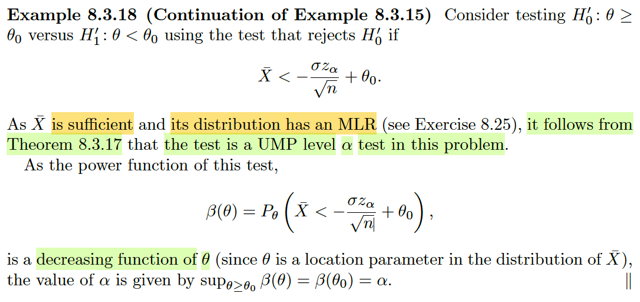</kbd>

> [!NOTE]
> Qua ví dụ này, xét bài toán test giữa hai giả thuyết H'0: θ ≥ θ0 vs H'1: θ <
> θ0 Sử dụng cái test có rule: reject H'0 khi Xbar < - σz_α/√n + θ0.
>
> Nhớ lại ở example 8.3.15, trong đó ta xét bài toán test giữa H1: θ=θ1vs H0:
> θ=θ0 với θ1 < θ0 và đã đi đến kết luận cái test có rule trên chính là UMP
> level α test.
>
> Dĩ nhiên, đó là bài toán với các simple hypothesis.
>
> Rồi, nhớ lại theorem Karlin-Rubin nói gì? Nó nói là nếu ta xét bài toán
> testing giữa hai composite hypothesis: H0: θ ≤ θ0 vs H1: θ0 < θ , và ta có
> một cái test dựa trên (test statistic) T là một sufficient statistic có cái rule có
> dạng là: Reject H0 khi T > t0 với α = P_θ0(T > t0) và hơn nữa, họ pdf của
> nó lại có tính chất monotone likelihood  ratio (MLR). Thì khi đó, theorem
> Karlin-Rubin cho rằng nó đích thị là UMP level α test của bài toán.
>
> Và tương tự, thì nếu xét test giữa H1: θ < θ0 vs H0: θ0 ≤ θ thì nếu test có
> dạng reject H0 khi T < t0 thì nó chính là UMP level α test với α = P_θ0(T <
> t0)
>
> À, thế thì, trong ví dụ này, ta đang test giữa H'1: θ < θ0 vs H'0: θ0 ≤ θ khớp
> với case trên. Vậy thử xem cái test dựa vào Xbar có thỏa các điều kiện của
> Karlin-Rubin  để tuyên bố nó là UMP level α không.
>
> Tiếp theo, liệu cái test này có cái rule là reject H0 khi T < t0 và α = P_θ0(T <
> t0) hay không?
>
> → Cái test đang xét có rule là: Reject H'0 nếu Xbar < -σz_α / √n + θ0. nên
> -σz_α / √n + θ0  chính là đóng vai t0.
>
> Tiếp theo, T ở đây là Xbar thì là như đã biết, nó là sufficient statistic. Vậy
> distribution của nó có tính monotone likelihood ratio không. Gs yêu cầu làm
> bài tập, nhưng mình còn nhớ distribution của Xbar là normal(μ, σ^2/n), mà
> trong lúc nói về MLR, gs cũng nói các distribution phổ biến như normal,
> poisson, expo đều có tính MLR. Biết vậy đủ rồi.
>
> Vậy đến đây có thể kết luận test này chính là UMP level α test của bài toán
>
> với α = P_θ0(T < t0), hay ở đây α = P_θ0(Xbar < -σz_α / √n + θ0)
>
> Ở đây có sự trùng hợp có thể gây hơi confuse:
>
> Thật ra ta hỉêu thế này:
>
> Karma-Rubin nói rằng khi xét bài toán test giữa H1: θ < θ0 vs H0: θ0 ≤ θ0,
> thì test dựa vào sufficient statistic T: reject H0 khi T < t0 và T có pdf có tính
> MRT thì theorem này kết luận nó là UMP level α test, với α = P_θ0(T < t0).
>
> Thì câu kết luận cũng có thể nói là đây là UMP level γ test với γ = P_θ0(T <
> t0).
>
> Có nghĩa là, α, γ ở đây chỉ là cái giá trị của P_θ0(T < t0) thôi. Chứ ko phải
> là test phải thỏa điều kiện gì liên quan đến α cả. Chẳng qua là nếu cho 
> trước α thì ta sẽ tính ra t0.
>
> Hay nói cách khác ta kết luận là đây là UMP level P_θ0(T < t0) test cũng
> được
>
> Vậy ở đây, cái test đang xét đích thì là UMP level P_θ0(Xbar < -σz_α / √n +
> θ0) test
>
> Nhưng mà P_θ0(Xbar < -σz_α / √n + θ0), thì để ý trong đó có dính chữ α.
>
> thì đó cũng là giá trị của cái cái cụm này α = P_θ0(Xbar < -σz_α / √n + θ0)
>
> Thật vậy:
>
> Lập luận từ gốc thử cho vui:
>
> P_θ0(Xbar < -σz_α / √n + θ0) có bản chất là P_θ0({s∈Ω: Xbar(s) < -σz_α /
> √n + θ0})
>
> Xét Xbar(s) < -σz_α / √n + θ0
>
> ⇔ Xbar(s) - θ0 < -σz_α / √n
>
> ⇔ √n(Xbar(s) - θ0) < -σz_α
>
> ⇔ √n(Xbar(s) - θ0)/σ < -z_α
>
> ⇨ P_θ0({s∈Ω: Xbar(s) < -σz_α / √n + θ0})
>
> = P_θ0({s∈Ω: √n(Xbar(s) - θ0)/σ < -z_α})
>
> = P_θ0({s∈Ω: [√n(Xbar - θ0)/σ](s) < -z_α})
>
> = P_θ0({s∈Ω: [(Xbar - θ0)/(σ/√n)](s) < -z_α})
>
> = P_θ0({s∈Ω: Z(s) < -z_α}) với Z = (Xbar - θ0)/(σ/√n)
>
> = P_θ0(Z < -z_α)
>
> Với Xbar ~ normal(θ, σ^2/n) và ở đây đang làm việc với P_θ0(...) tức là ta
> được dùng θ0 cho θ: Xbar ~ normal(θ0, σ^2/n) thì theo location scale family
> theorem, Z = (Xbar - θ0) / (σ/√n) sẽ có distribution là standard member của
> family, tức location = 0, scale = 1. Và với normal thì ta biết location cũng là
> mean và scale cũng là standard deviation. Do đó suy ra Z ~ normal(0, 1)
>
> ⇨ P_θ0(Z < -z_α) chính là diện tích phần bên trái của mốc -z_α, theo định
> nghĩa của z_α thì nó đúng là α.
>
> Gốc rễ đại khái là cái xác suất này có giá trị chính là diện tích của cái phần
> đồ thị pdf của normal(0,1). Và trong đó, người ta gọi cái mốc mà dựa vào
> đó, phần diện tích bên trái của đồ thị bằng α là -z_α. Cũng như cái mốc mà
> dựa vào đó mà phần diện tích bên phải của đồ thị bằng α là z_α.

 

<kbd>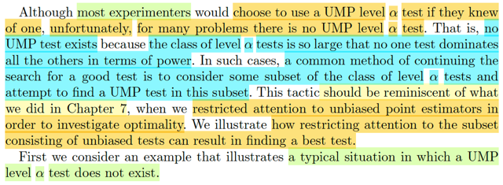</kbd>

🔗 **Related:** [7.3 METHODS OF EVALUATING ESTIMATORS](73_methods_of_evaluating_estimators.md#node-601)

> [!NOTE]
> Thế thì, đại khái là tác giả nói rằng dù phần lớn các experimenter sẽ đều
> dùng UMP level α test nếu có. (vì nó là cái tốt nhất mà tội gì ko dùng) nhưng
> không phải lúc nào cũng có UMP level α test. Vì có khi tập các level α test
> quá lớn, dẫn đến không có cái nào mà power function của nó lớn hơn power
> function của mọi các khác trong class ở mọi θ ∈ Θ0c.
>
> Do đó, cách tiếp cận tiếp theo là, ta sẽ tìm / chọn một subset nào đó của level
> α test và đi tìm thằng mạnh nhất trong đó.
>
> Điều này khiến ta nhớ lại (reminiscent) về chap 7: Nhớ lại lúc đó ta học về
> estimator, với vài loại điển hình như MOM (method of moment estiamator),
> MLE (maximum likelihood estimator), Bayes estimator. Sau đó cũng muốn
> evaluate chúng để tìm ra best estimator.
>
> Tất nhiên, việc tìm cái tốt nhất bắt đầu bằng việc đưa ra thước đó. Thì  MSE
> là một trong số thước đo đó.
>
> Còn nhớ MSE của một estimator W(**X**) là function của θ: define bởi:
>
> MSE_θ(W(**X**)) = E_θ[W(**X**) - θ]^2
>
> Nhớ công thức Var(X) = EX^2 - (EX)^2
>
> ⇨ Var_θ[W(**X**) - θ] = E_θ[W(**X**) - θ]^2 - [E_θ(W(**X**) - θ)]^2
>
> ⇔ Var_θ[W(**X**)] = MSE_θ[W(**X**)] - [E_θ(W(**X**) - θ)]^2
>
> ⇔ Var_θ[W(**X**)] + [E_θ(W(**X**) - θ)]^2 = MSE_θ[W(**X**)]
>
> ⇔  MSE_θ[W(**X**)] = Var_θ[W(**X**)] + [E_θ(W(**X**) - θ)]^2
>
> Và E_θ(W(**X**) - θ) chính là định nghĩa của Bias của W(**X**), là hàm theo θ
> define bởi Bias_θ(W(**X**)) = E_θ(W(**X**) - θ)
>
> Vậy MSE_θ(W(**X**)) = Var_θ[W(**X**)] + Bias(W(**X**))^2
>
> Thế rồi, đại khái là với thước đo MSE này, một estimator tốt thì nó phải có
> variance nhỏ và cả bias nhỏ. Vậy thì việc tìm kiếm trong không gian các
> estimator rất lớn (do estimator được định nghĩa chỉ là any function of sample
> W(**X**)) sẽ khó tìm ra thằng tốt nhất.
>
> Do đó, mới dẫn đến cách tiếp cận là: Tìm trong không gian con, các estimator
> có bias = 0, gọi là unbiased estimator. Và tìm cái tốt nhất,trong đó, cũng là cái
> có variance thấp nhất.
>
> Vậy thì quay lại đây cũng vậy, ta cũng sẽ thu hẹp phạm vi tìm kiếm trong
> subset **CÁC UNBIASED TEST**. Và sẽ cho thấy là có khi cách làm này sẽ
> dẫn đến best test.

 

<kbd>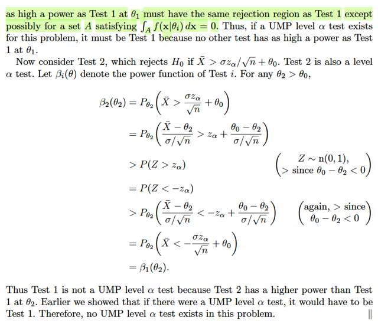</kbd>

<kbd></kbd>

<kbd>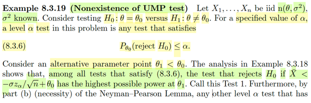</kbd>

> [!NOTE]
> Ví dụ này thầy Ca sẽ minh họa nhận định là **không phải lúc nào cũng có
> thể tồn tại UMP level α test**. Xét X1,...Xn là iid n(θ, σ^2) với σ^2 đã biết.
> Xem xét test giữa hai hypo: H0: θ = θ0 vs H1: θ ≠ θ0. Cho trước giá trị α,
> thì ông nói **bất kì test nào thỏa P_θ0(reject H0) ≤ α thì đều là level α
> test**.
>
> Là sao?
>
> Thì dựa vào **định nghĩa của level α test** thôi. Nhớ lại, một test gọi là
> level α test khi sup_θ∈Θ0 P_θ(**X** ∈ R) ≤ α, với β(θ) được define là
> P_θ(**X** ∈ R) thì đây cũng là  sup_θ∈Θ0 β(θ) ≤ α. Cái này có ý nghĩa là
> gì? Đó là, khi H0 nên được accept (vì θ  thật sự nằm trong Θ0) thì xác suất
> mắc lỗi loại I (reject  H0) lớn nhất không vượt  quá α (xác suất mắc lỗi loại
> 1, được định nghĩa là P(reject H0) khi mà đáng lí phải accept H0)
>
> Còn khi test có xác suất mắc lỗi loại I lớn nhất với mọi θ ∈ Θ0 **bằng đúng
> α thì test này gọi là Size α test**. Dĩ nhiên nó **cũng là một level α test**, và
> chính xác hơn thì nó là cái thằng tệ nhất trong đám level α test vì khả năng
> mắc lỗi loại I của nó là cao nhất.
>
> Cần để ý, vì cái sup. cho nên giả sử test A là một size α test, test B là một
> level α test hay cụ thể B là một level α' test, với α' < α
>
> thì khi đó cũng không hẳn là xác suất mắc lỗi loại I của test A luôn cao hơn
> của  test B. Mà chỉ có nghĩa là:
>
> sup_θ∈Θ0 P_θ(Type I error của test A) = α > sup_θ∈Θ0 P_θ(Type I error
> của test B) = α'
>
> Có nghĩa là có thể với θ nào đó thì  P_θ(Type I error của test A) vẫn có thể
> < P_θ(Type I error của test B) nhưng khi tìm hết trong Θ0 để ra giá trị lớn
> nhất, thì nó lớn hơn.
>
> ====
>
> Rồi, quay lại đây, Θ0 chỉ là single point set: {θ0}, nên sup_θ∈Θ0 P_θ(reject
> H0) cũng bằng P_θ0(reject H0). Nên đương nhiên test có P_θ0(reject H0)
> ≤ α chính  là test có sup_θ∈Θ0 P_θ(reject H0) ≤ α, là một level α test.
>
> ====
>
> Tiếp, giáo sư nói t**heo phân tích của ví dụ 8.3.18** thì trong mọi test thỏa
> 8.
> 3. 6 (tức là **mọi level α test**) thì cái test có rule sau:
>
> Reject H0 khi Xbar < -σz_α/√n + θ0
>
> ..sẽ là cái có **highest possible power at θ1**.
>
> Là sao nhỉ?
>
> Là vì từ ví dụ 8.3.18 vừa rồi, với bài toán bài toán H'0: θ ≥ θ0 vs H'1: θ <
> θ0 thì ta đã **dựa vào Karlin - Rubin để nói cái test trên là UMP level α
> test**.
>
> Mà theo định nghĩa của **UMP class C test**: nếu gọi β là power của UMP
> test, β'  là power của cái test khác bất kì trong class C thì **β(θ) ≥ β'(θ)**
> **tại mọi điểm θ**∈**Θ0c .**
>
> À vậy thì ở đây θ1 < θ0 **chính là một điểm trong Θ0c** (vì Θ0c là {θ: θ <
> θ0}), và ta đang có cái UMP level α test, nên theo định nghĩa thì β của nó
> tại θ1 phải **lớn hơn β' của mọi cái level α test tại θ1** là đúng rồi.
>
> -----
>
> Rồi, thế thì gs mới gọi nó (cái UMP level α test, có cái rule reject H0 khi
> Xbar < ...) là **Test 1**.
>
> Gs nói tiếp "Hơn nữa, **điều kiện cần** của **N-P lemma** nói rằng **bất kì
> level α test nào khác cũng có power tại θ1 bằng power của Test 1 tại θ1**
> thì **nó cũng phải có cùng rejection region với Test 1** trừ những điểm
> thuộc cái tập A mà xác suất xảy ra bằng 0". Là sao?
>
> Để trả lời câu hỏi này ta cần **ôn lại bổ đề Neyman - Pearson**: Nó có hai
> điểm đại ý như sau: Xét bài toán kiểm tra giữa hai **simple hypothesis**:
>
> H0: θ=θ0 vs H1: θ=θ1
>
> 1) Điều kiện 8.3.1 và 8.3.2 là **điều kiện đủ** để kết luận UMP level α test.
> Tức là nếu một test có rule (cũng là rejection region):
>
> (8.3.1) Reject H0 khi f(**x**|θ1) > kf(**x**|θ0)
>
> (8.3.2) là một size α test, thể hiện bởi **sup_θ**∈**Θ0={θ0} P_θ(reject H0)**
> = **P_θ0(reject H0) = α** thì ta kết luận nó là **UMP level α test**.
>
> 2) Ngược lại, nếu như **TỒN TẠI** một cái test thỏa 8.3.1 và 8.3.2 thì khi
> đó.
>
> **Bất kì cái test là UMP level α test** thì **sẽ đều có size α** (tức là nó là
> một size α test), và sẽ**đều có cái rule 8.3.1
>
> Điều này có một điểm mình có thể chưa để ý:**Theo định nghĩa, UMP level α là cái mà với mọi θ ∈ Θ0c, β(θ) ≥ β'(θ) của
> bất kì thằng test nào khác trong class level α. Mà ở đây Θ0c = {θ1} nên
> thằng UMP level α test là thằng có β(θ1) ≥ β'(θ1) của bất kì thằng nào
> khác.
>
> Do đó, bổ đề Neyman-Pearson trong ý điều kiện cần thực chất cũng là nói:
> À, giả sử ta đã có một thằng UMP level α, thì **nếu cái test nào đó mà
> power tại θ1 cũng bằng power của thằng UMP level α tại θ1** thì nó
> (**cũng chính là  đang tuyên bố nó là một UMP level α khác**) và như vậy
> thì chắc chắn nó phải có size α và cũng có cái rule 8.3.1, tức là nó cũng
> phải y chang thằng UMP level α kia.
>
> Nên ở đây, ta nhớ bài toán ban đầu là **kiểm tra giữa H0: θ=θ0 vs H1:
> θ≠θ0**.
>
> Vốn dĩ là bài toán **composite** hypothesis. Sau đó bằng cách **xét θ1<θ0.** Thì thật ra **ý tác giả là ta chuyển qua xét bài toán simple vs simple**:
>
> H'0: θ=θ0 vs H'1: θ = θ1.
>
> Và lập luận rằng, à N-P nói rằng UMP level α phải unique, nên giả sử có
> Test 1 là một cái UMP level α test rồi, mà sau đó lại có thằng test khác
> (Test 1b) có β tại θ1 cũng bằng β tại θ1 của Test 1, mà **điều này thì cũng
> chính là nó đang tuyên bố nó (Test 1b) cũng là UMP level α test** đây, thì
> N-P sẽ **cho ta quyền phán** rằng: **Test 1b cũng phải có chung rule với
> Test 1**, mà chung rule thì tức là **chung rejection region** đó.
>
> Thế thì nếu quay lại bài toán gốc ta xét Test 1b, và cho rằng nó cũng muốn
> cạnh tranh với Test 1 làm UMP, thì như vậy β1b(θ1) của nó phải bằng
> β1(θ1), mà như trên vừa nói dựa vào N-P trong bài toán simple vs simple
> thì nó phải có chung rule với Test 1. Nên **không thể nào có cái ứng viên
> nào khác Test 1 cho chức UMP của bài toán gốc** vì **nếu xuất hiện một
> cái thì khi xét bài toán simple, ngay lập tức nó đang tự xưng cũng là UMP
> của bài toán đó, thì sẽ bị N-P dập ngay, khẳng định ngay nó không khác gì
> Test 1**.
>
> Do đó giúp ta hiểu câu sau khi gs nói "**Do đó nếu tồn tại một UMP level α
> test trong bài toán này thì nó phải chính là Test 1**"
>
> → Câu này **đồng nghĩa**: **ứng cử viên duy nhất cho UMP level α test**
> chỉ có thể là Test 1. Nên phần sau, **nếu ta chứng minh Test 1 không phải
> UMP thì ta sẽ chứng minh xong rằng bài toán này không có UMP level α
> test**.
>
> Có thể thấy cách làm vừa rồi: Ta mượn điều kiện cần của N-L để khẳng
> định tính unique của UMP level α test trong bài toán simple vs simple. Và
> từ đó giúp khẳng định thằng Test 1 là ứng cử viên duy nhất cho UMP của
> bài toán composite gốc.
>
> ====
>
> Xét Test 2 có rule: reject H0 nếu Xbar > σz_α/√n + θ0. Gs nói nó **cũng là
> level α test**. Vì sao?
>
> → Thử xem P_θ0(**X** ∈ R) có ≤ α không (theo định nghĩa của level α test)
>
> Và Test 2 cũng là test dựa trên sufficient statistic:
>
> P_θ0(**X** ∈ R) = P_θ0(T ∈ S) = P_θ0(Xbar > σz_α/√n + θ0)
>
> = P_θ0(√n(Xbar - θ0)/σ > z_α)
>
> = P_θ0(Z > z_α) với X = √n(Xbar - θ0)/σ, như đã biết, ~normal(0,1)
>
> = α. 
>
> ⇨ Test 2 là Size α test, đương nhiên cũng là level α test
>
> Gọi βi là power của Test i, ta tính power của Test 2 tại θ2:
>
> β2(θ2) = P_θ2(Xbar > σ z_α / √n + θ0)
>
> = P_θ2(Xbar - θ2 > σ z_α / √n + θ0 - θ2)
>
> = P_θ2((Xbar - θ2) / (σ/√n) > (σ z_α / √n + θ0 - θ2) / (σ/√n))
>
> = P_θ2((Xbar - θ2) / (σ/√n) > (σ z_α / √n) / (σ/√n) + (θ0 - θ2) / (σ/√n)))
>
> = P_θ2((Xbar - θ2) / (σ/√n) > z_α + (θ0 - θ2) / (σ/√n)))
>
> = P(Z > z_α + (θ0 - θ2) / (σ/√n)))
>
> Như đã biết, với việc đang xét θ = θ2, thì (Xbar - θ2) / (σ/√n) chính là một
> standard normal Z. Nếu không hiểu có thể hiểu vầy:
>
> Xbar là sample mean của random sample X1,...Xn ~ n(θ, σ^2). Ta đã
> chứng minh Xbar sẽ có distribution là n(θ, σ^2/n). Và theo normal là một
> thành viên thuộc location scale distribution, với sự đặc biệt là mean θ
> cũng là location và std σ cũng là scale. Rồi, theo một theorem ta biết (Xbar
> - location) / scale, tức (Xbar - θ) / (σ/√n) sẽ chính là một rv của standard
> member, có location 0, scale 1, đồng nghĩa với normal, thì nó chính là
> normal mean 0, variance 1, tức normal(0,1). Thế thì ở đây ta đang tính
> P_θ2((Xbar - θ2 / ....) thì thật ra có nghĩa là ta đang tính P_θ((Xbar - θ) / ....
> ) |θ=θ2
>
> = P_θ((Xbar - θ) / (σ/√n) > z_α + (θ0 - θ) / (σ/√n))) | θ = θ2
>
> Khi đó bên trong (Xbar - θ) / (σ/√n), như trên vừa nói, là một standard
> normal rv Z thôi:
>
> .. = P(Z > z_α + (θ0 - θ) / (σ/√n))) | θ = θ2
>
> Và vì đang evaluate tại θ2 nên thế θ2 vô, và không còn "_θ" chỗ P_θ(..)
> nữa:
>
> .. = P(Z > z_α + (θ0 - θ2) / (σ/√n)))
>
> Tới đây, cái này là diện tích phần đồ thị của pdf hàm n(0,1) ở bên phải mốc
> c = z_α + (θ0 - θ2) / (σ/√n))
>
> mà θ0 < θ2 ⇨ (θ0 - θ2) / (σ/√n) < 0. Vậy bỏ cái này đi để chỉ còn z_α thì
> tức là ta dịch cái ngưỡng tăng lên về bên phải
>
> Điều này đồng nghĩa thu nhỏ diện tích vùng bên phải cái ngưỡng lại
>
> Vậy P(Z > z_α + (θ0 - θ2) / (σ/√n))) > P(Z > z_α)
>
> Tiếp, xét cái này: P_θ(Z > z_α), do tính đối xứng, nó chính là P_θ(Z < -z_α)
>
> P(Z > z_α) = P_θ(Z < -z_α)
>
> Lập luận tương tự, vì (θ0 - θ2) / (σ/√n) < 0, nên nếu cộng thêm vào cái này,
> thì tức là ta đang đẩy cái ngưỡng về phái trái → làm thu hẹp diện tích
>
> ⇨ P_θ(Z < -z_α) > P_θ(Z < -z_α + (θ0 - θ2) / (σ/√n) < 0)
>
> Bung Z ra lại thành Xbar - θ / (σ/√n), thêm lại "_θ" chỗ P_θ(..)
>
> P(Z < -z_α + (θ0 - θ2) / (σ/√n) < 0)
>
> = P_θ([Xbar - θ / (σ/√n)] < -z_α + (θ0 - θ2) / (σ/√n) < 0))|θ=θ2
>
> = P_θ([Xbar - θ / (σ/√n)] < -z_α + (θ0 - θ2) / (σ/√n) < 0)))|θ=θ2
>
> = P_θ2(Xbar < - σ z_α / √n  + θ0)
>
> Và cái này chính là = P_θ2(reject H0 của Test 1) hay β tại θ2 của Test 1
>
> với việc gọi βi là power function của Test i
>
> thì đây là = β1(θ2).
>
> Tới đây viết lại để thấy ta đang có gì, một chuỗi ">", "=" nãy giờ chính là:
>
> β2(θ2) > β1(θ2).
>
> À, như vậy là **TEST 2 LẠI CÓ POWER LỚN HƠN TEST 1 TẠI MỘT
> ĐIỂM θ2 THUỘC Θ0c!**
>
> NHƯ VẬY **ĐỦ KẾT LUẬN TEST 1 KHÔNG PHẢI LÀ UMP LEVEL α
> TEST.**
>
> **SUY RA BÀI TOÁN NÀY KHÔNG CÓ UMP LEVEL α TEST.**

 

<kbd>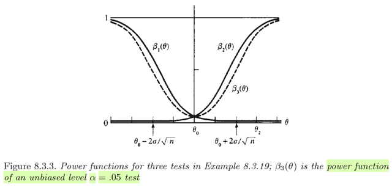</kbd>

<kbd></kbd>

<kbd>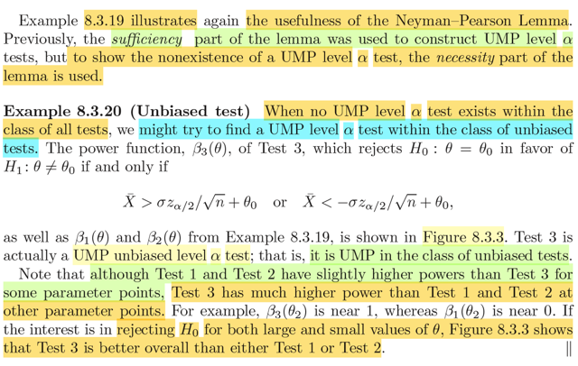</kbd>

> [!NOTE]
> Rồi, ôn lại tí xíu ví dụ trước, trong bài toán H0:θ∈{θ0} vs H1:θ≠θ0. Gs đã
> dẫn dắt chúng ta chứng minh bài toán này không có UMP level α test. Lướt
> sơ lại cách làm của ông: Ông xét bài toán simple vs simple H'0:θ=θ1 vs H'
> 1:θ=θ0 với θ1 < θ0, trong bài toán này, dựa vào ví dụ trước đó, ta đã biết
> UMP level α test là Test 1: Reject H0 khi Xbar < -σz_α/√n + θ0.
>
> Rồi ta mới lập luận rằng giả sử có Test 1b cũng muốn làm ứng viên cho
> UMP của bài toán composite gốc, thì dĩ nhiên nó phải thỏa a) cũng là level α
> test và b) có β1b(θ) không kém hơn β1(θ) với mọi θ∈Θ0c={θ:θ≠θ0}. Và như
> vậy với θ1 < θ0 (tức là thuộc Θ0c) thì β1b(θ1) phải bằng β1(θ1). Nhưng mà
> nếu vậy, thì khi soi chiếu theo bài toán simple vs simple: H'0:θ=θ1 vs H'
> 1:θ=θ0 mà thằng Test 1 đang làm UMP, thì nếu cho Test 1b tham gia, thì với
> việc nó có β1b(θ1) = β1(θ1), thì cũng chính là nó đang tuyên bố mình cũng
> là UMP level α test. Lúc này bổ đề Neyman-Pearson ngay lập tức phán
> quyết rằng cái rule của Test 1b phải bằng y chang rule của Test 1 → Chúng
> là một. Và như vậy sẽ chẳng có ứng viên nào khác cho chức UMP của bài
> toán gốc composite cả. Để rồi sau đó ta xét Test 2, và chứng minh rằng tại
> một giá trị θ∈Θ0c thì β2 của Test 2 lớn hơn β1 của Test 1. Suy ra cái thằng
> ứng cử viên duy nhất này không phải là UMP, vậy bài toán không có UMP
> level α test.
>
> Rồi, thế thì cũng không khó để thấy Test 1, là thằng size α test có β1 mạnh 
> nhất trong nửa đầu của Θ0c: θ < θ0. Vì sao?
>
> Vì nó là UMP level α của MỌI bài toán simple vs simple H'0:θ=θ1 vs H'1:θ=θ0
> trong đó θ1 < θ0. Nên dĩ nhiên với mọi θ1 < θ0 thì β1(θ1) ≥ βi(θ1) của mọi
> thằng βi khác trong class level α. 
>
> Và tương tự Test 2, cũng là size α test có β2 mạnh nhất trong nửa sau
> của Θ0c: θ0 < θ. Vì cũng dễ chứng minh (dựa vào Karlin-Rubin) để cho thấy
> nó là UMP level α của MỌI bài toán simple vs simple H'0:θ=θ0 vs H'1:θ=θ2
> trong đó θ2 > θ0. Nên dĩ nhiên với mọi θ < θ2 thì β2(θ2) ≥ βi(θ2) của mọi 
> thằng βi khác trong class level α. 
>
> Do đó trong nửa đầu của Θ0c: θ<θ0, đồ thị β1 là cao nhất. Và trong nửa 
> sau của Θ0c: θ0<θ thì đồ thị của β2 là cao nhất.
>
> Nhưng vì sao qua bên nửa sau thì β1 thấp tè vậy? Thật ra ta có thể không
> cần quan tâm, mà chỉ cần biết bên nửa đó β2 mới là trùm. Và ngược lại qua
> nửa đầu thì β2 thấp tè, β1 mới là trùm.
>
> Thế rồi, xét β3 có rule: reject H0 khi Xbar > σz_α/2/√n + θ0 hoặc 
> Xbar < σz_α/2/√n + θ0, đồ thị của nó là chữ U nét đứt, nằm thấp hơn đồ thị
> của β1 và β2 một chút. Nhưng bù lại: cả hai nửa của Θ0c, thì nó đều cao.
> Như vậy, tuy nó ko phải là UMP level α của bài toán composite, nhưng nó có
> thể coi là một test khá tốt.
>
> Như vậy: β1 làm tốt trong việc Accept H1 (reject H0) khi thật sự θ < θ0
> nhưng rất tệ trong việc Accept H1 khi θ > θ0
>
> và β2 làm tốt trong việc Accept H1 khi thật sự θ0 < θ0 nhưng rất tệ trong việc
> này khi θ < θ0
>
> Thì β3 là tốt trong cả hai case θ < θ0 or θ0 < θ
>
>  Cuối cùng, size của β cũng là α . Cái này dễ thấy thôi, xét 
>
> sup_{θ∈Θ0} P_θ(reject H0) 
>
> = sup_{θ∈{θ0}} P_θ(reject H0) 
>
> = P_θ0(reject H0) 
>
> = P_θ0(Xbar > σz_α/2/√n + θ0 or Xbar < -σz_α/2/√n + θ0)
>
> = P_θ0(√n(Xbar - θ0)/σ > z_α/2 or √n(Xbar - θ0)/σ < -z_α/2)
>
> = P(Z > z_α/2 or Z < -z_α/2) với Z ~ n(0,1)
>
> = P(Z > z_α/2) + P(Z < -z_α/2) (axiom 2)
>
> = α/2 + α/2 = α

 

<kbd>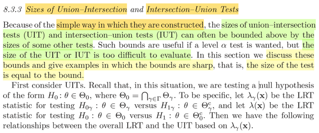</kbd>

> [!NOTE]
> Qua phần này, mở đầu gs nói đại khái là nhờ việc xây dựng đơn giản nên
> size của union-intersection và intersection-union test thường được chặn
> trên bởi size của các test khác. Điều này sẽ hữu ích khi ta cần một level α
> test. Tuy  nhiên việc tính size của UIT hay IUT quá khó. Trong phần này ta
> sẽ thảo luận về những cái chặn trên này.
>
> Ôn lại chút về UIT và IUT.
>
> Union-Intersection Test (UIT) là sao?
>
> Đó là khi ta có bối cảnh một bài toán hypothesis testing gốc: H0: θ∈Θ0 vs
> H1: θ∈Θ0c có đặc điểm là Θ0 = ∩{γ∈Γ} Θγ. Và với mỗi γ ta có bài toán con:
> Test giữa H0γ: θ∈Θγ vs H1γ: θ∈Θγc bằng test có rule: Reject H0γ nếu
> T_γ(**X**) ∈ R_γ
>
> Khi đó, ta có thể có một test của bài toán gốc tạo bởi các test của bài toán
> con.
>
> Reject H0 khi T_γ(**X**) ∈ R_γ for some γ.
>
> Tức là khi một trong các bài toán con có kết luận reject H0: θ không thuộc
> Θγ thì cũng đồng nghĩa rằng ta đã kết luận θ không thuộc Θ0. 
>
> Đây chính là một test có tên là Intersection-Union Test
>
> Cũng là rejection region của bài toán gốc sẽ là U{γ∈Γ} R_γ
>
> Còn Intersection-Union Test (UIT):
>
> Khi bối cảnh Θ = U{γ∈Γ} Θγ. Và với mỗi γ ta có bài toán con:  Test giữa
> H0γ: θ∈Θγ vs H1γ: θ∈Θγc bằng test có rule: Reject H0γ nếu T_γ(X) ∈ R_γ
>
> Thì test rule của bài toán gốc:
>
> Reject H0 khi T_γ(**X**) ∈ R for all γ
>
> Tức là khi tất cả các bài toán con đều có kết luận reject H0: θ kkhông thuộc
> Θ γ  thì chính là lúc ta kết luận θ không thuộc Θ0
>
> ⇨ Rejection region: ∩{γ∈Γ} R_γ
>
> ====
>
> Tiếp, sắp tới sẽ nhắc đến LRT, nên ôn lại luôn:
>
> LRT là một loại test (mà test thì chỉ là cái rule, dùng một hàm nào đó áp lên
> sample và áp cái rule đó vô để mà ra kết luận reject hay không reject H0 thế 
> thôi), sử dụng test statistic là hàm likelihood ratio:
>
> λ(**X**) = sup_θ∈Θ0 L(θ|**X**) / sup_θ∈Θ L(θ|**X**), cũng là tỉ số giữa restricted on Θ0
> maximum likelihood và unrestricted / real maximum likelihood.
>
> Và cái rule của LRT là: reject H0 nếu λ(**X**) < c với c là ngưỡng nào đó từ 0 đến 1
>
> Đây chính là một test có tên là Union-Intersection Test

 

<kbd>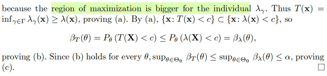</kbd>

<kbd></kbd>

<kbd>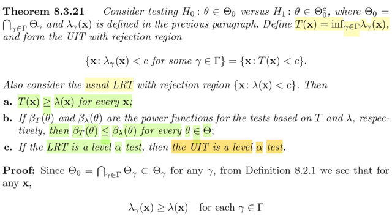</kbd>

🔗 **Related:** [8.2 METHOD OF FINDING TESTS](82_method_of_finding_tests.md#node-671)

> [!NOTE]
> Qua theorem 8.3.21. Nói rằng, xét bài toán hypo test giữa H0: θ∈Θ0 vs  H1:
> θ∈Θ0c với Θ0 = ∩{γ∈Γ} Θγ. Đặt T(**x**) = inf_{γ∈Γ} λ_γ(**x**) và xây dựng
> một UIT (Union-Intersection Test) có rejection region:
>
> R = {**x**: λγ(**x**) < c for some γ ∈ Γ} = {**x**: T(**x**) < c}
>
> Dừng lại chút, để hiểu vì sao ta có R trên:
>
> Như đã ôn lại ở note trước, với việc ta có các test của các bài toán test con
> H0γ: θ∈Θγ vs H1γ: θ ∈ Θγc với rejection region Rγ, hay {x: Tγ(x) ∈ Rγ} thì ta
> có thể xây dựng test rule cho bài toán H0: θ∈Θ0 vs H1: θ∈Θ0c với
> Θ0=∩{γ∈Γ} Θγ như sau: reject H0 khi reject H0γ for some γ, cũng đồng
> nghĩa là rejection region là U{γ} Rγ.
>
> Thế thì ở đây, các test cho bài toán con là: reject H0γ nếu λγ(**x**) < c, cũng
> dẫn đến Rγ là {x: λγ(**x**) < c}.
>
> ⇨ UIT test sẽ có rule là: reject H0 nếu λγ(**x**) < c for some γ ∈ Γ. Thế thì
> nếu đặt T(**x**) = inf_γ λγ(**x**), tức là **cái nhỏ nhất** trong đám λγ(**x**) thì
> khi tồn tại  một thằng nào đó nhỏ hơn c thì T(**x**) đương nhiên cũng < c
>
> Cho nên dĩ nhiên cái rule trên cũng tương đương: reject H0 nếu T(**x**) < c
>
> Và rejection region {**x**: λ(**x**) < c for some γ ∈ Γ } tương đương tập {**x**:
> T(**x**) < c}
>
> ====
>
> Rồi, vậy theorem này nói gì: Cho một LRT test bình thường với test statistic
> λ(**X**)
>
> a) T(**x**) > λ(**x**) với mọi **x**Chứng minh ý này cũng không khó, lập luận như sau:
>
> Đầu tiên T(**x**) là inf_γ∈Γ λγ(**x**), vậy nếu chứng minh mọi λγ(**x**) đều
> lớn hơn λ(**x**) thì ta sẽ suy ra T(**x**) > λ(**x**).
>
> λγ(**x**) là gì: nó là sup_θ∈Θγ L(θ|**x**) / sup_θ∈Θ L(θ|**x**)
>
> còn λ(**x**)? → nó là  sup_θ∈Θ0 L(θ|**x**) / sup_θ∈Θ L(θ|**x**)
>
> Hai thằng khác nhau chỗ nào? → Khác nhau cái tử số, cụ thể hơn là không
> gian mà ta tìm kiếp θ để maximize cái likelihood.
>
> Thế thì, với λ(**x**) thì không gian đó là Θ0. còn với λγ thì không gian đó là
> Θγ Và ta lại có Θ0 = ∩{γ∈Γ} Θγ thì có nghĩa là Θ0 LÀ TẬP CON CỦA Θγ.
>
> Do đó, lẽ dĩ nhiên khi tìm trong không gian lớn Θγ, kết quả ít nhất phải bằng
> hoặc hơn không gian nhỏ Θ0.
>
> Do đó tử số của λγ phải lớn hơn hoặc bằng tử số của λ
>
> ⇨ λγ(**x**) ≥ λ(**x**) ⇨ inf_γ∈Γ λγ(**x**) > λ(**x**) ⇔ T(**x**) ≥ λ(**x**) ∀**x
>
> Vì sao điều này đúng với mọi x? Là vì lập luận trên hoàn toàn không phụ
> thuộc x, nên x bằng bao nhiêu nó cũng phải đúng.
>
> →** Chứng minh xong a
>
> b) βT(θ) và βλ(θ) là power functions của các test dựa trên T và λ, thì khi đó
> βT(θ) ≤ βλ(θ) với mọi θ ∈ Θ
>
> Chứng minh: nhờ a) ta có T(**x**) ≥ λ(**x**) ∀**x**Nên nếu T(**x**) < c ⇨ λ(**x**) cũng phải < c
>
> Rồi, dĩ nhiên dễ thấy chúng là rejection region của test T và test λ (ý là test
> reject H0 nếu T < c, và test reject H0 nếu λ < c)
>
> Thế thì nhớ lại power function β của một test được định nghĩa là β(θ) =
> P_θ(**X** ∈ R) để rồi nếu θ ∈ Θ0 (tức là H0 nên được accept) thì β(θ) chính
> là xác suất test reject H0, nên cũng là xác suất mắc Type I error. Còn khi θ ∈
> Θ0c (tức H1 nên được accept) thì β(θ) chính là xác suất test reject H0 /
> accept H1, nên cũng là xác suất làm đúng.
>
> Vậy βT(θ) = P_θ(**X** ∈ {**x**: T(**x**) < c}), cách viết khác P_θ(T(**X**) < c)
>
> và βλ(θ) = P_θ(**X** ∈ {**x**: λ(**x**) < c}) = P_θ(λ(**X**) < c)
>
> Vậy ta cần chứng minh P_θ(T(**X**) < c) ≤ P_θ(λ(**X**) < c)
>
> Xét P_θ(T(**X**) < c), theo lí thuyết xác suất thì về bản chất, nó chỉ là P_θ({s
> ∈ Ω: T(**X**){s} < c})
>
> Xét s' ∈ {s ∈ Ω: T(**X**){s} < c}, ta có T(**X**){s'} < c
>
> Mà λ(**x**) ≤ T(**x**) ∀**x ⇨**T(**X**){s'} < c ⇨ λ(**X**){s'} < c
>
> Từ đó suy ra s' cũng thuộc {s ∈ Ω: λ(**X**){s} < c}
>
> Như vậy {s ∈ Ω: T(**X**){s} < c} ⊂ {s ∈ Ω: λ(**X**){s} < c}
>
> Và theo lý thuyết tập hợp: nếu A ⊂ B thì P(A) ≤ P(B)
>
> Vậy P_θ({s ∈ Ω: T(**X**){s} < c}) ≤ P_θ({s ∈ Ω: λ(**X**){s} < c})
>
> hay P_θ(T(**X**) < c) ≤ P_θ(λ(**X**) < c)
>
> chính là βT(θ) ≤ βλ(θ) → Chứng minh xong b)
>
> ====
>
> c) Ý cuối cùng của theorem nói nếu LRT là một leval α test thì UIT cũng vậy
>
> Chứng minh: Nếu LRT là level α test, theo định nghĩa tức là ta có:
>
> sup_θ∈Θ0 P(reject H0) ≤ α
>
> ⇔ sup_θ∈Θ0 P(λ(**X**) ≤ c) ≤ α
>
> Mà từ b) ta đã có  P_θ(T(**X**) < c) ≤ P_θ(λ(**X**) < c) đúng với mọi θ
>
> ⇨ sup_θ∈Θ0 P_θ(T(**X**) < c) ≤ sup_θ∈Θ0 P_θ(λ(**X**) < c)
>
> Và như vậy ta có:
>
> sup_θ∈Θ0 P_θ(T(**X**) < c) ≤ sup_θ∈Θ0 P_θ(λ(**X**) < c) ≤ α
>
> ⇨ sup_θ∈Θ0 P_θ(T(**X**) < c) ≤ α
>
> Kết quả này đủ kết luận test có rule reject H0 nếu T(**X**) < c chính là level α
> test

 

<kbd>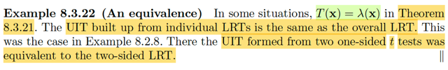</kbd>

🔗 **Related:** [8.2 METHOD OF FINDING TESTS](82_method_of_finding_tests.md#node-687)

🔗 **Related:** [8.3 METHODS OF EVALUATING TEST](83_methods_of_evaluating_test.md#node-736)

> [!NOTE]
> Cùng xem ý nào là sao. Ví dụ này gs nói trong một số tình huống T(**x**) = λ(**x**) 
> khi đó UIT được xây dựng từ các LRTs đơn lẻ sẽ y như cái LRT tổng quát. 
>
> Và trong ví dụ 8.2.8 (Xem lại theo link) mình đã hiểu cái ý mà ở đây gs nhắc lại:
>
> "khi đi đó UIT sẽ được xây dựng từ 2 cái one-sided t tests sẽ tương đương với
> một cái two-sided LRT"
>
> Xem phần note của ví dụ 8.3.28, mình đã tự tay xây dựng two-side LRT

 

<kbd>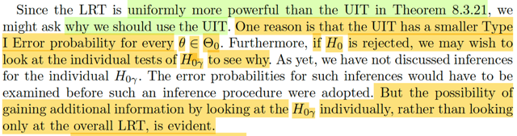</kbd>

> [!NOTE]
> Đoạn này dễ hiểu thôi, trong Theorem 8.3.21 vừa rồi ta vừa chứng minh, ý
> b) của nó nói là nếu gọi βT và βλ là power function của cái test dựa trên T
> (mà trong bối cảnh nãy giờ, là cái UIT, Union Intersection Test) và power
> của LRT (Likelihood Ratio Test) thì với mọi θ ∈ Θ: βT(θ) ≤ βλ(θ), nên gs mới
> nói LRT uniformly more powerful hơn UIT (vì nó mạnh hơn ở mọi θ ∈ Θ).
> Vậy thì vì sao ta lại không dùng LRT mà lại phải nhắc đến UIT làm gì.
>
> Câu trả lời đơn giản, và cũng dể hiểu là: Mình đã biết power function β(θ),
> define bởi P_θ(X ∈ R) hay P_θ(reject H0) sẽ mang hai ý nghĩa khác nhau
> tùy theo θ  thật sự nằm đâu (trong Θ0 hay Θ0c):
>
> Nếu θ ∈ Θ0 thì P_θ(reject H0) chính là Xác suất mắc Type I Error.
>
> Nếu θ ∈ Θ0c thì P_θ(reject H0) chính là xác suất làm đúng (accept H1, vì
> thật sự H1 nên được accept). Cũng là 1 - Xác suất mắc lỗi loại II
>
> Vậy thì chuyện β của LRT mạnh hơn UIT chỉ có ích trong khi H1 nên được
> accept khi đó, LRT có xác suất làm đúng cao hơn (Xác suất lỗi loại II thấp
> hơn)
>
> Chứ đổi lại, khi H0 nên được accept thì UIT sẽ có xác suất mắc lỗi loại I sẽ
> thấp hơn.
>
> Một lợi ích khác, là khi dùng LRT, nếu kết luận là reject H0 (tức λ(**x**) < c, thì 
> dựa vào đó, ta chỉ biết vậy
>
> Trong khi đó, nếu dùng UIT, nếu nó kết luận reject H0, thì ta có thể đi sâu
> hơn để xem thử cái H0γ nào bị reject, từ đó RÕ RÀNG LÀ GIÚP CÓ THÊM 
> THÔNG TIN

 

<kbd>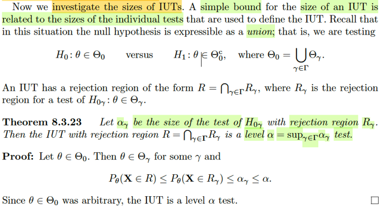</kbd>

> [!NOTE]
> Tiếp theo là một theorem nói về size của IUT: Nếu gọi α_γ là size của các test 
> của H0γ với rejection region Rγ. Khi đó IUT có reject region R = ∩{γ∈Γ} R_γ 
> sẽ là một level alpha test với α = sup_{γ∈Γ} α_γ. Tức IUT sẽ có level bằng giá 
> trị lớn nhất của các α_γ.
>
> Chứng minh cũng dễ hiểu:
>
> Theo định nghĩa của level α test là test có sup_θ∈Θ0 P_θ(**X** ∈ R) ≤ α. Vậy để
> chứng minh theorem này ta sẽ chứng minh sup_θ∈Θ0 P_θ(**X** ∈ R) ≤ sup_γ {αγ} 
>
> Cũng là chứng minh P_θ(**X** ∈ R) ≤ sup_γ {αγ} 
>
> Xét P_θ(**X** ∈ R), với R của IUT: R = ∩γ Rγ 
>
> P_θ(**X** ∈ R) = P_θ(**X** ∈ ∩γ Rγ)
>
> mà cái này về bản chất là P_θ({s ∈ Ω: **X**(s) ∈ ∩γ Rγ})
>
> Xét event X(**s**) ∈ ∩γ Rγ thì đương nhiên suy ra X(**s**) ∈ Rγ ∀γ 
>
> Vậy xét s ∈ {s ∈ Ω: **X**(s) ∈ ∩γ Rγ} ⇨ s ∈ {s ∈ Ω:**X**(s) ∈ Rγ} ∀γ
>
>  ⇨ {s ∈ Ω: **X**(s) ∈ ∩γ Rγ} ⊂ {s ∈ Ω: **X**(s) ∈ Rγ} ∀γ
>
> ⇨ P({s ∈ Ω: **X**(s) ∈ ∩γ Rγ}) ≤ P({s ∈ Ω: **X**(s) ∈ Rγ})
>
> ⇔ P_θ(**X** ∈ R) = P_θ(**X** ∈ ∩γ Rγ) ≤ P_θ(**X**∈****Rγ) ∀γ
>
> Và P_θ(**X** ∈ Rγ) dĩ nhiên ≤ sup_θ∈Θ  P_θ(**X** ∈ Rγ)
>
> Và vì các test of H0γ có size αγ nên sup_θ∈Θ  P_θ(**X** ∈ Rγ) = αγ  
>
> Vậy P_θ(**X** ∈ R) = P_θ(**X** ∈ ∩γ Rγ) ≤ P_θ(**X** ∈ Rγ) ≤ sup_θ∈Θ P_θ(**X** ∈ Rγ) = αγ 
>
> ⇨ P_θ(**X** ∈ R) ≤ αγ với mọi γ 
>
> ⇨ Và α với giá trị = sup_γ∈Γ αγ thì đương nhiên: αγ ≤ α 
>
> Vậy P_θ(**X** ∈ R) ≤ αγ ≤ α với mọi γ    
>
> Chứng minh xong.

 

<kbd>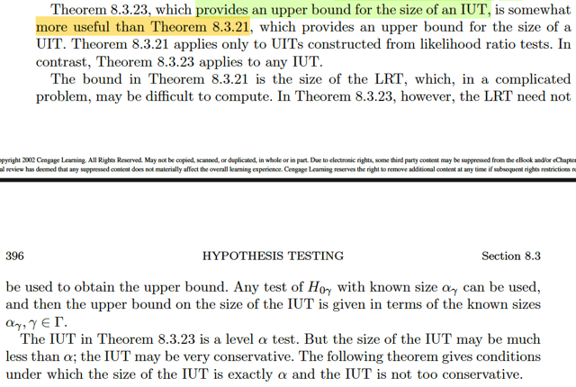</kbd>

> [!NOTE]
> Thế thì, so sánh hai theorem 8.3.21. Review chút xíu
>
> 8.3.21 nói rằng ta có một UIT (Union Intersection Test) được xây dựng
> theo kĩ thuật Union Intersection từ các test của các bài toán con, và chúng
> thuộc loại LRT dựa trên các test statistic λ_γ(**x**) và xét thêm cái LRT của
> bài toán đó. Thì ý c của theorem nói rằng nếu LRT là level α test thì level
> của UIT cũng là α 
>
> Còn theorem 8.3.23 nói rằng: với IUT thì level của nó là level lớn nhất của
> các test của các bài toán con.
>
> Như vậy ở đây gs nói cái chặn trên về kích thước của IUT cho bởi 8.3.23
> thì cơ bản là hữu ích hơn chặn trên về kích thước của UIT cho bởi 8.3.21
> là vì trong 8.3.21 như vừa ôn lại có thể thấy ta phải dựa vào level của LRT
> Ý là, ví dụ như nếu biết level của LRT là 0.3 thì mới suy ra level của UIT
> cũng là 0.3. Mà với LRT thì gs nói không phải lúc nào cũng dễ tìm level hay 
> size
>
> Trong khi đó, với 8.3.23 thì không quy định các test con phải là loại gì, nên
> cơ bản là sẽ dễ tìm size hơn từ đó giúp chặn trên cho size của IUT.
>
> Rồi, một ý nữa cũng dễ hiểu đó là dù theorem 8.3.23 có cho biết level của
> IUT là level lớn nhất của đám test: α = sup_{γ∈Γ} α_γ nhưng dĩ nhiên mình
> đã biết một test có level α thì size của nó có thể nhỏ hơn α nhiều. Vì sao?
>
> → Vì định nghĩa một level α test là cái có sup_θ∈Θ0 P_θ(reject H0) ≤ α 
>
> còn định nghĩa của một size ω test là cái có sup_θ∈Θ0 P_θ(reject H0) = ω 
>
> Vậy giả sử một test có size 0.01, thì nó cũng là level 0.1 / 0.2 / 0.9.... test
>
> Thế thì kết thúc phần này, ta sẽ học một theorem quy định rằng khi nào một
> IUT test sẽ có size chính xác là α = sup_{γ∈Γ} α_γ
>
> Và để qua luôn p-values. mình sẽ tạm bỏ qua Theorem này, quay lại sau

 

<kbd>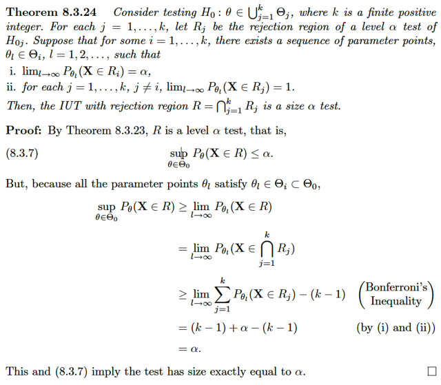</kbd>

> [!NOTE]
> QUAY LẠI SAU

 

<kbd>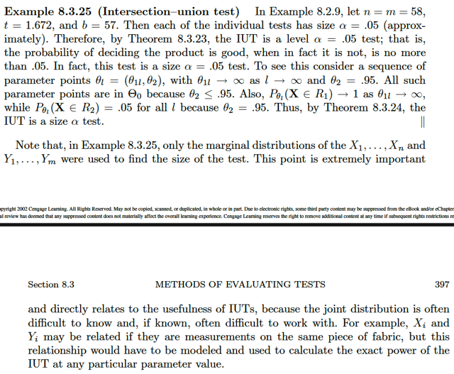</kbd>

> [!NOTE]
> QUAY LẠI SAU

 

<kbd>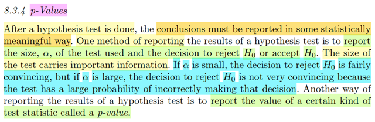</kbd>

> [!NOTE]
> Ok, đầu tiên giáo sư Casella nói rằng, đại khái là sau khi đã thực hiện một
> hypothesis testing, thì ta phải CÔNG BỐ KẾT LUẬN THEO MỘT CÁCH
> THỨC NÀO ĐÓ MANG TÍNH CHẤT THỐNG KÊ. 
>
> Một cách làm là thông báo kết quả của test: reject hay accept H0 CÙNG VỚI
> GIÁ TRỊ SIZE α CỦA TEST.
>
> Ví dụ như ta kết luận reject H0 và cái test được dùng có size 0.1. Thế thì ông
> nói cách này, giả sử ta reject H0 mà α nhỏ thì còn thuyết phục (convincing)
> nhưng nếu α lớn thì ko thuyết phục cho lắm. Vì sao?
>
> Dễ hiểu là vì size của test theo định nghĩa là sup_θ∈Θ0 P(**X** ∈ R), hay nói
> và nó mang ý nghĩa là xác xuất mắc lỗi loại một cao nhất có thể có, lỗi loại 1 là
> lỗi reject H0 trong khi đáng ra phải accept H0. Nên dĩ nhiên nếu α thấp, thì
> việc cái test reject H0 sẽ có xác suất kết luận sai thấp hơn là khi được kết luận
> từ một cái test có α cao.
>
> Và phần này ta sẽ học cách report thứ hai, thông qua một TEST STATISTIC
> ĐẶC BIỆT, là p-value.

 

<kbd></kbd>

> [!NOTE]
> Đây là lần chính thức được học về p-value đầu tiên (trước đây đã từng gặp
> nó trong cuốn Introduction To Statistical Learning của Tibshirani). Nó được
> định nghĩa là: Nó là một **TEST STATISTIC**, thỏa mãn giá trị chỉ nằm trong
> [0,1]. Và p(**X**) **NHỎ SẼ CHO BẰNG CHỨNG RẰNG H1 ĐÚNG**.
>
> Và một p-value VALID chính là cái mà:
>
> ∀θ ∈ Θ0, và ∀α ∈ [0,1] thì P_θ(p(**X**) ≤ α) ≤ α.
>
> Dừng lại chút, hãy để ý việc p-value là một **TEST STATISTIC.**Còn nhớ
> định nghĩa của statistic là một random variable được tạo ra bởi kết qủa áp
> dụng một function lên random sample **X**. nên ta mới thấy kí hiệu p(**X**).
>
> Còn nữa, việc nó được gọi là **TEST STATISTIC**, mà cái này trong các
> phần trước lần đầu tiên ta được nghe là khi nói về định nghĩa của một test
> tham gia bài toán hypothesis testing. Một test, đơn giản chỉ là cái rule, mà
> dựa vào giá trị của một hàm nào đó áp lên random variable **X,** T(**X**) và
> theo cái rule nào đó để đưa ra quyết định reject hay accept H0. Và cái
> statistic đó gọi là test statistic. Ví dụ nếu ta dùng test statistic là hàm số sau
> đây:
>
> λ(u) = sup_θ∈Θ0 L(θ|**u**) / sup_θ∈Θ L(θ|**u**) thì nó chính là LRT statistic.
>
> Thế thì do đó dễ hiểu khi tác giả nói ta có thể dùng cái statistic này để tạo
> một cái test: reject H0 khi p(**x**) < threshold nào đó là giá trị từ 0 đến 1.
>
> Và nếu dùng luôn α cho threshold đó thì ngay lập tức vì tính chất
>
> P_θ(p(**X**) ≤ α) ≤ α thì
>
> ⇨ P_θ(p(**X**) ≤ α) ≤ α ⇨ sup_θ ∈ Θ0 P_θ(p(**X**) ≤ α) ≤ α ⇨ Ta có ngay
> một  level α test.
>
> Và một kết qủa quan trọng của cái này đó là: Đại khái là ta có thể chọn một
> giá trị α mà mình đánh giá là phù hợp cho bài toán đang làm, từ đó chỉ việc
> đưa ra quyết định dựa trên việc so sánh p(**x**) với α. Ý là, giả sử trong một
> bài toán hypothesis testing cụ thể nào đó, ví dụ H0: Các features không quan
> hệ nào với target vs H1: Các feature có tương quan với target. Và  trong bài
> toán này ta cho rằng α = 0.1%, tức 0.001 là được, mang ý nghĩa là nếu thật
> sự nên accept H0, thì xác suất mắc Type I error của cái test sẽ nhiều nhất là
> 0.1%. Cụ thể là nếu thật sự các feature không có tương quan gì với target thì
> xác suất ta kết luận ngược lại (và mắc Type một error) chỉ là nhiều nhất là 0.
> 1%
>
> Và ta sẽ có cái level 0.001 test ngay bằng cách dùng cái test dựa trên
> p-value:
>
> Reject H0 nếu p(**X**) ≤ 0.001
>
> Hơn nữa, giáo sư nói, với p-value test, thì p-value càng nhỏ thì bằng chứng
> cho thấy nên reject H0 càng mạnh, là sao: À thì là vì **TRONG ĐỊNH NGHĨA
> CỦA p-VALUE CÓ NÓI**: p(**X**) **MÀ CÀNG NHỎ THÌ CHO BẰNG CHỨNG 
> RẰNG H1 LÀ ĐÚNG**.
>
> Và cuối cùng, gs nói p-values sẽ cho phép report cái test theo một thang đo
> liên tục, thay vì chỉ là hai quyết định rời rạc: reject H0 hay accept H0. (ý là, ta
> có thể có trạng thái reject H0 với sự tự tin thấp vs reject H0 với sự tự tin cao)
>
> Dĩ nhiên chưa nói gì về cách tạo ra một p(**X**) valid, tiếp theo sẽ làm việc này

 

<kbd></kbd>

> [!NOTE]
> Theorem quan trọng về cách để có một p-values valid: Cho W(**X**) là một test
> statistic sao cho giá trị của W càng lớn thì càng củng cố bằng chứng là H1 là
> đúng. Ta define hàm p(x) sao cho, với mỗi sample point **x**:
>
> p(**x**) = sup_θ∈Θ0 P_θ(W(**X**) ≥ W(**x**)). Khi đó p(**X**) là một valid
> p-values.
>
> Hiểu sơ về cái cách define này:
>
> p(**X**) là một statistic, theo định nghĩa, là một function của random sample
> **X**. Nên ta hiểu, define p(**X**) là define ra một function. Và đã define một
> function, thì việc cần làm là define xem kết quả của function là gì khi đưa input
> bất kì vào, tức là ta cần define xem với input **x**∈****range **X** đưa vô thì
> p(**x**) trả ra  là cái giống gì.
>
> Thế thì theo định nghĩa này, cái hàm đó là hàm gì:
>
> → Chính là hàm p(**u**) = sup_θ∈Θ0 P_θ(W(**X**) ≥ W(**u**))
>
> Hay phân rã ra từng bước
>
> Đầu tiên với input u, ta tính ra giá trị fixed W(**u**), có thể đặt là w
>
> Với việc W(**X**) là một random variable, P_θ(W(**X**) ≥ W(**u**)) chính là giá
> trị xác suất của event W(**X**) ≥ W(**u**) dựa trên phân phối xác suất của
> W(**X**) đang có tham số là θ. Nói cách khác, nếu ta có pdf của W(**X**), cộng
> với  giá trị fixed của θ, ta có thể tính ra xác xuất của event này, giả sử gọi nó là
> h_θ(**u**)
>
> Bước tiếp theo là lặp lại với các θ khác trong Θ0 và tìm ra cái lớn nhất:
>
> sup_θ∈Θ0 h_θ(**u**).
>
> Và đó chính là hàm p(**u**), p(**u**) = sup_θ∈Θ0 h_θ(**u**)
>
> Từ đó giả sử áp cái hàm này lên random variable **X**để có statistic p(**X**):
>
> p(**X**) = sup_θ∈Θ0 h_θ(**X**) = sup_θ∈Θ0 P_θ(W(**X**) ≥ W(**u**)) | u=**X**Thì phân tích từng bước cái lõi bên trong sẽ là:
>
> p(**x**): Với một possible value **x** của **X**, ta sẽ có W(**x**), dùng nó là
> threshold để tính  xác suất của event W ≥ W(**x**) hay W(**X**) ≥ W(**x**) với
> phân phối xác suất của W(**X**) có tham số bởi θ.
>
> (W(**X**) chỉ là kí hiệu của một random variable xuất phát từ **X**, nhấn mạnh,
> nó là chỉ là random variable, và ta đang đánh giá xác suất của một event của
> random variable này)
>
> Cuối cùng, giải bài toán tối ưu, đi tìm trong hết θ ∈ Θ0, để cho ra các tham số
> khác nhau của distribution của W, khiến cái giá trị xác suất của event này lớn
> nhất.
>
> Thì khi đó chính là một possible value p(**x**) của cái random variable p(**X**)
>
> Và dĩ nhiên với các giá trị khác nhau của **X** thì qua chu trình này, ta có các
> giá trị khác nhau p(**x**), từ đó giúp hiểu cái định nghĩa của p(**X**) là sao

 

<kbd></kbd>

> [!NOTE]
> Cùng tìm hiểu phần chứng minh:
>
> Lấy một giá trị θ nào đó trong Θ0, và đặt F_θ(w) là hàm cdf của -W(**X**) (hay
> W nếu không thích ghi là W(**X**), miễn là nhớ rằng nó là một statistic, một
> random variable có được nhờ áp hàm nào đó lên random sample **X**)
>
> Rồi, theo định nghĩa mà ta đã giải mã vừa rồi, thì p(**x**) thật ra là sup_θ ∈ θ0
> h_θ(**x**) với h_θ(**x**) = P_θ(W ≥ W(**u**)) | **u**=**x**.****ở đây đơn giản là nếu ta dùng chữ p thay cho h luôn cũng được thì ta ghi
> thành ra giống trong sách:
>
> p(**x**) = sup_θ∈Θ0 p_θ(**x**)
>
> Rồi, xét hàm p_θ(**x**) = P_θ(W(**X**) ≥ W(**u**)) | **u**=**x**Vì W(**X**) ≥ W(**u**) ⇔ -W(**X**) ≤ W(**u**)
>
> ⇨ P_θ(W(**X**) ≥ W(**u**))|**u**=**x**=****P_θ(-W(**X**) ≤ -W(**u**))|**u**=**x**Và với việc đã gọi F_θ(w) là cdf của W, hay W(**X**) nên P_θ(-W(**X**) ≤
> -W(**u**))|**u**=**x**chính là F_θ(-W(**u**)) |**u**=**x**tới đây ko còn dính kí hiệu W(**X**) nên viết như sau cho gọn****= F_θ(-W(**x**))
>
> Rồi: Thế thì ta có p_θ(**x**) = F_θ(-W(**x**))
>
> Vậy nếu áp cái hàm này lên **X, thì dĩ nhiên ta sẽ có một random variable**p(**X**):
>
> p_θ(**X**) = F_θ(-W(**X**))
>
> Với -W(**X**), là một random variable có cdf là F_θ(w) thì việc áp cái hàm cdf
> của nó lên chính nó ta sẽ có một random variable thuộc phân phối uniform (0,1)
>
> Do đó, p_θ(**X**) CHÍNH LÀ MỘT UNIFORM(0,1) random variable nếu **X** là
> biến liên tục (Còn nếu xét **X** là discrete random variable thì như sách nói ta
> sẽ có cái gọi  stochastically greater than or equal uniform(0,1), nhưng nói
> chung là cứ hiểu p_θ(**X**) sẽ là rv uniform(0,1))
>
> Mà như vậy thì giả sử ta muốn xét cdf của nó tại α: tức P_θ(p(**X**) ≤ α) , thì
> dĩ  nhiên chính là α. Vì cdf của unform rv tại a ∈ [0,1] chính là a.
>
> Rồi, như vậy thì đến đây ra có gì:
>
> p_θ(**X**) là uniform(0,1) random variables
>
> p(**X**) = sup_θ∈Θ0 p_θ(**X**)
>
> đồng nghĩa p(**x**) ≥ p_θ(**x**) với mọi **x
>
> NÊN NẾU BÂY GIỜ TA XÉT RANDOM VARIABLE p(X) = sup_θ**∈**Θ0
> p_θ(X)**(với tư cách là random variable sinh ra khi app cái hàm g(u) =
> sup_θ∈Θ0 u lên p_θ(**X**)):
>
> và đi xét xác suất của event này: p(**X**) ≤ α thì chú ý rằng việc p(**X**) không
> còn dính chữ θ ở dưới như p_θ(**X**) chỉ là vì định nghĩa của nó là sup_θ ∈
> Θ0 p_θ(**X**), để rồi cái công thức của cái hàm p(**X**) sẽ không còn phụ
> thuộc θ, NHƯNG PHÂN PHỐI XÁC SUẤT CỦA NÓ, VẪN PHỤ THUỘC θ. 
>
> Nên khi ghi xác suất của event p(**X**) ≤ α thì vẫn có θ dưới chữ P
>
> P_θ(p(**X**) ≤ α)
>
> Và lôi lí thuyết xác suất ra để thấy cái này có bản chất là:
>
> P_θ({s ∈ Ω: p(**X**){s} ≤ α})
>
> Hay cũng là P_θ({**x** ∈ range **X**: p(**x**) ≤ α})
>
> Xét p(**x**) ≤ α. Vì ta có p_θ(**x**) ≤ p(**x**) ∀**x** ∈ range **X**. Nên:
>
> nếu **x** thỏa p(**x**) ≤ α thì nó cũng thỏa ****p_θ(**x**) ≤ α.
>
> Hay nói cách khác:
>
> Nếu **x** ∈ {**x**: p(**x**) ≤ α} ⇨ **x** ∈ {**x**: p_θ(**x**) ≤ α}
>
> ⇨ {**x**: p(**x**) ≤ α} ⊂ {**x**: p_θ(**x**) ≤ α}
>
> ⇨ P_θ({**x**: p(**x**) ≤ α}) ≤ P_θ({**x**: p_θ(**x**) ≤ α})
>
> ⇔ P_θ(p(**X**) ≤ α) ≤ P_θ(p_θ(**X**) ≤ α),
>
> và như ở trên ta đã có P_θ(p_θ(**X**) ≤ α) ≤ α
>
> ⇨ P_θ(p(**X**) ≤ α) ≤ α
>
> Và vì lập luận bắt đầu với θ bất kì trong Θ0, nên kết quả này đúng với mọi θ ∈
> Θ0
>
> Vậy ta kết luận:
>
> p(**X**) có công thức định nghĩa như trên sẽ là một statistic thỏa tính chất
>
> P_θ(p(**X**) ≤ α) ≤ α với mọi θ ∈ Θ0, với mọi α trong [0,1].
>
> Do đó, theo định nghĩa của p-value, nó chính là một valid p-value

 

<kbd></kbd>

🔗 **Related:** [8.3 METHODS OF EVALUATING TEST](83_methods_of_evaluating_test.md#node-726)

🔗 **Related:** [8.2 METHOD OF FINDING TESTS](82_method_of_finding_tests.md#node-688)

> [!NOTE]
> Ôn lại tí: Hôm qua mình đã học về p-value, được định nghĩa là một statistic đặc biệt thỏa tính chất là
> P_θ(p(**X**) ≤ α) ≤ α ∀θ ∈ Θ0 và ∀α ∈ [0,1]. Để rồi, bằng cách dùng nó để xây dựng một test: reject H0
> khi p(**X**) ≤ α thì ngay lập tức ta có một level α test. Điều này giúp đại khái là ta có thể chủ động tạo
> một test có level cho trước
>
> Sau đó, theorem vừa rồi cho ta cách để xây dựng một valid p-values. Đó là nếu W(**X**) là test statistic
> sao cho giá trị lớn của nó minh chứng cho việc H1 đúng thì p(**x**) = sup_θ ∈ Θ0 P_θ(W(**X**) ≥
> W(**x**)) thì p(**X**) là một valid p-values.
>
> Vậy thì tác gia cho rằng, để chứng minh tính valid, thì việc gỉai bài toán tối ưu (sup) trong theorem trên
> ko phải lúc nào cũng dễ nhưng ta sẽ xem  hai ví dụ mà việc này không khó.
>
> Đầu tiên cho X1,...Xn là random sample từ n(μ, σ^2). Xét bài toán test giữa H0: μ = μ0 vs H1: μ ≠ μ0.
> gs nói trong ví dụ 8.39 thì LRT sẽ reject H0 khi W(**X**) = |Xbar - μ0| / (S/√n) mang giá trị lớn. Đây là
> nội dung của bài tập 8.38.
>
> Vậy thì phải giải bài này rồi mới tính tiếp: Làm rõ vì sao gs nói vậy. (Còn nhớ đại khái là trong phần
> trước, mình đã xây dựng UIT cho bài toán này, và gs cũng đã nói là nếu dùng LRT thì cũng sẽ ra cùng
> kết quả.)
>
> Vậy thì cơ bản nhiệm vụ là đi xây dựng LRT:
>
> Theo định nghĩa: LRT có rule là reject H0 khi λ(**x**) ≤ c for some c ∈ [0,1] với λ(**x**) = L(θ^0|**x**) /
> L(θ^|**x**) = sup_θ∈Θ0 L(θ|**x**) / sup_θ∈Θ L(θ|**x**)
>
> sup_θ∈Θ L(θ|**x**) là gì ? → Chính là MLE: maximum likelihood estimator, mà estimator là gì, là một
> function của **X**, nên đây là MLE evaluate tại observed value**X** = **x**.
>
> Còn sup_θ∈Θ0 L(θ|**x**)? → Chính là MLE. cũng là maximum likelihood estimator nhưng hơi thiếu
> chính xác, chính xác là restricted on Θ0 MLE, evaluate tại **x**
>
> Ở bài toán này Θ0 = {(μ, σ): μ = μ0}
>
> = sup_σ^2 L((μ0,σ^2)|**x**) / sup_μ,σ^2∈R∈Θ L((μ,σ^2)|**x**)
>
> Rồi, thế thì nhớ lại L((μ,σ^2)|**x**) là gì? → Nó là likelihood function, có định nghĩa là L(θ|**x**) = f(**x**|θ)
>
> → L((μ,σ^2)|**x**) = f(**x**|(μ,σ^2))
>
> Theo tính iid:
>
> = Πi=1:n f(xi|(μ,σ^2))
>
> = Πi=1:n (1/σ√2π) exp{-(xi-μ)^2/2σ^2}
>
> = (1/σ√2π)^n Πi=1:n exp{-(xi-μ)^2/2σ^2}
>
> = 1/(2πσ^2)^(n/2) exp { Σi[-(xi-μ)^2/2σ^2] }
>
> = 1/(2πσ^2)^(n/2) exp { Σi[-(xi-μ)^2]/2σ^2 }
>
> Rồi, như vậy bài toán đặt ra là giải hai bài toán tối ưu:
>
> maximize (1/σ√2π)^n Πi=1:n exp{-(xi-μ)^2/2σ^2} over mọi (μ, σ^2) để tìm MLE, mà cái này thì đã làm
> rồi, để có MLE là:
>
> (θ, σ^2)^_mle = (Xbar, n^-1 Σi (Xi - Xbar)^2)
>
> L(θ^mle|**x**) = 1/(2πσ^2)^(n/2) exp { Σi[-(xi-μ)^2]/2σ^2 } | (μ, σ^2) = (θ, σ^2)^_mle
>
> = 1/(2πσ^2)^(n/2) exp { Σi[-(xi-xbar)^2]/2(n^-1)Σi(xi-xbar)^2 } | σ^2 = (σ^2)^
>
> = 1/(2πσ^2)^(n/2) exp { nΣi[-(xi-xbar)^2]/2Σi(xi-xbar)^2 } | σ^2 = (σ^2)^ (lộn n lên)
>
> = 1/(2πσ^2)^(n/2) exp { -nΣi(xi-xbar)^2/2Σi(xi-xbar)^2 } | σ^2 = (σ^2)^
>
> = 1/(2πσ^2)^(n/2) exp {-n/2} | σ^2 = (σ^2)^
>
> Bài toán thứ hai cần giải để có restricted MLE:
>
> maximize (1/σ√2π)^n Πi=1:n exp{-(xi-μ0)^2/2σ^2} over mọi σ^2
>
> ⇔ maximize (1/σ√2π)^n exp Σi{-(xi-μ0)^2/2σ^2} over mọi σ^2
>
> equivalent: maximize log {(1/σ√2π)^n Πi=1:n exp{-(xi-μ0)^2/2σ^2}} over mọi σ^2
>
> Xét hàm log {(1/σ√2π)^n exp Σi{-(xi-μ0)^2/2σ^2}}
>
> = log [(1/√2πσ^2)^n] + log exp Σi{-(xi-μ0)^2/2σ^2}}
>
> = n log (1/√2πσ^2) + Σi{-(xi-μ0)^2/2σ^2}
>
> = - n log (√2πσ^2) + Σi{-(xi-μ0)^2/2σ^2}
>
> = - n log [(√2π) (σ^2)^1/2] + Σi{-(xi-μ0)^2/2σ^2}
>
> = - n log (√2π) - n log (σ^2)^1/2 + Σi{-(xi-μ0)^2/2σ^2}
>
> = - n log (√2π) - n/2 log (σ^2) + Σi{-(xi-μ0)^2/2σ^2}
>
> Chuyển thành bài toán equivalent tiếp:
>
> maximize {- n/2 log (σ^2) - Σi[(xi-μ0)^2]/2σ^2}
>
> gọi hàm objective là h(σ^2), tính h'(σ^2):
>
> h'(σ^2) = d/dσ^2[- n/2 log (σ^2)] + d/dσ^2[- Σi[(xi-μ0)^2]/2σ^2]
>
> = - (n/2) d/dσ^2[log (σ^2)] - (1/2)Σi[(xi-μ0)^2] d/dσ^2[1/σ^2]
>
> = - (n/2) (1/σ^2) - (1/2)Σi[(xi-μ0)^2] [-1/σ^2]^2
>
> = - (n/2) (1/σ^2) + (1/2) Σi[(xi-μ0)^2] / (σ^2)^2
>
> Điều kiện cần tối ưu bậc nhất: h'(σ^2) = 0
>
> ⇔ - (n/2) (1/σ^2) + (1/2) Σi[(xi-μ0)^2] / (σ^2)^2 = 0
>
> ⇔ (1/2) Σi[(xi-μ0)^2] / (σ^2)^2 = (n/2) (1/σ^2)
>
> ⇔ Σi[(xi-μ0)^2] / (σ^2)^2 = n (1/σ^2)
>
> ⇔ Σi[(xi-μ0)^2] / (σ^2) = n
>
> ⇔ Σi[(xi-μ0)^2] / n = σ^2
>
> Vậy (σ^2)^ = Σi[(xi-μ0)^2] / n,
>
> và restricted (μ, σ^2)^_mle, hay
>
> hay còn kí hiệu với thêm số 0 để chỉ "restricted": (μ, σ^2)^0_mle
>
> hay  (μ^0, (σ^2)^0) = (μ0, Σi[(Xi-μ0)^2] / n)
>
> Thế vào để có Likelihood tại đó:
>
> (1/σ√2π)^n exp Σi{-(xi-μ0)^2/2σ^2} | σ^2 = (σ^2)^0
>
> = 1/(2πσ^2)^(n/2) exp Σi{-(xi-μ0)^2/2σ^2} | σ^2 = (σ^2)^0
>
> = (2πσ^2)^(-n/2) exp {Σi-(xi-μ0)^2/2σ^2} | σ^2 = (σ^2)^0
>
> = (2πσ^2)^(-n/2) exp {Σi-(xi-μ0)^2/2[Σi[(xi-μ0)^2]/n]} | σ^2 = (σ^2)^0
>
> = (2πσ^2)^(-n/2) exp {nΣi-(xi-μ0)^2/2[Σi(xi-μ0)^2]} | σ^2 = (σ^2)^0
>
> = (2πσ^2)^(-n/2) exp {-nΣi(xi-μ0)^2/2[Σi(xi-μ0)^2]} | σ^2 = (σ^2)^0
>
> = (2πσ^2)^(-n/2) exp {-n/2} | σ^2 = (σ^2)^0
>
> Tất nhiên mục đích của mình là lấy hai cái đó chia nhau để có LRT test statistic λ(**X**).
>
> λ(**x**) = [(2πσ^2)^(-n/2) exp {-n/2} | σ^2 = (σ^2)^0] / [1/(2πσ^2)^(n/2) exp {-n/2} | σ^2 = (σ^2)^]
>
> = [(2πσ^2)^(-n/2) | σ^2 = (σ^2)^0] / [(2πσ^2)^(-n/2) | σ^2 = (σ^2)^]
>
> = [(σ^2)^0 / (σ^2)^]^(-n/2)
>
> = [ (Σi[(xi-μ0)^2] / n) / (n^-1 Σi(xi-xbar)^2) ]^(-n/2)
>
> = { Σi (xi-μ0)^2 / Σi(xi-xbar)^2 }^(-n/2)
>
> = { Σi (xi-xbar+xbar-μ0)^2 / Σi(xi-xbar)^2 }^(-n/2)
>
> = { Σi [(xi-xbar)^2 + 2(xi-xbar)(xbar-μ0) + (xbar-μ0)^2] / Σi(xi-xbar)^2 }^(-n/2)
>
> = { [Σi (xi-xbar)^2 + 2Σi(xi-xbar)(xbar-μ0) + Σi(xbar-μ0)^2] / Σi(xi-xbar)^2 }^(-n/2)
>
> = { [Σi(xi-xbar)^2 + 2(Σixi-nxbar)(xbar-μ0) + Σi(xbar-μ0)^2] / Σi(xi-xbar)^2 }^(-n/2)
>
> = { [Σi(xi-xbar)^2 + 2(nxbar-nxbar)(xbar-μ0) + Σi(xbar-μ0)^2] / Σi(xi-xbar)^2 }^(-n/2)
>
> = { [Σi(xi-xbar)^2 + Σi(xbar-μ0)^2] / Σi(xi-xbar)^2 }^(-n/2)
>
> = { 1 + Σi(xbar-μ0)^2 / Σi(xi-xbar)^2 }^(-n/2)
>
> = { 1 + n(xbar-μ0)^2 / Σi(xi-xbar)^2 }^(-n/2)
>
> Dùng S^2 = (1/n-1) Σi(Xi-Xbar)^2 ⇨ (n-1)S^2 = Σi(Xi-Xbar)^2
>
> .. = {1 + n(xbar-μ0)^2 / (n-1)s^2 }^(-n/2)
>
> = {1 + n(xbar-μ0)^2 / (n-1)s^2 }^(-n/2)
>
> = {1 + (xbar-μ0)^2 / [s^2(n-1)/n] }^(-n/2)
>
> = {1 + [1/(n-1)] [(xbar-μ0)^2 / (s^2/n)] }^(-n/2)
>
> = {1 + [1/(n-1)] [(xbar-μ0) / (s/√n)]^2 }^(-n/2)
>
> Vậy LRT test statistic λ(**X**):
>
> λ(**X**) = {1 + [1/(n-1)] [(Xbar-μ0) / (S/√n)]^2 }^(-n/2)
>
> Và ta nhận ra (Xbar-μ0) / (S/√n) chính là một T-statistic Tn-1
>
> ⇨ λ(**X**) = {1 + [1/(n-1)] [Tn-1(**X**)]^2 }^(-n/2)
>
> Và LRT sẽ là:
>
> reject H0 nếu λ(**X**) ≤ c for some c in [0,1]
>
> ⇔ {1 + [1/(n-1)] [Tn-1(**X**)]^2 }^(-n/2) ≤ c
>
> ⇔ 1 / {1 + [1/(n-1)] [Tn-1(**X**)]^2 }^(n/2) ≤ c
>
> ⇔ 1/c ≤ {1 + [1/(n-1)] [Tn-1(**X**)]^2 }^(n/2)
>
> Lũy thừa mũ 2/n hai vế
>
> ⇔ (1/c)^2/n ≤ 1 + [1/(n-1)] [Tn-1(**X**)]^2
>
> ⇔ (1/c)^2/n - 1 ≤ [1/(n-1)] [Tn-1(**X**)]^2
>
> ⇔ [(1/c)^2/n - 1](n-1) ≤  [Tn-1(**X**)]^2
>
> ⇔ √{[(1/c)^2/n - 1](n-1)} ≤ |Tn-1(**X**)|
>
> Đặt vế trái là t
>
> ⇔ t ≤ |Tn-1(**X**)|
>
> Như vậy LRT test reject H0, cũng là là accept H1 khi |Tn-1(**X**)| = |(Xbar-μ0) / (S/√n)| lớn hơn t nào đó
>
> Điều này cũng đồng nghĩa |Tn-1(**X**)| càng lớn thì càng thấy rõ phải reject H0.
>
> ====
>
> Nhớ lại chút ta đang muốn làm gì? 
>
> Ta đang muốn tìm p-values, và dựa theo theorem nói rằng nếu ta có một statistic W(**X**) mà giá trị của
> nó càng lớn thì càng cung cấp bằng chứng khiến accept H1 thì khi đó p(**x**) = sup_θ∈Θ0 P_θ(W(**X**) ≥ W(**x**))
> chính là một valid p-values
>
> Vậy thì Ở đây, ta đã có W(**X**) như vậy, chính là |Tn-1(**X**)|, bởi ta vừa kết luận xong rằng nó càng lớn thì
> càng reject H0.
>
> Vậy thì từ đó thử tìm p(**x**) = sup_θ∈Θ0 P_θ(W(**X**) ≥ W(**x**)) thì ta sẽ có p-values valid
>
> Tức là lại giải bài toán tối ưu: maximize θ∈Θ0 P_θ(W(**X**) ≥ W(**x**))
>
> tức là maximize over (μ, σ^2) ∈ {(μ, σ^2): μ = μ0} P_(μ, σ^2)(|Tn-1(**X**)| ≥ |Tn-1(**x**)|)
>
> cũng là 
>
> maximize over σ^2 ∈ R P_(μ0, σ^2)(|Tn-1(**X**)| ≥ |Tn-1(**x**)|)
>
> Đến đây lập luận như sau: cái hàm objective của bài toán này là xác suất của một event của random variable
> sau đây: |Tn-1(**X**)|, vấn đề là, T-statistic có phân phối xác suất không phụ thuộc σ^2, hay μ. Do đó xác suất này
> đối với σ^2 là hằng số.Nói cách khác, objective function của bài toán tối ưu này là constant function
>
> nên giá trị lớn nhất của nó vẫn là chính nó.
>
> ⇨ sup_σ^2 P_(μ0, σ^2)(|Tn-1(X)| ≥ |Tn-1(x)|) = P_(μ0, σ^2)(|Tn-1(**X**)| ≥ |Tn-1(**x**)|) 
>
> Và đó chính là p-values:
>
> p(**x**) = P_(μ0, σ^2)(|Tn-1(**X**)| ≥ |Tn-1(**x**)|) 
>
> Tất nhiên, triển khai ra tí ta sẽ có công thức trong sách:
>
> = P_(μ0, σ^2)(Tn-1(**X**) ≥ |Tn-1(x)| or Tn-1(X) ≤ -|Tn-1(**x**)|)
>
> = 2P_(μ0, σ^2)(Tn-1(**X**) ≥ |Tn-1(**x**)|) (do tính đối xứng của phân phối student t)
>
> = 2P_(μ0, σ^2)(Tn-1(X) ≥ |(xbar-μ0) / (s/√n)|)
>
> Hay p(**X**) = 2P_(μ0, σ^2)(Tn-1 ≥ |(Xbar-μ0) / (S/√n)|)

 

<kbd></kbd>

> [!NOTE]
> Làm tiếp ví dụ này, cơ bản việc phải làm cũng là xây dựng LRT test statistic. vẫn là đi tìm tỉ số giữa
> restricted likelihood / unrestricted likelihood:
>
> Dưới mẫu số vẫn vậy, likelihood function tại unrestricted mle:
>
> L(μ^,(σ^2)^|x) = 1/(2πσ^2)^(n/2) exp {-n/2} | σ^2=(σ^2)^
>
> Chỉ khác với ví dụ vừa rồi ở chỗ, tử số ta sẽ tìm:
>
> L((μ, σ^2)^0|**x**) = sup_(μ≤μ0,σ) L(μ,σ^2|**x**)
>
> maximize (1/σ√2π)^n exp Σi{-(xi-μ)^2/2σ^2} over mọi σ^2 ∈ R, μ ≤ μ0
>
> equivalent: maximize log {(1/σ√2π)^n Πi=1:n exp{-(xi-μ)^2/2σ^2}} over mọi σ^2, μ ≤ μ0
>
> Xét hàm log {(1/σ√2π)^n exp Σi{-(xi-μ)^2/2σ^2}}
>
> = log [(1/√2πσ^2)^n] + log exp Σi{-(xi-μ)^2/2σ^2}}
>
> = n log (1/√2πσ^2) + Σi{-(xi-μ)^2/2σ^2}
>
> = - n log (√2πσ^2) + Σi{-(xi-μ)^2/2σ^2}
>
> = - n log [(√2π) (σ^2)^1/2] + Σi{-(xi-μ)^2/2σ^2}
>
> = - n log (√2π) - n log (σ^2)^1/2 + Σi{-(xi-μ)^2/2σ^2}
>
> = - n log (√2π) - n/2 log (σ^2) + Σi{-(xi-μ)^2/2σ^2}
>
> Chuyển thành bài toán equivalent tiếp:
>
> maximize {- n/2 log (σ^2) - Σi[(xi-μ)^2]/2σ^2}
>
> gọi hàm objective là h(μ, σ^2), tính ∂h/∂μ, và ∂h/∂σ^2
>
> ∂h/∂σ^2 = d/dσ^2[- n/2 log (σ^2)] + d/dσ^2[- Σi[(xi-μ)^2]/2σ^2]
>
> = - (n/2) d/dσ^2[log (σ^2)] - (1/2)Σi[(xi-μ)^2] d/dσ^2[1/σ^2]
>
> = - (n/2) (1/σ^2) - (1/2)Σi[(xi-μ)^2] [-1/σ^2]^2
>
> = - (n/2) (1/σ^2) + (1/2) Σi[(xi-μ)^2] / (σ^2)^2
>
> Điều kiện cần tối ưu bậc nhất: ∂h/∂σ^2 = 0
>
> ⇔ - (n/2) (1/σ^2) + (1/2) Σi[(xi-μ)^2] / (σ^2)^2 = 0
>
> ⇔ (1/2) Σi[(xi-μ)^2] / (σ^2)^2 = (n/2) (1/σ^2)
>
> ⇔ Σi[(xi-μ)^2] / (σ^2)^2 = n (1/σ^2)
>
> ⇔ Σi[(xi-μ)^2] / (σ^2) = n
>
> ⇔ Σi[(xi-μ)^2] / n = σ^2
>
> -----
>
> ∂h/∂μ = 0
>
> ⇔ ∂/∂μ [- n/2 log (σ^2)] + ∂/∂μ Σi{-(xi-μ)^2/2σ^2} = 0
>
> ⇔ ∂/∂μ Σi{-(xi-μ)^2/2σ^2} = 0
>
> ⇔ -(1/2σ^2) Σi [∂/∂μ (xi-μ)^2] = 0
>
> ⇔ Σi [2(xi-μ)(-1)] = 0
>
> ⇔ Σi (xi-μ) = 0
>
> ⇔ Σi xi = nμ
>
> ⇔ xbar = μ
>
> Với constraint μ ≤ μ0: Và dựa vào thực tế hàm đạt cục đại duy nhất tại xbar, nên:
>
> Nếu xbar < μ0 thì khi đi từ -inf → μ0, hàm sẽ đạt max tại xbar
>
> Nếu μ0 < xbar thì khi đi từ -inf → μ0, hàm sẽ đạt max tại μ0.
>
> Vậy μ^ = xbar hoặc μ0 tùy thuộc xbar < μ0 hay μ0 < xbar
>
> Và (σ^2)^ = Σi (Xi-Xbar)^2 / n hoặc Σi (Xi-μ0)^2 / n tương ứng.
>
> Thế vào để tính likelihood tại đó:
>
> L((μ^0, (σ^2)^0)|**x**) = (1/√2πσ^2)^n exp Σi{-(xi-μ)^2/2σ^2} | (μ, σ^2) = (μ^0, (σ^2)^0)
>
> = (1/√2πσ^2)^n exp Σi{-(xi-xbar)^2/2σ^2} | σ^2 = (σ^2)^0
>
> = (1/√2πσ^2)^n exp - [ Σi (xi-xbar)^2 ] /2σ^2} | σ^2 = (σ^2)^0
>
> = (1/√2πσ^2)^n exp - [ Σi (xi-xbar)^2 ] /2 [Σi (xi-xbar)^2 / n] } | σ^2 = (σ^2)^0
>
> = (1/√2πσ^2)^n exp (-n/2) | σ^2 = (σ^2)^0
>
> = 1/(2πσ^2)^n/2 exp (-n/2) | σ^2 = (σ^2)^0
>
> Như vậy:
>
> λ(**x**) = [1/(2πσ^2)^(n/2) exp (-n/2) | σ^2 = (σ^2)^0] / [1/(2πσ^2)^(n/2) exp {-n/2} | σ^2=(σ^2)^]
>
> = [(1/2π(σ^2)^0)^(n/2) exp (-n/2)] / [1/(2π(σ^2)^)^(n/2) exp {-n/2}]
>
> = [(2π(σ^2)^0)^(-n/2) exp (-n/2)] / [(2π(σ^2)^)^(-n/2) exp {-n/2}]
>
> = [((σ^2)^0)^(-n/2) ] / [((σ^2)^)^(-n/2)]
>
> = [(σ^2)^0 / (σ^2)^)]^(-n/2)
>
> Nếu xbar < μ0
>
> λ(**x**) = [[Σi (xi-xbar)^2 / n] / n^-1 Σi(xi-xbar)^2]^(-n/2) = 1
>
> Nếu μ0 < xbar
>
> λ(**x**) = [Σi(xi-μ0)^2 / Σi(xi-xbar)^2]^(-n/2)
>
> Và LRT là: reject H0 khi λ(**x**) ≤ c for c ∈ [0,1]
>
> Và đồng nghĩa:
>
> khi xbar < μ0: λ(**X**) luôn = 1, event λ(**X**) ≤ c không thỏa nếu c < 1, tức là ta sẽ không bao  giờ
> reject H0 = không bao giờ accept H1 (vì khi đó mle nằm trong Θ0 = {(μ,σ^2): μ < μ0}
>
> khi μ0 < xbar: reject H0 khi  λ(**X**) ≤ c
>
> ⇔ [Σi(xi-μ0)^2 / Σi(xi-xbar)^2]^(-n/2) ≤ c
>
> ⇔ 1/[Σi(xi-μ0)^2 / Σi(xi-xbar)^2]^(n/2) ≤ c
>
> ⇔ 1/c ≤ [Σi(xi-μ0)^2 / Σi(xi-xbar)^2]^(n/2)
>
> ⇔ (1/c)^(2/n) ≤ [Σi(xi-μ0)^2 / Σi(xi-xbar)^2]
>
> ⇔ (1/c)^(2/n) ≤ [Σi(xi-μ0)^2 / [(n-1)S^2/n]]
>
> ⇔ (1/c)^(2/n) ≤ [Σi(xi-μ0) / (S/√n)]^2 / (n-1)
>
> ⇔ (n-1)/c^(2/n) ≤ [Σi(xi-μ0) / (S/√n)]^2
>
> ⇔ (n-1)/c^(2/n) ≤ [(Σixi-nμ0) / (S/√n)]^2
>
> ⇔ (n-1)/c^(2/n) ≤ [n (xbar-μ0) / (S/√n)]^2
>
> ⇔ (n-1)/n^2c^(2/n) ≤ [(xbar-μ0) / (S/√n)]^2
>
> Vì đang xét μ0 < xbar →  (xbar-μ0) / (S/√n) > 0
>
> ..⇔ √[(n-1)/n^2c^(2/n)] ≤ (xbar-μ0) / (S/√n)
>
> Đặt vế trái là c', ta có LRT test rule khi μ0 < xbar:
>
> reject H0 khi (xbar-μ0) / (S/√n) > c'
>
> Nếu đặt W(**X**) = (Xbar-μ0) / (S/√n) thì chính là ta đang có một statistic W(**X**) mà khi nó càng
> lớn thì càng cung cấp evidence cho việc reject H0 / accept H1.
>
> (Chú ý rằng nó không phải là T-statistic, vì công thức phải là (Xbar-μ) / S/√n cơ)
>
> Rồi, theo theorem 8.3.27, khi nào mà ta đã có W(**X**) là statistic mà càng lớn càng cung cấp bằng
> chứng để reject H0 / accept H1 thì ta có thể xây dựng valid p-values bằng cách:
>
> p(**x**) = sup_θ∈Θ0 P_θ(W(**X**) ≥ W(**x**))
>
> = sup_{(μ, σ^2):μ≤μ0} P_(μ, σ^2)((Xbar-μ0) / (S/√n) ≥ W(**x**))
>
> Xét event (Xbar-μ0) / (S/√n) ≥ W(**x**)
>
> ⇔ (Xbar-μ+μ-μ0) / (S/√n) ≥ W(x)
>
> ⇔ (Xbar-μ) / (S/√n) + (μ-μ0) / (S/√n) ≥ W(x)
>
> ⇔ Tn-1(**X**) ≥ W(x) - (μ-μ0) / (S/√n)
>
> ⇔ Tn-1(**X**) ≥ W(x) + (μ0-μ) / (S/√n)
>
> Nên p(**x**) = sup_{(μ, σ^2):μ≤μ0} P_(μ, σ^2)(Tn-1(**X**) ≥ W(**x**) + (μ0-μ) / (S/√n))
>
> Và objective function ở đây là xác suất của một event liên quan đến T-statistic, mà phân phối của nó
> không phụ thuộc μ, σ^2, mà chỉ phụ thuộc n, nên trong bài toán tối ưu theo hai biến này, nó là
> constant nên ta bỏ đi subscript của P.
>
> Chú ý là chưa bỏ cái sup vì vẫn còn dính (μ0-μ) / (s/√n) có phụ thuộc μ
>
> ⇨ p(**x**) = sup_{(μ, σ^2):μ≤μ0} P(Tn-1(**X**) ≥ W(**x**) + (μ0-μ) / (s/√n))
>
> Vì đang xét trong các μ ≤ μ0 ⇨ μ0 - μ ≥ 0 ⇨ (μ0-μ) / (s/√n) ≥ 0
>
> Do đó P(Tn-1(**X**) ≥ W(**x**) + (μ0-μ) / (S/√n)) ≤ P(Tn-1(**X**) ≥ W(**x**))
>
> điều này là do diện tích của phần bên phải đồ thị hàm pdf của T-statistic từ mốc W(x) + a trở đi với a
> dương thì luôn nhỏ hơn diện tích phần bên phải đồ thị từ mốc W(x) trở đi
>
> Vậy p(**x**) = sup_{(μ, σ^2):μ≤μ0} P(Tn-1(**X**) ≥ W(**x**) + (μ0-μ) / (s/√n)) = P(Tn-1(**X**) ≥
> W(**x**))
>
> Viết lại: p(**x**) = P(Tn-1(X) ≥ W(**x**)) = P(Tn-1(**X**) ≥ (xbar-μ0) / (s/√n))
>
> hay p(**X**) = P(Tn-1(X) ≥ (Xbar-μ0) / (S/√n))

 

<kbd></kbd>

🔗 **Related:** [6.2 THE SUFFICIENT PRINCIPLE](62_the_sufficient_principle.md#node-473)

> [!NOTE]
> Đại ý là nói về một phương pháp định nghĩa p-value, dựa trên một sufficient statistic. Cho
> S(**X**) là một sufficient statistic, của model {f(**x**|θ): θ ∈ Θ0}.
>
> Dừng lại để recall về định nghĩa của sufficient statistic: T(**X**) được gọi là sufficient statistic
> nếu conditional distribution của random sample **X**, conditioned on T(**X**), không còn phụ
> thuộc param θ nữa.
>
> Như đã nói, giả sử ta có W(**X**) là statistic mà giá trị của nó càng lớn thì càng cung cấp bằng
> chứng cho việc accept H1. Và theorem (8.3.27) hồi nãy sẽ cho phép ta nói p(**x**) =
> sup_θ∈Θ0 P_θ(W(**X**) ≥ W(**x**)) là một valid p-values
>
> Chứng minh cực nhanh:
>
> Chọn một giá trị fixed θ ∈ Θ0:
>
> Đặt hàm p_θ(**x**) = P_θ(-W ≤ -W(**x**))
>
> Nếu gọi F_θ(w) là cdf của -W, thì theo định nghĩa của cdf, F_θ(w) = P_θ(-W ≤ w)
>
> ⇨ p_θ(x) với định nghĩa trên chính là F_θ(-W(**x**))
>
> Lấy cái hàm này ap lên **X, ta được một rv:**p_θ(**X**) = F_θ(-W(**X**)) hay F_θ(-W)) thì theo
> PIT: với θ đã biết, fixed, thì P_θ(-W ≤ w) là cdf của distribution sinh ra  W(**X**) → p_θ(**X**) là
> uniform.
>
> Nhấn mạnh: biết, fixed, θ, thì P_θ(-W(**X**) ≤ -w) chính là cdf của rv W(**X**) nên cái hàm
> p_θ(**x**) với định nghĩa là P_θ(-W(**X**) ≤ -w) chính là cdf của W, nên lấy cái hàm này áp lên
> chính W(**X**) thì ta phải có uniform.
>
> Và cần nhấn mạnh lần nữa, trong những lập luận trên, ta cho rằng / xét một giá trị fixed, đã
> biết của θ, tức là p_θ(**X**), tuy dính đến θ nhưng phải coi như đã biết θ. Và khi đó p_θ(**X**)
> mới là hàm áp lên random sample **X nên là statistic.**
>
> Rồi, lúc này, xét P(p_θ(**X**) ≤ α), và về kí hiệu phải có thêm θ để chỉ cái này cũng sẽ đang
> dựa trên giá trị θ fixed ở trong p_θ: P_θ(p_θ(**X**) ≤ α). Thì lúc này vì p_θ(**X**) là uniform
> (tạm bỏ qua cái vụ stochastic) nên ta sẽ có kết quả này sẽ ≤ α:
>
> P_θ(p_θ(**X**) ≤ α) ≤ α
>
> Rồi, đến đây, vì ta bắt đầu lập luận với một giá trị θ fix nhưng bất kì trong Θ0, (và chú ý cái
> chính là yếu tố fix, còn Θ0, hay Θ0c thì LẬP LUẬN TRÊN VẪN ĐÚNG) nên dĩ nhiên nếu ta lấy
> max thì nó vẫn đúng, tức là:
>
> Tiếp, ta mới xét p(**X**) = sup_θ'∈Θ0 p_θ'(**X**).
>
> Lúc này chú ý, p(**X**) là một rv không phụ thuộc θ gì nữa. So với p_θ(**X**) sẽ là một statistic
> (uniform) với giả định là gắn với một giá trị θ cụ thể kìa. còn p(**X**) vì cái sup nên nó đã hoàn
> toàn không còn dính gì tới θ nữa rồi.
>
> Và dùng lập luận xác suất ta chứng minh P_θ(p(**X**) ≤ α) cũng ≤ α (chú ý, tuy p(**X**) không
> dính đến θ, nhưng cái ta đang xét là xác suất của một event liên quan tới nó mà distribution
> của nó, vẫn sẽ phụ thuộc giá trị thật của θ, nên vẫn có θ subscript P)
>
> Và cho dù là θ có bằng bao nhiêu để làm tham số cho distribution của p(**X**) thì điều này vẫn
> đúng, cũng chính là ∀ θ ∈ Θ0 P_θ(p(**X)**≤ α). Vậy **p(X) là valid p-valus**
>
> -----
>
> Rồi, qua đây, ta tiếp cận cách khác, dựa trên việc ta có S
>
> Đặt p(**x**) = P(W(**X**) ≥ W(**x**)|S=S(**x**))
>
> Phân tích kí hiệu: Đây là xác suất của event liên quan đến rv W(**X**), đáng lẽ phải phụ thuộc
> θ: P_θ(W(**X**) ≥ W(x)|S=S(**x**)), nhưng vì event này DỰA TRÊN MỘT  STATISTIC S LÀ
> SUFFICIENT TRÊN NULL MODEL, nên nếu chỉ xét event này trên  null model thì phân phối
> dựa trên S của random sample X, sẽ không còn dính đến θ, dẫn đến phân phối của W(X) cũng
> vậy.
>
> Như vậy có nghĩa là nếu xét một giá trị θ ∈ Θ0 thì:
>
> P_θ(W(**X**) ≥ W(**x**)|S=S(**x**)) = P(W(**X**) ≥ W(**x**)|S=S(**x**)), và ta có một hàm ko
> dính tới θ, mà ta đặt là p(**x**)
>
> Vậy thì vẫn là đang giả sử XÉT MỘT θ CỤ THỂ (fixed) nào đó trong Θ0 thì cái hàm F_θ(w)
> định nghĩa bởi P_θ(-W(**X**) ≤ -w) sẽ là cdf của -W(**X**).
>
> Giờ có thêm vụ dựa trên S=S(**x**), thì nó vẫn là cdf của -W(**X**): F_θ,s(-w) = P_θ(-W(**X**)
> ≤ -w|S=S(**x**)=s) nhưng như trên đã nói, nó giúp công thức sẽ không còn dính đến θ nữa:
>
> F_s(-w) = P(-W(**X**) ≤ -w|S=S(**x**)=**s**)
>
> → p(**x**) = F_s(-w) (vẫn ngầm hiểu là ta đang xét một θ cụ thể)
>
> Rồi mới áp cái hàm này lên **X**: p(**X**), tức F_s(-W(**X**)) thì ta có gì:
>
> Vẫn đang là xét một θ cụ thể, để với θ đó F_θ,s(-w) = P_θ(-W(**X**) ≤ -w|S=s) là cdf của phân
> phối sinh ra W(**X**), nên nay áp nó lên rv W(**X**) thì theo PIT, ta sẽ có một uniform
>
> → p(**X**) (mà thật ra là p_θ(**X**) nhưng chẳng qua nhờ S mà drop θ) sẽ chính là uniform
>
> ⇨ P_θ(p(**X**) ≤ α|S=s) ≤ α (nhắc lại, dù p(**X**) là unform, nhưng phải hiểu là vẫn đang giả
> định xét một fixed θ nên phải có θ dưới P)
>
> Sau đó ta mới lập luận:
>
> P_θ(p(**X**) ≤ α|S=s) ≤ α
>
> ⇔ P_θ(p(**X**) ≤ α|S=s)P_θ(S=s) ≤ α P_θ(S=s)
>
> Và cái này đúng với mọi possible value s của S:
>
> với mọi s ∈ range S: P_θ(p(**X**) ≤ α|S=s)P_θ(S=s) ≤ α P_θ(S=s)
>
> Cộng vế theo vế:
>
> Σs P_θ(p(**X**) ≤ α|S=s)P_θ(S=s) ≤ Σs α P_θ(S=s)
>
> ⇔ Σs P_θ(p(X) ≤ α, S=s) ≤ α Σs P_θ(S=s) = α
>
> ⇔ P_θ(p(**X**) ≤ α) ≤  α (i)
>
> Và đang dựa trên việc xét một θ fix nào đó, nhưng mà dù có là bao nhiêu thì vẫn đúng và dĩ
> nhiên là với mọi θ ∈ Θ0 cũng đúng
>
> Vậy với mọi θ ∈ Θ0:  P_θ(p(**X**) ≤ α) ≤  α  → p(**X**) valid p-value.
>
> Thì cái mấu chốt là, sở dĩ đang xét θ cụ thể nhưng p(**X**) có thể không dính tới θ là vì thằng
> S. Khiến cho  khi xét giá trị θ cụ thể ở đâu trong Θ0, nơi S sufficient thì cái hàm mà ta đặt cho
> p(**X**), là P_θ(-W(**X**) ≤ -w|S=s) mới không còn dính tới θ.
>
> Chứ giả sử ta xét θ cụ thể nhưng nằm trong Θ0c, nơi đó S ko sufficient thì cái hàm này
> P_θ(-W(**X**) ≤ -w|S=s) SẼ VẪN PHẢI DÍNH θ
>
> LÚC NÀY, VỚI θ CỤ THỂ ĐÓ, THÌ TA VẪN CÓ CDF CỦA W. F_θ,s(-w) và đem áp lên
> -W(**X**) thì ta vẫn có uniform: F_θ,s(-W(**X**))
>
> Hay p_θ(**X**) = F_θ,s(-W(**X**)) sẽ vẫn là uniform
>
> và P_θ(p_θ(**X**) ≤ α|S=s) sẽ vẫn ≤ α (1)
>
> Nhưng rồi nếu muốn làm tiếp, ta phải xét cái sup, chứ nếu không không thể có một p(**X**) rũ
> bõ θ đi được.
>
> ====
>
> Rồi, vậy thì tại sao nếu dùng S sufficient trên full model thì ta có cái test có β thấp mà nếu S
> chỉ sufficient trên null model thì test sẽ không bị vậy.
>
> β là P_θ(reject H0)
>
> Nếu S sufficient trên cả Θ0c thì lập luận tiếp (1):
>
> Xét θ fix trong Θ0c. nơi S cũng sufficient thì (1) thành:
>
> P_θ(p(**X**) ≤ α|S=s) sẽ vẫn ≤ α
>
> Và như vậy cái p(**X**) mà ta đặt bởi P_θ(-W(**X**) ≤ -w|S=s) sẽ có tính chất này trên cả Θ0
> và Θ0c
>
> nên nếu dùng nó làm test: reject H0 khi p(X) ≤ α thì P_θ(reject H0) sẽ ≤ α cho dù θ ∈ Θ0 HAY
> Θ1 → CHÍNH LÀ POWER THẤP (POWER LÀ CHỈ CÁI P_θ(reject H0) khi Θ ∈ Θ0C
>
> CÒN NGƯỢC LẠI, KHI S CHỈ SUFFICIENT TRÊN NULL MODEL. THÌ CÁI (1) CHẢ THỂ NÀO
> BỎ CÁI θ CỦA p_θ(**X**) đi ĐỂ MÀ XUẤT HIỆN CÁI THĂNG p(**X**) CẢ. CÓ NGHĨA LÀ LẬP
> LUẬN "UNIFORM" VẪN ĐÚNG, NHƯNG TA KHÔNG CÓ QUYỀN BỎ ĐI θ TRONG p_θ(**X**)
> ĐỂ MÀ CÓ CÁI p(**X**). NÊN ĐIỀU ĐÓ CÓ NGHĨA LÀ:
>
> LÚC NÀY P_θ(p(**X**) ≤ α|S=s) HOÀN TOÀN CÓ THỂ > α
>
> NHẮC LẠI NHÉ: với θ cụ thể thuộc H1, thì ta VẪN CÓ
>
> P_θ(p_θ(**X**) ≤ α|S=s) ≤ α với p_θ(**X**) = F_θ,s(W(**X**)) (ii)
>
> **NHƯNG!!!**
>
> P_θ(p(**X**) ≤ α|S=s) với p(**X**) CÓ CÁI **CÔNG THỨC KHÔNG CÒN DÍNH TỚI θ** NHỜ S
> THÌ **HOÀN TOÀN CÓ QUYÈN > α**
>
> NÊN CÁI RẮC RỐI Ở CHỖ NÀY ĐÂY: p(**X**) với p_θ(**X**) là **HOÀN TOÀN KHÁC NHAU**
>
> p(**X**) cũng là cái mà ta có của F_θ,s(W(X)) hay P_θ(W=w|S=s)|w=W(**X**) NHƯNG MÀ LÀ
> KHI TA XÉT θ CỤ THỂ TRONG Θ0, NƠI ĐÓ S SUFFICIENT NÊN GIÚP DROP HẾT θ
>
> (kiểu như, giả sử nó là F_θ,s(W(X)) = X^2 / θ nhưng nhờ s nó chỉ còn X^2)
>
> còn TRONG KHI ĐÓ
>
> p_θ(**X**) trong (ii) cũng là cái mà ta có của F_θ,s(W(**X**))  hay P_θ(W=w|S=s)|w=W(**X**)
> NHƯNG MÀ LÀ KHI TA VÌ TA XÉT θ CỤ THỂ TRONG Θ1, NƠI ĐÓ S KHÔNG SUFFICIENT
> NÊN KHÔNG ĐƯỢC DROP θ
>
> (kiểu như, giả sử nó là F_θ,s(W(X)) = X^2 / θ thì vẫn phải để yên
>
> nên X^2/ θ HOÀN TOÀN KHÁC X^2)

 

<kbd></kbd>

🔗 **Related:** [6.2 THE SUFFICIENT PRINCIPLE](62_the_sufficient_principle.md#node-483)

> [!NOTE]
> Qua ví dụ nổi tiêng **Fisher's Exact Test**:
>
> Cho S1, và S2 là independent observation, S1 ~ binomial(n1, p1), S2 ~ binomial(n2,
> p2).
>
> Bài toán đặt ra là kiểm tra giữa hai hypothesis: H0: p1 = p2 vs H1: p1 > p2 và ta sẽ đi
> xây dựng p-value. Theo cách làm lí thuyết vừa rồi.
>
> Thế thì đại khái là theo lí thuyết, nếu ta có một statistic S(X) là sufficient trên null
> model thì bằng cách dùng một test statistic W(X) có tính chất "giá trị càng lớn thì càng
> cho thấy bằng chứng nên reject H0 / accept H1", ta có thể xây dựng p(**X**) = P(W ≥
> W(**X**) | S = S(**x**)) và nó chính là một valid p-value.
>
> Ở đây, đầu tiên phải chỉ ra đâu là statistic có tính sufficient trên null model.
>
> Trước tiên phải nhớ lại Factorization theorem, nói rằng nếu pdf/pmf của random
> sample **X có thể được factored thành tích của một hàm của X không phụ  thuộc θ và
> một hàm còn phụ thuộc θ và X nhưng chỉ phụ thuộc X thông qua một function T(x). thì
> T(X) chính là sufficient statistic.**Câu hỏi đầu tiên, ở đây (S1, S2) có phải là random sample không?
>
> → Nhớ lại định nghĩa của random sample size n: là bộ các random variable X1,..Xn là
> kết qủa quan sát một yếu tố ngẫu nhiên nào đó, mà quá trình lấy quan sát được thực
> hiện  sao cho chúng độc lập nhau (independent), và đều có chung một distribution
> (identically distributed)
>
> Theo đó thì mình nghĩ S1, S2 chỉ gọi là một random sample size n=2 nếu  n1=n2,
> p1=p2. vì như vậy mới thỏa "identically distributed"
>
> **TUY NHIÊN, FACTORIZATION THEOREM CHỈ YÊU CẦU TA CÓ MỘT SAMPLE X,
> CHỨ KHÔNG CẦN PHẢI LÀ RANDOM SAMPLE X**.
>
> Có nghĩa là nếu chỉ ra rằng joint pdf/pmf random variable vector **S**= (S1, S2) có
> thể factored như trên thì vẫn áp dụng được để tìm sufficient statistic.
>
> Vậy xét joint pdf của S1,S2:
>
> f(s1,s2|n1,p1,n2,p2), vì S1 và S2 independent, nên joint pdf = tích marginal pdf:
>
> = f(s1|n1,p1) f(s2|n2,p2)
>
> = (n1 choose s1)p1^s1(1-p1)^(n1-s1) (n2 choose s2)p2^s2(1-p2)^(n2-s2)
>
> = p1^s1(1-p1)^(n1-s1) p2^s2(1-p2)^(n2-s2) (n1 choose s1)(n2 choose s2)
>
> Rồi, tới đây, nhớ là ta muốn tìm một sufficient statistic trên null model. Tức là sao, tức
> là khi xét trường hợp H0 đúng. tức p1 = p2.
>
> Có nghĩa là ta sẽ giả sử H0 đúng, θ ∈ Θ0 để có p1 = p2 = p
>
> lúc này:
>
> f(s1,s2|n1,p1,n2,p2) = f(s1,s2|n1,n2,p)
>
> = p^s1(1-p)^(n1-s1) p^s2(1-p)^(n2-s2) (n1 choose s1)(n2 choose s2)
>
> = p^(s1+s2) (1-p)^(n1-s1+n2-s2) (n1 choose s1)(n2 choose s2)
>
> = p^(s1+s2) (1-p)^[n1+n2-(s1+s2)] (n1 choose s1)(n2 choose s2)
>
> Và nếu đặt h(s1,s2) = (n1 choose s1)(n2 choose s2), đây là function của **X (**s1, s2)
> không phụ thuộc θ (p)
>
> và g(T(s1,s2)|n1,n2,p) = p^(s1+s2) (1-p)^[n1+n2-(s1+s2)], đây là function của s1,s2,
> n1,n2,p nhưng chỉ phụ thuộc s1,s2 thông qua T(s1,s2) = s1+s2.
>
> Vậy theo factorization theorem: T(S1+S2) = S1 + S2 chính là sufficient statistic, và
> đang xét trên null model nên ta có S1 + S2 là sufficient statistic trên null model.
>
> Nói thêm, nó có sufficient trên full model không?
>
> Câu trả lời là, nếu xét trên H1, thì p1 khác p2, nên ta sẽ không có cái vụ gom lại mà
> chỉ vẫn là = p1^s1(1-p1)^(n1-s1) p2^s2(1-p2)^(n2-s2) (n1 choose s1)(n2 choose s2)
>
> Nếu xét hàm p1^s1(1-p1)^(n1-s1) p2^s2(1-p2)^(n2-s2) (n1 choose s1)(n2 choose s2)
>
> Thì chẳng thể hiện cái trên thành dạng g(T(s1+s2)|n1,n2,p1,p2)
>
> Do đó, S1+S2 không phải là sufficient trong full model mà chỉ trong null model.
>
> Rồi, nhiệm vụ tiếp theo là chỉ ra cái test statistic W(S1,S2) nào đó mà dựa trên S1+S2
> = s (tức là giá trị cụ thể của sufficient statistic T(S1,S2) = S1+S2) thì khi  nó càng lớn
> thì càng cung cấp bằng chứng cho H1: p1 > p2.
>
> Câu trả lời chính là S1.(hay W(S1,S2) = S1). Vì sao?
>
> Là vì khi dựa trên giá trị cụ thể T(S1,S2) = S1+S2 = s thì rõ ràng là S1 mà càng lớn thì
> càng cho thấy rằng p1 > p2, tức là nên accept H1.
>
> Như vậy theo lý thuyết vừa rồi nói rằng:
>
> p(s1,s2) = P(W ≥ W(s1,s2) | T(S1,S2) = s)
>
> = P(S1 ≥ s1 | T = s)
>
> chính là valid **p-value function**
>
> tức là p-value statistic là ÁP CÁI FUNCTION NÀY LÊN S1, S2
>
> Chia ra 2 bước cho bớt lú
>
> BƯỚC 1) Ta lấy CÁI **HÀM SỐ** p(s1, s2) = P(S1 > s1|S1+S2=s):
>
> GÍA TRỊ CỦA NÓ LÀ**XÁC SUẤT CỦA SỰ KIỆN S1 ≥ s1 DỰA TRÊN QUAN SÁT** T
> = s.
>
> **giá trị** của xác suất này dĩ nhiên sẽ **phụ thuộc s1 đưa vào**, cũng như là **bản
> thân phân phối của S1**.
>
> Và gs nói dựa trên T = s, thì**phân phối của S1 này  thật sự sẽ là một
> hypergeometric**, và distribution của nó HOÀN TOÀN KHÔNG PHỤ THUỘC p nữa,
> MINH CHỨNG CHO VIỆC **DỰA TRÊN T(S1+S2) THÌ p(s1,s2) KHÔNG CÒN DÍNH
> TỚI p**
>
> Để rồi xác suất của event S1 ≥ s1 dựa trên T = s sẽ tính như sau:
>
> ta sẽ đơn giản là **tính tổng của pmf tại các giá trị khả dĩ của S1 mà ≥ s1**:
>
> P(S1 ≥ s1|T=s) Σ{u ∈ range S1, u ≥ s1} f(u|T=s)
>
> BƯỚC 2) Áp lên (S1,S2): để có P(S1 ≥ s1 | T = s) | s1=S1,s2=S2
>
> chính là Σ{u ∈ range S1, u ≥ S1} f(u|T=S1+S2),
>
> đây chính là **p-value Statistic**: p(S1,S2) = Σ{u ∈ range S1, u ≥ S1} f(u|T=S1+S2),

 

<kbd></kbd>

> [!NOTE]
> đại khái là ở đây nói rằng bên cạnh việc dùng power function để so sánh các
> hypothesis test, thì cũng có thể dùng một công cụ khác: decision  theoretic
> analysis, hay ngắn gọn là loss function, đã được nhắc đến ở phần 7.3.4
>
> Nhớ lại trong phần đó, ta trong bối cảnh muốn đánh giá một point estimator
> thì đại khái là khi đó gs đã dạy ta vài thứ về các khái niệm liên quan đến
> decision theory. như action space, như loss function.
>
> Còn nhớ đại khái là trong bài toán point estimation, thì có thể coi action space
> là không gian các point estimation, mà một point estimation - hành động đưa
> ra dự đoán về θ, chính là một hành động trong action space.
>
> Và từ đó, ta có khái niệm loss function, kí hiệu L(θ, δ(**X**)) được xây dựng
> để  phản ảnh mức độ sai khác của action (point estimation) và target (true
> value của θ)
>
> Sau đó, ta có khái niệm risk function, được định nghĩa là R(θ,δ) = E_θ[L(θ,
> δ(**X**)] để rồi đại khái là ta có thể đánh giá estimator theo tiêu chí risk
> function.
>
> Vậy thì quay lại đây, trong bài toán hypothesis testing, thì đại khái là ta có thể
> dễ thấy là chỉ có hai action trong action space: accept hoặc reject H0. Để rồi
> ta kí hiệu A = {a0, a1} với a0 là hành động accept H0, a1 là hành động accept
> H1.
>
> Đặt δ(**x**) là decision rule nhận vào các giá trị khả dĩ của **X**và trả ra một
> trong hai output là a0 hoặc a1 (cái này mình hiểu chỉ là cách thể hiện của test
> rule, vì thực chất cái test cũng chỉ là một decision function, dựa vào giá trị của
> **X** mà đưa ra kết luận accept hay reject H0)
>
> Từ đó, gọi tập {x: δ(**x**) = a0} là acceptance region và {x: δ(**x**) = a1} là
> rejection  region. (hoàn toàn không có gì mới, vì rejection region mình thấy
> bữa giờ cũng chỉ là {**x**: reject H0}
>
> Rồi, thế thì, như đã nói ở trên, loss function sẽ là hàm L(θ, δ(**X**)) phản ánh
> sai khác của action và target. Mà trong bài toán này, action chỉ là một trong hai
> {a0, a1} nên ta sẽ thấy loss function cũng chỉ là mang trong hai giá trị sau
>
> L(θ, a0) và 
>
> L(θ, a1)
>
> (tức là khác với bài toán point estimation, nơi δ(**X**) có thể có nhiều giá trị vì
> không gian Θ có nhiều giá trị của θ)
>
> Và mục tiêu của loss function, nhắc lại lần nữa là phản ánh được sự sai lệch
> giữa action và target: tức là phải cao khi action và target lệch nhau: đó là khi
> θ ∈ Θ0 trong khi action = a1 (reject H0), hoặc ngược lại θ ∈ Θ0c trong khi action
> = a0 (accept H1).
>
> Và cách xây dựng đơn giản nhất là cho Loss = 1 khi sai lệch và 0 khi không sai,
> đó chính là khi ta có cái gọi là "0-1 LOSS":
>
> L(θ, a0) = 0 khi θ ∈ Θ0 hoặc = 1 khi θ ∈ Θ0c
>
> L(θ, a1) = 1 khi θ ∈ Θ0 hoặc = 0 khi θ ∈ Θ0.

 

<kbd></kbd>

> [!NOTE]
> Thế thì cái này dễ hiểu là một dạng loss rất đơn giản, VÌ NÓ ĐÁNH ĐỒNG
> MỨC ĐỘ NGHIÊM TRỌNG KHI MẮC SAI LỆCH Ở HAI LOẠI.
>
> Để có một loss phức tạp hơn, ta cho giá trị của loss khi sai lệch ở mỗi loại
> khác nhau: Để có cái gọi là GENERALIZED 0-1 LOSS:
>
> L(θ, α0) = 0 khi θ ∈ Θ0 hoặc cII khi θ ∈ Θ0c (cII là giá trị loss khi ta mắc sai lầm
> là accept H0 trong khi đáng ra phải reject H0, đây chính là Type II error)
>
> L(θ, α1) = cI khi θ ∈ Θ0 hoặc 0 khi θ ∈ Θ0c (cI là giá trị loss khi ta mắc sai lầm là
> reject H0 trong khi đáng ra phải accept H0, đây còn nhớ, chính là Type I error)

 

<kbd></kbd>

> [!NOTE]
> Rồi, vậy thì risk function L(θ, δ(**X**)) sẽ tính thế nào?
>
> Như vừa ôn lại, mình đã biết risk function được định nghĩa là hàm mà với một
> giá trị θ và một decision rule δ nó cho thấy giá trị trung bình của loss tạo  bởi
> cái rule này
>
> R(θ, δ) = E_θ(L(θ, δ(**X**))
>
> Dừng lại chút để recall lại việc tính kì vọng.
>
> L(θ, δ(**X**) là cái gì: với giá trị đã biết của θ, thì nó chính là một function của
> δ(**X**) nên cũng là của **X**, nên nó là một statistic, cũng là một random
> variable, nên có quyền tính kì vọng.
>
> Và còn nhớ LOTUS, cho ta công cụ để tính Eg(X) mà không cần dùng / tìm
> distribution của g(X): ∫g(x)f(x|θ)dx hay Σ g(x)f(x|θ)dx
>
> ⇨ ở đây L(θ, δ(**X**)) là một discrete random variable mang hai giá trị là cI
> hoặc cII (chú ý là với input θ, ta đã biết θ thuộc Θ0 hay Θ0c)
>
> Nếu θ ∈ Θ0:
>
> E_θ(L(θ, δ(**X**)) = L(θ, a1) P_θ(δ(**X**) = a1) + L(θ, a0) P_θ(δ(**X**) = a0)
>
> = cI P_θ(δ(**X**) = a1) + 0 P(δ(**X**) = a0)
>
> = cI P_θ(δ(**X**) = a1)
>
> Vậy đây chính là cI P_θ(reject H0) = cI P_θ(**X** ∈ R) chính là định nghĩa của
> power β(θ)
>
> ⇨ **R(θ, δ) = cI β(θ)**
>
> Nếu θ ∈ Θ0c:
>
> E_θ(L(θ, δ(**X**)) = L(θ, a1) P_θ(δ(**X**) = a1) + L(θ, a0) P_θ(δ(**X**) = a0)
>
> = 0 P_θ(δ(**X**) = a1) + cII P_θ(δ(**X**) = a0)
>
> = cII P_θ(δ(**X**) = a0)
>
> = cII (1 - P_θ(δ(**X**) = a1))
>
> **R(θ, δ) = cII (1 - β(θ))**

 

<kbd></kbd>

🔗 **Related:** [8.3 METHODS OF EVALUATING TEST](83_methods_of_evaluating_test.md#node-709)

> [!NOTE]
> xét ví dụ này, cho X1,...Xn là random sample ~ n(μ, σ^2) với σ^2 đã biết. Gs nói ví dụ 8.
> 3.15 mình đã cùng nhau xây dựng cái UMP test của bài toán testing giữa H0: θ ≥ θ0 vs
> H1: θ < θ0.
>
> Nhớ UMP test là gì ko? Đó là uniformly most power test, tức là cái test có: với mọi  θ ∈
> Θ0c thì β(θ) ≥ β'(θ) là power của mọi test khác trong class C
>
> Và cái UMP test của bài toán này là test có rule: reject H0 khi (Xbar - θ0) / (σ/√n) <
> -z_α.
>
> power của test này, P_θ(**X**∈****R)
>
> đương nhiên là P_θ((Xbar(**X**) - θ0) / (σ/√n) < -z_α)
>
> Xét cái event:
>
> (Xbar(**X**) - θ0) / (σ/√n) < -z_α
>
> ⇔ (Xbar - θ + θ - θ0) / (σ/√n) < -z_α
>
> ⇔ (Xbar - θ) / (σ/√n) + (θ - θ0) / (σ/√n) < -z_α
>
> ⇔ (Xbar - θ) / (σ/√n) < -z_α - (θ - θ0) / (σ/√n)
>
> Lặp lại lập luận quen thuộc:
>
> Ta đã biết Xbar của random sample X1,...Xn ~ normal(θ, σ^2) thì Xbar ~ n(θ, σ^2/n)
>
> mà normal là một thành viên của location scale family với location trùng với mean và
> scale trùng với standard deviation.
>
> Mà ta đã có một theorem rằng với location scale family rằng nếu X là thành viên ứng
> với location μ và scale σ thì X - μ / σ sẽ là thành viên chuẩn (location 0, scale 1)
>
> Vậy (Xbar - θ) / σ/√n chính là một rv có distribution là standard member, của họ
> location scale normal ⇨ mà như đã nói với normal thì location là mean và scale là σ ⇨
> (Xbar - θ) / σ/√n ~ normal(0,1)
>
> Vậy xác suất P(Xbar(**X**) - θ0) / (σ/√n) < -z_α)
>
> = P(Z < - z_α - (θ - θ0) / (σ/√n)) với Z ~ normal(0,1)
>
> Dĩ nhiên giá trị của nó sẽ là phần diện tích bên trái mốc -z_α - (θ - θ0) / (σ/√n) của đồ thị
> hàm pdf của normal(0,1)
>
> với việc hàm R(θ, δ(**X**)) = cI β(θ) khi θ ∈ Θ0, tức θ0 ≤ θ và cII (1- β(θ)) khi θ ∈ Θ0c
> tức θ ≤ θ0 thì mình sẽ thấy thế này:
>
> Khi θ đi từ -inf → θ0. đây là giai đoạn θ ∈ Θ0c, → R = cII (1 - β(θ))
>
> với việc θ tăng dần lên θ0. thì θ0, (θ - θ0) / (σ / √n) sẽ tăng từ -inf → 0 và
>
> [-(θ - θ0) / (σ/√n)] giảm dần từ +inf → 0, đồng nghĩa là cái ngưỡng để lấy phần diện tích
> nói trên sẽ chạy từ phải (+inf) sang trái đến mốc -z_α, khiến phần diện tích bên trái nhỏ
> lại từ 1 về P(Z < -z_α) = α
>
> Và cII (1 - β(θ)) sẽ tăng dần lên từ -inf lên cII(1 - α)
>
> Vậy nếu vẽ đồ thì R vs θ0, (θ - θ0) / (σ / √n) sẽ tăng từ -inf → 0 thì:
>
> ⇨ (θ - θ0) / (σ / √n) tăng từ -inf → 0 thì R sẽ tăng từ 0 → cII(1 - α).
>
> Khi θ đi từ θ0 → inf, trong giai đoạn này θ ∈ Θ0, R = cI β(θ) và lúc này (θ - θ0) / (σ / √n)
> sẽ tăng từ 0 lên inf. Đồng nghĩa [-(θ - θ0) / (σ/√n)] sẽ giảm từ 0 → -inf, khiến cái
> ngưỡng để lấy diện tích sẽ chạy từ -z_α về bên trái → diện tích nhỏ đi từ cI P(Z < - z_α)
> = cI α xuống 0
>
> ⇨ (θ - θ0) / (σ / √n) tăng từ 0 → inf thì R sẽ giảm từ cI α về 0.
>
> Và bước nhảy tại 0 là do chêch lệch giữa cII(1 - α) và cI α

 

<kbd></kbd>

 

<kbd></kbd>

<kbd></kbd>

<kbd></kbd>

> [!NOTE]
> đại khái là như ta đã hiểu, với 0-1 loss, thì nó cho rằng mức nghiêm trọng
> của type I error và type II error là như nhau.
>
> nhưng có thể ta sẽ cho rằng mức nghiêm trọng là khác nhau, ví dụ như bài
> toán  test H1: θ ≤ θ0 vs H0: θ0 ≤ θ
>
> Giả sử θ > θ0, (tức θ ∈ Θ0, H0 nên được accept) mà ta lại ra δ(**X**) = a1
> (accept H1) thì dĩ nhiên là đã mắc type I error rồi. tuy nhiên ta có thể cho
> rằng tuy cũng là mắc lỗi loại I nhưng θ thật sự không lớn hơn θ0 là bao thì
> khi đó ta cho rằng cái lỗi loại I này không nghiêm trọng lắm.
>
> Kiểu như, ta accept H1, tức là ta đoán θ < θ0, nhưng thực tế là θ > θ0, là ta
> đã sai rồi, nhưng nếu thật ra θ chỉ lớn hơn θ0 chút đỉnh thì thật ra mức độ
> khoảng cách giữa dự đoán và sự thật là ko lớn lắm so với việc thật sự θ lớn
> hơn θ0 nhiều.
>
> Nhưng ngược lại nếu θ bỏ xa θ0, thì cái lỗi loại I này cực kì nghiêm trọng.
> Vậy thì tùy vào θ thật sự cách θ0 bao xa mà cái loss sẽ phản ảnh tình trạng
> nghiêm trọng ít hay nhiều.
>
> Và một cách đó là cho L(θ, a1) = c(θ - θ0)^2 khi θ ≥ θ0 hoặc 0 khi θ < θ0
>
> Ý cuối đại ý là trong cách dùng loss function để đánh giá test thì ta vẫn thấy
> vai trò của β function, nhưng bên cạnh đó có thêm vai trò của weight

 

