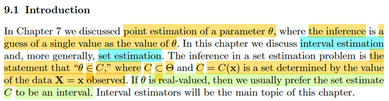
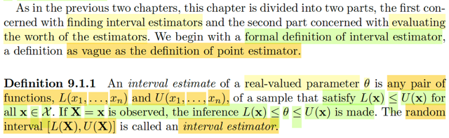
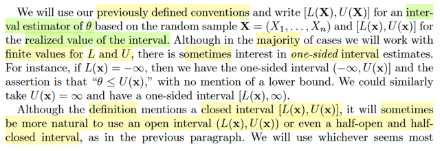
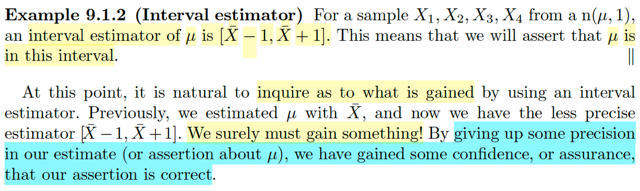
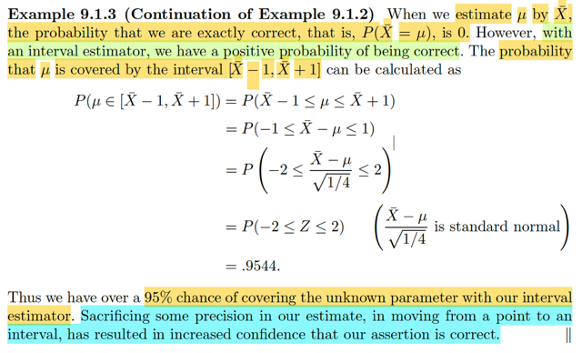
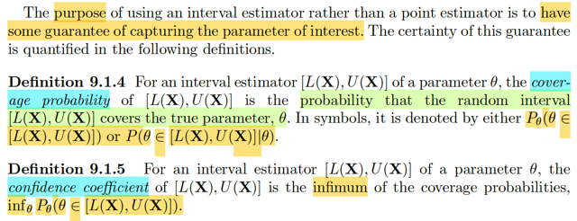
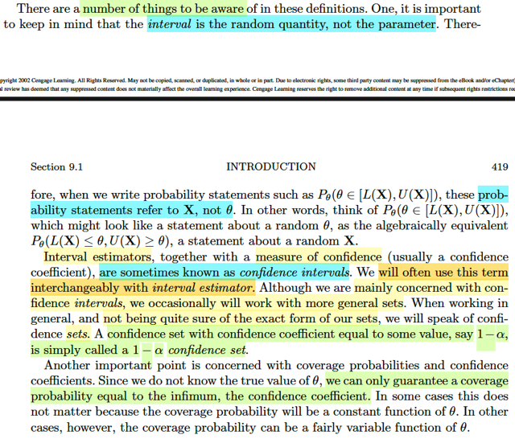
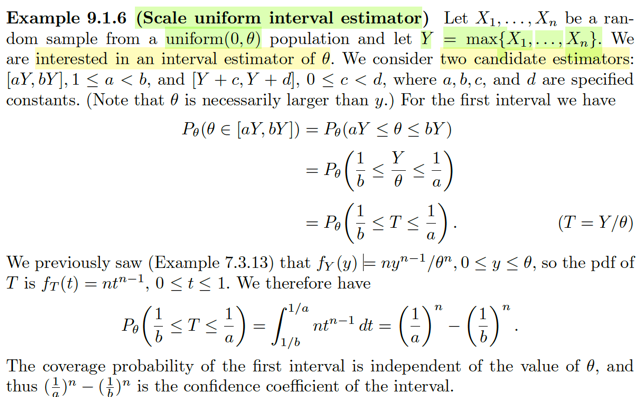
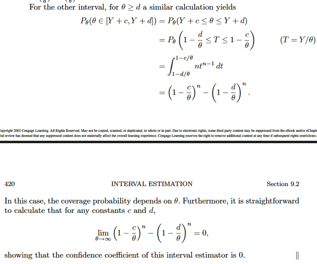

# 9.1 Introduction

📊 **Progress:** `9` Notes | `9` Screenshots

---

<kbd></kbd>

> [!NOTE]
> Đại khái là hồi chap 7 mình đã bàn về một cách suy diễn (inference) về
> tham số θ của population distribution gọi là point estimation, mà trong đó
> một "sự suy luận điểm" (point estimate) cho θ chính là việc ta đưa ra một giá
> trị để  estimate cho giá trị của θ. Rồi qua chapter 8, mình được học một
> cách suy diễn khác, trong đó, một kết quả suy diễn sẽ là đưa ra một nhận
> định rằng trong hai nhận định H0: θ ∈ Θ0 vs H1: θ ∈ Θ0c thì cái nào đúng,
> đồng nghĩa là ta suy diễn bằng cách nhận định rằng θ nằm trong Θ0 hay
> Θ0c
>
> Vậy thì ở chương này, ta bàn một cách suy luận hơi giống cả chap 7 và
> chap 8 Giống chap 7 ở chỗ thay vì đưa ra statement là một giá trị nào đó
> của θ (điều này cũng giống đưa ra statement là θ nằm trong một tập
> singleton), thì ta sẽ đưa ra statement là θ nằm trong một tập C nào đó. Và C
> lại là tập phụ thuộc **x**: C(**x**). Dễ thấy cũng khiến phương pháp này
> giống với chap 8, vì statement cũng là nói θ nằm trong tập Có điều mình có
> thể nhận thấy, cái tập C(**x**) khác với Θ0 hay Θ0c, vốn dĩ đã được define
> từ trước, còn C(**x**) là tập mà ta phải tìm.
>
> Rồi thế thì dĩ nhiên nếu θ mang giá trị thực thì một tập liên tục của giá trị
> thực thì được gọi là interval, từ đó có bài toán interval estimation.

 

<kbd></kbd>

> [!NOTE]
> Ta sẽ bắt đầu với định nghĩa của INTERVAL ESTIMATION mà tác giả nói cũng
> mơ hồ y như định nghĩa của point estimation Còn nhớ, theo định nghĩa, point
> estimation là ANY FUNCTION OF RANDOM SAMPLE W(**X**). Định nghĩa
> này  rất mơ hồ, và nó không giúp ích gì cho việc đi tìm một point estimator tốt
> cả. Vậy thì ở đây cũng tương tự, interval estimation của một real value θ, được
> định nghĩa chỉ là một **CẶP FUNCTION CỦA RANDOM SAMPLE**: [L(**X**),
> U(**X**)] sao cho L(**x**) ≤ U(**x**) với mọi **x** ∈ range **X**.
>
> Và khi đó, với một observed value **X** = **x**, thì một INTERVAL ESTIMATE
> sẽ  được xác lập: [L(**x**), U(**x**)]. (có nghĩa là, đó chính là lúc ta đưa ra một
> inference:  θ ∈ C(**x**) = [L(**x**), U(**x**)])
>
> Và [L(**X**), U(**X**)] (được gọi là một random interval - interval tạo bởi hai
> random variable) sẽ chính là một INTERVAL ESTIMATOR

 

<kbd></kbd>

> [!NOTE]
> Đại khái là ta sẽ theo quy ước (convention) lâu nay, là dùng chữ hoa
> [L(**X**), U(**X**)] để chỉ một interval estimator (giống như W(**X**) hay δ(**X**) là point 
> estimator) và [L(**x**), U(**x**)] là interval estimate, tức là giá trị cụ thể của cái 
> interval khi quan sát thấy **X** = **x**.
>
> Ngoài ra một điểm cũng dễ hiểu, là dù phần lớn thời gian ta sẽ deal với
> infinite interval, nhưng có khi ta cũng muốn one-sided interval estimate khi
> L(**x**) = -inf hoặc U(**x**) = +inf
>
> Khi đó inference statement sẽ là "θ ≤ U(**x**)" hoặc "θ ≥ L(**x**)"
>
> Một điều nữa, cũng có thể dùng < thay vì ≤. Và cái này thì tùy tình hình

 

<kbd></kbd>

> [!NOTE]
> Một ví dụ interval estimator là [Xbar-1, Xbar+1], tức L(**X**) = Xbar-1,
> U(**X**) = Xbar+1
>
> Tác giả mới nói thế này: Với point estimator, ta dùng Xbar để estimate
> cho μ. Mà bây giờ, ta lại estimate μ bởi một khoảng. Mà một khoảng
> thì dĩ nhiên là không thể hiện sự chính xác bằng một điểm. Vậy thì có
> LỢI LỘC GÌ KHI LÀM VẬY?
>
> Câu trả lời là: TA **HI SINH SỰ CHÍNH XÁC**, NHƯNG TA **ĐƯỢC THÊM 
> SỰ TỰ TIN** RẰNG NHẬN ĐỊNH CỦA MÌNH LÀ ĐÚNG.
>
> Việc này dễ hiểu, nếu đưa ra dự đoán μ bằng đúng Xbar = 10 chẳng hạn,
> thì mình sẽ không thể tự tin bằng việcv đưa ra dự đoán Xbar nằm đâu đó 
> từ 9 đến 11.

 

<kbd></kbd>

> [!NOTE]
> Đây là một ý rất quan trọng: Khi ta estimate μ bởi Xbar, thì xác suất mà
> Xbar bằng đúng μ chỉ là 0. Vì sao, vì ta đã biết với biến liên tục, thì xác
> suất nó bằng một giá trị cụ thể = 0, chú ý rv ở đây là Xbar nhé, ko phải
> là μ, vì nếu không nói cụ thể thì ta hiểu mình vẫn đang xét bối cảnh là
> theo trường phái cổ điển - frequentist, trong đó coi θ (hay μ) là fixed but
> unknown
>
> Còn với nhận định "μ ∈ [Xbar-1, Xbar+1]" thì xác suất nhận định này
> đúng sẽ là con số dương.
>
> Vì sao dương? P(Xbar-1 ≤ μ ≤ Xbar+1)
>
> = P(Xbar-1 ≤ μ, μ ≤ Xbar+1)
>
> = P(μ-1≤ Xbar ≤ μ+1)
>
> = ∫μ-1:μ+1 f(xbar)dxbar với f(xbar) là pdf của Xbar luôn không âm theo
> axiom 1, và tích phân này là diện tích dưới đường cong f(xbar) từ μ-1
> tới μ+1, nên sẽ là giá trị dương.
>
> Tính chính xác ra:
>
> P(Xbar-1 ≤ μ ≤ Xbar+1) = P(Xbar-1 ≤ μ, μ ≤ Xbar+1)
>
> = P(Xbar-μ  ≤ 1, -1 ≤ Xbar-μ )
>
> = P(-1 ≤ Xbar-μ ≤ 1)
>
> = P(-1 / (σ/√n) ≤ (Xbar-μ) / (σ/√n) ≤ 1 / (σ/√n))
>
> = P(-1 / (1/√4) ≤ Z ≤ 1 / (1/√4))
>
> = P(-2 ≤ Z ≤ 2)
>
> (Xbar ~ normal(μ, σ^2/n), là location scale family location μ, scale σ/√n
> ⇨ Z = (Xbar - μ) / (σ/√n) ~ standard member và → Z ~ normal(0,1)
>
> Và có thể tra bảng để tính ra xác suất này là .9544
>
> Như vậy, minh họa cho việc, ta hi sinh sự chính xác trong nhận định,
> nhưng được lại là có được một con số thể hiện mức độ tự tin rằng nhận
> định của ta là chính xác đây chính là cái được khi chuyển từ point
> estimation sang interval estimation.

 

<kbd></kbd>

> [!NOTE]
> tác giả cho biết, MỤC ĐÍCH của việc dùng interval estimator thay vì point
> estimator là ĐỂ CÓ ĐƯỢC CHÚT GÌ ĐÓ ĐẢM BẢO RẰNG TA SẼ CAPTURE
> ĐƯỢC CÁI PARAMETER.
>
> Ta được học hai định nghĩa:
>
> Đầu tiên, là cái gọi là **COVERAGE PROBABILITY**, tạm dịch là xác suất
> BAO PHỦ, được định nghĩa là một hàm theo θ mang giá trị là xác suất mà cái
> interval estimator [L(**X**), U(**X**)]có thể chứa θ ở trỏng: P_θ(L(**X**) ≤ θ ≤
> U(**X**)). Tức là, mình hiểu là, nó kiểu như là một thuộc tính của một interval
> estimator, giống như power function, là một thuộc tính, của một test, từ đó
> giúp so sánh các interval estimator với nhau xem thằng nào hơn giống như
> power giúp so sánh các test vậy
>
> nên mình đoán là có thể ghi là hàm converate probability: c_θ([L(**X**),
> U(**X**)] = P_θ(L(**X**) ≤ θ ≤ U(**X**)) hoặc P(L(**X**) ≤ θ ≤ U(**X**)|θ)
>
> Định nghĩa thứ hai là **CONFIDENCE COEFFICIENT**, được định nghiã là
> inf_θ P_θ[L(**X**) ≤ θ ≤ U(**X**)], tức  là mức coverage probability thấp nhất
> khi xét mọi θ ∈ Θ. Dĩ nhiên với cái infimum thì cái này ko còn phụ thuộc θ
> nữa.

 

<kbd></kbd>

> [!NOTE]
> Vài điểm gs lưu ý ta, cái đầu tiên thì mình đã nhận ra, khi nói đến xác suất
> θ ∈ [L(**X**), U(**X**)] thì biến ngẫu nhiên ở đâu là L(**X**) và U(**X**) chứ
> ko phải θ.
>
> nên đây phải hiểu là xác xuất của joint event P(L(**X**) ≤ θ, U(**X**) ≥ θ)
>
> Điểm thứ hai, là tên gọi, đôi khi người ta gọi là **CONFIDENCE INTERVAL**
> thay vì**INTERVAL ESTIMATOR.**
>
> Rồi, có khi ta làm việc với một set mang tính khái quát hơn là chỉ interval
> khi đó mình gọi là **CONFIDENCE SETS**
>
> Nếu nó có **confidence coefficient** bằng giá trị nào đó, ví dụ 1-α thì ta gọi nó
> là 1**-α CONFIDENCE SET.**

 

<kbd></kbd>

🔗 **Related:** [5.4 ORDER STATISTIC](54_order_statistic.md#node-386)

> [!NOTE]
> Ví dụ này, cho X1,....Xn là random sample ~uniform(0, θ) và Y là max{X1,...Xn}
> (tức là X^(n)) ta sẽ xem xét hai interval estimator của θ: [aY, bY] với 1 ≤ a ≤ b và
> [Y+c, Y+d] với 0 ≤ c < d.
>
> Thử tính confidence probability của cái interval estimator thứ nhất.
>
> Theo định nghĩa vừa mới học, confidence probability của một interval estimator
> [L(X), U(X)] là hàm theo θ, define bởi P_θ(θ ∈ [L(**X**), U(**X**)])
>
> → P_θ(aY ≤ θ ≤ bY)
>
> dĩ nhiên cái này bằng:
>
> P_θ(Y/θ ≤ 1/a, 1/b ≤ Y/θ)
>
> = P_θ(1/b ≤ Y/θ ≤ 1/a)
>
> Đặt T = Y/θ
>
> Ta đã biết công thức pdf của order statistic X^(j) (là cái thằng lớn thứ j trong đám,
> lớn nhất là X^(n))
>
> fX(j)(x) = n!/(j-1)!(n-j)! fX(x)[FX(x)]^j-1[1-FX(x)]^(n-j)
>
> → fX(n)(x) = n!/(n-1)!(n-n)! fX(x)[FX(x)]^n-1[1-FX(x)]^(n-n)
>
> = n fX(x)[FX(x)]^(n-1)[1-FX(x)]^(0)
>
> = n fX(x)[FX(x)]^(n-1)
>
> Với X1,...Xn ~ uniform(0, θ) thì FX(x) là gì?
>
> pdf của X ~ uniform(a,b): f(x) = 1/(b-a) → với uniform(0, θ), f(x) = 1/θ
>
> cdf F(x) = P(X ≤ x) = ∫-inf:xf(t)dt = ∫0:x (1/θ) dt = (1/θ) ∫0:x dt = (1/θ) x = x/θ
>
> -> FX(n)(x) = n (1/θ) (x/θ)^(n-1) = (n/θ) x^(n-1)/θ^(n-1) = nx^(n-1)/θ^n
>
> Và Y chính là X^(n)
>
> → fY(y) = ny^(n-1)/θ^n là công thức trong sách.
>
> -----
>
> Thế thì đặt T=Y/θ, với pdf của Y thì pdf của T thế nào?
>
> Dùng transformation theorem:
>
> Nhớ lại nếu Y = g(X) thì với g là mapping 1-1 y = g(x) ⇔ x = ginv(y):
>
> fY(y) = fX(x) |dx/dy|
>
> = fX(ginv(y) |d/dy ginv(y)|
>
> Áp dụng ở đây t = y/θ ⇔ y = θt, dy = θdt
>
> fT(t) = fY(θt) |θ| = fY(θt) θ (θ dương)
>
> = [n (θt)^(n-1)/θ^n] θ
>
> = n t^(n-1) θ^(n-1)/θ^n-1
>
> = n t^(n-1), đó là vì sao trong sách ta có fT(t) = n t^(n-1)
>
> Tất nhiên với range của Y là 0 ≤ y ≤ θ thì 0 ≤ y/θ ≤ 1 → range của T là [0,1]
>
> Với pdf của T ta có thể tính cái xác suất trên P(1/b ≤ T ≤ 1/a)
>
> = ∫(1/b):(1/a) fT(t)dt
>
> = ∫(1/b):(1/a) n t^(n-1) dt
>
> = n[nguyên hàm của t^(n-1)]|(1/b):(1/a)
>
> = n[t^n/n]|(1/b):(1/a)
>
> = (1/a)^n - (1/b)^n
>
> Và dĩ nhiên dễ thấy là cái này không dính tới θ nữa.
>
> nên khi tính CONFIDENCE COEFFICIENT, có định nghĩa là inf_θ [confidence
> coverage] thì nó cũng chính là confidence coverage = (1/a)^n - (1/b)^n

 

<kbd></kbd>

> [!NOTE]
> Làm tương tự cho cái interval estimator kia, ta có được confidence coverage 
> là (1 - c/θ)^n - (1 - d/θ)^n.
>
> Cái này còn dính θ, nên để có confidence coefficient ta phải giải bài toán
> tối ưu:
>
> minimize_θ ∈ [0, inf) (1 - c/θ)^n - (1 - d/θ)^n
>
> cái này thì dễ thấy là 
>
> khi θ → inf thì c/θ d/θ → 0 ⇨ (1 - c/θ)^n - (1 - d/θ)^n → (1 - 0)^n - (1 - 0)^n = 0
>
> nên inf_θ {(1 - c/θ)^n - (1 - d/θ)^n} = 0

 

