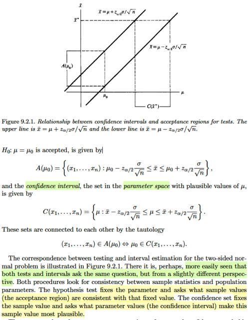

# 9.2 Methods Of Finding Interval Estimators

📊 **Progress:** `4` Notes | `6` Screenshots

---

<kbd></kbd>

> [!NOTE]
> Phần này ta sẽ học 4 phương pháp để tìm / xây dựng một interval estimator
> giáo sư nói rằng tuy trông có vẻ là 4 phương pháp khác nhau nhưng thực ra
> cách triển khai đều giống: dựa trên chiến lược ĐẢO NGƯỢC MỘT TEST
> STATISTIC. Chỉ có cái cuối, Bayesian intervals thì hơi khác

 

<kbd></kbd>

🔗 **Related:** [8.3 METHODS OF EVALUATING TEST](83_methods_of_evaluating_test.md#node-707)

> [!NOTE]
> Chiến lược đầu tiên: Đảo ngược một test statistic. Mở đầu gs nói có một sự
> TƯƠNG ỨNG RẤT MẠNH GIỮA MỘT HYPOTHESIS TESTING và INTERVAL
> ESTIMATION. Thậm chí ta có thể nói rằng, nói chung, MỌI CONFIDENCE SET
> đều tương ứng với một TEST và ngược lại.
>
> Có lẽ nên ôn một tí những định nghĩa hôm qua đã học: Đầu tiên, bài toán
> interval estimation là gì? Bắt đầu với việc nhớ lại trong point estimation, ta sẽ
> thực hiện một inference bằng cách đưa ra một point estimate cho giá trị của θ.
> Với bài toán hypothesis testing thì một inference là một kết luận / nhận định là θ
> nằm ở Θ0 hay Θ0c. Vậy thì với interval estimation, một inference là việc ta đưa
> ra nhận định rằng θ NẰM TRONG một tập C(**x**). Do đó, so với point
> estimation thì inference của bài toán interval estimation hi sinh sự chính xác,
> nhưng bù lại, có được một cái mà point estimation không có: khả năng đánh giá
> mức độ tự tin về inference. Vì so với P_θ(W(**X**) = θ) = 0, thì P_θ(C(**X**)
> chứa θ) sẽ dương.
>
> Thế thì thật ra ở dạng khái quát thì phải gọi là bài toán set estimation mới đúng.
> nhưng phần lớn thời gian ta sẽ deal với θ ∈ R, nên C(**X**) khi đó trở thành một
> interval [L(**X**), U(**X**)], gọi là random interval, dẫn đến cái tên interval
> estimation.
>
> Như vậy, định nghĩa chính thức của một interval estimatior chính là một random
> interval [L(**X**), U(**X**)], mà một khi quan sát được giá trị của **X** = **x**, ta
> sẽ xác lập được một inference: θ ∈ [L(**x**), U(**x**)] (y như khi trong bài toán
> point estimation, khi quan sát được **X** = **x**, thì ta sẽ xác lập một inference
> θ^ = W(**x**), với W là point estimator, hoặc trong bài toán hypothesis testing thì
> khi thấy **X** = **x**, sẽ xác lập inference là **X** ∈ R / reject H0 hay không).
>
> Qua đó cũng thấy sự giống nhau của interval estimation và hypothesis testing:
> Trong hypothesis testing, cái rejection region đã được xác lập sẵn, {**x** ∈ R:
> T(**X**) khiến reject H0} để rồi khi quan sát **X** = **x** lập tức inference được
> thiết lập: reject H0 (θ ∈ Θ0) nếu **x** ∈ R hay accept H0 Còn với interval
> estimation, khi quan sát **X** = **x**, thì C(**x**) mới được hình thành, và
> inference được thiết lập: θ ∈ C(**x**)
>
> Tiếp, xét cái xác suất P_θ(L(**X**) ≤ θ ≤ U(**X)**), thì cái này được gọi là
> **COVERAGE PROBABILITY**, nó là hàm theo θ, giúp đánh giá mức tự tin của
> một interval estimation, tương tự như power của một test (nhớ lại β(θ) =
> P_θ(**X** ∈ R), giúp đánh giá xác suất làm đúng việc accept H1 khi θ ∈ Θ0c của
> test)
>
> Và nếu lấy minimum: inf_θ∈Θ P_θ(L(**X**) ≤ θ ≤ U(**X**)) thì ta sẽ có một hàm
> không phụ thuộc θ nữa, gọi là **CONFIDENCE COEFFICIENT** Để rồi nếu ta
> có giá trị của cái này, ví dụ 1 - α thì ta gọi nó (cái interval estimator) là một **1
> - α confidence set**.
>
> ====
>
> Thế thì ở ví dụ này, cho X1,...Xn là iid normal(μ, σ^2) và xem xét test giữa H0: μ
> = μ0 vs H1: μ ≠ μ0. Với một fixed α level thì gs nói cái test mà reasonable nhất,
> mà quả thật nó chính là cái most power unbiased test chính là cái này: reject H0
> nếu |Xbar - μ0| > z_α/2 (σ/√n).
>
> Dừng lại một tí:
>
> Most power test là ý nói uniformly most powerful test UMP:
>
> Theo định nghĩa, là test mà β của nó lớn hơn mọi β của các test khác tại θ bất kì
> thuộc Θ0c
>
> Còn unbiased, theo định nghĩa là test mà β(θ') ≥ β(θ'') với mọi θ' ∈ Θ0c và θ'' ∈
> Θ0
>
> Nên xét ta sẽ đi tìm trong mọi unbiased test, cái nào là UMP thì ta sẽ có most
> powerful unbiased test.
>
> Tiếp, có thể dễ hiểu rằng với cái test có rule reject H0 khi |Xbar - μ0| > z_α/2
> σ/√n thì nó sẽ accept H0 khi |Xbar - μ0| ≤ z_α/2 (σ/√n)
>
> ⇔ -z_α/2 σ/√n ≤ Xbar - μ0 ≤ z_α/2 σ/√n
>
> ⇔ μ0 ≤ Xbar + z_α/2 σ/√n & Xbar - z_α/2 σ/√n ≤ μ0
>
> ⇔ Xbar - z_α/2 σ/√n ≤ μ0 ≤ Xbar + z_α/2 σ/√n
>
> Tiếp, đây là size α test, còn nhớ, theo định nghĩa: tức là sup_θ∈Θ0 (**X** ∈ R) =
> α
>
> ⇔ sup_μ=μ0 P_μ,σ^2(reject H0) = α
>
> ⇔ P_μ0,σ^2(reject H0) = α
>
> ⇔ P_μ0,σ^2(accept H1) = 1 - α
>
> ⇔ P_σ^2(Xbar - z_α/2 σ/√n ≤ μ0 ≤ Xbar + z_α/2 σ/√n) = 1 - α
>
> Tiếp, vì cái này đúng với mọi μ0: Dễ hiểu, vì lập trên không ràng buộc gì với μ0
> cả. Nên ta có:
>
> P_σ^2(Xbar - z_α/2 σ/√n ≤ μ ≤ Xbar + z_α/2 σ/√n) = 1 - α ∀μ ∈ R
>
> Tới đây ta có gì? Chính là một interval estimator [L(X), U(X)] với L(X) = Xbar -
> z_α/2 σ/√n và U(X) = Xbar + z_α/2 σ/√n. Và coverage probability là 1 - α, và
> cũng là confidence  coefficient vì inf_μ (1 - α) = 1 - α
>
> Vậy ta đã có một 1 - α confidence interval (hay 1 - α interval estimator) được xây
> dựng đơn giản chỉ bằng cách đảo ngược một hypothesis test

 

<kbd></kbd>

<kbd></kbd>

<kbd></kbd>

> [!NOTE]
> Hiểu đại khái là gs nói về mối liên hệ giữa acceptance region trong
> hypothesis test và confidence interval trong interval estimation,
>
> Với bài toán test giữa H0: θ ∈ Θ0 vs H1: θ ∈ Θ0c, như đã biết,
> rejection region R = {**x**: reject H0} mà trong ví dụ vừa rồi là  {**x:**|Xbar - μ0| > z_α/2 σ/√n}
>
> → Acceptance region: {**x**: |Xbar - μ0| ≤ z_α/2 σ/√n}
>
> = {**x**: -z_α/2 σ/√n ≤ xbar - μ0 ≤ z_α/2 σ/√n}
>
> Đặt kí hiệu nó là A(μ0)
>
> Thì dĩ nhiên đây là subset trong sample space, cái này ko có gì phải
> nói.
>
> Còn trong interval estimation, thì confidence set là:
>
> C(**x**) = {μ: xbar - z_α/2 σ/√n ≤ μ ≤ xbar + z_α/2 σ/√n}
>
> Và hai tập này kết nối với nhau qua quan hệ:
>
> **x** ∈ A(μ0) ⇔ μ0 ∈ C(**x**)
>
> Để rồi đại khái là sau khi đã thiết lập một cái test nào đó ví dụ cái
> test tốt nhất rồi, nó sẽ cho phép ta:
>
> Trong bài toán testing: ta giữ cố định parameter θ và đặt vấn đề là "
> **x nào thì sẽ phù hợp / consistent với θ đó" (thấy x bằng bao nhiêu
> thì ta sẽ accept θ đó, ám chỉ acceptance region)**Còn trong bài toán interval estimation: ta giữ cố định **x**, và đặt
> câu hỏi là θ nào phù hợp nhất với với (giá trị quan sát thấy) của
> **x** đó
>
> Ví dụ minh họa trong hình:
>
> Sử dụng cái most reasonable test (most power unbiased test rule)
> giúp thiết lập ra rejection / acceptance region
>
> Thì kiểu như nếu ta c**á cược rằng μ = μ0**, thì sẽ thiết lập đoạn A(μ0)
> là vùng mà **nếu sau này ta quan sát** được **X** = **x** **nằm trong này thì
> sẽ giúp kết luận mình đúng: accept μ = μ0** (accept H0 trong bài toán
> hypothesis test)
>
> Còn nếu ta làm ngược lại, **dựa quan sát thấy** **X** = **x***, để có
> xbar*, thì cái rule này sẽ **giúp xác lập** C(**x***) (hay C(xbar*) cũng
> được)****sẽ là **khoảng phù hợp mà ta cho rằng nhất định μ phải
> nằm trong đó**

 

<kbd></kbd>

> [!NOTE]
> Theorem 9.2.2 này sẽ chính thức tuyên bố quan hệ này: Tạm dịch  nó nói
> cho θ0 ∈ Θ, A(θ0) là acceptance region của một **level α test** của bài
> toán test giữa H0: θ = θ0 (vs H1: θ ≠ θ0). Với mọi **x** ∈ range **X**, ta
> mới define  C(**x**) trong parameter space: C(**x**) = {θ0 ∈ Θ: **x**∈****A(θ0)}. Khi đó, tập random set C(**X**) là một **1-α confidence set** (tức
> nó có confidence coefficient =  inf_θ P(θ ∈ C(**X**)) là 1-α)
>
> Ngược lại, nếu gọi C(**X**) là một **1-α confidence set** thì với mọi θ0 ∈
> Θ thì bằng cách định nghĩa A(θ0) = {**x**: θ0 ∈ C(**x**)} thì A(θ0) sẽ chính
> là acceptance region của một **level α test** của bài toán test H0: θ = θ0
> vs H1: θ ≠ θ0
>
> Tạm hiểu đại ý là nếu trong ta có một level α test cho bài toán kiẻm tra
> H0: θ = θ0 thì ta sẽ chắc chắn có được một interval estimator có
> confidence coefficient = 1 - α
>
> và ngược lại nếu ta có một interval estimator có confidence coefficient = 1
> - α thì ta có thể có được một level α test.
>
> Cụ thể là nếu ta có level α test, có acceptance region A(θ0) thì bằng cách
> đặt ra C(**x**) = {θ0: **x** ∈ A(θ0) thì C(**X**) chính là cái random interval
> của cái interval estimator có confidence coefficient 1-α nói trên.
>
> Ngược lại nếu ta có 1-α confidence interval có random interval là C(**X**)
> thì bằng cắt đặt A(θ0) = {**x**: θ0 ∈ C(**X**)} thì ta sẽ có ngay cái
> acceptance  region của cái level α test.
>
> Nhớ là: một cái test của bài toán hypothesis testing chỉ là cái rule, mà
> theo đó sẽ chia sample space  thành hai phần: rejection region và
> acceptance region Nên hiểu nôm na, cho ta cái acceptance region, chính
> là định ra một cái test rule.
>
> Và ta sẽ thấy liên hệ giữ α level test và 1-α interval estimator như vầy:
>
> α level test thì tức là test đó có sup_θ∈Θ0 P_θ(**X** ∈ R) ≤ α
>
> và đây là α level test của bài toán H0: θ = θ0 nên ta có:
>
> sup_θ∈Θ0 P_θ(X ∈ R) ≤ α
>
> ⇔ P_θ0(X ∈ R) ≤ α
>
> cũng là P_θ0(reject H0) ≤ α
>
> cũng là 1 - P_θ0(accept H0) ≤ α
>
> cũng là P_θ0(accept H0) ≥ 1 - α
>
> cũng là P_θ0(**X**∈****A(θ0)) ≥ 1 - α (vì đã đặt A(θ0) là acceptance
> region)
>
> mà đã nói liên hệ **x** ∈ A(θ0) ⇔ θ0 ∈ C(**x**)
>
> → P_θ0(**X** ∈ A(θ0)) ≥ 1 - α
>
> ⇔ P_θ0(θ0 ∈ C(**X**)) ≥ 1 - α
>
> ⇔ inf_θ0∈Θ P_θ0(θ0 ∈ C(**X**)) ≥ 1 - α
>
> Và đây chính là cho thấy C(**X**) là một interval estimator có confidence
> coefficient  = 1 - α vì theo định nghĩa, confidence coefficient 
> = inf_θ P_θ(θ ∈ C(**X**))
>
> Ngược lại, giả sử ta có một interval estimator có confidence coefficient
> 1 - α tức là ta có:
>
> inf_θ∈Θ P_θ(θ ∈ C(**X**)) = 1 - α 
>
> ⇨ P_θ(θ ∈ C(X)) ≥ 1 - α ∀ θ ∈ Θ
>
> ⇨ P_θ(θ ∈ C(X)) ≥ 1 - α ∀ θ ∈ Θ

 

