# 9.2 Methods Of Finding Interval Estimators

📊 **Progress:** `25` Notes | `35` Screenshots

---

<kbd>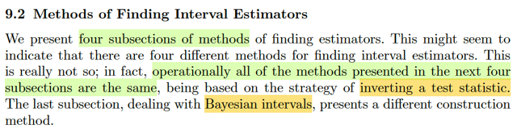</kbd>

> [!NOTE]
> Phần này ta sẽ học 4 phương pháp để tìm / xây dựng một interval estimator
> giáo sư nói rằng tuy trông có vẻ là 4 phương pháp khác nhau nhưng thực ra
> cách triển khai đều giống: dựa trên chiến lược ĐẢO NGƯỢC MỘT TEST
> STATISTIC. Chỉ có cái cuối, Bayesian intervals thì hơi khác

 

<kbd>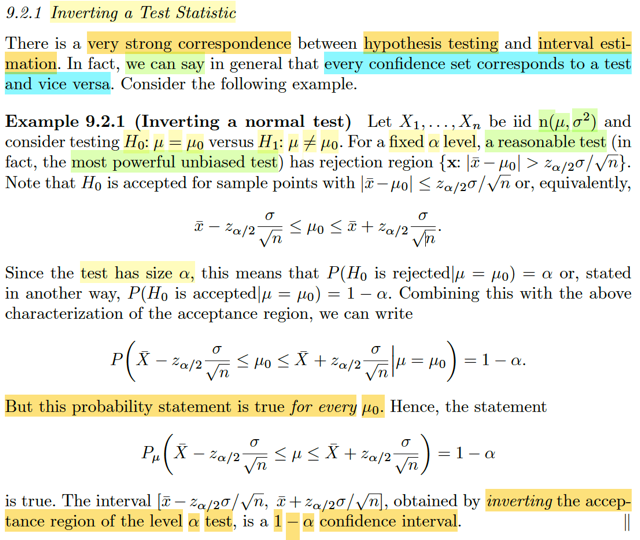</kbd>

🔗 **Related:** [8.3 METHODS OF EVALUATING TEST](83_methods_of_evaluating_test.md#node-707)

> [!NOTE]
> Chiến lược đầu tiên: Đảo ngược một test statistic. Mở đầu gs nói có một sự
> **TƯƠNG ỨNG RẤT MẠNH GIỮA MỘT HYPOTHESIS TESTING**và**INTERVAL
> ESTIMATION**. Thậm chí ta có thể nói rằng, nói chung, **MỌI CONFIDENCE SET**
> đều tương ứng với một **TEST** và ngược lại.
>
> Có lẽ nên ôn một tí những định nghĩa hôm qua đã học: Đầu tiên, bài toán
> interval estimation là gì? Bắt đầu với việc nhớ lại trong point estimation, ta sẽ
> thực hiện một inference bằng cách đưa ra một point estimate cho giá trị của θ.
> Với bài toán hypothesis testing thì một inference là một kết luận / nhận định là θ
> nằm ở Θ0 hay Θ0c. Vậy thì với interval estimation, một inference là việc ta đưa
> ra nhận định rằng θ NẰM TRONG một tập C(**x**). Do đó, so với point
> estimation thì inference của bài toán interval estimation hi sinh sự chính xác,
> nhưng bù lại, có được một cái mà point estimation không có: khả năng đánh giá
> mức độ tự tin về inference. Vì so với P_θ(W(**X**) = θ) = 0, thì P_θ(C(**X**)
> chứa θ) sẽ dương.
>
> Thế thì thật ra ở dạng khái quát thì phải gọi là bài toán set estimation mới đúng.
> nhưng phần lớn thời gian ta sẽ deal với θ ∈ R, nên C(**X**) khi đó trở thành một
> interval [L(**X**), U(**X**)], gọi là random interval, dẫn đến cái tên interval
> estimation.
>
> Như vậy, định nghĩa chính thức của một interval estimatior chính là một random
> interval [L(**X**), U(**X**)], mà một khi quan sát được giá trị của **X** = **x**, ta
> sẽ xác lập được một inference: θ ∈ [L(**x**), U(**x**)] (y như khi trong bài toán
> point estimation, khi quan sát được **X** = **x**, thì ta sẽ xác lập một inference
> θ^ = W(**x**), với W là point estimator, hoặc trong bài toán hypothesis testing thì
> khi thấy **X** = **x**, sẽ xác lập inference là **X** ∈ R / reject H0 hay không).
>
> Qua đó cũng thấy sự giống nhau của interval estimation và hypothesis testing:
> Trong hypothesis testing, cái rejection region đã được xác lập sẵn, {**x** ∈ R:
> T(**X**) khiến reject H0} để rồi khi quan sát **X** = **x** lập tức inference được
> thiết lập: reject H0 (θ ∈ Θ0) nếu **x** ∈ R hay accept H0 Còn với interval
> estimation, khi quan sát **X** = **x**, thì C(**x**) mới được hình thành, và
> inference được thiết lập: θ ∈ C(**x**)
>
> Tiếp, xét cái xác suất P_θ(L(**X**) ≤ θ ≤ U(**X)**), thì cái này được gọi là
> **COVERAGE PROBABILITY**, nó là hàm theo θ, giúp đánh giá mức tự tin của
> một interval estimation, tương tự như power của một test (nhớ lại β(θ) =
> P_θ(**X** ∈ R), giúp đánh giá xác suất làm đúng việc accept H1 khi θ ∈ Θ0c của
> test)
>
> Và nếu lấy minimum: inf_θ∈Θ P_θ(L(**X**) ≤ θ ≤ U(**X**)) thì ta sẽ có một hàm
> không phụ thuộc θ nữa, gọi là **CONFIDENCE COEFFICIENT** Để rồi nếu ta
> có giá trị của cái này, ví dụ 1 - α thì ta gọi nó (cái interval estimator) là một **1
> - α confidence set**.
>
> ====
>
> Thế thì ở ví dụ này, cho X1,...Xn là iid normal(μ, σ^2) và xem xét test giữa H0: μ
> = μ0 vs H1: μ ≠ μ0. Với một fixed α level thì gs nói cái test mà reasonable nhất,
> mà quả thật nó chính là cái most power unbiased test chính là cái này: reject H0
> nếu |Xbar - μ0| > z_α/2 (σ/√n).
>
> Dừng lại một tí:
>
> Most power test là ý nói uniformly most powerful test UMP:
>
> Theo định nghĩa, là test mà β của nó lớn hơn mọi β của các test khác tại θ bất kì
> thuộc Θ0c
>
> Còn unbiased, theo định nghĩa là test mà β(θ') ≥ β(θ'') với mọi θ' ∈ Θ0c và θ'' ∈
> Θ0
>
> Nên xét ta sẽ đi tìm trong mọi unbiased test, cái nào là UMP thì ta sẽ có most
> powerful unbiased test.
>
> Tiếp, có thể dễ hiểu rằng với cái test có rule reject H0 khi |Xbar - μ0| > z_α/2
> σ/√n thì nó sẽ accept H0 khi |Xbar - μ0| ≤ z_α/2 (σ/√n)
>
> ⇔ -z_α/2 σ/√n ≤ Xbar - μ0 ≤ z_α/2 σ/√n
>
> ⇔ μ0 ≤ Xbar + z_α/2 σ/√n & Xbar - z_α/2 σ/√n ≤ μ0
>
> ⇔ Xbar - z_α/2 σ/√n ≤ μ0 ≤ Xbar + z_α/2 σ/√n
>
> Tiếp, đây là size α test, còn nhớ, theo định nghĩa: tức là sup_θ∈Θ0 (**X** ∈ R) =
> α
>
> ⇔ sup_μ=μ0 P_μ,σ^2(reject H0) = α
>
> ⇔ P_μ0,σ^2(reject H0) = α
>
> ⇔ P_μ0,σ^2(accept H1) = 1 - α
>
> ⇔ P_σ^2(Xbar - z_α/2 σ/√n ≤ μ0 ≤ Xbar + z_α/2 σ/√n) = 1 - α
>
> Tiếp, vì cái này đúng với mọi μ0: Dễ hiểu, vì lập trên không ràng buộc gì với μ0
> cả. Nên ta có:
>
> P_σ^2(Xbar - z_α/2 σ/√n ≤ μ ≤ Xbar + z_α/2 σ/√n) = 1 - α ∀μ ∈ R
>
> Tới đây ta có gì? Chính là một interval estimator [L(**X**), U(**X**)] với L(**X**) = Xbar -
> z_α/2 σ/√n và U(X) = Xbar + z_α/2 σ/√n. Và coverage probability là 1 - α, và
> cũng là confidence coefficient vì inf_μ (1 - α) = 1 - α
>
> Vậy ta đã có một **1 - α confidence interval** (hay 1 - α interval estimator) được xây
> dựng đơn giản chỉ bằng cách đảo ngược một hypothesis test

 

<kbd>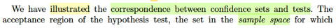</kbd>

<kbd></kbd>

<kbd>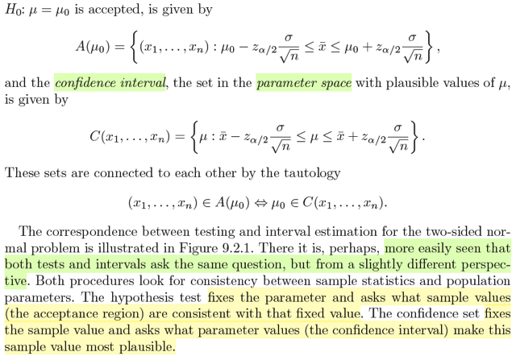</kbd>

> [!NOTE]
> Hiểu đại khái là gs nói về mối liên hệ giữa acceptance region trong
> hypothesis test và confidence interval trong interval estimation,
>
> Với bài toán test giữa H0: θ ∈ Θ0 vs H1: θ ∈ Θ0c, như đã biết, rejection
> region R = {**x**: reject H0} mà trong ví dụ vừa rồi là  {**x:**|Xbar - μ0| >
> z_α/2 σ/√n}
>
> → Acceptance region: {**x**: |Xbar - μ0| ≤ z_α/2 σ/√n}
>
> = {**x**: -z_α/2 σ/√n ≤ xbar - μ0 ≤ z_α/2 σ/√n}
>
> Đặt kí hiệu nó là A(μ0)
>
> Thì dĩ nhiên đây là subset trong sample space, cái này ko có gì phải nói.
>
> Còn trong interval estimation, thì confidence set là:
>
> C(**x**) = {μ: xbar - z_α/2 σ/√n ≤ μ ≤ xbar + z_α/2 σ/√n}
>
> Và hai tập này kết nối với nhau qua quan hệ:
>
> **x** ∈ A(μ0) ⇔ μ0 ∈ C(**x**)
>
> Để rồi đại khái là sau khi đã thiết lập một cái test nào đó ví dụ cái test tốt nhất
> rồi, nó sẽ cho phép ta:
>
> Trong bài toán testing: ta giữ cố định parameter θ và đặt vấn đề là " **x nào
> thì sẽ phù hợp / consistent với θ đó" (thấy x bằng bao nhiêu thì ta sẽ accept
> θ đó, ám chỉ acceptance region)**Còn trong bài toán interval estimation: ta giữ cố định **x**, và đặt câu hỏi là
> θ nào phù hợp nhất với với (giá trị quan sát thấy) của **x** đó
>
> Ví dụ minh họa trong hình:
>
> Sử dụng cái most reasonable test (most power unbiased test rule) giúp thiết
> lập ra rejection / acceptance region
>
> Thì kiểu như nếu ta c**á cược rằng μ = μ0**, thì sẽ thiết lập đoạn A(μ0) là
> vùng mà **nếu sau này ta quan sát** được **X** = **x** **nằm trong này thì sẽ
> giúp kết luận mình đúng: accept μ = μ0** (accept H0 trong bài toán
> hypothesis test)
>
> Còn nếu ta làm ngược lại, **dựa quan sát thấy** **X** = **x***, để có xbar*, thì
> cái rule này sẽ **giúp xác lập** C(**x***) (hay C(xbar*) cũng được)****sẽ là
> **khoảng phù hợp mà ta cho rằng nhất định μ phải nằm trong đó**

 

<kbd>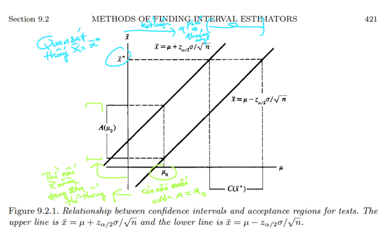</kbd>

> [!NOTE]
> Hình này rất quan trọng giúp hiểu:
>
> Luồng màu xanh dương: 
>
> 1) **QUAN SÁT THẤY** **X = x***(và****→ Xbar = xbar*) thì cái test rule của UMP****test
> sẽ **GIÚP KẾT LUẬN μ PHẢI NẰM TRONG ĐOẠN NÀY C(xbar*)**
>
> 2) Còn **MUỐN KẾT LUẬN μ = μ0**, thì **PHẢI QUAN SÁT THẤY Xbar NẰM TRONG
> ĐOẠN NÀY A(μ0)**

 

<kbd>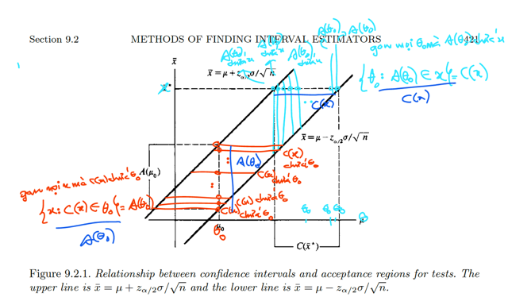</kbd>

> [!NOTE]
> Màu xanh: lấy **x** cụ thể nào đó. gom hết các ông θ0 ∈ θ có A(θ0)
> chứa **x**, tạo thành C(**x**)
>
> Màu đỏ: lấy θ0. gom hết các ông **x** ∈ **X** mà C(**x**) chứa θ0, đặt là
> A(θ0)

 

<kbd>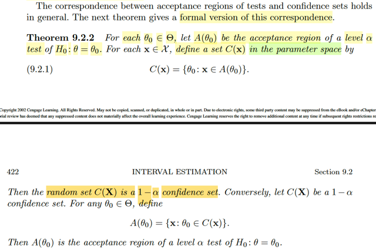</kbd>

> [!NOTE]
> Theorem 9.2.2 này sẽ chính thức tuyên bố quan hệ này: Hiểu đại khái
> cái theorem này như sau:
>
> Đầu tiên, nó nói nếu như ta xét tập A(θ0) là acceptance region, (đương
> nhiên, nó là tập chứa **x**) của một bài toán kiểm định H0: θ=θ0, và cái
> test tạo acceptance region này có level α. Thì ta có thể dùng nó để tạo
> một confidence set C(**X**) có coefficient 1-α bằng cách như sau:
>
> Xây dựng một hàm tập: **x** → tập C(**x**) chứa các θ0 mà tập A(θ0) của nó
> có chứa **x**. Nói bằng lời, cái hàm hàm này nhận vào **x**,****rồi bên trong gom
> các θ0 mà A(θ0) chứa **x** lại, và trả cái tập đó ra. Thì với cái hàm tập C(**x**)
> này, áp nó lên random sample **X**, ta sẽ có một RANDOM SET C(**X**). Và,
> đây chính là một confidence set có confidence coefficient 1 - α (theo định
> nghĩa, interval estimator, hay confidence set về bản chất chỉ là một random
> interval hay khái quát hơn là random set)
>
> -----
>
> Ở chiều ngược lại, nó nói, nếu ta có một confidence set C(**X**) (mà bản chất
> như vừa nói, chỉ là một random set, define bởi một hàm tập - set function
> c(**x**) áp lên random variable **X**) có coefficient 1-α. Thì theorem này nói rằng
> ta có thể dùng nó để mà xây dựng một test cho bài toán kiểm định H0: θ = θ0
> có level α. Làm như sau: Ta sẽ dùng cái hàm tập này, để tạo một tập như
> sau: gom các **x**mà C(x) chứa θ0, thành tập kí hiệu là A(θ0), thì cái tập này
> chính là acceptance region của cái test đang cần, dĩ nhiên đồng nghĩa đã
> định ra cái test đó.

 

<kbd>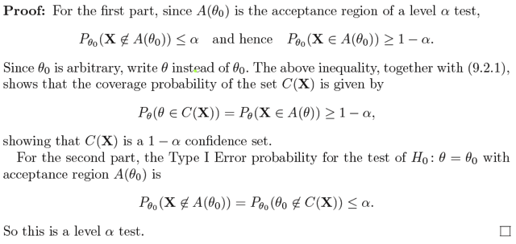</kbd>

> [!NOTE]
> Phần chứng minh:
>
> i) Ý đầu tiên nói nếu ta có A(θ0) là một tập acceptance region (của một test) có level α 
> cho bài toán kiểm tra H0: θ = θ0, thì ta sẽ có thể xây dựng một confidence set
> có coefficient 1 - α bằng cách như sau: Tạo hàm tập nhận vào một giá trị **x**,
> trả ra tập như sau: Xem trong các θ0 ∈ Θ, cái nào có A(θ0) chứa **x**, thì gom lại
> thành tập C(**x**) = {θ0 ∈ Θ: **x**∈****A(θ0)}. Khi đó áp cái hàm này lên **X**, sẽ cho ta 
> một random set, hay random interval, là nó chính là một confidence set có 
> confidence coefficient = 1-α:
>
> Vậy đầu tiên ta có level α acceptance region A(θ0) nên A(θ0) là rejection region.
> Theo định nghĩa của level α test, ta có sup_θ∈Θ0 P_θ(**X** ∈ A(θ0)c) ≤ α. 
>
> sup_θ=θ0 P_θ(X ∈ A(θ0)c) ≤ α.
>
> ⇔ P_θ0(**X** ∈ A(θ0)c) ≤ α.
>
> ⇔ 1 - P_θ0(**X** ∈ A(θ0)) ≤ α 
>
> ⇔ 1 - α ≤ P_θ0(**X** ∈ A(θ0)) 
>
> Nhớ rằng thứ ta đang có là do giả thuyết cho level α acceptance region A(θ0)
> của bài toán test H0: θ = θ0
>
> Rồi đến đây ta mới xem cách xây dựng 1-α confidence set, nhắc lại cho nhớ: với mỗi
> x trong range X. tạo tập C(x) = {θ0 ∈ Θ: A(θ0) chứa x}. Vì cách tạo này nên:
>
> nếu θ0 thuộc Θ mà A(θ0) chứa x (tức x ∈ A(θ0)) thì nó (θ0) sẽ chứa trong C(x) và 
> ngược lại, nếu θ0 nằm trong C(x) thì nhất định A(θ0) của nó sẽ chứa x. Nên ta có
> quan hệ: θ0 ∈ C(x) ⇔ x ∈ A(θ0)
>
> Rồi, vậy giờ xét P_θ0(**X** ∈ A(θ0)), về bản chất nó là cái gì:
>
> theo lí thuyết xác suất, nó chính là: P_θ0({s ∈ Ω: **X**(s) ∈ A(θ0)})
>
> = P_θ0({**x** ∈ range **X**: **x** ∈ A(θ0)})
>
> mà **x** ∈ A(θ0) ⇔ θ0 ∈ C(**x**)
>
> ⇨ = P_θ0({x ∈ range X: x ∈ A(θ0)}) = P_θ0({**x** ∈ range **X**: θ0 ∈ C(x)})
>
> và đây chính là P_θ0(θ0 ∈ C(**X**))
>
> Như vậy ta có C(**X**) là một random set có tính chất:
>
> 1 - α ≤ P_θ0(θ0 ∈ C(**X**)) 
>
> và điều này đúng với θ0 tùy ý, vì θ0 có từ giả thuyết là giá trị tùy ý trong Θ, hoàn toàn
> không có ràng buộc nào.
>
> Do đó ta có thể ghi là:
>
> 1 - α ≤ P_θ(θ ∈ C(**X**))
>
> và do đó 1 - α ≤ inf_θ∈Θ P_θ(θ ∈ C(**X**))
>
> Và đây chính là định nghĩa của một 1-α confidence set, một cái lưới giăng bẫy θ mà
> xác suất bắt dính được θ (dù chưa biết nó ở đâu) cũng luôn từ 1-α trở lên.
>
> ====
>
> Ngược lại, nếu xuất phát điểm của ta có là một 1-α confidence set C(**X**), thì theorem
> này nói là có thể xây dựng một test có level α cho bài toán kiểm định H0: θ = θ0 với
> θ0 bất kì trong Θ. Và cách xây dựng như sau: Còn nhớ, một test, thật ra là một rule,
> và cái rule này có thể được nhìn nhận ở dạng một cái rejection region R hay phần bù
> của nó, acceptance region Rc. Vậy thì, từ confidence set C(**X**), ta sẽ xài cái hàm C(**x**)
> để gom hết các thằng **x** ∈ range **X** nào mà C(**x**) của nó chứa θ0 (θ0 của H0: θ = θ0 
> đang xét), và gom lại thành tập gọi là A(θ0). Thì cái tập này, theo theorem, chính là
> Rc của tạo bởi một level α test của bài toán kiểm định H0: θ = θ0.
>
> Chứng minh: Ta có 1-α confidence set C(**X**), nên theo định nghĩa của confidence 
> coefficient:
>
> inf_θ∈Θ P_θ(θ ∈ C(**X**)) = 1 - α 
>
> ⇨ 1 - α ≤ P_θ(θ ∈ C(**X**)) ∀θ 
>
> (mang ý nghĩa, cái lưới C(**X**) này, luôn có xác suất bắt được θ) ít nhất là từ 1 - α trở lên, 
> dù θ nằm ở đâu)
>
> vì nó đúng với mọi θ nên nó đúng với θ = θ0 mà ta đang xét bài toán kiểm tra H0: θ = θ0
>
> 1 - α ≤ P_θ0(θ0 ∈ C(**X**)) (1)
>
> lưu ý, đên đây chỉ đon thuần kết quả là do giả thuyết ta có 1-α confidence set.
>
> Bây giờ ta mới xét cách xây dựng test, chính xác là tập Rc của nó: tập A(θ0) là tập chứa
> các giá trị **x** ∈ range **X** sao cho C(**x**) chứa θ0. Vì cách xây dựng như vậy cho nên ta có
> quan hệ: **x** mà thuộc A(θ0) thì có nghĩa là θ0 thuộc C(**x**) và ngược lại, θ0 thuộc C(**x**) thì
> **x**nằm trong A(θ0): **x** ∈ A(θ0) ⇔ θ0 ∈ C(**x**)
>
> Như vậy, ta xét event θ0 ∈ C(**X**), event này có bản chất là {**x** ∈ **X**: θ0 ∈ C(**x**)} và vì cái ta có
> ở trên nên tập này bằng tập {**x** ∈ **X**: x ∈ A(θ0)} = **X** ∈ A(θ0)
>
> ⇨ P_θ0(θ0 ∈ C(**X**)) = P_θ0(**X** ∈ A(θ0))
>
> vậy (1) ⇔ 1 - α ≤ P_θ0(**X** ∈ A(θ0))
>
> ⇔ 1 - α ≤ 1 - P_θ0(**X** ∈ A(θ0)c)) 
>
> ⇔ P_θ0(**X** ∈ A(θ0)c)) ≤ α 
>
> ⇔ sup_θ∈Θ0={θ0} P_θ(**X** ∈ A(θ0)c)) ≤ α   
>
> Và đây chính là nói rằng test có rejection region A(θ0)c (cũng là acceptance region A(θ0)
> là một level α test. Chứng minh xong.

 

<kbd>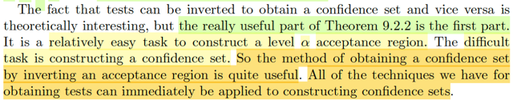</kbd>

> [!NOTE]
> Đoạn này đại khái gs nói là cái sự thật mà ta vừa được biết rằng có thể đảo
> ngược một cái test để có một cái interval estimator (hay ta nhớ nó còn có cái
> tên khác là confidence interval, và khái quát hơn là confidence set) và ngược
> lại rất hay nhưng thật sự thì cái phần đầu mới là hữu ích (tức có test, invert để
> có interval estimator)
>
> Và nó hữu ích là bởi vì thực tế việc**xây dựng một cái interval estimator
> thường khó**, nhưng việc **xây dựng cái level α acceptance region** (ý là cái
> level α test) thì thường là dễ, nên cách vụ **invert test ra interval estimator này
> rất có lợi**. Mà xây dựng test thì ta đã biết các cách để làm như hồi chap
> trước rồi.

 

<kbd>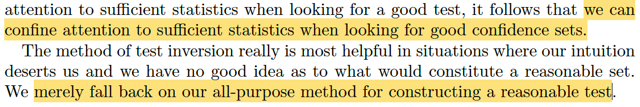</kbd>

<kbd></kbd>

<kbd>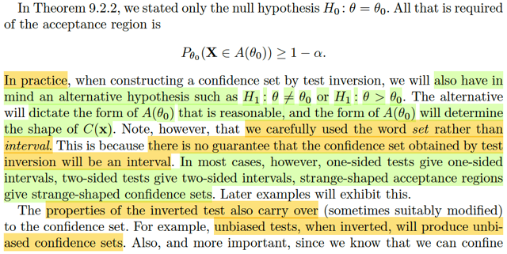</kbd>

> [!NOTE]
> tiếp đại khái là theorem 9.2.2 ta chỉ nói đến bài toán mà null hypothesis là H0:
> θ = θ0, và yêu cầu chỉ là bắt đầu với acceptance region có P_θ0 (X ∈ A(θ0)) ≥
> 1-α  (để từ đó ta có thể invert để có 1-α confidence set)
>
> Tuy nhiên gs nói, ta cũng phải xem xét cái H1 là gì nữa: là 2 side test (H1: θ ≠
> θ0) hay 1-side test (H0: θ > θ0) vì cái này sẽ ảnh hưởng đến dạng của A(θ0).
> và từ đó ảnh hưởng đến dạng của confidence set C(**x**).
>
> Ngoài ra, gs còn nói ta nên để ý là theorem chỉ dùng từ confidence set (thay
> vì confidence interval) vì không có gì đảm bảo C(**x**) sẽ là một interval. Tuy
> vậy phần lớn trường hợp ta sẽ thấy one-sided test sẽ cho ta one-sided
> interval two side test sẽ cho ta two-sides interval....
>
> Một điểm nữa cũng dễ hiểu, gs nói là các tính chất tốt đẹp của một test cũng
> sẽ được chuyển sang cho confidence set. Ví dụ như bắt đầu với unbiased
> test ta cũng sẽ có unbiased confidence set.
>
> Hoặc là ta cũng đã biết có thể xây dựng test dựa trên sufficient statistic thay
> vì random sample, thì inverting cũng sẽ giúp tạo confidence set như vậy.
>
> Cuối cùng, gs nói ta sẽ thấy cái này hữu ích nhiều nhất khi gặp tình huống
> mà ta ko có ý niệm gì về một reasonable set, (ý là ko có bất cứ ý niệm nào về
> cái interval mà ta nên tạo ra) thì khi đó bài toán trở về là đi theo cách tiếp cận
> đã  biết để tạo ra một reasonable test trước, rồi invert để có reasonable
> confidence set

 

<kbd>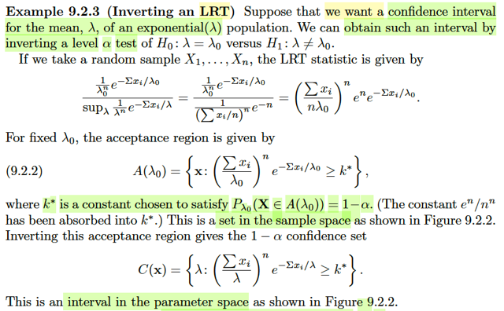</kbd>

> [!NOTE]
> Qua ví dụ này, ta cần xây dựng confidence interval cho mean của một
> expo(λ) population.
>
> Thế thì ta sẽ dùng inverting a test technique, và sẽ dùng một level α
> likelihood ratio test của bài toán testing H0: λ = λ0 vs H1: λ ≠ λ0.
>
> Đây là dịp ôn lại LRT là gì: LRT test, là một cái test, dùng likelihood ratio
> test statistic: λ(**X**) = sup_θ∈Θ0 L(θ|**x**) / sup_θ∈Θ L(θ|**x**) =
> L(θ^0|**x**)/L(θ|**x**) chính là likelihood function tại restricted to Θ0 MLE và
> unrestricted MLE.
>
> Còn còn nhớ, likelihood function là function của θ, được định nghĩa là
> L(θ|**x**) = f(**x**|θ) (là joint pdf/pmf của random sample) mang ý nghĩa là
> độ hợp lí của θ  khi quan sát được **X** = **x**.
>
> Cho nên ở đây, với expo(λ), L(λ|**x**) = f(**x**|λ) = Πi=1:n f(xi|λ)
>
> = (1/λ) e^-xi/λ  (do tính iid)
>
> = Πi=1:n (1/λ) e^-xi/λ
>
> = (1/λ)^n Πi=1:n e^-xi/λ
>
> = (1/λ)^n e^(-Σxi/λ)
>
> ⇨ λ(**x**) = sup_λ=λ0 {(1/λ)^n e^(-Σxi/λ)} / sup_λ {(1/λ)^n e^(-Σxi/λ)}
>
> = (1/λ0)^n e^(-Σxi/λ0) / sup_λ {(1/λ)^n e^(-Σxi/λ)}
>
> Xét cái mẫu, giải nhanh bài toán maximize_λ (1/λ)^n e^(-Σxi/λ)
>
> equivalent maximize_λ log f(λ)
>
> = log [(1/λ)^n e^(-Σxi/λ)]
>
> = log [λ^(-n) e^(-Σxi/λ)]
>
> = log [λ^(-n)] + [log e^(-Σxi/λ)]
>
> = -n log λ + -Σxi/λ
>
> f'(λ) = -n/λ +Σxi/λ^2
>
> f'(λ) = 0
>
> ⇔ -n/λ +Σxi/λ^2 = 0
>
> ⇔ Σxi/λ^2 = n/λ
>
> ⇔ Σxi/n = λ
>
> f''(λ) = n/λ^2 + Σxi [-1/(λ^2)^2] 2λ
>
> = n/λ^2 - 2Σxi /λ^3
>
> tại λ^ = Σxi/n → f''(λ^) = n/(Σxi/n)^2 - 2Σxi / (Σxi/n)^3
>
> = n^3 / (Σxi)^2 - 2 n^3 / (Σxi)^2
>
> = - n^3 / (Σxi)^2 < 0
>
> hay -n^3/(nλ)^2 = -n/(λ^)^2 < 0
>
> → λ^ = Σxi/n là maximum
>
> Và L(λ^|**x**) là mle, = (1/λ^)^n e^(-Σxi/λ^)
>
> = (1/(Σxi/n))^n e^(-Σxi/(Σxi/n))
>
> = (n/(Σxi))^n e^(-n)
>
> ⇨ λ(**x**) = (1/λ0)^n e^(-Σxi/λ0) / (n/(Σxi))^n e^(-n)
>
> = ((Σxi)/nλ0)^n e^(-Σxi/λ0 - (-n))
>
> = (Σxi/nλ0)^n e^(n)e^(-Σxi/λ0) là công thức trong sách.
>
> ====
>
> Thế thì với LRT thì cái rule sẽ là: reject H0 khi λ(**x**) ≤ c với c là con số
> nào đó từ 0 tới 1, ⇨ reject region là {**x**: λ(**x**) ≤ c} (và acceptance
> region là {**x:**λ(**x**) > c})
>
> Thế thì để có một level α test, hay ở đây ta thấy gs nói về luôn một size α
> test (là thằng tệ nhất trong đám level α test) thì c phải được chọn sao cho
> sup_θ∈Θ0 P_θ(reject H0) = α ⇔ P_λ0(λ(**X**) ≤ c) = α
>
> ⇔ P_λ0((Σxi/nλ0)^n e^(n)e^(-Σxi/λ0) ≤ c) = α
>
> ⇔ P_λ0((Σxi/λ0)^n e^(-Σxi/λ0) ≤ cn^n/e^(n)) = α
>
> Và gọi c được chọn, hay cả cái cục c(n^n)/e^(n) là k*. Ta có:
>
> P_λ0((Σxi/λ0)^n e^(-Σxi/λ0) ≤ k*) = α
>
> Và ta có rejection region: R = {**x**: (Σxi/λ0)^n e^(-Σxi/λ0) ≤ k*}
>
> Và acceptance region: Rc = {**x**: (Σxi/λ0)^n e^(-Σxi/λ0) > k*}, đặt nó là
> A(λ0)
>
> thì cái ta đang có chính là một level α acceptance region của bài toán kiểm
> tra H0: λ = λ0
>
> ----
>
> Đến đây, ôn lại theorem 9.2.2 một chút, ý (i) của nó nói rằng: nếu ta có
> A(θ0) là acceptance region tạo bởi một level α test, thì có thể xây dựng một
> 1-α confidence set như sau: tạo hàm-tập C(**x**): nhận vào **x**, xem hết
> các θ0 ∈ Θ, cái nào có A(θ0) chứa **x,** thì gom lại tạo tập C(**x**).
>
> C(**x**) = {θ0 ∈ Θ: **x** ∈ A(θ0)},
>
> trong cách ghi vừa rồi θ0 hay θ hay u gì đều được, vì nó là dummies
> variable.
>
> Nên ta sẽ ghi là C(**x**) = {θ ∈ Θ: **x** ∈ A(θ)}
>
> thì khi đó C(**X**) chính là một 1-α confidence set.
>
> Vậy ở đây ta có A(θ0) là A(λ0) = {**x**: (Σxi/λ0)^n e^(-Σxi/λ0) > k*}
>
> Ta sẽ làm như theorem: tạo hàm tập C(**x**) bằng cách gom những θ (λ)
> mà A(θ) chưá **x**:**** C(**x**) = {λ: A(λ) chứa **x**} = {λ: **x** ∈ A(**λ**)}
>
> mà **x** ∈ A(λ) thì tức là **x** thỏa cái rule (Σxi/λ)^n e^(-Σxi/λ) > k* giúp định
> ra tập A(λ) đó
>
> ⇨ C(**x**) = {λ: (Σxi/λ)^n e^(-Σxi/λ) > k*}
>
> Và từ đó, ta có random set:
>
> C(**X**) = {λ: (ΣXi/λ)^n e^(-ΣXi/λ) > k*} chính là một 1-α confidence set.

 

<kbd>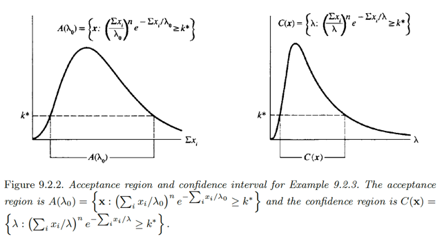</kbd>

> [!NOTE]
> Mình hiểu rằng tập A(λ0) là tập chứa x thỏa cái rule .. ≥ k* , mà cái rule này
> có thể thể hiện bởi Σxi, nên nếu vẽ đồ thị Σixi vs (Σxi/λ0)^n exp(-Σxi/λ0) 
> thì cái đoạn của Σxi mà đồ thị cao hơn k* chính là cái đoạn sẽ TƯƠNG ỨNG
> VỚI CÁI ĐOẠN CỦA x TRONG A(λ0) (phải nói vậy là vì A(λ0) là tập chứa **x**,
> là một range của **x, không phải range của Σixi**) n
>
> Nói ngắn gọn A(λ0) ở trong hình không phải là A(λ0) thật, nó chỉ là đoạn
> tương ứng của Σixi ứng với các **x** trong A(λ0)
>
> Còn hình thứ hai, ta vẽ cái đồ thị của λ vs (Σxi/λ)^n exp(-Σxi/λ). Thì vì C(**x**)
> là tập chứa λ thỏa cái rule này, nên đoạn λ mà ở đó đồ thị cao hơn k* quả
> thật chính là C(**x**) (khác với case trên)

 

<kbd>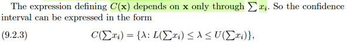</kbd>

<kbd>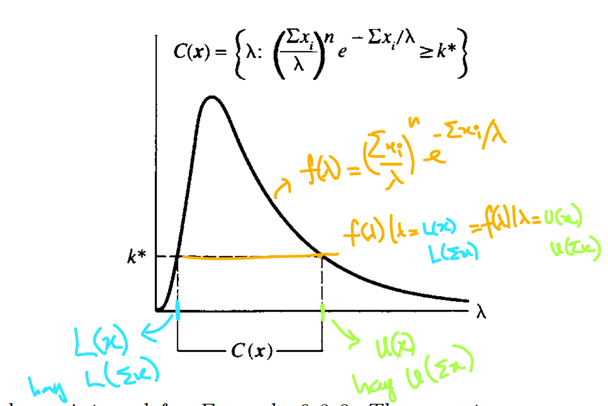</kbd>

<kbd></kbd>

<kbd></kbd>

<kbd>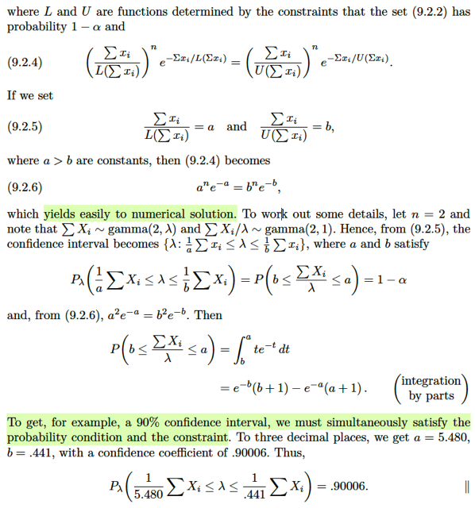</kbd>

🔗 **Related:** [4.6 MULTI-VARIATE DISTRIBUTION](46_multi_variate_distribution.md#node-313)

> [!NOTE]
> Tiếp, xét C(**X**) = {λ: (ΣXi/λ)^n e^(-ΣXi/λ) > k*} mà ta đã nói chính là một
> 1-α confidence set. Nên nhắc lại lần nữa, nó là tập chứa λ, thỏa cái rule f(λ)
> = (Σixi/λ)^n exp[-Σixi/λ] ≥ k*
>
> Thế thì, vì parameter space của λ là R, nên dĩ nhiên cái random set này là
> một random interval. Có nghĩa là với observed value **X** = **x**, ta sẽ có
> C(**x**) là một interval có dạng [λ_low, λ_high] mà với λ trong đó f(λ) ≥ k*.
>
> Thế thì, dĩ nhiên λ_low là giá trị cụ thể của hàm L(**x**)****nào đó và λ_high
> = U(**x**) nào đó.
>
> Hoặc là ta cũng có thể thay cách thể hiện hàm số trên bằng L(Σixi) và
> U(Σixi) để có thể thể hiện C(**X**) ở trên = [L(Σixi, U(Σixi)] với **L, U được
> define sao cho với mọi λ**∈**[λlow = L(Σixi), λhigh = U(Σixi)] thì f(λ) ≥ k*
> (1)**
>
> Và vì k* là con số để thỏa A(λ0) là một level α acceptance region để rồi
> C(**X**) theo định nghĩa trên ({λ: (ΣXi/λ)^n e^(-ΣXi/λ) > k*}) là một 1-α
> confidence interval,  nên giờ yêu cầu L, U thỏa cái (1) cũng chính là nói
> **cần tìm L,U sao cho khiến C(x)  = [L(x), U(x)] là một 1-α confidence
> interval
>
> Do đó điều (1) viết lại thành: inf_λ P_λ(λ**∈**[L(X), U(X)] = 1 - α**
>
> Vậy câu hỏi là **đi tìm L(.), U(.)**:
>
> Đầu tiên, dựa vào đồ thị, ta thấy: với observed value **X**=**x**
>
> f(λ)|λ=λlow = f(λ)|λ=λhigh
>
> ⇔ f(λ)|λ=L(Σixi) = f(λ)|λ=U(Σixi)
>
> ⇔ (Σixi/L(Σixi))^n exp[-Σixi/L(Σixi)] = (Σixi/U(Σixi))^n exp[-Σixi/U(Σixi)]
>
> Đặt a = Σixi/L(Σixi), b = Σixi/U(Σixi)
>
> Nếu ta có thể tìm a, b sao cho
>
> i) a^n exp(-a) = b^n exp(-b)
>
> ii) a và b phải sao đó thỏa với mọi λ ∈ [L(Σixi) = Σixi/a, U(Σixi) = Σixi/b] thì
> f(λ) ≥ k*
>
> thì khi đó ta sẽ đã xây dựng xong C(**X**) = [L(ΣiXi), U(ΣiXi)] là một 1-α
> confidence set
>
> ====
>
> Vậy thì để kiểu như ta có thể có một bài toán cụ thể để mà giải tìm một
> confidence set có level cụ thể nào đó. Người ta mới cho n = 2.
>
> Lúc này, xét điều kiện i) trở thành a^2 e^-a = b^2 e^-b
>
> và ii) trở thành tìm a, b sao cho inf_λ P_λ(λ ∈ [L(**X**), U(**X**)]) = 1 - α
>
> ⇔ 1 - α ≤ P_λ(L(**X**) ≤ λ ≤ U(**X**))
>
> ⇔ 1 - α ≤ P_λ(ΣiXi/a ≤ λ ≤ ΣiXi/b)
>
> ⇔ 1 - α ≤ P_λ(ΣiXi ≤ aλ, λb ≤ ΣiXi)
>
> ⇔ 1 - α ≤ P_λ(b ≤ ΣiXi/λ ≤ a)
>
> Rồi. Thế thì với expo(λ), ta biết nó cũng chính là một Γ(1, λ) distribution.
> (location param = 1, scale param = λ)
>
> Và ví dụ 4.6.7 ta cũng đã biết tổng của các iid Γ(αi, β) sẽ là một Γ(Σiαi, β)
>
> ⇨ ΣiXi ~ Γ(n, λ)
>
> và do đó theo lí thuyết location scale family, thì ΣiXi / λ là thành viên   có
> scale là 1: Γ(n, 1)
>
> Vậy Y = ΣiXi / λ ~  Γ(2, 1) như sách nói là vậy.
>
> Và P_λ(b ≤ ΣiXi/λ ≤ a) dĩ nhiên là ∫b:a fY(y)dy
>
> = ∫b:a ye^-ydy dùng tích phân từng phần ta sẽ giải ra cái này là
>
> e^-b(b+1) - e^-a(a+1)
>
> Áp vào điều kiện:
>
> 1 - α ≤ e^-b(b+1) - e^-a(a+1)
>
> Và a^2 e^-a = b^2 e^-b
>
> Chọn α = 0.1, có cách để giải ra a, b như vậy từ đó ta có một [L(**X**),
> U(**X**)] là một  1-α confidence set (cái này gs không nói)

 

<kbd>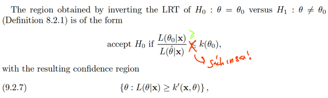</kbd>

> [!NOTE]
> Rồi, đoạn này đại khái là vầy: như ví dụ vừa rồi cũng đã ôn lại, một cái LRT sẽ có
> dạng như sau: reject H0 khi λ(**X**) ≤ c với λ(**X**) là LRT test statistic, có công thức
> = L(θ^0|**x**) / L(θ^|**x**) với θ^0 và θ^ là restricted on Θ0 và unrestricted MLE. Nên
> reject region sẽ là R = {**x**: L(θ^0|**x**) / L(θ^|**x**) ≤ c}, hay acceptance region là Rc
> = {**x**: L(θ^0|**x**) / L(θ^|**x**) > c}
>
> Với bài toán test H0: θ=θ0 thì dĩ nhiên L(θ^0|**x**) = L(θ0|**x**)
>
> ⇨ Rc = {**x**: L(θ0|**x**) / L(θ^|**x**) > c}
>
> Và để thể hiện c sẽ là một ngưỡng, được chọn cụ thể cho cái test đang phục vụ bài
> toán testing H0: θ=θ0. người ta dùng k(θ0) (ý nói, với θ0 khác nhau, ta dùng các
> threshold khác nhau, chỉ vậy thôi)
>
> Do đó gs Casella mới nói "cái region" là {**x**: L(θ0|**x**) / L(θ^|**x**) ≥ k(θ0)}
>
> gs dùng dấu ≥ (trong sách in sai với dấu ≤), vì phần lớn ta sẽ deal với biến liên  tục,
> nên dấu > hay ≥ thì cũng như nhau thôi.
>
> Tiếp {**x**: L(θ0|**x**) / L(θ^|**x**) ≥ k(θ0)} = {**x**: L(θ0|**x**) ≥ k(θ0) L(θ^|**x**)}
>
> mà L(θ^|**x**) có giá trị phụ thuộc **x ,** ⇨ ta sẽ nhập luôn nó với k(θ0) để thành một
> ngưỡng k'(θ0,**x**) mới, để rồi thể hiện acceptance region bởi:
>
> {**x**: L(θ0|**x**) ≥ k'(θ0,**x**)}, đây là kí hiệu A(θ0), và muốn có level α acceptance
> region thì ta sẽ chọn k'(θ0,**x**) phù hợp
>
> thế thì từ đó, theo cách làm của theorem 9.2.2 mà ta đã nói đi nói lại nãy giờ, bằng
> cách invert cái tập này, cụ thể là tạo hàm tập C(**x**) = {θ0 ∈ Θ: A(θ0) chứa **x**} hoặc
> dùng dummies variable θ, C(**x**) = {θ ∈ Θ: A(θ) chứa **x**} thì C(**X**) = {θ:
> L(θ|**X**) ≥ k'(θ,**x**)} chính là 1-α confidence set.

 

<kbd>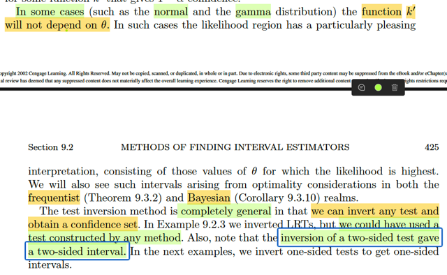</kbd>

> [!NOTE]
> Ok, cuối cùng, đại ý gs là có khi k' (θ0) lại không phụ thuộc θ0, là constant.
> Tức là trong những tình huống đó, cái ngưỡng để có một test có level 
> mong muốn luôn là constant đối với θ0, bất kể đang test H0: θ = θ0 bao 
> nhiêu, tức k'(θ,**x**) chỉ còn phụ thuộc **x.**Ta sẽ thấy nó xuất hiện sau này.
>
> Và hơn nữa, theo lí thuyết thì invert cái test nào cũng sẽ ra một confidence
> set, mà ví dụ vừa rồi ta invert một LRT.

 

<kbd>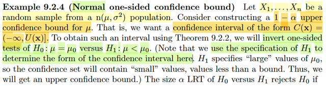</kbd>

> [!NOTE]
> Ví dụ này, xét một random sample X1..Xn ~ n(μ, σ^2). Đại khái là ta sẽ muốn
> tạo một confidence set cho μ (có coefficient 1-α nào đó). Nhưng lần này, ta
> muốn confidence set có dạng: upper confidence bound tức là, interval sẽ có
> dạng one-side: (-inf, U(**X**)].
>
> Nhớ lại chút, confidence set, hay interval estimator là bài toán inference mà ta
> muốn xây dựng một random set C(**X**), và nếu có thể có một 1-α confidence
> set thì ta sẽ có một set mà chắc chắn rằng xác suất θ nằm trong đó là từ 1-α
> trở lên. Thế thì ở đây, ta muốn một upper bound U(**X**) sao cho dù μ có bằng
> bao nhiêu thì xác suất nó nằm dưới cái bound này ít nhất là 1-α trở lên.
>
> inf_μ P_μ(μ ∈ (-inf, U(**X**)]) = inf_μ P_μ(μ < U(**X**)) = 1 - α.
>
> Thế thì theo gs, ta sẽ xây dựng cái interval này bằng cách invert một cái one-
> side test có dạng: H0: μ = μ0 vs H1: μ < μ0. Câu hỏi là, tại sao invert cái test
> này lại cho ta một cái upper confidence bound.
>
> Thử xét cái test của bài toán này, giả sử mình có một cái test có rule: reject H0
> nếu T(**X**) ≤ c (ví dụ Xbar ≤ μ0 - margin chẳng hạn, để về trực giác rất dễ
> thấy: ta đang test giữa H0: μ = 100 vs H1: μ < 100 thì nếu quan sát thấy xbar
> tức giá trị trung bình chỉ là 10, thì ta sẽ reject H0 mà cho rằng H1 mới đúng tức
> μ thật sự nhỏ hơn 100 nhiều)
>
> Thì khi đó, cái rejection region sẽ là: R = {**x**: xbar ≤ μ0 - margin} và
> acceptance  region là
>
> Rc = {**x**: xbar > μ0 - margin}.
>
> Thế thì đên đây ta mới làm theo theorem Tautology 9.2.2: Còn nhớ, nó nói
> rằng i) nếu ta có một level α acceptance region của bài toán testing: H0: θ =
> θ0, đặt là A(θ0).Thì ta có thể xây dựng một 1-α confidence set cho θ như sau:
>
> Tạo hàm C(**x**) nhận vào **x** ∈ range **X**, trả ra tập các θ0 ∈ Θ mà A(θ0)
> chứa **x**: C(**x**) = {θ0: **x** ∈ A(θ0)} = {**θ**: **x** ∈ A(**θ**)}
>
> Khi đó C(**X**) chính là 1-α confidence set của θ.
>
> Vậy thì ở đây, nếu gọi Rc ở trên, là A(μ0). Thì bằng cách đặt C(**x**) là tập
> chứa các μ0 ∈ R sao cho A(μ0) chứa **x**:
>
> C(**x**) = {μ0 ∈ R: **x** ∈ A(μ0)} = {μ: **x** ∈ A(μ)}
>
> thì C(**x**) sẽ là 1-α confidence set. Nhưng cái quan trọng là mình sẽ thấy
> C(**x**) có dạng gì:
>
> Nó chứa những μ0 mà A(μ0) chứa **x**Nếu A(μ0) chứa **x**, tức **x** thuộc acceptance region của bài toán test H0:
> μ = μ0  vs H1: μ < μ0, như vậy xbar > μ0 - margin.
>
> Vậy C(**x**) = {μ: **x** ∈ A(μ)}
>
> = {μ: xbar > μ - margin}
>
> = {μ: μ < xbar + margin}
>
> VÀ ĐÂY CHO THẤY C(**X**) CÓ DẠNG (-inf, U(**X**)], đúng là dạng của một
> confidence upper bound

 

<kbd>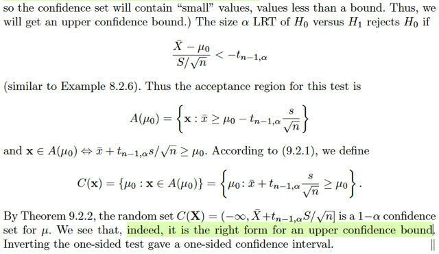</kbd>

> [!NOTE]
> Và quả thật là như vậy, với bài toán testing này, trong các ví dụ trước mình đã
> xây dựng ra cái size α LRT, có rule như sau:
>
> reject H0 nếu (Xbar - μ0) / (S/√n) < -tn-1,α 
>
> Do đó Rc, hay A(μ0) sẽ là {**x**: (xbar - μ0) / (s/√n) ≥ -tn-1,α}
>
> Dùng Theorem 9.2.2, ta tạo C(**x**) = {μ0: **x**∈****A(μ0)} 
>
> = {μ: **x** ∈ A(μ)} (μ hay μ0 chỉ là dummies variable)
>
> Mà **x** ∈ A(μ0) ⇔ (xbar - μ0) / (s/√n) ≥ -tn-1,α
>
> hay **x** ∈ A(μ) ⇔ (xbar - μ) / (s/√n) ≥ -tn-1,α
>
> = {μ: (xbar - μ) / (s/√n) ≥ -tn-1,α}
>
> = {μ: (xbar - μ)  ≥ -(tn-1,α)(s/√n)}
>
> = {μ: (xbar + (tn-1,α)(s/√n)  ≥ μ}
>
> = {μ: μ ≤ (xbar + (tn-1,α)(s/√n)}
>
> Và Theorem 9.2.2 nói rằng C(**X**) chính là một 1-α confidence set
>
> C(**X**) = {μ: μ ≤ (Xbar + (tn-1,α)(S/√n)}
>
> Và quan trọng là ta thấy nó có dạng (-inf, U(**X**)] với U(**X**) = (Xbar + (tn-1,α)(S/√n)

 

<kbd>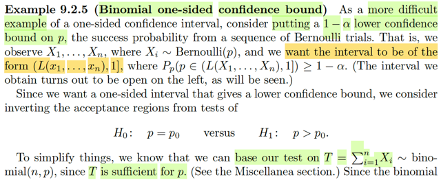</kbd>

> [!NOTE]
> Tiếp theo sẽ là môt ví dụ khó hơn trong việc xây dựng một one-sided 
> confidence interval, cùng nhau tìm hiểu:
>
> Đầu tiên, bài toán đặt ra là ta muốn xây dựng một lower confidence bound 
> chặn dưới) của p, tham số của một Binomial(n,p) population, và ta muốn
> confidence coefficient là 1-α.
>
> Vài thứ có thể ôn lại: Nhờ Stat110 cũng như trong sách này, mình đã biết
> story của Binomial(n,p) rv là số trial success trong n iid Bern(p) trials.
> Và định nghĩa của 1-α confidence set là confidence set (hay còn gọi là 
> interval estimator nếu như không gian tham số là trục số thực) có xác 
> xuất chứa θ luôn từ 1-α trở lên dù chưa biết θ bằng bao nhiêu:
>
> 1-α = inf_θ P_θ(θ ∈ C(**X**)), ⇨ 1-α ≤ P_θ(θ ∈ C(**X**))
>
> ở đây ta muốn tìm lower confidence bound, nên C(**X**) có dạng [L(**X**), inf) 
> và θ ở đây là p, có Θ chỉ là [0,1]:
>
> → 1-α ≤ P_p(p ∈ [L(**X**), 1))
>
> Thế thì, gs nói, ta sẽ xây dựng cái C(**X**) nói trên bằng cách invert cái test
> của bài toán one-side test: H0: p = p0 vs H1: p > p0.

 

<kbd>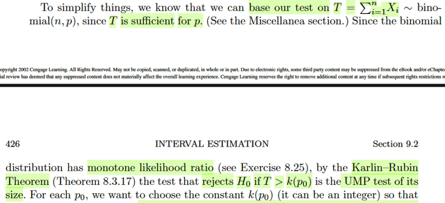</kbd>

🔗 **Related:** [8.3 METHODS OF EVALUATING TEST](83_methods_of_evaluating_test.md#node-719)

> [!NOTE]
> Rồi, tiếp. gs cho biết để đơn giản hóa, ta sẽ based cái test trên T = ΣiXi thay vì
> **X**, bởi vì T là sufficient statistic của p. Là sao nhỉ?
>
> → Có nghĩa là ta sẽ dùng test statistic là T(**X**) = ΣiXi. Cái này thì chưa cần
> liên quan gì đến tính đủ của T. Vì mình còn nhớ, cái statistic nào cũng có thể
> dùng làm test statistic cả. Tuy nhiên, tính đủ của T(**X**) sẽ phát huy tác dụng
> chốc nữa.
>
> Việc T là sufficient statistic của p, ta sẽ chứng minh sau. Có thể là bằng cách
> dùng Factorization theorem, chứng minh pdf/pmf của X có thể được tách thành
> dạng g(T(**X**)|p)h(**X**).
>
> Tiếp, gs nói ta sẽ dựa vào sự thật là binomial có tính MRT: monotone likelihood
> ratio nên theo **Karlin-Rubin** Theorem, cái test có rule: reject H0 nếu T >
> k(p0) sẽ là một UMP test. Và k(p0) là constant được chọn (cho cái test của bài
> toán H0:p=p0) sao cho test có level α.
>
> Chỗ này là sao:
>
> Thật ra chỗ này nên dựa vào **Neyman-Pearson** theorem:
>
> Vì trong theorem đó, nói rằng, xét bài toán test giữa H0: θ = θ0 vs H1: θ = θ1
> (θ0 < θ1), nếu ta có cái test có rule: reject H0 khi f(**x**|θ0)/f(**x**|θ1) > k for
> some k thì nó chính là UMP test trong đám test có level = size của test đó.
>
> Sau đó, nếu ta có sufficient statistic T(**X**). mà pdf/pmf family của nó {g(t|θ)}
> lại có tính monotone likelihood ratio (MLR) thì sẽ dẫn đến:
>
> Xét cái tule của cái test  (mà N-P nói rằng nó là UMP trong đám có level = size
> của nó)
>
> f(**x**|θ0)/f(**x**|θ1) > k for some k (i)
>
> ⇔ g(t|θ1)h(**x**)/g(t|θ0)h(**x**) > k | do T sufficient, dùng Factorization theorem
>
> ⇔ g(t|θ1)/g(t|θ0) > k
>
> ⇔ Likelihood Ratio (t) > k
>
> ⇔ t > t0 (do Likelihood Ratio (.) monotone), for some t0
>
> Kết luận: vì N-P nói cái test có rule (i) là UMP của đám test có level = size của
> nó
>
> mà rule này thì tương đương rule (ii)
>
> mà cái test ko có gì khác ngoài bản chất chỉ là cái rule
>
> nên kết luận cái test có rule T > t0 là UMP của đám test có level = size của nó,
>
> tức là nó là UMP level α = sup_θ ∈ {θ0} P_θ(reject H0) = P_θ0(T > t0) (thật ra
> cái test dựa theo x hay dưa theo T thì cái size như nhau thôi, vì:
>
> P_θ0(T > t0) = P_θ0(Likelihood Ratio (t) > k) = P_θ0(f(**x**|θ1)/f(**x**|θ0) > k)
>
> Như vậy, trong bài toán test H0: θ = θ0 vs H1: θ1 (θ1 > θ0) thì test có rule
> reject H0 khi T > t0 là UMP level α = P_θ0(T > t0)
>
> **NHƯNG CÁI TEST RULE NÀY LẠI KHÔNG PHỤ THUỘC θ1. NÊN DÙ θ1
> BẰNG BAO NHIÊU TRONG (θ0, inf) THÌ TEST T VẪN LÀ UMP LEVEL α CỦA
> BÀI TOÁN H0: θ = θ0 vs H1: θ1**
>
> Mà xét khái niệm UMP test của class C, theo định nghĩa, β của nó sẽ luôn hơn
> hoặc bằng β  của mọi test khác trong class, tại mọi θ ∈ Θ0c.
>
> Nên việc test T là UMP level α của mọi bài toán H0: θ = θ0 vs H1: θ1 với θ1
> khác nhau ∈ (θ0, inf) có nghĩa là:
>
> ∀ θ1 ∈ (θ0, inf), β(θ1) ≥ β'(θ1)
>
> với β' là test bất kì thuộc level α test của bài toán H0: θ = θ0 vs H1: θ1, tức tập
> các test có:
>
> {test: sup_θ ∈ Θ0={θ0} P_θ(reject H0) = P_θ0(reject H0) ≤ α}
>
> Cái tập này ko phụ thuộc θ1, nên dù θ1 bằng bao nhiêu ta cũng có cùng một
> tập.
>
> Bây giờ, nếu xét bài toán H0: θ = θ0 vs H1: θ0 < θ thì cái tập level α test của
> bài toán này  sẽ là: {test: P_θ0(reject H0) ≤ α}, cũng chính là tập các test trên.
> Và trong cái tập này, thì thằng test T luôn có β mạnh hơn các thằng khác tại
> mọi θ ∈ (θ0, inf).
>
> Do đó theo định nghĩa test T là UMP level α của bài toán H0: θ = θ0 vs H1: θ0
> < θ với α = size của test T = P_θ0(T > t0)
>
> Đây là giải thích cho câu nói của gs: cái test reject H0 nếu T > k(p0) là UMP
> test of its size (t0 ở đây có thể hiểu là k(p0), nó là cái threshold nào đó giúp
> test T có size mong muốn thôi)

 

<kbd>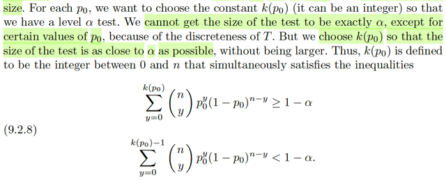</kbd>

> [!NOTE]
> Tiếp theo ta sẽ nói tiếp về k(p0), là cái ngưỡng nào đó giúp test T có level 
> nào đó mong muốn.
>
> Nhớ lại, test có level α là test có sup_θ∈Θ0 P_θ(reject H0) ≤ α 
>
> nên ở đây nếu ta muốn test T có level α, tức là:
>
> sup_θ∈Θ0={θ0} P_θ(reject H0) ≤ α 
>
> ⇔ P_θ0(reject H0) ≤ α
>
> ⇔ P_θ0(T > k(p0)) ≤ α 
>
> Rồi, mình cũng nhớ, trong những level α test, thì để có cái có β lớn
> nhất, ta sẽ lấy cái test có size = α. Mang ý nghĩa, việc cũng là level α giúp
> xác xuất mắc lỗi loại I không lớn hơn α, và việc có β lớn nhất, giúp khi H0
> nên được reject thì test sẽ làm tốt nhất trong việc reject H0.
>
> Nên ta sẽ muốn:
>
> P_θ0(T > k(p0)) = α 
>
> Tuy nhiên, vấn đề là ở đây T là binomial, một discrete random variable.
> Nên xác suất của event T > k(p0) bằng y chóc a là rất khó xảy ra trừ một 
> vài giá trị a cụ thể nào đó. Vì sao? Vì xác suất này là tổng khối lượng xác
> suất (pmf) tại các điểm từ k(p0) trở lên n (range của T là 0,1,2....n), và do
> đó nó là hàm bậc thang. Và để hàm bậc thang bằng đúng α thì chỉ có vài
> α là phù hợp thôi.
>
> Như vậy, không thể / khó có thể có k(p0) giúp equation thỏa, để có size α 
> test. Do đó, ta phải chấp nhận một level α test với size < α. Vậy phải tìm
> cái con số nguyên (trong range của T) sao cho tại đó xác suất trên vẫn < α 
> nhưng nhích thêm một, thì thành ra > α (tức là ta cần tìm cái ngưỡng nhỏ nhất)
> Cho nên điều kiện tìm k(p0) mới thành ra hai bất phương trình:
>
> P_θ0(T > k(p0)) ≤ α
>
> P_θ0(T > k(p0) - 1) > α
>
> (bất phương trình sau lại có dạng như vậy, là vì như đã nói, xác suất này là
> tổng pmf tại các điểm bên phải mốc k(p0), cho đến t = n, nên nếu nhích qua 
> phải thì xác suất sẽ giảm, nhích qua trái (tức -1) thì nó sẽ tăng)
>
> ⇔ 1 - P_θ0(T ≤ k(p0)) ≤ α
>
> và 1- P_θ0(T ≤ k(p0) - 1) > α
>
> ⇔ 1 - α ≤ P_θ0(T ≤ k(p0)) 
>
> và 1 - α > P_θ0(T ≤ k(p0) - 1) 
>
> T, hay T(**X**) = ΣiXi, với Xi là iid Bern(p), T(**X**) chính là Binomial(n,p)
>
> .. ⇔ Σt=0:k(p0) (n choose t)p0^t(1-p0)^(n-t) ≥ 1 - α
>
> và Σt=0:k(p0)-1 (n choose t)p0^t(1-p0)^(n-t) < 1 - α
>
> Đây chính là 9.2.8

 

<kbd>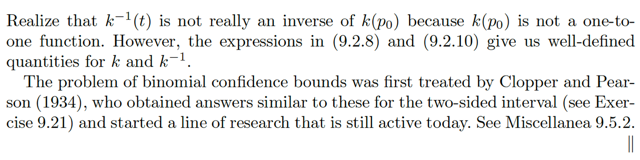</kbd>

<kbd></kbd>

<kbd>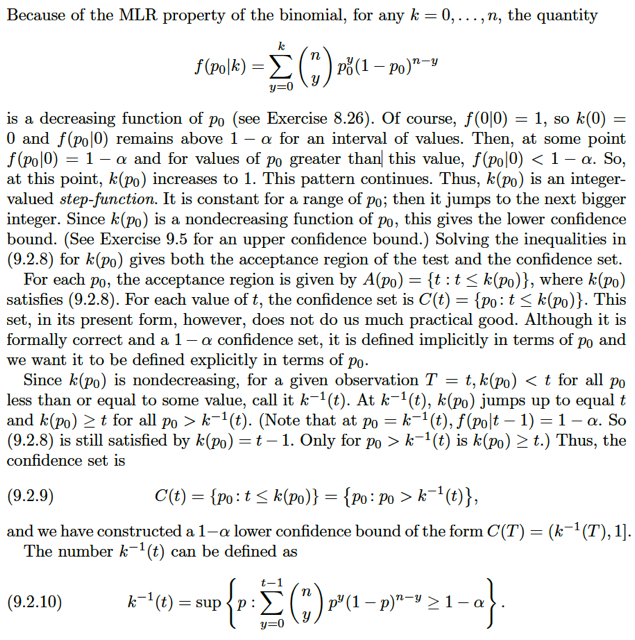</kbd>

> [!NOTE]
> hôm qua đến giờ đang ráng hiểu các đoạn rời rạc của bức tranh, chỉ nhớ là ta
> đang đi tìm CI bằng cách invert một test.
>
> Vậy thì nhìn lại, ban đầu ta đã kiểu như giải thích lại, chứng minh lại để hiểu vì
> sao tác giả nói là cái test dựa trên T: reject H0: p = p0 khi T > k(p0),  là một UMP
> test trong đám test có level = size của test T = P_p0(T > k(p0))
>
> Sau đó, ta đã phân tích nếu k(p0) thỏa mãn hai bất đẳng thức này, thì ta sẽ có
> một level α test.
>
> Vậy thì ở đây mình nên ôn lại Theorem Tautology: Mà ý i) của nó nói rằng, nếu
> ta có một level α test của bài toán testing: H0: θ = θ0, và thể hiện bởi
> acceptance của nó, đặt là A(θ0) (acceptance của bài toán testing H0: θ = θ0), thì
> bằng cách dựng hàm tập C(x), nhận vô x ∈ range X, trả ra tập chứa các θ0 ∈ Θ
> sao cho A(θ0) chứa x: C(x) = {θ0: x ∈ A(θ0)} = {θ: x ∈ A(θ)}  thì khi đó C(X) chính
> là confidence set có coefficient 1-α.
>
> Vậy câu hỏi nên là acceptance A(θ0), hay A(p0) của level α test (test T) là gì:
>
> → Dĩ nhiên là complement của R = {t: t > k(p0)}, tức {t: t ≤ k(p0)}
>
> Vậy, theo Theorem, ta mới tạo hàm tập c(t) = {p0 ∈ Θ: t ∈ A(p0)} thì C(T) sẽ là CI
> cần tìm.
>
> = {p0 ∈ Θ: t ≤ k(p0)}
>
> Mà k(p0) là hàm bậc thang non-decreasing (mình sẽ quay lại ý này)
>
> nên với fixed t, thì để có các thằng p0 mà k(p0) > t thì nhất định tương đương p0
> phải từ một cái mốc nào đó trở lên, gọi nó là u, và cái này sẽ phụ thuộc t, ta kí
> hiệu u(t)
>
> Vậy thì ta sẽ có C(t) = {p0: u(t) < p0 ≤ 1} là tập chứa các p0 ∈ Θ sao cho A(p0)
> chứa t.
>
> Nên kết luận C(T) = (U(T), 1] là confidence set cần tìm.
>
> ------
>
> Dĩ nhiên ta sẽ đi tìm u(t) là cái gì:
>
> Nhắc lại, nó là cái mốc của p0 mà từ đó trở đi k(p0) >= t
>
> Mà k(p0) lại là cái thỏa hai bất phương trình:
>
> 1 - α ≤ P_p0(T ≤ k(p0))
>
> và 1 - α > P_p0(T ≤ k(p0) - 1)
>
> -------
>
> Đến đây mình phải tìm hiểu hàm k(p0):
>
> nó là hàm mà với input p0, output của nó sẽ là cái ngưỡng giúp test T có level α.
>
> Vậy thì mình sẽ xem vì sao gs nói nó là hàm tăng, và có dạng bậc thang (giống
> như cdf  của biến rời rạc vậy)
>
> Vậy cùng phân tích hành vi của k(p0):
>
> dĩ nhiên p0, là biến đầu vào, sẽ chạy từ 0 → 1. và chú ý, p0, là giá trị liên tục
> trong khoảng [0,1], vì nó là xác suất thành công của Bern trial mà)
>
> khi p0 nhỏ, tức xác suất Bern trial ra success nhỏ → giá trị quan sát của T ~
> binomial(n, p0) cũng sẽ có xu hướng nhỏ, cho nên với một 1-α cho trước mong
> muốn, thì để 1-α ≤ P_p0(T < k(p0)) thì thì ta sẽ cần ngưỡng k(p0) thấp thôi, ví
> bản chất là số trial có xác suất thành công thấp thì xác suất mà tổng số trial
> thành công ở dưới một ngưỡng nhỏ cũng sẽ cao đủ yêu cầu.
>
> Giả sử tại p0 = p0_1, ta có ngưỡng k(p0_1).
>
> sau đó tăng dần p0 lên một mức α nào đó, để có p0_2 và với giá trị này xác suất
> Bern trial thành công cao hơn → T có xu hướng lớn hơn → xác suất T nhỏ hơn
> một ngưỡng nhỏ (k(p0_1)) đã nhỏ đi →  và giả sử nó đã không còn lớn hơn 1-α
> nữa: 1-α > P_p0_2(T < k(p0_1)) dẫn đến cái ngưỡng cũ k(p0_1) không còn thỏa
> yêu cầu của hai inequalities (giúp test có level α) nữa. Do đó, ta sẽ phải TĂNG
> ngưỡng lên, vì khi đó sẽ giúp xác suất T (vốn đang lớn lên) nhỏ hơn cái ngưỡng
> mới (to hơn), sẽ nhỏ lại, giúp thỏa 1-α < P_p0_2(T < k(p0_2)).
>
> Và tương tự như vậy, cứ tăng p0, thì để cái ngưỡng k(p0) vẫn thỏa hai
> inequalities thì nó sẽ phải tăng theo. → Giúp kết luận hàm k(p0) là hàm
> NON-DECREASING.
>
> Còn vì sao k(p0) cũng có dạng bậc thang?
>
> Là vì hãy nhìn: 1-α > P_p0_2(T < k(p0_1)), 1-α < P_p0_2(T < k(p0_2))
>
> mà hàm P_p0(T < k(p0)) là hàm bậc thang nên để giá trị của nó thay đổi, thì k
> phải tăng hay giảm một khoảng nào đó chứ không phải chỉ nhích một chút là
> hàm P thay đổi.
>
> Như vậy, giả sử tại k1 không đạt và k2 đạt thì giữa chúng phải là một bước
> nhảy. Ta sẽ tìm hiểu liên hệ của bước  nhảy này với xác suất của T:
>
> (cũng trong câu chuyện cho p0 tăng từ p0_1 → p0_2 khiến ngưỡng k phải tăng
> theo)
>
> gọi P1 là giá trị của f(k1) = P_p0_2(T < k1), mà 1-α > P1 (lúc này ngưỡng k vẫn
> giữ k1 = k(p0_1), khiến không đạt, phải tăng lên để đạt, tức thỏa 2 inequalities)
>
> và P2 là gía trị của f(k2) = P_p0_2(T < k2) mà 1-α < P2
>
> Có nghĩa là ta đang đặt hàm f(k) = P_p0_2(T < k)
>
> Như vậy P2 - P1 = f(k2) - f(k1) = P_p0_2(T < k2) - P_p0_2(T < k1)
>
> mà P_p0_2(T < k) là cdf, mang ý nghĩa phần diện tích đồ thị hàm pmf/cdf bên
> trái ngưỡng đang xét.
>
> nên cái ta có ở đâu chín là phần diện tích của pdf trong khoãng giữa hai mốc k1,
> k2. hoặc với pmf thì nó là tổng probability mass function tại cái điểm nằm giữa
> hai mốc này.
>
> Σk1≤k là số nguyên <k2 P_p0_2(T=k)
>
> Và giả sử tại k1 = 4 không đạt, thì phải tăng lên thì k2 sẽ là bao nhiêu: Câu trả
> lời k2 chính là 5, vì k1 là cái ngưỡng mà thỏa hai inequalities:
>
> 1-α < P_p0_1(T < k1)
>
> Sau đó p tăng lên MỘT CÁCH LIÊN TỤC từ p0_1 dần thì xác suất P_p(T < k1)
> giảm dần MỘT CÁCH LIÊN TỤC. Có nghĩa là từ từ nó sẽ vượt qua để rồi rớt
> xuống cái mốc 1-α.
>
> Lúc này, ta sẽ cần tăng k, mà bước tăng k sẽ tạo một bước tăng của hàm P có
> độ lớn bằng giá trị của cái tổng pmf của T tại một điểm nào đó. Nhưng  vì chỉ
> cần sự tăng của P nhích lên thêm 1 nấc là đã đủ để kéo P lên cao hơn 1-α rồi.
> Do đó khoảng tăng Δk chỉ cần để để nhích cái hàm P sao cho nó gặm  thêm một
> cục pmf nữa là được. Do đó, k2=k1+1.
>
> Một lưu ý nữa, k tuy ko cần phải là số nguyên nhưng để cho dễ ta cứ dùng số
> nguyên vì P(T < 3.5) thì cũng không khác gì P(T < 4) vì T là biến rời rạc mang
> giá trị nguyên.
>
> Do đó, một bức tranh mô tả hành vi của hàm k(p0) có thể hình dung như sau:
>
> p0 tăng liên tục từ 0 → 1
>
> Gọi p01 là điểm mà:
>
> từ 0 → p01 nhỏ, khiến T xu hướng nhỏ, nên chỉ cần ngưỡng k nhỏ = 1 thì đã đủ
> làm cho 1-α < P_p01(T ≤ 1) → k(p0) = 1. Và tại đây, P_p01(T ≤ 1) vẫn lớn hơn
> 1-α nhưn nó đã sát mép rồi.
>
> Từ p01 tăng lên ε nhỏ tí, P_p0(T ≤ 1) giảm khoảng δ cũng nhỏ tí nhưng đủ khiến
> P_p01(T ≤ 1) đã thấp hơn 1-α. Lúc này phải tăng k lên.
>
> thì như đã nói ở trên, chỉ cần tăng thêm 1 thành 2 là đã đủ để P_p0(T ≤ 2)
> ngoạm thêm một cục pmf: P_p0(T=2) mang giá trị dương và chắc chắn dư sức
> để bù cái khoảng δ giúp lúc này P_p0(T ≤ 2) đã cao hẳn bên trên lên mốc 1-α.
>
> tiếp tục p0 tăng lên, P_p0(T<2) giảm dần liên tục
>
> thì gọi p02 là đoạn mà từ p01+ε → p02 thì P_p0(T ≤ 2) vẫn > 1-α nhưng tại p02
> thì P_p0(T ≤ 2) đã sát mép 1-α rồi
>
> câu chuyện lặp lại, tăng p0 lên một khoảng nhỏ thành p02 + ε, khiến P_p0(T ≤ 2)
> đã lủng mép 1-α, yêu cầu phải tăng k. Và y như lúc trước, k chỉ cần tăng lên 3
> để P_p0(T < k) ngoạm thêm một cục pmf P(T = 3) nữa là đủ để kéo lên lại cao
> hơn 1-α.
>
> Cứ thế tiếp tục như vậy, giúp ta thấy hành vi của hàm k(p0): Nó sẽ tăng từng
> bậc  có bước nhảy bằng 1, nói cách khác khi p0 chạy từ 0 đến 1 thì k sẽ giật lên
> 1 → 2 → 3,...→ n
>
> Với ý nghĩa hàm k(p0), thì ví dụ k(p0*),tức k(p0)|p0=p0* = 3 có nghĩa là 3 là cái
> ngưỡng khiến khi p0 chạy từ 0 → p0=p0* thì P_p0(T < 3) ≥ 1-α
>
> Do đó p0* = giá trị p0 lớn nhất mà tại đó P_p0(T < 3) ≥ 1-α
>
> và ta thể hiện theo toán học như sau:
>
> p0* thỏa k(p0*)= 3 chính là sup_p0 {P_p0(T < 3) ≥ 1-α }
>
> suy ra:
>
> p0* thỏa k(p0*) = t chính là sup_p0 {P_p0(T < t) ≥ 1-α}
>
> ráp pmf của binomial vô:
>
> p0* thỏa k(p0*) = t chính là sup_p0 {Σi=0:t-1 (n choose y) p0^y(1-p0)^n-y ≥ 1-α}
>
> Và đây chính là kinv(t) công thức 9.2.10.
>
> Thật ra ta nói u(t) là cái mốc của p0 mà từ đó trở đi k(p0) ≥ t, nhưng với k là số
> nguyên thì cái mốc này cũng là cái mà k(p0) = t.
>
> Và như vậy 1-α Confidence Set của bài toán này là:
>
> (sup_p0 {Σi=0:T-1 (n choose y) p0^y(1-p0)^n-y ≥ 1-α}, 1]

 

<kbd>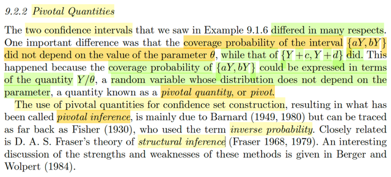</kbd>

🔗 **Related:** [9.1 INTRODUCTION](91_introduction.md#node-755)

> [!NOTE]
> Qua phần này, trước tiên ôn lại một chút các khái niệm để hiểu coverage
> probability là gì?
>
> Ta còn nhớ, bài toán interval estimation, là tên khái quát hơn nên là set
> estimation bài toán mà ta sẽ tìm cách xây dựng một set C(**X**) để khi khi
> nhận giá trị quan sát **X**= **x**, thì inference của ta, nhận định của ta là
> (nói rằng) θ nằm trong C(**X**) này. Và **coverage probability** của một
> confidence set / interval estimator là một hàm theo θ, define bởi P_θ(θ ∈
> C(**X**)). Từ đó nếu ta lấy inf_θ P_θ(θ ∈ C(**X**)) thì sẽ được confidence
> coefficient. Khi parameter space Θ là trục số thực, thì confidence set
> C(**X**) sẽ là một interval có dạng [L(**X**), U(**X**)]
>
> Bản thân C(**X**) nên hay là một random set, [L(**X**), U(**X**)] là random
> interval nên bài toán interval estimator cơ bản là đi xây dựng một random
> set hay random interval, nên đi interval estimator có bản chất là một
> random interval, cũng y như một point estimator có bản chất cũng chỉ là
> một random variable / statistic thôi.
>
> Vậy thì ở đây gs nhắc lại hồi ví dụ 9.1.6, ta xét hai ví dụ của interval
> estimator trong đó một cái cho ra kết quả là coverage probability của
> interval estimator không phụ thuộc θ, một cái thì có phụ thuộc.
>
> Và lí do là, cái coverage probability không phụ thuộc θ là vì nó  P_θ(θ ∈
> [L(**X**), U(**X**)] (xác suất của một event liên quan đến hai rvs là L(**X**),
> U(**X**), lại có thể được thể hiện bởi xác suất của một event liên quan đến
> một rv khác, nhưng rv này **LẠI CÓ PHÂN PHỐI KHÔNG PHỤ THUỘC θ**,
> dẫn đến xác suất của event này không còn phụ thuộc θ luôn.
>
> Cụ thể là, trong ví dụ 9.1.6, probability coverage (cái mà ko phụ thuộc θ)
>
> là P_θ(θ ∈ [aY, bY]) (đây là P_θ(θ ∈ [L(**X**), U(**X**)] thông thường) với
> L(**X**) = a max {Xi}
>
> U(**X**) = b max {Xi}
>
> nhưng sau đó chuyển thành
>
> P_θ(Y/θ ∈ [a, b]) (thì đây chính là xác suất của event liên quan đến rv Y/θ,
> hay max {Xi} / θ  và distribution của nó lại không còn phụ thuộc θ khiến xác
> suất này cũng không còn  phụ thuộc θ nữa.
>
> Và người ta gọi random variable (đóng vai trò tạo thành random interval
> [L(**X**), U(**X**)]) mà có tính chất như trên là **PIVOTAL QUANTITY**. Và cái
> nhánh đi xây dựng một confidence set dùng pivotal quantity được gọi là
> **PIVOTAL INFERENCE**

 

<kbd>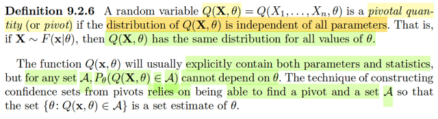</kbd>

> [!NOTE]
> Nhờ hiểu như note vừa rồi nên ta hiểu cái định nghĩa chính thức của pivotal
> quantity: Đại khái là, nó là một random variable có được khi áp một cái hàm
> có dính đến θ lên random sample **X:**Q(**X**, θ) nhưng distribution của nó
> không còn phụ thuộc θ
>
> Ta đã luôn nhắc đi nhắc lại  rằng khi apply một function lên random variable
> thì ta sẽ được một random variable, nên nó sẽ có distribution. Và nếu áp một
> function lên sample **X**- một vector các random variable thì ta sẽ có
> random variable gọi là statistic
>
> Nhưng statistic thì phải chỉ là function of random sample thôi, g(**X**), nên
> Q(**X**, θ) k**hông phải là statistic** mà là **function của cả statistic và
> parameter**. Nhưng nó vẫn là một random variable, và do đó có distribution,
> để rồi đặt ra yêu cầu là distribution không dính tới θ.
>
> Còn cái câu nếu **X** ~ F(**x**|θ) thì Q(**X**, θ) có cùng distribution với mọi θ
> thì chính là nói distribution của Q(**X**, θ) ko phụ thuộc θ đó.
>
> Và vì vậy đương nhiên xác suất của event P_θ(Q(**X**, θ) ∈ tập A bất kì sẽ
> không phụ thuộc θ (tại phân phối xủa Q còn dính tới θ nữa đâu). Kí hiệu thì
> vẫn ghi P_θ bởi khi  ghi một cách khái quát thì Q(**X**, θ) vẫn dính tới θ do θ
> là input của Q(.) và bản thân thằng **X** cũng có phân phối phụ thuộc θ.
> nhưng phải hiểu là **với việc Q là pivotal thì kết quả này nhất định không còn
> dính tới θ**.
>
> Cuối cùng, gs nói, thách thức của việc xây dựng interval estimator từ pivotal
> quantity bây giờ trở thành:
>
> làm sao tìm được Q(**x**, θ)
>
> thì sau đó với A bất kì, ta đặt tập C(**X**) = {θ: Q(**X**,θ) ∈ A}
>
> vì định nghĩa, θ ∈ C(**x**) ⇔ Q(**x**, θ) ∈ A
>
> thì P_θ(θ ∈ C(**X**) = {θ: Q(**X**,θ) ∈ A} ) (tức probability coverage của
> C(**X**))
>
> = P_θ(Q(**X**, θ) ∈ A) , và cái này không phụ thuộc θ
>
> Do đó C(**X**) sẽ là một **interval mà có probability coverage không phụ
> thuộc θ nữa**

 

<kbd>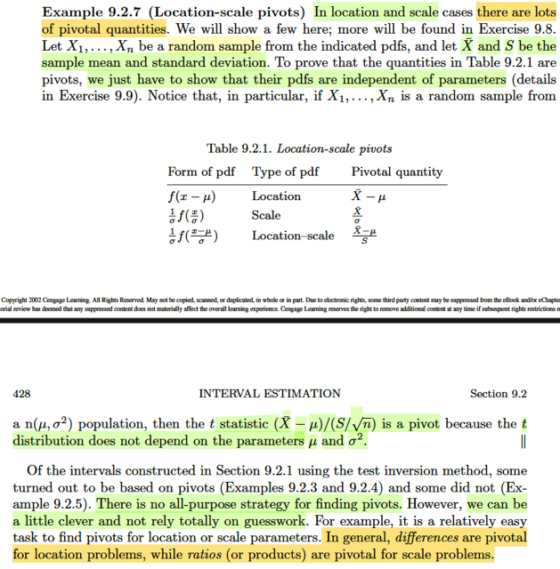</kbd>

> [!NOTE]
> Ôn lại chút xíu về khái niệm pivotal quantities đã học hôm qua:
>
> Đại khái là khi ta có một confidence set (hay interval estimator) mà  có
> thể được thể hiện bởi một quantity có dạng Q(**X**, θ), và cái này thì lại
> có distribution không phụ thuộc θ, dẫn đến là khi đó, xác suất của event
> θ ∈ C(**X**), tức coverage proabability P_θ(θ ∈ C(**X**)) có thể được thấy như 
> xác suất của một event liên quan đến rv Q, và vì distribution của Q không 
> phụ thuộc θ nên P_θ(θ ∈ C(**X**)) cũng không phụ thuộc θ luôn. Thì Q được 
> gọi là pivotal quantity.
>
> Ở đây có vài ví dụ về pivotal quantities, tác giả nói để chứng minh nó là
> pivotal thì chỉ cần chứng minh pdf/pmf của chúng ko phụ thuộc θ.
>
> ví dụ với location family f(x - μ), vì sao Xbar - μ là pivotal quantity?
>
> Ta còn nhớ, một định lí của location family, nếu X ~ fX là thành viên với
> location μ thì Z = X - μ sẽ là thành viên với location 0 (standard member)
>
> Vậy thì ở đây Xbar - μ = ΣiXi/n - μ = (ΣiXi - nμ)/n = Σi(Xi - μ) / n
>
> = Σi Zi/n với Zi = Xi - μ, Như trên vừa nhắc lại, ta có Xi ~ thành viên của
> location family có location μ thì Zi có location 0 (đồng nghĩa là pdf sẽ 
> không còn phụ thuộc μ), nên đương nhiên Σi Zi / n cũng vậy. → Xbar - μ
> có distribution không còn phụ thuộc μ 
>
> Tương tự, Xbar / σ = ΣiXi / nσ = Σi(Xi/σ)/n.
>
> với Xi ~ scale family có scale factor σ thì Xi / σ là member có scale 1, đồng
> nghĩa distribution không phụ thuộc σ 
>
> ⇨ (1/n) Σi(Xi/σ) cũng sẽ có distribution không còn phụ thuộc σ
>
> Hoàn toàn tương tự với location - scale family
>
> Cuối cùng, ta cũng đã biết cái vụ nếu Xi ~ normal(μ, σ^2) thì Xbar sẽ có
> distribution normal(μ, σ^2/n), và (Xbar - μ) / (S/√n) ~ tn-1, hoàn toàn chỉ
> phụ thuộc n không phụ thuộc μ hay σ nữa.
>
> Cuối cùng, gs nói không có chiến lược nào đảm bảo sẽ luôn giúp  tìm được
> interval chỉ dựa trên pivotal quantities nhưng nói chung là ta có thể nhớ là
> với location family thì dùng difference, với scale family thì dùng ratios

 

<kbd>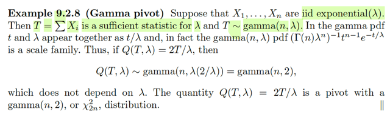</kbd>

> [!NOTE]
> Một ví dụ, nếu X1,...Xn iid ~ expo(λ) thì T = ΣiXi là sufficient statistic của λ
> (cái này trong phần trước đã làm). Và T ~ gamma(n, λ), và nó là một thành
> viên của scale family với scale = λ. Do đó T/λ sẽ là một thành viên của family
> có scale = 1 → 2T/λ là thành viên có scale = 2, tức gamma(n, 2)
>
> (hay α T / λ với α constant sẽ là thành viên có scale α, γ(n, α) → distribution
> của nó không còn phụ thuộc λ nữa
>
> Như vậy Q(T, λ) = 2T/λ (hay αT/λ) sẽ là pivotal quantities.
>
> Riêng 2T/λ thì nó cũng chính là chi-square 2n bậc tự do: X^2_2n

 

<kbd>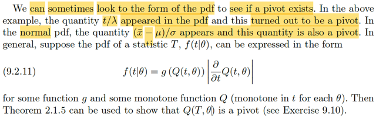</kbd>

> [!NOTE]
> Đoạn này gs cho biết đại khái là đôi khi ta còn có thể nhìn vào công thức pdf
> để mà nghĩ đến cái nào là pivot.
>
> Lấy ví dụ như trong công thức pdf của T ~ expo(λ), ta sẽ thấy nó có dính
> đến t/λ, và hóa ra T/λ là pivot thật (đương nhiên dẫn tới αT/λ cũng vậy) Hoặc
> như trong pdf của normal. ta thấy có (xbar - μ)/σ để rồi quả thật Xbar - μ / σ
> cũng là pivot. Làm rõ chỗ này chút xíu:
>
> → Tức là gs đang nói đến pdf của Xbar, là một sufficient statistic của μ 
> mà ta đã biết nó sẽ có phân phối normal(μ, σ^2/n)
>
> → pdf fXbar(xbar) = (1/√2π(σ^2/n)) exp[-(xbar-μ)^2/2(σ^2/n)]
>
> = (1/√2π(σ^2/n)) exp[-(n/2)(xbar-μ)^2/σ^2]
>
> = (1/√2π(σ^2/n)) exp{-(n/2)[(xbar-μ)/σ]^2}
>
> ta sẽ thấy trong đó xuất hiện (xbar - μ) / σ và quả thật nó chính là pivol
>
> và với Xi ~normal(μ, σ^2). nó là một thành viên của location scale family ứng
> với location μ, scale σ → Xi - μ / σ là thành viên chuẩn (scale 1, location 0),
> cũng  chính là standard normal (normal(0,1)) ⇨ Σi[(Xi - μ)/σ]/n chắc chắn là
> rv có distribution không còn dính tới μ, σ^2
>
> ====
>
> Và nói chung, gs nói giải sử ta có pdf của một statistic T f(t|θ) có thể được
> thể hiện ở dạng f(t|θ) = g(Q(t, θ)) |∂/∂t Q(t, θ)| với some function g và some
> monotone function Q thì theorem 2.1.5 có thể dùng để chỉ ra Q(T, θ) là pivot
> Thử chứng minh:
>
> Nhắc lại theorem transformation, nếu ta có fX là pdf của X, và Y = g(X) thì
> nếu g là mapping 1-1 giữa x và y: y = g(x) ⇔ x = ginv(y) thì ta sẽ có:
>
> fY(y) = fX(x) |d/dy x(y)| = fX(x) |d/dy ginv(y)|
>
> Giả thuyết cho fT(t|θ) có thể được express ở dạng:
>
> fT(t|θ) = g(Q(t,θ)) |∂/∂t Q(t, θ)|
>
> Ta sẽ đặt function dùng để tạo Q là h: Q = h(T, θ)
>
> → fT(t|θ) = g(h(t,θ)) |∂/∂t h(t, θ)|
>
> Vì Q, hay h là một hàm monotone theo t với mọi θ) thì tức là mapping 
> giữa t → q là 1-1: q = h(t, θ) ⇔ t = hinv(q, θ)
>
> khi đó, transformation theorem cho ta biết:
>
> fQ(q) = fT(t) |∂/∂q t(q)|
>
> = fT(hinv(q, θ)) |∂/∂q hinv(q, θ)|
>
> Thế mà nếu ta lại có fT(t|θ) có thể được express ở dạng:
>
> fT(t|θ) = g(h(t,θ)) |∂/∂t h(t, θ)|
>
> ⇨ fQ(q) = fT(t) |∂/∂q t(q, θ)| 
>
> = g(h(t,θ)) |∂/∂t h(t, θ)| |∂/∂q hinv(q, θ)|
>
> = g(q) |∂/∂t q| |∂/∂q t|
>
> = g(q) |∂q/∂t| |∂t/∂q|
>
> = g(q) |∂q/∂t . ∂t/∂q|
>
> = g(q). như vậy fQ(q) = g(q) **hoàn toàn không phụ thuộc θ** nữa.

 

