# 9.3 Methods Of Evaluating Interval Estimators

📊 **Progress:** `16` Notes | `15` Screenshots

---

<kbd>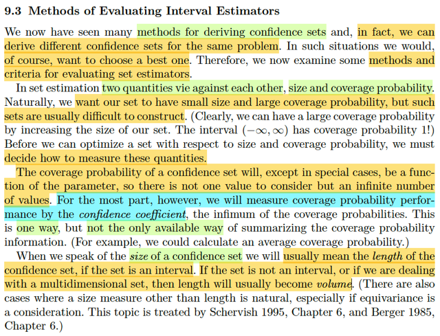</kbd>

> [!NOTE]
> Qua phần này ta sẽ học cách tiêu chí và phương pháp đánh giá các Interval
> Estimator. Dễ hiểu là vì một problem ta có thể có nhiều interval estimator
> nên đương nhiên là ta cần đánh giá xem cái nào tốt hơn cái nào.
>
> Thế thì với set / interval estimator, ta sẽ có hai đặc điểm quan trọng: kích
> thước và coverage probability. Và ta sẽ đương nhiên là muốn kích thước
> nhỏ nhưng độ bao phủ lớn.
>
> Vậy thì, ở đây tác giả nhắc lại cho ta rằng, coverage probability trong phần
> lớn trường hợp, thì là function của θ. Nên không thể dùng nó để so sánh
> được. Do đó ta sẽ dùng confidence coefficient. chính là infimum.
>
> Ý này dễ hiểu thôi. Nhớ lại coverage probability, của một interval estimator
> hay confidence set, là hàm theo θ, defined bởi P_θ(θ ∈ C(**X**)).
>
> Nhưng mình cũng biết, một số confidence set nếu được construct dựa trên
> pivot quantity, Q(**X**, θ) thì nó lại có distribution không phụ thuộc θ. Khi đó,
> coverage probability của confidence set này sẽ là constant theo θ. Đó là các
> case đặc biệt gs nói tới ở đây.
>
> Và ta cũng còn nhớ, định nghĩa của confidence coefficient = inf_θ P_θ(θ ∈
> C(**X**)). và nó sẽ ko còn phụ thuộc θ nữa

 

<kbd>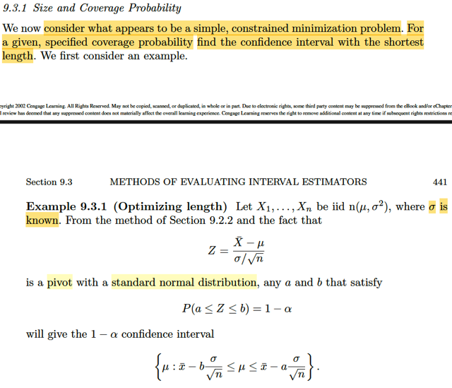</kbd>

> [!NOTE]
> Đại khái là đầu tiên ta sẽ bàn đến một cách tiếp cận mà hóa ra sẽ trở thành bài
> toán tối ưu có ràng buộc:  Cố định giá trị mong muốn của coverage probability và
> tìm cách giảm length tối thiểu.
>
> Xét ví dụ này, ta có X1,..Xn là iid n(μ, σ^2) với σ đã biết. Thì a, b thỏa P(a ≤ Z ≤
> b) = 1 - α sẽ cho ta một 1-α confidence interval {μ: xbar - b σ/√n} ≤ μ ≤ xbar
> - a σ/√n
>
> Thử xem là vì sao?
>
> Ôn lại: Là vì bữa trước đã học cách xây dựng một confidence set từ một pivot.
> Pivot là một random variable có dạng Q(**X**, θ) nhưng distribution lại ko phụ
> thuộc θ.
>
> Nên nếu ta thể tìm ra một khoảng a, b sao cho P(a ≤ Q(**X**, θ) ≤ b) = 1-α thì
> điều này sẽ đúng với mọi θ ∈ Θ. Dẫn đến khi xét bài toán testing H0: θ = θ0 thì
> {**x**: a ≤ Q(**x**, θ) ≤ b} chính là một level α acceptance region.
>
> Vì sup_θ∈Θ0={θ0} P_θ(**X** ∈ R) = P_θ0(**X** ∈ R) = 1 - P_θ0(**X** ∈ Rc)  = 1 - P(a
> ≤ Q(**X**, θ) ≤ b) = 1 - (1 - α) = α. ⇨ test có acceptance region này chính là một
> level α test.
>
> Và they Tautology theorem, C(**X**) = {θ: a ≤ Q(**X**, θ) ≤ b} chính là 1-α
> confidence  set.
>
> Để rồi như đã biết, nếu θ là số thực, thì tập này sẽ có dạng là interval.
>
> Và ta có thể chuyển nó về dạng [θL(**X**, a or b), θU(**X,**b or a)] tùy theo là
> hàm Q monotone increasing hay decreasing.
>
> Vậy thì ở đây: Ta biết với X1,...Xn là iid normal(μ, σ^2) thì Xbar là normal(μ,
> σ^2/n) Và normal lại là thuộc location scale family với mean là location param,
> standard deviation là scale param.
>
> Nên theo location scale family thì (Xbar - μ) / (σ/√n) chính là standard member
> ứng với location = 0, scale = 1 → Z = (Xbar - μ) / (σ/√n) chính là normal(0,1). Và
> distribution của nó không còn phụ thuộc μ nữa. Ta sẽ dùng nó làm pivot.
>
> Nên mới nói, nếu có được a, b sao cho P(a ≤ Z ≤ b) = 1-α
>
> thì {x: a ≤ Z(**X**, μ) ≤ b} chính là level α acceptance region của bài toán testing
> H0: μ = μ0
>
> Theo Tautology, {μ: a ≤ Z(**X**, μ) ≤ b} chính là 1-α confidence interval của μ
>
> Và  a ≤ Z(X, μ) ≤ b ⇔ a ≤ (Xbar - μ) / (σ/√n) ≤ b
>
> ⇔ a (σ/√n) ≤ Xbar - μ ≤ b (σ/√n)
>
> ⇔ Xbar - b (σ/√n) ≤ μ ≤ Xbar - a (σ/√n)
>
> ⇨ tập trên có thể thể hiện bởi [μL(X, b), μU(X,a)] = {μ: Xbar - b (σ/√n) ≤ μ ≤ Xbar -
> a (σ/√n)}
>
> chính là 1-α confidence interval của μ
>
> Và phù hợp với nhận định là b sẽ nằm ở chặn dưới, a nằm ở chặn trên do hàm
> Z = (Xbar - μ) / (σ/√n) là hàm monotone decreasing theo μ

 

<kbd>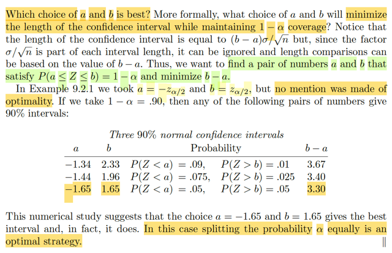</kbd>

> [!NOTE]
> Vậy thì câu hỏi đặt ra là chọn a , b thế nào để thỏa xác suất trên bằng
> 1 - α để ta có một confidence set có coverage probability là 1 - α nhưng 
> length của nó phải ngắn nhất. Và bởi việc cả hai chặn trên dưới đến
> dính đến σ/√n nên việc minimize (b-a) σ/√n sẽ trở thành minimize b-a
>
> Rồi ông mới nhắc đến trong kết quả bữa trước, ta chọn a, b là -/+ z_α/2
> nhưng chưa chắc nó là optimal.
>
> Nói lại chút xíu về kết quả này: Đơn giản là như trên, ta đã có:
>
> Ta muốn tìm a, b soa cho P(a ≤ Z ≤ b) = 1-α 
>
> Thì đây là diện tích của phần đồ thị của normal(0,1) giữa hai mốc a, b.
> Vậy thì một cách dễ thấy là: chọn b để P(Z > b) = α/2, và a khiến P(Z ≤ a)
> = α/2. khi đó diện tích khúc giữa sẽ là 1 - α/2 - α/2 = 1 - α.
>
> Thế thì b để P(Z > b) = α/2 thì b chính là z_α/2.
>
> Còn a để P(Z ≤ a) = α/2 ⇔ 1 - P(Z > a) = α/2 ⇔ P(Z > a) = 1 - α/2
>
> ⇨ a chính là z_(1-α/2).
>
> Tới đây ta nói luôn khoảng [z_(1-α/2), z_α/2] là cái cần tìm vẫn đúng.
>
> Nhưng n(0,1) lại đối xứng qua 0. Có nghĩa là phần diện tích bên phải mốc
> u sẽ bằng phần diện tích bên trái mốc -u (với u dương), Do đó:
>
> a = -b ⇨ z_(1-α/2) = - z_α/2.
>
> Nên cái khoảng trên cũng chính là [-z_α/2, z_α/2]
>
> -----
>
> Quay lại đây, đại ý cũng dễ hiểu là, ta có thể chọn các mốc khác, để
> xác suất này bằng 1-α, và chúng sẽ cho ra các length khác nhau, và cho
> thấy cái a, b trên chính là cái có lenght nhỏ nhất. Nhưng gs chỉ nói là vì
> về mặt giá trị thì ta thấy vậy, chứ đây ko phải là chứng minh rằng trong case
> này lấy đối xứng lại là tốt nhất.
>
> -----
>
> Có thể dễ hiểu là trong case này chắc chắn phải lấy đối xứng thì mới tối
> ưu (length ít nhất). Là vì cái đám mây chuông đối xứng quanh 0. Khi đó
> nếu ta kéo lệch qua trái hay phải hay thậm chí ra khỏi phạm vi cái đỉnh
> thì vì tại đó cái đám mây sẽ mỏng lét, nên để đủ giá trị xác suất 1-α 
> thì ta sẽ phải kéo nó rất dài mới gom đủ.

 

<kbd>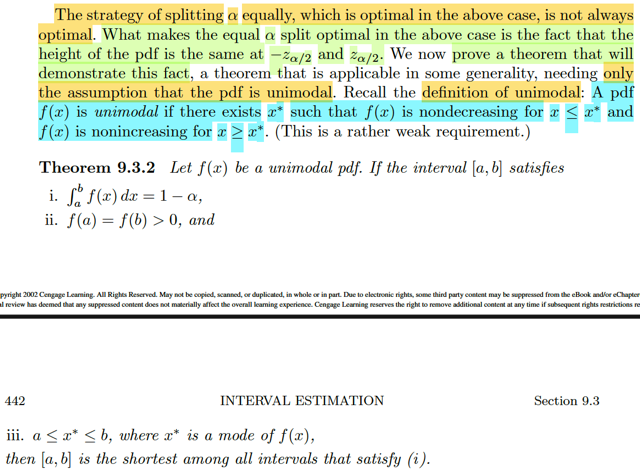</kbd>

> [!NOTE]
> Tiếp theo đại khái là theorem nói về cái này: nếu pdf thuộc dạng
> unimodal (hiểu nôm na là chỉ có 1 đỉnh, nói bằng toán học là tồn tại x*
> khiến đi x ≤ x* thì hàm không giảm, và x* ≤ x thì hàm không tăng) thì khi
> đó. Nếu tại a, b pdf đều dương và bằng nhau. và xác suất x giữa a, b
> (∫a:bf(x)dx) là 1-α. thì [a,b] chính là đoạn có length ngắn nhất trong số
> những đoạn khiến xác suất là 1-α

 

<kbd>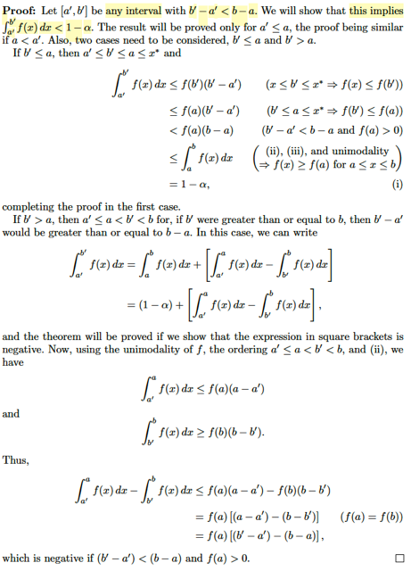</kbd>

> [!NOTE]
> Phần chứng minh thấy vậy mà dễ hiểu thôi ko có gì khó:  Để chứng
> minh [a, b] là đoạn ngắn nhất trong số những đoạn thỏa P(x ∈ [a,b])
> = 1-α ta chỉ cần chứng minh mọi đoạn [a',b'] ngắn hơn [a,b] đều có
> xác suất không đạt.
>
> Ta xét case a' < a: Khi đó sẽ có hai case để có các thứ tự của các
> mốc như sau
>
> b' < a ⇨ a' < b' < a < b:
>
> xét ∫a':b' f(x)dx, chắc chắn nó sẽ ≤ f(b)(b'-a') vì sao:
>
> vì ∫a':b' f(x)dx là diện tích của phần đồ thị pdf của hàm số từ a' đến
> b'. Mà trong đoạn này hàm non-decresing, do x* là cái mode sẽ
> nằm trong [a,b] như theo đề bài cho. do đó, diện tích này là diện
> tích dưới một đường cong đi lên hoặc đi ngang. Do đó nó phải nằm
> trong diện tích của hình chữ nhật có chiều cao là f(b') (dịện tích là
> f(b)(b'-a').
>
> Còn cách đơn giản hơn, thì lập luận trên cho ta f(x) ≤ f(b') với  mọi
> x ∈ [a',b'] nên ∫a':b' f(x)dx ≤ ∫a':b' f(b')dx = f(b')(b'-a')
>
> Vậy ta có ∫a':b' f(x)dx ≤ f(b)(b'-a')
>
> ≤ f(a)(b-a) do a nằm bên phải b' nên f(b') < f(a) và (b'-a') < (b-a)
>
> ≤ ∫a:b f(x)dx  do cũng vì tính chất đừong cong non-decreasing nên
>
> f(a) ≤ f(x) với mọi x từ a đến b
>
> = 1-α, chứng minh xong cho case này
>
> a < b' ⇨ a' < a < b' < b
>
> Xét ∫a':b' f(x)dx = ∫a:b f(x)dx + ∫a':a f(x)dx - ∫b':b f(x)dx
>
> = (1-α) + ∫a':a f(x)dx - ∫b':b f(x)dx
>
> Ta sẽ chỉ cần chứng minh ∫a':a f(x)dx - ∫b':b f(x)dx âm thì sẽ suy ra
> vế trái < 1-α
>
> ∫a':a f(x)dx ≤ f(a)(a-a')
>
> ∫b':b f(x)dx ≤ f(b)(b-b') ⇨ -∫b':b f(x)dx ≤ -f(b)(b-b')
>
> ⇨ ∫a':a f(x)dx - ∫b':b f(x)dx ≤ f(a)(a-a') -f(b)(b-b')
>
> = f(a)(a-a'-b+b') = f(a)(b'-a'-(b-a)) < 0 do đang nói [a',b'] ngắn hơn
> [a,b]
>
> chứng minh xong

 

<kbd>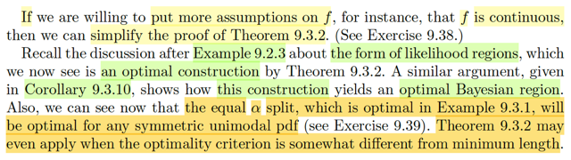</kbd>

🔗 **Related:** [9.2 METHODS OF FINDING INTERVAL ESTIMATORS](92_methods_of_finding_interval_estimators.md#node-767)

> [!NOTE]
> Tiếp theo, đại khái là gs nhắc lại trong ví dụ 9.2.3 (xem link) mình đã xét
> một bài toán mà trong đó ta xây dựng 1-α confidence set bằng cách invert
> một likelihood ratio test. Với ý tưởng chính đại khái là như sau:
>
> Dựa trên việc một LRT sẽ là cái test có rule reject hay accept H0 dựa trên
> λ(**X**) là likelihood ratio test statistic nhỏ hơn hay lớn hơn một threshold c
> là con số nào đó từ 0 đến 1.
>
> Do đó, nếu ta có một cái LRT cho bài toán testing H0: θ = θ0, thì ta có thể
> chọn c  sao cho sup_θ∈Θ0={θ0) P_θ(reject H0) = P_θ0(reject H0) =
> P_θ0(λ(**X**) ≤ c) ≤ α
>
> Rồi, với cái c đó dĩ nhiên cái tập {**x**: λ(**x**) ≤ c} sẽ là level α rejection
> region, cũng như {**x**: λ(**x**) > c} là level α acceptance region A(θ0) của
> bài toán testing H0: θ = θ0.
>
> Từ đó, theo Tautology theorem, ta sẽ có C(**X**) = {θ: λ(**X**) > c} = {θ:
> L(θ|**x**) / L(θ^_mle|**x**) > c}  sẽ là 1-α confidence  interval cho θ
>
> Và từ đó, ta mới xét hàm số g(θ) = L(θ|**x**) / L(θ^_mle|**x**), và xét nó là
> hàm theo θ, thì nó sẽ là có dạng một đỉnh núi. Để rồi nếu có thể chuyển {θ:
> L(θ|**x**) / L(θ^_mle|**x**) > c} thành [θL(**x**), θU(**x**)] với g(θL) = g(θU)
>
> Vậy thì quay lại đây, ĐẠI Ý GS NÓI RẰNG, với việc ta vừa chứng minh
> Theorem 9.3.2 ta sẽ QUAY LẠI KẾT LUẬN RẰNG, CÁI INTERVAL
> [θL(**X**) ≤ θ ≤ θU(**X**)] CÓ ĐƯỢC BẰNG CÁCH LÀM NÀY CHÍNH LÀ
> TỐI ƯU.
>
> Không phải bằng cách ốp trực tiếp theorem này vào, vì cái hàm g mà ta có
> (và đem cắt ngang mốc c để lấy hai điểm) ko phải là hàm pdf. Nhưng đại ý
> là có thể chứng minh được là theorem này cũng sẽ dẫn đến kết luận cái
> interval đó là tối ưu.
>
> Và gs nói thêm, qua phần sau, ta sẽ thấy, nó cũng chính là cách làm để
> tạo ra cái Bayesian region (credible set) tối ưu.
>
> Và cuối cùng, tiếp theo ta sẽ chứng minh rằng với pdf nào unimodal, thì
> cách làm equal α split (tức là chặt bỏ khúc đầu và khúc sau nơi có diện
> tích = α/2)  sẽ đều cho ra đoạn optimal length.

 

<kbd>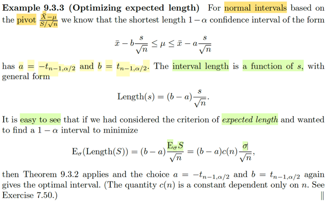</kbd>

🔗 **Related:** [5.3 SAMPLING FROM THE NORMAL DISTRIBUTION](53_sampling_from_the_normal_distribution.md#node-370)

🔗 **Related:** [3.5 LOCATION AND SCALE FAMILIES](35_location_and_scale_families.md#node-202)

> [!NOTE]
> Đại khái là ta còn nhớ, với random sample normal(μ, σ^2), thì có hai statistic
> có thể đóng vai pivot:
>
> Cái thứ nhất là dựa trên việc Xbar  ~ normal(μ, σ^2/n), thì theo location scale
> family, (Xbar - μ) / σ/√n sẽ là ~ normal(0,1) → distribution không còn phụ thuộc
> μ, σ.
>
> Cái thứ hai là ta biết (Xbar - μ)/ S/√n ~ tn-1, tức Student 's t distribution bậc tự
> do n-1, cũng có distribution không phụ thuộc μ, σ gì nữa.
>
> Tuy vậy, ta sẽ **CHỈ** xây dựng interval estimator cho μ **dựa trên cái thứ nhất
> (Xbar - μ) / σ/√n NẾU  BIẾT σ**.
>
> Vì sao? Bởi lẽ đơn giản là quá trình làm để đưa về cái xác suất liên quan đến
> pivot thì bản thân hai cái khoảng sẽ chứa σ, nếu không biết σ thì làm sao làm
> được.
>
> Còn nhớ, cách thức để xây dựng một confidence set có coefficient 1-α mong
> muốn, từ pivot Q(X, θ), đó là, ta sẽ tìm a, b sao cho P_θ0(a ≤ Q(**X**, θ0) ≤ b)
> = 1 - α, thì khi đó ta sẽ có thể nói rằng, đối với bài toán testing H0: θ = θ0, thì
> nếu xét A(θ0)  = {**x**: a ≤ Q(**x**, θ0) ≤ b} thì sup_θ∈Θ0={θ0}
>
> P_θ(**X**∈****A(θ0)_c) = P_θ0(**X** ∈ A(θ0)_c) = 1 - P_θ0(**X** ∈ A(θ0)) = 1 - (1 - α) = α, 
> giúp  kết luận A(θ0) chính là một level α acceptance region của bài toán 
> testing H0: θ=θ0.
>
> Từ đó, theo Tautology, nếu xây dựng hàm C(**x**) nhận vào x và trả ra tập {θ:
> a ≤ Q(**x**, θ) ≤ b} thì C(**X**) = {θ: a ≤ Q(**X**, θ) ≤ b} chính là 1-α confidence
> set/interval của θ.
>
> Thế thì với việc ta có pivot Z = (Xbar - μ) / σ/√n thì làm như trên, ta sẽ xây
> dựng tập A(μ0) = {x: a ≤ (Xbar - μ) / σ/√n ≤ b} sao cho P_μ0(**X** ∈ A(μ0)) =
> 1-α
>
> ⇔ P(a ≤ (Xbar - μ0) / σ/√n ≤ b) = 1 - α
>
> ⇔ P(a ≤ Z ≤ b) = 1-α
>
> Bước này ta có thể tìm ra a, b để thỏa cái này, ví dụ a = -z_α/2, b = z_α/2
>
> Tuy nhiên khi đó C(**X**) = {μ: a ≤ (Xbar - μ) / σ/√n ≤ b}
>
> = {μ: aσ/√n ≤ Xbar - μ ≤ bσ/√n}
>
> = {μ: Xbar - bσ/√n ≤ μ ≤ Xbar - aσ/√n}
>
> là 1-α confidence interval cho μ.
>
> thì đây lại là khoảng phụ thuộc σ. Tuy rằng **DÙ σ BẰNG BAO NHIÊU THÌ
> ĐÂY VẪN LÀ 1-α CONFIDENCE SET, NHƯNG KHÔNG BIẾTσ THÌ CŨNG VÔ
> NGHĨA.**----- ****Do đó, khi không biết σ ta sẽ dùng cái pivot thứ hai: (Xbar - μ) / S/√n,
> với S^2 là sample variance (chính xác thì gọi là unbiased sample variance có
> công thức Σi (Xi - xbar)^2 / (n-1), vì E(S^2) = σ^2)
>
> Cách làm hoàn toàn tương tự, ta sẽ tìm a, b để A(μ0) = {**x**: a ≤ Xbar - μ) /
> S/√n ≤ b} là một level α acceptance region của bài toán testing H0: μ = μ0
>
> Cũng là P_μ0(a ≤ (Xbar - μ) / S/√n ≤ b} = 1-α
>
> ⇔ P_μ0(a ≤ T_n-1 ≤ b} = 1-α
>
> Ta sẽ chon a là mốc sao cho P(T_n-1 ≤ a) = α/2 ⇔ 1 - α/2 = P(T_n-1 ≥ a) ⇨ a
>
> = tn-1_(1-α/2)
>
> và chọn b sao cho P(T_n-1 ≥ b) = α/2 ⇨ b = tn-1_α/2
>
> Khi đó, theo Tautology, C(**X**) = {μ: a ≤ (Xbar - μ) / S/√n ≤ b} sẽ là 1-α confidence 
> set của μ
>
> = {μ: a ≤ (Xbar - μ) / S/√n, (Xbar - μ) / S/√n ≤ b}
>
> = {μ: a S/√n ≤ (Xbar - μ), (Xbar - μ) ≤ b S/√n}
>
> = {μ: μ ≤ Xbar - a S/√n, Xbar - b S/√n ≤ μ}
>
> = {μ: Xbar - b S/√n ≤ μ ≤ Xbar - a S/√n} chính là 1-α confidence interval cho μ
>
> Và vì tn-1 cũng có tính đối xứng giống normal nên tn-1_(1-α/2) = -tn-1_α/2
>
> ⇨ [Xbar - tn-1,α/2 S/√n ≤ μ ≤ Xbar + tn-1,α/2 S/√n]
>
> Và observed value X = x thì cái khoảng 1-α confidence để vây bắt μ sẽ là 
>
> [xbar - tn-1,α/2 s/√n ≤ μ ≤ xbar + tn-1,α/2 s/√n]

> [!NOTE]
> Tiếp tục, theo như theorem vừa mới học thì cái interval này chính là optimal trong
> số những khoảng có coefficient 1-α, đồng nghĩa nó là ngắn nhất. Vì sao?
>
> Là vì cách ta chọn a, b chính là thỏa:
>
> P(a ≤ Tn-1 ≤ b) = 1-α, cũng chính là ∫a:b f(t)dt = 1-α với f(t) là pdf của tn-1
>
> f(a) = f(b) vì f(-tn-1,α/2) = f(tn-1,α/2) do tính đối xứng của tn-1
>
> và đỉnh của distribution này nằm ở đâu đó trong đoạn [a, b], lí do là vì đây là một
> uni-modal pdf.
>
> Nên theo Theorem 9.3.2, đây là đoạn ngắn nhất thỏa P(a ≤ Tn-1 ≤ b) = 1-α → từ
> đó cũng giúp kết luận [Xbar - tn-1,α/2 S/√n ≤ μ ≤ Xbar + tn-1,α/2 S/√n] là đoạn tối
> ưu.
>
> -----
>
> Nhưng ở đây đại khái là ta có thể nhìn thấy ở một góc nhìn khác:
>
> xét interval length = Xbar - a S/√n - (Xbar - b S/√n) = (b - a) S/√n
>
> Thế thì nếu ta lấy trung bình của interval length: E_μ,σ [(b - a) S/√n]
>
> Tuy nhiên ta biết (n-1) S^2 / σ^2 ~ Chi-square_n-1, không phụ thuộc μ, nên từ đó
> pdf của S^2 cũng ko phụ thuộc μ:
>
> Còn nhớ location scale theorem: nếu f(z) là pdf của location scale family của với
> thành viên chuẩn thì X = σZ + μ sẽ thuộc thành viên có location μ, scale σ, có pdf
> fX(x) = f((x-μ)/σ) / σ
>
> Nên nếu gọi f(c) là pdf của X^2_n-1 ~ Chi-square_n-1, thì dùng theorem trên ta
> sẽ có  thì X^2_n-1 [σ^2/(n-1)] sẽ là thành viên có scale σ^2/(n-1), có pdf sẽ là:
>
> fS^2(s^2) = f(s^2 / [σ^2/(n-1)]) / σ^2/(n-1)
>
> Qua đó, cho thấy pdf của S^2 sẽ phụ thuộc σ, không phụ thuộc μ.
>
> Nên không có lí do gì distribution của S lại phụ thuộc μ. Tất nhiên để chứng minh
> chặt chẽ ta lại dùng transformation theorem: S = √S^2 để xây dựng pdf của S,
> nhưng vì pdf của S^2 không dính đến μ, chỉ dính đến σ nên chắc chắn pdf của S
> cũng vậy.
>
> Nên ta sẽ viết E_σ [(b - a) S/√n] (ko phụ thuộc μ)
>
> -----
>
> Tiếp, đây là tính kì vọng của S, những cái khác coi như hằng số, dùng linearity, ta
> có:
>
> = (b - a)/ √n E_σ(S)
>
> Tới đây, nếu ra ngay E_σ(S) = σ thì sẽ là sai, ta chỉ biết E_σ[S^2] = σ^2, vì S^2  là
> unbiased sample variance. Đây là nội dung bài tập 7.5
>
> Kết quả sẽ là (b - a)c(n) σ/√n với c(n) là constant phụ thuộc n.
>
> Thì cái chính muốn nói đó là, nếu bây giờ ta giải bài toán minimize cái này, hay
> đúng hơn là minimize trị tuyệt đối của trung bình length |E_σ[length trung bình]|
> thì chính là minimize |b - a| s.t P(a ≤ tn-1 ≤ b) = 1 - α. Và cái theorem 9.3.2 đã
> chứng minh a, b theo cách chọn đó chính là có length nhỏ nhất thỏa điều kiện.
>
> Vậy, mục đích của gs là kết nối theorem đó với việc quả thật nó khiến ta có kì
> vọng của interval length nhỏ nhất trong bài toán cụ thể này.

 

<kbd>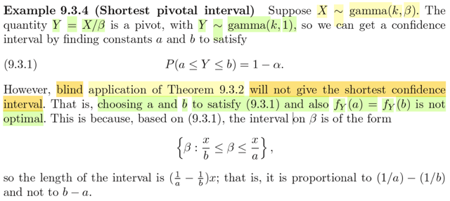</kbd>

> [!NOTE]
> Tiếp, qua ví dụ này, đại khái là cho X ~ γ(k, β) thì X/β sẽ là γ(k,1) (γ là scale
> family với scale là β). Nên distribution của nó không phụ thuộc β, nên nó là
> một pivot, có thể được dùng để xây dựng confidence interval cho β.
>
> Như thường lệ, nói lại cho nhớ, ta sẽ tìm a , b sao cho:
>
> P(a ≤ X/β ≤ b) = 1-α mong muốn
>
> Khi đó sup_β∈Θ0={β0} P_β(reject H0) = P_β0(Reject H0) = 1 - P_β0(Accept
> H0) = 1 - P_β0(X ∈ {x: a ≤ x/β0 ≤ b}) = 1 - P_β0(a ≤ X/β ≤ b) = 1 - (1 - α) = α
>
> ⇨ A(β0) = {x: a ≤ x/β0 ≤ b} chính là level α acceptance region của bài toán
> testing H0: β = β0
>
> ⇨ Theo Tautology theorem C(X) = {β: a ≤ X/β ≤ b} chính là 1 - α confidence
> interval của β.
>
> Thế thì theo Theorem 9.3.2, cái ta đang có chính là gì?
>
> Ta có pdf của Y = X/β, là γ(k,1) sẽ là một unimodal.
>
> Nếu ta chọn a, b được chọn theo cách thức fY(a) = fY(b) > 0 sao cho ∫a:b
> fY(y)dy = 1-α thì theorem này cho ta biết đoạn [a,b] là đoạn ngắn nhất (tối ưu)
> khiến ta có P(a ≤ X/β ≤ b) = 1-α.
>
> TUY NHIÊN, VẤN ĐỀ LÀ:
>
> Đúng là khi đó, observed X = x, thì [a, b] là đoạn ngắn nhất thỏa P(a ≤ x/β ≤ b)
> = 1-α
>
> Như khoảng của β lại là [x/b, x/a] lại CHƯA CHẮC LÀ ĐOẠN NGẮN NHẤT.
>
> đơn giản là vì, length của đoạn này là x/a - x/b. Nên nếu a-b ngắn chưa chắc
> x/a - x/b đã ngắn. 
>
> Do đó trong trường hợp này, ta không thể dựa vào theorem 9.3.2 mà kết luận
> [x/b, x/a] là optimal 1-α confidence interval cho β được.

 

<kbd>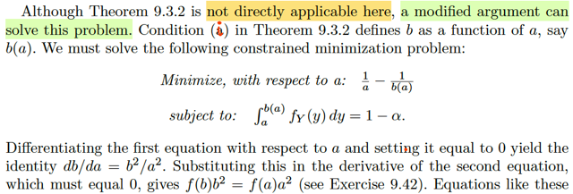</kbd>

> [!NOTE]
> Đại khái là, tuy không thể áp dụng trực tiếp theorem 9.3.2 vào để kết luận
> cái khoảng 1-α confidence TỐI ƯU của β là gì (vì như vừa thấy, không thể
> suy ra [x/b,x/a] là tối ưu được dù [a,b] theo theorem là đoạn ngắn nhất
> thỏa ∫a:bfY(y)dy = 1 - α.
>
> Nhưng ta có thể vẫn có cách để tìm:
>
> Vì a, với b phải thỏa ∫a:bfY(y)dy = 1 - α ⇨ FY(b) - FY(a) = 1 - α 
>
> ⇨ FY(b) = FY(a) + 1 - α 
>
> ⇨ b = FYinv[FY(a) + 1 - α], coi như b = b(a), là hàm theo a.
>
> Khi đó, bài toán đặt ra để tìm hai cái chốt của β có length nhỏ nhất sẽ là:
>
> minimize x(1/a - 1/b) s.t ∫a:bfY(y)dy = 1 - α
>
> Đây là bài toán tối ưu theo hai biến a, b ràng buộc equality 
>
> Ta có thể giải theo lối sau: từ ∫a:bfY(y)dy = 1 - α ⇨ b = b(a) như trên. Thế
> b = b(a) vào objective, ta chuyển thành bài toán tối ưu ko ràng buộc
>
> minimize x(1/a - 1/b(a))
>
> Điều kiện cần tối ưu bậc nhất:
>
> d/da [x(1/a - 1/b(a))] = 0
>
> ⇔ x { d/da (1/a) - d/da [1/b(a))] } = 0
>
> ⇔ x { (-1/a^2) - d/da [b(a)^-1] } = 0
>
> ⇔ (-1/a^2) - d/db(a) [b(a)^-1] . d/da b(a) = 0
>
> ⇔ (-1/a^2) - [-b(a)^-2] . b'(a) = 0
>
> ⇔ (-1/a^2) + b(a)^-2 . b'(a) = 0
>
> Thay b(a) = FYinv[FY(a) + 1 - α]
>
> b'(a) = d/da FYinv[FY(a) + 1 - α]
>
> Tới đây cần kiến thức đạo hàm của hàm nghịch:
>
> Xét hàm f và inverse của nó: finv. Ta có finv(f(x)) = x
>
> Đạo hàm hai vế theo x:
>
> d/dx finv(f(x)) = d/dx x
>
> ⇔ d/df(x) finv(f(x)) . d/dx f(x) = 1 | chain rule
>
> ⇔ d/df(x) finv(f(x)) = 1 / [d/dx f(x)]
>
> ⇔ d/df(x) finv(f(x)) = 1 / [d/dx f(finv(f(x))]  | vì x = finv(f(x))
>
> Đặt y = f(x), x = finv(y)
>
> ⇔ **d/dy finv(y) = 1 / [d/dx f(x)] = 1 / [d/dx f(x)|x=finv(y)] = f'(x)|x=finv(y)**
>
> Vậy thì ở đây mình đang cần tính b'(a) = d/da Finv[F(a) + 1 - α]
>
> Đặt z(a) = FY(a) + 1 - α
>
> b'(a) = d/da  Finv(z(a))
>
> = d/dz Finv(z) . d/da z(a)
>
> Xét d/da z(a) = d/da [F(a) + 1 - α] = d/da F(a) + 0 = f(a) (tức fY(a) đó)
>
> Xét d/dz Finv(z): Áp dụng cái công thức trên: 
>
> = 1 / d/dx F(x)|x = Finv(z)
>
> = 1/ F'(Finv(z))
>
> = 1/ f(Finv(z))
>
> = 1/ f(Finv(FY(a) + 1 - α)) 
>
> Đây chính là 1/ f(b).
>
> Vậy b'(a) = 1/ f(b) . f(a) = f(a) / f(b)
>
> Quay lại thế vào điều kiện cần bậc nhất: ⇔ (-1/a^2) + b(a)^-2 . b'(a) = 0
>
> ⇔ (-1/a^2) + b(a)^-2 . [f(a) / f(b)] = 0
>
> Thay b(a) = b lại. (ý là ko cần dùng kí hiệu b(a) để thay cho b nữa)
>
> ⇔ (-1/a^2) + b^-2 . [f(a) / f(b)] = 0
>
> ⇔ -1/a^2 + f(a) / b^2 f(b) = 0
>
> ⇔ f(a) / b^2 f(b) = 1/a^2
>
> ⇔ a^2 f(a) = b^2 f(b)
>
> Và đây chính là điều kiện để giải tìm a, b khiến minimize length x/a - x/b
> sao cho vẫn thỏa ∫a:b f(y)dy = 1 - α.

 

<kbd>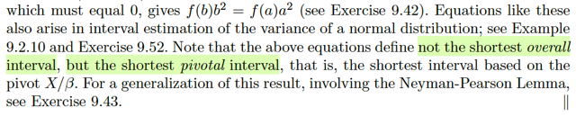</kbd>

> [!NOTE]
> Đại khái là cuối cùng gs lưu ý rằng, cái equation f(b)b^2 = f(a)a^2 chỉ giúp ta
> tìm ra shortest pivotal interval thay vì the shortest overall interval.
>
> Có nghĩa là sao? Có nghĩa là đây chỉ là interval của β (ý là 1-α confidence
> interval) ngắn nhất trong số những cái được dựa trên pivot X / β thôi.
> CHƯA CHẮC NÓ LÀ CÁI NGẮN NHẤT TRÊN ĐỜI (so với mọi 1-α
> confidence interval của β

 

<kbd>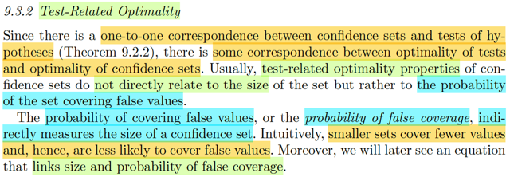</kbd>

> [!NOTE]
> Qua phần này. Đầu tiên đại ý tác giả nói là như ta đã biết, vì hầu như các
> confidence set / interval đều mapping 1-1 với một hypothesis test, nên
> ta có thể liên quan TÍNH TỐI ƯU CỦA MỘT TEST VỚI TÍNH TỐI ƯU CỦA
> CONFIDENCE SET. (hiểu nôm na là, ta có thể đánh giá một cái confidence
> set bằng cách đánh giá độ ưu việt test tương ứng)
>
> Tác giả nói trước, khi dùng các tính chất của một confidence set mà các tính 
> chất này thuộc loại những tính chất liên quan đến cái hypothesis test, thì
> ta sẽ thấy nó không liên quan trực tiếp đến yếu tố kích thước, mà thay vào
> đó, nó liên quan đến size một cách gián tiếp, thông qua một thước đo khác: 
>
> Xác suất cái confidence set chứa giá trị sai - probability of false coverage.
>
> Nói nó liên quan đến size một cách gián tiếp là bởi: nếu một set có xác suất
> mang giá trị sai nhỏ, thì cũng chính là nó càng ngắn.

 

<kbd>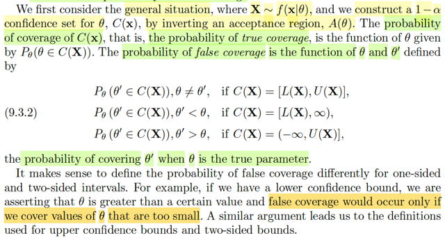</kbd>

> [!NOTE]
> Đầu tiên, gs bàn đến định nghĩa của probability of false coverage:
>
> Đại khái là như ta biết nếu C(**X**) là một 1-α confidence set của θ, được hình
> thành bằng cách invert một level α acceptance region A(θ0) của bài toán
> testing H0: θ = θ0. Thì theo định nghĩa, coverage probability của nó chính  là
> P_θ(θ ∈ C(**X**)). Thì đây cũng được gọi là PROBABILITY OF TRUE
> COVERAGE.
>
> tức là, nó mang ý nghĩa là, nếu θ LÀ GIÁ TRỊ THẬT của param, thì xác suất
> cái confidence set này chứa θ là bao nhiêu. (Chú ý, nó ko phải là 1-α nhé, vì
> 1-α là confidence  coefficient, là inf_θ P_θ(θ ∈ C(**X**))
>
> Và mình cũng hiểu đây là hàm theo θ vì 2 lí do: θ là input, và thứ hai là đây là
> xác suất của C(**X**), một random interval dựa trên random sample **X**, nên
> có thể xác suất này phụ  thuộc θ (trừ khi ta có một interval được xây dựng
> dựa trên pivot)
>
> Còn bây giờ, ta được học định nghĩa của **PROBABILITY OF FALSE
> COVERAGE**, mang ý nghĩa như sau: với một θ' KHÔNG PHẢI LÀ GIÁ TRỊ
> THẬT của param, và θ MỚI LÀ GIÁ TRỊ THẬT của param, thì xác xuất C(**X**)
> chứa θ' là bao nhiêu.
>
> Do đó có thể dự đoán công thức của cái này sẽ là P_θ(θ' ∈ C(**X**))
>
> Tuy nhiên, vì lí do gì đó, người ta chia ra làm 3 case điều kiện với input.
>
> Nếu C(**X**) có dạng [L(**X**), U(**X**)] thì chỉ xét θ' khác θ
>
> Nếu C(**X**) có dạng (-inf, U(**X**)] thì chỉ xét θ' > θ
>
> Nếu C(**X**) có dạng [L(**X**), inf) thì chỉ xét θ' < θ
>
> Và cái lí do đó là vầy:
>
> Hiểu đại khái thì, bản chất của việc đặt ra cái này, xác suất cover giá trị sai là
> nhằm tính toán, định lượng MỨC ĐỘ DỞ / YẾU KÉM của confidence set
> C(**X**) bằng cách đó xác suất nó chứa giá trị sai θ'
>
> Vậy thì nếu C(**X**) = [L(**X**), inf), thì có nghĩa là gì → ta nhớ, có nghĩa là về
> bản chất, cái interval estimator này đang ĐOÁN θ NẰM TRONG ĐÂY: L(**X**)
> < θ < inf Mà như vậy thì việc đánh giá độ dở của C(**X**) CHỈ CÓ NGHĨA nếu
> ta xét mấy  thằng θ' < θ. Vì mọi θ' > θ đương nhiên C(**X**) cũng chứa hết rồi,
> nên đánh giá xác suất nó chứa mấy thằng đó là vô nghĩa. Và bằng cách đánh
> giá bởi các θ'  < θ, thì ta mới làm động tác cố gắng **GIẢM ĐỘ YẾU KÉM**
> của C(**X**) BẰNG CÁCH **NÂNG** L(**X**) **CÀNG SÁT VỚI θ CÀNG TỐT**,
> KHI ĐÓ, SẼ **ĐÁ HẾT MẤY THẰNG θ'** < θ **RA KHỎI** C(**X**) CẢ.
>
> Tương tự như vậy, nếu C(X) = (-inf, U(**X**)] thì sẽ chỉ có ý nghĩa nếu ta xét
> các θ' > θ.
>
> Còn với C(X) có dạng [L(**X**), U(**X**)] thì dĩ nhiên ta sẽ xét hết θ' khác θ.

 

<kbd>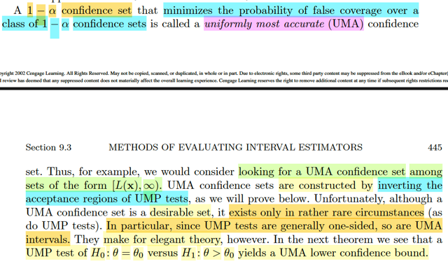</kbd>

> [!NOTE]
> Rồi, thế thì tiếp theo sẽ dẫn đến ĐỊNH NGHĨA CỦA MỘT **UNIFORMLY
> MOST ACCURATE** 1-α confidence set: Là cái confidence set mà xác suất
> false coverage cuả nó là thấp nhất mọi thằng set khác với mọi θ'.
>
> Có nghĩa là ta vừa define xong khái niệm probability of false coverage, là
> hàm theo θ' và θ.
>
> Thì C(X) là UMA 1-α confidence set của θ thì với C'(**X**) là 1-α confidence
> set  bất kì của θ. Thì với mọi θ' thì:
>
> P_θ(θ' ∈ C(X)) ≤ P_θ(θ' ∈ C'(X)) ∀ θ' khác θ / hay < θ hay > θ tùy vào
> C(**X**) và C'(**X**) có dạng nào trong 3 dạng vừa nói.
>
> Thế thì đại ý gs nói rằng, ngay sau đây mình sẽ chứng minh rằng **BẰNG
> CÁCH INVERT MỘT CÁI UNIFORMLY MOST POWERFUL TEST** ta sẽ có
> một  **UNIFORMLY MOST ACCURATE SET.** 
>
> Tuy nhiên vì đa phần các **UMP** test **ĐỀU CHỈ CÓ DẠNG LÀ MỘT ONE-SIDE** 
> test, **NÊN UMA set** cũng vậy.

 

<kbd>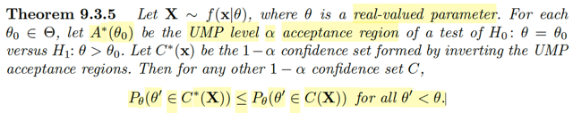</kbd>

> [!NOTE]
> Ôn lại chút xíu những gì học hôm qua: Đại khái là mình qua một tiêu chí khác,
> một cách tiếp cận khác để đánh giá confidence set (cái đầu tiên là dùng
> coverage probability và size, để rồi mình có Theorem 9.3.2 giúp tìm cái có size /
> length nhỏ nhất trong số những cái có cùng coverage probability) đó là dùng
> các tính chất liên quan đến chất lượng của cái test tương ứng. Vì như ta đã
> biết, bất kì cái confidence set (hay còn gọi là interval estimator) để gắn với một
> hypothesis testing.
>
> Thế thì, ta được học một khái niệm mới - probability of false coverage: Được
> định nghĩa là function của θ' và θ  mang ý nghĩa xác suất confidence set chứa
> θ': P_θ(θ' ∈ C(**X**)) với θ' khác θ hoặc < θ hoặc > θ tùy vào việc C(**X**) có
> dạng [L(**X**), U(**X**)] hay [L(**X**), inf) hoặc (inf, U(**X**)], và nó sẽ thể hiện
> độ yếu kém của một confidence set.
>
> Từ đó, ta có một thước đo để so sánh đánh giá các confidence set, để rồi cái
> gọi là Uniformly Most Accurate 1-α set sẽ là cái mà xác suất of false coverage
> tại θ' sẽ luôn nhỏ hơn của các 1-α set khác.
>
> Thế thì đây sẽ là một Theorem làm cơ sở cho việc xây dựng một cái UMA level
> α confidence set: Invert từ một Uniform Most Powerful level α test.
>
> Còn nhớ khái niệm UMP of class C test: thì nó chính là cái test trong class C
> mà β(θ) ≥ β'(θ) với mọi θ ∈ Θ0c, với β' là power function của cái test bất kì trong
> class C. Mà power function, còn nhớ, được định nghĩa bởi xác suất reject H0
> khi nên reject H0, tức θ ∈ Θ0c: β(θ) = P(reject H0). Nên UMP of level α test 
> mang ý nghĩa là cái test mà khi nên reject H0, thì nó là cái có xác suất reject H0
> cao nhất.
>
> Theorem nói rằng: Với mỗi θ0 ∈ Θ, gọi A*(θ0) là UMP level α acceptance region
> của bài toán testing H0: θ = θ0 vs H1: θ > θ0. Thì khi đó nếu gọi C*(**x**) là 1-α
> confidence set tạo bởi cách inver cái test trên thì nó chính là UMA 1-α
> confidence set, thể hiện bởi:
>
> P_θ(θ' ∈ C*(**X**)) ≤ P_θ(θ' ∈ C(**X**)) với mọi θ' < θ, với mọi 1-α confidence
> set bất kì C(**X**) khác.

 

<kbd>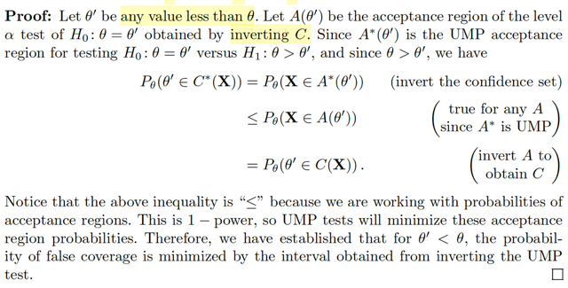</kbd>

> [!NOTE]
> Thử xem chứng minh như thế nào:
>
> Đầu tiên, dĩ nhiên để chứng minh rằng cái C*(**X**) là UMA 1-α confidence set
> có dạng [L(**X**), inf) thì xác suất of false coverage của nó là nhỏ nhất:
>
> P_θ(θ' ∈ C*(**X**)) ≤ P_θ(θ' ∈ C(**X**)) ∀θ' < θ.
>
> với C(**X**) là 1-α confidence set  bất kì.
>
> ------
>
> Thế thì, ta có đề bài cho với mọi θ0 ∈ Θ, A*(θ0) là **UMP level α acceptance region** 
> của bài toán testing H0: θ = θ0 vs H1: θ > θ0. 
>
> Theo định nghĩa của UMP test vừa ôn lại, thì nếu gọi β' là power function của bất kì 
> level α test  khác, và β là power của UMP level α test thì
>
> Với mọi θ ∈ Θ0c, β(θ) ≥ β'(θ)
>
> Cũng như vừa ôn lại power function của một test là hàm theo θ được định nghĩa 
> bởi: β(θ) = P_θ(reject H0) 
>
> Nên power function của UMP test = β(θ) = P_θ(**X** ∈ A*(θ0)_c)
>
> Và power function của test khác: P_θ(**X** ∈ Rejection region của test đó)
>
> Gọi A(θ0) là level α acceptance region được tạo bởi invert cái 1-α confidence
> set C(**X**) bất kì, thì power function của cái test này sẽ là:
>
> P_θ(**X** ∈ A(θ0)_c)
>
> Và ta có:
>
> P_θ(**X** ∈ A*(θ0)_c) ≥ P_θ(**X** ∈ A(θ0)_c) ∀θ ∈ Θ0c (cũng là ∀ θ > θ0)
>
> ⇔ 1 - P_θ(**X** ∈ A*(θ0)) ≥ 1- P_θ(**X** ∈ A(θ0)) ∀θ > θ0
>
> ⇔ P_θ(**X** ∈ A*(θ0)) ≤ P_θ(**X** ∈ A(θ0)) ∀θ > θ0
>
> -------
>
> Tiếp, ôn lại chút về Tautology theorem:
>
> Nó nói rằng, nếu ta có A(θ0) là level α acceptance region của bài toán testing
> H0: θ = θ0, thì bằng cách đặt C(**x**) = {θ: **x** ∈ A(θ)} thì C(**X**) chính là 1-α confidence
> set của θ.
>
> Vì khi A(θ0) là level α acceptance region của bài toán testing H0: θ=θ0 thì
> sup_θ∈Θ0={θ0} P_θ(reject H0) ≤ α 
>
> ⇔ P_θ0(reject H0) = P_θ0(**X** ∈ A(θ0)_c) ≤ α 
>
> ⇔ 1 - P_θ0(**X** ∈ A(θ0)) ≤ α 
>
> ⇔ 1 - α ≤ P_θ0(**X** ∈ A(θ0)) 
>
> ⇔ 1 - α ≤ P_θ0(**X** ∈ A(θ0)) 
>
> Mà vì cách define C(**x**) = {θ0 ∈ Θ: **x**∈****A(θ0)} nên **x** ∈ A(θ0) ⇔ θ0 ∈ C(**x**)
>
> ⇨ hai event này là một
>
> ⇨ P_θ0(**X** ∈ A(θ0)) = P_θ0(θ0 ∈ C(**X**))
>
> ⇨ 1 - α ≤ P_θ0(θ0 ∈ C(**X**))
>
> Và như vậy C(**X**) là một confidence set mà với mọi θ0 ∈ Θ thì coverage
> probability đều lớn hơn 1 - α, đồng nghĩa 1 - α ≤ inf_θ0∈Θ P_θ0(θ0 ∈ C(X)) 
> ⇨ 1 - α < confidence coefficient ⇨ đây là 1-α confidence set.
>
> -----
>
> Như vậy thì quay lại đây, ta đang có P_θ(**X** ∈ A*(θ0)) ≤ P_θ(**X** ∈ A(θ0)) ∀θ > θ0
>
> Ta có: P_θ(**X** ∈ A*(θ0)) = P_θ(θ0 ∈ C*(**X**)) 
>
> P_θ(**X** ∈ A(θ0)) = P_θ(θ0 ∈ C(**X**))
>
> Vậy P_θ(θ0 ∈ C*(**X**)) ≤ P_θ(θ0 ∈ C(**X**)) ∀θ > θ0 cũng là với mọi θ0 < θ 
>
> Như vậy, chỉ cần thay kí hiệu θ' cho θ0 thì ta có cái ta cần chứng minh là: 
>
> P_θ(θ' ∈ C*(**X**)) ≤ P_θ(θ' ∈ C(**X**)) ∀θ' < θ.

 

