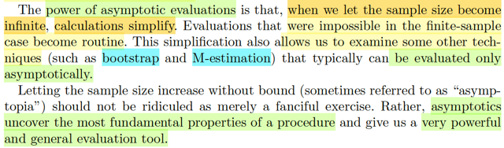
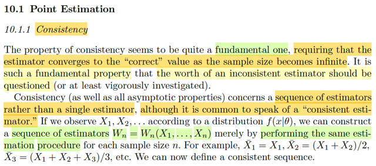
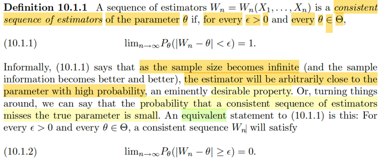

# Chap 10 Asymtotic Evaluation

📊 **Progress:** `5` Notes | `5` Screenshots

---

## 10.1 Point Estimation

 

<kbd></kbd>

> [!NOTE]
> Đại khái là bữa giờ ta xét các hành vi của các quy trình suy luận trong
> bối cảnh là finite-sample, tức là mẫu có số lượng hữu hạn. Chapter
> này sẽ xem xét tính asymptotic -  tính chất mô tả hành vi của quy trình
> khi kích thước mẫu tăng lên infinite.
>
> Ta sẽ đánh giá tính chất này của cả 3 quy trình suy luận chính: point
> estimation, hypothesis testing và interval estimation. Đặc biệt tập
> trung vào các phương pháp liên quan đến maximum likelihood

 

<kbd></kbd>

> [!NOTE]
> Đại ý là, gs nói sơ về giá trị của cái này là nó khiến việc tính toán trở nên
> đơn giản hóa khi ta cho phép số lượng mẫu tăng lên indefinite.
>
> Có những cách đánh giá trở nên bất khả thi khi xét trong bối cảnh
> finite-sample nhưng trở nên khả thi khi xét trong bối cảnh infinte bao gồm
> các technique nổi tiếng như bootstrap và M-estimation.

 

<kbd></kbd>

> [!NOTE]
> Xét vấn đề đánh giá tiệm cận với phương pháp suy luận thuộc loại point 
> estimation. Đầu tiên nói về tính chất nhất quán (consistency)
>
> Thì đại ý là, cái này nó nền tảng đến nỗi nếu một estimator mà inconstent
> thì có thể phải đặt câu hỏi là có đáng để dùng không.
>
> Thế thì đầu tiên, gs nói trong bối cảnh đánh giá tiệm cận, thật ta ta nên
> hiểu là ta sẽ  **XÉT MỘT CHUỖI CÁC ESTIMATOR**, **CHỨ KHÔNG PHẢI
> LÀ MỘT CÁI ĐƠN LẺ DÙ CHO KHI NÓI THÌ TA NÓI "CONSISTENT 
> ESTIMATOR**" trông có vẻ như là tính chất của một estimator đơn lẻ.
>
> Tức là hình dung, với sample X1,X2,...Xn thì kiểu như ta dùng cùng một
> quy trình inference để xây dựng một chuỗi các point estimator với kích
> thước mẫu tăng dần. W1(X1), W2(X1,X2),....Wn(X1,...Xn)
>
> ví dụ, lấy Xbar đi (nó là point estimator cho population mean như đã biết)
>
> thì ta có Xbar1(X1) = X1, Xbar2(X1,X2) = (X1+X2)/2, Xbar_n(X1,..Xn)
> = (Σi=1:n Xi) / n
>
> Mình ghi Xbar1(X1) là hoàn toàn hợp lệ, vì gs Casella trong mấy chương
> trước đã nói, Xbar, hay S^2 thật ra chỉ là ghi cho gọn, ghi rõ phải là Xbar(**X**)
> hay S^2(**X**) để thể hiện nó là function của sample **X**

 

<kbd></kbd>

> [!NOTE]
> Ta được học định nghĩa của cái gọi là một chuỗi các estimator có tính nhất 
> quán (consistent) đó là nếu như Wn thỏa: lim n → inf P_θ(|Wn - θ| < ε) = 1.
> Mang ý nghĩa là khi kích thước mẫu tăng lên vô hạn thì xác suất mà estimator
> khác với θ sẽ cực kì nhỏ, hay, xác suất estimator sẽ có giá trị chính xác với θ 
> là cực lớn.
>
> Dừng lại chút xíu, vì sao P_θ(|Wn - θ| < ε) lại là hàm theo θ?
>
> À, đơn giản là vì Wn ở đây là estimator của θ, theo định nghĩa, là một function 
> của sample **X**= (X1,...Xn), cũng còn gọi là một statistic. Và vì vậy, nó là một
> random variable, có distribution sẽ phụ thuộc θ luôn. Nên xác suất của |Wn - θ|
> < ε dĩ nhiên là xác suất của một event liên quan đến rv Wn có distribution
> phụ thuộc θ nên đương nhiên nó phải phụ thuộc θ. Đó mới là lí do có chữ θ 
> ở dưới, chứ ko phải là vì θ xuất hiện trong |Wn - θ|

 

<kbd></kbd>

🔗 **Related:** [5.5 CONVERGENCE CONCEPTS](55_convergence_concepts.md#node-392)

> [!NOTE]
> Nhờ hiểu bản chất chữ θ ở dưới chân chữ P (P_θ(..)) nên ta hiểu đoạn này
> như vầy:
>
> Đại ý là trong định nghĩa 5.5.1, có nói về khái niệm gọi là CONVERGENCE
> IN PROBABILITY: như vầy: Chuỗi các random variable X1,...Xn được gọi là 
> converge in probability to X nếu như lim n → inf P(|Xn - X| < ε) = 1.
>
> Nhưng ở đây, mình hiểu đoạn này nói vầy:
>
> Khi mình nói chuỗi X1,...Xn hội tụ xác suất về X, thì thực ra chúng ta đang
> xét trong một distribution f(x|θ) với θ mang giá trị nào đó.
>
> Còn khi nói chuỗi W1, ...Wn hội tụ xác suất về θ, thì ta đang nói trong bất kì
> một θ nào.
>
> Có nghĩa là, dù giá trị thực sự của θ là bao nhiêu, thì chuỗi các estimator
> W1,..Wn (nhắc lại, là các point estimator được xây dựng từ cùng một "công
> thức", chỉ là với mẫu X có số lượng tăng dần đến infinite) cũng phải hội
> tụ về đó
>
> Thành ra trong bối cảnh của chương 10 này, kiểu như với mỗi θ ta sẽ có
> một thành viên cụ thể trong một họ các distribution index bởi θ. Và trong
> họ nào, thì cũng xảy ra hiện tượng W1,...Wn converge về θ hết.

 

