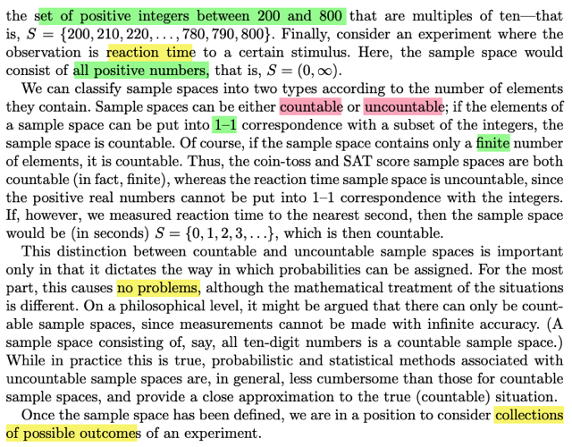
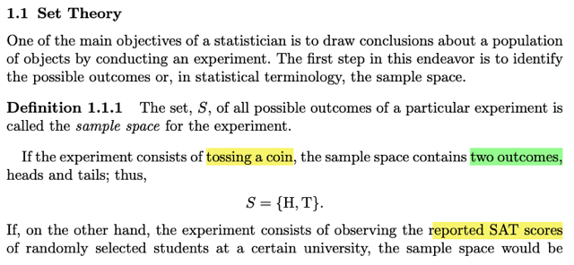
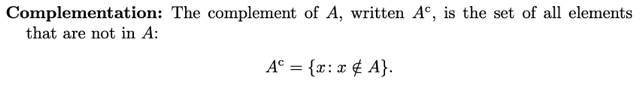
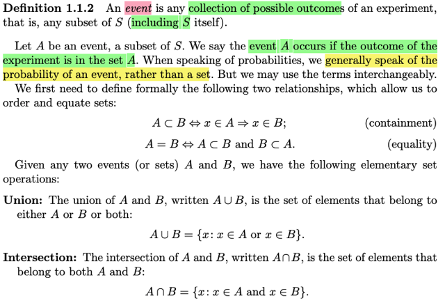
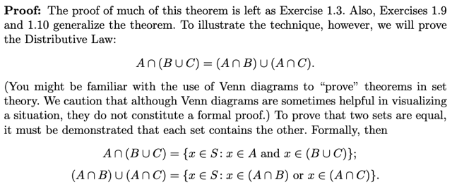
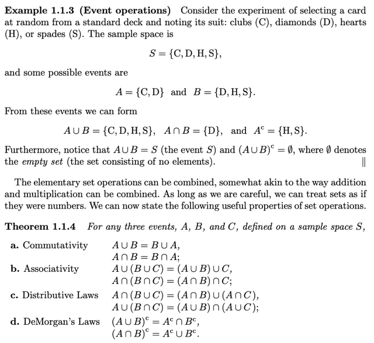
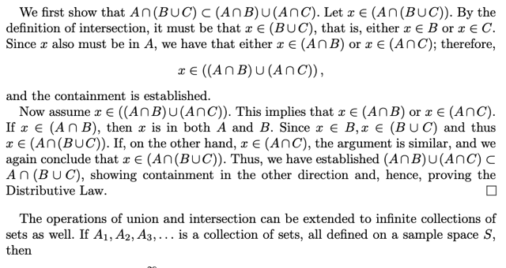
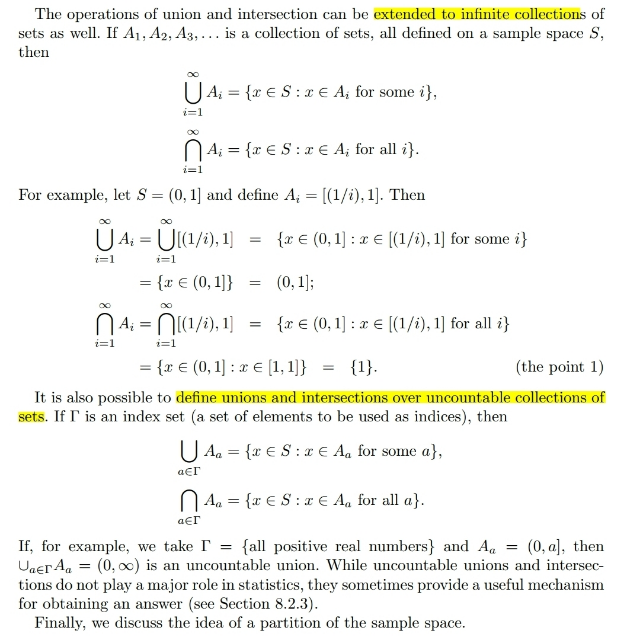
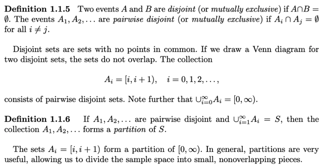

# Chap 1.1 SET THEORY

📊 **Progress:** `6` Notes | `12` Screenshots

---

<kbd></kbd>

<kbd></kbd>

<kbd></kbd>

> [!NOTE]
> Đại khái là review về khái niệm **sample space**: Chứa **mọi possible outcome
> của một experiment**.
>
> Có thể là **{Head, Tail}** khi ném đồng xu. Hoặc tập **mọi số nguyên từ 200
> đến 800 khi random sampling điểm SAT** của sinh viên. Hoặc **mọi giá trị
> thực dương** đối với thử nghiệm là đo thời gian phản ứng của stimulus.
>
> Có thể chia làm **Countable** nếu sample space finite và measurable
>
> Hoặc **Uncountable**

 

<kbd></kbd>

<kbd></kbd>

<kbd></kbd>

> [!NOTE]
> Tiếp theo là định nghĩa về **EVENT**, rất quan trọng. Một cách ngắn gọn,
> EVENT là **SUBSET chứa các POSSIBLE OUTCOMES** trong **SAMPLE**
> **SPACE**.
>
> Và bản thân **SAMPLE SPACE CŨNG LÀ MỘT EVENT,** vì nó cũng là
> subset của chính nó. Vì chữ subset đã thể hiện: nếu x ∈ A, và A là tập con
> của B thì x cũng thuộc B. Vậy thì với S, possible outcome s nào nằm trong S
> thì cũng .. nằm trong S. Nên S "này" là subset của S "kia". Tức là S là subset
> của chính nó.
>
> Thế thì từ đó, ta nói **EVENT A "XUẤT HIỆN"**thì thực chất ám chỉ **MỘT
> OUTCOME NÀO ĐÓ MÀ CHỨA TRONG A XUẤT HIỆN**.
>
> Với định nghĩa như vậy, có thể thấy **event S lúc nào cũng xuất hiện**, bởi
> **possible outcome nào cũng nằm trong S**. Và **event Rỗng chẳng bao giờ
> xuất hiện**, vì chẳng có possible outcome nào chứa trong tập Rỗng  (nếu có
> thì nó đã chẳng Rỗng).
>
> Thế thì từ đó người ta định nghĩa ra khái niệm **A là tập con của B**:
>
> **Nếu x thuộc A thì x cũng thuộc B** (đây chính là khái niệm subset).
>
> Và nếu **A là tập con của B**, và **B cũng là tập con của A**: Tức là x thuộc
> A thì suy ra x thuộc B và ngược lại. Thì đó chính là **A = B**.
>
> Và từ hai khái niệm "A sub B" và "A = B" này ta sẽ có 3 operation nền tảng
> của Set theory: **Union**, **Intersection**, **Complement**

 

<kbd></kbd>

<kbd></kbd>

<kbd></kbd>

> [!NOTE]
> Một ví dụ về Sample Space chứa 4 possible outcomes là các outcome khi
> experiment là **rút lá bài từ bộ bài** và xem **chất của nó là gì (cơ rô chuồn
> bích)**Gọi event A chứa 2 possible outcomes (chuồn C, rô D) và B chứa 3 possible
> outcomes B = (rô D, cơ H, bích S)
>
> Thì theo định nghĩa (A,B) sẽ là một subset chứa các outcome nằm trong cả A và
> B, dễ thấy là có một cái: rô D.
>
> (A U B) là subset chứa cả những cái trong A hoặc trong B: Hai thằng này gộp lại
> thì chứa đủ mặt cả 4 p.outcomes. Nên (A U B) = S = "cơ rô chuồn bích"
>
> Cuối cùng (A U B)^c tức là subset chứa**những cái mà (A U B) không có.**Mà
> (A U B) = S nên (A U B)^c = tập rỗng ∅
>
> ====
>
> Sau đó là theorem cho biết các luật làm việc với set như distributive,
> commutative, ...
>
> Và sau đó là một chứng minh mình họa, đại ý rằng ta sẽ cần dùng định nghĩa
> của **hai event bằng nhau: A = B** ⇔**A**⊂**B và B**⊂**A** chưa dùng Venn diagram chỉ
> mang tính chất cho dễ hình dung thôi

 

<kbd></kbd>

> [!NOTE]
> Thử chứng minh một số công thức khác:
>
> **A**∪**(B ∩ C) = (A**∪**B) ∩ (A**∪**C)**:
>
> Chứng minh về trái ⊂ vế phải:
>
> Giả sử x ∈ vế trái, tức x ∈ A hoặc x ∈ B ∪ C. Nếu nó thuộc A, thì thì nó
> thuộc A ∪ B và cũng thuộc A ∪ C, nên x ∈ (A ∪ B) ∩ (A ∪ C). Ngược lại
> nếu nó thuộc (B ∩ C), dĩ nhiên nó ∈ B => ∈ (A ∪ B) và ∈ C => ∈ (A ∪ C)
> nên nó sẽ ∈ vế trái
>
> Chứng minh vế phải ⊂ vế trái:
>
> Nếu x ∈ vế phải, suy ra nó ∈ (A ∪ B) và ∈ (A ∪ C), vậy thì nó có thể ∈ A
> hoặc ∈ (B ∩ C)

 

<kbd></kbd>

> [!NOTE]
> Đại khái là ta có thể **mở rộng các set operation** (union và
> intersection) này với**tập có vô số subset**

 

<kbd></kbd>

🔗 **Related:** [CHAP 1.3 CONDITIONAL PROBABILITY & INDEPENDENCE](chap_13_conditional_probability_independence.md#node-45)

> [!NOTE]
> định nghĩa **DISJOINT EVENTS** (là khi **intersection** của chúng bằng ∅) và
> **PARTITION** (là khi chúng **disjoint** và **union của chúng bằng S**)

 

