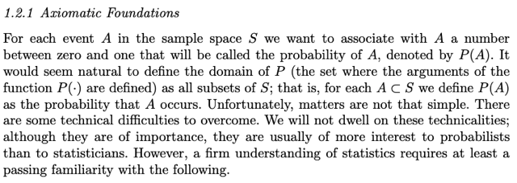
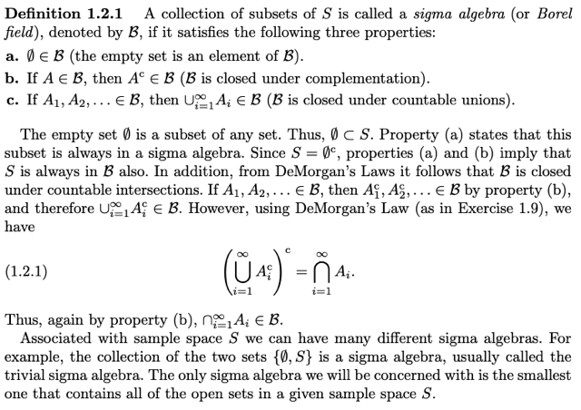
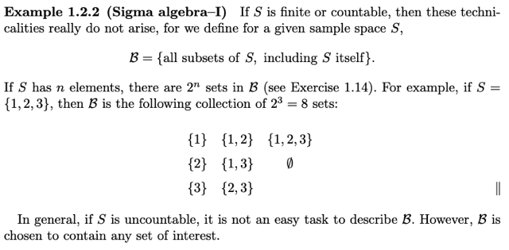
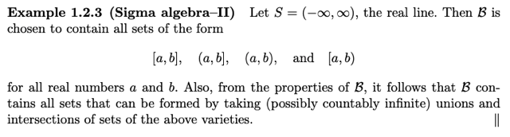
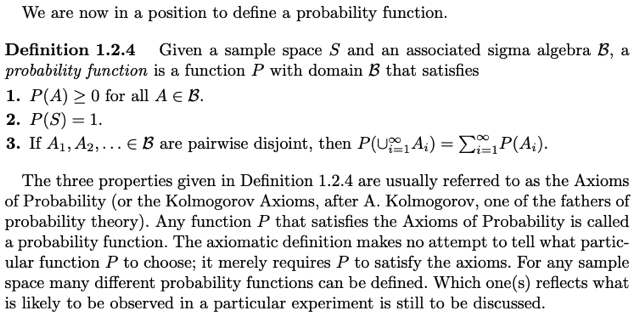
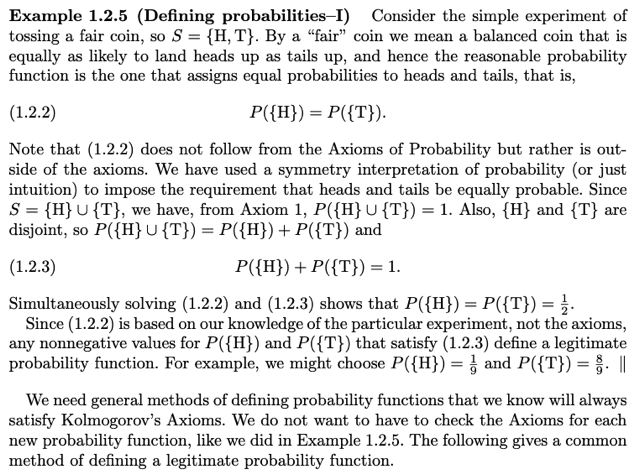
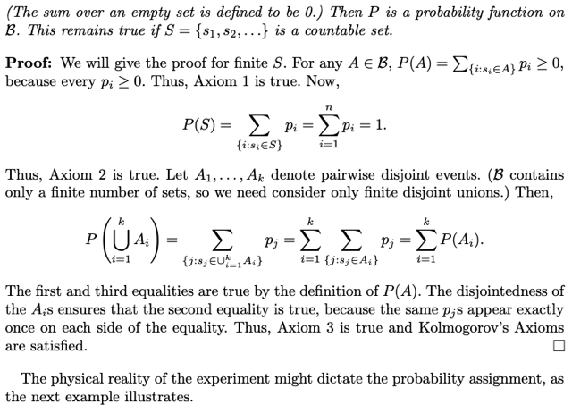
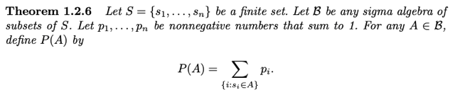
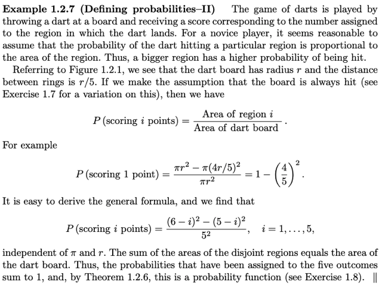
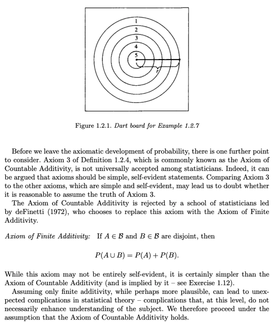

# Chap 1.2.1 Axiomatic Foundation

📊 **Progress:** `11` Notes | `11` Screenshots

---
<a id="node-11"></a>

<p align="center"><kbd></kbd></p>

> [!NOTE]
> Nói ngắn gọn là ta sẽ bàn về việc **định nghĩ**a **domain** `-` **miền xác định
> cho probability function P.** Là cái function mà **nhận vào một event** A, là
> subset của sample space và **spit out một con số từ 0 đến thể hiện xác
> suất.**
>
> Vậy thì cái function này, có **domain là gì**. Thế thì ý chính ở đây gs nói
> rằng ta có lẽ sẽ thấy **tự nhiên** khi cho rằng domain là **tập mọi subset
> của S**. Nhưng ông nói mọi chuyện **ko đơn giản vậy.**

<br>

<a id="node-12"></a>

<p align="center"><kbd></kbd></p>

> [!NOTE]
> Đại khái là ta sẽ được học một định nghĩa gọi là **SIGMA ALGEBRA**. ..Nó
> là một **COLLECTION CÁC SUBSET CỦA S**, thỏa **3 điều kiện** :
>
> a. Chứa tập rỗng 
>
> b. Chứa **subset** và cả **phần bù (complement) của subset đó** và 
>
> c. **Chứa các subset** thì **chứa cả union của chúng**.
>
> Từ ba điều kiện này ta có một số hệ quả: Đầu tiên dễ thấy là vì nó **chứa
> tập rỗng (a) và phải chứa phần bù (b)** nên phần bù của tập rỗng chính là
> S, nên Sigma Algebra **phải chứa S (sample space)**
>
> Tiếp theo, **giả sử ta có các subset A1, A2**... thì theo ý (b) nó **phải chứa
> A1c, A2c**... Và theo ý (c) thì nó **cũng phải chứa A1c**∪**A2c ..**∪**Anc**
>
> Và như vậy thì **lại** **theo (b)** thì nó **phải chứa (A1c**∪**A2c ..**∪**Anc)c** và theo
> **De Morgan theorem** thì cái này chính là **(A1 ∩ A2..∩ An)** và như vậy thì
> hệ quả là **nếu chứa các subset thì phải chứa luôn intersection** (và union
> theo điều c)
>
> Ta sẽ hiểu **Sigma algebra nhỏ nhất**có thể sẽ gồm**{**∅**và S}
>
> Và ta sẽ chỉ quan tâm cái Borel field chứa mọi subset của S**

> [!NOTE]
> ĐỊNH NGHĨA BOREL
> FIELD HAY `Σ` ALGEBRA

<br>

<a id="node-13"></a>

<p align="center"><kbd></kbd></p>

> [!NOTE]
> Đại khái là nói **nếu S countable `/` finite** thì **không có gì rắc rối** xảy ra, nói vậy là vì
> lúc nãy khi nói về **domain** của **probably function P** ta đã nhận định rằng **sẽ tự
> nhiên khi dùng bộ (set) chứa mọi subset của sample space**. Tuy nhiên nếu
> sample space **uncountable** thì **sẽ rắc rối hơn**. Nhưng khi ta có countable
> sample space thì được.
>
> Thế thì **nếu S có n items**. Thì dễ hiểu là sẽ có **2^n subset** (dùng quy tắc đếm,
> step rule để đếm số cách tạo một subset thì ta thực hiện n bước ứng với một
> item  trong sample page, mỗi bước có 2 khả năng: có hay không bỏ vào) Từ đó
> theo step rule sẽ có `2*2...*2=2^n`

<br>

<a id="node-14"></a>

<p align="center"><kbd></kbd></p>

> [!NOTE]
> Với infinte sample
> space thì vậy

<br>

<a id="node-15"></a>

<p align="center"><kbd></kbd></p>

> [!NOTE]
> Đại ý là, khi mà ta**đã định nghĩa được domain của probability function
>
> Tức là  cho một sample space S, và Borel field B gắn với S**.. thì ta **có thể định nghĩa ra probability function**:**miễn là** một function
> nào đó **thỏa 3 điều sau đây** (function sẽ nhận một `event/subset` của S và
> spit out con số thể hiện xác suất):
>
> 1. **P(A) không âm với mọi A**∈**Borel field \/B**\/
>
> 2. **P(**∅**)=0**, **P(S)=1**
>
> 3. nếu **A1,A2...An pairwise disjoint** thì **P(A1**∪**A2 ...**∪**An) `=` ∑i
> P(Ai)**
>
> Nói chung function nào **thỏa ba điều này** thì đều là **valid** để **dùng như
> probability function**
>
> Trong Stat110, 2 ý đầu thường gom thành 1 (Axiom 1), và ý 3 là Axiom 2.
> Còn theo ở đây ta sẽ có 3 Axiom.
>
> Tóm lại việc **đưa ra 3 Axiom** này giúp ta **có cách tiếp cận dựa trên tiên đề
> (axiomatic) đối với xác suất**

<br>

<a id="node-16"></a>

<p align="center"><kbd></kbd></p>

> [!NOTE]
> Đại ý là người ta **xét việc tung đồng xu**. Thì, nếu **fair** coin, thì bằng trực
> giác ta cho rằng **rõ ràng xác xuất ra xấp hay ngửa phải bằng nhau** nên ý
> là ta **sẽ thấy hợp lý** nếu **CHỌN HÀM XÁC XUẤT SAO CHO NÓ RA GIÁ
> TRỊ BẰNG NHAU CHO HAI EVENT H, T**:
>
> P sao cho: **P({H}) `=` P({T})** (1)
>
> **{H} `+` {T} `=` S**, theo axiom 2 P(S) `=` 1  ta có **P({H} `+` {T}) `=` 1** và theo axiom 3
> ta có **P({H} U {S}) =** **P({H}) `+` P({T}) `=` 1** 
>
> ⇨ P({H}) `=` P({T}) `=` `1/2`
>
> Tuy nhiên **(1) lại dựa trên nhận định trực giác** chứ **không từ axiom nào**
> nên**thật ra** miễn là ta dùng một function sao cho xác suất mỗi cái ko âm và 
> tổng bằng 1 thì sẽ **đều
> valid theo axiomatic approach** (ý nói về hàm xác suất)
>
> ```text
> Nên ý nói nếu ta dùng hàm P NÀO ĐÓ MÀ P({H}) = 1/9 VÀ P({T}) = 10/9 THÌ
> ```
> DÙ RÕ RÀNG THEO TRỰC GIÁC LÀ SAI NHƯNG THEO AXIOM THÌ VẪN
> VALID.
>
> Do đó người ta muốn có cách xây hàm P sao cho đảm bảo nó valid với axiom

<br>

<a id="node-17"></a>

<p align="center"><kbd></kbd></p>

<p align="center"><kbd></kbd></p>

<p align="center"><kbd></kbd></p>

> [!NOTE]
> Thế thì từ ví dụ vừa rồi kiểu như mình sẽ **tự hỏi làm sao để có một cách định
> nghĩa ra probability function một cách tổng quát** sao cho **cứ làm theo thì sẽ
> có function valid với các Axiom**.
>
> Thế thì **một cách đó là**:
>
> **Probability function P** sao cho:
>
> **P(A) `=` ∑ {si**∈**A} pi**,
>
> Với **s1, s2...sn**∈**S**, với các con số tương ứng (tự hiểu là **xác suất của các
> possible outcome si**) **ko âm,** có **tổng bằng 1**: **p1, p2. ..pn**.
>
> Nôm na là (**định nghĩa hàm xác xuất** là) tính **xác suất event A** bằng**tổng xác
> suất các possible outcome trong A**.
>
> Và ta có thể**chứng minh cách define function này thỏa các axiom**:
>
> Axiom 1: Vì **pi không âm** nên **P(A) `=` ∑ pi**(với si ∈ A) **cũng ko âm** vì tổng các
> số không âm thì dĩ nhiên không âm
>
> Axiom 2: **P(**∅**)** theo định nghĩa function này thì sẽ là **∑ pi với si**∈****∅, mà **tập
> rỗng thì chả chứa cái s nào** nên đây là **tổng của 0 hạng tử, nên bằng 0**
>
> **P(S) `=` ∑ pi**, si ∈ S , dựa trên điều đặt ra ban đầu trong định nghĩa function là
> `p1+p2+...pn=1` nên dễ thấy **P(S) `=` 1**
>
> Axiom 3: Giả sử có **A1, A2, ...An disjoint**:
>
> **P(**∪**i=1:n Ai)** thì theo định nghĩa probability function trên nó sẽ bằng:
>
> **∑ pi,** với **si**∈**(**∪**i=1:n Ai)**, thế thì dĩ nhiên nó sẽ bằng
>
> ∑ {si ∈ A1} pi `+` ∑ {si ∈ A2} pi `+` ...∑ {si ∈ An} pi
>
> ```text
> (Cái này đơn giản giống như p1+p2+p3+p4=(p1+p2)+(p3+p4))
> ```
>
> Và **đây chính là P(A1) `+` P(A2) +...P(An)**

> [!NOTE]
> CHỨNG MINH NẾU**ĐỊNH NGHĨA HÀM XÁC SUẤT** BẰNG CÁCH THỨC SAU: 
>
> P(A) `=` `Σi` `{π` | si ∈ A}
>
> THÌ NÓ SẼ THỎA 3 AXIOM

<br>

<a id="node-18"></a>

<p align="center"><kbd></kbd></p>

> [!NOTE]
> Đại khái là một ví dụ về **cách xây dựng hàm xác suất** đối với việc **ném phi
> tiêu vào bảng** để **cho thấy cách xây dựng này** (đại ý là cho rằng xác suất
> của việc được mấy điểm sẽ tỉ lệ với diện tích của phần bảng tương ứng, để
> rồi với assume là khi ném phi tiêu luôn trung bảng nên không âm, tổng bằng
> 1..thỏa các axiom

<br>

<a id="node-19"></a>

<p align="center"><kbd></kbd></p>

> [!NOTE]
> Đại khái là nói thêm một ý ko quan trọng lắm đó là, một số sách
> `/tác` `giả/statistician` cho rằng ko đồng ý với Axiom 3 ở trên (cho
> rằng nó ko giống một axiom) nên họ thay bằng:
>
> Nếu**A, B là disjoint subset của Borel field**, thì **P(A**∪**B) `=` P(A) `+`
> P(B)**
> Tuy nhiên trong sách này sẽ vẫn giữ Axiom 3 ở trên

<br>

