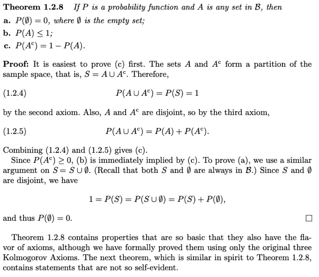
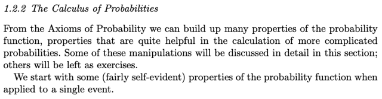
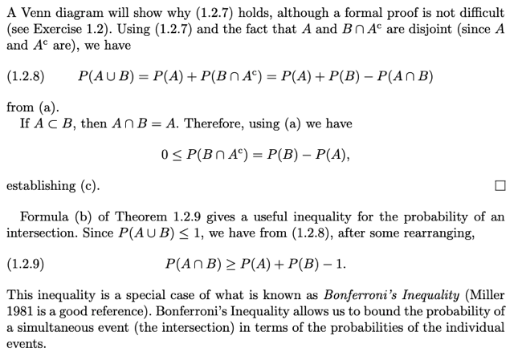
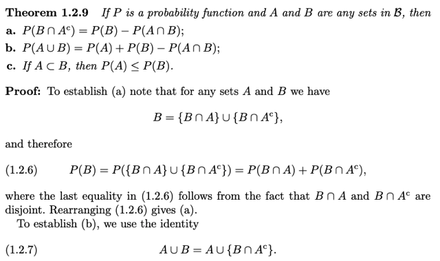
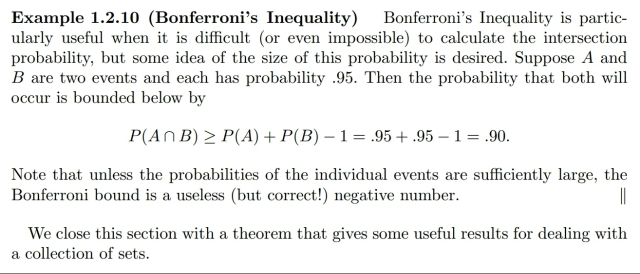
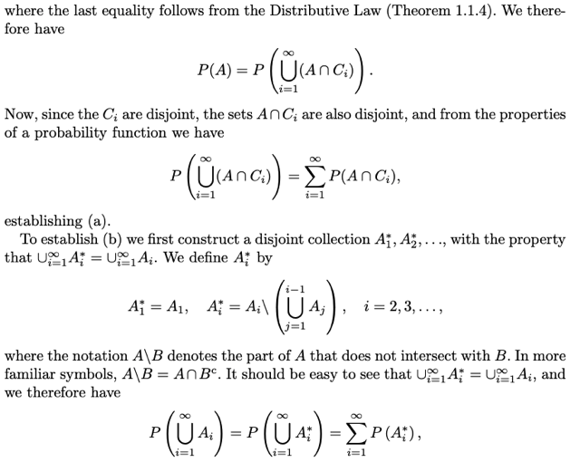
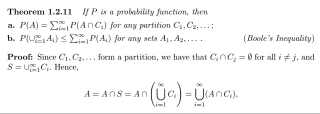
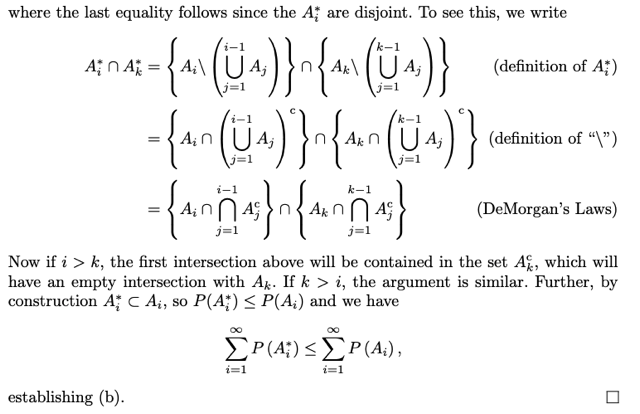
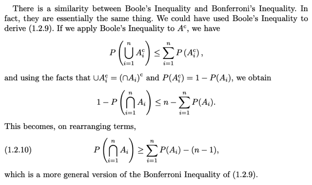

# Chap 1.2.2 Calculus Of Probability

📊 **Progress:** `8` Notes | `12` Screenshots

---

<kbd></kbd>

<kbd></kbd>

<kbd></kbd>

> [!NOTE]
> Đại khái là**từ các tiên đề** ta sẽ **có thể chứng min**h một số t**ính chất**
> để dùng khi cần thiết. Và trông các tính chất trong theorem sau **cũng trông
> giống tiên đề**:
>
> 1. **P(**∅**)=0**
>
> 2. **P(A) ≤ 1**
>
> 3. **P(Ac) = 1 - P(A)**
>
> Chứng minh dễ thôi, (2)(3): vì A, Ac  , nên theo**Axiom 3**, **P(A**∪**Ac) =
> P(A) + P(Ac)** và **A**∪**Ac = S**
>
> (Cái này cũng dễ chứng minh theo lối A = B ⇔ A ⊂ B và B ⊂ A) nên P(A) +
> P(Ac) = P(S) = 1 theo axiom 2 => **P(Ac) = 1 - P(A)**
>
> Và vì theo axiom **2** **hai cái ko âm nên P(A) = 1 - P(Ac)** là 1 trừ cho số
> không âm nên nó sẽ phải nhỏ hơn hoặc bằng 1.
>
> Còn (1): Coi A và Ac cụ thể là S và ∅, thì **P(**∅**) = 1 - P(S) = 1 - 1 = 0**

> [!NOTE]
> VÀI CÔNG THỨC HỆ
> QUẢ NỮA TỪ 3 TIÊN ĐỀ

 

<kbd></kbd>

<kbd></kbd>

<kbd></kbd>

> [!NOTE]
> Tiếp theo đại ý là thêm **3 properties** nữa cũng ko khó chứng minh:
>
> 1.**P(B ∩ Ac) = P(B) - P(B ∩ A)**: đại khái là chuyển vế qua, ta cần chứng
> minh **P(B) = P(B**∪**A) + P(B**∪**Ac)**. Ta sẽ thấy ngay:
>
> **B = (B ∩ A)**∪**(B ∩ Ac)**
>
> (chứng minh: **s**∈**B thì s**∈**(B ∩ A)**, và **s**∈**(B ∩ Ac)** => **s**∈**(B ∩ A)**∪**(B ∩ Ac)**. Do đó **B**⊂**vế trái**. Ngược lại, s ∈ vế trái => s
> thuộc (B ∩ A) hoặc s ∈ (B ∩ Ac). **Cả hai trường hợp** **đều dẫn đến kết
> luận s**∈**B**. Từ đó suy ra **vế trái**⊂**B**)
>
> mà đây là **union của hai disjoint event**, nên **theo axiom 3** ta sẽ có kết
> quả trên.
>
> 2. **P(A**∪**B) = P(A) + P(B) - P(A ∩ B)**: ta sẽ dựa trên **A**∪**B = A**∪**(B ∩ Ac)**
>
> (chứng minh cái này luôn: s ∈ vế trái, thì s ∈ A hoặc s ∈ B. Nếu nó thuộc A thì
> dĩ nhiên nó thuộc vế phải vì vế phải là A ∩ (gì đó), còn nếu nó thuộc B thì
> suy ra nó thuộc B ∩ Ac, nên nó cũng thuộc A ∪ (B ∩ Ac). Vậy suy ra vế trái ⊂
> vế phải. Ngược lại, nếu s ∈ vế phải, thì nó thuộc A hoặc thuộc B ∩ Ac. Nếu
> nó thuộc A thì dĩ nhiên nó thuộc vế trái A ∪ B rồi. Nếu nó thuộc B ∩ Ac thì dĩ
> nhiên nó thuộc B, nên cũng sẽ thuộc vế trái. Vậy vế phải ⊂ vế trái. Chứng
> minh xong) 
>
> nên **P(A**∪**B) = P(A**∪**(B ∩ Ac))**, và đây là **union của disjoint event**
> **A và (B ∩ Ac)...** 
>
> (chứng minh: nếu s thuộc A thì ko thuộc Ac, nên không thuộc B
> ∩ Ac, ngược lại nếu s thuộc B ∩ Ac thì nó thuộc Ac nên không thể thuộc A),
>
> ...do đó theo axiom 3, = **P(A) + P(B ∩ Ac)**. Mà P(B ∩ Ac) thì đã bằng P(B) -
> P(B ∩ A) ở trên rồi. Chứng minh xong.
>
> 3. Nếu **A**⊂**B thì P(A) ≤ P(B)**:
>
> Thế thì dựa vào (a) **P(B ∩ Ac) = P(B) - P(B ∩ A)** thì theo **axiom 1**, vế trái sẽ
> **không âm** nên **vế phải cũng vậy**. Mà với **A**⊂**B thì A ∩ B = A** (chứng minh: ... )
> nên từ hai điều trên ta có P(B) - P(A) >= 0. Chứng minh xong.
>
> Cuối cùng là một cái gọi là **Boferroli inequality**:
>
> Từ **P(A**∪**B) = P(A) + P(B) - P(A ∩ B)**. Theo axiom P(A) ≤ 1 ở note trước, ta
> có vế phải**nhỏ hơn 1** nên vế trái cũng ≤ 1 nên ta có:
>
> P(A) + P(B) - P(A ∩ B) ≤ 1
>
> ⇔ **P(A) + P(B) - 1 ≤  P(A ∩ B)**
>
> Hay **P(A ∩ B) ≥ P(A) + P(B) - 1**
>
> Điều này kiểu như**cho ta một công cụ để có lower bound của xác suất của 
> intersection A, B**tính bởi xác suất riêng lẻ của A, B

> [!NOTE]
> THÊM VÀI CÔNG THỨC HỆ
> QUẢ NỮA TỪ 3 TIÊN ĐỀ

 

<kbd></kbd>

> [!NOTE]
> Nói tiếp về **Bonferroni** **inequality** như đã nói, nó giúp ta có thể có được
> l**ower bound của xác suất joint event,** ví dụ**P(A) = 0.95, P(B) = 0.95** thì ta có
> thể biết **P(A ∩ B) ≥ 0.95 + 0.95 - 1 = 0.9**. Và dễ thấy rằng **nếu P(A), P(B) nho
> nhỏ quá thì lower bound sẽ ra âm**, khi đó **tuy vẫn đúng nhưng vô dụng**

 

<kbd></kbd>

<kbd></kbd>

<kbd></kbd>

> [!NOTE]
> Cuối cùng là thêm **hai theorem quan trọng**. Đầu tiên chính là cái trong Stat110
> đã học **LOTP (Law of Total Probability)**: Cho **event A** và **một partition C1,
> C2... Cn** (theo định nghĩa partition, thì các event Ci, Cj với i ≠ j sẽ **disjoint** và
> **union của chúng bằng S)**.Ta sẽ có:
>
> **P(A) = ∑i P(A ∩ Ci)** Trong các note trước đây mình **hay lập luận rằng**, "
> **theo set theory**thì **A = union của các intersection giữa A và các disjoint Bi**
> trong đó **Union của Bi bằng S**. Thì ở đây ta hiểu rõ hơn lập đằng sau cái này:
>
> Đó là vì: **Ui Ci = S** (vì C1, C2..Cn là **partition**), nên:
>
> A**∩ (**⋃**i Ci) = A ∩ S**
>
> Vế trái: theo **luật phân phối** sẽ bằng ⋃**i (A ∩ Ci)**
>
> Vế phải thì vì **A**⊂**S** nên **A ∩ S = A**
>
> Vậy ⋃**i (A ∩ Ci) = A**
>
> => **P(A) = P(**⋃**i (A ∩ Ci))**
>
> Và vế phải là **union của các disjoint event** (vì Ci là các disjoint event nên dễ
> dàng chứng minh A ∩ Ci cũng là các disjoint event) nên **theo Axiom 3**, nó =
> **∑i P(A ∩ Ci).**
>
> Chứng minh xong: **P(A) = Σi P(A ∩ Ci)**
>
> ====
>
> Còn theorem thứ hai là:
>
> **P(**⋃**i Ai) ≤ ∑i P(Ai).**
>
> Để chứng minh cái này ta sẽ **dựa trên** việc **thiết lập các disjoint A*i**:
>
> **A*1 = A1**,
>
> **A*2 = A2 \\ A1 = A2 ∩ A1c**
>
> **A*3 = A3 \\ (A1 ∩ A2) = A3 ∩ (A1 ∩ A2)c**,...,
>
> **A*i = Ai \\ Ai-1 = Ai ∩ (Ai-1)c**
>
> Khi đó **(**⋃**i Ai)** = **(**⋃**i A*i)**
>
> Vậy P(⋃i Ai) = P(⋃i A*i), và **theo axiom 3, vế phải = ∑i P(A*i)**.
>
> Tiếp theo, ta đã nói **A*i**⊂**Ai**, mà ở note trước ta đã học theorem rằng **nếu A**⊂**B
> thì P(A) ≤ P(B)**. Vậy **P(A*i) ≤ P(A)** 
>
> Do đó:
>
> **∑i P(A*i) <= ∑i P(Ai).**
>
> Như vậy **P(**⋃**i Ai) <= ∑i P(Ai)**

> [!NOTE]
> HAI THEOREM
> QUAN TRỌNG

 

<kbd></kbd>

 

<kbd></kbd>

> [!NOTE]
> Khúc cuối nói về sự tương đồng
> giữa Bool's inequality và
> Bonferroni inequality. Có thể xem sau

 

