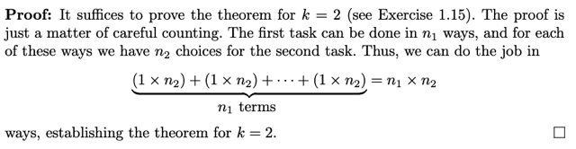
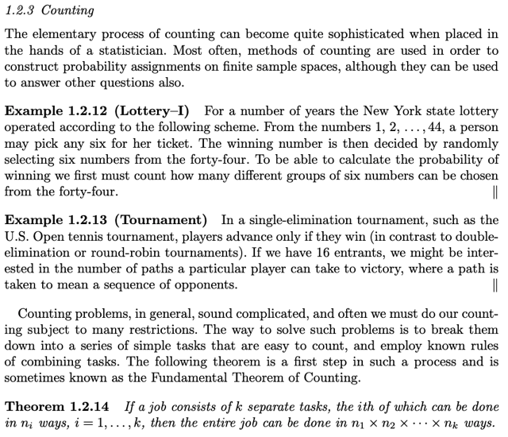
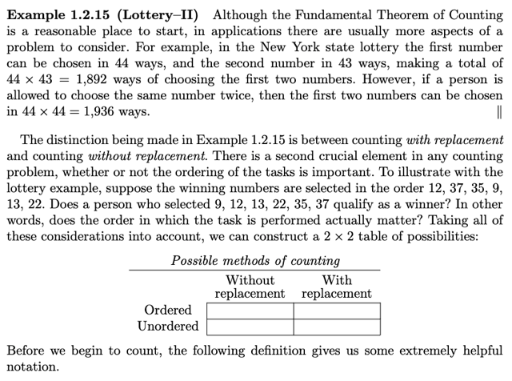
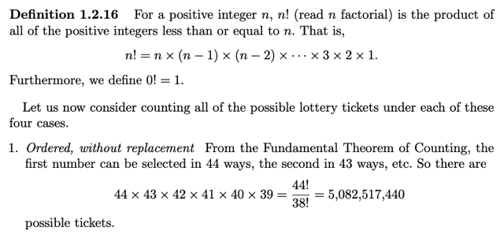
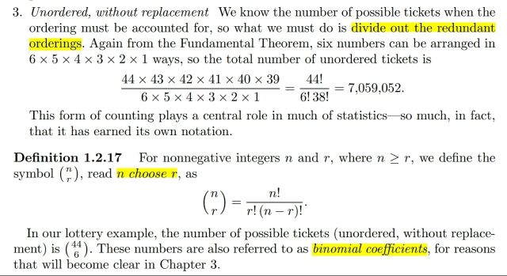
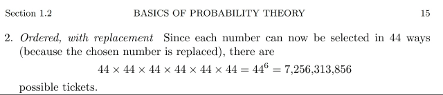
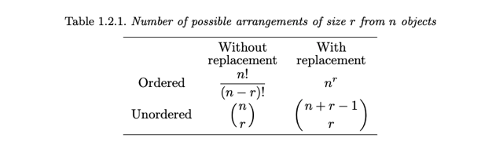
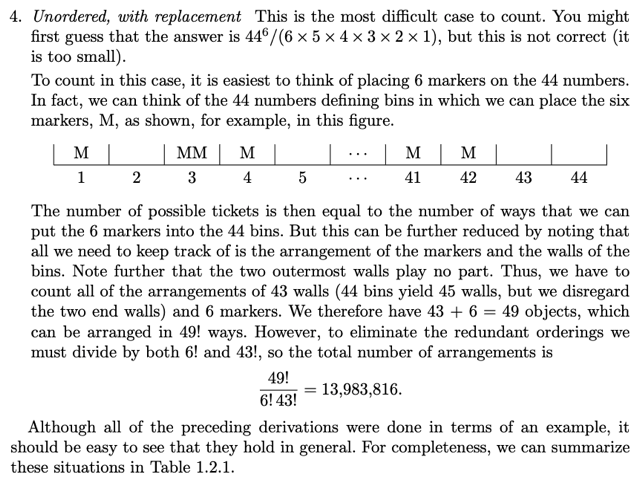

# Chap 1.2.3 Counting

📊 **Progress:** `6` Notes | `10` Screenshots

---

<kbd></kbd>

<kbd></kbd>

<kbd></kbd>

> [!NOTE]
> đại khái là nói về **lí do ta phải quan tâm cái này (phương pháp đếm)** là vì
> **lấy ví dụ vé số có 6 số**, **mỗi số có thể mang giá trị từ 1 đến 44**. Thì ta**cần biết có bao nhiêu bộ 6 số có thể có**, từ đó mới tính đến**xác suất của
> một bộ nào đó xảy ra là bao nhiêu**.
>
> Thế thì**luật đếm nói chung là phức tạ**p, nên ta sẽ **dựa vào một số quy tắc**
> để giúp thực hiện dễ dàng hơn
>
> Và **Theorem 1.2.14** chính là **Step Rule** khi như đã biết, **nếu việc đếm
> thứ gì đó có thể chia thành nhiều bước**, **mỗi bước có số lựa chọn không bị
> ảnh hưởng bởi lựa chọn cụ thể của bước trước đó**. Thì ta **nhân** lại.

 

<kbd></kbd>

> [!NOTE]
> Bài toán là, có **n = 44 con số từ 1 đến 44**. Và ta muốn **chọn r = 6 số** trong
> đó. Câu hỏi là **có mấy khả năng** xảy ra.
>
> Có điều, phải cân nhắc **Ordered** vs **Unordered** và **With Replacement /
> Without Replacement**
>
> **Bởi vì**đại khái là**tùy thuộc xem cái luật xổ số ra sao**, ví dụ**các số trên
> tấm vé số có phải khác nhau không** ý là các bộ số trên các tấm vé
> được tạo bằng cách sampling có hay hoàn lại hay không.**Nếu có** hoàn
> lại, thì kiểu như ta **có thể có bộ số 1 3 3 8 8** (Tức là mỗi số có thể được
> lặp lại). Còn**nếu không** hoàn lại thì khi sampling ra các bộ số thì **các số
> trong chuỗi luôn khác nhau**)
>
> Thêm nữa, ta có thể hỏi rằng **luật xổ số** **có quan tâm thứ tự các số không**
> ví dụ, (giả sử có không quan tâm) thì **1 3 3 8 8** cũng giống **3 1 8 3 8**
>
> Nói chung tóm lại là, **khi mình muốn đếm** số bộ / số cách tạo một bộ 6
> số từ 44 con số thì **việc có hay không hoàn** lại khi sampling, và **có tính
> đến thứ tự hay không** sẽ **ảnh hưởng đến kết quả.**

 

<kbd></kbd>

> [!NOTE]
> Xét 2 trường hợp ta **không hoàn lại** trước, và đầu tiên là **có quan tâm
> thứ tự**:
>
> Để đếm ta sẽ **làm theo từng bước**:
>
> Bước 1 **chọn giá trị cho số đầu tiên**: Có **n** (44) cách
>
> Bước 2 **chọn giá trị cho số thứ hai**: Có **n-1** (43) cách chọn.
>
> ..
>
> Bước k (= 6) **chọn giá trị cho số thứ k**: Có **n-k+1** cách chọn.
>
> Trong quá trình trên, **số cách chọn ở bước sau** **không phụ thuộc kết
> quả** ở b**ước trước**, nên theo step-rule ta sẽ có n***(n-1)*.. (n-k+1)**
>
> Và cái này là **n!/(n-k)!** **Tại sao ta đã có care thứ tự?** Đó là vì trong cách
> này, rõ ràng ở bước 1 nó có  thể mang giá trị 1, và 2
>
> Rồi ở bước 2, trong (n-1) cách chọn cũng có thể có số 1,2. Nên trong tổng số
> n!/(n-k)! đã có cả chuỗi 12xxxx cũng như 21xxxx
>
> TỨC LÀ CÓ TÍNH VÀO, CHÍNH LÀ COI THỨ TỰ CỦA CHÚNG LÀ KHÁC 
> NHAU

 

<kbd></kbd>

> [!NOTE]
> Thế thì xét trường hợp (vẫn sampling không hoàn lại) nhưng **không quan
> tâm thứ tự**  thì ta sẽ **chia cho số hoán vị của k con số: k!**
>
> Vì sao? Vì trong kết quả **n!/(n-k)!** thì ta **đã phân biệt các chuỗi có cùng
> các mặt số nhưng khác thứ tự**. Vì dụ xét k = 5 cho ngắn thì có **13425**
> và cũng có **32415**, rồi **53241**, **53421**....Thế thì giờ rõ ràng **cùng
> một bộ số (như 1,2,3,4,5) thì ta đã lặp lại k! = 5! lần**.
>
> Nên bây giờ khi ta **không quan tâm thứ tự** nữa thì kết quả sẽ là ta chia
> bớt đi k!:
>
> n!/(n-k)!k!
>
> Và đây chính là **(n choose k)**

 

<kbd></kbd>

> [!NOTE]
> Giờ xét qua việc **sampling có hoàn lại**. Đầu tiên là **có quan tâm thứ tự**.
>
> Cách lập tương tự case 1 nhưng vì **có hoàn lại** nên **số cách chọn giá trị
> ở mỗi bước đều là n**. Dẫn đến kết quả là **n^k**
>
> Một lần nữa, rõ ràng**trong mỗi**bước ta **đã cho phép nó có hết n khả
> năng**, nên **kiểu như sẽ có chuỗi 12xxxx** và cũng có tính chuỗi 21xxxx Thì
> ý là ta **đã có tính đến / quan tâm đến thứ tự**

 

<kbd></kbd>

<kbd></kbd>

<kbd></kbd>

> [!NOTE]
> Trong case cuối, **có hoàn lại** và **không quan tâm thứ tự**. Thì, ta sẽ kiểu như có các
> sample như sau:
>
> (lấy ví dụ k=5, n=10 (các con số để chọn từ 0 đến 9)
>
> **14531** (a) (**có hoàn lại** nên **có thể xuất hiện số 1 nhiều lần**)
>
> Và kết quả trên sẽ **COI NHƯ GIỐNG với 11453** (vì ko care thứ tự nên **chỉ tính là một**)
>
> Và nó **sẽ chỉ phân biệt với một bộ số khác** (nói **bộ số** là **ám chỉ ta không quan tâm
> thứ tự**) ví dụ như:
>
> **11145** (b), hay **12237** (c)
>
> Vậy để hiểu minh họa trong sách ra sẽ xem **(a), (b), (c)** có thể được thể hiện như thế
> nào:
>
> (a) 14351 (và cũng là 11453, hay 45113....): **Nói bằng lời** chính là "**có 0 số 0**, **2 số
> 1**, **0 số 2**, **1 số 3, 1 số 4, 1 số 5, 0 số 6, 0 số 7, 0 số 8, 0 số 9**"
>
> (b) **11145** (again, nó cũng "the same" với **41511**, hay **14511**,...):  Chính là "**có 0
> số 0, 3 số 1, 0 số 2, 0 số 3, 1 số 4, 1 số 5, 0 số 6, 0 số 7, 0 số 8, 0 số 9**"
>
> (c) **12237**: Nói bằng lời chính là "**có 0 số 0, 1 số 1, 2 số 2, 1 số 3, 0 số 4, 0 số 5,  0 số
> 6, 1 số 7, 0 số 8, 0 số 9**"
>
> Thế thì, từ đó ta sẽ **dễ thấy hơn rằng** **có thể đếm** bằng cách **bố trí n (=10) hộp đánh
> số từ 0 đến 9**.
>
> Và **chuẩn bị k (= 5) trái bóng bàn** (**giống nhau hết**).
>
> Để rồi, ta sẽ **ĐẾM SỐ CÁCH RẢI K QUẢ BANH NÀY VÀO CÁC HỘP**.
>
> Và kiểu như t**ừ đó** **ta có bài toán khác, tương đương**.
>
> Thế thì **để đếm cái này**, ta sẽ nhận xét tiếp rằng:
>
> **MỘT CÁCH "RẢI" CỤ THỂ K QUẢ BANH VÀO N HỘP...**
>
> ..**THẬT RA CHỈ LÀ MỘT CÁCH SẮP XẾP CỤ THỂ CỦA K QUẢ BANH VÀ MẤY CÁI
> VÁCH NGĂN GIỮA CÁC HỘP**.
>
> Lấy ví dụ có **n=3, k=2** cho dễ hình dung: thì khi đó: **"hộp 1 có 1 banh, hộp 2 có 0 banh,
> hộp 3 có 1 banh"** thì cũng giống như cách sắp xếp của các vách và banh như sau:
>
> **v b v v b v**
>
> Lấy ví dụ khác: **"hộp 1 có 0 banh, hộp 2 có 0 banh, hộp 3 có 2 banh"** thì cũng giống như
> cách sắp xếp các vách và banh như sau:
>
> **v v v b b v**
>
> Lấy ví dụ khác: "**hộp 1 có 0 banh, hộp 2 có 2 banh, hộp 3 có 0 banh**":
>
> **v v b b v v**
>
> Thế thì đến đây ta có thể nhận xét rằng **hai cái vách ở ngoài cùng ko cần thiết** (trong
> việc thể hiện một cách chọn). Ví dụ 1 có thể chỉ cần ghi: (**b v v b**) là "biết" "**hộp 1 và
> hộp 3 có 1 banh, hộp giữa trống"** rồi. Tương tự ví dụ 2 chỉ cần thể hiện (**v v b b**) là đủ.
>
> TỪ ĐÓ, **BÀI TOÁN MỘT LẦN NỮA TRỞ THÀNH (TƯƠNG ĐƯƠNG)** VỚI VIỆC **ĐẾM
> SỐ CÁCH SẮP XẾP CỦA K TRÁI BANH VÀ N-1 VÁCH NGĂN**, TRONG ĐÓ **BANH NÀO
> CŨNG NHƯ NHAU** VÀ **VÁCH NGĂN NÀO CŨNG NHƯ NHAU NÊN TA KHÔNG CARE
> THỨ TỰ CỦA CÁC QUẢ BANH VỚI NHAU CŨNG NHƯ VÁCH NGĂN VỚI NHAU**
>
> Thế thì để đếm bài toán này, **đầu tiên ta** sẽ **coi như mọi vách ngăn và banh đều khác
> nhau hết**, giống như ta có **tổng cộng n-1+k món vậy**, và ta có **(n-1+k)! hoán vị**
>
> Tuy nhiên **nếu dùng số này** thì ta **đã phân biệt tính đến thứ tự của các banh** **cũng
> như vách ngăn**. Ví dụ ý là coi (b1 v1 v2 b2) khác với (b2 v1 v2 b1), (b1 v2 v1 b2), (b2 v2
> v1 b1), để tính thành 4 lần trong khi đúng ra chỉ là một (b v v b).
>
> Do đó ta sẽ "**adjust**", bằng cách **chia bớt cho số lần hoán vị của k banh (k!)** (để rồi
> mấy cái trên sẽ chỉ còn (b v1 v2 b) và (b v2 v1 b).
>
> Tương tự ta sẽ **chia cho số hoán vị của (n-1) vách ngăn**: (n-1)! Để rồi chỉ còn (b v v b).
>
> Kết luận lại kết quả sẽ ra là:
>
> **(n-1+k)!/(n-1)!k!**
>
> Và chính là **(n-1+k choose k)**

 

