# Chap 1.3 Conditional Probability & Independence

📊 **Progress:** `18` Notes | `20` Screenshots

---

<kbd>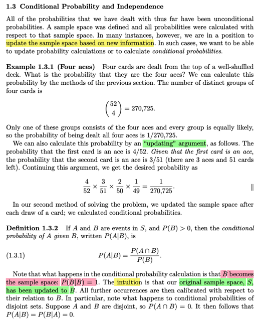</kbd>

🔗 **Related:** [Chap 1.1 SET THEORY](chap_11_set_theory.md#node-9)

> [!NOTE]
> Có gì đó rất đáng suy nghĩ, giúp ta hiểu sâu hơn bản chất của
> **CONDITIONAL PROBABILITY** trong ví dụ tính xác suất rút được 4 lá Ách.
>
> Đại khái là ở đây họ t**ính bằng 2 cách**. Cách thứ nhất là với lập luận rằng,
> nếu (**thử nghiệm là) rút 4 lá bài**, thì trong **sample space có bao nhiêu
> possible outcome**: Dễ thấy đây là bài toán đếm số set có k=4 item **không
> care thứ tự** theo lối **sampling ko hoàn lại**, trong **tổng số n=52 items.**
> Ta sẽ có (n choose k)  = (52 choose 4) bộ 4 lá.
>
> Và với việc **rút ngẫu nhiên, và bộ bài bình thường** thì **xác suất xảy ra
> của mỗi bộ** trong (52 choose 4) bộ này **đều như nhau**. Nói cách khác,
> sample space có (52 choose 4) possible outcomes, mỗi outcome đều
> **equally likely**, có **xác suất xuất hiện là 1/(52 choose 4)**
>
> Giờ để tính **xác suất của event "4 lá Ách"** thì như đã biết event có bản chất
> chỉ là **subset của sample space**, chứa các possible outcome. Và **P(A)** chính
> là **∑ {s**∈**A} P({s})** mang ý nghĩa là, xác suất event A xảy ra là **tổng xác suất
> của các possible outcome NẰM  trong A.**
>
> Vậy ta **xem A**, ở đây là 4 lá ách, **có bao nhiêu possible outcome**, hay nói
> cách khác, **có bao nhiêu bộ 4 lá mà được gọi là 4 lá Ách**. Dĩ nhiên trừ khi bộ
> bài có 5 lá Ách, còn nếu bình thường, thì sẽ **chỉ có 1 bộ 4 lá mà có 4 lá ách**.
> (nếu bộ bài có 5 lá ách, thì sẽ có nhiều bộ 4 lá mà có 4 lá ách)
>
> Vậy event size = 1, tức là chỉ có **1 possible outcome** trong đó. Và cái
> outcome đó là cái bộ 4 lá (trong (52 choose 4) bộ 4 lá) mà lá nào cũng là
> Ách. Và như đã nói, P({s này, tức outcome} này cũng = 1/(52 choose 4)
>
> Vậy P(A) = P({s ∈ A}) = **1 * [ 1 / (52 choose 4)]** = **1/(52 choose 4)**
>
> Ghi như vậy **(1 * [ 1 / (52 choose 4)])** là để làm rõ bản chất của P(A) là **tổng
> xác suất của các possible outcome chứa trong A**. Giả sử ví dụ như xét
> event B là "bộ 3 lá Ách" thì khi đó B chứa tới (4 choose 3) possible outcome
> lận. Dĩ nhiên sample space lúc này sẽ là xét mọi bộ 3 lá trong 52 lá, thì sẽ
> có (52 choose 3) bộ 3 lá, và xác suất xảy ra của mỗi bộ cũng bằng nhau và
> bằng 1/(52 choose 3)
>
> Lúc này P(B) = ∑ {s ∈ B} P({s}) = (4 choose 3) * P({s})
>
> = (4 choose 3) * 1 / (52 choose 3) = **(4 choose 3) / (52 choose 3)**
>
> (mọi possible outcome  đều có xác suất bằng P(s) = 1/(52 choose 3)

> [!NOTE]
> Thế thì nói tiếp qua cách tính thứ 2: Thì ta sẽ xem việc có được **bộ 4 lá Ách sẽ
> là Intersection của 4 event**: 
>
> Lá 1 là Ách, Lá 2 là Ách, Lá 3 là Ách, Lá 4 là Ách
>
> (tức là rút lần lượt 4 lá, kĩ hơn thì nói thêm theo lối sampling without replacement)
>
> Gọi **4 event trên là A1, A2, A3, A4**. Cái ta muốn tính sẽ là **P(A1 ∩ A2 ∩ A3 ∩ A4)**
>
> Theo conditional probability theorem: **P(A ∩ B) = P(A|B)P(B)**
>
> P(A1 ∩ A2 ∩ A3 ∩ A4) = P(A1)P(A2|A1)P(A3|A1,A2)P(A4|A1,A2,A3)
>
> **P(A1)** là xác suất rút được lá Ách từ bộ 52 lá. Sample space sẽ có 52 possible
> outcomes, là 52 lá khác nhau, và xác suất xảy ra lá nào cũng bằng 1/52. Còn
> event space A1 = {s: s là lá Ách} thì có thể thấy **có 4 possible outcome thuộc
> event A1**, tức 4 lá thuộc loại Ách. 
>
> (hay nói cách khác nếu không ghi chung chung possible
> outcome là s, mà đặt tên từng "đứa" thì **A1 = {"Ách chuồn", " Ách bích", "Ách rô"
> "Ách cơ"}**
>
> Do đó **P(A1) = ∑ {s**∈**{"Ách chuồn", "Ách bích", "Ách rô" "Ách cơ"} P({s})**
>
> = và vì cái nào cũng có P({s}) = 1/52 nên ta có **4 * (1/52) = 4/52
>
> Điều này giúp hiểu sâu bản chất của P(A1) = 4/52 là như vậy**Thế thì **P(A2|A1)**. Thì ta dừng lại một chút để nói về **P(A2)**. Giả sử bảo tính
> P(A2) thì sao. Lúc này ta sẽ phải chú ý rằng **đang rút từng lá, không bỏ vào lại.**
> Nên **xác suất của A2**, tức là lá thứ 2 rút được lá Ách sẽ **phụ thuộc kết quả của
> lá thứ 1**. Nên ta sẽ tính theo lập luận sau:
>
> **A2 = (A2, A1) + (A2, A1^c)**, đây là dựa vào Set theory, khi A1 với A1^c tạo nên
> cái gọi là **PARTITION** của S, hiểu nôm na là tụi nó **disjoint** nhau nhưng
> cùng nhau, **union nhau** cover toàn bộ Sample space. Hoặc kĩ hơn thì như vầy:
> A2 ⊂ S ⇨ A2 ∩ S = A2 ⇔ A2 = A2 ∩ (A1 ∪ A1c) ⇔ A2 = **(A2**∩**A1)**∪**(A2**∩**A1c)**
>
> => P(A2) = P[(A2, A1) + (A2, A1^c)]
>
> (A2 ∩ A1) ∪ (A2 ∩ A1^c) là **union** của disjoint event, theo Axiom 2 (Stat110) (ở
> sách Casella là **Axiom 3**)
>
> **P(A2) = P(A2, A1) + P(A2, A1^c)**
>
> **= P(A2|A1)*P(A1) + P(A2|A1^c)*P(A1^c)**
> P(A1) = 4 * 1/52 = 4/52
>
> P(A2|A1): Khi A1 đã xảy ra tức là đã có 1 con Ách được rút.Thì khi rút lá thứ 2
> thì bộ bài chỉ còn 51 lá. Xác suất xuất hiện của mỗi lá vẫn bằng nhau và bằng
> 1/51. Còn event A2 sẽ chứa 3 trong 51 outcome đó.
>
> Nên P(A2|A1) = ∑ {s thuộc "3 con ách còn lại"} P({s}) = 3 * P({s}) = 3 * (1/51) =
> 3/51  P(A1^c) = 1 - P(A1) = 1 - 4/52 = 48/52
>
> P(A2|A1^c): Sample space lúc này sẽ còn 51 lá, nhưng vẫn đủ 4 con ách. 51 lá
> này có xác suất xảy ra như nhau = 1/51. Còn A2 sẽ vẫn có 4 possible outcome.
> => P(A2|A1^c) = 4 * (1/51) = 4/51
>
> Vậy **P(A2) = (4/52) * (3/51) + (48/52) * (4/51)**
>
> Tất nhiên bây giờ ta quay lại, chỉ lấy **P(A2|A1) thôi, = (3/51)**

> [!NOTE]
> Tiếp, tính P(A3|A1, A2). Đến đây thì hoàn tương tự trong lập luận. Có thể ghi
> luôn:
>
> P(A3|A1, A2) sẽ là: Việc rút lá thứ 3 thì sample space còn 50 lá, có xác suất
> xuất hiện bằng nhau, bằng 1/50
>
> A3, là event rút được con ách ở lần rút thứ 3 này thì chỉ còn 2 lá trong 50 lá,
> hay 2 possible outcome trong 50 possible outcome là thuộc event này.
> **P(A3|A1,A2)** = **P({s}: s thuộc 2 lá ách còn lại}** = 2 * (1/50) = **2/50**
>
> Tương tự **P(A4|A1,A2,A3)** = 1 * (1/49) = **1/49**
>
> Kết qủa ta có:
>
> P(A1,A2,A3,A4) = **(4/52)*(3/51)*(2/50)*(1/49)
>
> Và cái này cũng bằng với kết quả của cách 1: 1/(52 choose 4)
>
> ====
>
> Tuy nhiên, nó phản ánh một cái rất hay đó là, khi event A1 đã xảy ra, thì nó
> trở thành sample space, cập nhật lại sample space
>
> Là sao?**Xét P(A|B) = P(A,B) / P(B)

 

<kbd>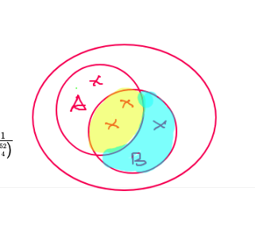</kbd>

<kbd></kbd>

<kbd>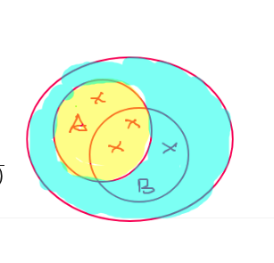</kbd>

> [!NOTE]
> Khi **B chưa xảy ra**, tức **chỉ xét P(A)** thì nó sẽ là **"tỉ lệ" giữa
> phần màu vàng và toàn bộ sample space**
>
> Còn **khi B đã xảy ra**, sample space thu lại chỉ còn những
> possible value trong B. Và P(A|B) lúc này chỉ là **tỉ lệ của
> phần (A ∩ B)** với **sample space lúc này là B**
>
> Nói nôm na là, với **P(A) thì câu hỏi là những possible outcome
> của A có xảy ra hay ko.**
>
> Nhưng khi **B xảy ra rồi**, tức là với P(A|B) ta chỉ quan tâm những
> **possible outcome nằm trong A intersect B có xảy ra hay ko**

 

<kbd>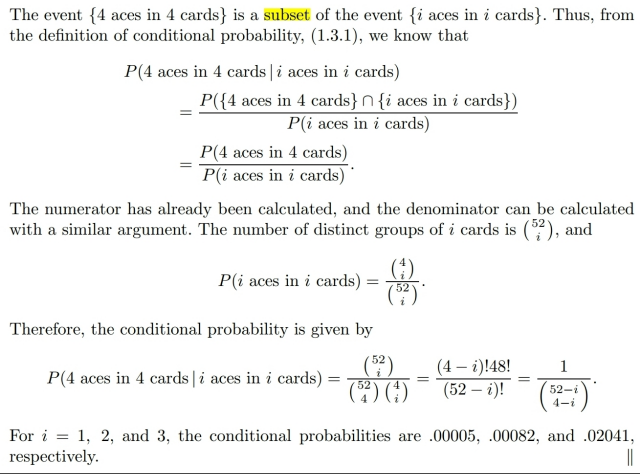</kbd>

<kbd></kbd>

<kbd>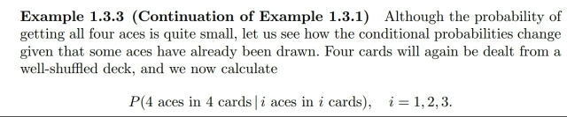</kbd>

> [!NOTE]
> Đại khái là một ví dụ, đúng hơn là tiếp tục ví dụ tính xác suất của việc bốc được 4 lá
> Ách (Xì)
>
> Thì bây giờ thử tính xác suất của việc bốc được 4 lá Ách nếu như đã bốc i lá đều là
> Ách (i có thể bằng 1, 2, 3.)
>
> Thế thì gọi event B = "4 lá, có i lá đầu là Ách". Có nghĩa là đây là ⊂ các possible
> outcomes mà i lá đầu tiên là ách (ví dụ nếu i = 2 thì  B là subset các possible
> outcomes, tức 4 lá mà có 2 lá đầu là Ách)
>
> Nếu gọi B1 là "4 lá có lá đầu là Ách" và B2 là "4 lá có hai lá đầu là Ách" và B3 là "4
> lá có 3 lá đầu là Ách" và B4 là "4 lá có 4 lá đều là Ách"
>
> thì ta sẽ có B4 (= A) ⊂ B3 ⊂ B2 ⊂ B1. Nói vậy để nhấn mạnh rằng phải hiểu rằng B1
> "4 lá có lá đầu là Ách thì nó chỉ quan tâm lá đầu là Ách, còn các lá sau là tùy ý, nên
> lá thứ hai có thể là Ách cũng được, khi đó outcome này cũng thuộc B3 nên B2 ⊂ B1.
>
> Vậy A (= B4) sẽ là tập con của B: A ⊂ B. Vì trong số các kết quả rút 4 lá mà ra lá đầu
> là Ách, thì chắc chắn sẽ có một bộ là 4 lá đều là Ách.
>
> Và ta biết nếu A ⊂ B thì  A ∩ B = B.
>
> Áp dụng định nghĩa của conditional probability ta có:
>
> P(A|B) = P(A ∩ B) / P(B) = P(A) / P(B)
>
> P(A) thì ví dụ trước đã tính. Ta sẽ tính P(B) = P("bốc 4 lá trong đó có i lá đầu là ách"
> ).
>
> Thế thì có bao nhiêu outcome thuộc B (số kết qủa 4 lá mà 2 lá đầu là Ách)?
>
> Để hiểu về B thì thử liệt kê nó ra:
>
> B {
>
> "A1, A2, Q1, 31", "A2, A1, 31, Q1", "A3, A1, 31, K2  ...
>
> }
>
> Hoặc, nó sẽ gồm các subset sau:
>
> {
>
> {A1, A2, *, *}, {A1, A2, *, *}, {A1, A3, *, *}, {A3, A1, *, *}, {A1, A4, *, *}, {A4, A1, *, *},
> {A2, A3, *, *}, {A3, A2, *, *}, {A2, A4, *, *}, {A4, A2, *, *}, {A3, A4, *, *}, {A4, A3, *, *},
>
> }
>
> Như theo cách liệt kê như vậy thì để đếm số possible outcome của sample space  ta
> sẽ quan tâm thứ tự các lá bài (tức phân biệt các bộ cùng lá nhưng xắp sếp khác
> nhau. Nên tổng số p.o của sample space sẽ là: (52 choose 4) * 4! = (52!/4!/48!)*4! =
> **52!/48!**. Cái này chính là chỉnh hợp chập 2 của 52: kí hiệu P(52, 2)
>
> Để đếm số p.o trong B: Ta sẽ đếm theo step rule:
>
> Vì 2 lá đầu là Ách Lá 1 có 4 cách chọn, lá 2 có 4 cách chọn Lá thứ 3 có (52-2) cách
> chọn. Lá thứ 4 có (52-3) cách chọn.
>
> Hoặc có thể chỉ chia làm 2 bước:
>
> Bước 1 chọn cách chọn 2 lá đầu, có quan tâm thứ tự: (4 choose 2) * 2! cũng chính
> là P(4, 2). Khái quát sẽ là P(4, i) = (4 choose i) * i! = (4!/i!(4-i)!)*i! = 4!/(4-i)!
>
> Bước 2 chọn 4-i lá sau, có thể chọn tùy ý từ 52-i lá. Ta sẽ có [(52-i) choose (4-i)] *
> (4-i)!
>
> [(52-i)!/(4-i)!48!]*(4-i)! = (52-i)!/48! = P(52-i, 4-i)
>
> Vậy só p.o trong B là: P(4,2)*P(52, 2) = **4!/(4-i)! * (52-i)!/48!**
>
> Sample space size: (52 choose 4) * 4!, hay P(52, 4) = 52!/48!
>
> Vậy:
>
> ⇨ P(B) = 4!/(4-i)! * (52-i)!/48! / 52!/48!.
>
> = 4!/(4-i)! * (52-i)!/48! / (52!/48!)
>
> = 4!/i!(4-i)! * (52-i)!i! / (52!)
>
> = 4!/i!(4-i)! / (52!)/[(52-i)!i!]
>
> **= (4 choose i) / (52 choose i).  Đây là kết quả trong sách.
>
> Tính như trong sách họ sẽ lập luận khác:
>
> Theo cách họ tính, hay như kết quả (4 choose i) / (52 choose i) thì ta thấy
>
> câu hỏi là tại sao:
>
> Xác suất của {B = "bốc 4 lá, có 2 lá đầu là Xì"} thì cũng = Xác suất {B' = "bốc 2 lá ra
> 2 xì"}
>
> Và ta cần chứng minh / hay hiểu vì sao B = B'**Nếu x là items của set B, tức là nó sẽ là kết quả của việc bốc 4 lá, mà trong đó 2 lá
> đầu ra Xì" thì nó cũng chính là kết quả của việc bốc 2 lá đều ra Xì. Giống như sau
> khi bốc lá 1, lá 2 ra xì, và bốc tiếp thì ta có outcome của experiment "bốc 4" là một
> outcome của B, nhưng nếu chỉ care hai lá đầu / kiểu như bốc 2 lá xong dừng, thì ta
> có result của experiment "bốc 2" lá, tức là outcome của B'.
>
> Nên mọi item của B đều thuộc B', không có case nào mà bốc 4 lá ra hai lá đầu là xì
> mà lại không ứng với "bốc hai (đầu) lá ra xì cả" (chỗ này logic có thể đối với một số
> người thấy rất hiển nhiên) Do đó B ⊂ B' .
>
> Ngược lại, việc bốc hai lá ra xì (ra một outcome thuộc B'), thì tiếp tục bốc hai lá nữa
> ta sẽ chắc chắn có một outcome thuộc B. Vậy B' ⊂ B.
>
> Do đó B = B'
>
> Và từ đó P(B) = P(B') ⇨ xác suất "Bốc 4 lá ra hai lá đầu là Xì" = xác suất "Bốc 2 lá
> ra 2 lá xì"
>
> Vậy thì nếu ta dùng logic này, ta sẽ có thể tính xác suất của B bởi xác suất của B'.
>
> Và xác suất của B': Bốc 2 lá đều ra xì, hay khái quát i lá đều ra xì thì hoàn toán có
> thể tính dễ dàng:
>
> Experiment là bốc i lá ⇨ có care thứ tự thì ta có P(52, i) còn không care thứ tự thì là
> (52 choose i)
>
> Event B i lá xì: có care thứ tự thì là P(4, i) , không care thứ tự thì là (4 choose i).
>
> Xác suất sẽ là (4 choose i) * (1 / 52 choose i) hoặc P(4, i) / P(52, i) đều như nhau.
>
> NHƯNG MẤU CHỐT LÀ Ở CHỖ TA HIỂU RÕ RẰNG VIỆC TÍNH THEO (4 choose i)
> / (52 choose i) là đang tính xác suất của B', là event trong một experiment khác (bốc
> i lá) chứ không phải là event của B (bốc 4 lá ra i lá đầu là Ace). Chẳng qua tính P(B')
> đơn giản hơn, nên ta tính P(B) thông qua nó.

 

<kbd>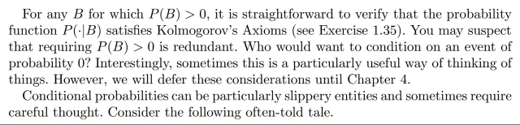</kbd>

> [!NOTE]
> Đại khái là gs nói **P(.|B) vẫn tuân theo các Axiom**. Thử chứng minh (cũng
> là bài tập):
>
> Sẵn ôn lại: Axiom 1 là **P(A) không âm**. Axiom 2: **P(S) = 1**. Axiom 3: **P(∑ Ai)
> = ∑ P(Ai)** các Ai là các **disjoint** events.
>
> Vậy thì nếu nói P(.|B) tuân theo Axiom, thì theo axiom 1:**P(A|B) >= 0**.
> Theo định nghĩa của conditional probability P(A|B)=P(A ∩ B) / P(B) với
> việc **P(A ∩ B) và P(B) đều không âm** (theo Axiom 1) thì **dĩ nhiên P(A|B)
> cũng không âm** ⇨ P(. |B) thỏa axiom 1.
>
> Theo axiom 2: P(S) = 1, thì với conditional probability ta đã biết **khi B xảy
> ra, thì sample space trở thành chính là B**, nên P(S|B)=P(B|B)=P(B ∩
> B)/P(B) = P(B)/P(B) = 1.
>
> Theo axiom 3: P(⋃i Ai) = ∑i P(Ai) với các Ai disjoint: Thì với P(.|B) ta chứng
> minh P(⋃i Ai |B) = ∑ P(Ai |B):
>
> Theo định nghĩa conditional probability, vế trái bằng:
>
> **P(**⋃**i Ai |B) = P[(**⋃**i Ai) ∩ B] / P(B)**
> Xét (⋃i Ai) ∩ B, theo**luật phân phối**, = ⋃**i (Ai ∩ B)**. Nên:
>
> P[(⋃i Ai) ∩ B] / P(B) =**P[**⋃**i (Ai ∩ B)] / P(B)**
>
> Với việc các **Ai disjoint thì (Ai ∩ B) cũng disjoint**. Nên theo Axiom 3, **P[**⋃**i
> (Ai ∩ B)] = ∑i P(Ai ∩ B)**
>
> Vậy P(⋃i Ai |B) = ∑i P(Ai ∩ B) / P(B)
>
> = ∑i [P(Ai ∩ B) / P(B)]
>
> =**∑i P(Ai |B)** (theo định nghĩa conditional probability)
>
> Vậy đã chứng minh xong, P(.|B) cũng tuân theo axiom 3
>
> ====
>
> Thử chứng minh nó cũng tuân theo **complement rule**:
>
> P(A|B) = 1 - P(Ac|B)
>
> P(A|B) theo định nghĩa c**onditional probability = P(A ∩ B) / P(B)**
>
> = P(Ac|B) = P(Ac ∩ B) / P(B)
>
> Thế thì B = B ⊂ S nên **B = B ∩ S**
>
> <=> **B =** **B ∩ (A**∪**Ac)**
>
> <=> **B = (B ∩ A)**∪**(B ∩ Ac)**
>
> => P(B) = P((B ∩ A) ∪ (B ∩ Ac))
>
> = P(B ∩ A) + P(B ∩ Ac) | axiom 3
>
> Chia hai vế cho P(B) ta sẽ có P(A|B) + P(Ac|B) = 1 chứng minh xong

 

<kbd>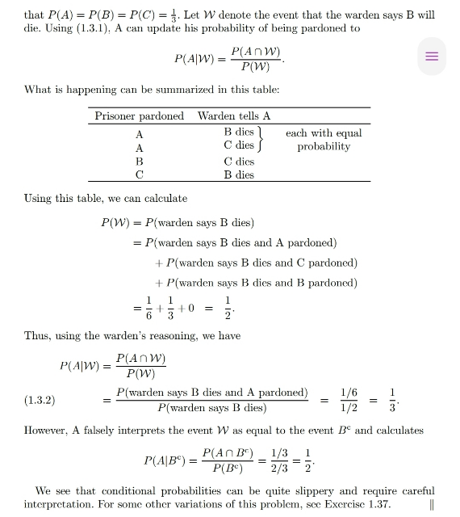</kbd>

<kbd></kbd>

<kbd>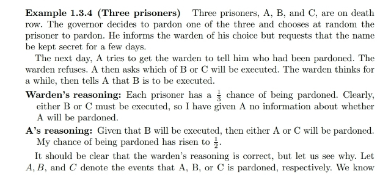</kbd>

> [!NOTE]
> Qua một ví dụ có thể tóm tắt như vầy: Có ba ông tù nhân A,B,C. Người ta chọn một
> ông ngẫu nhiên để tha. Ông A hỏi quản ngục ai được tha thì ổng không nói, nhưng
> hỏi B và C ai sẽ bị xử tử thì quản ngục nói B sẽ bị xử.
>
> Thế thì ông quản ngục nghĩ rằng có 3 người mà chỉ tha 1, nên trong hai thằng B, C
> chắc chắn có một người chết và dù ai chết thì cũng ko ảnh hưởng gì đến việc có
> biết A sẽ chết hay không.
>
> Còn ông A thì nghĩ, nếu B chết, vậy suy ra mình hoặc C sẽ sống nên xác suất mình
> được tha từ 1/3 tăng lên 1/2
>
> Và suy luận của A là sai, và của ông quản ngục là đúng. Ta sẽ làm rõ:
>
> Nói suy luận của quản ngục đúng tức là ta sẽ phải cho thấy dù có cho biết B sẽ
> chết thì xác suất A được tha cũng chỉ là 1/3. Tức gọi W là event "quản ngục nói B
> sẽ chết" và A là event A được tha thì ta cần chứng minh P(A|W)=1/3
>
> Để tính cái này ta áp dụng định nghĩa conditional probability:
>
> P(A|W) = P(A ∩ W) / P(W)
>
> Xét P(W):
>
> W = W ∩ S = W ∩ (A ∪ B ∪ C)
>
> = (W ∩ A) ∪ (W ∩ B) ∪ (W ∩ C) | distributive law
>
> Mà A, B, C disjoint nên theo Axiom 3:
>
> P(W) = P((W ∩ A) ∪ (W ∩ B) ∪ (W ∩ C))
>
> = P(W ∩ A) + P(W ∩ B) + P(W ∩ C)
>
> = P(W|A)P(A) + P(W|B)P(B) + P(W|C)P(C)
>
> (Cái này là áp dụng hệ quả/ theorem từ conditional probability definition mà ở đây
> gs Casella sẽ nói sau ví dụ này: P(A|B) = P(A∩B)/P(B) => P(A∩B) = P(A|B)P(B))
>
> Rồi, vì ba ông được chọn ngẫu nhiên để tha nên xác suất P(A)=P(B)=P(C)=1/3
>
> P(W|A) = 1/2 vì khi A được tha thì cả B, C đều chắc chắn sẽ phải chết, nên nếu A
> hỏi quản ngục trong B,C ông nào phải chết thì lúc đó quản ngục có thể tùy ý chọn
> nói B hoặc C. Do đó xác suất quản ngục nói B chết, tức là P(W|A) sẽ bằng 1/2.
>
> P(W|B) bằng 0, vì nếu B được tha thì khi được hỏi quản ngục chỉ có thể nói C sẽ
> chết, tức xác suất quản ngục nói B chết, hay P(W|B) = 0.
>
> P(W|C) = 1, vì khi C được tha thì B phải chết, nên khi được hỏi quản ngục chắc chắn
> phải nói B chết, hay P(W|C) = 1
>
> Hoặc cũng có thể tính các xác suất của các joint event này bằng cách dùng biểu
> đồ nhánh như trong stat110 gs Blizstein đã làm (xem hình sau), trong đó ta sẽ
> thấy P(A ∩ W) = 1/3 * 1/2 = 1/6, P(B ∩ W) = 1/3
> * 0 = 0, P(C ∩ W) = 1/3 * 1 = 1/3
>
> Vậy lắp vào ta có:
>
> P(W) = (1/3)*(1/2) + (1/3)*1 + (1/3)*0
>
> = 1/3+1/6 = 1/2
>
> Còn P(A ∩ W) thì cũng theo cách tính trên áp dụng hệ quả của conditional
> probability = P(W|A)*P(A) = (1/2)*(1/3) = 1/6
>
> Kết quả là P(A|W) = (1/6)/(1/2) = 1/3 chứng minh xong rằng đúng là việc quản
> ngục cho A biết trong B, C ông nào chết ko làm thay đổi xác suất A được tha

> [!NOTE]
> Điểm mấu chốt thứ 2 là, suy luận của A sai, là vì A nhầm lẫn giữa event
> "quản ngục nói B sẽ chết" với event "quả thực B sẽ chết" tức chính là
> event "B không được tha": B^c.
>
> Chú ý event "ông quản ngục NÓI B chết" nó khác với event "ông B sẽ chết - Bc"
>
> Để rồi cái mà A đang tính ra 1/2 thực ra chính là P(A|B^c) chứ không phải
> P(A|W).
>
> Thật vậy: 
>
> P(A | B^c) = P(A ∩ B^c) / P(B^c)
>
> = P(A ∩ B^c) / [1 - P(B^c)]   |  Dùng complement rule P(B^c) = 1 - P(B) = 1 - 1/3 = 2/3
>
> = (1/3) / (2/3) = 1/2
>
> P(A ∩ B^c) = 1/3
>
> Vì sao? P(A ∩ B^c) = P(B^c|A)P(A) 
>
> P(A) = 1/3.
>
> P(B^c|A) = 1 vì nếu A sống thì B chắc chắn chết
>
> ⇨ P(A ∩ B^c) = 1 * 1/3 = 1/3
>
> Có thể dùng biểu đồ nhánh như hình bên để hiểu

 

<kbd>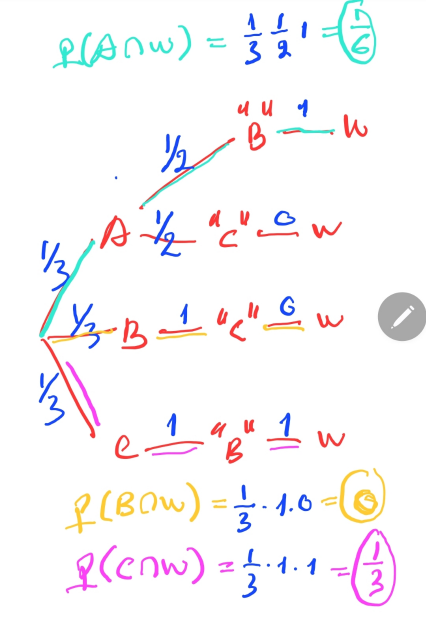</kbd>

> [!NOTE]
> Biểu đồ nhánh giúp thấy rõ P(A ∩ W), P(B ∩ W), P(C ∩ W)
>
> Kí hiệu "B" là event "ông quản ngục nói B chết", cũng là
> event W, nhớ rằng nó khác với event B hay Bc

 

<kbd>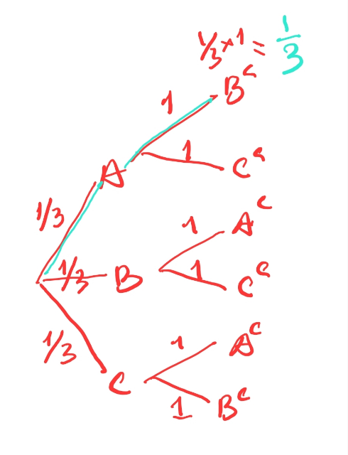</kbd>

> [!NOTE]
> Biểu đồ nhánh cũng giúp
> thấy P(A ∩ Bc) = 1/3

 

<kbd>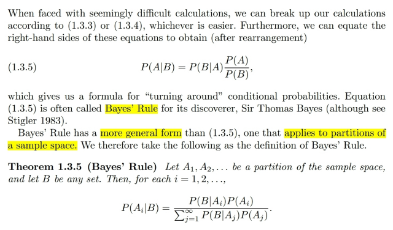</kbd>

<kbd></kbd>

<kbd>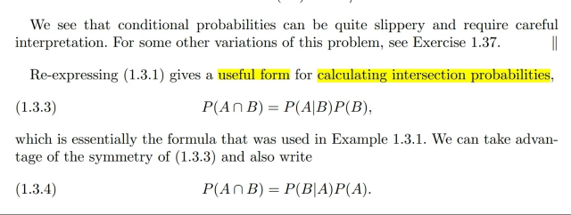</kbd>

> [!NOTE]
> Từ **định nghĩa của conditional probability** **P(A|B)=P(A ∩ B) / P(B)**
> ta dẫn tới **hai theorem** mà stat110 đã học 
>
> **P(A ∩ B)=P(A|B)P(B)**
>
> và **Bayes Rule**:
>
> **P(B|A)P(A) = P(A|B)P(B)**
>
> Để rồi ta sẽ có thể **có phiên bản khác của B.R**: Nếu ta có một
> **Partition A1, A2...Ak** (theo định nghĩa A1,A2..Ak partitions là
> nếu Ai **disjoint** và ⋃**i Ai = S**)
>
> Khi đó dựa vào Bayes's rule:
>
> **P(B ∩ Ai) = P(Ai ∩ B)**
>
> <=> P(B|Ai)P(Ai) = P(Ai|B)P(B)
>
> <=> P(Ai|B) = P(B|Ai)P(Ai)/P(B)
>
> Xét P(B), thì B dĩ nhiên ⊂ S, nên **B = B ∩ S**.
>
> <=> **B = B ∩ (**⋃**i Ai)**
>
> <=> **B =**⋃**i (B ∩ Ai)** | **Distributive** law
>
> <=> **P(B) = P(**⋃**i (B ∩ Ai))**
>
> <=> **P(B) = ∑i P(B ∩ Ai)**   | Axiom 3, **union of disjoint events**
>
> <=> P(B) = ∑i P(B|Ai)P(Ai)
>
> Từ đó phiên bản Bayes's rule với partition là:
>
> **P(Ai|B) = P(B|Ai)P(Ai)/  ∑i P(B|Ai)P(Ai)**

 

<kbd>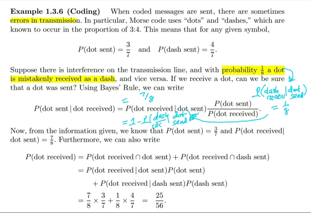</kbd>

> [!NOTE]
> Đại khái là một ví dụ liên quan tới class **information** **theory**. Cho biết khi **gửi tín
> hiệu Morse** thì cứ **7 tín hiệu thì 3 cái là dot, 7 cái là dash**. Tức là 
>
> **P(dot send)=3/7 và P(dash send) = 4/7**
>
> Rồi người ta cho biết **tỉ lệ lỗi** khi gửi một tín hiệu (gửi dot mà nhận dash và
> ngược lại đều là **1/8**), tức **P(dash received | dot send)** = **P(dot received | dash
> send) = 1/8**
>
> Câu hỏi là **xác suất** mà khi ta **nhận dot**, thì**thực sự lúc gửi là dot** là bao nhiêu
> để ta có thể có thể có **một ước lượng về sự đáng tin cậy của thông tin nhận
> được**. Hay nói cách khác, ta muốn tính **P(dot send | dot received)**
>
> Thế thì áp dụng**conditional probability definition**
>
> **P(dot send | dot received) = P(dot send ∩ dot received) / P(dot received)**
> Xét P(dot send ∩ dot received)
>
> = **P(dot received ∩ dot send)**| P(A ∩ B) = P(B ∩ A)
>
> = **P(dot received | dot send) * P(dot send)**
>
> = [1 - P(dash received | dot send)] * P(dot send) | complement rule
>
> (Dùng complement rule áp dụng cho conditional probability mình đã chứng minh:
>
> P(A|B) = 1 - P(Ac|B) ⇨ **P(dot received | dot send) = 1 - P(dash received | dot send)**
>
> = (1 - 1/8) * (3/7) = (7/8) * (3/7) = 3/8
>
> Còn P(dot received):
>
> dot received = dot received ∩ S
>
> = dot received ∩ (dot send ∪ dash send)
>
> = (dot received ∩ dot send) ∪ (dot received ∩ dash send)
>
> => P(dot received) = P[(dot received ∩ dot send) ∪ (dot received ∩ dash send)]
>
> = P(dot received ∩ dot send) + P(dot received ∩ dash send) | Axiom 3
>
> = P(dot received | dot send) * P(dot send) + P(dot received | dash send) * P(dash send)
>
> = (7/8)(3/7) + (1/8)(4/7)
>
> = 3/8 + 4/56
>
> .. Ráp vào là xong

 

<kbd>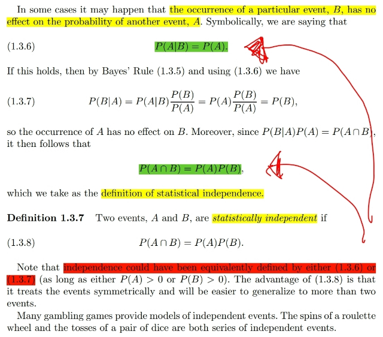</kbd>

> [!NOTE]
> Đại khái là nói về việc **nếu B xuất hiện** **hay không** **không ảnh hưởng tới xác
> suất A** xuất hiện thì **hai event là độc lập** (gọi là **STATISTICAL** **INDEPENDENT**)
>
> Và điều này có thể được t**hể hiện bởi cả hai cách**:
>
> **P(A|B) = P(A)**
>
> hoặc **P(A ∩ B) = P(A)*P(B)**

> [!NOTE]
> HAI EVENT ĐỘC LẬP

 

<kbd>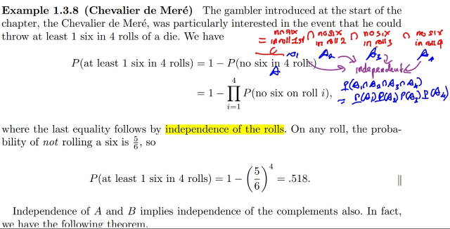</kbd>

> [!NOTE]
> Tiếp một ví dụ cũng đơn giản: tính **xác suất** của event "**có ít nhất một nút 6
> trong 4 lần tung xúc sắc" (đặt là A)**
>
> Để tính cái này, ta sẽ **dễ hơn** nếu **tính complement của nó**Ac = "**tung 4 lần
> không lần nào ra 6 nút**". Từ đó P(A) = 1 - P(Ac)
>
> Nếu rảnh có thể lập luận ý trên như vầy: Khi experiment là tung xúc sắc 4
> lần, và quan tâm số lần ra 6 nút thì sample space sẽ có các possible outcomes 
> sau: 0, 1, 2, 3, 4 (lần ra 6 nút)
>
> Từ đó, event A = có ít nhất một lần ra 6 nút sẽ chứa 4 possible outcomes: 
> {"tung 4 lần có 1 lần ra 6", "tung... 2 lần ra 6", "tung ...3 lần ra 6", "tung...4 lần ra 6"}
>
> Và event Ac chứa một possible outcome:{"tung 4 lần 0 lần ra 6"}
>
> Dĩ nhiên nếu tính P(A), ta có thể theo định nghĩa:
>
> P(A) = ∑i P({si}), si ∈ A
>
> = ∑i=1,2,3,4 P({"tung 4 lần thì có i lần ra 6 nút"}
>
> Có thể thấy tính vậy phức tạp.
>
> Ta sẽ tính P(Ac):
>
> Thì dễ thấy dễ tung 4 lần ko lần nào ra 6 thì chính là: 
>
> Ac = ⋂i=1,2,3,4 ("lần tung thứ i không ra 6") 
>
> = ∩i Ai (Ai là event "lần tung thứ i không ra 6")
>
> => P(Ac) = P(⋂i Ai) và vì **Ai độc lập nhau** do **các lần tung xúc sắc không liên
> quan gì** đến nhau nên **DỰA VÀO** **ĐỊNH NGHĨA CỦA INDEPENDENT EVENTS**:
>
> **P(Ac) = Πi P(Ai)**
>
> Và xét Ai, tức "lần tung thứ i không ra 6" thì **experiment** là tung xúc sắc,
> **sample space có 6 possible outcomes** đều **equally likely**, mỗi p.o có xác suất
> **1/6**. Còn **subset "không ra 6"** sẽ có **5 possible outcomes**. Do đó P(Ai) theo
> NAIVE DEFINITION sẽ bằng:
>
> **P(Ai) = ∑i {si**∈**Ai} P({si})**
>
> = 5 * 1/6 = 5/6
>
> Vậy P(Ac) = Πi (5/6) = (5/6)^4
>
> => **P(A) = 1 - (5/6)^4**

> [!NOTE]
> MỘT VÍ DỤ SỰ DỤNG TÍNH ĐỘC LẬP CỦA EVENTS

 

<kbd>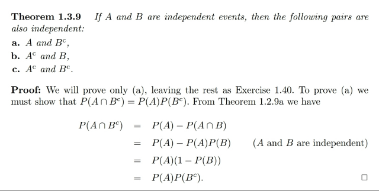</kbd>

> [!NOTE]
> Tiếp theo là một **theorem** **ko khó để hiểu** và chứng minh: nếu **A, B độc lập**
> thì **A với Bc**, **B với Ac**, **Ac với Bc** **cũng độc lập**nhau.
>
> Để chứng minh thì **chỉ cần chứng minh** **joint event probably bằng tích của
> các  probability mỗi event là được**Thử chứng minh P(A ∩ Bc) = P(A) P(Bc)
>
> A ⊂ S ⇨ A ∩ S = A ⇔ A ∩ (B ∪ Bc) = A ⇔ (A ∩ B) ∪ (A ∩ Bc) = A 
>
> ⇨ P[(A ∩ B) ∪ (A ∩ Bc)] = P(A)
>
> ⇔ P(A ∩ B) + P(A ∩ Bc) = P(A) | Axiom 3
>
> P(A ∩ Bc) = P(A) - P(A ∩ B) = P(A) - P(A)P(B) | do A, B độc lập
>
> ⇔ P(A ∩ Bc) = P(A)[1 - P(B)] = P(A)P(Bc) Chứng minh xong

> [!NOTE]
> THEOREM: NẾU A, B ĐỘC LẬP THÌ (A,
> Bc), (Ac, B), (Ac, Bc) CŨNG VẬY

 

## Còn hai ví dụ đại khái là minh họa rằng

> [!NOTE]
> Còn hai ví dụ đại khái là minh họa rằng
> điều kiện \**INDEPENDENT\** phải là
> \**MUTUAL INDEPENDENT\**

 

