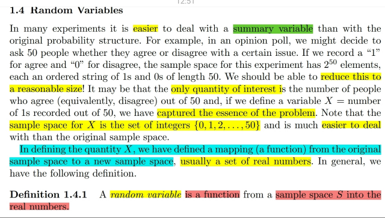
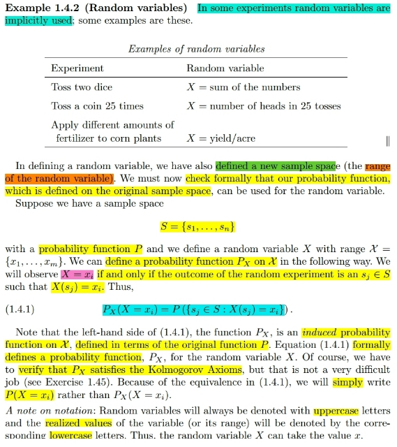
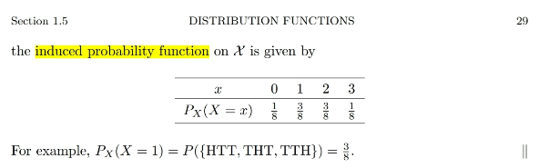
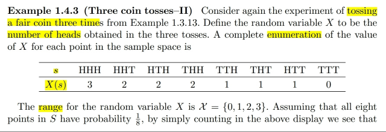
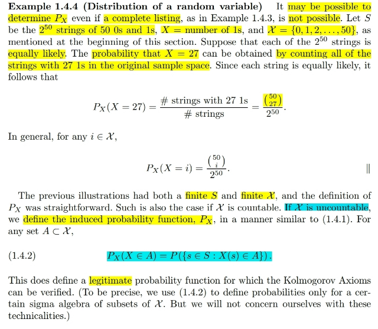

# Chap 1.4 Random Variables

📊 **Progress:** `8` Notes | `6` Screenshots

---
<a id="node-59"></a>

<p align="center"><kbd></kbd></p>

> [!NOTE]
> Đại khái là nói về các**lí do**mà ta thường định nghĩa một **RANDOM**
> **VARIABLE**, có **bản chất** là một **FUNCTION** map giữa một **POSSIBLE**
> **OUTCOME** **TRONG SAMPLE SPACE** **GỐC** VỚI **MỘT SỐ THỰC
> TRONG SAMPLE SPACE MỚI**
> Lí do có thể là vì **trong một experiment** thì ta thường **CHỈ QUAN TÂM MỘT
> ĐẠI LƯỢNG NÀO ĐÓ**, và việc **LÀM VIỆC VỚI SAMPLE SPACE MỚI** THÌ
> CŨNG **DỄ HƠN**(ví dụ nhỏ hơn)

> [!NOTE]
> ĐỊNH NGHĨA RANDOM VARIABLE

<br>

<a id="node-60"></a>

<p align="center"><kbd></kbd></p>

🔗 **Related:** [1.5 DISTRIBUTION FUNCTION](15_distribution_function.md#node-64)

> [!NOTE]
> Đại khái là **với** việc **định nghĩa**ra **random variable X** là một
> **function** map **possible outcome trong sample space gốc** với
> r**eal number** thì **TA CŨNG  CÓ SAMPLE SPACE MỚ**I: **GỌI
> LÀ RANGE CỦA X**, **CHỨA CÁC POSSIBLE VALUES xi CỦA X**
>
> Thế thì như đã biết từ bài trước, giả sử ta có **sample space gốc**
> với các **possible outcomes S `=` {s1, s2...}**và ta đã **định nghĩa
> probability function P** giúp **map một subset của sample space**
> với **một con số** mà tính chất thì P **thỏa các tiên đề (axiom)** như
> đã biết.
>
> Thế thì bây giờ, với **random variable X** và **sample space** mới,
> ta sẽ **ĐỊNH NGHĨA RA MỘT PROBABILITY FUNCTION MỚI P_X**
> như vầy:
>
> **P_X(X=xi) `=` P({si**∈**S: X(si)=xi})**"Dịch ra" là xác suất của event random variable X mang possible
> value xi của nó, sẽ được tính bằng xác suất của subset `/` event các
> possible outcomes trong sample space gốc S MÀ được map với xi
> thông qua (function X)"
>
> Và điểm đáng chú ý là **P_X** là một **probability function** **ĐƯỢC
> ĐỊNH NGHĨA THÔNG QUA FUNCTION P. gọi là INDUCED
> PROBABILITY FUNCTION**
>
> Và **vế phải** chính là **tuân theo định nghĩa của probability function
> P**: nó nhận **một subset của S**, và **trả ra con số thể hiện xác
> suất**.
>
> Thì áp dụng tiếp định nghĩa của P bữa trước ta có thể ghi tiếp:
>
> P({si ∈ S: `X(si)=xi})` `=` **∑i {si**∈**S: X(si) `=` xi} P({si})**
>
> "Dịch ra là, xác suất của event chứa các possible outcomes s mà
> được map với xi thông qua X sẽ được tính bằng tổng xác suất của
> các possible outcomes đó"
>
> Gs đề nghị ta **chứng minh P_X** (và có thể viết tắt là `P(X=xi)` luôn)
> **cũng tuân thủ các Axiom**:
>
> Axiom 1: **P_X(X=xi)** `=` **P({si**∈**S: X(si)=xi})** mà **vế phải theo
> axiom 1** đã **không âm** nên **vế trái cũng vậy**⇨ `P_X` tuân thủ
> axiom 1
>
> Axiom 2: **P_X(R)** (R là **sample space mới**), theo định nghĩa của
> `P_X,` nó bằng `=` **P({si**∈**S: X(si)**∈**R})**
>
> Mà vì định nghĩa của random variable X có bản chất là một function
> map giữa possible outcome trong sample space gốc với trục số thực
> nên:
>
> **X(si)**∈**R** ∀**si** `=>` P({si ∈ S: X(si) ∈ R}) `=` P({si ∈ S})
>
> | Cái này là do ∀ si ∈ S: X(s) ∈ R ⇨ {si ∈ S: X(si) ∈ R} `=` {si: si ∈ S}
>
> `=` P(S) `=` 1 theo axiom 2
>
> Vậy `P_X` tuân theo axiom 2
>
> Axiom 3: Axiom 3 của P còn nhớ sẽ là, với partition Ai: Tức các Ai
> disjoint và union `=` S: P(∪i Ai) `=` `Σi` P(Ai)
>
> ```text
> Vậy với P_X ta phải chứng minh P_X(∪i Bi) = Σi P_X(Bi)
> ```
>
> QUAY LẠI SAU

> [!NOTE]
> QUAY LẠI SAU

> [!NOTE]
> ĐỊNH NGHĨA CỦA PROBABILITY FUNCTION ĐỐI VỚI
> RANDOM VARIABLE

<br>

<a id="node-61"></a>

<p align="center"><kbd></kbd></p>

<p align="center"><kbd></kbd></p>

<p align="center"><kbd></kbd></p>

> [!NOTE]
> Một ví dụ, thực hiện thử nghiệm là**tung 3 đồng xu**. Và đặt ra một
> **random variable X** "là"**số mặt Head**. Thì từ đó ta có một table cho thấy
> các **giá trị của X(s)** với các **possible outcomes trong sample space
> gốc**. Để rồi ta thấy **RANGE của X**, tức **sample space của X** có các
> possible values**{0,1,2,3}.**
>
> Nhưng **xác suất của cxc event `X=0,` `X=1,..` khác nhau**.
>
> (trong sample space gốc, các possible outcomes (kết quả của việc tung
> 3 đồng xu ví dụ HTH, HTT,,...đều có xác suất bằng nhau `-` equally likely
> nhưng xác suất của các possible values của X thì không như vậy)
>
> Và theo định nghĩa của I**NDUCED PROBABILITY FUNCTION P_X**, ta có:
>
> **P_X(X `=` 1)**= **P({s**∈**S : X(s) `=` 1})**
>
> Và theo **định nghĩa của Probability function**:
>
> `=` **∑ {s**∈**S: X(s) `=` 1} P({s})**
>
> Và ta sẽ thấy trong **ORIGINAL** S**AMPLE SPAC**E có **8 possible
> outcomes**, trong đó có **3 cái là thuộc set {s**∈**S: X(s) `=` 1}** đó là **HTT,
> THT, TTH**. Và vì 3 đồng xu được tung một cách độc lập nên các
> possible outcomes đều equally likely, có **P({s}) `=` 1/8**
>
> Vậy `P_X(X` `=` 1) `=` **3/8**
>
> Tương tự với các event X `=` 0, X `=` 2, X `=` 3

> [!NOTE]
> MỘT VÍ DỤ CHO THẤY TUY CÁC POSSIBLE OUTCOMES TRONG 
> SAMPLE SPACE GỐC S EQUALLY LIKELY NHƯNG CÁC POSSIBLE
> VALUES (ĐÚNG HƠN LÀ EVENT X MANG GIÁ TRỊ LÀ CÁC POSSIBLE
> VALUE NÀY) LẠI KHÔNG EQUALLY LIKELY

<br>

<a id="node-62"></a>

<p align="center"><kbd></kbd></p>

> [!NOTE]
> Đại khái là ví dụ trước (**tung 3 đồng xu**) thì ta có thể **LIỆT KÊ**
> (enumerate) các **possible outcomes** trong **sample space**. Từ đó ta **đếm
> số p.o trong một subset thỏa điều kiện** được **map với một event liên
> quan đến random variable X mà ta quan tâm** (vì dụ X `=` 1).
>
> Thì ở đây, ví dụ này ta**KHÔNG THỂ LIỆT KÊ** toàn bộ p.o trong sample
> space, khi experiment là **tạo chuỗi có 50 con số** mà **mỗi số là 1 hoặc 0**
> (không khó để thấy sẽ có **2^50** p.o, **ko thể kể ra hết được.**
>
> Thế thì nếu ta quan tâm số lượng số 1 (ý là số số 1 trong chuỗi 50 số),**ta 
> sẽ đặt random variable X**, thì ta có thể tính **P_X(X=k)** như sau:
>
> Theo định nghĩa của **INDUCED** PROBABILITY FUNCTION:
>
> **P_X(X=k) `=` P({s**∈**S: X(s)=k})**
>
> và theo định nghĩa của "**PROBABILITY FUNCTION P**"
>
> **= ∑ {s**∈**S: `X(s)=k}` P({s})**
>
> Và như vậy, và vì các possible outcomes trong S cũng equally likely nên
> **P({s}) `=` 1/2^50**
>
> Nên việc cần làm chỉ là **đếm số possible outcome trong event {s**∈**S:
> X(s)=k}**. Trong một chuỗi 50 số thì để có k số 1 (là một p.o trong event 
> {s ∈ S: X(s) `=` k} thì về cơ bản là ta chọn k vị trí trong 50 số để cho nó là 
> 1 không quan tâm thứ tự. Do đó số lượng p.o sẽ là kết quả của việc đếm 
> số cách chọn k item trong `n=50` items: (50 choose k)  
>
> Kết quả là **(50 choose k)/2^50**
>
> `=====`
>
> Cuối cùng là, nếu **sample space** mới (**range** của X) **UNCOUNTABLE** thì
> **ĐỊNH NGHĨA CỦA INDUCED PROBABILITY FUNCTION** SẼ LÀ:
>
> **P_X(X**∈**A) `=` P({s**∈**S: X(s)**∈**A})**
>
> (ý là ở đây vì X uncountable, nên nó có giá trị liên tục, không phải là rời
> rạc x1,x2...nữa. Nên ta ko định nghĩa `P_X(X` `=` x) mà thay vào đó định nghĩa
> `P_X(X` ∈ A) tức xác suất giá trị của X nằm trong khoảng A nào đó
>
> Và nó **cũng tuân theo các Axioms**

<br>

