# Một Số Ghi Chú Chapter 5 - Casella

📊 **Progress:** `8` Notes | `20` Screenshots

---
<a id="node-638"></a>

<p align="center"><kbd>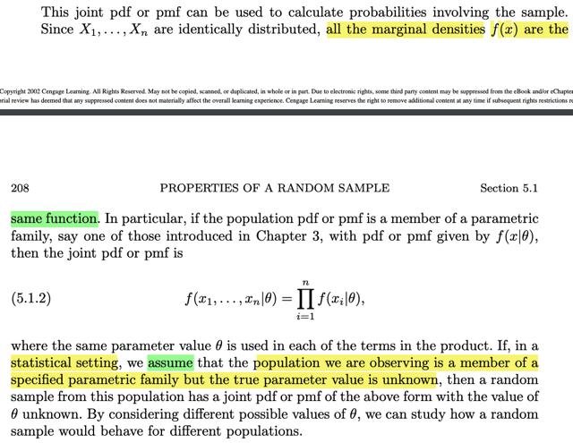</kbd></p>

<p align="center"><kbd></kbd></p>

<p align="center"><kbd>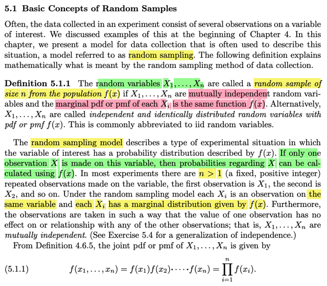</kbd></p>

> [!NOTE]
> 5.1 sách Casella cho ta định nghĩa và nó rõ hơn về Random Sampling như sau:
>
> Đại ý là, theo định nghĩa,**RANDOM SAMPLE** of size n là một **SET** có n
> **RANDOM VARIABLES** **X1, X2...Xn** sao cho thỏa hai điều kiện
>
> i) **INDEPENDENT** và ii) **IDENTICALLY** **DISTRIBUTED**
>
> Hai điều kiện này, viết tắt là iid, chính là thứ mà ta đã gặp trong Stat110 cụ thể là
> khi học về Binomial distribution, trong đó ta nói rằng sẽ tạo n iid Bern(p) trials.
> Và điều này có nghĩa là giá trị của rv Xi không ảnh hưởng, liên quan gì đến xác
> suất của r.v Xj. Đồng thời các rvs này đều có chung **marginal** distribution, quy
> định bởi `pdf/pmf` f(x)
>
> Tóm lại cần nhớ khái niệm random sample theo định nghĩa đơn giản chỉ là một
> bộ nhiều rvs có chung distribution và độc lập nhau.
>
> **? Tại sao phải nói rõ là MARGINAL DISTRIBUTION?** Là vì để nhấn mạnh
> thôi, vì marginal distribution sẽ nhằm phân biệt với joint distribution hay
> conditional distribution. Mà ở đây ta chú ý, RANDOM SAMPLING LÀ NÓI VỀ
> MỘT BỘ CÓ NHIỀU RANDOM VARIABLES, nên ta có thể nói về JOINT
> DISTRIBUTION của chúng (ví dụ joint pdf**f_X1,X2...Xn(x1, x2, ... xn),**hay
> joint pmf `P(X1=x1,X2=x2,...Xn=xn)`
>
> Thế thì từ Definition 4.6.5 (đã xem qua, add note vào đây sau) cũng là điều đã
> học từ Stat110, rằng nếu các r.vs INDEPENDENT, thì có thể nói là **joint
> distribution (ý nói `PDF/PMF)` sẽ bằng tích các marginal PDF/PMF).**
>
> ```text
> f_X1,X2...Xn(x1, x2, ...xn) = f_X1(x1)f_X2(x2)....f_Xn(xn) = Πi f_Xi(xi)
> ```
>
> Dĩ nhiên dễ hiểu rằng các `f_Xi` với `i=1,2...n` đều GIỐNG NHAU, cùng là một
> function vì các r.v Xi Identical, có chung distribution (là population distribution)
>
> `====`
>
> Phần sau có một notation mà hình như chưa được học trong Stat110, nhưng gs
> Casella có nói trong chapter 3, đó là khi population `pdf/pmf` là thành viên của
> một **parametric family, để rồi ta sẽ kí hiệu là `f(x|θ)` thì công thức trên trở thành
> `f_X1,X2...Xn(x1,` x2, `...xn|θ)` `=` Πi f_Xi(xi|θ)**Đoạn cuối đại ý là, trong bối cảnh **STATISTICAL** **SETTING, ta sẽ
> ASSUME population mà từ đó ta đang quan sát các sample là một thành viên
> của một parametric family với TRUe PARAMETER UNKNOWN**

<br>

<a id="node-639"></a>

<p align="center"><kbd>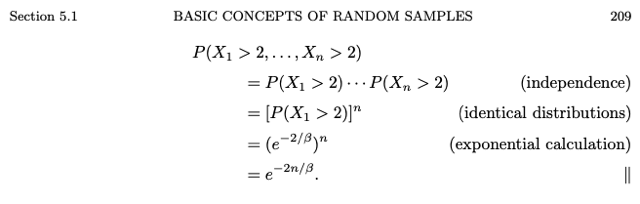</kbd></p>

<p align="center"><kbd></kbd></p>

<p align="center"><kbd>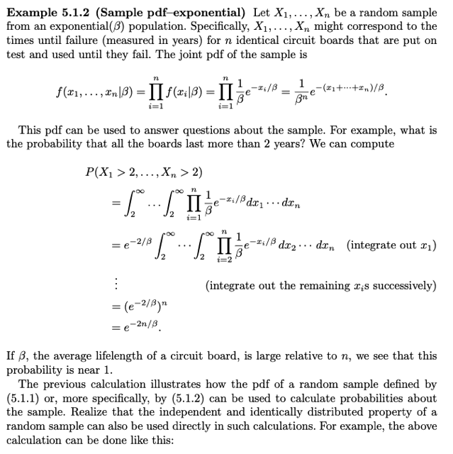</kbd></p>

> [!NOTE]
> Xem sau. liên quan đến Exponential distribution. Đại khái
> là thử tính JOINT PDF CỦA MỘT RANDOM SAMPLE .
> Minh họa cho công thức vừa rồi

<br>

<a id="node-640"></a>

<p align="center"><kbd>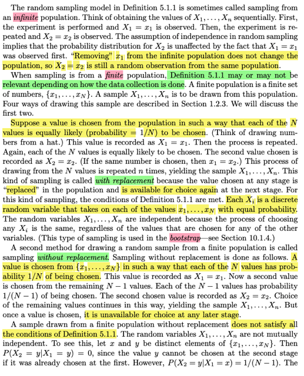</kbd></p>

🔗 **Related:** [Bàn về công thức S^2:  Chỉ là dựa vào định nghĩa của variance là ta muốn đo lường sự phân tán (dispersion) bằng cách tính trung bình giá trị và mean. (1/n) Σ(Xi-X_bar). Và vì lí do đã biết ta sẽ bình phương để có công thức (1/n) Σ(Xi-X_bar)^2  Có điều, liên quan đến một nguyên nhân liên quan đến bias/unbias estimator mà trong sách có lẽ sẽ học sau khi học về Estimator. Thì người ta chỉ chia cho n-1 thay vì n với lập luận rằng đã có 1 độ tự do bị mất khi tính sample mean. Nói chung phần sau gs Casella cũng có nói sơ, và theo gs Strang (Introduction to Linear Algebra, phần nói về variance), ông cũng có nói rằng tốt nhất cứ biết vậy thôi](untitled.md#node-645)

> [!NOTE]
> Trước tiên gs nói, nếu là INFINITE population thì khỏi kể có hay không thay thế (hoàn
> lại) vì khi đó không khác gì
>
> Hai trang tiếp theo cùng nội dung với thầy Ấn, trong đó gs Casella nói về hai loại
> RANDOM SAMPLING WITH & WITHOUT REPLACEMENT. Đại ý trong đoạn này gs
> giúp làm rõ tại sao không hoàn lại thì các r.v Xi trong random sample không còn iid: Đơn
> giản vì, ví dụ ta tính `P(X2=x)` với x ∈ {xj, `x=1,2..N}` là các possible values trong
> population, thì nó sẽ phụ thuộc X1: `P(X2=x|X1=x)` `=` 0 (vì X1 đã bằng x rồi). Nhưng
> ```text
> P(X2=x|X1 khác x) sẽ bằng 1/(N-1) (vẫn áp dụng naive definition, vì N-1 possibles
> ```
> values còn lại vẫn equally likely Như vậy xác suất mang một giá trị nào đó của X2 phụ
> thuộc outcome value cụ thể của X1. Hay conditional pmf của X2|X1 CÓ PHỤ THUỘC
> X1 nên X1, X2 KHÔNG INDEPENDENT.
>
> ```text
> (ta nhớ nếu X1, X2 độc lập thì P(X2=x|X1=x) = P(X2=x,X1=x)/P(X1=x) = P(X2=x)
> ```
>
> Tuy nhiên, ĐIỂM ĐANG CHÚ Ý LÀ, tuy với random sampling without replacement, các r.
> vs Xi khi **Marginal** **distribution** (tức marginal `pmf/pdf)` của các rv trong hai trường
> hợp đều **NHƯ NHAU**, có thể tóm gọn vầy:
>
> Cho rằng trong population có **finite possible values {x1, x2..xN} và xét x, y là hai cái
> khác nhau trong đó
>
> P(X2=x),**với **có replacement** thì dĩ nhiên các possible values đều có khả năng xuất
> hiện như nhau equally likely nên có thể dùng naive definition, `P(Xj=x)` `=` **1/N**, với mọi
> j, tức là nó đúng với mọi r.v Xj.
>
> Nếu **không replacement**. Ta thử tính `P(X2=x).` Thì lúc này ta cần LOTP để conditioned
> on mọi possible values của X1:
>
> ```text
> P(X2=x) = Σxi P(X2=x|X1=xi)P(X1=xi)
> ```
>
> Thì cái này sẽ tách ra thành:
>
> ```text
> Σxi!=x P(X2=x|X1=xi)P(X1=xi) + P(X2=x|X1=x)P(X1=x)
> ```
>
> ```text
> = Σxi!=x P(X2=x|X1=xi)P(X1=xi) + 0
> ```
>
> ```text
> và cái tổng trên có N-1 term, mỗi term P(X2=x|X1=xi)P(X1=xi) = [1/(N-1)]*(1/N)
> ```
>
> `=>` `P(X2=x)` `=` `(N-1)[1/(N-1)]*(1/N)` `=` **1/N
>
> Và kết quả này cũng đúng với mọi X3,X4....Xn**

<br>

<a id="node-641"></a>

<p align="center"><kbd>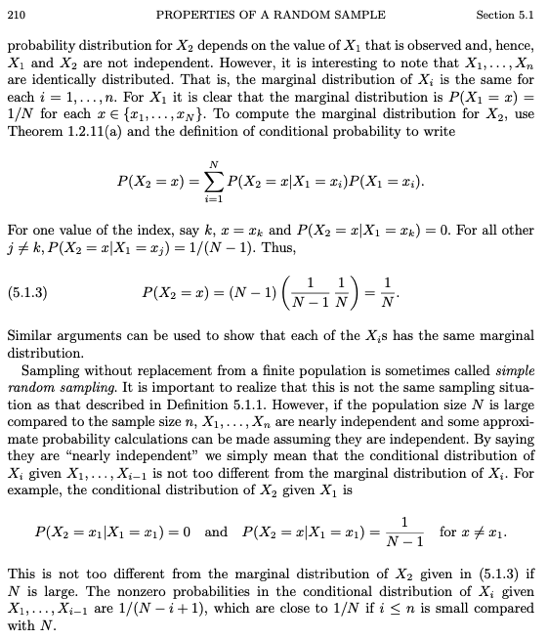</kbd></p>

> [!NOTE]
> Cái ý đại khái là khi N lớn hơn nhiều so với n thì khác biệt giữa
> hai cách nhỏ không đáng kể.
>
> Và từ đó có cái gọi là **NEARLY INDEPENDENCE**. Để rồi người
> ta VẪN DÙNG CÔNG THỨC TRONG ĐÓ TÍNH JOINT PDF `/`
> PMF BẰNG TÍCH CÁC MARGINAL `PDF/PMF`

<br>

<a id="node-642"></a>

<p align="center"><kbd>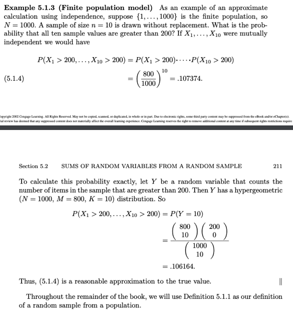</kbd></p>

> [!NOTE]
> Chỗ này là sao:
>
> Thế thì Stat110 ta đã học về Binomial distribution. Mà story của nó là, nếu
> X~Bin(n,p) thì story của nó là số trial success trong n i. i.d Bern(p) trials.
>
> ```text
> Và PMF P(X=k) = (n choose k) p^k q^(n-k) (k=0,1,2....n)
> ```
>
> Thế thì setting của Binomial là các iid Bern(p) trials. Với cách thức SAMPLING
> WITH REPLACEMENT, thì các trials sẽ có cùng distribution, tức identical (xác
> suất success như nhau, `=` p) và independent vì kết quả của trials này, không liên
> quan hay ảnh hưởng đến xác suất thành công của trials khác
>
> Nhưng nếu sampling WITHOUT REPLACEMENT, thì số trials success sẽ ~
> `Hyper-Geometric` distribution.
>
> Story của X~HyperGeom là số bi trắng có được khi bốc n viên bi từ trong lọ có w
> bi trắng, b bi đen.
>
> Để "lập luận" lại PMF của `Hyper-Geo` ta sẽ tính xác suất của việc chọn được k bi
> trắng. `P(X=k)`
>
> Cho rằng tất cả các viên bi đều phân biệt
>
> Sample space: Số cách chọn bộ n bi không quan tâm thứ tự:  `(w+b` choose n)
>
> Event space: Số cách chọn bộ n bi có k bi trắng:
>
> Đếm theo 2 bước:
>
> i) Chọn bộ k bi trắng phân biệt và ko care thứ tự: (w choose k)
>
> ii) Chọn bộ `n-k` bi đen phân biệt và không care thứ tự (b choose `n-k)`
>
> Nhận xét rằng lựa chọn cụ thể của bước i là gì thì cũng đều có cùng số cách
> chọn bộ bi đen ở bước ii. Do đó ta có thể dùng step rule để đếm số cách chọn bộ
> n bi mà trong đó có k bi trắng:
>
> (w choose k)*(b choose `n-k)`
>
> Vì mỗi bi trong lọ đều có xác suất được chọn giống nhau (equally likely) nên mọi
> bộ n bi đều có xác suất được chọn giống nhau. Từ đó cho phép sử dụng NAIVE
> DEFINITION:
>
> X~HyperGeom(n,w,b)
>
> ```text
> P(X=k) = (w choose k) * (b choose n-k) / (w+b choose n)
> ```
>
> Trong sách Casella, người ta kí hiệu Hypergeometric: Y ~ Hypergeom(N, M, K)
> thì N chính là w `+` b, tổng số bi. M chính là w, số bi trắng, và K là n, số trials

> [!NOTE]
> một ví dụ đại khái là thuộc về case sampling không hoàn lại. để rồi
> nó thuộc Hypergeometric thay vì Binomial distribution.
>
> Nhưng với N lớn so với n thì xác suất tính ra cũng gần bằng nhau

<br>

<a id="node-643"></a>

<p align="center"><kbd>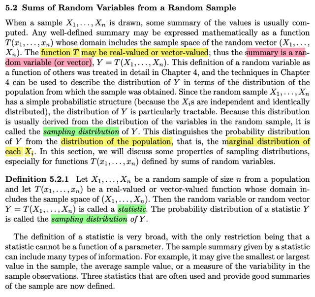</kbd></p>

> [!NOTE]
> đại khái là, như ta đã biết, nếu có **rv X**, thì khi **apply một function g** lên
> nó thì ta sẽ **có một rv mới g(X)**. Điều này cũng **tương tự với function
> apply lên nhiều rv g(X,Y), cũng là r.v** Thế thì, ta đã biết **RANDOM
> SAMPLE** là một s**et các r.v X1, X2...Xn** Thế thì ta sẽ muốn **apply một
> function T** ví dụ như để tính ra một **scalar**, mang thông tin **tóm tắt một
> khía cạnh nào đ**ó của các rvs, ví dụ như mean. Thế thì khi đó, như trên, ta
> cũng có một `/` vector các r.vs. Đó gọi là **STATISTIC:
>
> T(X1,X2...Xn) là Statistic, cũng là một `/` vector các random variables**
>
> Và vì **nó là r.v** nên nó cũng **có distribution**, đó gọi là **SAMPLING**
> **DISTRIBUTION** khác với **POPULATION DISTRIBUTION**, chính là
> **MARGINAL** **distribution** của các**iid random variable X1, X2....Xn**
>
> Khúc cuối đại khái là**định nghĩa của statistic rất rộng**, **miễn là nó không
> phải là function chỉ với 1 params** (tạm hiểu là chỉ có đơn biến, mà phải là
> function nhận input là các r.vs trong random sampling)

<br>

<a id="node-644"></a>

<p align="center"><kbd>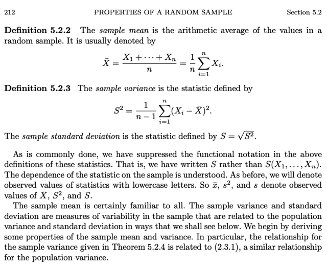</kbd></p>

> [!NOTE]
> Đại khái là 3 "loại" "summary" statistic phổ biến là sample mean, sample variance
> và sample standard deviation
>
> Công thức của sample mean thì không có gì lạ, chỉ là trung bình các r.v
>
> Còn Sample variance thì có lẽ bàn một chút ở note tiếp theo.
>
> Cái chính ở đây người ta nói thường là ta sẽ **TỰ HIỂU** `X_bar,` S^2 (sample
> variance), S (sample std) là việc apply function lên các random variacs X1,..Xn
> nên người ta sẽ KHÔNG GHI CỤ THỂ là `X_bar(X1,X2...Xn)` hay S^2(X1, X2..Xn)
>
> Ý quan trọng nữa là vì chúng (các statistic này) cũng là các rvs nên chúng cũng
> có các `POSSIBLE/OBSERS` VALUES. và như thường lệ ta sẽ dùng lowercase để
> thể hiện value của tụi nó `x_bar,` s^2, s

<br>


<a id="node-645"></a>
## Bàn về công thức S^2:

> [!NOTE]
> Bàn về công thức S^2:
>
> Chỉ là dựa vào định nghĩa của variance là ta muốn đo lường sự
> phân tán (dispersion) bằng cách tính trung bình giá trị và mean.
> ```text
> (1/n) Σ(Xi-X_bar). Và vì lí do đã biết ta sẽ bình phương để có công
> ```
> ```text
> thức (1/n) Σ(Xi-X_bar)^2
> ```
>
> Có điều, liên quan đến một nguyên nhân liên quan đến `bias/unbias`
> estimator mà trong sách có lẽ sẽ học sau khi học về Estimator. Thì
> người ta chỉ chia cho `n-1` thay vì n với lập luận rằng đã có 1 độ tự
> do bị mất khi tính sample mean. Nói chung phần sau gs Casella
> cũng có nói sơ, và theo gs Strang (Introduction to Linear Algebra,
> phần nói về variance), ông cũng có nói rằng tốt nhất cứ biết vậy thôi

🔗 **Related:** [MỘT SỐ GHI CHÚ CHAPTER 5 - CASELLA](untitled.md#node-640)

<br>

<a id="node-646"></a>

<p align="center"><kbd>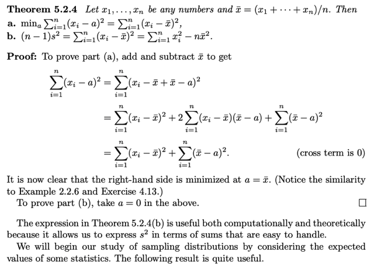</kbd></p>

<br>

<a id="node-647"></a>

<p align="center"><kbd>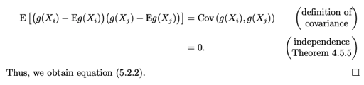</kbd></p>

<p align="center"><kbd></kbd></p>

<p align="center"><kbd>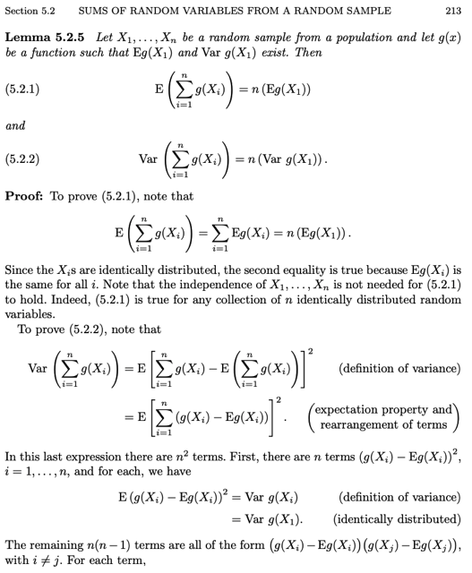</kbd></p>

<br>

<a id="node-648"></a>

<p align="center"><kbd>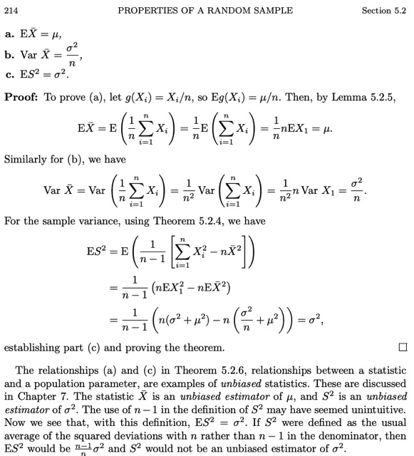</kbd></p>

<p align="center"><kbd></kbd></p>

<p align="center"><kbd>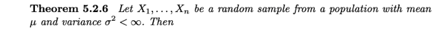</kbd></p>

<br>

<a id="node-649"></a>

<p align="center"><kbd>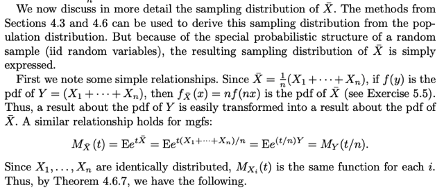</kbd></p>

<br>

<a id="node-650"></a>

<p align="center"><kbd>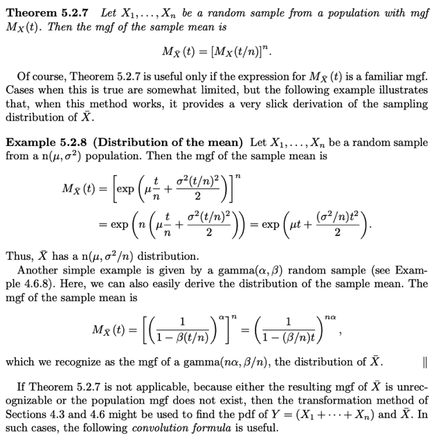</kbd></p>

<br>

