# ....a

📊 **Progress:** `5` Notes | `18` Screenshots

---

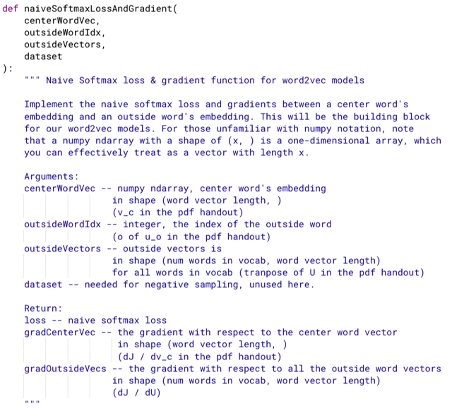

<kbd>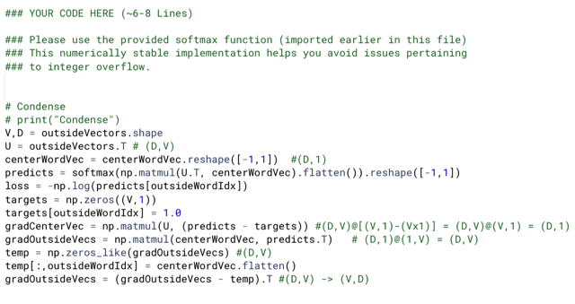</kbd>

> [!NOTE]
> Kinh nghiệm: chỉ đưa vector vào hàm softmax này (tức, là phải
> flatten thành 1d array). Có thể quay lại tìm hiểu tại sao. 
>
> Cách suy nghĩ (ý là lý thuyết, dựa trên phần câu hỏi trước) đã đúng,
> chỉ cần đảm bảo đúng shape là được

 

<kbd>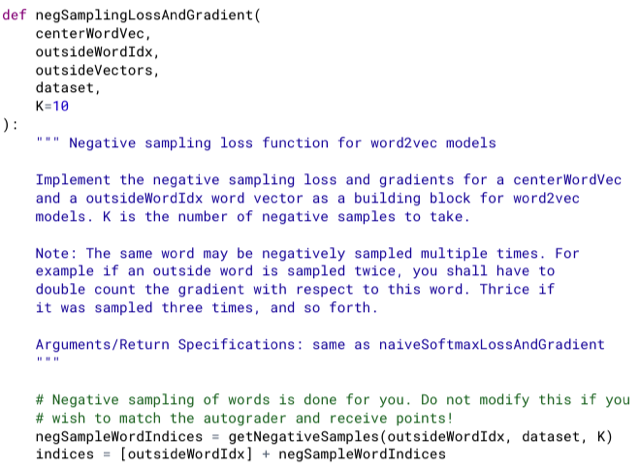</kbd>

 

<kbd>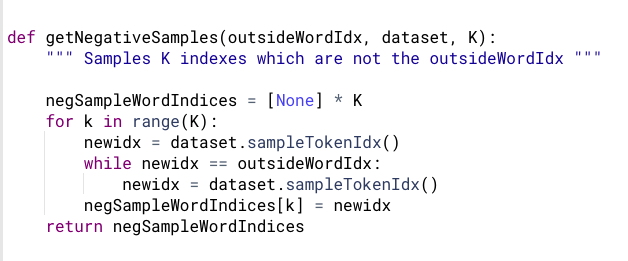</kbd>

<kbd></kbd>

<kbd>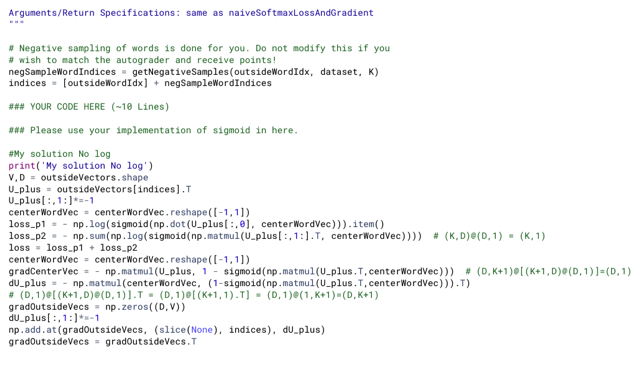</kbd>

> [!NOTE]
> chỉ cần hiểu rằng, ta xây dựng matrix U_plus (là matrix U' trong phần note trả lời lý thuyết,
> hay trong đề bài là U o,{w1,..wK}. Bằng cách "lấy ra" từ matrix U cho trước, nhờ các index
> mà id của uo đứng đầu, sau đó là K vector uw1, uw2....uwK. các index của các vector
> negative sampling sẽ được tạo bởi một sampling function nhằm đảm bảo các sampling
> word không trùng outer word (để các uw1,...uwK đều khác uo)
>
> Khi đó ta có matrix mà các cột là [uo, uw1, ..uwK], thế thì phải nhân - 1 cho các cột từ 2 trở
> đi vì U_plus là matrix [uo, -uw1, ..-uwK]
>
> Dựa theo công thức đã triển khai ở phần lý thuyết để tính dJ/dvc và dJ/dU_plus Thế thì với
> dJ/dU_plus sẽ có điểm lưu ý là, các cột của nó đương nhiên là  đạo hàm của loss đối với
> ÂM của các vector uw1, uw2...Và thứ hai là các w1,..wK có thể trùng nhau. Thành ra ta sẽ
> cần phải gộp chung lại, cho dễ hiểu thì ví dụ như sau:
>
> giả sử K = 5 và indices vector sẽ có K+1 phần tử, là [3,5,7,5,2,4]. Thì 3 chính là index của
> outer word, cột U[:,3] chính là vector uo. Các số từ 5 trở đi đương nhiên là index  của các
> sampling word. Thế thì số 5 lặp lại 2 lần, để ý cái này.
>
> Sau đó như đã nói ở trên ta sẽ tính ra dJ/dU_plus là matrix (D,K+1) = 3x6 (ví dụ D = 6) vậy,
> để có dJ/dU ta sẽ tạo matrix zeros có kích thước D,V sẵn.
>
> Sau đó, gán vector đầu tiên của dJ/dU_plus (như đã biết, nó sẽ chính là dJ/duo, uo- đang
> nói là cột có index = 3 của U) vào cột index = 3 (cột thứ 4) của dJ/dU.
>
> Rồi, cột thứ 2 và thứ 4 của dU_plus sẽ chính là ÂM của đạo hàm loss đối với cái cột có
> index = 5 matrix U. Tức là từ có index = 5 của vocab được sampling 2 lần, đồng nghĩa
> tham gia 2 lần vào quá trình tính toán, nên đạo hàm của loss đối với (ÂM CỦA) cột này của
> U sẽ  tổng hai cột thứ 2 và 4 của dU_plus (dU_plus[1] và dU_plus[3])
>
> ====
>
> Thành ra ta sẽ làm như sau đối với dJ/dU: 
>
> Sau khi khởi tạo zero matrix, ta sẽ iterate trong các index
>
> gradOutsideVecs = np.zeros((D,V)) 
>
> for i, id in enumerate(indices):
>   # Nếu id đầu tiên  tức là dJ/duo, thì gán CỘNG DỒN nó vào index tương ứng của U
>   # Nhưng từ các id tiếp theo, phải nhân cho -1 trước khi gán CỘNG DỒN  
>   gradOutsideVecs[:, id] += dU_plus[:, i] if i == 0 else -dU_plus[:,i]
>
> Để dùng vectorized, thì ta sẽ nhân -1 cho các cột dU_plus, từ cột thứ 2 trở đi 
> Sau đó dùng function  **np.add.at(gradOutsideVecs, (slice(None), indices), dU_plus)
> để có kết quả tương tự
>
> * Chú ý, cuối cùng phải transpose để dJ/dU về cũng shape với U là (V,D)**

 

<kbd>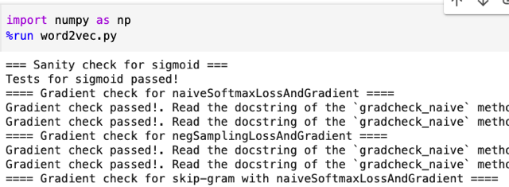</kbd>

> [!NOTE]
> đã pass test case

 

<kbd>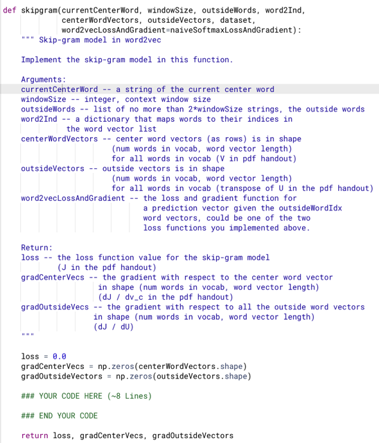</kbd>

 

<kbd>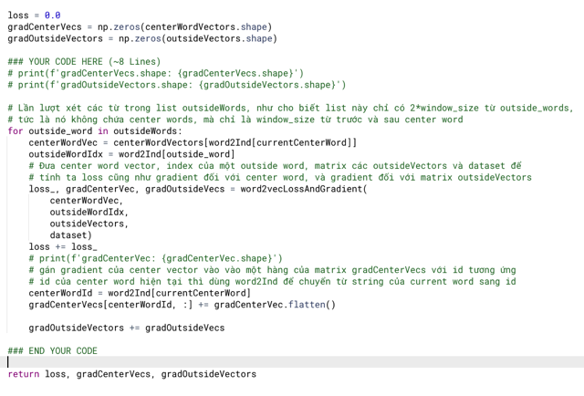</kbd>

 

<kbd>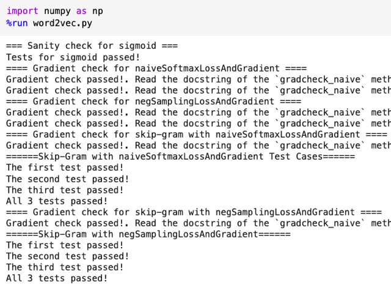</kbd>

 

<kbd>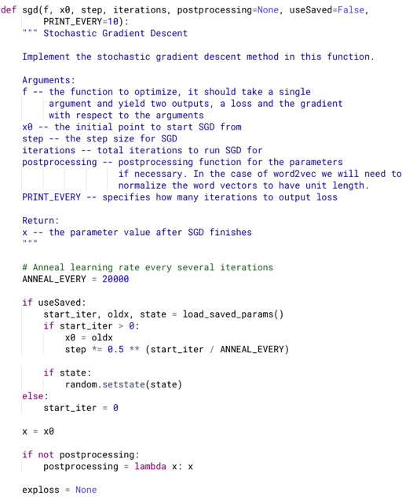</kbd>

 

<kbd>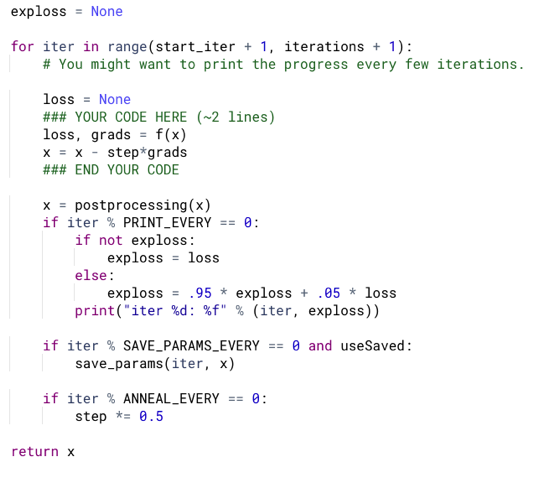</kbd>

> [!NOTE]
> Sgd đơn giản vậy thôi, take value của param bỏ vào f để tính ra loss
> và gradients, dùng gradient * lr để update cho params

 

<kbd>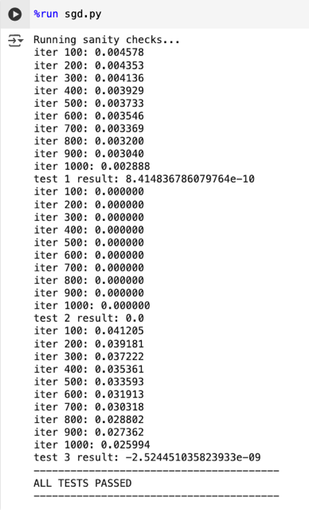</kbd>

<kbd></kbd>

<kbd>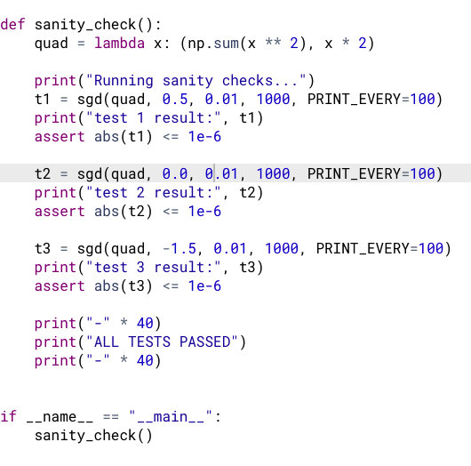</kbd>

 

<kbd>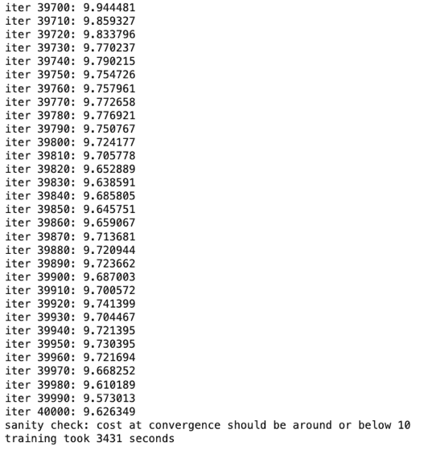</kbd>

<kbd></kbd>

<kbd>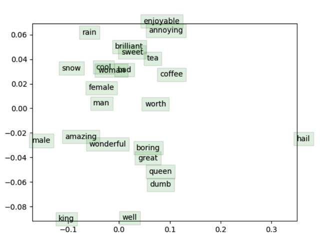</kbd>

> [!NOTE]
> Kết quả cho thấy các từ gần nghĩa nằm gần nhau trong không
> gian

 

