# Assignment 1

📊 **Progress:** `18` Notes | `32` Screenshots

---

<kbd>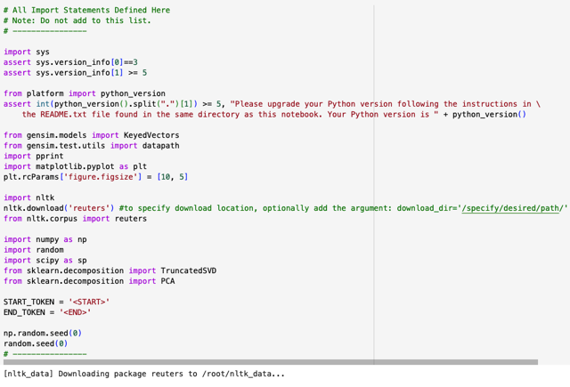</kbd>

> [!NOTE]
> Import **gensim** model **KeyedVectors**, **datapath**, các lib
> quen thuộc như **matplotlib**, **nltk** (giúp data preprocessing
> trong nlp)
>
> Nhờ nltk ta sẽ download bộ dataset **Reuters**, ngoài ta còn có
> **sklearn's TruncatedSVD, PCA**
> Sau đó là người ta define sẵn **start & end token**

 

<kbd>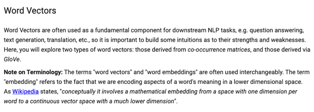</kbd>

> [!NOTE]
> Đại khái là word vectors là một component cơ bản và quan trọng của
> NLP ảnh hưởng đến performance của các downstream task như dịch
> thuật, Q&A...Thành ra ta nên có cái sự hiểu biết nhất định với chất
> lượng của các loại word vector khác nhau (được xây dựng bới các
> phương pháp khác nhau)
>
> Thì ở đây ta sẽ xem xét word vector xây dựng từ co-occurence matrix
> và từ GloVe.
>
> Ngoài ra word vector hay word embedding thường được dùng như nhau
> Trong đó embedding hay encoding để chỉ việc vector nắm bắt trong nó
> Những ý nghĩa ngữ nghĩa của từ vựng

 

<kbd>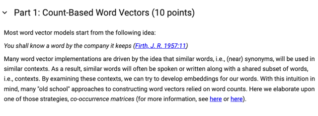</kbd>

> [!NOTE]
> Đại khái là nhắc lại nhận định quan trọng đó là các từ chung / gần
> nghĩa thường sẽ được xuất hiện trong những ngữ cảnh giống nhau
> từ đó có thể nói ý nghĩa của một từ sẽ được quy định bởi các từ
> hay xuất hiện gần nó.
>
> Dựa vào điều này mà các phương pháp xây dựng word vector khác
> nhau ra đời một trong số đó là co-occurrence matrix

 

<kbd>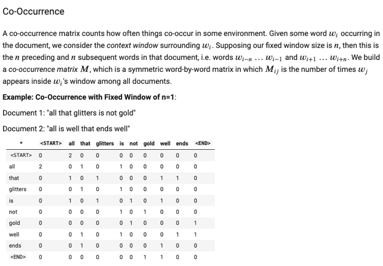</kbd>

> [!NOTE]
> Đại khái là sơ lược cách thức xây dựng C.O matrix đó là ta sẽ đếm
> xem số lần một từ w_i xuất hiện trong cùng một context window với một từ w_j.
> Và context window size có thể define bởi n thì n từ trước và sau w_j sẽ là chung
> một context.
>
> Như vậy khi làm vậy trên mọi document, ta sẽ điền vào cái bản có VxV gọi là
> C.O matrix

 

<kbd>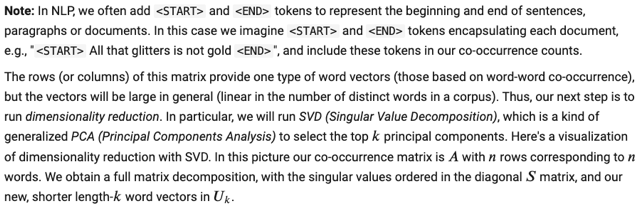</kbd>

> [!NOTE]
> Đại khái là trong NLP thông thường ta sẽ có thêm hai token là start và
> end token,  biểu thị cho việc mở đầu và kết thúc, thành ra ta cũng sẽ
> add nó vào C.O matrix luôn Để ví dụ như từ apple mà hay đứng cuối
> câu hay gần cuối câu thì trong C.O matrix sẽ phản ánh việc này bằng
> chỉ số của End token cao.
>
> Thứ hai nữa là sau khi "làm xong" cái CooC matrix, ta sẽ dễ thấy các
> word vector (có thể dùng cột hay hàng đều như nhau) sẽ có size rất lớn
> với kích thước bộ vocab có thể lên tới hàng triệu.
>
> Do đó người ta sẽ dùng các technique Dimensionality Reduction như
> PCA (mà SVD) là dạng khái quát (generalized) của PCA để giảm chiều
> không gian xuống.

 

<kbd>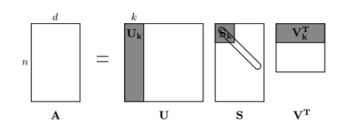</kbd>

> [!NOTE]
> Và với SVD thì nôm na là ta nhờ nó để giảm từ |V|
> dimensional vector xuống còn k dimensional vector (từ
> matrix Uk)

 

<kbd>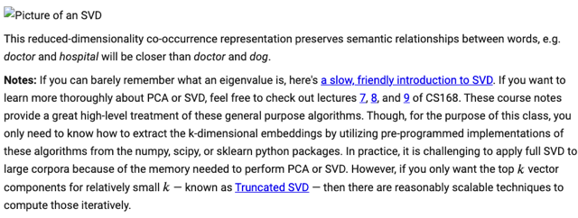</kbd>

> [!NOTE]
> Đại khái là với cách reduced dimensionality thì vẫn giữ được cái "
> **semantic relationships**" giữa các từ vựng như "doctor" và "hospital" thì
> sẽ vẫn gần gũi nhau hơn là "doctor" và "dog"
>
> Thêm nữa khi nào cần có thể ôn lại SVD là gì thông qua các note bài giảng 
> của khóa **CS168** mà người ta để link ở đây. Nói thêm việc sử dụng full SVD
> với các bộ dữ liệu lớn thì không thực tế vì yêu cầu ram lớn, Tuy nhiên nếu
> **chỉ cần top K vector component** thì có thể **dùng TruncatedSVD** làm có thể
> làm được không cần phải perform full SVD

 

<kbd>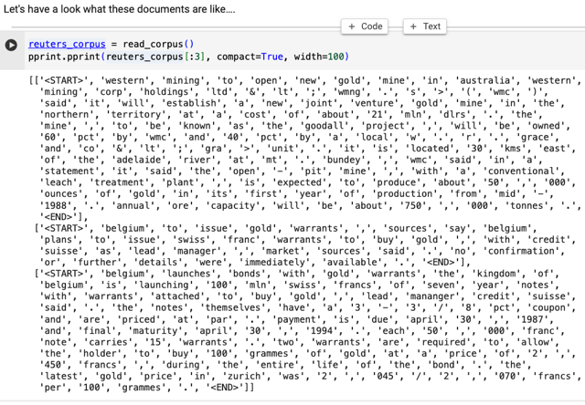</kbd>

<kbd></kbd>

<kbd>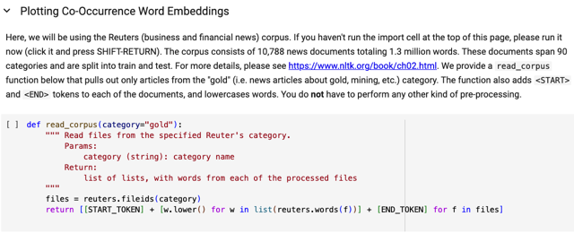</kbd>

> [!NOTE]
> Đại khái là ta sẽ dùng Reuter dataset cụ thể hơn là chỉ dùng subset các
> article có liên quan đến "gold" thôi. Bộ dataset này có 1.3 triệu từ. Người ta
> chuẩn bị function giúp tải dataset về, lowercase nó, thêm Start End token và
> chia sẵn ra làm train & tét sét luôn

 

<kbd>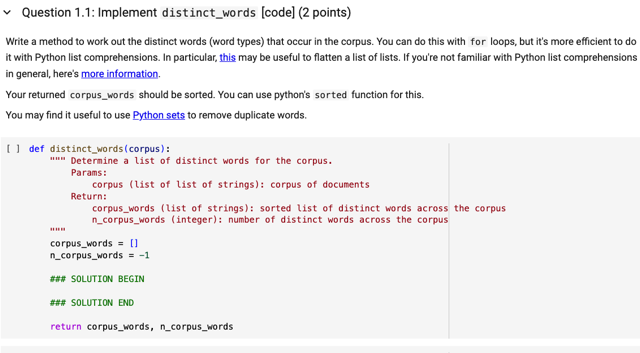</kbd>

 

<kbd>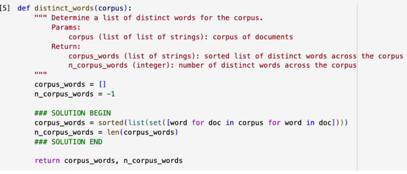</kbd>

> [!NOTE]
> Rất đơn giản dùng list comprehension để "loop" qua các
> document, trong document, loop qua các word của nó, và
> bỏ vào list. Xong hết thì bỏ cái list vào sét() để remove các
> duplicate words. Sau đó lại bỏ vào list để có lại một list và
> dùng function sorted() của Python thể sort. Cuối cùng dùng
> len() để tính số từ trong lít đó

 

<kbd>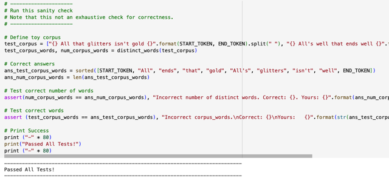</kbd>

 

<kbd>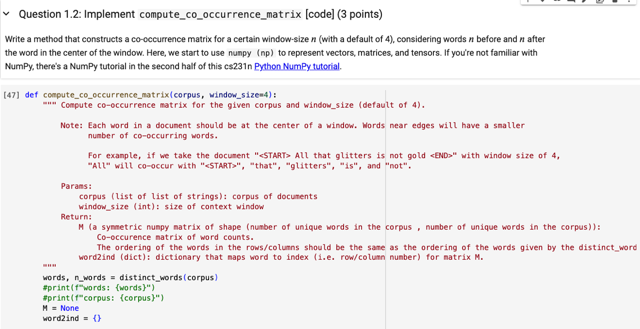</kbd>

 

<kbd>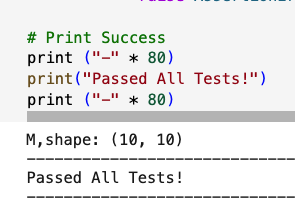</kbd>

<kbd></kbd>

<kbd>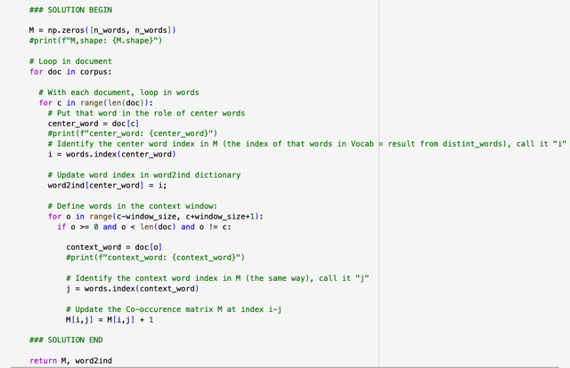</kbd>

> [!NOTE]
> Ta sẽ loop qua từng document, với mỗi document ta sẽ loop
> qua các từ, gán cho nó làm center word. Và lấy vị trí của nó
> trong vocab để gán nó vào dictionary word2ind
>
> Rồi với vị trí của mỗi từ trong doc, ta lấy các từ trong context,
> trước nó và sau nó window_size, lọc ra những index nào 
> Valid thôi (không âm, không vượt quá len(doc), và khác luôn
> center word, tức là khi đếm cho mỗi từ ta sẽ không đếm / không
> tính chính nó.

 

<kbd>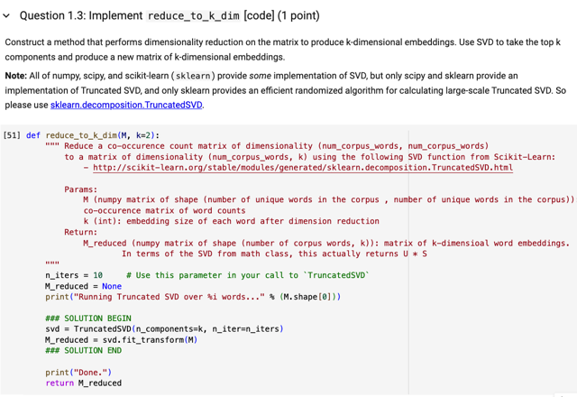</kbd>

> [!NOTE]
> Đại khái là dụng TruncatedSVD của SkitLearn để Dimensionality
> Reduction từ M (V,V) xuống còn M_reduced(V, k)
>
> Chỉ việc khởi tạo ScikitLearn TruncatedSVD với n_components = k và
> dùng fit_transform() với M là xong

 

<kbd>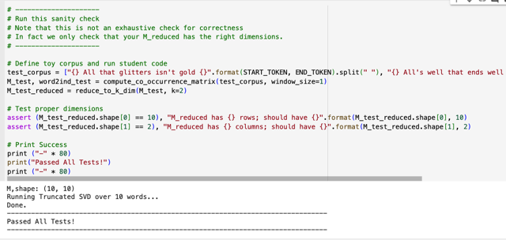</kbd>

 

<kbd>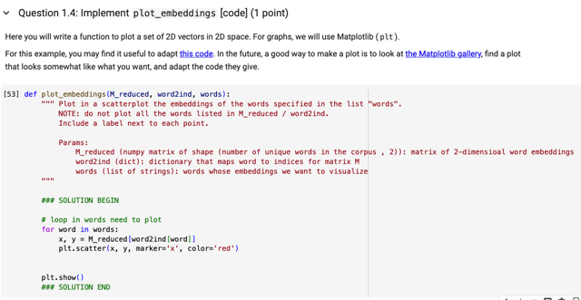</kbd>

> [!NOTE]
> Không có gì, loop trong các từ cần plot, lấy index của nó ra nhờ
> word2Ind, và dùng nó để lấy word vector từ M_reduced. Và bỏ
> tọa độ của nó vào plt.scatter()

 

<kbd>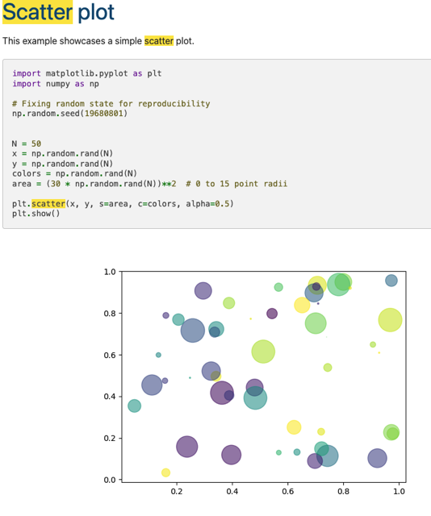</kbd>

<kbd></kbd>

<kbd>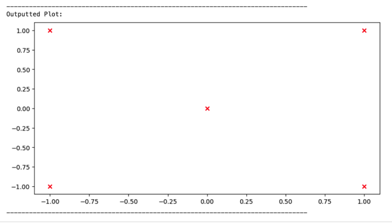</kbd>

 

<kbd>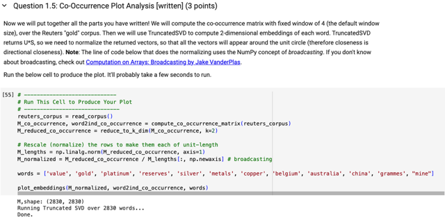</kbd>

> [!NOTE]
> Đại khái là dùng các function đã tính để train bộ
> word vector (CO matrix) và vẽ ra thử các từ này

 

<kbd>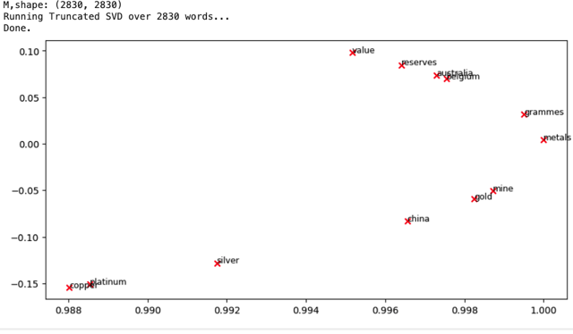</kbd>

> [!NOTE]
> Thì thấy có vẻ không đúng lắm

 

<kbd>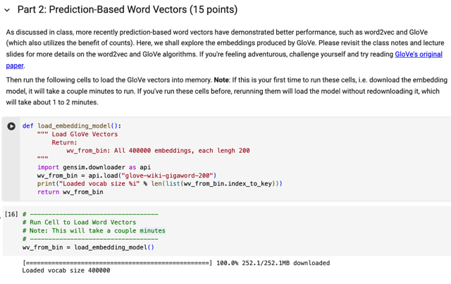</kbd>

> [!NOTE]
> Load bộ word embedding được pretrain với GLOVE model
> chứa 400.000 word vectors, dimension 200

 

<kbd>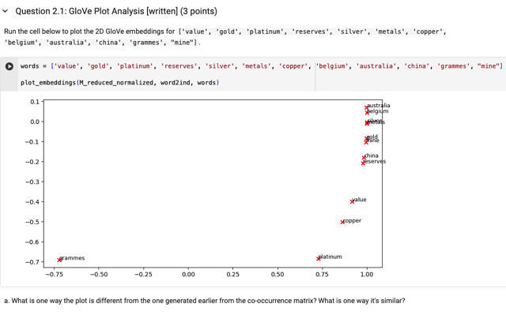</kbd>

> [!NOTE]
> Đại khái là đưa ra vài nhận định về bộ embedding các từ này
> so với vector tạo bởi co-occurrence matrix

 

<kbd>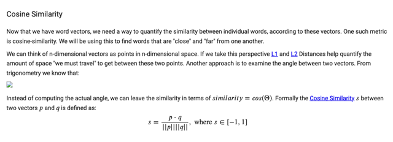</kbd>

 

<kbd>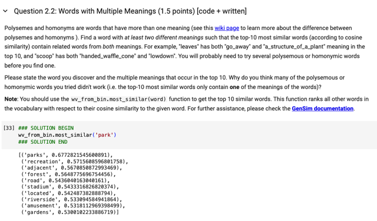</kbd>

 

<kbd>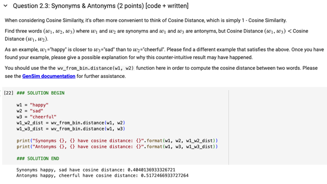</kbd>

 

## The issue you've encountered where "happy" and "sad" appear closer in word

> [!NOTE]
> The issue you've encountered where "happy" and "sad" appear closer in word
> embeddings than " happy" and "cheerful" is likely due to the inherent limitations of word
> embeddings like \**GloVe\** (G\**lobal Vectors for Word Representation\**) and the way they
> capture word meanings.
>
> \**Word embeddings \**are created by training on \**large corpora of text data\** and learning
> word representations based on \**co-occurrence statistics\**. Words that often \**appear in
> similar contexts\** tend to have \**similar word embeddings\**. However, word embeddings are
> not always perfect at capturing \**nuanced semantic relationships\**, especially when it
> comes to \**antonyms\** or words with subtle distinctions.
>
> Here's why this might happen:
>
> \**Frequency of Co-occurrence\**: In many texts, "\**happy\**" and "\**sad\**" may \**appear in
> similar contexts\** because they are \**both related to emotional states\**. As a result,
> t\**heir word embeddings may end up being closer to each\** other due to\**their frequent
> co-occurrence.\**
>
> \**Context\** vs. \**Semantic\** Similarity: Word embeddings primarily \**capture contextual
> information\** rather than \**pure semantic similarity\**. While "happy" and "cheerful" have
> similar meanings, they may not always appear in identical contexts, leading to them
> being farther apart in the embedding space.
>
> \**Training Data\**: The \**quality of the training data\** and the\**size of the corpus\** can also affect
> word embeddings. If the training data lacks \**diverse examples of word usage\**, it may not
> \**capture fine-grained semantic relationships\** accurately.
>
> To\**address this issue\**, you can consider using more specialized word embeddings that
> are specifically designed to \**capture semantic relationships\** or use techniques like word
> sense disambiguation to distinguish between different senses of words. Additionally, you
> can also fine-tune word embeddings on domain-specific data to better reflect the
> relationships you're interested in.

> [!NOTE]
> Đại khái là tuy những từ happy và sad có ý nghĩa trái ngược nhưng
> vì các phương pháp như Glovec dựa trên contextual similarity nếu
> trong corpus các từ này hay xuất hiện cùng nhau trong context, và
> các từ tương đồng nghĩa như happy và cheerful lại ít xuất hiện cùng
> nhau vì lí do đơn giản là ít bài viết cùng lúc viết happy và cheerful
> thì kết quả là word vector của happy và sad lại similar nhau hơn là
> happy và cheerful
>
> Ý thứ hai cũng tương tự đó là vì bản chất cách làm việc của các mô
> hình như glovec.
>
> Còn ý thứ 3 là nói về chất lượng và số lượng của training data 
> cũng sẽ ảnh hưởng

 

<kbd>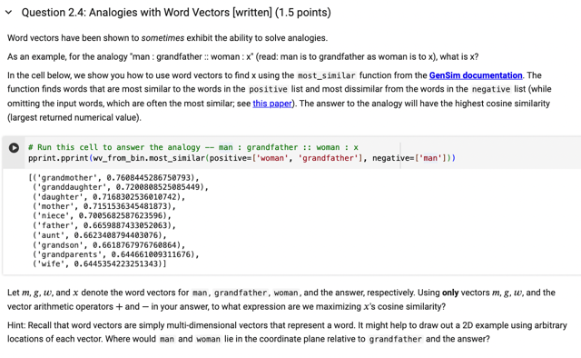</kbd>

> [!NOTE]
> Đại khái là most_similar() sẽ tìm từ giống nhất với từ trong
> positive lít, và khác nhất với từ trong negative lít. Và người
>  ta hỏi là nên dùng cách kết hợp nào từ w, gf, m để có được x 
> giống nhất với w, gf, và khác nhất với m với dấu +,-. 
> Vậy thì đương nhiên + w + gf - m.
>
> và việc model nó tìm ra hay học ra grandfather cho câu trả lời 
> này chứng tỏ nó đã nắm bắt được những khái niệm trừu tượng
> như giới tính..

 

<kbd>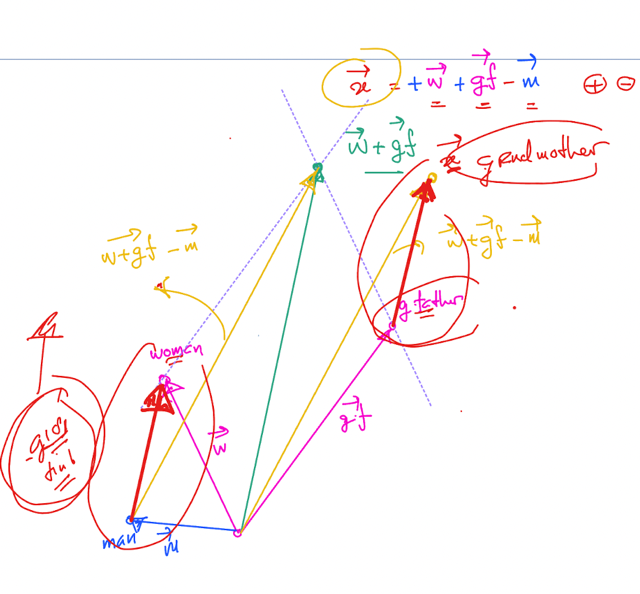</kbd>

 

