# Assignment 3 - Dependency Parsing

📊 **Progress:** `34` Notes | `59` Screenshots

---

<kbd>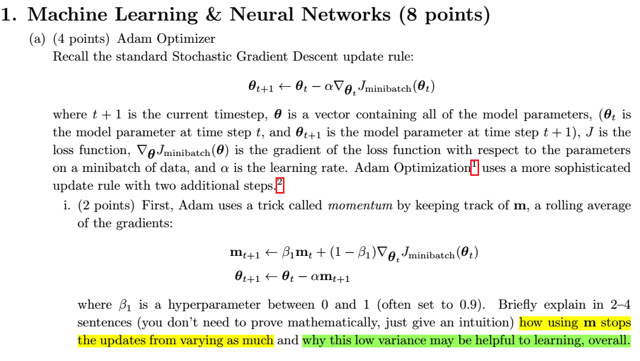</kbd>

> [!NOTE]
> Câu hỏi là mô tả tác dụng của momentum (m) trong Adam và tại sao nó lại
> giúp **giảm mức biến động trong quá trình trainin**g.
>
> Trả lời:
>
> Nói ngắn gọn, việc dùng momentum m_t+1 = m_t*beta + (1-beta)*grad đã
> giúp cho **giảm sự biến động của việc param update** là bởi có thể thấy tại
> t, **ta không dùng toàn bộ 100% gradient tại đó - grad_t**, mà ta chỉ dùng
> một phần (**beta*grad_t)**, để rồi cập nhật nó với momentum m_t và dúng
> nó để thay đổi params.
>
> Điều nà**y tạo ra một độ trễ / một hiệu ứng trì hoãn, khi không phản ánh
> ngay, sử dụng ngay toàn bộ gradient mới nhất** vào việc update params.
>
> ===
>
> Ý thứ hai, việc giảm variance sẽ tốt cho learning là vì việc biến động **khiến
> quá trình optimization tốn thời gian** khi giá trị params phải lang thang vô
> ích. Momentum sẽ **giúp params tiến về, hội tụ về global optimum nhanh
> hơn**. Đại khái là vì momentum giúp đường đi bớt lòng vòng (do sự biến
> động của gradient), nên  tất nhiên thời gian đi tới đích sẽ giảm đi.
>
> Ngòai ra còn lợi ích quan trọng là:**- momentum giúp vượt qua các local minima hay vùng yên ngựa (saddle
> point) nơi có gradient = 0 hoặc rất nhỏ. Với sgd, model sẽ mắc kẹt rất lâu
> trong những vùng này.
>
> - tăng tốc quá trình hội tụ theo hướng đúng: Nếu như là với SGD, params
> chỉ được dẫn dắt bởi gradient, thì khi trên một vùng (của optimization
> landscape) có gradient ổn định thì sgd chỉ giúp params được update dần
> đều về hướng optimum. Còn momentum sẽ giúp tăng tốc quá trình, đẩy
> nhanh quá trình hội tụ.**

> [!NOTE]
> Here's a concise answer that sums up your points about the role of
> momentum - m in the Adam optimizer:
>
> Using momentum in the Adam optimizer helps stabilize parameter
> updates by incorporating a fraction of the previously computed
> gradients. This reduces oscillations and variance during training,
> leading to more consistent and faster convergence. Additionally,
> momentum helps overcome potential obstacles such as small local
> minima or saddle points by maintaining movement in the
> optimization landscape even when gradients are small or zero.
>
> Overall, these properties make momentum a valuable tool for
> achieving efficient and effective learning in complex models.

 

<kbd>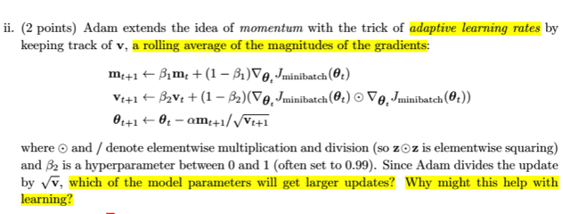</kbd>

> [!NOTE]
> câu hỏi là với việc Adam học theo **Adaptive Gradient Optimizer** (AdaGrad)
> thì parameters nào sẽ được nhận được lượng update lớn nhất.
>
> -> Sẽ là **cái có learning rate được scale với scaling factor nhỏ hơn**. Mà vì
> scaling factor được tính bởi rolling average của bình phương gradient. Như
> vậy, **parameters nào có gradient lớn, mang ý nghĩa là hướng nào trong
> không gian optimization có sự dao động lớn, sẽ được 'hãm' lại** và ngược
> lại, hướng nào ổn định hơn, **parameter nào có gradient nhỏ hơn sẽ được
> update với learning rate lớn hơn.**
>
> ====
>
> Tác dụng của nó với learning process:
>
> Điều này giúp tạo ra sự**cân bằng hơn giữa các hướng đi khi ở hướng có
> sự biến động lớn, step size sẽ nhỏ lại** còn ở**hướng ổn định hơn, step size
> sẽ tăng lên**. Giúp **giảm bớt biến động, tăng sự ổn định** của params
> update từ đó **tăng tốc sự convergence.
>
> Ngoài ra việc giảm bớt step size ở các hướng có gradient lớn cũng giúp
> giảm hiện tượng exploding gradient. Và việc tăng step size của các hướng
> được update chậm (với grad nhỏ) cũng sẽ giúp tăng tốc  sự hội tụ ở những
> hướng này**

 

<kbd>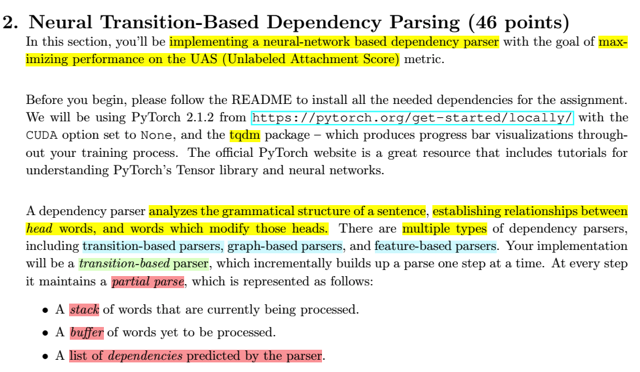</kbd>

> [!NOTE]
> Ok, đại khái là phần này ta sẽ làm một neural network based
> dependency parse, tức là một dependency parse hoạt động dựa trên
> neural network.
>
> Với mục tiêu là tối đa được hiệu suất trên chỉ số UAS, trong bài đã biết
> về UAS và (...).
>
> Rồi, người ta nói sơ lại về dependency parser, nó làm nhiệm vụ phân 
> tích (tạm gọi là phân tích, hay phân giải - parse) các sự quan hệ phụ
> thuộc lẫn nhau của các từ trong câu. Từ được phụ thuộc gọi là head.
>
> Thế thì có nhiều loại dependency parser như graph-based, feature-based
> hay transition-based. Thì ở đây ta sẽ làm transition-based.
>
> Cái này nó sẽ (tạm gọi là) lần lần, thực hiện các bước parsing. Tại mỗi
> bước, nó sẽ duy trì một partial parse có dạng là:
>
> Một stack các từ đang được xử lý
>
> Một buffer các từ đang chờ
>
> Một list các dependency mà model đã dự đoán

 

<kbd>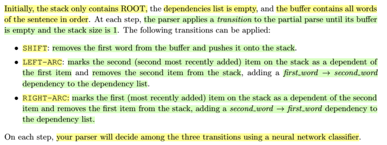</kbd>

> [!NOTE]
> Ban đầu, cái stack nó chỉ chứ ROOT, dependency list sẽ trống. Còn
> buffer thì chứ mọi từ của input sentence.
>
> Thì tại mỗi bước, model (parser) sẽ thực hiện (dự đoán) một bước 
> transition, thuộc 1 trong 3 loại sau:
>
> SHIFT: Lấy từ đầu tiên trong buffer bỏ vào stack.
>
> LEFT_ARC: Đánh dấu cái từ mới đưa vào stack gần nhất là phụ thuộc
> cái từ trước đó, ghi nhận vào dependency list quan hệ này, và bỏ từ
> đó ra khỏi stack.
>
> Chú ý, dễ gây confuse: với stack thì giả sử đang có root, w1. Bỏ thêm w2
> thì w2 sẽ là first_word, w1 sẽ là second_word.
>
> Trong câu dưới ghi là LEFT-ARC, đánh dấu the second (the second most
> recently added) item on the stack là dependent của the first item. Thì có 
> nghĩa là ta sẽ đánh dấu từ **w1 là từ phụ thuộc của w2, hay là w2 phụ 
> thuộc vào w1**: w2 -> w1. 
>
> Vì cái từ bỏ vào gần nhì (the second most recently added) chính là w1,
> còn từ bỏ vào gần nhất (the most recently added) là w2. 
> Rồi họ ghi adding a dependency first_word-> second_word thì first_word
> ở đây ám chỉ first word trong stack, chính là w2 và second word trong
> stack là w1.
>
> ***Gọi left arc vì: ROOT, w1, w2 mà w1 <- w2, vậy là trong hai từ w1,w2
> thì từ phụ thuộc nằm bên trái.**
>
> RIGHT-ARC: Tương tự nhưng quan hệ ngược lại, từ trước đó phụ thuộc
> vào từ mới add vào gần nhất.
>
> Quá trình này sẽ được dự đoán bởi model

 

<kbd>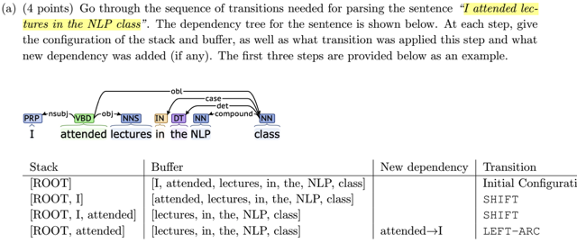</kbd>

> [!NOTE]
> [ROOT, attended, lectures]                , [in, the, NLP, class], ________________ , SHIFT
> [ROOT, attended]                               , [in, the, NLP, class], attended -> lectures , RIGHT-ARC
> [ROOT, attended, in]                          , [the, NLP, class]     , ________________ , SHIFT
> [ROOT, attended, in, the]                   , [NLP, class]            , ________________ , SHIFT
> [ROOT, attended, in, the, NLP]          , [class]                    , ________________ , SHIFT
> [ROOT, attended, in, the, NLP, class], []                             , ________________ , SHIFT
> [ROOT, attended, in, the, class]         , []                             , class -> NLP             , LEFT-ARC
> [ROOT, attended, in, class]                , []                             , class -> the               , LEFT-ARC
> [ROOT, attended, class]                     , []                             , class -> in                 , LEFT-ARC
> [ROOT, attended]                               , []                             , attended->class        , RIGHT-ARC

 

<kbd>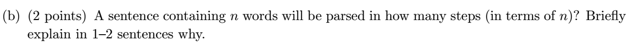</kbd>

> [!NOTE]
> Quay lại câu này sau.

 

<kbd>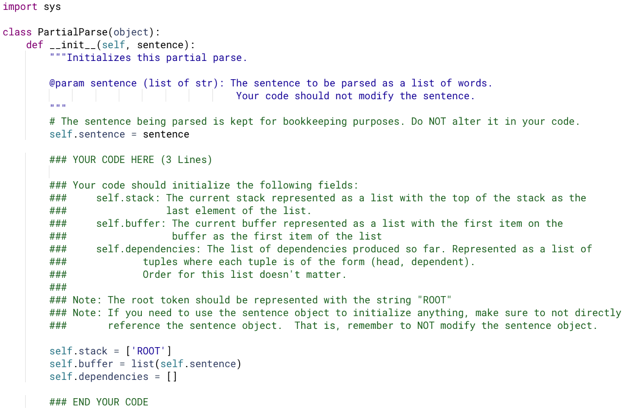</kbd>

<kbd></kbd>

<kbd>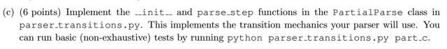</kbd>

> [!NOTE]
> đại khái là yêu cầu ta khởi tạo (chuẩn bị các thành phần cho việc
> dependency parser). Thế thì (theo yêu cầu, cũng như ta biết trong bài,
> là sẽ có 3 cái cần chuẩn bị: 1. là stack, 2. là buffer, 3 là một
> dependencies list.
>
> Thế thì cơ bản là chúng là ba cái list thôi, chỉ có cái là vì đóng vai trò
> khác nhau nên cách thức đưa item vào, lấy item ra sẽ khác. Với
> dependencies thì không care thứ tự. Chỉ có với stack, top item sẽ là cái
> cuối trong list, nên add item vào stack sẽ dùng append(), để item mới
> vào sẽ nào cuối. Lấy top item ra sẽ dùng pop(-1), lấy cái second top
> item sẽ là pop(-2)
>
> Còn với buffer thì cái top item là cái đầu tiên, nên lấy ra cái top item sẽ
> là .pop()
>
> ===
>
> Vậy ta khởi tạo 3 cái list, với stack thì cho sẵn một item là 'ROOT'.
> Với buffer thì sẽ có các item là các item trong sentence (đã split thành
> từng từ), vì lí do họ nói là đừng có động vài sentence object, nên ta
> sẽ copy bằng = list(self.sentence), thay vì dùng luôn nó (= self.sentence)
>
> Còn dependencies thì cho list trống thôi

 

<kbd>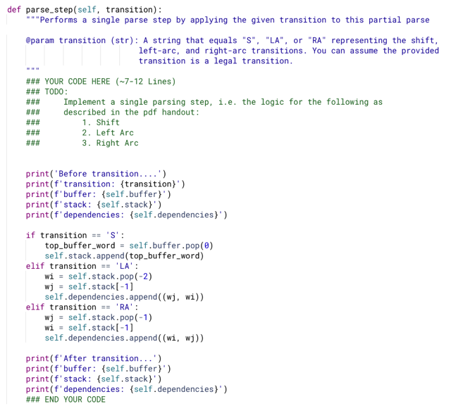</kbd>

> [!NOTE]
> thế thì như quy trình đã note kĩ trong lecture note, cứ thế mà làm chỉ có
> chú ý là dependency ở đây người ta có chỉ thị là sẽ là một tuple (head,
> dependent) tức là tuple hai từ, từ bị phụ thuộc (gốc của mũi tên) sẽ ở vị trí
> đầu, từ phụ thuộc sẽ ở vị trí thứ 2. Nói vậy là bởi trong note bài giảng nó
> có thêm r, để chỉ loại quan hệ nữa để thành triple (wi, r, wj).
>
> Với shift, ta chỉ lấy top word của buffer (=buffer.pop(0)), bỏ vào stack (stack.
> append())
>
> Với LA, như đã hiểu, ta sẽ tạo quan hệ wj->wi với wj là top (stack[-1],  wi
> là second top word (stack[-2] trong stack.
>
> Và bỏ đi từ second top ra khỏi stack.
>
> Vậy đầu tiên ta "lấy" từ head ra (wj = stack[-1]) và
>
> từ **LẤY wi RA KHỎI stack bằng cách:** wi = stack.pop(-2),
>
> sau đó tạo tuple (wj, wi) Và add vào dependencies
>
> ===
>
> Với RA, thì tạo quan hệ wi->wj, đồng thời lấy ra wj item khỏi stack luôn, 
> Thành ra lấy wj ra khỏi stack bằng pop(-1), thì trong stack cái từ wi đương
> nhiên trở thành top, nên 'lấy' bằng stack[-1].
>
> *Trong note, nhớ rằng lấy ra khỏi, ám chỉ việc dùng pop để loại từ ra khỏi
> list luôn, còn lấy thông thường ý là assign thôi

 

<kbd>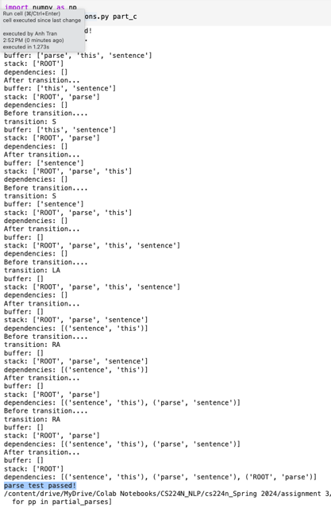</kbd>

> [!NOTE]
> parse test passed!

 

<kbd>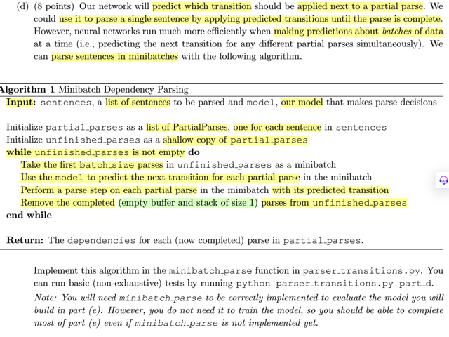</kbd>

> [!NOTE]
> rồi, đại khái là ở đây họ nói là như đã biết, ta sẽ dùng một nn để dự
> đoán bước (loại) transition tiếp theo trong quá trình ta thực hiện 
> dependency parsing, dựa trên configuration (tức trạng thái hiện tại
> của stack, buffer, A). Cái này thì biết rồi, nhưng ta sẽ không làm mỗi
> lần một câu, mà là làm song song nhiều câu, tức là thực hiện việc
> parsing nhiều câu cùng lúc.
>
> Do đó, tiếp theo mình sẽ implement một function, nhận vào một list
> nhiều câu, và một model. Để rồi làm theo thuật toán đại khái là 
> giống như prediction với một batch dữ liệu vậy.
>
> **Đại ý thuật toán sẽ là:**
> Chuẩn bị một list các PartialParses object mới làm ở trên, mỗi cái cho 
> mỗi câu. Và chuẩn bị một list 'shallow' copy của nó, cái list này
> mục đích là để theo dõi và kết thúc vòng lặp, vì ta sẽ chạy vòng lặp
> chừng nào cái lít này (unfinished_parses còn chưa rỗng), và trong
> vòng lặp, mỗi khi một PartialParse nào xong, thì remove nó ra khỏi
> unfinished_parses.
>
> Lần lượt lấy từng batch các parse (PartialParse) object (số lượng 
> = batch_size) ra, để rồi:
>
> Ta mới dùng model để dự đoán cái transition tiếp theo cho mỗi partial
> parse object.
>
> Dự đoán xong, thì thực hiện parse theo cái transition dự đoán đó.
>
> Và làm cho đến khi mọi câu trong batch đều ở trạng thái terminal
> là khi buffer rỗng và stack chỉ còn root.

 

<kbd>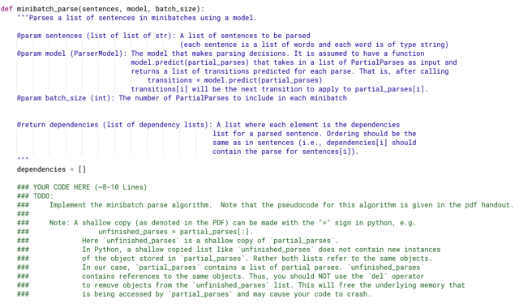</kbd>

> [!NOTE]
> Function này sẽ nhận list các sentences, với batch_size và model. Với
> model được phép cho rằng có function predict(partial_parses) để nhận
> một list các partial parses object, và dự đoán next transition cho mỗi cái,
> tức là nó sẽ trả ra một list các transition tương ứng cho mỗi partial
> parses. Để rồi cái transition đó có thể được dùng trong lệnh parse() của
> partial parse object để thực hiện động tác parse theo sự dự đoán của
> model.
>
> Function này sẽ trả ra list (tương ứng với mỗi sentence) đưa vào, các
> list các dependency của mỗi sentence
>
> ===
>
> Ở đây có nhắc tuồng cho ta là với shallow copy thì unfinished_parses
> sẽ chỉ chứa reference tới cái parse object chứa trong partial_parses,
> nên để thực hiện động tác remove cái đã parse xong ra khỏi unfinished_parses
> thì ta không dùng .del()

 

<kbd>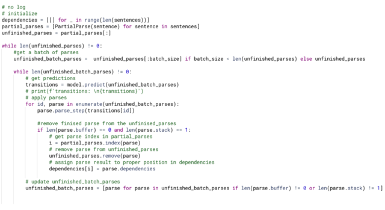</kbd>

> [!NOTE]
> Cái loop ngoài cùng là "cho đến khi unfinished_parses" rỗng thì dừng
>
> Với mỗi một batch các parse object, ta sẽ:
>
> Khi lấy batch, phải kiểm tra số lượng còn lại có đủ batch_size hay không.
>
> 1. Đưa vào để model dự đoán transition.
>
> Loop qua từng parse: 
>
>    - Áp dụng bước dự đoán đó.
>
>    - Áp dụng xong thì kiểm tra xem parse xong chưa, nếu xong thì :
>       + remove khỏi unfinished_parses (dùng lệnh remove, khỏi cần biết id)  
>       + gán kết quả vào list dependencies (trả ra), thì cái này ta cần biết
>       cái id của parse object trong cái list gốc partial_parses vì ta cần result
>      nó phải tương ứng với list sentence input.
>
>    - Sau đó phải update lại batch, nếu còn parse thì tiếp tục, hết thì thoát
> ra để lấy batch tiếp theo.

 

<kbd>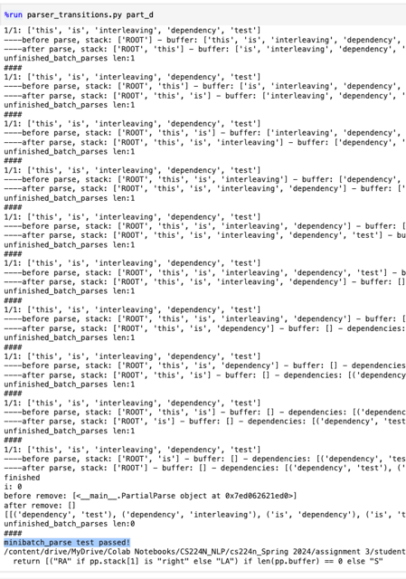</kbd>

> [!NOTE]
> minibatch_parse
> test passed!

 

<kbd>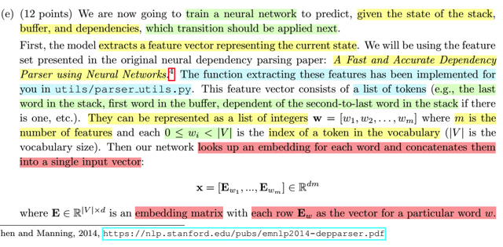</kbd>

> [!NOTE]
> đại khái là, nguời ta đã chuẩn bị giùm function giúp extract feature vector,
> có thể hiểu là nó giúp "chuyển đổi"/"mô tả" một configuration / trạng thái
> (của stack, buffer, dependency arc) thành một "feature vector" có dạng là
> một list các word indices. w = [w1, w2...wm], m coi như số feature
>
> Cái chúng ta làm, (neural net) thì đầu tiên ta sẽ dùng embedding matrix
> có shape là |V|xd mỗi hàng là một embedding vector tương ứng của một
> từ trong vocabulary, để rồi từ w =[w1, ..wm] ta có các vector embedding 
> Ew1, Ew2 ...Ewm. Để rồi ta sẽ concatenate hết chúng lại thành một vector
> dài m*d phần tử.

 

<kbd>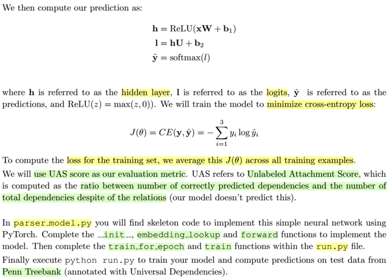</kbd>

> [!NOTE]
> rồi, có thể hiểu ở đây ta làm đơn giản hơn trong lecture và lecture note. Khi
> feature vector chỉ là từ embedding vector, chứ không có POS, hay loại
> dependency.
>
> Thế thì từ vector x, ta sẽ đưa nó qua hidden layer, apply hàm relu trước khi
> qua thêm một affine layer nữa để output ra vector có 3 class scores (3 loại
> transition) rồi cho qua softmax để chuyển thành probability.
>
> Negative log prob loss trên một training sample L(i)= - sum I=1,2,3 y_i*logy^_i
> và trung bình loss trên toàn training set để có cost J.
>
> Ta sẽ viết các function train model và evaluate nó với chỉ số UAS, là tỉ số giữa
> các dependency được xác định đúng trên tổng số dependency (không kể loại
> của dependency, vì ta không predict cái này, mà chỉ predict từ nào  depend từ
> nào thôi)

 

<kbd>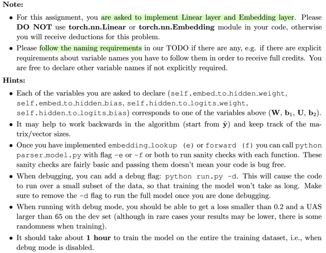</kbd>

> [!NOTE]
> phần hint và note này đại ý là, ta sẽ không dùng module nn.Linear hay 
> nn.Embedding mà sẽ tự "làm". Thế thì như đã biết, hidden layer thực hiện 
> một affine (linear transformation Wx, shift: + bias b1), nên nếu tự làm thì 
> cơ bản layer này chỉ là phép nhân input x với matrix W và cộng bias b1. 
>
> Theo gợi ý, ta sẽ đặt tên cho nó trong code là self.embed_to_hidden_weight
> và self.embed_to_hidden_bias.
>
> Và matrix W sẽ có shape là (hidden_dim,  input _dim), b1 có shape là 
> (hidden_dim,).
>
> Thế thì, ta sẽ dùng cái nn.Parameter layer, khởi tạo nó với một tensor, 
> requires_grad = True.

 

<kbd>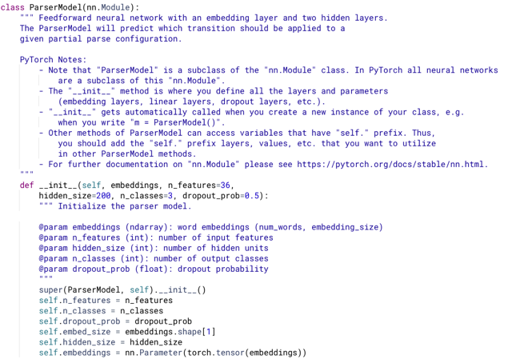</kbd>

> [!NOTE]
> phần này ta sẽ extend một nn.Module, ở đây cho biết trong pytorch, mọi
> nn model đều là subclass của nn.Module. Thì trong __ini__ là nơi ta define
> mọi thứ, bên 231n ta nhớ họ nhắc phải gọi super.__ini__() cũng như là
> trong forward thì không được tạo layer.
>
> bằng cách gán self. vào variable ta sẽ kiểu như có public global variable
> để có thể access variable từ bên ngoài.

 

<kbd>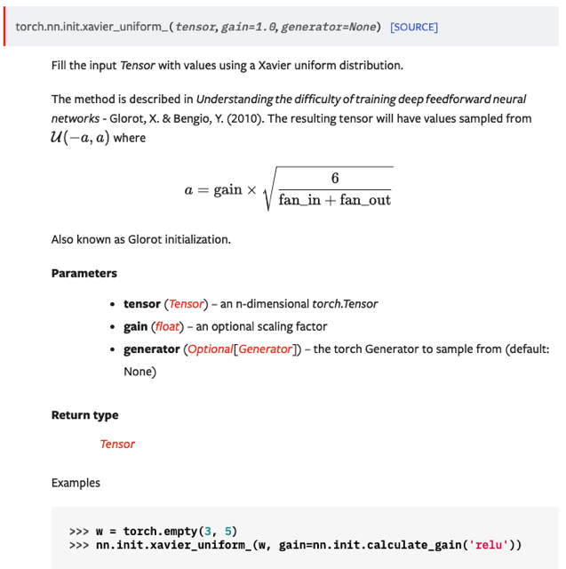</kbd>

<kbd>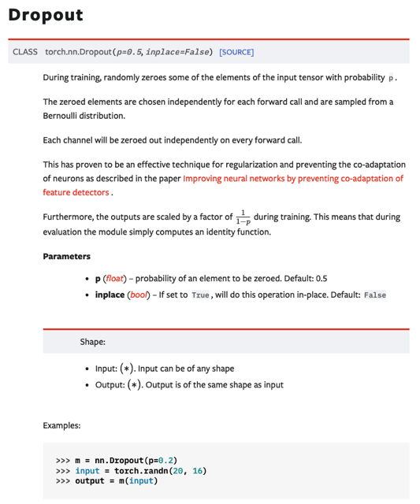</kbd>

<kbd></kbd>

<kbd></kbd>

<kbd>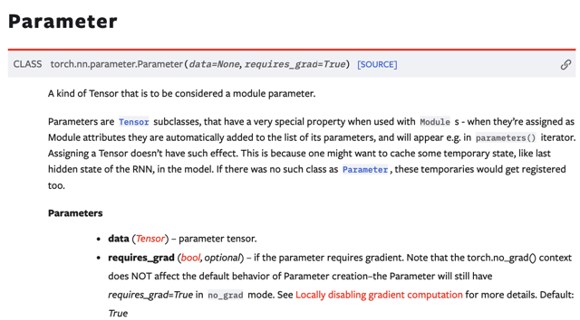</kbd>

 

<kbd>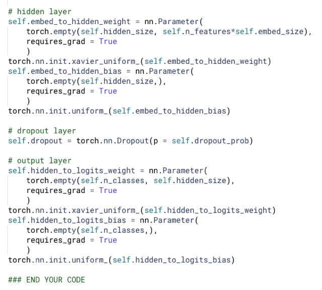</kbd>

> [!NOTE]
> có thể hiểu đại khái là khi khai báo nn.Parameters, pytoch sẽ biết
> nó (vốn cũng là pytorch tensor) là parameters của nn model (nn.
> Module) để rồi sẽ "cho nó vào / tính nó vào" model.parameters()
>
> Khởi tạo nó yêu cầu một tensor, nhưng vì ta sẽ bỏ nó vào init.xavier
> _uniform_() để cái này giúp khởi tạo random theo Xavier technique
> nên khi khởi tạo Parameters, mình dùng empty tensor.
>
> Tương tự với bias. Cũng như là weight và bias của output layer.
>
> Ở đây người ta không yêu cầu tự làm dropout layer, nên ta dùng
> nn.Dropout

 

<kbd>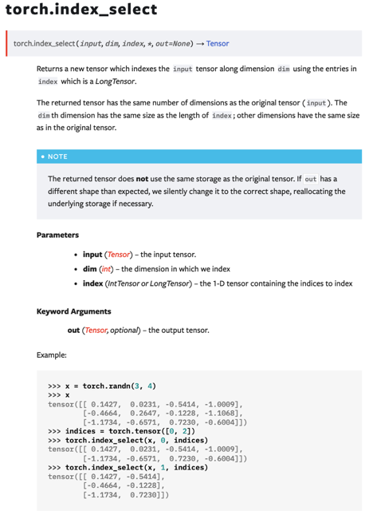</kbd>

<kbd>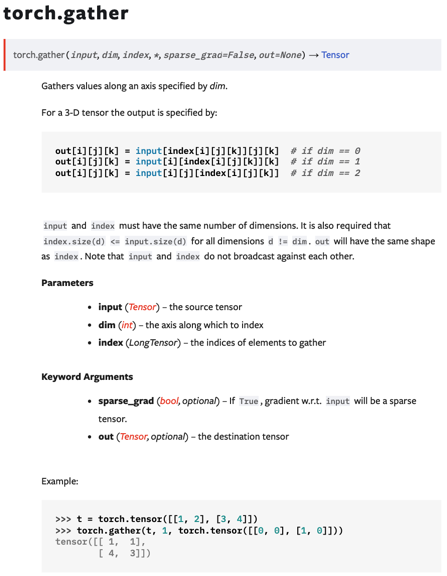</kbd>

<kbd>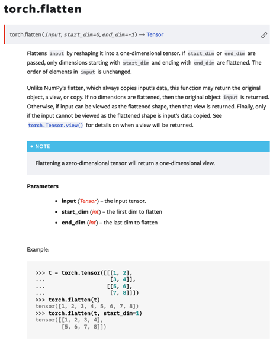</kbd>

<kbd></kbd>

<kbd></kbd>

<kbd></kbd>

<kbd>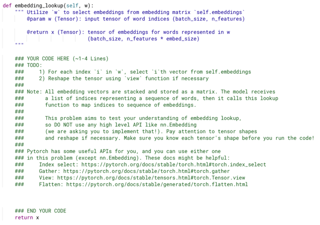</kbd>

> [!NOTE]
> rồi, cái này họ yêu cầu mình làm cái function dùng để ' lookup' embedding.
> Đưa vào một batch, các feature vector, mỗi feature vector là một ..vector với
> các feature là các word indices (trong vocab)
>
> Và trong này ta sẽ dùng cái embedding matrix (self.embeddings có shape
> num_words x embedding_size num_words chính là vocab size |V|
>
> Và ta phải làm những việc sau:
>
> 1/ Thực hiện việc look up: dùng embedding matrix để 'lấy' tương ứng cái
> hàng dựa trên word index ra. Như vậy một feature vector có n_feature unit
> sẽ trở thành một matrix có shape: (n_feature x embed_size).
>
> (Cái ý For each index 'i' in 'w', select 'i'th vector from self.embeddings ý là
> mỗi giá trị trong w là một word id, ví dụ bằng 3, thì cái embedding vector
> ứng với nó chính là cái vector (hàng) thứ 4 (index = 3) trong embedding 
> matrix).
>
> 2/ Theo yêu cầu ta phải (với mỗi feature vector sau khi lookup) ta phải 
> concatenate, n_feature embedding vectors đó để thành ra một vector lớn
> có độ dài n_feature*embed_size. Nên output mới là một matrix batch_size*
> n_feature*embed_size.
>
> Trong hint có gợi ý một số công cụ trong qúa trình làm đó là index_select,
> Gather, view, flatten.

> [!NOTE]
> đại ý là giúp ta "lấy" (select) từ một tensor, bởi một list các
> index, theo một trục nào đó. Ví dụ, lấy hàng 0,2 (hàng->
> dim=0, index=[0,2]) từ một input matrix

 

<kbd>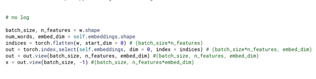</kbd>

> [!NOTE]
> Như đã thấy torch.index_select giúp 'chọn' ra từ một tensor, dùng list
> các indices, và yêu cầu dimension mình cần.
>
> Thế thì từ w là một matrix mỗi "sample" là một hàng = feature vector, 
> mỗi feature là word id chính là một id mà ta cần "lấy" từ matrix embedding
>
> Do đó trước tiên ta sẽ flatten w ra thành một vector, gọi là indices, để
> dùng trong torch.index_select. Giống như ví dụ mẫu của hàm này trong 
> document, ta cần lấy ra các hàng từ tensor embedding nên dim là 0.
>
> Kết quả là matrix có số hàng là chiều dài vector indices, mỗi hàng đương
> nhiên là embedding vector.
>
> Thế thì lúc này ta chỉ cần reshape lại để ra lại 3D tensor (hay như fastai
> gọi là rank 3 tensor) có shape (batch_size, n_features, embed_dim)
>
> Sau đó, nhiệm vụ là concatenate mọi (n_feature) embedding vector trong 
> một sample lại thành một vector lớn. Thì việc này hoàn toàn có thể làm
> chỉ bằng reshape tensor 3D này thành 2D tensor có shape batch_size, 
> n_features*embed_dim
>
> Vì bản chất khi reshape như vậy thì pytorch nó cũng concatenate các
> embedding vector với nhau

 

<kbd>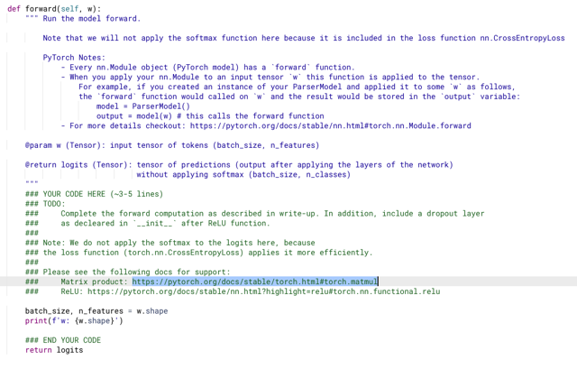</kbd>

> [!NOTE]
> phần ghi chú họ nhắc lại cho ta nhớ là với nn.Module, thì khi pass input
> tensor vào object Theo kiểu model(x) thì nó sẽ gọi x với function forward()
> vậy thôi.
>
> Thế thì function này ta sẽ thực hiện các tính toán của quá trình forward
> prop từ input qua hidden layer, apply non-linearity reLU và output layer.
>
> Không tự bỏ qua softmax vì cái này nó gộp trong cross entropy loss function
> rồi. Hay nói cách khác là ta chỉ tính ra logits hay class scores.
>
> Lí do là gì thì ta nhớ lại đã học bên cs231n đại khái là việc kết hợp tính
> log prob sẽ giúp hiệu quả hơn là tính prob (với softmax) sau đó mới log.

 

<kbd>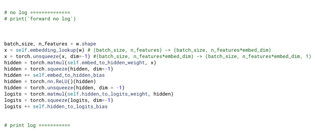</kbd>

> [!NOTE]
> đã có kinh nghiệm từ cs231n, cái chính là ta theo dõi và đảm bảo
> shape các tensor phù hợp. Với hai case điển hình:
>
> (N, M) @ (B, M) @  ta cần unsqueeze = thêm dimension cuối để 
> (B,M) -> (B,M,1) để thành (N, M) @( B,M,1)
>
> Khi đó thì pytorch sẽ tự thêm 1 dimension ở đầu để (N, M) thành (1, N, M) 
>
> Lúc này (1, N, M) @ (B, M, 1) sẽ tương đương (broadcast)  để thành 
>
> (B, N, M) @ (B, M, 1) và cho ra kết quả (B, N, 1)

 

<kbd>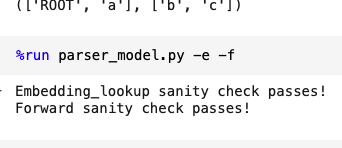</kbd>

> [!NOTE]
> Passed!

 

<kbd>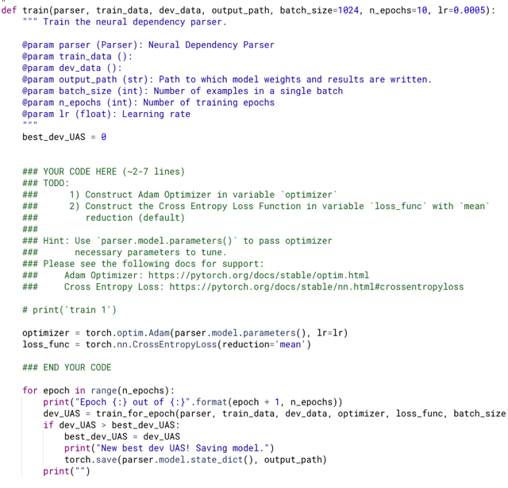</kbd>

> [!NOTE]
> Function này sẽ thực hiện việc train model, việc của mình là dùng
> khởi tạo optimizer với torch.optim.Adam, với input là model.parameters() và 
> nn.CrossEntropyLoss.
>
> Sau đó (phần này người ta làm giùm) cũng rất quen thuộc từ bên fastai,
> trong đó đại khái là:
>
> - iterate qua từng epoch
>
> - trong mỗi epoch, gọi function "train một epoch", pass vào cho nó model,
> training set, validation set (ở đây là dev_data), loss function, optimizer.
>
> Function "train một epoch" sẽ đảm nhiệm việc ..train một epoch, trả ra cho
> mình "validation score" sau một epoch, ở đây là chỉ số UAS.
>
> Để rồi ta sẽ save cái validation score tốt nhất

 

<kbd>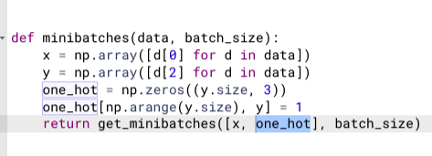</kbd>

<kbd></kbd>

<kbd>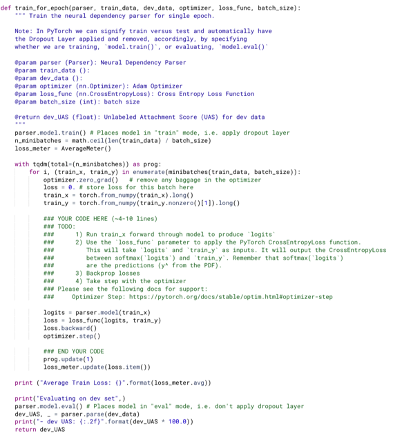</kbd>

> [!NOTE]
> rồi, xét tới function "train một epoch", với các input như đã nói, nó
> sẽ "phân training set" ra từng batch
>
> Trong đây ta thấy họ sẽ dùng function minibatches() trong parser_utils
> giúp lấy ra một batch data, bao gồm feature vector, và chuyển label
> thành one hot vector
>
> Để rồi, thực hiện các bước quen thuộc, như reset grad (optimizer.zero_grad())
>
> pass batch dữ liệu vào model để có prediction (logits)
>
> Bỏ batch predictions và labels vào loss, để tính loss.
>
> Gọi loss.backward() để backpropagation
>
> Và optimizer.step() để nó adjust params dựa trên gradient
>
> Ra khỏi vòng lặp, tức là kết thúc một epoch, ta sẽ eval() để chuyển model
> sang trạng thái testing, tính validation scores bằng cách bỏ dev_data vào
> parse() của parser (không phải model) mà là parser object trong pareser_utils,
> để trả ra dev_UAS.

 

<kbd>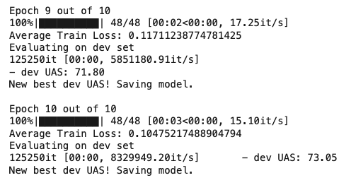</kbd>

<kbd>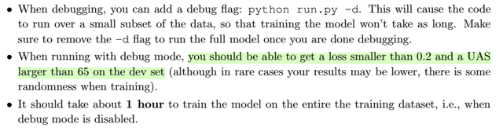</kbd>

<kbd></kbd>

<kbd></kbd>

<kbd>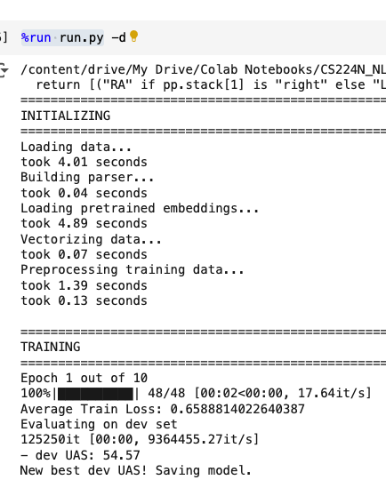</kbd>

> [!NOTE]
> Run với debug đạt loss < 0.
> 2 và UAS = 73 > 65 on dev set

 

<kbd>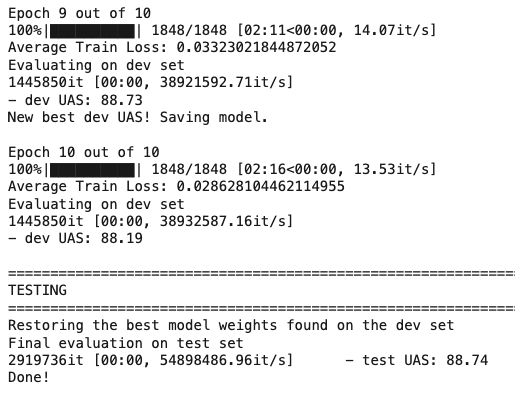</kbd>

<kbd>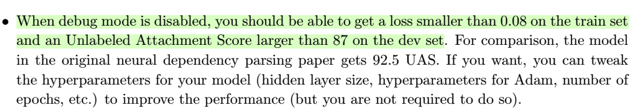</kbd>

<kbd></kbd>

<kbd></kbd>

<kbd>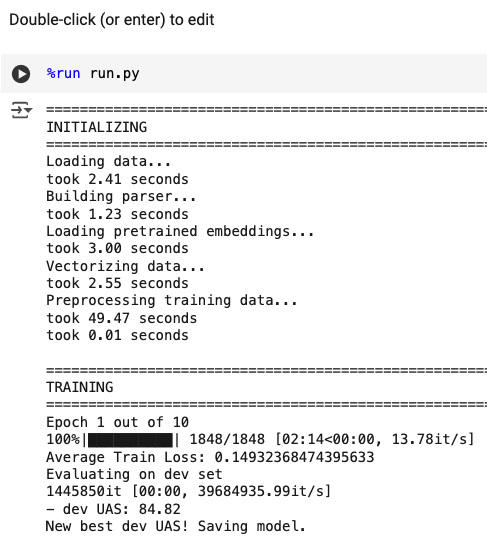</kbd>

> [!NOTE]
> Run no debug để train với full dataset, sau 10 epoch đạt loss 0.
> 02 < 0.08 dev UAS 88 > 87 như yêu cầu

> [!NOTE]
> Quay lại hyperparam tuning sau

 

<kbd>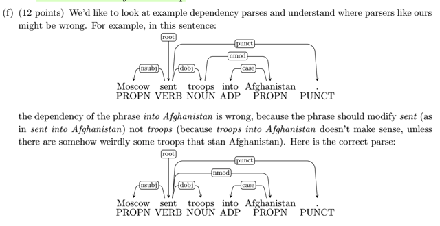</kbd>

> [!NOTE]
> đại khái là câu này ta sẽ phân tích xem những nguyên nhân có thể dẫn
> tới model đoán sai. Ví dụ trong câu này, "into Afghanistan"  phải modify
> cho "sent" chứ không phải cho "troop",  hay "sent" phụ thuộc vào "
> Afghanistan" chứ không phải "troop" phụ thuộc
>
> Vì into Afghanistan là bổ nghĩa cho "được gửi đi" - gửi đi đâu - đi
> Afghanistan chứ không phải là "troop" (quân) gì, quân Afganishtan

 

<kbd>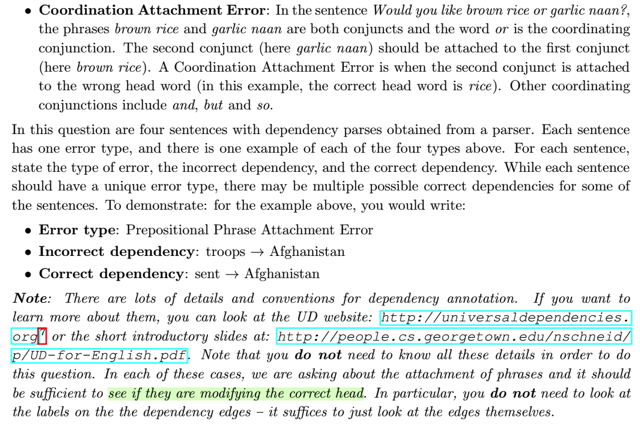</kbd>

<kbd></kbd>

<kbd>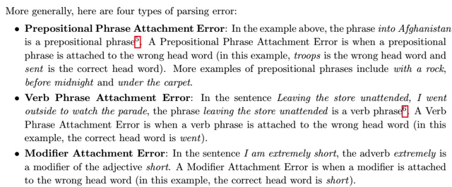</kbd>

> [!NOTE]
> tiếp theo họ cho biết cái loại lỗi trong ví dụ vừa rồi gọi là Prepositional
> Phrase Attachment Error tạm dịch là "lỗi trong việc gắn kết cụm giới từ"
> - thì đại khái là gắn sai quan hệ của cụm giới từ.
>
> Vậy có các loại lỗi khác là 
>
> Gắn sai quan hệ của cụm động từ (Verb Phrase Attachment Error)
>
> Gắn sai quan hệ bổ nghĩa (Modifier Attachment Error)
>
> Và Lỗi gắn kết phép liên hợp (Coordination Attachment Error)
>
> Vậy yêu cầu cho ta là phân tích xem mấy câu dưới là thuộc loại sai nào
> và sai ở đâu, sửa lại sao cho đúng. Chú ý không quan tâm cái loại, 
> mà chỉ quan tâm quan hệ (đầu và đích mũi tên).
>
> Cho biết thêm trong mỗi câu, có một loại lỗi thôi, và trong mấy câu dưới 
> thì sẽ mỗi loại lỗi có một câu.

 

<kbd>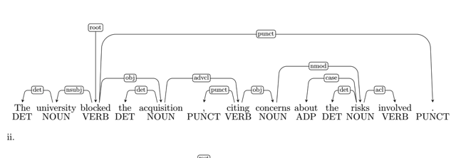</kbd>

> [!NOTE]
> Quay lại trả nợ câu
> cuối này sau

 

<kbd>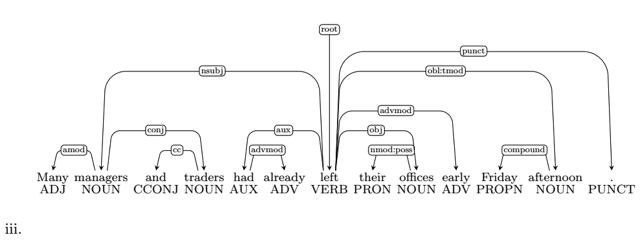</kbd>

 

<kbd>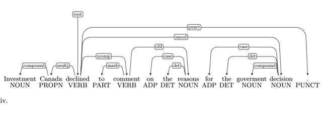</kbd>

 

<kbd>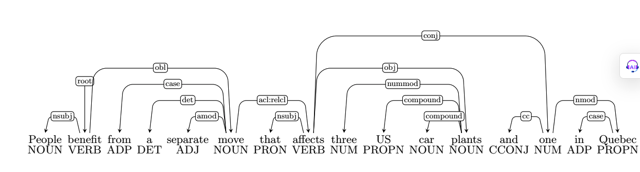</kbd>

 

<kbd>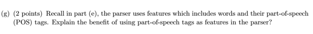</kbd>

> [!NOTE]
> Quay lại trả nợ câu
> cuối này sau

 

