# Assignment 4 - NMT

📊 **Progress:** `26` Notes | `70` Screenshots

---

<kbd>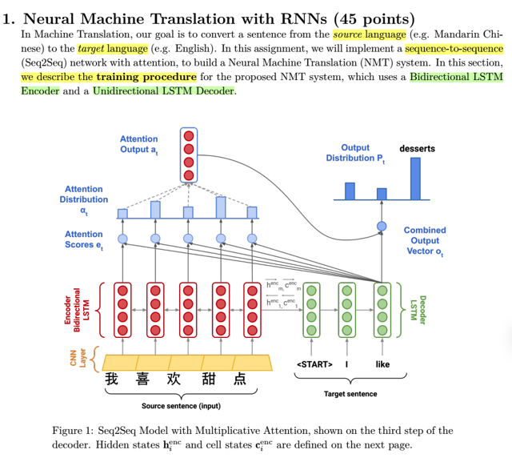</kbd>

> [!NOTE]
> Thử mô tả cách là theo hình vẽ này:
>
> **Source sentence** được xử lý bởi **encoder RNN**, như nói ở đây, là một **Bidirectional LSTM**, để rồi ta
> sẽ **lấy hidden state của last step**, **pass qua cho decoder**, là một Uni-Directional RNN, dưới dạng **initial
> hidden state** h0.
>
> Tại decoder, tại mỗi time-step t, với **input xt** (ở time-step đầu là **<START>**, **ở time-step sau là
> prediction của time-step trước đó**) và **hidden state** **h_t-1**, ta sẽ **tính ra h_t**, cái này thì là RNN bình
> thường.
>
> Từ h_t, thay vì qua một affine và softmax để có y^, h_t sẽ thực hiện một **Attention mechanism**. Cụ thể là
> nó sẽ **tham gia với các hidden state của encoder, thành từng cặp**, mỗi cặp sẽ tham gia (dùng một function
> tính toán sự tương đồng giữa hai vector, như dot product, hay cosine similarity hay cs231n thì có thể dùng
> một MLP - một FC nn) tính toán ra để ra**attention scores**. Sau đó **dùng softmax để chuyển thành
> attention weights**.
>
> Và dùng các **weights này làm trọng số để tính toán ra một weighted sum các hidden state của encoder**.
> Gọi là **context_t**. Và nó sẽ được **concatenate với h_t** để rồi mới **pass qua một affine / softmax và tính
> ra y^**

 

<kbd>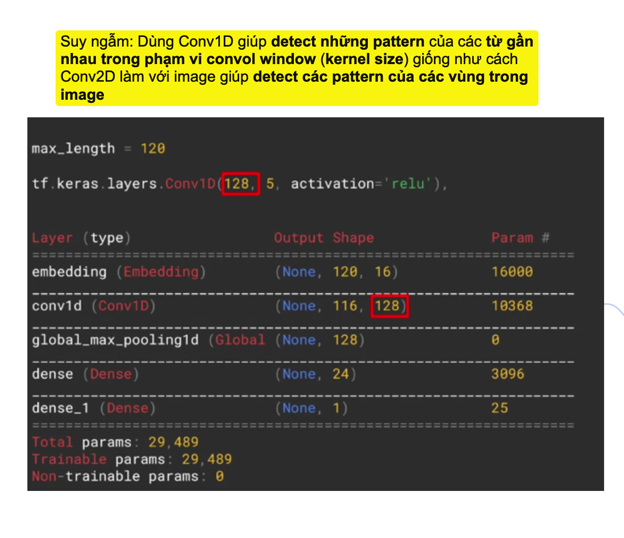</kbd>

<kbd></kbd>

<kbd>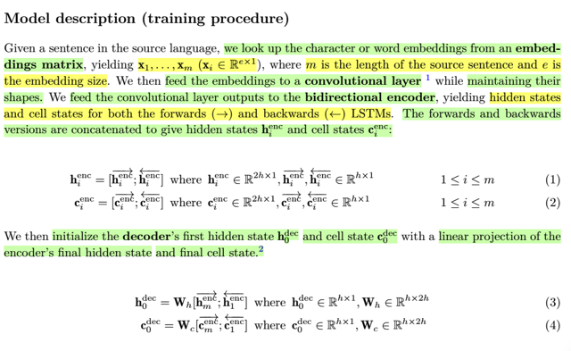</kbd>

> [!NOTE]
> === Embedding & Conv1D
>
> Đầu tiên, ta sẽ dùng **embedding matrix** để look-up / **chuyển word** hoặc
> **character token id**, hay **one-hot vector** **thành e-dimensional word  embedding
> vector** R**(e,1).
>
> Từ một **chuỗi m token id** của source string, ta có **chuỗi m e-D embedding  vectors.**
>
> Ta mới pass embeddings này vào **một convolutional layer**. Chỗ này có thể tạm thời
> đoán rằng, giống như đã từng thấy trong khóa học TDPC của  deeplearning.ai bài
> toán nlp. Trong đó, **Conv1D có thể được dùng để  "learn / capture" các quan hệ giữa
> các từ trong một phạm vi gần**.
>
> Có thêm ý ta sẽ **giữ nguyên shape khi qua cái conv layer**, ở đây có thể  hiểu là
> dùng s**ame padding**, **để input sequence và output ra khỏi conv  layer đều có
> length bằng nhau.**
>
> Có thể hiểu, conv1D sẽ giống như giúp "chuyển hóa" lại embedding vector  mà **mỗi
> từ chỉ chứa thông tin riêng của nó**, thì sau khi qua conv layer,  nó có thêm **có thêm
> thông tin context của vài từ gần đó** (trong **phạm vi  kernel size**)
>
> ====
>
> Sau đó, ta sẽ bắt đầu **feed vào Bidirectional LSTM**. Thế thì với Bidirectional  LSTM
> ta có hiểu như là **input vào hai cái LSTM** (mỗi cái **hidden state size h**),
>
> Một cái thì **đi xuôi**, tức là làm như thông thường, bắt đầu với (embedding) từ đầu
> tiên, h0, để tính ra h1, từ h1 tính ra y^1 và với y1 (chính là one-hot encoded của từ thứ
> 2) để tính ra loss L1, tiếp tục vậy tính ra h2,....đến hT.
>
> Một cái thì **đi ngược**, tức là đưa embedding của từ thứ T, xt vào với h0 (có thể coi
> là h_T+1) để tính ra hT, rồi y^T, dựa vào yT chính là x_t-1 để tính ra LT, tiếp tục vậy đi
> ngược lại tính h_t-1,....h1
>
> Xong xuôi hết thì ta mới **concatenate các hidden state tại mỗi time-step** của hai
> LSTM "xuôi" & "ngược" **để thành ra (tạm gọi là) bidirectional hidden state có
> dimension là 2*h)**. Tương tự, là **cell state cũng vậy.**
>
> Thế thì, ta mới dùng cái **"concatenated" hidden state ở time-step cuố**i của encoder
> để **initialize cho h0 của decoder**, trước đó có thể hiểu phải qua một **linear
> projection (transformation với W) để từ 2*h dimensional vector còn h dimensional
> vector.** c0 cũng vậy

 

<kbd>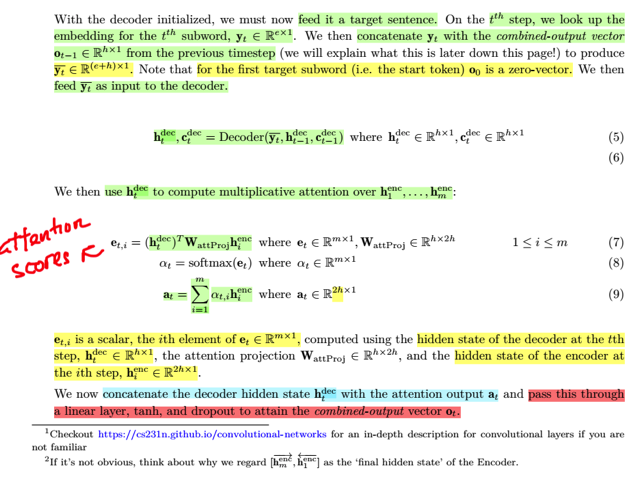</kbd>

> [!NOTE]
> Rồi, **qua decoder**, với **h0, c0 đã initialized**, tại **mỗi time-step t như thường lệ ta sẽ feed
> input** bắt đầu là <START> "vector", dự đoán ra từ tiếp theo.
>
> Về kí hiệu ở đây, họ nói ta**look up embedding cho t_th** **subword để có yt** là **embedding
> vector size e**, thì cái này y như ở encoder thôi. Nhưng ta hiểu ở đây, vì đang nói về **giai
> đoạn training**, nên **word đưa vô chính là các từ trong câu target**. Nếu gọi **x_dec** là input
> của decoder đi, thì:
>
> Tại **step 1**, x_dec_1 là **embedding của <START> token**, **target y1** chính là **id /
> one-hot vector của từ thứ 1 trong câu**.
>
> Tại **step 2**, x_dec_2 là **embedding của từ thứ 1**, **target y2** là id của **từ thứ 2**.
>
> ====
>
> Thế thì, ở đây nói **concatenate y_t với combined-output vector o_t-1 từ time-step trước**.
> o_t-1 là **concatenate của context vector tính bởi attention và hidden state của time-step trước
> h_t-1** (tí nữa sẽ nói)
>
> Nhưng ý chính là hiểu rằng **input vào decoder tại mỗi time-step,** tức là **x_dec_t** =
> **embedding của yt** thì ý nói là **[<START> + câu dịch mẫu]** đầu: Đây còn được gọi là**teacher forcing**
> cho phép model dự đoán từ tiếp theo với giả định là nó đã đúng hết ở các từ trước.
>
> Còn cái **chuỗi dùng làm target** thì là **[câu dịch mẫu + <END>]**
>
> Vậy thì khi **kết hợp y_t (concatenate) với o_t-1** để được **y_bar_t.** Nó****tham gia**cùng
> với h_t-1, c_t-1, tính ra h_t (*****)**
>
> **o_t**-1 là **context vector** tính từ **h_t-1 với attention ở bước t-1**, đã tính rồi, giờ **cho nó
> join vào tính ở step t luôn**. Đây là **ý mà gs Cris nói trong bài** giảng. Còn tại step t, **sau khi
> tính ra h_t, ta mới attention để có o_t**, và d**ùng o_t tính y^_t giúp dự đoán từ ở time-step t**.
>
> Có nghĩa là trong bước tính toán ở time-step t, có sự tham gia của**o_t-1** cùng với **input tại
> t** , cùng với hidden state, cell state time-step trước **h_t-1**, **c_t-1** để tính ra**h_t** mới.
>
> Rồi từ **h_t** mới **tham gia attention** để có attention output **a_t** (context), để rồi a_t
> (concatenate) với h_t tính ra u_t -> v_t -> **o_t** và **o_t sẽ dùng để tính y^_t**
>
> ====
>
> Nói về attention, thì như đã biết **h_t sẽ tham gia tính ra context_t**, trong bài giảng cs231n
> gọi là c, **ở đây là a_t**.
>
> Cái khúc attention thì biết rồi khỏi nói, chỉ có là **h_t_dec là h-unit vector**, còn **h_i_enc** (i từ
> 1 tới T (hay ở đây là m)) là **2h-unit vector**.
>
> Nên khi tính **attention scores**, nó sẽ có thêm cái **WattProj** để **chuyển h_i_enc từ 2h unit
> thành h-unit** vector.  Sau đó mới **dot product với h_t_dec** để tính **similarity score** đóng
> vai trò của **attention score**như đã biết
>
> Với attention scores qua **softmax** thành **attention weights**, để rồi tính một **weighted sum
> các h_i_enc (2h-d vector)** để thành **a_t (2h unit vector)**

 

<kbd>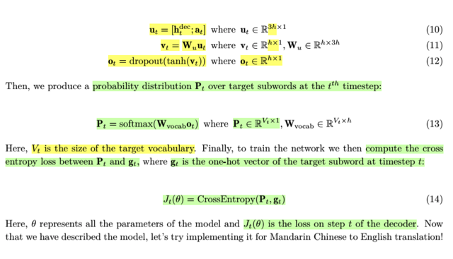</kbd>

> [!NOTE]
> Thế thì khi có **a_t**, ta lại **concatenate** nó với **h_t_dec** (bước này không có thấy nói trong các bài
> giảng để thành 3h-d vector u_t
>
> u_t linear transformer qua **Wu** để**giảm kích thước từ 3h-d còn 1h-d vector**, trước khi****apply**tanh() và dropout để thành o_t.**
>
> o_t sẽ linear transformed bởi Wvocab để tính vector các (unnormalized) class scores
>
> Sau đó hàm softmax sẽ biến nó thành probability over vocab dự đoán từ ở timestep t
>
> Tại đây mới dùng one-hot vector của target tại t để tính loss tại t J_t.
>
> Tới đây là xong time-step t
>
> ===
>
> Tiếp theo o_t sẽ tham gia với y
>
> **o_t mới concat với input của time-step t+1 = y_t+1 để trở thành y_bar_t+1**, ròi **cùng với h_t, c_t tính
> ra h_t+1** và tiếp tục những bước sau (giống như từ ***** ở note trước)

 

<kbd>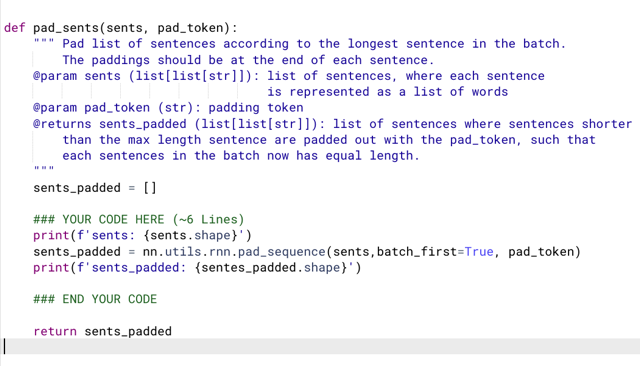</kbd>

<kbd>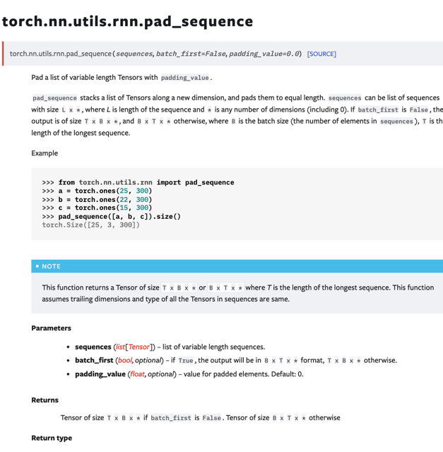</kbd>

<kbd></kbd>

<kbd></kbd>

<kbd>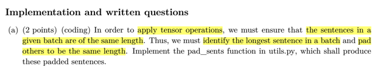</kbd>

> [!NOTE]
> Function torch.nn.utils.rnn. pad_sequence sẽ pad các sequence
> theo cái có length lớn nhất

 

<kbd>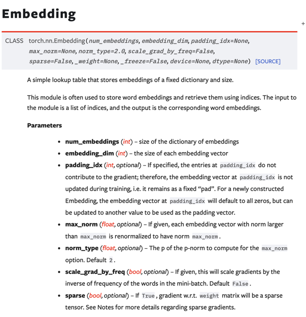</kbd>

<kbd></kbd>

<kbd>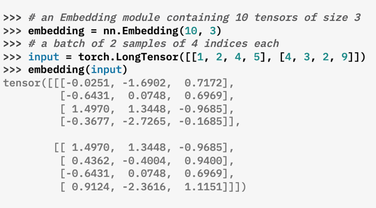</kbd>

> [!NOTE]
> Hiểu về Embedding layer:
>
> Nhớ lại rằng (NLPSpec CBOW) đã học **embedding** layer, **cơ bản chỉ là
> một cái matrix có shape là (V, D)**. Trong đó V là vocab size = số lượng từ
> vựng trong bộ vocab, D là embedding dimensions, thường được chọn là 512
> ví dụ vậy.
>
> Thế thì, cơ bản nó chỉ là như vậy, để **với một token id** đưa vào, nói rằng nó
> sẽ thực **hiện việc lookup** cũng được hay nói theo kiểu **chuyển index
> thành one-hot vector để thực hiện nhân với embedding matrix** cũng được,
> kết quả đều chỉ là **trả ra cái row vector ứng với vị trí của token id trong
> vocab**. Và đương nhiên embedding matrix là **learnable**, quá training,
> gradient sẽ flow về và sửa lại / learn cái embedding matrix, đồng nghĩa
> **learn các embedding vectors**.
>
> Hiểu ví dụ này, tạo **Embedding(vocab_size=10, embedding_dim=3)**. Thì nó
> sẽ tạo một matrix **10x3**. Mỗi row tại ith là một 3-d embedding vector cho
> idx = i tương ứng.
>
> Để rồi pass một tensor **(batch_size=2, sequence_length=4)**:  2 câu, mỗi
> câu có 4 từ
>
> thì output sẽ là **(batch_size = 2, sequence_length=4, embedding_dim = 3)**

 

<kbd>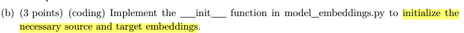</kbd>

<kbd></kbd>

<kbd>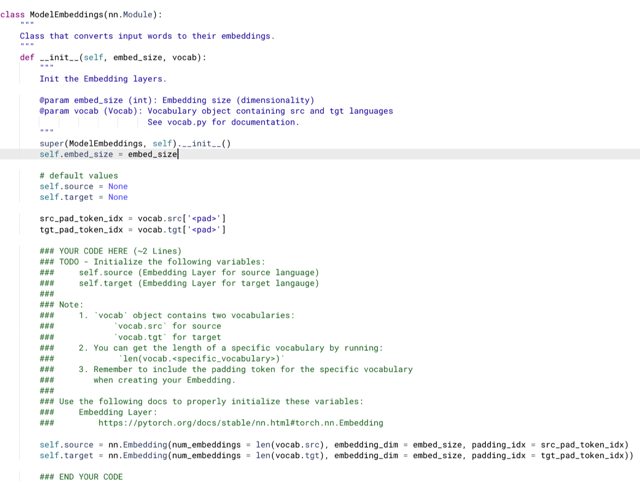</kbd>

> [!NOTE]
> Câu b yêu cầu ta sẽ implement __init__() function để initialize source embeddings và target
> embedding.
>
> Vậy thì đơn giản là initialize nn.Embedding, với num_embeddings sẽ là size của dictionary nên
> đối với source sentence, ta sẽ để là len(vocab.src) và với target sentence sẽ là len(vocab.tgt).
>
> Nói thêm, đây là bài toán machine translation, encoder nhận câu source cần translate, thì câu
> source sẽ được tokenize và thông qua embedding layer của source sentence để convert mỗi
> token id thành embedding vector. Ngược lại, tại decoder, câu dịch (target) cũng sẽ được tokenize
> và thông qua target embedding layer để chuyển thành các embedding vector. Đương nhiên câu
> dịch và câu  gốc là hai ngôn ngữ khác nhau nên vocab sẽ khác nhau. Còn với embedding_dim
> thì dùng chung.
>
> Còn argument embedding_dim thì dùng chung embed_size.

 

<kbd>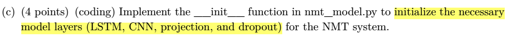</kbd>

<kbd>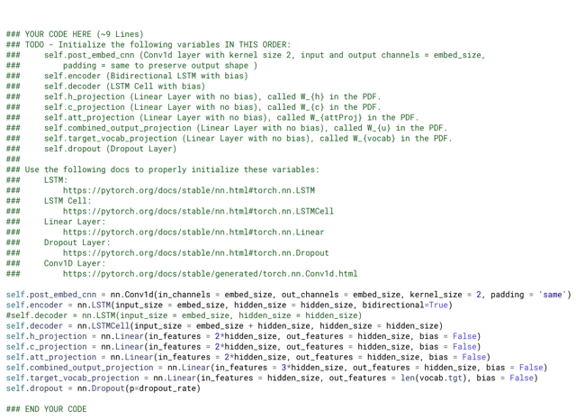</kbd>

<kbd>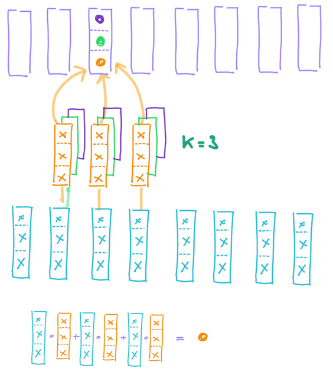</kbd>

<kbd></kbd>

<kbd></kbd>

<kbd></kbd>

<kbd>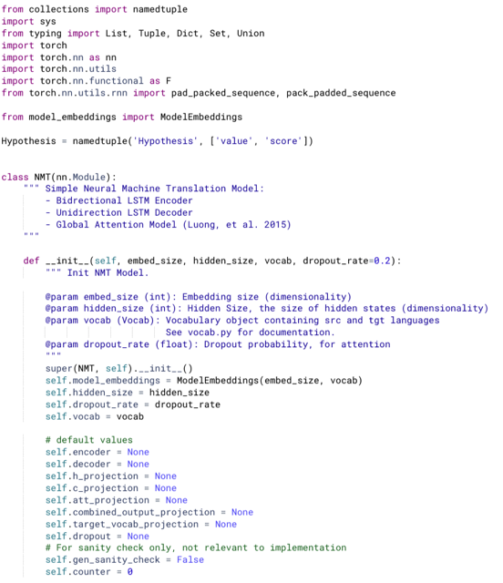</kbd>

> [!NOTE]
> **post_embed_cnn** sẽ là Conv1D layer, như mô tả, sẽ giúp convol một
> sequence các embedding vector để cho ra một sequence các vector đã
> nắm bắt / phản ánh short-term dependency.
>
> Hình dung như sau: với conv2d gọi input là tensor (C_in, H,W), thì mỗi
> filter sẽ cơ bản là giống như một tensor có shape (C_in,K,K) (K là kernel
> size) và nó sẽ "slide" qua các vị trí khác nhau để tính phép dot product
> giữa hai 3d tensor có shape (C_in,K,K), mỗi phép tính đương nhiên cho
> một vị trí, và khi nó slide hết thì tạo một "miếng" feature map. Chưa hết,
> layer sẽ có C_out filter, vậy tạo ra C_out feature map stack lại. Gọi H',W' là
> feature map width, height thì output của conv2d là (C_out,H',W')
>
> Với conv2d ở trên, mỗi phép dot product giữa filter có shape (C_in,K,K) và
> một phần của input cũng có shape (C_in,K,K) có thể được nhìn nhận theo
> cách khác là:  (C_in,K,K) có thể hình dung như một chồng các miếng KxK
> có độ dày C_in, hoặc hình dung như một bó (grid) KxK các vector có độ
> dài C_in, và việc dot product giữa hai tensor chỉ là lấy từng vector tương
> ứng vị trí dot product nhau, và cộng lại. Cho nên hoàn toàn tương đương
> ta "trải" cái bó vector này ra mặt bàn để từ (C_in,K,K) thành (C_in, K*K)
> mà không ảnh hưởng gì tới cách hiểu trên.
>
> Vậy thì quay lại việc chuỗi embedding, gọi là có shape (E, L) E là
> embedding size, L là độ dài chuỗi. Có thể hình dung trong conv1d, mỗi
> filter sẽ có shape là (E,K). E sẽ đóng vai C_in, để rồi phép conv sẽ là dot
> product của hai 2d matrix (E,K) này, và về bản chất cũng là tổng K kết quả
> dot product giữa hai vector độ dài E. Và mỗi filter tại một vị trí, khi conv sẽ
> cho ra 1 con số (để rồi L vị trí cho ra L con số xếp thành một chuỗi). Vậy thì
> ta sẽ có E filter, để tại mỗi vị trí ta có E con số, làm thành vector dài E và
> với L vị trí ta có L các vector dài E.
>
> Thế thì đương nhiên cần có padding để L vị trí sau khi conv vẫn cho ra L,
> cái này dễ hiểu.

> [!NOTE]
> conv1d nói bên kia.
>
> encoder sẽ là một nn.LSTM, nó sẽ nhận input là chuỗi embedding sau khi đã
> conv1d, để mà tính toán tuần tự bước (time-step), mỗi lần tính dựa trên một 
> embedding (của time-step hiện tại) và hidden state, cell state của time-step 
> trước đó. Trong bối cảnh của bài này, ta sẽ quan tâm đến mọi hidden state
> cụ thể là chúng sẽ tham gia với hidden state (đến từ decoder) trong attention
> mechanism.
>
> Vậy hyperparams của encoder LSTM sẽ có input_size, đương nhiên chính là
> embed_size, vì đã nói LSTM nhận input là các embedding vector sau khi qua
> Conv1d. Còn hidden_size là kích thước hidden state và cell state vector.
>
> Ngoài ra, với encoder, ta sẽ muốn nó "thấy toàn bộ" câu source, để nắm bắt
> đầy đủ nội dung ngữ nghĩa. Do dó ta sẽ dùng Bi-directional LSTM, thể hiện
> bởi argument bidirectional=True.
>
> ====
>
> với Decoder, theo yêu cầu, nó sẽ là một LSTM Cell (không phải LSTM nhé)
> lí do của sự khác nhau này là vì với Decoder, mình sẽ thực hiện một vòng
> lặp để mỗi lần tính toán prediction cho từ tiếp theo của câu dịch. 
>
> ====
>
> Cuối cùng là các Linear layer làm nhiệm vụ projection như h_projection hay 
> c_projection: đại khái là nó giúp transform / thay đổi chiều dài vector nên gọi
> là projection.

 

<kbd>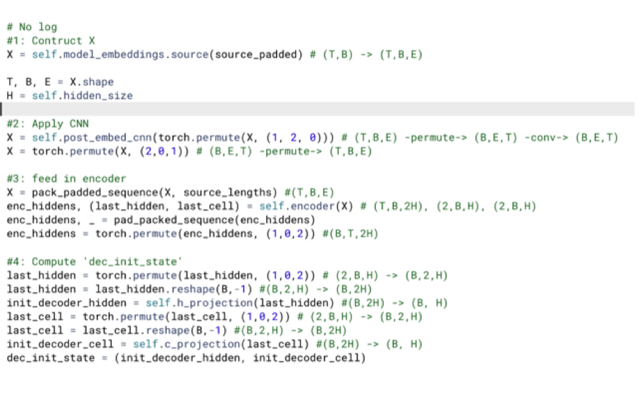</kbd>

<kbd>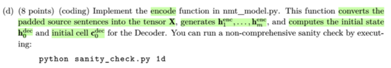</kbd>

<kbd>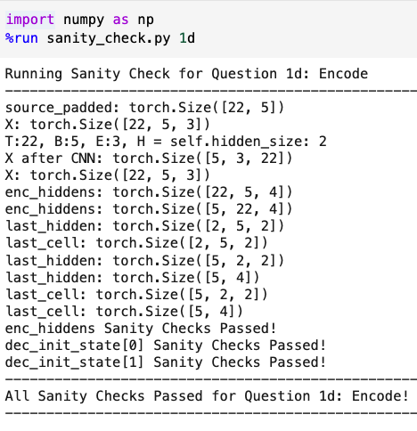</kbd>

<kbd></kbd>

<kbd></kbd>

<kbd></kbd>

<kbd>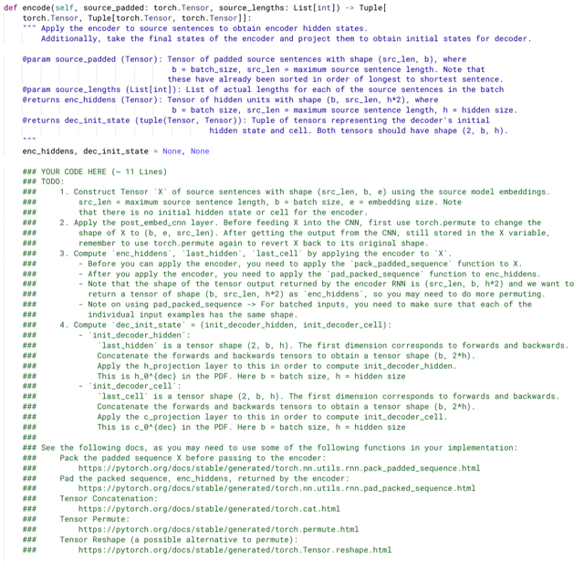</kbd>

> [!NOTE]
> ==== Embedding
>
> Đầu tiên, pass **source_padded** qua **model_embeddings.source -**là một  **nn. Embedding()**
> mà ta đã initialize ở trong ModelEmbedding module. Nó sẽ **chuyển mỗi token id từ input thành
> một embedding vector,** output sẽ 'mọc' thêm một E dimension thành **(T,B,E)**
>
> === CNN
>
> Tiếp theo pass X tensor qua **post_embed_cnn** là một **con1d module**, output sẽ vẫn giữ
> nguyên shape. Nhưng trước đó,**theo document Conv1d yêu cầu input shape là (N, Cin,Lin)**
> N=batch_size, Cin tức input dims, Lin tức là length, do đó ta sẽ cần **dùng torch. permute để
> chuyển shape thành (B,E,T)**. Sau khi convolution thì dùng permute để chuyển lại shape.
>
> ====Encoder LSTM
>
> Tiếp theo trước và sau khi pass qua encoder (là một LSTM), thì ta sẽ làm một **technique** đại
> khái là **giúp tăng sự hiệu quả** **khi làm việc với một batch** **các sequence** **có length dài
> ngắn khác nhau**.
>
> Đại ý là với một batch có câu dài, câu ngắn, tức các sequence input vào LSTM có số time-step
> khác nhau thì, kiểu như, **sẽ có sequence ngắn, LSTM vẫn phải tiếp tục process nó** **(với các
> pad token của nó)** trong**vì vẫn đang xử lý câu dài chưa xong**. Thành ra là **sự lãng phí tính
> toán**.
>
> Do đó, trước khi bỏ vào LSTM, ta sẽ **pack_padded_sequence(X, soure_lengths)**, với
> **source_lenths** là **list chứa chiều dài của các sequence**, nó kiểu như sẽ **tạo ra một cái
> (packed sequence)** có tác dụng **khi đưa vào LSTM, sẽ biết rằng với mỗi sequence cần xử lý
> tới đâu**, chứ không cần phải xử lý hết theo max_length. Nhờ đó hiệu quả hơn.
>
> Do đó, sau khi output từ LSTM, ta cần "**unpack**" bằng **pad_packed_sequence**. 
>
> Encoder (LSTM) sẽ trả ra:
>
> **enc_hiddens** có shape là **(T,B,2H)**, chứa **tất cả (T) hidden state** của encoder, và vì là **Bidirectional**
> nên dimension là **2H**  (Trong doc, output sẽ shape là [L, N, D∗Hout] với D là 2 nếu là Bidirection, L là 
> tương đương với T, tức sequence length và N tương đương B là batch size.
>
> **ht** và **ct**: **last_hidden** và **last_cell** (state). Đương nhiên là các hidden state và cell state của time-step 
> cuối. 
>
> Theo document, nó sẽ trả ra có shape là (D∗num_layers, N, Hout) với bidirectional D = 2, num_layers 
> bằng 1 vì ở đây chỉ xài một layer (vì có thể có multi-layer LSTM) nên ta có shape **(2, N, Hout)** hay **(2,B,H)**. 
> mang ý nghĩa là **2 bộ (B,H) một bộ tương ứng với chiều xuôi, một bộ tương ứng chiều ngược**
>
> Theo hướng dẫn, ta sẽ **concatenate hai vector tương ứng với chiều xuôi chiều ngược, thành một 
> vector**. Việc nay đơn giản chỉ là **permute thành (B, 2, H)** rồi **reshape lại thành (B,2*H)**. 
>
> Tiếp theo ta pass qua **h_projection** là một **nn.Linear** module, giúp **chuyển từ 2H vector thành 1H**, 
> dùng là initial hidden state của decoder (decoder là uni-direction)
>
> Với cell state cũng y hệt.
>
> Cuối cùng tạo tuple **init_decoder_hidden** và **init_encoder_hidden** là xong.

> [!NOTE]
> Rồi, nhiệm vụ là thực hiện encode function: trong đó nó sẽ convert chuỗi
> source sentence (đã được padded theo chiều dài của câu dài nhất trong
> batch) thành tensor X (chuyển token id thành embedding vector bằng cách
> dùng embedding layer)
>
> Tiếp tục, input X vào encoder LSTM để có các hidden state và cell state.
> Cuối cùng  dùng cái cuối cùng để initialize cho hidden state và cell state của
> decoder

 

<kbd>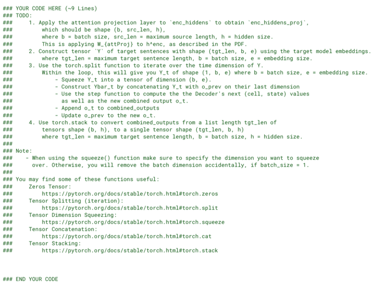</kbd>

<kbd>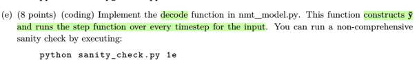</kbd>

<kbd>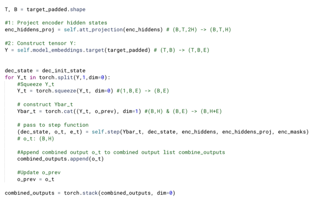</kbd>

<kbd>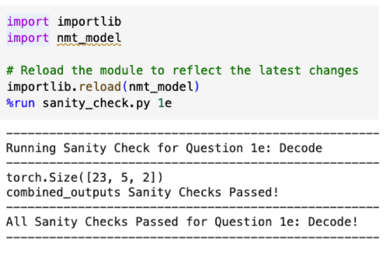</kbd>

<kbd></kbd>

<kbd></kbd>

<kbd></kbd>

<kbd></kbd>

<kbd>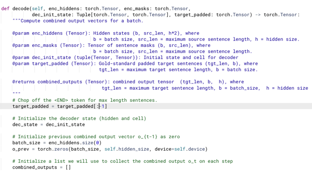</kbd>

> [!NOTE]
> Tiếp, nhiệm vụ là decode function. Nó sẽ construct y_bar và chạy một step function trên mọi time-step
> của input.

> [!NOTE]
> ===Project encoder hidden states
>
> Ta sẽ pass encoder hidden states qua **att_projection** (là một nn.Linear moule) để giảm vector từ 2H
> còn 1H, cái này sẽ **cùng tham gia trong mỗi step function** để **tính attention scores**.
>
> ===Construct target sentence Y
>
> Những gì xảy ra tại decoder RNN khi training sẽ là: Tại mỗi time-step, RNN cell sẽ nhận embedding
> của target embedding tại time-step đó, cùng với hidden state, cell state tại time-step trước, và context
> information do attention với encoder's hidden state (cụ thể xảy ra ở đâu thì tạm thời không quan tâm)
> để tính ra prediction tại time-step đó, mang ý nghĩa là phân phối xác suất over vocab cho từ tiếp theo
> của câu dịch. Để rồi cùng với cái từ đúng (chính là từ kế tiếp của target sequence) tính ra loss.
>
> Vậy ta lấy ví dụ với chú thích: 
>
> **câu target(*) là câu target đã bỏ đi <END>**, **câu target(**) là câu target  đã bỏ <START>**, ví dụ
>
> câu target: [e_<START>, e_"I", e_"like", e_"apple", e_<END>] 
>
> câu target(*)" [e_<START>, e_"I", e_"like", e_"apple"] 
>
> câu target(**) [e_"I", e_"like", e_"apple", e_<END>] 
>
> Thì tại các time-step:
>
> t=1: x_dec_1 =câu target(*)_1 = e_<START>,  h_dec_0, c_dec_0 ----LSTM cell ----> y^_1 là sự dự 
> đoán cho từ tiếp theo của <START>. Nên nó sẽ cùng target y_1 = câu target(**)_1 = e_"I" để tính loss_1
>
> t=2: x_dec_2 =câu target(*)_2 = e_"I",  h_dec_1, c_dec_1 ----LSTM cell ----> y^_1 là sự dự đoán 
> cho từ tiếp theo của "I". Nên nó sẽ cùng target(**)_2 = e_"like" để tính loss_2
>
> t=2: x_dec_3 =câu target(*)_3 = e_"like",  h_dec_2, c_dec_2 ----LSTM cell ----> y^_2 là sự dự đoán 
> cho từ tiếp theo của "like". Nên nó sẽ cùng target(**)_2 = e_"apple" để tính loss_3
>
> =====
>
> Thế thì function này nhận vào **target_padded**, là một batch các sentences (token id), mà mỗi câu có 
> **bắt đầu và kết thúc với <START> token và <END> như nói ở trên**. Vậy để chuẩn bị chuỗi **target(*)** 
> - tạm gọi là phiên bản được input vào decoder RNN, ta **sẽ cắt đi cái <END>**
>
> **target_padded = target_padded[:-1]**(line này họ làm giùm ở đầu function)
>
> Tiếp Theo **pass target sentence target_padded qua ModelEmbedding.target**, là một **nn.Embedding** 
> đã chuẩn bị, để **chuyển mỗi token id thành embedding vector.** Để từ (B,T) ta có (B,T,E).
>
> ===== Looping and step function
>
> Rồi, ở function này kiểu như assume đã có step function mà ta sẽ làm sau, thế thì ta cũng sẽ **loop qua
> từng time-step**, **thay vì dùng range(T) rồi lấy Y_t bằng cách slicing**, ta có thể theo gợi ý dùng**torch.split()**
> Nó có cái tiện là **control được "step size"**, tức là kiểu như **nhảy qua từng cái hay hai cái một** dù vậy ở
> đây đương nhiên ta chỉ loop qua từng time-step, arg dim mặc định là 0 rồi nhưng ở đây cố tình ghi để
> nhớ split. 
>
> Cơ bản là sẽ split tensor theo dimension mong muốn. Mà ở đây Y có shape **(T,B,E),** và ta cần **loop qua 
> các time-step**(dimension đầu T, nên **dim sẽ là 0**).
>
> Ta sẽ dùng **torch.squeeze** dim = 0 để bỏ đi cái dimension đầu của Y_t (1, B, E) -> (B,E). 
>
> Ở đây người ta chú ý mình **phải chỉ định dim cụ thể**, vì nếu mình gọi torch.squeeze(Y_t) thì nếu B mà 
> khác 0, thì kết quả nó cũng ra (B,T) nhưng  **nếu B mà = 1, thì nó squeeze luôn cái batch dimension 
> chỉ còn trụi lủi là (E)**.
>
> ====
>
> Tiếp, ta cần **concatenate các Y_t với o_prev**, thì dùng **torch.cat**, với dimension cần concat thôi, ở
> đây **Y_t shape (B,E),** **O_prev shape (B,H)** nên cần **concat ở dimension thứ 2** nên ta dùng arg dim = 1.
>
> Kế tới, như đã nói, ta chỉ việc gọi **step function** với các input cần thiết, tí nữa sẽ làm cái step function.
> Giờ chỉ biết nó sẽ **tính ra cho mình** các output: dec_state combined_output o_t, và e_t Ta sẽ append o_t vào
> list combine_outputs.
>
> Cuối loop, ta có list các combine_output, shape B,H. Ta sẽ dùng torch.stack để stack theo dim = 0 để
> thành một 3D tensor (T,B,H)

> [!NOTE]
> Trong đây dù pass unit test nhưng trong quá trình làm có hai sai sót nghiêm
> trọng khiến BLEU score không cao:
>
> 1) Quên không cập nhật o_prev (với giá trị combined_output o_t : là 2H-d
> attention output, tức linear combination của các encoder's hidden state và H-d
> decoder hidden state thành 3H-d vector.  Sau đó transformed từ 3H-dvề H-d
> và squash với tanh) khiến cơ bản là không dùng o_t để tính h_t+1 mà dùng
> o_0 là zero vector quài. Lỗi này khiến test BLUE score train lần đầu đạt có 4
> điểm, sau khi phát hiện và sửa lại -> 16.6.
>
> Nhận xét: rõ ràng nếu làm vậy là ta hoàn toàn bỏ đi cơ chế attention.
>
> 2) Ko dùng dec_state mà lại dùng dec_init_state khi gọi self.step():
>
> (dec_state, o_t, e_t) = self.step(Ybar_t, dec_init_state, enc_hiddens,
> enc_hiddens_proj, enc_masks)
>
> Việc này đồng nghĩa ở mọi time-step, cứ lấy h_0, c_0 làm previous hidden
> state và cell state,  Sửa lại -> 20.
>
> Nhận xét: lỗi thứ 2 này khiến ta không dùng hidden state và cell-state của
> time-step  trước trong việc tính hidden state của time-step tiếp theo.
>
> Tuy vậy, sở dĩ nếu mắc lỗi 2, nhưng không mắc lỗi 1, BLEU score vẫn đạt 16
> là vì trong combined_output có thông tin của cả encoder state và decoder 
> state time-step trước.

 

<kbd>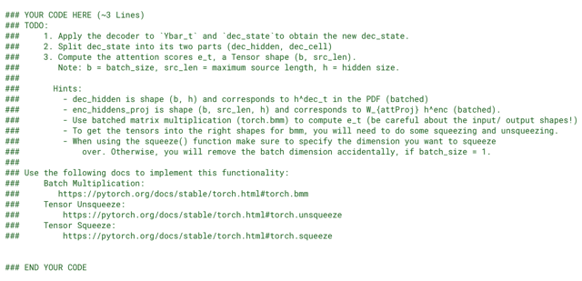</kbd>

<kbd>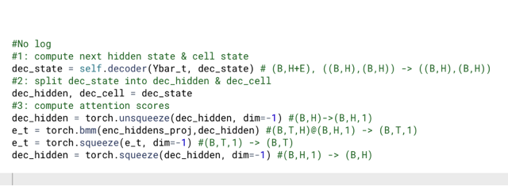</kbd>

<kbd>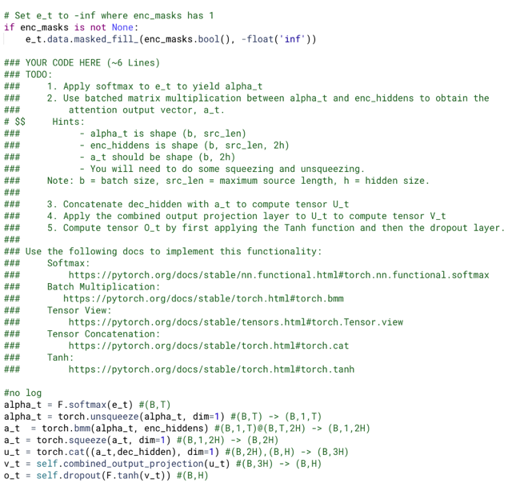</kbd>

<kbd>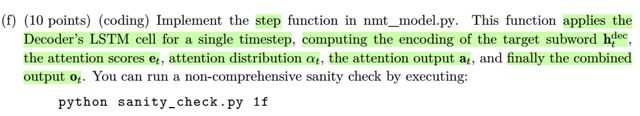</kbd>

<kbd>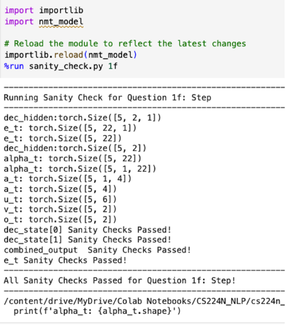</kbd>

<kbd>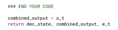</kbd>

<kbd>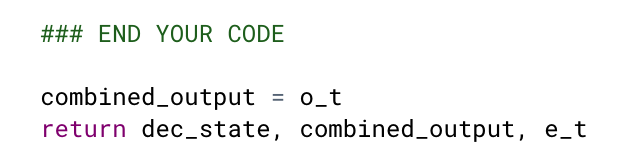</kbd>

<kbd></kbd>

<kbd></kbd>

<kbd></kbd>

<kbd></kbd>

<kbd></kbd>

<kbd></kbd>

<kbd></kbd>

<kbd>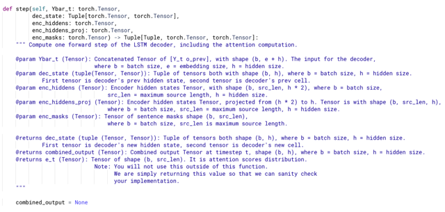</kbd>

> [!NOTE]
> Ok, đây là function sẽ thực hiện một bước tính toán của LSTM Cell thông thường: nhận input tại
> current time-step (kí hiệu x_dec_t) và hidden state, cell state từ time-step trước đó (kí hiệu  h_t-1,
> c_t-1) để tính ra hidden state, cell state mới (của current time-step)
>
> Thế thì, như đã nói ở note trước, input vào decoder RNN chính là **target sequence** (mà đã bị  cắt bỏ
> <END> token, nên chỉ là chuỗi **[e_<START>, e_word1,...e_wordT]**.  Nên ta hiểu **x_dec_t** ở đây là
> chính là **Ybar_t.**
>
> Và như trong function trước đã thấy nó là kết hợp giữa **Yt** = embedding vector của từ tại time-step t
> của target sentence nói trên, và **prev_o** (**o_t-1**) là combined output của time-step trước đó - mà
> cụ thể tính ra sao thì dưới đây sẽ nói.
>
> Vậy ta sẽ **pass Ybar_t và dec_state** (tuple chứa hidden state h_t-1, cell state c_t-1 của time-step
> trước) qua **self.decoder**, nó sẽ trả ra một**tuple gồm hidden state và cell state hiện tại (ht, ct**)
>
> ===
>
> Sau khi split tuple dec_state thành decoder hidden state, và decoder cell state ta sẽ chuẩn bị để tính
> bước attention: Tính toán attention scores giữa current time-step hidden state **h_t** và **các vector
> hidden state của encoder** (enc_hidden_proj)
>
> Vậy chỗ này ta cần dùng squeeze/unsqueeze để đ**iều chỉnh các shape cho phù hợp trước** và sau
> khi dùng **batch  matmul bmm** để nhân **dec_hidden** và **enc_hidden_proj**.
>
> Kết qủa là e_t là vector chứa T (số từ của câu source) các chỉ số attention score thể hiện rằng mức
> độ similarity của decoder hidden state của time-step hiện tại với T vector hidden state của encoder.
> Độ similarity được phản ánh bởi phép tính dot product.
>
> ====
>
> Sau khi có attention scores, ta sẽ kiểm tra xem là có cần apply attention mask vào hay không. Sử
> dụng function masked_fill_() để chỗ nào trong mask là True thì gán vào vị trí tương ứng của attention
> matrix giá trị bằng -infinity. Tác dụng của việc này chính là để loại bỏ sự chú ý tới token không mong
> muốn. Ví dụ như với trường hợp này, thì đó là ta không muốn có sự tham gia cả pad token khi tính
> linear combination giữa các encoder's hidden state. Ví dụ, khi nó xử lý một câu source (sau khi được
> padded) là "<Tôi> <thích> <ăn> <táo> <pad> <pad> <pad>" thì đương nhiên ta cũng có T = 7 encoder 
> hidden state. Và cơ chế attention sẽ tính attention scores/weights giữa decoder state h_dec_t với 7
> encoder state này. Để rồi dùng chúng trong phép tính linear combination các encoder state để tạo ra
> outer context vector phục vụ cho việc tính toán ra prediction của decoder tại đó.
>
> Vậy rõ ràng, ta không muốn có sự tham gia của các encoder state tại các time-step ứng với các pad 
> token.
>
> Thế thì bằng cách set lại attention score tại các vị trí này thành âm vô cùng, sau khi qua softmax, các 
> attention weight sẽ trở thành 0, giúp không có sự tham gia của các hidden state này nữa.
>
> =====
>
> Rồi, tiếp Theo pass attention scores e_t **qua softmax để chuyển thành attention weights alpha_t**. 
> Sau đó dùng unsqueeze để có shape phù hợp trước khi dùng **batch matmul bmm** để **tính ra linear 
> combination giữa encoder's hidden state** cho ra **attention output a_t**. 
>
> Mỗi vector **có độ dài 2H** (vì nó là**linear combination của encoder hidden state** - là một **bidirectional 
> LSTM**  nên hidden state dài 2H, nãy nói rồi)
>
> Kế tiếp ta **concatenate** **nó với cả decoder's hidden state dec_hidden** luôn. Như vậy thì thành ra vector 
> dài **3H**
>
> Rồi mới dùng**linear layer** (combined_output_projection) để **chuyển nó thành 1H**
>
> Cuối cùng là apply **tanh** để **squash giá trị về range [-1,1**] và apply dropout.

> [!NOTE]
> rong lúc tìm vấn đề khiến test BLEU score có 4, ta cũng phát hiện
> softmax không chỉ định dims, rõ ràng là một điều không nên

> [!NOTE]
> Tại sao lại dùng hàm tanh đối với u_t (kết quả của concat a_t
> [li.comb encoder state h_enc_i] với decoder state h_dec_t,
> transform về H-d)

 

<kbd>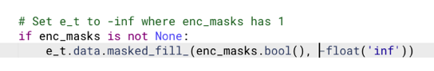</kbd>

<kbd></kbd>

<kbd>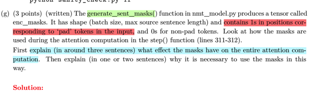</kbd>

> [!NOTE]
> đại khái là người ta hỏi trong step(), có một dòng người làm "giùm" đó là apply cái encoder mask "vào" attention score
> e_t. Và người ta hỏi rằng việc này có ý nghĩa gì.
>
> -> Rất đơn giản, như họ nói, cái function generate_sent_mask() giúp ..generate một mask, thì đại khái là chỗ nào trong
> sequence (rất nhiên là source) mà là pad token, thì chỗ đó trong mask sẽ là 1, chỗ nào mà "có chữ" (tức là một từ bình
> thường) thì chỗ đó trong mask sẽ là 0.
>
> Nên mask, mang ý nghĩa đen là cái mặt nạ, che đi những chỗ pad.
>
> Thế thì mục đích của cái vụ attention mask, là để khi thực hiện attention, để tính toán các trọng số mang ý nghĩa là nên
> chú ý nhiều hay ít tới một từ nào  đó trong câu (source) để tạo ra một linear combination các (encoder) hidden states
> đặng dùng nó làm context cho việc tính toán y^t cũng như là tham gia tính h_t+1. Thì nói chung hiểu ý nghĩa như vậy
> thì đương nhiên ta không muốn nó tính các pad hidden state làm gì. Vì ví dụ câu có 2 từ, như nhưng max_length Trong
> batch = 10, thì chỉ có 2 hidden state của encoder là có nghĩa, hữu ích, còn 8 cái kia là vô nghĩa vì nó process qua 8 cái
> pad token
>
> Tóm lại mục đích của attention mask là như vậy. Nhưng câu hỏi là hỏi cách thức người ta làm vậy là sao -> có thể thấy
> họ dùng data.masked_fill để đại khái là "Xem chỗ nào trong attention score mà ứng với pad (tức là có mask value = 1)
> thì set giá trị -infinity. Thì khi đó, khi chuyển e_t qua softmax để thành attention weights, thì hàm softmax sẽ biết chỗ
> nào mà là -infi sẽ thành 0.
>
> Kết quả là các hidden state ứng với pad, sẽ có attention weight = 0, đồng nghĩa không tham gia vào việc tính context
> ất.

 

<kbd>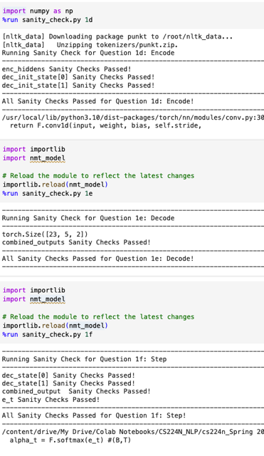</kbd>

 

<kbd>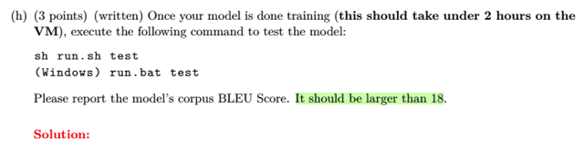</kbd>

<kbd>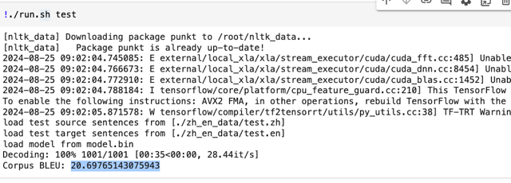</kbd>

<kbd></kbd>

<kbd></kbd>

<kbd>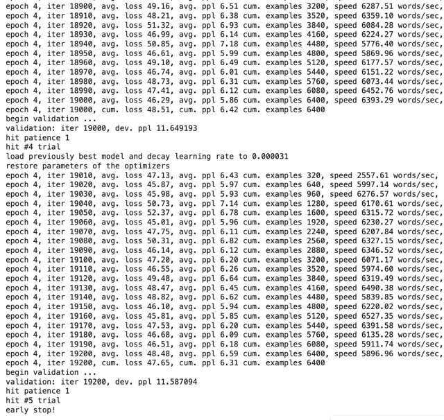</kbd>

> [!NOTE]
> Kết quả sau khi sửa lại cái vụ pass o_t và h_t, c_t (lỗi quá stupid) vào
> bước tính h_t+1,c_t+1 thì BLUE scores trên test set  đã đạt 20 > 18

 

<kbd>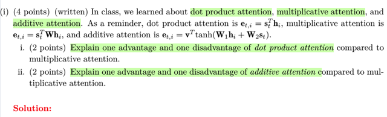</kbd>

> [!NOTE]
> i) dot product attention vs multiplicative attention: 
>
> - One advantage: Đơn giản hơn.
>
> - One disadvantage: Yêu cầu hai vector phải cùng size.
>
> ii) additive attention vs multiplicative attention:
>
> - One advantage: Nhiều params hơn (v, W1, W2) -> more flexible
>
> - One disadvantage: Computational expensive

 

<kbd>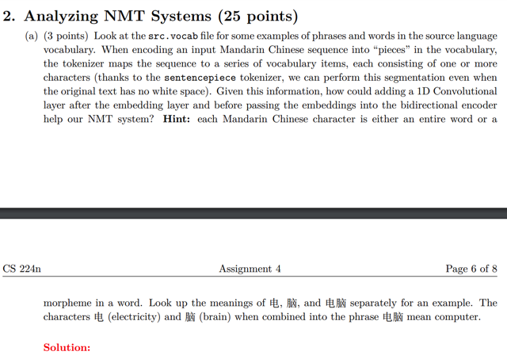</kbd>

> [!NOTE]
> Đại khái câu hỏi là tại sao conv1d sau embedding layer lại có ích.
>
> Thế thì như trong note về conv1d hồi nãy đã nói, conv1d giúp tổng hợp thông
> tin ở phạm vi gần (kernel size, ví dụ bằng 3 thì cơ bản là giúp tại mỗi vị trí,
> tạo  ra một embedding vector chứa thông tin của mấy từ gần đó.
>
> Và điều này hoàn toàn dễ hiểu khi xây dựng mô hình mà source language là
> tiếng tàu khựa, trong đó mỗi token có thể là một từ hoặc một từ tố
> (morpheme) Ví dụ người ta đưa ra là morpheme 电 có nghĩa là "điện" và 脑
> có nghĩa là "não" ghép lại tạo thành từ 电脑 có nghĩa là máy tính. Thế thì rõ
> ràng, trong tiếng Trung có một mối quan hệ ngữ nghĩa giữa các từ gần nhau,
> mà nếu phản ánh được vào trong embedding thì sẽ có ích.

 

<kbd>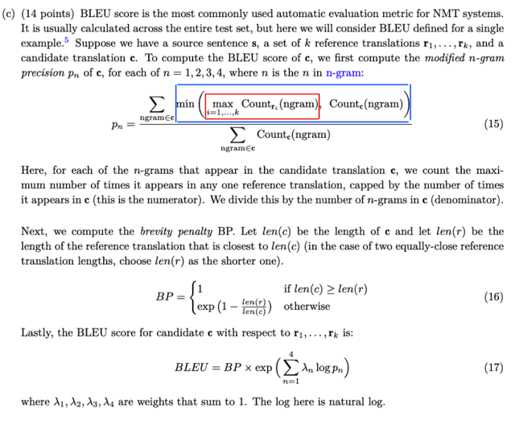</kbd>

> [!NOTE]
> Đại ý là để đánh giá chất lượng của một NMT, người ta thường dùng BLUE
> score Thông thường thì ta sẽ tính BLUE score của một test set. Nhưng ở đây
> mình sẽ tính BLEU score trên một single sample mà người ta chú thích nó
> tương đương với function sentence_blue() của nltk.
>
> Thế thì cho rằng ta có câu gốc (source) s, và bản dịch mẫu (target sentence) hay
> reference Translation là r1,r2..... Còn câu dịch mà mô hình đưa ra là c.
>
> Vậy công thức đại khái là có thể hiểu vầy, trước tiên ta cần hiểu là mình sẽ tính
> các giá trị gọi là modified n-gram precision với n khác nhau. Ví dụ  n=2 thì ta gọi
> là **modified 2-gram precision**
>
> Vậy đầu tiên với n=1, **xét từng uni-gram trong candidate translation c**:
>
> Với mỗi uni-gram:
>
> i) Đếm **số lượng uni-gram đó trong c**.
>
> ii) **Đếm số uni-gram đó** mỗi reference translation r_i và **xem lớn nhất là bao
> nhiêu.**
>
> Giữa hai con số trên, **lấy số nhỏ hơn**.
>
> **Làm vậy với mọi unigram,** cộng điểm lại.
>
> Thì ta đã được tử số.
>
> Còn mẫu số, ta sẽ **tính mỗi uni gram xuất hiện mấy lần trong c, rồi cộng lại.**
>
> Chia tử cho mẫu ta được p1 gọi là modified 1-gram precision p1.
>
> Tiếp tục làm vậy với n=2,3,4...để có p2, p3, p4
>
> =====
>
> Rồi, tiếp là tính cái gọi là Brevity Penalty. cái này theo tên gọi có thể hiểu là nó
> sẽ phạt model nếu cho ra câu ngắn.
>
> Công thức có thể diễn giải như sau: **xem thử trong các câu mẫu (reference) thì
> cái nào là có chiều dài gần bằng với chiều dài câu dịch (c) nhất**. Để rồi BP sẽ
> **bằng 1 nếu câu dịch (c) dài hơn câu đó**, và bằng **exp(1-len(r)/len(c)) nếu câu dịch
> ngắn  hơn**.
>
> Khi có trường hợp có hai câu r dài gần bằng, nhưng một cái dài hơn, một cái
> ngắn hơn câu c (ví dụ r1 dài 5, c dài 6, r2 dài 7, mấy r kia thì 9,10,11) thì đương
> nhiên r1 và r2 đều được tính là gần với c nhất vì mỗi thằng cách c 1 từ thôi.
> Nhưng lúc này sẽ chọn r1.
>
> =====
>
> Và khi có BP rồi, ta sẽ tính BLEU score là **BP nhân với một weighted sum của
> các log pn** với các coefficient là lambda_n

 

<kbd>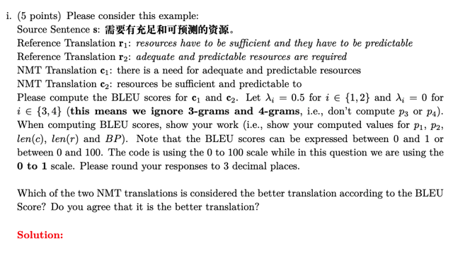</kbd>

> [!NOTE]
> p1 of c1
>
> c1: there is a need for adequate and predictable resources
>
> r1: "**resources** have to be sufficient **and** they have to be **predictable**"
>
> r2: "**adequate** **and** **predictable** **resources** are required"
>
> Xét các unigram trong c1 và số lần xuất hiện Count c(1-gram)
>
> there (1|0|0), is (1|0|0), a (1|0|0), need (1|0|0), for (1|0|0), adequate (1|0|1), 
> and (1|1|1), predictable (1|1|1), resources (1|1|1)
>
> ------
>
> Tử số: 0 + 0 + 0 + 0 + 0 + 1 + 1+ 1+ 1 = 4
>
> Mẫu số: 9
>
> Vậy p1 của c1 là **4/9**
>
> =====
>
> p2 of c1:
>
> Xét các 2-gram trong c1 và số lần xuất hiện Count c(2-gram):
>
> there is (1|0|0), is a (1|0|0), a need (1|0|0), need for (1|0|0), for adequate (1|0|0), 
> adequate and (1|0|1), and predictable (1|0|1), predictable resources (1|0|1)
>
> Tử số = 0 + 0 + 0 + 0 + 0 + 1 + 1 + 1 = 3
>
> Mẫu số: 8
>
> Vậy p2 của c1 là **3/8**
>
> =====
>
> BP of c1: c1 có len(c1) = 9; len(r1) = 11, len(r2) = 6 -> gần nhất với c1 là
> r1 nên chọn r = r1
>
> Vậy len(c) < len(r) nên BP = exp(1-len(r)/len(c)) = **exp(1-11/9)**
>
> =====
>
> BLEU score of c1: **exp(1-11/9)** * exp[ld1*log(p1) + ld2*log(p2)]
>
> = **exp(1-11/9)***exp[0.5*log(**4/9**) + 0.5*log(**3/8**)] = **0.542**

> [!NOTE]
> p1 of c2
>
> c2: "resources be sufficient and predictable to"
>
> r1: resources have to be sufficient and they have to be predictable
>
> r2: adequate and predictable resources are required
>
> Xét các unigram trong c1 và số lần xuất hiện Count c(1-gram)
>
> resources (1|1|1), be (1|2|0), sufficient (1|1|0), and (1|1|1), predictable (1|1|1), 
> to (1|2|0)
>
> Tử số = 1 + 1 + 1 + 1 + 1 + 1 = 6
>
> Mẫu số: 6
>
> Vậy p1 của c1 là **6/6**
>
> =====
>
> p2 of c2:
>
> Xét các 2-gram trong c1 và số lần xuất hiện Count c(2-gram):
>
> resources be (1|0|0), be sufficient (1|1|0), sufficient and (1|1|0), 
> and predictable (1|0|1), predictable to (1|0|0)
>
> Tử số = 0 + 1 + 1 + 1 + 0 = 3
>
> Mẫu số: 5
>
> Vậy p2 của c1 là **3/5**
>
> =====
>
> BP of c2: c2 có len(c2) = **6**, len(r1) = **11**, len(r2) = **6** -> gần nhất với c2 là
> r2 nên chọn r = r2
>
> Vậy len(c2) >= len(r) nên**BP = 1**
>
> =====
>
> BLEU score of c2: 
>
> BP * exp[ld1*log(p1) + ld2*log(p2)] 
>
> = 1*exp[0.5*log(6/6) + 0.5*log(3/5)] 
>
> = **0.895
>
> =====
>
> Như vậy câu c2 tốt hơn do BLEU score cao hơn. Và quả thật nó cũng tốt
> hơn khi ta so với bản dịch của Google Translate (đương nhiên cũng có
> thể hiểu họ cũng dùng BLEU score để đánh giá)**

 

<kbd>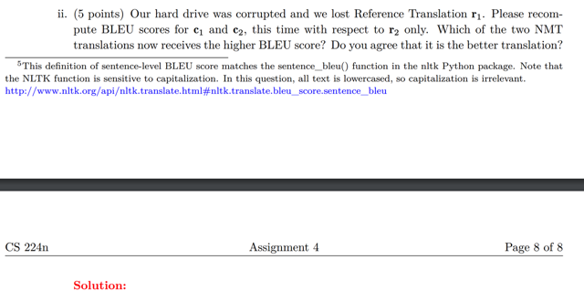</kbd>

> [!NOTE]
> p1 of c1
>
> c1: there is a need for adequate and predictable resources
>
> r2: "**adequate** **and** **predictable** **resources** are required"
>
> Xét các unigram trong c1 và số lần xuất hiện Count c(1-gram)
>
> there (1|0), is (1|0), a (1|0), need (1|0), for (1|0), adequate (1|1), 
> and (1|1), predictable (1|1), resources (1|1)
>
> ------
>
> Tử số: 0 + 0 + 0 + 0 + 0 + 1 + 1+ 1+ 1 = 4
>
> Mẫu số: 9
>
> Vậy p1 của c1 là **4/9**
>
> =====
>
> p2 of c1:
>
> Xét các 2-gram trong c1 và số lần xuất hiện Count c(2-gram):
>
> there is (1|0), is a (1|0), a need (1|0), need for (1|0), for adequate (1|0), 
> adequate and (1|1), and predictable (1|1), predictable resources (1|1)
>
> Tử số = 0 + 0 + 0 + 0 + 0 + 1 + 1 + 1 = 3
>
> Mẫu số: 8
>
> Vậy p2 của c1 là **3/8**
>
> =====
>
> BP of c1: c1 có len(c1) = 9; len(r2) = 6 
>
> Vậy len(c) > len(r) nên BP = 1
>
> =====
>
> BLEU score of c1: **1** * exp[ld1*log(p1) + ld2*log(p2)]
>
> = **1***exp[0.5*log(**4/9**) + 0.5*log(**3/8**)] = **0.677**

> [!NOTE]
> p1 of c2
>
> c2: "resources be sufficient and predictable to"
>
> r1: resources have to be sufficient and they have to be predictable
>
> r2: adequate and predictable resources are required
>
> Xét các unigram trong c1 và số lần xuất hiện Count c(1-gram)
>
> resources (1|1), be (1|0), sufficient (1|0), and (1|1), predictable (1|1), 
> to (1|0)
>
> Tử số = 1 + 0 + 0 + 1 + 1 + 0 = 3
>
> Mẫu số: 3
>
> Vậy p1 của c1 là **3/6**
>
> =====
>
> p2 of c2:
>
> Xét các 2-gram trong c1 và số lần xuất hiện Count c(2-gram):
>
> resources be (1|0), be sufficient (1|0), sufficient and (1|0), 
> and predictable (1|1), predictable to (1|0)
>
> Tử số = 0 + 0 + 0 + 1 + 0 = 1
>
> Mẫu số: 5
>
> Vậy p2 của c1 là **1/5**
>
> =====
>
> BP of c2: c2 có len(c2) = **6**,en(r2) = **6** -> gần nhất với c2 là
> r2 nên chọn r = r2
>
> Vậy len(c2) >= len(r) nên**BP = 1**
>
> =====
>
> BLEU score of c2: 
>
> BP * exp[ld1*log(p1) + ld2*log(p2)] 
>
> = 1*exp[0.5*log(3/6) + 0.5*log(1/5)] 
>
> = **0.606
>
> =====
>
> Như vậy câu c1 tốt hơn do BLEU score cao hơn.**

 

<kbd>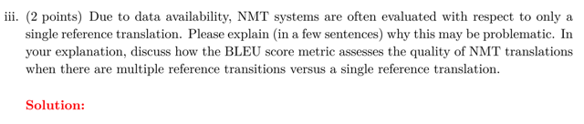</kbd>

 

