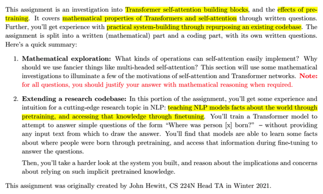
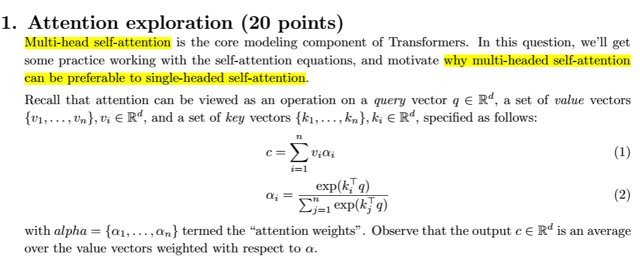
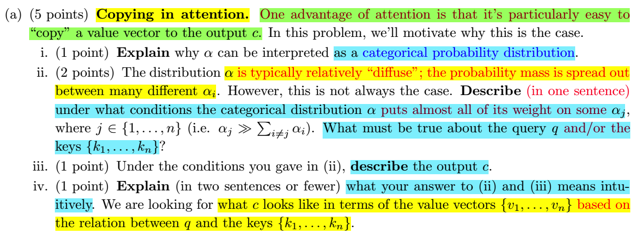
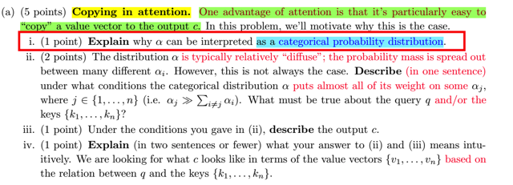
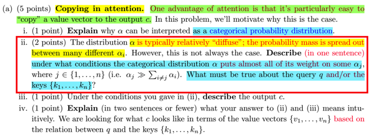
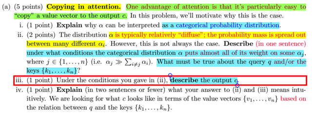
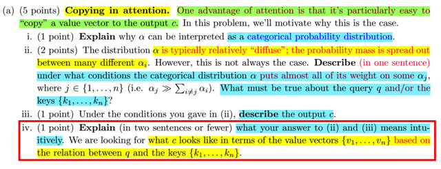
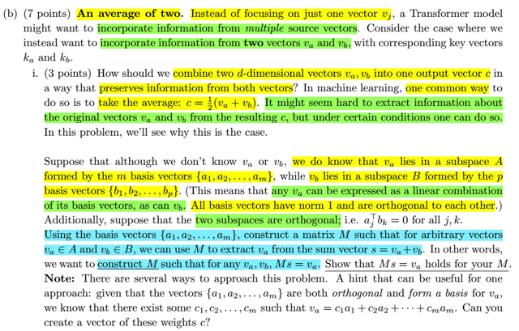
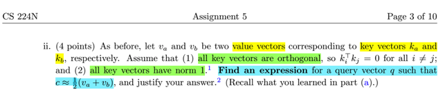

# Assignment 5: Self-attention, Transformers And Pretraining

📊 **Progress:** `10` Notes | `9` Screenshots

---
<a id="node-1041"></a>

<p align="center"><kbd></kbd></p>

> [!NOTE]
> Nói chung là assignment này sẽ cho ta cơ hội để hiểu sâu hơn về
> Transformer architecture

<br>

<a id="node-1042"></a>

<p align="center"><kbd></kbd></p>

> [!NOTE]
> ok, đầu tiên, ta sẽ thăm lại Attention mechanism để tìm hiểu tại sao
> `multi-headed` self attention lại được sử dụng thay vì `single-headed`
> `self-attention.`
>
> Ôn lại một chút về attention, ban đầu ta có một set các vector v (mỗi từ
> có bộ 3 vector k,q,v), thì có thể nhớ rằng mục đích của attention
> mechanism là với mỗi vector, " tính toán ra",  tạo ra một vector mới cho
> nó bằng cách tính một linear combination của các vector ban đầu.
>
> Và các coefficient trong đó sẽ được xác định bằng cách dựa trên mức
> độ liên quan, phù hợp (relevant), hay giống nhau giữa hai từ input `-`
> thể hiện bằng phép dot product của hai vector k và q. Các attention scores
> này sẽ được apply hàm softmax để trở thành normalized probability scores
> alpha và tham gia vào linear combination các vector v

<br>

<a id="node-1043"></a>

<p align="center"><kbd></kbd></p>

> [!NOTE]
> Đầu tiên họ cho biết **một góc nhìn mà lâu nay chưa từng thấy** nói đến ở đâu
> khi học về attention. Đó là **việc copy vector v vào trong c**. Và cụ thể hơn họ
> cho rằng attention cho ta **một cơ chế rất dễ dàng để làm việc đó**. Quả thật
> vậy, việc mình hay hiểu contextualized vector c là **linear combination của
> các vector v** với coefficients là attention weights, thì **cơ bản là ta đang "lấy"** `-`
> HAY CHÍNH LÀ **COPY các vector v với số lượng ít nhiều vào trong c** chứ gì
> nữa.

<br>

<a id="node-1044"></a>

<p align="center"><kbd></kbd></p>

> [!NOTE]
> `a-i)` Câu hỏi thứ nhất họ đề nghị mình giải thích**tại sao ta có thể coi alpha `-`
> tức attention weight** giống như một **categorical probability distribution**.
>
> Thế thì lí do một bộ attention weights cho một vector có thể được coi là một
> categorical probability distribution bởi vì đầu tiên, **attention scores** được
> tính bởi **dot product** của **query vector** của từ đang xét với **mọi key
> vector của các từ khác** (kể cả nó). Thì kết quả lớn bé thế nào đã thể hiện
> **mức độ tương thích, tương đồng của các từ với từ đang xét**. Sau đó với
> việc **apply hàm softmax**, các**unnormalized scores này được đưa về
> range [0-1]** và **tổng bằng 1.**
>
> Do đó, khi t**ham gia với vai trò hệ số trong linear combination** các vector
> v: **Σ α_i*v_i**, nó sẽ **quy định rằng từ nào sẽ được tham gia nhiều
> hơn vào vector c**. Và cũng vì vậy, c có thể được xem là **weight average**
> của các vector `v_i`
>
> Và tính chất của hàm softmax với đặc điểm (tạm gọi là) **khuếch đại sự tập
> trung xác suất**có thể khiến một từ có độ tương đồng (alignment `/` attention
> score) với từ đang xét CHỈ CAO HƠN những từ khác MỘT CHÚT nhưng
> hàm softmax sẽ có thể cho ra kết quả TẬP TRUNG PHẦN LỚN XÁC SUẤT,
> khiến từ đó **vượt trội (dominate) so với các từ còn lại**trong đóng góp của
> mình vào kết quả  contextualized vector c.
>
> Do đó, tóm lại attention weights có thể được hiểu như một categorical
> probability  distribution có n classes `/` categories vì:
>
> i) Giá trị của chúng **nằm trong khoảng từ 0 đến 1**
>
> ii) **Tổng của chúng bằng 1**
>
> iii) Và giá trị của nó **phản ánh mức độ, khả năng mà vector của từ tương
> ứng  được dùn**g, được đóng góp vào contextualized vector c, **dựa vào mức
> độ tương thích của chúng với từ đang xét**.

<br>

<a id="node-1045"></a>

<p align="center"><kbd></kbd></p>

> [!NOTE]
> `a-ii)` Câu hỏi bắt đầu với việc cho rằng probability distribution của attention
> weight đ**iển hình sẽ có dạng rất khuếch tán (diffuse)**, khi probability
> mass **phân tán ra nhiều, dàn đều ra nhiều categories**. Nhưng **không
> phải điều này  lúc nào cũng đúng**. Và họ hỏi ta là **khi nào thì khối lượng
> xác suất sẽ tập trung phần lớn với một alpha** `-` một category nào đó. Và
> khi đó điều kiện của q và {k1,.. kn} là gì.
>
> Thế thì như đã nói ở ý i), **gốc rễ bắt nguồn từ alignment scores** `-` kết
> quả của các **phép dot product giữa các cặp vector query q_i** (query của
> từ đang xét) **với {k1, k2....kn}** (các key vector của các từ trong câu). Giá
> trị của chúng sẽ thể hiện **mức độ tương thích,** tương đồng **trong ý
> nghĩa của các từ với từ đang xét**, từ đó khi chuyển thành giá trị mang ý
> nghĩa xác suất nó sẽ có giá trị cao hay thấp khác nhau.
>
> Vậy đương nhiên **không có gì đảm bảo là phân phối xác suất của
> attention weights luôn khuếch tán**, hai trải đều, mà nó **phụ thuộc vào
> mức độ tương thích, tương đồng của các từ trong câu với từ đang xét**.
> Vậy **nếu trong câu, chỉ có một từ là có tính tương đồng cao với từ đang
> xét** `-` kết quả **dot product cả q và k của từ đó sẽ cao**, còn những từ
> còn lại đều **ít thậm chí không tương đồng**, **kết quả của các phép dot
> product sẽ rất nhỏ hoặc bằng 0**, khiến cho tình hình là **alignment score
> của một từ sẽ vượt trội các từ khác**.
>
> Lúc này khi apply hàm softmax, **cộng thêm với tính chất khuếch đại sự
> tập trung xác suất**, **phân phối xác suất kết quả sẽ hầu như chỉ  tập trung
> hoàn toàn** vào alpha của từ có độ tương đồng lớn với từ đang xét.
>
> `===`
>
> Để trả lời ý hai, lập luận trên chỉ đúng nếu query vector và các key vector
> {k1,.. kn} **PHẢN ÁNH TỐT SỰ TƯƠNG `THÍCH/` TƯƠNG ĐỒNG VỀ Ý
> NGHĨA CỦA CÁC TỪ TRONG CÂU** để rồi thông qua phép dot product,
> cho ra giá trị thấp nếu hai từ hoàn toàn khác nhau và cao nếu ngược lại.

<br>

<a id="node-1046"></a>

<p align="center"><kbd></kbd></p>

> [!NOTE]
> `a-iii)` Câu hỏi là nếu điều kiện trong ý ii) xẩy ra `-` tức **khối lượng xác suất
> tập trung phần lớn thậm chí hoàn toàn vào alpha của một từ** thì 
> contextualized vector c sẽ "trông như thế nào"
>
> Thế thì ta sẽ cần phải nhắc lại rằng,**attention weights alpha_i** tính toán
> xong sẽ được**dùng để tính một linear combination của các vector v_i**
>
> ```text
> c_i = alpha1 * v_1 + alpha2 * v_2 + ....alpha_n * v_n
> ```
>
> và kết quả `c_i` sẽ được đóng vai trò là **một vector mới đại diện cho từ
> đang xét** (*) lúc này **đã có phản ánh THÔNG TIN BỐI CẢNH TRONG
> CÂU  CỤ THỂ**, thay vì chỉ là một word embedding vector PHẢN ÁNH Ý
> NGHĨA**CỦA TỪ MỘT CÁCH RIÊNG LẺ** (phải nói thêm là ta đang dùng
> ví dụ về `self-attention` trong bối cảnh NLP, nhưng khi mở rộng qua bài toán
> khác thì ý nghĩa cũng tương tự)
>
> Vậy nếu **xác suất tập trung phần lớn hoặc hoàn toàn** vào một alpha nào
> đó thì dễ thấy vector c sẽ **CƠ BẢN LÀ GIỐNG Y NHƯ VECTOR V của từ
> có alpha lớn**
>
> Và hệ qủa nó mang ý nghĩa là, attention mechanism **giúp CHỌN RA, LẤY
> RA** vector của từ có tính tương đồng cao nhất với từ đang xét và dùng
> vector v của từ đó làm contextualized vector của từ đang xét.
>
> (*): Đương nhiên việc tính toán này **sẽ xảy ra với mọi từ** hay nói cách khác
> mọi từ trong câu sẽ đều có một bộ attention scores `-`  attention weights và
> contextualized vector)

<br>

<a id="node-1047"></a>

<p align="center"><kbd></kbd></p>

> [!NOTE]
> Câu hỏi là họ đề nghị ta mô tả ngắn gọn ý nghĩa của việc phân tích cơ chế
> attention trong ý ii và iii:
>
> Vậy thì nói ngắn gọn, attention mechanism cho phép ta model tạo ra một
> word representation mới **PHẢN ÁNH TỐT HƠN Ý NGHĨA CỦA MỘT TỪ
> TRONG MỘT CÂU CỤ THỂ** bằng cách kết hợp các (vector của) các từ có ý
> nghĩa tương đồng với từ đó trong câu `-` điều này sẽ "ĐẨY" (vector của từ
> đang xét) **NÓ VỀ TRƯỜNG NGHĨA PHÙ HỢP VỚI BỐI CẢNH** trong không
> gian vector giúp model xác định, hay hiểu đúng hơn về ý nghĩa thực sự của
> một từ trong một bối cảnh cụ thể thay vì ý nghĩa chung chung (**một từ có thể
> có nhiều nghĩa trong nhiều bối cảnh** cụ thể khác nhau)

<br>

<a id="node-1048"></a>

<p align="center"><kbd></kbd></p>

> [!NOTE]
> Câu a họ nhấn mạnh cho mình hiểu rằng **cơ chế attention có một công
> dụng (trong nhiều công dụng) đó là COPY một từ** `-` ý là copy ý nghĩa của
> một từ vào kết quả. Và câu b sẽ nói về việc**TRỘN LẪN ý nghĩa của nhiều
> từ vào kết quả**.
>
> Thế thì mở đầu họ cho rằng ta **đang quan tâm đến việc tạo ra vector trộn
> lẫn ý nghĩa của hai từ a, b** `-` mỗi từ có đại diện là vector `v_a` và `v_b`
>
> Thế thì trong machine learning ta có thể chỉ đơn giản là**dùng trung bình
> của chúng** để đại diện cho một từ mang ý nghĩa của cả hai a và b. Có
> điều, ta cần phải **CHỨNG MINH RẰNG CÓ THỂ lấy ra lại ý nghĩa  đơn lẻ
> của những từ tham gia ban đầu nếu cần**.
>
> Do đó họ đề nghị ta **xây dựng matrix M**từ các basis của subspace của
> `v_a` (subspace mà `v_a` nằm trong) và basis của subspace của `v_b` **sao cho
> M có khả năng convert sum vector s `(=v_a` `+` `v_b)` ra lại v_a**: **Ms `=` v_a**. Với
> giả định rằng hai subspace orthogonal (vuông góc nhau)

> [!NOTE]
> Gọi Q là matrix có các **orthonormal columns** là {a1,a2...am}, đương nhiên
> subspace A là **column space của matrix Q, kí hiệu C(Q)**. Ý tưởng là nếu ta xây dựng M là
> projection matrix giúp project vector s lên C(Q) khi đó với s `=` va `+` vb, thì va đã
> nằm sẵn trên C(Q), nên nó chính là projection của s lên C(Q), còn vb do vuông
> góc với C(Q), nên nó sẽ bị triệt tiêu.
>
> Với matrix A, projection matrix lên C(A), ta sẽ xây dựng công thức của projection matrix
> như sau:
>
> i) vì p thuộc C(A), nên p là linear combination của các A's columns, bởi vector coefficient x:
>
> p `=` Ax
>
>
> ```text
> b = p + e <=> e = b - p = b - Ax.
> ```
>
> ```text
> ii) Từ thực tế e vuông góc với A, ta có ATe = 0 <=> AT(b-Ax) = 0 <=> ATb - ATAx = 0
> ```
>
> `<=>` ATAx `=` ATb
>
> Nhân hai vế cho `(ATA)^-1` (matrix nghịch đảo của ATA)
>
> x `=` (ATA)_inv (ATb)
>
> Lắp x vào p `=` Ax:
>
> p `=` Ax `=` A (ATA)_inv (ATb),
>
> và từ đó ta có công thức của Projection matrix: p `=` Pb
>
> `<=>` P `=` A (ATA)_inv (AT)
>
> Với Q là matrix có các column orthonormal, nên QTQ `=` I
>
> ```text
> => P = Q (QTQ)^-1 QT =, P trở thành P = QQT
> ```
>
> `=====`
>
> Thế thì ta có thể chứng minh lại rằng nếu dùng M là projection matrix này, thì
> Ms `=` va:
>
> ```text
> Ps = P(va + vb) = Pva + Pvb
> ```
>
> i) Pvb `=` QQTvb. Trong đó vì vb vuông góc với C(Q) nên vb chính là thuộc N(QT)
> dẫn tới QTvb `=` 0. Vậy Pvb `=` 0
>
> ```text
> ii) Pva = QQTva. Vì va nằm trên C(Q) nên va = Qx* => Pva = QQTQx* và QTQ = I
> ```
> lại dẫn đến Pva `=` Q(I)x* `=` Qx* `=` va
>
> Như vậy ta đã chứng minh được rằng, nếu dùng M là projection matrix lên column
> space của Q `-` matrix tạo bởi các column là orthonormal vectors: {a1,a2...am}
> thì nó sẽ giúp giữ lại va từ s `=` va `+` vb trong phép nhân Ms

<br>

<a id="node-1049"></a>

<p align="center"><kbd></kbd></p>

> [!NOTE]
> Yêu cầu đại khái là tìm một cách biểu diễn vector query q sao cho c `~=` 0.
> 5(va `+` vb). Với ka và kb là là hai key vectors tương ứng của hai từ A, B với
> cho thêm các key vector northonormal (orthogonal và `norm=1)`
>
> Đại khái có thể hiểu ý họ khi hỏi vậy là để cho mình thấy rằng, à, khi nào thì
> context vector c sẽ là sự trộn lẫn trung bình của các value vector va,vb (hồi
> nãy họ nói về khả năng attention mechanism có thể đóng vai trò giúp "lấy
> một vector nào đó ra" (để làm context vector), còn ở phần sau thì họ nhấn
> mạnh vào khả năng của attention mechanism giúp "trộn lẫn các value
> vector")
>
> Thế thì, như lúc nãy đã nói, về cơ bản, các coefficient trong linear
> combination giữa các value vector để tạo context vector c mà ta gọi là
> attention weight, xuất phát từ việc tính toán attention score: dùng similarity
> metric, như dot product giữa query vector và key vector.
>
> Do đó, để có attention weights `=` 0.5: c `=` 0.5va `+` 0.5vb
>
> thì ta chỉ cần có q sao cho các attention score bằng nhau, để sau khi
> normalized bởi softmax ta sẽ có attention weight bằng nhau `=` 0.5:
>
> ```text
> qTka = qTkb <=> qTka-qTkb = 0 <=> qT(ka-kb) = 0.
> ```

<br>

