# Lecture 11: Question & Answering

📊 **Progress:** `48` Notes | `61` Screenshots

---
<a id="node-872"></a>

<p align="center"><kbd>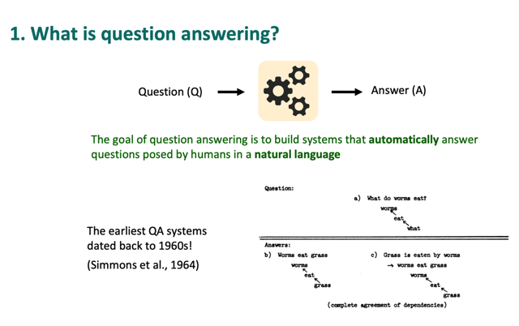</kbd></p>

> [!NOTE]
> đại khái là QA là một nhiệm vụ mà người ta cố gắng phát triển từ lâu.
> Trong đó những hệ thống đầu tiên có từ 1960, sử dụng các cách tiếp cận
> dựa trên dependency parsing

<br>

<a id="node-873"></a>

<p align="center"><kbd>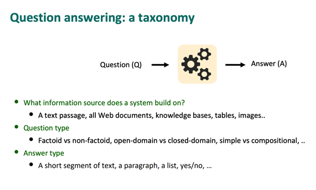</kbd></p>

> [!NOTE]
> đại khái là có nhiều kiểu question
> và answer, mỗi kiểu yêu cầu cách
> tiếp cận khác nhau

<br>

<a id="node-874"></a>

<p align="center"><kbd></kbd></p>

<p align="center"><kbd></kbd></p>

<p align="center"><kbd></kbd></p>

> [!NOTE]
> một số ứng dụng

<br>

<a id="node-875"></a>

<p align="center"><kbd>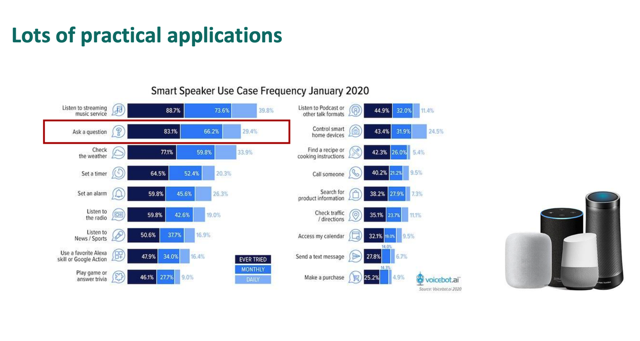</kbd></p>

<br>

<a id="node-876"></a>

<p align="center"><kbd>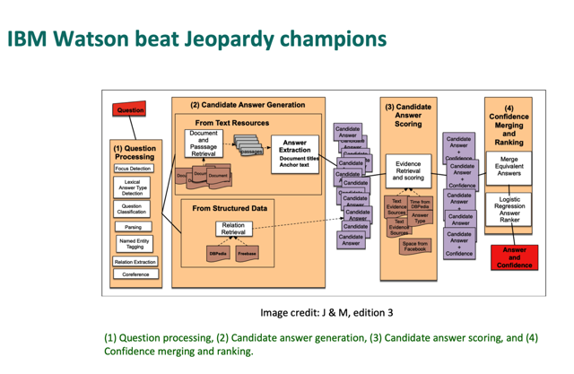</kbd></p>

> [!NOTE]
> mô tả về IBM Watson, cách đây 10 năm nó là xịn nhất (hệ thống QA)
>
> Ta có thể thấy rằng, nó được cấu tạo bởi nhiều mô đun

<br>

<a id="node-877"></a>

<p align="center"><kbd>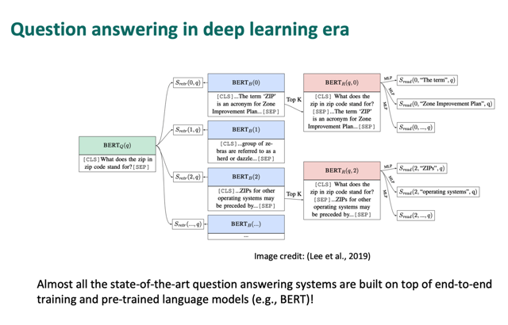</kbd></p>

> [!NOTE]
> Nhưng với deep learning thì ngày nay các hệ thống QA xịn nhất
> đều dựa trên nó với tính chất `end-to-end` ý là không cần phải cấu
> thành bởi các module riêng biệt làm các bước riêng biệt như trước
> đây. Điều này cũng tương đồng với lĩnh vực Computer Vision `-` khi
> các `end-to-end` cnn model đã thay thế các hệ thống dựa trên nhiều
> module thực hiện các bước feature engineering

<br>

<a id="node-878"></a>

<p align="center"><kbd>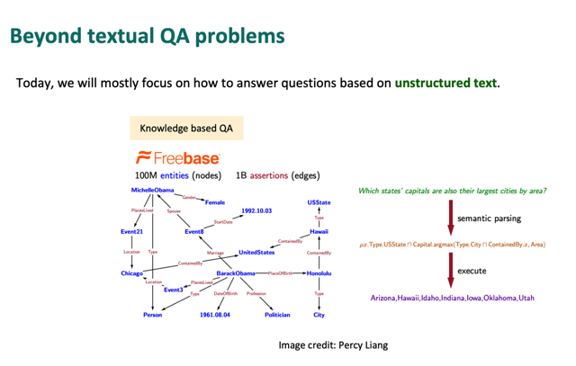</kbd></p>

<br>

<a id="node-879"></a>

<p align="center"><kbd>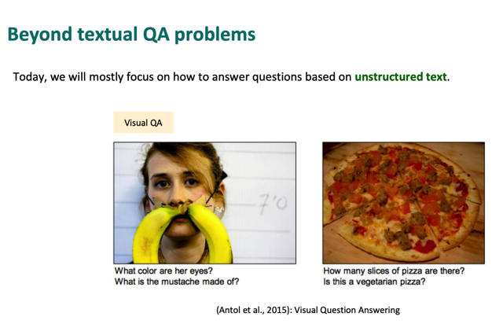</kbd></p>

> [!NOTE]
> đại ý là nói qua một số "bài toán QA" khác như QA có `/` dựa trên
> image (Visual QA). Nhưng sẽ không nói ở bài giảng này, mà sẽ
> chỉ tập trung vào hệ thống QA trong đó câu trả lời dựa trên một
> unstructured text

<br>

<a id="node-880"></a>

<p align="center"><kbd></kbd></p>

<p align="center"><kbd></kbd></p>

<p align="center"><kbd>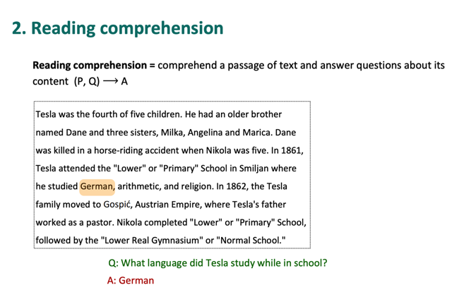</kbd></p>

> [!NOTE]
> Nói về reading comprehension, gs đưa ra ví dụ về hai câu hỏi, mà tuy
> là dễ với human nhưng với machine, muốn trả lời được, nó phải hiểu
> được nội dung của đoạn text được cung cấp

<br>

<a id="node-881"></a>

<p align="center"><kbd>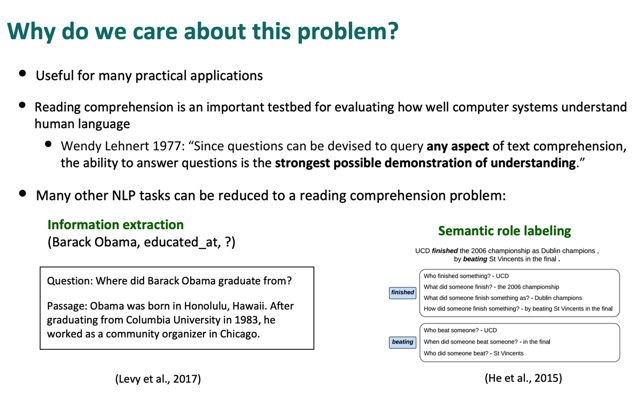</kbd></p>

> [!NOTE]
> Đại ý là nhấn mạnh tầm quan trọng của reading comprehension (tại
> hiểu là phát triển NLP system có khả năng đọc hiểu tốt được văn bản)
>
> Vì nhiều NLP task khác có thể chung quy về khả năng đọc hiểu như
> Information extraction và Semantic role labeling.

<br>

<a id="node-882"></a>

<p align="center"><kbd>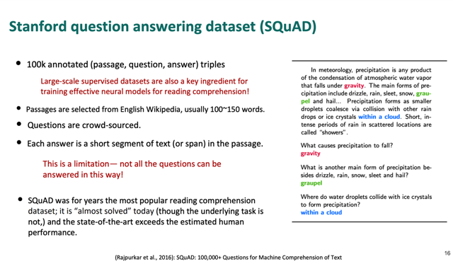</kbd></p>

> [!NOTE]
> Nói về SQuAD dataset `-` là bộ dữ liệu hỏi đáp do Stanford thu thập.
>
> Final project sẽ dùng dataset này.
>
> Dataset này có đặc điểm đại ý là chỉ hỏi những câu mà câu trả lời có thể
> được trích xuất từ câu hỏi. Đó cũng là hạn chế của nó, vì thực tế không
> phải câu hỏi nào cũng có tính chất này.
>
> Cuôi cùng là vì nó có từ nhiều năm rồi nên tới nay cơ bản đã được Solved
> `-` ý là các hệ thống QA xịn xò nhất hầu như đã đạt được performance rất
> tốt ở dataset này

<br>

<a id="node-883"></a>

<p align="center"><kbd>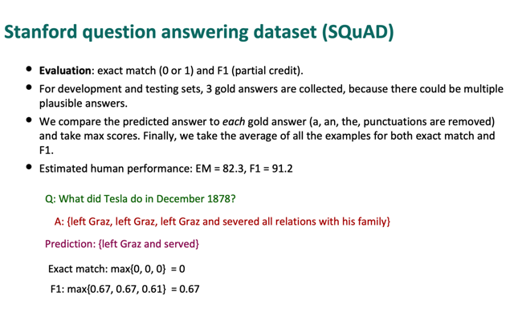</kbd></p>

> [!NOTE]
> Đại khái là cách thức để đánh giá chất lượng của model trong bài toán
> QA. Ta có thể dùng "exact match" `-` mang giá trị binary thể hiện liệu
> predicted answer cho trùng khớp hoàn toàn với target `/` gold answer
> hay không. Hoặc là dùng F1 score (cái này tính từ Recall và Precision,
> cân bằng giữa hai tiêu chí) Tính như thế nào thì ở bài `n-gram` model
> cũng đã biết.

<br>

<a id="node-884"></a>

<p align="center"><kbd>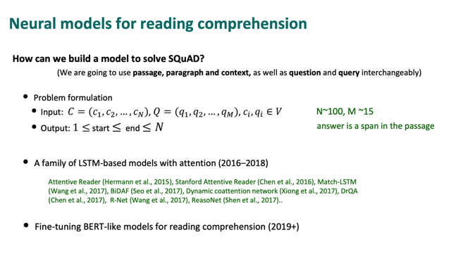</kbd></p>

> [!NOTE]
> Đại khái là để bắt đầu nói về việc train neural network cho SQuAD, thì
> một số notation như sau: 
>
> Như đã nói, cái dạng QA của SQuAD là cung cấp một đoạn văn bối cảnh,
> và câu hỏi sẽ kì vọng có câu trả lời là trích từ đoạn văn bối cảnh ra.
>
> Do đó, input là chuỗi context C có N tokek (từ), Q là câu hỏi có M với
> N cỡ một trăm, M thì nhỏ hơn. Và output sẽ là hai con số trong range[1:N]
> cho biết câu trả lời sẽ là từ vị trí nào đến vị trí nào trong context.
>
> Thế thì đại ý rằng kiểu như khi người ta phát triển các mô hình để solve
> dataset này, thì có thể chia ra làm hai giai đoạn, hay hai trường phái: Một
> là các mô hình dựa trên LSTM, với attention mechanism. Và một trường 
> phái khác kể từ khi có BERT thiên về việc finetuning BERT cho nhiệm vụ
> này

<br>

<a id="node-885"></a>

<p align="center"><kbd>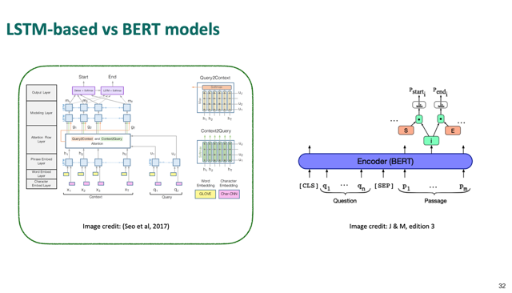</kbd></p>

> [!NOTE]
> Thì bài hôm nay, vì final project ta sẽ build một
> `LSTM-based` model from scratch, thành ra TA sẽ nói kĩ về
> cái này và chỉ lướt qua `BERT-based` model

<br>

<a id="node-886"></a>

<p align="center"><kbd>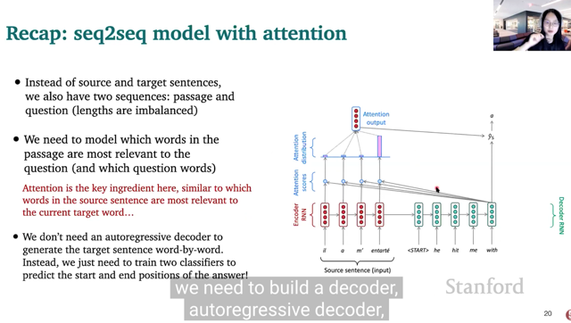</kbd></p>

> [!NOTE]
> Rồi, thế thì TA cho rằng đại khái là mình đã làm Assignment 4 trong đó ta build một
> Neural Machine Translation from scratch `-` là mô hình dựa trên LSTM với Attention,
> thì thật ra nó chia sẻ nhiều điểm chung với bài toán Reading  Comprehension ở
> đây.
>
> Cụ thể là, trong NMT, ta sẽ có hai chuỗi là source sentence và target sentence, mà
> trong đó điểm mấu chốt là Attention giúp xác định được từ nào trong source
> sentence sẽ "most relevant" với một từ của target sentence.
>
> Nhớ lại, khi tính toán dự đoán của một từ tại `time-step` t, thì trước tiên ta sẽ dùng
> attention giữa hidden state tại `time-step` `t-1` của decoder và các hidden state của
> encoder, từ đó tạo ra context vector, là linear combination của các encoder's
> hidden state với weights `/` coefficient là similarity scores giữa decoder hidden state
> nói trên và các encoder hidden states. Đương nhiên trong assignment đó còn có
> các cách "bố trí" để sử  dụng context vector theo cách hơi rắc rối: Nhưng có thể
> nói gọn là:
>
> Để dự đoán cho `time-step` t:
>
> Thì đầu tiên tính ra hidden state tại t, cái này sẽ có sự tham gia của **hidden state
> trước đó**, **từ "chuẩn"** **của câu dịch tại `time-step` trước** (cái này gọi là
> **teacher-forcing**) và **attention result của `time-step` trước.**Còn cụ thể tham gia
> thế nào (ví dụ cái nào concatenate với cái nào, rồi có thể được project để giảm
> dimension...) thì xem lại.
>
> Khi có hidden state tại t, nó sẽ tham gia attention cho ra attention result, và cái này
> lại cùng với hidden state để tính ra y^t
>
> `====`
>
> Đó là ôn lại một chút về NMT, thì trong reading comprehension, ta cũng sẽ muốn
> xác định**từ nào trong context relevant nhất với câu hỏi**, và cụ thể là relevant nhất
> với từ nào trong đó. Thành ra **cơ chế Attention vẫn đóng vai trò quan trọng.**Và một đặc điểm nữa khác với NMT, đó là ta sẽ không cần dùng một Autoregressive
> Decoder để generate các token gì cả. Mà ta sẽ chỉ cần output ra 2 index cho start
> và end của vị trí trích dẫn từ context. Do đó có thể xem là đơn giản bớt.

<br>

<a id="node-887"></a>

<p align="center"><kbd>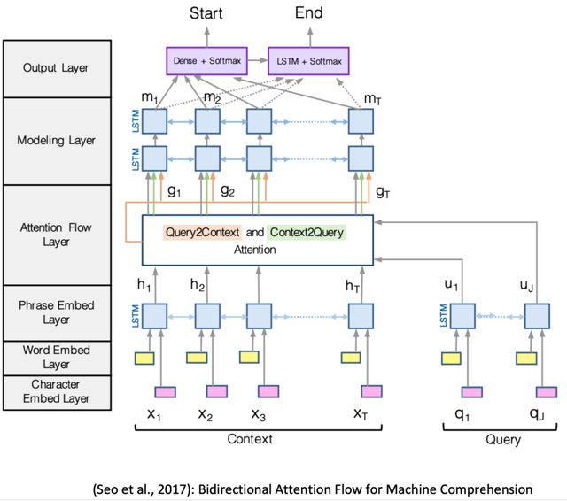</kbd></p>

> [!NOTE]
> Ta sẽ đi từng component của mô hình này,
> được cho là tốt nhất cho bài toán reading
> comprehension trước khi có BERT

<br>

<a id="node-888"></a>

<p align="center"><kbd>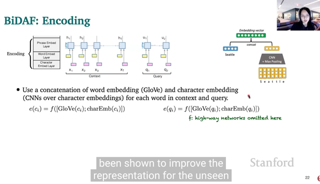</kbd></p>

> [!NOTE]
> Đầu tiên là Layer Encoding: Đại ý, trong layer này sẽ tính `/` tạo embedding
> của các kí tự, các từ và các cụm từ (phrase). Điều này cũng khá tuân theo
> một mô tuýp thường thấy, đó là bắt đầu với Embedding step.
>
> Với các **từ**, đơn giản là dùng word token id để look up từ GloVE embedding 
> matrix để có word embedding. Ta hoàn toàn có thể hiểu cái này, rằng mình
> sẽ **dùng pretrained GloVE words embedding** để represent cho word.
>
> Các kí tự của từ đó cũng sẽ được (encoded thành vector `-` chưa rõ ra sao)
> và thông qua một CNN để output ra "character" embedding của từ đó.
>
> Hai cái sẽ được concat và biến đổi qua một `high-way` networks (không nói 
> ở đây, tự xem paper) để trở thành embedding của từ.

<br>

<a id="node-889"></a>

<p align="center"><kbd>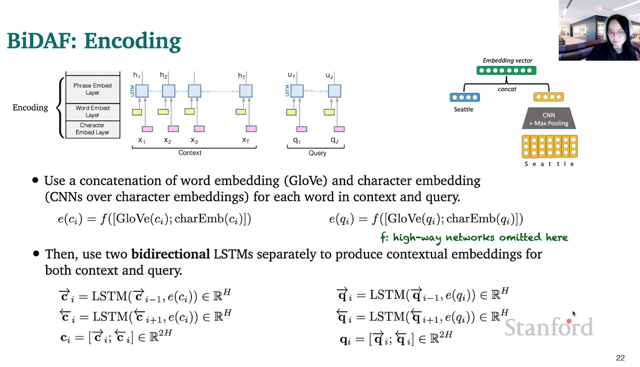</kbd></p>

> [!NOTE]
> Rồi, sau đó, các word character embedding này (mỗi từ bây giờ là một
> embedding vector `-` kết quả concatenate của GloVe embedding và CNN
> character embedding và pass qua hàm f) sẽ được input vào `Bi-directional`
> LSTM.
>
> Cái này thì ta đã biết rồi, mỗi LSTM sẽ xử lý input sequence theo chiều xuôi
> và ngược để rồi hai hidden state tại mỗi `time-step` được concatenate lại để
> làm hidden state tại `time-step` đó.
>
> Điểm quan trọng đó là, nãy giờ mọi bước đều làm giống nhau cho cả context
> text và question (hay query text). Điều này khi ta liên hệ với bài toán
> translation sẽ thấy nó khác, ở chỗ trong MT, ta không dùng bidirectional cho
> Decoder được, lí do là vì ta cần generate từng từ của câu prediction một, do
> đó decoder sẽ là một Autoregressive, như trong assignment 4, ta dùng LSTM
> cell, với môt vòng lặp để generate từng từ một.
>
> Tuy nhiên với bài toán reading này, vì ta chỉ cần output 2 con số "vị trí trích
> dẫn" Nên việc xử lý query và context theo cách nào chẳng liên quan gì Do đó
> có thể  dùng `Bi-directional` LSTM để xử lý query để có thể **nắm bắt tốt nhất
> toàn bộ ý nghĩa của cả context và query** (nói vậy là bởi bidirectional LSTM
> cho phép nhìn về cả những từ ở trước và sau, do đó giúp nắm bắt thông tin
> bối cảnh tốt hơn `Uni-directional)`

<br>

<a id="node-890"></a>

<p align="center"><kbd>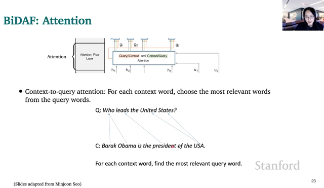</kbd></p>

> [!NOTE]
> Qua layer Attention: Thì BiDAF có hai cơ chế attention. Đầu tiên đại khái là,
> với **mỗi từ của Context**, nó nên **attend nhiều tới từ nào của Query.**
> Thì có thể hiểu cái này y như khi ta dùng Attention để xác định những từ nào
> của source sentence (các encoder hidden state) relevant nhất các hidden
> state của decoder

<br>

<a id="node-891"></a>

<p align="center"><kbd>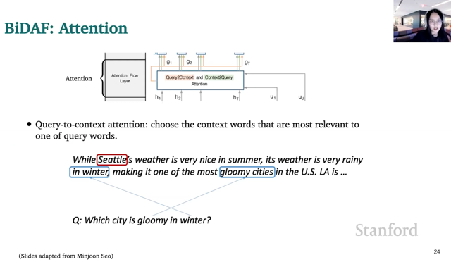</kbd></p>

> [!NOTE]
> Và cái thứ hai là ngược lại, với mỗi từ trong query, nó nên attend nhiều
> nhất tới những từ nào trong context
>
> Cũng chính vì vậy mà BiDAF có tên là**Bidirectional Attention (for
> Machine Comprehension)**

<br>

<a id="node-892"></a>

<p align="center"><kbd>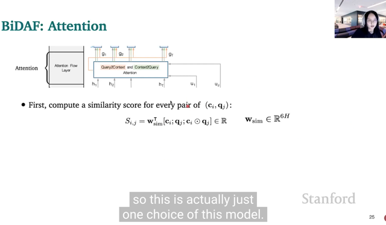</kbd></p>

> [!NOTE]
> Rồi, rất dễ hiểu, để tính cả hai loại attention trên thì ta sẽ tính similarity
> score giữa (hidden state của) mỗi từ trong context `c_i` và (hidden state của) 
> mỗi từ trong query `q_j.`
>
> Và như đã biết, có nhiều cách, công thức để tính similarity với ưu nhược
> điểm riêng, thì trong paper này, người ta tính theo cách này (với chú ý, có
> thể thử cách khác): 
>
> Ta sẽ concatenate `c_i,` `q_j,` và vector kết quả của `element-wise` product (hay
> còn gọi là hadamard product của chúng) vì mỗi cái output từ `Bi-directional` 
> LSTM, nên dimension sẽ là 2H (H `hyper-params,` chỉ dimension của LSTM
> hidden state), vậy thì sau concat sẽ có vector có dimension 6H. Cái này sẽ
> được transform (thật ra là dot product) bởi một learnable vector w để thành 
> một scalar đóng vai trò similarity score `s_i,j`
>
> Có thể hiểu ta sẽ có kết quả là matrix S có shape NxM (số context word,
> số query word), trong đó hàng thứ i sẽ là các attention scores của từ context
> `c_i` với M từ query `q_j` `j=1:M`
>
> Ngược lại, mỗi cột j, sẽ là các attention scores của từ query `q_j` với N từ 
> context `c_i` `I=1:N.`

<br>

<a id="node-893"></a>

<p align="center"><kbd>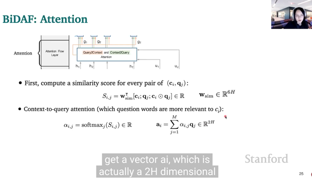</kbd></p>

> [!NOTE]
> Tiếp theo để có attention weight giữa từ context `c_i` với các query word `q_j`
> Ta chỉ việc apply hàm softmax theo từng hàng của matrix S.
>
> Sau đó thực hiện linear combination các vector `q_j` với weighted bởi các
> attention weight.
>
> Nói chung là có matrix attention score S rồi thì ta sẽ apply softmax theo từng
> hàng. 
>
> Thì matrix attention weight `-` đặt là ALPHA `-` vẫn có shape NxM
>
> Ta sẽ matmul nó với matrix (M, 2H) mỗi hàng là hidden state của một query
> word `-` để có kết quả là (N, 2H) mang ý nghĩa là hàng thứ i sẽ là contextualize
> vector cho từ context `c_i` (kết quả linear combination của M vector query `q_j` 
> với M attention weight `alpha_i,j`

<br>

<a id="node-894"></a>

<p align="center"><kbd>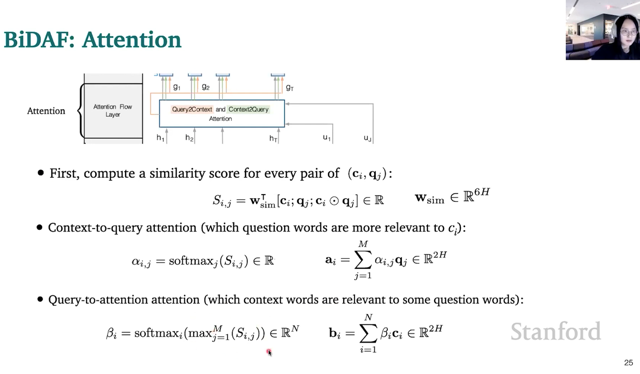</kbd></p>

> [!NOTE]
> Rồi, tới cái query to context attention thì thật ra nó hơi kì cục:
>
> Matrix attention score S có shape N,M, ta sẽ ví dụ N `=` 100 (là số từ của
> context paragraph), và M `=` 10 (số từ của question)
>
> Vậy thì như ở bên kia, đã nói, mỗi hàng là attention score của một từ context
> với 10 từ query. Nên chuyển nó qua attention weight rồi tính combination là
> làm theo hàng.
>
> Bây giờ để tính attention của mỗi query word với các context word, thì nếu
> bình thường thì sẽ như vầy: Ta áp dụng softmax theo cột, vì mỗi cột ứng với
> attention score của một query word với mọi context word, nên apply theo cột
> để chuyển thành weight, rồi dùng nó để tính linear combination các context
> embedding
>
> Nếu làm như vậy thì dĩ nhiên mỗi query word ta sẽ có một bộ attention khác
> nhau dẫn đến có một bộ các linear combination của các context embedding 
> khác nhau. Tuy nhiên, ở đây làm khác: Đó là ta lấy giá trị lớn nhất ở mỗi
> hàng trước, để tạo ra vector chứ N phần tử, mỗi phần tử là attention score
> lớn nhất của mỗi hàng.
>
> Từ đó mới dùng softmax để chuyển thành attention weights. Và dùng nó
> để tạo linear combination các context words.
>
> Như vậy thì chỉ có 1 kết quả duy nhất, cho mọi query.
>
> Thành ra chỗ này ghi sai hoặc cũng có thể ghi vậy khiến người ta hiểu sai.
> Đáng lẽ là b thôi chứ không phải `b_i,` vì chỉ có một vector b.
> Nhưng họ ghi `b_i` hàm ý khác, và để hiểu hàm ý đó, ta cần hiểu rằng cái họ
> quan tâm khi làm attention đó là tạo vector representation mới, phản ánh 
> thông tin bối cảnh, cho mỗi context word `c_i.`
>
> Vậy thì, với cơ chế attention thứ nhất, mỗi context word i ta đã tạo ra một
> vector `a_i,` tính bằng linear combination của M query word embedding `q_1,` `q_M,`
> với hệ số là attention weight alpha i,1, `alpha_i2...alpha_iM.` Thì cái này dễ hiểu.
>
> Còn với cơ chế thứ hai, cũng là muốn tạo cho mỗi context word i một vector
> `b_i` luôn (có điều như đã nói, tụi nó giống nhau hết) theo cách trên.
> Nên sự hiểu lầm là ở chỗ, không phải là ở cơ chế attention thứ nhất ta tạo
> cho representation cho mỗi context word, rồi cơ chế thứ hai ta tạo representation
> cho mỗi query word đâu. Mà cơ chế thứ hai cũng là tạo representation cho
> context word luôn. Nên ghi `b_i,` dù trong đó đã sum từ i đến N là vậy (bởi câu
> hỏi của giáo sư Cris Manning cũng chính là thắc mắc điều này).
>
> Và nhìn cách họ tính final output thì sẽ cũng cố cách hiểu này, đó là họ Hadamard
> Product embedding context word `c_i` với cả `a_i` và `b_i,` trước khi concatenate
> ```text
> với c_i, a_i để được một vector g_i - ĐÓNG VAI TRÒ LÀ REPRESENTATION
> ```
> MỚI CHO TỪ CONTEXT THỨ I.

<br>

<a id="node-895"></a>

<p align="center"><kbd>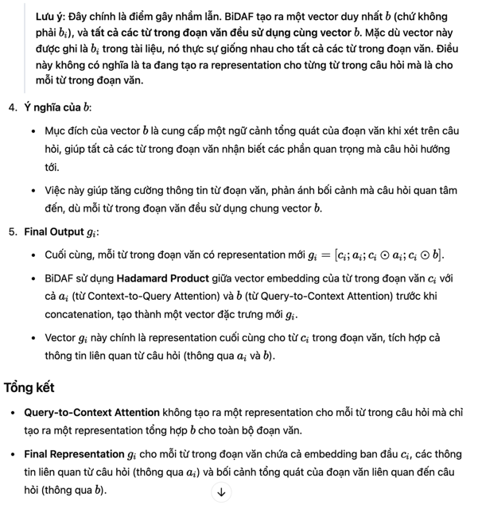</kbd></p>

<p align="center"><kbd></kbd></p>

<p align="center"><kbd>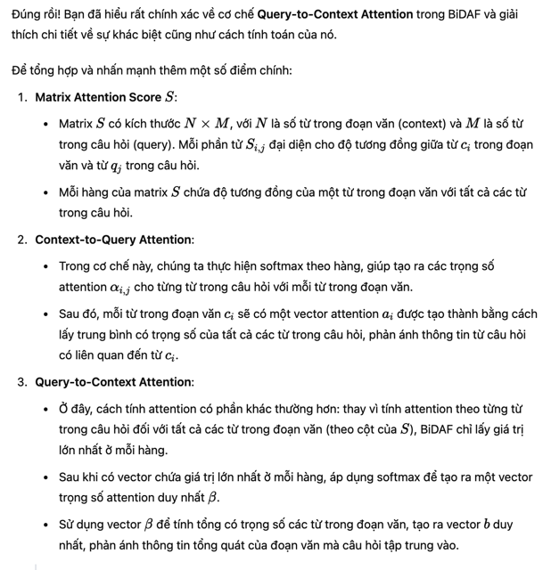</kbd></p>

<br>

<a id="node-896"></a>

<p align="center"><kbd>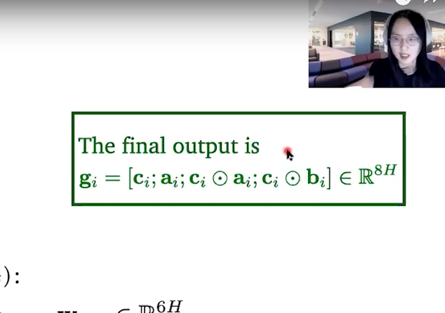</kbd></p>

> [!NOTE]
> Và intuition của **query-to-context** đó là: bi hay đúng hơn chỉ là b (với
> mọi context word) sẽ là linear combination các context embedding, trọng
> số nhiều ý bởi việc context word đó relevant cỡ nào với các query word.
>
> Ví dụ có 5 từ trong context, và 3 từ trong query, ta sẽ có matrix S 5x3,
>
> Theo cách tính b đã giải thích, thì **giả sử kết quả khi max theo hàng** từ
> matrix 5x3, **cho ra 1 vector (cột)** trong đó **vị trí 1 có giá trị cao**, **số 2
> giá trị thấp** thì điều đó thể hiện:
>
> **từ context 1 relevant cao với query nói chung, không care từ nào** trong
> query,
>
> và **từ context 2 ít relevant với query nói chung**, **không care từ nào**
> **cụ thể** của query.
>
> Dẫn đến khi **chuyển thành weight** (bởi softmax), và **dùng nó làm trọng
> số cho các context word vector để tính b**, thì: vector b sẽ **mang nhiều
> thông tin từ vector context thứ 1**, **ít hơn từ vector context word thứ 2**.
>
> Từ đó có thể nôm na hiểu rằng, **b sẽ trở nên giống những từ context mà
> có mức relevant với query cao**.
>
> Dẫn đến ta có thể hiểu **b như vector phản ảnh mức độ relevant của
> query với context nói chung**, **không quan tâm từ query cụ thể nào.**

<br>

<a id="node-897"></a>

<p align="center"><kbd>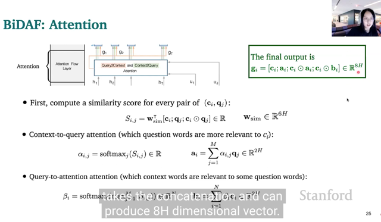</kbd></p>

> [!NOTE]
> Và xong xuôi, ta sẽ concatenate cả đám này lại thành
> ra một 8H dimnension vector

> [!NOTE]
> Gs Cris đặt ra hai câu hỏi rất hay đó là:
>
> `1/` tại sao hai cái attention không symmetrical: có thể hiểu ý là,
> với context `-` query attention, thì một context sẽ attend hết mọi từ
> query, còn với `query-context` thì ta chỉ attend với những từ có
> score cao nhất mà thôi
>
> Bạn này trả lời rằng đó là vì ta quan tâm nhiều hơn tới việc tạo
> representation của context word, hơn là query word.
>
> `2/Tại` sao phải dùng 2 attention, dùng 1 cái thôi được không?
>
> `->` Không có câu trả lời ổn, đại ý là theo trong pager thì dùng vậy
> hiệu qủa hơn
>
> `3/` Tại sao lại có cách làm như final output:
>
> TA: Có lẽ họ đã thử nghiệm nhiều cách và cho thấy cách này
> có kết quả tốt nhất

<br>

<a id="node-898"></a>

<p align="center"><kbd>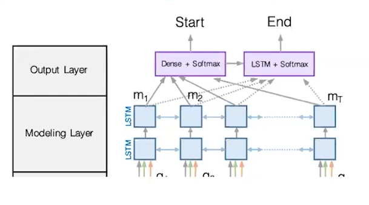</kbd></p>

<p align="center"><kbd></kbd></p>

<p align="center"><kbd>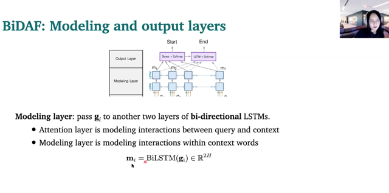</kbd></p>

> [!NOTE]
> tiếp, `g_i` `-` kết quả sau hai attention mechanism, ứng với context word i,
> sẽ được pass qua hai layer Bidirectional LSTM nhằm learn relationship
> interaction giữa các context words

<br>

<a id="node-899"></a>

<p align="center"><kbd>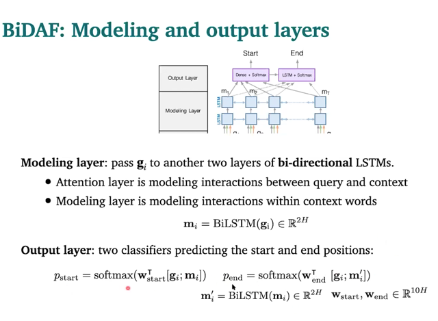</kbd></p>

> [!NOTE]
> và cuối cùng là prediction head (output layer):
>
> Prediction head đầu tiên để predict ra một phân phối xác suất cho biết các từ
> của context có xác suất là bắt đầu của answer.
>
> Thế thì với mỗi context word i, `g_i` (8H) sẽ được concat với `m_i` (2H), và dot
> product với vector `w_start` (10H) để ra predicted score của context word i đó.
> Vậy mỗi từ context có một score, apply softmax để thành probability
> distribution.
>
> Với prediction head thứ hai predict xác suất các từ là vị trí kết thúc của
> answer, thì đầu tiên `m_i` sẽ lại được pass qua một biLSTM nữa để có `m_i',`
> concate với `g_i` và dot product với `w_end,` để có class score, và qua softmax
> để thành predicted distribution.
>
> TA giải thích sơ về việc tại sao lại cần BiLSTM để xử lý:

<br>

<a id="node-900"></a>

<p align="center"><kbd>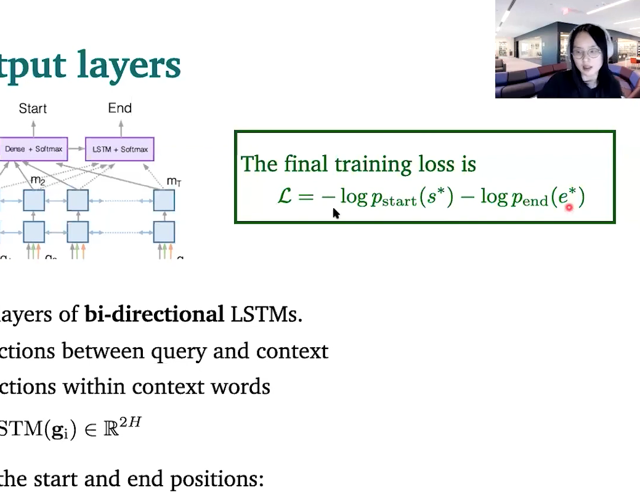</kbd></p>

> [!NOTE]
> Training loss có thể thấy vẫn là negative log likelihood của s*, và
> e* `-` target start và end index

<br>

<a id="node-901"></a>

<p align="center"><kbd>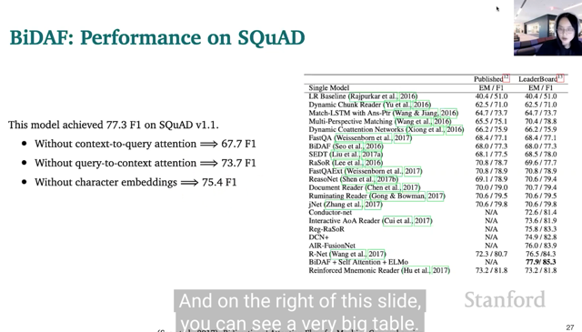</kbd></p>

> [!NOTE]
> kết qủa F1 score của BiDAF, cũng cho thấy khi bỏ đi một trong hai
> attention mechanism hoặc character embedding làm giảm score cho
> thấy vai trò của chúng. Cũng như là so sách các mô hình khác để thấy
> trước khi có ELMo thì chúng đều xem xem nhau

<br>

<a id="node-902"></a>

<p align="center"><kbd>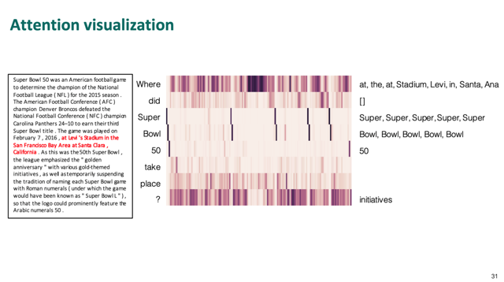</kbd></p>

> [!NOTE]
> attention visualization cho thấy các query word relevant tới các context word
> như thế nào.

<br>

<a id="node-903"></a>

<p align="center"><kbd>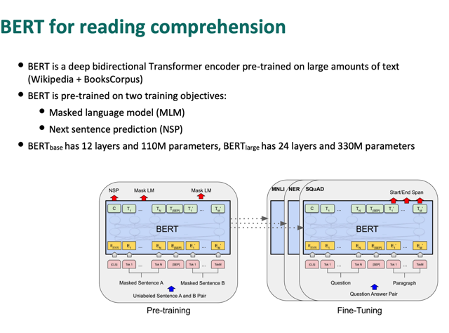</kbd></p>

> [!NOTE]
> Ta đã biết về BERT trong các bài trước, những slide tiếp theo sẽ
> nói về cách dùng BERT cho vấn đề reading comprehension

<br>

<a id="node-904"></a>

<p align="center"><kbd>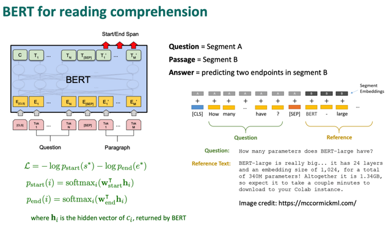</kbd></p>

> [!NOTE]
> Đại khái là question sequence và reference sequence sẽ được
> concatenate: [CLS] `+` Question `+` [SEP] `+` Reference và pass  vào BERT.
>
> hidden state của mỗi reference word `c_i` sẽ được dot product với một
> learnable `w_start` và `w_end` để "ra" predicted score, và  áp dụng softmax với
> mọi predicted score này để thành xác suất model dự đoán rằng từ `c_i` trở
> thành từ start hay end của answer. Có nghĩa là cũng y như  BiDAF, chỉ khác
> là hidden state được tính bởi BERT, thay vì BiLSTM.
>
> Và loss function cũng như BiDAF

<br>

<a id="node-905"></a>

<p align="center"><kbd>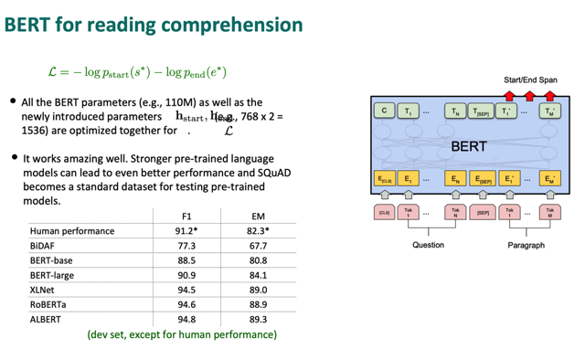</kbd></p>

> [!NOTE]
> Và quá trình training sẽ finetuned mọi parameters của BERT cũng như có
> thêm hai vector `h_start` và `h_end.`
>
> Kết qủa của phương pháp này tỏ ra rất tốt, với nhận định rằng, pretrained
> model càng lớn thì kết quả càng tốt. Dẫn đến là người ta dùng performance
> của model khi dùng để train vấn đề reading comprehension với SQuad để 
> đánh giá khả năng của pretrained LLM.

<br>

<a id="node-906"></a>

<p align="center"><kbd>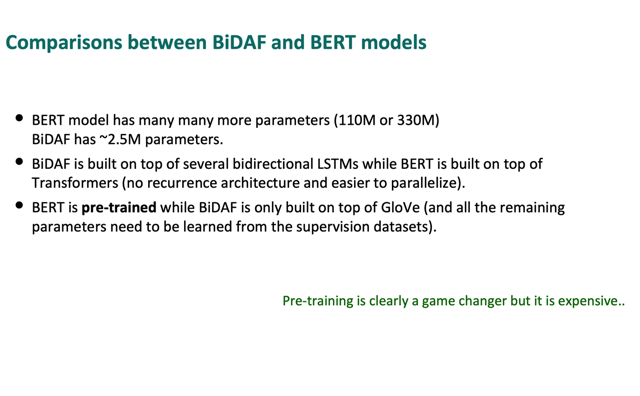</kbd></p>

> [!NOTE]
> Đại khái là so sánh với BiDAF, thì BERT có số parameters lớn hơn
> nhiều.
>
> BERT, như đã biết dựa trên kiến trúc Transformer, thay vì RNN như
> BIDAF thành ra nó có các ưu điểm mà Transformer mang lại so với
> RNN như đã biết.
>
> Và cuối cùng, BERT được pretrained, trong khi BIDAF chỉ dựa trên
> GloVe embedding, ý nói với BERT mọi params của nó đều đã được
> pretrained, còn BIDAF thì chỉ có word embedding là được pretrained
> (dùng GloVe embedding) còn các param khác phải được train từ đầu
> bằng supervised learning.
>
> Do đó lợi thế của BERT là rất rõ `-` đó là chính pretraining đã tạo ra sự
> vượt trội của BERT

<br>

<a id="node-907"></a>

<p align="center"><kbd>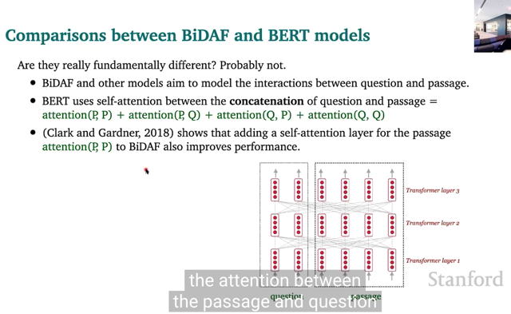</kbd></p>

> [!NOTE]
> đại khái là chiêm nghiệm lại kĩ hơn ta sẽ thấy rằng thực ra hai cách tiếp
> cận  BIDAF và BERT cho bài toán này thực ra không khác nhau mấy. Lí
> do đó là bởi với BERT ta thấy rằng, việc concatenate question và
> passage (context) làm thành input của BERT thì khi qua các `self-attention`
> layer, cơ bản là  ta sẽ có các representation phản ánh `/` nắm bắt các quan
> hệ gữa các từ với nhau. Thế thì điều đó đồng nghĩa nó có thể nắm bắt
> các quan hệ giữa: context word với query word, query word với context
> word, query word với query word và context word với context word.
>
> Còn với BIDAF như đã biết, hai cơ chế attention của nó giúp nó nắm bắt
> relation giữa context `-` query và query `-` context.
>
> Và điều này cũng có thể giúp lí giải tại sao BERT perform tốt hơn BIDAF
> khi mà nó làm nhiệm vụ này tốt hơn (Nhờ `self-attention)`
>
> Điều này càng được tái khẳng định là đúng khi người ta thêm một self
> attention layer để các context word học được mối quan hệ lẫn nhau, cho
> ra kết quả cải thiện hơn của BIDAF.

> [!NOTE]
> Gs Cris Manning có câu hỏi là liệu ta có thể dùng một `Transformer-based`
> model (không dùng pretrained BERT, mà train from scratch)?
>
> `->` Có đó là QANet, nó tốt hơn BIDAF nhưng không bằng BERT

<br>

<a id="node-908"></a>

<p align="center"><kbd>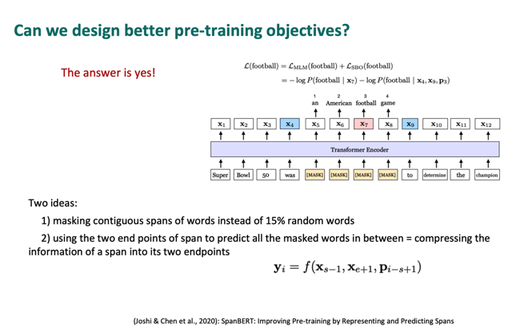</kbd></p>

> [!NOTE]
> Đại khái là từ thành công của BERT trong bài toán này, ta đã thấy pretraining 
> đóng vai quan trọng. Vậy có thể cải thiện hơn nữa performance bằng cách
> cải thiện việc pretraining, cụ thể là `pre-training` objectives?
>
> Câu trả lời là họ sẽ pretrain BERT khác cách cũ một chút, đại khái là thay vì
> che đi (và cho model đoán) các từ một cách random, thì ta sẽ che đi một chuỗi 
> các từ liền kề.
>
> Và ta sẽ dùng hai input tại hai end point của span để predict mọi từ trong span:
> có nghĩa là mọi từ trong span sẽ đều được dự đoán từ một function tính bởi
> ```text
> hai input ở hai đầu span: x_s-1, x+e+1, cộng với một positional encoding p_i-s+1
> ```

<br>

<a id="node-909"></a>

<p align="center"><kbd>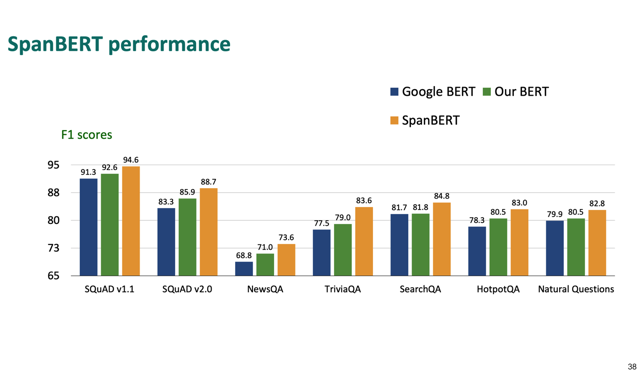</kbd></p>

> [!NOTE]
> kết quả so sánh cho thấy SpanBERT đều tốt hơn Google BERT
> và Our BERT. Cho thấy rằng, không nhất thiết tăng kích thước
> model mà có thể chỉ cần một design tốt hơn cũng có thể giúp cải
> thiện performance. Ít nhất là trong bối cảnh bài toán  reading
> comprehension.

<br>

<a id="node-910"></a>

<p align="center"><kbd>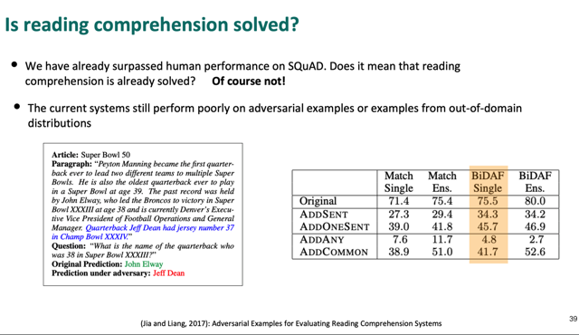</kbd></p>

> [!NOTE]
> câu hỏi là những kết quả trên liệu có đủ để chứng tỏ vấn đề này đã
> được giải quyết triệt để chưa?
>
> Câu trả lời là không, vì đơn cử như một trường hợp mà người ta
> có thể dễ dàng lừa model bằng một technique đã gặp bên cs231n
> đó là adversarial attack: Bằng cách thêm vào một câu vô nghĩa, 
> nhưng lại có những từ giống với question, model đã bị lừa.
>
> Bảng dưới cho thấy sự sụt giảm các chỉ số f1 score khi gặp những
> kiểu như vậy

<br>

<a id="node-911"></a>

<p align="center"><kbd>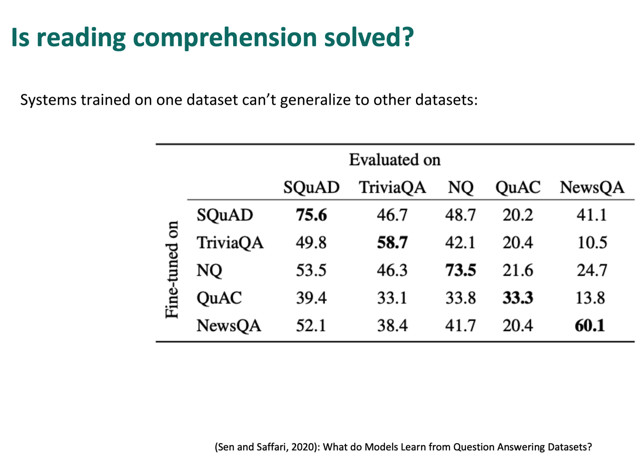</kbd></p>

> [!NOTE]
> một điểm nữa đó là khả năng generalize chưa tốt, model train trên
> dataset này không perform well trên dataset khác. Đường chéo
> ở bảng này cao thể hiện model perform tốt trên dataset mà nó 
> được train, nhưng những vị trí khác thấp thể hiện nó không perform
> tốt trên các dataset khác.

<br>

<a id="node-912"></a>

<p align="center"><kbd>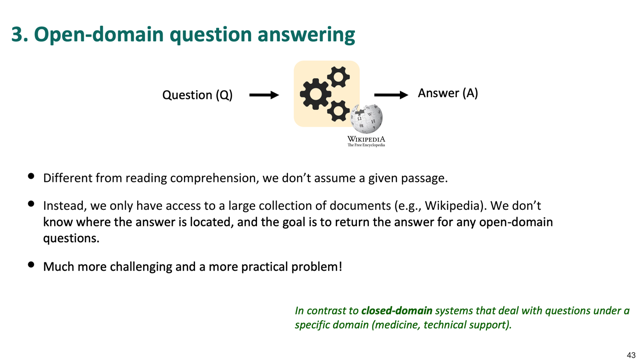</kbd></p>

> [!NOTE]
> nói qua task khác: `open-domain` question answering. Thì ở task
> này, ta sẽ không có một passage cho trước, mà thay vào đó, ta
> chỉ có access tới một large collection các documents ví dụ như
> Wikipedia. Tác vụ này thách thức hơn và cũng có nhiều lợi ích
> thực tiễn hơn.

<br>

<a id="node-913"></a>

<p align="center"><kbd>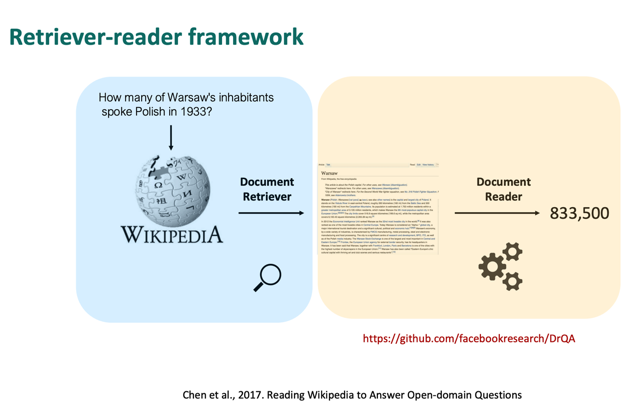</kbd></p>

> [!NOTE]
> Một cách tiếp cận, cho chính bạn này nghiên cứu năm 2017,
> đó là, đầu tiên ta sẽ có một Document  Retriever, đóng vai trò
> tìm, trích xuất, retrieve ra các document relevant với câu hỏi.
> Kết quả sẽ được chuyển cho một Document Reader để đọc và
> tạo ra answer.

<br>

<a id="node-914"></a>

<p align="center"><kbd>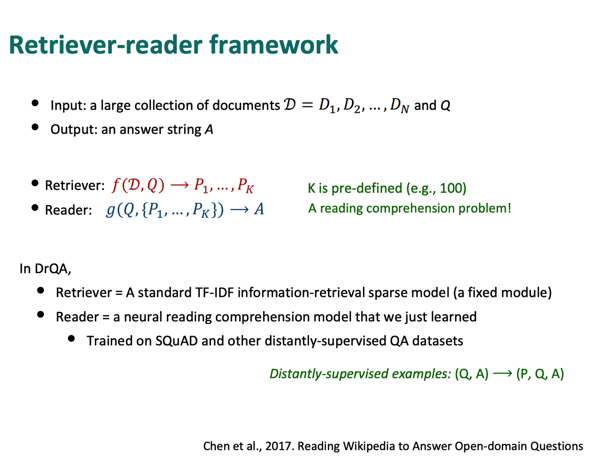</kbd></p>

> [!NOTE]
> Thế thì đại khái là với input là một collection rất lớn các documents
> D, và question Q. Retriever sẽ retrieve một set các document với số
> lượng định trước ví dụ K `=` 100.
>
> Thế thì Retriever chỉ là một `TF-IDF` information retrieval sparse model
> (cái này có thể quen thuộc trong NLP ta cần bổ sung kiến thức)
>
> Kết quả sẽ được Reader `-` là một neural network được huấn luyện cho
> bài toán reading comprehension như đã nói, với SQuAD dataset và
> các `distantly-supervised` QA dataset khác.
>
> Thế thì ý tưởng này chỉ đơn giản là kết hợp một Retriever với một
> model Reading Comprehension để làm thành một system cho task
> `opened-end` generation

<br>

<a id="node-915"></a>

<p align="center"><kbd>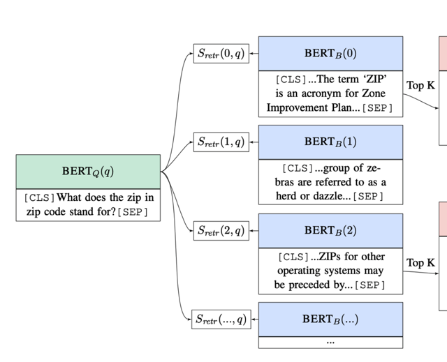</kbd></p>

<p align="center"><kbd>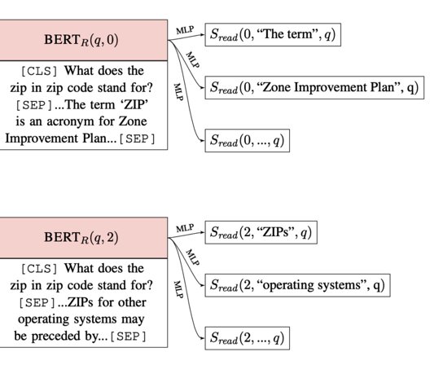</kbd></p>

<p align="center"><kbd></kbd></p>

<p align="center"><kbd></kbd></p>

<p align="center"><kbd>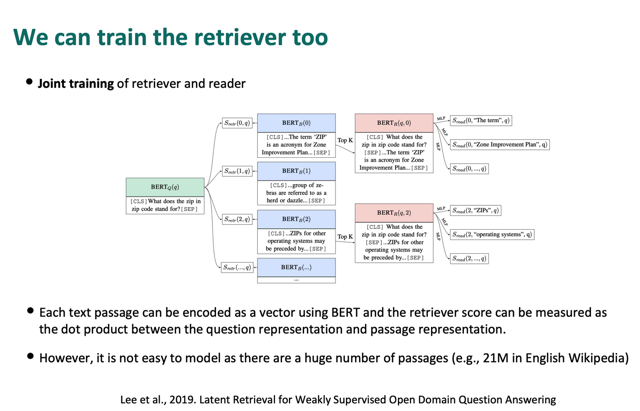</kbd></p>

> [!NOTE]
> đại khái là vầy, đang nói tác vụ này là open QA, tức là chỉ có câu hỏi 
> được đưa ra, chứ không cung cấp một văn bản ngữ cảnh như trong
> bài toán Reading Comprehension. Và ta coi như xài một văn bản ngữ 
> cảnh khổng lồ đó là 21 triệu bài viết của Wikipedia.
>
> Thế thì với cách làm này, các passage (article) của Wikipedia, sẽ được
> embedding bởi BERT, tức mỗi passage sẽ được pass qua BERT và
> lấy ra embedding, hay nói cách khác, dùng BERT như extractor.
>
> Câu hỏi cũng vậy, pass qua BERT để có representation.
>
> Tiếp, retriever sẽ tính similarity score `-` dùng dot product để tính `-` giữa
> các passage BERT embedding và question BERT embedding.
>
> Sau đó, chọn ra K passage có score cao nhất. Pass qua cho Reader `-` 
> như đã nói là một Reading Comprehension model.
>
> Đến lượt nó, reader sẽ predict ra các span `/` vị trí trích dẫn trong passage 
> để làm câu trả lời (thì cái này biết rồi)
>
> Vậy thì việc training sẽ jointly training Retriever sao cho có thể chọn ra
> các passage phù hợp nhất với câu hỏi, và reader thì train để làm tốt
> việc của mình là trích ra các span từ passage sao cho tốt nhất.
>
> `===`
>
> Tuy nhiên cách làm này không dễ, vì số lượng khổng lồ các passage
>
> `===`
>
> Nói thêm, sau khi training, đại ý là người ta sẽ chạy BERT để tính các
> passage BERT embedding một lần và lưu vào cơ sở dữ liệu. Để khi nhận
> câu hỏi q, ta sẽ tính BERT embedding của q. Và rồi dùng các thuật toán
> tìm kiếm để tìm ra các vector giống nó nhất trong dữ liệu `-` những thuật
> toán này sẽ giúp tìm nhanh hơn chứ không phải là tính hàng triệu phép
> tính similarity score giữa question BERT embedding và passage BERT
> embedding.
>
> Cái thách thức nói trên là ở chỗ việc jointly train một hệ thống bao gồm
> finetuning BERT, train retriever, và reader là rất nhiều

<br>

<a id="node-916"></a>

<p align="center"><kbd>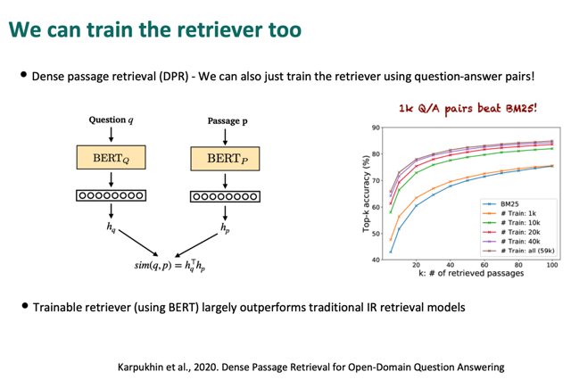</kbd></p>

> [!NOTE]
> còn cái này, đại khái là khắc phục được nhược điểm của cách tiếp cận vừa
> rồi `-` như đã biết, nó yêu cầu jointly train một hệ thống bao gồm cả retriever `-`
> reader khiến quá tốn kém.
>
> Thì với cái này, người ta chỉ train retriever với `question-answer` pair. Họ cũng
> không nói cụ thể ra sao, chỉ nói nó tuy đơn giản nhưng vượt trội các mô hình
> trước như BM25. Đề xuất ta đọc paper để biết chi tiết,

<br>

<a id="node-917"></a>

<p align="center"><kbd>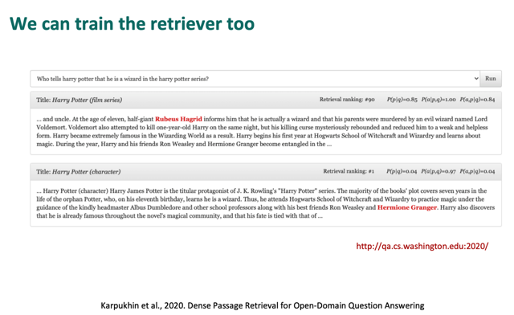</kbd></p>

> [!NOTE]
> Kết quả của nó,
> trả lời rất đúng

<br>

<a id="node-918"></a>

<p align="center"><kbd>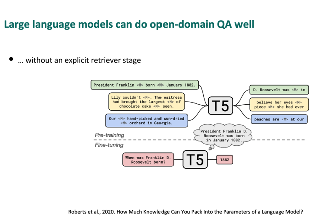</kbd></p>

> [!NOTE]
> Rồi, cái này đại khái là, người ta nghiên cứu và nhận thấy thậm chí
> chẳng cần xây dựng system cho bài toán `Open-domain` QA (câu hỏi
> mở nãy giờ đang nói) dựa trên Retrieval. Có nghĩa là không cần phải
> dựa trên việc trích suất dữ liệu từ một nguồn có sẵn nào cả, mà chỉ
> việc huấn luyện `/` finetune LLM để rồi cho cái LLM generate luôn câu trả
> lời.
>
> Thì mô hình T5 mình đã được biết qua là một cái như vậy.
>
> Thế thì đáng nói là, với Retrieval based approach, ta chỉ là đang train
> model học cách tìm và trích dẫn văn bản phù hợp để làm câu trả lời.
> Còn với cách làm của T5 nói trên, thì bản thân model nó tạo ra câu trả
> lời.
>
> Thì điều này một cái giống như khi ai đó hỏi, ta đi tìm trong sách và
> trả lời theo sách. Còn cái kia giống như là ta tự trả lời theo kiến thức
> của mình.

<br>

<a id="node-919"></a>

<p align="center"><kbd>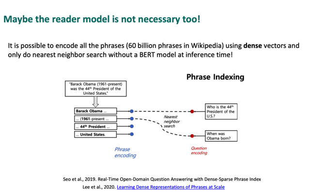</kbd></p>

> [!NOTE]
> Đại khái là cái này nói về một cách tiếp cận hoàn toán khác, đó là người
> ta sẽ tạo BERT representation của mọi cụm từ trong Wikipedia, và lưu
> trong cơ sở dữ liệu. Để rồi, với một câu hỏi, chỉ việc BERT encode nó,
> và rồi DÙNG THUẬT TOÁN NEAREST NEIGHBOR ĐỂ TÌM CÂU TRẢ
> LỜI. Có nghĩa là, ta chỉ cần Retriever, không còn cần dùng Reader để
> phải predict span từ passage như này giờ nữa.
>
> Thế thì cách tiếp cận này giúp khi inference, rất nhanh thậm chí có thể
> chạy trên CPU

<br>

<a id="node-920"></a>

<p align="center"><kbd>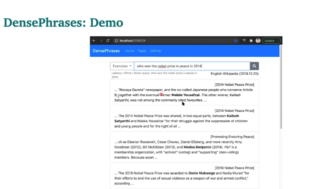</kbd></p>

> [!NOTE]
> demo cho thấy nó rất nhanh

<br>

