# Lecture 13: Coreference Resolution

📊 **Progress:** `51` Notes | `52` Screenshots

---

<kbd>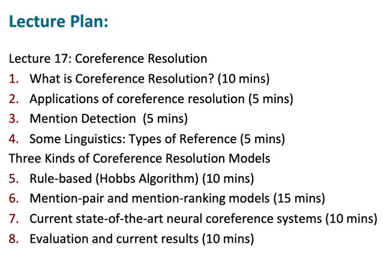</kbd>

 

<kbd>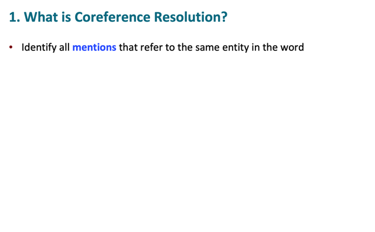</kbd>

> [!NOTE]
> đầu tiên gs định nghĩa coreference resolution là nhiệm vụ mà trong đó,
> ta cần xác định mọi "mentions" - tức mọi cụm từ mà trong văn bản dùng
> để đề cập đến một người nào đó, hay một cái gì đó, .. có phải là cũng
> một thực thể hay không.

 

<kbd>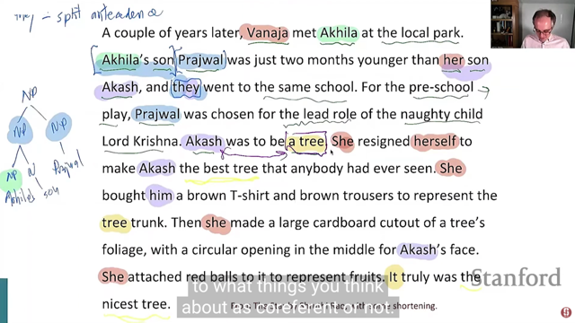</kbd>

> [!NOTE]
> Xong gs mới làm thử việc này trên đoạn văn bản ví dụ ở đây Đầu tiên,
> gs sẽ liệt kê các lần đề cập đến ai đó, hoặc cái gì đó bằng cách gạch
> dưới. Ví dụ Vanaja, Akhila, the local park, Akhila's son, ....
>
> Sau đó, gs bắt đầu xác định xem những lần đề cập nào là nói vì
> Vanaja, rồi những cái nào là nói về Akhila bằng các màu khác nhau.
>
> Trong quá trình làm 
>
> Nói chung, gs cho biết việc này có thể trở nên rất phức tạp

 

<kbd>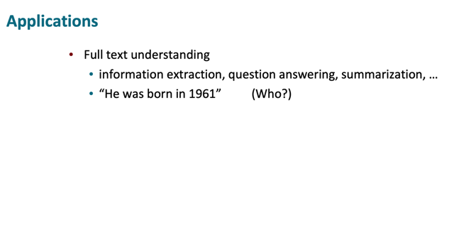</kbd>

> [!NOTE]
> ứng dụng của task này đó là nó góp phần vào
> tác vụ hiểu văn bản một cách trọn vẹn từ đó cải
> thiện các tác vụ như information extraction,
> question answering....

 

<kbd>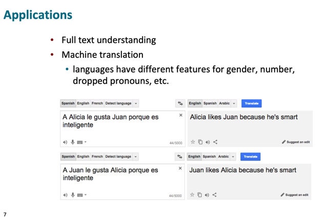</kbd>

> [!NOTE]
> nó cũng đóng góp vào việc cải
> thiện machine translation.

 

<kbd>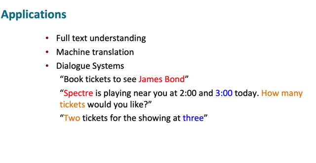</kbd>

> [!NOTE]
> Hay trong dialog
> system cũng vậy

 

<kbd>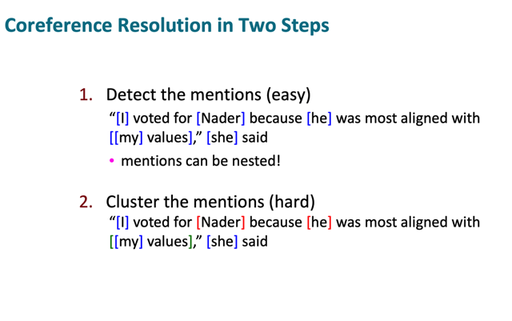</kbd>

> [!NOTE]
> Đại khái là ta sẽ giải quyết bài toán này trong 2 step:
>
> - Detect mentions, bước này được cho là dễ - có thể hiểu đại ý là trong
> bước này, ta sẽ classify, detect xem từ nào là mentions.
>
> - Cluster the mentions: Bước hai có thể hiểu là ta sẽ nhóm các mentions
> lại, để các mention cùng đề cập tới một thực thể sẽ chung nhóm

 

<kbd>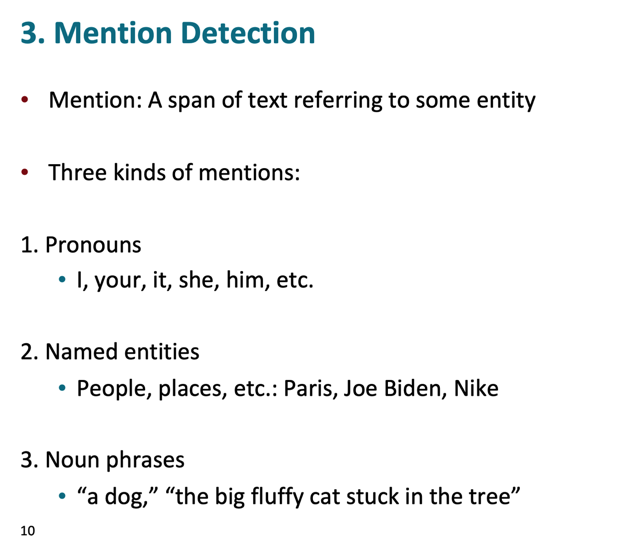</kbd>

> [!NOTE]
> Đại khái là với bước mention detection, ta có thể dùng các
> model nlp để thực hiện

 

<kbd>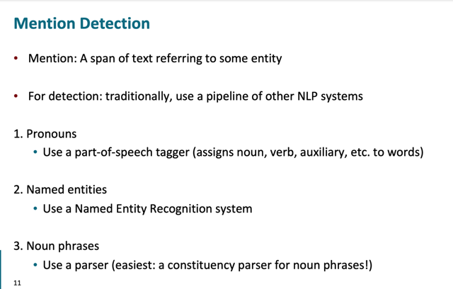</kbd>

> [!NOTE]
> Ví dụ như để detect Pronouns, ta có thể dùng part-of-speech
> tagger (đã từng học trong NLP Spec), với named entities, ta
> sẽ dùng Named Entity Recognition system. Và với noun
> phrases, ta sẽ dùng parser

 

<kbd>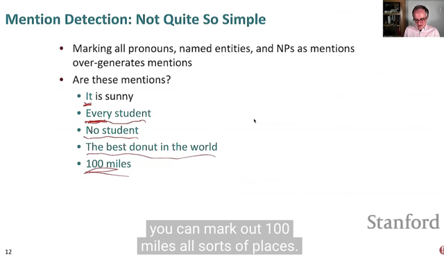</kbd>

> [!NOTE]
> Thế thì có điều mọi chuyện không đơn giản vậy, nhiều khi việc xuất hiện
> của pronoun, hay entity không phải là mention. Ví dụ trong các câu này,
> không phải là mentions

 

<kbd>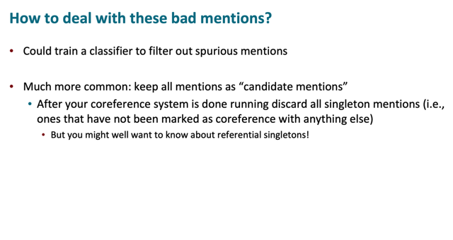</kbd>

> [!NOTE]
> Đại khái là ta có thể train một classifier để detect các mention giả này
> (spurious), nhưng gs cho rằng thường người ta không cần làm vậy,
> mà chỉ giữ lại hết các mention, và coreference system khi làm việc,
> những spurious mention sẽ chẳng nằm trong group nào, thì khi đó ta
> sẽ loại chúng ra.
>
> Có người hỏi là ví dụ như trong câu "It's sunny" thì có thể coi It là mention
> tới "The weather" không. 
>
> Gs cho rằng không hẳn là vậy, mà đại khái khi ta nói vậy nó chỉ là cách mà
> trong tiếng anh, khi không muốn dùng một subject nào cụ thể, người ta
> để it vào. Chứ không hẳn là khi nói it's sunny là người ta đang ám chỉ 
> thời tiết.

 

<kbd>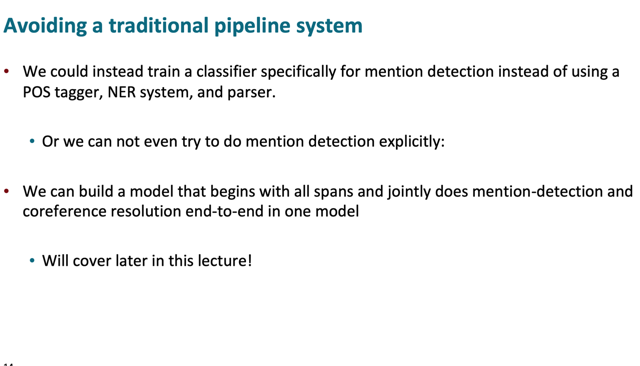</kbd>

> [!NOTE]
> Đại khái là gs nói rằng trước đây, vấn đề này có thể được tiếp cận theo
> kiểu hai bước như vừa nói, trong đó mention detector có thể dùng các
> pipeline riêng lẻ để detect pronoun bằng pos tagger, entities bằng NER, và
> parser ..Hoặc cũng có thể train một classifier để đảm nhiệm luôn tất cả các
> việc detect.
>
> Sau đó qua bước hai để cluster như nãy nói.
>
> Tuy nhiên, gs cho biết, cũng như các lĩnh vực khác, bài toán khác, mà
> trước khi có deep learning, cần chia thành các module, pipeline làm các
> bước feature engineering riêng. thì với deep learning, ta có thể train một
> end-to-end deep learning model làm cả việc mention detector và cluster

 

<kbd>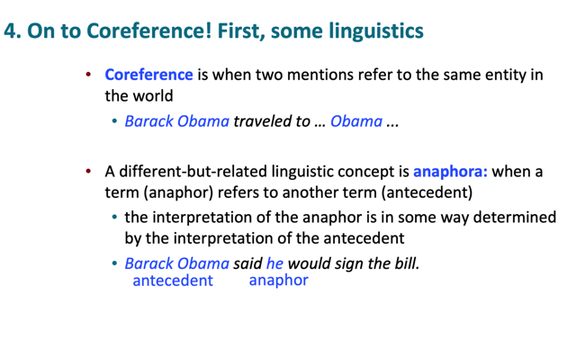</kbd>

> [!NOTE]
> Đại khái là gs nhắc đến một khái niệm khác với coreference nhưng cũng liên
> quan đến ngôn ngữ học. Đó là phép ẩn dụ (anaphora):
>
> Đại khái là, ví dụ như trong câu: Barack Obama đi đến nước Anh. .... Obama..
> . làm gì đó ,..Thì đại khái trong ví dụ này , Barack Obama và Obama là
> **coreference** cùng chỉ đến ông Obama.
>
> Tuy nhiên nếu nói "**Barack Obama** said **he** would sign the bill" thì chữ he và
> Obama lại quan hệ theo **vừa là coreference** mà **vừa là** **anaphoric
> relationship.**

 

<kbd>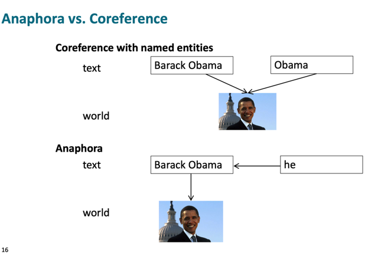</kbd>

 

<kbd>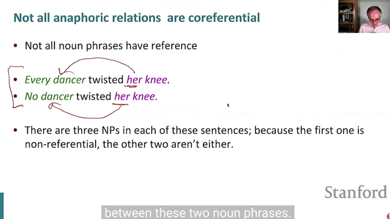</kbd>

> [!NOTE]
> Tuy nhiên không phải quan hệ anaphoric nào cũng coreferential. Ví dụ như 
> trong hai câu này, her có quan hệ anaphoric với Every dancer và No dancer
> nhưng every dancer, và no dancer không "ám chỉ đến ai cụ thể"  - tức là
> không có quan hệ coreferential ở đây

 

<kbd>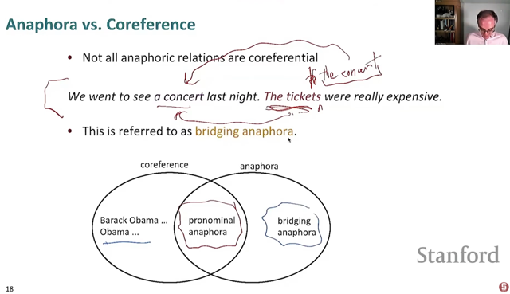</kbd>

> [!NOTE]
> Một ví dụ khác đó là "concert" và "the tickets" trong hai câu dưới đương nhiên
> là không có quan hệ coreferential (vì nó chỉ đến hai thứ khác nhau), nhưng lại
> có quan hệ anaphoric, vì "the ticket" có thể hiểu là "ticket to the concert". 
>
> Thế thì quan hệ anaphoric loại này gọi là "bridging anaphora" (phép ẩn dụ bắc
> cầu).
>
> Do đó đại khái là có 3 case:
>
> i) Vừa có coreference và anaphora, thì gọi là pronominal anaphora.
>
> ii) Chỉ có coreference như ví dụ Barack Obama hồi nãy.
>
> iii) Chỉ có anaphora, như ví dụ trên

 

<kbd>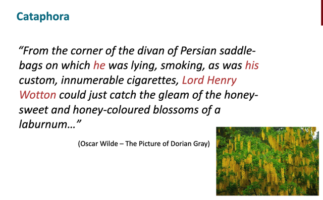</kbd>

> [!NOTE]
> Đại khái là gs cho biết thành tố "ana" trong anaphora có nghĩa là
> nhìn về trước đó - để tìm kiếm lai lịch (antecedent) 
>
> Và còn một loại nữa dù hiếm gặp hơn là **cataphora**- ví dụ trong
> câu này "he" và "his" chỉ đến / quan hệ với Lord Henry Wotton đứng
> đằng sau.

 

<kbd>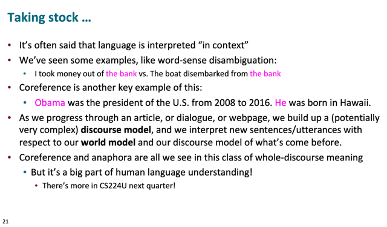</kbd>

> [!NOTE]
> đại khái là ý gs là mình đã biết rằng với ngôn ngữ con người thì để hiểu
> đúng (một từ, cụm từ, câu), ta luôn phải đặt nó trong bối cảnh (context)
>
> Thế thì việc biết về **coreference** và **anaphora** càng nhấn mạnh điều này.
>
> Và trong khuôn khổ của cs224n, ta sẽ chỉ làm việc tới hai quan hệ này.
>
> Tuy nhiên trong cs224U - Nature Language Understanding sẽ nói nhiều
> hơn.

 

<kbd>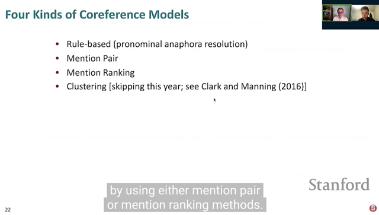</kbd>

> [!NOTE]
> gs sẽ nói về 4 loại Coreference Models

 

<kbd>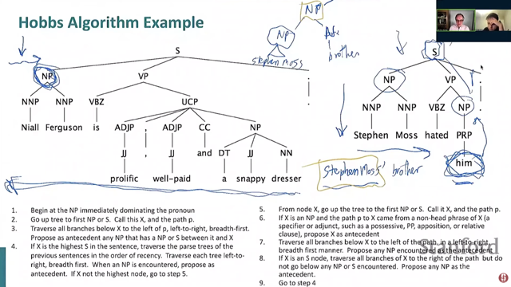</kbd>

> [!NOTE]
> slide này đại khái là gs giải thích sơ về thuật toán Hobbs. Thế thì có thể
> hiểu thuật toán Hobbs, như chính ông cũng tự gọi, đó là một thuật toán
> naive. Dựa trên đại loại kiểu như là những quy tắc mang mang tính chất
> cứng nhắc mà không dựa vào việc hiểu nội dung của ngôn ngữ. Có thể
> nói, thuật toán mang trong mình nhưng quy tắc nhất định tồn tại trong
> tiếng Anh, mà nếu làm theo thì cũng có thể  giúp xác định coreference
> một cách tương đối ổn.
>
> Ở đây gs chỉ minh họa sơ sơ, mình có thể hiểu thuật toán này đại loại
> như ví dụ trong câu Stephen Moss hated him. Thì để xác định "him" có
> acetedant là gì (ý là him cùng "ám chỉ" tới cái gì trước đó), thì ta sẽ xây
> dựng dependency tree như đã học. Và đi ngược lên từ "him" lên S. Sau
> đó theo các nhánh bên trái qua phải để tìm các NP,...
>
> Nói chung là có thể thấy cách hoạt động của thuật toán hoàn toàn không
> dựa trên ý nghĩa của các từ.

 

<kbd>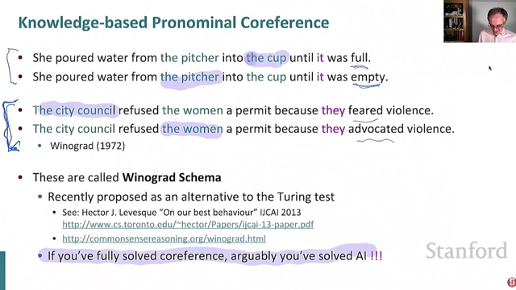</kbd>

> [!NOTE]
> Gs cho rằng tuy naive nhưng trước khi deep learning phát triển, thuật toán
> này luôn đóng một vai trò nhất định trong các hệ thống coreference.
> Tuy nhiên, như đã nói, bản thân ông Hobb cũng cho rằng không nên tin
> tưởng thuật toán này, vì tính "vô tri" của nó. Thay vào đó, ông cho rằng để
> làm tốt được bài toán này, nhất định phải dựa trên việc thật sự hiểu được 
> các ý nghĩa của từ ngữ, văn bản.
>
> Ở đây gs Cris dẫn ra hai ví dụ, mà dễ dàng thấy được rằng cấu trúc của 
> hai câu đều hoàn toàn giống nhau. Dẫn đến nếu theo các thuật toán kiểu
> như rule-based như trên thì kết quả sẽ cho ra giống nhau. Chỉ khi thật sự
> hiểu được ý nghĩa của các từ thì mới có thể làm đúng ở hai ví dụ này.
>
> Cuối cùng, đại khái là nhắc đến phép thử Turing - là một lập luận nổi tiếng
> cho rằng nếu ta có thể thiết kế hệ thống sao cho khi giao tiếp với con người
> mà họ không nhận ra đó là máy thì ta đã tạo ra trí tuệ nhân tạo. (Đại ý là vậy)
>
> Thế thì có những tranh cãi cũng như đề xuất những phép thử tốt hơn cho 
> AI, thì một trong số đó chính là việc dùng vấn đề coreference này. Nói ngắn
> gọn, đại ý quan điểm là nếu có thể giải quyết vấn đề coreference, yêu cầu
> máy tính phải thực sự hiểu được ngôn ngữ con người, vài khi đó cơ bản
> có thể coi đó là trí thông minh.

 

<kbd>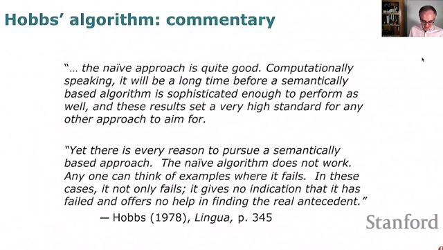</kbd>

> [!NOTE]
> Ok, đại khái ở đây gs dẫn hai nhận xét của gs Hobbs: Ý kiến đầu tiên ông cho
> rằng, về cơ bản có thể nói cách tiếp cận rule-based như thuật toán Hobbs
> cũng ít nhiều có tác dụng. Và có thể dùng nó như một base-line performance
> (kiểu như dùng tạm), trong khi chờ đợi các phương pháp khác dựa trên việc
> hiểu ngôn ngữ.
>
> Tuy nhiên ý sau ông cũng cho rằng đây vẫn là một thuật toán "ngây thơ, vô tri"
> (naive) và bất cứ ai cũng dễ dàng chỉ ra một vài ví dụ mà thuật toán sẽ làm
> sai. Và không những fail, nó còn không biểu thị bất cứ điều gì cho biết nó fail
> cũng như không giúp ích gì trong việc tìm ra actecendent thật sự (có thể hiểu
> ý này của ông là, à, đại khái là giả sử có những case khó, nó có cách nào đó
> cho ta biết rằng đây là ca khó, và từ đó cho ta phương hướng để giải quyết
> những ca khó này, nếu thế thì ít nhất cũng đỡ hơn. Còn ở đây đơn giản vì sự
> vô tri và làm theo quy tắc cứng nhắc, thì nó không nhưng làm sai trong các
> trường hợp đó mà nếu ta tin dùng nó ta cũng sẽ không được cảnh báo gì về
> những ca sai này)
>
> Tuy nhiên gs Cris cho rằng, nếu ta chiêm nghiệm kĩ hơn, ta sẽ thấy ngay cả
> hiện nay với machine learning, về bản chất, ta vẫn chỉ đang nhờ machine
> learning, deep learning tìm ra, học ra những quy luật về mặt statistic ẩn chứa
> trong  dữ liệu ngôn ngữ. Để rồi về bản chất, nó cũng đang học ra các rule
> giống như của Hobbs algorithm, chẳng qua là thay vì ta phải tự define rule, thì
> ta giao cho  nó tự tìm, tự define mà thôi.
>
> Thành ra, nếu hệ thống machine learning của ta chỉ đang học cách nhận ra
> các quy luật trong data, thì nó cũng chưa đủ tốt, cũng sẽ dễ dàng tìm ra các
> case mà nó sai, và trong những case đó, ta cũng sẽ chẳng được cảnh báo gì,
> hay biết tại sao nó sai.
>
> Tóm lại ý giáo sư Manning cho rằng, vẫn còn rất nhiều việc phải làm để có thể
> thiết kế được hệ thống machine learning thật sự hiểu vấn đề như cách con
> người hiểu, thì khi đó mới giải quyết rốt ráo bài toán coreference.

 

<kbd>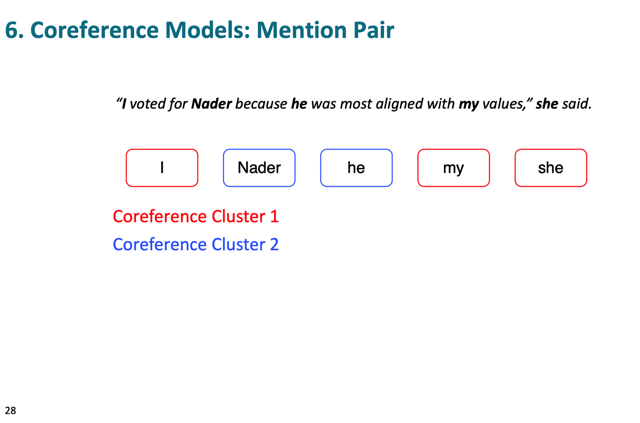</kbd>

> [!NOTE]
> tiếp theo đại khái là ta có thể xây dựng coreference models theo
> cách tiếp cận là như bài toán binary classification: dự đoán một cặp
> "mention" có phải là có quan hệ coreference hay không (cùng nói
> về một chủ thể hay không)
>
> Ta sẽ chuẩn bị labeled sample ví dụ như trong câu này: Có các mention
> và chúng tạo thành 2 cluster: I, my, she có quan hệ coreferential - cùng
> chỉ về một người, và Nader và he cũng chỉ về Nader.

 

<kbd>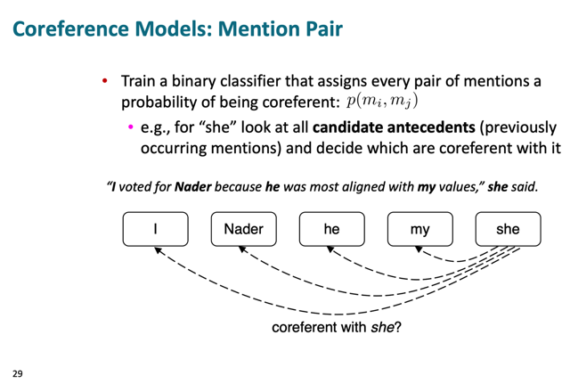</kbd>

> [!NOTE]
> Thế thì từ đó đại khái là ta sẽ "xét" / tạo các cặp mention-mention.
> và label nó là có hoặc không có quan hệ coreferential. Và ta sẽ
> train một binary classification model dự đoán xác suất một cặp
> mentions có quan hệ coreferential bao nhiêu.
>
> Ví dụ như từ she sẽ tạo thành 5 cặp mention, và việc xác định 
> từ nào là ancetedent của nó sẽ dựa vào model dự đoán cặp nào
> có p cao

 

<kbd>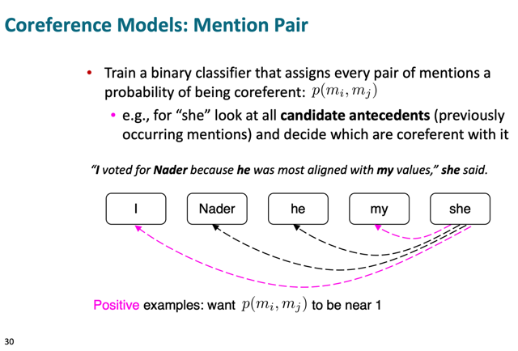</kbd>

> [!NOTE]
> Thế thì như đã nói, ta sẽ gán label cho các cặp,  vì trong
> câu này she, I, my có quan hệ coreference nên target của
> các cặp này là 1.

 

<kbd>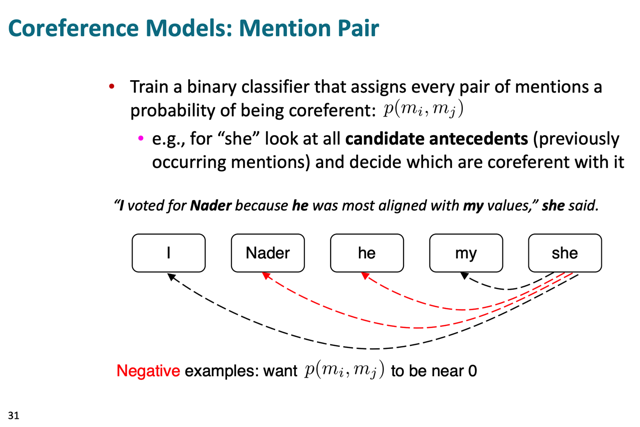</kbd>

> [!NOTE]
> Ngược lại, she không quan hệ coreference với nader, he
> nên target của các cặp này là 0

 

<kbd>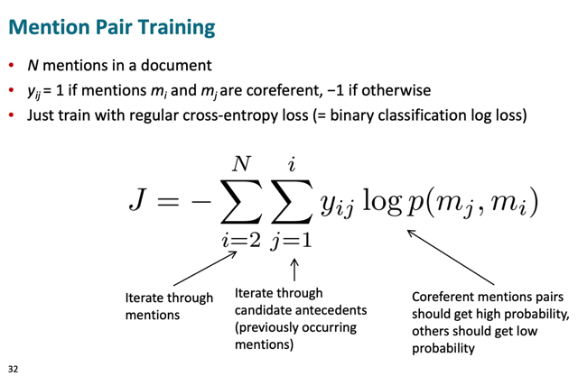</kbd>

> [!NOTE]
> và từ đó ta sẽ xây dựng cross entropy loss:
>
> Với mỗi một cặp mention, loss tại (cặp mentions) đó sẽ tính bằng:
>
> - y*log y^ với y^ là predicted likelihood của cặp đang xét p(mj, mi)
>
> Ở đây có thể hiểu thế này, thông thường trong binary classification problem,
> ta thấy binary cross entropy loss có dạng:
>
> - [ y*log(y^) + (1-y)*log(1-y^)] mà sao ở đây lại chỉ là - y*log(y^)
>
> Có thể hiểu đó là do cách gán label cho y. Trong trường hợp gán nó là 1 hoặc
> 0, thì dùng công thức đầu. Vì lúc này, loss sẽ là:
>
> - log(y^) khi y = 1, và log(1-y^) khi y = 0, để giảm loss model đều phải nâng y^
> lên khi y = 1, và giảm y^ về 0 khi y = 0.
>
> Còn trường hợp ta gán label y là 1 hoặc -1. Thì loss trong công thức sau sẽ
> là:
>
> - log(y^) khi y = 1, và log(y^) khi y = -1
>
> Để giảm loss model cũng phải đẩy y^ lên khi y = 1, và ép y^ xuống khi y = -1.
>
> Cho nên về cơ bản cũng đều dẫn dắt model prediction cho ra p(mi, mj) sát với
> target

 

<kbd>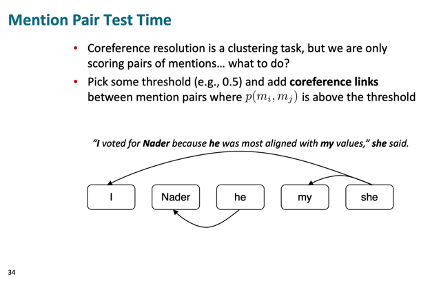</kbd>

> [!NOTE]
> at test time, ta sẽ cho model predict các cặp mention, ra các probability
> scores. Và từ đó ta sẽ threshold với mức 0.5 để quyết định nó có phải
> là coreference hay không

 

<kbd>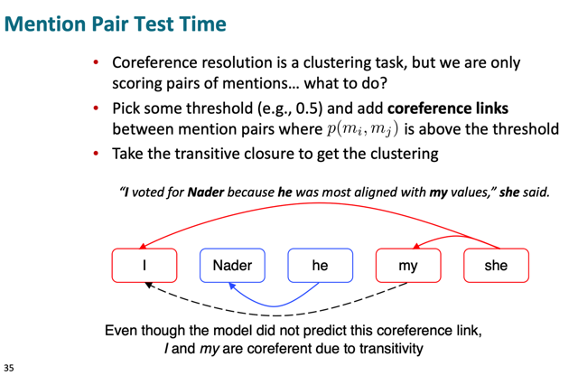</kbd>

> [!NOTE]
> Vậy thì trong slide đại ý là, coreference resolution vốn là bài toán clustering, tức
> là yêu cầu ta phải gom các mention cùng đề cập đến một chủ thể lại thành
> nhóm, trong khi tới đây ta chỉ đang có các cặp. Vậy chỉ đơn giản là ta sẽ "nối"
> chúng lại, ví dụ như đã xác định hai cặp (she, my) và (she, I) là coreference, thì
> "suy ra" (my, I) cũng là coreference. Để thành ra một cluster: {she, my, I}

 

<kbd>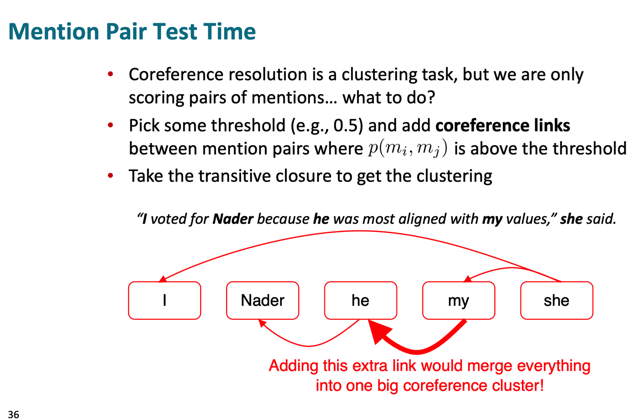</kbd>

> [!NOTE]
> Có điều các bước nối lại theo kiểu bắc cầu như này có thể dẫn đến việc
> một sai sót trong một cặp mention sẽ dẫn đến cả đám bị sai.

 

<kbd>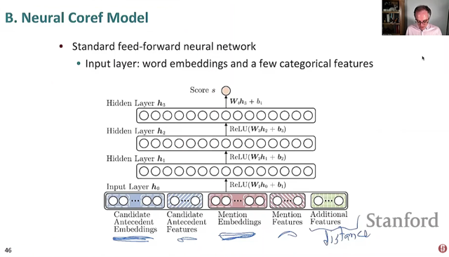</kbd>

> [!NOTE]
> đại khái là gs cho biết có nhiều mô hình được phát triển cho
> bài toán này, ví dụ như ở đây một mô hình dựa trên feed
> forward neural network

 

<kbd>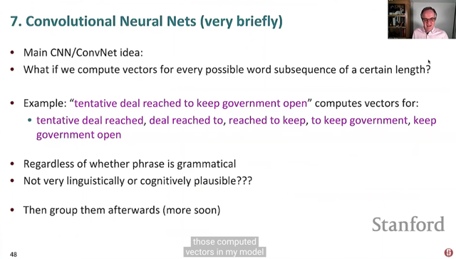</kbd>

> [!NOTE]
> gs nói sơ về CNN, dùng trong processing words, đại khái là nó giúp ta
> có thể tính / tạo ra embedding của từng cụm ví dụ như 3 từ liền nhau
> Trong bối cảnh của khóa học này, do từ đầu đến giờ gs chưa nói đến
> việc dùng convolution neural net. Nhưng như mình đã biết từ NLPSpec,
> hay Deep Learning Specialization, conv 1D layer có thể được dùng để
> capture close range relationship của các words. Trong assignment 4
> - build neural machine translation, ta cũng đã có sử dụng conv 1d layer.

 

<kbd>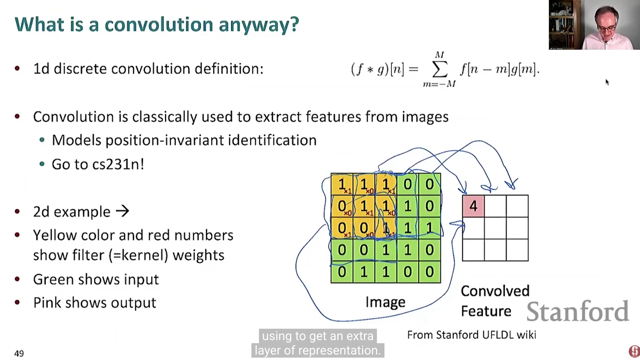</kbd>

> [!NOTE]
> ở đây giáo sư giải thích sơ về 2d convolution, mà ta đã quen thuộc từ DLSpec 
> hay cs231n: ở đây có thể nói ngắn gọn như sau:
>
> Tương ứng với mỗi vùng / gọi là receptive field, ta sẽ tính một phép dot-product
> giữa filter's value và tensor tương ứng từ image (hoặc input tensor). Và từ đó
> sẽ cho ra một feature map (filter sẽ có depth hay số channel bằng với số channel
> của input tensor) có spatial size nhỏ hơn hoặc bằng spatial size của input nếu
> dùng zero padding.
>
> Và nhiều filter sẽ cho ra nhiều feature map. Các feature map này sau đó được 
> stack lại với nhau theo depth dimension, tạo ra một tensor.
>
> Đương nhiên tương tự, adding bias và apply nonlinearity như relu.
>
> Trong slide gs có nhắc tới khái niệm position-invariant, ta đã được biết khái niệm
> này từ cs231n, có thể tạm hiểu là kiểu như tính chất một pattern nào đó xuất
> hiện trong image, sẽ không bị thay đổi chỉ vì ta thay đổi vị trí của pattern đó. Hay
> nói cách khác, giả sử filter có thể detect được một loại quy luật nào đó, một 
> đặc trưng nào đó (feature) trong image tại một position, thì nếu tại position khác,
> location khác, cũng tồn tại đặc trưng đó, thì filter cũng sẽ phát hiện ra.

 

<kbd>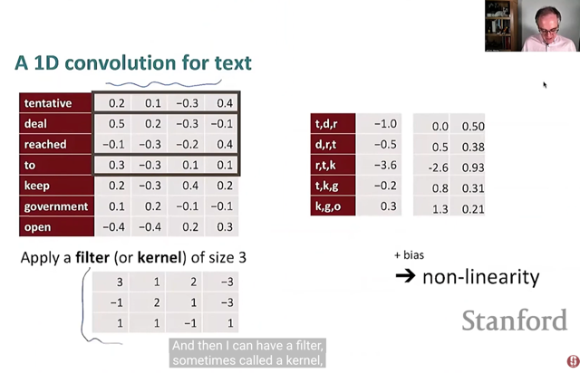</kbd>

> [!NOTE]
> Thế thì với NLP, ta có data dưới dạng chuỗi (1D), không phải là matrix 2D
> như image. Do đó ta làm việc với 1D convolution.Thế thì, có thể  nhớ lại rằng
> với 2D convolution, spatial dimension là (theo) chiều dài và rộng của image,
> và depth là bề sâu, là số channel của input. (Ví dụ color image sẽ có 3
> channels RGB)
>
> Thế thì, giả sự dùng kernel size 2x2, thì tại mỗi phép tính convolution, ta có
> thể hình dung phép dot product giữa kernel tensor có shape 2x2x3 và một
> tensor cũng có shape 2x2x3 "cắt ra" từ input. Và phép dot product xảy ra
> giữa hai 3D tensor cũng hoàn toàn tương tự như dot product của hai matrix
> hay vector: Đó là nhân hai vị trí tương ứng của hai tensor với nhau rồi cộng
> tất cả các kết quả lại.
>
> Vậy thì ta có thể hình dung theo cách khác đó là tổng của 2*2 = 4 phép dot
> product của hai "depth vector" tương ứng, mỗi vector có 3 components.
>
> Từ đó, quay lại 1D convolution, như trong slide chính là có kernel size = 3 thì,
> có thể  xem như mỗi convolution operation là tổng của 3 phép dot product
> của 3 cặp vector.  Với mỗi cặp, một vector sẽ từ input, chính là embedding
> vector của nó và một vector còn lại là của filter.
>
> Với mỗi filter sẽ cho một sequence các features mới, nếu dùng zero padding,
> ta cũng sẽ giữ nguyên độ dài chuỗi (nhưng trong slide thì không). Sau đó ta
> cũng add bias,  và apply non-linearity

 

<kbd>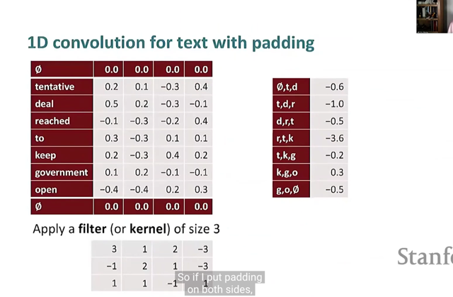</kbd>

> [!NOTE]
> và gs cũng nói đến same padding, giúp ta có thể giữ nguyên chiều
> dài chuỗi sau khi convolution

 

<kbd>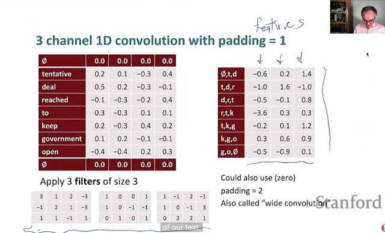</kbd>

> [!NOTE]
> Và cũng như đã nói, conv layer không chỉ có một filter, mà là nhiều filter.
> Vậy cũng như với conv2D xử lí image, để mỗi filter cho một feature map,
> nhiều filter cho nhiều feature map để ta có thể stack chúng lại
>
> Thì với conv1d xử lí sequence of word cũng vậy mỗi filter cho  một
> feature "sequence". Và nhiều filter cho ra nhiều feature  sequence, ta
> cũng stack lại để thành ra ứng với mỗi từ ban đầu ta có một feature
> vector cho nó (mỗi vị trí lấy từ một feature  sequence). Và feature vector
> này, hay có thể xem như là  short-range contextual representation của nó,
> phản ánh thêm bối cảnh ở phạm vi gần của nó thay vì chỉ là word
> embedding ban đầu.

 

<kbd>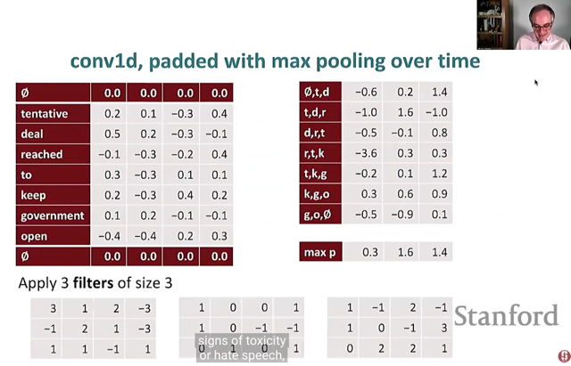</kbd>

> [!NOTE]
> và ta cũng có max hay average pooling. Điểm đáng chú ý ở đây, nếu làm
> max pooling như minh họa trong slide này, thì ta có thể thấy là kernel size
> của phép pooling đang là "toàn bộ chuỗi" - điều này cũng như ta max
> pooling với size 10x10 lên một tensor output từ conv layer có spatial size =
> 10x10xD (D là  số channel, là số filter của conv layer).
>
> Để rồi kết quả trở thành chỉ còn 1x1xD mang hình ảnh giống như từ một "
> feature tensor"  10x10xD (D cái feature map 10x10 stack lại với nhau) trở
> thành một "depth" vector có D  components (1x1xD thì coi như 1 vector có D
> phần tử)
>
> Thì đây cũng vậy, ta thấy phép max-pooling diễn ra với toàn bộ feature
> sequence để rồi với mỗi feature sequence, ta được một scalar. Và với 3
> feature sequence ta được 1 vector có 3 component.
>
> Và theo gs ta có thể coi vector này như sentence representation.
>
> Cuối cùng gs cũng cho ta biết thường max pooling work better và cũng hay
> được dùng hơn average pooling nhờ mang ý nghĩa giúp khuếch đại tín hiệu

 

<kbd>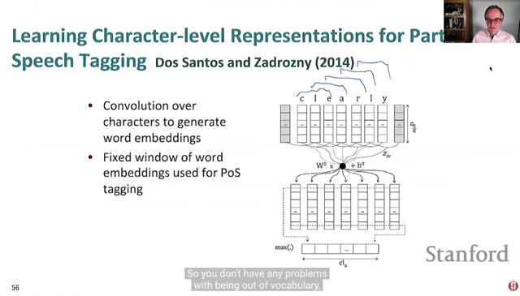</kbd>

> [!NOTE]
> Đại khái là, gs lướt qua về một nghiên cứu về việc "tạo / learn" word
> embedding từ character embedding.
>
> Có thể hiểu ví dụ như ta có từ "clearly", thì mỗi character ta sẽ chuẩn
> bị cho nó một character embedding vector. Sau đó, dùng conv1D
> để convol các character embedding theo cách đã mô tả ở slide trước.
> Và sau đó dùng max pooling để tạo ra word embedding - represent cho
> từ "clearly".
>
> Cách làm này giúp khắc phục vấn đề out of vocabulary token / word khi
> dùng các pretrained word embedding như GloVe.

 

<kbd>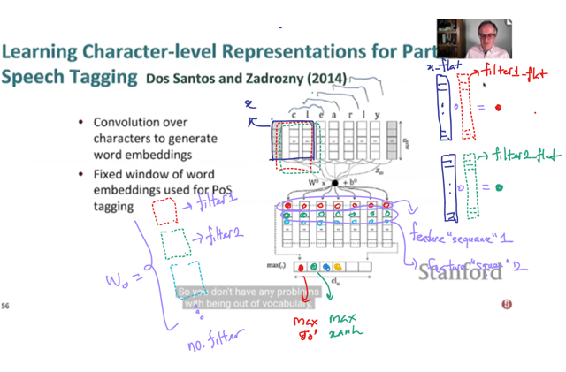</kbd>

> [!NOTE]
> Để tránh confuse thì có thể hiểu W0x + b0 không phải là linear transformation
> như trong linear layer.
>
> Mà W0 đại diện cho **một filter**, và **x** đại diện **cho một "vùng"** của input
> được convolution. Ví dụ dùng kernel size là 3.
>
> W0 sẽ đại diện cho một filter, ví dụ filter đầu tiên, dùng màu đỏ, như đã biết
> cũng sẽ là một tensor đương nhiên có "spatial size" là kernel size = 3, và s
> channel = số channel (hay depth) của input chính là kích thước của character
> embedding d_char. Thì phép convol đầu tiên input ta sẽ có input ứng với 3
> character: 'c', 'l', 'e'.  Ta có 3 character embedding tạo thành một matrix x có
> shape (3,d_char).
>
> Vậy để tính phép convolution, thực chất cũng chỉ là phép dot product giữa hai
> tensor: filter tensor và input "sub" tensor. Thế thì cũng có thể xem như ta
> flatten hai cái tensor đó ra, và tính dot product giữa hai vector. Để ra kết quả
> là 1 scalar (chấm đỏ, đầu tiên của cái result vector đầu tiên). Có thể add thêm
> bias.
>
> Tương tự với các "vùng khác" của input, ta cũn tính tương tự, để được một
> hàng các chấm đỏ.
>
> Và với các filter thứ 2, màu xanh lục, ta được hàng chấm xanh lục.
>
> Và với các filter còn lại cũn tương tự.
>
> Thế thì mỗi một vector, ta sẽ lấy max. Để cuối cũng chỉ còn 1 vector duy nhất
> chứa [max đỏ, max xanh lục,....] đó chính là word embedding
>
> ====
>
> Tóm lại, W0 ý là một filter, được flatten, và x là một tensor ứng với một vùng 
> trên spatial dimension của input, all depth, và cũng được flatten. Để rồi
> W0x hiểu là dot product của chúng.

 

<kbd>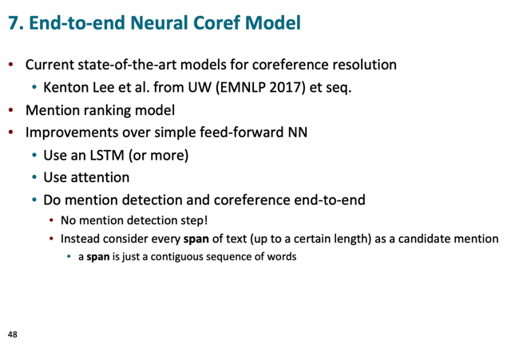</kbd>

> [!NOTE]
> tiếp gs nói đến model đầu tiên dùng cách tiếp cận end-to-end, trong đó,
> cải tiến hơn mô hình chỉ dùng feed-forward neural network đơn gỉan hồi
> nãy, đồng thời cũng không còn bước mention detector.
>
> Thay vào đó, nó sẽ coi mọi chuyển các token liên tiếp (giới hạn bởi một
> số lượng nào đó) là ứng cử viên của một mention. Và model sẽ dự đoán
> xem nó có phải là mention hay không cũng như là các mention có
> coreferential relation không

 

<kbd>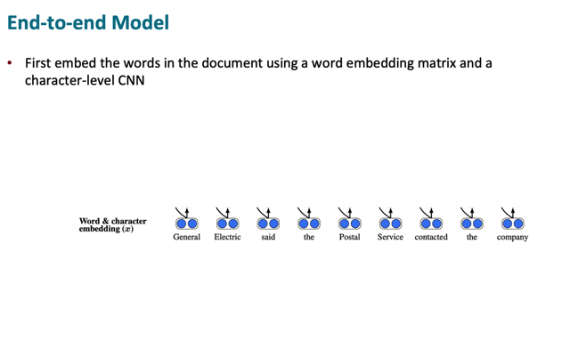</kbd>

> [!NOTE]
> Bắt đầu với việc các từ sẽ được embed với standard word
> embedding như word2vec hay glove.
>
> Và có thể được kết hợp với cả character level word embedding
> đã nói hồi nãy

 

<kbd>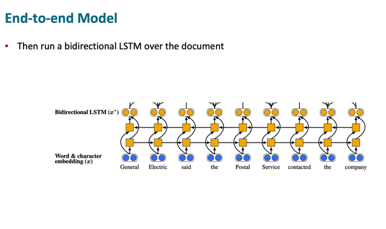</kbd>

> [!NOTE]
> Tiếp theo, word embeddings sẽ feed vào Bidirectional LSTM, như đã biết
> sẽ giúp capture long-short range relationship giữa các word trong sentence
> hay nói cách khác giúp tạo các hidden state nắm bắt quan hệ của các từ
> với nhau trong câu, bối cảnh của từ trong câu.

 

<kbd>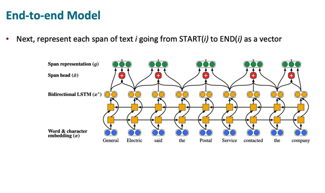</kbd>

> [!NOTE]
> Tiếp theo, như đã nói, ta sẽ xét các span - đóng vai trò là mention candidates 
> bằng cách xét các chuỗi từ liên tiếp nhau.

 

<kbd>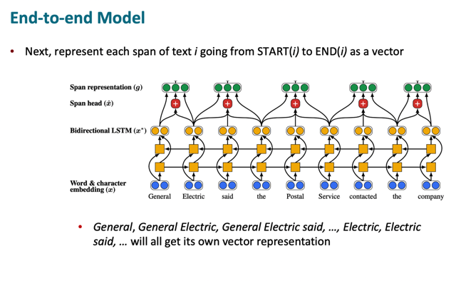</kbd>

> [!NOTE]
> ví dụ, đặt giới hạn là 3 thì ta sẽ có các span:
> General, General Electric, General Electric said,
> Electric, Electric said, Electric said the, ..

 

<kbd>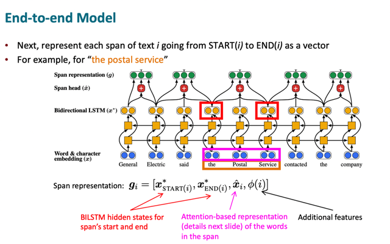</kbd>

> [!NOTE]
> Và ta sẽ tạo vector representation cho các span này ví dụ với span i, ta tính
> g_i bằng cách concatenate các vector:
>
> i) hidden state của từ đầu tiên trong span x*START_i
>
> ii) hidden state của từ cuối của span x*END_i
>
> iii) x^_i là vector đại diện cho cả span, tính bằng attention mechanism, như sẽ
> nói ở slide sau, nhưng đại khái là nó sẽ là linear combination các word
> embedding của các từ trong span với weight là mức độ quan trọng tương đối
> của mỗi từ
>
> iv) additional features

 

<kbd>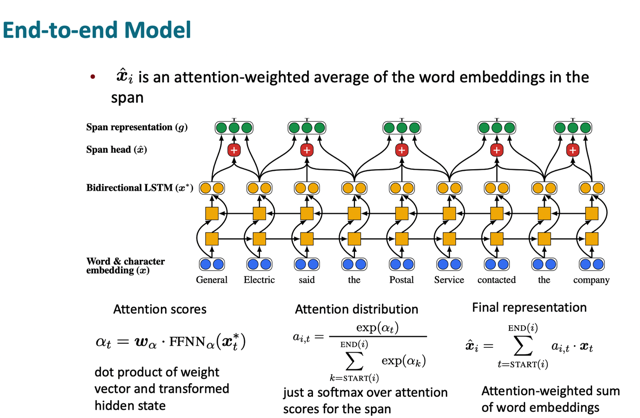</kbd>

> [!NOTE]
> Thế thì attention ở đây hơi khác chút với các attention mechanism đã từng
> gặp - khi mà trong đó ta dùng attention để đại khái là**tạo một
> representation mới cho một từ** trong câu bằng cách **tính linear
> combination các word vector của các từ khác**,**nhiều hay ít tùy thuộc
> mức độ relevant giữa từ đó với từ đang xét**, và mức độ relevancy này
> thường được tính bởi mộ**t similarity score** như cách đơn giản nhất là
> **dot product.**Kết quả mang ý nghĩa là ta có vector mới phản ảnh thêm
> thông tin bối cảnh của các từ xung quanh.
>
> Còn ở đây, mục đích chính là ta muốn combine các word vector với mức
> độ nhiều ít tùy vào sự quan trọng của mỗi từ trong span. Và do đó trong
> attention này không phải là tính mức relevant giữa hai từ nào cả, thành ra
> người ta dùng một feed-forward neural net và một vector w_alpha để  học
> mức độ quan trọng của mỗi từ.
>
> Do đó ta sẽ pass các HIDDEN STATES x*_t của các từ trong span vào
> FFNN, kết quả được dot product tiếp với một weight vector w_alpha để có
> các attention scores. Sau đó như thường lệ, ta dùng softmax để biến thành
> attention weights và tính linear combination các word EMBEDDING x_t

> [!NOTE]
> Có thể tập đào sâu hơn với câu hỏi tại sao dùng hidden state khi tính
> attention scores và dùng embedding trong linear combination:
>
> Thì đại khái là với attention scores, ta cần thông tin chứa quan hệ qua
> lại giữa các từ trong câu bởi lẽ mục đích là đánh giá mức độ quan trọng
> tương đối của các từ so với nhau. Do đó dùng hidden state sẽ giúp model
> dễ học ra được điều này hơn.
>
> Còn word embedding - vốn dĩ chỉ mang thông tin về ý nghĩa của các từ
> một cách đơn lẻ, riêng biệt (chưa qua LSTM để có thông tin bối cảnh) nên
> sẽ không hiệu quả bằng hidden state trong việc xác định từ nào là quan
> trọng hơn từ nào trong span.
>
> Tuy nhiên, khi linear combination, ta dùng word embedding là bởi mục đích
> là đang tính một x^_i mang ý nghĩa là span embedding, một vector phản
> ánh ý nghĩa của span, do đó, sẽ hợp lí khi ta dùng word embedding, nơi
> còn chứa thông tin các từ ở dạng riêng biệt, chứ hidden state thì kiểu như
> nó đã trộn lẫn thông tin của các từ với nhau, và thậm chí là chứa thông tin
> của các từ ở xa không nằm trong span nữa.

 

<kbd>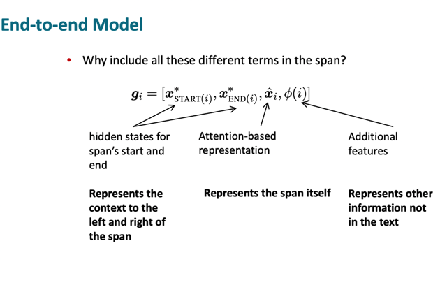</kbd>

> [!NOTE]
> slide này cho biết lí do gì mà phải tính span representation với
> nhiều thứ như vậy:
>
> i) thì hidden state của start và end word sẽ đại diện cho , chứa thông tin
> cho biết bối cảnh xung quanh của span.
>
> ii) x^_i đương nhiên mang thông tin ý nghĩa của bản thân span.
>
> iii) Và một số thông tin cộng thêm

 

<kbd>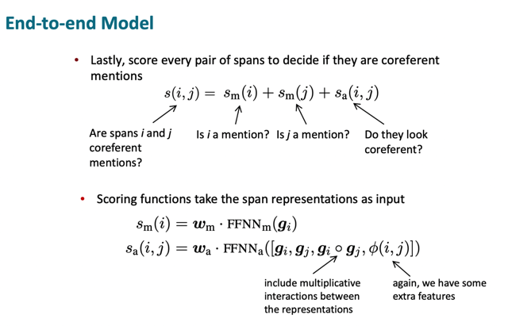</kbd>

> [!NOTE]
> Cuối cùng là ta sẽ tính điểm (scoring) cho mọi cặp span (như đã nói,
> đóng vai trò mention candidates) và nó sẽ là tổng của: điểm số cho việc
> khả năng hai mention candidate này là mention và điểm số cho việc hai
> mention này coreference nhau
>
> Và scoring function cũng sẽ dùng feed-forward neural network theo sau
> là một phép dot product với weight vectors.

 

<kbd>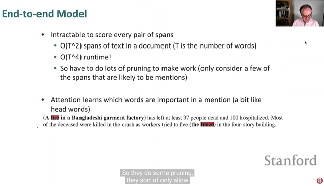</kbd>

> [!NOTE]
> đại khái là việc chấm điểm mọi cặp span là không khả thi khi số span
> sẽ tăng theo O(T^2) tức số từ càng nhiều thì số span sẽ tăng theo cấp
> mũ 2. Do đó, cần phải làm nhiều động tác pruning, có thể hiểu là bỏ đi
> bớt, chỉ chọn những span có khả năng cao là mention thôi

 

<kbd>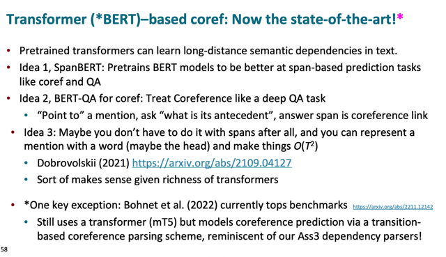</kbd>

> [!NOTE]
> đại khái là sau khi Transformer-based LLM ra đời thì nó tỏ ra rất tốt trong
> các task này, trong bài QA, Danqi có nhắc đến SpanBERT, trong đó người
> ta thay đổi cách train BERT, bằng cách cho model predict một " span" - một
> chuỗi nhiều từ thay vì chỉ một từ.
>
> Nhờ đó, nó tỏ ra tốt hơn trong việc nắm bắt các **long-distance semantic
> dependencies**và từ đó làm tốt các tác vụ như QA hay Coreferential
> resolution
>
> Ngoài ra, người ta có thể dùng BERT-QA cho coref bằng cách coi nó như
> bài toán QA bằng cách hỏi model rằng antecedent của một mention là gì,
> đại loại là vậy.
>
> Ngoài ra còn một số cách tiếp cận khác gs không đủ thời gian nói đến

 

<kbd>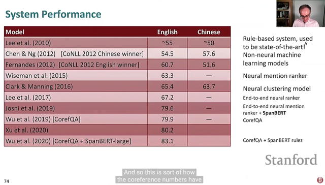</kbd>

> [!NOTE]
> so sánh performance của các model, trên cùng là rule-based system, và
> trong số các cách tiếp cận không dùng neural network thì nó là tốt nhất.
>
> Sau đó, các neural network based model đạt kết quả tốt hơn 
>
> Và cuối cùng là những Transformer-based model có kết quả tốt nhất.

 

<kbd>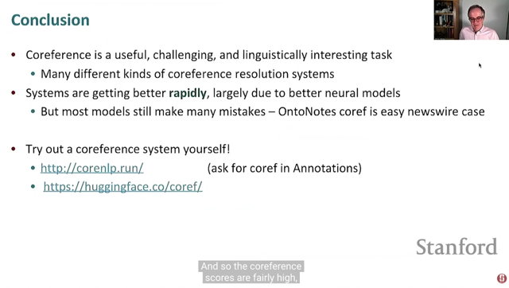</kbd>

> [!NOTE]
> tuy vậy gs đề nghị ta lưu ý rằng, những model trên đều train and test trên
> OntoNotes - cơ bản là các bài báo, tin tức, và theo gs thì nhiệm vụ
> Coreference trên bối cảnh này tương đối dễ, so với dialog, hay văn chương
> ...
>
> Thành ra, chưa chắc rằng điểm số của các model vừa nói cao có nghĩa là
> ta đã giải quyết được nhiệm vụ này đâu, vì khi đưa cho chúng những văn
> bản trong các thể loại khác, ta sẽ thấy khả năng của nó không được cao
>
> Tóm lại còn phải nghiên cứu thêm nữa.

 

