# Lecture 14: Insights Between NLP And Linguistic

📊 **Progress:** `32` Notes | `40` Screenshots

---

<kbd>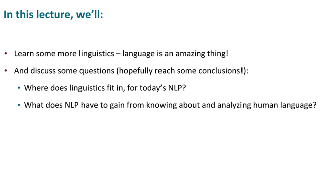</kbd>

> [!NOTE]
> Có vẻ như lecture này, ta sẽ được học một số kiến thức của Ngôn ngữ
> học, và từ đó thảo luận một số vấn đề như ngày nay, vai trò của Ngôn
> ngữ học trong NLP như thế nào, cũng như là nhưng gì mà NLP đã và
> chưa làm được trong việc hiểu biết ngôn ngữ

 

<kbd>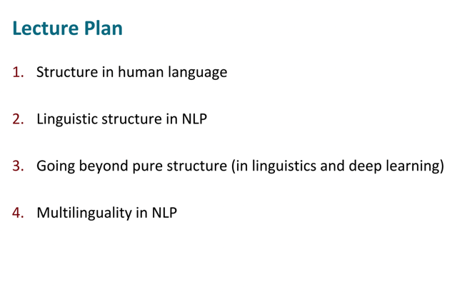</kbd>

 

<kbd>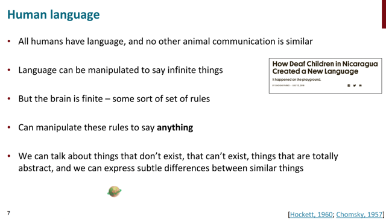</kbd>

> [!NOTE]
> đại khái là bạn ấy nói về sự kì diệu của ngôn ngữ con người, khi
> không loài nào khác có thể so sánh được, khi ngôn ngữ con
> người có thể express bất kì điều gì. kể cả thứ tồn tại hay không
> tồn tại, trừu tượng hay hữu hình.

 

<kbd>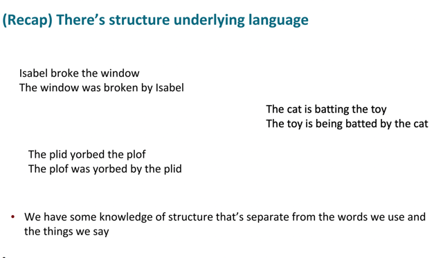</kbd>

> [!NOTE]
> và ngôn ngữ có cấu trúc, có quy luật. Ví dụ như kể cả dùng những từ vô
> nghĩa như hai câu dưới thì ta vẫn nhận ra dạng chủ động và bị động của nó

 

<kbd>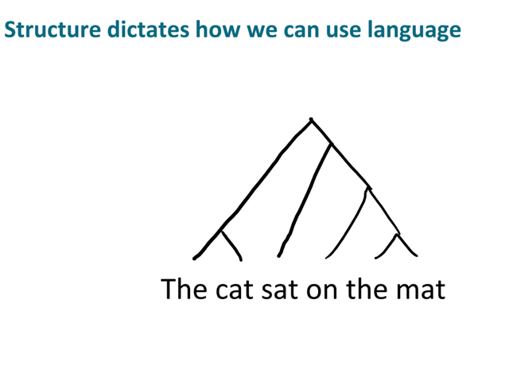</kbd>

> [!NOTE]
> ta có thể vẽ nên một tree như trong bài
> dependency parsing đã học

 

<kbd>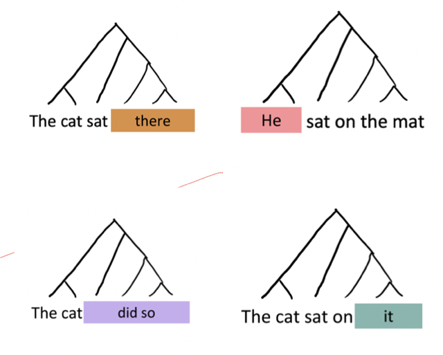</kbd>

> [!NOTE]
> thế thì đại khái là bạn ấy nói rằng đây là kiến thức trong lớp
> Ngôn ngữ học, và sở dĩ nó quan trọng bởi ta có thể dựa vào
> đó mà có những luật: ví dụ ta có thể thay một subtree bằng
> một cụm từ khác, ví dụ "on the mat" (là một subtree) bằng "
> there", "did so"...
>
> Hay "The cat" là một subtree, có thể được thay bằng "He"

 

<kbd>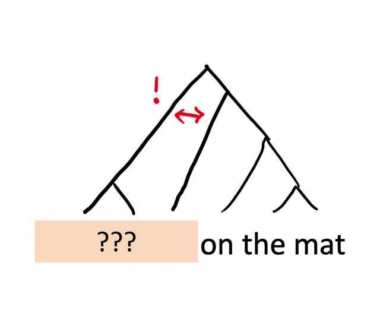</kbd>

> [!NOTE]
> Tuy nhiên ta không thể thay "The cat sat"
> bằng một cụm khác vì nó không tạo thành
> một subtree. đại ý là vậy

 

<kbd>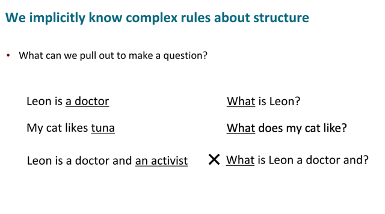</kbd>

> [!NOTE]
> có thể hiểu đại khái là chúng ta biết có nhiều luật ngầm (implicitly) về
> cấu trúc của ngôn ngữ. Một ví dụ để minh họa điều này là quy luật chi
> phối việc ta có thể đặt câu hỏi như thế nào:
>
> Kiểu như nếu từ câu "Leon là một bác sĩ" ta có thể hỏi "Leon làm gì"
> thì với "Leon là bác sĩ và nghệ sĩ chơi piano" ta có thể hỏi "Leon làm
> nghề gì" nhưng không thể hỏi "Leon là bác sĩ và là gì? (đại khái là vậy,
> ý là hỏi kiểu đó ta thấy sẽ rất kì cục, nói chung ý là có nhiều cách diễn
> đạt mà ta dù không được học một cách cụ thể cũng tự biết nó không
> đúng, kì kì,...Thế thì đó đều là những minh họa cho những quy luật
> ngầm trong cấu trúc ngôn ngữ, mà dù không nói ra ta vẫn biết nó tồn
> tại

 

<kbd>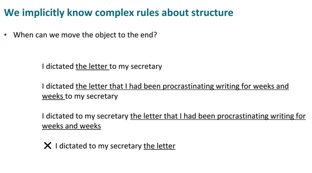</kbd>

> [!NOTE]
> đại khái là thêm một ví dụ về những luật ngầm như vậy trong ngôn ngữ. Để ý
> câu 2 và 3, ta có thể cho phép đem "the letter that...weeks" để ở sau hoặc
> trước "to my secretary" đều đúng
>
> Tuy nhiên, cũng y vậy nhưng "the letter" chỉ có thể đứng trước "to my secretary"
> chứ sẽ kì cục khi nó đứng sau.

 

<kbd></kbd>

> [!NOTE]
> đại khái là Grammar kiểu như là tổng hợp của mọi quy tắc (rules) như
> vậy, và có thể cho rằng cộng động người nói tiếng Anh chia sẻ với nhau
> một bộ các quy tắc đồng thuận về ngôn ngữ

 

<kbd>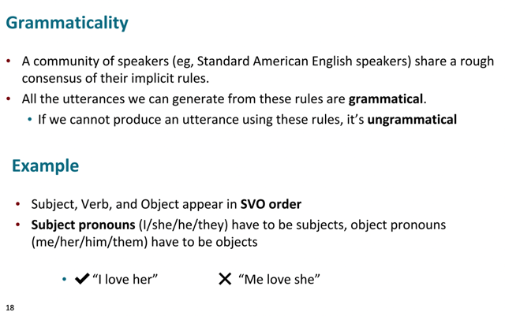</kbd>

> [!NOTE]
> tiếp đại khái là nói qua vài ví dụ. Như vừa nói, grammar chỉ là tập hợp một
> bộ các rule, được đồng thuận bởi một cộng đồng nói tiếng. Thành ra nếu
> câu nói mà tuân theo luật thì gọi là đúng ngữ pháp còn không thì gọi là
> không đúng ngữ pháp.
>
> Một ví dụ là trong tiếng anh có rule quy định rằng subject verb object phải
> theo thứ tự đó. Và subject pronouns phải là subjects và object pronouns
> phải là objects. Nên "Me love she" là sai ngữ pháp

 

<kbd>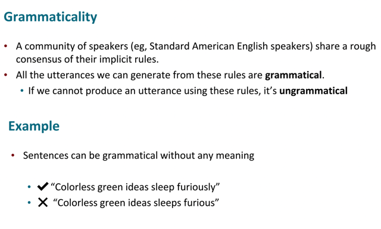</kbd>

> [!NOTE]
> Đây là ví dụ cho thấy việc đúng ngữ pháp có thể không đồng nghĩa với việc
> nó có nghĩa. Như câu đầu ở đây dù vô nghĩa nhưng vẫn đúng ngữ pháp.

 

<kbd>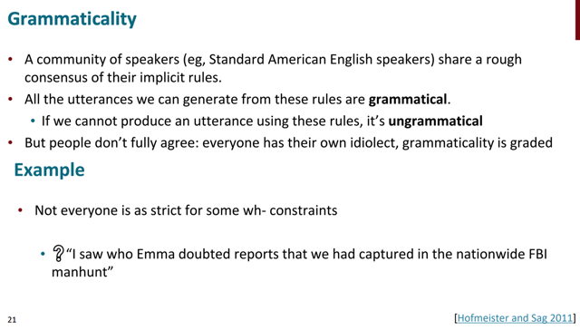</kbd>

> [!NOTE]
> Một ví dụ khác, đại khái là cho thấy**không phải tất cả mọi người đều 
> đồng thuận nhau** về các quy tắc, ví dụ như trong câu "I saw who Emma...."
> nói chung đọc câu này thấy khá bối rối không biết who là để chỉ ai.

 

<kbd>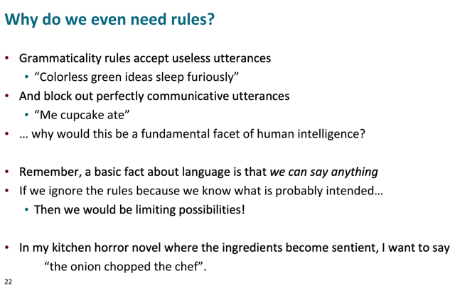</kbd>

> [!NOTE]
> đại khái là ta sẽ có thể thấy mắc cười là, ngữ pháp cho phép một số câu
> vô nghĩa (nhưng đúng về ngữ pháp), vậy mà lại "cấm đoán" những câu
> tuy sai ngữ pháp như ta hoàn toàn có thể hiểu nghĩa của nó (như "Me
> cupcake ate")
>
> Tức là, ý muốn nói tồn tại những mâu thuẫn, trong khi ta luôn nói ngôn
> ngữ là khía cạnh quan trọng trong trí tuệ của loài người.
>
> Và có một sự thật rằng ta thật ra có thể nói bất cứ thứ gì. Do đó, việc
> rằng buộc trong các quy tắc đồng thuận này có thể khiến ta bị giới hạn
> trong một số khả năng.
>
> Lấy ví dụ, như trong một tiểu thuyết kinh dị, ta có thể muốn nói rằng
> "củ hành ăn thịt đầu bếp"

 

<kbd>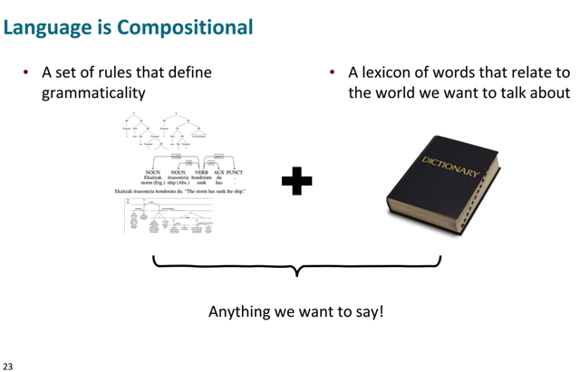</kbd>

> [!NOTE]
> tóm lại, ngôn ngữ là cấu thành bởi tất cả
> những từ vựng, cộng với những bộ quy tắc
> định nghĩa ra ngữ pháp

 

<kbd>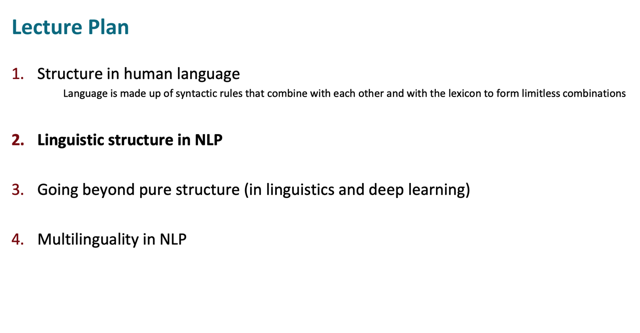</kbd>

 

<kbd>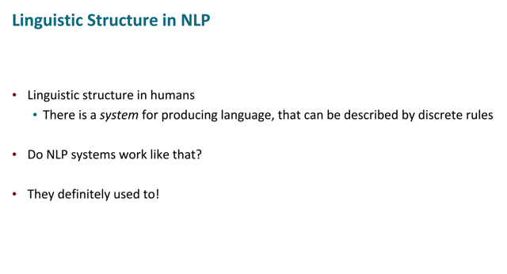</kbd>

> [!NOTE]
> Ok, thế thì ta vừa nhận định rằng các cấu trúc ngôn ngữ học của con
> người, là một hệ thống tạo ra ngôn ngữ và có thể được mô tả bởi những
> quy phạm, quy tắc rời rạc. 
>
> Thế thì những hệ thống NLP thì sao, chúng có làm việc như vậy không?
>
> (Hỏi vậy là sao, vì sao -> thì ý là ta xây dựng các hệ thống NLP để mà 
> bắt chước, học theo ngôn ngữ của con người, thì đương nhiên sau khi
> đã nhận định như vậy về ngôn ngữ con người thì phải hỏi xem NLP có
> làm được vậy không chứ)

 

<kbd>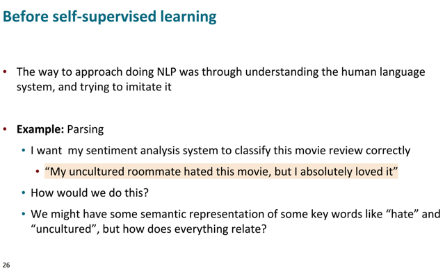</kbd>

> [!NOTE]
> câu trả lời là dĩ nhiên là có. Trước khi có self-supervised learning (ý nói
> đến việc pretraining các LLM), thì cách tiếp cận của NLP luôn là cố gắng
> tạo các hệ thống hiểu bắt chước human language system. Mà ví dụ là
> parsing ta đã học.
>
> Như trong nhiệm vụ sentiment classify câu này để xem review là positive
> hay không.
>
> Thế thì, ta đã có các vector (representation) nắm bắt được ý nghĩa, ngữ
> nghĩa của các từ như "hate", "uncultured" rồi, tuy nhiên để hiểu đúng
> sentiment của câu ta cần xem xét các quan hệ của các từ này.

 

<kbd>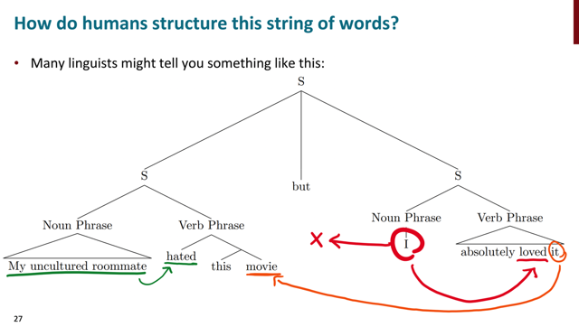</kbd>

> [!NOTE]
> thế thì thực tế (ý nói sự thật, trong ý nghĩa thật của câu này) quan hệ giữa
> các từ như vầy: My uncultured roomate thì quan hệ đến "hated", còn "I" thì
> quan hệ đến "loved"  và "it" lại quan hệ đến "movie" thành ra ta (là con
> người) có thể hiểu rằng, àh, tuy thằng bạn không cùng văn hóa ghét bộ
> phim nhưng tôi, thì thích.
>
> Thế thì ví dụ này cho thấy để hiểu được ý nghĩa của câu, ta phải hiểu rất
> rõ, từ nào quan hệ với từ nào trong câu.

 

<kbd>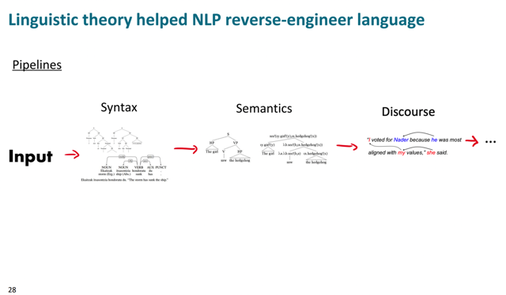</kbd>

> [!NOTE]
> Thế thì đại khái là, các lý thuyết về ngôn ngữ học khi đó giúp NLP kiểu
> như phân tích được các quan hệ này. Từ đó, cải thiện các tác vụ sau đó.

 

<kbd>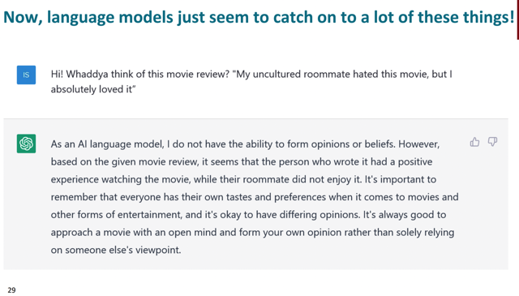</kbd>

> [!NOTE]
> Tuy nhiên với LLM, nó có vẻ như đã dễ dàng hiểu được các quan hệ này, ý
> nói, có vẻ như vai trò của việc đưa các lí thuyết ngôn ngữ học vào NLP
> system không còn cần thiết nữa

 

<kbd>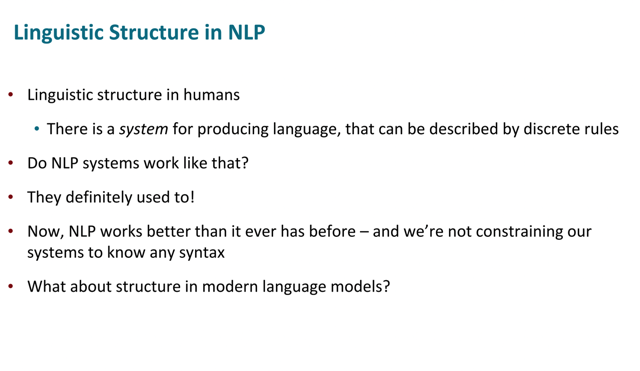</kbd>

 

<kbd>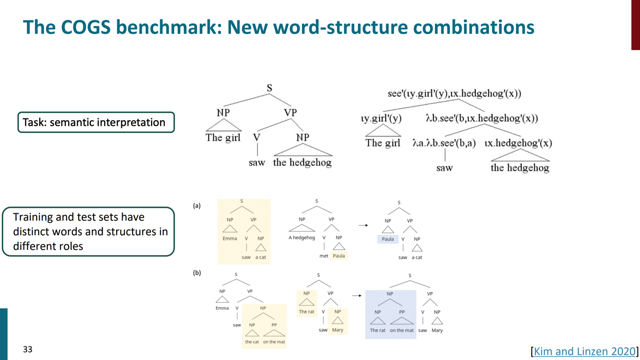</kbd>

> [!NOTE]
> đại khái là một benchmark giúp đánh giá khả năng của model trong việc
> nhận ra, học được các cấu trúc trong ngôn ngữ. Cụ thể là, ví dụ như
> đánh giá xem rằng model có hiểu rằng, một từ ví dụ Emma có thể đóng
> vai trò subject trong câu này nhưng object trong câu kia không.
>
> Nói rõ hơn là, mô hình ngôn ngữ khi training có thể chỉ thấy "Jim nhìn con
> mèo" nhưng ngôn ngữ con người đương nhiên cho phép nói rằng " con
> mèo nhìn Jim". Do đó cái ta cần đánh giá model là khả năng hiểu được
> điều đó, chứ không phải là lúc nào con mèo cũng chỉ có thể là object.

 

<kbd>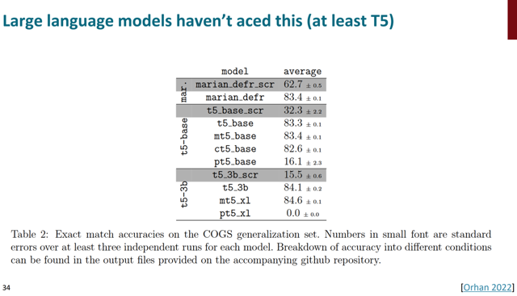</kbd>

> [!NOTE]
> đại khái là kết quả cho thấy llm chưa
> thật sự giỏi ở nhiệm vụ này

 

<kbd>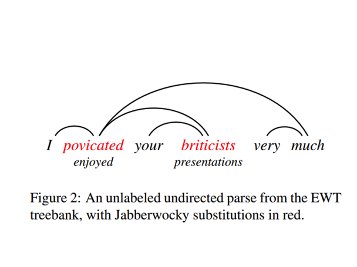</kbd>

<kbd></kbd>

<kbd>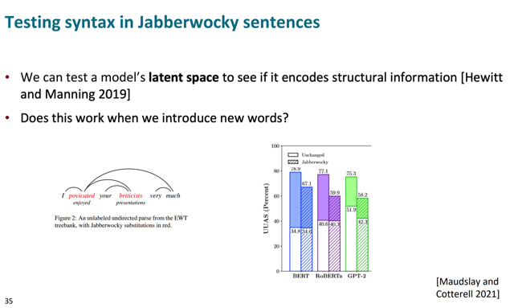</kbd>

> [!NOTE]
> đại khái là người ta thử nghiệm vầy, đó là dùng một câu bình thường mà
> là trong đó model đã làm tốt việc dependency parsing. Sau đó người ta
> sẽ thay các từ trong câu đó bằng các từ "bịa ra", tức là những từ vô
> nghĩa và ta xem thử model còn làm tốt được không.
>
> Logic là, não người dễ dàng nhận ra rằng, dù là từ vô nghĩa, ví dụ như
> "povicated" nhưng nó vẫn sẽ là một động từ vì nó đúng sau I.
>
> Tương tự, briticists cũng sẽ là một object. Nói chung, đây là một loại cấu
> trúc / quy luật của ngôn ngữ không liên quan đến ý nghĩa cụ thể của từ.
>
> Kết quả cho thấy sự sụt giảm của performance của các llm trong nhiệm
> vụ dependency parsing khi thay các từ bằng các made-up word cho
> thấy chúng đang dựa vào nghĩa của từ
>
> ====
>
> QA: Đại khái họ hỏi là dùng cái kiểu từ gì để thay thế? Thì đại khái ta sẽ
> dùng những từ nghe có vẻ giống tiếng anh (nhưng không phải từ thật -
> đương nhiên)
>
> Và đại khái là ta có thể lấy từ một database vài trăm từ kiểu như vậy hoặc
> không khó để viết một short program để tạo ra các từ chế này

 

<kbd>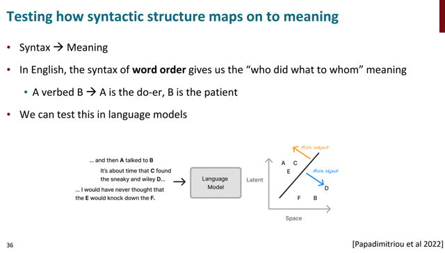</kbd>

> [!NOTE]
> đại khái là ta có thể có cách để kiểm tra khả năng của một language
> model trong việc nhận biết các **cấu trúc cú pháp** - "syntactic structure"
> **một cách riêng biệt** với **ý nghĩa của từ vựng,**hay nói đơn giản hơn
> là liệu model có học được cách nhận biết các cấu trúc cú pháp mà không
> cần phải biết nghĩa của từ vựng hay không. Giống như là nếu nó thấy
> "A verbed B" thì A phải là do-er, B là patient và ngược lại, chứ không cần
> phải biết A và B là gì.
>
> Nói ngắn gọn, vì đây là những pattern liên quan đến cú pháp của ngôn
> ngữ không phụ thuộc vào ngữ nghĩa của từ vựng. Và ta muốn kiểm tra 
> xem language model có học được khả năng này không.

 

<kbd>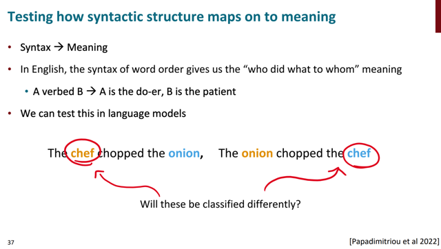</kbd>

> [!NOTE]
> Và ta có thể test để xem khi đổi "chef" và "onion" cho nhau thì model có còn
> làm đúng khi gán cái nào là Subject cái nào là Object không. Nếu có thì
> chứng tỏ nó đã học được các syntactic rule, chứ không chỉ kiểu như học
> thuộc lòng là chef thì là chủ ngữ, onion thì là vị ngữ

 

<kbd>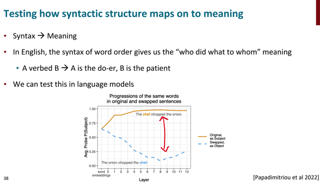</kbd>

> [!NOTE]
> Và người ta kiểm tra bằng cách đó là, dùng một classifier, được train để dự
> đoán **xác suất một từ là Subject** dựa trên**input là output của các layer**
> của language model. Và ta sẽ**coi thử khả năng của các model này**, khi
> được **train trên các output của layer's khác nhau**Thế thì ban đầu ta thấy rằng, nếu dùng word embedding để train "Subject"
> classifier, thì hình dung rằng ta có một **stupid dataset** khi **cùng một input ví
> dụ như word embedding** của từ "chief" lại **được map với hai label khác
> nhau** là "Subject" khi nó ở trong câu "The chef chopped the onion" và "
> Object" khi nó ở trong câu khác là "The onion chopped the chef". Thế thì dễ
> thấy với một dataset mâu thuẫn như vậy,"Subject" classifier được train trên đó
> sẽ rất tệ, và biểu đồ cho thấy dù trong câu nào, xác suất p(subject) mà nó
> predict cũn đều giống nhau và cỡ 60%.
>
> Sau đó, người ta sẽ pass các câu vào language model, ví dụ như BERT, và
> như đã biết, khi qua các self-attention layer, fixed word embedding sẽ được bồi
> đắp các context information để trở thành contextualized embedding.
>
> Thì ví dụ như người ta sẽ lấy contextualized embedding của từ chef để train
> Subject classifier thứ hai. Đương nhiên lúc này, các từ chef nằm trong các câu
> khác nhau sẽ cho ra contextual embedding khác nhau, nên không còn tình
> trạng hời nãy nữa. Kết qủa là Subject classfier này bắt đầu phân biệt được, khi
> cho P(Subject) của từ Chef cao hơn khi nó trong câu 1 và thấp hơn khi trong
> câu 2.
>
> Và tương tự vậy, khi train các Subject classifier với output của các layer
> (self-attention) sâu hơn thì kết quả cho thấy càng về sau khả năng của các
> classifier này càng tốt khi đỉnh điểm nó cho ra kết quả mà có sự chênh lệch lớn
> giữa p(subject) của từ chef trong câu 1 và 2.
>
> Thế thì điều này CŨNG GIÚP KHẲNG ĐỊNH: ĐÓ LÀ **QUA
> SELF-ATTENTION**,  **CONTEXTUAL EMBEDDING** được **BỒI ĐẮP THÊM
> THÔNG TIN NGỮ NGHĨA  CỦA BỐI CẢNH**CỦA TỪ TRONG CÂU để giúp
> CÙNG MỘT TỪ NHƯNG TRONG HAI CÂU KHÁC NHAU SẼ CÓ **Ý NGHĨA**
> KHÁC NHAU.
>
> Nhưng bên cạnh đó nó cũng chứng minh rằng, self attention CŨNG GIÚP
> **PHẢN ÁNH THÔNG TIN CÚ PHÁP CỦA TỪ**, để rồi ta có **CÙNG MỘT
> TỪ** NHƯNG TRONG CÁC **CÂU KHÁC NHAU THÌ VAI TRÒ CÚ PHÁP
> CŨNG KHÁC NHAU.
>
> Đây là mục đích chính của thí nghiệm**

 

<kbd>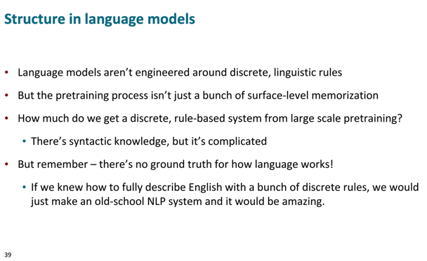</kbd>

> [!NOTE]
> Tóm lại phần này đại khái là ta biết rằng, khẳng định lại rằng **human
> language là một thứ có cấu trúc**, thể hiện bằng **các quy luật cú pháp**,
> mà các cuốn sách ngữ pháp, ngôn ngữ học c**ố gắng liệt kê ra các quy 
> định rời rạc**này.
>
> Thế thì câu hỏi là **các mô hình ngôn ngữ có học được** hay học được
> nhiều hay ít **các quy luật cú pháp rời rạc** này trong quá trình training.
>
> Và qua các thí nghiệm ta có thể kết luận câu trả lời trên là **có**, chúng
> thật sự có thể học được các syntactic structure của ngôn ngữ. 
>
> Cuối cùng ta cần nhớ rằng, với **ngôn ngữ thì không có cái gì gọi là
> ground-truth**,**không thể nào** mô tả ngôn ngữ một cách đầy đủ thông
> qua một bộ sưu tập các quy tắc rời rạc được.

 

<kbd>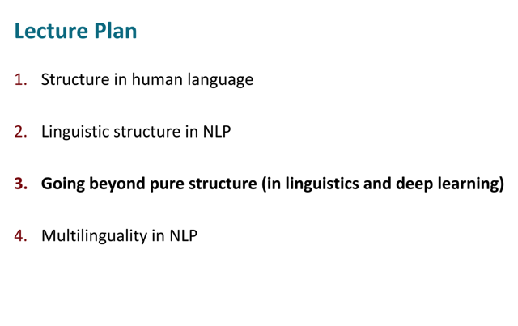</kbd>

 

<kbd>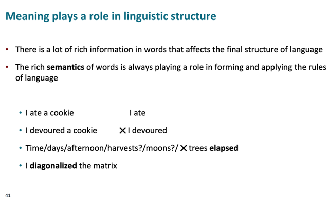</kbd>

> [!NOTE]
> đại ý là đề cập tới sự thật rằng có rất nhiều trường hợp trong ngôn ngữ mà **ý
> nghĩa của từ** sẽ tác động đến **cấu trúc cú pháp của một câu**
>
> Ví dụ như với từ ate, ta có thể nói I ate a cookie (tôi đã ăn một chiếc bánh) 
> hoặc I ate (tôi ăn rồi). 
>
> Nhưng ta lại không thể làm vậy với từ devoured (I devoured a cookie - tôi nuốt 
> một chiếc bánh) nhưng không thể nói (I devoured - Tôi đã nuốt)
>
> Hay, chỉ những từ liên quan đến thời gian mới có thể đi với từ elapsed chứ
> không phải muốn đi với từ nào cũng được
>
> Thì nói chung, là việc hình thành một câu nhất định cần phải có vai trò của ý
> nghĩa của từ vựng.

 

<kbd>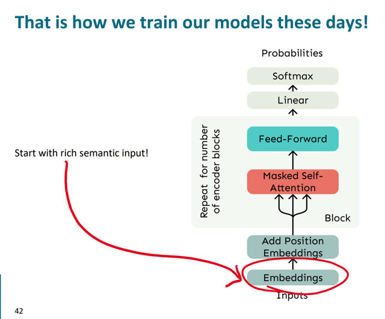</kbd>

> [!NOTE]
> đại khái là nhắc lại về cách ta train model, bắt đầu với word
> embedding - ở đây nhấn mạnh tới việc những word embedding này
> chứa đựng thông tin về ngữ nghĩa của nó rất phong phú dồi dào

 

<kbd>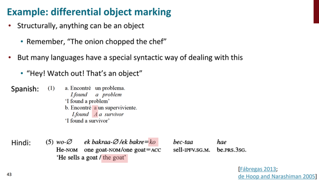</kbd>

> [!NOTE]
> có thể hiểu đại ý là trong một số ngôn ngữ có những luật / quy tắc đặc
> biệt để biểu thị một object (bổ ngữ). Cụ thể là, trong tiếng Tây Ban Nha,
> khi gặp một từ thuộc dạng animate (tức là chỉ những thứ mà "sống" như
> human, animal...) thì khi nó nằm ở vị trí bổ ngữ (object) thì người ta sẽ
> thêm một từ 'a' như trong ví dụ để BÁO HIỆU nó là bổ ngữ.

 

<kbd>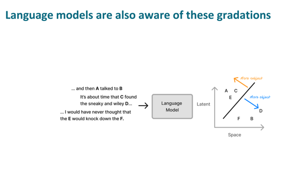</kbd>

<kbd></kbd>

<kbd>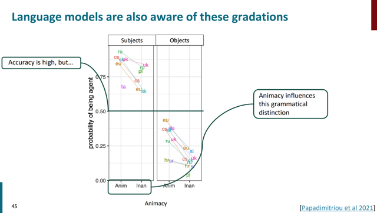</kbd>

> [!NOTE]
> hiểu đại khái là language model (thông qua một số cách thức để xem xét)
> cũng cho thấy những sự phân cấp này, khi mà nếu từ thuộc loại "anim"
> tức animacy, có tính chất sống như người, động vật thì xác suất model 
> gán cho nó là subject sẽ cao hơn là một Inanimacy.
>
> Ngược lại, các Inanimacy sẽ được gán subject với độ tự tin cao hơn là
> Animacy

 

<kbd>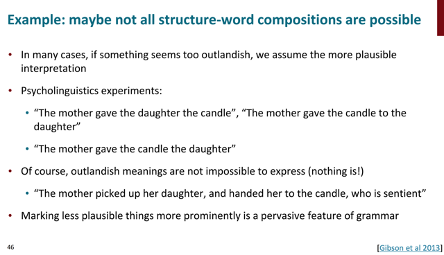</kbd>

> [!NOTE]
> đại khái là, cho ta thấy một ví dụ về việc không phải mọi cách kết hợp
> giữa cấu trúc và từ vựng (structure - word composition) đều có thể khả thi.
>
> Ví dụ như khi nói câu "Người mẹ đưa con cái cây nến" thì không vấn đề
> gì nhưng "người mẹ đưa cây nến con gái" thì sẽ gây khó hiệu mặc dù
> hoàn toàn đúng ngữ pháp.
>
> Tất nhiên theo như người ta đã luôn nhấn mạnh rằng không gì là không
> thể, ý là trong ngôn ngữ ta có thể diễn tả bất cứ điều gì. Thành ra, vẫn
> có thể nói "Người mẹ xách đứa con gái, đưa cho cây nến, **mà ở đây cây
> nến biết cử động"**
> Thế thì cái cụm "mà ở đây cây nến biết cử động" chính là việc đánh dấu
> để cho một sự kiện ít hợp lý trở nên nổi bật hơn (marking less plausible
> things more prominently)

 

<kbd>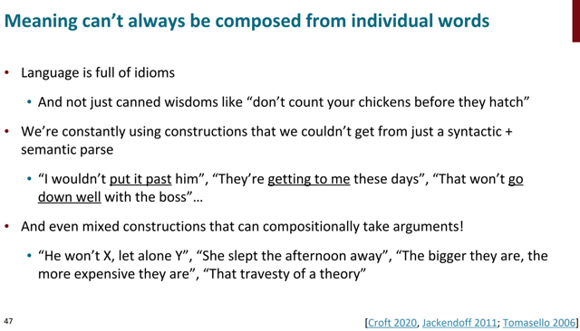</kbd>

> [!NOTE]
> nói chung là slide này liệt kê những ví dụ cho thấy trong ngôn ngữ có rất
> nhiều idiom,..những câu mà muốn hiểu nó phải có các kiến thức về văn
> hóa, lịch sử chứ không chỉ dịch từng từ ra được.
>
> tiếng việt hay tiếng gì cũng đầy rẫy những thành ngữ như vậy

 

