# Lecture 15: Add Knowledge To Language Model

📊 **Progress:** `23` Notes | `28` Screenshots

---

<kbd>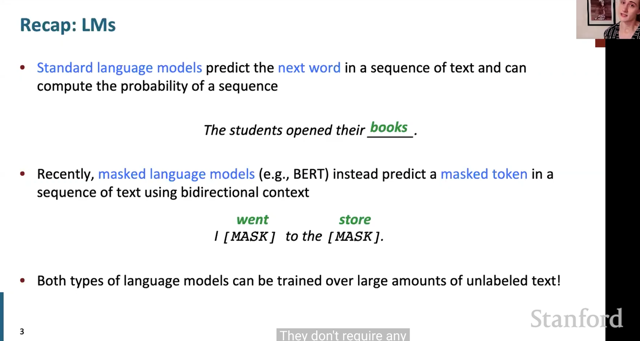</kbd>

> [!NOTE]
> đầu tiên họ nhắc lại về language model "tiêu chuẩn" nơi mà nó được
> train để dự đoán ra từ tiếp theo và có thể dùng để tính xác suất của
> một chuỗi, và loại thứ hai là masked language model được train theo
> kiểu dự đoán các từ trong chỗ trống dựa trên thông tin bối cảnh ở
> hai chiều của văn bản.
>
> Thế thì cả hai loại này đều được ưa chuộng vì người ta train với 
> self-supervised learning - không cần labeled data.

 

<kbd>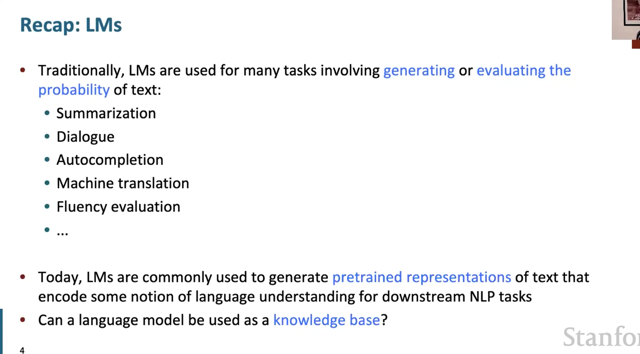</kbd>

> [!NOTE]
> đại ý là ta đã thấy LMs được sử dụng trong nhiều task như "tạo ra" văn
> bản hoặc đánh giá xác suất của văn bản
>
> Và hiện nay người ta còn dùng nó như công cụ để tạo ra các
> representation của text phản ánh / chứa đựng các sự hiểu biết về ngôn
> ngữ  để dùng nó trong các downstream NLP task.
>
> Thế thì bài này ta sẽ nói về một khả năng nữa là dùng LM như một 
> knowledge-base (tạm hiểu là để xài lm để truy vấn, thông tin, kiến thức)

 

<kbd>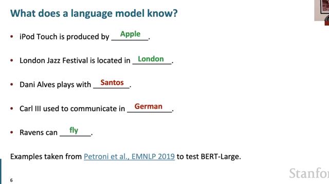</kbd>

> [!NOTE]
> đại khái là người ta thử nghiệm để model dự đoán các chỗ trống này
> để đánh giá xem 'ĐỘ HIỂU BIẾT" (kiến thức) của language model.
>
> Thế thì, tuy kết quả chưa hoàn toàn chính xác nhưng những chỗ sai
> cũng ít nhiều có tính hợp lí (ví dụ như Dani Alves chơi đá banh, và
> Santos cũng là câu lạc bộ bóng đá, dù câu trả lời đúng nên là Barca)

 

<kbd>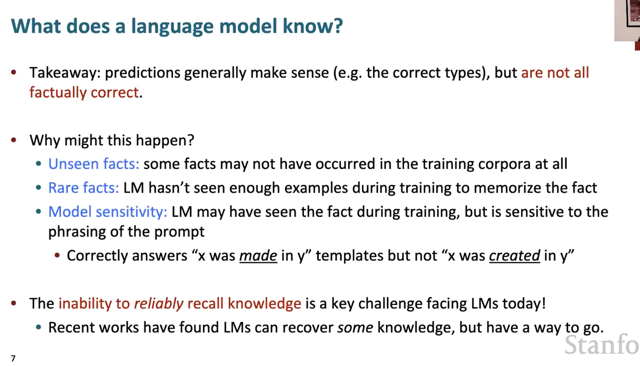</kbd>

> [!NOTE]
> Như vậy, nghiên cứu cho thấy LM nói chung là có thể trả lời các câu hỏi
> liên quan đến kiến thức (đương nhiên yêu cầu của dạng tác vụ này đó là
> phải thông tin đưa ra, hay prediction của model phải đúng,  chính xác) một
> cách tương đối có nghĩa, tuy nhiên không phải lúc nào cũng đúng.
>
> Điều này có thể có nhiều nguyên nhân như do trong training set không có
> kiến thức đó. hoặc có nhưng không đủ nhiều để model nhớ. Và thậm chí do
> sự sensitive của model đối với prompt - có khi với cách hỏi này thì nó trả lời
> được, cách hỏi khác thì không.
>
> Thành ra, hạn chế của model trong khả năng trích xuất các kiến thức là một
> thách thức.

 

<kbd>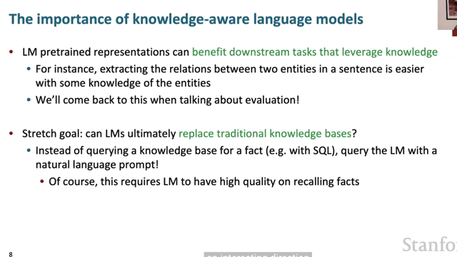</kbd>

> [!NOTE]
> đại khái là nói về lí do hay động lực để phát triển một knowledge-ware
> language model (tạm dịch là lm có khả năng phong phú về kiến thức)
>
> Thế thì có nhiều động lực để làm vậy, một là việc lm có khả năng này
> sẽ giúp ích cho các downstream task bởi vì nhiều khi để tạo word 
> representation tốt, cần dựa trên knowledge.
>
> và tham vọng hơn là có thể thay thế các cơ sở tri thức truyền thống
> như SQL...

 

<kbd>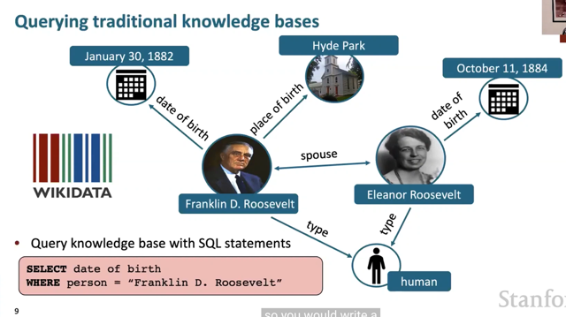</kbd>

> [!NOTE]
> đại khái là hình ảnh minh họa cho traditional knowledge bases
> (SQL). để tương tác với nó, query có thể như vầy

 

<kbd>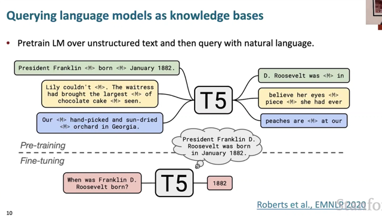</kbd>

> [!NOTE]
> Nhưng với language model thì chỉ cần
> query với natural language

 

<kbd>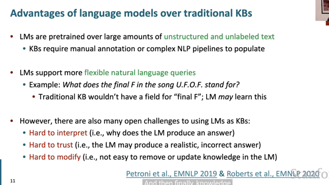</kbd>

> [!NOTE]
> đại ý là so với traditional KBs, languages model KB cũng có  một số
> ưu điểm như không cần tốn nhiều công sức cho việc "manual
> annotation" - ý nói bước chuẩn bị dữ liệu một cách manually, ví dụ
> như tạo một query với thông tin sẽ được trả ra khi được yêu cầu. Lí do
> là bởi language model có thể được train với unlabeled data. Bên cạnh
> đó, cũng không còn phải  xây dựng các hệ thống NLP phức tạp như
> traditional KB.
>
> Tuy nhiên hạn chế vẫn còn tồn tại của language model là  vấn đề
> interpretability - khó giải thích tại sao, hay dựa vào đâu model đưa ra
> dự đoán như vậy. Từ đó cũng dẫn đến vấn đề niềm tin khi ta không
> thể hoàn toàn chắc chắn model có đưa ra câu trả lời đúng hay không.
> Và cuối cùng là khó "sửa" chữa hay thay đổi một mẫu thông tin nào đó
> - bởi việc training model tốn kém.

 

<kbd>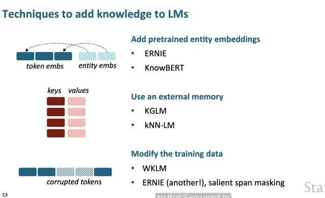</kbd>

 

<kbd>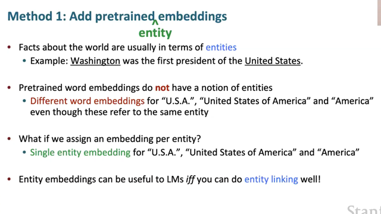</kbd>

> [!NOTE]
> đại khái là phương pháp thứ nhất là tạm gọi là bổ sung thêm "entity
> embedding". Thế thì đầu tiên, chúng ta cần nhận định rằng phần lớn những
> thứ gọi là "fact" - tiếng Việt là "sự thật" và ta có thể hiểu ý là những thông tin
> mang tính chất là những sự kiện, sự thật như sự thật lịch sử = thường là ở
> dạng những thực thể - entities.
>
> Lấy ví dụ cho dễ hiểu trong một câu thể hiện, chứa đựng một "sự thật lịch
> sử" là: "Washington là tổng thống đầu tiên của Hoa Kì" thì trong đó,
> Washington và Hoa Kì là các entities. Ý của họ muốn nói khi nghĩ về các sự
> thật (mà ta cứ ví dụ cụ thể là sự thật, sự kiện lịch sử, dù các lĩnh vực khác
> cũng vậy) thì các câu, văn bản **thường được cấu thành bởi các entities**.
> Và đó là những thứ ta cần lấy ra làm đối  tượng cho câu trả lời. Bởi lẽ câu
> trên, nếu phải đặt câu hỏi thì ta thường chỉ có thể hỏi:
>
> Ai là tổng thống Hòa Kì đầu tiên? -> Washington
>
> Washington là tổng thống đầu tiên của nước nào? -> Hoa Kì
>
> ===
>
> Thế thì vấn đề là các pretrained word embedding không có khái niệm entities
> mà các USA, America, hay United State có thể đều là những embedding khác
> nhau (dù chúng có thể gần nhau trong không gian)
>
> Thành ra điều có thể nghĩ đến đầu tiên là tạo "entity embedding" - để represent
> chung cho cả USA, America...
>
> Ta làm điều đó bằng **entity linking task**

 

<kbd>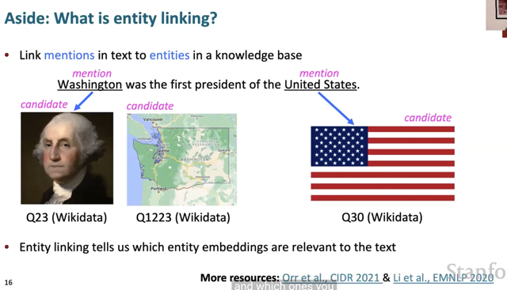</kbd>

> [!NOTE]
> đại khái là dựa vào context của câu, ta có thể link Washington với embedding
> của ông Washington thay vì bang Washington

 

<kbd>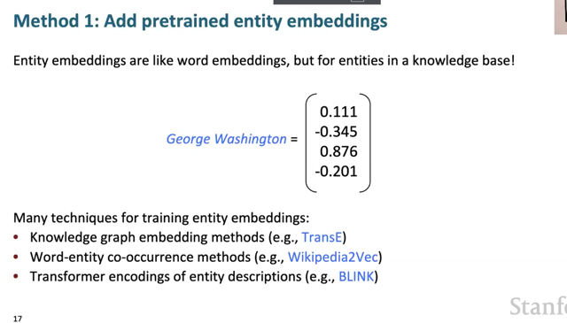</kbd>

> [!NOTE]
> đại ý là, đầu tiên ta sẽ chuẩn bị, pretrained các entity embeddings, nó cũng
> giống như word embedding, chẳng qua phản ánh thông tin về entity thay
> vì ý nghĩa chung của từ. Với các phương pháp training như liệt kê trong slide.
>
> Kết quả ta cũng có các vector thể hiện entity của từ, ví dụ như với từ George
> Washington, ta hi vọng nó sẽ gần với các entity vector của các người cha
> lập quốc khác của nước Mỹ.

 

<kbd>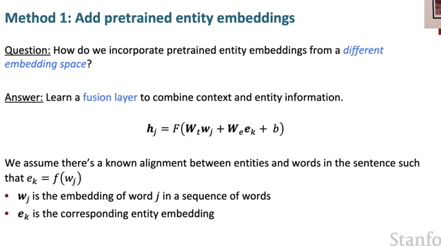</kbd>

> [!NOTE]
> đại khái là, người ta cho biết rằng, ta có thể tích hợp thêm, bổ sung thêm
> thông tin entity từ pretrained entity embedding với word embedding. Bằng
> cách learn một fusion (tổng hợp) layer - một layer mang chức năng tổng hợp
> thông tin. Ví dụ như ta có w_j là word embedding của từ "George
> Wasington" và bằng một function nào đó ta biết cách trích xuất entity
> embedding của từ này e_k = f(w_j).
>
> Thế thì ta sẽ pass cả hai vector vào fusion layer này để nó tổng hợp lại
> thành một vector h_j - mang ý nghĩa là bổ sung thêm thông tin entity cho
> word embedding của từ "George Washington"

 

<kbd>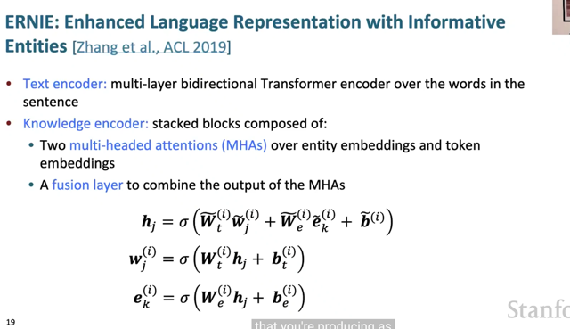</kbd>

> [!NOTE]
> đại khái là nói sơ về mô hình ERNIE - Đầu tiên là text encoder - nó là một
> multi-layer bidirectional Transformer encoder, tiếp nhận word embedding trong
> từ các word trong sentence.
>
> Sau đó ta sẽ có knowledge encoder - là một stack gồm nhiều block mỗi block
> bao gồm hai multi-headed attentions, một cái sẽ tiếp nhận entity  embedding
> một cái sẽ xử lí token/word/subword embeddings.
>
> Kết quả của chúng, tạm gọi là contextualized entity embedding và
> contextualized token embedding sẽ được tổng hợp - với fusion layers cũng
> như lại tách ra (thành entity và word embedding mới), tiếp tục tham gia và các
> block sau.
>
> Kí tự (i) ám chỉ đây là block thứ (i) của knowledge encoder - mà mỗi block sẽ
> tạo ra "NEW" entity embedding và word embedding, pass vào next block

 

<kbd>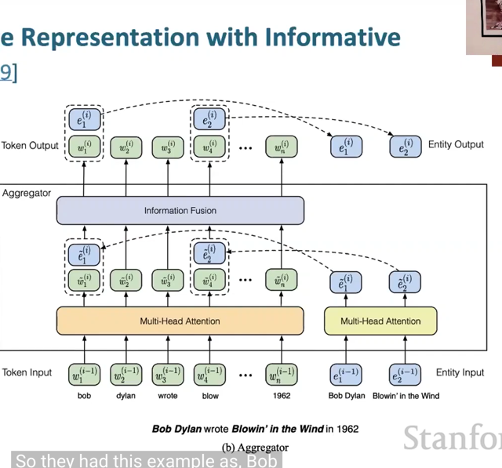</kbd>

<kbd></kbd>

<kbd>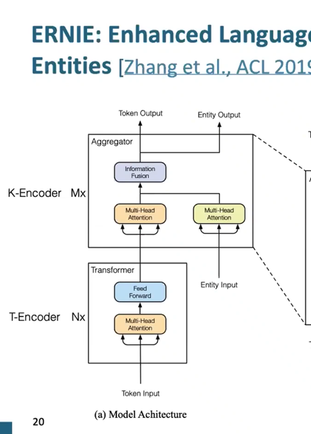</kbd>

> [!NOTE]
> kiến trúc ERNIE mô tả vừa rồi có thể dễ hiểu với sơ đồ này, Bên trái cho thấy mọi chuyện bắt đầu với T-Encoder - Text
> encoder, nhận token embedding và xử lý nó với Multi-Head Attention + Feed-forward Network , đương nhiên cũng lặp lại vài
> lần (kí hiệu Nx). Cơ bản nó giống như Encoder Transformer mà đã biết trong những bài trước (slide trước họ cũng đã nói nó là
> một multi-layer bidirectional Transformer, có thể dùng BERT hoặc một Encoder-based llm nào khác)
>
> Sau đó là K-Encoder = Knowledge Encoder.
>
> Thì hình phóng to 1 BLOCK của nó, cho thấy, i) các token embedding được process với Multi-Head Attention màu cam và các
> các entity embedding cũng được process với MHA màu vàng.
>
> Sau đó, các "cặp word-entity embedding" sẽ được pass vào fusion layer (dấu chấm chấm, ví dụ word embedding của "Bob" sẽ
> cùng với entity của "Bob Dylan") Và kết qủa output sẽ được tách ra lại để có word embedding mới của 'Bob' và entity
> embedding mới của 'Bob Dylan'
>
> again, Mx cũng thể hiện có nhiều block như vậy
>
> Chú ý là ta đã có pretrained entity embedding, biểu hiện bởi các entity của Bob Dylan, và Blowing in the Wind (là hai entity
> embedding match với hai entity trong câu, mà nãy đã nói, đã có function f để trích xuất ra) đã được pass

 

<kbd>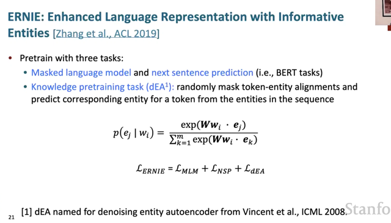</kbd>

> [!NOTE]
> đại ý là quá trình pretraining cũng sẽ là train với 3 task: masked language
> model: dự đoán từ tiếp theo. Next sentence prediction: dự đoán câu tiếp
> theo. Hai cái này thì giống BERT. Bên cạnh đó có thêm task gọi là dEA.
>
> Có thể hiểu đại khái là ta sẽ cho model dự đoán entity của token (có entity)
> đây cũng là một classification task thôi, với token cần đoán, model sẽ tính 
> ra một phân phối xác suất over các entities. Và cũng dùng cross entropy
> loss với predicted distribution và target distribution presented dưới dạng một
> one-hot vector để tính LdEA
>
> Ví dụ, với câu Bob .....có hai entities là Bob Dyland và Blowing in the Wind
> thì nó sẽ dự đoán Bod link với Bob Dylan hay Blowing in the Wind.

 

<kbd>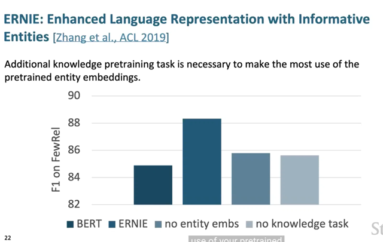</kbd>

> [!NOTE]
> đại ý là kết quả cho thấy ERNIE much better BERT trên F1 score khi
> đánh giá trên dataset FewRel. Tuy nhiên nó cũng cho thấy sự đóng góp
> quan trọng của việc có entities embedding và knowledge task

 

<kbd>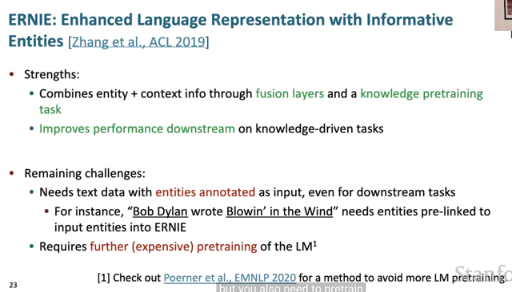</kbd>

> [!NOTE]
> như vậy ERNIE có những ưu điểm đó là nó giúp kết hợp entities và context
> info thông qua fusion layers và bước knowledge pretraining Nhờ đó nó cải
> thiện hiệu suất của các downstream task có liên quan đến knowledge.
>
> Tuy nhiên nhược điểm của nó đó là nó cần input có sẵn entities label  ví dụ
> như trong model architecture có thể thấy nó cần nhận input là sentence và
> cả entities input cho biết từ có những entities nào trong câu đó. Điều này
> khiến gây khó khăn vì không phải lúc nào ta cũng có sẵn như vậy.
>
> Bên cạnh đó nó còn yêu cầu phải pretrain thêm/lại. Gây tốn kém

 

<kbd>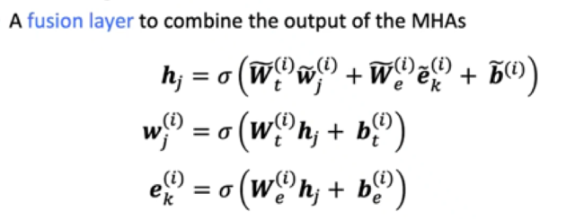</kbd>

> [!NOTE]
> Có câu hỏi là tại sao không concatenate token embedding và entity embedding
> theo cách người ta hay làm (ví dụ như concate word embedding và positional
> encoding)
>
> Thế thì gs Cris chỉ ra rằng, có những token không có entity embedding, nên
> nếu concat thì chẳng lẽ những từ đó sẽ concat với zero vector hay sao.
> Đây có thể là một lí do

 

<kbd>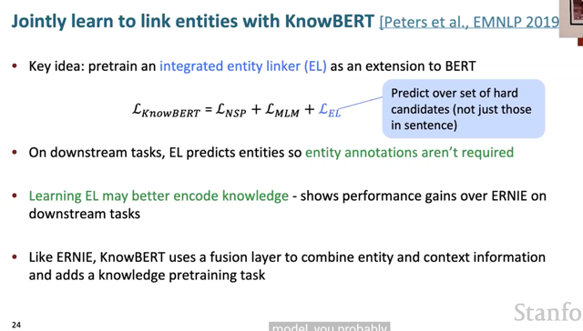</kbd>

> [!NOTE]
> đại khái là với KnowBERT, nó khắc phục nhược điểm đầu tiên của ERNIE
> bằng cách, thay vì cho model dự đoán entity của token là cái nào trong
> những cái entities input. Thì nay, nó phải dự đoán entities nào trong một
> loạt các candidate entities (lấy ở một danh sách nào đó chẳng hạn)
> Thành ra, nó không cần phải có entities input khi hoạt động. Và nhiệm
> vụ dự đoán entity cũng trở nên khó hơn nhiều so với ERNIE, vì ERNIE
> kiểu như chỉ là chọn / dự đoán từ những input entities còn ở đây nó phải
> dự đoán từ nhiều candidate entities rộng hơn.
>
> Thành ra performance của KnowBERT tốt hơn ERNIE
>
> Và ngoài ra thì KnowBERT cũng dùng fusion layer để combine entity và
> context information

 

<kbd>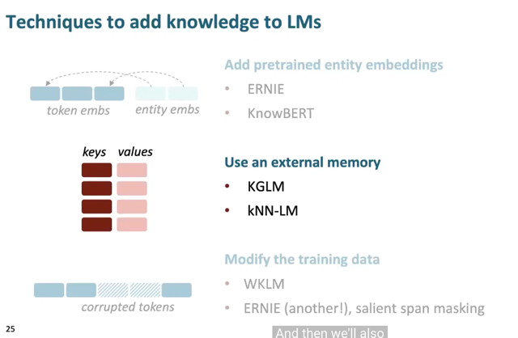</kbd>

 

<kbd>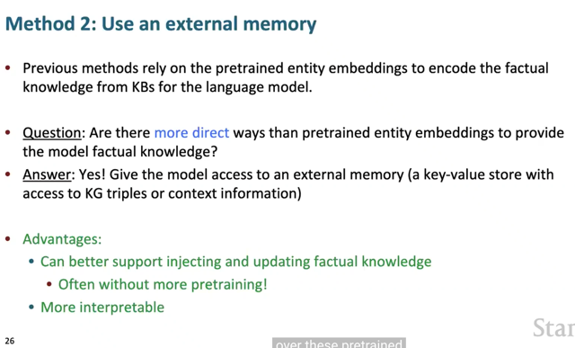</kbd>

> [!NOTE]
> đại khái là cách thứ nhất ví dụ như  có nhược điểm là giả sử cần thay đổi,
> sửa đổi  một thông tin, kiến thức cụ thể nào, thì ta phải thay đổi pretrain
> entity hoặc retrain lại model. Do đó câu hỏi đặt ra là có cách nào khác đưa
> kiến thức vào model một cách trực tiếp hơn hay không.
>
> Đó là cách tiếp cận thứ hai, dùng external memory và cho phép model
> access nào để lấy kiến thức.
>
> Ưu điểm của cách này là nó sẽ cho phép ta inject và sửa đổi factual
> knowledge linh hoạt hơn và thông thường không cần đòi hỏi phải
> re-pretraining
>
> Ngoài ra nó cũng đem lại khả năng interpretable tốt hơn khi ta có thể nhìn
> vào knowledge base để xem xét các thông tin khi cần

 

<kbd>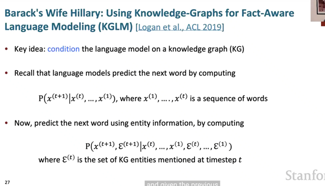</kbd>

> [!NOTE]
> đại khái là, trong phương pháp này, language model sẽ dự đoán token 
> kế tiếp bên cạnh việc dựa trên các token trước đó, thì nay nó còn dựa 
> trên knowledge-graph.

 

<kbd>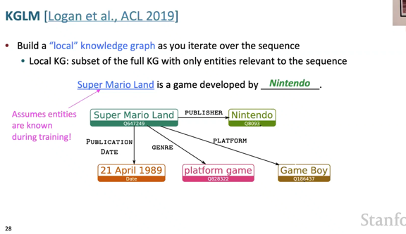</kbd>

> [!NOTE]
> đại khái là, thay vì "dùng" một cái "full knowledge-graph" - hiểu nôm na là
> một cơ sở dữ liệu chứa các dữ kiện tri thức, thì ở đây, ta sẽ xây dựng
> một "local" knowledge graph khi iterate qua sequence.
>
> Ví dụ như câu Super Mario Land is a game developed by... , thì khi iterate
> qua các từ, nôm na là đầu tiên ta sẽ "gặp" Super Mario Land, là một
> entity. Khi đó, ta sẽ trích xuất từ full knowledge graph ra một cái graph
> nhỏ, chỉ liên quan đến entity "Super Mario Land", và add vào local graph.
>
> Và tiếp tục như vậy, khi gặp một entity khác, ta sẽ lại trích xuất ra cái
> graph liên quan đến entity đó và add vào local graph.
>
> Có nghĩa là, local knowledge graph sẽ là một subset của full knowledge
> graph, với các entity xuất hiện trong câu mà thôi.
>
> Nói thêm là trong quá trình training, giả định rằng đã biết các entity trong
> câu rồi, và đồng nghĩa rằng, các knowledge graph đều là từ ground truth
> full knowledge graph
>
> ===
>
> Vậy thì ý tưởng của phương pháp này là việc dự đoán từ tiếp theo dựa
> trên knowledge graph đương nhiên là đôi khi mang lại những strong
> signal. Ví dụ trong câu trên, với sự "có mặt" của local graph, model sẽ dễ
> dàng dự đoán từ trống là Nintendo hơn. Tuy nhiên, không phải lúc nào
> cũng tốt, vì ví dụ như những lúc đầu, khi chưa có local graph được build
> hoặc ví dụ như để dự đoán từ "game" thì knowledge graph vô dụng vì
> trong đó không có "game"

 

<kbd>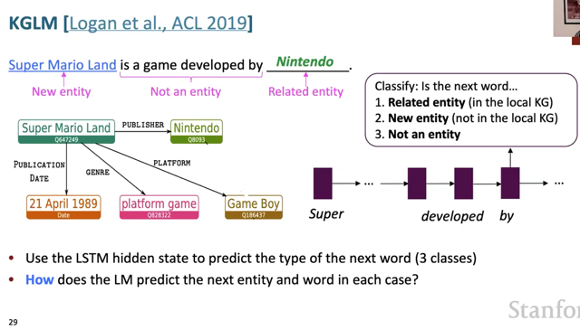</kbd>

> [!NOTE]
> đại khái là ta sẽ dựa vào lstm hidden state để classify next token thuộc loại nào
> trong 3 loại: i) Related entity ii) New entity và iii) Không phải entity.

 

<kbd>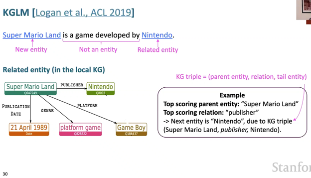</kbd>

 

