# Lecture 1 - Intro & Word Vector

📊 **Progress:** `28` Notes | `51` Screenshots

---

<kbd>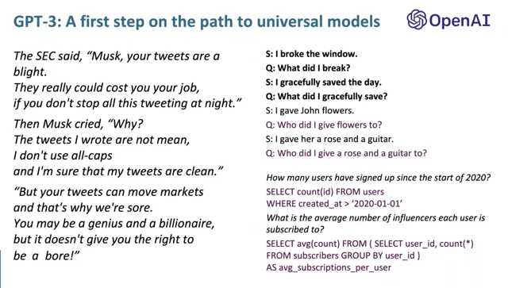</kbd>

 

<kbd>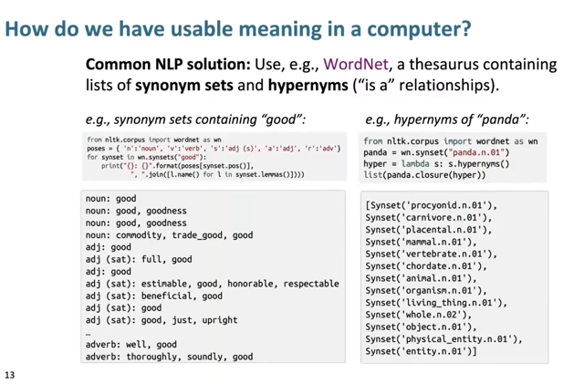</kbd>

> [!NOTE]
> Đầu tiên đại khái là làm sao để đưa vào
> dùng meaning của từ vựng

 

<kbd>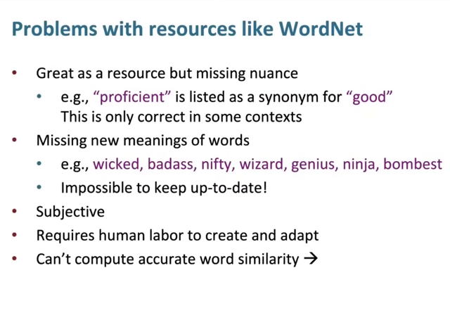</kbd>

 

<kbd>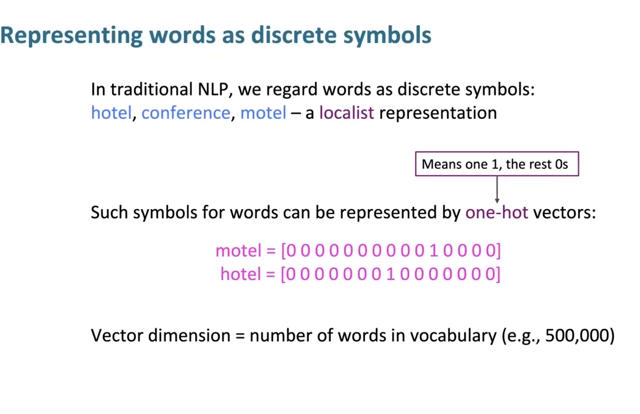</kbd>

> [!NOTE]
> Đại ý là nói qua một cách represent words theo **one-hot vector**
>
> **Nhược điểm của việc represent từng từ bởi one-hot vector**. Đó
> là**huge vector** ví dụ 250,000 từ trong vocab thì vector có 250.000
> unit

 

<kbd>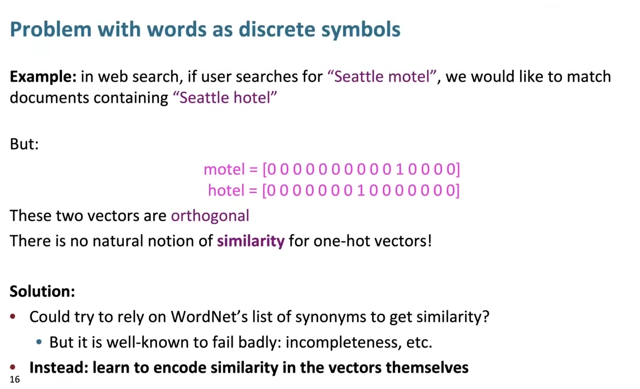</kbd>

> [!NOTE]
> Nhược điểm nữa là các từ **sẽ orthogonal nha**u gì là những từ gần nghĩa,
> nên **hầu như chẳng chứa đựng thông tin ngữ nghĩa gì** trong đó

 

<kbd>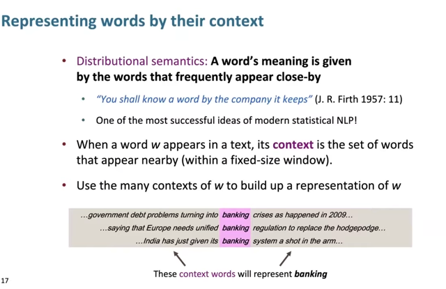</kbd>

> [!NOTE]
> Đại khái là về **ý tưởng quan trọng của NLP** là **ý nghĩa của
> một từ đến từ các từ hay đi kèm với nó** từ đó hình thành nên
> các phương pháp represent word meaning bằng word embedding
> như CBOW, Word2Vec

 

<kbd>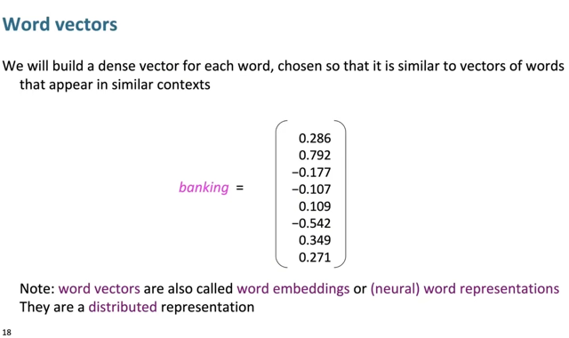</kbd>

> [!NOTE]
> Từ đó hình thành khái
> niệm word embedding

 

<kbd>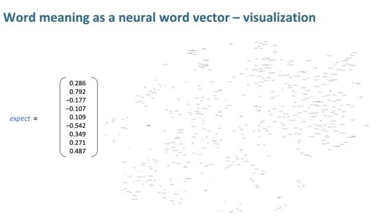</kbd>

> [!NOTE]
> Word embedding spaces

 

<kbd>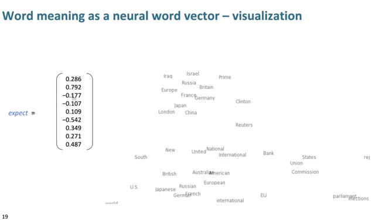</kbd>

 

<kbd>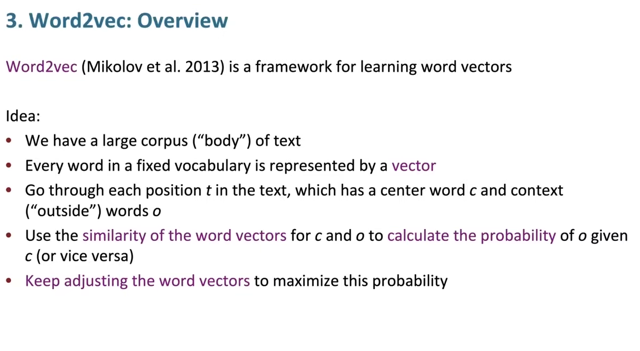</kbd>

> [!NOTE]
> Ideas là chuẩn bị một bộ **text corpus.**
>
> - Và mỗi từ được**initialize / represent bởi một vector**
>
> - Quét qua toàn bộ corpus theo từng ô (window), mỗi lần như vậy sẽ  có một từ làm
> center words, và các từ xung quanh là context. Thì từ đó mới **tính conditional probability
> P(o|c)** = xác suất xuất hiện từ context o1, o2 nếu từ center là c. Để rồi thực hiện
> **optimization là thay đổi các word embedding sao cho maximize cái xác suất này.**Thì thật ra **Word2Vec** có thể dùng 2 cách là..
>
> **CBOW** như đã học bên NLPSpec, đó là **đưa ra các context word** mà bảo model
> **đoán center word**. Có thể hiểu là model phải làm sao để P(c|o) (xác suất từ center word xuất
> hiện khi context word là như vậy) cao nhất.
>
> Hoặc **Skip-gram** mà trong DLSpec có nói là **đưa center word**, bảo model **đoán
> các context words** nhưng trong đó có thể skip, tức là không nhất thiết phải đoán hết
> các từ trong context / các từ xung quanh mà có thể skip qua vài bước.
>
> Thì cái ý ở slide này nói t**ương tự Skip-gram** có điều**không skip** mà **tính P(o|c) cho mọi
> từ trong window**. Thông qua việc phải đoán trúng các context words (để giảm loss) thì
> chính là model phải làm sao đó (thay đổi word embedding) sao cho P(o|c) cao nhất.
>
> Cả hai cách maximize P(o|c) hay P(c|o) **đều dẫn tới việc làm cho word embedding của
> các từ đứng gần nhau sẽ chứa những giá trị phản ánh quan hệ gần gũi giữa chúng**

 

<kbd>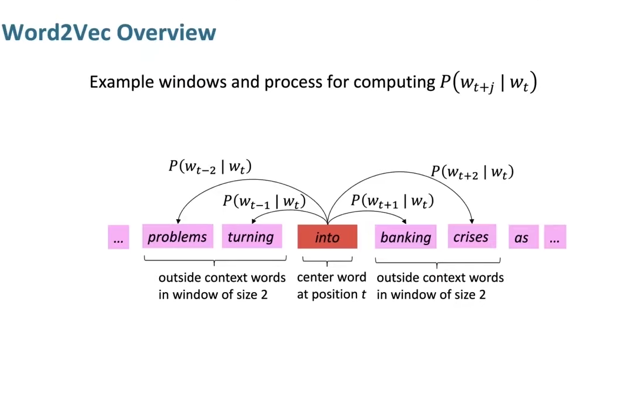</kbd>

 

<kbd>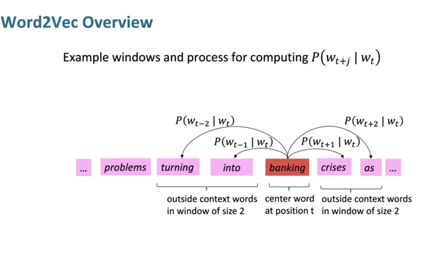</kbd>

 

<kbd>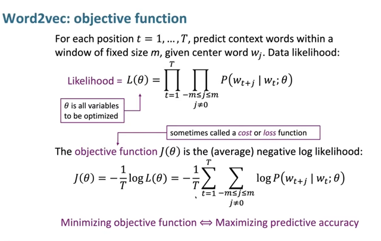</kbd>

> [!NOTE]
> Đại khái đây chỉ là cách thể hiện toán học của cái ý vừa rồi: **Làm sao để** 
> (nói "làm sao để là thể hiện ý đang mô tả **objective function** của model) 
> model có thể **thay đổi / tạo ra các word  embedding vectors** **sao cho** **tối đa 
> hóa xác suất của các context words cho trước một center word P(o|c)**.
>
> Thì nhiệm vụ đó thể hiện bằng việc **tối đa hóa Likelihood L(theta).** Theta
> ở đây nói chung là **toàn bộ các variable có thể được optimize**, bao gồm
> các **params** và **word embedding.**
>
> Công thức của L diễn giải như sau: Với **mỗi một vị trí của window** / cái
> khung chứa 2m+1 từ, **ta có một từ center w_t** và **2m từ context: w_t + j**
>
> Với j trong [-m, m] thì ta có **P(w_t+j | wt, theta)** là **xác suất của việc từ w_t+j**
> **xuất hiện,** **nếu đã cho trước từ w_t**, tính toán bởi theta.
>
> Và để maximize xác suất "nói chung" ta sẽ **maximize tích của 2m các giá trị 
> P(w_t+j | wt, theta) này**.
>
> Từ đó có cái phần PI j in [-m,m] P(w_t+j | w_t, theta)
>
> Xong vì quét trong toàn bộ corpus nên ta có product của T vị trí window.
>
>  L = PI t in [1,T] { PI j in [-m,m] P(w_t+j | w_t, theta) }
>
> Và đ**ể maximize cái L này** thì ta sẽ **minimize cost J được** define là 
> **negative average log của likelihood** L = J = **-log L / m**
> nên mới hay nghe cost function là **log likelihood là vậy**

 

<kbd>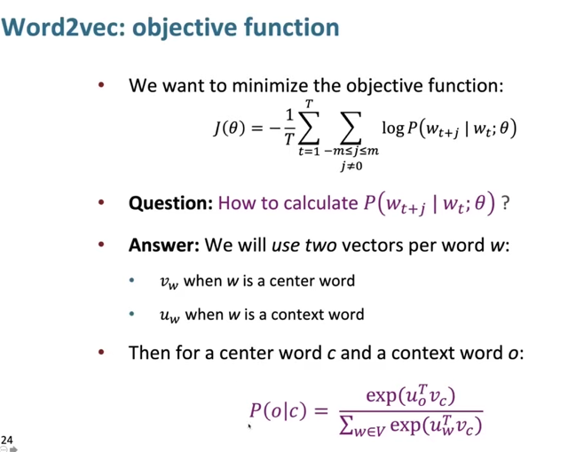</kbd>

> [!NOTE]
> Chỗ này ổng nói **để tính P(w_t+j | w_t)** thì người ta **dùng công thức này**
> trong đó phải chuẩn bị hai vector cho mỗi một từ w, khi nó là context thì
> vector là uw, nếu nó là center thì vector là vw.
>
> Và công thức tính P(o|c) sẽ như vầy ổng nói cứ **tạm thời biết vậy,** c**ó thể
> sẽ quay lại sau để giải thích.**Có thể tạm hiểu ideas là **cho trước một từ c thì từ mà có xác suất xuất hiện
> cao nhất o sẽ là từ giống với c nhất.**

 

<kbd>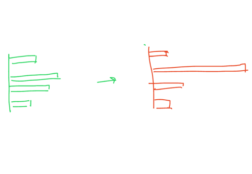</kbd>

<kbd></kbd>

<kbd>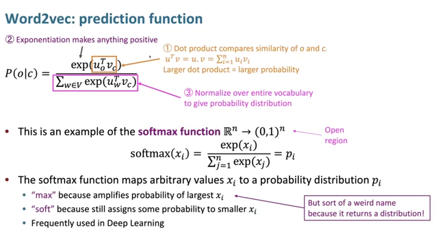</kbd>

> [!NOTE]
> Ở đây ổng giải thích để**có thể hiểu đại khái là ý nghĩa của từng phần
> trong công thức**
>
> Đầu tiên phép **dot product** chính là **tính ra chỉ số giống nhau giữa
> hai word vector.** Như ta cũng biết **hai vector càng giống nhau** thì
> **dot product càng lớn** vì phép toán sẽ **nhân các cặp cùng vị trí** rồi**cộng lại** hết,
>
> [u1 u2 u3] . [v1 v2 v3] = u1v1 + u2v2 + u3v3
>
> nên **nếu 1 cặp cùng âm hoặc cùng dương** thì sẽ **khiến tích chúng
> dương**, và **khiến tổng tăng lên**, ngược lại **1 cặp ngược dấu** sẽ
> khiến **tích của chúng âm** và khiến**tổng giảm xuống**.
>
> Sau đó **để cho kết quả không âm** thì ổng nói người ta dùng exp. lên.
>
> Và **để nó trở thành trong khoảng 0,1 - probability distribution** thì
> người ta **normalize** / chia cho tổng các exp của phép dot product củ
> từ center vc với mọi từ trong vocab uw
>
> ====
>
> Ý tiếp theo là đây cũng chính là công thức softmax và chữ **max** nôm
> na là vì nó**khuếch đại xác suất của cái có value cao nhất** và **soft**
> vì nó **vẫn chừa một chút xác suất cho mấy cái nhỏ hơn**.
>
> Hiểu nôm na là **đưa vào một đám mang các giá trị lớn nhỏ khác nhau
> (gọi là logit)**, và**thằng lớn nhất có thể không lớn hơn những thằng
> khác quá nhiều**. Nhưng softmax sẽ **khuếch đại thằng lớn nhất lên để
> nó thành vượt trội những thằng khác**. Nhưng không phải là những
> thằng khác thành 0 hết mà vẫn có chút gì đó.

 

<kbd>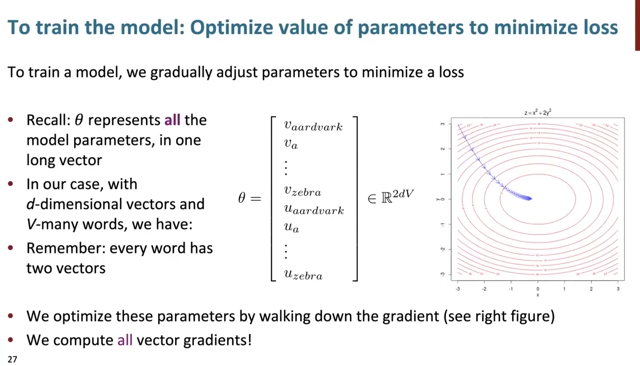</kbd>

> [!NOTE]
> Như đã nói, ta sẽ **train model** với objective như vậy để **tweak các
> param** trong đó có các word embedding. Thì đây theta kí hiệu cho
> toàn bộ word embedding, gồm có **V words**, **mỗi word có 2 vector** như
> mới nói, và **vector có d-dimensions (d unit**). Thành ra theta có **2dV
> params cần được tweak**

 

<kbd>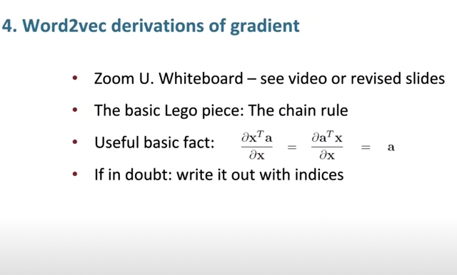</kbd>

 

<kbd>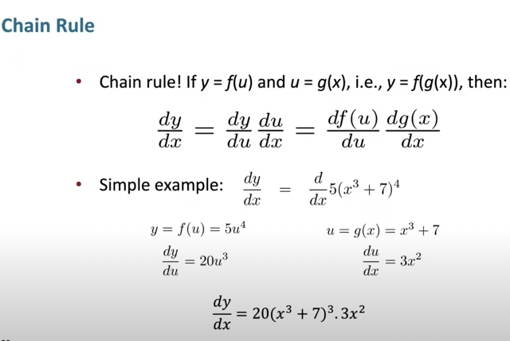</kbd>

> [!NOTE]
> Slide này ổng ko nói, nhưng chỉ là
> ôn lại khái niệm chain rule

 

<kbd>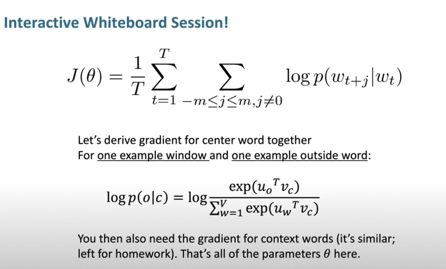</kbd>

 

<kbd>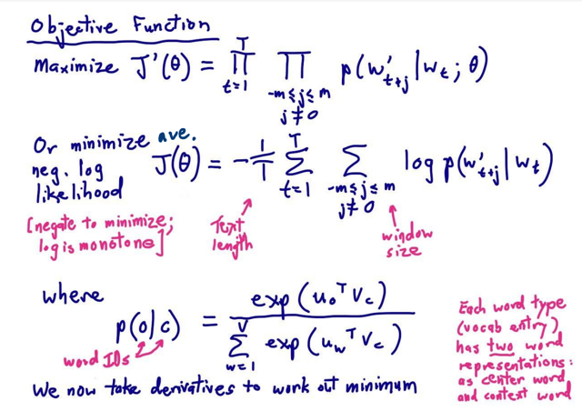</kbd>

> [!NOTE]
> Nhắc lại ở slide trước đã đi qua việc hình thành cost function:
>
> Ta có mục đích / mục tiêu (objective function) là train  model để **tối đa hóa cái
> p(o|c) nói chung** tức là **tối đa các xác suất mà khi cho trước center words**
> thì **xuất hiện các context word**. Gọi là **likelihood function**
>
> Và từ đó đặt ra **cost function** là **negative (average) log likelihood** như vầy
> để minimize nó thì sẽ maximize cái objective function. Ở đây có chú ý mà mình
> cũng đã biết là sở dĩ có thể làm được vậy ( thay vì minimize negative likelihood
> thôi thì có thể minimize log là vì log là hàm đơn điệu - monotonic nên nó chỉ)
> tăng khi x tăng chứ không phải lúc tăng lúc giảm)
>
> Và trong công thức, li**kelihood (hay probability) sẽ dùng công thức softmax**như vầy với hiểu nôm na như ở slide trước có nói là "từ nào mà giống
> nhau = có dot product cao thì sẽ có xác suất xuất hiện cùng nhau cao"****Và slide trước cũng có nói là mỗi từ sẽ có 2 embedding vector****
> ====
>
> Thì như đã biết, ta cần tính derivative of cost function J w.r.t các params

 

<kbd>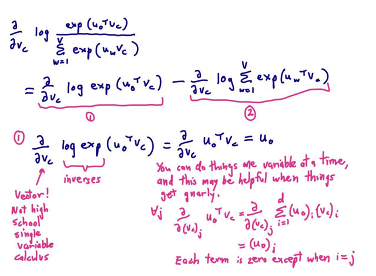</kbd>

> [!NOTE]
> Đầu tiên là tính partial derivative of J w.r.t vc = dJ/dvc.
>
> Thì đầu tiên vì log(a/b) = log(a) - log(b)
> nên dJ/dvc = d log(A/B)/dvc = d log(A)/dvc - d log(B)/dvc
> Với A là vế tử, B là vế mẫu.
>
> Xong d log A/dvc thì trở thành d u0_T.vc / dvc vì log exp đã
> triệt tiêu nhau (log base e (e^a ) = a)
>
> Và đến đây ổng nói chú ý rằng d u0_T.vc / dvc là multi variate
> derivative tức là vc là vector chứ không phải 1 số Nếu là 1 số
> thì là uni-varivate thì dễ rồi d (a*x) / dx = a thôi.
>
> Thì u0_T.vc chính là u01*vc1 + u02*vc2... là sum của các tích hai element
> của u0 và vc không có gì mới.
>
> Thì cách tính d u0_T.vc / dvc cũng rất dễ thôi, đó là **tính partial derivate của
> u0_T.vc với từng element trong vc. Xem hình là hiểu**Và ổng nói nhớ cái này để làm tương tự khi gặp những bài toán phức tạp

 

<kbd>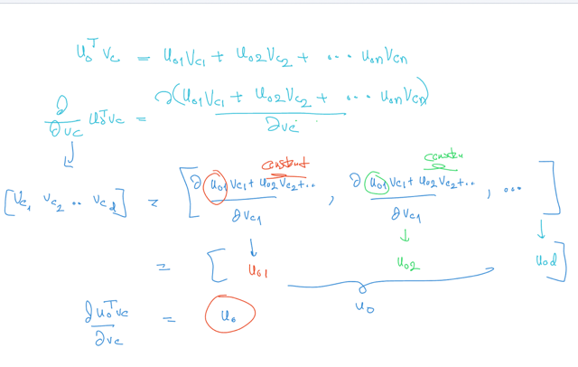</kbd>

> [!NOTE]
> Đạo hàm của A với vector vc sẽ là vector các đạo
> hàm của A với các phần tử của vector vc

 

<kbd>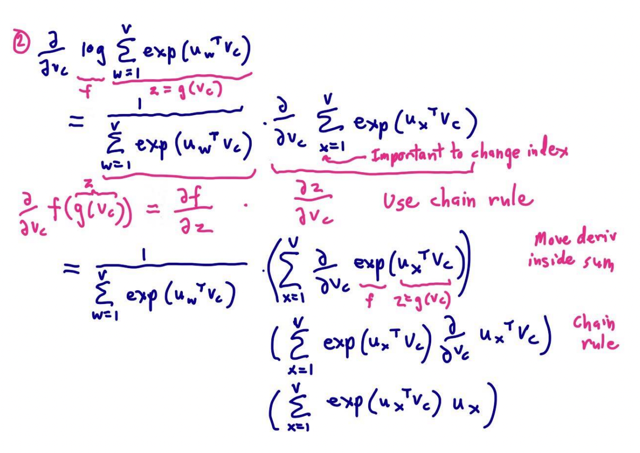</kbd>

 

<kbd>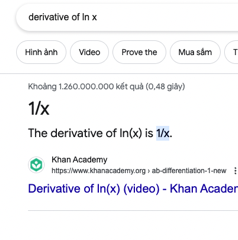</kbd>

<kbd>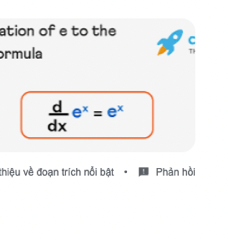</kbd>

<kbd></kbd>

<kbd></kbd>

<kbd>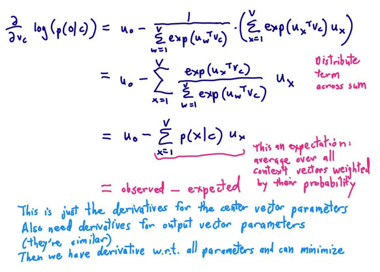</kbd>

> [!NOTE]
> Vế sau cũng không khó lắm, chỉ cần dùng chain rule với một số
> công thức đạo hàm của hàm cơ bản như:
>
> 1. d log e (x) /dx = 1/x, d e^x / dx = e^x,
>
> 2. Nếu f(x) = f1(x) +f2(x) thì df/dx = df1/dx + df2/dx, vì sao:
>
> Giải thích theo ý nghĩa bản chất của đạo hàm:
>
> Khi wiggle x một khoảng dx thì nó khiến f1(x) wiggle khoảng df1, và
> khiến f2(x) wiggle khoảng df2 và
>
> vì f = f1 + f2, nên nếu f1 wiggle df1 và f2 wiggle df2 thì sẽ khiến f
> wiggle khoảng df1 + df2
>
> Như vậy khi x wiggle dx khiến f wiggle df = df1 + df2
>
> Nên tỉ lệ df/dx = (df1 + df2)/dx = df1/dx + df2/dx

 

<kbd>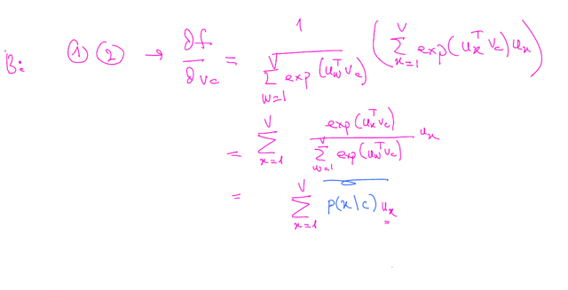</kbd>

<kbd></kbd>

<kbd>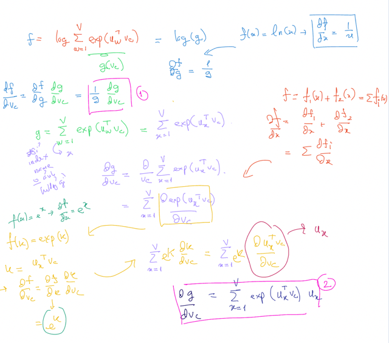</kbd>

 

<kbd>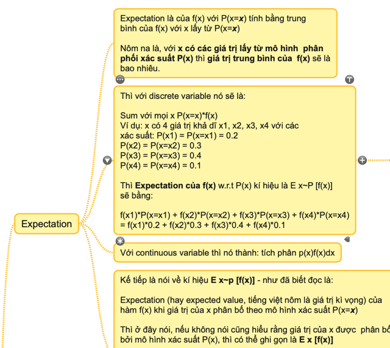</kbd>

<kbd></kbd>

<kbd>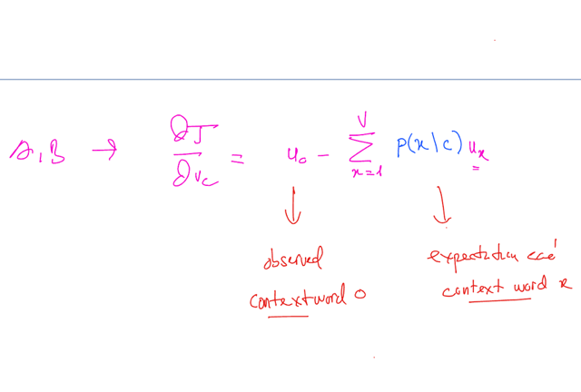</kbd>

> [!NOTE]
> Tại sao gọi là expectation, nhớ lại khái niệm expectation E f(x). Khi random variable x
> được phân bố theo probability distribution theo phân bố P(x) sẽ là tích các giá trị của
> f(x) nhân với xác xuất của x mang các giá  trị x1,x2...
>
> E x~Px() [f (x)] = f(x1)*P(x=x1) + f(x2)*P(x=x2) + .....( với P(x) là discrete - rời rạc
> function)
>
> Thì ở đây dù chưa hiểu lắm nhưng tạm hiểu cái cụm Sum x=1:V P(x|c)ux bên phải
> nôm na là**weighted sum các vector context word ux**, nhân với **weight là xác suất
> xuất hiện của nó nếu có center word c rồi**Còn u0 là observed context word - từ context đã quan sát thấy, đã thực sự xuất hiện
> bên cạnh từ center c trong corpus.

> [!NOTE]
> Ôn lại khái niệm Expectation từ DL Yo

> [!NOTE]
> Cuối cùng đây chỉ là derivative of cost function J wrt
> vc -embedding vector của center word
>
> Phải tính thêm derivative of cost function J wrt u0 - embedding
> vector của context words nữa.
>
> Sau đó dựa vào gradient descent, update các vc, uo để khi 
> J converge, ta sẽ có bộ embedding word vector như ý
>
> Chú ý là vc, uo chỉ là cách nói chung chung embedding vector 
> của từ center c, và các từ context o, khi window quét qua toàn bộ
> corpus thì nó sẽ là những từ cụ thể tại mỗi vị trí window

 

<kbd>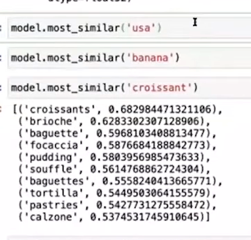</kbd>

> [!NOTE]
> Xem một số kết quả của
> word embedding.

 

<kbd>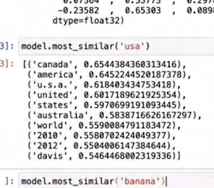</kbd>

 

<kbd>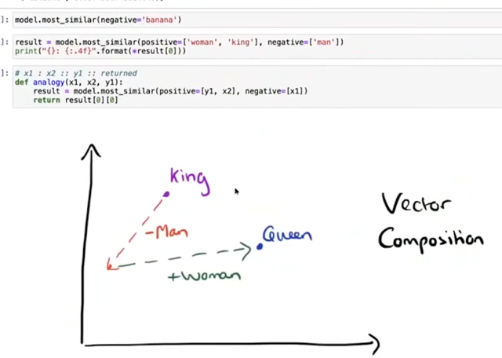</kbd>

> [!NOTE]
> Và nó thể hiện cả các
> analogy như man-woman king-queen

 

<kbd>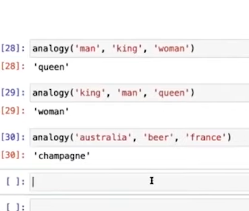</kbd>

 

<kbd>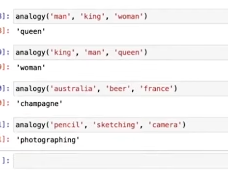</kbd>

 

<kbd>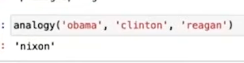</kbd>

 

<kbd>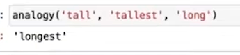</kbd>

 

<kbd></kbd>

> [!NOTE]
> Đại khái là dùng hai word vector cho mỗi từ (1 khi nó là context word, 
> 1 khi nó là center word) thì sẽ dễ training hơn (Tính toán derivative)
>
> Và dù sao thì khi training, với các window ở các vị trí khác
> nhau thì một từ sẽ có khi là center word cũng sẽ có khi trở thành
> context word nên ổng nói cuối cùng ta sẽ **end úp với hai word
> vector khá giống nhau.**
> Và ta sẽ**lấy average**giữa chúng, nhưng cũng có người làm kiểu
> khác

 

<kbd></kbd>

> [!NOTE]
> Có người hỏi gì không rõ nhưng ổng trả lời là với
> những từ như "**so**", thì word vector của nó không tốt
> lắm vì những từ dạng này xuất hiện ở mọi context
> nên nó rất chung chung

 

<kbd>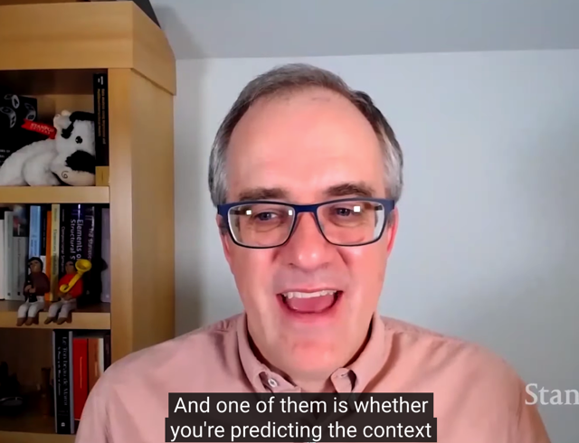</kbd>

> [!NOTE]
> Đại khái là Word2Vec chỉ là một framework để build word
> vector và có nhiều cách triển khai cụ thể khác nhau
>
> Trong đó thì như ở đây ổng giới thiệu nó gọi là **Naive Optimization**Nhưng thực tế thì cái này nó khá "expensive" (trong tính toán)
> Nên sẽ nói đến những cách khác như **Skip-gram** và**Negative 
> Sampling** (đã có nói đến trong DLSpec)

 

<kbd></kbd>

> [!NOTE]
> Start với random word vectors, và dùng **gradient descent** nhiều lần
> để giảm cost và tăng khả năng predict của model đối với các từ hay
> xuất hiện gần nhau. Dần dần ta sẽ có bộ word vectors phản ánh /
> chứa đựng những ngữ nghĩa của nó

 

<kbd>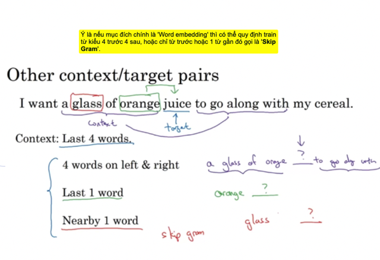</kbd>

<kbd></kbd>

<kbd>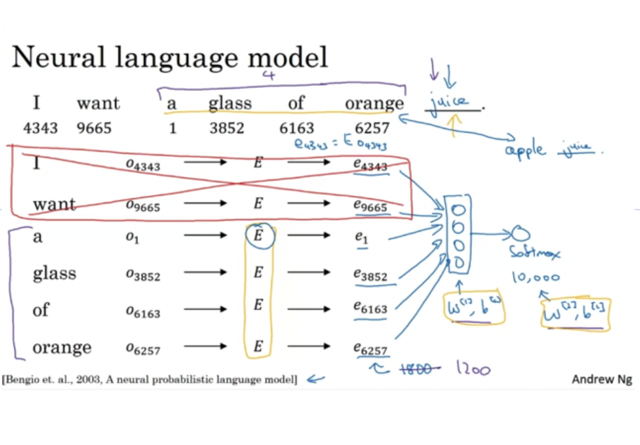</kbd>

> [!NOTE]
> DLSpec: Đại khái là nói về **một kiến trúc đơn giản trước ra đời trước (skip-gram,
> hay CBOW)  để train ra word embedding** mô tả trong paper từ 2003 của Yoshua
> Bengio A neural probabilistic language model)
>
> Trong đó input là **những từ trước đó** ("I", "want", "a", "glass", "of") của **từ  cần
> đoán target** ("juice"). Ví dụ **vocab_size là 10000**, **embedding dimension là
> 300**.
>
> Các từ sẽ được**one-hot encoded**, ví dụ (1x10000) sau đó thông qua linear
> transformation = **nhân với weight matrix E** gọi là **embedding matrix** có shape
> 10000x300 **để thành embedding vector 1x300**.
>
> Tiếp theo **sum hoặc average các embedding words** này lại để rồi **cho qua một
> Dense layer với softmax activation** để ra một vector y^ chứa**10000 probability
> scores**
>
> Tiếp theo với **loss function** là **negative log likelihood (log loss)** với **y^** và
> **target y**  - **là one-hot encoded của target word "juice",** model sẽ**tìm cách
> tweak các layer params và Embedding matrix E** sao cho **giảm loss** thì chính là
> **mang hiệu quả là với các từ context "I", "want", "a",..."of" , maximize xác suất
> xuất hiện của từ "juice"**

> [!NOTE]
> Thì nếu các từ context là vài từ trước đó và sau đó thì ta có kiểu
> tương tụ CBOW (dù CBOW), hoặc bỏ qua vài từ thì ta có Skip-gram
> Việc cho center đoán context word hay cho context đoán center thì thật
> ra cũng mang hiệu quả như nhau thôi

 

<kbd>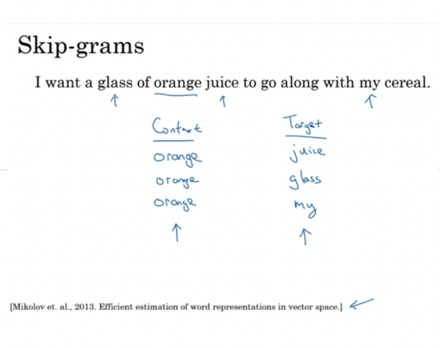</kbd>

> [!NOTE]
> DLSpec: Skip-grams, cho center word ví dụ orange, model phải đoán
> các từ trong context nhưng có skip, ví dụ orange - glass, my

 

