# Lecture 2: Neural Classifiers

📊 **Progress:** `31` Notes | `39` Screenshots

---

<kbd>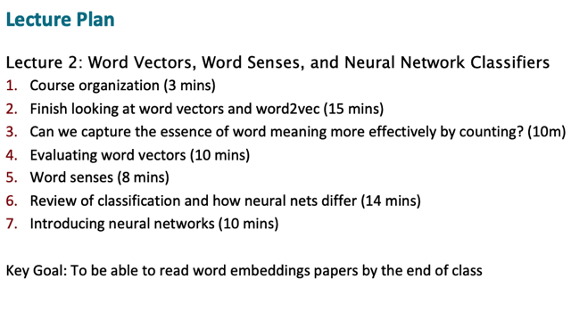</kbd>

> [!NOTE]
> "Mục tiêu là sau lecture này các bạn sẽ tự tin mà
> đọc các paper như word2vec, glovec...." Chris Manning

 

<kbd>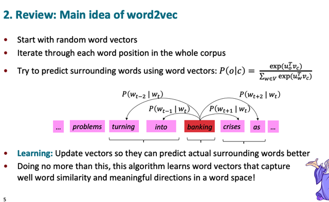</kbd>

> [!NOTE]
> Như bài trước đã học, bằng cách cho máy tính **dự đoán từ context** **dựa
> trên từ center word**, và quá trình training nó tìm cách **giảm loss**define
> bằng**log likelihood** nó sẽ**"learn" bộ word embedding** sao cho**các từ
> vựng nằm gần nhau** sẽ có ý nghĩa giống nhau mà hơn nữa còn **nắm bắt
> được các yếu tố ngữ nghĩa** cũng như các hướng vector có ý nghĩa (ví dụ
> man - woman sẽ mang ý nghĩa giới tính)

 

<kbd>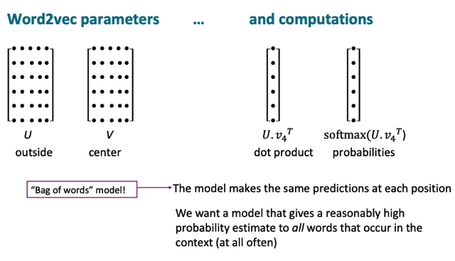</kbd>

> [!NOTE]
> Đại ý là những phương pháp này gọi là **bag of words models**. Nôm
> na là nó **không quan tâm nhiều lắm đến vị trí của các context word là
> trước  hay sau**...Nó c**hỉ quan tâm các từ có xuất hiện gần nhau hay
> không**
>
> Và một điều là ta sẽ không nói đến các giá trị p 0.3, 0.5 mà sẽ là những
> giá trị nhỏ như 0.01, vì có rất nhiều từ có thể xuất hiện cùng nhau (nôm na
> là**cho một center word thì sẽ có rất nhiều từ có thể xuất hiện trong
> context của nó**) nên**chia ra thì  P rất nhỏ** (dù là so sánh tương đối với
> các từ ít xuất hiện quanh từ center  word đó là cao)

 

<kbd>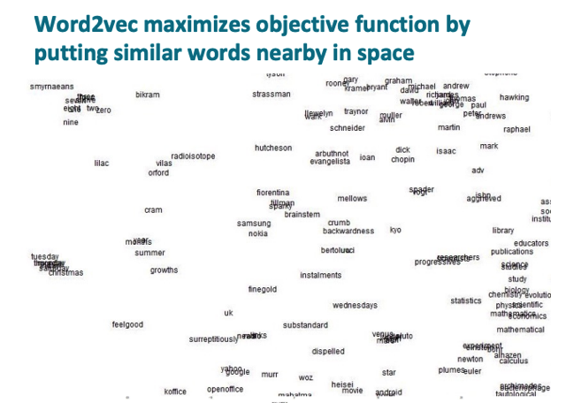</kbd>

> [!NOTE]
> Đại ý là Word2Vec algorithm trong quá trình training sẽ tìm cách**tweak các params (mà ở đây chỉ là các word embedding)** sao cho
> **những từ gần nghĩa nhau** sẽ **nằm gần nhau trong vector space** thì
> sẽ khiến giảm loss và đạt objective function.
>
> Và thầy Manning lưu ý ta rằng ở đây mình đang xem là dùng **PCA** để
> giảm chiều xuống 2D, tuy nhiên**trong không gian high dimension của
> word embedding thì có thể nó sẽ khác** - 2 từ gần nhau ở 2D có thể thật
> ra là cách rất xa nhau trong không gian gốc

 

<kbd>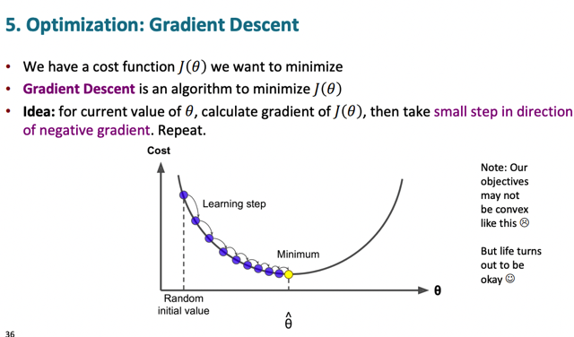</kbd>

> [!NOTE]
> Về G.D đã biết rồi khỏi nói lại

 

<kbd>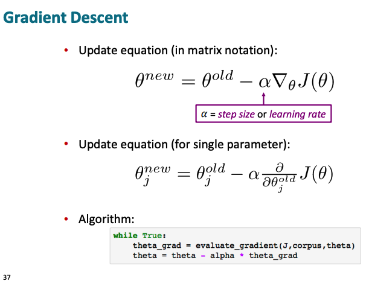</kbd>

 

<kbd>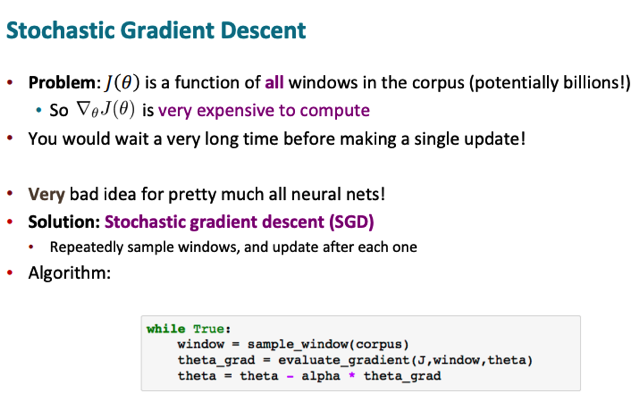</kbd>

> [!NOTE]
> Đại khái là như ta đã biết bên **MLSpec** đó là **gradient descent** nếu nói
> chính xác thì đó **batch gradient descent** - tức là ta sẽ **tính gradient**  =
> **derivative của loss** w.r.t **params** với l**oss tính trên toàn bộ data
> sample** mà ở đây là **toàn bộ center words**, và cũng đồng nghĩa là
> **toàn bộ training corpus** và có thể lên tới hàng trăm nghìn từ.
>
> Thì làm vậy như ta cũng đã biết là sẽ khiến **một lần tính để update params
> sẽ mất rất nhiều thời gian**. Tuy là kiểu như ta **sẽ đi theo hướng đúng
> nhất** về đáy thung lũng n**hưng mỗi bước sẽ phải tính rất lâu**.
>
> Thì do vậy mà thay vào đó nên dùng **stochastic G.D** hoặc **mini-batch
> G.D** trong đó ta tính gradient (derivative của loss function w.r.t params)
> **dựa trên một hoặc vài data sample thôi, và gọi nó là ước lượng của
> gradient (chính xác)**
>
> Và vì **chỉ là ước lượng** của gradient chính xác (mà muốn tính phải tính
> trên toàn bộ training set) nên **nó sẽ không chính xác**,**có lúc rất sai**,
> nhưng cũng có lúc đúng và dẫn đến **nó khiến ra đi xuống đồi theo nhiều
> hướng khác nhau mỗi lần**, mà trong đó có thể có những lúc đi rất sai (so
> với hướng đúng phải đi).
>
> Nhưng **được cái là ta sẽ tốn rất ít thời gian cho một lần "đi"**. Và vì **dù đi
> rất nhiều bước chệch choạc nhưng đi nhiều lần nhìn chung vẫn giúp ta
> xuống đồi nhanh hơn là "suy nghĩ một hồi lâu thiệt lâu chọn ra hướng đi
> đúng nhất" rồi mới bước.**

 

<kbd>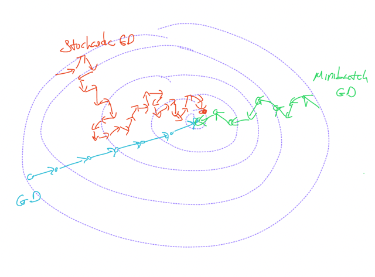</kbd>

> [!NOTE]
> Và thêm một ý là mr Chris nói dù SGD có vẻ như là
> hack/trick nhưng thật ra không phải vậy, sự noisy của
> nó thật sự có thể giúp model học tốt hơn chứ không
> chỉ là converge nhanh hơn

 

<kbd>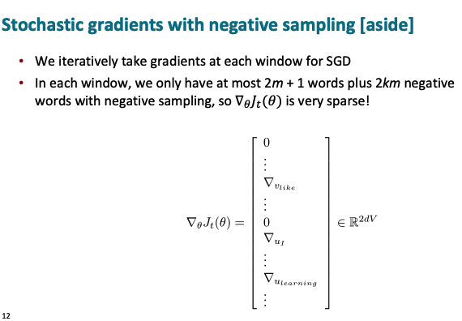</kbd>

> [!NOTE]
> Đại khái là với SGD vì **mỗi lần ta chỉ "tính trên 1 sample = 1
> center words"** để ra gradient (partial derivative) của loss đối với
> params = word embedding của vài từ context của center word
> đó. Nên**vector derivative vốn sẽ chứa tất cả params = tất 
> cả các word embedding của các words sẽ phần lớn là 0.**
> Nên rất **sparse** = trống trải.

 

<kbd>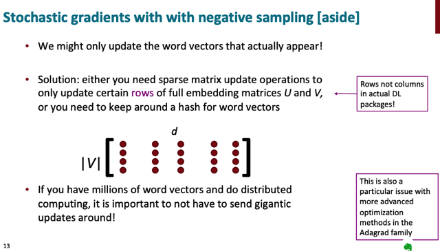</kbd>

> [!NOTE]
> Đại khái là thầy nói nếu chỉ **nghĩ theo phương diện toán học** thì **cứ
> việc thực hiện phép tính cộng trừ vector hay matrix** trên matrix (V,
> d) mỗi row là một word embedding vector.
>
> Nhưng **để tối ưu tính toá**n thì ta phải **nghĩ đến việc làm sao chỉ
> thực hiện việc update trên vài row mà đang "tính" thôi.**
>
> Và một chi tiết nữa là trong **Pytorch mỗi word embedding là một
> row**Và một điểm đáng chú ý nữa đó là thầy nói nếu các bạn biết về 
> memory thì sẽ hiểu tại sao người ta làm vậy vì khi đó **mỗi row chứa
> một vector của data sample sẽ nằm trên các byte kế tiếp nhau** trên
>  memory máy tính giúp **hiệu quả hơn**

 

<kbd>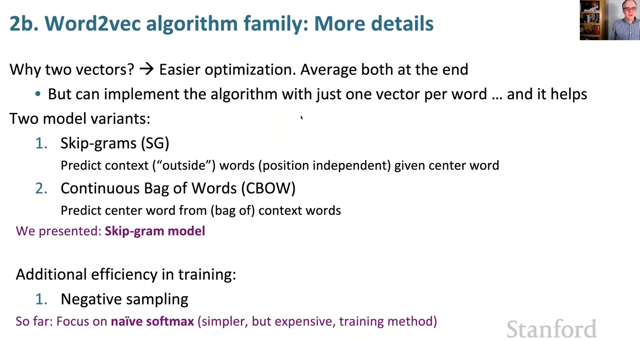</kbd>

> [!NOTE]
> Đầu tiên đại khái là ta cuối cùng ta sẽ **average hai vector của mỗi từ** một
> cái khi từ đó đóng vai center word, một cái khi nó đóng vai context word, để**trở thành một vector duy nhất cho từ đó.**
>
> Thứ hai, thày nói là**thật ra có thể dùng chỉ một vector cho một từ và thật
> sự làm vậy hiệu quả hơn** nhưng có cái là khiến quá trình thực hiện t**rở
> nên rối khi ta tính đạo hàm.**Rồi tiếp theo thì đại khái là không chỉ có một algorithm duy nhất mà thật ra
> **có nhiều cách làm**, trong số đó là **skip gram** như thầy vừa nói mấy bữa
> nay và **CBOW** là cái mình đã học trong NLPSpec trong đó thay vì cho
> trước center  word bắt đoán outer context word thì ta sẽ cho model đoán
> center word dựa trên bag of context words. Cả hai **đều cho cùng kết quả.**
>
> Cuối cùng đó là tuy lí thuyết là vậy nhưng thực tế khi tính với softmax như
> trên thì sẽ **không hiệu quả (tính toán)**. Do đó thực tế người ta dùng **"
> negative sampling"**

 

<kbd>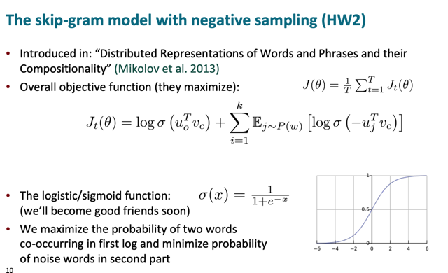</kbd>

> [!NOTE]
> Thì đại khái là vầy, ta **vẫn muốn maximize độ giống nhau giữa hai word 
> vector của center word và context word**, bằng cách **maximize
> dot product giữa chúng**. Tuy nhiên **thay vì xây dựng objective function
> là maximize P(o|c) bằng softmax** trong đó ta **phải tính dot product của 
> center word với mọi từ khác trong vocab**, **rất tốn kém**, thì ở đây ta sẽ
> xây objective function **với hàm sigmoid** như vầy.
>
> Trong đó việc maximize function này sẽ **encourage model maximize
> uoTvc bởi vế đầu giúp khiến context word và center word vector
> giống nhau**. Còn vế sau ta hiểu là ta sẽ**lấy random k từ NOT context
> word**, và model sẽ **minimize độ giống nhau của center word và các từ
> "sai" này.**
>
> Chú ý ở đây là objective function **Jt(theta) với mỗi center word t** , 
> và objective function (cho mọi word) sẽ là**average của mọi Jt(theta)**====
>
> Nói thêm rằng dù khi chọn k random words có thể ta vẫn đôi khi chọn được
> từ vốn là cũng nên similar với context word (vì có thể nó cùng xuất hiện với
> trong bối cảnh center-context khác) nhưng 99% là ta sẽ chọn những từ "không
> context" nên mọi việc vẫn ok.

 

<kbd>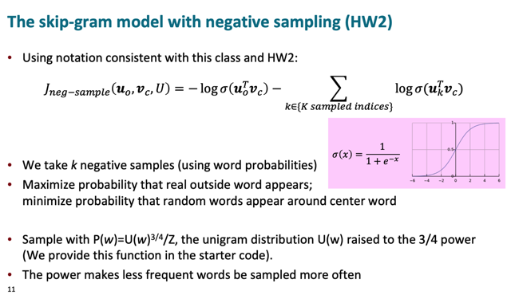</kbd>

> [!NOTE]
> Và c**huyển objective function thành cost function**
>
> Có **một vài trick** mà trong DLSpec ông Andrew cũng có nói đó là người
> ta sẽ **dùng cách sample sao cho giảm việc các từ quá thông dùng được
> chọn và tăng khả năng chọn của các từ hiếm**. Thầy Cris cũng chỉ nói
> lướt qua sơ sơ là bằng cách dùng **unigram distribution** = tính toán
> bằng**tần suất xuất hiện của từ**. Và **lũy thừa 3/4 như vậy để thu hẹp
> khoảng cách giữa các từ hiếm và thông dụng** giúp khi random sampling
> không bị chỉ chọn toàn từ thông dụng.

 

<kbd>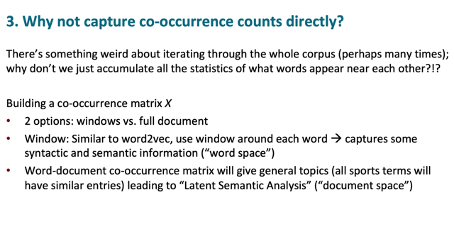</kbd>

> [!NOTE]
> Xong mới đặt câu hỏi là sao không làm đơn giản là t**hống kê
> các lần các từ xuất hiện cùng nhau** để tạo thành co-occurrence
> table

 

<kbd>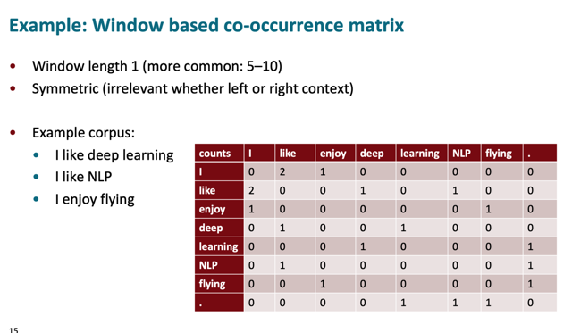</kbd>

> [!NOTE]
> Ví dụ như cái**co-occurrence table** như này. đơn giản chỉ là đếm số lần các
> từ xuất hiện cùng nhau, có thể trong context window là vài từ hoặc cả
> document
>
> Thì đại khái là nếu dùng dạng window, tức chỉ "tính" phạm vi hẹp vài từ thì ta
> có thể có được "**syntactic & semantic information**" - tức là nó cũng có thể
> giúp ta nắm bắt được ít nhiều thông tin về ngữ nghĩa, cú pháp của từ vựng
>
> Còn nếu dùng ở "**cấp document**" thì nôm na là ta sẽ có thông tin về sự gần
> gũi của các từ ở cấp "topic", tức là các từ nào cũng trong một phạm vi một
> chủ đề nào đó. Dẫn đến một lĩnh vực gọi là Latent Semantic Analysis

 

<kbd>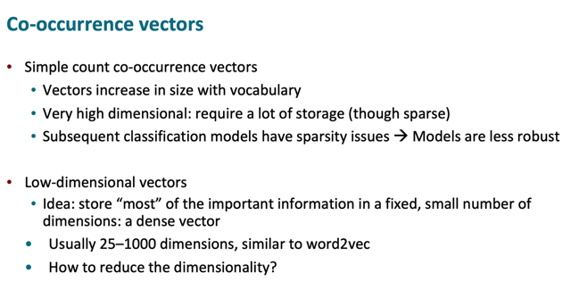</kbd>

> [!NOTE]
> Tuy nhiên nếu dùng vector bằng cách này (ví dụ như bảng trên, mỗi hàng
> là  vector của một từ) thì sẽ **rất "sparse"** = trống khi ta thấy nó sẽ**rất nhiều
> số 0 và nó rất dài** (bằng số lượng vocab) = **số dimension rất lớn**.
>
> Hệ quả là như ta cũng đã nghe nói (dù chưa hiểu rõ lắm) đó là **một số
> model làm việc không tốt với sparse vector.**
>
> Từ đó ta quay lại khẳng định rằng thực tế chứng minh rằng**dùng "dense"
> vector thấp chiều hơn, "dense" hơn (mà được tạo bằng các phương pháp
> như word2vec) sẽ mang lại hiệu quả hơn.**

 

<kbd>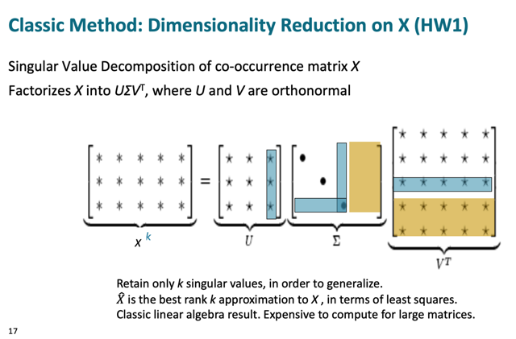</kbd>

> [!NOTE]
> Nói về phương pháp dùng SVD để giảm chiều vector
> (dimensionality reduction)

 

<kbd>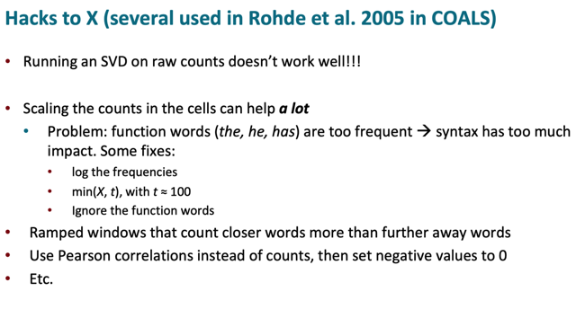</kbd>

> [!NOTE]
> Đại khái là nếu dùng**raw-counts** tức là bảng thống kê co-occurrence 
> nguyên gốc thì sẽ không work tốt, lí do là có quá nhiều từ mang ý nghĩa 
> **"chung chung"** như the, he, has sẽ có tần suất xuất hiện cao, khiến gây
> nhiễu thông tin. Do đó mới nói là **sẽ tốt hơn nếu scale các chỉ số lại
> ví dụ như dùng log**, dùng cách giới hạn hạn mức hoặc là bỏ luôn các từ
> chung chung như vậy (function words) 
>
> Một số cách khác nữa là dùng window nhỏ, và use **Pearson correlation**

 

<kbd>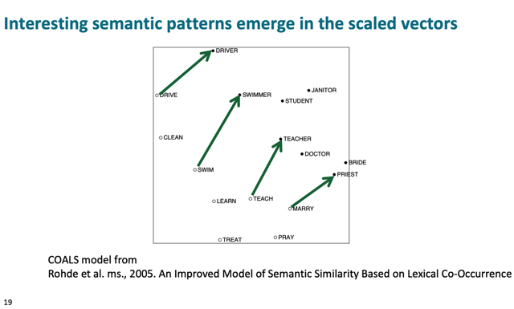</kbd>

> [!NOTE]
> Thì đại khái là cũng cho thấy một số kết qủa mang hơi
> hướng giống như king-queen-man-woman

 

<kbd>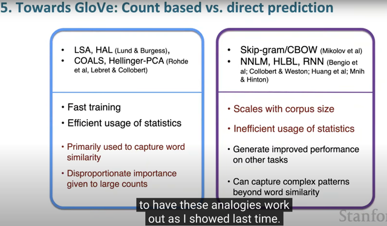</kbd>

 

<kbd>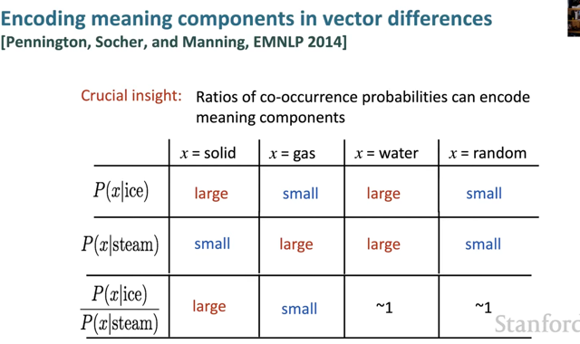</kbd>

 

<kbd>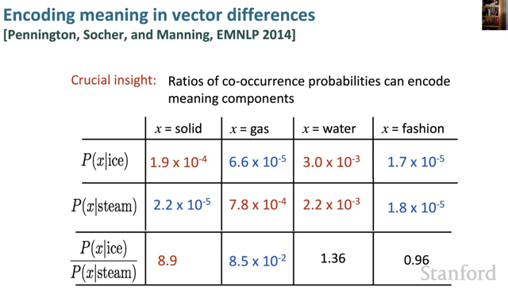</kbd>

> [!NOTE]
> Đại khái là nói về một nhận định quan trọng trong nỗ lực tìm cách "**thể hiện các
> khái niệm trừu tượng**" gọi là "meaning component" ví dụ như**hướng thay đổi từ
> man sang woman** (mang ý niệm giới tính), hay **solid sang gas**, mang **ý niệm trạng
> thái vật lí.**
>
> Thì đại khái là nếu ta chỉ dùng (cách tính) xác suất một từ xuất hiện gần từ "ice" là
> một từ mang thể rắn trong vậy lí- P(solid | ice) và lập luận rằng vì solid mang giá
> trị cao để thể  hiện rằng nó**mang ý nghĩa của thể rắn** thì sẽ không ổn. Vì như đây
> ta thấy với "water" thì nó cũng hay xuất hiện bên cạnh "ice" nên P(water|ice) cũng
> cao trong khi đó water có thể là dạng hơi hoặc dạng lỏng nữa.
>
> Tương tự, nếu chỉ dựa vào P(gas|steam) cao thì nôm na là **chưa đủ để biểu thị  ý
> nghĩa gas là thể hơi**. Vì P(water|steam) cũng cao.
>
> Tuy nhiên người ta nhận thấy **nếu dựa vào tỉ lệ của P(x|ice)/P(x|steam)** thì ta sẽ
> thấy rõ ràng rằng với solid, nó có tỉ lệ cao, với gas nó có tỉ lệ rất nhỏ. Còn water và
> fashion thì đều ~= 1
>
> Từ đó cho thấy rằng dùng tỉ lệ, sẽ làm rõ thông tin rằng **từ solid là từ mang ý nghĩa
> rắn rất cao**, và **gas là từ mang ý nghĩa hơi** (như steam) rất cao còn **water thì
> fashion là trung tính**, không thiên hẵn về bên nào.
>
> Và tóm lại ta có thể**dựa vào tỉ lệ này để xem thử 1 từ thiên về hướng nào trong
> spectrum từ solid -> gas**

 

<kbd>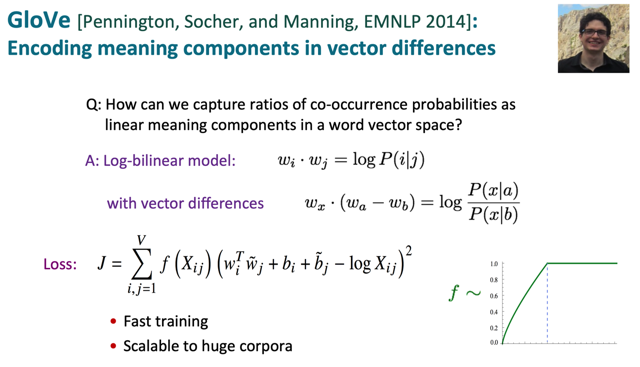</kbd>

> [!NOTE]
> Đại khái là vì ta đã biết dot product của hai vector uo, vc sẽ thể hiện**xác suất của
> việc chúng xuất hiện cùng nhau**, đúng hơn là log của xác suất vì khi ta tính xác
> suất, p(o|c) ta dùng softmax, trong đó ta exp(uoTvc). Mà nói lại cho nhớ thêm đó
> là bởi ta xuất phát từ một nhận định quan trọng đó là **ý nghĩa của một từ sẽ được
> định nghĩa bằng các từ gần nó**, từ đó **nếu hai từ hay xuất hiện gần nhau thì ý
> nghĩa của chúng cũng gần gũi nhau, giống nhau**. Nên từ đó ta xây dựng
> objective function sao cho nếu xác xuất chúng xuất hiện cùng nhau cao thì **hai
> vector của chúng phải trở nên giống nhau**,  gần gũi nhau trong không gian
> embedding vector. Thì hai vector gần nhau thì dot product của chúng sẽ lớn
> (cũng như khi tính Cosine similarity trong đó có dot product)
>
> Do đó để tính P(x|a)/P(x|b) sẽ bằng **wx.(wa-wb)**
>
> Thì đại khái là GloVec muốn **kết hợp cái gọi là Co-occurrence matrix** trong các
> phương pháp xây dựng word vector theo thống kê (statistic) như mấy cái bên trái
> của cái bảng trước. **Và phương pháp xác suất như CBOW,  Word2Vec** ở bên
> phải bảng trước. Do đó học xây dựng objective function như vầy.
>
> Cái f(Xij) từ từ nói, nói cái Xij trước, nó là chỉ số co-occurrence của từ w_i và từ
> w_j trong co-occurrence matrix. Thì đương nhiên nếu hai từ hay xuất hiện cùng
> nhau thì chỉ số này cao.
>
> Thì vế bên phải mang ý định nôm na là: À, hay tweak word embedding vector
> của w_i và w_j sao cho **nếu hay từ này xuất hiện cùng nhau nhiều** thì **dot
> product của chúng phải cao tương ứng** (để rồi trừ nhau mới nhỏ lại). Bình
> phương lên để kiểu **khuếch đại error lên như trong MSE**. Hai cái **b là bias term**
> không  có gì, đương nhiên model cũng sẽ tìm ra hai chỉ số này.
>
> Cuối cùng quay lại f**(Xij)**đại khái chỉ là một function để ta **khống chế các từ thông
> dụn**g, bên DLSpec có nói đó là để g**iảm chênh lệch giữa các từ thông dụng và
> các từ ít thông dụn**g.Theo GPT thì người ta hay dùng **sigmoid**, trong đây Crist có
> nói**f(Xij)**dùng để **"cap" mức ảnh hưởng của các từ thông dụng**. Nhìn công thức
> mình hiểu rằng, **nếu (những từ wi và wj mà có Xij lớn thì phải cho model tập
> trung vào nó, tức là dùng Xịj như trọng số để ưu tiên hơn / nhấn mạnh hơn các
> cặp từ hay xuất hiện cùng nhau)**. Nhưng **phải hạn chế nó, bằng cách dùng f(Xij)
> để cho nó (Xij) có lớn mấy thì mức ảnh hưởng vào objective function cũng chỉ =
> 1 thôi**
>
> Và một cái ở đây Crish không nói nhưng Andrew có nói đó là tránh việc X**ij = 0
> sẽ khiến logXij = log0 bị lỗi**

 

<kbd>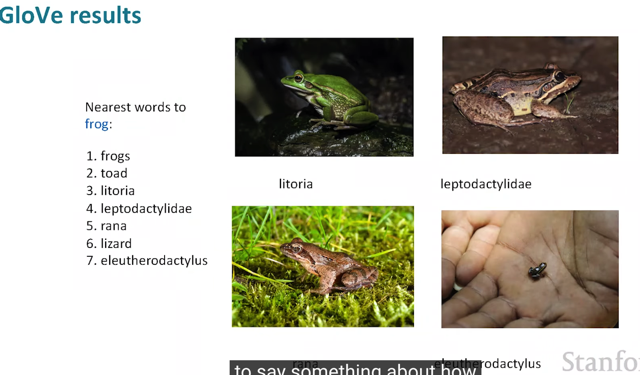</kbd>

> [!NOTE]
> Và kết quả là nó cho word vector rất tốt khi những từ
> này (gần nhau trong không gian) thì đúng đều là những
> loài ếch khác nhau

 

## Ở đây có người hỏi đại khái là tại sao việc dùng các chỉ số statistic

> [!NOTE]
> Ở đây có người hỏi đại khái là tại sao việc dùng các chỉ số statistic
> (co-occurrence matrix) lại là cons là ưu điểm hỗ trợ cho Skip-gram
>
> Thì đại khái đó là vì, trong skipgram như ta đã thấy, quá trình sẽ là ta
> di chuyển các window qua hết corpus, để tại mỗi window ta có center
> word và context words. Để rồi nôm na là tại mỗi window ta mới biết từ
> nào là hay xuất hiện với từ nào.
>
> Còn bằng cách sử dụng co-occurrence matrix, ta đã có sẵn à là từ
> này hay xuất hiện nhiều với từ kia, nên sẽ kiểu như "trực tiếp hơn", ta
> khỏi phải đi từng window mà có thể làm "at once" dẫn đến hiệu quả
> hơn trong training

 

<kbd>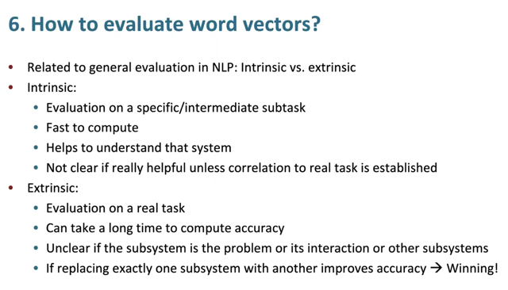</kbd>

> [!NOTE]
> Đại khái là nói về các cách để đánh giá word vector mà cũng là các khía
> cạnh khác trong ML.
>
> Cái này cũng đã biết qua bên MLOpsSpec, thì đại khái là intrinsic nôm na
> là ta đánh giá bằng các task cụ thể (specific) được thiết kế riêng cho việc
> đánh giá word vector. Ưu điểm là nhanh, nhưng nhược điểm là nó mang
> tính cục bộ, ta không biết được kiểu như là à, word vector đánh giá bằng
> cách này ok rồi, nhưng liệu khi mang nó vào các ứng dụng ngoài đời
> thực thì nó có giúp cải thiện performance của chúng không.
>
> Còn extrinsic thì ngược lại, đó là đánh giá chất lượng của word vector
> thông qua việc xem nó có giúp cải thiện các ứng dụng cụ thể thực tế
> (như dịch thuật, semantic search) Nhược điểm là phải xâu dựng ứng
> dụng cuối thì mới đánh giá được, nên lâu. Và nếu performance có tốt lên
> hay dở đi thì cũng không chắc là do word vector tốt lên hay đơn giản chỉ
> vì những cái component khác làm việc tốt hơn so với cái cũ

 

<kbd>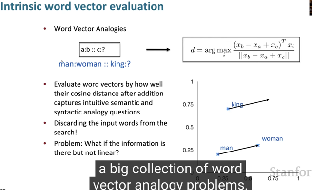</kbd>

> [!NOTE]
> Ví dụ điển hình của intrinsic evaluation là có có man to woman thì từ
> king tìm ra cái gì, và ta expect sẽ ra queen.
>
> Ở đây mr Chris nói một cái trick đó là,  khi các bạn tính wMan -
> wWoman + wKing rồi tìm nearest neighbor của kết quả đó thì khả
> năng đó là bạn sẽ lại thấy từ King, nên cái trick là là đừng có include
> từ king khi search.

 

<kbd>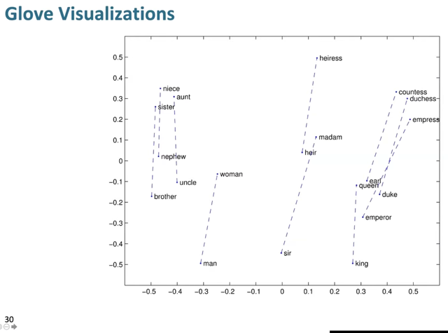</kbd>

 

<kbd>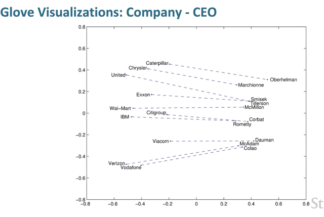</kbd>

 

<kbd>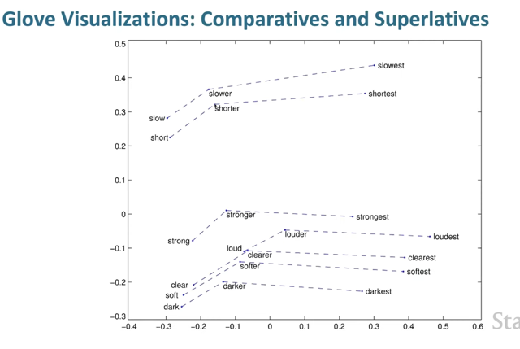</kbd>

 

<kbd>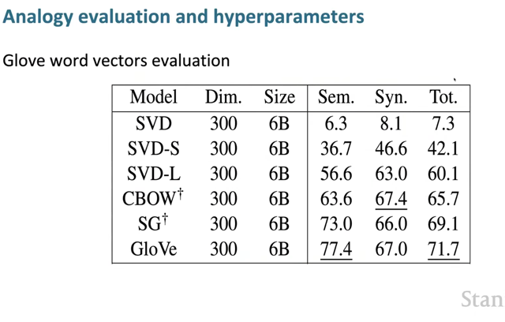</kbd>

> [!NOTE]
> Đại khái là bảng tính các chỉ số đánh giá word vector ở khía
> cạnh Semantic và Syntatic. Cho thấy GloVe đạt performance
> cao nhất, sau đó là SkipGram và CBOW
>
> Ở khúc trên SVD (bài trước đã nói, là dùng phương pháp 
> dựa trên co-occurence table, cho thấy nếu không scale, tức
> giảm ảnh hưởng của các từ thông dụng xuống thì performance
> rất tệ, nhưng khi scale thì cải thiện hơn hẳn

 

<kbd>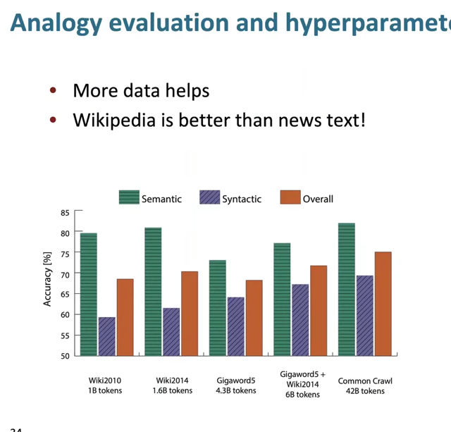</kbd>

> [!NOTE]
> Đại khái là nói về ảnh hưởng của**data lên performance**. Khi model
> train trên**Wiki data** có **semantic scores cao hơn** còn model train trên
> **google news** thì có**syntactic score cao hơn**. Và model train bằng web
> crawl (lấy hết data trên internet) thì tốt hơn cả ở hai khía cạnh.

 

<kbd>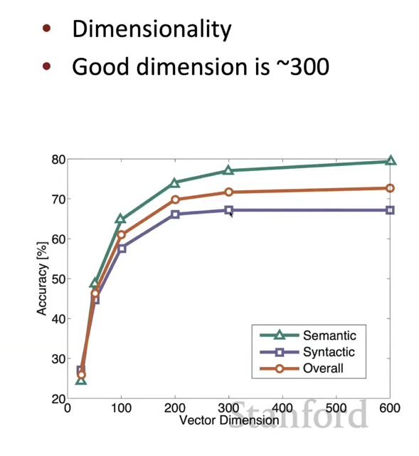</kbd>

> [!NOTE]
> Còn cái biểu đồ này cho thấy tại sao ta hay thấy người
> ta dùng dimension 300. Vì nhiều hơn thì  nó không hẳn
> là tốt hơn nữa

 

<kbd>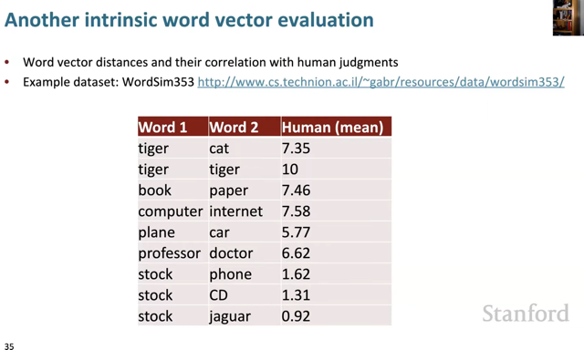</kbd>

> [!NOTE]
> Một cách intrinsic word vector evaluation nữa đó là dựa trên
> các đánh gía (do con người làm) về độ tương đồng của các từ

 

<kbd>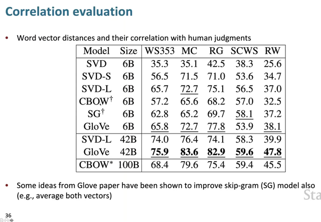</kbd>

 

<kbd>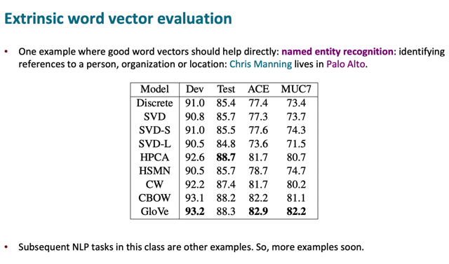</kbd>

 

<kbd>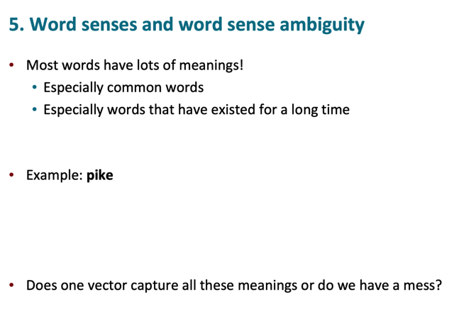</kbd>

> [!NOTE]
> Nói đến vấn đề đặt ra là **từ vựng thường có nhiều nghĩa khác nhau** khi
> ở các n**gữ cảnh khác nhau** thì làm sao 1 vector có thể capture mọi ý
> nghĩa đó

 

<kbd>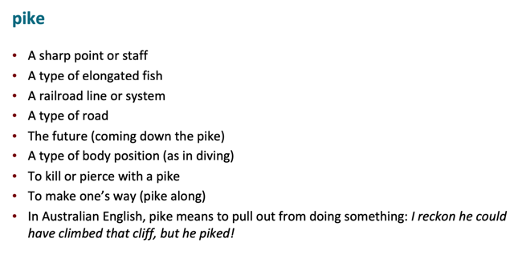</kbd>

> [!NOTE]
> Ví dụ như từ pike có nhiều nghĩa khi ở các
> ngữ cảnh, lĩnh vực khác nhau

 

<kbd>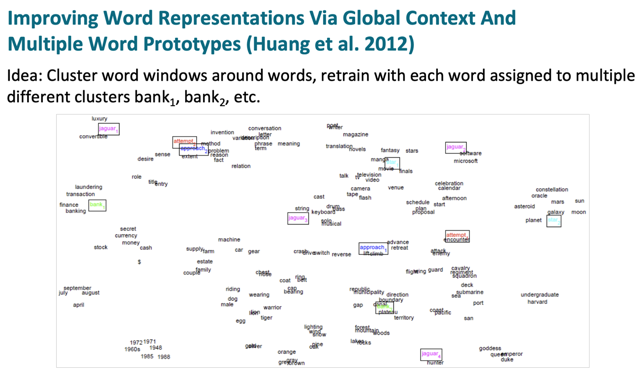</kbd>

> [!NOTE]
> Đại khái là nói đến việc dùng mỗi word vector cho
> mỗi khía cạnh / trường nghĩa / lĩnh vực khác nhau
> của từ

 

<kbd>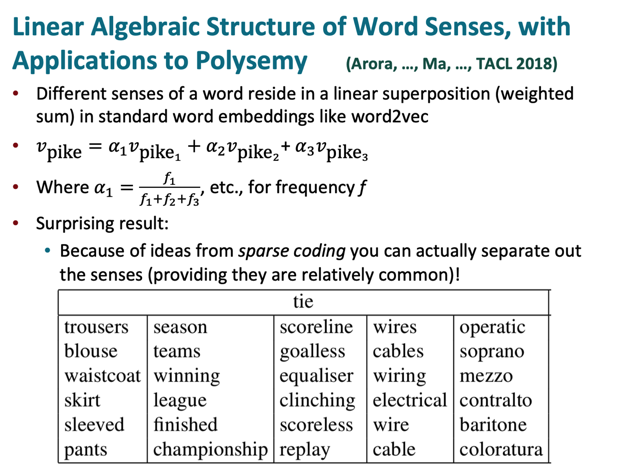</kbd>

> [!NOTE]
> Đại khái là một cách đó là weighted sum tụi nó lại theo weight tính bởi
> frequency
>
> Và sparse coding đại khái nói là trong vector space thật sự ra hóa ra là
> Ta có thể phân tách từ vector spice chung chung (weighted sum) thành
> các component cho các nghĩa của nó. Kiểu như nếu nói 17 là sum của 3
> số thì trong không gian 1D ta không thể biết 17 là tổng của 3 số nào
> nhưng trong không gian cao chiều hơn thì hóa ra có thể làm cái việc
> phân tách này.
>
> Ví dụ tie có thể được phân tách ra thành các sub vector mà trong đó
> người ta thấy nó gần gủi với các vector của các từ trong các cột từ đó
> cho thấy các nghĩa khác nhau của từ tie

 

