# Lecture 4: Syntactic Structure And Dependency Parsing

📊 **Progress:** `44` Notes | `53` Screenshots

---

<kbd>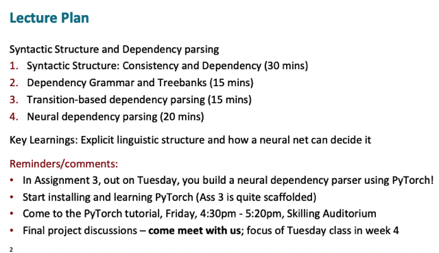</kbd>

 

<kbd>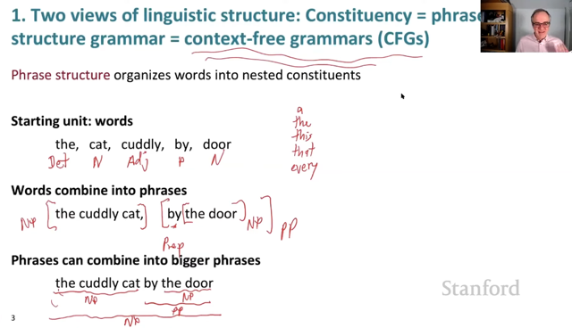</kbd>

> [!NOTE]
> The main ideas presented in the lecture are as follows:
>
> 1. **Introduction to **Linguistics** and**Natural Language Processing****: The lecture begins with a shift in
> focus towards **linguistics** and **natural language processing**, particularly on the topic of **dependency
> parsing**.
>
> 2. **Concepts of **Syntactic Structure****: The lecturer introduces the concepts of **constituency** and
> **dependency** in **syntactic structure** and explains their **relevance** in understanding **linguistic patterns**.
>
> 3. ****Dependency Grammars** and **Treebanks****: The discussion progresses to delve deeper into
> **dependency structure**, introducing **dependency grammars** and **dependency treebanks** as tools for
> **analyzing language structure**.
>
> 4. ****Transition-Based Dependency Parsing****: `Transition-based` dependency parsing is introduced as a
> method for building natural language processing systems, focusing on the process of **transitioning**
> between **different dependency structures**.
>
> 5. **Neural Dependency Parsing**: The lecture presents a simple yet **highly effective neural dependency
> parser**, which will be the focus of the third assignment. This parser is highlighted as a practical application
> of the concepts covered in the lecture.
>
> 6. **Announcements**: The lecturer makes several announcements regarding the use of **PyTorch**
> framework for assignments, upcoming tutorials, and the importance of considering final projects.
>
> 7. **Structuring Sentences and Meaning**: The second part of the lecture shifts towards discussing**how
> sentences are structured to convey meaning in human language**. Concepts such as **part of speech** and
> **phrases** are introduced as **fundamental units of linguistic structure**.
>
> 8. ****Context-Free Grammars****: The lecture introduces c**ontext-free grammars**as a common approach to
> understanding **larger units of meaning in languages**, such as **phrases**, and explains how **phrases can be
> nested to create more complex structures**.
>
> Overall, the lecture provides a **comprehensive overview** of the**fundamental concepts** and practical
> applications of linguistics and natural language processing, emphasizing the importance of understanding
> **syntactic structure** and meaning in language analysis.

> [!NOTE]
> **syntactic**: cú pháp
>
> The term "syntactic" pertains to **syntax**, which is a**branch of linguistics**
> concerned with the **structure**, **arrangement**, and **order of words** within
> sentences to**form meaningful utterances in a language**. Syntactic
> analysis involves examining **how words are combined to create
> phrases, clauses, and sentences**, and how these elements relate to
> each other grammatically.
>
> In essence, syntactic analysis focuses on the **rules** and **principles** that
> govern the**formation of grammatically correct sentences** in a language.
> This includes studying aspects such as **word order, sentence structure,
> parts of speech**, and **grammatical relationships between words**.
>
> Understanding the **syntactic structure** of a language allows linguists and
> language processors to **analyze and interpret the meaning of
> sentences**, **identify grammatical errors**, and develop computational
> models for natural language understanding and generation.

> [!NOTE]
> **Dependency parsing** is a technique used in natural language processing (NLP) to **analyze the
> grammatical structure of sentences**. It involves **identifying the relationships** **between words** in a
> sentence and **representing these relationships** as a **directed graph**, where the**word**s are **nodes** and
> the **dependencies between them are edges**.
>
> In**dependency parsing**, each word in a sentence is assigned a **grammatical label** (such as subject,
> object, modifier, etc.) **based on its relationship to other words** in the sentence. These relationships are
> **typically hierarchical**, with s**ome words serving as dependents of others.**
>
> The **main goal of dependency parsing** is to **uncover the syntactic structure of sentences** by identifying
> the**head words** (governing words) and t**heir dependents**. For example, in the sentence "**The cat sits
> on the mat**," the word "**sits**" is the head word, and "**cat**," "**on**," and "**mat**" are its dependents, indicating
> the subject, prepositional phrase, and object, respectively.
>
> Dependency parsing has v**arious application**s in NLP, including:
>
> 1. ****Syntactic Analysis****: Dependency parsing helps in **understanding the grammatical structure** **of
> sentences**, which is **crucial for tasks** such as**text understanding**, **information extraction**, and **machine
> translation**.
>
> 2. ****Dependency Grammar Construction****: Dependency parsers can be used to**automatically
> generate dependency grammars**, which describe the **syntactic relationships between words** in a
> language. These grammars serve as the basis for many NLP applications.
>
> 3. ****Semantic Role Labeling****: Dependency parsing can assist in**identifying the semantic roles** of
> **words in a sentence**, such as agent, patient, theme, etc., which is useful for tasks like question
> answering and sentiment analysis.
>
> 4. ****Dependency-based Parsing Algorithms****: Dependency parsing algorithms, such as
> **transition-based** and **graph-based parsers**, are used to parse sentences and extract syntactic
> dependencies automatically from text data.
>
> Overall, **dependency parsing** is a **fundamental technique in NLP** for analyzing the **syntactic structure of
> sentences**and e**xtracting useful information from textual data.**

> [!NOTE]
> constituents: Thành phần
>
> In the context of **linguistics**, "**constituency**" refers to the **idea that sentences are composed
> of smaller**, **meaningful units** called **constituents**. These constituents are **groups of words** that
> function together as a **single unit** within the sentence, often **representing specific syntactic
> roles or meanings**.
>
> For example, in the sentence "The cat sits on the mat," there are **several constituents:**
>
> 1. ****Noun Phrase (NP)****: "The **cat**" is a noun phrase, where "**the**" is a **determiner** and "**cat**"
> is a **noun**. This constituent functions as the **subject of the sentence.**
>
> 2. ****Verb Phrase (VP)****: "**sits on the mat**" is a **verb phrase**, where "**sits**" is the **verb** and "**on
> the mat**" is a **prepositional phrase indicating location**. This constituent functions as the
> predicate (attribute) of the sentence.
>
> 3. ****Prepositional Phrase (PP)****: "on the mat" is a **prepositional phrase**, where "on" is the
> **preposition** and "the mat" is a **noun phrase**. This constituent provides **additional information
> about the verb "sits."**
>
> The concept of constituency is **fundamental**in**syntactic** **analysis** because it helps linguists
> understand **how sentences are structured** and h**ow different par**ts of a sentence **relate to
> each other**. Constituency also plays a crucial role in the **development of formal grammatical
> framework**s, such as **phrase structure grammars** and **context-free grammars**, which are
> used in natural language processing and computational linguistics to **parse and analyze
> sentences algorithmically**.

 

<kbd>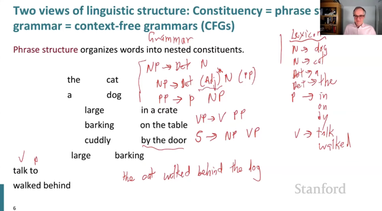</kbd>

> [!NOTE]
> đại ý là **phrase structure** giúp sắp xếp,**tổ chức các từ vựng thành
> các constituents** ví dụ **Noun Phrase** có thể có các structure như
>
> Det `-` N ví dụ "the cat", "a dog"..
>
> Det `-` Adj* (Nhiều Adj) `-` N như "the barking dog", "a cuddly cat", "the
> large barking dog"...
>
> Det `-` Adj* `-` N `-` PP: như "the large barking dog by the door"
>
> và Prep Phrase:
>
> Prep `-` NP: on the table

 

<kbd>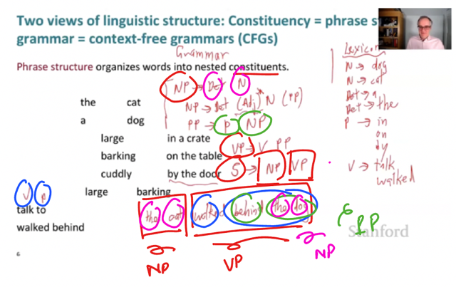</kbd>

 

<kbd>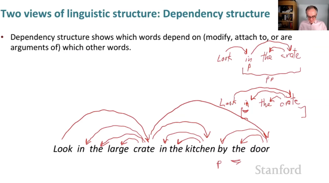</kbd>

> [!NOTE]
> Đại ý đầu tiên là về dependency structure cho biết từ nào depend vào
> từ nào. 
>
> Vẽ mũi tên từ **head word**, đến **dependent word**, thể hiện head word modify
> cho dependent word. 
>
> ví dụ trong "large crate" thì crate là head word, vì nó là danh từ chính đang nói
> đến (cái thùng), còn từ giúp bổ nghĩa cho nó (modify `/` complement) là "large"
> (cái thùng thế nào ? `->` Cái thùng lớn)
>
> Tương tự từ "the" trong the large crate cũng bổ trợ nghĩa cho cái thùng, kiểu như
> (thùng thế nào `->` Cái thùng, chữ the giúp chỉ về một cái thùng cụ thể)
>
> Tiếp tục,**in the kitchen**, **by the door**cũng bổ nghĩa cho cái thùng: Cái thùng ở đâu 
> `->` Cái thùng ở trong bếp, gần cái cửa.
>
> `===`
>
> Look `-` crate, look là head word, crate bổ nghĩa cho look: Nhìn cái gì `->` Nhìn cái
> thùng.

 

<kbd>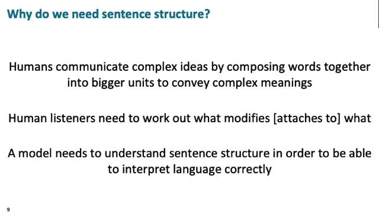</kbd>

> [!NOTE]
> đại ý là ngôn ngữ con người có thể truyền đạt những t**hông tin rất phức tạp,**
> và để làm được như vậy thì **cần phải có nhiều chứ không thể chỉ dùng một
> hay vài từ.** Lấy ví dụ để thể hiện sự đồng cảm thì không thể chỉ nói "
> **empathy**" được.
>
> Do đó phải **compose** **nhiều từ** thành một câu dài chứa ý nghĩa phức tạp.
> Tuy nhiên n**gười nghe chỉ nhận một chuỗi các từ đơn lẻ** khi nghe, và bằng
> cách **vô thức** **não người tự động** làm cái việc dependency parsing vừa rồi
> để biết từ nào là chính, từ nào là bổ trợ để từ đó có thể hiểu được ý nghĩa của
> câu đang nghe.
>
> Như vậy **để `"dạy/tái` lập" được khả năng này cho máy tính**thì cũng phải làm
> sao đó để **model cũng có thể thực hiện việc dependency parsing** này,

 

<kbd>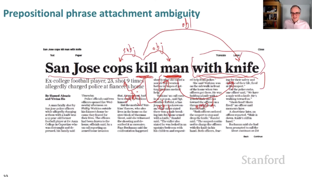</kbd>

> [!NOTE]
> Đại ý là có hai comment: 
>
> **Não người rất giỏi** trong việc quyết định xem n**ên dùng cấu trúc nào
> (kiểu như cách giải thích nào)**khi gặp trường hợp ambiguity như thế này
> **dựa vào hoàn cảnh, bối cảnh hiện t**ại
>
> Và **các ngôn ngữ khác**, như Chinese sẽ **không có kiểu ambiguity như này**,
> vì **cấu trúc của nó khác,** nhưng nó cũng s**ẽ có những trường hợp khác 
> bị mơ hồ trong ý nghĩa**

 

<kbd>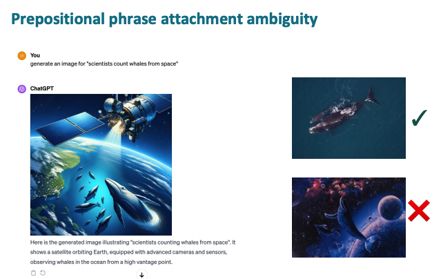</kbd>

 

<kbd>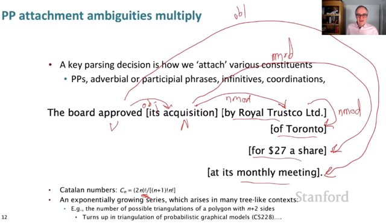</kbd>

> [!NOTE]
> đại ý là số pp (prepositional phrases) đứng cuối (để mỗi cái chỉ có thể
> modify cho một trong những cái trước đó) sẽ tạo ra **Catalan number các
> cách giải thích** ví dụ n `=` 5 ở đây thì sẽ có thể có `(2*5)!/[(5+1)!*5!]`

 

<kbd>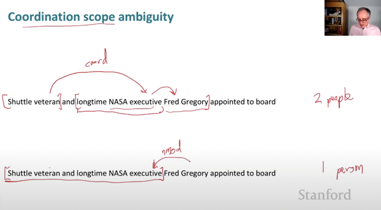</kbd>

 

<kbd></kbd>

 

<kbd></kbd>

 

<kbd>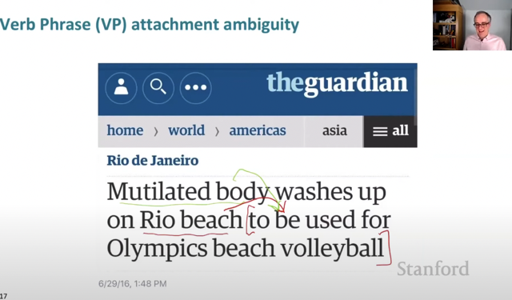</kbd>

 

<kbd>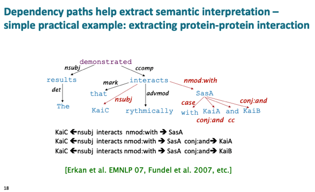</kbd>

> [!NOTE]
> đại ý là một ví dụ cho thấy**dependency path** giúp **extract** các **cách
> giải thích về ngữ nghĩa** ví dụ ở đây là giúp extract **quan hệ giữa các
> tương tác của protein** từ câu "The result demonstrated that KaiC
> interacts rhythmically with SasA KaiA and KaiB"
>
> Cho thấy **dependency parsing ứng dụng vào nhiều lĩnh vực**

 

<kbd>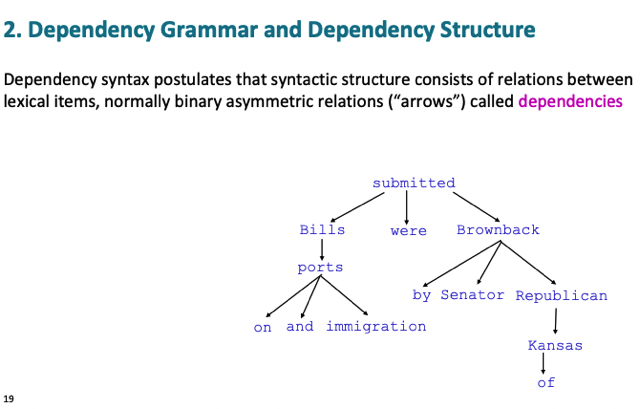</kbd>

 

<kbd>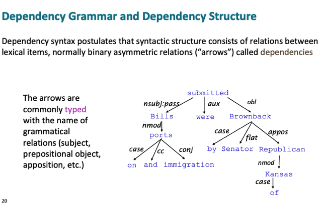</kbd>

> [!NOTE]
> Thường có ghi chú thêm tên của quan hệ ngữ pháp:
>
> Bills on port and immigration were **submitted** by Senator Republican of Kansas
> Brownback
>
> Bill `->` ports: nmod tức là ports là noun, giúp modify (bổ nghĩa) cho Bill
>
> Submitted `->` Bill: nsubj:pass là Bill noun, bổ nghĩa về chủ thể hành động cho
> submitted.

 

<kbd>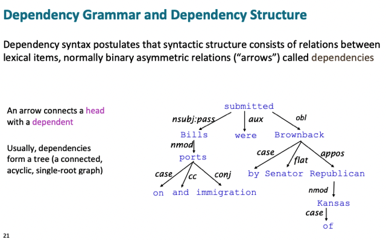</kbd>

> [!NOTE]
> Và thông thường sẽ tạo thành một cái cây, không có vòng lặp
> (acyclic) và chỉ có 1 gốc

 

<kbd>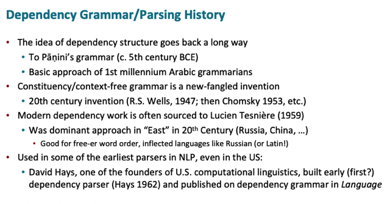</kbd>

> [!NOTE]
> Nói sơ về lịch sử của P.D

 

<kbd></kbd>

 

<kbd>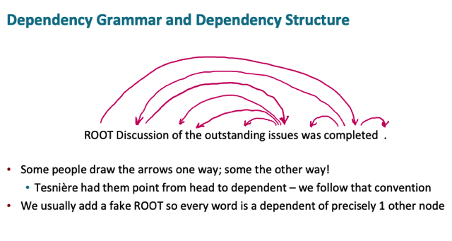</kbd>

> [!NOTE]
> đại ý là trước tiên phải xem họ dùng cách vẽ nào (head `->`
> dependent) hay ngược lại và thường ta sẽ thêm một fake
> ROOT để mọi từ đều là dependent của một node khác.

 

<kbd>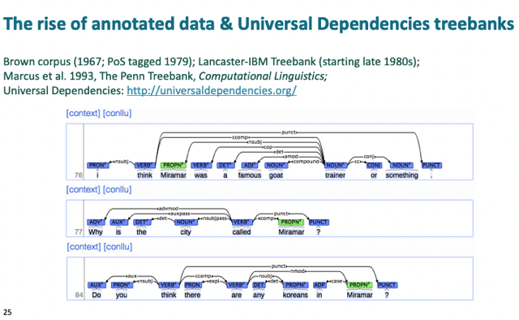</kbd>

> [!NOTE]
> đại khái là nói về **cách thu thập dữ liệu** phục vụ cho bài toán này đó là
> thường là **các nhà ngôn ngữ học** tập trung lại để ngồi **vẽ ra các
> dependency analysis** như này và tạo thành một tập hợp gọi là "
> **tree-bank"**
>
> Nói thêm là lúc đầu (khi chưa có ML), người ta tiếp cận theo hướng là
> **build parser,** tức là **hand-write các cấu trúc ngữ pháp**, define
> **lexicon**, **part-of-speech**....Và cách tiếp cận này **có vẻ đúng** vì rõ
> ràng có những **quy tắc chung chi phối các quy luật** của việc sắp xếp các
> từ sao cho đúng. Nhưng với ML thì tương tự như các vấn đề khác, cho
> thấy việc c**huẩn bị bộ annotated data và dùng ML để "tự học" các rule
> cho thấy hiệu quả cao hơn.**

 

<kbd>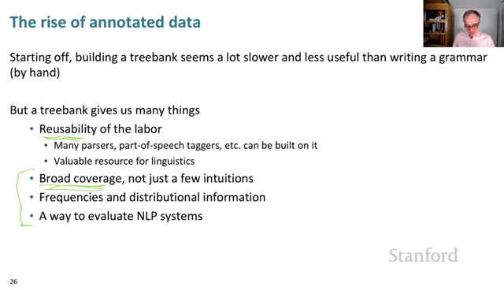</kbd>

> [!NOTE]
> Tại sao `Tree-Bank` hiệu quả đó là vì nó **có thể được sử 
> dụng cho nhiều mục đích khác nhau** sau này chứ không chỉ là một.
>
> Ngoài ra, `Tree-Bank` **chứa nhiều thông tin về statistic** **giúp ích rất 
> nhiều trong ML.**
>
> Cuối cùng là nó cung cấp một công cụ để **evaluate NLP system**

 

<kbd>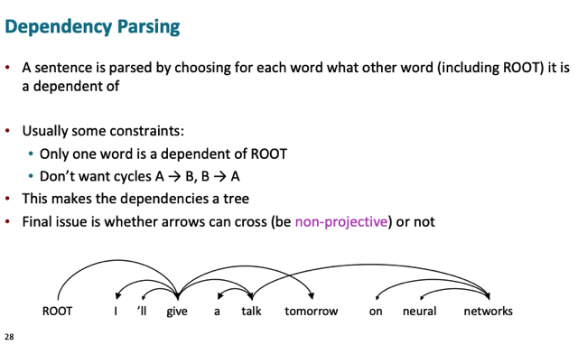</kbd>

> [!NOTE]
> đại ý là nói về rule của dependency parsing trong đó **mỗi từ sẽ phụ thuộc
> (dependent) vào một từ khác** với một số **constrains** là **chỉ có một từ
> được phụ thuộc vào ROOT**, và không được **cycle**.
>
> Một vấn đề nữa là **có thể cho phép sự chéo nhau của các arrow hay
> không**

 

<kbd>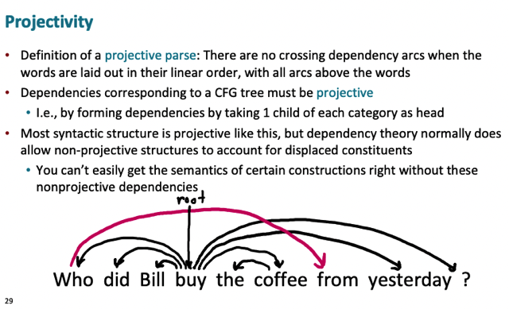</kbd>

> [!NOTE]
> Đại khái là sẽ có những trường hợp phải dùng
> **non-projective structure** thì mới phân tích đúng

 

<kbd>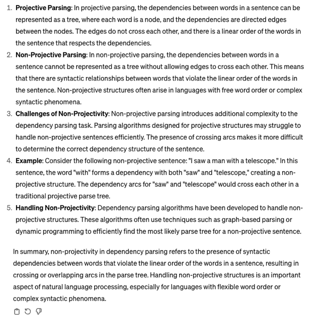</kbd>

> [!NOTE]
> đại ý là `non-projective` gây ra thêm những
> thách thức cho dependency parsing

 

<kbd>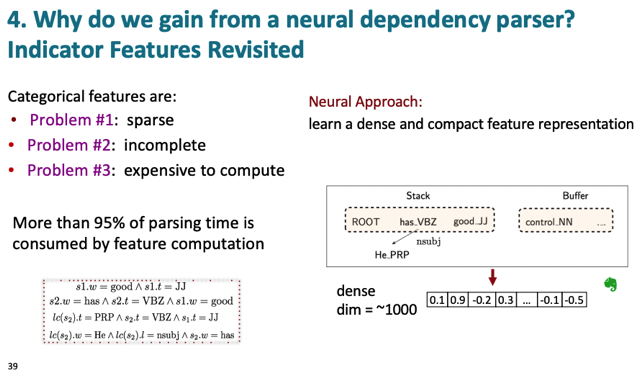</kbd>

> [!NOTE]
> Đại ý là trước khi có neural network, phương pháp này work cũng**tạm
> được** nhưng có những hạn chế quan trọng.
>
> Đó là vì nó dùng**feature indicator** `-` kiểu như check các condition, ví dụ như :
>
> 1. "có phải từ trong stack là 'I' không" và 
>
> 2. "có phải 'I' là noun không" ...để tạo ra feature. 
>
> Tương tự như của `one-hot` encoding, thành ra nó sẽ rất sparse, đây là vấn đề. 
>
> Ngoài ra nó **incomplete** và **computational expensive** (trong việc tính
> toán ra các feature.)
>
> Cách tiếp cận khác là dùng**dense vector**để represent các configuration
> trên và dùng nó trong **Neural Network.**Nhìn hình ảnh trong slide có thể hiểu
> là trạng thái (configuration) hiện tại bao gồm các thông tin như trong stack
> có từ gì, chúng là loại gì, trong buffer có từ gì, chúng là loại gì sẽ được represent
> thành một dense vector.

 

<kbd>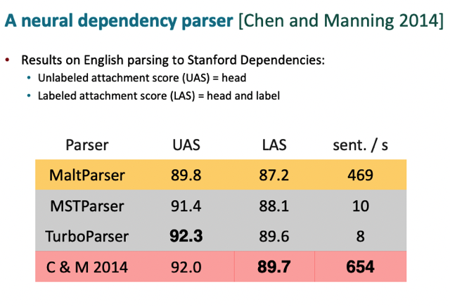</kbd>

> [!NOTE]
> Performance

 

<kbd>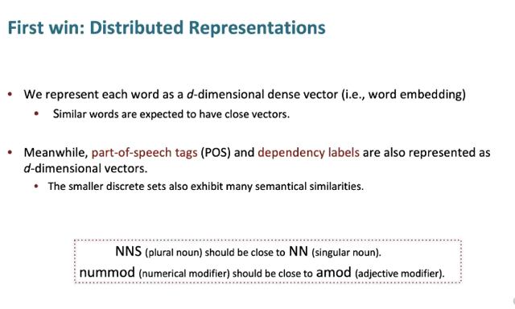</kbd>

> [!NOTE]
> đại ý là cách này sẽ sử dùng **d-dimensional word embedding** mà ta đã
> biết ở các bài trước.
>
> Bên cạnh đó, các **part of speech** (ví dụ singular noun, verb hiểu nôm na là
> loại từ) và các **dependency label** (như nmod `-` noun modifier, nummod `-`
> numerical modifier) cũng được represent bởi `d-dimensional`  vector luôn.
>
> Một ý nữa đại khái là các vector represent cho NNS và NN (đều là noun) sẽ
> giống giống nhau.

 

<kbd>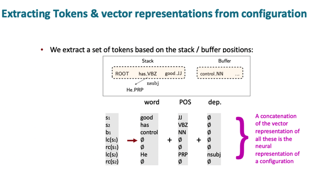</kbd>

> [!NOTE]
> Đại ý là **liệt kê ra hết tất cả các hiện trạng của configuration** này
> như:
>
> **- Trong stack có những từ gì, ví dụ trong hình là 2 từ:** s1, s2 (s viết
> tắt của stack, ý chỉ hai từ trong stack) đang là 'good', 'has'.
>
> `-` POS của chúng ('good' là JJ và 'has' là VBZ),
>
> `-` Từ đầu tiên của buffer đang là gì (b1 `=` control) (tương tự b là chỉ buffer
> b1 là chỉ từ đầu tiên trong buffer) và là loại gì (control là NN)
>
> `-` Left & right dependency của các từ s1, s2 là gì. `(s1=has,` là VBZ có
> left depend là `He_PRP` (từ 'He', là Pronoun)
>
> `-` POS của chúng ra sao. ('He' là Pronoun)
>
> Từ đó**lấy word embedding của chúng** và**concatenate lại hết để tạo** 
> **"configuration" embedding** **represent cho cấu hình hiện tại.**

 

<kbd>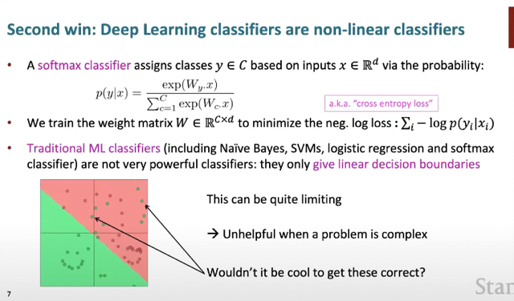</kbd>

> [!NOTE]
> đại khái là ta có thể dùng các**linear model** như **softmax classifier** để **train 
> model với labeled data** (supervised learning). Dùng **cross entropy loss.**Trong slide cho ta review lại softmax classfier (đã gặp trong các khóa học
> của Andrew Ng cũng như cs231n). Nó sẽ (dự đoán) gán class index thuộc
> {1,2...C} cho một input `d-dimensional` vector x, thông qua việc tính toán ra
> một phân phối xác suất p(y|x) bằng softmax của Wy@x. Wy@x sẽ cho ra vector
> C class scores, hàm softmax sẽ chuyển class scores vector thành vector các
> probability scores.
>
> Chúng ta sẽ train weight matrix W có shape Cxd để minimize loss function
>
> Nhưng cũng như các linear model khác như Naive Bayes, SVM, không
> thể classify bài toán mà pattern của nó phức tạp. Cần phải có `non-linearity`

 

<kbd>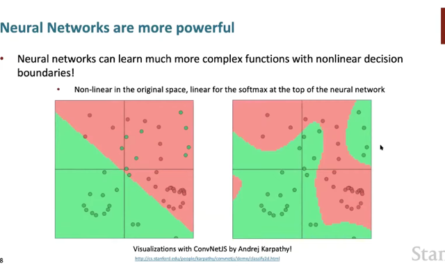</kbd>

> [!NOTE]
> một ý quan trọng đó là **softmax layer (output layer) vẫn work như một
> linear classifier** nhưng các **hidden layer thì non-linear**, đóng vai trò**transform original data space** sao cho nó có thể đượ**c classifier bởi
> linear classifier**

 

<kbd>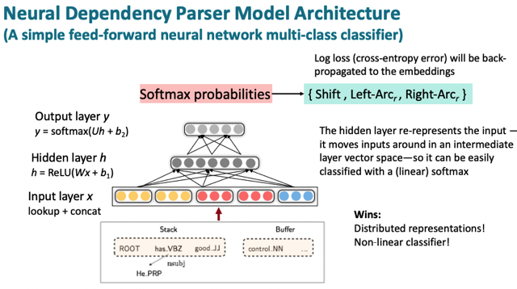</kbd>

> [!NOTE]
> Kiến trúc của **simple feed forward neural network** **multi-class classifier**.
>
> Từ một input layer x, thực hiện việc **look up** (nhân `one-hot` vector represent
> cho các word `/` POS `/` Dependency với embedding matrix để **"lấy ra"
> embedding**  sau đó thực hiện **concatenate lại để tạo input vector**.
>
> Qua **linear transformation** với W và b của hidden layer và apply `non-linearity`
> activation function relu. Quá trình này được cho là sẽ **thay đổi representation
> của input sang các không gian feature vector space khác** sao cho chúng **có
> thể dễ dàng được phân tách tuyến tính bởi softmax classifier.**
>
> Cuối cùng qua linear classifier softmax để ra probability distribution. Quá trình
> training sẽ có **minimize cross entropy giữa predicted Probability distribution
> và true distribution (label).**Có thể hiểu model sẽ predict một **phân phối xác suất của các 'class' thể hiện
> bước transition nên có** đối với configuration hiện tại như Shift, `Left-Arc,` `Right-Arc`

 

<kbd>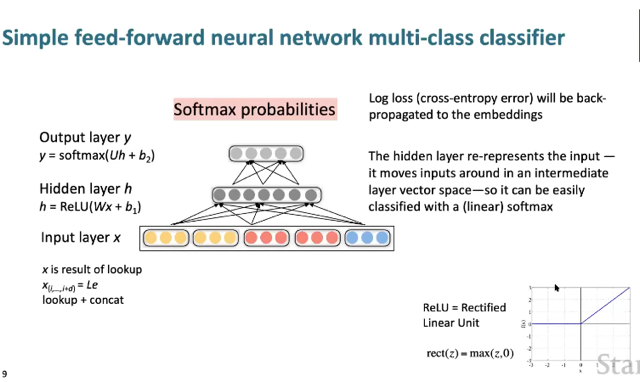</kbd>

 

<kbd>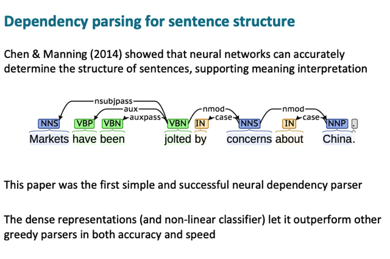</kbd>

> [!NOTE]
> kết quả cho thấy neural network có thể**xác định chính xác cấu trúc của câu**.
> và **outperform các greedy parser**ở cả tiêu chí độ **chính xác và speed.**

 

<kbd>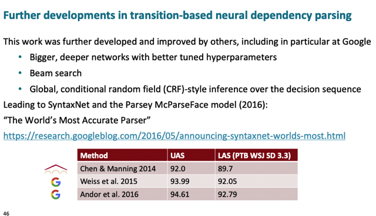</kbd>

> [!NOTE]
> Kể từ đó, Google phát triển các model **deep hơn**, **hyperparams** tuned tốt
> hơn, với các technique như**beam search** giúp ra đời **SyntaxNet**, **Parsey
> McParseFace model** đạt performance cao hơn nữa

 

<kbd>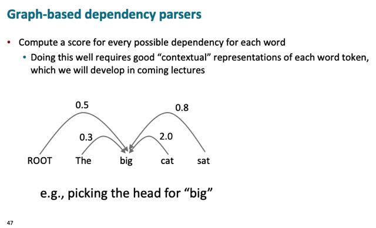</kbd>

> [!NOTE]
> Với `Graph-based` dependency parser: ý tưởng là**tính ra điểm số cho mỗi
> một dependency có thể xảy ra**, và việc này đòi hỏi phải có **contextual
> representation `-` tức là embedding có phản ảnh bối cảnh của mỗi từ**. 
> Sẽ nói kĩ ở các bài sau

 

<kbd>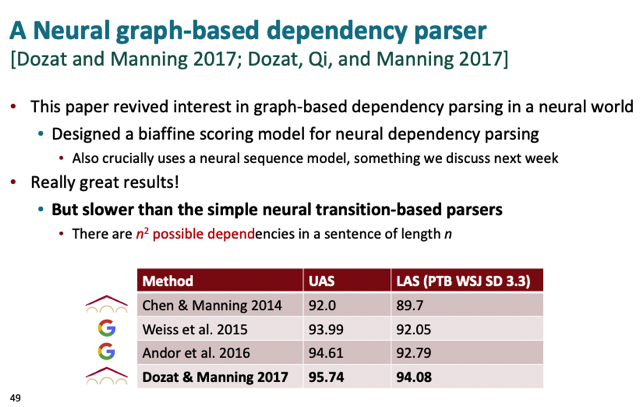</kbd>

> [!NOTE]
> phương pháp này **đạt độ chính xác cao** hơn nhưng **chậm
> hơn simple neural `transition-based` parsers.**
>
> (phần này giáo sư cũng chỉ nói sơ)

 

<kbd>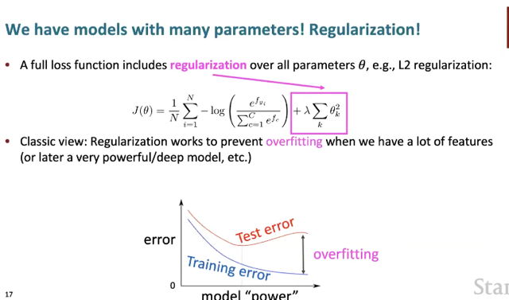</kbd>

> [!NOTE]
> Đại ý là một số chú ý của giáo sư khi làm assignment đó là nhớ  dùng
> **regularization** (ví dụ như L2 regularization). Nhắc lại khái niệm overfit khi
> model predict chính xác trên training example nhưng không generalize tốt
> trên new `/` test example.
>
> Nói thêm với **big modern network**thì **kiểu gì cũng overfit** trên training
> set vì số params lớn giúp nếu tiếp tục train model có thể hầu như nhớ luôn
> training set. Tuy nhiên**regularization sẽ giúp đảm bảo  model generalize
> well.** Hyperparameter phải tune đó là **regularization strength lambda.**

 

<kbd>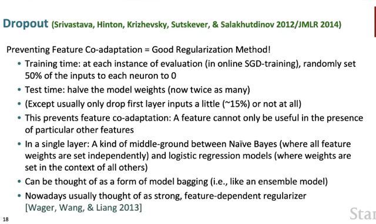</kbd>

> [!NOTE]
> Nói thêm một technique nữa giúp **regularization** vì L2 đôi khi "không đủ"
> là **dropout**. Cơ bản là mỗi lần "run" `/` training, ta sẽ tắt `/` set weight `=` 0
> 50% (drop out rate) các neuron `/` unit. 
>
> Và khi test, scale model weight 50%.
>
> Cách này ở đây gs cho biết giúp **ngăn hiện tượng feature co-adaptation**:
> **Là khi feature hữu ích chỉ khi có tồn tại feature khác**. 
>
> Có thể hiểu theo ý là như một model **bagging** `-` **train một đám các neural net
> và dùng nó theo cách ensemble model.**

 

<kbd>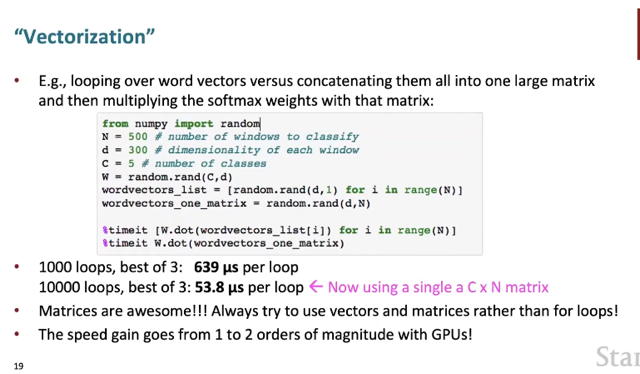</kbd>

> [!NOTE]
> Chú ý tiếp theo là về vectorization `-` luôn phải **tận dụng các
> phép toán nhân matrix**, vector để **tăng tốc quá trình tính
> toán** thay vì vòng lặp. Trong cho thấy một ví dụ của việc tính
> toán có loop và vectorized, cho thấy cái sau nhanh hơn nhiều.

 

<kbd>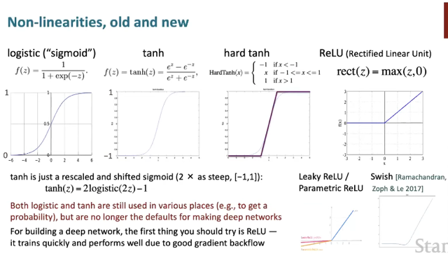</kbd>

> [!NOTE]
> Gs nhắc lại**tầm quan trọng của non-linearity** nếu không neural net sẽ
> trở về linear model.
>
> Nói về **sigmoid** và **tanh** với **tanh chỉ là phiên bản rescaled và shift của
> sigmoid**. Và cả hai đều có **phép tính exponential nên rất expensive**
>
> Từ đó người ta phát triển các **non-linearity function ít tốn kém hơn**
> như **hard tanh** và **relu** và turn out là **relu dù rất đơn giản nhưng rất
> hiệu quả**. **Độ dốc liên tục của nó ở bên phải giúp model learn nhanh
> hơn** và trở nên là**default function** phải thử khi build neural net.
>
> **Sigmoid vẫn xài khi cần probability output** và **tanh thì dùng trong RNN**
> Có **nhiều phiên bản của ReLU** nhưng **chưa cái nào thật sự chứng minh
> được là tốt hơn hẳn nên người ta vẫn xài ReLU**

 

<kbd>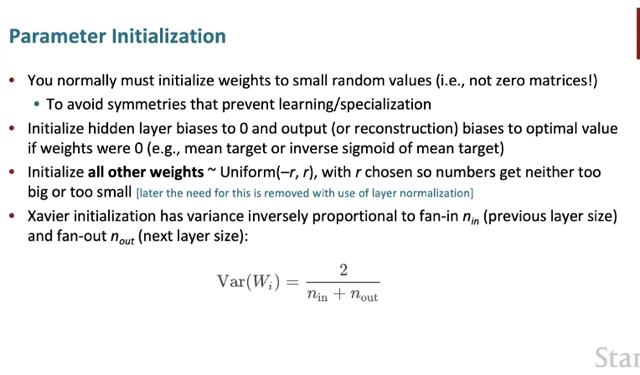</kbd>

> [!NOTE]
> Đại ý là phải**initialize weight small value** chứ không zero để có thể
> **symmetry breaking**. (trong DLSpec có nói về vấn đề này đó là gradient sẽ
> bằng 0 vì trong công thức tính gradient có tính các W, và qua cs231n đã).
> quá hiểu chuyện này)
>
> Biases thì ini `=` 0. 
>
> Các weight thì dùng một số technique initialization như Xavier ... Mà ta đã
> học ở cs231n

 

<kbd>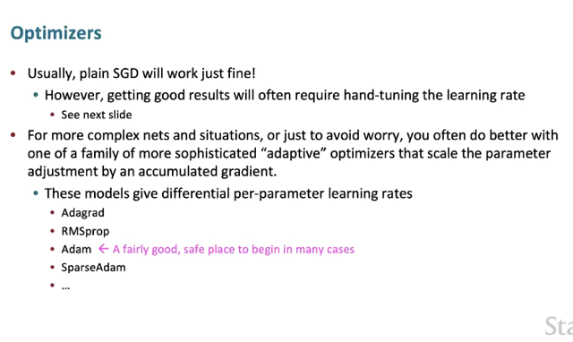</kbd>

> [!NOTE]
> đại khái là gs nói về **SGD optimizer là đủ tốt** nhưng phải**tuning
> learning rate**.
>
> Tuy nhiên **có nhiều  thuật toán tối ưu như Adagradm SMSprop, ...
> được phát triển để improve điều này** và sự lựa chọn an toàn và
> **thường là tốt nhất chính là Adam**.  Trong **pytorch** hay tensorflow
> thì chỉ việc khai báo **optimizer `=` 'Adam'** là đủ

 

<kbd>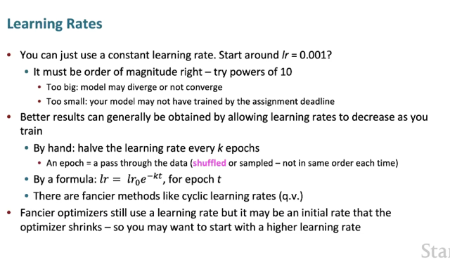</kbd>

> [!NOTE]
> nếu dùng plain SGD thì phải **tối ưu learning rate.**
>
> Thử initialize các lr khác nhau. Và thử dùng các  learning rate
> adjusting technique.
>
> Có thể thử ban đầu dùng lr cố định. bắt đầu đâu đó khoảng 1e3
> và thử tăng giảm với x10. Gs cho biết nếu lớn quá model sẽ diverge
> hoặc không thể converge, còn nhỏ quá thì phải train rất lâu.
>
> HOặc là có thể dùng l**earning rate decay technique** như:
>
> `-` **Tự chỉnh lr nhỏ lại** mỗi k epoch (k bao nhiêu thì phải thử)
>
> `-` Bởi công thức lr `=` lr0e**-kt (**exponential decay**)
>
> `-` Hoặc nhiều **phương pháp cầu kì hơn**.
>
> Gs cho biết với các **fancier optimizer (Adam, RMSProp)**thì nên 
> **bắt đầu với lr lớn hơn là nếu dùng SGD**

 

<kbd>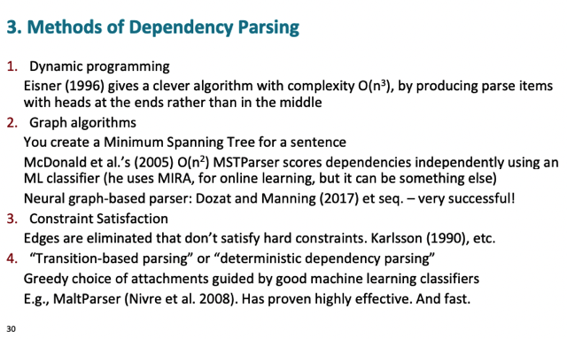</kbd>

> [!NOTE]
> giáo sư nói lướt qua một số phương pháp để **dependency parsing**, như
> **Dynamic programming** với cách thực hiện khéo léo có thể tạo ra thuật
> toán có O(n**3) thay vi exponentially nếu ko dùng dynamic programming, 
> nhưng sẽ tập trung vào #4 `-` **Transition-based parsing**

 

<kbd>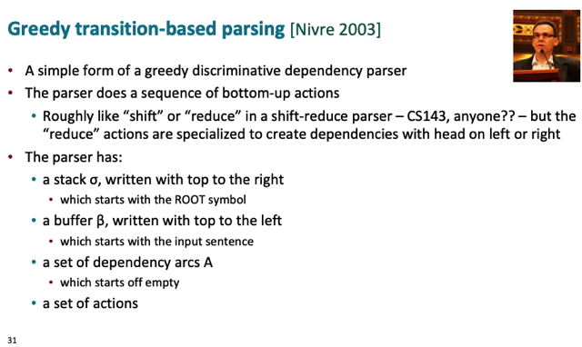</kbd>

 

<kbd>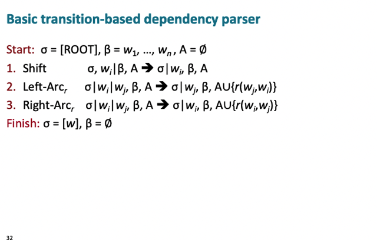</kbd>

 

<kbd>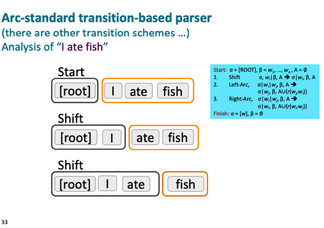</kbd>

> [!NOTE]
> kiểu như **mới đầu sigma chỉ có ROOT**, **beta chứa mọi từ**, **tập A chứa dependency
> rỗng**. 
>
> Thì bước 1 là **bỏ 'I' `+` 'ate' (2 từ đầu tiên trong beta) vào sigma** để rồi thực hiện
> **phân tích xem từ nào dependent vào từ nào**. Đây là hành động **Shift**.
>
> Kết qủa thấy**'I' dependent vào 'ate'** vì 'ăn' là từ chính trong hoàn cảnh này: 
>
> 'ai ăn?' `->` Tôi ăn. Ăn gì? Ăn cá. Chứ không phải Tôi là chính, tôi sao? Tôi ăn.
>
> Từ đó **ghi nhận một dependency `noun-subject` (ate `->` I)** và **bỏ vào A** 
>
> đồng thời **remove 'I' khỏi stack sigma**. Thì bước này chính là một **left-arc reduce**. 
> Nếu tạo dependency (I `->` ate) thì nó là **right-arc reduce**.
>
> Tiếp theo**lại bỏ từ ở đầu beta vào**, tức là thêm '**fish**' vào stack để có **ROOT**, **ate**
> **fish**. Phân tích dependency của ate và fish cho thấy **fish bổ nghĩa vị ngữ (objective)
> cho ate**. Tạo dependency **"obj(ate `->` fish)"**vào A và **bỏ fish ra**. Lúc này beta đã trống,
> tạo **Dependency [ROOT] `->` ate** vào A và **kết thúc.**

 

<kbd>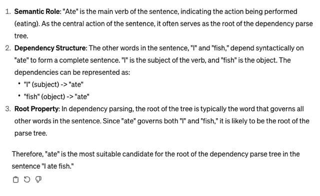</kbd>

> [!NOTE]
> Bởi động từ thường sẽ chi phối mọi từ khác, chủ ngữ `-` bổ sung thông tin 
> về ai gây ra hành động cho từ và vị ngữ `-` bổ sung thông tin về hành động

 

<kbd>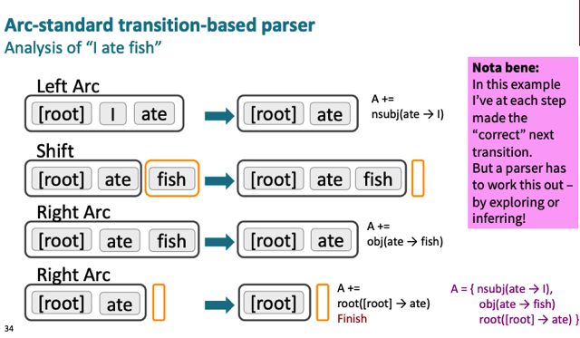</kbd>

> [!NOTE]
> Vậy thì câu hỏi là tại mỗi bước **làm sao để biết
> nên `right-arc` reduce hay `left-arc` reduce?**

 

<kbd>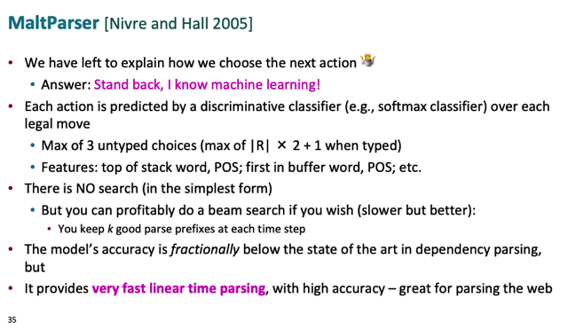</kbd>

> [!NOTE]
> Đại khái là ta có thể **build một ML classifier** để**predict next action.**
> Có thể là bài toán**3 classes classification** để dự đoán Shift | `Right-Arc` |
> `Left-Arc` hoặc predict cụ thể loại quan hệ trong R khả năng (Relation `-` R)
> thì sẽ có 2*|R|
> `+` 1 classes.
>
> Với **feature là top các stack word, POS (Part of Speech),..**.
>
> Thì cái này gọi là **Greedy Parser**
>
> Có thể cải thiện hơn nữa với **BEAM search.**
>
> Và phương pháp này dù **chưa đạt độ chính xác cao nhất**nhưng được
> cái **rất nhanh khi chỉ linear time**

 

<kbd>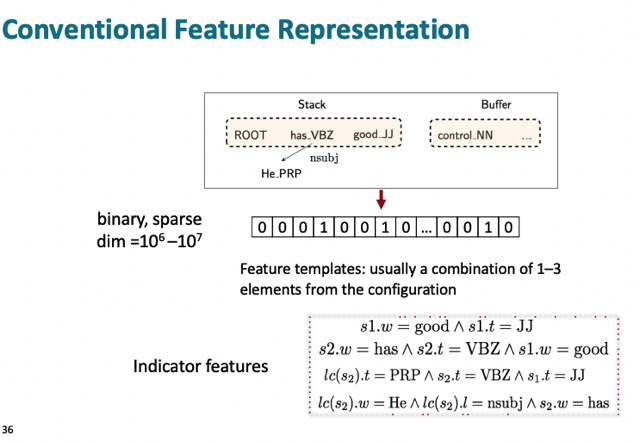</kbd>

> [!NOTE]
> Đại ý là nói về **Feature Representation**, ta đã biết sẽ gồm trạng thái
> của **Stack (sigma)** và **Buffer (beta)**, **chứa các từ nào** trong đó, các 
> từ có gắn với **POS** của nó và các **trạng thái dependency hiện có**.
>
> Thì cơ bản là**chuyển các trạng thái này thành binary feature vector**
> Ví dụ: vector ở dưới sẽ phải làm sao đại diện cho stack đang có
> Has là vbz, good là JJ, buffer đang có control là NN...A thì đang có
> has `->` He : nsubject He bổ nghĩa cho has quan hệ chủ ngữ.
>
> Nói chung là có **rất nhiều thông tin thành ra khi represent** (Theo cách
> nào đó sẽ tìm hiểu sau) để có **vector binary đại diện cho nó thì sẽ 
> là vector rất dài, và sẽ rất trống trải (sparse)**

 

<kbd>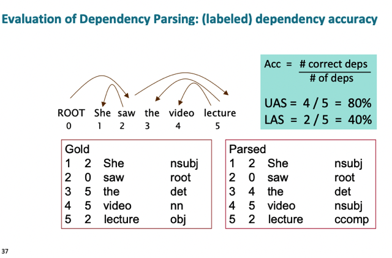</kbd>

> [!NOTE]
> kiểu như là có thể **so sánh kết quả của parsed** (bởi ml model) và**annotated 
> result (bởi human)** Theo kiểu (Unlabeled Accuracy Score) `-` UAS, ví dụ ở đây
> **đúng `4/5` trường hợp.**
>
> Còn kiểu Labeled thì **có quan tâm đến chính xác `head-dependent` word**
> thì tính ra `2/5.` Sai ở cái `3-4` (parsed) và `3-5` (Gold)

 

