# Lecture 5: Recurrent Neural Network

📊 **Progress:** `16` Notes | `23` Screenshots

---

<kbd>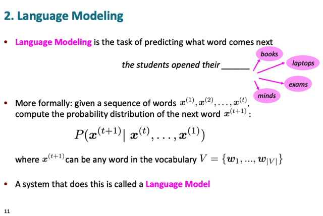</kbd>

> [!NOTE]
> đại ý là định nghĩa của language modeling là dự đoán một từ tiếp theo các
> từ cho trước. Formally thì là tính toán xác suất P(x(t+1) | x(t), x(t-1)....x(1))
> và model làm nhiệm vụ này gọi là language model

 

<kbd>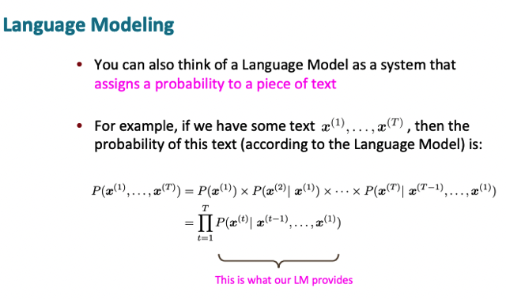</kbd>

> [!NOTE]
> Một cách hiểu khác language model là system tính probability của
> một piece of text. và dựa vào **chain rule trong probability** ta có thể
> triển khai thành tích (product) các conditional probability

 

<kbd></kbd>

 

<kbd></kbd>

 

<kbd>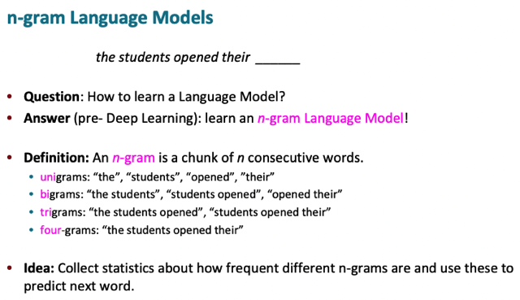</kbd>

> [!NOTE]
> đại khái là **trước khi có neural network** thì có **n-gram model** mà gs
> nói rằng vẫn còn **khá effective ngày nay**.
>
> Về cơ bản thì (cách hoạt động của) nó **dựa vào các chỉ số statistic về tần
> suất xuất hiện của của một n-gram** (là một chuỗi n từ liên tục
> consecutive) từ một large corpus để từ đó t**ính toán ra probability của
> next word given some words**

 

<kbd>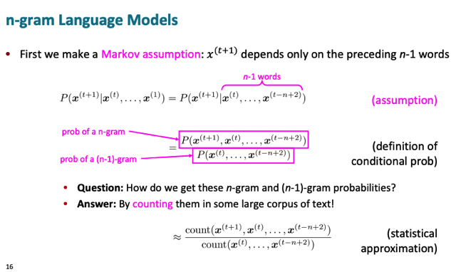</kbd>

> [!NOTE]
> đầu tiên là dựa vào Markov assumption: \/**một từ chỉ depends vào n-1 từ
> trước nó thôi**\/,
>
> nên dựa vào assumption này, **P(x(t+1)|(x(t),x(t-1),...x(1)) sẽ bằng
> P(x(t+1)|x(t)... x(t-n+2))**
>
> Từ đó tạo cơ sở để ta tính xác suất "cần tính" **một cách đơn giản hơn** đó là
> tính cái **P(x(t+1)|x(t)...x(t-n+2))**
>
> Dựa **định nghĩa conditional probability** (đơn giản hóa với chỉ 2 từ):  **P(x1,
> x2) = P(x2|x1)*P(x1)** nên ta có **P(x2|x1) tính bằng P(x1,x2)/P(x1)**
>
> Dựa vào đó cơ bản là ta **ĐẾM** trong bộ**large corpus** **số chuỗi x1,x2
> n(x1, x2)** và **số chuỗi x1 n(x1)**thì từ đó
>
> có thể **ước lượng giá trị của P(x1,x2)/P(x1) chính là bằng n(x1,x2) / n(x1)**

 

<kbd>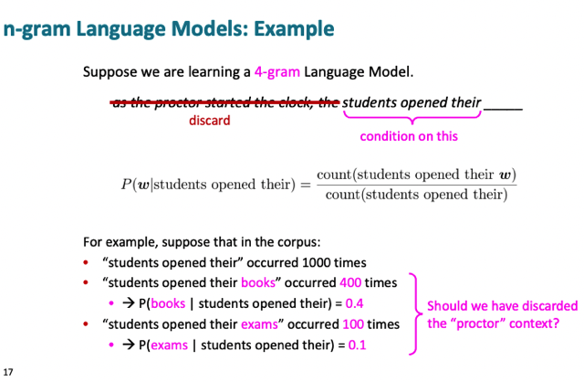</kbd>

> [!NOTE]
> một ví dụ và qua đó cho thấy**hạn chế của phương pháp này** khi đưa ra
> giả định (khả năng xuất hiện của một từ - sau các từ cho trước) **chỉ phụ
> thuộc vào vài từ trước đó** là không đúng lắm vì **nhiều trường hợp
> những từ ở xa hơn sẽ ảnh hưởng lớn** do đó việc chỉ tính xác suất (của
> từ tiếp theo) các từ trước đó vài từ sẽ cho kết quả không chính xác
>
> Ở đây**giáo sư giúp clarify một điểm gây confuse** trước đây trong
> NLPSpec đó là **nếu mình dùng assumption là từ kế tiếp chỉ phụ thuộc
> vào 3 từ trước đó** thì mình có một**4-gram model.** Nên trong ví dụ
> trước là **2-gram** model chứ không phải Unigram
>
> Và người ta gọi đó là **3rd order Markov model (đồng nghĩa với 4-gram
> model)**

> [!NOTE]
> Có câu hỏi là n-gram model có giống Naive Bayes không?
>
> Naive Bayes model tính toán probabilities of words k**hông phụ thuộc
> vào các neighbor của nó.**
>
> Nên về cơ bản N.B là một **1-gram model (uni-gram)** tức **0-order
> Markov model**, trong đó **xác suất của một từ không phụ thuộc từ
> nào.**Nên trong tính toán ta chỉ đếm các single words
>
> Ta sẽ learn các "set" các unigram cho mỗi class của classifier. Gs không
> nói rõ hơn

 

<kbd>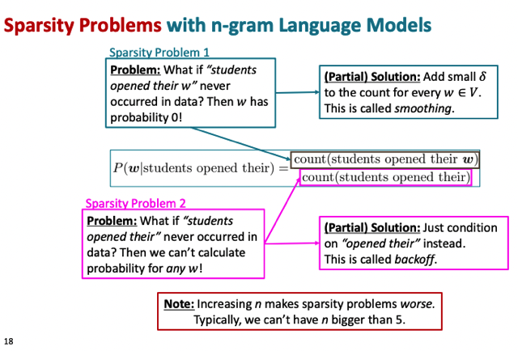</kbd>

> [!NOTE]
> đại khái sparsity problem 1 là khi **tử số (nominator) = 0**, khi ví dụ cụm "
> **students opened their w**" chưa bao giờ xuất hiện trong corpus, và dẫn
> đến là count = 0. Từ đó tính (tất nhiên là approximate) xác suất xuất hiện
> của từ w sau từ "students opened their w" = 0, **mặc dù không phải vậy** (ý
> nói xác suất **dù nhỏ nhưng vẫn có thể > 0**)
>
> Để khắc phục có thể dùng technique gọi là **smoothing**, mà trong
> NLPSpecialization đã gặp "**Laplacian smoothing**"
>
> Nếu cả "**students open their**" cũng count = 0 thì có thể dùng technique
> gọi là **backoff** để đếm số cụm "students open" thôi
>
> *Gs nói thêm đại khái đó là **khi mà tăng Markov order lên** thì **sparsity
> problem càng trở nên tệ** hơn thành ra người ta **chỉ có thể làm với order
> lớn hơn nếu có nhiều data hơn**. Nên hồi xưa người ta chỉ có **3-gram**,
> nhưng khi có nhiều data hơn người ta mới làm **5-gram**

 

<kbd>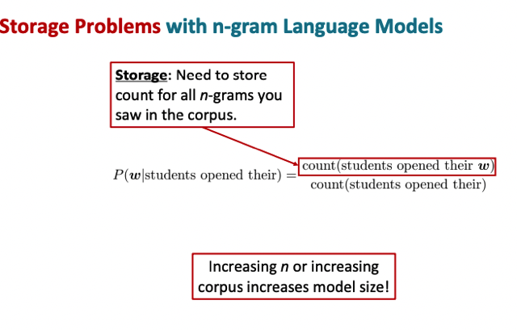</kbd>

> [!NOTE]
> đại khái là n-gram model còn bị một vấn đề nữa đó là yêu cầu
> **storage lớn** khi nó **phải lưu trữ một số lượng rất lớn các kết
> quả thống kê** (count for all n-grams). Đó là lí Google Translate
> lúc trước chỉ có thể được **vận hành trên Cloud còn với neural net
> thì đại khái là nó có thể nhẹ (về mặt storage) hơn nhiều**

 

<kbd>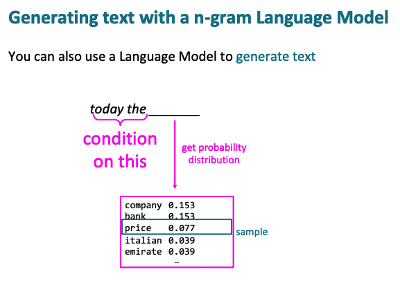</kbd>

<kbd></kbd>

<kbd>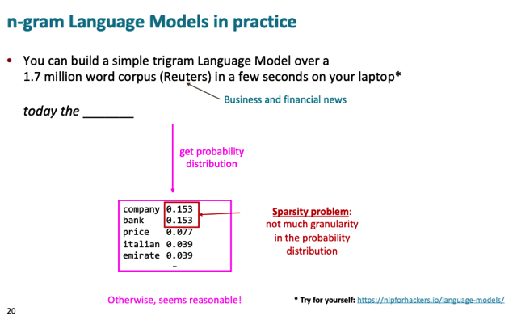</kbd>

> [!NOTE]
> đại ý là n-gram train rất nhanh so với neural net, và giả sử cần predict từ
> tiếp theo của "today the ..." thì vì n-gram đã biết xác suất của các từ
> xuất hiện sau "today the" nên ta có thể  lọc ra những từ có xác suất cao
> nhất. Và gs nói tất nhiên ta không có nhiều độ chi tiết (granularity) trong
> phân phối xác suất chỉ tính từ một corpus có 1.7 triệu từ như này.
>
> Xong với 5 từ có xác suất cao nhất, ta có thể lấy từ có p cao nhất hoặc
> lấy ngẫu nhiên 1 từ

 

<kbd>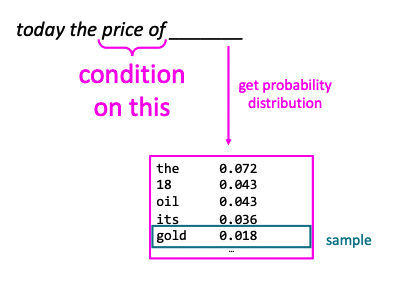</kbd>

<kbd></kbd>

<kbd>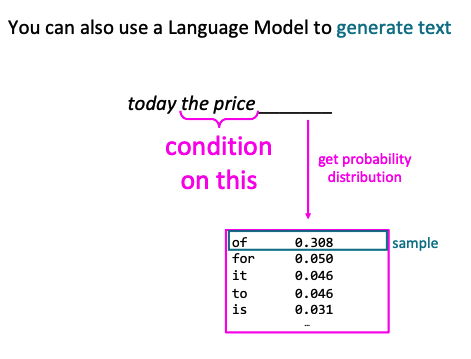</kbd>

 

<kbd>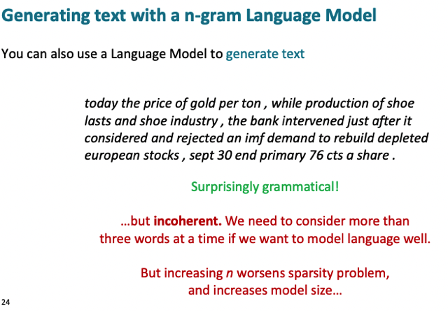</kbd>

> [!NOTE]
> đại khái là kết quả đáng ngạc nhiên là về mặt ngữ pháp thì nó khá ổn.
>
> Nhưng về tính mạch lạc (coherent) và ý nghĩa thì hoàn toàn không ổn. Do
> đó cần có language model mạnh hơn nữa và vì để tăng order of Markov
> thì  sẽ worsen**sparsity problem** nên đó là khi neural net phát huy tác
> dụng'

 

<kbd>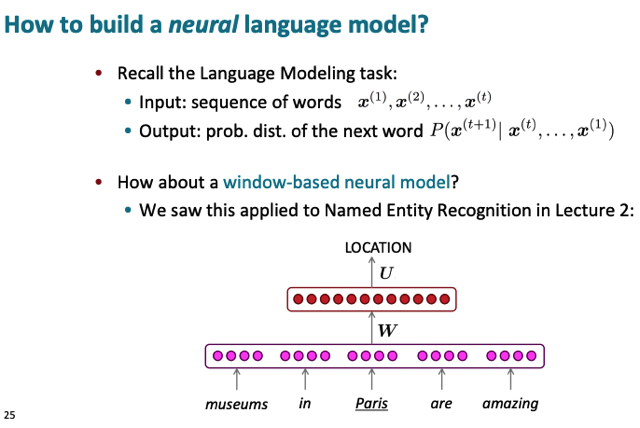</kbd>

> [!NOTE]
> câu hỏi là làm sao để build một **neural language model**
> - language model dùng neural network. Đầu tiên phải nhớ language
> model là model có thể **generate text given những từ cho trước** hay chính
> xác hơn là nó có thể **tính ra xác suất của các từ khác nhau given các từ
> cho trước** để từ đó chọn từ phù hợp.
>
> Vậy mặc dù mình có neural net ứng dụng trong bài toán text
> classification (Named Entity Recognition cũng là thuộc bài toán text
> classification) nhưng nó không phải là language model.

 

<kbd>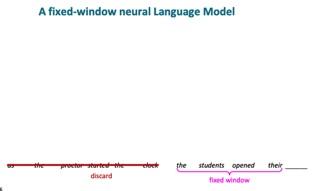</kbd>

> [!NOTE]
> vậy đại khái là ta có thể tiếp cận
> như n-gram, và dùng lại khái
> niệm context window

 

<kbd>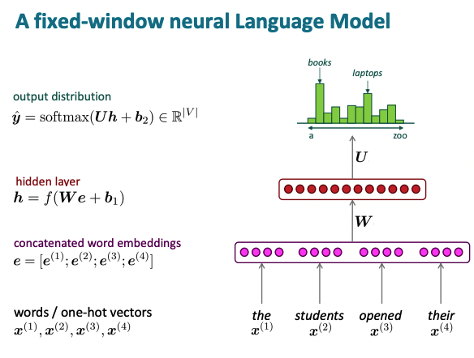</kbd>

> [!NOTE]
> để rồi làm như sau, với các context words trong windows, ta  tạo
> context embedding bằng cách concatenate word embeddings Sau
> đó qua một hidden layer thực hiện linear transformation và apply
> non-linearity để rồi qua layer cuối với softmax để tính ra y^ kiểu như
> là probability distribution các từ trong V (xác suất các từ trong vocab
> là từ tiếp theo của các từ cho trước ban đầu)

 

<kbd>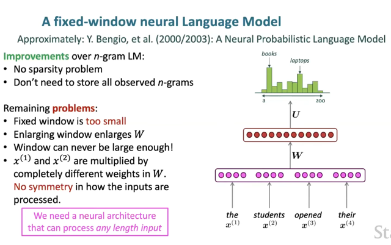</kbd>

> [!NOTE]
> đại khái là mô hình này được **Y.Bengio** giới thiệu năm **2003** và tuy chưa giải
> quyết được **nhược điểm là bị giới hạn bởi context**(discard các từ trước
> context window)
>
> Nhưng nó không bị vấn đề "**sparsity problem**" như n-gram lí do kiểu như là
> ví dụ như khi gặp "**the pupils opened their**" thì n-gram nếu không thấy cụm
> từ này trước đây thì nó sẽ "không làm được" nhưng với neural net thì kiểu
> như nó hiểu **pupil** và **student** giống giống nhau nên nó có thể **generate
> probability distribution same same nhau**
>
> Ưu điểm thứ hai đó là nó không cần **store mọi n-gram observed**  mà chỉ cần
> store **word vector và W**
>
> Nhưng nhược điểm của nó là vẫn bị giới hạn trong một**fixed window** và
> **không thể tăng window size lên quá lớn** vì khi đó **weight matrix sẽ lớn không
> kém** đồng thời cũng nói lên một nhược điểm khác đó là mỗi giá trị của
> params trong W take care một feature riêng biệt, ví dụ w_i1 take care
> feature x(i)_1, do đó không có khả năng "shared params"
>
> Do đó cần một **kiến trúc** sao cho có khả năng **xử lí, take input** mọi input
> length để không bị giới hạn như trên và có **khả năng shared params**

 

<kbd>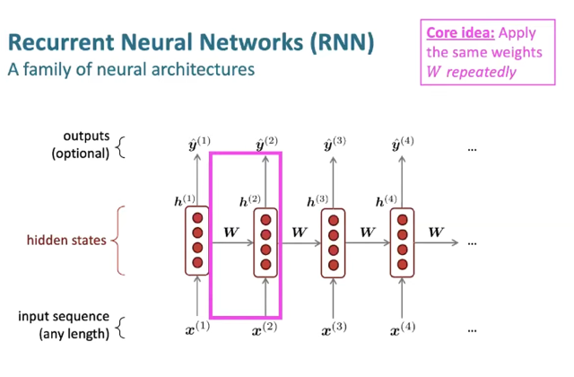</kbd>

 

<kbd>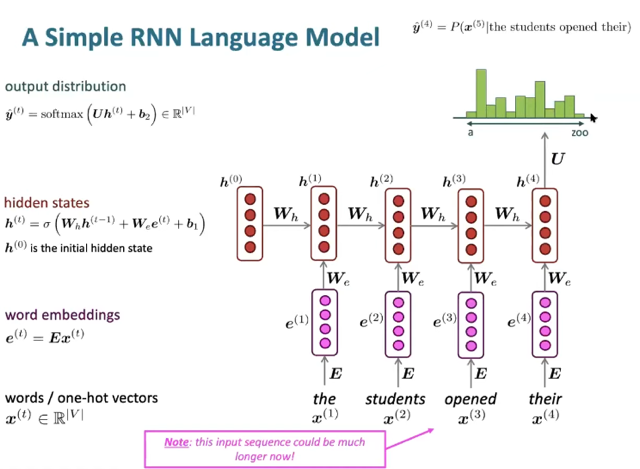</kbd>

> [!NOTE]
> Hidden state sẽ zero initialized.
>
> Input x(1) (token id) sẽ qua Embedding matrix để chuyển thành  embedding
> vector (hoàn toàn giống các model trước bữa giờ học)
>
> Linear transformation qua We (trong DLSpec là Wax), hidden state ở time
> step trước thì với Wh (trong DLSpec là Waa), cộng với một learnable bias
> và  apply nonlinearity (tốt nhất cho đến giờ là tanh(.))
>
> kết quả là hidden state
>
> Prediction cho time-step <t> sẽ tính toán từ hidden state của time-step <t>

 

<kbd>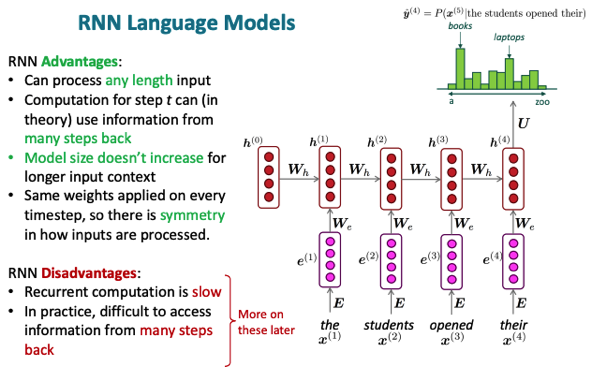</kbd>

> [!NOTE]
> Ưu điểm đó là không bị **giới hạn fixed window**, tức là có thể take 
> input mọi length. Trên lí thuyết thông tin sẽ được bao gồm các 
> time-step trước, và kích thước của **model weight không tăng lên
> khi data lớn hơn.**
>
> Nhưng **nhược điểm** là chậm và bị "quên thông tin" khi input length lớn

 

