# Lecture 8: Translation, Seq2seq, Attention

📊 **Progress:** `10` Notes | `17` Screenshots

---

<kbd>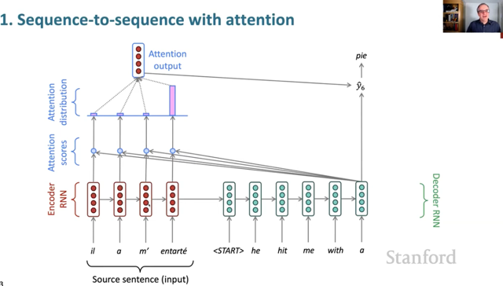</kbd>

> [!NOTE]
> Gs nói sơ về cơ chế attention dừng ở tuần trước. Nói ngắn gọn là
> tại mỗi time step của decoder, sau khi tính ra hidden state, trước
> khi dùng cái đó tính ra prediction của `time-step` tiếp theo. Hidden
> state của decoder sẽ dùng một similarity function để tính độ giống
> nhau của nó với encoder hidden state tại các `time-step` khác nhau.
> Để rồi từ đó ra dc attention scores, sau đó normalized để dc
> attention weights (distribution) và dùng cái này để weighted sum
> các encoder states cho ra một cái gọi là attention outputs
>
> Cái này sẽ tham gia (concatenate) cái decoder's hidden state để rồi
> mới tham gia tính ra y^

> [!NOTE]
> Có câu hỏi đó là tại sao ta lại cần tới hai RNN cho encoder và decoder
> Gs trả lời đó là vì mình đang nói đến nhiệm vụ machine translation, trong
> đó ta cần xử lý source sentence là một language khác và target sentence
> là một ngôn ngữ khác do đó dùng hai RNN khác nhau với hai bộ params
> khác nhau là một cách tiếp cận hợp lí.
>
> Trong nhiệm vụ này, một cách logic khi ta muốn nhìn `vào/lại` source sentence
> trong quá trình đưa ra dự đoán cho từ tiếp theo của target sentence. Do đó
> attention mechanism phản ánh quá trình nhìn lại này. 
>
> Tuy nhiên có thể bạn thắc mắc rằng tại sao chỉ làm nhiêu đó, tại sao không 
> "attend" nhiều hơn tới cả các decoder hidden state trước đó. Thì gs cho rằng
> đó chính là cách nghĩ hợp lý và đó chính là cơ chế `self-attention` rất mạnh mẽ
> đặt nền tảng cho Transformer mà ta sẽ học trong các bài sau

> [!NOTE]
> Tiếp theo đại khái gs nói về attention là một cách tiếp cận hợp lí để giải
> quyết vấn đề `bottle-neck` khi toàn bộ thông tin của source sentence bị chứa
> trong encoder hidden state cuối cùng đặng pass qua cho decoder làm initial
> h0 thì điều này khiến thông tin bị mất đi khá nhiều.
>
> Bằng việc dùng cơ chế cho phép attend trực tiếp các encoder states, ta khắc
> phục được vấn đề.
>
> Gs còn nói thêm mặc dù ở phần trước đã học về LSTM, là sự cải tiến của RNN
> trong khả năng maintain `long-range` information nhưng cơ chế attention vẫn tỏ ra
> rất hữu ích.

 

<kbd>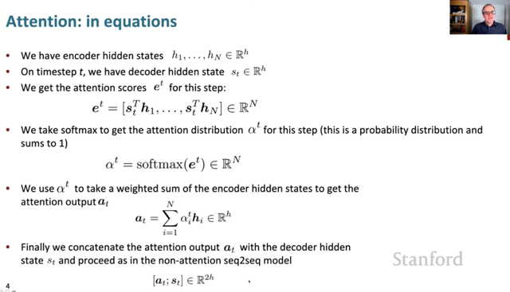</kbd>

> [!NOTE]
> quá trình tính toán sẽ như sau:
>
> Đầu tiên mình có N hidden state (N `time-step)` của encoder h1, h2...
> và như đã nói decoder tại `time-step` t đang cần predict word cho `time-step`
> `t+1.` Vậy tại đây decoder đã tính xong hidden state st
>
> Ta sẽ tính attention scores bằng cách tính similarity scores giữa st và h1,h2...hN
> và similarity score này đơn giản là dùng phép dot product
>
> Như đã biết hai vector càng tương đồng thì d.p của chúng sẽ lớn.
>
> Rồi bỏ vector các scores này qua softmax để normalize, biến thành các
> attention weights, có dạng của một probability distribution.
>
> Dùng các attention weights này để tính ra weighted sum các encoder hidden states
> và có được một attention output.
>
> Như đã nói, nó sẽ được concatenate với st trước khi tham gia tính toán ra `y^<t+1>`
> có thể cũng qua một linear transformation trước khi vào softmax để tính ra một
> phân phối xác suất trên tất cả các từ trong vocab

 

<kbd>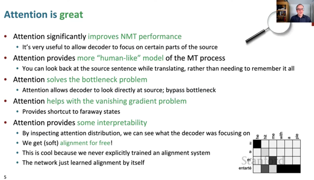</kbd>

> [!NOTE]
> Rất nhiều ưu điểm mà gs cho rằng không thể diễn tả hết được, ví dụ như
>
> `-` Nó tăng hiệu quả lên đáng kể so với Neural Machine Translation
>
> `-` Nó cung cấp một cách tiếp cận giống con người hơn hẳn trong vấn
> đề dịch thuật
>
> `-` Nó giải quyết vấn đề nút thắt cổ chai nói ở trên
>
> `-` Nó cũng giúp giải quyết vấn đề vanishing gradient vì cơ chế attention
> có các direct connection tới các timestep ở xa (encoder)
>
> `-` Và nó đem lại khả năng interpretability khi nhìn vào attention scores
> có thể giúp giải thích được kết quả của model.
>
> Và hay hơn nữa là gs nói về vấn đề alignment bữa trước mà trước đây
> phải dựa vào rất nhiều hand design feature engineering thì nay nó tự 
> động khám phá `/` học được việc này

 

<kbd>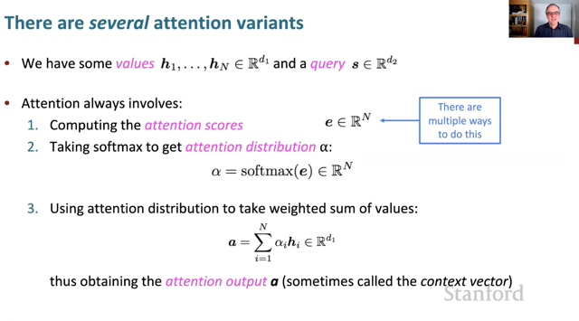</kbd>

> [!NOTE]
> các. biến thể của attention mechanism chỉ
> khác nhau ở cách tính ra attention scores

 

<kbd>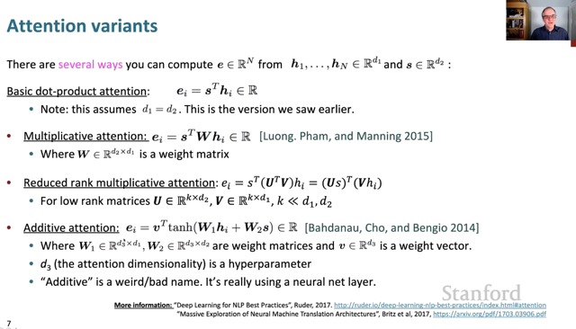</kbd>

> [!NOTE]
> Phiên bản đơn giản nhất là dùng dot product giữa decoder's hidden state và
> encoder's hidden state. G.s cho biết cách làm này, tuy là đơn giản và dot product
> cũng là một các tính similarity giữa hai vector đơn giản nhất. Tuy nhiên nó có
> vấn đề đó là, thông tin chứa  trong hidden state**là một hỗn hợp** **chứa:
>
> `-` thông tin của các `time-step` trước đó**,
>
> `-` t**hông tin của `time-step` hiện tại** (kiểu như phản ánh nội dung của từ tại
> `time-step` hiện tại), và **cái này có thể dùng để tính attention**
>
> `-` và **cả phần thông tin dùng để tính toán dự đoán** cho từ tiếp  theo.
>
> Thành ra, ý tưởng là nếu dùng nguyên bộ thông tin này để tính toán attention
> scores thì bị dư
>
> `===`
>
> Dẫn đến một cách làm khác của Luong. Pham đó là **đưa vào một learnable
> matrix W để model kiểu như tự học cách chọn lọc thông tin từ  s và từ h để dùng**
> cho attention scores. Và giải pháp này tỏ ra hiệu quả. Nhưng **nhược điểm là có
> quá nhiều parameters khi matrix W sẽ có d1*d2 params** (d là kích thước của
> hidden state vector)
>
> `===`
>
> Sau đó để khắc phục vấn đề này, người ta dùng cách**low rank matrix** Cách này
> **giống như LoRA (Low Rank `fine-tuning` trong LLM)**. Đó là thay vì dùng một
> matrix W d2xd1 thì ta **dùng hai matrix U (k,d2) và V (d1,k) với k nhỏ hơn nhiều
> so với d1, d2 để U.t@D cũng là matrix d2xd1** nhưng tốn ít params hơn.
>
> `===`
>
> Sau đó **Bahdanau attention**(cái này chính là basic attention học trong NLPSpec course 4)
> mặc dù có cái tên là **Addictive attention** nhưng theo gs thì **cơ bản chỉ là dùng neural net
> để nó tự tính attention score mà thôi**. Trong công thức này, hidden states của encoder
> và encoder được linear transformed qua hai matrix trước khi cộng lại và bỏ qua tanh.Kết
> quả sau đó được tính toán dot product với vector v nữa.

 

<kbd>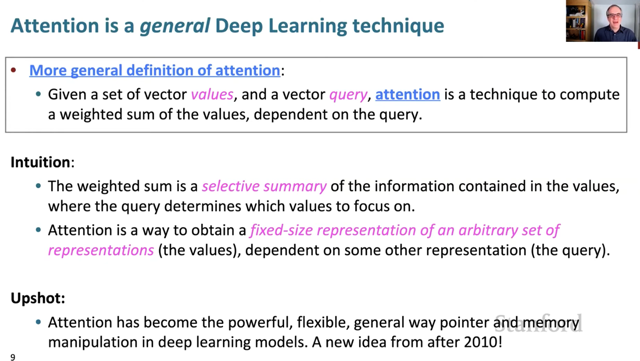</kbd>

> [!NOTE]
> đại khái là Attention có thể coi như là **một technique chung của DL**, mỗi
> khi kiểu như **ta có một bộ các vector và muốn lấy ra một cái** thì **cách tệ
> nhất là average hoặc maximum**,
>
> Thì attention cho phép ta **tính một weighted sum các vector đó**, với
> **weight được tính toán dựa trên một yêu cầu nào đó,** ví dụ như **độ giống
> nhau** giữa value vector (encoder hidden state hi) với query vector (decoder'
> s hidden state st)
>
> Cuối cùng gs cho biết rất nhiều ý tưởng của dl thật ra có từ những năm 80,90
> Nhưng do thời đó máy tính chưa đủ mạnh nên ko làm được. Chỉ sau này 
> mới có thể khả thi. Nhưng riêng Attention mechanism thì là một ý tưởng của 
> những năm 2010

 

<kbd>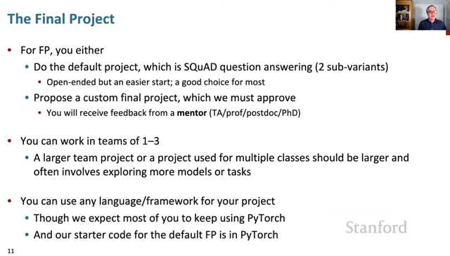</kbd>

 

<kbd>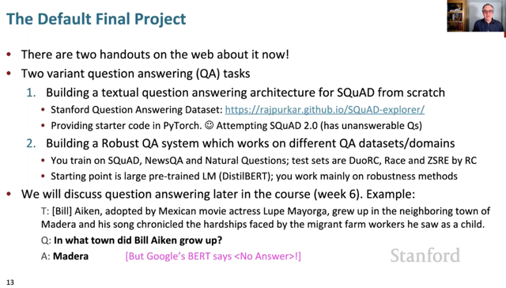</kbd>

> [!NOTE]
> Gs nói về default final project trong đó người ta sẽ chuẩn bị cho mình vài
> bước để build một cái QA system
>
> Vậy có thể build from scratch một system (dù họ cũng chuẩn bị sẵn một số
> thứ cho mình) Dùng bộ dữ liệu SQuAD.
>
> Hoặc có thể dùng `pre-trained` model như BERT, RoBERTa... để tập trung
> vào việc làm sao bulid dc model perform tốt trên nhiều dataset khác nhau
>
> Cuối cùng gs cho biết QA là một main topic của NLP, nên những phần sau
> sẽ có một lecture về cái này

 

<kbd>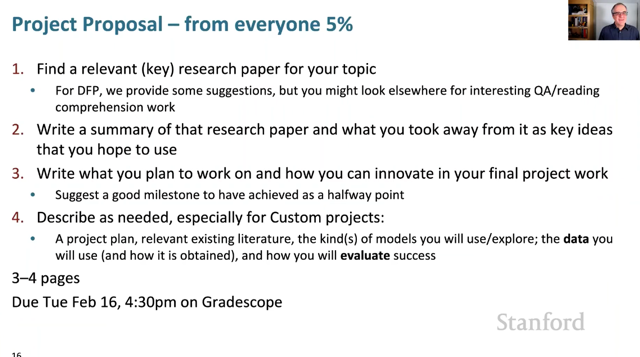</kbd>

 

<kbd>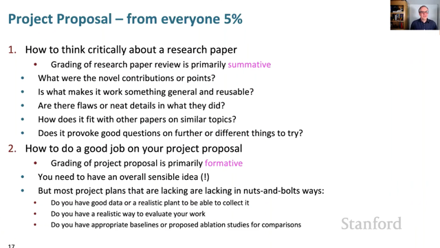</kbd>

 

<kbd>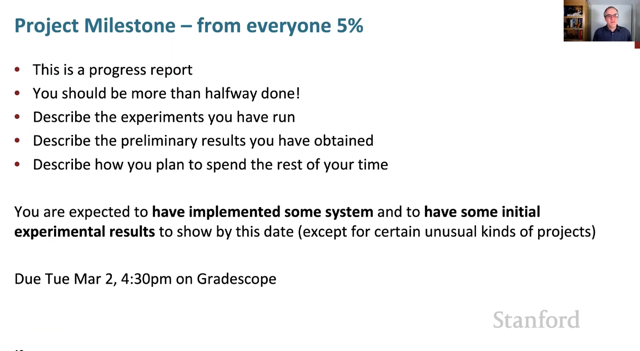</kbd>

 

<kbd>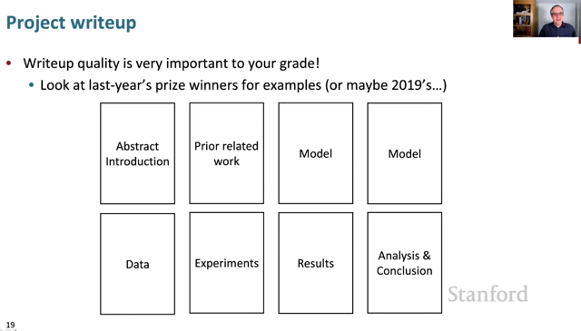</kbd>

 

<kbd>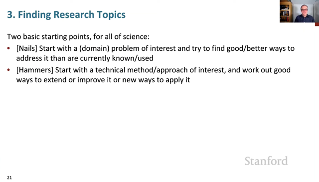</kbd>

> [!NOTE]
> gs nói đại khái là chỉ có hai cách tiếp cận trong việc chọn chủ đề để
> nghiên cứu.
>
> Một là về một lĩnh vực (domain) nào đó và tìm một cách tốt hơn để
> giải quyết vấn đề
>
> Hai là về một phương pháp `/` một cách tiếp cận nào đó để tìm cách
> cải thiện hiệu quả của nó

 

<kbd>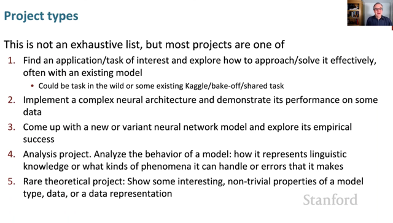</kbd>

 

<kbd>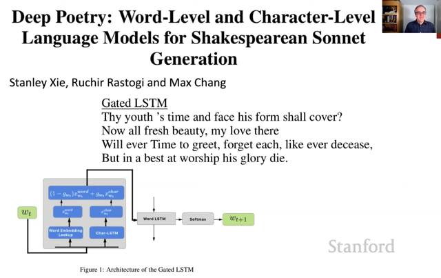</kbd>

 

<kbd>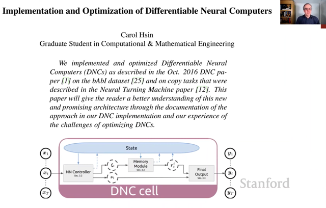</kbd>

 

<kbd>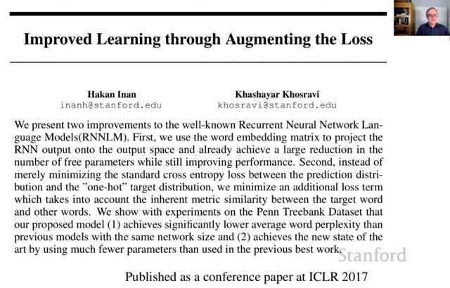</kbd>

 

