# Lecture 9: Pretraining

📊 **Progress:** `43` Notes | `56` Screenshots

---
<a id="node-698"></a>

<p align="center"><kbd>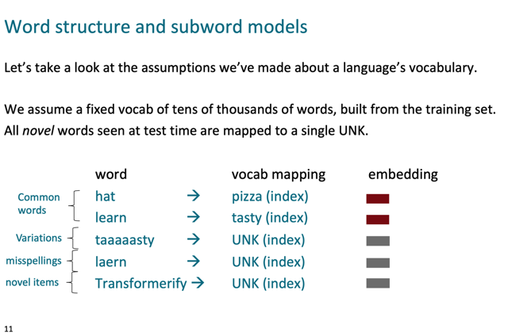</kbd></p>

> [!NOTE]
> đại ý là nói về việc ta represent một word bởi vị trí của nó trong một bộ từ
> vựng hữu hạn thì sẽ có vấn đề là rất nhiều từ không có trong danh sách sẽ
> phải được biểu diễn bởi 'UNKOWN' Mà ngôn ngữ thì luôn sản sinh ra thêm
> những từ mới không có `/` chưa có trong một bộ từ điển hữu hạn nào đó, ví
> dụ như các biến thể của từ vựng như ví dụ từ 'taaaasty' (biến thể của tasty
> mang sắc thái cảm xúc mà ta, con người vẫn có thể hiểu được). Hoặc
> những từ bị mispelled như 'laern', và những từ tạm gọi là 'không được chuẩn
> chỉnh lắm' nhưng người ta vẫn hiểu và sử dụng (như Transformerify `-` kết
> hợp của Transformer là tên mô hình Transformer, và `-rify` kiểu như chuyển
> một danh từ thành động từ, mang ý nghĩa cho từ này có thể hiểu nôm na là '
> áp dụng Transformer vào vấn đề'.
>
> Nói tóm lại là, nếu chỉ dùng cách represent bởi từng từ đơn và dựa trên một bộ
> vocab hữu hạn thì nhiều từ như vậy sẽ thành UNK và ta sẽ mất đi rất nhiều
> thông tin. Do đó phải tìm cách tốt hơn.

<br>

<a id="node-699"></a>

<p align="center"><kbd>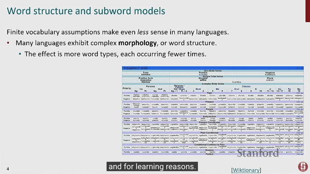</kbd></p>

> [!NOTE]
> Tương tự như từ tassssty ở trên, trong ngôn ngữ, có nhiều từ chung một
> gốc và chỉ khác nhau chút ít. Nếu ta biểu diễn mỗi từ một cách riêng lẻ bởi
> một token thì rõ ràng sẽ khá lãng phí
>
> Vấn đề thậm chí còn nghiêm trọng hơn nếu áp dụng sang các ngôn ngữ
> khác, ví dụ như tiếng Swahili khi anh ấy nói rằng có tới 300 conjugation `-`
> đại loại là nếu ta biểu diễn mỗi cái bằng một vector thì ta sẽ cần tới 300
> vector.

<br>

<a id="node-700"></a>

<p align="center"><kbd>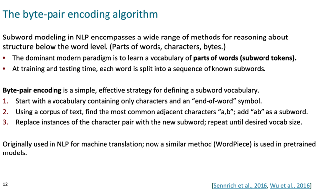</kbd></p>

> [!NOTE]
> và do đó người ta dùng cách " subword tokenization", represent một phần
> của từ thay vì một từ. Và cách xây dựng một bộ vocab (map một subword
> với một id) đó là:
>
> Bắt đầu bằng việc vocab chỉ chứa các character `-` đồng nghĩa ban đầu mỗi
> kí tự được represent bởi một con số.
>
> Sau đó, ta sẽ tìm cặp index liền kề xuất hiện nhiều nhất và gán cho nó một
> index mới trong vocab (ý là thêm nó vào vocab), đương nhiên là thay thế
> mọi cặp (index của) kí tự này bằng index mới.
>
> Cứ tiếp tục như vậy cho đến khi ta đạt được kích thước mong muốn nào
> đó của vocab size. Thì đây chính là `byte-pair` encoding algorithm mà mình
> đã làm ở NLP Specialization, cũng như là trong video của Andrej Karpathy

<br>

<a id="node-701"></a>

<p align="center"><kbd>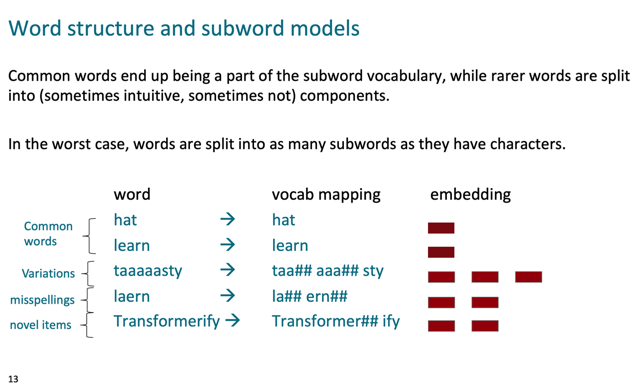</kbd></p>

> [!NOTE]
> Cái hay là kết qủa của cách làm này là các từ thông dụng sẽ vẫn được có
> một vị trí của riêng nó trong vocab (tức là không bị chia nhỏ ra), như 'hat'
> và 'learn' vẫn được represent là một token `(=` một embedding vector). 
>
> Còn tassssty thì trở thành 3 tokens, đáng chú `'Transformer-ify'` được tách
> ra rất đúng đó là kết hợp của 'Transformer' và gốc 'ify' hoàn toàn phù hợp
> với lí do mà người ta kết hợp hai từ này lại

<br>

<a id="node-702"></a>

<p align="center"><kbd>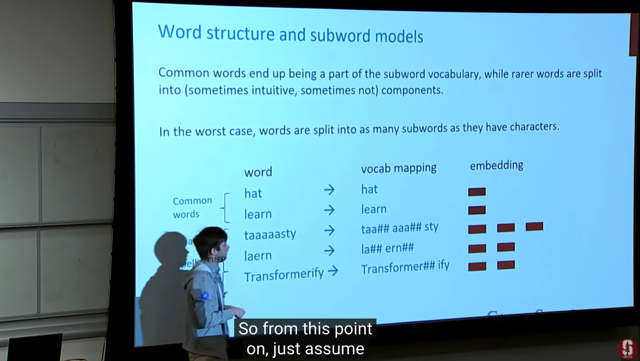</kbd></p>

> [!NOTE]
> Q: Làm sao biết split ở đâu? 
> A: Dựa vào thuật toán mô tả ở trên, quá trình
> cơ bản là nó sẽ tìm những cụm kí tự thông dụng nhất để thêm vào vocab
> có nghĩa là ta split ở đâu là dựa trên việc tần suất xuất hiện của cụm kí tự
>
> Q: Ta có tokenize các dấu chấm, chấm hỏi, những kí tự đặc biệt không?
> A: Cơ bản là ta sẽ preprocess ở mức tối thiểu, như remove html,...để giữ
> nguyên nhất có thể những gì người ta viết `/` nói ra
>
> Q: Model treat các word và subword có khác nhau không? 
> A: Không
>
> Q: Với một từ dài nhưng xuất hiện nhiều thì sẽ ntn?
> A: Nó sẽ ở trong vocab, và được giữ nguyên, biểu diễn bởi một token id

<br>

<a id="node-703"></a>

<p align="center"><kbd>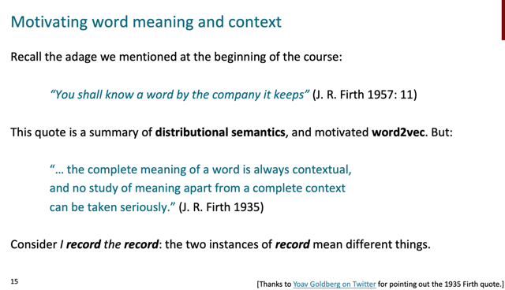</kbd></p>

> [!NOTE]
> Ở đây nhắc lại một ý tưởng `/` trích dẫn làm tiền đề cho Word2Vec mà mình
> đã được học ở những bài đầu tiên, đó là (đại ý là) ta có thể hiểu ý nghĩa
> của một từ thông qua đám bạn của nó `-` những từ hay xuất hiện xung
> quanh nó.
>
> Vậy thì còn một trích dẫn khác của J.R.Firth đại ý rằng, ý nghĩa đầy đủ của
> một từ luôn phải bao gồm bối cảnh của nó. Lấy ví dụ hai từ 'record' trong
> câu, một cái làm động từ, một cái là danh từ. Thì điều này cho thấy rằng,
> với embedding learn bởi wordvec, thì cả hai đều chỉ được represent bởi
> cùng một embedding, và kiểu như nó chứa đựng cả hai ý nghĩa, thêm  một
> cách không thể tách ra "phần này mang ý nghĩa 'động từ', phần kia mang ý
> nghĩa danh từ". Nên về cơ bản word2vec không thể đám ứng yêu cầu
>
> Do đó ta có thể dùng RNN, Transformer để tạo contextual embedding như
> đã biết (nói chung là slide này nói về motivation cho việc phải tạo embedding
> chứa đựng thông tin bối cảnh của từ thì mới đúng được

<br>

<a id="node-704"></a>

<p align="center"><kbd>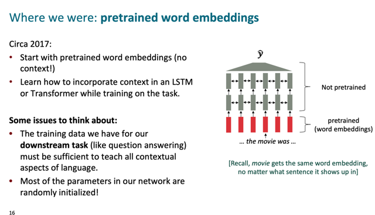</kbd></p>

> [!NOTE]
> Thế thì, tạm gọi là cách làm trước đây là ta dùng pretrained word
> embedding (chưa có thông tin context, như xài từ word2vec) và train RNN,
> Transformer trong một bài toán nào đó như sentiment analysis, machine
> translation,... (Các layer khác được random initialized)
>
> Trong quá trình đó, như đã biết, mô hình sẽ học thêm `/` cập nhật thêm thông
> tin bối cảnh vào embedding.
>
> Nhưng dần dà, người ta pretrain toàn bộ mô hình, giúp việc train một
> downstream task cần ít dữ liệu hơn

<br>

<a id="node-705"></a>

<p align="center"><kbd>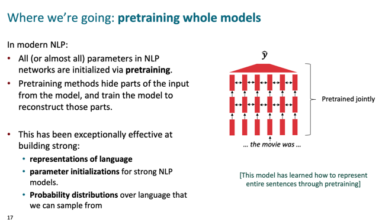</kbd></p>

> [!NOTE]
> Như đã nói ngày này (modern NLP) người ta `pre-train` toàn bộ model
> (embedding, transformer) (Theo cách thức nào thì sẽ nói sau, nhưng nói
> chung như ta đã biết từ NLPSpec đó là theo lối `self-supervised` learning
> che đi một phần của text và "đoán lại" (reconstruct).
>
> Điều này mang lại những ưu điểm như:
>
> 1. Đại khái là ta có embedding tốt hơn, phản ánh tốt contextual information
> thay vì (tạm gọi là raw embedding từ word2vec)
>
> 2. Tạo ra một trạng thái khởi đầu tốt hơn từ đó giúp train ra một mô hình
> hiệu quả hơn. Cái này gv nói rằng như bữa giờ mình làm assignment ta
> đều cơ bản là khởi tạo giá trị ban đầu của params theo ngẫu nhiên với
> zero mean standard deviation nhỏ. Thì với pretrained param, nó đặt mô
> hình vào một trạng thái tốt hơn trước khi bắt đầu quá trình training
>
> 3. Ý này sẽ nói tiếp sau, nhưng có thể hiểu đại ý là việc pretraining, đã
> giúp mô hình học được ít nhiều những pattern trong ngôn ngữ, từ đó giúp
> nó có được khả năng ít nhất định trong việc tính toán ra một phân phối xác
> suất hợp lí của các từng trong ngôn ngữ. Nôm na là, với một mô hình đã
> pretrain, giả sử dùng nó trong một bài toán translation thì bản dịch của nó
> tuy sai nhưng những từ nó dùng có thể không vô lý như việc dùng một
> random initialized model.

<br>

<a id="node-706"></a>

<p align="center"><kbd>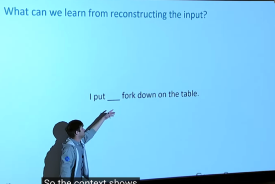</kbd></p>

<p align="center"><kbd>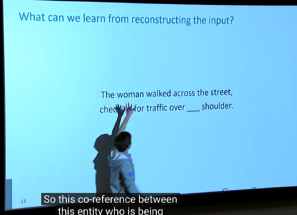</kbd></p>

<p align="center"><kbd></kbd></p>

<p align="center"><kbd></kbd></p>

<p align="center"><kbd>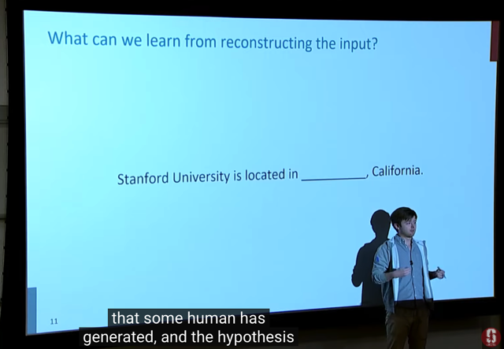</kbd></p>

> [!NOTE]
> Thế thì qúa trình pretraining dựa trên một giả thuyết đó là: Nếu ta train mô
> hình theo cách thức đó là ta sẽ che đi một phần của text, ví dụ một từ
> trong câu (dùng nó làm target trong bài toán supervised learning) và bắt
> mô hình dự đoán ngược ra lại từ đó, thì **KHI MÔ HÌNH HỌC ĐƯỢC
> CÁCH HOÀN THÀNH NHIỆM VỤ NÀY THÌ NÓ CŨNG SẼ HỌC ĐƯỢC
> RẤT NHIỀU KIẾN THỨC VỀ THẾ GIỚI, VỀ NHỮNG QUY LUẬT TRONG
> NGÔN NGỮ.**

<br>

<a id="node-707"></a>

<p align="center"><kbd>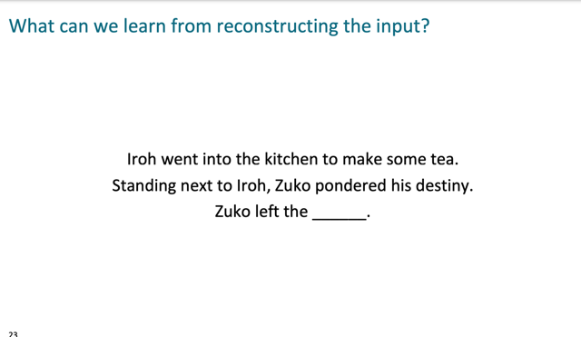</kbd></p>

<p align="center"><kbd></kbd></p>

<p align="center"><kbd>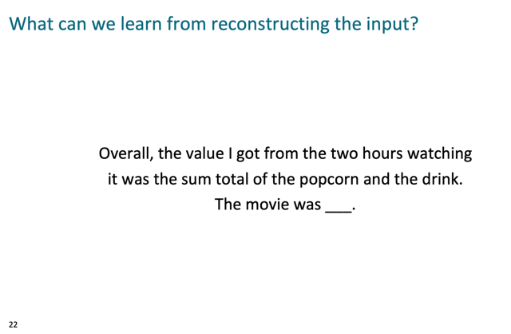</kbd></p>

> [!NOTE]
> Để dự đoán đúng được case này, nó phải học được sentiment
> analysis

> [!NOTE]
> Hoặc như câu này, để trả lời đúng rằng từ cần điền là the kitchen,
> mô hình kiểu như phải có được khả năng suy luận logic (câu này
> đại ý là Iroh vào bếp pha trà, Zuko đứng cạnh Iroh, thế thì Zuko
> phải cũng đang ở trong bếp

<br>

<a id="node-708"></a>

<p align="center"><kbd>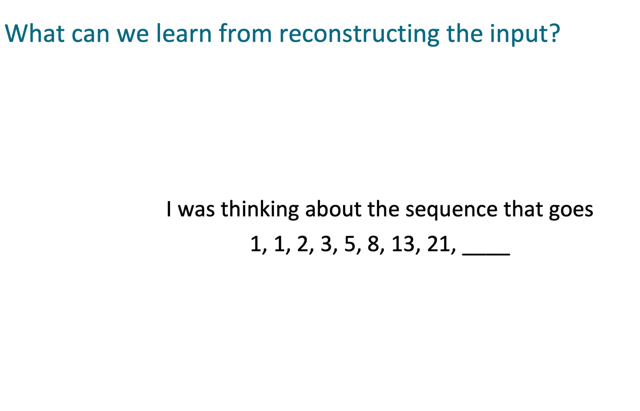</kbd></p>

> [!NOTE]
> rồi nếu muốn đoán đúng được cái này, mô hình phải phát triển
> được khả năng nhận ra được quy luật trong chuỗi số, điều này
> gợi cho ta nhiều câu hỏi về khả năng của mô hình nếu nó làm
> được những câu hỏi kiểu này

<br>

<a id="node-709"></a>

<p align="center"><kbd>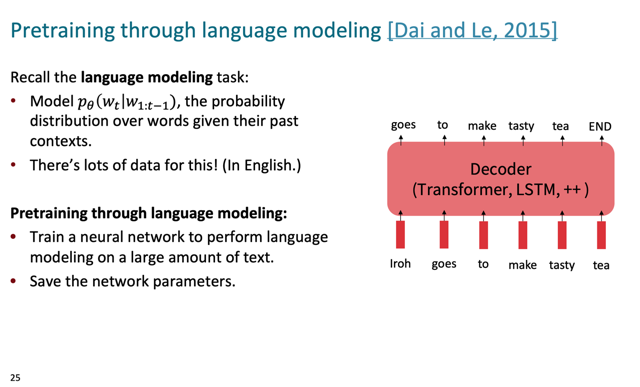</kbd></p>

> [!NOTE]
> Và cơ bản là ta sẽ train một language model với kiến trúc có thể là RNN,
> Transformer `-` như đã biết, nó là mô hình dự đoán từ tiếp theo dựa trên
> những từ trước đó. Nhớ lại một chút, nhiệm vụ này có thể được mô tả theo
> cách tính toán xác suất xuất hiện sau chuỗi từ cho trước của một từ `P(w_t` |
> `w1:t-1)` , hoặc theo cách tính toán xác suất của một chuỗi  từ P(w1:t)
>
> Quá trình train như đã nói chỉ là che đi và bắt nó đoán, ví dụ input là "Iroh" `-`
> target là "goes", input là "Iroh goes" `-` target là "to"..cứ thế.
>
> Và khi train xong thì save toàn bộ params

<br>

<a id="node-710"></a>

<p align="center"><kbd>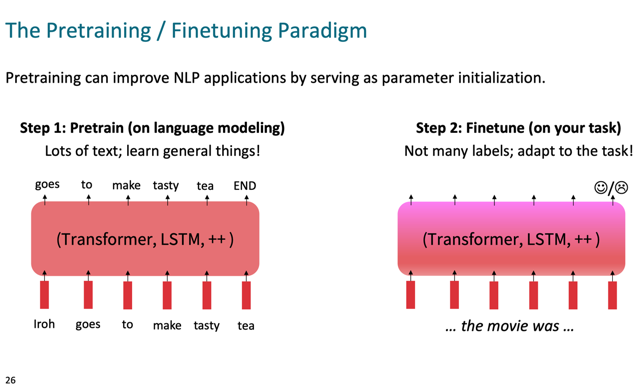</kbd></p>

> [!NOTE]
> Và ta sẽ dùng nó để initialize cho quá trình training trên một bài toán cụ thể
> nào đó (với supervised learning, ví dụ như Machine Translation hoặc
> Sentiment analysis, nơi tất nhiên ta sẽ train với labeled data) bước này
> thường gọi là Finetuning.

<br>

<a id="node-711"></a>

<p align="center"><kbd>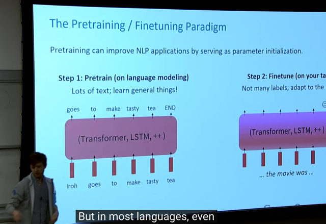</kbd></p>

> [!NOTE]
> Q: Ý anh là gì khi nói ta có rất nhiều data trong English nhưng không có
> trong các language khác? Có phải là annotated `/` labeled data không?
>
> A: Không, ý là dạng text. Bởi vì với pretraining, ta không cần label. Ảnh nói
> vậy là vì tuy rằng trong thời đại internet, không phải ngôn ngữ nào  cũng có
> hàng tỉ từ để training.
>
> Q: Chẳng phải là ta vẫn chỉ có một embedding vector cho mỗi từ hay sao?
> ý anh này hỏi là, nếu nói pretraining update contextual info vào thì có nghĩa
> là sao, khi mỗi từ ta vẫn chỉ có một vector.
>
> A: Đúng là mỗi từ chỉ có một vector khi đưa vào (embedding layer) nhưng 
> bên trong mô hình transformer, nó sẽ được update thông tin bối cảnh để
> có contextual embedding.
>
> Q: Làm sao để evaluate pretrained model? Khi đại khái là tính chất bao quát
> của nó qúa rộng, ý nói mong muốn của ta về những gì mô hình học được
> quá rộng khi bao hàm rất nhiều khả năng ở trong đó thì làm sao ta đánh giá
> được liệu nó có thật sự phát triển được những khả năng đó hay không?
>
> A: Ta có thể dùng các công cụ đã biết để đánh giá language model như Perplexity
> và thật sự mô hình có perplexity thấp có xu hướng làm tốt trong nhiều tác vụ
> khác, ý nói bản thân Perplexity có thể là một chỉ số tốt. Bên cạnh đó cộng đồng
> NLP phát triển rất nhiều thước đo chuẩn hóa (benchmark) để giúp đánh giá.

<br>

<a id="node-712"></a>

<p align="center"><kbd>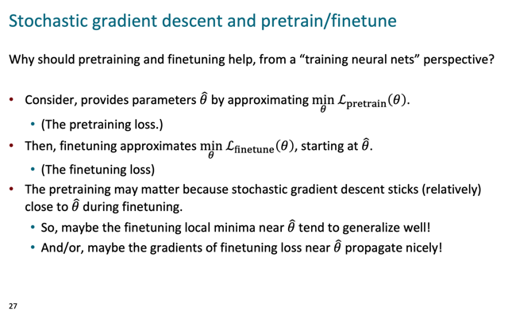</kbd></p>

> [!NOTE]
> Ở đây đại khái là nói về ta có thể đặt câu hỏi cơ sở nào, hay tại sao việc
> pretraining khi train mô hình trong một nhiệm vụ chung chung lại giúp ích
> trong việc train mô hình ở bài toán cụ thể trong  bước finetuning.
>
> Đây là vấn đề đang được nghiên cứu, nhưng có thể giải thích là
>
> "Maybe the finetuning local minima near theta^ tend to generalize well"
>
> quá trình pretrain đã giúp đưa đến một vị trí (loss) thấp trong optimization
> landscape (nói nôm na là việc pretraining với nhiệm vụ chung chung thật
> ra đã tạo ra một mô hình có khả năng nào đó tương đối trong nhiệm vụ
> cuối rồi), giống như việc người đi từ trên núi đã xuống tới lưng chừng
> hoặc gần tới đáy thung lũng rồi. Thế thì việc bắt đầu finetuning từ đó `-` mà
> trong slide họ nói có tính  chất là stochastic gradient descent sẽ stick gần
> với theta^ `-` đại ý là ta sẽ dễ dàng giảm loss của bài toán finetuning hơn để
> (hội tụ) về tới một vùng global minima nơi ta có được khả năng
> generalization tốt trong nhiệm vụ cuối hơn là khi ta train với random
> initialization.
>
> Nói ngắn gọn là, có thể hiểu pretraining đã đưa mô hình về một vị trí thuận
> lợi để converge về global minima (nơi mà ta có mô hình có khả năng
> generalize tốt  trong nhiệm vụ được giao, không bị overfit) hơn là khi
> random ini
>
> Hoặc
>
> "Maybe the gradients of `fine-tuning` loss near theta^ propagate nicely"
>
> Hoặc ta cũng có thể hiểu theo cách pretraining đã đưa mô hình khi chuẩn
> bị finetuning vào vị trí khiến gradient trở nên ổn định, thuận lợi giúp
> training bài toán cuối tốt hơn

<br>

<a id="node-713"></a>

<p align="center"><kbd>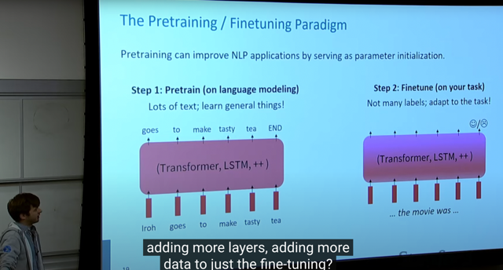</kbd></p>

> [!NOTE]
> Q: Tại sao việc `Pretrain-Finetune` lại tốt hơn là add more layer (build model bự
> hơn) (ý nói tại sao việc train mô hình ở với supervised learning với mô hình
> mạnh hơn, không bằng `Pretrain-Fintuning)`
>
> A: Rất đơn giản là vì Pretrain cho phép ta tận dụng rất nhiều dữ liệu không
> gán nhãn
>
> Còn `fine-tuning` dù ta có dùng mô hình mạnh mẽ cỡ nào thì chi phí đắt đỏ của
> labeled data cũng sẽ là một hạn chế
>
> Ngoài ra một điều cần chú ý đó là ngay cả khi có rất nhiều label data để train
> mô hình sentiment analysis thì nó cũng không bằng pretraining, đại khái là
> bởi vì với pretraining, mô hình được tiếp xúc với `/` huấn luyện với rất đa dạng
> các khía cạnh trong ngôn ngữ. Nên nó phát triển được khả năng hiểu về ngôn
> ngữ khái quát hơn.

<br>

<a id="node-714"></a>

<p align="center"><kbd>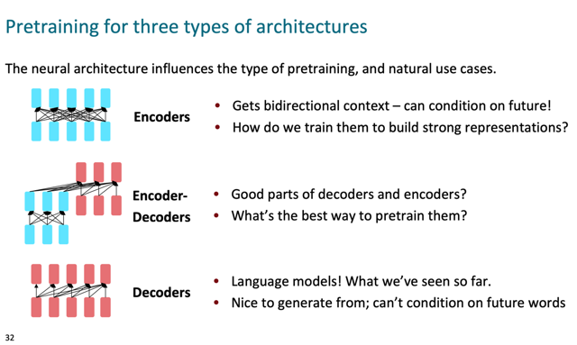</kbd></p>

<br>

<a id="node-715"></a>

<p align="center"><kbd>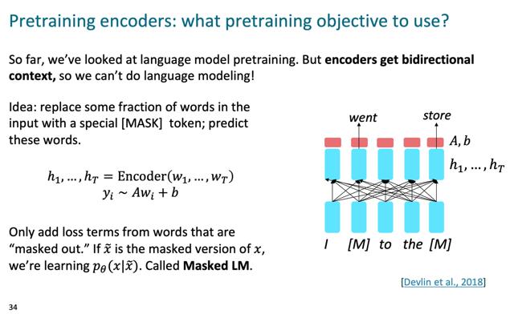</kbd></p>

> [!NOTE]
> Đại khái là nói về việc sử dụng encoder trong việc `pre-training:` Như đã biết, `pre-training`
> cơ bản là ta sẽ train một language model. Thế thì encoder với đặc điểm là có cơ chế
> bidirectional (bidirectional RNN hoặc bidirectional attention)
> `-` ý nói nó cho phép các từ nhận thông tin tự do cả trước và sau. Do đó, một cách tự
> nhiên nó không phù hợp cho việc huấn luyện mô hình ngôn ngữ nơi mà nhiệm vụ là dự
> đoán từ tiếp theo dựa trên các từ trước đó (vì kiểu như nó đã nhìn thấy toàn bộ nội dung
> ở những layer trước rồi)
>
> Do đó, cách họ làm là che đi từ cần dự đoán trong toàn bộ văn bản từ bị che sẽ được
> chọn ngẫu nhiên, ví dụ từ "went", được chọn, thì ta  sẽ che đi toàn bộ từ "went" trong
> input (giống như trong decoder, ta  dùng future mask che mọi từ phía sau từ "I" vậy). Để
> rồi ta sẽ tính prediction của model tại những chỗ bị che để có loss, backprop và update
> params. Lần tiếp theo lại chọn ngẫu nhiên từ khác.
>
> Có thể nhận thấy mỗi lần như vậy, mô hình sẽ dự đoán từ bị che dựa trên những từ cả
> trước và sau nó nhưng trong input không có từ bị che nên nó sẽ vẫn giúp model không
> kiểu như quá dễ khi thấy trước kết quả.
>
> Và việc dự đoán ra văn bản x, dựa trên những một văn bản bị che x~ khiến bài toán này
> là ta đang learn một conditional probability `p_theta(x` | x~) Gọi là Masked Language
> Model thay vì trong Langue Model thông thường ta sẽ learn `p_theta(x)` (*)
>
> (*) Chỗ này nói rõ một chút, trong LM truyền thống, ta muốn nó dự đoán xác suất của
> ```text
> một từ x_t dựa trên những từ cho trước x_1,...x_t-1 kí hiệu là p(x_t | x_1..x_t-1) hoặc có
> ```
> ```text
> thể hiểu theo cách khác là dự đoán xác suất của chuỗi x_1...x_t kí hiệu là p(x_1,... x_t).
> ```
> Do đó mới nói trong LM truyền thống ta learn `p_theta(x)` `-` học cách tính xác suất của một
> văn bản.

<br>

<a id="node-716"></a>

<p align="center"><kbd>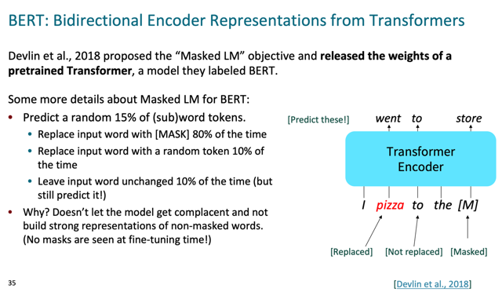</kbd></p>

> [!NOTE]
> mô hình BERT chính là một Transformer Encoder, và quá trình training người
> ta gồm cả việc bắt model predict một từ bị che, dự đoán một từ  được thay
> bằng một từ nào đó và dự đoán một từ được giữ nguyên.
>
> Khúc này anh ấy không nói rõ, có thể hiểu kiểu như là ta cho mô hình thấy cả
> từ sai (như nó sẽ thấy  "I pizza..." nhưng mình lấy dự đoán của nó ở vị trí của
> từ pizza và tính loss với target là từ "went". Để chi, để mang ý nghĩa là, lần
> sau khi nó thấy "I pizza" thì nó phải hiểu rằng đây là cụm từ không đúng, phải
> sửa thành "I  went"
>
> (Cần nhớ lại với Transformer, khi input một sequence thì cùng một lúc, ta có
> prediction tại mọi vị trí và prediction tại mỗi vị trí là probability distribution over
> vocabulary, nên kể cả mask hay replacement, hay 'correct' word, thì để tính
> loss ta cũng dùng cái predicted distribution và một correct target distribution.
>
> Như vậy nếu nó "thấy" mask và target là "went" nó sẽ học được rằng, à  chỗ
> này dù mình không có thông tin gì nhưng đúng phải là "went"
>
> `+` Còn nếu nó "thấy" "pizza" và target là "went" thì nó sẽ học được rằng, à chỗ
> này từ pizza là sai, từ đúng phải là "went", phải sửa lại.
>
> `+` Còn nếu nó thấy "went" và target là "went" thì nó sẽ học được rằng, à chỗ
> này "went" là đúng rồi, nếu không cần sửa lại
>
> Ý tưởng là những điều này sẽ giúp  mô hình phát triển được khả năng
> represent các từ theo cách rất mạnh mẽ, chứa đựng thông tin context rất tốt.

<br>

<a id="node-717"></a>

<p align="center"><kbd>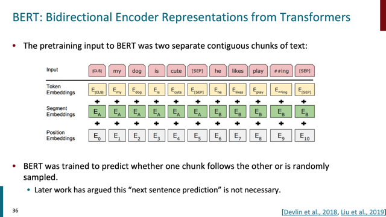</kbd></p>

> [!NOTE]
> tiếp theo đại ý là BERT còn có thêm cái vụ này, kiểu như bắt nó dự
> đoán rằng hai câu đưa vào có phải là kế tiếp nhau hay không (có
> phải liên quan đến nhau không hay là hai câu đó chẳng liên quan gì)
> Mục đích là muốn BERT phát triển khả năng trong việc xác đinh những
> quan hệ xa, kiểu như vậy.
>
> Nhưng sau này người ta nhận thấy cách làm này không cần thiết.
> Tuy nhiên ý tưởng mà anh ấy muốn ta hiểu đó là, thông qua việc giống
> như đặt ra những bài toán, những thách thức khó cho mô hình, thì qúa
> trình huấn luyện khi nó cố gắng hoàn thành nhiệm vụ (giảm loss) thì
> nó sẽ phát triển những khả năng, hiểu biết về ngôn ngữ

<br>

<a id="node-718"></a>

<p align="center"><kbd>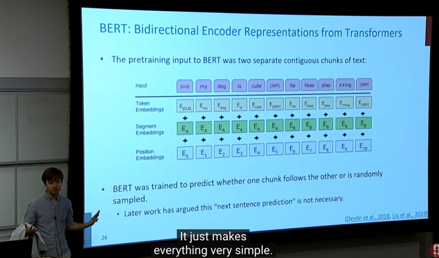</kbd></p>

> [!NOTE]
> Q: Câu hỏi là dấu cộng là concatenate hay `element-wise` addition: Addition,
> nói thêm rằng đây là convention là ta luôn xài vector có cùng dimension
> trong suốt các layer của model
>
> Q: Tại sao nói "next sentence prediction" tỏ ra không cần thiết? `->A:` Đại
> khái đơn giản là vì người ta thấy nó không hiệu quả khi model tỏ ra không
> làm tốt được nhiệm vụ này.
>
> Và anh ấy nói thêm rằng những cái này kiểu như khi người ta publish một
> paper, người ta nghĩ nó có thể có ích (đang nói cái vụ cho model predict
> next sentence này) nhưng rồi một paper khác không dùng cái đó và tỏ ra
> tốt hơn cho thấy nó không cần thiết. Đại ý là trong tiến trình phát triển luôn
> có những ý tưởng được thử nghiệm để sau đó được chứng minh là có hoặc
> không có tác dụng.

<br>

<a id="node-719"></a>

<p align="center"><kbd>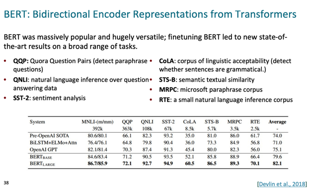</kbd></p>

> [!NOTE]
> đại khái là người ta phát triển rất nhiều benchmark `-` thước đo để đánh giá
> các khả năng khác nhau trong NLP của model ví dụ như khả năng xác định
> hai câu hỏi của Quora có cùng một nội dung hay không, hay sentiment 
> analysis, ....
>
> Và trước khi có pretraining, người ta thường huấn luyện những mô hình 
> riêng lẻ cho từng nhiệm vụ `/` thước đo như vậy.
>
> Nhưng sau khi có pretraining, cơ bản là người ta chỉ cần pretrain một mô
> hình Transformer với rất nhiều data, sau đó finetune nó với các nhiệm
> vụ cụ thể, và kết quả cho ra vượt trội hơn các mô hình không pretraining

<br>

<a id="node-720"></a>

<p align="center"><kbd>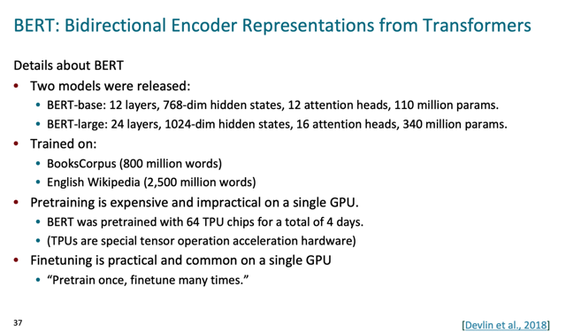</kbd></p>

> [!NOTE]
> một số chi tiết về BERT, như nó có 2 version base & large, được
> pretrain với BookCorpus và Wikipedia. Đương nhiên quá trình
> pretrainning rất tốn kém, chỉ cỡ những công ty lớn như Google
> mới làm được. Nhưng finetuning, anh ấy nói thì không tốn kém
> mấy, và ta hoàn toàn có thể finetuning một pretrained BERT với
> một GPU

<br>

<a id="node-721"></a>

<p align="center"><kbd>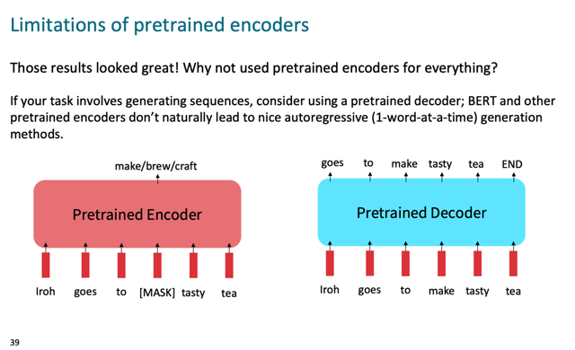</kbd></p>

> [!NOTE]
> Đại khái là (Transformer) Encoder tuy tốt nhưng do đặc điểm tự nhiên
> của nó khi được huấn luyện là "điền vào chỗ trống" `-` dự đoán một từ
> bị che bằng cách lướt toàn bộ nội dung để nắm bắt thông tin ngữ cảnh
> Do đó nó phát huy tác dụng rất tốt trên những nhiệm vụ có tính chất 
> tương tự như sentiment analysis, classify document ..
>
> Còn những nhiệm vụ như generating text: dự đoán một từ dựa trên
> những từ trước đó thì Transformer Decoder tỏ ra phù hợp hơn.

<br>

<a id="node-722"></a>

<p align="center"><kbd>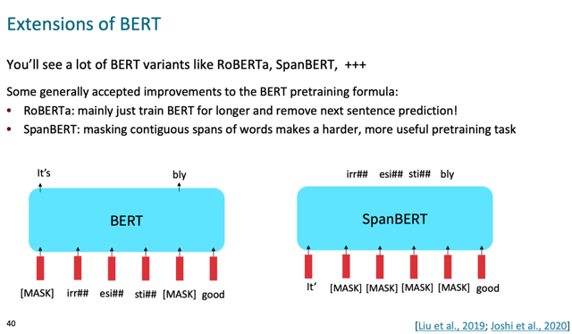</kbd></p>

> [!NOTE]
> một số phiên bản khác, biến thể của BERT như RoBERTa cơ bản chỉ là
> bỏ đi cái vụ predict sentence và train lâu hơn. Còn SpanBERT thì thay
> vì che một cách ngẫu nhiên thì nó sẽ che những vị trí liên tục nhau để
> làm nhiệm vụ trở nên khó hơn giúp tạo ra mô hình hữu ích hơn

<br>

<a id="node-723"></a>

<p align="center"><kbd>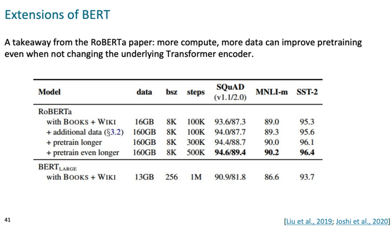</kbd></p>

> [!NOTE]
> Ngoài ra, RoBERTa là ví dụ minh họa cho việc chỉ cần train
> LLM với nhiều data hơn thôi cũng đủ tạo ra khác biệt.

<br>

<a id="node-724"></a>

<p align="center"><kbd>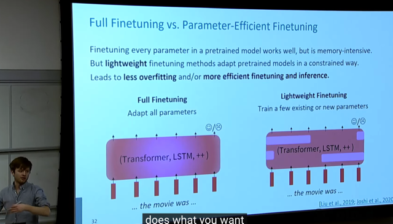</kbd></p>

> [!NOTE]
> Đại khái là nói về việc khi finetuning, có thể tuning toàn bộ parameter (Full
> Finetuning) hoặc chỉ một phần parameters thôi. Nguyên nhân là bởi
> parameters khi pretrain đã khá tốt rồi, và ta chỉ cần huấn luyện thêm một số
> trong chúng là đủ. Nó sẽ giúp giảm overfit cũng như tăng hiệu quả cho quá
> trình finetuning `+` inference

<br>

<a id="node-725"></a>

<p align="center"><kbd>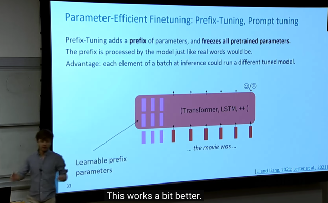</kbd></p>

> [!NOTE]
> một cách làm (của lightweight finetuning) là `Prefix-Tuning` hay Prompt tuning: ta
> sẽ giữ nguyên mọi pretrained parameters, và thêm vào các fake `input/word`
> embedding có tính chất trainable đứng trước (prefix) các input thật. Và quá
> trình finetuning sẽ train các predix embedding này.
>
> Để ý đây là cái mà ta đã từng gặp trong LLM Specialization của deeplearning.
> ai `-` `soft-promt` finetuning. Nhớ lại rằng cái "learnable `soft-prompt"` này không
> nhất thiết là "những từ nào đó". Ý nói, như ta biết khi input vào  model thì mỗi
> từ cũng sẽ được represent thành vector trong vector space, thế thì những cái
> trainable prompt này khi được tuning có thể không cần represent cho một từ cụ
> thể nào (mặc dù khi người ta đảo ngược, chuyển từ trained prompt vector ra lại
> để xem nó gần với embedding vector của  một từ nào nhất thì cũng thấy được
> đại khái là "hình thù" của nó. Nhưng điều đó không quan trọng.

<br>

<a id="node-726"></a>

<p align="center"><kbd>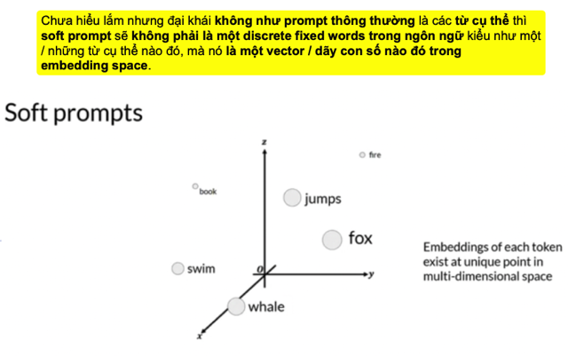</kbd></p>

<p align="center"><kbd>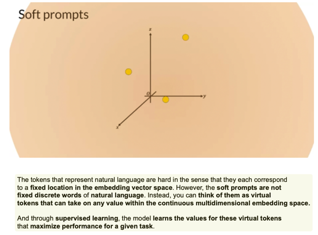</kbd></p>

<p align="center"><kbd></kbd></p>

<p align="center"><kbd></kbd></p>

<p align="center"><kbd>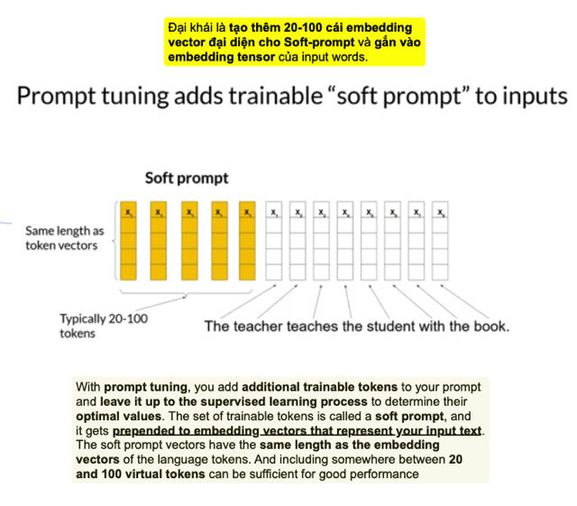</kbd></p>

<br>

<a id="node-727"></a>

<p align="center"><kbd>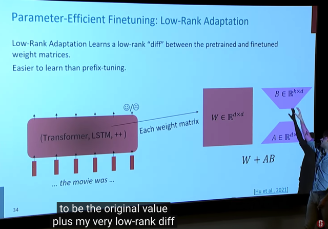</kbd></p>

> [!NOTE]
> Tiếp theo là một cái mà ta cũng đã biết bên LLMSpec `-` LoRa, cơ bản là ta
> sẽ learn một cái `low-rank` (đến nay nhờ thầy Strang mà ta có thể hiểu là
> `low-rank` matrix là gì, ma trận hạng thấp, những matrix ốm gầy hay lùn
> mập ý nói số cột nhỏ hơn nhiều số hàng hoặc ngược lại, đồng nghĩa rank
> với định nghĩa có giá trị lớn nhất là cái nhỏ hơn trong hai kích thước) sẽ nhỏ 
> hơn kích thước của matrix.
>
> Với matrix AB với A, B là hai `low-rank` matrix thì số learnable parameters
> sẽ nhỏ hơn nhiều so với W. (W là pretrain params, và again ta cũng không
> đụng đến)

<br>

<a id="node-728"></a>

<p align="center"><kbd>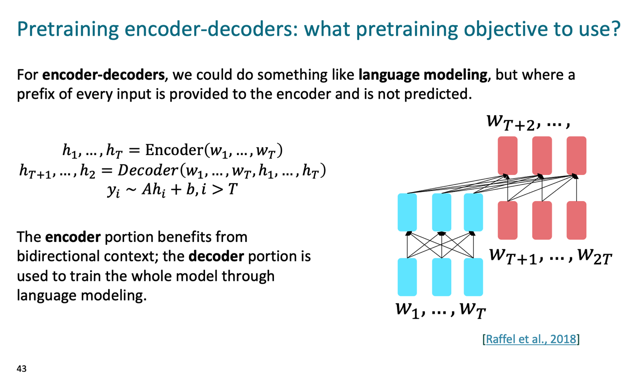</kbd></p>

> [!NOTE]
> đại khái là nói qua kiến trúc `encoder-decoder,` có thể dùng cho language 
> model, với việc đưa prefix `-` những từ đã có `-` cho encoder để nó xử lý
> theo lối bidirectional, còn decoder sẽ nhận hidden state từ encoder để
> làm nhiệm vụ predict.

<br>

<a id="node-729"></a>

<p align="center"><kbd>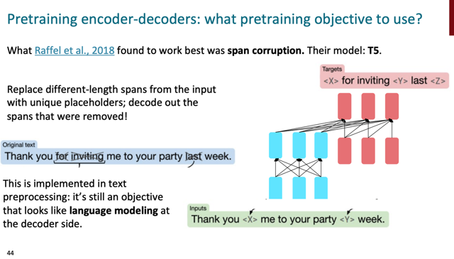</kbd></p>

> [!NOTE]
> Nhưng người ta làm theo cách sau đây tỏ ra hiệu quả hơn gọi là Span
> Corruption, trong model T5 mà mình đã gặp trong NLPSpec `+` LLMSpec
>
> Cụ thể đó là cách làm này giống giống BERT ở chỗ nó cũng random mask `-`
> nhưng mask sẽ có thể là một span nhiều từ chứ không chỉ một từ. Ví dụ, trong
> câu "Thank you for inviting me to your party last week", <X> sẽ mask cho "for
> inviting",  <Y> sẽ mask cho "last". Để rồi target sẽ là <X> for inviting <Y> last
>
> Khác BERT ở chỗ thay vì chỉ đưa ra dự đoán, cho  những từ bị che, thì cái
> này nó sẽ thực hiện việc generating chuỗi 'mask token' `-` nội dung bị che.
>
> Nói rõ hơn chút, BERT ta có thể hiểu nó chỉ được đặt nhiệm vụ là dự đoán từ
> bị che là gì (tính cross entropy loss tại vị trí có từ bị che), còn ở đây nhiệm vụ
> của nó là generate ra một chuỗi `->` hơi khác chút xíu.
>
> `===`
>
> Nói chung cấu trúc của `encoder-decoder` khiến nó phù hợp với bài toán
> Machine Translation khi encoder có thể xử lý toàn bộ câu gốc cả hai chiều, và
> rồi generate câu dịch.

<br>

<a id="node-730"></a>

<p align="center"><kbd>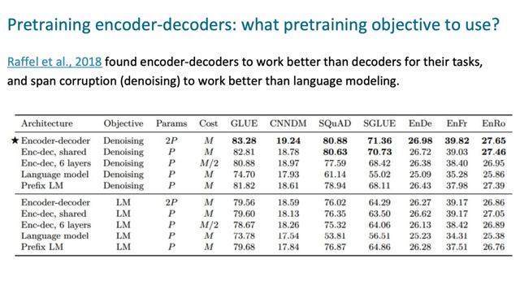</kbd></p>

<br>

<a id="node-731"></a>

<p align="center"><kbd>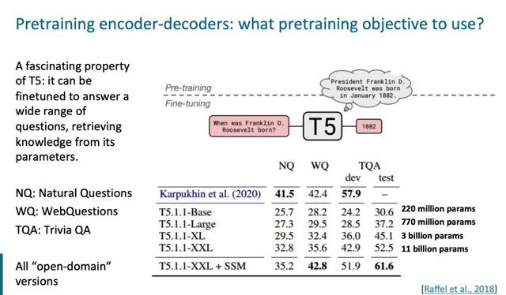</kbd></p>

> [!NOTE]
> đại khái là anh ấy cho biết mô hình T5 có một tính chất rất đáng ngạc
> nhiên đó là nó cho thấy nó có thể retrieve kiến thức encoded bên trong
> pretrained parameters để rồi nó trả lời được những câu hỏi không có trong
> finetuning dataset

<br>

<a id="node-732"></a>

<p align="center"><kbd>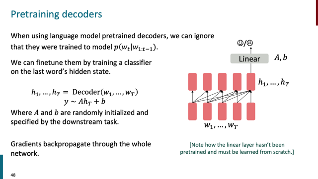</kbd></p>

> [!NOTE]
> Tuy nhiên một số mô hình lớn nhất hiện nay lại là Decoder only.
> Có thể là do nó đơn giản hơn `Encoder-Decoder,` khi toàn bộ param
> chỉ ở trong một model thay vì chia làm hai phần như cái kia.
>
> Pretrain thì cũng cho nó dự đoán từ tiếp theo dựa trên những từ 
> trước đó (che đi các từ tương lai)
>
> Có thể xài nó cho sentiment analysis bằng cách chỉ lấy last state.

<br>

<a id="node-733"></a>

<p align="center"><kbd>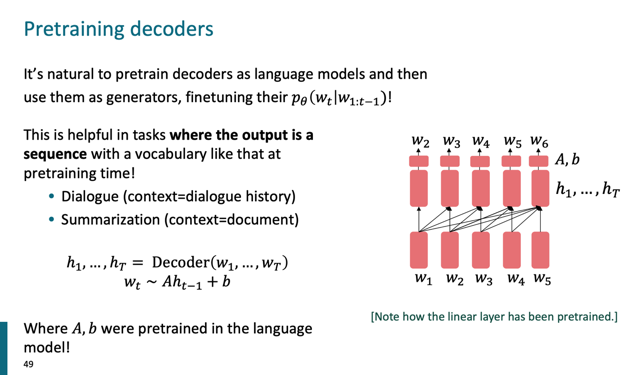</kbd></p>

> [!NOTE]
> Nói chung Decoder một cách tự nhiên nó
> phù hợp với language model,

<br>

<a id="node-734"></a>

<p align="center"><kbd>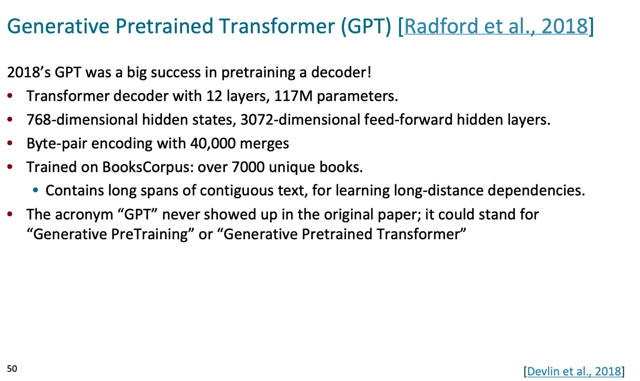</kbd></p>

> [!NOTE]
> GPT là một LLM dùng Decoder rất thành công. Một số thông số của nó
> ở đây như model dimensions là 768 (tức embedding vector length là
> 768), `feed-forward` layer thì 3072 unit. Vocab size (tạo bởi `Byte-pair`
> encoding) có 40.000 token id. Được train với BookCorpus

<br>

<a id="node-735"></a>

<p align="center"><kbd>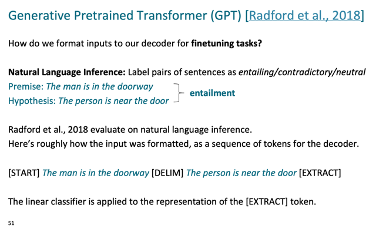</kbd></p>

> [!NOTE]
> Slide này nói về một số cách để format data cho việc finetuning GPT ví
> dụ như cho nó classify hai câu có phải là " bổ sung" `/` hay "mâu thuẫn"
> nhau

<br>

<a id="node-736"></a>

<p align="center"><kbd>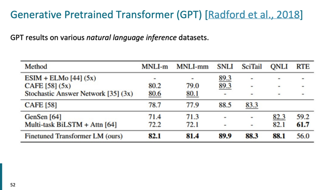</kbd></p>

<br>

<a id="node-737"></a>

<p align="center"><kbd>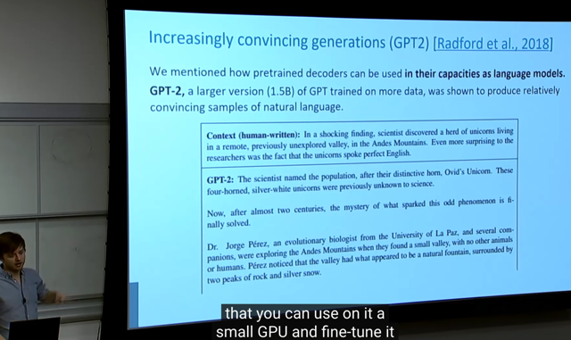</kbd></p>

> [!NOTE]
> rồi đến GPT2 lớn hơn với 1.5B params, performance của nó trong khả
> năng generate ra nội dung rất thuyết phục đã gây sự ngạc rất lớn

<br>

<a id="node-738"></a>

<p align="center"><kbd>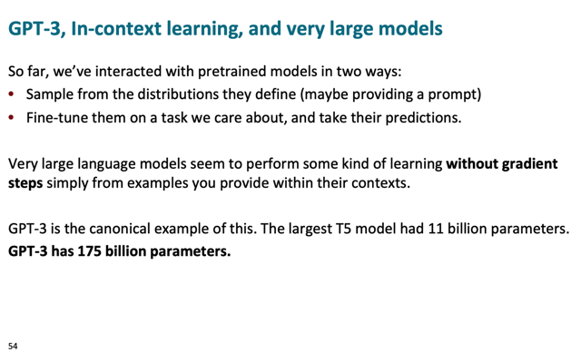</kbd></p>

> [!NOTE]
> với GPT3 thì từ 1.5B lên thành 175B params. Thì đại khái là với model
> lớn cỡ này bắt đầu nó phát triển một khả năng khác mà trước đây không
> có. Trước đây, ta chỉ có 2 cách để tương tác với pretrained model:
>
> 1.Sampling từ distribution mà model đã học được, ví dụ bảo nó viết tiếp
> một prompt.
>
> 2.Finetune nó trên nhiệm vụ mà mình quan tâm.
>
> Còn với mô hình lớn như GPT3, kiểu như không cần finetune nữa, đơn
> giản là chỉ cần cung cấp cho nó thông tin context phù hợp là đủ để nó
> hiểu nhiệm vụ phải làm rồi. `-` gọi là **in-context learning**

<br>

<a id="node-739"></a>

<p align="center"><kbd>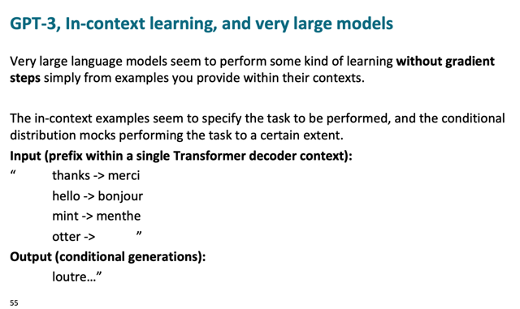</kbd></p>

> [!NOTE]
> ví dụ như với input để một vài ví dụ như
> vầy là nó đã đủ hiểu rằng mình muốn nó
> translate sang tiếng Pháp.

<br>

<a id="node-740"></a>

<p align="center"><kbd>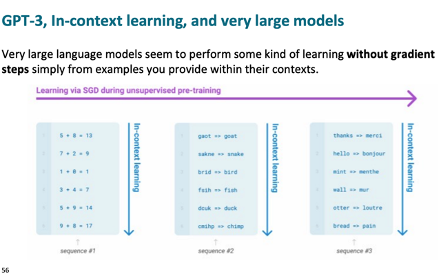</kbd></p>

> [!NOTE]
> thêm ví dụ về
> khả năng này

<br>

<a id="node-741"></a>

<p align="center"><kbd>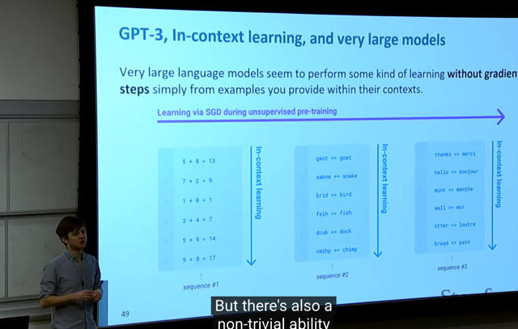</kbd></p>

> [!NOTE]
> Đại ý ảnh nói rằng điều này rất đáng ngạc nhiên, và chúng ta thật
> sự cũng không hiểu rằng có phải trong training set model đã thấy ví
> dụ của dạng này để rồi nó học được dạng `/` pattern `/` quy luật của
> câu hỏi (ý là nó biết người ta đang muốn gì khi pass khơi khơi cho
> nó cái prompt như vậy)
>
> Hay có phải là nó đã phát triển một dạng thông minh cao hơn, để
> rồi thật sự nó hiểu được mình muốn gì thông qua context.
>
> Đây liên quan đến nhiều tranh cãi như từ gs Hinton về việc LLM
> thật sự đã phát triển trí thông minh.

<br>

<a id="node-742"></a>

<p align="center"><kbd>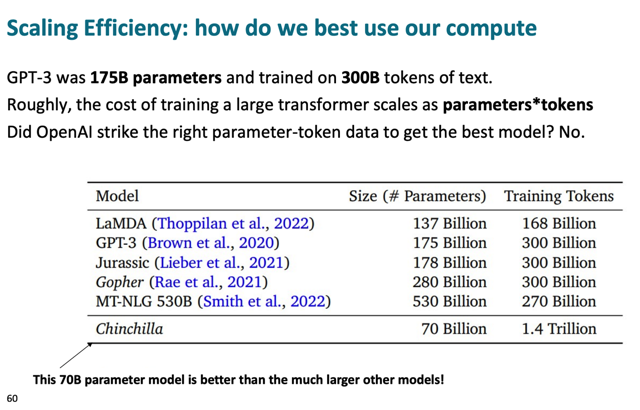</kbd></p>

> [!NOTE]
> đại ý nói về mô hình Chinchilla cho thấy có thể giảm số parameters
> nhưng vẫn đạt hiệu quả như những mô hình lớn, tuy nhiên nó phải
> được train với nhiều dữ liệu hơn

<br>

<a id="node-743"></a>

<p align="center"><kbd>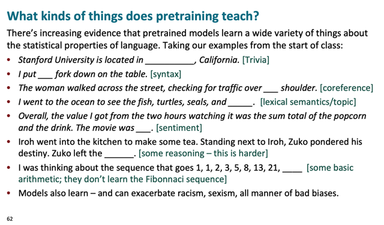</kbd></p>

> [!NOTE]
> Những "loại nhiệm `vụ/kĩ` năng" mà LLM
> được train khi pretraining

<br>

