# Lecture 9: Self-attention And Transformers

📊 **Progress:** `42` Notes | `45` Screenshots

---
<a id="node-647"></a>

<p align="center"><kbd></kbd></p>

<br>

<a id="node-648"></a>

<p align="center"><kbd>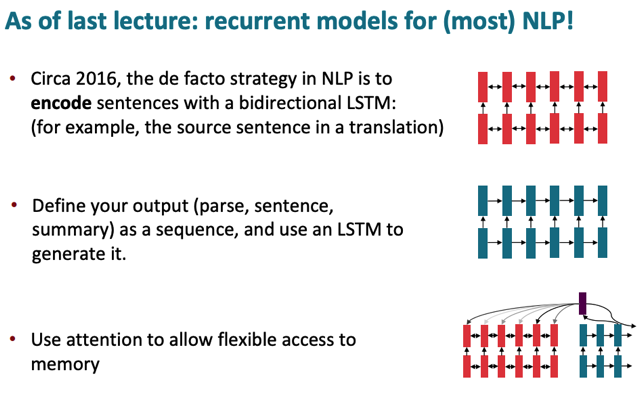</kbd></p>

> [!NOTE]
> đại khái nói về giai đoạn trong những năm 2016, khi
> `RNN+attention` là lựa chọn phổ biến cho các NLP task

<br>

<a id="node-649"></a>

<p align="center"><kbd>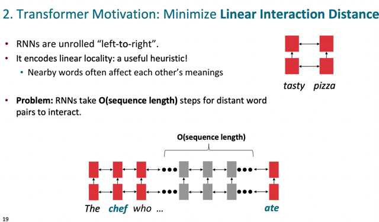</kbd></p>

> [!NOTE]
> Tuy nhiên nó vẫn có những hạn chế dù LSTM có thể khắc phục
> phần nào nhưng chưa hoàn toàn, đó là vấn đề `long-range`
> dependency

<br>

<a id="node-650"></a>

<p align="center"><kbd>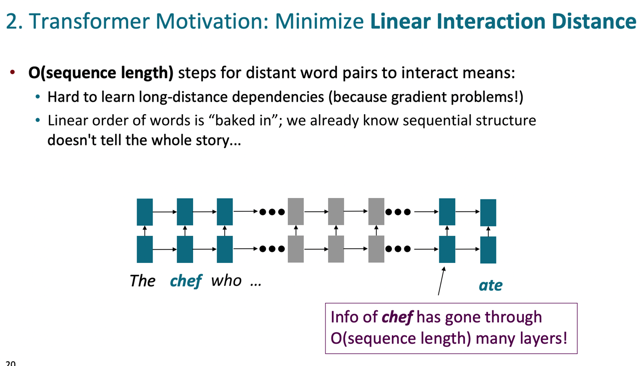</kbd></p>

> [!NOTE]
> Cái ta muốn đạt được đó là làm cách nào đó **để các `node/từ` dù ở xa
> nhau vẫn có thể interact trực tiếp với nhau** thay vì phải đợi qua một
> chuỗi các step. Đây gọi là vấn đề **linear interaction distance**

<br>

<a id="node-651"></a>

<p align="center"><kbd>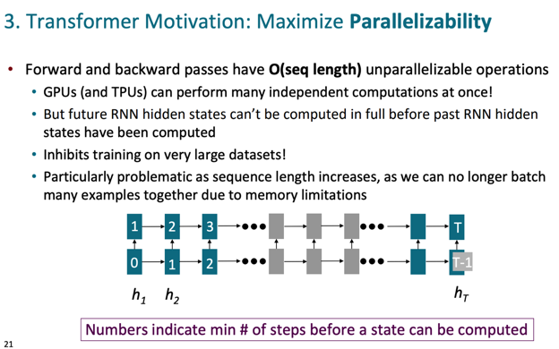</kbd></p>

> [!NOTE]
> đại ý là hạn chế của RNN đó là n**ó bắt buộc phải tính toán tuần tự,**
> dẫn đến chuỗi dài thì tính toán lâu khi **phải chờ nhau**, **không tận dụng
> được sức mạnh của GPU và TPU** vốn dĩ được thiết kế để xử lý đa luồng
> như bên cs231n đã biết 
>
> Do đó khi training trên dataset rất lớn, và với chuỗi càng dài thì thời gian 
> tính toán sẽ tăng theo chiều dài chuỗi**O(sequence length)**Ngoài ra khi chuỗi càng dài thì ta cũng không còn có thể batch nhiều 
> example với nhau nữa do giới hạn về memory

<br>

<a id="node-652"></a>

<p align="center"><kbd>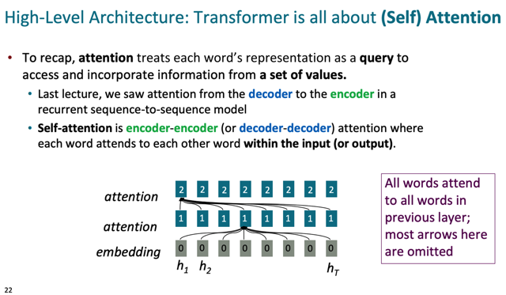</kbd></p>

> [!NOTE]
> nói sơ về việc tại sao attention giúp giải quyết hai vấn đề của RNN là
> **linear interaction** và **xử lý song song.**
>
> về linear interaction thì đại khái là vì với attention, **một node sẽ có tương tác
> trực tiếp với các node khác dù có ở xa thế nào đi nữa**, chứ không phải gián
> tiếp đợi qua nhiều node trung gian.
>
> về vấn đề xử lý song song: attention cho phép **tính toán các node hoàn
> toàn độc lập nhau**
>
> số trong mỗi box thể hiện số bước tính toán cần thiết trước đó. Vậy với tầng
> embedding, rõ ràng có thể **tính embedding của mỗi input token một
> cách độc lập**, vì embedding của mỗi từ**chỉ phụ thuộc vào bản thân của nó**.
>
> Sau đó ở bước attention, tại **mỗi node tính toán attention cũng độc lập
> nhau.**Và Transformer về cơ bản là chỉ (gồm) các `Self-Attention.`

<br>

<a id="node-653"></a>

<p align="center"><kbd>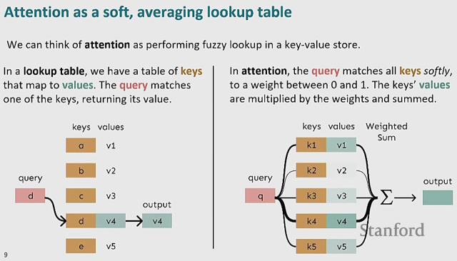</kbd></p>

> [!NOTE]
> ý tưởng của attention là kiểu như **"giống giống" look up table.** Với cơ chế
> lookup table, mình đ**ưa ra query**, để rồi xem trong các `key-value` cái nào có
> **key khớp với query thì trả ra value tương ứng**.
>
> vậy với attention thì tương tự: chìa ra cái query, để rồi xem trong các cặp key
> `-value` thì c**ái nào có key khớp nhất**. độ khớp ở đây không cứng nhắc (ý là
> giống hoàn toàn) mà kiểu như đo bằng **mức độ giống nhau ít nhiều của query
> và key** (dùng các  metric đo khoảng cách hai vector như cosine similarity
> chẳng hạn).
>
> Tuy nhiên không phải chỉ kiểu như "lấy ra value của thằng khớp nhất" mà vì
> (tạm gọi là `soft-matching)` nên ta sẽ**dùng "mức độ khớp" của query và các
> key như trọng số**, để rồi**tính phép tính weighted sum của tất cả các value
> với các trọng số đó.**Vậy với `look-up` table, có thể coi như `'hard-matching',`
> nếu query hoàn toàn khớp với key thì trả ra value của nó thì cũng có thể coi
> như weighted sum các value có điều chỉ có weight của cặp `key-value` khớp là
> `=` 1, còn lại `=` 0.

<br>

<a id="node-654"></a>

<p align="center"><kbd>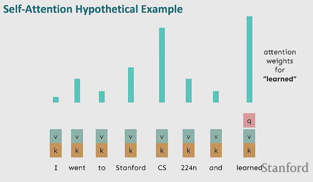</kbd></p>

> [!NOTE]
> Một ví dụ để minh họa, tính mức độ attend cho từ "learned" thì có thể  sẽ
> cho thấy weight của CS sẽ cao, Stanford cũng tương đối cao, và bản thân
> nó thì đương nhiên là cao nhất do kiểu như "nó thì giống nó nhất" và như
> bên cuốn sách Transformer NLP ta đã biết có cách để kiểu như khắc phục
> chuyện này (vì việc chú ý nhiều nhất đến bản thân nó không có ích lợi gì)

<br>

<a id="node-655"></a>

<p align="center"><kbd>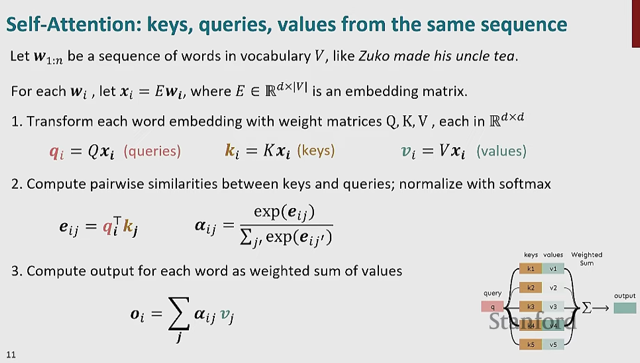</kbd></p>

> [!NOTE]
> Nói về `Self-Attention:`
>
> Cho một chuỗi w1, w2...wn, mỗi từ là một trong V từ của bộ vocab, lấy ví
> dụ câu: "Zuko made his uncle tea"
>
> Với mỗi từ wi, ta mới tạo `d-D` embedding vector của nó xi `=` Ewi.
>
> 1) Chuyển embedding vector thành 3 vector `d-D` query qi, key ki, value vi
> thông qua ba matrix Q,K,V (đều có shape [d,d]).
>
> 2) Với mỗi từ `w_i,` tính ra độ giống nhau giữa query của nó với key của mọi
> ```text
> từ khác tạo thành attention score vector e_i = [q_i@k_1 q_i@k_2 ....q_i@k_n]
> ```
>
> Sau đó normalize để có vector attention weight `alpha_i:`
>
> ```text
> [exp(e_i1)/sum  exp(e_i2)/sum ....exp(e_in)/sum]
> ```
>
> Sum `=` Sum j `exp(e_ij)`
>
> 3) Tính một linear combination của các vector v1,2,3....n với coefficients là
> các attention weights để có được `o_i:` mang ý nghĩa là outer context của từ
> `w_i.`

<br>

<a id="node-656"></a>

<p align="center"><kbd>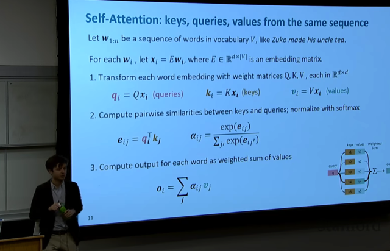</kbd></p>

> [!NOTE]
> *câu hỏi thứ nhất là w có shape là gì: w 1:n là chuỗi các từ trong vocab, có thể
> hiểu w là matrix các `one-hot` vector, nói chung mỗi `w_i` là `one-hot` vector ứng với
> từ có size là (Vx1), để rồi qua embedding matrix trở thành embedding vector  `x_i`
> ```text
> có dimension là D. x_i (d,1) = E@w_i (d,V@V,1=d,1)
> ```
>
> Nếu xét cả chuỗi thì w (nxV), nên `E@w` có shape là n,D
>
> `====`
>
> *có câu hỏi đặt ra đó là**tại sao phải có hai matrix Q, K** khi mà  `q_T@k` chỉ cho
> ra một matrix, có thể hiểu anh này thắc mắc là dù gì thì q (matrix) và k (matrix)
> cũng nhân nhau để ra matrix vậy tại sao cần phải tính matrix q và k từ X bằng 2
> matrix riêng biệt Q và K
>
> Câu trả lời của giảng viên nhắc tới **việc dùng Q,K riêng sẽ giúp tăng tính
> expressiveness của model,** hiểu nôm na là với việc có được Q, và K riêng,
> model có **thêm sự linh hoạt**, cho phép nó học ra bộ query và key mang những
> sắc thái riêng giúp nó khám phá những khía cạnh ngữ nghĩa của quan hệ các từ
> với nhau tốt hơn.
>
> `====`
>
> *câu hỏi nữa liên quan đến `e_ii,` đại khái câu hỏi có thể hiểu là quan tâm đến
> **liệu attention score của một từ với chính nó là ntn**.
>
> Câu trả lời đó là **vì ta có Q,K riêng** nên **có thể q và k của một từ không giống
> nhau thành ra attention score của 1 từ với chính nó sẽ không "lớn hơn hết thảy"
> như đã nói lúc nãy**. Đây chính là một ưu điểm mà Q,K riêng biệt mang lại.
>
> Nếu ta **chỉ dùng `x_i` cho vai trò của cả `q_i` và k_i**hay **chỉ dùng chung một
> matrix cho Q và K** thì sẽ bị vấn đề này (một từ chú ý tới chính nó nhiều nhất)

<br>

<a id="node-657"></a>

<p align="center"><kbd>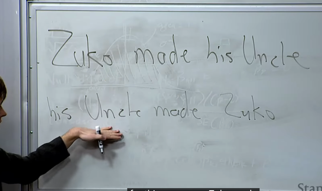</kbd></p>

> [!NOTE]
> đại khái là nói về **một vấn đề phải giải quyết nếu muốn dùng attention**
> đó là cơ chế self attention giống như ta **đang tính toán với một SET**
> các node, chứ không phải LIST, vì các node được tính toán độc lập nhau
> nên ổng lấy ví dụ hai câu này d**ù ý nghĩa hoàn toàn khác** nhưng với cơ 
> chế attention thì**kết quả sẽ hoàn toàn giống nhau.
>
> Và vì vậy nên thông tin về thứ tự mà list mang lại sẽ bị mất đi khi ta 
> dùng set**

<br>

<a id="node-658"></a>

<p align="center"><kbd>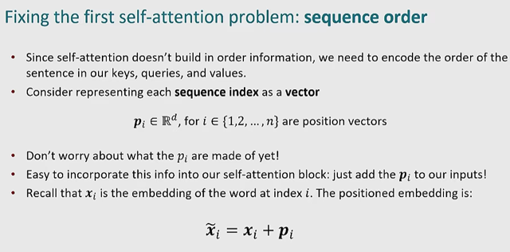</kbd></p>

> [!NOTE]
> Ta sẽ khắc phục điều này bằng cách tạo ra **positional encoding**, (cách làm
> cụ thể thì sẽ nói sau) nhưng chỉ cần hiểu là nó **cũng là vector d-dimension**
> mang **các giá trị hàm chứa trong nó là thông tin về vị trí**của token trong 
> chuỗi.
>
> Và việc dùng các thông tin vị trí này **chỉ đơn giản là add nó vào embedding
> vector x_i**để có **x~_i**

<br>

<a id="node-659"></a>

<p align="center"><kbd>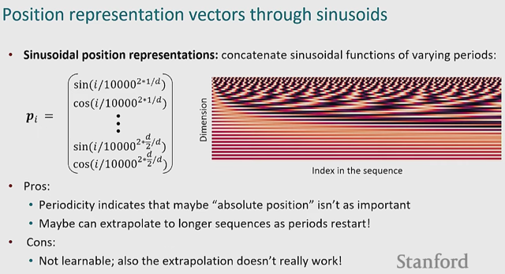</kbd></p>

> [!NOTE]
> đại ý là một cách làm cho vụ positioning encoding này là dùng Sinusoidal,
> (đã gặp trong Deep Learning Specialization `-` Andrew Ng), với công thức
> này, ý chính là ta sẽ có tại mỗi position một vector khác nhau. Và từ DLSpec
> mình đã biết là các vector này có những tính chất như: Khoảng cách giữa hai
> cặp vector encoding cho hai cặp vị trí cách xa giống nhau thì giống nhau.
>
> Tuy nhiên nhược điểm của cái này là "fixed", not learnable, gợi ý là về sau
> người ta dùng những cách tiếp cận khác cho phép model học ra cách represent
> position information.

<br>

<a id="node-660"></a>

<p align="center"><kbd>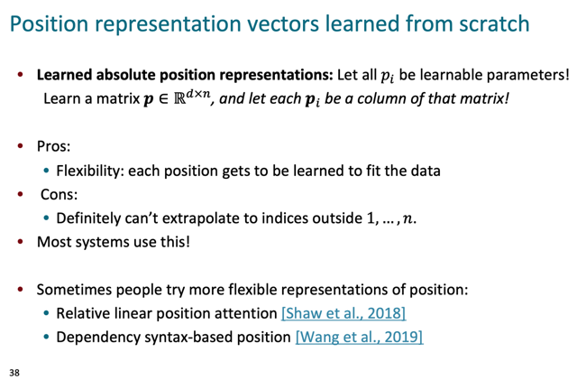</kbd></p>

> [!NOTE]
> Cách tiếp cận cho model tự học position encoding chỉ đơn giản là giống
> như dùng (learnable) embedding matrix để tạo embedding vector,
> thì ở đây, dùng một learnable positioning matrix P để chuyển một index 
> thể hiện vị trí thành một vector (nói ngắn gọn là mỗi cột của P sẽ được
> dùng làm positional encoding, matrix P sẽ có N cột tương ứng với N vị
> trí của chuỗi, số hàng vẫn là d, như đã nói positional encoding cũng có 
> length bằng với embedding vector.
>
> Ưu điểm của cái này dễ thấy đó là nhờ tính chất learnable nên nó rất
> tốt. Nhưng nhược điểm là giả sử có một câu dài hơn N thì sẽ không 
> được, tại vì ta đã chỉ train một bộ có N position
>
> Một số cách tiếp cận khác mình sẽ tìm hiểu trong lecture note

<br>

<a id="node-661"></a>

<p align="center"><kbd>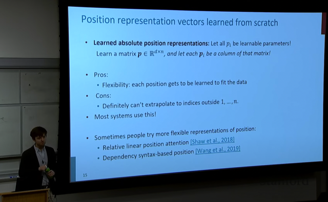</kbd></p>

> [!NOTE]
> Một câu hỏi đặt ra đại ý là có khi nào trong thực tế ta chỉ việc fit một model
> với N đủ lớn thì sẽ khỏi cần phải care về vấn đề vừa nói hay không?
>
> `->` Gv: Không, vì thực tế như ngày nay với cả những large language model
> lớn thì vẫn luôn bị một giới hạn nào đó trong context. Hay ví dụ như cho rằng
> ta sẽ fit model với N `=` 4000 thì cũng không chứa đủ một wiki page (ý nói
> không bao giờ là cho đủ). Và vấn đề là khi muốn tăng N lên thì ta sẽ phải 
> bình phương chi phí (memory) (gv nhắc đến cụm từ quadratic complexity,
> mà ta sẽ nói đến sau), thành ra không phải muốn tăng N là tăng vì như đã
> biết luôn có những giới hạn trong `compute/memory`
>
> `====`
>
> Q: Làm sao ta biết rằng nó chỉ learn position thay vì learn cái thông tin gì
> khác?
>
> `->` Đại khái là vậy nè, nếu (hoặc vì) ta "dùng" cùng một positional encoding
> cho bất kì từ nào (dù có nội dung khác nhau vì nó ở trong các câu khác nhau)
> miễn là chúng cùng một vị trí trong câu (ví dụ, trong batch có 128 câu, mọi từ
> đầu tiên của mỗi câu đều được dùng cùng một positional vector) thì...:
>
> Mô hình sẽ kiểu như thấy rằng, à những từ này nội dung khác nhau và chỉ
> giống nhau ở mỗi một việc là tụi nó đều nằm ở vị trí thứ nhất, và các vector
> positional của chúng cũng y như nhau, thì từ đó suy ra các vector này biểu thị
> thông tin vị trí của chúng, và quá trình training model sẽ**chỉ thay đổi (learn)
> ra các vector này theo sự tương quan của vị trí** **chứ không liên quan đến
> thông tin gì khác của các từ**

<br>

<a id="node-662"></a>

<p align="center"><kbd>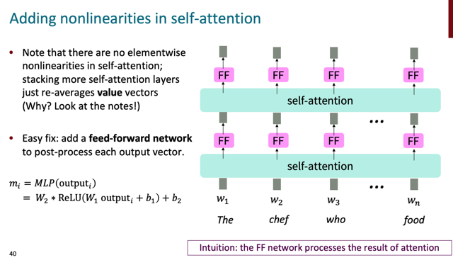</kbd></p>

> [!NOTE]
> Tiếp theo đại khái là cơ chế `Self-Attention` tuy hay, nhưng cơ bản là tuyến tính
> vì những gì nó làm là tính ra một bộ attention weight cho mỗi từ rồi dùng nó
> làm hệ số cho việc tính một linear combination của các từ để làm thành một
> vector mới cho từ đó, mang ý nghĩa là "cập nhật thêm thông tin về bối cảnh"
> cho word embedding để thành contextual embedding.
>
> Suốt quá trình chỉ là tuyến tính. Và giả sử ta có stack thêm các `Self-Attention`
> layer nữa thì một chuỗi các bước tuyến tính cũng tiếp tục là tuyến tính.Y như
> việc ta stack một chuỗi các FC layer mà không có activation function thì cũng
> chỉ là một FC layer mà thôi. Và ta đã biết, sức mạnh của neural network đến
> từ `non-linearity` function, giúp đem lại cho nó sự linh hoạt cần thiết để capture
> được các complex pattern trong data.
>
> Vậy nên người ta giải quyết bằng cách `post-process` output từ `Self-Attention`
> với Feed Forward layer, hay ở đây gọi là Multi Layer Perceptron. Cơ bản là
> pass nó qua vài FC layer xen bởi `non-linearity` như RELU.
>
> Nhờ vậy mang lại cho model tính phi tuyến cần thiết. Giảng viên nói thêm
> như trong hình, Self `-Attention` giống như nơi các từ tương tác tự do với nhau
> để "cập nhật thêm context info", sau đó đi ra thì mỗi thằng sẽ pass qua FF.
> Bước FF này có ưu điểm là tính toán song song rất tốt như đã biết (nhờ việc
> tính toán mọi sample có thể được thực hiện cùng lúc thông qua vectorization)

<br>

<a id="node-663"></a>

<p align="center"><kbd>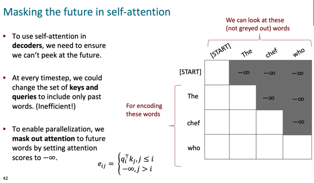</kbd></p>

> [!NOTE]
> Còn một vấn đề nữa, đó là đôi khi trong những bài toán như machine
> translation ta không muốn trong cơ chế `self-attention,` một từ ví dụ tại vị trí `i=3`
> được bổ sung, cập nhật thông tin bối cảnh từ các từ sau nó `(j=4,5,6...).` Bởi
> vì, kiểu như khi bản thân contextual embedding của từ thứ 3 đã có thông tin
> của các từ sau thì khi dùng nó để dự đoán cho từ sau (ví dụ đoán từ sau là
> gì, trong bài toán MT sẽ vô nghĩa, (hay mang tính chất ăn gian khi cơ bản là
> model đã biết rồi).
>
> Do đó, một giải pháp là khi `Self-attention,` ta chỉ cho một từ attend với những
> từ trước đó thôi bằng cách dùng một cơ chế nào đó (gv ko nói nhưng mình
> hình dung là dùng loop), nhưng làm vậy kiểu như không hiệu quả khi hi sinh `/`
> làm mất đi tính chất hiệu quả của cách làm `self-attention` hiện tại vốn dĩ bao
> gồm việc nhân matrix (tính parallelization đang rất tốt).
>
> Thế thì cách làm đơn giản hơn đó là cứ `self-attention` bình thường, tức là cứ
> tính attention scores của từ thứ `i=3` với những từ sau nó `(j=4,5,6),` rồi sau đó
> apply một cái mask (future mask). Để rồi với những từ ở sau, attention weight
> e34, e35, e36...sẽ được set thành `-infinity.` 
>
> Hệ quả là khi cái masked attention weight này được pass qua softmax để 
> chuyển thành attention weight, những cái weight ứng với các từ sau w34,w35..
> sẽ thành 0. Khi đó linear combination cho từ đó `(i=3)` sẽ chỉ là gồm các từ
> từ nó trở về trước.
>
> Ví du từ chef (nhìn vào hàng 4 ô ứng với từ chef, 3 ô trắng biểu thị attention
> score ở đó tính bình thường, còn của từ chef với who thì bị masked)
> Nên outer context vector cho từ chef sẽ không có sự tham gia của từ 'who'

<br>

<a id="node-664"></a>

<p align="center"><kbd>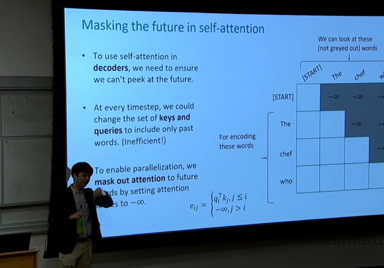</kbd></p>

> [!NOTE]
> Câu hỏi là có phải ta sẽ chỉ mask khi ở Decoder không?
>
> Đúng vậy, đại khái là tương tự như sự khác nhau khi ta xài `Bi-directional` RNN
> và `Uni-directional` RNN. Với `Encoder-Decoder,` Encoder ta sử dụng
> `Bi-directional` RNN, đặng mang lại thông tin context ở phía trước và sau một
> từ. Thế thì với `Self-Attention` cũng vậy, khi Dùng trong Encoder, ta cho phép
> điều đó `-` tức cho phép, hoặc mong muốn embedding của một từ có được
> thông tin context một cách đầy đủ nhất.
>
> Nên cái mask chỉ khi nào trong hoàn cảnh ta không muốn điều trên, cụ thể là
> Decoder khi dùng thông tin từ encoder (câu gốc) và thông tin các từ trước của
> câu dịch để dự đoán cho từ tiếp theo thì ta sẽ dùng mask.

<br>

<a id="node-665"></a>

<p align="center"><kbd>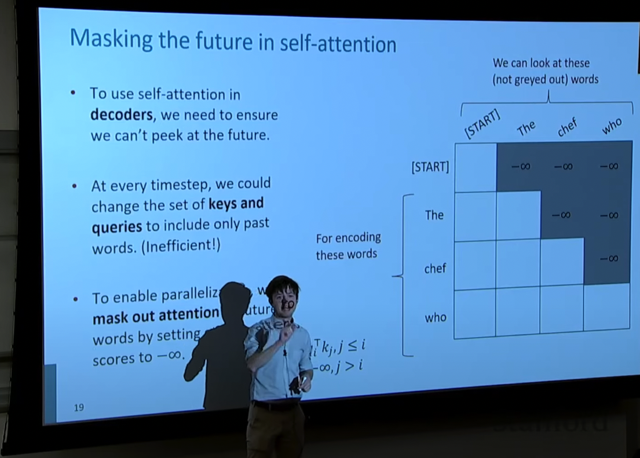</kbd></p>

> [!NOTE]
> Đại khái câu hỏi của học viên đại khái là khi liên hệ với cách mà con người
> thực hiện việc dịch. Thì khi ta dịch, đại ý là ta cũng có sự tính toán, cân nhắc
> cho nội dung "sắp tới" Ý bạn ấy đại khái là tại sao lại mask các bước tương lai
> của decoder?
>
> Theo giảng viên, khi ta huấn luyện mô hình cho nhiệm vụ predict next word
> của câu dịch, nếu không mask, mọi chuyện kiểu như sẽ quá dễ với model,
> khiến nó không đạt hiệu quả học tập

<br>

<a id="node-666"></a>

<p align="center"><kbd>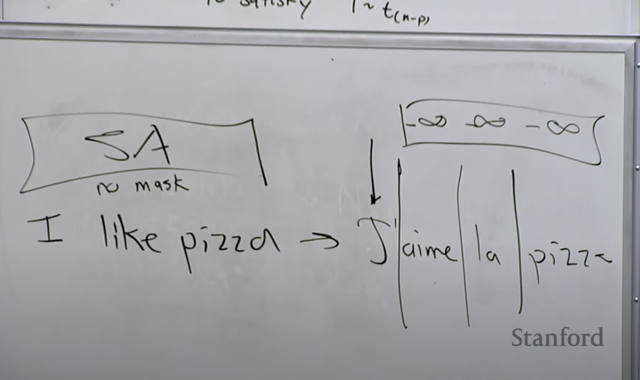</kbd></p>

> [!NOTE]
> Câu hỏi về cách dùng mask attention trong bài toán neural machine
> translation.
>
> Thì đại ý là trong bài toán này, ở encoder, sẽ không dùng mask vì ta muốn
> embedding của những từ trong câu gốc chứa đựng đầy đủ thông tin bối
> cảnh nó trong cả câu.  Nhưng với decoder self attention, vector của J'  của
> câu dịch sẽ chỉ chứa đựng thông tin từ câu gốc và chính nó, đặng khi dùng
> để dự đoán ra từ tiếp theo, kiểu như model phải "cố gắng suy nghĩ" tìm cách
> học (bằng cách thay đổi param) để sao cho predict ra đúng được đáp án
> là "aime".

<br>

<a id="node-667"></a>

<p align="center"><kbd>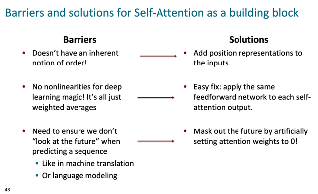</kbd></p>

> [!NOTE]
> Vậy là ta đã có solution cho 3 vấn đề chính cần khắc phục
> của `Self-Attention`

<br>

<a id="node-668"></a>

<p align="center"><kbd>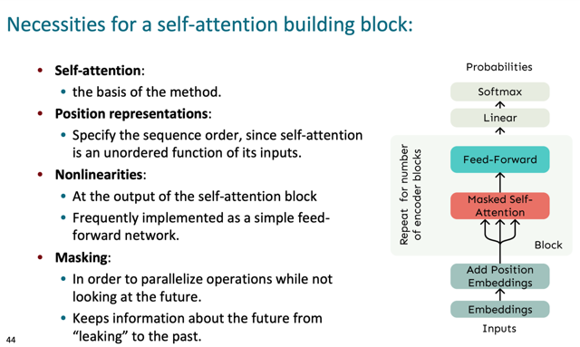</kbd></p>

> [!NOTE]
> và đây là kiến trúc điển hình: Bắt đầu với inputs, nó sẽ qua Embeddings
> layer, nơi "biến" mỗi `word/subword/character` token thành một embedding
> vector. Sau đó embedding vector sẽ được bổ sung positional information
> (thông qua việc được concatenate với positional encoding để được ("
> positional" embedding)
>
> Sau đó là Masked `Self-Attention` (chú ý là mask hay không là tùy hoàn
> cảnh, yêu cầu, như Encoder thì thì không cần mask) trong đó từ "
> positional embedding" nó sẽ tạo thành ba vector query, key, value. Để
> tham gia trong quá trình `Self-Attention.`
>
> Sau đó là các FC layer với nonlinearity activation function để tính phi
> tuyến mang lại cho nn khả năng expressibility (ý nói khả năng capture
> complex pattern)
>
> Và cái khối `Self-Attention-Feed` Forward sẽ được repeat vài lần. Trước
> khi cho ra output dùng để dự đoán cái gì đó, như từ tiếp theo (language
> model), hay sentiment analysis....

<br>

<a id="node-669"></a>

<p align="center"><kbd>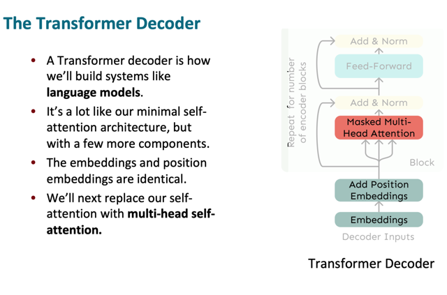</kbd></p>

> [!NOTE]
> đại ý là trong thực tế, người ta dùng một kiến trúc khác với cái vừa rồi, có
> thể nói là cải thiện hơn một chút. Cụ thể là trong kiến trúc Transformer
> dùng cho language model thì người ta dùng `Multi-Head` Attention cũng như
> là có thêm một số component.

<br>

<a id="node-670"></a>

<p align="center"><kbd>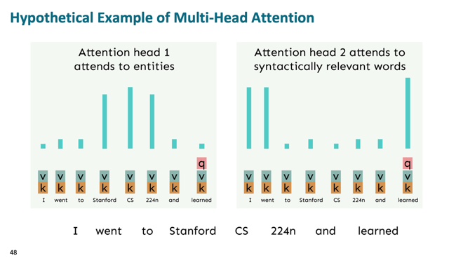</kbd></p>

> [!NOTE]
> Nói về `multi-head` attention, như đã học ở DLSpec, NLPSpec, cs231n
> hay Transformer NLP, ta biết rằng mục đích của việc chia ra nhiều  "
> head" là để "khuyến khích" mô hình trong quá trình Attention, nó sẽ
> khám phá nhiều khía cạnh khác nhau thay vì chỉ một. Từ đó, đại khái là
> tạo ra một kết qủa tốt hơn, khi một từ được biểu diễn bởi vector  có sự
> phản ánh tốt hơn bối cảnh của nó ở nhiều khía cạnh đa dạng.
>
> Nói về các khía cạnh, thì cũng như trong DLSpec, Andrew Ng dùng ví
> dụ " Jane visit African last year.". Khi ta (là con người với trí thông minh
> sinh học) xem xét câu này, thì ta có thể quan tâm nhiều khía cạnh khác
> nhau (aspect). Ví dụ nếu quan tâm khía cạnh "sự việc xảy ra ở đâu" thì
> sự chú ý sẽ dồn vào từ Africa, nhưng nếu quan tâm khía cạnh "sự việc
> gì đã xảy ra" thì sự chú ý là từ "Jane", "visit".
>
> Tức là, nhưng mình có thể hình dung trong một câu nói, có rất nhiều
> khía cạnh ngữ nghĩa khác nhau và tùy vào khía cạnh gì mà từ nào là
> quan trọng.
>
> Vậy thì `multi-head` attention chính là cách chúng ta bố trí để cho phép
> mô hình khám phá các khía cạnh khác nhau này, từ đó nó tạo ra được,
> học ra được các representation của một từ cho sao chứa đựng thông
> tin ngữ cảnh xung quanh của nó ở rất nhiều khía cạnh ngữ nghĩa phức
> tạp.
>
> Từ đó giúp tăng hiệu quả của các module sau, khi dùng các contextual
> embedding này trong việc dự đoán

> [!NOTE]
> Thế thì có một câu hỏi bạn học đặt ra, là làm sao có thể chắc rằng
> các "head" khác nhau sẽ học ra `/` khám phá ra những khía cạnh khác
> nhau? Câu trả lời của gv là: Đúng vậy, ta không chắc chắn điều đó,
> Nhưng ta hi vọng với cách thiết kế này, mô hình sẽ làm vậy, hoặc ít
> nhất, nó cũng được cho phép `/` tạo điều kiện.
>
> Mình có thể hiểu rằng, `multi-head` attention cũng giống như việc ta cho
> mô hình thêm tính linh hoạt (flexibility) để nó, trong quá trình training, 
> khi cố gắng giảm loss, nó phải làm mọi cách để đạt được nhiệm vụ
> thì khi đó, nó sẽ khám phá ra các khía cạnh ngữ nghĩa khác nhau.

<br>

<a id="node-671"></a>

<p align="center"><kbd>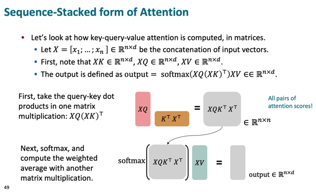</kbd></p>

> [!NOTE]
> đến đây đại khái là nói về việc thực hiện bước Attention sao cho hiệu quả, tức
> là vectorization, để "làm" cùng lúc cho mọi `time-step.`
>
> X là matrix (n, d) mỗi hàng là d dimension vector "của" một từ, ví dụ như cái
> positional embedding trong chuỗi n từ.
>
> Thế thì như đã biết mỗi một từ, ta sẽ tạo ra 3 `d-dimensional` vector query, key,
> value q,k,v bằng cách dùng ba matrix Q,K,V đều có shape (d, d).
>
> Vậy quá trình tạo này sẽ làm "một phát một" cho toàn bộ n từ bằng phép nhân
> matrix giữa X và Q,K,V. Để XQ là matrix (n,d) các hàng là các query vector của
> các từ. XK là matrix (n,d) chứa các hàng là các key vector và XV là matrix (n,d)
> có các hàng là các value vector.
>
> Tiếp, sau khi có các q,k,v. Như đã biết, ta sẽ tính attention score giữa một từ
> với mọi từ, và attention score trong Transformer dùng Scaled Dot Product. (ở
> đây người ta chưa nói đến vụ scale.)
>
> Có nghĩa là với mỗi từ, ví dụ từ thứ i, ta sẽ tính ra một vector có n chỉ số
> attention score của từ đó với mọi từ khác, phần tứ thứ j tính bằng dot product
> giữa query vector của từ thứ i `q_i` với value vector của từ thứ j `k_j.`
>
> Và việc tính toán ra attention scores cho mọi từ cùng một lúc được thực hiện
> bằng cách lấy "query" matrix XQ, nhân với "key matrix" XK transposed:
> XQ(XK).T `=` XQ(K.T)(X.T) để được matrix (n,n) `-` mỗi hàng là attention scores
> vector của một từ với mọi từ khác.
>
> *Như đã nói ở trên đúng ra thì tới đây ta sẽ chia cái cục này cho d để "scale
> xuống"
>
> Tiếp theo ta sẽ apply softmax cho matrix này để normalized, chuyển  attention
> scores thành attention weights (vẫn shape n,n)
>
> Cuối cùng, nếu xét từng từ, thì ta sẽ dùng attention weight véctơ của nó để làm
> coefficient trong việc tính một linear combination của mọi value vector. Thì làm
> cùng lúc cho mọi từ thì chính là lấy attention weight matrix ở trên `-`
> softmax[XQ(K.T)(X.T)] (shape n,n) đem nhân với "value" matrix XV (shape n,d)
>
> Kết qủa softmax[XQ(K.T)(X.T)]@(XV) là matrix (n,d) mà mỗi hàng là
> `d-dimensional` contextual embedding vector cho mỗi từ.

<br>

<a id="node-672"></a>

<p align="center"><kbd>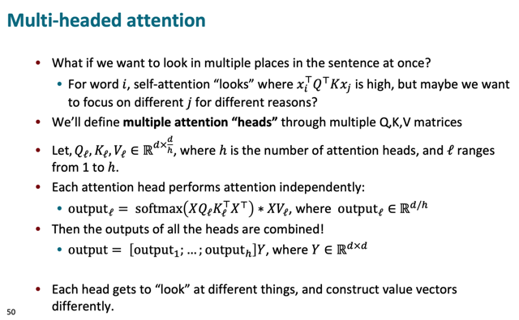</kbd></p>

> [!NOTE]
> Vậy với `Multi-Head` attention, thì quá trình cũng chỉ thay đổi một chút
>
> Đại khái là thay vì tính attention score của từ thứ i `(w_i)` với từ j `(w_j)` bằng
> ```text
> cách tính dot product của query q_i (= Qx_i)  và key k_j (=Kx_j)
> ```
>
> ```text
> q_i.T@k_i = (Qx_i).T@Kx_j = (x_i).T(Q.T)Kx_j
> ```
>
> tất nhiên là ra một scalar, để rồi nó lớn, dẫn đến attention weight lớn thì vector
> value của từ j sẽ tham gia nhiều trong linear combination tính ra outer
> contextual vector của từ `w_i,` mang ý nghĩa là ta sẽ chú ý nhiều đến `w_j` khi
> đưa thông tin bối cảnh cập nhật vào embedding vector của `w_i`
>
> Tuy nhiên, như đã nói, như thế thì chỉ có một khía cạnh, lỡ may có khía cạnh
> khác trong bối cảnh mà ở đó ta nên chú ý nhiều hơn tới từ khác thì sao, đó là
> mục đích của `multi-head` attention như đã nói.
>
> Vậy, cách làm là thay vì dùng MỘT bộ matrix Q,K,V (shape d,d) để tạo query
> key và value vector cho mỗi từ, thì ta sẽ dùng NHIỀU BỘ, mỗi bộ ứng với một
> head. Kí hiệu là (Ql,Kl,Vl) l từ 1 tới h (h là số head)
>
> Và rồi mọi chuyện cũng y chang như vậy, mỗi bộ (head) sẽ giúp tính ra
> contextual embedding vector cho một từ THEO MỘT KHÍA CẠNH (ASPECT)
> KHÁC NHAU.
>
> Thế thì dễ hiểu là ta sẽ làm gì với chúng, khi ta có tới h contextual vector cho
> mỗi từ. Câu trả lời là ta concatenate lại.
>
> Và vì mình không muốn vector đang có d dimension, thành ra d*h dimension,
> nên mỗi matrix Ql,Kl, Vl sẽ có shape `(d,d/h)` thay vì (d,d). Để rồi mỗi contextual
> vector của mỗi head sẽ chỉ có chiều dài là `d/h.` Giúp khi concatenate h cái như
> vậy lại thì ta có lại `d-dimensional` vector.

<br>

<a id="node-673"></a>

<p align="center"><kbd>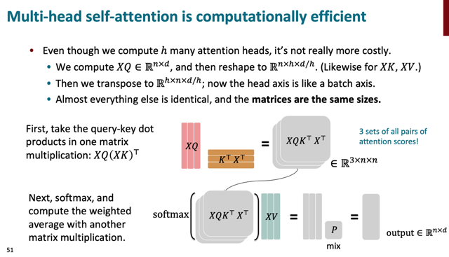</kbd></p>

> [!NOTE]
> Thế thì lí thuyết là vậy còn thực ra khi làm ta sẽ thấy việc chia ra thành nhiều
> head rất đơn giản chỉ là thông qua việc reshape các tensor.
>
> Cụ thể là tuy nói rằng thay vì chỉ có một bộ Q,K,V thì ta sẽ có h bộ Ql,Kl, Vl thì
> việc này sẽ thật ra là dùng reshape, để "làm", chứ vẫn chỉ là một bộ Q, K,V
>
> Đầu tiên ta tính Query matrix XQ shape (n,d). Và reshape nó thành `(n,h,d/h)` và
> tranpose đưa h lên trước để thành `(h,n,d/h).`
>
> ```text
> Tương tự, với Key matrix XK (n,d) -reshape-> (n,h,d/h) -transpose-> (h,n, d/h)
> ```
>
> Tới đây khi tính attention score XQ@(XK).T thì với XK ta transpose dimen 1,2
> thành 2,1 để từ `(h,n,d/h)` thành `(h,d/h,n)`
>
> Và để tính XQ@(XK).T thì sẽ có shape là `(h,n,d/h)` @  `(h,d/h,n)` `=` (h,n,n), có
> nghĩa lúc này h đóng vai trò như batch dimension vậy.
>
> Kết qủa (h,n,n) mang ý nghĩa là ta đã có h matrix attention score (n,n), mỗi cái
> ứng với một head `/`  một khía cạnh `/` aspect khác nhau.
>
> Kế tiếp, apply softmax để chuyển thành attention weight như bình thường đương
> nhiên ta cũng được tensor (h,n,n)
>
> Tới đây, ta sẽ nhân với Value (cũng đã reshape, transpose thành `(h,n,d/h):`
>
> ```text
> (Attention weight)@Key = (h,n,n)@(h,n,d/h) = (h,n,d/h) mang ý nghĩa là, với mỗi
> ```
> head, ta được một matrix (n, `d/h):` n hàng, ứng với n từ, mỗi hàng là contextual
> vector đã phản ánh thông tin bối cảnh của các từ khác ở một (trong h) khía cạnh.
> Và mỗi contextual vector chỉ dài có `d/h.`
>
> Ta sẽ concatenate chúng lại để tạo `d-dimension` vector như bình thường, thì việc
> này đơn giản cũng chỉ bằng cách: Transpose tensor từ `(h,n,d/h)` thành `(n,h,d/h)` ,
> sau đó reshape từ `(n,h,d/h)` thành (n,d) là xonh\

<br>

<a id="node-674"></a>

<p align="center"><kbd>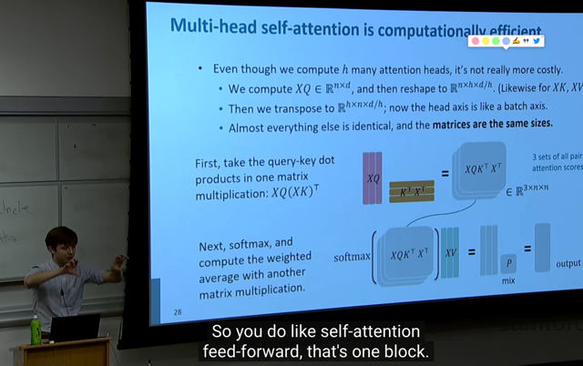</kbd></p>

> [!NOTE]
> 1.Câu hỏi là, như ta nói, sẽ có nhiều block [bao gồm Self Attention `+` Feed
> Forward layers]. Vậy thì các block này có share chung parameter với
> nhau không?
>
> Không, thường là chúng có params riêng biệt
>
> 2.Các block có cần khác nhau hay giống nhau về số head không?
>
> Không, anh ấy cho rằng chưa thấy có lí do gì để cho số head mỗi block
> mỗi khác nhưng không ai cấm chuyện đó, ta có thể thử
>
> Nói thêm rằng, thông thường, người ta hay làm là kiểu như đảm bảo một 
> kích thước tối thiểu nào đó cho véctơ của mỗi head, tức là gía trị của `d/h.`
> Ví dụ như ta muốn ít nhất là 64, vậy thì nếu d `-` kích thước của embedding
> vector là 128, thì ta sẽ chỉ có 2 head, nhưng nếu chọn vector 256, thì ta sẽ
> có 4 head.

<br>

<a id="node-675"></a>

<p align="center"><kbd>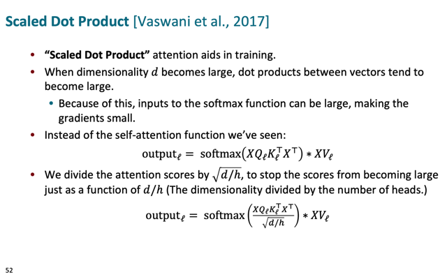</kbd></p>

> [!NOTE]
> đại khái là, công thức attention trên có một vấn đề ở chỗ nếu kích thước của
> hai vector càng lớn thì dot product của hai vector ngẫu nhiên sẽ ra giá trị ngày
> càng lớn. Có nghĩa là, dù hai vector ngẫu nhiên, nhưng nếu là hai vector "dài"
> nhân nhau sẽ ra kết quả có xu hướng lớn hơn hai vector "ngắn"
>
> Hệ quả là nếu trong mô hình ta chọn d lớn, thì khi tính attention score trong
> giai đoạn đầu của quá trình training, nơi các vector đều ngẫu nhiên (ví dụ như
> embedding vector, ngẫu nhiên do Embedding matrix cũng dc initialize ngẫu
> nhiên. Hay cách matrix Q,K,V (giúp linear transform x thành query, key, value)
> cũng được random initialized, nên các vector này cũng mang giá trị ngẫu
> nhiên lúc bắt đầu training.
>
> Vậy khi tính attention score, kết quả dù là dot product của hai vector ngẫu
> nhiên nhưng như đã nói sẽ có xu hướng `/` có thể cho ra những kết quả lớn. Từ
> đó khi qua softmax để thành probability score, ta sẽ có những output lớn. Điều
> này khiến softmax làm việc ở vùng "đuôi" (hình dung hai cái đuôi của hàm
> sigmoid) nên gradient của nó trong lúc backprop sẽ nhỏ. Mà gradient nhỏ sẽ
> ngăn cản "sự học" của model.
>
> Do đó, người ta chia cho sqrt(model `dim=d/h)` (model dimension dùng để chỉ
> kích thước của vector dùng trong mỗi head) để đảo ngược hiệu ứng lớn dần
> của dot product khi d lớn dần. Tạo nên công thức gọi là Scaled Dot Product
> Attention

<br>

<a id="node-676"></a>

<p align="center"><kbd>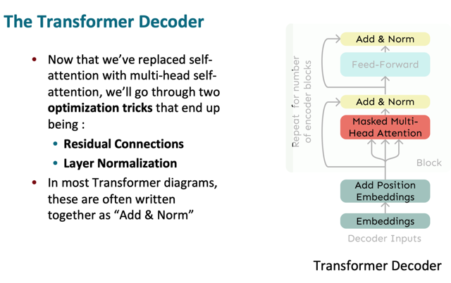</kbd></p>

> [!NOTE]
> ngoài ra, người ta còn cho thêm Residual Connections và Layer
> Normalization giúp cải thiện quá trình training

<br>

<a id="node-677"></a>

<p align="center"><kbd>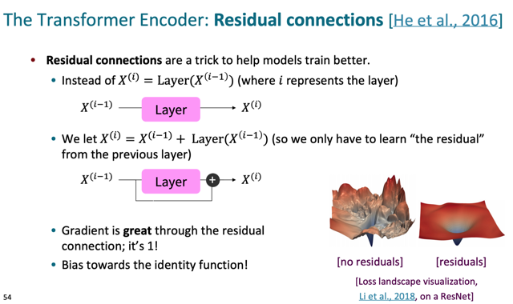</kbd></p>

> [!NOTE]
> ôn lại về Residual connections, đơn giản là ta sẽ cộng output của layer với
> input. Nhưng ý nghĩa của nó mới quan trọng:
>
> Khi đó layer về cơ bản sẽ dự đoán, tính toán ra phần dư (residual) giữa
> output và input (ví dụ như target là 10, input là 3 thì layer sẽ phải học cách
> tính toán ra kết quả là 7, thay vì thông thường là nó phải dự đoán ra 10 từ
> input là 3.
>
> Lợi ích của cái này chính là nó tạo ra một "con đường" vòng qua layer,  để
> rồi cho dù gradient đi qua layer bị vanish, thì những phần trước đó vẫn
> không bị ảnh hưởng, do gradient truyền xuống (upstream gradient) vẫn còn
> nguyên vẹn thông qua residual connection:
>
> ```text
> Ví dụ y = layer(x) + x thì dy/dx = dlayer(x)/dx + dx/dx = dlayer(x)/dx
> ```
>
> ```text
> Nên dL/dx = dL/dy*dy/dx = dL/dy*(dlayer(x)/dx + 1). Nếu trong layer xẩy ra
> ```
> ```text
> vanishing thì dlayer(x)/dx = 0 thì dL/dx = dL/dy*(0+1) = dL/dy -> tức là vẫn
> ```
> bằng upstream gradient.
>
> Và khi khởi tạo, vì như nói ở trên layer chỉ có nhiệm vụ tính ra phần dư,
> nên ban đầu nó được initialize để output của nó chỉ việc bằng 0, và cả layer
> `+` skip connection làm việc như một Identity function f(x) `=` x. Thì điều này
> khiến ban đầu gradient chỉ "flow" qua một cách rất dễ dàng không gặp vấn
> đề gì
>
> Cuối cùng giảng viên so sánh optimization landscape của có vs không có
> res connection: Trong đó nếu không có, landscape rất nhiều local minimum,
> khiến quá trình gradient descent diễn ra rất khó khăn. Đối nghịch là với skip
> connection, Cho phép gradient flow về rất liên tục ổn định giúp train model
> hiệu quả hơn, nhanh Converge hơn

<br>

<a id="node-678"></a>

<p align="center"><kbd>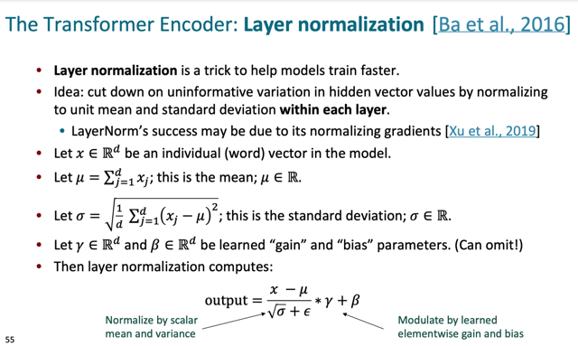</kbd></p>

> [!NOTE]
> Cuối cùng là về cái Layer normalization, thì dừng lại một chút để nhớ về Batch
> normalization, trong đó ví dụ ta có (N,D) `-` một batch gồm N vector, mỗi vector
> có D unit (ví dụ output khi pass B sample qua một FC layer có D neuron).
>
> Thì vấn đề xảy ra là, các chỉ số thống kê mean và variance của layer's output 
> trong quá trình training liên tục thay đổi, dễ dẫn đến mất ổn định, gây bất lợi 
> cho sự training. Để khắc phục, trong BatchNorm, ta sẽ normalize output bằng
> statistic tính trên mọi sample's feature vector trong batch: tính `D-dimensional`
> ```text
> vector mu trong đó mu_j = (1/N) sum i=1:N x(i)_j (tức phần tử thứ j của vector
> ```
> mu là trung bình giá trị feature thứ j của mọi vector x). 
>
> Tương tự cũng tính `D-dimensional` vector sigma_j**2 `=` `(1/N)` [x(i)_j `-` mu_j]**2
>
> ```text
> Và thực hiện batch normalization: xnorm = [(x - mu)/sqrt(sigma)] * gamma + beta
> ```
>
> Khúc đầu là normalization, khúc scale với gamma, shift với beta là cho thêm 
> model sự linh hoạt cần thiết để "học" ra distribution mà nó thấy là tốt nhất, và nếu
> nó thấy cần, có thể đảo ngược lại quá trình normalization.
>
> `===`
>
> Đó là ôn nhanh về BatchNorm, giúp ép buộc statistic của layer's output khi training 
> luôn có dạng "ưa thích" là Gaussian distribution, giúp cải thiện sự ổn định của quá
> trình training.
>
> Thế thì với Layer Norm, người ta muốn gỡ bỏ sự phụ thuộc vào việc tính statistic
> của một batch, mà thay vào đó chỉ dùng statistic của từng sample's feature. Nên
> LayerNorm chỉ khác ở chỗ, với batch các feature vector (N,D), thì thay vì tính ra 
> mỗi feature j một giá trị mean j để thành ra một vector [mu1 mu2 `...mu_D]` dùng
> cho normalizing, với mu1 tính bởi x1 của mọi x(i). Thì bây giờ, ta tính mean của
> ```text
> x(1) để có mu(1) - tức là mu(1) là [x(1)_1 + x(1)_2 + x(1)_D]/D, và có nghĩa là
> ```
> mean dùng để normalize cho x(1) sẽ chỉ là statistic của sample, không liên quan
> gì các sample khác.
>
> Để rồi x shape (N,D) nếu là batch norm thì ta dùng torch.mean(x, `dim=0),` còn
> để ra mu có shape (1,D). Thì với layer norm ta dùng torch.mean(x, `dim=1),` để ra
> mu có shape (N,1). Tương tự với sigma cũng vậy.
>
> Và quá trình làm Assignment 2 của cs231n ta đã thấy, chỉ khác chỗ đó là ta đã
> chuyển BatchNorm implementation thành LayerNorm rồi.
>
> `===`
>
> Quay lại đây, trong slide họ ghi rằng ý tưởng của Layer normalization là bỏ đi, giảm
> đi các uninformative variation trong hidden vector (hidden vector ám chỉ layer's output)
> bằng cách normalizing để nó thành unit mean và standard deviation (tức mean `=` 0, 
> và std `=` 1) và họ nhấn mạnh "within each layer" `-` có nghĩa là không có "tính chất batch"
> ở đây, mà "cái nào tự làm cái nấy".
>
> Và họ cũng nói lại cho ta cách làm, cho vector x, ta tính mean bằng trung bình các phần
> tử của nó, rồi tính std cũn tương tự. Và dùng chúng để normalize vector x, sau đó cũng
> scale và shift bởi learnable param gamma , beta (đều là `D-dimensional` vector) giúp thực
> hiện scale và shift theo lối `element-wise` `[gamma1*x1+beta1,` `gamma2*x2+beta2...]`
>
> `====`
>
> Tóm lại đây là cách giúp cải thiện quá trình training giúp nó train ổn định và nhanh hơn

<br>

<a id="node-679"></a>

<p align="center"><kbd>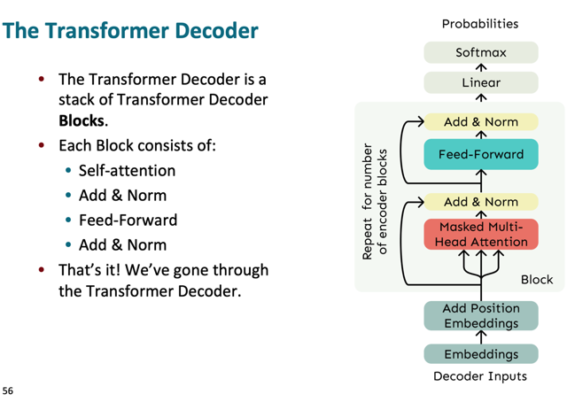</kbd></p>

<br>

<a id="node-680"></a>

<p align="center"><kbd>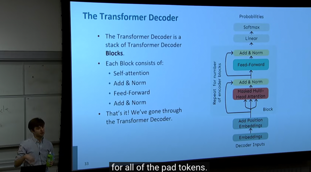</kbd></p>

> [!NOTE]
> Q&A: Câu hỏi là ta sẽ deal với việc các sequence (trong batch) có chiều dài khác
> nhau như thế nào. 
>
> `->` Ta sẽ zero pad, để mỗi sequence trong batch có length `=` length của 
> sequence dài nhất. Khi `Self-attention,` thì ta cũng sẽ có `padding-mask,` giúp
> che đi các pad token, không tính chúng trong lúc attention.
>
> Q&A: `Fead-forward` có mấy layer: 1 hidden layer.

<br>

<a id="node-681"></a>

<p align="center"><kbd>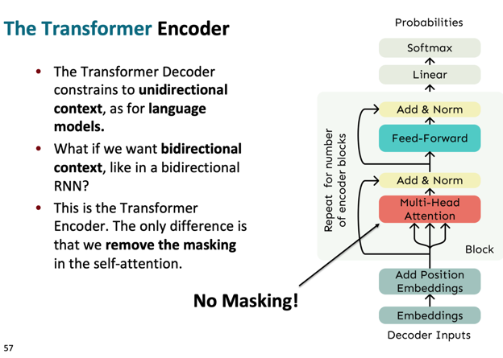</kbd></p>

> [!NOTE]
> Với Transformer Encoder thì ta sẽ không có Future Masking, để sự
> attention có thể diễn ra tự do, một từ có thể attend tới cả những từ
> sau nó, giúp phản ánh đầy đủ thông tin context của cả câu

<br>

<a id="node-682"></a>

<p align="center"><kbd>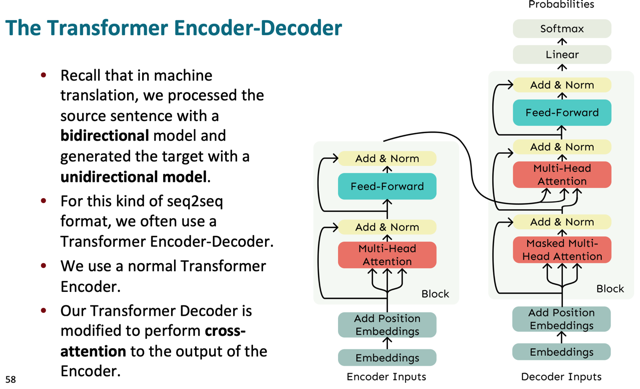</kbd></p>

> [!NOTE]
> Và kết hợp cả hai ta có mô hình này Transformer `Encoder-Decoder,`
> có thể dùng trong Machine Translation, Encoder xử lý câu gốc,
> Decoder generate câu dịch. Thì cái này sẽ có thêm một  Component
> gọi là `Cross-Attention`

<br>

<a id="node-683"></a>

<p align="center"><kbd>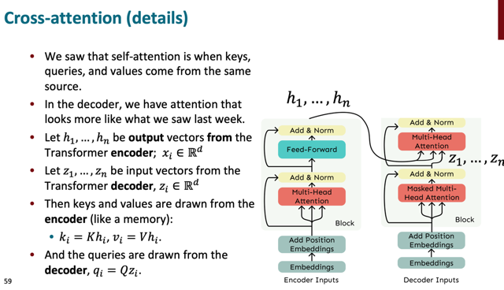</kbd></p>

> [!NOTE]
> Chỉ đơn giản là query sẽ tạo bởi các layer trước của decoder, còn key và
> value thì bởi output của encoder

<br>

<a id="node-684"></a>

<p align="center"><kbd>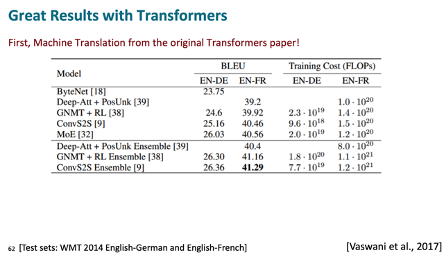</kbd></p>

> [!NOTE]
> Phần cuối anh ấy nói nhanh về hiệu quả của Transformer, đầu tiên là
> ở bài toán Machine Translation, nó tốt hơn ở cả hiệu suất và training
> cost

<br>

<a id="node-685"></a>

<p align="center"><kbd>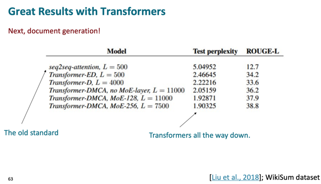</kbd></p>

> [!NOTE]
> Sau đó là bài toán text generation cũng dần dần bị chiếm lĩnh bởi
> mô hình Transformer

<br>

<a id="node-686"></a>

<p align="center"><kbd>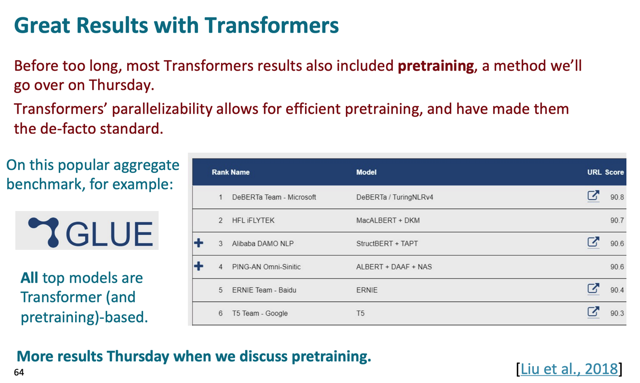</kbd></p>

> [!NOTE]
> Lecture sau sẽ là
> về pretraining

<br>

<a id="node-687"></a>

<p align="center"><kbd>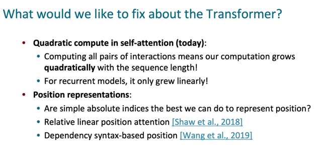</kbd></p>

> [!NOTE]
> Một số nhược điểm mà Transformer mà người ta đang nghiên cứu để khắc
> phục gồm có vấn đề quadratic compute trong cơ chế attention, khi
> sequence càng dài thì số lượng tính toán cần thiết của self attention tăng
> quadratically, đây là một bước lùi so với RNN. Vấn đề thứ hai là các cách
> thức represent position information tốt hơn

<br>

<a id="node-688"></a>

<p align="center"><kbd>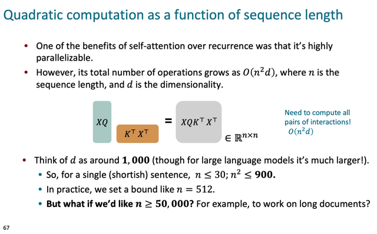</kbd></p>

> [!NOTE]
> n^2*d: mỗi một attention score là kết qủa dot product của hai `d-D` vector
> `->` có d operation. Và mỗi từ trong n từ, sẽ tính một attentions score với
> n từ khác: có n**2 lần `->` Tổng cộng là n**2d
>
> Thế thì nếu sequence mà dài, cỡ một cuốn tiểu thuyết hay một Wiki
> article 50.000 thì số lượng tính toán sẽ rất lớn

<br>

<a id="node-689"></a>

<p align="center"><kbd>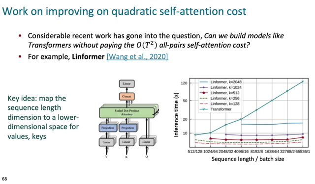</kbd></p>

> [!NOTE]
> một số nghiên cứu khắc phục
> cái này như Linformer

<br>

<a id="node-690"></a>

<p align="center"><kbd>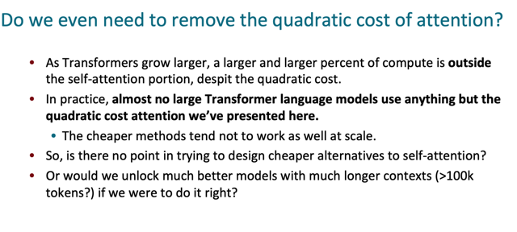</kbd></p>

<br>

<a id="node-691"></a>

<p align="center"><kbd>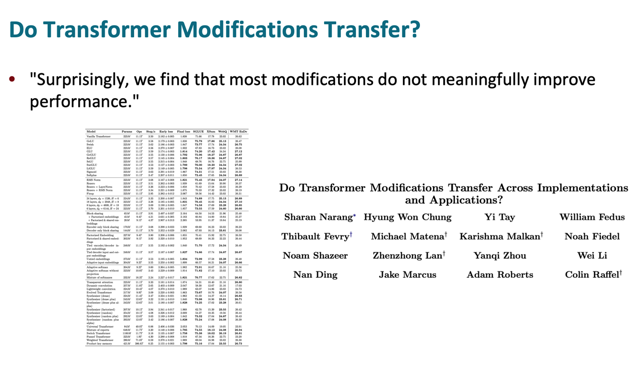</kbd></p>

<br>

