# Lecture Note 04 - Dependency Parsers

📊 **Progress:** `14` Notes | `20` Screenshots

---

<kbd>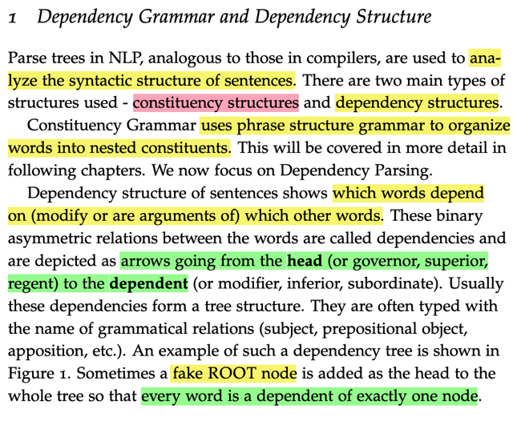</kbd>

> [!NOTE]
> đại khái là, có 2 loại chính constituency structure và dependency
> structure.
>
> Cái đầu chính là cái kiểu như đánh dấu N `+` Adj...dùng để thể hiện cấu
> trúc ngữ pháp. và người ta nói ta sẽ bàn sau ở các phần khác. Ở đây
> nhấn mạnh cái sau. Tức là cái kiểu phân tích trong đó ta vẽ ra từ nào sẽ
> phụ thuộc `/.` bổ nghĩa cho từ nào.
>
> Sẽ có dạng mũi tên vẽ từ head đến dependent hoặc ngược lại (có nghĩa
> là có hai cách vẽ). Chúng thường được đính kèm tên của quan hệ ngữ
> pháp.
>
> Thỉnh thoảng một fake ROOT node được thêm vào để cho mọi từ đều
> depend ít nhất là một từ.

 

<kbd>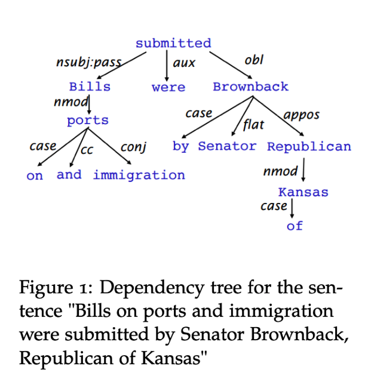</kbd>

 

<kbd>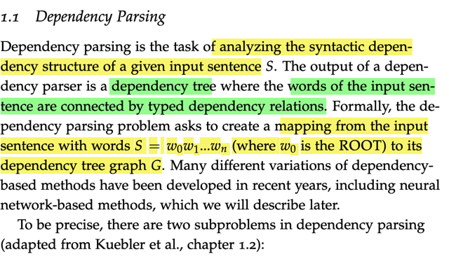</kbd>

> [!NOTE]
> đại khái dependency parsing là nhiệm vụ phân tích cấu trúc phụ thuộc về
> mặt ngữ nghĩa của các từ trong một câu. Output của bài toán này sẽ là
> một dependency tree, trong đó các từ của câu input được nối với nhau bởi
> các loại quan hệ khác nhau.
>
> Một cách khác, bài toán này sẽ muốn map một câu đầu vào với một
> dependency tree graph G.
>
> Cuối cùng có nhiều biến thể của phương pháp dependency parsing, bao
> gồm neural net mà ta sẽ nói ở phần sau.

 

<kbd>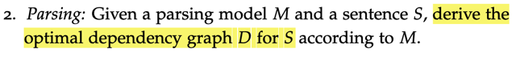</kbd>

<kbd></kbd>

<kbd>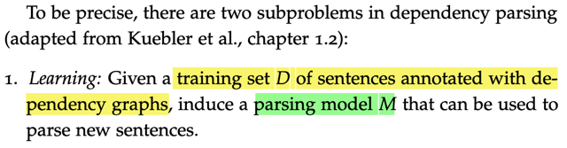</kbd>

> [!NOTE]
> hai 'bước' của **dependency parsing**.
>
> Một là bước '**learning**': Given a training set, ta sẽ huấn luyện mộ "parsing 
> model". 
>
> '**Parsing**': Bước này ta sẽ dùng parsing model, để parsing input sentence
> thành ra **dependency graph tối ưu**

 

<kbd>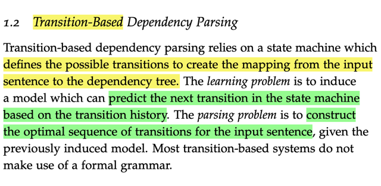</kbd>

> [!NOTE]
> Đại ý là technique **transition-based dependency parsing**,****sẽ dựa trên
> một **state-machine,**nó sẽ làm nhiệm vụ tạo ra một mapping giữa **input
> sentence** và một **dependency tree.**Ở đây nói về vấn đề học tập (the learning problem), có thể hiểu là ta sẽ
> huấn luyện một model có thể **dự đoán bước chuyển đổi `/` biến đổi
> transition kế tiếp** dựa trên transition history. Và the parsing problem, có
> thể hiểu là bước xây dựng một chuỗi các transition tối ưu đối với một input
> sentence nhờ state model đã được huấn luyện (induced model).

> [!NOTE]
> Một ý cuối đó là phần lớn các `transition-based` systems không sử dụng
> formal Language. Chưa rõ ý này lắm.

 

<kbd>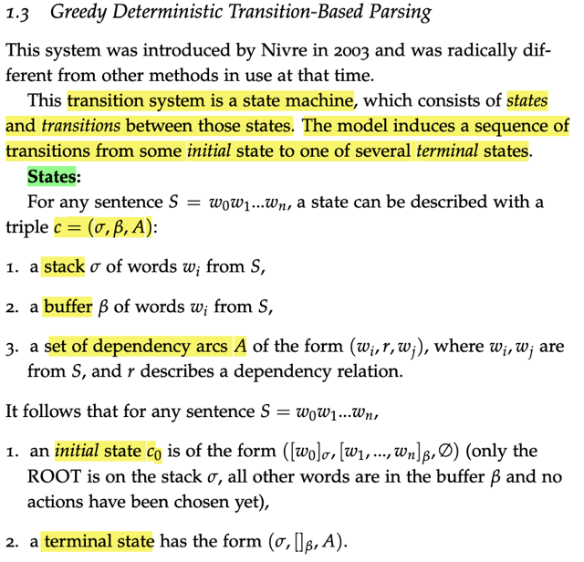</kbd>

> [!NOTE]
> Ở đây mô tả Greedy Deterministic `Transition-Based` Parsing
>
> Thì hệ thống này, thuộc loại **state machine**, tức là nó sẽ bao gồm
> 'states' (tạm hiểu là trạng thái) và 'transitions' (bước chuyển đổi)
>
> Thế thì model sẽ thực hiện một **chuỗi các transition** để **biến trạng
> thái ban đầu (initial state)** thành**trạng thái kết thúc (terminal states)**States: Với một câu input S `=` w0w1...wn, state sẽ được định nghĩa bởi
> một triple c `=` (sigma, beta, A). Trong đó: 
>
> sigma: là một stack các từ, lấy từ S.****beta: là buffer các từ cũng lấy từ S****và A là một set các dependency arcs có dạng một triple **(wi, r, wj)** trong đó 
> wi, wj là từ S, **r sẽ mô tả quan hệ phụ thuộc.**
>
> `======`
>
> Thế thì trạng thái ban đầu `-` initial state sẽ có dạng ([w0], [w1,w2..wn], empty)
> để chỉ việc stack ban đầu chỉ có w0 là ROOT, buffer beta có mọi từ trong S,
> và A rỗng vì chưa ghi nhận dependency relation nào.
>
> Sau chuỗi các bước chuyển đổi transition thì terminal state sẽ có dạng:
> (stack, buffer beta rỗng, dependency arc set A) `-` nói chung là đến khi buffer trống

 

<kbd>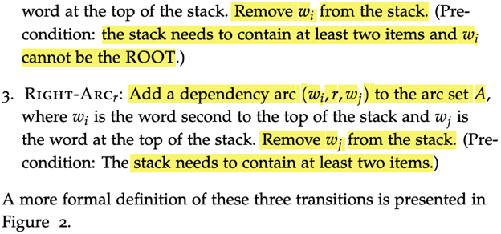</kbd>

<kbd></kbd>

<kbd>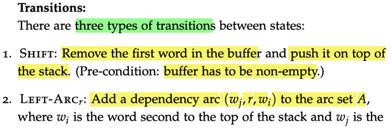</kbd>

> [!NOTE]
> về transitions thì có 3 loại:
>
> 1. Shift: là việc nếu buffer còn từ, thì ta lấy từ đầu tiên trong buffer đem bỏ
> vào stack.
>
> 2. `Left-Arc:` Nếu stack có 2 từ trở lên và từ đầu tiên khác ROOT thì ta sẽ
> add vào dependency set A một **left** **dependency arc**(wi, r, wj) trong đó
> wj là từ trên cùng, wi là từ thứ nhì trên cùng trong stack. (nếu một list đóng 
> vai stack thì từ top là cái cuối cùng của list)
>
> Left là bởi từ wi vốn đứng bên trái wj trong câu gốc, và wj sẽ depend vào wi
> Sau đó ta bỏ wi ra khỏi stack.
>
> 3. `Right-Arc:` Nếu stack có 2 từ trở lên và từ đầu tiên khác ROOT thì ta tạo
> trong dependency set A một **right dependency arc** (wj, r, wi), và bỏ wj ra khỏi 
> stack. Như vậy ta sẽ bỏ cái từ top của stack (wj) ra

 

<kbd>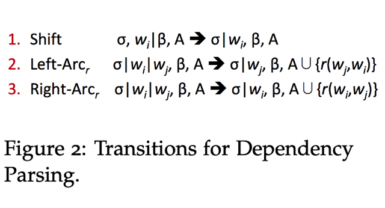</kbd>

> [!NOTE]
> Shift thì đơn giản, chỉ là lấy từ đầu tiên trong buffer (làm việc theo
> Quy cách từ top từ đầu tiên trong, nên trong code (là python list đóng
> vai buffer) thì ta gọi buffer.pop(). Thêm từ này vào stack thì chỉ việc
> stack.append() vì append() sẽ thêm item vào cuối của Python list (cái
> list đóng vai trò stack) sẽ đúng với quy cách của stack là từ trên cùng
> sẽ là cái từ cuối trong list.
>
> Left arc: remove wi, là cái từ thứ nhì từ trên xuống trong stack, vì
> nếu một list đóng vai trò stack tính từ trên cùng của stack (top) là
> cái từ cuối trong list. Như vậy trong code ta sẽ dùng **stack.pop(-2)**
>
> Và ghi nhận quan hệ wj `->` wi, ghi là r(wj, wi)
> Hay cụ thể thêm vào trong dependency arc A một tuple **(wj, r, wi)** 
> với r là gì thì do tên quan hệ là gì.
>
> Right arc: remove wj, là cái trên cùng trong stack, trong code ta sẽ
> gọi **stack.pop(-1)**. Ghi nhận một quan hệ wi `->` wj, hay r(wi,wj) 
> Thêm vào trong dependency arc A một tuple **(wi, r, wj)**

 

<kbd>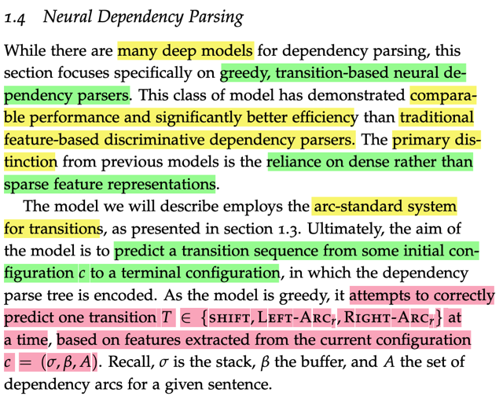</kbd>

> [!NOTE]
> đại ý là có nhiều model deep learning cho mục đích dependency 
> parsing. Ở đây ta tập trung vào cái gọi là 'greedy, `transition-based`
> neural dependency parser'. 
>
> Loại này đã cho thấy hiệu suất tốt hơn cách tiếp cận truyền thống
> trong đó dựa trên `feature-based` (tạm hiểu là giống như feature 
> engineering) discriminative dependency parser. Khác biệt quan trọng
> nhất chính là nó hoạt động dựa trên dense thay vì spare feature 
> representation. Có thể hiểu là các feature sẽ được 'learn' từ quá trình
> training deep learning model thay vì được tạo ra theo kiểu feature
> engineering với `one-hot` `/` `many-hot` vector.
>
> Model sẽ dự đoán một chuỗi các transition T thuộc một trong ba loại là
> {SHIFT, `LEFT-ARC,` `RIGHT-ARC}` như mô tả ở phần trước để đi từ 
> initial state tới terminal state dựa trên feature được extracted từ trạng
> thái hiện tại current configuration c

 

<kbd>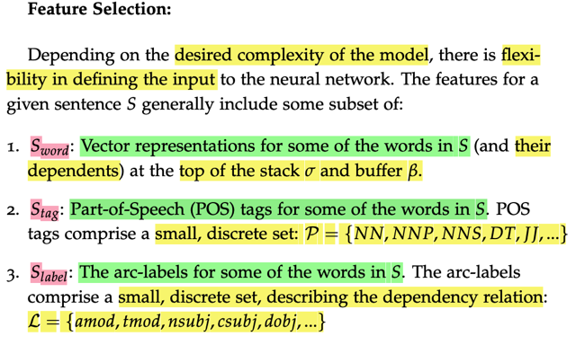</kbd>

> [!NOTE]
> có thể hiểu đại ý là**tùy theo mức phức tạp mong muốn** của model
> mà ta sẽ **có những cách define input cho neural net** khác nhau.
> Thông thường,**representation của input sentence S sẽ bao gồm
> Sword, Stag và Slabel**, có thể **hiểu nôm na là 3 vector đại diện cho
> biểu diễn cho input sentence S ở 3 vấn đề**.
>
> 1. là từ vựng, nó biễu diễn thông tin rằng trong câu S có những từ
> gì, cũng như những từ nào phụ thuộc vào nó
>
> 2. Pos của chúng là gì, thì POS là tập rời rác các giá trị như {NN, NNP,
> ....}
>
> 3. `Arc-labels` của vào từ trong S. `Arc-labels` là tập rời rạc các giá trị mô tả
> loại quan hệ L `=` {amod, tmod, ....}

 

<kbd>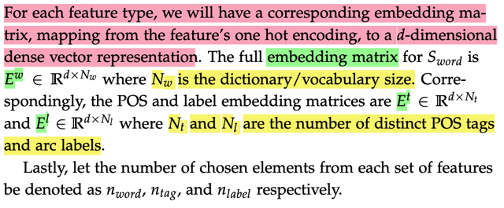</kbd>

> [!NOTE]
> Rồi đoạn này đại ý là, với mỗi loại feature ở trên (word, tag, label) thì ta sẽ
> có một embedding matrix. Giúp map giữa một one hot encoding với một
> dense `d-dimensional` embedding vector.
>
> Ew là matrix (d, Nw), với Nw là vocab size. Có thể hiểu nhờ matrix này, ta
> "đưa vào" một index, hay `one-hot` encoding để từ đó 'lấy ra' một dense vector.
> Đại diện cho input, có thể hiểu cái từ  NLPSpec, embedding matrix, cơ bản là
> mỗi một cột là embedding của một từ. Lấy cột nào đó ra bởi index thì cũng
> tương đương nhân embedding matrix cho `one-hot` encoding vector tương ứng
> với index đó.
>
> Tương tự với Et, El cũng vậy. Với Et shape (dxNt) thì mỗi cột là embedding 
> represent cho một POS tag. El (dxNl) thì mỗi cột là embedding represent 
> cho một arc label.
>
> Nói chung là từ ba matrix này, ta sẽ nhờ đó mà trích xuất ra 3 dense vector
> đại diện cho 3 khía cạnh thông tin của một state hiện tại là word, pos, arc label
>
> `====`
>
> Khúc cuối, gọi `n_word,` `n_tag,` `n_label` là số element được chọn từ mỗi sét
> features (chưa hiểu lắm)

 

<kbd>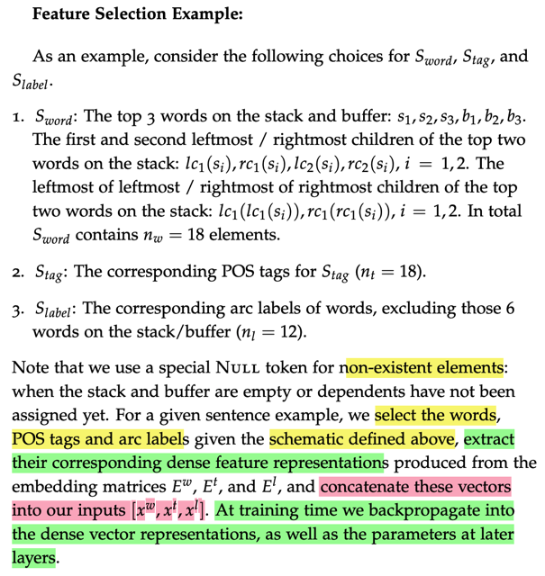</kbd>

> [!NOTE]
> có thể hiểu đại khái là, ta sẽ chọn làm việc với 3 từ đầu tiên trong
> stack và buffer. (3 là sự lựa chọn, giống như `hyper-parameter` vậy)
> để rồi, với các từ đó, ta sẽ xét các từ CON bên trái và bên phải gần
> nhất của mỗi từ kí hiệu là lc1(si), lc2(si) `(=` `left-most` children gần nhất
> và gần nhì) và rc1(si) `(=right-most` children gần nhất và gần nhì)
>
> Ví dụ tính cho s1: 
>
> lc1(s1), lc2(s1), rc1(s1), rc2(s1): 4 từ
>
> Và tiếp tục mỗi từ children gần nhất ta sẽ tính từ children của chúng.
>
> Tính cho các children của s1 (chú ý chỉ tính cho lc1 và rc1 của s1)
>
> lc1(lc1(s1)), rc1(lc1(s1)): 2 từ
>
> Vậy với 2 từ s1, s2 thì ta có 6x2 `=` 12 từ. (có thể hiểu vì sao chỉ `i=1,2` là vì
> không tính cái từ đầu tiên vì nó là ROOT. Cộng với 6 `=` `3+3` từ s1,s2,s3
> b1,b2,b3 nữa là ta có 18 từ
>
> Children ở đây là cái từ phụ thuộc (dependent) vào nó.
>
> Tất cả những từ đó tạo thành bộ Sword chứa 18 elements.
>
> `====`
>
> Thế rồi, ta sẽ xác định POS tag của chúng thành ra Stag cũng có 18 
> element.
>
> Và Slabel thì chỉ 'làm' với các từ children thôi, nên là 12 từ.
>
> Và cuối cùng, dựa vào embedding matrix, ta extract embedding vector
> của mỗi `từ/tag/label.` Để rồi concatenate lại thành ra input vector.
>
> Quá trình training, backprop để thay đổi các embedding vector cũng như
> là các layer's parameters

 

<kbd>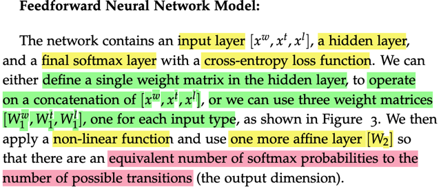</kbd>

> [!NOTE]
> đại khái là ta sẽ train một `feed-forward` nn, với input layer có nhiệm vụ chuyển
> [xw, xt, xl] (nối các vector này lại thành một vector lớn) thành một dense
> vector
>
> Thì đại khái là người ta nói có thể dùng một cái matrix bự tạo thành bởi việc
> concatenate 3 matrix Ww, Wt, Wl để mà operate với nguyên cái embedding 
> vector input [xw, xt, xl] hoặc làm mỗi cái mỗi riêng rồi concat. 
> Cũng như nhau cả
>
> Sau đó, qua một hidden layer (affine) với nonlinearity trước khi output  với
> một affine layer khác để ra số class `=` số loại transition với softmax.
>
> `===`
>
> Như vậy, ta có thể hiểu là input layer rất giống cái vụ từ `one-hot` vector đại
> diện cho một từ, qua một embedding layer để có được cái dense embedding
> vector. Thì đây cũng vậy, input là các `one-hot` encoding, để qua embedding ta
> có dense embedding. Và quá trình training sẽ train cả layer param như
> hidden layer và output layer param, và train cả embedding matrix đồng nghĩa
> nó sẽ học cách chuyển input thành ra embedding

 

<kbd>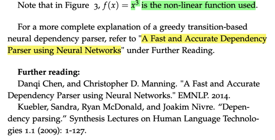</kbd>

<kbd></kbd>

<kbd>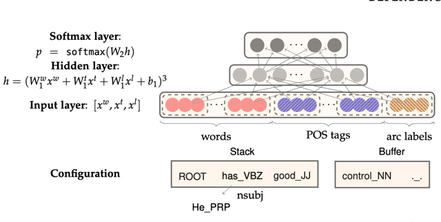</kbd>

> [!NOTE]
> Hình ảnh cho thấy từ configuration, mô tả trạng thái hiện tại (của stack, buffer,
> A) dưới dạng `one-hot` encoding. Thông qua embedding matrices, ta có dense
> embedding: [xw, xt, xl] đưa vào nn (đóng vai input layer)
>
> Sau đó là hidden layer sẽ transform embedding vector này  rồi apply
> `non-linearity,` ở đây là lũy thừa 3
>
> h `=` [W(w)1x(w) `+` W(t)1x(t) `+` W(l)1x(l) `+` b1]**^3**
>
> kết quả mới một linear transformation với W2 nữa, để giảm  dimension xuống
> còn 3 (3 loại transition) trước khi apply softmax để chuyển thành probabilities
> distribution.

 

