# Lecture Note: Glove, Evaluation & Training

📊 **Progress:** `25` Notes | `38` Screenshots

---
<a id="node-142"></a>

<p align="center"><kbd>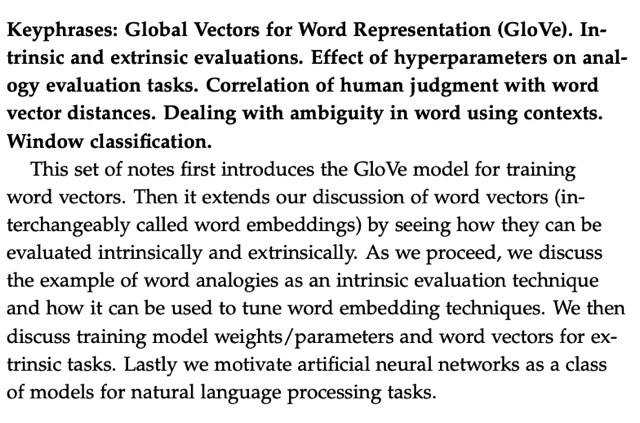</kbd></p>

<br>

<a id="node-143"></a>

<p align="center"><kbd>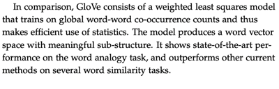</kbd></p>

<p align="center"><kbd></kbd></p>

<p align="center"><kbd>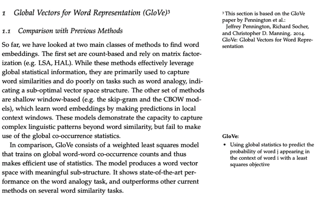</kbd></p>

> [!NOTE]
> Đại khái là các word vector tạo bởi các mode**l dựa trên các thông số thống kê
> statistic như LSA, HAL làm tốt trên các task thể hiện được  độ giống nhau giữa
> các từ nhưng lại không làm tốt được các task về word analogy.**
>
> Ngược lại các model như CBOW, SkipGram c**ó thể làm tốt trong việc tạo các
> word vector phản ánh được các semantic meaning** của từ vựng thì lại **không
> tận dụng được các chỉ số thống kê như `co-occurence` matrix**.
>
> Thì **GloVe model kết hợp cả hai** giúp khắc phục được nhược điểm của các
> model trên.

<br>

<a id="node-144"></a>

<p align="center"><kbd>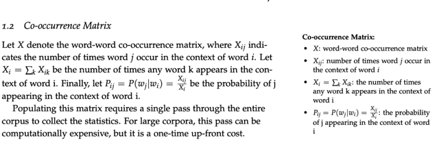</kbd></p>

> [!NOTE]
> Đại khái là nói về việc **tạo `co-occurence` matrix X**trong đó **Xij là số
> lần xuất hiện của từ wj bên cạnh (gần) từ wi**
>
> Và nếu mình tính **tổng hàng i của X**, để rồi **chia các giá trị trong hàng
> i của X cho tổng Xi** này ta sẽ có c**ác chỉ số tổng `=` 1**, mang hình hài
> là **xác suất của các từ trong V xuất hiện bên cạnh từ w_i.**
>
> Thì đây là **xác suất tính theo statistic**, khác với **xác suất do model 
> train `/` learn được.**
>
> thì nôm na với cách tạo c.o matrix này thì vớ**i bộ dữ liệu lớn sẽ rất tốn
> kém nhưng nó chỉ phải làm lần đầu thôi**

<br>

<a id="node-145"></a>

<p align="center"><kbd>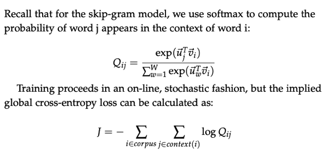</kbd></p>

> [!NOTE]
> Diễn giải loss function J sẽ là: (Âm) Tổng: Với**mỗi từ thứ i** trong
> corpus, và **với mỗi từ j trong cùng context với thứ i**, ta tính **log
> Qij** và tổng lại hết. Và tổng lại hết với mọi i. Q là xác suất có điều
> kiện `Q(w_i` | `w_j)` (ở đây dùng chữ Q vì đặng tí nữa ý nói ta sẽ thu
> hẹp khác biệt giữa hai phân phối xác suất P,Q)

<br>

<a id="node-146"></a>

<p align="center"><kbd>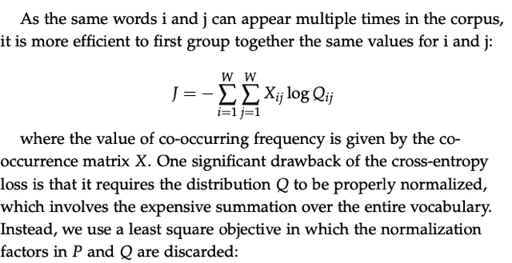</kbd></p>

> [!NOTE]
> Thế thì đại khái là với việc các **cặp từ i, j cùng xuất hiện với nhau** trong cùng
> context **ở nhiều chỗ trong corpus**, nên ta **lấy tổng** số lần chúng xuất hiện cùng
> nhau từ C.O matrix **Xij** **nhân với logOij** (và tổng với mọi từ) thì cũng chính là J.
>
> Hiểu nôm na là trong công thức trước là tính TỔNG, 1 lần xuất hiện cùng nhau
> ở đây (nhân với logQij), cộng 1 lần nữa xuất hiện cùng nhau ở kia (nhân với
> logOij), thì cơ bản chính là lấy 2 lần xuất hiện cùng nhau (từ C. O matrix) (nhân
> với logOij)
>
> Thế thì nhắc lại cái như đã biết, để tính Qij theo công thức softmax thì ta phải
> tính "với mọi từ trong vocab `-` phép uw.vc" rất tốn kém. Nên người ta nghĩ ra kiểu
> khác.

<br>

<a id="node-147"></a>

<p align="center"><kbd>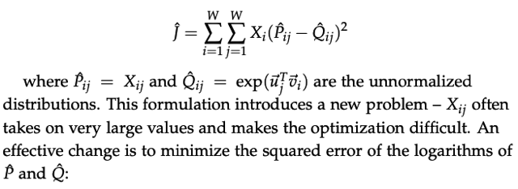</kbd></p>

> [!NOTE]
> Đại khái người ta nảy ra ý tưởng đó là "ta sẽ giảm loss, sao cho ta sẽ
> **giảm cách biệt giữa phân phối xác suất thật** (mà hai từ i, j xuất hiện
> cùng lúc) và **phân phối xác suất đang tính bởi các word vector từ U và V**
>
> Nói đúng hơn là **ước lượng phân phối xác suất thật** (nên người ta mới
> để **P^ij**, vì ta **không thể có xác suất thật mà chỉ có thể ước lượng** dựa vào
> **chỉ số statistic từ C.O matrix (P^ij `=` Xij)**. 
>
> Và **Qij** bây giờ **cũng thành "ước lượng" luôn** Q^ij ta **chỉ dùng cái "vế" tử số
> trong công thức là exp(uj.ui)**, bỏ cái mẫu số đi, trên**tinh thần là "ước lượng" 
> vì để xác suất nó cao thì tử số cũng phải cao**. Còn **mẫu số tạm thời không care**
>
> Và để gọi là**penalize error** thì người ta b**ình phương sai khác giữa P^ij
> và Qij**lên giống như MSE vậy. Nên gọi là **least square**
>
> Và **Xi** (tổng các gía trị của hàng i trong X) được hiểu nôm na họ muốn
> dùng nó làm**trọng số "weighted" cho từ i**. Kiểu như là **"từ nào mà có chỉ
> số này lớn tức là từ đó sẽ có tình trạng có nhiều từ vây quanh hơn**, **"nhiều
> bạn hơn" thì tập trung (khi giảm loss) nhấn mạnh vào các từ này hơn.**
>
> Ví dụ như có từ A và từ B, trong đó A thì có nhiều bạn, số từ hay xuất hiện 
> cùng nó thì cũng có nghĩa là từ A phổ biến trong ngôn ngữ hơn là một từ
> hiếm khi xuất hiện B. Vậy thì model hãy tập trung improve các từ A hơn
>
> Thế nhưng dùng chỉ số của Xịj  thường lớn nên gây khó cho bài toán optimization
> thành ra người ta dùng log

<br>

<a id="node-148"></a>

<p align="center"><kbd>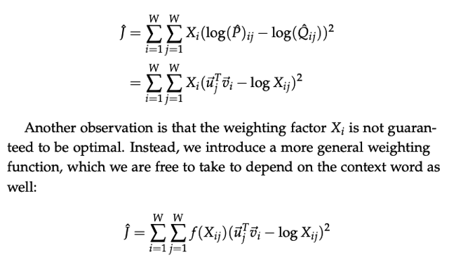</kbd></p>

> [!NOTE]
> Thế thì nó ra vầy, và **vì đã square lên nên đổi chỗ hai thằng** không sao
> Và vì **log Q^ij `=` log exp uj.ui `=` uj.ui.** (Như nói ở bên kia, ta đã tạm thời
> không care cái mẫu số nữa rồi nên Q^ij (mà các bài trước ta gọi là
> ```text
> Pij hay P(w_i|w_j) sẽ chỉ là exp(u_wi.v_wj) thôi)
> ```
>
> Và cuối cùng đó là người ta nói nếu để Xi `=` tổng các Xij của hàng i làm
> weight để n**hấn mạnh `/` ưu tiên giảm loss ở các từ thông dụng** thì còn một
> vấn đề không ổn đó là ta **cũng nhấn mạnh vào những từ quá thông dụng** 
> như những từ chung chung the, an, he, she. Thế là người ta **dùng function
> f(Xij) để khống chế trọng số sao cho nó vẫn tăng ảnh hưởng vào loss của
> các từ thông dụng hơn** những từ hiếm **nhưng đừng quá nhấn mạnh các 
> từ quá thông dụng**
>
> Và function f này có thể tùy trường hợp mà áp dụng các công thức khác nhau

<br>

<a id="node-149"></a>

<p align="center"><kbd>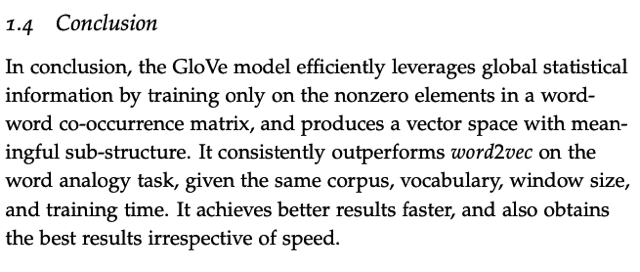</kbd></p>

> [!NOTE]
> Tóm lại cái GloVe model **vừa xài các statistical information** từ Có
> và dùng nó trong cách train ra word vector bằng probabilistic model
> giúp khắc phục các nhược điểm của cả hai phương pháp.
>
> Performance của nó tốt hơn của Word2Vec model khác như SkipGram
> CBOW

<br>

<a id="node-150"></a>

<p align="center"><kbd>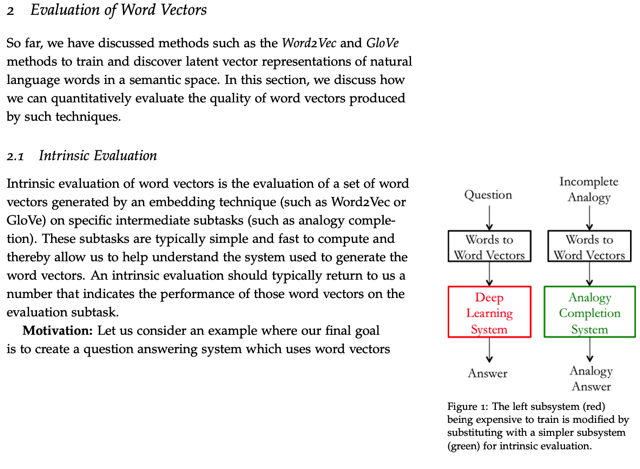</kbd></p>

<br>

<a id="node-151"></a>

<p align="center"><kbd>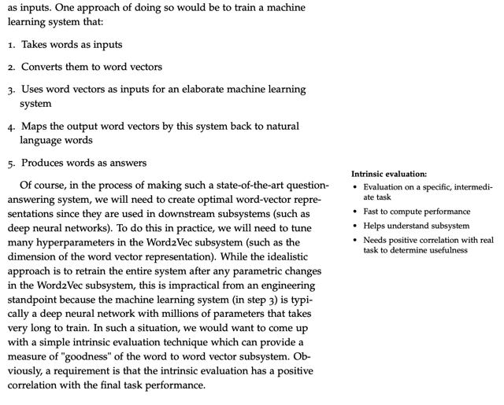</kbd></p>

> [!NOTE]
> Đại khái là nếu muốn check chất lượng của các word vector một
> cách dựa vào kết quả cuối, trong đó ta đưa nó vào, sử dụng nó
> trong một hệ thống học máy để làm một tác vụ nào đó như Q&A
>
> Thế thì vấn đề là khi đó ta phải cơ bản là `hyper-param` tuning các
> h.p như word dimension trong hệ thống lớn này luôn thì mới hiệu quả
> nhưng việc training một mô hình từ đến cuối vậy rất lâu và tốn kém
> dẫn đến việc này sẽ không khả thi.

<br>

<a id="node-152"></a>

<p align="center"><kbd>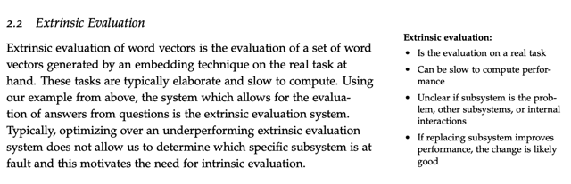</kbd></p>

> [!NOTE]
> Thứ hai nữa là vì sử dụng trong hệ thống lớn có thể liên quan nhiều bộ
> phận khác cũng sẽ khiến việc đánh giá performance của word vector
> khó hơn.
>
> Do đó người ta tìm các tạo các intrinsic evaluation giúp đánh giá vector
> nhanh hơn

<br>

<a id="node-153"></a>

<p align="center"><kbd>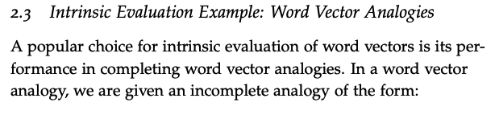</kbd></p>

<br>

<a id="node-154"></a>

<p align="center"><kbd>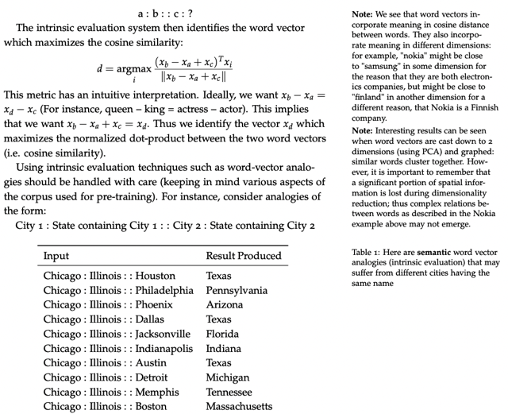</kbd></p>

<br>

<a id="node-155"></a>

<p align="center"><kbd>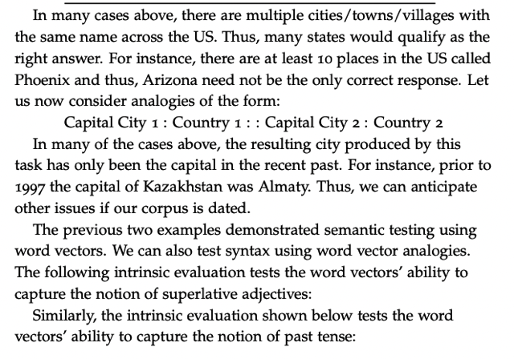</kbd></p>

<br>

<a id="node-156"></a>

<p align="center"><kbd>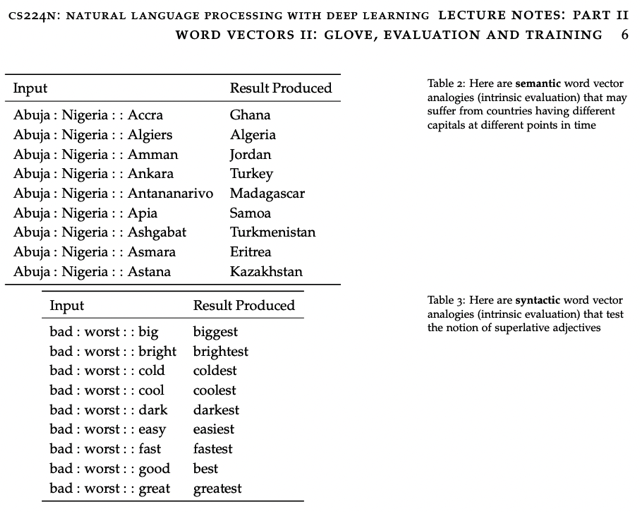</kbd></p>

<br>

<a id="node-157"></a>

<p align="center"><kbd>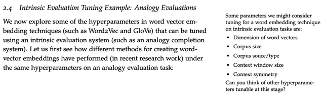</kbd></p>

<br>

<a id="node-158"></a>

<p align="center"><kbd>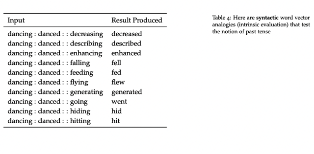</kbd></p>

> [!NOTE]
> kết quả ví dụ về
> Syntactic `-` cú pháp

<br>

<a id="node-159"></a>

<p align="center"><kbd>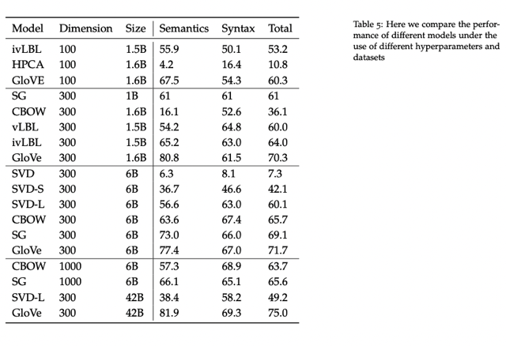</kbd></p>

> [!NOTE]
> So sách các model với
> các hp khác nhau

<br>

<a id="node-160"></a>

<p align="center"><kbd>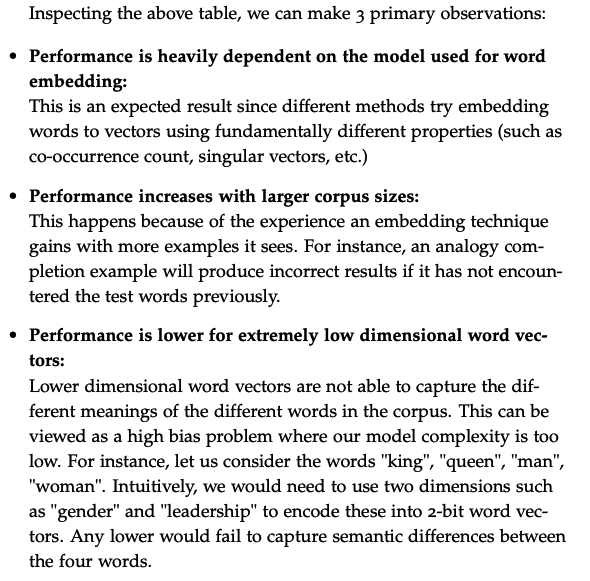</kbd></p>

> [!NOTE]
> 3 nhận xét, một là các model khác nhau thì performance cũng
> khác, điều này là dễ hiểu vì mỗi cái có một cách làm
>
> Thứ hai là khi corpus càng lớn thì performance càng tốt, điều 
> này cũng dễ hiểu
>
> Thứ ba là nếu dimension vector nhỏ quá thì cũng không tốt
> đại khái là giống như vấn đề bias dùng model đơn giản quá 
> cho bài toán phức tạp sẽ khiến không đủ sức để nắm bắt 
> quy luật

<br>

<a id="node-161"></a>

<p align="center"><kbd>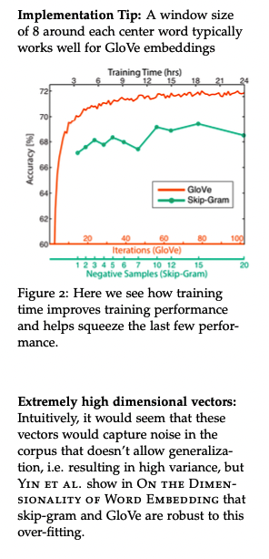</kbd></p>

> [!NOTE]
> biểu đồ này cho thấy training time sẽ
> giúp cải thiện performance

<br>

<a id="node-162"></a>

<p align="center"><kbd>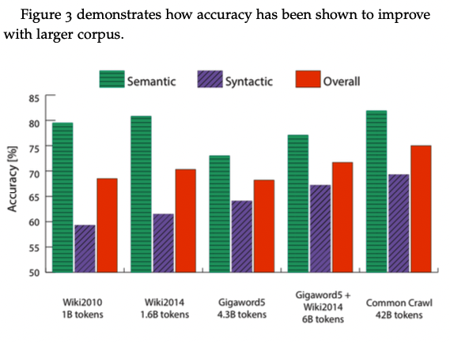</kbd></p>

> [!NOTE]
> Corpus lớn khiến
> performance tăng

<br>

<a id="node-163"></a>

<p align="center"><kbd>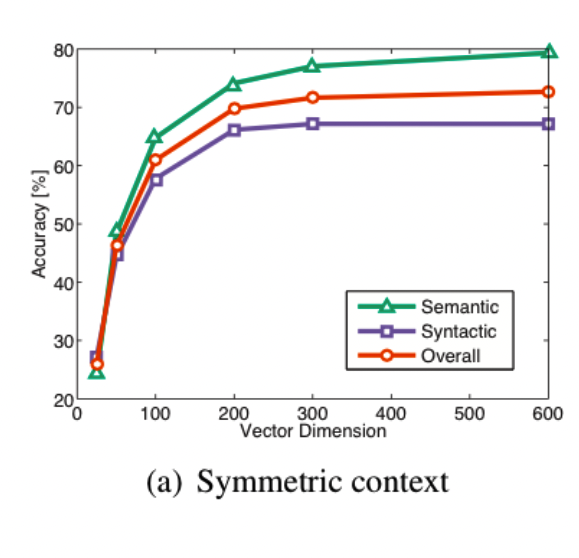</kbd></p>

> [!NOTE]
> Cho thấy dimension vector tầm 300 là ok, cao hơn nữa
> cũng không tăng thêm mấy nhưng sẽ gây tốn kém tính toán

<br>

<a id="node-164"></a>

<p align="center"><kbd>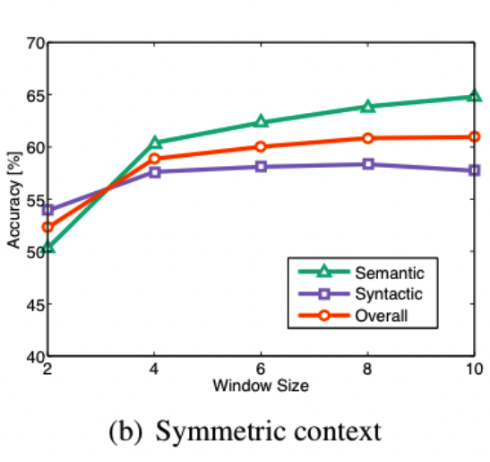</kbd></p>

> [!NOTE]
> Window size tầm 8 là ổn

<br>

<a id="node-165"></a>

<p align="center"><kbd>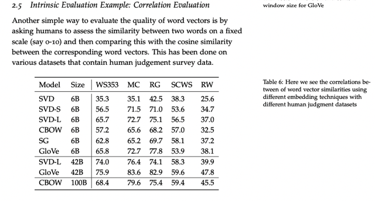</kbd></p>

> [!NOTE]
> 1 cách khác là dùng
> human để đánh giá

<br>

<a id="node-166"></a>

<p align="center"><kbd>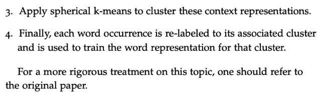</kbd></p>

<p align="center"><kbd></kbd></p>

<p align="center"><kbd>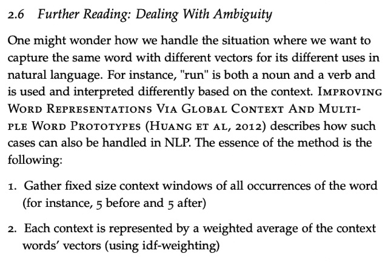</kbd></p>

<br>

<a id="node-167"></a>

<p align="center"><kbd>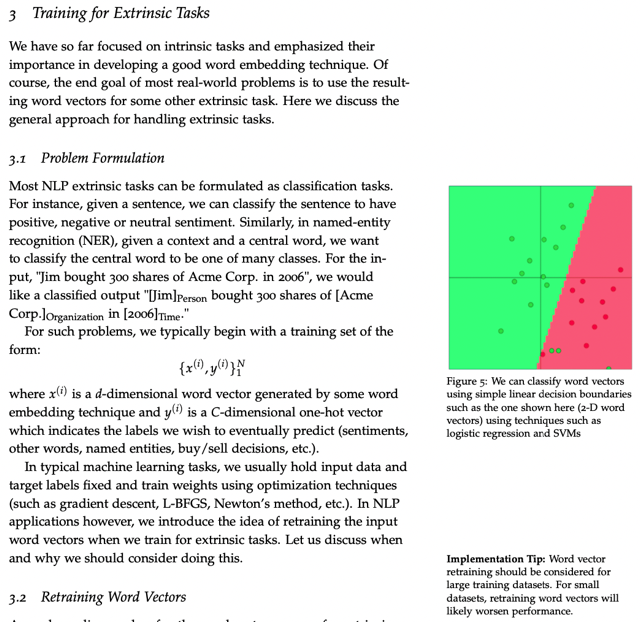</kbd></p>

> [!NOTE]
> Đại khái là nói về extrinsic task trong đó ta sẽ dùng các nhiệm vụ cuối để
> đánh giá model. Nhưng ở đây là nói về một cái mà mình cũng từng để ý
> đó là thông qua việc training một vấn đề cuối (mang tính ứng dụng) là
> giúp tạo ra hoặc cải thiện bộ word vector.
>
> Ví dụ người ta sẽ xây dựng model cho task classification cụ thể như là
> NER hay sentiment analysis, với labeled dataset. Để rồi không như các 
> mô hình học máy điển hình khác trong đó ta giữ training set fixed, và chỉ
> Thay đổi weights trong quá trình training. Còn ở đây nó sẽ `re-train` input
> word vector bên cạnh train bộ params

<br>

<a id="node-168"></a>

<p align="center"><kbd>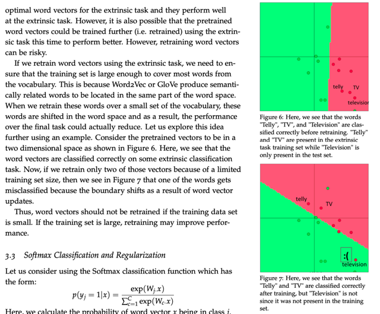</kbd></p>

> [!NOTE]
> Tuy nhiên có chú ý quan trọng đó là nếu sử dụng bộ `pre-train` word vector
> (ví dụ như từ SkipGram hay GloVe) và `re-train` trong một mô hình với
> extrinsic task như vậy thì phải đảm bảo dataset phải đủ lớn nếu không thì
> ta sẽ làm hư bộ word vector. Lí do là vì word vector `pre-train` với large corpus
> thì nó phản ánh phân phối xác suất ước lượng của từ vựng (xuất hiện bên cạnh
> nhau)
>
> Tuy nhiên nếu retrain lại với small dataset `-` trong đó phân phối xác suất không
> đúng (do ít data quá không mang tính đại diện) có thể làm thay đổi word vector.

<br>

<a id="node-169"></a>

<p align="center"><kbd>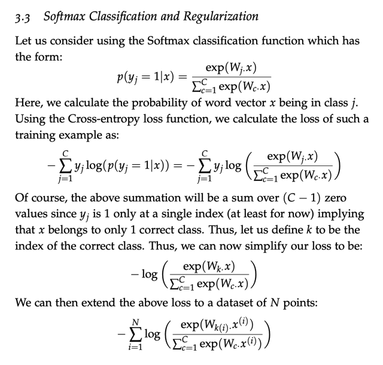</kbd></p>

> [!NOTE]
> Không có gì khó hiểu, đây là nói về việc tính xác suất input x `là/thuộc` 
> một class trong C class (hay viết theo kiểu khác là xác suất giá trị tại j 
> trong C giá trị của vector y là 1) sẽ dùng hàm softmax với input là logit
> là score tính từ phép dot product của vector hàng thứ j trong matrix W
> và vector x (cái này là linear classifier như đã học ở tuần 1 bên CS231N)
>
> Thế thì loss sẽ dùng cross entropy loss: SUM y*log(y^) và vì y là `one-hot`
> vector, nên công thức có thể viết thành `-` log y^[k] với k là index của class
> đúng.
>
> Và tính loss cho mọi datapoint ta sẽ có loss function, trong đó người ta
> dùng k(i) ý là function tính ra index của correct class của data sample x(i)

<br>

<a id="node-170"></a>

<p align="center"><kbd>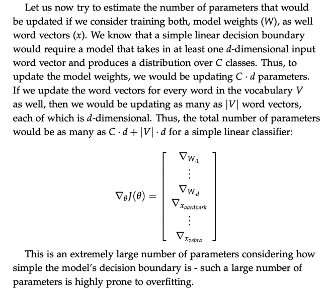</kbd></p>

> [!NOTE]
> Đại khái là với một simple linear classifier như này với chỉ matrix W và b
> (hay viết gộp là W khi cho b thành 1 cột của W luôn) thì ta sẽ có số
> params của model là Cxd vì W có shape là C hàng, mỗi hàng như bên
> CS224 đã học là một linear classifier cho một class. Vã d là số cột chính
> là số feature cũng là embedding vector dimension. (tức input là word vector)
>
> Rồi như đã nói ở đây ta cũng `re-train` lại word vector, thành ra với |V| từ, mỗi từ
> là `d-dimension` vector thì có |V|*d params phải retrain.
>
> CỘng lại ta có C*d `+` |V|*d params là rất lớn, thì họ nói với số params nhiều
> vậy thì model rất dễ bị overfit

<br>

<a id="node-171"></a>

<p align="center"><kbd>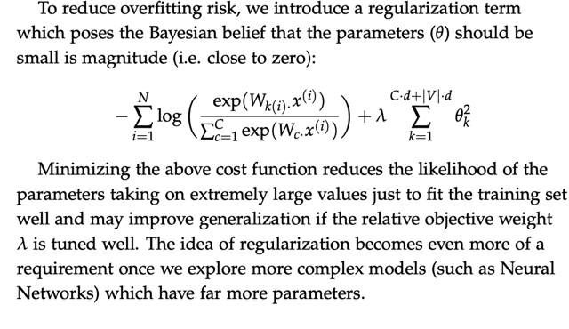</kbd></p>

> [!NOTE]
> Thành ra có thể dùng regularization để giảm overfit Ở đây họ nói một ý
> mà bên Cs231 ko nói đó là 'theo Bayesian" thì params mà nhỏ thì tốt
> hơn. Trong công thức này không có gì lạ, như bên cs231 đã học, 
> họ dùng L2 regularization `-` đó là add reg term vào loss, trong đó tính sum
>  square mọi params . Tham số hp lambda phải h.p tuning

<br>

<a id="node-172"></a>

<p align="center"><kbd>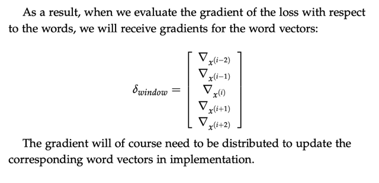</kbd></p>

<p align="center"><kbd></kbd></p>

<p align="center"><kbd>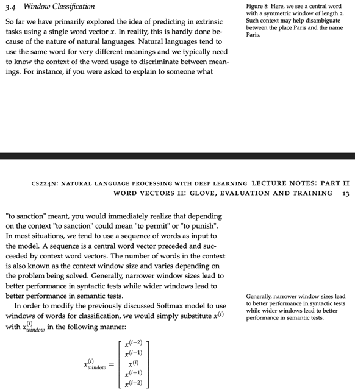</kbd></p>

> [!NOTE]
> Đại khái ý tưởng là việc dùng single word cho training không thực tế
> lắm khi thực sự thì bối cảnh (context) của từ cũng đóng vai trò quan
> trọng trong việc xác định meaning cuả nó
>
> Nên ý tưởng ở đây là họ sẽ dùng một input là array cụm word vector
> bao gồm cả center word và vài context word gọi là window classification

> [!NOTE]
> Để rồi khi tính derivative của loss ư.r. t vector các từ trong
> cụm này và dùng nó để update word vector của chúng

<br>

<a id="node-173"></a>

<p align="center"><kbd>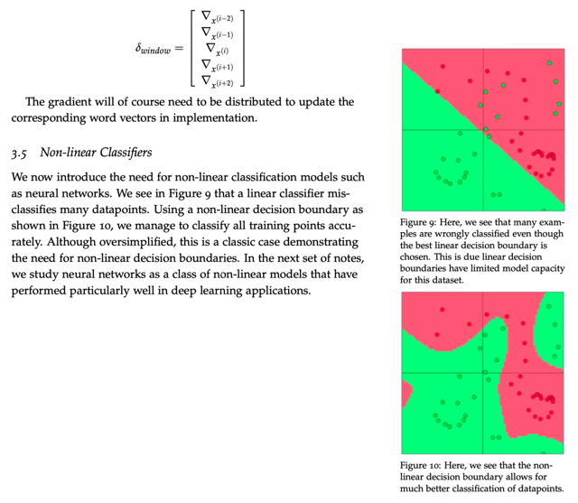</kbd></p>

> [!NOTE]
> Giới thiệu qua `non-linear`
> classifier như NN

<br>

