# Lecture Note : Introductiont O Word2vec

📊 **Progress:** `18` Notes | `30` Screenshots

---

## 1.2**Language and machines**

> [!NOTE]
> 1.2**Language and machines**
>
> Human children, interacting with a rich multi-modality world and various
> forms of feedback, acquire language with exceptional sample efficiency (not
> observing that much language) and compute efficiency (brains are efficient
> computing machines!) With all the (impressive!) advances in NLP in the last
> decades, we are still nowhere close to developing learning machines that
> have a fraction of acquisition ability of children. One fundamental (and still
> quite open) problem in building language-learning machines is the question
> of representation; how should we represent language in a computer such
> that the computer can robustly process and/or generate it? This is where this
> course focuses on the tools provided by deep learning, a highly effective
> toolkit for representing both the wild variety of natural language and some of
> the rules and structures it sometimes adheres to. Much of this course will be
> dedicated to this question of representation, and the rest of this note will talk
> about a basic subquestion: how do we represent words? Before that,
> though, let’s briefly discuss some of the applications you can hope to build
> after learning modern NLP techniques.

> [!NOTE]
> Đại khái là câu hỏi đâu tiên là làm sao để
> representation word (trong máy tính)

 

### 1.3 A few uses of NLP

> [!NOTE]
> 1.3 A few uses of NLP
> Natural language processing algorithms are increasingly useful
> and deployed, but their failures and limitations are still largely
> opaque and sometimes hard to detect. Here are a few of the major
> applications; this list is intended to pique your interest, not to be
> exhaustive:
>
> **Machine translation**. Perhaps one of the earliest and most successful
> applications and driving uses of natural language processing, MT
> systems learn to translate between languages and are ubiquitous
> in the digital world. Still, failures of these systems for most of the
> world’s 7000 languages, difficulties in translating long text, and
> ensuring contextual correctness of translations make this still a
> fruitful field of research
>
> **Question answering** and**information retrieval.** The concept of “question
> answering” should seem overly broad—can’t we express any
> problem as question answering?—but in NLP, question answering
> has tended to be related to information-seeking questions (“Who is
> the emir of Abu Dhabi?”, “What is the process by which I can get
> an intern visa for the United Kingdom?”). Continually broadening
> the scope of answerable questions, providing provenance for
> answers, answering questions in an interactive dialogue—this is
> one of the fastest-evolving research directions.

> [!NOTE]
> Một số ứng dụng tiềm
> năng của NLP

 

- **Summarization and analysis of text**. There are myriad reasons to want to understand (1) what people are talking about and (2) what they think about those things. Companies want to do market research, politicians want to know peoples’ opinions, individuals want summaries of complex topics in digestible form. NLP tools can be powerful for both the increase of access to information to the public, as well as surveillance, corporate or governmental. Bear this aspect of “dual use” in mind as you progress and decide what you are building.  Note: speech(or sign)-to-text. The process of automatic transcription of spoken or signed language (audio or video) to textual representations is a  massive and useful application, but one we’ll largely avoid in this course.  Partly, this is historical and methodological; the raw signal processing methods and expertise are generally covered in other courses (224s!) and other research communities, though there has been some convergence of techniques of late.
   

  
  - In all aspects of NLP, most existing tools work for precious few (usually one, maybe up to 100) of the world’s roughly 7000 languages, and fail disproportionately much on lesser-spoken and/or marginalized dialects, accents, and more. Beyond this, recent successes in building better systems have far outstripped our ability to characterize and audit these systems. Biases encoded in text, from race to gender to religion and more, are reflected and often amplified by NLP systems. With these challenges and considerations in mind, but with the desire to do good science and build trustworthy systems that improve peoples’ lives, let’s take a look at a fascinating first problem in NLP.
    > [!NOTE]
    > Đề cập đến những hạn chế hiện tại
    > như chưa cover hết tất cả các human
    > language, định kiến ...

     

    
    - **2 Representing words**  **2.1 Signifier and signified** Consider the sentence  Zuko makes the **tea** for his uncle. Zuko like to makes the **tea** for his uncle.  The word Zuko is a sign, a symbol that represents an entity Zuko in some (real of imagined) world. The word tea is also a symbol that refers to a signified thing—perhaps a specific instance of tea. If one were instead to say Zuko likes to make tea for his uncle, note that the symbol Zuko still refers to Zuko, but now tea refers to a broader class—tea in general, not a specific bit of hot delicious water. Consider the two following sentences:  Zuko makes the coffee for his uncle.  Zuko makes the drink for his uncle.  Which is “more like” the sentence about tea? The drink may be tea (or it may be quite different!) and coffee definitely isn’t tea, but is yet similar, no? And is Zuko similar to uncle because they both describe people? And is the similar to his because they both pick out specific instances of a class?  Word meaning is endlessly complex, deriving from humans’ goals of communicating with each other and achieving goals in the world. People use continuous media—speech, signing—but produce signs in a discrete, symbolic structure—language—to express complex meanings. Expressing and processing the nuance and wildness of language—while achieving the strong transfer of information that  language is intended to achieve—makes r**epresenting words** an **endlessly fascinating problem**. Let’s move to some methods.
      > [!NOTE]
      > Đại khái là nói về **sự phức tạp của ngôn ngữ**và một ví dụ
      > nhỏ là khi trong hai câu chữ tea có thể mang hai nghĩa
      > khác nhau: Một là 1 tách trà cụ thể, 1 là nói về trà chung
      > chung.
      >
      > Zuko đang pha trà cho chú
      > Zuko thích pha trà cho chú
      >
      > Từ đó đặt vấn đề **word representation** - làm sao represent
      > word mà phản ánh được các thông tin ngữ nghĩa khác
      > nhau trong từng hoàn cảnh cụ thể như vậy

       

      
      - What is a word? I cannot define a word for you, but I can give some examples in English: tea, coffee, abbreviate, gumption. The word antiradate I hereby define to mean the action of looking wistfully at an inedible decoration, wishing it were as tasty as it looked. If I use this sign to communicate with others my longing, that’s good enough to me to be a word.  Perhaps the simplest way to represent words is as independent, unrelated entities. You might think of this as a set,  {. . . , tea, . . . , coffee, . . . , antiridate}.  Here let’s introduce a bit of terminology. We will refer to a word type as an element of a finite vocabulary, independent of actually observing the word in context. So, we’ve just written a set of types. A word token is an instance of the type, e.g., observed in some context. A (word) type is an element of a vocabulary; a word in abstract. A (word) token is an instance of a type in context.  Our word representations right now provides a single representation for each word type, and we might use that same representation for any occurence of the word token in context. We will often be working with vectors in this course; the conventional vector representation of independent components is the set of 1-hot, or standard basis, vectors. Thus, maybe
        
<kbd>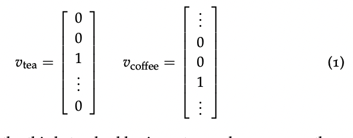</kbd>

        
<kbd>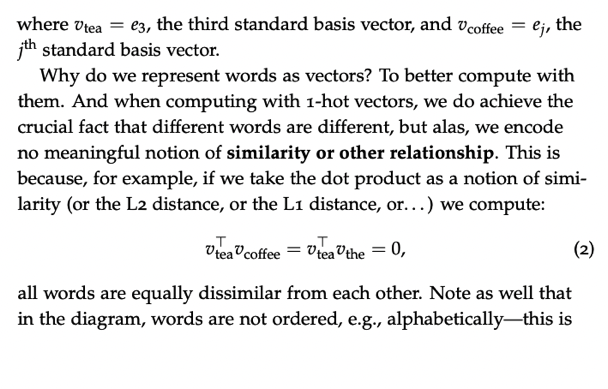</kbd>

        
<kbd>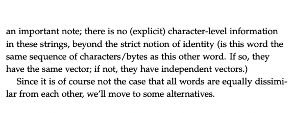</kbd>

        
<kbd></kbd>

        
<kbd></kbd>

        
<kbd></kbd>

        > [!NOTE]
        > Cách đầu tiên để represent là **one-hot vector**, tại sao, đơn giản
        > là để đạt được: **mỗi từ mỗi khác nhau**, **mỗi từ được represent
        > theo một cách (vector) riêng biệt**.
        >
        > Nhưng**hạn chế là nó chỉ làm được có vậy**, hoàn toàn **không
        > chứa những ý nghĩa nào** như từ này thì gần nghĩa với từ  kia
        > hơn, khác nghĩa với từ nọ hơn ,..vì nếu dùng các cách thông
        > thường để tính **độ giống nhau của hai vector như dot product,
        > l1, l2 distance thì từ nào cũng (có độ khác với những từ khác) y
        > như nhau**

         

        
        - Should we represent word semantics not as one-hot vectors, but instead as a collection of features and relationships to linguistic categories and other words?  For any word, say runners, there is a wealth of information we can annotate about that word. There is grammatical information, like plurality, there’s derivational information, like how the runners is something like the verb to run plus a notion of “doer”, or agent (think one who runs.) There’s also semantic information, like how runners might be a hyponym of humans, or animals, or entities. (A hyponym is a member of an is-a relationship; e.g., a runner is a human.)  There are substantial existing resources in English and a few other languages for various kinds of annotated information about words. WordNet [Miller, 1995] annotates for synonyms, hyponyms, and other semantic relations; UniMorph [Batsuren et al., 2022] annotates for morphology (subword structure) information across many languages. With such resources, one could build word vectors that look something like In 2023, word vectors resulting from these methods are not the norm, and they won’t be the focus of this course. One main failure is that human-annotated resources are always lacking in vocabulary compared to methods that can draw a vocabulary from a naturally occuring text source—updating these resources is costly and they’re always incomplete. Another failure is a tradeoff between dimensionality and utility of the embedding—it takes a very high-dimensional vector (think much larger than the vocabulary size) to represent all of these categories, and modern neural methods that tend to operate on dense vectors do not behave well with such vectors. Finally, a continual theme we’ll see in this course is that human ideas of what the right representations should be for text tend to underperform methods that allow data to determine more aspects—at least when one has a lot of data to learn from.
          
<kbd>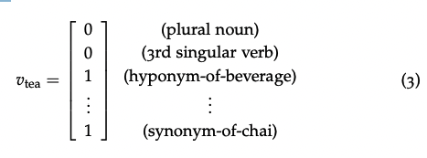</kbd>

          
<kbd></kbd>

          > [!NOTE]
          > Cách thứ hai đại khái nôm na là ta sẽ làm bằng
          > tay, đánh dấu bằng tay các "thể loại" của một từ
          >
          > Như nó là từ số nhiều phải không -> đánh 1 ở vị trí 1
          > nó là từ có ý nghĩa abc -> đánh 1 ở vị trí i....
          >
          > Nói chung là ta, human phải quyết định gán các ý nghĩa
          > ngữ nghĩa cho một từ.
          >
          > Và cách này có những nhược điểm nên không được dùng
          > rộng rãi:
          >
          > 1. Là rất tốn kém và chắc chắn không đầy đủ: Vì ngôn ngữ
          > rất phức tạp, dù có cố gắng mấy thì cũng khó lòng mà liệt
          > kê được đầy đủ những ngữ nghĩa, thể loại của từ vựng 
          >
          > 2. Là nếu mà làm cách này thì chiều dài một vector có thể
          > dài hơn cả vocab size và các neural network không hoạt
          > động tốt với các vector kiểu này.
          >
          > 3. Là để máy tính tự tìm ra các abstract meaning của từ 
          > thì tốt hơn là con người.
          >
          > 4. Là với cách này thì không đủ nguồn lực để làm, không tận 
          > dụng được các nguồn unlabeled data khổng lồ trên mạng

           

          
          - **3 Distributional semantics and Word2vec** A promise of deep learning is to learn rich representations of complex objects from data. Increasingly relevant in NLP is the idea that we can unsupervisedly learn rich representations from data. Unsupervised (or lately, “self-supervised”) learning takes data and attempts to learn learn properties of the elements of that data, often by taking part of the data (maybe a word in a sentence) and attempting to predict other parts of the data (other words) with it. In language, this idea was captured well years ago by Firth [Firth, 1957], who famously said **You shall know a word by the company it keeps.**  At a high level, you can think of the distribution of words that show up around the word tea as a way to define the meaning that word. **So, tea shows up around drank, the, pot, kettle, bag, delicious, oolong, hot, steam,. . . , It should become clear that words similar to tea (like coffee) will have similar distributions of surrounding words**. While simple, this is one of the most influential and successful ideas in all of modern NLP, and analogues of it have taken hold in myriad learning-related fields. The distributional hypothsis: the meaning of a word can be derived from the distribution of contexts in which it appears.  That’s the high level. But as always, the details matter. What does it mean for a word to be near another word? (Right next to it? Two away? In the same document?) How does one represent this encoding, and learn it? Let’s go through some options.
            > [!NOTE]
            > Nói về**một nhận định quan trọng bậc nhất trong NLP** đó là
            > **một từ sẽ có ý nghĩa được xác định bởi những từ vây quanh nó**
            > gọi là **distribution hypothesis**
            >
            > Ví dụ như tea sẽ là "đun" "tách" "nóng", "ô long", "pha"....và từ đó
            > sẽ thấy "Café" cũng sẽ có nghĩa gần với trà vì nó cũng thường
            > được vậy quanh bởi các từ này

             

              
              
<kbd>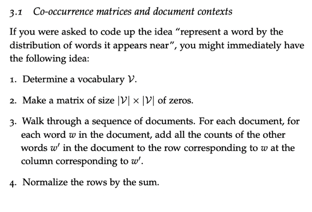</kbd>

              > [!NOTE]
              > Cách đầu tiên đại khái là giả sử có 10000 từ (vocab size). Ta mới tạo một
              > matrix 10000x10000. Và mỗi hàng sẽ là vector của một từ, và 10000 Item của
              > hàng đó, sẽ là số lần xuất hiện của 10000 từ trong vocab GẦN nó và gần ở
              > đây có thể dùng phương án đơn giản là TRONG CÙNG document.
              >
              > Thế là ta sẽ lần lượt với mỗi từ, đến số lần những từ khác kể cả nó xuất hiện
              > cùng document với nó. Và matrix đó gọi là **document-level co-occurrence
              > matrix**
              >
              > Và ta sẽ được word embedding của các từ (là các row của matrix). Có thể
              > normalize bằng cách chia đi cho tổng.
              >
              > Thì đại khái ta sẽ được một vector tốt hơn nhiều so với one-hot vector (cả hai
              > đều 10000 unit R |V|)

               

              
              
<kbd>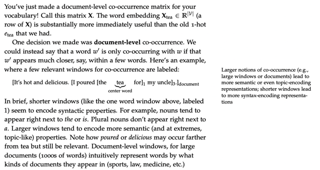</kbd>

              > [!NOTE]
              > Đại khái là **mức độ xa** (như trong cùng document) gần (cách hai ba
              > thậm chí một từ) sẽ **phản ánh các ý nghĩa khác nhau**.
              >
              > Như gần thì là **quan hệ cú pháp (syntactic)**, như "the" thì theo sau là
              > danh từ,
              >
              > xa hơn một chút thì sẽ có **quan hệ ngữ nghĩa (semantic)** như " pha"
              > và "trà",
              >
              > và xa hơn nữa trong phạm vi document thì là **quan hệ topic-encoding**
              > như trà là đồ uống, là ẩm thực. ...

               

            
            - Another design decision we made was to represent explicit counts of words in |V|-sized vectors. This ends up being a **big mistake.** We’ve already stated that**high-dimensional vectors tend to be unwieldy** in today’s neural systems. But another issue is that raw counts of words end up **over-emphasizing the importance of very common words like "the"**. Taking the **log token frequency** ends up being much more useful.  A very influential paper on word representation taught us much more about what is wrong with the raw co-occurrence method by introducing **GloVe** (Pennington et al., 2014) a **co-occurence-based word representation algorithm** that works **as well as** **word2vec**, the method we’ll introduce in the next section. However, many of the details of word2vec will hold true in methods that we’ll proceed to further in the course, so we’ll focus our time on that.
              > [!NOTE]
              > Tuy nhiên cách này sẽ có hai nhược điểm là:  Thứ nhất lại
              > là **quá lớn (high dimensions)** sẽ không hiểu quả trong nlp
              >
              > Thứ hai là nó **đánh giá quá cao những từ như "the".**
              >
              > Dẫn đến là việc dùng **log token frequency** tức là thay vì tính
              > frequency (tần suất xuất hiện) thì tính log của nó sẽ hiệu
              > quả hơn.
              >
              > Và **GloVe** ra đời khắc phục những nhược điểm này

               

                
                
<kbd>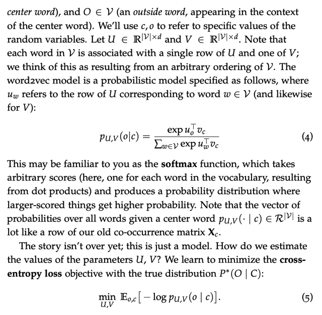</kbd>

                
<kbd>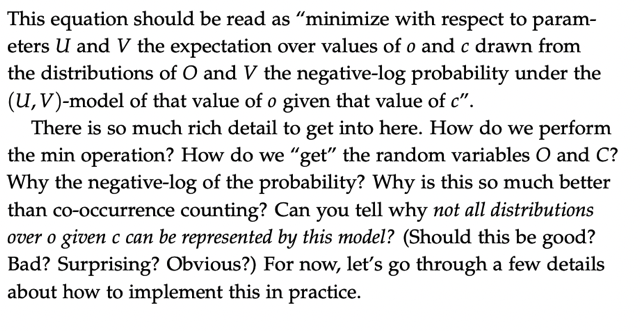</kbd>

                
<kbd></kbd>

                
<kbd></kbd>

                
<kbd>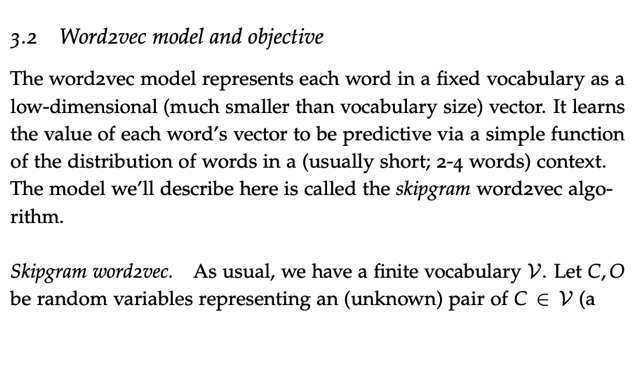</kbd>

                > [!NOTE]
                > Thì qua đây mới nói sơ sơ cách làm: Đó là chuẩn bị hai matrix U, V đều
                > có shape là 10000 (V) x D trong đó d là chiều dài vector embedding.
                >
                > Mỗi row tương ứng vị trí của hai matrix này sẽ là embedding vector của
                > một từ (trong 10000 từ) khi nó lần lượt đóng vai center word và outer
                > (context) word.
                >
                > Để rồi xây dựng công thức p U,V (o|c) với o, c là một cặp từ cụ thể
                > trong vocab sao cho o xuất hiện trong context của c. Công thức này ta
                > sẽ P U,V (o|c) mang ý nghĩa toán học là với random variable o,v lấy
                > trong bộ vocab từ đó các word vector u0 và vc cho hai từ này lấy từ U,V
                > thì ta sẽ tính xác suất mà từ o xuất hiện khi đã có c là bao nhiêu.
                >
                > Và công thức sẽ là đầu tiên ta tính độ giống nhau giữa chúng bằng
                > phép dot product u0_T.vc. Sau đó đưa vào softmax (với mẫu số là tính
                > tổng độ giống nhau của c với tất cả các từ khác trong vocab cũng tính
                > bằng dot product của vc với những từ đó uw w thuộc V, rồi cộng lại hết)
                >
                > Kết qủa ta sẽ có chỉ số xác suất từ o xuất hiện khi có v.
                >
                > Và ý nghĩa của việc dùng softmax đó là nếu từ o và c càng giống nhau,
                > thì xác suất này càng cao.
                >
                > Và nếu tính p U,V (w|c) cho mọi w trong V để tạo thành một row dài
                > 10000 thì ổng nói nó rất giống row vector ứng với c trong co-occurrence
                > matrix X  hồi nãy (trong đó mỗi unit là tần suất xuất hiện của từ w trong
                > cùng document với c)
                >
                > ====
                >
                > Tiếp theo để train ra U,V (từ đó có (2) embedding vector cho mỗi từ, và
                > như hồi nãy nói có thể average để thành embedding vector của một từ)
                > thì ta có thể đặt loss objective (function) là:
                >
                > **minimize w.r.t param U,V Expectation với o, c lấy từ distribution O, V,
                > giá trị là negative log probability của việc o xuất hiện khi đã có c**
                > Nói nôm na là bây giờ thay đổi giá trị của U, V sao đó, để cho với mọi từ
                > c trong vocab và o là từ ở gần nó thì phải giảm thiểu - log p(o|c)

                 

                
                
<kbd>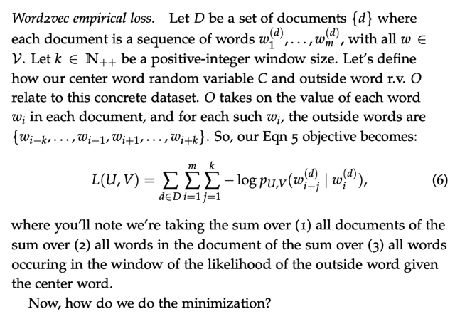</kbd>

                
<kbd></kbd>

                
<kbd>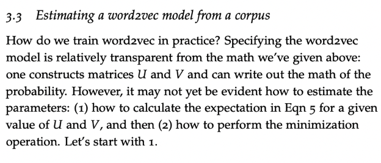</kbd>

                > [!NOTE]
                > Đây, triển khai ra cụ thể thì công thức trên là như sau:
                >
                > Với một từ, giả sử là **wi**, là **từ thứ i trong document**, thì ta sẽ 
                > một từ **w i-j** nào đó **trong khoảng k từ gần đó**, ta sẽ tính
                > **-log p(w i-j | w i)**. Và v**ới mọi từ context của w_j**ta tính p như vậy
                > và **cộng lại.**
                > Rồi **với mọi từ wi trong document** ta đều làm vậy và**cộng lại.**
                >
                > Rồi với **mọi document**, ta đều làm vậy và **cộng hết lại.**
                >
                > Thì ta được L(U,V) theo công thức này gọi là **empirical loss.**

                 

                
                
<kbd>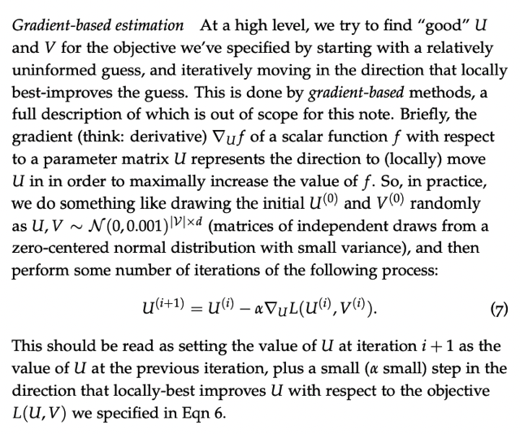</kbd>

                > [!NOTE]
                > Đại khái là nói là ta sẽ train /tìm U V bằng phương pháp dựa vào
                > gradient. (**gradient-based method**) thì như mình cũng đã biết đó là ta
                > sẽ **tính partial derivative of Loss function L(U,V)** **with respect to U**.
                >
                > Để rồi một cách **iteratively** (làm đi làm lại nhiều lần), ta **update U
                > bằng cách trừ đi U với derivative nhân một hệ số gọi là learning rate.**
                >
                > Ở đây có nhắc lại khái niệm gradient cũng đáng nhắc đến đó là:**derivative của hàm f w.r.t matrix U** sẽ đại diện / represent cho **cái
                > hướng (direction) để thay đổi U**  mà **nếu đi theo đó sẽ giúp dịch
                > chuyển U theo cách tăng dần hàm f.** Đồng nghĩa nếu đi theo hướng
                > ngược lại thì sẽ giảm dần hàm f.
                >
                > Tiếp họ nói U (V cũng tương tự) sẽ được **initialize randomly** với
                > **Normal** **distribution với zero mean và standard deviation nhỏ** kí hiệu
                > là
                >
                > **U ~ N (0,0.0001) |V|xd**

                 

                
                
<kbd>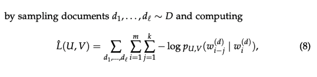</kbd>

                
<kbd></kbd>

                
<kbd>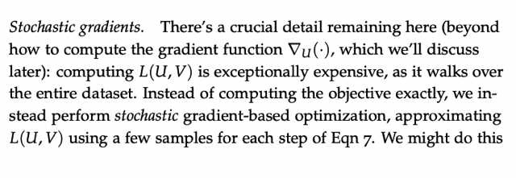</kbd>

                > [!NOTE]
                > Đại khái là để tính L như công thức mới nói vừa rồi yêu cầu phải
                > tính cho toàn bộ document là rất lớn, rất expensive trong tính toán
                >
                > Do đó mới dùng (sampling) một phần của D thôi để tính "
                > approximate" L(U,V) thôi. Gọi là stochastic gradient-based
                > optimization.
                >
                > Cũng tương tự như stochastic gradient descent khi ta không Dùng
                > toàn bộ m training sample mà chỉ dùng mỗi cái 1 lần vật

                 

                
                
<kbd>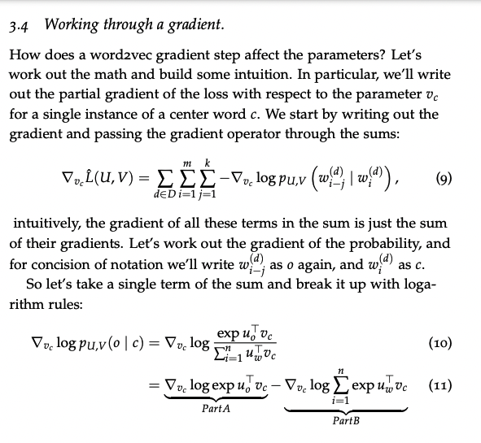</kbd>

                 

                
                
<kbd>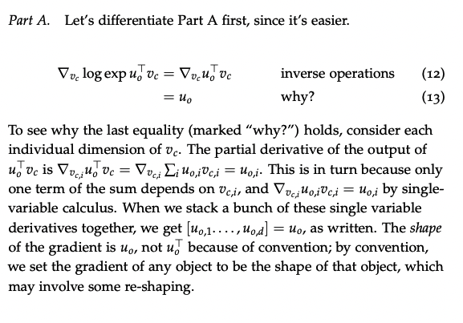</kbd>

                > [!NOTE]
                > Như trong bài giảng đã nói và note, để dùng gradient based method để
                > update U,V  thì ta cần tính p**artial derivate of (mà kí hiệu là hình tam
                > giác ngược) L(U,V) w.r.t U** (và V cũng tương tự)
                >
                > Thì như đã nói và giải thích trong note trong bài, việc **hàm f(x) = f_1(x)+f_2(x)**
                > = Sum i f_i(x) t**hì  df/dx cũng sẽ bằng df1/dx + df2/dx**. Nên trên cơ sở
                > đó ta có thể**"đưa dấu đạo hàm vào trong" tức là thành "đạo hàm của tổng"
                > bằng "tổng đạo hàm".**
                > Còn lại thì như trong bài đã note, không cần nói lại dài dòng ở đây chỉ muốn
                > nhắc lại là vì ta **đang tính đạo hàm w.r.t vector vc** **có d item vc1, vc2..vcd**
                > nên **cách tính là tính đạo hàm với từng phần tử trong vc và nhóm lại thành
                > vector.**
                >
                > Như ở **part A**, ta cần tính đạo hàm của f (= **u0_T.vc**) đối với vc thì **u0_T.vc thật ra
                > triển khai ra sẽ là (u01*vc1 + u02*vc2 + ...u0d*vcd)**và ta sẽ **tính đạo hàm của hàm f này w.r.t vc1 (chính là ra u01)**
                > rồi **đạo hàm của hàm f này w.r.t vc2 (chính là ra u02).**
                > ....
                > để rồi **kết quả đạo hàm của hàm f này w.r.t VECTOR vc** sẽ là **VECTOR 
                > CỦA CÁC ĐẠO HÀM TỪNG PHẦN TRÊN**
                > = **[u01, u02, ...uod]** mà đó thì chính là vector**u0.**====
                >
                > Cuối cùng ở đây có nói một kiến thức có thể chưa gặp qua là **by convention** / theo
                > thông lệ người ta **quy ước cho shape của gradient bằng với shape của object
                > tức nếu vc là vector cột** thì dL/dvc cũng là vector cột bằng shape (chứ không
                > phải tùy tiện) nên **có thể cần phải reshape nếu cần**

                 

                
                
<kbd>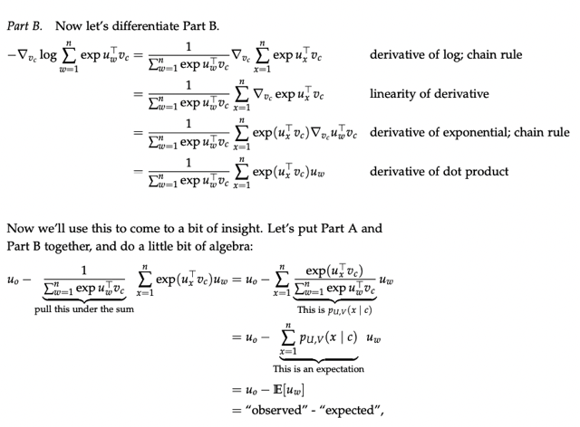</kbd>

                > [!NOTE]
                > Phần này xem lại note
                > trong bài giảng

                 

                
                
<kbd>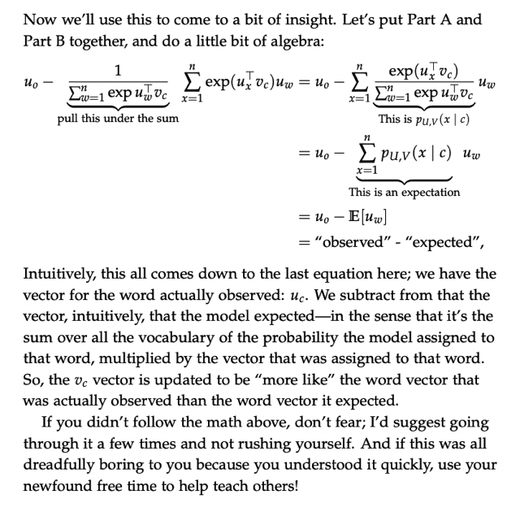</kbd>

                 

                
                
<kbd>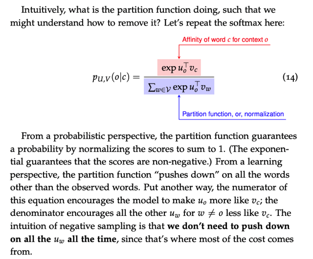</kbd>

                
<kbd></kbd>

                
<kbd>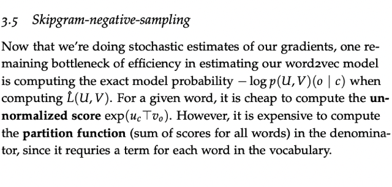</kbd>

                > [!NOTE]
                > Nôm na là vầy: Cái công thức (p(o|c) từ đó xây dựng objective và loss
                > function)  được xây dựng như vậy là **để (trong quá trình training)** model
                > nó sẽ **ép uo trở nên giống vc** (thì **dot product của chúng cao lên, thì p cao
                > lên**) và**ép các từ khác trong toàn bộ vocab w khác mà không phải o phải
                > có dot product với vc nhỏ lại**
                >
                > Thì đại khái là làm vậy thì ok, là chuẩn, **có điều việc tính toán cái mẫu số
                > với toàn bộ vocab thì rất tốn kém** (compute expense). Thành ra người ta
                > **sửa lại một chút, thiết kế lại function sao** cho vẫn giúp ép u0_T.vc lên
                > nhưng chỉ ép một số lượng các từ ư lấy random trong vocab. Thì ý là mỗi
                > lần training iteration thì**"nâng từ cần nâng" lên chút xíu** và**ép random
                > vài từ cần giảm xuống**, thì qua nhiều lần vẫn đạt**hiệu quả tương
                > đương** như khi "**ép toàn bộ các từ trong vocab mỗi lần**"

                 

                
                
<kbd>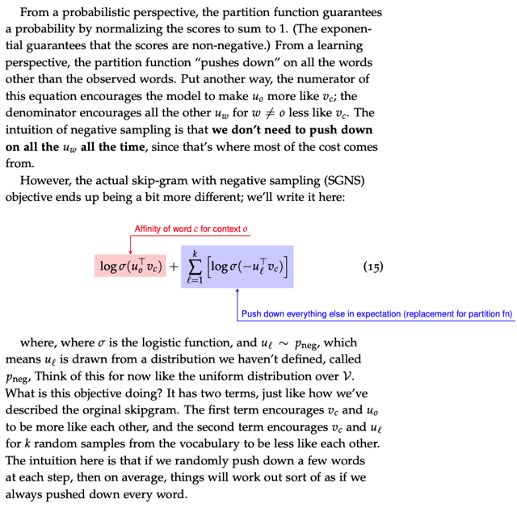</kbd>

                > [!NOTE]
                > Thì đây cũng là cái mà trong NLPSpec và DLSpec có nói
                > đến về việc dùng hàm softmax sao cho giảm chi phí tính
                > toán

                 

